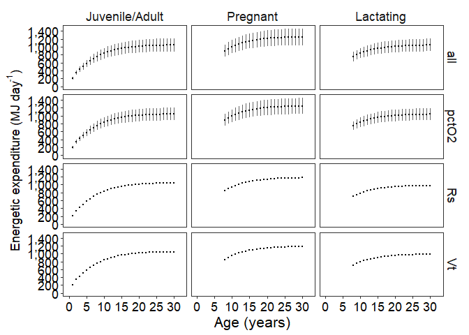

Es_preg_lact_source_bpm
================
S. Agbayani
31 July, 2025

``` r
# Set path for output figures: 
Figurespath <- paste0(getwd(), "/FMR/figures", collapse = NULL)
Figurespath
```

    ## [1] "C:/Users/AgbayaniS/Documents/R/graywhale_energyreqs/FMR/figures"

``` r
# Set path for input & output data  
datapath <- paste0(getwd(), "/data", collapse = NULL) 
datapath
```

    ## [1] "C:/Users/AgbayaniS/Documents/R/graywhale_energyreqs/data"

``` r
# Run Es preg and lact first, then read in data here
Es_preg_table <-  read_csv("data/Es_sensAnalysis_preg_peryear_source_bpm.csv")
```

    ## Rows: 272 Columns: 8
    ## ── Column specification ────────────────────────────────────────────────────────
    ## Delimiter: ","
    ## chr (2): Lifestage, MC_variable
    ## dbl (6): age_yrs, no_days, Es, Es_sd, Es_perday, Es_sd_perday
    ## 
    ## ℹ Use `spec()` to retrieve the full column specification for this data.
    ## ℹ Specify the column types or set `show_col_types = FALSE` to quiet this message.

``` r
Es_lact_table  <-  read_csv("data/Es_sensAnalysis_lact_peryear_source_bpm.csv")
```

    ## Rows: 272 Columns: 8
    ## ── Column specification ────────────────────────────────────────────────────────
    ## Delimiter: ","
    ## chr (2): Lifestage, MC_variable
    ## dbl (6): age_yrs, no_days, Es, Es_sd, Es_perday, Es_sd_perday
    ## 
    ## ℹ Use `spec()` to retrieve the full column specification for this data.
    ## ℹ Specify the column types or set `show_col_types = FALSE` to quiet this message.

``` r
Es_table_phase2_peryear <- read_csv("data/Es_sensAnalysis_phase2_peryear_source_bpm.csv")
```

    ## Rows: 124 Columns: 8
    ## ── Column specification ────────────────────────────────────────────────────────
    ## Delimiter: ","
    ## chr (2): Lifestage, MC_variable
    ## dbl (6): age_yrs, no_days, Es, Es_sd, Es_perday, Es_sd_perday
    ## 
    ## ℹ Use `spec()` to retrieve the full column specification for this data.
    ## ℹ Specify the column types or set `show_col_types = FALSE` to quiet this message.

``` r
#Limit tibbles to 30 yrs
Es_lact_table_max30 <-   Es_lact_table %>% dplyr::filter(age_yrs <= 30)
Es_preg_table_max30 <-   Es_preg_table %>% dplyr::filter(age_yrs <= 30)

Es_table_alladults_preg_lact_peryear <- Es_table_phase2_peryear %>%
  dplyr::filter(Lifestage == "Juvenile/Adult" & age_yrs >= 1 & age_yrs <= 30)

Es_table_alladults_preg_lact_peryear <- rbind(Es_table_alladults_preg_lact_peryear,
                                              Es_preg_table_max30, 
                                              Es_lact_table_max30)

Es_table_alladults_preg_lact_peryear %>% write_csv("data/Es_table_alladults_preg_lact_peryear_bpm.csv", na = "", append = FALSE)

# apply factors to enable facet wrap 
Es_table_alladults_preg_lact_peryear$Lifestage_f = factor(Es_table_alladults_preg_lact_peryear$Lifestage,
                                                          levels=c('Juvenile/Adult','Pregnant','Lactating'))


# plots  

plot_Es_table_alladults_preg_lact_yearly_perday <- Es_table_alladults_preg_lact_peryear %>% 
  ggplot(aes(x = age_yrs, y =Es_perday)) + #shape = Lifestage
  facet_grid(MC_variable~Lifestage_f)+
  geom_errorbar(aes(x = age_yrs, ymin = Es_perday - Es_sd_perday, ymax = Es_perday + Es_sd_perday),
                colour = 'gray40', width = 0, linetype = 1) +
  # geom_ribbon(aes(x = age_yrs, ymin = Es - Es_sd, ymax = Es + Es_sd),
  #                 fill = 'gray40', alpha = 0.3) +
  geom_point(size =0.5)+
  #geom_line()   +
  xlab("Age (years)") +
  
  ylab(bquote('Energetic expenditure (MJ day'^'-1'*')')) +
  
  scale_x_continuous(breaks = scales::pretty_breaks(n = 10), 
                     limits = c(0, 32)) +  # max x-axis 30 yrs. 
  scale_y_continuous(label = comma, 
                     breaks = scales::pretty_breaks(n = 8),
                     limits = c(0,max(Es_table_alladults_preg_lact_peryear$Es_perday +
                                        Es_table_alladults_preg_lact_peryear$Es_sd_perday)))+
  # scale_y_continuous(label = function(x){(x/1000)}, breaks = scales::pretty_breaks(n = 8),
  #                    limits = c(0, 1000000))+
  
  theme_bw()+
  theme(panel.grid = element_blank())+
  theme(axis.text = element_text(size = rel(1.2),
                                 colour = "black"))+
  theme(axis.title.x = element_text(size = rel(1.4)),
        axis.title.y = element_text(size = rel(1.2)))+
  theme(strip.background =element_rect(fill="transparent", 
                                       colour = "transparent"))+
  theme(strip.text = element_text(size = rel(1.2)))
#theme(legend.position = "none")

plot_Es_table_alladults_preg_lact_yearly_perday
```

<!-- -->

``` r
plot_Es_table_alladults_preg_lact_yearly_perday_black <-  Es_table_alladults_preg_lact_peryear %>% 
  ggplot(aes(x = age_yrs, y =Es_perday)) +
  facet_grid(MC_variable~Lifestage_f)+  
  geom_errorbar(aes(x = age_yrs, ymin = Es_perday - Es_sd_perday, ymax = Es_perday + Es_sd_perday),
                colour = 'gray20', width = 0, linetype = 1, size = 0.5) +
  geom_point(colour = "white", size = 1)+
  xlab("Age (years)") +
  
  ylab(bquote('Energetic expenditure (MJ day'^'-1'*')')) +
  
  scale_x_continuous(breaks = scales::pretty_breaks(n = 10), 
                     limits = c(0, 32)) +  # max x-axis 30 yrs. 
  #scale_y_continuous(label = function(x){(x/1000)}, breaks = scales::pretty_breaks(n = 8))+
  scale_y_continuous(label = comma, breaks = scales::pretty_breaks(n = 8),
                     limits = c(0,max(Es_table_alladults_preg_lact_peryear$Es_perday +
                                        Es_table_alladults_preg_lact_peryear$Es_sd_perday))) +
  
  theme_bw()+
  theme(panel.grid = element_blank())+
  theme(legend.position = "none")+
  theme(legend.background = element_rect(fill = "black"))+
  theme(legend.text = element_text(colour = "white", size = rel(1)))+
  theme(legend.key = element_rect(fill = "transparent"))+ #colour = "transparent"))+
  ggtitle(element_blank()) +
  theme(plot.background = element_rect(fill = "black"))+
  theme(panel.background = element_rect(fill = "black"))+
  theme(panel.border = element_rect(colour = "white"))+
  theme(axis.line = element_line(size = 1, colour = "white"))+
  theme(axis.text = element_text(colour = "white", size = rel(1.2)))+
  theme(axis.title.y = element_text(colour = "white", size = rel(1.2), angle = 90))+
  theme(axis.title.x = element_text(colour = "white", size = rel(1.4)))+
  theme(axis.ticks = element_line(colour="white"))+
  theme(strip.background = element_rect(colour = "transparent", fill = "transparent"))+
  theme(strip.text = element_text(colour = "white", size = rel(1.6)))
```

    ## Warning: Using `size` aesthetic for lines was deprecated in ggplot2 3.4.0.
    ## ℹ Please use `linewidth` instead.
    ## This warning is displayed once every 8 hours.
    ## Call `lifecycle::last_lifecycle_warnings()` to see where this warning was
    ## generated.

    ## Warning: The `size` argument of `element_line()` is deprecated as of ggplot2 3.4.0.
    ## ℹ Please use the `linewidth` argument instead.
    ## This warning is displayed once every 8 hours.
    ## Call `lifecycle::last_lifecycle_warnings()` to see where this warning was
    ## generated.

``` r
plot_Es_table_alladults_preg_lact_yearly_perday_black
```

<!-- -->
