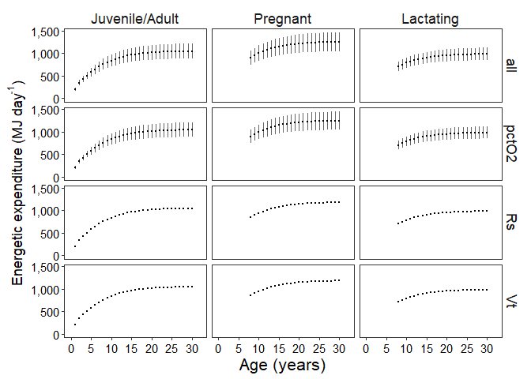

Energy Expenditure (Es) Sensitivity Analysis - Juvenile/Adult, Pregnant,
and Lactating
================
Selina Agbayani
12 August, 2025

``` r
# Set path for output figures: 
Figurespath <- paste0(getwd(), "/Es/figures", collapse = NULL)
Figurespath
```

    ## [1] "C:/Users/AgbayaniS/Documents/R/graywhale_energyreqs/Es/figures"

``` r
# Set path for input & output data  
datapath <- paste0(getwd(), "/data", collapse = NULL) 
datapath
```

    ## [1] "C:/Users/AgbayaniS/Documents/R/graywhale_energyreqs/data"

``` r
# Run Es preg and lact first, then read in data here
Es_preg_table <-  read_csv("data/Es_sensAnalysis_preg_peryear_source_bpm.csv")
```

    ## Rows: 272 Columns: 8
    ## ── Column specification ────────────────────────────────────────────────────────
    ## Delimiter: ","
    ## chr (2): Lifestage, MC_variable
    ## dbl (6): age_yrs, no_days, Es, Es_sd, Es_perday, Es_perday_sd
    ## 
    ## ℹ Use `spec()` to retrieve the full column specification for this data.
    ## ℹ Specify the column types or set `show_col_types = FALSE` to quiet this message.

``` r
Es_lact_table  <-  read_csv("data/Es_sensAnalysis_lact_peryear_source_bpm.csv")
```

    ## Rows: 272 Columns: 8
    ## ── Column specification ────────────────────────────────────────────────────────
    ## Delimiter: ","
    ## chr (2): Lifestage, MC_variable
    ## dbl (6): age_yrs, no_days, Es, Es_sd, Es_perday, Es_perday_sd
    ## 
    ## ℹ Use `spec()` to retrieve the full column specification for this data.
    ## ℹ Specify the column types or set `show_col_types = FALSE` to quiet this message.

``` r
Es_table_phase2_peryear <- read_csv("data/Es_sensAnalysis_phase2_peryear_source_bpm.csv")
```

    ## Rows: 124 Columns: 8
    ## ── Column specification ────────────────────────────────────────────────────────
    ## Delimiter: ","
    ## chr (2): Lifestage, MC_variable
    ## dbl (6): age_yrs, no_days, Es, Es_sd, Es_perday, Es_perday_sd
    ## 
    ## ℹ Use `spec()` to retrieve the full column specification for this data.
    ## ℹ Specify the column types or set `show_col_types = FALSE` to quiet this message.

``` r
#Limit tibbles to 30 yrs
Es_lact_table_max30 <-   Es_lact_table %>% filter(age_yrs <= 30)
Es_preg_table_max30 <-   Es_preg_table %>% filter(age_yrs <= 30)

Es_table_alladults_preg_lact_peryear <- Es_table_phase2_peryear %>%
  filter(Lifestage == "Juvenile/Adult" & age_yrs >= 1 & age_yrs <= 30)

Es_table_alladults_preg_lact_peryear <- rbind(Es_table_alladults_preg_lact_peryear,
                                              Es_preg_table_max30, 
                                              Es_lact_table_max30)

Es_table_alladults_preg_lact_peryear %>% write_csv("data/Es_sensAnalysis_alladults_preg_lact_peryear_bpm.csv", na = "", append = FALSE)
```

    ## Rows: 304 Columns: 8
    ## ── Column specification ────────────────────────────────────────────────────────
    ## Delimiter: ","
    ## chr (2): Lifestage, MC_variable
    ## dbl (6): age_yrs, no_days, Es, Es_sd, Es_perday, Es_perday_sd
    ## 
    ## ℹ Use `spec()` to retrieve the full column specification for this data.
    ## ℹ Specify the column types or set `show_col_types = FALSE` to quiet this message.

<!-- -->
