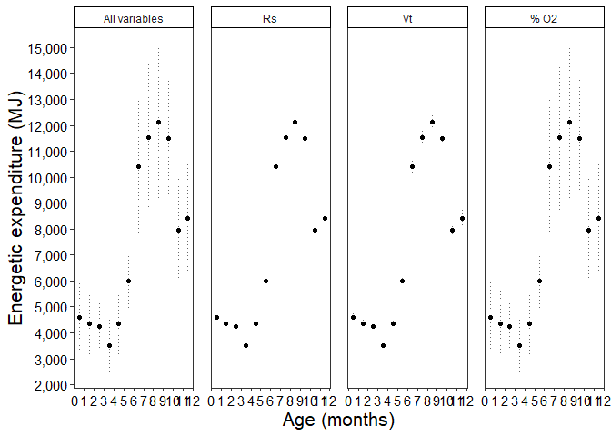

Es - Sensitivity Analysis - source - Phase 1
================
S. Agbayani
02 March 2022 - code updated on 16 July, 2025

NOTE - this code will run for a long time.

``` r
############ Set path for output figures: ###############
Figurespath <- paste0(getwd(), "/FMR/figures", collapse = NULL)
Figurespath
```

    ## [1] "C:/Users/AgbayaniS/Documents/R/graywhale_energyreqs/FMR/figures"

``` r
############ Set path for input & output data  ###########
datapath <- paste0(getwd(), "/data", collapse = NULL) 
datapath
```

    ## [1] "C:/Users/AgbayaniS/Documents/R/graywhale_energyreqs/data"

``` r
# Read in Tidal Volume table - Vt
Vt_table_phase1 <- as_tibble(read_csv("data/Vt_table_phase1.csv"),                                
                          col_types = (list(cols(age_yrs = col_double(),
                                                 Vt_mean = col_double(),
                                                 Vt_sd = col_double(),
                                                 quant025 = col_double(),
                                                 quant975 = col_double()
                                                 )
                                            )
                                       )
                          )
```

    ## Rows: 25 Columns: 5
    ## ── Column specification ────────────────────────────────────────────────────────
    ## Delimiter: ","
    ## dbl (5): age_yrs, Vt_mean, Vt_sd, quant025, quant975
    ## 
    ## ℹ Use `spec()` to retrieve the full column specification for this data.
    ## ℹ Specify the column types or set `show_col_types = FALSE` to quiet this message.

``` r
# Read in Activity Cost Reference data from csv  ORIGINAL SOURCE VALUES
A_cost_reference <- as_tibble(
  read_csv("data/ActivityCost_ReferenceData_BreathsPerDay_Table_VA_2017_original_sources.csv"),
  col_types = (list(cols(  ID = col_double(),
                           Lifestage = col_character(),
                           Description = col_character(),
                           Activity_stages = col_character(),
                           no_days = col_double(),
                           source_no_days = col_character(),
                           bpm = col_double(),
                           se_bpm = col_double(),
                           source_bpm = col_character(),
                           age_yrs = col_double(),
                           age_yrs_min = col_double(),
                           age_yrs_max = col_double(),
                           pct_O2 = col_double(),
                           pct_O2_sd = col_double()
  )
  )
  )
)
```

    ## Rows: 60 Columns: 14
    ## ── Column specification ────────────────────────────────────────────────────────
    ## Delimiter: ","
    ## chr (5): Lifestage, Description, Activity_stages, source_no_days, source_bpm
    ## dbl (9): ID, no_days, bpm, se_bpm, age_yrs, age_yrs_min, age_yrs_max, pct_O2...
    ## 
    ## ℹ Use `spec()` to retrieve the full column specification for this data.
    ## ℹ Specify the column types or set `show_col_types = FALSE` to quiet this message.

``` r
kable(A_cost_reference)
```

| ID | Lifestage | Description | Activity_stages | no_days | source_no_days | bpm | se_bpm | source_bpm | age_yrs | age_yrs_min | age_yrs_max | pct_O2 | pct_O2_sd |
|---:|:---|:---|:---|---:|:---|---:|---:|:---|---:|---:|---:|---:|---:|
| 1 | Calf | Lagoon 0-1 mths (Jan) | calving grounds | 31 | Sumich (1986); Findley & Vidal (2002); Pike 1962 | 2.14 | 0.50 | Sumich (1986) as cited in Villegas-Amtmann et al. 2017 | 0.0849315 | 0.0000100 | 0.0849315 | 10.5 | 3.0 |
| 2 | Calf | Lagoon 2 mth (Feb) | calving grounds | 28 | Sumich (1986); Findley & Vidal (2002); Pike 1962 | 1.56 | 0.40 | Sumich (1986) as cited in Villegas-Amtmann et al. 2017 | 0.1616438 | 0.0849315 | 0.1616438 | 10.5 | 3.0 |
| 3 | Calf | Lagoon 3 mths (Mar) | calving grounds | 15 | Sumich (1986); Findley & Vidal (2002); Rice and Wolman 1971 | 1.39 | 0.30 | Sumich (1986) as cited in Villegas-Amtmann et al. 2017 | 0.2465753 | 0.1616438 | 0.2465753 | 10.5 | 3.0 |
| 4 | Calf | Northbound 3 mths (Mar) | northbound | 16 | Rodriguez de la Gala Hernandez 2008; Perryman et al. 2010; Poole 1984; Rice and Wolman 1971; Leatherwood 1974 | 0.70 | 0.10 | Rodriguez de la Gala-Hernandez et al. (2008) | 0.2465753 | 0.1616438 | 0.2465753 | 10.5 | 3.0 |
| 5 | Calf | Northbound 4 mths (Apr) | northbound | 30 | Poole (1984); Rodriguez de la Gala Hernandez et al. 2008; Perryman et al. 2010; Leatherwood 1974 | 0.70 | 0.10 | Rodriguez de la Gala-Hernandez et al. (2008) | 0.3287671 | 0.2465753 | 0.3287671 | 10.5 | 3.0 |
| 6 | Calf | Northbound 5 mths (May) | northbound | 31 | Braham (1984), Poole (1984); Rodriguez de la Gala Hernandez et al. 2008; Perryman et al. 2010; Rice and Wolman 1971; Leatherwood 1974 | 0.70 | 0.10 | Rodriguez de la Gala-Hernandez et al. (2008) | 0.4136986 | 0.3287671 | 0.4136986 | 10.5 | 3.0 |
| 7 | Calf | Northbound 6 mths (June) | northbound | 23 | Hessing (1981) as cited in Braham (1984); | 0.70 | 0.10 | Rodriguez de la Gala-Hernandez et al. (2008) | 0.4958904 | 0.4136986 | 0.4958904 | 11.0 | 2.7 |
| 8 | Calf | Nursing at Foraging grounds 6 mths (June) | nursing at foraging grounds | 7 | Synchenko (2011); Bradford et al. 2012 | 1.22 | 0.30 | Sychenko (2011) | 0.4958904 | 0.4136986 | 0.4958904 | 11.0 | 2.7 |
| 9 | Calf | Nursing at Foraging grounds 7 mths (July) | nursing at foraging grounds | 31 | Mom/calf observations: Sychenko (2011), Bradford et al 2012; Weller et al. 2003 | 1.22 | 0.30 | Sychenko (2011) | 0.5808219 | 0.4958904 | 0.5808219 | 11.0 | 2.7 |
| 10 | Calf | Nursing at foraging grounds 8 mths (Aug) | nursing at foraging grounds | 31 | Mom/calf observations: Sychenko (2011), Bradford et al 2012; Weller et al. 2003 | 1.22 | 0.30 | Sychenko (2011) | 0.6657534 | 0.5808219 | 0.6657534 | 11.0 | 2.7 |
| 11 | Calf | Nursing at foraging grounds (Sep) | nursing at foraging grounds | 30 | Mom/calf observations: Sychenko (2011), Bradford et al 2012; Weller et al. 2003 | 1.22 | 0.30 | Sychenko (2011) | 0.7479452 | 0.6657534 | 0.7479452 | 11.0 | 2.7 |
| 12 | Calf | nursing at foraging grounds (Oct) | nursing at foraging grounds | 20 | for approx date of weaning (~9.6 mths): Agbayani et al. 2020, Weller et al. 2009 | 1.22 | 0.30 | Sychenko (2011) | 0.8328767 | 0.7479452 | 0.8328767 | 11.0 | 2.7 |
| 13 | Calf | Southbound post-weaning (Oct) | southbound post-weaning | 11 | Rugh et al. (2001), Braham (1984) | 0.72 | 0.20 | Sumich (1983); Schwarz (2002), as cited in Villegas-Amtmann 2017 | 0.8328767 | 0.7479452 | 0.9150685 | 11.0 | 2.7 |
| 14 | Calf | Southbound post-weaning (Nov) | southbound post-weaning | 30 | Sumich (1986), Rugh et al. (2001), | 0.72 | 0.20 | Sumich (1983); Schwarz (2002), as cited in Villegas-Amtmann 2017 | 0.9150685 | 0.8328767 | 1.0000000 | 11.0 | 2.7 |
| 15 | Calf | Southbound post-weaning (Dec) | southbound post-weaning | 31 | Sumich (1986), Rugh et al. (2001), Laake et al. (2012) | 0.72 | 0.20 | Sumich (1983); Schwarz (2002), as cited in Villegas-Amtmann 2017 | 1.0000000 | 0.9150685 | 1.0000000 | 11.0 | 2.7 |
| 16 | Pregnant | Southbound newly pregnant (Dec) | Southbound recently pregnant | 31 | Rice 1983; Rice and Wolman 1971 | 0.72 | 0.20 | Sumich (1983); Schwarz (2002), as cited in Villegas-Amtmann 2017 | NA | 8.0000000 | 75.0000000 | 11.0 | 2.7 |
| 17 | Pregnant | Lagoon breeding (Jan) | calving grounds recently pregnant | 31 | Rice 1983 | 0.62 | 0.20 | Harvey & Mate (1984), as cited in Villegas-Amtmann et al. 2017 | NA | 8.0000000 | 75.0000000 | 11.0 | 2.7 |
| 18 | Pregnant | Lagoon breeding (Feb) | calving grounds recently pregnant | 20 | Rice 1983 | 0.62 | 0.20 | Harvey & Mate (1984), as cited in Villegas-Amtmann et al. 2017 | NA | 8.0000000 | 75.0000000 | 11.0 | 2.7 |
| 19 | Pregnant | Northbound solo pregnant (Feb) | northbound pregnant | 8 | Rice 1983 | 0.50 | 0.20 | Rodriguez de la Gala-Hernandez et al. (2008) | NA | 8.0000000 | 75.0000000 | 11.0 | 2.7 |
| 20 | Pregnant | Northbound solo pregnant (Mar) | northbound pregnant | 31 | Rice 1983; Rice & Wolman (1971) | 0.50 | 0.20 | Rodriguez de la Gala-Hernandez et al. (2008) | NA | 8.0000000 | 75.0000000 | 11.0 | 2.7 |
| 21 | Pregnant | Northbound solo pregnant (Apr) | northbound pregnant | 30 | Rice 1983; Rice & Wolman (1971) | 0.50 | 0.20 | Rodriguez de la Gala-Hernandez et al. (2008) | NA | 8.0000000 | 75.0000000 | 11.0 | 2.7 |
| 22 | Pregnant | Northbound pregnant (May) | northbound pregnant | 31 | Rice 1983 | 0.50 | 0.20 | Rodriguez de la Gala-Hernandez et al. (2008) | NA | 8.0000000 | 75.0000000 | 11.0 | 2.7 |
| 23 | Pregnant | Foraging pregnant (june) | foraging pregnant | 30 | Rice 1983; Rice & Wolman (1971) | 1.34 | 0.10 | O. Sychenko (unpubl.) | NA | 8.0000000 | 75.0000000 | 11.0 | 2.7 |
| 24 | Pregnant | Foraging pregnant (july) | foraging pregnant | 31 | Rice 1983 | 1.34 | 0.10 | O. Sychenko (unpubl.) | NA | 8.0000000 | 75.0000000 | 11.0 | 2.7 |
| 25 | Pregnant | Foraging pregnant (Aug) | foraging pregnant | 31 | Rice 1983 | 1.34 | 0.10 | O. Sychenko (unpubl.) | NA | 8.0000000 | 75.0000000 | 11.0 | 2.7 |
| 26 | Pregnant | Foraging pregnant (Sep) | foraging pregnant | 30 | Rice 1983 | 1.34 | 0.10 | O. Sychenko (unpubl.) | NA | 8.0000000 | 75.0000000 | 11.0 | 2.7 |
| 27 | Pregnant | Foraging pregnant (Oct) | foraging pregnant | 31 | Rice 1983 | 1.34 | 0.10 | O. Sychenko (unpubl.) | NA | 8.0000000 | 75.0000000 | 11.0 | 2.7 |
| 28 | Pregnant | Southbound pregnant (Nov) | southbound pregnant | 30 | Rice 1983; Sumich (1986), | 0.72 | 0.20 | Sumich (1983) and Schwarz (2002) | NA | 8.0000000 | 75.0000000 | 11.0 | 2.7 |
| 29 | Pregnant | Southbound pregnant (Dec) | southbound pregnant | 31 | Rice 1983; Sumich (1986), | 0.72 | 0.20 | Sumich (1983) and Schwarz (2002) | NA | 8.0000000 | 75.0000000 | 11.0 | 2.7 |
| 30 | Lactating | Lagoon lactating (Jan) | calving grounds lactating | 31 | Rice 1983; Sumich (1986); Findley & Vidal (2002); Pike 1962 | 0.62 | 0.20 | Harvey & Mate (1984) | NA | 8.0000000 | 75.0000000 | 11.0 | 2.7 |
| 31 | Lactating | Lagoon lactating (Feb) | calving grounds lactating | 28 | Rice 1983; Sumich (1986); Findley & Vidal (2002); Rugh et al. 2001 | 0.62 | 0.20 | Harvey & Mate (1984) | NA | 8.0000000 | 75.0000000 | 11.0 | 2.7 |
| 32 | Lactating | Lagoon lactating (March) | calving grounds lactating | 15 | (coincides with NB calves) Sumich (1986); Findley & Vidal (2002); Rugh et al. 2001; Rodriguez de la Gala Hernandez 2008 | 0.62 | 0.20 | Harvey & Mate (1984) | NA | 8.0000000 | 75.0000000 | 11.0 | 2.7 |
| 33 | Lactating | Northbound with calf (March) | northbound lactating | 16 | Rodriguez de la Gala Hernandez 2008; Poole 1984; Perryman et al. 2010; Leatherwood (1974) | 0.50 | 0.10 | Rodriguez de la Gala-Hernandez et al. (2008) | NA | 8.0000000 | 75.0000000 | 11.0 | 2.7 |
| 34 | Lactating | Northbound with calf (April) | northbound lactating | 30 | Braham (1984), Poole (1984); Rodriguez de la Gala Hernandez et al. 2008; Perryman et al. 2010; Leatherwood 1974; Rice and Wolman (1971) | 0.50 | 0.10 | Rodriguez de la Gala-Hernandez et al. (2008) | NA | 8.0000000 | 75.0000000 | 11.0 | 2.7 |
| 35 | Lactating | Northbound with calf (May) | northbound lactating | 31 | Braham (1984), Poole (1984); Rodriguez de la Gala Hernandez et al. 2008; Perryman et al. 2010; Leatherwood 1974; | 0.50 | 0.10 | Rodriguez de la Gala-Hernandez et al. (2008) | NA | 8.0000000 | 75.0000000 | 11.0 | 2.7 |
| 36 | Lactating | Northbound with Calf (June) | northbound lactating | 23 | Hessing (1981) as cited in Braham (1984) | 0.50 | 0.10 | Rodriguez de la Gala-Hernandez et al. (2008) | NA | 8.0000000 | 75.0000000 | 11.0 | 2.7 |
| 37 | Lactating | Foraging lactating (June) | foraging lactating | 7 | Mom/calf observations: Synchenko (2011) | 1.04 | 0.20 | O. Sychenko (unpubl.) | NA | 8.0000000 | 75.0000000 | 11.0 | 2.7 |
| 38 | Lactating | Foraging lactating (July) | foraging lactating | 31 | Mom/calf observations: Sychenko (2011), Bradford et al 2012 | 1.04 | 0.20 | O. Sychenko (unpubl.) | NA | 8.0000000 | 75.0000000 | 11.0 | 2.7 |
| 39 | Lactating | Foraging lactating (Aug) | foraging lactating | 31 | Mom/calf observations: Sychenko (2011), Bradford et al 2012 | 1.04 | 0.20 | O. Sychenko (unpubl.) | NA | 8.0000000 | 75.0000000 | 11.0 | 2.7 |
| 40 | Lactating | Foraging lactating (Sep) | foraging lactating | 30 | Mom/calf observations: Sychenko (2011), Bradford et al 2012 | 1.04 | 0.20 | O. Sychenko (unpubl.) | NA | 8.0000000 | 75.0000000 | 11.0 | 2.7 |
| 41 | Lactating | Foraging lactating (Oct) | foraging lactating | 20 | for approx date of weaning (~9.6 mths): Agbayani et al. 2020, Weller et al. 2009 | 1.04 | 0.20 | O. Sychenko (unpubl.) | NA | 8.0000000 | 75.0000000 | 11.0 | 2.7 |
| 42 | Lactating | Southbound post-weaning (Oct) | southbound post-weaning | 11 | Braham (1984); Rugh et al. (2001); Rodriguez de la Gala-Hernandez (2008); Pike (1962) | 0.72 | 0.20 | Sumich (1983) and Schwarz (2002) | NA | 8.0000000 | 75.0000000 | 11.0 | 2.7 |
| 43 | Lactating | Southbound post-weaning (Nov) | southbound post-weaning | 30 | Rugh et al. 2001; Braham (1984); Rodriguez de la Gala-Hernandez (2008) | 0.72 | 0.20 | Sumich (1983) and Schwarz (2002) | NA | 8.0000000 | 75.0000000 | 11.0 | 2.7 |
| 44 | Lactating | Southbound postweaning (Dec) | southbound post-weaning | 31 | Rugh et al. 2001; Braham (1984); Rodriguez de la Gala-Hernandez (2008); Sumich 1986 | 0.72 | 0.20 | Sumich (1983) and Schwarz (2002) | NA | 8.0000000 | 75.0000000 | 11.0 | 2.7 |
| 45 | Juvenile/Adult | Southbound solo (Jan) | southbound | 15 | Rodriguez de la Gala-Hernandez (2008); Sumich 1986 | 0.72 | 0.20 | Sumich (1983) and Schwarz (2002) | NA | 1.0000000 | 75.0000000 | 11.0 | 2.7 |
| 46 | Juvenile/Adult | Lagoon solo (Jan) | calving grounds | 16 | Sumich (1986), Findley & Vidal (2002); Rice and Wolman 1971; Findley and Vidal 2002 | 0.62 | 0.20 | Harvey & Mate (1984), Sumich (1986) | NA | 1.0000000 | 75.0000000 | 11.0 | 2.7 |
| 47 | Juvenile/Adult | Lagoon solo (Feb) | calving grounds | 14 | Rice and Wolman (1971); Findley & Vidal (2002); Urban et al. 2021; Rugh et al. 2001 | 0.62 | 0.20 | Harvey & Mate (1984), Sumich (1986) | NA | 1.0000000 | 75.0000000 | 11.0 | 2.7 |
| 48 | Juvenile/Adult | Northbound solo (Feb) | northbound | 14 | Rice and Wolman (1971); Poole (1984), Pike (1962), Rodriguez de la Gala Hernandez et al. 2008; Sumich (1986) | 0.50 | 0.03 | Rodriguez de la Gala-Hernandez et al. (2008) | NA | 1.0000000 | 75.0000000 | 11.0 | 2.7 |
| 49 | Juvenile/Adult | Northbound solo (March) | northbound | 31 | Rice and Wolman (1971); Poole (1984), Pike (1962), Rodriguez de la Gala Hernandez et al. 2008; Braham (1984); Urban et al. 2021 (Maria started migrating March 9); Leatherwood 1974 | 0.50 | 0.03 | Rodriguez de la Gala-Hernandez et al. (2008) | NA | 1.0000000 | 75.0000000 | 11.0 | 2.7 |
| 50 | Juvenile/Adult | Northbound solo (April) | northbound | 30 | Rice and Wolman (1971) \*data ends in April; Poole (1984), Pike (1962), Rodriguez de la Gala Hernandez et al. 2008; Braham (1984); Urban et al. 2021 | 0.50 | 0.03 | Rodriguez de la Gala-Hernandez et al. (2008) | NA | 1.0000000 | 75.0000000 | 11.0 | 2.7 |
| 51 | Juvenile/Adult | Northbound solo (May) | northbound | 15 | Poole (1984), Pike (1962), Rodriguez de la Gala Hernandez et al. 2008; Braham (1984); Urban et al. 2021 (Maria stopped migrating May 24) | 0.50 | 0.03 | Rodriguez de la Gala-Hernandez et al. (2008) | NA | 1.0000000 | 75.0000000 | 11.0 | 2.7 |
| 52 | Juvenile/Adult | Foraging solo (May) | foraging | 16 | Kim and Oliver (1989); Heide-Jorgensen et al. (2012); 5 months (May to Oct); Urban et al. 2021 | 1.04 | 0.20 | O. Sychenko (unpubl.) | NA | 1.0000000 | 75.0000000 | 11.0 | 2.7 |
| 53 | Juvenile/Adult | Foraging solo (June) | foraging | 30 | Kim and Oliver (1989); Pike (1962); Heide-Jorgensen et al. (2012); Urban et al. 2021 | 1.04 | 0.20 | O. Sychenko (unpubl.) | NA | 1.0000000 | 75.0000000 | 11.0 | 2.7 |
| 54 | Juvenile/Adult | Foraging solo (July) | foraging | 31 | Kim and Oliver (1989); Pike (1962); Heide-Jorgensen et al. (2012); Urban et al. 2021; Bradford et al. 2012 | 1.04 | 0.20 | O. Sychenko (unpubl.) | NA | 1.0000000 | 75.0000000 | 11.0 | 2.7 |
| 55 | Juvenile/Adult | Foraging solo (Aug) | foraging | 31 | Pike (1962); Heide-Jorgensen et al. (2012); Bradford et al. 2012 | 1.04 | 0.20 | O. Sychenko (unpubl.) | NA | 1.0000000 | 75.0000000 | 11.0 | 2.7 |
| 56 | Juvenile/Adult | Foraging solo (Sep) | foraging | 30 | Pike (1962); Heide-Jorgensen et al. (2012); Bradford et al. 2012 | 1.04 | 0.20 | O. Sychenko (unpubl.) | NA | 1.0000000 | 75.0000000 | 11.0 | 2.7 |
| 57 | Juvenile/Adult | Foraging solo (Oct) | foraging | 16 | Kim and Oliver (1989); Pike (1962); Heide-Jorgensen et al. (2012); Bradford et al. 2012; Rugh et al. 2001 | 1.04 | 0.20 | O. Sychenko (unpubl.) | NA | 1.0000000 | 75.0000000 | 11.0 | 2.7 |
| 58 | Juvenile/Adult | Southbound (Oct) | southbound | 15 | Rugh et al. 2001; Braham (1984); Rodriguez de la Gala-Hernandez (2008); Pike (1962) | 0.72 | 0.20 | Sumich (1983); Schwarz (2002); Villegas-Amtmann 2017 | NA | 1.0000000 | 75.0000000 | 11.0 | 2.7 |
| 59 | Juvenile/Adult | Southbound (Nov) | southbound | 30 | Sumich (1986), Rugh et al. (2001), Braham 1984; | 0.72 | 0.20 | Sumich (1983); Schwarz (2002); Villegas-Amtmann 2017 | NA | 1.0000000 | 75.0000000 | 11.0 | 2.7 |
| 60 | Juvenile/Adult | Southbound (Dec) | southbound | 31 | Sumich (1986), Laake et al. (2012); Pike 1962; Rugh et al. (2001), Braham (1984); Leatherwood (1974) | 0.72 | 0.20 | Sumich (1983); Schwarz (2002); Villegas-Amtmann 2017 | NA | 1.0000000 | 75.0000000 | 11.0 | 2.7 |

``` r
age_yr_tibble <- as_tibble(
  read_csv("data/age_yr_tibble.csv"), 
  col_types = (list(ID = col_integer(),
                    month = col_character(),
                    no_days_in_mth = col_double(),
                    age_mth = col_double(),
                    no_days_cumul = col_double(),
                    age_yrs = col_double()
  )
  )
)
```

    ## Rows: 25 Columns: 5
    ## ── Column specification ────────────────────────────────────────────────────────
    ## Delimiter: ","
    ## chr (1): month
    ## dbl (4): no_days_in_mth, age_mth, no_days_cumul, age_yrs
    ## 
    ## ℹ Use `spec()` to retrieve the full column specification for this data.
    ## ℹ Specify the column types or set `show_col_types = FALSE` to quiet this message.

## Total metabolic energy expenditure at a given stage (E<sub>s</sub>)

E<sub>s</sub> = 0.02 x %O<sub>2</sub> x T<sub>s</sub> x R<sub>s</sub> x
V<sub>t</sub> - Sumich (1986)

where:

0.02 - Amount of heat produced in MJ/L O2 consumed (Kleiber 1961)  
%O<sub>2</sub> - Extraction efficiency per breath  
T<sub>s</sub> - The no. of days in that stage  
R<sub>s</sub> - Respiration rate (breaths/day)  
V<sub>t</sub> - Tidal lung volume (L)

``` r
Lifestage <-  "Calf"

#Pull respiration rate data for calves from Activity Cost Reference (A_cost_Reference) table 
A_cost_calf <-  A_cost_reference %>%
  select(Lifestage, Activity_stages, age_yrs, no_days, bpm, se_bpm) %>%
  filter(Lifestage == "Calf")  


kable(A_cost_calf)
```

| Lifestage | Activity_stages             |   age_yrs | no_days |  bpm | se_bpm |
|:----------|:----------------------------|----------:|--------:|-----:|-------:|
| Calf      | calving grounds             | 0.0849315 |      31 | 2.14 |    0.5 |
| Calf      | calving grounds             | 0.1616438 |      28 | 1.56 |    0.4 |
| Calf      | calving grounds             | 0.2465753 |      15 | 1.39 |    0.3 |
| Calf      | northbound                  | 0.2465753 |      16 | 0.70 |    0.1 |
| Calf      | northbound                  | 0.3287671 |      30 | 0.70 |    0.1 |
| Calf      | northbound                  | 0.4136986 |      31 | 0.70 |    0.1 |
| Calf      | northbound                  | 0.4958904 |      23 | 0.70 |    0.1 |
| Calf      | nursing at foraging grounds | 0.4958904 |       7 | 1.22 |    0.3 |
| Calf      | nursing at foraging grounds | 0.5808219 |      31 | 1.22 |    0.3 |
| Calf      | nursing at foraging grounds | 0.6657534 |      31 | 1.22 |    0.3 |
| Calf      | nursing at foraging grounds | 0.7479452 |      30 | 1.22 |    0.3 |
| Calf      | nursing at foraging grounds | 0.8328767 |      20 | 1.22 |    0.3 |
| Calf      | southbound post-weaning     | 0.8328767 |      11 | 0.72 |    0.2 |
| Calf      | southbound post-weaning     | 0.9150685 |      30 | 0.72 |    0.2 |
| Calf      | southbound post-weaning     | 1.0000000 |      31 | 0.72 |    0.2 |

``` r
# Calves 
Es_sensAnalysis_phase1 <- as.data.frame(matrix(ncol = 18, nrow = 0))

colnames(Es_sensAnalysis_phase1) <- c("age_yrs","Lifestage", 
                               "Activity_stages", "no_days", 
                               "MC_variable", 
                               "mean_bpm", "se_bpm", "mean_bpd",
                               "Vt_mean", "Vt_sd",
                               "Es_perday", "Es_perday_sd",
                               "Es_perday_quant025", "Es_perday_quant975",
                               #2.5% and 97.5% quantile 
                               #from bootstrap estimates 
                               "Es","Es_sd","Es_quant025","Es_quant975"
)            


Es_sensAnalysis_phase1 <- 
  as_tibble(Es_sensAnalysis_phase1, 
            col_types = (list(ID = col_integer(), 
                              age_yrs = col_double(),
                              Lifestage = col_double(),
                              Activity_stages = col_character(),
                              no_days = col_double(),
                              MC_variable = col_character(),
                              mean_bpm = col_double(),
                              mean_bpd = col_double(),
                              se_bpm = col_double(),
                              Vt_mean = col_double(),
                              Vt_sd = col_double(), 
                              Es_perday = col_double(),
                              Es_perday_sd  = col_double(),
                              Es_perday_quant025 = col_double(),
                              Es_perday_quant975 = col_double(),
                              Es = col_double(),
                              Es_sd = col_double(),
                              Es_quant025 = col_double(),
                              Es_quant975 = col_double()
            )
            )
  )


#Original code was run with MC_reps <- 10000  and took a very long time
#To test and explore the code, use less reps 

MC_reps = 10

for (a in seq(from = 1, to = 12, by = 1)){
  for (MC_var in c("all","Rs", "Vt", "pctO2")){
    
    age_yrs_i <- age_yr_tibble %>% 
     filter(age_mth == a)  %>% 
      pull(age_yrs)
    
    age_mid_i <- age_yr_tibble %>% 
      filter(age_mth == a-0.5) %>% 
      pull(age_yrs)
    
    #Lifestage <-  "Calf"
    
    strcolname <- as.character(age_yrs_i)
    A_cost_calf_i <- filter(A_cost_calf, 
                                   round(A_cost_calf$age_yrs*12) == a)
    
    if (nrow(A_cost_calf_i) == 0) {
      row <- NA
    }else{
      
      Activity_stages <- A_cost_calf_i$Activity_stages
      
      for (act in Activity_stages){
        activity <- act
        Lifestage
        activity
        
        strcolname <- as.character(age_yrs_i)
        
        A_cost_i <- A_cost_reference %>% dplyr::filter(
          Activity_stages == activity & 
            Lifestage == "Calf" 
          & round(age_yrs, 3) == round(age_yrs_i,3))
        
        A_cost_i
        
        # Lifestage <- A_cost_i$Lifestage
        # A_stage <- a
        
        set.seed(12345)
        
        
        #plot(pct_O2)
        #No. of days at each age (in months)
        no_days_i <-  A_cost_i$no_days   
        
        #Respiration rates at each activity stage 
        bpm_i <- A_cost_i$bpm 
        bpm_sd_i <- A_cost_i$se_bpm 
        
        #log() computes the natural logarithms (Ln)
        meanlog_bpm_i <- log(bpm_i^2 / sqrt(bpm_sd_i^2 + bpm_i^2))  #location
        meanlog_bpm_sd_i <- sqrt(log(1 + (bpm_sd_i^2 / bpm_i^2)))  #shape
        
        bpm_tibble <- as.data.frame(matrix(ncol = 2, nrow=0))
        colnames(bpm_tibble) <- c("mean_bpm", "sd_bpm")
        bpm_tibble <- as_tibble(bpm_tibble,
                                col_types = (list(ID = col_integer(), 
                                                  mean_bpm = col_double(),
                                                  sd_bpm = col_double()
                                                  
                                )))
        
        
        for (i in seq(from = 1, to = MC_reps, by = 1)){
          
          #generate lognormal distribution of breaths per minute (bpm)
          bpm <- rlnorm(MC_reps, meanlog_bpm_i, meanlog_bpm_sd_i)  
          # draws <- rlnorm(n=1000000, location, shape)
          # https://msalganik.wordpress.com/2017/01/21/making-sense-of-the-rlnorm-function-in-r/
          # plot(bpm)
          mean_bpm <- mean(bpm)
          sd_bpm <- sd(bpm)
          bpm_row <- tibble(mean_bpm = mean_bpm,
                            sd_bpm = sd_bpm)
          bpm_tibble <- rbind(bpm_tibble, bpm_row) 
          bpm_row <- NA
        }
        
        
        mean_bpm_i <- mean(bpm_tibble$mean_bpm)
        se_bpm_i <- sd(bpm_tibble$mean_bpm)     #sd of mean of means
        
        mean_bpm_reps <- bpm_tibble$mean_bpm
        

        # breaths/day
        bpd <- mean_bpm_reps * 60 * 24
        # plot(bpd)
        bpd_mean_i <-  mean(bpd)
        
        if (MC_var == "all" || MC_var == "Rs"){
          bpd_sd_i <- sd(bpd)  
        } else {
          bpd_sd_i = 0
        }
        
        
        #pull in tidal volume estimates (mass dependent)
        Vt_table_i <- filter(
          Vt_table_phase1, 
          round(Vt_table_phase1$age_yrs,digits = 3) == round(age_mid_i,digits =3)
        )
        
        Vt_i <- Vt_table_i$Vt_mean
        
        if (MC_var == "all" || MC_var == "Vt"){
          Vt_sd_i <- Vt_table_i$Vt_sd  
        } else {
          Vt_sd_i = 0
        }
        
        set.seed(12345)
        #generate normal distribution of Vt estimates
        Vt <- rnorm(MC_reps, Vt_i, Vt_sd_i)
        Vt_mean_i <- mean(Vt)
        Vt_sd_i <- sd(Vt)
        #plot(Vt)
        
        # O2 extraction efficiency
        if (a <= 5) {
          pct_O2_i <- 10.5/100
          
          if (MC_var == "all" || MC_var == "pctO2"){
            pct_O2_sd_i <- 3/100  
          } else {
            pct_O2_sd_i = 0
          }
          
        } else if (a > 5){
          pct_O2_i <- 11/100
          
          if (MC_var == "all" || MC_var == "pctO2"){
            pct_O2_sd_i <- 2.7/100  
          } else {
            pct_O2_sd_i = 0
          }
          
        }
        
        
        #generate normal distribution of pct_O2
        pct_O2 <- rnorm(MC_reps, pct_O2_i, pct_O2_sd_i)  
        
        
        #Energetic expenditure per day
        Es_perday <- 0.02 * pct_O2* bpd * Vt   
        #plot(Es_perday)
        
        Es_perday_mean <- mean(Es_perday)
        Es_perday_sd <- sd(Es_perday)
        Es_perday_quant025 <- quantile(Es_perday, 0.025, na.rm = TRUE)
        Es_perday_quant975 <- quantile(Es_perday, 0.975, na.rm = TRUE)
        
        #Energetic expenditure per month
        Es = Es_perday * no_days_i
        #plot(Es)
        Es_mean = mean(Es)
        Es_sd = sd(Es)
        Es_quant025 <- quantile(Es, 0.025, na.rm = TRUE)
        Es_quant975 <- quantile(Es, 0.975, na.rm = TRUE)
        
        
        # "age_yrs", "Es", "Es_sd", "quant025", "quant975" 
        row <- tibble(age_yrs = age_yrs_i,
                      Lifestage = Lifestage,
                      Activity_stages = activity,
                      no_days = no_days_i,
                      MC_variable = MC_var,
                      mean_bpm = mean_bpm_i,
                      se_bpm = se_bpm_i,
                      mean_bpd = bpd_mean_i,
                      Vt_mean = Vt_mean_i,
                      Vt_sd = Vt_sd_i,
                      Es_perday = Es_perday_mean, 
                      Es_perday_sd = Es_perday_sd, 
                      Es_perday_quant025 = Es_perday_quant025,
                      Es_perday_quant975  = Es_perday_quant975,
                      Es = Es_mean, 
                      Es_sd = Es_sd,
                      Es_quant025 = Es_quant025, 
                      Es_quant975 = Es_quant975)
        
        # append new row of data to Es_sensAnalysis_phase1
        Es_sensAnalysis_phase1 <- rbind(Es_sensAnalysis_phase1, row)
        row <-  NA #reset row for next iteration
        
      } 
    }
  }
}


kable(head(Es_sensAnalysis_phase1))
```

| age_yrs | Lifestage | Activity_stages | no_days | MC_variable | mean_bpm | se_bpm | mean_bpd | Vt_mean | Vt_sd | Es_perday | Es_perday_sd | Es_perday_quant025 | Es_perday_quant975 | Es | Es_sd | Es_quant025 | Es_quant975 |
|---:|:---|:---|---:|:---|---:|---:|---:|---:|---:|---:|---:|---:|---:|---:|---:|---:|---:|
| 0.0849315 | Calf | calving grounds | 31 | all | 2.277219 | 0.1757597 | 3279.195 | 22.86728 | 0.4752975 | 171.2549 | 44.78568 | 115.1926 | 241.0558 | 5308.902 | 1388.3560 | 3570.970 | 7472.730 |
| 0.0849315 | Calf | calving grounds | 31 | Rs | 2.277219 | 0.1757597 | 3279.195 | 22.94494 | 0.0000000 | 158.0060 | 12.19517 | 143.7184 | 178.3186 | 4898.186 | 378.0503 | 4455.271 | 5527.877 |
| 0.0849315 | Calf | calving grounds | 31 | Vt | 2.277219 | 0.1757597 | 3279.195 | 22.86728 | 0.4752975 | 157.3911 | 11.41256 | 144.7232 | 176.8571 | 4879.124 | 353.7892 | 4486.421 | 5482.571 |
| 0.0849315 | Calf | calving grounds | 31 | pctO2 | 2.277219 | 0.1757597 | 3279.195 | 22.94494 | 0.0000000 | 151.1052 | 33.81272 | 84.3575 | 186.4396 | 4684.263 | 1048.1945 | 2615.082 | 5779.628 |
| 0.1616438 | Calf | calving grounds | 28 | all | 1.670668 | 0.1411204 | 2405.762 | 32.86512 | 0.7209834 | 180.6500 | 47.99495 | 121.0402 | 254.5696 | 5058.201 | 1343.8585 | 3389.125 | 7127.949 |
| 0.1616438 | Calf | calving grounds | 28 | Rs | 1.670668 | 0.1411204 | 2405.762 | 32.98292 | 0.0000000 | 166.6330 | 14.07540 | 150.0324 | 190.0186 | 4665.724 | 394.1113 | 4200.907 | 5320.521 |

``` r
#save Es_sensAnalysis_phase1 table
Es_sensAnalysis_phase1 %>% write_csv("data/Es_sensAnalysis_phase1_source_bpm.csv", na = "", append = FALSE)
```

``` r
Es_sensAnalysis_phase1$age_mth <- 
  round(Es_sensAnalysis_phase1$age_yrs *12)

Es_sensAnalysis_phase1_permth <- Es_sensAnalysis_phase1


#pull out blank Es_subtable
Es_subtable <- Es_sensAnalysis_phase1 %>% 
  dplyr::filter(age_yrs >999, 
                Lifestage == Lifestage)
kable(Es_subtable)
```

| age_yrs | Lifestage | Activity_stages | no_days | MC_variable | mean_bpm | se_bpm | mean_bpd | Vt_mean | Vt_sd | Es_perday | Es_perday_sd | Es_perday_quant025 | Es_perday_quant975 | Es | Es_sd | Es_quant025 | Es_quant975 | age_mth |
|---:|:---|:---|---:|:---|---:|---:|---:|---:|---:|---:|---:|---:|---:|---:|---:|---:|---:|---:|

``` r
Es_sensAnalysis_phase1_permth  <- Es_subtable %>%  
  dplyr::select(age_yrs, age_mth, Lifestage, no_days, 
                MC_variable, Es, Es_sd, Es_perday, Es_perday_sd)

## Calculate sum of Es for phase 1 (per mth)
for (i in seq(from = 1, to = 12, by = 1)){
  for (MC_var in c("all","Rs", "Vt", "pctO2")){
    
    age <- age_yr_tibble %>% dplyr::filter(age_mth == i) %>%  pull(age_yrs)
    age_mth <-  i
    
    Es_subtable <- Es_sensAnalysis_phase1 %>% 
      dplyr::filter(age_yrs == age & MC_variable == MC_var)
    no_days <- sum(Es_subtable$no_days)
    Es <- sum(Es_subtable$Es)
    
    sum_of_variances <- 0
    for (row in 1:nrow(Es_subtable)){
     
      Es_subtable_i <- Es_subtable[row, "Es"]
      Es_sd_i <- Es_subtable[row, "Es_sd"]
      sum_of_variances <- sum_of_variances + (Es_sd_i)^2
    }
    Es_sd  <-  sqrt(sum_of_variances$Es_sd)
    
    Es_perday <- Es / no_days
    Es_perday_sd <- Es_sd / no_days
    
    newRow <- tibble(age_yrs = age,
                     age_mth = i,
                     Lifestage = Lifestage,
                     no_days = no_days,
                     MC_variable = MC_var,
                     Es = Es, 
                     Es_sd = Es_sd,
                     Es_perday = Es_perday,
                     Es_perday_sd = Es_perday_sd
    )
    
    Es_sensAnalysis_phase1_permth <- rbind(Es_sensAnalysis_phase1_permth, newRow)
  }
}


kable(head(Es_sensAnalysis_phase1_permth))
```

| age_yrs | age_mth | Lifestage | no_days | MC_variable | Es | Es_sd | Es_perday | Es_perday_sd |
|---:|---:|:---|---:|:---|---:|---:|---:|---:|
| 0.0849315 | 1 | Calf | 31 | all | 5308.902 | 1388.3560 | 171.2549 | 44.78568 |
| 0.0849315 | 1 | Calf | 31 | Rs | 4898.186 | 378.0503 | 158.0060 | 12.19517 |
| 0.0849315 | 1 | Calf | 31 | Vt | 4879.124 | 353.7892 | 157.3911 | 11.41256 |
| 0.0849315 | 1 | Calf | 31 | pctO2 | 4684.263 | 1048.1945 | 151.1052 | 33.81272 |
| 0.1616438 | 2 | Calf | 28 | all | 5058.201 | 1343.8585 | 180.6500 | 47.99495 |
| 0.1616438 | 2 | Calf | 28 | Rs | 4665.724 | 394.1113 | 166.6330 | 14.07540 |

``` r
Es_sensAnalysis_phase1_permth %>% write_csv("data/Es_sensAnalysis_phase1_permth_source_bpm.csv", na = "", append = FALSE)
```

E<sub>s</sub> per month - Phase 1 - plot from sensitivity analysis

<!-- -->

E<sub>s</sub> per day at each age (month) - Phase 1 - plot from
sensitivity analysis

<!-- -->
