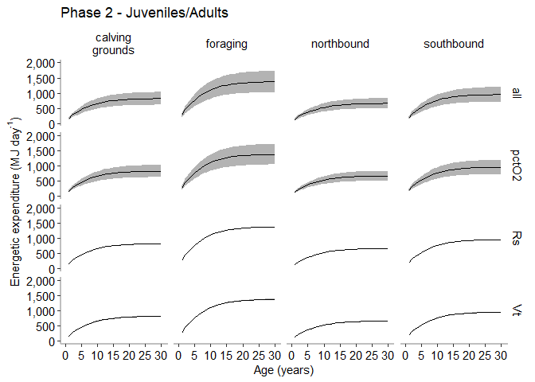
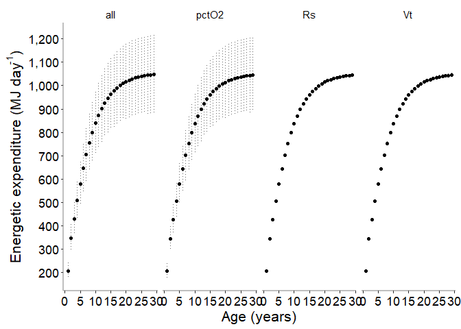

Energy Expenditure (Es) Sensitivity Analysis - Phase 2
================
Selina Agbayani
02 March 2022 - code updated 28 July, 2025

``` r
# Set path for output figures: 
Figurespath <- paste0(getwd(), "/Es/figures", collapse = NULL)
Figurespath
```

    ## [1] "C:/Users/AgbayaniS/Documents/R/graywhale_energyreqs/Es/figures"

``` r
# Set path for input & output data  
datapath <- paste0(getwd(), "/data", collapse = NULL) 
datapath
```

    ## [1] "C:/Users/AgbayaniS/Documents/R/graywhale_energyreqs/data"

``` r
Es_sensAnalysis_phase1 <-
  as_tibble(read_csv("data/Es_sensAnalysis_phase1_source_bpm.csv"),
            col_types = (list(cols(age_yrs = col_double(),
                         Lifestage = col_character(),
                         Activity_stages = col_character(),
                         no_days = col_double(),
                         MC_variable = col_character(),
                         mean_bpm = col_double(),
                         se_bpm = col_double(),
                         mean_bpd = col_double(),
                         Vt_mean = col_double(),
                         Vt_sd = col_double(),
                         Es_perday = col_double(),
                         Es_perday_sd = col_double(),
                         Es_perday_quant025 = col_double(),
                         Es_perday_quant975 = col_double(),
                         Es = col_double(),
                         Es_sd = col_double(),
                         Es_quant025 = col_double(),
                         Es_quant975 = col_double()
            )
            )
            )
  )
```

    ## Rows: 60 Columns: 18
    ## ── Column specification ────────────────────────────────────────────────────────
    ## Delimiter: ","
    ## chr  (3): Lifestage, Activity_stages, MC_variable
    ## dbl (15): age_yrs, no_days, mean_bpm, se_bpm, mean_bpd, Vt_mean, Vt_sd, Es_p...
    ## 
    ## ℹ Use `spec()` to retrieve the full column specification for this data.
    ## ℹ Specify the column types or set `show_col_types = FALSE` to quiet this message.

``` r
#read in Tidal Volume for phase 1
Vt_table_phase1 <- 
  as_tibble(read_csv("data/Vt_table_phase1.csv"), 
            col_types = (list(cols(age_yrs = col_double(),
                                   Vt_mean = col_double(),
                                   Vt_sd = col_double(),
                                   quant025 = col_double(),
                                   quant975 = col_double()
            )
            )
            )
  )
```

    ## Rows: 25 Columns: 5
    ## ── Column specification ────────────────────────────────────────────────────────
    ## Delimiter: ","
    ## dbl (5): age_yrs, Vt_mean, Vt_sd, quant025, quant975
    ## 
    ## ℹ Use `spec()` to retrieve the full column specification for this data.
    ## ℹ Specify the column types or set `show_col_types = FALSE` to quiet this message.

``` r
#read in Tidal Volume for Phase 2                             
Vt_table_phase2 <- 
  as_tibble(read_csv("data/Vt_table_phase2.csv"),
            col_types = (list(cols(age_yrs = col_double(),
                                   Vt_mean = col_double(),
                                   Vt_sd = col_double(),
                                   quant025 = col_double(),
                                   quant975 = col_double()
            )
            )
            )
  )
```

    ## Rows: 172 Columns: 5
    ## ── Column specification ────────────────────────────────────────────────────────
    ## Delimiter: ","
    ## dbl (5): age_yrs, Vt_mean, Vt_sd, quant025, quant975
    ## 
    ## ℹ Use `spec()` to retrieve the full column specification for this data.
    ## ℹ Specify the column types or set `show_col_types = FALSE` to quiet this message.

``` r
#read in Tidal Volume for female gray whales
Vt_table_phase2_f <- 
  as_tibble(read_csv("data/Vt_table_phase2_f.csv"), 
            col_types = (list(cols(age_yrs = col_double(),
                                   Vt_mean_f = col_double(),
                                   Vt_sd_f = col_double(),
                                   quant025_f = col_double(),
                                   quant975_f = col_double()
            )
            )
            )
  )
```

    ## Rows: 172 Columns: 5
    ## ── Column specification ────────────────────────────────────────────────────────
    ## Delimiter: ","
    ## dbl (5): age_yrs, Vt_mean_f, Vt_sd_f, quant025_f, quant975_f
    ## 
    ## ℹ Use `spec()` to retrieve the full column specification for this data.
    ## ℹ Specify the column types or set `show_col_types = FALSE` to quiet this message.

``` r
# Read in Activity Cost Reference data from csv  ORIGINAL SOURCE VALUES
A_cost_reference <- as_tibble(
  read_csv("data/ActivityCost_ReferenceData_BreathsPerDay_Table_VA_2017_original_sources.csv"),
  col_types = (list(cols(ID = col_double(),
                         Lifestage = col_character(),
                         Description = col_character(),
                         Activity_stages = col_character(),
                         no_days = col_double(),
                         source_no_days = col_character(),
                         bpm = col_double(),
                         se_bpm = col_double(),
                         source_bpm = col_character(),
                         age_yrs = col_double(),
                         age_yrs_min = col_double(),
                         age_yrs_max = col_double(),
                         pct_O2 = col_double(),
                         pct_O2_sd = col_double()
  )
  )
  )
)
```

    ## Rows: 60 Columns: 14
    ## ── Column specification ────────────────────────────────────────────────────────
    ## Delimiter: ","
    ## chr (5): Lifestage, Description, Activity_stages, source_no_days, source_bpm
    ## dbl (9): ID, no_days, bpm, se_bpm, age_yrs, age_yrs_min, age_yrs_max, pct_O2...
    ## 
    ## ℹ Use `spec()` to retrieve the full column specification for this data.
    ## ℹ Specify the column types or set `show_col_types = FALSE` to quiet this message.

``` r
kable(head(A_cost_reference))
```

| ID | Lifestage | Description | Activity_stages | no_days | source_no_days | bpm | se_bpm | source_bpm | age_yrs | age_yrs_min | age_yrs_max | pct_O2 | pct_O2_sd |
|---:|:---|:---|:---|---:|:---|---:|---:|:---|---:|---:|---:|---:|---:|
| 1 | Calf | Lagoon 0-1 mths (Jan) | calving grounds | 31 | Sumich (1986); Findley & Vidal (2002); Pike 1962 | 2.14 | 0.5 | Sumich (1986) as cited in Villegas-Amtmann et al. 2017 | 0.0849315 | 0.0000100 | 0.0849315 | 10.5 | 3 |
| 2 | Calf | Lagoon 2 mth (Feb) | calving grounds | 28 | Sumich (1986); Findley & Vidal (2002); Pike 1962 | 1.56 | 0.4 | Sumich (1986) as cited in Villegas-Amtmann et al. 2017 | 0.1616438 | 0.0849315 | 0.1616438 | 10.5 | 3 |
| 3 | Calf | Lagoon 3 mths (Mar) | calving grounds | 15 | Sumich (1986); Findley & Vidal (2002); Rice and Wolman 1971 | 1.39 | 0.3 | Sumich (1986) as cited in Villegas-Amtmann et al. 2017 | 0.2465753 | 0.1616438 | 0.2465753 | 10.5 | 3 |
| 4 | Calf | Northbound 3 mths (Mar) | northbound | 16 | Rodriguez de la Gala Hernandez 2008; Perryman et al. 2010; Poole 1984; Rice and Wolman 1971; Leatherwood 1974 | 0.70 | 0.1 | Rodriguez de la Gala-Hernandez et al. (2008) | 0.2465753 | 0.1616438 | 0.2465753 | 10.5 | 3 |
| 5 | Calf | Northbound 4 mths (Apr) | northbound | 30 | Poole (1984); Rodriguez de la Gala Hernandez et al. 2008; Perryman et al. 2010; Leatherwood 1974 | 0.70 | 0.1 | Rodriguez de la Gala-Hernandez et al. (2008) | 0.3287671 | 0.2465753 | 0.3287671 | 10.5 | 3 |
| 6 | Calf | Northbound 5 mths (May) | northbound | 31 | Braham (1984), Poole (1984); Rodriguez de la Gala Hernandez et al. 2008; Perryman et al. 2010; Rice and Wolman 1971; Leatherwood 1974 | 0.70 | 0.1 | Rodriguez de la Gala-Hernandez et al. (2008) | 0.4136986 | 0.3287671 | 0.4136986 | 10.5 | 3 |

``` r
Activity_days <- A_cost_reference %>% 
  select(Lifestage, Activity_stages, no_days) %>%  
  group_by(Lifestage, Activity_stages) %>% 
  summarise(no_days = sum(no_days))
```

    ## `summarise()` has grouped output by 'Lifestage'. You can override using the
    ## `.groups` argument.

``` r
kable(head(Activity_days))
```

| Lifestage      | Activity_stages             | no_days |
|:---------------|:----------------------------|--------:|
| Calf           | calving grounds             |      74 |
| Calf           | northbound                  |     100 |
| Calf           | nursing at foraging grounds |     119 |
| Calf           | southbound post-weaning     |      72 |
| Juvenile/Adult | calving grounds             |      30 |
| Juvenile/Adult | foraging                    |     154 |

``` r
age_yr_tibble <- as_tibble(
  read_csv("data/age_yr_tibble.csv"), 
  col_types = (list(ID = col_integer(),
                    month = col_character(),
                    no_days_in_mth = col_double(),
                    age_mth = col_double(),
                    no_days_cumul = col_double(),
                    age_yrs = col_double()
  )
  )
)
```

    ## Rows: 25 Columns: 5
    ## ── Column specification ────────────────────────────────────────────────────────
    ## Delimiter: ","
    ## chr (1): month
    ## dbl (4): no_days_in_mth, age_mth, no_days_cumul, age_yrs
    ## 
    ## ℹ Use `spec()` to retrieve the full column specification for this data.
    ## ℹ Specify the column types or set `show_col_types = FALSE` to quiet this message.

## Total metabolic energy expenditure at a given stage (E<sub>s</sub>)

E<sub>s</sub> = 0.02 x %O<sub>2</sub> x T<sub>s</sub> x R<sub>s</sub> x
V<sub>t</sub> - Sumich (1986)

where:

0.02 - Amount of heat produced in MJ/L O2 consumed (Kleiber 1961)  
%O<sub>2</sub> - Extraction efficiency per breath  
T<sub>s</sub> - The no. of days in that stage  
R<sub>s</sub> - Respiration rate (breaths/day)  
V<sub>t</sub> - Tidal lung volume (L)

``` r
#Original code was run with MC_reps <- 10000  and took a very long time
#To test and explore the code, use less reps 

MC_reps = 10000

Lifestage <-  "Juvenile/Adult"
Lifestage
```

    ## [1] "Juvenile/Adult"

``` r
activity_stages <- Activity_days %>%
  dplyr::filter(Lifestage == "Juvenile/Adult")
activity_stages  <-  activity_stages$Activity_stages
activity_stages
```

    ## [1] "calving grounds" "foraging"        "northbound"      "southbound"

``` r
A_cost_reference_phase2 <- A_cost_reference %>% filter(Lifestage == "Juvenile/Adult")
A_cost_reference_phase2
```

    ## # A tibble: 16 × 14
    ##       ID Lifestage      Description Activity_stages no_days source_no_days   bpm
    ##    <dbl> <chr>          <chr>       <chr>             <dbl> <chr>          <dbl>
    ##  1    45 Juvenile/Adult Southbound… southbound           15 Rodriguez de …  0.72
    ##  2    46 Juvenile/Adult Lagoon sol… calving grounds      16 Sumich (1986)…  0.62
    ##  3    47 Juvenile/Adult Lagoon sol… calving grounds      14 Rice and Wolm…  0.62
    ##  4    48 Juvenile/Adult Northbound… northbound           14 Rice and Wolm…  0.5 
    ##  5    49 Juvenile/Adult Northbound… northbound           31 Rice and Wolm…  0.5 
    ##  6    50 Juvenile/Adult Northbound… northbound           30 Rice and Wolm…  0.5 
    ##  7    51 Juvenile/Adult Northbound… northbound           15 Poole (1984),…  0.5 
    ##  8    52 Juvenile/Adult Foraging s… foraging             16 Kim and Olive…  1.04
    ##  9    53 Juvenile/Adult Foraging s… foraging             30 Kim and Olive…  1.04
    ## 10    54 Juvenile/Adult Foraging s… foraging             31 Kim and Olive…  1.04
    ## 11    55 Juvenile/Adult Foraging s… foraging             31 Pike (1962); …  1.04
    ## 12    56 Juvenile/Adult Foraging s… foraging             30 Pike (1962); …  1.04
    ## 13    57 Juvenile/Adult Foraging s… foraging             16 Kim and Olive…  1.04
    ## 14    58 Juvenile/Adult Southbound… southbound           15 Rugh et al. 2…  0.72
    ## 15    59 Juvenile/Adult Southbound… southbound           30 Sumich (1986)…  0.72
    ## 16    60 Juvenile/Adult Southbound… southbound           31 Sumich (1986)…  0.72
    ## # ℹ 7 more variables: se_bpm <dbl>, source_bpm <chr>, age_yrs <dbl>,
    ## #   age_yrs_min <dbl>, age_yrs_max <dbl>, pct_O2 <dbl>, pct_O2_sd <dbl>

``` r
#pulling blank tibble
A_cost_phase2 <-  A_cost_reference_phase2 %>% 
  filter(age_yrs == 0) %>% 
  select(Lifestage, no_days, bpm, se_bpm) 

#A_cost_tibble <- A_cost_reference_phase2 
# Lifestage <- "Juvenile/Adult"
no_days <- sum(A_cost_reference_phase2$no_days)
Lifestage
```

    ## [1] "Juvenile/Adult"

``` r
no_days
```

    ## [1] 365

``` r
bpm <- (sum(A_cost_reference_phase2$no_days * A_cost_reference_phase2$bpm))/no_days
se_bpm <- sqrt(sum(A_cost_reference_phase2$se_bpm^2))

row <- tibble(Lifestage = Lifestage,
              no_days = no_days,
              bpm = bpm,
              se_bpm = se_bpm
)


A_cost_phase2 <- rbind(A_cost_phase2, row)

kable(A_cost_phase2)
```

| Lifestage      | no_days |       bpm |    se_bpm |
|:---------------|--------:|----------:|----------:|
| Juvenile/Adult |     365 | 0.7925479 | 0.6954135 |

``` r
#adult/juveniles
Es_sensAnalysis_phase2 <- as.data.frame(matrix(ncol = 18, nrow = 0))

cnames <- c("age_yrs","Lifestage","Activity_stages","MC_variable",
            "no_days", "mean_bpm", "se_bpm", "mean_bpd",
            "Vt_mean", "Vt_sd",
            "Es_perday", "Es_perday_sd",
            "Es_perday_quant025", "Es_perday_quant975", #2.5% and 97.5% quantile from bootstrap estimates
            "Es","Es_sd","Es_quant025","Es_quant975"
)

colnames(Es_sensAnalysis_phase2) <- cnames

Es_sensAnalysis_phase2 <- 
  as_tibble(Es_sensAnalysis_phase2,
            col_types = (list(ID = col_integer(), 
                              age_yrs = col_double(),
                              Lifestage = col_double(),
                              Activity_stages = col_double(),
                              MC_variable = col_character(),
                              no_days = col_double(),
                              mean_bpm = col_double(),
                              se_bpm = col_double(),  
                              mean_bpd = col_double(),
                              Vt_mean = col_double(),
                              Vt_sd = col_double(),
                              Es_perday = col_double(),
                              Es_perday_sd  = col_double(),
                              Es_perday_quant025  = col_double(),
                              Es_perday_quant975 = col_double(),
                              Es = col_double(),
                              Es_sd = col_double(),
                              Es_quant025 = col_double(),
                              Es_quant975 = col_double()
            )
            )
  )

#Es_table_phase2 <- Es_table_phase1


for (age in seq(from = 1, to = 31, by = 1)){
  
  for (MC_var in c("all","Rs", "Vt", "pctO2")){
    
    if (age == 1) {
      age_tibble <- age_yr_tibble %>% dplyr::filter(age_mth == 6)  
      Vt_age <- age_tibble$age_yrs   #calculate age_yrs (do not round up)
      
    }else{
      Vt_age <- age -0.5
    }
    
    
    
    # for (a in c("calving grounds", "northbound", "foraging", "southbound")){
    for (activity in activity_stages){
      
      Lifestage
      activity
      
      strcolname <- as.character(age)
      
      A_cost_i <- A_cost_reference %>% dplyr::filter(
        Activity_stages == activity & 
          Lifestage == "Juvenile/Adult" 
        & age_yrs_min <= age
        & age_yrs_max >= age)
      
      A_cost_i
      
      if (nrow(A_cost_i) > 0) {
        
        if (age == 1){
          Vt_table_i <- 
            dplyr::filter(Vt_table_phase1, 
                          round(age_yrs, 3) == round(Vt_age,3))
          
        } else { 
          Vt_table_i <- 
            dplyr::filter(Vt_table_phase2, 
                          round(age_yrs, 3) == round(Vt_age,3))
        }
        
        
        
        # O2 extraction efficiency
        pct_O2_i <- A_cost_i$pct_O2 /100
        if (MC_var == "all" || MC_var == "pctO2"){
          pct_O2_sd_i <- A_cost_i$pct_O2_sd /100
        } else {
          pct_O2_sd_i <- 0
        }
        
        set.seed(12345)
        pct_O2 <- rnorm(MC_reps, pct_O2_i, pct_O2_sd_i)  
        #plot(pct_O2)
        #No. of days at each activity stage
        no_days_i <-  sum(A_cost_i$no_days)   
        
        #Respiration rates at each activity stage 
        bpm_i <- A_cost_i$bpm 
        bpm_sd_i <- A_cost_i$se_bpm  
        
        meanlog_bpm_i <- log(bpm_i^2 / sqrt(bpm_sd_i^2 + bpm_i^2))
        meanlog_bpm_sd_i <- sqrt(log(1 + (bpm_sd_i^2 / bpm_i^2)))
        
        bpm_tibble <- as.data.frame(matrix(ncol = 2, nrow=0))
        colnames(bpm_tibble) <- c("mean_bpm", "sd_bpm")
        bpm_tibble <- as_tibble(bpm_tibble,
                                col_types = (list(ID = col_integer(), 
                                                  mean_bpm = col_double(),
                                                  sd_bpm = col_double()
                                                  
                                )))
        
        for (i in seq(from = 1, to = MC_reps, by = 1)){
          
          #sample from lognormal distribution
          bpm <- rlnorm(MC_reps, meanlog_bpm_i, meanlog_bpm_sd_i)  
          # draws <- rlnorm(n=1000000, location, shape)
          # https://msalganik.wordpress.com/2017/01/21/making-sense-of-the-rlnorm-function-in-r/
          # plot(bpm)
          mean_bpm <- mean(bpm)
          sd_bpm <- sd(bpm)
          bpm_row <- tibble(mean_bpm = mean_bpm,
                            sd_bpm = sd_bpm)
          bpm_tibble <- rbind(bpm_tibble, bpm_row) 
          bpm_row <- NA
        }
        
        
        mean_bpm_i <- mean(bpm_tibble$mean_bpm)
        se_bpm_i <- sd(bpm_tibble$mean_bpm)     #sd of mean of means
        
        mean_bpm_reps <- bpm_tibble$mean_bpm
        
        # breath_hold_time <- 1/mean_bpm_reps
        # #plot(breath_hold_time)
        # mean(breath_hold_time)
        # sd(breath_hold_time)
        
        # #breaths per day
        # bpd <- 1440/breath_hold_time
        # mean(bpd)
        # sd(bpd)
        # #plot(bpd)
        
        #other option - truncated normal distribution
        #bpm <- rtruncnorm(MC_reps, a=0, b=Inf, mean=bpm_i, sd=bpm_sd_i)
        
        # breaths/day
        bpd <- mean_bpm_reps * 60 * 24
        # plot(bpd)
        bpd_mean_i <-  mean(bpd)
        
        if (MC_var == "all" || MC_var == "Rs"){
          bpd_sd_i <- sd(bpd)  
        } else {
          bpd_sd_i = 0
        }
        
        #tidal volume (mass dependent)
        Vt_i <- Vt_table_i$Vt_mean
        
        if (MC_var == "all" || MC_var == "Vt"){
          Vt_sd_i <- Vt_table_i$Vt_sd  
        } else {
          Vt_sd_i = 0
        }
        
        set.seed(12345)
        Vt <- rnorm(MC_reps, Vt_i, Vt_sd_i)
        Vt_mean_i <- mean(Vt)
        Vt_sd_i <- sd(Vt)
        #plot(Vt)
        
        #Energetic expenditure per day
        Es_perday <- 0.02 * pct_O2* bpd * Vt   
        #plot(Es_perday)
        
        Es_perday_mean <- mean(Es_perday)
        Es_perday_sd <- sd(Es_perday)
        Es_perday_quant025 <- quantile(Es_perday, 0.025, na.rm = TRUE)
        Es_perday_quant975 <- quantile(Es_perday, 0.975, na.rm = TRUE)
        
        #Energettic expenditure per month
        Es = Es_perday * no_days_i
        #plot(Es)
        Es_mean = mean(Es)
        Es_sd = sd(Es)
        Es_quant025 <- quantile(Es, 0.025, na.rm = TRUE)
        Es_quant975 <- quantile(Es, 0.975, na.rm = TRUE)
        
        
        # "age_yrs", "Es", "Es_sd", "quant025", "quant975" 
        row <- tibble(age_yrs = age,
                      Lifestage = Lifestage,
                      Activity_stages = activity,
                      no_days = no_days_i,
                      MC_variable = MC_var,
                      mean_bpm = mean_bpm_i,
                      se_bpm = se_bpm_i,
                      mean_bpd = bpd_mean_i,
                      Vt_mean = Vt_mean_i,
                      Vt_sd = Vt_sd_i,
                      Es_perday = Es_perday_mean, 
                      Es_perday_sd = Es_perday_sd, 
                      Es_perday_quant025 = Es_perday_quant025,
                      Es_perday_quant975  = Es_perday_quant975,
                      Es = Es_mean, 
                      Es_sd = Es_sd,
                      Es_quant025 = Es_quant025, 
                      Es_quant975 = Es_quant975
        )
        
        Es_sensAnalysis_phase2 <- rbind(Es_sensAnalysis_phase2, row)
        
      }
      
    }    
  }
}


kable(head(Es_sensAnalysis_phase2))
```

| age_yrs | Lifestage | Activity_stages | no_days | MC_variable | mean_bpm | se_bpm | mean_bpd | Vt_mean | Vt_sd | Es_perday | Es_perday_sd | Es_perday_quant025 | Es_perday_quant975 | Es | Es_sd | Es_quant025 | Es_quant975 |
|---:|:---|:---|---:|:---|---:|---:|---:|---:|---:|---:|---:|---:|---:|---:|---:|---:|---:|
| 1 | Juvenile/Adult | calving grounds | 30 | all | 0.6199982 | 0.0020046 | 892.7974 | 81.87563 | 1.899539 | 161.7043 | 43.1959572 | 78.43408 | 248.6958 | 4851.129 | 1295.87871 | 2353.022 | 7460.874 |
| 1 | Juvenile/Adult | foraging | 154 | all | 1.0399957 | 0.0020043 | 1497.5938 | 81.87563 | 1.899539 | 271.2459 | 72.4538613 | 131.62854 | 417.2997 | 41771.870 | 11157.89464 | 20270.796 | 64264.150 |
| 1 | Juvenile/Adult | northbound | 90 | all | 0.4999990 | 0.0003006 | 719.9985 | 81.87563 | 1.899539 | 130.4071 | 34.8324183 | 63.30998 | 200.9057 | 11736.637 | 3134.91764 | 5697.898 | 18081.512 |
| 1 | Juvenile/Adult | southbound | 91 | all | 0.7199973 | 0.0020045 | 1036.7962 | 81.87563 | 1.899539 | 187.7856 | 50.1620089 | 91.09897 | 288.8100 | 17088.488 | 4564.74281 | 8290.006 | 26281.710 |
| 1 | Juvenile/Adult | calving grounds | 30 | Rs | 0.6199981 | 0.0020046 | 892.7972 | 81.87694 | 0.000000 | 160.8189 | 0.5199540 | 159.78470 | 161.8547 | 4824.567 | 15.59862 | 4793.541 | 4855.642 |
| 1 | Juvenile/Adult | foraging | 154 | Rs | 1.0399956 | 0.0020043 | 1497.5937 | 81.87694 | 0.000000 | 269.7605 | 0.5198841 | 268.72925 | 270.7953 | 41543.109 | 80.06215 | 41384.304 | 41702.474 |

``` r
Es_sensAnalysis_phase2 %>% 
  write_csv("data/Es_sensAnalysis_phase2_source_bpm.csv", 
            na = "", append = FALSE)
```

``` r
Es_sensAnalysis_phase2 <- read_csv("data/Es_sensAnalysis_phase2_source_bpm.csv")
```

    ## Rows: 496 Columns: 18
    ## ── Column specification ────────────────────────────────────────────────────────
    ## Delimiter: ","
    ## chr  (3): Lifestage, Activity_stages, MC_variable
    ## dbl (15): age_yrs, no_days, mean_bpm, se_bpm, mean_bpd, Vt_mean, Vt_sd, Es_p...
    ## 
    ## ℹ Use `spec()` to retrieve the full column specification for this data.
    ## ℹ Specify the column types or set `show_col_types = FALSE` to quiet this message.

``` r
plot_Es_sensAnalysis_phase2 <- Es_sensAnalysis_phase2 %>% 
  ggplot(aes(x = age_yrs, y = Es))+
  geom_errorbar(aes(ymin = Es - Es_sd, ymax = Es + Es_sd),
                colour = "blue", width = 0.02)+
  geom_point()+
  facet_grid(MC_variable ~ Activity_stages,
             labeller = label_wrap_gen(width = 2, multi_line = TRUE)) +
  ggtitle("Es table - phase 2")

plot_Es_sensAnalysis_phase2
```

<!-- -->

``` r
#pull out blank Es_subtable
Es_subtable <- Es_sensAnalysis_phase2 %>% dplyr::filter(age_yrs >999, Lifestage == Lifestage)
kable(Es_subtable)
```

| age_yrs | Lifestage | Activity_stages | no_days | MC_variable | mean_bpm | se_bpm | mean_bpd | Vt_mean | Vt_sd | Es_perday | Es_perday_sd | Es_perday_quant025 | Es_perday_quant975 | Es | Es_sd | Es_quant025 | Es_quant975 |
|---:|:---|:---|---:|:---|---:|---:|---:|---:|---:|---:|---:|---:|---:|---:|---:|---:|---:|

``` r
Es_table_2  <- Es_subtable %>%  dplyr::select(age_yrs, Lifestage, no_days, 
                                              MC_variable, Es, Es_sd)

## Calculate sum of Es for ages 1+
for (i in seq(from = 1, to = 31, by = 1)){
  
  for (MC_var in c("all","Rs", "Vt", "pctO2")){
    
    Es_subtable <- Es_sensAnalysis_phase2 %>% dplyr::filter(age_yrs == i & MC_variable == MC_var )
    no_days <- sum(Es_subtable$no_days)
    Es <- sum(Es_subtable$Es)
    Lifestage <- "Juvenile/Adult"
    
    sum_of_variances <- 0
    for (row in 1:nrow(Es_subtable)){
      #for (i in c( 0.33, 0.42, 0.5)){ 
      Es_subtable_i <- Es_subtable[row, "Es"]
      Es_sd_i <- Es_subtable[row, "Es_sd"]
      sum_of_variances <- sum_of_variances + (Es_sd_i)^2
    }
    Es_sd  <-  sqrt(sum_of_variances$Es_sd)
    
    newRow <- tibble(age_yrs = i,
                     Lifestage = Lifestage,
                     no_days = no_days ,
                     MC_variable = MC_var,
                     Es = Es, 
                     Es_sd = Es_sd
    )
    
    Es_table_2 <-
      rbind(Es_table_2, newRow)
  }
}

Es_sensAnalysis_phase2_peryear <- Es_table_2

Es_sensAnalysis_phase2_peryear$Es_perday <-
  Es_sensAnalysis_phase2_peryear$Es / Es_sensAnalysis_phase2_peryear$no_days
Es_sensAnalysis_phase2_peryear$Es_sd_perday <- Es_sensAnalysis_phase2_peryear$Es_sd / Es_sensAnalysis_phase2_peryear$no_days

Es_sensAnalysis_phase2_peryear %>% write_csv("data/Es_sensAnalysis_phase2_peryear_source_bpm.csv", na = "", append = FALSE)
```

``` r
plot_Es_sensAnalysis_phase2_peryear <- Es_sensAnalysis_phase2_peryear %>% 
  dplyr::filter(Lifestage == "Juvenile/Adult" & age_yrs >= 1 & age_yrs < 30) %>% 
  ggplot() +
  geom_errorbar(aes(x = age_yrs, ymin = Es_perday - Es_sd_perday, 
                    ymax = Es_perday + Es_sd_perday),
                linetype = 3, colour = 'gray40', width = 0) +
  geom_point(aes(x = age_yrs, y =Es_perday)) +
  facet_grid(~MC_variable)+
  xlab("Age (years)") +
  ylab(bquote('Energetic expenditure (MJ day '^'-1'*')')) +
  scale_x_continuous(breaks = scales::pretty_breaks(n = 10))+
                     #limits = c(0, 30.5), expand=c(0,0)) +  # max x-axis 30 yrs.
  scale_y_continuous(label=comma,
                     breaks = scales::pretty_breaks(n = 10))+
                     #limits = c(0,1400), expand=c(0,0))+
  theme_bw()+
theme_bw() +
  theme(panel.grid = element_blank())+
  theme(legend.position = 0)+
  # theme(plot.background = element_rect(fill = "black"))+
  # theme(panel.background = element_rect(fill = "black"))+
  theme(panel.border = element_blank())+
  theme(axis.line = element_line(size = 1, colour = "gray75"))+
  theme(axis.text = element_text(colour = "black", size = rel(1.2)))+
  theme(axis.title.y = element_text(colour = "black", 
                                    size = rel(1.4), angle = 90))+
  theme(axis.title.x = element_text(colour = "black", 
                                    size = rel(1.4)))

plot_Es_sensAnalysis_phase2_peryear
```

<!-- -->
