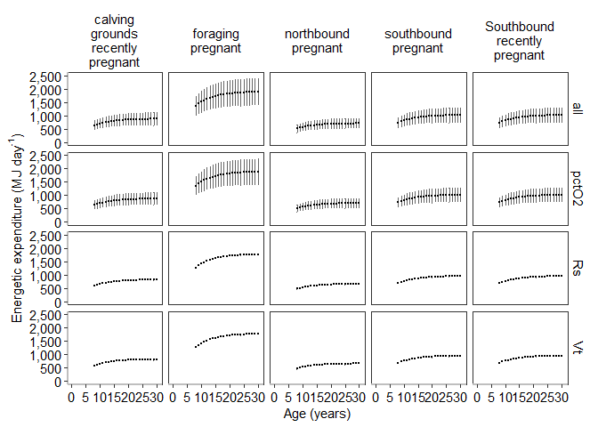
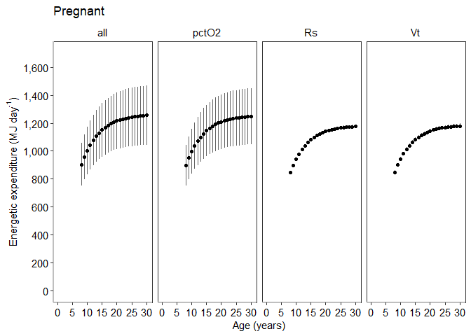

Energy Expenditure (Es) Sensitivity Analysis - Pregnant
================
Selina Agbayani
10 March 2022 - code updated 11 August, 2025

``` r
# Set path for output figures: 
Figurespath <- paste0(getwd(), "/Es/figures", collapse = NULL)
Figurespath
```

    ## [1] "C:/Users/AgbayaniS/Documents/R/graywhale_energyreqs/Es/figures"

``` r
# Set path for input & output data  
datapath <- paste0(getwd(), "/data", collapse = NULL) 
datapath
```

    ## [1] "C:/Users/AgbayaniS/Documents/R/graywhale_energyreqs/data"

``` r
# Read in Tidal Volume table - Vt

Es_sensAnalysis_phase1 <- as_tibble(
  read_csv("data/Es_sensAnalysis_phase1_source_bpm.csv"),
  col_types = (list(cols(age_yrs = col_double(),
                         Lifestage = col_character(),
                         Activity_stages = col_character(),
                         no_days = col_double(),
                         MC_variable = col_character(),
                         mean_bpm = col_double(),
                         se_bpm = col_double(),
                         mean_bpd = col_double(),
                         Vt_mean = col_double(),
                         Vt_sd = col_double(),
                         Es_perday = col_double(),
                         Es_perday_sd = col_double(),
                         Es_perday_quant025 = col_double(),
                         Es_perday_quant975 = col_double(),
                         Es = col_double(),
                         Es_sd = col_double(),
                         Es_quant025 = col_double(),
                         Es_quant975 = col_double()
  )
  )
  )
)
```

    ## Rows: 60 Columns: 18
    ## ── Column specification ────────────────────────────────────────────────────────
    ## Delimiter: ","
    ## chr  (3): Lifestage, Activity_stages, MC_variable
    ## dbl (15): age_yrs, no_days, mean_bpm, se_bpm, mean_bpd, Vt_mean, Vt_sd, Es_p...
    ## 
    ## ℹ Use `spec()` to retrieve the full column specification for this data.
    ## ℹ Specify the column types or set `show_col_types = FALSE` to quiet this message.

``` r
Es_sensAnalysis_phase2_peryear <- as_tibble(
  read_csv("data/Es_sensAnalysis_phase2_peryear_source_bpm.csv"), 
  col_types = (list(cols(
    age_yrs = col_double(),
    Lifestage = col_character(),
    no_days = col_double(),
    Es = col_double(),
    Es_sd = col_double(),
    Es_perday = col_double(),
    Es_sd_perday = col_double()
  )
  )
  )
)
```

    ## Rows: 124 Columns: 8
    ## ── Column specification ────────────────────────────────────────────────────────
    ## Delimiter: ","
    ## chr (2): Lifestage, MC_variable
    ## dbl (6): age_yrs, no_days, Es, Es_sd, Es_perday, Es_sd_perday
    ## 
    ## ℹ Use `spec()` to retrieve the full column specification for this data.
    ## ℹ Specify the column types or set `show_col_types = FALSE` to quiet this message.

``` r
Vt_table_phase1 <- as_tibble(
  read_csv("data/Vt_table_phase1.csv"),                                
  col_types = (list(cols(age_yrs = col_double(),
                         Vt_mean = col_double(),
                         Vt_sd = col_double(),
                         quant025 = col_double(),
                         quant975 = col_double()
  )
  )
  )
)
```

    ## Rows: 25 Columns: 5
    ## ── Column specification ────────────────────────────────────────────────────────
    ## Delimiter: ","
    ## dbl (5): age_yrs, Vt_mean, Vt_sd, quant025, quant975
    ## 
    ## ℹ Use `spec()` to retrieve the full column specification for this data.
    ## ℹ Specify the column types or set `show_col_types = FALSE` to quiet this message.

``` r
Vt_table_phase2 <- as_tibble(
  read_csv("data/Vt_table_phase2.csv"),                                
  col_types = (list(cols(age_yrs = col_double(),
                         Vt_mean = col_double(),
                         Vt_sd = col_double(),
                         quant025 = col_double(),
                         quant975 = col_double()
  )
  )
  )
)
```

    ## Rows: 173 Columns: 5
    ## ── Column specification ────────────────────────────────────────────────────────
    ## Delimiter: ","
    ## dbl (5): age_yrs, Vt_mean, Vt_sd, quant025, quant975
    ## 
    ## ℹ Use `spec()` to retrieve the full column specification for this data.
    ## ℹ Specify the column types or set `show_col_types = FALSE` to quiet this message.

``` r
Vt_table_phase2_f <- as_tibble(
  read_csv("data/Vt_table_phase2_f.csv"),                                
  col_types = (list(cols(age_yrs = col_double(),
                         Vt_mean_f = col_double(),
                         Vt_sd_f = col_double(),
                         quant025_f = col_double(),
                         quant975_f = col_double()
  )
  )
  )
)
```

    ## Rows: 172 Columns: 5
    ## ── Column specification ────────────────────────────────────────────────────────
    ## Delimiter: ","
    ## dbl (5): age_yrs, Vt_mean_f, Vt_sd_f, quant025_f, quant975_f
    ## 
    ## ℹ Use `spec()` to retrieve the full column specification for this data.
    ## ℹ Specify the column types or set `show_col_types = FALSE` to quiet this message.

``` r
# Read in Activity Cost Reference data from csv  ORIGINAL SOURCE VALUES
A_cost_reference <- as_tibble(
  read_csv("data/ActivityCost_ReferenceData_BreathsPerDay_Table_VA_2017_original_sources.csv"),
  col_types = (list(cols(ID = col_double(),
                         Lifestage = col_character(),
                         Description = col_character(),
                         Activity_stages = col_character(),
                         no_days = col_double(),
                         source_no_days = col_character(),
                         bpm = col_double(),
                         se_bpm = col_double(),
                         source_bpm = col_character(),
                         age_yrs = col_double(),
                         age_yrs_min = col_double(),
                         age_yrs_max = col_double(),
                         pct_O2 = col_double(),
                         pct_O2_sd = col_double()
  )
  )
  )
)
```

    ## Rows: 60 Columns: 14
    ## ── Column specification ────────────────────────────────────────────────────────
    ## Delimiter: ","
    ## chr (5): Lifestage, Description, Activity_stages, source_no_days, source_bpm
    ## dbl (9): ID, no_days, bpm, se_bpm, age_yrs, age_yrs_min, age_yrs_max, pct_O2...
    ## 
    ## ℹ Use `spec()` to retrieve the full column specification for this data.
    ## ℹ Specify the column types or set `show_col_types = FALSE` to quiet this message.

``` r
kable(head(A_cost_reference))
```

| ID | Lifestage | Description | Activity_stages | no_days | source_no_days | bpm | se_bpm | source_bpm | age_yrs | age_yrs_min | age_yrs_max | pct_O2 | pct_O2_sd |
|---:|:---|:---|:---|---:|:---|---:|---:|:---|---:|---:|---:|---:|---:|
| 1 | Calf | Lagoon 0-1 mths (Jan) | calving grounds | 31 | Sumich (1986); Findley & Vidal (2002); Pike 1962 | 2.14 | 0.5 | Sumich (1986) as cited in Villegas-Amtmann et al. 2017 | 0.0849315 | 0.0000100 | 0.0849315 | 10.5 | 3 |
| 2 | Calf | Lagoon 2 mth (Feb) | calving grounds | 28 | Sumich (1986); Findley & Vidal (2002); Pike 1962 | 1.56 | 0.4 | Sumich (1986) as cited in Villegas-Amtmann et al. 2017 | 0.1616438 | 0.0849315 | 0.1616438 | 10.5 | 3 |
| 3 | Calf | Lagoon 3 mths (Mar) | calving grounds | 15 | Sumich (1986); Findley & Vidal (2002); Rice and Wolman 1971 | 1.39 | 0.3 | Sumich (1986) as cited in Villegas-Amtmann et al. 2017 | 0.2465753 | 0.1616438 | 0.2465753 | 10.5 | 3 |
| 4 | Calf | Northbound 3 mths (Mar) | northbound | 16 | Rodriguez de la Gala Hernandez 2008; Perryman et al. 2010; Poole 1984; Rice and Wolman 1971; Leatherwood 1974 | 0.70 | 0.1 | Rodriguez de la Gala-Hernandez et al. (2008) | 0.2465753 | 0.1616438 | 0.2465753 | 10.5 | 3 |
| 5 | Calf | Northbound 4 mths (Apr) | northbound | 30 | Poole (1984); Rodriguez de la Gala Hernandez et al. 2008; Perryman et al. 2010; Leatherwood 1974 | 0.70 | 0.1 | Rodriguez de la Gala-Hernandez et al. (2008) | 0.3287671 | 0.2465753 | 0.3287671 | 10.5 | 3 |
| 6 | Calf | Northbound 5 mths (May) | northbound | 31 | Braham (1984), Poole (1984); Rodriguez de la Gala Hernandez et al. 2008; Perryman et al. 2010; Rice and Wolman 1971; Leatherwood 1974 | 0.70 | 0.1 | Rodriguez de la Gala-Hernandez et al. (2008) | 0.4136986 | 0.3287671 | 0.4136986 | 10.5 | 3 |

``` r
Activity_days <- A_cost_reference %>% dplyr::select(Lifestage, Activity_stages, no_days) %>%  
  group_by(Lifestage, Activity_stages) %>% 
  summarise(no_days = sum(no_days))
```

    ## `summarise()` has grouped output by 'Lifestage'. You can override using the
    ## `.groups` argument.

``` r
kable(head(Activity_days))
```

| Lifestage      | Activity_stages             | no_days |
|:---------------|:----------------------------|--------:|
| Calf           | calving grounds             |      74 |
| Calf           | northbound                  |     100 |
| Calf           | nursing at foraging grounds |     119 |
| Calf           | southbound post-weaning     |      72 |
| Juvenile/Adult | calving grounds             |      30 |
| Juvenile/Adult | foraging                    |     154 |

``` r
age_yr_tibble <- as_tibble(
  read_csv("data/age_yr_tibble.csv"), 
  col_types = (list(ID = col_integer(),
                    month = col_character(),
                    no_days_in_mth = col_double(),
                    age_mth = col_double(),
                    no_days_cumul = col_double(),
                    age_yrs = col_double()
  )
  )
)
```

    ## Rows: 25 Columns: 5
    ## ── Column specification ────────────────────────────────────────────────────────
    ## Delimiter: ","
    ## chr (1): month
    ## dbl (4): no_days_in_mth, age_mth, no_days_cumul, age_yrs
    ## 
    ## ℹ Use `spec()` to retrieve the full column specification for this data.
    ## ℹ Specify the column types or set `show_col_types = FALSE` to quiet this message.

#### Total metabolic energy expenditure at a given stage (E<sub>s</sub>)

E<sub>s</sub> = 0.02 x %O<sub>2</sub> x T<sub>s</sub> x R<sub>s</sub> x
V<sub>t</sub> - Sumich (1986)

where:

0.02 - Amount of heat produced in MJ/L O2 consumed (Kleiber 1961)  
%O<sub>2</sub> - Extraction efficiency per breath  
T<sub>s</sub> - The no. of days in that stage  
R<sub>s</sub> - Respiration rate (breaths/day)  
V<sub>t</sub> - Tidal lung volume (L)

``` r
#Original code was run with MC_reps <- 10000  and took a very long time
#To test and explore the code, use less reps 

MC_reps = 100

Lifestage <- "Pregnant"
activity_stages <- Activity_days %>%
  filter(Lifestage == "Pregnant")

activity_stages  <-  activity_stages$Activity_stages

Es_sensAnalysis_preg_females <- as.data.frame(matrix(ncol = 18, nrow = 0))

cnames <- c("age_yrs","Lifestage","Activity_stages","MC_variable",
            "no_days", "mean_bpm", "se_bpm", "mean_bpd",
            "Vt_mean", "Vt_sd",
            "Es_perday", "Es_perday_sd",
            "Es_perday_quant025", "Es_perday_quant975", #2.5% and 97.5% quantile from bootstrap estimates
            "Es","Es_sd","Es_quant025","Es_quant975"
)
        


colnames(Es_sensAnalysis_preg_females) <- cnames

Es_sensAnalysis_preg_females <- 
  as_tibble(Es_sensAnalysis_preg_females,
            col_types = (list(ID = col_integer(), 
                              age_yrs = col_double(),
                              Lifestage = col_double(),
                              Activity_stages = col_double(),
                              MC_variable = col_character(),
                              no_days = col_double(),
                              mean_bpm = col_double(),
                              se_bpm = col_double(),  
                              mean_bpd = col_double(),
                              Vt_mean = col_double(),
                              Vt_sd = col_double(),
                              Es_perday = col_double(),
                              Es_perday_sd  = col_double(),
                              Es_perday_quant025  = col_double(),
                              Es_perday_quant975 = col_double(),
                              Es = col_double(),
                              Es_sd = col_double(),
                              Es_quant025 = col_double(),
                              Es_quant975 = col_double()
            )
            )
  )


for (age in seq(from = 8, to = 75, by = 1)){
  for (MC_var in c("all","Rs", "Vt", "pctO2")){
    
     
    for (activity in activity_stages){
      
      strcolname <- as.character(age)
      
      A_cost_i <- dplyr::filter(A_cost_reference, 
                                Lifestage == Lifestage &
                                  Activity_stages == activity &
                                  age >= age_yrs_min &
                                  age <= age_yrs_max)
      
      if (nrow(A_cost_i) > 0) {
        Vt_table_i <- filter(Vt_table_phase2, age_yrs == age-0.5)
        

        # O2 extraction efficiency
        pct_O2_i <- A_cost_i$pct_O2 /100
        if (MC_var == "all" || MC_var == "pctO2"){
          pct_O2_sd_i <- A_cost_i$pct_O2_sd /100
        } else {
          pct_O2_sd_i <- 0
        }
        
        set.seed(12345)
        pct_O2 <- rnorm(MC_reps, pct_O2_i, pct_O2_sd_i)  
        
        #No. of days at each actvity stage
        no_days_i <-  sum(A_cost_i$no_days)   
        
        #Respiration rates at each activity stage 
        bpm_i <- A_cost_i$bpm 
        bpm_sd_i <- A_cost_i$se_bpm 
        
        meanlog_bpm_i <- log(bpm_i^2 / sqrt(bpm_sd_i^2 + bpm_i^2))
        meanlog_bpm_sd_i <- sqrt(log(1 + (bpm_sd_i^2 / bpm_i^2)))
        
        bpm_tibble <- as.data.frame(matrix(ncol = 2, nrow=0))
        colnames(bpm_tibble) <- c("mean_bpm", "sd_bpm")
        bpm_tibble <- as_tibble(bpm_tibble,
                                col_types = (list(ID = col_integer(), 
                                                  mean_bpm = col_double(),
                                                  sd_bpm = col_double()
                                                  
                                )))
        
        for (i in seq(from = 1, to = MC_reps, by = 1)){
          
          #sample from lognormal distribution
          bpm <- rlnorm(MC_reps, meanlog_bpm_i, meanlog_bpm_sd_i)  
          # draws <- rlnorm(n=1000000, location, shape)
          # https://msalganik.wordpress.com/2017/01/21/making-sense-of-the-rlnorm-function-in-r/
          # plot(bpm)
          mean_bpm <- mean(bpm)
          sd_bpm <- sd(bpm)
          bpm_row <- tibble(mean_bpm = mean_bpm,
                            sd_bpm = sd_bpm)
          bpm_tibble <- rbind(bpm_tibble, bpm_row) 
          bpm_row <- NA
        }
        
        
        mean_bpm_i <- mean(bpm_tibble$mean_bpm)
        se_bpm_i <- sd(bpm_tibble$mean_bpm)     #sd of mean of means
        
        mean_bpm_reps <- bpm_tibble$mean_bpm
        
        # breaths/day
        bpd <- mean_bpm_reps * 60 * 24
        # plot(bpd)
        bpd_mean_i <-  mean(bpd)
        
        if (MC_var == "all" || MC_var == "Rs"){
          bpd_sd_i <- sd(bpd)  
        } else {
          bpd_sd_i = 0
        }
        
        #tidal volume (mass dependent)
        Vt_i <- Vt_table_i$Vt_mean
        if (MC_var == "all" || MC_var == "Vt"){
          Vt_sd_i <- Vt_table_i$Vt_sd  
        } else {
          Vt_sd_i = 0
        }
        
        set.seed(12345)
        Vt <- rnorm(MC_reps, Vt_i, Vt_sd_i)
        Vt_mean_i <- mean(Vt)
        Vt_sd_i <- sd(Vt)
        #plot(Vt)
        
        Es_perday <- 0.02 * pct_O2* bpd * Vt  # * Ts_i 
        #plot(MR_perday)
        
        Es_perday_mean <- mean(Es_perday)
        Es_perday_sd <- sd(Es_perday)
        Es_perday_quant025 <- quantile(Es_perday, 0.025, na.rm = TRUE)
        Es_perday_quant975 <- quantile(Es_perday, 0.975, na.rm = TRUE)
        
        Es = Es_perday * no_days_i
        #plot(Es)
        Es_mean = mean(Es)
        Es_sd = sd(Es)
        Es_quant025 <- quantile(Es, 0.025, na.rm = TRUE)
        Es_quant975 <- quantile(Es, 0.975, na.rm = TRUE)
        
        
        # "age_yrs", "Es", "Es_sd", "quant025", "quant975" 
        row <- tibble(age_yrs = age,
                      Lifestage = Lifestage,
                      Activity_stages = activity,
                      no_days = no_days_i,
                      MC_variable = MC_var,
                      mean_bpm = mean_bpm_i,
                      se_bpm = se_bpm_i,
                      Es_perday = Es_perday_mean, 
                      Es_perday_sd = Es_perday_sd, 
                      Es_perday_quant025 = Es_perday_quant025,
                      Es_perday_quant975  = Es_perday_quant975,
                      Es = Es_mean, 
                      Es_sd = Es_sd,
                      Es_quant025 = Es_quant025, 
                      Es_quant975 = Es_quant975)
        
        Es_sensAnalysis_preg_females  <- 
          rbind(Es_sensAnalysis_preg_females , row)
      }
    }    
  }}


kable(head(Es_sensAnalysis_preg_females))
```

| age_yrs | Lifestage | Activity_stages | no_days | MC_variable | mean_bpm | se_bpm | Es_perday | Es_perday_sd | Es_perday_quant025 | Es_perday_quant975 | Es | Es_sd | Es_quant025 | Es_quant975 |
|---:|:---|:---|---:|:---|---:|---:|---:|---:|---:|---:|---:|---:|---:|---:|
| 8 | Pregnant | Southbound recently pregnant | 31 | all | 0.7191739 | 0.0220340 | 730.4375 | 202.77202 | 367.8892 | 1092.4601 | 22643.56 | 6285.9327 | 11404.56 | 33866.26 |
| 8 | Pregnant | calving grounds recently pregnant | 51 | all | 0.6191317 | 0.0220502 | 628.9720 | 175.43570 | 316.6114 | 945.1808 | 32077.57 | 8947.2206 | 16147.18 | 48204.22 |
| 8 | Pregnant | foraging pregnant | 153 | all | 1.3396716 | 0.0109628 | 1359.5252 | 371.57272 | 684.6379 | 2027.1458 | 208007.35 | 56850.6264 | 104749.59 | 310153.31 |
| 8 | Pregnant | northbound pregnant | 100 | all | 0.4990562 | 0.0220687 | 507.2033 | 142.77467 | 254.9612 | 770.5285 | 50720.33 | 14277.4668 | 25496.12 | 77052.85 |
| 8 | Pregnant | southbound pregnant | 61 | all | 0.7191739 | 0.0220340 | 730.4375 | 202.77202 | 367.8892 | 1092.4601 | 44556.68 | 12369.0933 | 22441.24 | 66640.07 |
| 8 | Pregnant | Southbound recently pregnant | 31 | Rs | 0.7197849 | 0.0227425 | 683.6000 | 21.59919 | 644.0686 | 725.5293 | 21191.60 | 669.5748 | 19966.13 | 22491.41 |

``` r
Es_sensAnalysis_preg_females  %>% write_csv("data/Es_sensAnalysis_preg_source_bpm.csv", na = "", append = FALSE)
```

    ## Rows: 1360 Columns: 15
    ## ── Column specification ────────────────────────────────────────────────────────
    ## Delimiter: ","
    ## chr  (3): Lifestage, Activity_stages, MC_variable
    ## dbl (12): age_yrs, no_days, mean_bpm, se_bpm, Es_perday, Es_perday_sd, Es_pe...
    ## 
    ## ℹ Use `spec()` to retrieve the full column specification for this data.
    ## ℹ Specify the column types or set `show_col_types = FALSE` to quiet this message.

<!-- -->

``` r
# pregnant only 
#pull out blank Es_subtable
Es_subtable_preg <- Es_sensAnalysis_preg_females %>%
  filter(age_yrs >999, Lifestage == Lifestage)

kable(head(Es_sensAnalysis_preg_females))
```

| age_yrs | Lifestage | Activity_stages | no_days | MC_variable | mean_bpm | se_bpm | Es_perday | Es_perday_sd | Es_perday_quant025 | Es_perday_quant975 | Es | Es_sd | Es_quant025 | Es_quant975 |
|---:|:---|:---|---:|:---|---:|---:|---:|---:|---:|---:|---:|---:|---:|---:|
| 8 | Pregnant | Southbound recently pregnant | 31 | all | 0.7191739 | 0.0220340 | 730.4375 | 202.77202 | 367.8892 | 1092.4601 | 22643.56 | 6285.9327 | 11404.56 | 33866.26 |
| 8 | Pregnant | calving grounds recently pregnant | 51 | all | 0.6191317 | 0.0220502 | 628.9720 | 175.43570 | 316.6114 | 945.1808 | 32077.57 | 8947.2206 | 16147.18 | 48204.22 |
| 8 | Pregnant | foraging pregnant | 153 | all | 1.3396716 | 0.0109628 | 1359.5252 | 371.57272 | 684.6379 | 2027.1458 | 208007.35 | 56850.6264 | 104749.59 | 310153.31 |
| 8 | Pregnant | northbound pregnant | 100 | all | 0.4990562 | 0.0220687 | 507.2033 | 142.77467 | 254.9612 | 770.5285 | 50720.33 | 14277.4668 | 25496.12 | 77052.85 |
| 8 | Pregnant | southbound pregnant | 61 | all | 0.7191739 | 0.0220340 | 730.4375 | 202.77202 | 367.8892 | 1092.4601 | 44556.68 | 12369.0933 | 22441.24 | 66640.07 |
| 8 | Pregnant | Southbound recently pregnant | 31 | Rs | 0.7197849 | 0.0227425 | 683.6000 | 21.59919 | 644.0686 | 725.5293 | 21191.60 | 669.5748 | 19966.13 | 22491.41 |

``` r
Es_preg_table  <- Es_subtable_preg %>%  
  select(age_yrs, Lifestage, no_days, MC_variable, Es, Es_sd)


## Calculate sum of Es for pregnant females aged 8+
for (age in seq(from = 8, to = 75, by = 1)){
  for (MC_var in c("all","Rs", "Vt", "pctO2")){
  #i = 8
  max_age <- age + 1
  Es_subtable_preg <- 
    Es_sensAnalysis_preg_females %>% 
    filter(age_yrs==age & MC_variable == MC_var) %>% 
    select(age_yrs, Lifestage, no_days, MC_variable, Es, Es_sd)
  
  no_days <- sum(Es_subtable_preg$no_days)
  Es_preg <- sum(Es_subtable_preg$Es)
  
  sum_of_variances <- 0
  for (row in 1:nrow(Es_subtable_preg)){
    Es_subtable_preg_i <- Es_subtable_preg[row, "Es"]
    Es_sd_i <- Es_subtable_preg[row, "Es_sd"]
    sum_of_variances <- sum_of_variances + (Es_sd_i)^2
  }
  Es_preg_sd  <-  sqrt(sum_of_variances$Es_sd)
  
  
  
  newRow <- tibble(age_yrs = age,
                   Lifestage = Lifestage,
                   no_days = no_days,
                   MC_variable = MC_var, 
                   Es = Es_preg,
                   Es_sd = Es_preg_sd
  )
  
  Es_preg_table <- rbind(Es_preg_table, newRow)
}}

Es_preg_table$Es_perday <- Es_preg_table$Es/Es_preg_table$no_days
Es_preg_table$Es_sd_perday <- Es_preg_table$Es_sd/Es_preg_table$no_days


Es_preg_table %>% 
  write_csv("data/Es_sensAnalysis_preg_peryear_source_bpm.csv", 
            na = "", append = FALSE)
```

    ## Rows: 272 Columns: 8
    ## ── Column specification ────────────────────────────────────────────────────────
    ## Delimiter: ","
    ## chr (2): Lifestage, MC_variable
    ## dbl (6): age_yrs, no_days, Es, Es_sd, Es_perday, Es_sd_perday
    ## 
    ## ℹ Use `spec()` to retrieve the full column specification for this data.
    ## ℹ Specify the column types or set `show_col_types = FALSE` to quiet this message.

<!-- -->
