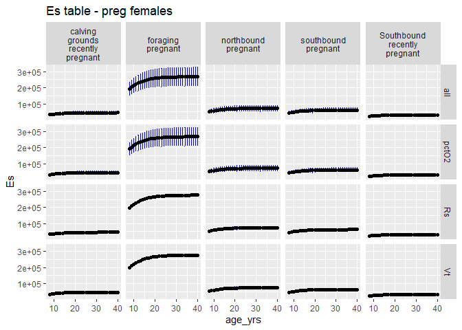
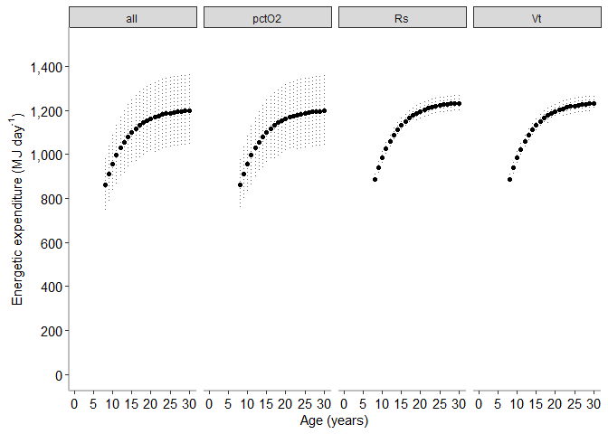
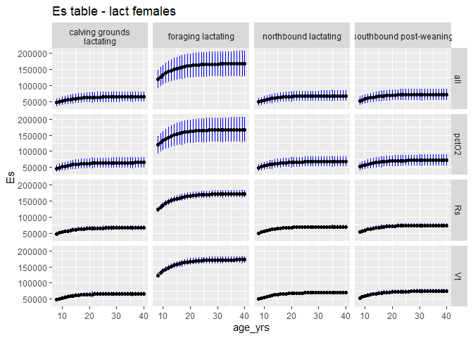
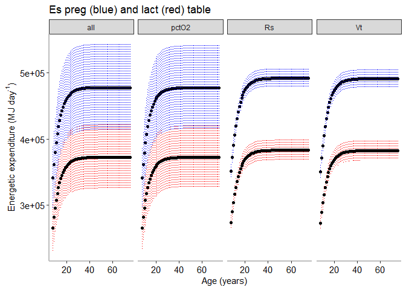
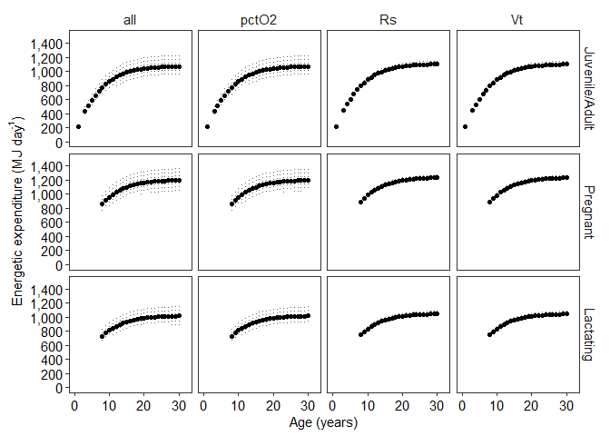

Energy Expenditure (Es) Sensitivity Analysis - Pregnant and Lactating
================
Selina Agbayani
10 March 2022 - code updated 21 July, 2025

``` r
# Set path for output figures: 
Figurespath <- paste0(getwd(), "/Es/figures", collapse = NULL)
Figurespath
```

    ## [1] "C:/Users/AgbayaniS/Documents/R/graywhale_energyreqs/Es/figures"

``` r
# Set path for input & output data  
datapath <- paste0(getwd(), "/data", collapse = NULL) 
datapath
```

    ## [1] "C:/Users/AgbayaniS/Documents/R/graywhale_energyreqs/data"

``` r
# Read in Tidal Volume table - Vt

Es_sensAnalysis_phase1 <- as_tibble(
  read_csv("data/Es_sensAnalysis_phase1_source_bpm.csv"),
  col_types = (list(cols(age_yrs = col_double(),
                         Lifestage = col_character(),
                         Activity_stages = col_character(),
                         no_days = col_double(),
                         MC_variable = col_character(),
                         mean_bpm = col_double(),
                         se_bpm = col_double(),
                         mean_bpd = col_double(),
                         Vt_mean = col_double(),
                         Vt_sd = col_double(),
                         Es_perday = col_double(),
                         Es_perday_sd = col_double(),
                         Es_perday_quant025 = col_double(),
                         Es_perday_quant975 = col_double(),
                         Es = col_double(),
                         Es_sd = col_double(),
                         Es_quant025 = col_double(),
                         Es_quant975 = col_double()
  )
  )
  )
)
```

    ## Rows: 60 Columns: 18
    ## ── Column specification ────────────────────────────────────────────────────────
    ## Delimiter: ","
    ## chr  (3): Lifestage, Activity_stages, MC_variable
    ## dbl (15): age_yrs, no_days, mean_bpm, se_bpm, mean_bpd, Vt_mean, Vt_sd, Es_p...
    ## 
    ## ℹ Use `spec()` to retrieve the full column specification for this data.
    ## ℹ Specify the column types or set `show_col_types = FALSE` to quiet this message.

``` r
Es_sensAnalysis_phase2_peryear <- as_tibble(
  read_csv("data/Es_sensAnalysis_phase2_peryear_source_bpm.csv"), 
  col_types = (list(cols(
    age_yrs = col_double(),
    Lifestage = col_character(),
    no_days = col_double(),
    Es = col_double(),
    Es_sd = col_double(),
    Es_perday = col_double(),
    Es_sd_perday = col_double()
  )
  )
  )
)
```

    ## Rows: 124 Columns: 8
    ## ── Column specification ────────────────────────────────────────────────────────
    ## Delimiter: ","
    ## chr (2): Lifestage, MC_variable
    ## dbl (6): age_yrs, no_days, Es, Es_sd, Es_perday, Es_sd_perday
    ## 
    ## ℹ Use `spec()` to retrieve the full column specification for this data.
    ## ℹ Specify the column types or set `show_col_types = FALSE` to quiet this message.

``` r
Vt_table_phase1 <- as_tibble(
  read_csv("data/Vt_table_phase1.csv"),                                
  col_types = (list(cols(age_yrs = col_double(),
                         Vt_mean = col_double(),
                         Vt_sd = col_double(),
                         quant025 = col_double(),
                         quant975 = col_double()
  )
  )
  )
)
```

    ## Rows: 25 Columns: 5
    ## ── Column specification ────────────────────────────────────────────────────────
    ## Delimiter: ","
    ## dbl (5): age_yrs, Vt_mean, Vt_sd, quant025, quant975
    ## 
    ## ℹ Use `spec()` to retrieve the full column specification for this data.
    ## ℹ Specify the column types or set `show_col_types = FALSE` to quiet this message.

``` r
Vt_table_phase2 <- as_tibble(
  read_csv("data/Vt_table_phase2.csv"),                                
  col_types = (list(cols(age_yrs = col_double(),
                         Vt_mean = col_double(),
                         Vt_sd = col_double(),
                         quant025 = col_double(),
                         quant975 = col_double()
  )
  )
  )
)
```

    ## Rows: 172 Columns: 5
    ## ── Column specification ────────────────────────────────────────────────────────
    ## Delimiter: ","
    ## dbl (5): age_yrs, Vt_mean, Vt_sd, quant025, quant975
    ## 
    ## ℹ Use `spec()` to retrieve the full column specification for this data.
    ## ℹ Specify the column types or set `show_col_types = FALSE` to quiet this message.

``` r
Vt_table_phase2_f <- as_tibble(
  read_csv("data/Vt_table_phase2_f.csv"),                                
  col_types = (list(cols(age_yrs = col_double(),
                         Vt_mean_f = col_double(),
                         Vt_sd_f = col_double(),
                         quant025_f = col_double(),
                         quant975_f = col_double()
  )
  )
  )
)
```

    ## Rows: 172 Columns: 5
    ## ── Column specification ────────────────────────────────────────────────────────
    ## Delimiter: ","
    ## dbl (5): age_yrs, Vt_mean_f, Vt_sd_f, quant025_f, quant975_f
    ## 
    ## ℹ Use `spec()` to retrieve the full column specification for this data.
    ## ℹ Specify the column types or set `show_col_types = FALSE` to quiet this message.

``` r
# Read in Activity Cost Reference data from csv  ORIGINAL SOURCE VALUES
A_cost_reference <- as_tibble(
  read_csv("data/ActivityCost_ReferenceData_BreathsPerDay_Table_VA_2017_original_sources.csv"),
  col_types = (list(cols(ID = col_double(),
                         Lifestage = col_character(),
                         Description = col_character(),
                         Activity_stages = col_character(),
                         no_days = col_double(),
                         source_no_days = col_character(),
                         bpm = col_double(),
                         se_bpm = col_double(),
                         source_bpm = col_character(),
                         age_yrs = col_double(),
                         age_yrs_min = col_double(),
                         age_yrs_max = col_double(),
                         pct_O2 = col_double(),
                         pct_O2_sd = col_double()
  )
  )
  )
)
```

    ## Rows: 60 Columns: 14
    ## ── Column specification ────────────────────────────────────────────────────────
    ## Delimiter: ","
    ## chr (5): Lifestage, Description, Activity_stages, source_no_days, source_bpm
    ## dbl (9): ID, no_days, bpm, se_bpm, age_yrs, age_yrs_min, age_yrs_max, pct_O2...
    ## 
    ## ℹ Use `spec()` to retrieve the full column specification for this data.
    ## ℹ Specify the column types or set `show_col_types = FALSE` to quiet this message.

``` r
kable(A_cost_reference)
```

| ID | Lifestage | Description | Activity_stages | no_days | source_no_days | bpm | se_bpm | source_bpm | age_yrs | age_yrs_min | age_yrs_max | pct_O2 | pct_O2_sd |
|---:|:---|:---|:---|---:|:---|---:|---:|:---|---:|---:|---:|---:|---:|
| 1 | Calf | Lagoon 0-1 mths (Jan) | calving grounds | 31 | Sumich (1986); Findley & Vidal (2002); Pike 1962 | 2.14 | 0.50 | Sumich (1986) as cited in Villegas-Amtmann et al. 2017 | 0.0849315 | 0.0000100 | 0.0849315 | 10.5 | 3.0 |
| 2 | Calf | Lagoon 2 mth (Feb) | calving grounds | 28 | Sumich (1986); Findley & Vidal (2002); Pike 1962 | 1.56 | 0.40 | Sumich (1986) as cited in Villegas-Amtmann et al. 2017 | 0.1616438 | 0.0849315 | 0.1616438 | 10.5 | 3.0 |
| 3 | Calf | Lagoon 3 mths (Mar) | calving grounds | 15 | Sumich (1986); Findley & Vidal (2002); Rice and Wolman 1971 | 1.39 | 0.30 | Sumich (1986) as cited in Villegas-Amtmann et al. 2017 | 0.2465753 | 0.1616438 | 0.2465753 | 10.5 | 3.0 |
| 4 | Calf | Northbound 3 mths (Mar) | northbound | 16 | Rodriguez de la Gala Hernandez 2008; Perryman et al. 2010; Poole 1984; Rice and Wolman 1971; Leatherwood 1974 | 0.70 | 0.10 | Rodriguez de la Gala-Hernandez et al. (2008) | 0.2465753 | 0.1616438 | 0.2465753 | 10.5 | 3.0 |
| 5 | Calf | Northbound 4 mths (Apr) | northbound | 30 | Poole (1984); Rodriguez de la Gala Hernandez et al. 2008; Perryman et al. 2010; Leatherwood 1974 | 0.70 | 0.10 | Rodriguez de la Gala-Hernandez et al. (2008) | 0.3287671 | 0.2465753 | 0.3287671 | 10.5 | 3.0 |
| 6 | Calf | Northbound 5 mths (May) | northbound | 31 | Braham (1984), Poole (1984); Rodriguez de la Gala Hernandez et al. 2008; Perryman et al. 2010; Rice and Wolman 1971; Leatherwood 1974 | 0.70 | 0.10 | Rodriguez de la Gala-Hernandez et al. (2008) | 0.4136986 | 0.3287671 | 0.4136986 | 10.5 | 3.0 |
| 7 | Calf | Northbound 6 mths (June) | northbound | 23 | Hessing (1981) as cited in Braham (1984); | 0.70 | 0.10 | Rodriguez de la Gala-Hernandez et al. (2008) | 0.4958904 | 0.4136986 | 0.4958904 | 11.0 | 2.7 |
| 8 | Calf | Nursing at Foraging grounds 6 mths (June) | nursing at foraging grounds | 7 | Synchenko (2011); Bradford et al. 2012 | 1.22 | 0.30 | Sychenko (2011) | 0.4958904 | 0.4136986 | 0.4958904 | 11.0 | 2.7 |
| 9 | Calf | Nursing at Foraging grounds 7 mths (July) | nursing at foraging grounds | 31 | Mom/calf observations: Sychenko (2011), Bradford et al 2012; Weller et al. 2003 | 1.22 | 0.30 | Sychenko (2011) | 0.5808219 | 0.4958904 | 0.5808219 | 11.0 | 2.7 |
| 10 | Calf | Nursing at foraging grounds 8 mths (Aug) | nursing at foraging grounds | 31 | Mom/calf observations: Sychenko (2011), Bradford et al 2012; Weller et al. 2003 | 1.22 | 0.30 | Sychenko (2011) | 0.6657534 | 0.5808219 | 0.6657534 | 11.0 | 2.7 |
| 11 | Calf | Nursing at foraging grounds (Sep) | nursing at foraging grounds | 30 | Mom/calf observations: Sychenko (2011), Bradford et al 2012; Weller et al. 2003 | 1.22 | 0.30 | Sychenko (2011) | 0.7479452 | 0.6657534 | 0.7479452 | 11.0 | 2.7 |
| 12 | Calf | nursing at foraging grounds (Oct) | nursing at foraging grounds | 20 | for approx date of weaning (~9.6 mths): Agbayani et al. 2020, Weller et al. 2009 | 1.22 | 0.30 | Sychenko (2011) | 0.8328767 | 0.7479452 | 0.8328767 | 11.0 | 2.7 |
| 13 | Calf | Southbound post-weaning (Oct) | southbound post-weaning | 11 | Rugh et al. (2001), Braham (1984) | 0.72 | 0.20 | Sumich (1983); Schwarz (2002), as cited in Villegas-Amtmann 2017 | 0.8328767 | 0.7479452 | 0.9150685 | 11.0 | 2.7 |
| 14 | Calf | Southbound post-weaning (Nov) | southbound post-weaning | 30 | Sumich (1986), Rugh et al. (2001), | 0.72 | 0.20 | Sumich (1983); Schwarz (2002), as cited in Villegas-Amtmann 2017 | 0.9150685 | 0.8328767 | 1.0000000 | 11.0 | 2.7 |
| 15 | Calf | Southbound post-weaning (Dec) | southbound post-weaning | 31 | Sumich (1986), Rugh et al. (2001), Laake et al. (2012) | 0.72 | 0.20 | Sumich (1983); Schwarz (2002), as cited in Villegas-Amtmann 2017 | 1.0000000 | 0.9150685 | 1.0000000 | 11.0 | 2.7 |
| 16 | Pregnant | Southbound newly pregnant (Dec) | Southbound recently pregnant | 31 | Rice 1983; Rice and Wolman 1971 | 0.72 | 0.20 | Sumich (1983); Schwarz (2002), as cited in Villegas-Amtmann 2017 | NA | 8.0000000 | 75.0000000 | 11.0 | 2.7 |
| 17 | Pregnant | Lagoon breeding (Jan) | calving grounds recently pregnant | 31 | Rice 1983 | 0.62 | 0.20 | Harvey & Mate (1984), as cited in Villegas-Amtmann et al. 2017 | NA | 8.0000000 | 75.0000000 | 11.0 | 2.7 |
| 18 | Pregnant | Lagoon breeding (Feb) | calving grounds recently pregnant | 20 | Rice 1983 | 0.62 | 0.20 | Harvey & Mate (1984), as cited in Villegas-Amtmann et al. 2017 | NA | 8.0000000 | 75.0000000 | 11.0 | 2.7 |
| 19 | Pregnant | Northbound solo pregnant (Feb) | northbound pregnant | 8 | Rice 1983 | 0.50 | 0.20 | Rodriguez de la Gala-Hernandez et al. (2008) | NA | 8.0000000 | 75.0000000 | 11.0 | 2.7 |
| 20 | Pregnant | Northbound solo pregnant (Mar) | northbound pregnant | 31 | Rice 1983; Rice & Wolman (1971) | 0.50 | 0.20 | Rodriguez de la Gala-Hernandez et al. (2008) | NA | 8.0000000 | 75.0000000 | 11.0 | 2.7 |
| 21 | Pregnant | Northbound solo pregnant (Apr) | northbound pregnant | 30 | Rice 1983; Rice & Wolman (1971) | 0.50 | 0.20 | Rodriguez de la Gala-Hernandez et al. (2008) | NA | 8.0000000 | 75.0000000 | 11.0 | 2.7 |
| 22 | Pregnant | Northbound pregnant (May) | northbound pregnant | 31 | Rice 1983 | 0.50 | 0.20 | Rodriguez de la Gala-Hernandez et al. (2008) | NA | 8.0000000 | 75.0000000 | 11.0 | 2.7 |
| 23 | Pregnant | Foraging pregnant (june) | foraging pregnant | 30 | Rice 1983; Rice & Wolman (1971) | 1.34 | 0.10 | O. Sychenko (unpubl.) | NA | 8.0000000 | 75.0000000 | 11.0 | 2.7 |
| 24 | Pregnant | Foraging pregnant (july) | foraging pregnant | 31 | Rice 1983 | 1.34 | 0.10 | O. Sychenko (unpubl.) | NA | 8.0000000 | 75.0000000 | 11.0 | 2.7 |
| 25 | Pregnant | Foraging pregnant (Aug) | foraging pregnant | 31 | Rice 1983 | 1.34 | 0.10 | O. Sychenko (unpubl.) | NA | 8.0000000 | 75.0000000 | 11.0 | 2.7 |
| 26 | Pregnant | Foraging pregnant (Sep) | foraging pregnant | 30 | Rice 1983 | 1.34 | 0.10 | O. Sychenko (unpubl.) | NA | 8.0000000 | 75.0000000 | 11.0 | 2.7 |
| 27 | Pregnant | Foraging pregnant (Oct) | foraging pregnant | 31 | Rice 1983 | 1.34 | 0.10 | O. Sychenko (unpubl.) | NA | 8.0000000 | 75.0000000 | 11.0 | 2.7 |
| 28 | Pregnant | Southbound pregnant (Nov) | southbound pregnant | 30 | Rice 1983; Sumich (1986), | 0.72 | 0.20 | Sumich (1983) and Schwarz (2002) | NA | 8.0000000 | 75.0000000 | 11.0 | 2.7 |
| 29 | Pregnant | Southbound pregnant (Dec) | southbound pregnant | 31 | Rice 1983; Sumich (1986), | 0.72 | 0.20 | Sumich (1983) and Schwarz (2002) | NA | 8.0000000 | 75.0000000 | 11.0 | 2.7 |
| 30 | Lactating | Lagoon lactating (Jan) | calving grounds lactating | 31 | Rice 1983; Sumich (1986); Findley & Vidal (2002); Pike 1962 | 0.62 | 0.20 | Harvey & Mate (1984) | NA | 8.0000000 | 75.0000000 | 11.0 | 2.7 |
| 31 | Lactating | Lagoon lactating (Feb) | calving grounds lactating | 28 | Rice 1983; Sumich (1986); Findley & Vidal (2002); Rugh et al. 2001 | 0.62 | 0.20 | Harvey & Mate (1984) | NA | 8.0000000 | 75.0000000 | 11.0 | 2.7 |
| 32 | Lactating | Lagoon lactating (March) | calving grounds lactating | 15 | (coincides with NB calves) Sumich (1986); Findley & Vidal (2002); Rugh et al. 2001; Rodriguez de la Gala Hernandez 2008 | 0.62 | 0.20 | Harvey & Mate (1984) | NA | 8.0000000 | 75.0000000 | 11.0 | 2.7 |
| 33 | Lactating | Northbound with calf (March) | northbound lactating | 16 | Rodriguez de la Gala Hernandez 2008; Poole 1984; Perryman et al. 2010; Leatherwood (1974) | 0.50 | 0.10 | Rodriguez de la Gala-Hernandez et al. (2008) | NA | 8.0000000 | 75.0000000 | 11.0 | 2.7 |
| 34 | Lactating | Northbound with calf (April) | northbound lactating | 30 | Braham (1984), Poole (1984); Rodriguez de la Gala Hernandez et al. 2008; Perryman et al. 2010; Leatherwood 1974; Rice and Wolman (1971) | 0.50 | 0.10 | Rodriguez de la Gala-Hernandez et al. (2008) | NA | 8.0000000 | 75.0000000 | 11.0 | 2.7 |
| 35 | Lactating | Northbound with calf (May) | northbound lactating | 31 | Braham (1984), Poole (1984); Rodriguez de la Gala Hernandez et al. 2008; Perryman et al. 2010; Leatherwood 1974; | 0.50 | 0.10 | Rodriguez de la Gala-Hernandez et al. (2008) | NA | 8.0000000 | 75.0000000 | 11.0 | 2.7 |
| 36 | Lactating | Northbound with Calf (June) | northbound lactating | 23 | Hessing (1981) as cited in Braham (1984) | 0.50 | 0.10 | Rodriguez de la Gala-Hernandez et al. (2008) | NA | 8.0000000 | 75.0000000 | 11.0 | 2.7 |
| 37 | Lactating | Foraging lactating (June) | foraging lactating | 7 | Mom/calf observations: Synchenko (2011) | 1.04 | 0.20 | O. Sychenko (unpubl.) | NA | 8.0000000 | 75.0000000 | 11.0 | 2.7 |
| 38 | Lactating | Foraging lactating (July) | foraging lactating | 31 | Mom/calf observations: Sychenko (2011), Bradford et al 2012 | 1.04 | 0.20 | O. Sychenko (unpubl.) | NA | 8.0000000 | 75.0000000 | 11.0 | 2.7 |
| 39 | Lactating | Foraging lactating (Aug) | foraging lactating | 31 | Mom/calf observations: Sychenko (2011), Bradford et al 2012 | 1.04 | 0.20 | O. Sychenko (unpubl.) | NA | 8.0000000 | 75.0000000 | 11.0 | 2.7 |
| 40 | Lactating | Foraging lactating (Sep) | foraging lactating | 30 | Mom/calf observations: Sychenko (2011), Bradford et al 2012 | 1.04 | 0.20 | O. Sychenko (unpubl.) | NA | 8.0000000 | 75.0000000 | 11.0 | 2.7 |
| 41 | Lactating | Foraging lactating (Oct) | foraging lactating | 20 | for approx date of weaning (~9.6 mths): Agbayani et al. 2020, Weller et al. 2009 | 1.04 | 0.20 | O. Sychenko (unpubl.) | NA | 8.0000000 | 75.0000000 | 11.0 | 2.7 |
| 42 | Lactating | Southbound post-weaning (Oct) | southbound post-weaning | 11 | Braham (1984); Rugh et al. (2001); Rodriguez de la Gala-Hernandez (2008); Pike (1962) | 0.72 | 0.20 | Sumich (1983) and Schwarz (2002) | NA | 8.0000000 | 75.0000000 | 11.0 | 2.7 |
| 43 | Lactating | Southbound post-weaning (Nov) | southbound post-weaning | 30 | Rugh et al. 2001; Braham (1984); Rodriguez de la Gala-Hernandez (2008) | 0.72 | 0.20 | Sumich (1983) and Schwarz (2002) | NA | 8.0000000 | 75.0000000 | 11.0 | 2.7 |
| 44 | Lactating | Southbound postweaning (Dec) | southbound post-weaning | 31 | Rugh et al. 2001; Braham (1984); Rodriguez de la Gala-Hernandez (2008); Sumich 1986 | 0.72 | 0.20 | Sumich (1983) and Schwarz (2002) | NA | 8.0000000 | 75.0000000 | 11.0 | 2.7 |
| 45 | Juvenile/Adult | Southbound solo (Jan) | southbound | 15 | Rodriguez de la Gala-Hernandez (2008); Sumich 1986 | 0.72 | 0.20 | Sumich (1983) and Schwarz (2002) | NA | 1.0000000 | 75.0000000 | 11.0 | 2.7 |
| 46 | Juvenile/Adult | Lagoon solo (Jan) | calving grounds | 16 | Sumich (1986), Findley & Vidal (2002); Rice and Wolman 1971; Findley and Vidal 2002 | 0.62 | 0.20 | Harvey & Mate (1984), Sumich (1986) | NA | 1.0000000 | 75.0000000 | 11.0 | 2.7 |
| 47 | Juvenile/Adult | Lagoon solo (Feb) | calving grounds | 14 | Rice and Wolman (1971); Findley & Vidal (2002); Urban et al. 2021; Rugh et al. 2001 | 0.62 | 0.20 | Harvey & Mate (1984), Sumich (1986) | NA | 1.0000000 | 75.0000000 | 11.0 | 2.7 |
| 48 | Juvenile/Adult | Northbound solo (Feb) | northbound | 14 | Rice and Wolman (1971); Poole (1984), Pike (1962), Rodriguez de la Gala Hernandez et al. 2008; Sumich (1986) | 0.50 | 0.03 | Rodriguez de la Gala-Hernandez et al. (2008) | NA | 1.0000000 | 75.0000000 | 11.0 | 2.7 |
| 49 | Juvenile/Adult | Northbound solo (March) | northbound | 31 | Rice and Wolman (1971); Poole (1984), Pike (1962), Rodriguez de la Gala Hernandez et al. 2008; Braham (1984); Urban et al. 2021 (Maria started migrating March 9); Leatherwood 1974 | 0.50 | 0.03 | Rodriguez de la Gala-Hernandez et al. (2008) | NA | 1.0000000 | 75.0000000 | 11.0 | 2.7 |
| 50 | Juvenile/Adult | Northbound solo (April) | northbound | 30 | Rice and Wolman (1971) \*data ends in April; Poole (1984), Pike (1962), Rodriguez de la Gala Hernandez et al. 2008; Braham (1984); Urban et al. 2021 | 0.50 | 0.03 | Rodriguez de la Gala-Hernandez et al. (2008) | NA | 1.0000000 | 75.0000000 | 11.0 | 2.7 |
| 51 | Juvenile/Adult | Northbound solo (May) | northbound | 15 | Poole (1984), Pike (1962), Rodriguez de la Gala Hernandez et al. 2008; Braham (1984); Urban et al. 2021 (Maria stopped migrating May 24) | 0.50 | 0.03 | Rodriguez de la Gala-Hernandez et al. (2008) | NA | 1.0000000 | 75.0000000 | 11.0 | 2.7 |
| 52 | Juvenile/Adult | Foraging solo (May) | foraging | 16 | Kim and Oliver (1989); Heide-Jorgensen et al. (2012); 5 months (May to Oct); Urban et al. 2021 | 1.04 | 0.20 | O. Sychenko (unpubl.) | NA | 1.0000000 | 75.0000000 | 11.0 | 2.7 |
| 53 | Juvenile/Adult | Foraging solo (June) | foraging | 30 | Kim and Oliver (1989); Pike (1962); Heide-Jorgensen et al. (2012); Urban et al. 2021 | 1.04 | 0.20 | O. Sychenko (unpubl.) | NA | 1.0000000 | 75.0000000 | 11.0 | 2.7 |
| 54 | Juvenile/Adult | Foraging solo (July) | foraging | 31 | Kim and Oliver (1989); Pike (1962); Heide-Jorgensen et al. (2012); Urban et al. 2021; Bradford et al. 2012 | 1.04 | 0.20 | O. Sychenko (unpubl.) | NA | 1.0000000 | 75.0000000 | 11.0 | 2.7 |
| 55 | Juvenile/Adult | Foraging solo (Aug) | foraging | 31 | Pike (1962); Heide-Jorgensen et al. (2012); Bradford et al. 2012 | 1.04 | 0.20 | O. Sychenko (unpubl.) | NA | 1.0000000 | 75.0000000 | 11.0 | 2.7 |
| 56 | Juvenile/Adult | Foraging solo (Sep) | foraging | 30 | Pike (1962); Heide-Jorgensen et al. (2012); Bradford et al. 2012 | 1.04 | 0.20 | O. Sychenko (unpubl.) | NA | 1.0000000 | 75.0000000 | 11.0 | 2.7 |
| 57 | Juvenile/Adult | Foraging solo (Oct) | foraging | 16 | Kim and Oliver (1989); Pike (1962); Heide-Jorgensen et al. (2012); Bradford et al. 2012; Rugh et al. 2001 | 1.04 | 0.20 | O. Sychenko (unpubl.) | NA | 1.0000000 | 75.0000000 | 11.0 | 2.7 |
| 58 | Juvenile/Adult | Southbound (Oct) | southbound | 15 | Rugh et al. 2001; Braham (1984); Rodriguez de la Gala-Hernandez (2008); Pike (1962) | 0.72 | 0.20 | Sumich (1983); Schwarz (2002); Villegas-Amtmann 2017 | NA | 1.0000000 | 75.0000000 | 11.0 | 2.7 |
| 59 | Juvenile/Adult | Southbound (Nov) | southbound | 30 | Sumich (1986), Rugh et al. (2001), Braham 1984; | 0.72 | 0.20 | Sumich (1983); Schwarz (2002); Villegas-Amtmann 2017 | NA | 1.0000000 | 75.0000000 | 11.0 | 2.7 |
| 60 | Juvenile/Adult | Southbound (Dec) | southbound | 31 | Sumich (1986), Laake et al. (2012); Pike 1962; Rugh et al. (2001), Braham (1984); Leatherwood (1974) | 0.72 | 0.20 | Sumich (1983); Schwarz (2002); Villegas-Amtmann 2017 | NA | 1.0000000 | 75.0000000 | 11.0 | 2.7 |

``` r
Activity_days <- A_cost_reference %>% dplyr::select(Lifestage, Activity_stages, no_days) %>%  
  group_by(Lifestage, Activity_stages) %>% 
  summarise(no_days = sum(no_days))
```

    ## `summarise()` has grouped output by 'Lifestage'. You can override using the
    ## `.groups` argument.

``` r
kable(Activity_days)
```

| Lifestage      | Activity_stages                   | no_days |
|:---------------|:----------------------------------|--------:|
| Calf           | calving grounds                   |      74 |
| Calf           | northbound                        |     100 |
| Calf           | nursing at foraging grounds       |     119 |
| Calf           | southbound post-weaning           |      72 |
| Juvenile/Adult | calving grounds                   |      30 |
| Juvenile/Adult | foraging                          |     154 |
| Juvenile/Adult | northbound                        |      90 |
| Juvenile/Adult | southbound                        |      91 |
| Lactating      | calving grounds lactating         |      74 |
| Lactating      | foraging lactating                |     119 |
| Lactating      | northbound lactating              |     100 |
| Lactating      | southbound post-weaning           |      72 |
| Pregnant       | Southbound recently pregnant      |      31 |
| Pregnant       | calving grounds recently pregnant |      51 |
| Pregnant       | foraging pregnant                 |     153 |
| Pregnant       | northbound pregnant               |     100 |
| Pregnant       | southbound pregnant               |      61 |

``` r
age_yr_tibble <- as_tibble(
  read_csv("data/age_yr_tibble.csv"), 
  col_types = (list(ID = col_integer(),
                    month = col_character(),
                    no_days_in_mth = col_double(),
                    age_mth = col_double(),
                    no_days_cumul = col_double(),
                    age_yrs = col_double()
  )
  )
)
```

    ## Rows: 25 Columns: 5
    ## ── Column specification ────────────────────────────────────────────────────────
    ## Delimiter: ","
    ## chr (1): month
    ## dbl (4): no_days_in_mth, age_mth, no_days_cumul, age_yrs
    ## 
    ## ℹ Use `spec()` to retrieve the full column specification for this data.
    ## ℹ Specify the column types or set `show_col_types = FALSE` to quiet this message.

## Total metabolic energy expenditure at a given stage (E<sub>s</sub>)

E<sub>s</sub> = 0.02 x %O<sub>2</sub> x T<sub>s</sub> x R<sub>s</sub> x
V<sub>t</sub> - Sumich (1986)

where:

0.02 - Amount of heat produced in MJ/L O2 consumed (Kleiber 1961)  
%O<sub>2</sub> - Extraction efficiency per breath  
T<sub>s</sub> - The no. of days in that stage  
R<sub>s</sub> - Respiration rate (breaths/day)  
V<sub>t</sub> - Tidal lung volume (L)

``` r
#Original code was run with MC_reps <- 10000  and took a very long time
#To test and explore the code, use less reps 

MC_reps = 10

Lifestage <- "Pregnant"
activity_stages <- Activity_days %>%
  dplyr::filter(Lifestage == "Pregnant")

activity_stages  <-  activity_stages$Activity_stages

Es_sensAnalysis_preg_females <- as.data.frame(matrix(ncol = 18, nrow = 0))

cnames <- c("age_yrs","Lifestage","Activity_stages","MC_variable",
            "no_days", "mean_bpm", "se_bpm", "mean_bpd",
            "Vt_mean", "Vt_sd",
            "Es_perday", "Es_perday_sd",
            "Es_perday_quant025", "Es_perday_quant975", #2.5% and 97.5% quantile from bootstrap estimates
            "Es","Es_sd","Es_quant025","Es_quant975"
)
        


colnames(Es_sensAnalysis_preg_females) <- cnames

Es_sensAnalysis_preg_females <- 
  as_tibble(Es_sensAnalysis_preg_females,
            col_types = (list(ID = col_integer(), 
                              age_yrs = col_double(),
                              Lifestage = col_double(),
                              Activity_stages = col_double(),
                              MC_variable = col_character(),
                              no_days = col_double(),
                              mean_bpm = col_double(),
                              se_bpm = col_double(),  
                              mean_bpd = col_double(),
                              Vt_mean = col_double(),
                              Vt_sd = col_double(),
                              Es_perday = col_double(),
                              Es_perday_sd  = col_double(),
                              Es_perday_quant025  = col_double(),
                              Es_perday_quant975 = col_double(),
                              Es = col_double(),
                              Es_sd = col_double(),
                              Es_quant025 = col_double(),
                              Es_quant975 = col_double()
            )
            )
  )


for (age in seq(from = 8, to = 75, by = 1)){
  for (MC_var in c("all","Rs", "Vt", "pctO2")){
    
     
    for (activity in activity_stages){
      # for (a in c("calving grounds pregnant","northbound pregnant","foraging pregnant",
      #             "southbound pregnant")
      # ){
      strcolname <- as.character(age)
      
      A_cost_i <- dplyr::filter(A_cost_reference, 
                                Lifestage == Lifestage &
                                  Activity_stages == activity &
                                  age >= age_yrs_min &
                                  age <= age_yrs_max)
      
      if (nrow(A_cost_i) > 0) {
        Vt_table_i <- dplyr::filter(Vt_table_phase2, age_yrs == age-0.5)
        

        # O2 extraction efficiency
        pct_O2_i <- A_cost_i$pct_O2 /100
        if (MC_var == "all" || MC_var == "pctO2"){
          pct_O2_sd_i <- A_cost_i$pct_O2_sd /100
        } else {
          pct_O2_sd_i <- 0
        }
        
        set.seed(12345)
        pct_O2 <- rnorm(MC_reps, pct_O2_i, pct_O2_sd_i)  
        
        #No. of days at each actvity stage
        no_days_i <-  sum(A_cost_i$no_days)   
        
        #Respiration rates at each activity stage 
        bpm_i <- A_cost_i$bpm 
        bpm_sd_i <- A_cost_i$se_bpm 
        
        meanlog_bpm_i <- log(bpm_i^2 / sqrt(bpm_sd_i^2 + bpm_i^2))
        meanlog_bpm_sd_i <- sqrt(log(1 + (bpm_sd_i^2 / bpm_i^2)))
        
        bpm_tibble <- as.data.frame(matrix(ncol = 2, nrow=0))
        colnames(bpm_tibble) <- c("mean_bpm", "sd_bpm")
        bpm_tibble <- as_tibble(bpm_tibble,
                                col_types = (list(ID = col_integer(), 
                                                  mean_bpm = col_double(),
                                                  sd_bpm = col_double()
                                                  
                                )))
        
        for (i in seq(from = 1, to = MC_reps, by = 1)){
          
          #sample from lognormal distribution
          bpm <- rlnorm(MC_reps, meanlog_bpm_i, meanlog_bpm_sd_i)  
          # draws <- rlnorm(n=1000000, location, shape)
          # https://msalganik.wordpress.com/2017/01/21/making-sense-of-the-rlnorm-function-in-r/
          # plot(bpm)
          mean_bpm <- mean(bpm)
          sd_bpm <- sd(bpm)
          bpm_row <- tibble(mean_bpm = mean_bpm,
                            sd_bpm = sd_bpm)
          bpm_tibble <- rbind(bpm_tibble, bpm_row) 
          bpm_row <- NA
        }
        
        
        mean_bpm_i <- mean(bpm_tibble$mean_bpm)
        se_bpm_i <- sd(bpm_tibble$mean_bpm)     #sd of mean of means
        
        mean_bpm_reps <- bpm_tibble$mean_bpm
        
        # breath_hold_time <- 1/mean_bpm_reps
        # #plot(breath_hold_time)
        # mean(breath_hold_time)
        # sd(breath_hold_time)
        
        #breaths per day
        # bpd <- 1440/breath_hold_time
        # mean(bpd)
        # sd(bpd)
        #plot(bpd)
        
        #other option - truncated normal distribution
        #bpm <- rtruncnorm(MC_reps, a=0, b=Inf, mean=bpm_i, sd=bpm_sd_i)
        
        # breaths/day
        bpd <- mean_bpm_reps * 60 * 24
        # plot(bpd)
        bpd_mean_i <-  mean(bpd)
        
        if (MC_var == "all" || MC_var == "Rs"){
          bpd_sd_i <- sd(bpd)  
        } else {
          bpd_sd_i = 0
        }
        
        #tidal volume (mass dependent)
        Vt_i <- Vt_table_i$Vt_mean
        if (MC_var == "all" || MC_var == "Vt"){
          Vt_sd_i <- Vt_table_i$Vt_sd  
        } else {
          Vt_sd_i = 0
        }
        
        set.seed(12345)
        Vt <- rnorm(MC_reps, Vt_i, Vt_sd_i)
        Vt_mean_i <- mean(Vt)
        Vt_sd_i <- sd(Vt)
        #plot(Vt)
        
        Es_perday <- 0.02 * pct_O2* bpd * Vt  # * Ts_i 
        #plot(MR_perday)
        
        Es_perday_mean <- mean(Es_perday)
        Es_perday_sd <- sd(Es_perday)
        Es_perday_quant025 <- quantile(Es_perday, 0.025, na.rm = TRUE)
        Es_perday_quant975 <- quantile(Es_perday, 0.975, na.rm = TRUE)
        
        Es = Es_perday * no_days_i
        #plot(Es)
        Es_mean = mean(Es)
        Es_sd = sd(Es)
        Es_quant025 <- quantile(Es, 0.025, na.rm = TRUE)
        Es_quant975 <- quantile(Es, 0.975, na.rm = TRUE)
        
        
        # "age_yrs", "Es", "Es_sd", "quant025", "quant975" 
        row <- tibble(age_yrs = age,
                      Lifestage = Lifestage,
                      Activity_stages = activity,
                      no_days = no_days_i,
                      MC_variable = MC_var,
                      mean_bpm = mean_bpm_i,
                      se_bpm = se_bpm_i,
                      Es_perday = Es_perday_mean, 
                      Es_perday_sd = Es_perday_sd, 
                      Es_perday_quant025 = Es_perday_quant025,
                      Es_perday_quant975  = Es_perday_quant975,
                      Es = Es_mean, 
                      Es_sd = Es_sd,
                      Es_quant025 = Es_quant025, 
                      Es_quant975 = Es_quant975)
        
        Es_sensAnalysis_preg_females  <- 
          rbind(Es_sensAnalysis_preg_females , row)
      }
    }    
  }}


kable(head(Es_sensAnalysis_preg_females))
```

| age_yrs | Lifestage | Activity_stages | no_days | MC_variable | mean_bpm | se_bpm | Es_perday | Es_perday_sd | Es_perday_quant025 | Es_perday_quant975 | Es | Es_sd | Es_quant025 | Es_quant975 |
|---:|:---|:---|---:|:---|---:|---:|---:|---:|---:|---:|---:|---:|---:|---:|
| 8 | Pregnant | Southbound recently pregnant | 31 | all | 0.7763540 | 0.0699055 | 715.7779 | 176.21526 | 404.5746 | 890.2922 | 22189.12 | 5462.673 | 12541.81 | 27599.06 |
| 8 | Pregnant | calving grounds recently pregnant | 51 | all | 0.6771545 | 0.0702738 | 624.7810 | 158.01422 | 348.6750 | 781.1199 | 31863.83 | 8058.725 | 17782.43 | 39837.12 |
| 8 | Pregnant | foraging pregnant | 153 | all | 1.3657968 | 0.0338154 | 1254.5528 | 276.79317 | 751.7778 | 1524.2726 | 191946.58 | 42349.354 | 115022.01 | 233213.71 |
| 8 | Pregnant | northbound pregnant | 100 | all | 0.5583014 | 0.0707832 | 515.7444 | 136.69278 | 281.6478 | 650.3114 | 51574.44 | 13669.278 | 28164.78 | 65031.14 |
| 8 | Pregnant | southbound pregnant | 61 | all | 0.7763540 | 0.0699055 | 715.7779 | 176.21526 | 404.5746 | 890.2922 | 43662.45 | 10749.131 | 24679.05 | 54307.83 |
| 8 | Pregnant | Southbound recently pregnant | 31 | Rs | 0.7757298 | 0.0707901 | 735.3205 | 67.10248 | 655.7006 | 846.5409 | 22794.94 | 2080.177 | 20326.72 | 26242.77 |

``` r
Es_sensAnalysis_preg_females  %>% write_csv("data/Es_sensAnalysis_preg_source_bpm.csv", na = "", append = FALSE)
```

``` r
plot_Es_sensAnalysis_preg_females <- Es_sensAnalysis_preg_females %>% 
  filter(age_yrs <=40) %>% 
  ggplot(aes(x = age_yrs, y = Es))+
  geom_errorbar(aes(ymin = Es - Es_sd, ymax = Es + Es_sd),
                colour = "blue", width = 0.02)+
   facet_grid(MC_variable ~ Activity_stages,
              labeller = label_wrap_gen(width = 2, multi_line = TRUE)) +
  geom_point()+
  ggtitle("Es table - preg females")

plot_Es_sensAnalysis_preg_females
```

<!-- -->

``` r
# pregnant only 
#pull out blank Es_subtable
Es_subtable_preg <- Es_sensAnalysis_preg_females %>% dplyr::filter(age_yrs >999, Lifestage == Lifestage)
kable(Es_sensAnalysis_preg_females)
```

| age_yrs | Lifestage | Activity_stages | no_days | MC_variable | mean_bpm | se_bpm | Es_perday | Es_perday_sd | Es_perday_quant025 | Es_perday_quant975 | Es | Es_sd | Es_quant025 | Es_quant975 |
|---:|:---|:---|---:|:---|---:|---:|---:|---:|---:|---:|---:|---:|---:|---:|
| 8 | Pregnant | Southbound recently pregnant | 31 | all | 0.7763540 | 0.0699055 | 715.7779 | 176.21526 | 404.5746 | 890.2922 | 22189.12 | 5462.673 | 12541.81 | 27599.06 |
| 8 | Pregnant | calving grounds recently pregnant | 51 | all | 0.6771545 | 0.0702738 | 624.7810 | 158.01422 | 348.6750 | 781.1199 | 31863.83 | 8058.725 | 17782.43 | 39837.12 |
| 8 | Pregnant | foraging pregnant | 153 | all | 1.3657968 | 0.0338154 | 1254.5528 | 276.79317 | 751.7778 | 1524.2726 | 191946.58 | 42349.354 | 115022.01 | 233213.71 |
| 8 | Pregnant | northbound pregnant | 100 | all | 0.5583014 | 0.0707832 | 515.7444 | 136.69278 | 281.6478 | 650.3114 | 51574.44 | 13669.278 | 28164.78 | 65031.14 |
| 8 | Pregnant | southbound pregnant | 61 | all | 0.7763540 | 0.0699055 | 715.7779 | 176.21526 | 404.5746 | 890.2922 | 43662.45 | 10749.131 | 24679.05 | 54307.83 |
| 8 | Pregnant | Southbound recently pregnant | 31 | Rs | 0.7757298 | 0.0707901 | 735.3205 | 67.10248 | 655.7006 | 846.5409 | 22794.94 | 2080.177 | 20326.72 | 26242.77 |
| 8 | Pregnant | calving grounds recently pregnant | 51 | Rs | 0.6764862 | 0.0712364 | 641.2467 | 67.52559 | 560.1611 | 752.5952 | 32703.58 | 3443.805 | 28568.21 | 38382.36 |
| 8 | Pregnant | foraging pregnant | 153 | Rs | 1.3655634 | 0.0341150 | 1294.4285 | 32.33790 | 1258.5019 | 1349.1265 | 198047.56 | 4947.698 | 192550.79 | 206416.35 |
| 8 | Pregnant | northbound pregnant | 100 | Rs | 0.5575534 | 0.0718869 | 528.5093 | 68.14222 | 445.1570 | 639.8641 | 52850.93 | 6814.222 | 44515.70 | 63986.41 |
| 8 | Pregnant | southbound pregnant | 61 | Rs | 0.7757298 | 0.0707901 | 735.3205 | 67.10248 | 655.7006 | 846.5409 | 44854.55 | 4093.251 | 39997.74 | 51638.99 |
| 8 | Pregnant | Southbound recently pregnant | 31 | Vt | 0.7757298 | 0.0707901 | 733.9572 | 64.78788 | 658.3504 | 843.3247 | 22752.67 | 2008.424 | 20408.86 | 26143.06 |
| 8 | Pregnant | calving grounds recently pregnant | 51 | Vt | 0.6764862 | 0.0712364 | 640.0242 | 65.40014 | 562.6510 | 749.7356 | 32641.23 | 3335.407 | 28695.20 | 38236.51 |
| 8 | Pregnant | foraging pregnant | 153 | Vt | 1.3655634 | 0.0341150 | 1292.3088 | 30.66023 | 1257.2405 | 1343.9992 | 197723.24 | 4691.015 | 192357.79 | 205631.88 |
| 8 | Pregnant | northbound pregnant | 100 | Vt | 0.5575534 | 0.0718869 | 527.4525 | 66.26158 | 447.6408 | 637.4319 | 52745.25 | 6626.158 | 44764.08 | 63743.19 |
| 8 | Pregnant | southbound pregnant | 61 | Vt | 0.7757298 | 0.0707901 | 733.9572 | 64.78788 | 658.3504 | 843.3247 | 44771.39 | 3952.060 | 40159.37 | 51442.80 |
| 8 | Pregnant | Southbound recently pregnant | 31 | pctO2 | 0.7763540 | 0.0699055 | 715.5116 | 171.27931 | 412.2103 | 883.7761 | 22180.86 | 5309.659 | 12778.52 | 27397.06 |
| 8 | Pregnant | calving grounds recently pregnant | 51 | pctO2 | 0.6771545 | 0.0702738 | 624.5353 | 153.83297 | 355.2659 | 775.4028 | 31851.30 | 7845.481 | 18118.56 | 39545.54 |
| 8 | Pregnant | foraging pregnant | 153 | pctO2 | 1.3657968 | 0.0338154 | 1254.2252 | 267.14919 | 765.8832 | 1512.7084 | 191896.45 | 40873.826 | 117180.12 | 231444.39 |
| 8 | Pregnant | northbound pregnant | 100 | pctO2 | 0.5583014 | 0.0707832 | 515.5238 | 133.42349 | 286.9867 | 645.5515 | 51552.38 | 13342.349 | 28698.67 | 64555.15 |
| 8 | Pregnant | southbound pregnant | 61 | pctO2 | 0.7763540 | 0.0699055 | 715.5116 | 171.27931 | 412.2103 | 883.7761 | 43646.21 | 10448.038 | 25144.83 | 53910.34 |
| 9 | Pregnant | Southbound recently pregnant | 31 | all | 0.7763540 | 0.0699055 | 758.5298 | 186.40097 | 429.2793 | 943.0384 | 23514.43 | 5778.430 | 13307.66 | 29234.19 |
| 9 | Pregnant | calving grounds recently pregnant | 51 | all | 0.6771545 | 0.0702738 | 662.0970 | 167.16474 | 369.9670 | 827.3980 | 33766.95 | 8525.402 | 18868.32 | 42197.30 |
| 9 | Pregnant | foraging pregnant | 153 | all | 1.3657968 | 0.0338154 | 1329.4943 | 292.66238 | 797.6782 | 1614.5512 | 203412.63 | 44777.344 | 122044.76 | 247026.33 |
| 9 | Pregnant | northbound pregnant | 100 | all | 0.5583014 | 0.0707832 | 546.5467 | 144.63260 | 298.8478 | 688.8396 | 54654.67 | 14463.260 | 29884.78 | 68883.96 |
| 9 | Pregnant | southbound pregnant | 61 | all | 0.7763540 | 0.0699055 | 758.5298 | 186.40097 | 429.2793 | 943.0384 | 46270.32 | 11370.459 | 26186.04 | 57525.34 |
| 9 | Pregnant | Southbound recently pregnant | 31 | Rs | 0.7757298 | 0.0707901 | 779.2587 | 71.11210 | 694.8812 | 897.1248 | 24157.02 | 2204.475 | 21541.32 | 27810.87 |
| 9 | Pregnant | calving grounds recently pregnant | 51 | Rs | 0.6764862 | 0.0712364 | 679.5636 | 71.56049 | 593.6328 | 797.5656 | 34657.74 | 3649.585 | 30275.27 | 40675.85 |
| 9 | Pregnant | foraging pregnant | 153 | Rs | 1.3655634 | 0.0341150 | 1371.7754 | 34.27021 | 1333.7021 | 1429.7418 | 209881.64 | 5243.341 | 204056.42 | 218750.50 |
| 9 | Pregnant | northbound pregnant | 100 | Rs | 0.5575534 | 0.0718869 | 560.0897 | 72.21397 | 471.7568 | 678.0984 | 56008.97 | 7221.397 | 47175.68 | 67809.84 |
| 9 | Pregnant | southbound pregnant | 61 | Rs | 0.7757298 | 0.0707901 | 779.2587 | 71.11210 | 694.8812 | 897.1248 | 47534.78 | 4337.838 | 42387.75 | 54724.61 |
| 9 | Pregnant | Southbound recently pregnant | 31 | Vt | 0.7757298 | 0.0707901 | 777.9085 | 68.79820 | 697.5650 | 893.9396 | 24115.16 | 2132.744 | 21624.52 | 27712.13 |
| 9 | Pregnant | calving grounds recently pregnant | 51 | Vt | 0.6764862 | 0.0712364 | 678.3529 | 69.43951 | 596.1673 | 794.7335 | 34596.00 | 3541.415 | 30404.53 | 40531.41 |
| 9 | Pregnant | foraging pregnant | 153 | Vt | 1.3655634 | 0.0341150 | 1369.6761 | 32.44995 | 1332.9700 | 1424.6640 | 209560.45 | 4964.842 | 203944.41 | 217973.59 |
| 9 | Pregnant | northbound pregnant | 100 | Vt | 0.5575534 | 0.0718869 | 559.0430 | 70.34097 | 474.3092 | 675.6896 | 55904.30 | 7034.097 | 47430.92 | 67568.96 |
| 9 | Pregnant | southbound pregnant | 61 | Vt | 0.7757298 | 0.0707901 | 777.9085 | 68.79820 | 697.5650 | 893.9396 | 47452.42 | 4196.690 | 42551.47 | 54530.32 |
| 9 | Pregnant | Southbound recently pregnant | 31 | pctO2 | 0.7763540 | 0.0699055 | 758.2661 | 181.51389 | 436.8414 | 936.5851 | 23506.25 | 5626.930 | 13542.08 | 29034.14 |
| 9 | Pregnant | calving grounds recently pregnant | 51 | pctO2 | 0.6771545 | 0.0702738 | 661.8536 | 163.02507 | 376.4944 | 821.7360 | 33754.53 | 8314.278 | 19201.21 | 41908.53 |
| 9 | Pregnant | foraging pregnant | 153 | pctO2 | 1.3657968 | 0.0338154 | 1329.1698 | 283.11235 | 811.6475 | 1603.0984 | 203362.98 | 43316.190 | 124182.07 | 245274.06 |
| 9 | Pregnant | northbound pregnant | 100 | pctO2 | 0.5583014 | 0.0707832 | 546.3283 | 141.39604 | 304.1352 | 684.1256 | 54632.83 | 14139.604 | 30413.52 | 68412.56 |
| 9 | Pregnant | southbound pregnant | 61 | pctO2 | 0.7763540 | 0.0699055 | 758.2661 | 181.51389 | 436.8414 | 936.5851 | 46254.23 | 11072.347 | 26647.32 | 57131.69 |
| 10 | Pregnant | Southbound recently pregnant | 31 | all | 0.7763540 | 0.0699055 | 795.5353 | 195.17495 | 450.7314 | 988.6405 | 24661.59 | 6050.423 | 13972.67 | 30647.86 |
| 10 | Pregnant | calving grounds recently pregnant | 51 | all | 0.6771545 | 0.0702738 | 694.3970 | 175.04923 | 388.4558 | 867.4082 | 35414.25 | 8927.511 | 19811.25 | 44237.82 |
| 10 | Pregnant | foraging pregnant | 153 | all | 1.3657968 | 0.0338154 | 1394.3637 | 306.31506 | 837.5346 | 1692.5987 | 213337.65 | 46866.204 | 128142.80 | 258967.61 |
| 10 | Pregnant | northbound pregnant | 100 | all | 0.5583014 | 0.0707832 | 573.2085 | 151.47703 | 313.7834 | 722.1496 | 57320.85 | 15147.703 | 31378.34 | 72214.96 |
| 10 | Pregnant | southbound pregnant | 61 | all | 0.7763540 | 0.0699055 | 795.5353 | 195.17495 | 450.7314 | 988.6405 | 48527.65 | 11905.672 | 27494.62 | 60307.07 |
| 10 | Pregnant | Southbound recently pregnant | 31 | Rs | 0.7757298 | 0.0707901 | 817.2933 | 74.58299 | 728.7974 | 940.9123 | 25336.09 | 2312.073 | 22592.72 | 29168.28 |
| 10 | Pregnant | calving grounds recently pregnant | 51 | Rs | 0.6764862 | 0.0712364 | 712.7322 | 75.05327 | 622.6072 | 836.4937 | 36349.34 | 3827.717 | 31752.97 | 42661.18 |
| 10 | Pregnant | foraging pregnant | 153 | Rs | 1.3655634 | 0.0341150 | 1438.7300 | 35.94289 | 1398.7983 | 1499.5257 | 220125.69 | 5499.262 | 214016.14 | 229427.42 |
| 10 | Pregnant | northbound pregnant | 100 | Rs | 0.5575534 | 0.0718869 | 587.4270 | 75.73864 | 494.7826 | 711.1955 | 58742.70 | 7573.864 | 49478.26 | 71119.55 |
| 10 | Pregnant | southbound pregnant | 61 | Rs | 0.7757298 | 0.0707901 | 817.2933 | 74.58299 | 728.7974 | 940.9123 | 49854.89 | 4549.562 | 44456.64 | 57395.65 |
| 10 | Pregnant | Southbound recently pregnant | 31 | Vt | 0.7757298 | 0.0707901 | 815.9664 | 72.29000 | 731.4952 | 937.7821 | 25294.96 | 2240.990 | 22676.35 | 29071.24 |
| 10 | Pregnant | calving grounds recently pregnant | 51 | Vt | 0.6764862 | 0.0712364 | 711.5424 | 72.95477 | 625.1672 | 833.7105 | 36288.66 | 3720.693 | 31883.53 | 42519.23 |
| 10 | Pregnant | foraging pregnant | 153 | Vt | 1.3655634 | 0.0341150 | 1436.6669 | 34.01417 | 1398.6006 | 1494.5354 | 219810.04 | 5204.168 | 213985.90 | 228663.92 |
| 10 | Pregnant | northbound pregnant | 100 | Vt | 0.5575534 | 0.0718869 | 586.3984 | 73.88872 | 497.3844 | 708.8283 | 58639.84 | 7388.872 | 49738.44 | 70882.83 |
| 10 | Pregnant | southbound pregnant | 61 | Vt | 0.7757298 | 0.0707901 | 815.9664 | 72.29000 | 731.4952 | 937.7821 | 49773.95 | 4409.690 | 44621.21 | 57204.71 |
| 10 | Pregnant | Southbound recently pregnant | 31 | pctO2 | 0.7763540 | 0.0699055 | 795.2761 | 190.37334 | 458.1630 | 982.2986 | 24653.56 | 5901.574 | 14203.05 | 30451.26 |
| 10 | Pregnant | calving grounds recently pregnant | 51 | pctO2 | 0.6771545 | 0.0702738 | 694.1578 | 170.98211 | 394.8706 | 861.8438 | 35402.05 | 8720.087 | 20138.40 | 43954.04 |
| 10 | Pregnant | foraging pregnant | 153 | pctO2 | 1.3657968 | 0.0338154 | 1394.0448 | 296.93070 | 851.2630 | 1681.3436 | 213288.86 | 45430.397 | 130243.24 | 257245.57 |
| 10 | Pregnant | northbound pregnant | 100 | pctO2 | 0.5583014 | 0.0707832 | 572.9939 | 148.29740 | 318.9797 | 717.5169 | 57299.39 | 14829.740 | 31897.97 | 71751.69 |
| 10 | Pregnant | southbound pregnant | 61 | pctO2 | 0.7763540 | 0.0699055 | 795.2761 | 190.37334 | 458.1630 | 982.2986 | 48511.84 | 11612.774 | 27947.94 | 59920.21 |
| 11 | Pregnant | Southbound recently pregnant | 31 | all | 0.7763540 | 0.0699055 | 827.3856 | 202.58669 | 469.4185 | 1027.7126 | 25648.95 | 6280.187 | 14551.97 | 31859.09 |
| 11 | Pregnant | calving grounds recently pregnant | 51 | all | 0.6771545 | 0.0702738 | 722.1970 | 181.71685 | 404.5618 | 901.6891 | 36832.05 | 9267.559 | 20632.65 | 45986.14 |
| 11 | Pregnant | foraging pregnant | 153 | all | 1.3657968 | 0.0338154 | 1450.2005 | 317.79195 | 872.2515 | 1759.4583 | 221880.67 | 48622.168 | 133454.48 | 269197.13 |
| 11 | Pregnant | northbound pregnant | 100 | all | 0.5583014 | 0.0707832 | 596.1554 | 157.27542 | 326.7946 | 750.6896 | 59615.54 | 15727.542 | 32679.46 | 75068.96 |
| 11 | Pregnant | southbound pregnant | 61 | all | 0.7763540 | 0.0699055 | 827.3856 | 202.58669 | 469.4185 | 1027.7126 | 50470.52 | 12357.788 | 28634.53 | 62690.47 |
| 11 | Pregnant | Southbound recently pregnant | 31 | Rs | 0.7757298 | 0.0707901 | 850.0373 | 77.57108 | 757.9959 | 978.6090 | 26351.15 | 2404.703 | 23497.87 | 30336.88 |
| 11 | Pregnant | calving grounds recently pregnant | 51 | Rs | 0.6764862 | 0.0712364 | 741.2870 | 78.06020 | 647.5513 | 870.0070 | 37805.64 | 3981.070 | 33025.12 | 44370.36 |
| 11 | Pregnant | foraging pregnant | 153 | Rs | 1.3655634 | 0.0341150 | 1496.3712 | 37.38290 | 1454.8397 | 1559.6026 | 228944.79 | 5719.584 | 222590.48 | 238619.19 |
| 11 | Pregnant | northbound pregnant | 100 | Rs | 0.5575534 | 0.0718869 | 610.9616 | 78.77303 | 514.6056 | 739.6888 | 61096.16 | 7877.303 | 51460.56 | 73968.88 |
| 11 | Pregnant | southbound pregnant | 61 | Rs | 0.7757298 | 0.0707901 | 850.0373 | 77.57108 | 757.9959 | 978.6090 | 51852.27 | 4731.836 | 46237.75 | 59695.15 |
| 11 | Pregnant | Southbound recently pregnant | 31 | Vt | 0.7757298 | 0.0707901 | 848.7695 | 75.35840 | 760.6543 | 975.6183 | 26311.86 | 2336.111 | 23580.28 | 30244.17 |
| 11 | Pregnant | calving grounds recently pregnant | 51 | Vt | 0.6764862 | 0.0712364 | 740.1503 | 76.03900 | 650.0901 | 867.3478 | 37747.66 | 3877.989 | 33154.60 | 44234.74 |
| 11 | Pregnant | foraging pregnant | 153 | Vt | 1.3655634 | 0.0341150 | 1494.4001 | 35.37902 | 1455.3519 | 1554.8348 | 228643.21 | 5412.990 | 222668.85 | 237889.72 |
| 11 | Pregnant | northbound pregnant | 100 | Vt | 0.5575534 | 0.0718869 | 609.9788 | 76.99493 | 517.2168 | 737.4271 | 60997.88 | 7699.493 | 51721.68 | 73742.71 |
| 11 | Pregnant | southbound pregnant | 61 | Vt | 0.7757298 | 0.0707901 | 848.7695 | 75.35840 | 760.6543 | 975.6183 | 51774.94 | 4596.863 | 46399.91 | 59512.71 |
| 11 | Pregnant | Southbound recently pregnant | 31 | pctO2 | 0.7763540 | 0.0699055 | 827.1380 | 198.00045 | 476.5189 | 1021.6533 | 25641.28 | 6138.014 | 14772.08 | 31671.25 |
| 11 | Pregnant | calving grounds recently pregnant | 51 | pctO2 | 0.6771545 | 0.0702738 | 721.9685 | 177.83232 | 410.6907 | 896.3727 | 36820.39 | 9069.449 | 20945.22 | 45715.01 |
| 11 | Pregnant | foraging pregnant | 153 | pctO2 | 1.3657968 | 0.0338154 | 1449.8958 | 308.82692 | 885.3680 | 1748.7048 | 221834.06 | 47250.518 | 135461.30 | 267551.84 |
| 11 | Pregnant | northbound pregnant | 100 | pctO2 | 0.5583014 | 0.0707832 | 595.9503 | 154.23878 | 331.7593 | 746.2635 | 59595.03 | 15423.878 | 33175.93 | 74626.35 |
| 11 | Pregnant | southbound pregnant | 61 | pctO2 | 0.7763540 | 0.0699055 | 827.1380 | 198.00045 | 476.5189 | 1021.6533 | 50455.42 | 12078.027 | 29067.65 | 62320.85 |
| 12 | Pregnant | Southbound recently pregnant | 31 | all | 0.7763540 | 0.0699055 | 854.6397 | 208.90705 | 485.4440 | 1061.1184 | 26493.83 | 6476.118 | 15048.76 | 32894.67 |
| 12 | Pregnant | calving grounds recently pregnant | 51 | all | 0.6771545 | 0.0702738 | 745.9852 | 187.40383 | 418.3739 | 930.9985 | 38045.25 | 9557.595 | 21337.07 | 47480.92 |
| 12 | Pregnant | foraging pregnant | 153 | all | 1.3657968 | 0.0338154 | 1497.9802 | 327.56974 | 902.0232 | 1816.6200 | 229190.97 | 50118.170 | 138009.56 | 277942.87 |
| 12 | Pregnant | northbound pregnant | 100 | all | 0.5583014 | 0.0707832 | 615.7907 | 162.22268 | 337.9527 | 775.0908 | 61579.07 | 16222.268 | 33795.27 | 77509.08 |
| 12 | Pregnant | southbound pregnant | 61 | all | 0.7763540 | 0.0699055 | 854.6397 | 208.90705 | 485.4440 | 1061.1184 | 52133.02 | 12743.330 | 29612.08 | 64728.22 |
| 12 | Pregnant | Southbound recently pregnant | 31 | Rs | 0.7757298 | 0.0707901 | 878.0573 | 80.12808 | 782.9819 | 1010.8672 | 27219.78 | 2483.970 | 24272.44 | 31336.88 |
| 12 | Pregnant | calving grounds recently pregnant | 51 | Rs | 0.6764862 | 0.0712364 | 765.7223 | 80.63332 | 668.8967 | 898.6853 | 39051.84 | 4112.299 | 34113.73 | 45832.95 |
| 12 | Pregnant | foraging pregnant | 153 | Rs | 1.3655634 | 0.0341150 | 1545.6965 | 38.61517 | 1502.7960 | 1611.0122 | 236491.57 | 5908.121 | 229927.79 | 246484.87 |
| 12 | Pregnant | northbound pregnant | 100 | Rs | 0.5575534 | 0.0718869 | 631.1009 | 81.36964 | 531.5686 | 764.0713 | 63110.09 | 8136.964 | 53156.86 | 76407.13 |
| 12 | Pregnant | southbound pregnant | 61 | Rs | 0.7757298 | 0.0707901 | 878.0573 | 80.12808 | 782.9819 | 1010.8672 | 53561.49 | 4887.813 | 47761.90 | 61662.90 |
| 12 | Pregnant | Southbound recently pregnant | 31 | Vt | 0.7757298 | 0.0707901 | 876.8463 | 77.99677 | 785.5986 | 1008.0103 | 27182.24 | 2417.900 | 24353.56 | 31248.32 |
| 12 | Pregnant | calving grounds recently pregnant | 51 | Vt | 0.6764862 | 0.0712364 | 764.6364 | 78.68947 | 671.4107 | 896.1451 | 38996.46 | 4013.163 | 34241.95 | 45703.40 |
| 12 | Pregnant | foraging pregnant | 153 | Vt | 1.3655634 | 0.0341150 | 1543.8136 | 36.57089 | 1503.9550 | 1606.4578 | 236203.49 | 5595.347 | 230105.11 | 245788.04 |
| 12 | Pregnant | northbound pregnant | 100 | Vt | 0.5575534 | 0.0718869 | 630.1621 | 79.66254 | 534.1828 | 761.9109 | 63016.21 | 7966.254 | 53418.28 | 76191.09 |
| 12 | Pregnant | southbound pregnant | 61 | Vt | 0.7757298 | 0.0707901 | 876.8463 | 77.99677 | 785.5986 | 1008.0103 | 53487.62 | 4757.803 | 47921.51 | 61488.63 |
| 12 | Pregnant | Southbound recently pregnant | 31 | pctO2 | 0.7763540 | 0.0699055 | 854.4032 | 204.52719 | 492.2265 | 1055.3304 | 26486.50 | 6340.343 | 15259.02 | 32715.24 |
| 12 | Pregnant | calving grounds recently pregnant | 51 | pctO2 | 0.6771545 | 0.0702738 | 745.7670 | 183.69426 | 424.2284 | 925.9201 | 38034.11 | 9368.407 | 21635.65 | 47221.92 |
| 12 | Pregnant | foraging pregnant | 153 | pctO2 | 1.3657968 | 0.0338154 | 1497.6891 | 319.00687 | 914.5526 | 1806.3479 | 229146.43 | 48808.050 | 139926.55 | 276371.23 |
| 12 | Pregnant | northbound pregnant | 100 | pctO2 | 0.5583014 | 0.0707832 | 615.5947 | 159.32300 | 342.6951 | 770.8628 | 61559.47 | 15932.300 | 34269.51 | 77086.28 |
| 12 | Pregnant | southbound pregnant | 61 | pctO2 | 0.7763540 | 0.0699055 | 854.4032 | 204.52719 | 492.2265 | 1055.3304 | 52118.60 | 12476.159 | 30025.82 | 64375.15 |
| 13 | Pregnant | Southbound recently pregnant | 31 | all | 0.7763540 | 0.0699055 | 877.8671 | 214.25743 | 499.1596 | 1089.5426 | 27213.88 | 6641.980 | 15473.95 | 33775.82 |
| 13 | Pregnant | calving grounds recently pregnant | 51 | all | 0.6771545 | 0.0702738 | 766.2587 | 192.21998 | 430.1952 | 955.9371 | 39079.19 | 9803.219 | 21939.95 | 48752.79 |
| 13 | Pregnant | foraging pregnant | 153 | all | 1.3657968 | 0.0338154 | 1538.7015 | 335.83199 | 927.5032 | 1865.2544 | 235421.33 | 51382.294 | 141908.00 | 285383.92 |
| 13 | Pregnant | northbound pregnant | 100 | all | 0.5583014 | 0.0707832 | 632.5247 | 166.41512 | 347.5027 | 795.8531 | 63252.47 | 16641.512 | 34750.27 | 79585.31 |
| 13 | Pregnant | southbound pregnant | 61 | all | 0.7763540 | 0.0699055 | 877.8671 | 214.25743 | 499.1596 | 1089.5426 | 53549.89 | 13069.704 | 30448.73 | 66462.10 |
| 13 | Pregnant | Southbound recently pregnant | 31 | Rs | 0.7757298 | 0.0707901 | 901.9394 | 82.30747 | 804.2781 | 1038.3616 | 27960.12 | 2551.531 | 24932.62 | 32189.21 |
| 13 | Pregnant | calving grounds recently pregnant | 51 | Rs | 0.6764862 | 0.0712364 | 786.5490 | 82.82645 | 687.0900 | 923.1285 | 40114.00 | 4224.149 | 35041.59 | 47079.55 |
| 13 | Pregnant | foraging pregnant | 153 | Rs | 1.3655634 | 0.0341150 | 1587.7377 | 39.66545 | 1543.6703 | 1654.8299 | 242923.86 | 6068.815 | 236181.56 | 253188.97 |
| 13 | Pregnant | northbound pregnant | 100 | Rs | 0.5575534 | 0.0718869 | 648.2661 | 83.58280 | 546.0267 | 784.8532 | 64826.61 | 8358.280 | 54602.67 | 78485.32 |
| 13 | Pregnant | southbound pregnant | 61 | Rs | 0.7757298 | 0.0707901 | 901.9394 | 82.30747 | 804.2781 | 1038.3616 | 55018.30 | 5020.755 | 49060.97 | 63340.06 |
| 13 | Pregnant | Southbound recently pregnant | 31 | Vt | 0.7757298 | 0.0707901 | 900.7869 | 80.26397 | 806.8459 | 1035.6427 | 27924.39 | 2488.183 | 25012.22 | 32104.92 |
| 13 | Pregnant | calving grounds recently pregnant | 51 | Vt | 0.6764862 | 0.0712364 | 785.5156 | 80.96526 | 689.5716 | 920.7110 | 40061.30 | 4129.228 | 35168.15 | 46956.26 |
| 13 | Pregnant | foraging pregnant | 153 | Vt | 1.3655634 | 0.0341150 | 1585.9457 | 37.60868 | 1545.4453 | 1650.4955 | 242649.70 | 5754.127 | 236453.12 | 252525.81 |
| 13 | Pregnant | northbound pregnant | 100 | Vt | 0.5575534 | 0.0718869 | 647.3727 | 81.95079 | 548.6348 | 782.7971 | 64737.27 | 8195.079 | 54863.48 | 78279.71 |
| 13 | Pregnant | southbound pregnant | 61 | Vt | 0.7757298 | 0.0707901 | 900.7869 | 80.26397 | 806.8459 | 1035.6427 | 54948.00 | 4896.102 | 49217.60 | 63174.21 |
| 13 | Pregnant | Southbound recently pregnant | 31 | pctO2 | 0.7763540 | 0.0699055 | 877.6420 | 210.09010 | 505.6145 | 1084.0341 | 27206.90 | 6512.793 | 15674.05 | 33605.06 |
| 13 | Pregnant | calving grounds recently pregnant | 51 | pctO2 | 0.6771545 | 0.0702738 | 766.0509 | 188.69053 | 435.7669 | 951.1040 | 39068.60 | 9623.217 | 22224.11 | 48506.31 |
| 13 | Pregnant | foraging pregnant | 153 | pctO2 | 1.3657968 | 0.0338154 | 1538.4245 | 327.68348 | 939.4274 | 1855.4785 | 235378.95 | 50135.573 | 143732.38 | 283888.20 |
| 13 | Pregnant | northbound pregnant | 100 | pctO2 | 0.5583014 | 0.0707832 | 632.3382 | 163.65640 | 352.0160 | 791.8293 | 63233.82 | 16365.640 | 35201.60 | 79182.93 |
| 13 | Pregnant | southbound pregnant | 61 | pctO2 | 0.7763540 | 0.0699055 | 877.6420 | 210.09010 | 505.6145 | 1084.0341 | 53536.16 | 12815.496 | 30842.48 | 66126.08 |
| 14 | Pregnant | Southbound recently pregnant | 31 | all | 0.7763540 | 0.0699055 | 897.5832 | 218.82637 | 510.7584 | 1113.7045 | 27825.08 | 6783.617 | 15833.51 | 34524.84 |
| 14 | Pregnant | calving grounds recently pregnant | 51 | all | 0.6771545 | 0.0702738 | 783.4676 | 196.33126 | 440.1920 | 977.1362 | 39956.85 | 10012.894 | 22449.79 | 49833.95 |
| 14 | Pregnant | foraging pregnant | 153 | all | 1.3657968 | 0.0338154 | 1573.2664 | 342.89866 | 949.0512 | 1906.5983 | 240709.76 | 52463.495 | 145204.83 | 291709.54 |
| 14 | Pregnant | northbound pregnant | 100 | all | 0.5583014 | 0.0707832 | 646.7292 | 169.99192 | 355.5787 | 813.5022 | 64672.92 | 16999.192 | 35557.87 | 81350.22 |
| 14 | Pregnant | southbound pregnant | 61 | all | 0.7763540 | 0.0699055 | 897.5832 | 218.82637 | 510.7584 | 1113.7045 | 54752.58 | 13348.409 | 31156.26 | 67935.98 |
| 14 | Pregnant | Southbound recently pregnant | 31 | Rs | 0.7757298 | 0.0707901 | 922.2098 | 84.15727 | 822.3537 | 1061.6980 | 28588.51 | 2608.875 | 25492.97 | 32912.64 |
| 14 | Pregnant | calving grounds recently pregnant | 51 | Rs | 0.6764862 | 0.0712364 | 804.2262 | 84.68792 | 702.5318 | 943.8751 | 41015.53 | 4319.084 | 35829.12 | 48137.63 |
| 14 | Pregnant | foraging pregnant | 153 | Rs | 1.3655634 | 0.0341150 | 1623.4209 | 40.55691 | 1578.3632 | 1692.0210 | 248383.40 | 6205.207 | 241489.57 | 258879.21 |
| 14 | Pregnant | northbound pregnant | 100 | Rs | 0.5575534 | 0.0718869 | 662.8355 | 85.46127 | 558.2983 | 802.4922 | 66283.55 | 8546.127 | 55829.83 | 80249.22 |
| 14 | Pregnant | southbound pregnant | 61 | Rs | 0.7757298 | 0.0707901 | 922.2098 | 84.15727 | 822.3537 | 1061.6980 | 56254.80 | 5133.593 | 50163.58 | 64763.58 |
| 14 | Pregnant | Southbound recently pregnant | 31 | Vt | 0.7757298 | 0.0707901 | 921.0994 | 82.17776 | 824.8899 | 1059.0783 | 28554.08 | 2547.510 | 25571.59 | 32831.43 |
| 14 | Pregnant | calving grounds recently pregnant | 51 | Vt | 0.6764862 | 0.0712364 | 803.2304 | 82.88677 | 704.9943 | 941.5458 | 40964.75 | 4227.225 | 35954.71 | 48018.84 |
| 14 | Pregnant | foraging pregnant | 153 | Vt | 1.3655634 | 0.0341150 | 1621.6944 | 38.49763 | 1580.6123 | 1687.8447 | 248119.24 | 5890.138 | 241833.69 | 258240.24 |
| 14 | Pregnant | northbound pregnant | 100 | Vt | 0.5575534 | 0.0718869 | 661.9746 | 83.88364 | 560.8247 | 800.5111 | 66197.46 | 8388.364 | 56082.47 | 80051.11 |
| 14 | Pregnant | southbound pregnant | 61 | Vt | 0.7757298 | 0.0707901 | 921.0994 | 82.17776 | 824.8899 | 1059.0783 | 56187.06 | 5012.843 | 50318.29 | 64603.78 |
| 14 | Pregnant | Southbound recently pregnant | 31 | pctO2 | 0.7763540 | 0.0699055 | 897.3664 | 214.81172 | 516.9778 | 1108.3970 | 27818.36 | 6659.163 | 16026.31 | 34360.31 |
| 14 | Pregnant | calving grounds recently pregnant | 51 | pctO2 | 0.6771545 | 0.0702738 | 783.2674 | 192.93122 | 445.5604 | 972.4794 | 39946.64 | 9839.492 | 22723.58 | 49596.45 |
| 14 | Pregnant | foraging pregnant | 153 | pctO2 | 1.3657968 | 0.0338154 | 1572.9995 | 335.04793 | 960.5403 | 1897.1790 | 240668.92 | 51262.333 | 146962.67 | 290268.39 |
| 14 | Pregnant | northbound pregnant | 100 | pctO2 | 0.5583014 | 0.0707832 | 646.5496 | 167.33446 | 359.9274 | 809.6251 | 64654.96 | 16733.446 | 35992.74 | 80962.51 |
| 14 | Pregnant | southbound pregnant | 61 | pctO2 | 0.7763540 | 0.0699055 | 897.3664 | 214.81172 | 516.9778 | 1108.3970 | 54739.35 | 13103.515 | 31535.64 | 67612.22 |
| 15 | Pregnant | Southbound recently pregnant | 31 | all | 0.7763540 | 0.0699055 | 914.2729 | 222.71182 | 520.5483 | 1134.1801 | 28342.46 | 6904.066 | 16137.00 | 35159.58 |
| 15 | Pregnant | calving grounds recently pregnant | 51 | all | 0.6771545 | 0.0702738 | 798.0349 | 199.82657 | 448.6297 | 995.1009 | 40699.78 | 10191.155 | 22880.12 | 50750.15 |
| 15 | Pregnant | foraging pregnant | 153 | all | 1.3657968 | 0.0338154 | 1602.5249 | 348.91547 | 967.2390 | 1941.6360 | 245186.32 | 53384.067 | 147987.56 | 297070.30 |
| 15 | Pregnant | northbound pregnant | 100 | all | 0.5583014 | 0.0707832 | 658.7534 | 173.03149 | 362.3951 | 828.4585 | 65875.34 | 17303.149 | 36239.51 | 82845.85 |
| 15 | Pregnant | southbound pregnant | 61 | all | 0.7763540 | 0.0699055 | 914.2729 | 222.71182 | 520.5483 | 1134.1801 | 55770.65 | 13585.421 | 31753.45 | 69184.99 |
| 15 | Pregnant | Southbound recently pregnant | 31 | Rs | 0.7757298 | 0.0707901 | 939.3677 | 85.72303 | 837.6537 | 1081.4511 | 29120.40 | 2657.414 | 25967.27 | 33524.98 |
| 15 | Pregnant | calving grounds recently pregnant | 51 | Rs | 0.6764862 | 0.0712364 | 819.1889 | 86.26355 | 715.6025 | 961.4361 | 41778.64 | 4399.441 | 36495.73 | 49033.24 |
| 15 | Pregnant | foraging pregnant | 153 | Rs | 1.3655634 | 0.0341150 | 1653.6249 | 41.31147 | 1607.7289 | 1723.5013 | 253004.61 | 6320.656 | 245982.52 | 263695.70 |
| 15 | Pregnant | northbound pregnant | 100 | Rs | 0.5575534 | 0.0718869 | 675.1676 | 87.05129 | 568.6855 | 817.4227 | 67516.76 | 8705.129 | 56868.55 | 81742.27 |
| 15 | Pregnant | southbound pregnant | 61 | Rs | 0.7757298 | 0.0707901 | 939.3677 | 85.72303 | 837.6537 | 1081.4511 | 57301.43 | 5229.105 | 51096.88 | 65968.51 |
| 15 | Pregnant | Southbound recently pregnant | 31 | Vt | 0.7757298 | 0.0707901 | 938.2879 | 83.79050 | 840.1698 | 1078.9036 | 29086.92 | 2597.505 | 26045.26 | 33446.01 |
| 15 | Pregnant | calving grounds recently pregnant | 51 | Vt | 0.6764862 | 0.0712364 | 818.2206 | 84.50642 | 718.0544 | 959.1710 | 41729.25 | 4309.827 | 36620.77 | 48917.72 |
| 15 | Pregnant | foraging pregnant | 153 | Vt | 1.3655634 | 0.0341150 | 1651.9460 | 39.25334 | 1610.3476 | 1719.4402 | 252747.74 | 6005.761 | 246383.19 | 263074.34 |
| 15 | Pregnant | northbound pregnant | 100 | Vt | 0.5575534 | 0.0718869 | 674.3305 | 85.51346 | 571.1422 | 815.4962 | 67433.05 | 8551.346 | 57114.22 | 81549.62 |
| 15 | Pregnant | southbound pregnant | 61 | Vt | 0.7757298 | 0.0707901 | 938.2879 | 83.79050 | 840.1698 | 1078.9036 | 57235.56 | 5111.220 | 51250.36 | 65813.12 |
| 15 | Pregnant | Southbound recently pregnant | 31 | pctO2 | 0.7763540 | 0.0699055 | 914.0620 | 218.80833 | 526.5962 | 1129.0189 | 28335.92 | 6783.058 | 16324.48 | 34999.59 |
| 15 | Pregnant | calving grounds recently pregnant | 51 | pctO2 | 0.6771545 | 0.0702738 | 797.8402 | 196.52073 | 453.8502 | 990.5726 | 40689.85 | 10022.557 | 23146.36 | 50519.20 |
| 15 | Pregnant | foraging pregnant | 153 | pctO2 | 1.3657968 | 0.0338154 | 1602.2654 | 341.28155 | 978.4113 | 1932.4763 | 245146.61 | 52216.078 | 149696.93 | 295668.88 |
| 15 | Pregnant | northbound pregnant | 100 | pctO2 | 0.5583014 | 0.0707832 | 658.5787 | 170.44774 | 366.6239 | 824.6883 | 65857.87 | 17044.774 | 36662.39 | 82468.83 |
| 15 | Pregnant | southbound pregnant | 61 | pctO2 | 0.7763540 | 0.0699055 | 914.0620 | 218.80833 | 526.5962 | 1129.0189 | 55757.78 | 13347.308 | 32122.37 | 68870.15 |
| 16 | Pregnant | Southbound recently pregnant | 31 | all | 0.7763540 | 0.0699055 | 928.3566 | 226.06105 | 528.6971 | 1151.5480 | 28779.06 | 7007.892 | 16389.61 | 35697.99 |
| 16 | Pregnant | calving grounds recently pregnant | 51 | all | 0.6771545 | 0.0702738 | 810.3278 | 202.83578 | 455.6529 | 1010.3391 | 41326.72 | 10344.625 | 23238.30 | 51527.29 |
| 16 | Pregnant | foraging pregnant | 153 | all | 1.3657968 | 0.0338154 | 1627.2130 | 354.13073 | 982.3790 | 1971.3617 | 248963.59 | 54182.001 | 150303.99 | 301618.33 |
| 16 | Pregnant | northbound pregnant | 100 | all | 0.5583014 | 0.0707832 | 668.9006 | 175.64305 | 368.0685 | 841.1448 | 66890.06 | 17564.305 | 36806.85 | 84114.48 |
| 16 | Pregnant | southbound pregnant | 61 | all | 0.7763540 | 0.0699055 | 928.3566 | 226.06105 | 528.6971 | 1151.5480 | 56629.75 | 13789.724 | 32250.52 | 70244.43 |
| 16 | Pregnant | Southbound recently pregnant | 31 | Rs | 0.7757298 | 0.0707901 | 953.8426 | 87.04395 | 850.5613 | 1098.1153 | 29569.12 | 2698.362 | 26367.40 | 34041.57 |
| 16 | Pregnant | calving grounds recently pregnant | 51 | Rs | 0.6764862 | 0.0712364 | 831.8119 | 87.59280 | 726.6294 | 976.2510 | 42422.41 | 4467.233 | 37058.10 | 49788.80 |
| 16 | Pregnant | foraging pregnant | 153 | Rs | 1.3655634 | 0.0341150 | 1679.1059 | 41.94805 | 1632.5026 | 1750.0590 | 256903.20 | 6418.052 | 249772.90 | 267759.03 |
| 16 | Pregnant | northbound pregnant | 100 | Rs | 0.5575534 | 0.0718869 | 685.5714 | 88.39267 | 577.4484 | 830.0185 | 68557.14 | 8839.267 | 57744.84 | 83001.85 |
| 16 | Pregnant | southbound pregnant | 61 | Rs | 0.7757298 | 0.0707901 | 953.8426 | 87.04395 | 850.5613 | 1098.1153 | 58184.40 | 5309.681 | 51884.24 | 66985.03 |
| 16 | Pregnant | Southbound recently pregnant | 31 | Vt | 0.7757298 | 0.0707901 | 952.7689 | 85.11911 | 853.0862 | 1095.5824 | 29535.84 | 2638.693 | 26445.67 | 33963.05 |
| 16 | Pregnant | calving grounds recently pregnant | 51 | Vt | 0.6764862 | 0.0712364 | 830.8492 | 85.84321 | 729.0939 | 973.9988 | 42373.31 | 4378.004 | 37183.79 | 49673.94 |
| 16 | Pregnant | foraging pregnant | 153 | Vt | 1.3655634 | 0.0341150 | 1677.4365 | 39.87748 | 1635.3074 | 1746.0210 | 256647.78 | 6101.254 | 250202.03 | 267141.21 |
| 16 | Pregnant | northbound pregnant | 100 | Vt | 0.5575534 | 0.0718869 | 684.7390 | 86.86198 | 579.8912 | 828.1030 | 68473.90 | 8686.198 | 57989.12 | 82810.30 |
| 16 | Pregnant | southbound pregnant | 61 | Vt | 0.7757298 | 0.0707901 | 952.7689 | 85.11911 | 853.0862 | 1095.5824 | 58118.90 | 5192.266 | 52038.26 | 66830.52 |
| 16 | Pregnant | Southbound recently pregnant | 31 | pctO2 | 0.7763540 | 0.0699055 | 928.1469 | 222.17998 | 534.7106 | 1146.4162 | 28772.55 | 6887.579 | 16576.03 | 35538.90 |
| 16 | Pregnant | calving grounds recently pregnant | 51 | pctO2 | 0.6771545 | 0.0702738 | 810.1343 | 199.54895 | 460.8436 | 1005.8364 | 41316.85 | 10176.997 | 23503.02 | 51297.66 |
| 16 | Pregnant | foraging pregnant | 153 | pctO2 | 1.3657968 | 0.0338154 | 1626.9550 | 346.54041 | 993.4878 | 1962.2542 | 248924.11 | 53020.683 | 152003.63 | 300224.89 |
| 16 | Pregnant | northbound pregnant | 100 | pctO2 | 0.5583014 | 0.0707832 | 668.7269 | 173.07420 | 372.2732 | 837.3961 | 66872.69 | 17307.420 | 37227.32 | 83739.61 |
| 16 | Pregnant | southbound pregnant | 61 | pctO2 | 0.7763540 | 0.0699055 | 928.1469 | 222.17998 | 534.7106 | 1146.4162 | 56616.96 | 13552.979 | 32617.35 | 69931.39 |
| 17 | Pregnant | Southbound recently pregnant | 31 | all | 0.7763540 | 0.0699055 | 940.2226 | 228.92190 | 535.5004 | 1166.2305 | 29146.90 | 7096.579 | 16600.51 | 36153.14 |
| 17 | Pregnant | calving grounds recently pregnant | 51 | all | 0.6771545 | 0.0702738 | 820.6851 | 205.40416 | 461.5163 | 1023.2211 | 41854.94 | 10475.612 | 23537.33 | 52184.28 |
| 17 | Pregnant | foraging pregnant | 153 | all | 1.3657968 | 0.0338154 | 1648.0124 | 358.60115 | 995.0199 | 1996.4946 | 252145.90 | 54865.976 | 152238.04 | 305463.67 |
| 17 | Pregnant | northbound pregnant | 100 | all | 0.5583014 | 0.0707832 | 677.4501 | 177.86917 | 372.8050 | 851.8696 | 67745.01 | 17786.917 | 37280.50 | 85186.96 |
| 17 | Pregnant | southbound pregnant | 61 | all | 0.7763540 | 0.0699055 | 940.2226 | 228.92190 | 535.5004 | 1166.2305 | 57353.58 | 13964.236 | 32665.53 | 71140.06 |
| 17 | Pregnant | Southbound recently pregnant | 31 | Rs | 0.7757298 | 0.0707901 | 966.0359 | 88.15667 | 861.4343 | 1112.1530 | 29947.11 | 2732.857 | 26704.46 | 34476.74 |
| 17 | Pregnant | calving grounds recently pregnant | 51 | Rs | 0.6764862 | 0.0712364 | 842.4453 | 88.71253 | 735.9182 | 988.7308 | 42964.71 | 4524.339 | 37531.83 | 50425.27 |
| 17 | Pregnant | foraging pregnant | 153 | Rs | 1.3655634 | 0.0341150 | 1700.5706 | 42.48429 | 1653.3716 | 1772.4307 | 260187.30 | 6500.096 | 252965.85 | 271181.90 |
| 17 | Pregnant | northbound pregnant | 100 | Rs | 0.5575534 | 0.0718869 | 694.3353 | 89.52263 | 584.8302 | 840.6289 | 69433.53 | 8952.263 | 58483.02 | 84062.89 |
| 17 | Pregnant | southbound pregnant | 61 | Rs | 0.7757298 | 0.0707901 | 966.0359 | 88.15667 | 861.4343 | 1112.1530 | 58928.19 | 5377.557 | 52547.50 | 67841.33 |
| 17 | Pregnant | Southbound recently pregnant | 31 | Vt | 0.7757298 | 0.0707901 | 964.9565 | 86.22041 | 863.9811 | 1109.6065 | 29913.65 | 2672.833 | 26783.41 | 34397.80 |
| 17 | Pregnant | calving grounds recently pregnant | 51 | Vt | 0.6764862 | 0.0712364 | 841.4774 | 86.95275 | 738.4054 | 986.4666 | 42915.35 | 4434.590 | 37658.68 | 50309.80 |
| 17 | Pregnant | foraging pregnant | 153 | Vt | 1.3655634 | 0.0341150 | 1698.8923 | 40.39427 | 1656.2633 | 1768.3711 | 259930.52 | 6180.323 | 253408.28 | 270560.78 |
| 17 | Pregnant | northbound pregnant | 100 | Vt | 0.5575534 | 0.0718869 | 693.4985 | 87.98321 | 587.2860 | 838.7032 | 69349.85 | 8798.321 | 58728.60 | 83870.32 |
| 17 | Pregnant | southbound pregnant | 61 | Vt | 0.7757298 | 0.0707901 | 964.9565 | 86.22041 | 863.9811 | 1109.6065 | 58862.35 | 5259.445 | 52702.85 | 67686.00 |
| 17 | Pregnant | Southbound recently pregnant | 31 | pctO2 | 0.7763540 | 0.0699055 | 940.0118 | 225.02020 | 541.5461 | 1161.0713 | 29140.37 | 6975.626 | 16787.93 | 35993.21 |
| 17 | Pregnant | calving grounds recently pregnant | 51 | pctO2 | 0.6771545 | 0.0702738 | 820.4905 | 202.09987 | 466.7348 | 1018.6945 | 41845.02 | 10307.093 | 23803.47 | 51953.42 |
| 17 | Pregnant | foraging pregnant | 153 | pctO2 | 1.3657968 | 0.0338154 | 1647.7530 | 350.97038 | 1006.1880 | 1987.3384 | 252106.21 | 53698.468 | 153946.76 | 304062.78 |
| 17 | Pregnant | northbound pregnant | 100 | pctO2 | 0.5583014 | 0.0707832 | 677.2755 | 175.28668 | 377.0321 | 848.1009 | 67727.55 | 17528.668 | 37703.21 | 84810.09 |
| 17 | Pregnant | southbound pregnant | 61 | pctO2 | 0.7763540 | 0.0699055 | 940.0118 | 225.02020 | 541.5461 | 1161.0713 | 57340.72 | 13726.232 | 33034.31 | 70825.35 |
| 18 | Pregnant | Southbound recently pregnant | 31 | all | 0.7763540 | 0.0699055 | 950.1998 | 231.38233 | 541.1330 | 1178.6455 | 29456.19 | 7172.852 | 16775.12 | 36538.01 |
| 18 | Pregnant | calving grounds recently pregnant | 51 | all | 0.6771545 | 0.0702738 | 829.3939 | 207.61024 | 466.3706 | 1034.1138 | 42299.09 | 10588.122 | 23784.90 | 52739.80 |
| 18 | Pregnant | foraging pregnant | 153 | all | 1.3657968 | 0.0338154 | 1665.4994 | 362.46757 | 1005.4864 | 2017.7508 | 254821.41 | 55457.538 | 153839.42 | 308715.87 |
| 18 | Pregnant | northbound pregnant | 100 | all | 0.5583014 | 0.0707832 | 684.6390 | 179.77726 | 376.7261 | 860.9381 | 68463.90 | 17977.726 | 37672.61 | 86093.81 |
| 18 | Pregnant | southbound pregnant | 61 | all | 0.7763540 | 0.0699055 | 950.1998 | 231.38233 | 541.1330 | 1178.6455 | 57962.19 | 14114.322 | 33009.11 | 71897.38 |
| 18 | Pregnant | Southbound recently pregnant | 31 | Rs | 0.7757298 | 0.0707901 | 976.2853 | 89.09198 | 870.5739 | 1123.9525 | 30264.84 | 2761.851 | 26987.79 | 34842.53 |
| 18 | Pregnant | calving grounds recently pregnant | 51 | Rs | 0.6764862 | 0.0712364 | 851.3834 | 89.65374 | 743.7260 | 999.2209 | 43420.55 | 4572.341 | 37930.03 | 50960.27 |
| 18 | Pregnant | foraging pregnant | 153 | Rs | 1.3655634 | 0.0341150 | 1718.6131 | 42.93503 | 1670.9133 | 1791.2356 | 262947.80 | 6569.060 | 255649.74 | 274059.05 |
| 18 | Pregnant | northbound pregnant | 100 | Rs | 0.5575534 | 0.0718869 | 701.7020 | 90.47244 | 591.0351 | 849.5477 | 70170.20 | 9047.244 | 59103.51 | 84954.77 |
| 18 | Pregnant | southbound pregnant | 61 | Rs | 0.7757298 | 0.0707901 | 976.2853 | 89.09198 | 870.5739 | 1123.9525 | 59553.40 | 5434.611 | 53105.01 | 68561.10 |
| 18 | Pregnant | Southbound recently pregnant | 31 | Vt | 0.7757298 | 0.0707901 | 975.1857 | 87.12078 | 873.1591 | 1121.3585 | 30230.76 | 2700.744 | 27067.93 | 34762.11 |
| 18 | Pregnant | calving grounds recently pregnant | 51 | Vt | 0.6764862 | 0.0712364 | 850.3974 | 87.86200 | 746.2493 | 996.9144 | 43370.27 | 4480.962 | 38058.71 | 50842.63 |
| 18 | Pregnant | foraging pregnant | 153 | Vt | 1.3655634 | 0.0341150 | 1716.9034 | 40.81518 | 1673.7799 | 1787.1001 | 262686.22 | 6244.723 | 256088.32 | 273426.32 |
| 18 | Pregnant | northbound pregnant | 100 | Vt | 0.5575534 | 0.0718869 | 700.8495 | 88.90485 | 593.5368 | 847.5860 | 70084.95 | 8890.485 | 59353.68 | 84758.60 |
| 18 | Pregnant | southbound pregnant | 61 | Vt | 0.7757298 | 0.0707901 | 975.1857 | 87.12078 | 873.1591 | 1121.3585 | 59486.33 | 5314.368 | 53262.70 | 68402.87 |
| 18 | Pregnant | Southbound recently pregnant | 31 | pctO2 | 0.7763540 | 0.0699055 | 949.9850 | 227.40759 | 547.2917 | 1173.3898 | 29449.54 | 7049.635 | 16966.04 | 36375.08 |
| 18 | Pregnant | calving grounds recently pregnant | 51 | pctO2 | 0.6771545 | 0.0702738 | 829.1957 | 204.24408 | 471.6867 | 1029.5025 | 42288.98 | 10416.448 | 24056.02 | 52504.63 |
| 18 | Pregnant | foraging pregnant | 153 | pctO2 | 1.3657968 | 0.0338154 | 1665.2351 | 354.69406 | 1016.8633 | 2008.4235 | 254780.97 | 54268.191 | 155580.08 | 307288.79 |
| 18 | Pregnant | northbound pregnant | 100 | pctO2 | 0.5583014 | 0.0707832 | 684.4611 | 177.14641 | 381.0323 | 857.0989 | 68446.11 | 17714.641 | 38103.23 | 85709.89 |
| 18 | Pregnant | southbound pregnant | 61 | pctO2 | 0.7763540 | 0.0699055 | 949.9850 | 227.40759 | 547.2917 | 1173.3898 | 57949.09 | 13871.863 | 33384.79 | 71576.78 |
| 19 | Pregnant | Southbound recently pregnant | 31 | all | 0.7763540 | 0.0699055 | 958.5712 | 233.52564 | 545.7331 | 1189.1625 | 29715.71 | 7239.295 | 16917.73 | 36864.04 |
| 19 | Pregnant | calving grounds recently pregnant | 51 | all | 0.6771545 | 0.0702738 | 836.7012 | 209.52804 | 470.3349 | 1043.3411 | 42671.76 | 10685.930 | 23987.08 | 53210.39 |
| 19 | Pregnant | foraging pregnant | 153 | all | 1.3657968 | 0.0338154 | 1680.1696 | 365.86615 | 1014.0356 | 2035.7638 | 257065.95 | 55977.521 | 155147.44 | 311471.86 |
| 19 | Pregnant | northbound pregnant | 100 | all | 0.5583014 | 0.0707832 | 690.6714 | 181.43041 | 379.9281 | 868.6202 | 69067.14 | 18143.041 | 37992.81 | 86862.02 |
| 19 | Pregnant | southbound pregnant | 61 | all | 0.7763540 | 0.0699055 | 958.5712 | 233.52564 | 545.7331 | 1189.1625 | 58472.84 | 14245.064 | 33289.72 | 72538.91 |
| 19 | Pregnant | Southbound recently pregnant | 31 | Rs | 0.7757298 | 0.0707901 | 984.8806 | 89.87635 | 878.2385 | 1133.8479 | 30531.30 | 2786.167 | 27225.39 | 35149.29 |
| 19 | Pregnant | calving grounds recently pregnant | 51 | Rs | 0.6764862 | 0.0712364 | 858.8791 | 90.44306 | 750.2738 | 1008.0181 | 43802.83 | 4612.596 | 38263.97 | 51408.92 |
| 19 | Pregnant | foraging pregnant | 153 | Rs | 1.3655634 | 0.0341150 | 1733.7439 | 43.31304 | 1685.6242 | 1807.0058 | 265262.82 | 6626.895 | 257900.50 | 276471.89 |
| 19 | Pregnant | northbound pregnant | 100 | Rs | 0.5575534 | 0.0718869 | 707.8798 | 91.26897 | 596.2386 | 857.0272 | 70787.98 | 9126.897 | 59623.86 | 85702.72 |
| 19 | Pregnant | southbound pregnant | 61 | Rs | 0.7757298 | 0.0707901 | 984.8806 | 89.87635 | 878.2385 | 1133.8479 | 60077.71 | 5482.457 | 53572.55 | 69164.72 |
| 19 | Pregnant | Southbound recently pregnant | 31 | Vt | 0.7757298 | 0.0707901 | 983.7420 | 87.83963 | 880.8849 | 1131.1619 | 30496.00 | 2723.028 | 27307.43 | 35066.02 |
| 19 | Pregnant | calving grounds recently pregnant | 51 | Vt | 0.6764862 | 0.0712364 | 857.8581 | 88.59103 | 752.8516 | 1005.6298 | 43750.76 | 4518.143 | 38395.43 | 51287.12 |
| 19 | Pregnant | foraging pregnant | 153 | Vt | 1.3655634 | 0.0341150 | 1731.9736 | 41.14993 | 1688.3287 | 1802.7237 | 264991.96 | 6295.939 | 258314.28 | 275816.73 |
| 19 | Pregnant | northbound pregnant | 100 | Vt | 0.5575534 | 0.0718869 | 706.9972 | 89.64793 | 598.8290 | 854.9960 | 70699.72 | 8964.793 | 59882.90 | 85499.60 |
| 19 | Pregnant | southbound pregnant | 61 | Vt | 0.7757298 | 0.0707901 | 983.7420 | 87.83963 | 880.8849 | 1131.1619 | 60008.26 | 5358.217 | 53733.98 | 69000.87 |
| 19 | Pregnant | Southbound recently pregnant | 31 | pctO2 | 0.7763540 | 0.0699055 | 958.3488 | 229.40970 | 552.1101 | 1183.7205 | 29708.81 | 7111.701 | 17115.41 | 36695.33 |
| 19 | Pregnant | calving grounds recently pregnant | 51 | pctO2 | 0.6771545 | 0.0702738 | 836.4960 | 206.04226 | 475.8394 | 1038.5663 | 42661.29 | 10508.155 | 24267.81 | 52966.88 |
| 19 | Pregnant | foraging pregnant | 153 | pctO2 | 1.3657968 | 0.0338154 | 1679.8960 | 357.81682 | 1025.8158 | 2026.1058 | 257024.09 | 54745.973 | 156949.82 | 309994.19 |
| 19 | Pregnant | northbound pregnant | 100 | pctO2 | 0.5583014 | 0.0707832 | 690.4872 | 178.70602 | 384.3870 | 864.6449 | 69048.72 | 17870.602 | 38438.70 | 86464.49 |
| 19 | Pregnant | southbound pregnant | 61 | pctO2 | 0.7763540 | 0.0699055 | 958.3488 | 229.40970 | 552.1101 | 1183.7205 | 58459.28 | 13993.992 | 33678.72 | 72206.95 |
| 20 | Pregnant | Southbound recently pregnant | 31 | all | 0.7763540 | 0.0699055 | 965.5962 | 235.34791 | 549.5555 | 1198.0180 | 29933.48 | 7295.785 | 17036.22 | 37138.56 |
| 20 | Pregnant | calving grounds recently pregnant | 51 | all | 0.6771545 | 0.0702738 | 842.8334 | 211.15742 | 473.6291 | 1051.1107 | 42984.50 | 10769.029 | 24155.08 | 53606.65 |
| 20 | Pregnant | foraging pregnant | 153 | all | 1.3657968 | 0.0338154 | 1692.4798 | 368.76443 | 1021.1400 | 2050.9331 | 258949.41 | 56420.958 | 156234.43 | 313792.77 |
| 20 | Pregnant | northbound pregnant | 100 | all | 0.5583014 | 0.0707832 | 695.7337 | 182.83333 | 382.5887 | 875.0887 | 69573.37 | 18283.333 | 38258.87 | 87508.87 |
| 20 | Pregnant | southbound pregnant | 61 | all | 0.7763540 | 0.0699055 | 965.5962 | 235.34791 | 549.5555 | 1198.0180 | 58901.37 | 14356.222 | 33522.89 | 73079.10 |
| 20 | Pregnant | Southbound recently pregnant | 31 | Rs | 0.7757298 | 0.0707901 | 992.0922 | 90.53445 | 884.6692 | 1142.1503 | 30754.86 | 2806.568 | 27424.75 | 35406.66 |
| 20 | Pregnant | calving grounds recently pregnant | 51 | Rs | 0.6764862 | 0.0712364 | 865.1680 | 91.10531 | 755.7676 | 1015.3991 | 44123.57 | 4646.371 | 38544.15 | 51785.36 |
| 20 | Pregnant | foraging pregnant | 153 | Rs | 1.3655634 | 0.0341150 | 1746.4389 | 43.63019 | 1697.9668 | 1820.2372 | 267205.15 | 6675.419 | 259788.92 | 278496.30 |
| 20 | Pregnant | northbound pregnant | 100 | Rs | 0.5575534 | 0.0718869 | 713.0631 | 91.93727 | 600.6044 | 863.3026 | 71306.31 | 9193.727 | 60060.44 | 86330.26 |
| 20 | Pregnant | southbound pregnant | 61 | Rs | 0.7757298 | 0.0707901 | 992.0922 | 90.53445 | 884.6692 | 1142.1503 | 60517.62 | 5522.602 | 53964.82 | 69671.17 |
| 20 | Pregnant | Southbound recently pregnant | 31 | Vt | 0.7757298 | 0.0707901 | 990.9142 | 88.43212 | 887.3757 | 1139.3715 | 30718.34 | 2741.396 | 27508.65 | 35320.52 |
| 20 | Pregnant | calving grounds recently pregnant | 51 | Vt | 0.6764862 | 0.0712364 | 864.1118 | 89.19284 | 758.3983 | 1012.9284 | 44069.70 | 4548.835 | 38678.31 | 51659.35 |
| 20 | Pregnant | foraging pregnant | 153 | Vt | 1.3655634 | 0.0341150 | 1744.6074 | 41.42709 | 1700.4930 | 1815.8073 | 266924.94 | 6338.344 | 260175.43 | 277818.51 |
| 20 | Pregnant | northbound pregnant | 100 | Vt | 0.5575534 | 0.0718869 | 712.1500 | 90.26255 | 603.2843 | 861.2012 | 71215.00 | 9026.255 | 60328.43 | 86120.12 |
| 20 | Pregnant | southbound pregnant | 61 | Vt | 0.7757298 | 0.0707901 | 990.9142 | 88.43212 | 887.3757 | 1139.3715 | 60445.77 | 5394.360 | 54129.92 | 69501.66 |
| 20 | Pregnant | Southbound recently pregnant | 31 | pctO2 | 0.7763540 | 0.0699055 | 965.3661 | 231.08951 | 556.1528 | 1192.3880 | 29926.35 | 7163.775 | 17240.74 | 36964.03 |
| 20 | Pregnant | calving grounds recently pregnant | 51 | pctO2 | 0.6771545 | 0.0702738 | 842.6210 | 207.55097 | 479.3237 | 1046.1710 | 42973.67 | 10585.099 | 24445.51 | 53354.72 |
| 20 | Pregnant | foraging pregnant | 153 | pctO2 | 1.3657968 | 0.0338154 | 1692.1967 | 360.43686 | 1033.3272 | 2040.9415 | 258906.09 | 55146.840 | 158099.06 | 312264.06 |
| 20 | Pregnant | northbound pregnant | 100 | pctO2 | 0.5583014 | 0.0707832 | 695.5431 | 180.01456 | 387.2016 | 870.9761 | 69554.31 | 18001.456 | 38720.16 | 87097.61 |
| 20 | Pregnant | southbound pregnant | 61 | pctO2 | 0.7763540 | 0.0699055 | 965.3661 | 231.08951 | 556.1528 | 1192.3880 | 58887.33 | 14096.460 | 33925.32 | 72735.67 |
| 21 | Pregnant | Southbound recently pregnant | 31 | all | 0.7763540 | 0.0699055 | 971.4810 | 236.91921 | 552.6861 | 1205.4931 | 30115.91 | 7344.496 | 17133.27 | 37370.28 |
| 21 | Pregnant | calving grounds recently pregnant | 51 | all | 0.6771545 | 0.0702738 | 847.9704 | 212.56029 | 476.3268 | 1057.6691 | 43246.49 | 10840.575 | 24292.67 | 53941.12 |
| 21 | Pregnant | foraging pregnant | 153 | all | 1.3657968 | 0.0338154 | 1702.7907 | 371.27999 | 1026.9594 | 2063.7414 | 260526.98 | 56805.839 | 157124.78 | 315752.44 |
| 21 | Pregnant | northbound pregnant | 100 | all | 0.5583014 | 0.0707832 | 699.9747 | 184.03817 | 384.7675 | 880.5488 | 69997.47 | 18403.817 | 38476.75 | 88054.88 |
| 21 | Pregnant | southbound pregnant | 61 | all | 0.7763540 | 0.0699055 | 971.4810 | 236.91921 | 552.6861 | 1205.4931 | 59260.34 | 14452.072 | 33713.85 | 73535.08 |
| 21 | Pregnant | Southbound recently pregnant | 31 | Rs | 0.7757298 | 0.0707901 | 998.1308 | 91.08552 | 890.0540 | 1149.1023 | 30942.05 | 2823.651 | 27591.67 | 35622.17 |
| 21 | Pregnant | calving grounds recently pregnant | 51 | Rs | 0.6764862 | 0.0712364 | 870.4341 | 91.65985 | 760.3677 | 1021.5796 | 44392.14 | 4674.652 | 38778.75 | 52100.56 |
| 21 | Pregnant | foraging pregnant | 153 | Rs | 1.3655634 | 0.0341150 | 1757.0691 | 43.89575 | 1708.3019 | 1831.3166 | 268831.57 | 6716.050 | 261370.20 | 280191.44 |
| 21 | Pregnant | northbound pregnant | 100 | Rs | 0.5575534 | 0.0718869 | 717.4034 | 92.49687 | 604.2602 | 868.5574 | 71740.34 | 9249.687 | 60426.02 | 86855.74 |
| 21 | Pregnant | southbound pregnant | 61 | Rs | 0.7757298 | 0.0707901 | 998.1308 | 91.08552 | 890.0540 | 1149.1023 | 60885.98 | 5556.216 | 54293.29 | 70095.24 |
| 21 | Pregnant | Southbound recently pregnant | 31 | Vt | 0.7757298 | 0.0707901 | 996.9074 | 88.90811 | 892.8273 | 1146.2162 | 30904.13 | 2756.151 | 27677.64 | 35532.70 |
| 21 | Pregnant | calving grounds recently pregnant | 51 | Vt | 0.6764862 | 0.0712364 | 869.3371 | 89.67807 | 763.0567 | 1019.0135 | 44336.19 | 4573.582 | 38915.89 | 51969.69 |
| 21 | Pregnant | foraging pregnant | 153 | Vt | 1.3655634 | 0.0341150 | 1755.1669 | 41.65201 | 1710.5988 | 1826.7157 | 268540.54 | 6372.758 | 261721.62 | 279487.49 |
| 21 | Pregnant | northbound pregnant | 100 | Vt | 0.5575534 | 0.0718869 | 716.4550 | 90.76047 | 607.0435 | 866.3749 | 71645.50 | 9076.047 | 60704.35 | 86637.49 |
| 21 | Pregnant | southbound pregnant | 61 | Vt | 0.7757298 | 0.0707901 | 996.9074 | 88.90811 | 892.8273 | 1146.2162 | 60811.35 | 5423.395 | 54462.46 | 69919.19 |
| 21 | Pregnant | Southbound recently pregnant | 31 | pctO2 | 0.7763540 | 0.0699055 | 971.2421 | 232.49610 | 559.5380 | 1199.6458 | 30108.50 | 7207.379 | 17345.68 | 37189.02 |
| 21 | Pregnant | calving grounds recently pregnant | 51 | pctO2 | 0.6771545 | 0.0702738 | 847.7499 | 208.81428 | 482.2412 | 1052.5388 | 43235.24 | 10649.528 | 24594.30 | 53679.48 |
| 21 | Pregnant | foraging pregnant | 153 | pctO2 | 1.3657968 | 0.0338154 | 1702.4967 | 362.63076 | 1039.6168 | 2053.3643 | 260482.00 | 55482.506 | 159061.37 | 314164.73 |
| 21 | Pregnant | northbound pregnant | 100 | pctO2 | 0.5583014 | 0.0707832 | 699.7768 | 181.11027 | 389.5584 | 876.2775 | 69977.68 | 18111.027 | 38955.84 | 87627.75 |
| 21 | Pregnant | southbound pregnant | 61 | pctO2 | 0.7763540 | 0.0699055 | 971.2421 | 232.49610 | 559.5380 | 1199.6458 | 59245.77 | 14182.262 | 34131.82 | 73178.39 |
| 22 | Pregnant | Southbound recently pregnant | 31 | all | 0.7763540 | 0.0699055 | 976.4099 | 238.25831 | 555.2715 | 1211.7831 | 30268.71 | 7386.008 | 17213.42 | 37565.28 |
| 22 | Pregnant | calving grounds recently pregnant | 51 | all | 0.6771545 | 0.0702738 | 852.2731 | 213.75478 | 478.5547 | 1063.1878 | 43465.93 | 10901.494 | 24406.29 | 54222.58 |
| 22 | Pregnant | foraging pregnant | 153 | all | 1.3657968 | 0.0338154 | 1711.4262 | 373.43200 | 1031.7656 | 2074.5212 | 261848.21 | 57135.095 | 157860.13 | 317401.74 |
| 22 | Pregnant | northbound pregnant | 100 | all | 0.5583014 | 0.0707832 | 703.5269 | 185.06254 | 386.5667 | 885.1434 | 70352.69 | 18506.254 | 38656.67 | 88514.34 |
| 22 | Pregnant | southbound pregnant | 61 | all | 0.7763540 | 0.0699055 | 976.4099 | 238.25831 | 555.2715 | 1211.7831 | 59561.01 | 14533.757 | 33871.56 | 73918.77 |
| 22 | Pregnant | Southbound recently pregnant | 31 | Rs | 0.7757298 | 0.0707901 | 1003.1873 | 91.54695 | 894.5630 | 1154.9236 | 31098.81 | 2837.955 | 27731.45 | 35802.63 |
| 22 | Pregnant | calving grounds recently pregnant | 51 | Rs | 0.6764862 | 0.0712364 | 874.8437 | 92.12419 | 764.2197 | 1026.7549 | 44617.03 | 4698.334 | 38975.21 | 52364.50 |
| 22 | Pregnant | foraging pregnant | 153 | Rs | 1.3655634 | 0.0341150 | 1765.9703 | 44.11813 | 1716.9561 | 1840.5940 | 270193.45 | 6750.074 | 262694.29 | 281610.88 |
| 22 | Pregnant | northbound pregnant | 100 | Rs | 0.5575534 | 0.0718869 | 721.0377 | 92.96545 | 607.3213 | 872.9574 | 72103.77 | 9296.545 | 60732.13 | 87295.74 |
| 22 | Pregnant | southbound pregnant | 61 | Rs | 0.7757298 | 0.0707901 | 1003.1873 | 91.54695 | 894.5630 | 1154.9236 | 61194.42 | 5584.364 | 54568.34 | 70450.34 |
| 22 | Pregnant | Southbound recently pregnant | 31 | Vt | 0.7757298 | 0.0707901 | 1001.9194 | 89.29659 | 897.4006 | 1151.9325 | 31059.50 | 2768.194 | 27819.42 | 35709.91 |
| 22 | Pregnant | calving grounds recently pregnant | 51 | Vt | 0.6764862 | 0.0712364 | 873.7068 | 90.07497 | 766.9645 | 1024.0954 | 44559.05 | 4593.823 | 39115.19 | 52228.87 |
| 22 | Pregnant | foraging pregnant | 153 | Vt | 1.3655634 | 0.0341150 | 1763.9990 | 41.83865 | 1719.0198 | 1835.8256 | 269891.84 | 6401.313 | 263010.02 | 280881.32 |
| 22 | Pregnant | northbound pregnant | 100 | Vt | 0.5575534 | 0.0718869 | 720.0548 | 91.16894 | 610.2059 | 870.6955 | 72005.48 | 9116.894 | 61020.59 | 87069.55 |
| 22 | Pregnant | southbound pregnant | 61 | Vt | 0.7757298 | 0.0707901 | 1001.9194 | 89.29659 | 897.4006 | 1151.9325 | 61117.08 | 5447.092 | 54741.43 | 70267.88 |
| 22 | Pregnant | Southbound recently pregnant | 31 | pctO2 | 0.7763540 | 0.0699055 | 976.1623 | 233.67391 | 562.3726 | 1205.7232 | 30261.03 | 7243.891 | 17433.55 | 37377.42 |
| 22 | Pregnant | calving grounds recently pregnant | 51 | pctO2 | 0.6771545 | 0.0702738 | 852.0445 | 209.87212 | 484.6842 | 1057.8709 | 43454.27 | 10703.478 | 24718.89 | 53951.42 |
| 22 | Pregnant | foraging pregnant | 153 | pctO2 | 1.3657968 | 0.0338154 | 1711.1215 | 364.46782 | 1044.8834 | 2063.7665 | 261801.58 | 55763.577 | 159867.17 | 315756.28 |
| 22 | Pregnant | northbound pregnant | 100 | pctO2 | 0.5583014 | 0.0707832 | 703.3218 | 182.02776 | 391.5319 | 880.7167 | 70332.18 | 18202.776 | 39153.19 | 88071.67 |
| 22 | Pregnant | southbound pregnant | 61 | pctO2 | 0.7763540 | 0.0699055 | 976.1623 | 233.67391 | 562.3726 | 1205.7232 | 59545.90 | 14254.109 | 34304.73 | 73549.11 |
| 23 | Pregnant | Southbound recently pregnant | 31 | all | 0.7763540 | 0.0699055 | 980.5322 | 239.41502 | 557.3751 | 1217.0903 | 30396.50 | 7421.865 | 17278.63 | 37729.80 |
| 23 | Pregnant | calving grounds recently pregnant | 51 | all | 0.6771545 | 0.0702738 | 855.8717 | 214.78490 | 480.3673 | 1067.8442 | 43649.46 | 10954.030 | 24498.73 | 54460.06 |
| 23 | Pregnant | foraging pregnant | 153 | all | 1.3657968 | 0.0338154 | 1718.6473 | 375.30372 | 1035.6769 | 2083.6195 | 262953.04 | 57421.469 | 158458.56 | 318793.78 |
| 23 | Pregnant | northbound pregnant | 100 | all | 0.5583014 | 0.0707832 | 706.4980 | 185.94357 | 388.0304 | 889.0200 | 70649.80 | 18594.357 | 38803.04 | 88902.00 |
| 23 | Pregnant | southbound pregnant | 61 | all | 0.7763540 | 0.0699055 | 980.5322 | 239.41502 | 557.3751 | 1217.0903 | 59812.47 | 14604.316 | 33999.88 | 74242.51 |
| 23 | Pregnant | Southbound recently pregnant | 31 | Rs | 0.7757298 | 0.0707901 | 1007.4141 | 91.93268 | 898.3322 | 1159.7898 | 31229.84 | 2849.913 | 27848.30 | 35953.48 |
| 23 | Pregnant | calving grounds recently pregnant | 51 | Rs | 0.6764862 | 0.0712364 | 878.5298 | 92.51235 | 767.4397 | 1031.0811 | 44805.02 | 4718.130 | 39139.43 | 52585.14 |
| 23 | Pregnant | foraging pregnant | 153 | Rs | 1.3655634 | 0.0341150 | 1773.4111 | 44.30402 | 1724.1904 | 1848.3492 | 271331.90 | 6778.515 | 263801.13 | 282797.43 |
| 23 | Pregnant | northbound pregnant | 100 | Rs | 0.5575534 | 0.0718869 | 724.0758 | 93.35716 | 609.8802 | 876.6356 | 72407.58 | 9335.716 | 60988.02 | 87663.56 |
| 23 | Pregnant | southbound pregnant | 61 | Rs | 0.7757298 | 0.0707901 | 1007.4141 | 91.93268 | 898.3322 | 1159.7898 | 61452.26 | 5607.893 | 54798.26 | 70747.18 |
| 23 | Pregnant | Southbound recently pregnant | 31 | Vt | 0.7757298 | 0.0707901 | 1006.0988 | 89.60516 | 901.2370 | 1156.6867 | 31189.06 | 2777.760 | 27938.35 | 35857.29 |
| 23 | Pregnant | calving grounds recently pregnant | 51 | Vt | 0.6764862 | 0.0712364 | 877.3503 | 90.39167 | 770.2425 | 1028.3220 | 44744.86 | 4609.975 | 39282.37 | 52444.42 |
| 23 | Pregnant | foraging pregnant | 153 | Vt | 1.3655634 | 0.0341150 | 1771.3660 | 41.99144 | 1725.9934 | 1843.4023 | 271018.99 | 6424.691 | 264076.99 | 282040.55 |
| 23 | Pregnant | northbound pregnant | 100 | Vt | 0.5575534 | 0.0718869 | 723.0561 | 91.49683 | 612.8171 | 874.2890 | 72305.61 | 9149.683 | 61281.71 | 87428.90 |
| 23 | Pregnant | southbound pregnant | 61 | Vt | 0.7757298 | 0.0707901 | 1006.0988 | 89.60516 | 901.2370 | 1156.6867 | 61372.03 | 5465.915 | 54975.46 | 70557.89 |
| 23 | Pregnant | Southbound recently pregnant | 31 | pctO2 | 0.7763540 | 0.0699055 | 980.2753 | 234.65848 | 564.7421 | 1210.8034 | 30388.54 | 7274.413 | 17507.01 | 37534.91 |
| 23 | Pregnant | calving grounds recently pregnant | 51 | pctO2 | 0.6771545 | 0.0702738 | 855.6346 | 210.75641 | 486.7264 | 1062.3282 | 43637.36 | 10748.577 | 24823.05 | 54178.74 |
| 23 | Pregnant | foraging pregnant | 153 | pctO2 | 1.3657968 | 0.0338154 | 1718.3312 | 366.00349 | 1049.2860 | 2072.4621 | 262904.67 | 55998.534 | 160540.76 | 317086.70 |
| 23 | Pregnant | northbound pregnant | 100 | pctO2 | 0.5583014 | 0.0707832 | 706.2852 | 182.79473 | 393.1816 | 884.4275 | 70628.52 | 18279.473 | 39318.16 | 88442.75 |
| 23 | Pregnant | southbound pregnant | 61 | pctO2 | 0.7763540 | 0.0699055 | 980.2753 | 234.65848 | 564.7421 | 1210.8034 | 59796.79 | 14314.167 | 34449.27 | 73859.01 |
| 24 | Pregnant | Southbound recently pregnant | 31 | all | 0.7763540 | 0.0699055 | 983.9808 | 240.39956 | 559.1080 | 1221.5515 | 30503.41 | 7452.386 | 17332.35 | 37868.10 |
| 24 | Pregnant | calving grounds recently pregnant | 51 | all | 0.6771545 | 0.0702738 | 858.8823 | 215.66098 | 481.8606 | 1071.7584 | 43803.00 | 10998.710 | 24574.89 | 54659.68 |
| 24 | Pregnant | foraging pregnant | 153 | all | 1.3657968 | 0.0338154 | 1724.6879 | 376.90255 | 1038.8993 | 2091.2690 | 263877.25 | 57666.090 | 158951.59 | 319964.15 |
| 24 | Pregnant | northbound pregnant | 100 | all | 0.5583014 | 0.0707832 | 708.9836 | 186.69179 | 389.2362 | 892.2787 | 70898.36 | 18669.179 | 38923.62 | 89227.87 |
| 24 | Pregnant | southbound pregnant | 61 | all | 0.7763540 | 0.0699055 | 983.9808 | 240.39956 | 559.1080 | 1221.5515 | 60022.83 | 14664.373 | 34105.59 | 74514.64 |
| 24 | Pregnant | Southbound recently pregnant | 31 | Rs | 0.7757298 | 0.0707901 | 1010.9493 | 92.25529 | 901.4845 | 1163.8597 | 31339.43 | 2859.914 | 27946.02 | 36079.65 |
| 24 | Pregnant | calving grounds recently pregnant | 51 | Rs | 0.6764862 | 0.0712364 | 881.6127 | 92.83699 | 770.1328 | 1034.6993 | 44962.25 | 4734.687 | 39276.77 | 52769.66 |
| 24 | Pregnant | foraging pregnant | 153 | Rs | 1.3655634 | 0.0341150 | 1779.6343 | 44.45949 | 1730.2409 | 1854.8354 | 272284.05 | 6802.302 | 264726.86 | 283789.81 |
| 24 | Pregnant | northbound pregnant | 100 | Rs | 0.5575534 | 0.0718869 | 726.6167 | 93.68476 | 612.0204 | 879.7118 | 72661.67 | 9368.476 | 61202.04 | 87971.18 |
| 24 | Pregnant | southbound pregnant | 61 | Rs | 0.7757298 | 0.0707901 | 1010.9493 | 92.25529 | 901.4845 | 1163.8597 | 61667.91 | 5627.572 | 54990.56 | 70995.44 |
| 24 | Pregnant | Southbound recently pregnant | 31 | Vt | 0.7757298 | 0.0707901 | 1009.5895 | 89.85609 | 904.4519 | 1160.6518 | 31297.28 | 2785.539 | 28038.01 | 35980.21 |
| 24 | Pregnant | calving grounds recently pregnant | 51 | Vt | 0.6764862 | 0.0712364 | 880.3934 | 90.64984 | 772.9892 | 1031.8470 | 44900.06 | 4623.142 | 39422.45 | 52624.20 |
| 24 | Pregnant | foraging pregnant | 153 | Vt | 1.3655634 | 0.0341150 | 1777.5201 | 42.11979 | 1731.7957 | 1849.7214 | 271960.57 | 6444.327 | 264964.74 | 283007.37 |
| 24 | Pregnant | northbound pregnant | 100 | Vt | 0.5575534 | 0.0718869 | 725.5625 | 91.76498 | 615.0011 | 877.2860 | 72556.25 | 9176.498 | 61500.11 | 87728.60 |
| 24 | Pregnant | southbound pregnant | 61 | Vt | 0.7757298 | 0.0707901 | 1009.5895 | 89.85609 | 904.4519 | 1160.6518 | 61584.96 | 5481.221 | 55171.57 | 70799.76 |
| 24 | Pregnant | Southbound recently pregnant | 31 | pctO2 | 0.7763540 | 0.0699055 | 983.7153 | 235.48194 | 566.7239 | 1215.0523 | 30495.17 | 7299.940 | 17568.44 | 37666.62 |
| 24 | Pregnant | calving grounds recently pregnant | 51 | pctO2 | 0.6771545 | 0.0702738 | 858.6371 | 211.49599 | 488.4344 | 1066.0561 | 43790.49 | 10786.295 | 24910.15 | 54368.86 |
| 24 | Pregnant | foraging pregnant | 153 | pctO2 | 1.3657968 | 0.0338154 | 1724.3611 | 367.28786 | 1052.9681 | 2079.7347 | 263827.25 | 56195.042 | 161104.12 | 318199.41 |
| 24 | Pregnant | northbound pregnant | 100 | pctO2 | 0.5583014 | 0.0707832 | 708.7637 | 183.43618 | 394.5613 | 887.5311 | 70876.37 | 18343.618 | 39456.13 | 88753.11 |
| 24 | Pregnant | southbound pregnant | 61 | pctO2 | 0.7763540 | 0.0699055 | 983.7153 | 235.48194 | 566.7239 | 1215.0523 | 60006.63 | 14364.398 | 34570.16 | 74118.19 |
| 25 | Pregnant | Southbound recently pregnant | 31 | all | 0.7763540 | 0.0699055 | 986.8673 | 241.22456 | 560.5569 | 1225.2867 | 30592.89 | 7477.961 | 17377.26 | 37983.89 |
| 25 | Pregnant | calving grounds recently pregnant | 51 | all | 0.6771545 | 0.0702738 | 861.4020 | 216.39504 | 483.1090 | 1075.0356 | 43931.50 | 11036.147 | 24638.56 | 54826.81 |
| 25 | Pregnant | foraging pregnant | 153 | all | 1.3657968 | 0.0338154 | 1729.7437 | 378.24259 | 1041.5937 | 2097.6735 | 264650.78 | 57871.116 | 159363.83 | 320944.04 |
| 25 | Pregnant | northbound pregnant | 100 | all | 0.5583014 | 0.0707832 | 711.0641 | 187.31868 | 390.2443 | 895.0070 | 71106.41 | 18731.868 | 39024.43 | 89500.70 |
| 25 | Pregnant | southbound pregnant | 61 | all | 0.7763540 | 0.0699055 | 986.8673 | 241.22456 | 560.5569 | 1225.2867 | 60198.90 | 14714.698 | 34193.97 | 74742.49 |
| 25 | Pregnant | Southbound recently pregnant | 31 | Rs | 0.7757298 | 0.0707901 | 1013.9081 | 92.52529 | 904.1230 | 1167.2660 | 31431.15 | 2868.284 | 28027.81 | 36185.25 |
| 25 | Pregnant | calving grounds recently pregnant | 51 | Rs | 0.6764862 | 0.0712364 | 884.1930 | 93.10871 | 772.3868 | 1037.7276 | 45093.84 | 4748.544 | 39391.73 | 52924.11 |
| 25 | Pregnant | foraging pregnant | 153 | Rs | 1.3655634 | 0.0341150 | 1784.8429 | 44.58961 | 1735.3049 | 1860.2640 | 273080.96 | 6822.210 | 265501.65 | 284620.40 |
| 25 | Pregnant | northbound pregnant | 100 | Rs | 0.5575534 | 0.0718869 | 728.7433 | 93.95895 | 613.8116 | 882.2866 | 72874.33 | 9395.895 | 61381.16 | 88228.66 |
| 25 | Pregnant | southbound pregnant | 61 | Rs | 0.7757298 | 0.0707901 | 1013.9081 | 92.52529 | 904.1230 | 1167.2660 | 61848.40 | 5644.043 | 55151.50 | 71203.23 |
| 25 | Pregnant | Southbound recently pregnant | 31 | Vt | 0.7757298 | 0.0707901 | 1012.5109 | 90.06601 | 907.1430 | 1163.9698 | 31387.84 | 2792.046 | 28121.43 | 36083.06 |
| 25 | Pregnant | calving grounds recently pregnant | 51 | Vt | 0.6764862 | 0.0712364 | 882.9401 | 90.86576 | 775.2885 | 1034.7968 | 45029.94 | 4634.154 | 39539.71 | 52774.64 |
| 25 | Pregnant | foraging pregnant | 153 | Vt | 1.3655634 | 0.0341150 | 1782.6704 | 42.22947 | 1736.6503 | 1855.0092 | 272748.57 | 6461.109 | 265707.50 | 283816.41 |
| 25 | Pregnant | northbound pregnant | 100 | Vt | 0.5575534 | 0.0718869 | 727.6601 | 91.98921 | 616.8293 | 879.7939 | 72766.01 | 9198.921 | 61682.93 | 87979.39 |
| 25 | Pregnant | southbound pregnant | 61 | Vt | 0.7757298 | 0.0707901 | 1012.5109 | 90.06601 | 907.1430 | 1163.9698 | 61763.17 | 5494.027 | 55335.72 | 71002.16 |
| 25 | Pregnant | Southbound recently pregnant | 31 | pctO2 | 0.7763540 | 0.0699055 | 986.5944 | 236.17114 | 568.3825 | 1218.6085 | 30584.43 | 7321.305 | 17619.86 | 37776.86 |
| 25 | Pregnant | calving grounds recently pregnant | 51 | pctO2 | 0.6771545 | 0.0702738 | 861.1502 | 212.11498 | 489.8639 | 1069.1762 | 43918.66 | 10817.864 | 24983.06 | 54527.98 |
| 25 | Pregnant | foraging pregnant | 153 | pctO2 | 1.3657968 | 0.0338154 | 1729.4079 | 368.36282 | 1056.0499 | 2085.8216 | 264599.41 | 56359.512 | 161575.64 | 319130.70 |
| 25 | Pregnant | northbound pregnant | 100 | pctO2 | 0.5583014 | 0.0707832 | 710.8380 | 183.97306 | 395.7161 | 890.1287 | 71083.80 | 18397.306 | 39571.61 | 89012.87 |
| 25 | Pregnant | southbound pregnant | 61 | pctO2 | 0.7763540 | 0.0699055 | 986.5944 | 236.17114 | 568.3825 | 1218.6085 | 60182.26 | 14406.439 | 34671.34 | 74335.12 |
| 26 | Pregnant | Southbound recently pregnant | 31 | all | 0.7763540 | 0.0699055 | 989.2750 | 241.95039 | 561.7055 | 1228.4501 | 30667.52 | 7500.462 | 17412.87 | 38081.95 |
| 26 | Pregnant | calving grounds recently pregnant | 51 | all | 0.6771545 | 0.0702738 | 863.5040 | 217.03924 | 484.0987 | 1077.8110 | 44038.70 | 11069.001 | 24689.03 | 54968.36 |
| 26 | Pregnant | foraging pregnant | 153 | all | 1.3657968 | 0.0338154 | 1733.9599 | 379.43402 | 1043.7302 | 2103.1006 | 265295.86 | 58053.405 | 159690.72 | 321774.40 |
| 26 | Pregnant | northbound pregnant | 100 | all | 0.5583014 | 0.0707832 | 712.7997 | 187.86649 | 391.0433 | 897.3177 | 71279.97 | 18786.649 | 39104.33 | 89731.77 |
| 26 | Pregnant | southbound pregnant | 61 | all | 0.7763540 | 0.0699055 | 989.2750 | 241.95039 | 561.7055 | 1228.4501 | 60345.77 | 14758.974 | 34264.04 | 74935.45 |
| 26 | Pregnant | Southbound recently pregnant | 31 | Rs | 0.7757298 | 0.0707901 | 1016.3741 | 92.75033 | 906.3219 | 1170.1050 | 31507.60 | 2875.260 | 28095.98 | 36273.25 |
| 26 | Pregnant | calving grounds recently pregnant | 51 | Rs | 0.6764862 | 0.0712364 | 886.3434 | 93.33516 | 774.2653 | 1040.2515 | 45203.52 | 4760.093 | 39487.53 | 53052.83 |
| 26 | Pregnant | foraging pregnant | 153 | Rs | 1.3655634 | 0.0341150 | 1789.1839 | 44.69806 | 1739.5254 | 1864.7885 | 273745.13 | 6838.803 | 266147.39 | 285312.63 |
| 26 | Pregnant | northbound pregnant | 100 | Rs | 0.5575534 | 0.0718869 | 730.5157 | 94.18748 | 615.3045 | 884.4324 | 73051.57 | 9418.748 | 61530.45 | 88443.24 |
| 26 | Pregnant | southbound pregnant | 61 | Rs | 0.7757298 | 0.0707901 | 1016.3741 | 92.75033 | 906.3219 | 1170.1050 | 61998.82 | 5657.770 | 55285.64 | 71376.40 |
| 26 | Pregnant | Southbound recently pregnant | 31 | Vt | 0.7757298 | 0.0707901 | 1014.9351 | 90.22462 | 909.3996 | 1166.7103 | 31462.99 | 2796.963 | 28191.39 | 36168.02 |
| 26 | Pregnant | calving grounds recently pregnant | 51 | Vt | 0.6764862 | 0.0712364 | 885.0531 | 91.03044 | 777.2163 | 1037.2332 | 45137.71 | 4642.552 | 39638.03 | 52898.89 |
| 26 | Pregnant | foraging pregnant | 153 | Vt | 1.3655634 | 0.0341150 | 1786.9465 | 42.31928 | 1740.6290 | 1859.3766 | 273402.82 | 6474.850 | 266316.24 | 284484.63 |
| 26 | Pregnant | northbound pregnant | 100 | Vt | 0.5575534 | 0.0718869 | 729.4002 | 92.16232 | 618.3619 | 881.8653 | 72940.02 | 9216.232 | 61836.19 | 88186.53 |
| 26 | Pregnant | southbound pregnant | 61 | Vt | 0.7757298 | 0.0707901 | 1014.9351 | 90.22462 | 909.3996 | 1166.7103 | 61911.04 | 5503.702 | 55473.38 | 71169.33 |
| 26 | Pregnant | Southbound recently pregnant | 31 | pctO2 | 0.7763540 | 0.0699055 | 988.9939 | 236.74554 | 569.7649 | 1221.5723 | 30658.81 | 7339.112 | 17662.71 | 37868.74 |
| 26 | Pregnant | calving grounds recently pregnant | 51 | pctO2 | 0.6771545 | 0.0702738 | 863.2446 | 212.63088 | 491.0554 | 1071.7766 | 44025.48 | 10844.175 | 25043.82 | 54660.60 |
| 26 | Pregnant | foraging pregnant | 153 | pctO2 | 1.3657968 | 0.0338154 | 1733.6141 | 369.25873 | 1058.6184 | 2090.8946 | 265242.95 | 56496.586 | 161968.61 | 319906.88 |
| 26 | Pregnant | northbound pregnant | 100 | pctO2 | 0.5583014 | 0.0707832 | 712.5669 | 184.42051 | 396.6785 | 892.2937 | 71256.69 | 18442.051 | 39667.85 | 89229.37 |
| 26 | Pregnant | southbound pregnant | 61 | pctO2 | 0.7763540 | 0.0699055 | 988.9939 | 236.74554 | 569.7649 | 1221.5723 | 60328.63 | 14441.478 | 34755.66 | 74515.91 |
| 27 | Pregnant | Southbound recently pregnant | 31 | all | 0.7763540 | 0.0699055 | 991.2897 | 242.55370 | 562.6732 | 1231.0920 | 30729.98 | 7519.165 | 17442.87 | 38163.85 |
| 27 | Pregnant | calving grounds recently pregnant | 51 | all | 0.6771545 | 0.0702738 | 865.2630 | 217.57488 | 484.9324 | 1080.1290 | 44128.41 | 11096.319 | 24731.55 | 55086.58 |
| 27 | Pregnant | foraging pregnant | 153 | all | 1.3657968 | 0.0338154 | 1737.4882 | 380.42306 | 1045.5301 | 2107.6329 | 265835.69 | 58204.729 | 159966.11 | 322467.84 |
| 27 | Pregnant | northbound pregnant | 100 | all | 0.5583014 | 0.0707832 | 714.2521 | 188.32224 | 391.7164 | 899.2475 | 71425.21 | 18832.224 | 39171.64 | 89924.75 |
| 27 | Pregnant | southbound pregnant | 61 | all | 0.7763540 | 0.0699055 | 991.2897 | 242.55370 | 562.6732 | 1231.0920 | 60468.67 | 14795.776 | 34323.06 | 75096.61 |
| 27 | Pregnant | Southbound recently pregnant | 31 | Rs | 0.7757298 | 0.0707901 | 1018.4379 | 92.93866 | 908.1623 | 1172.4809 | 31571.57 | 2881.099 | 28153.03 | 36346.91 |
| 27 | Pregnant | calving grounds recently pregnant | 51 | Rs | 0.6764862 | 0.0712364 | 888.1432 | 93.52468 | 775.8375 | 1042.3638 | 45295.30 | 4769.759 | 39567.71 | 53160.55 |
| 27 | Pregnant | foraging pregnant | 153 | Rs | 1.3655634 | 0.0341150 | 1792.8169 | 44.78882 | 1743.0576 | 1868.5750 | 274300.98 | 6852.689 | 266687.81 | 285891.97 |
| 27 | Pregnant | northbound pregnant | 100 | Rs | 0.5575534 | 0.0718869 | 731.9991 | 94.37873 | 616.5539 | 886.2283 | 73199.91 | 9437.873 | 61655.39 | 88622.83 |
| 27 | Pregnant | southbound pregnant | 61 | Rs | 0.7757298 | 0.0707901 | 1018.4379 | 92.93866 | 908.1623 | 1172.4809 | 62124.71 | 5669.258 | 55397.90 | 71521.34 |
| 27 | Pregnant | Southbound recently pregnant | 31 | Vt | 0.7757298 | 0.0707901 | 1016.9651 | 90.35944 | 911.2867 | 1169.0065 | 31525.92 | 2801.143 | 28249.89 | 36239.20 |
| 27 | Pregnant | calving grounds recently pregnant | 51 | Vt | 0.6764862 | 0.0712364 | 886.8226 | 91.17014 | 778.8285 | 1039.2745 | 45227.95 | 4649.677 | 39720.25 | 53003.00 |
| 27 | Pregnant | foraging pregnant | 153 | Vt | 1.3655634 | 0.0341150 | 1790.5270 | 42.39691 | 1743.9661 | 1863.0361 | 273950.63 | 6486.727 | 266826.81 | 285044.52 |
| 27 | Pregnant | northbound pregnant | 100 | Vt | 0.5575534 | 0.0718869 | 730.8573 | 92.30883 | 619.6436 | 883.6008 | 73085.73 | 9230.883 | 61964.36 | 88360.08 |
| 27 | Pregnant | southbound pregnant | 61 | Vt | 0.7757298 | 0.0707901 | 1016.9651 | 90.35944 | 911.2867 | 1169.0065 | 62034.87 | 5511.926 | 55588.49 | 71309.40 |
| 27 | Pregnant | Southbound recently pregnant | 31 | pctO2 | 0.7763540 | 0.0699055 | 991.0021 | 237.22626 | 570.9219 | 1224.0528 | 30721.07 | 7354.014 | 17698.58 | 37945.64 |
| 27 | Pregnant | calving grounds recently pregnant | 51 | pctO2 | 0.6771545 | 0.0702738 | 864.9975 | 213.06263 | 492.0525 | 1073.9528 | 44114.87 | 10866.194 | 25094.68 | 54771.59 |
| 27 | Pregnant | foraging pregnant | 153 | pctO2 | 1.3657968 | 0.0338154 | 1737.1342 | 370.00853 | 1060.7679 | 2095.1402 | 265781.54 | 56611.304 | 162297.49 | 320556.46 |
| 27 | Pregnant | northbound pregnant | 100 | pctO2 | 0.5583014 | 0.0707832 | 714.0138 | 184.79498 | 397.4840 | 894.1055 | 71401.38 | 18479.498 | 39748.40 | 89410.55 |
| 27 | Pregnant | southbound pregnant | 61 | pctO2 | 0.7763540 | 0.0699055 | 991.0021 | 237.22626 | 570.9219 | 1224.0528 | 60451.13 | 14470.802 | 34826.23 | 74667.22 |
| 28 | Pregnant | Southbound recently pregnant | 31 | all | 0.7763540 | 0.0699055 | 992.9720 | 243.07086 | 563.4597 | 1233.3149 | 30782.13 | 7535.197 | 17467.25 | 38232.76 |
| 28 | Pregnant | calving grounds recently pregnant | 51 | all | 0.6771545 | 0.0702738 | 866.7316 | 218.03347 | 485.6101 | 1082.0794 | 44203.31 | 11119.707 | 24766.11 | 55186.05 |
| 28 | Pregnant | foraging pregnant | 153 | all | 1.3657968 | 0.0338154 | 1740.4338 | 381.27509 | 1046.9935 | 2111.4474 | 266286.37 | 58335.088 | 160190.00 | 323051.45 |
| 28 | Pregnant | northbound pregnant | 100 | all | 0.5583014 | 0.0707832 | 715.4648 | 188.71163 | 392.2635 | 900.8713 | 71546.48 | 18871.163 | 39226.35 | 90087.13 |
| 28 | Pregnant | southbound pregnant | 61 | all | 0.7763540 | 0.0699055 | 992.9720 | 243.07086 | 563.4597 | 1233.3149 | 60571.29 | 14827.322 | 34371.04 | 75232.21 |
| 28 | Pregnant | Southbound recently pregnant | 31 | Rs | 0.7757298 | 0.0707901 | 1020.1603 | 93.09584 | 909.6982 | 1174.4639 | 31624.97 | 2885.971 | 28200.64 | 36408.38 |
| 28 | Pregnant | calving grounds recently pregnant | 51 | Rs | 0.6764862 | 0.0712364 | 889.6453 | 93.68285 | 777.1496 | 1044.1267 | 45371.91 | 4777.826 | 39634.63 | 53250.46 |
| 28 | Pregnant | foraging pregnant | 153 | Rs | 1.3655634 | 0.0341150 | 1795.8489 | 44.86457 | 1746.0055 | 1871.7352 | 274764.89 | 6864.279 | 267138.84 | 286375.48 |
| 28 | Pregnant | northbound pregnant | 100 | Rs | 0.5575534 | 0.0718869 | 733.2370 | 94.53834 | 617.5967 | 887.7271 | 73323.70 | 9453.834 | 61759.67 | 88772.71 |
| 28 | Pregnant | southbound pregnant | 61 | Rs | 0.7757298 | 0.0707901 | 1020.1603 | 93.09584 | 909.6982 | 1174.4639 | 62229.78 | 5678.846 | 55491.59 | 71642.30 |
| 28 | Pregnant | Southbound recently pregnant | 31 | Vt | 0.7757298 | 0.0707901 | 1018.6556 | 90.46632 | 912.8666 | 1170.9141 | 31578.32 | 2804.456 | 28298.87 | 36298.34 |
| 28 | Pregnant | calving grounds recently pregnant | 51 | Vt | 0.6764862 | 0.0712364 | 888.2960 | 91.28142 | 780.1781 | 1040.9704 | 45303.09 | 4655.353 | 39789.09 | 53089.49 |
| 28 | Pregnant | foraging pregnant | 153 | Vt | 1.3655634 | 0.0341150 | 1793.5094 | 42.46241 | 1746.7272 | 1866.0761 | 274406.93 | 6496.748 | 267249.26 | 285509.64 |
| 28 | Pregnant | northbound pregnant | 100 | Vt | 0.5575534 | 0.0718869 | 732.0705 | 92.42629 | 620.7164 | 885.0426 | 73207.05 | 9242.629 | 62071.64 | 88504.26 |
| 28 | Pregnant | southbound pregnant | 61 | Vt | 0.7757298 | 0.0707901 | 1018.6556 | 90.46632 | 912.8666 | 1170.9141 | 62137.99 | 5518.445 | 55684.86 | 71425.76 |
| 28 | Pregnant | Southbound recently pregnant | 31 | pctO2 | 0.7763540 | 0.0699055 | 992.6781 | 237.62747 | 571.8874 | 1226.1229 | 30773.02 | 7366.451 | 17728.51 | 38009.81 |
| 28 | Pregnant | calving grounds recently pregnant | 51 | pctO2 | 0.6771545 | 0.0702738 | 866.4604 | 213.42297 | 492.8846 | 1075.7691 | 44189.48 | 10884.572 | 25137.12 | 54864.23 |
| 28 | Pregnant | foraging pregnant | 153 | pctO2 | 1.3657968 | 0.0338154 | 1740.0721 | 370.63430 | 1062.5619 | 2098.6836 | 266231.04 | 56707.048 | 162571.98 | 321098.59 |
| 28 | Pregnant | northbound pregnant | 100 | pctO2 | 0.5583014 | 0.0707832 | 715.2214 | 185.10751 | 398.1562 | 895.6176 | 71522.14 | 18510.751 | 39815.62 | 89561.76 |
| 28 | Pregnant | southbound pregnant | 61 | pctO2 | 0.7763540 | 0.0699055 | 992.6781 | 237.62747 | 571.8874 | 1226.1229 | 60553.37 | 14495.275 | 34885.13 | 74793.50 |
| 29 | Pregnant | Southbound recently pregnant | 31 | all | 0.7763540 | 0.0699055 | 994.3773 | 243.50925 | 564.1066 | 1235.1799 | 30825.70 | 7548.787 | 17487.31 | 38290.58 |
| 29 | Pregnant | calving grounds recently pregnant | 51 | all | 0.6771545 | 0.0702738 | 867.9585 | 218.42196 | 486.1674 | 1083.7156 | 44265.88 | 11139.520 | 24794.54 | 55269.50 |
| 29 | Pregnant | foraging pregnant | 153 | all | 1.3657968 | 0.0338154 | 1742.8942 | 381.99930 | 1048.1971 | 2114.6481 | 266662.81 | 58445.893 | 160374.16 | 323541.16 |
| 29 | Pregnant | northbound pregnant | 100 | all | 0.5583014 | 0.0707832 | 716.4779 | 189.04114 | 392.7134 | 902.2335 | 71647.79 | 18904.114 | 39271.34 | 90223.35 |
| 29 | Pregnant | southbound pregnant | 61 | all | 0.7763540 | 0.0699055 | 994.3773 | 243.50925 | 564.1066 | 1235.1799 | 60657.01 | 14854.064 | 34410.51 | 75345.97 |
| 29 | Pregnant | Southbound recently pregnant | 31 | Rs | 0.7757298 | 0.0707901 | 1021.5988 | 93.22711 | 910.9809 | 1176.1199 | 31669.56 | 2890.040 | 28240.41 | 36459.72 |
| 29 | Pregnant | calving grounds recently pregnant | 51 | Rs | 0.6764862 | 0.0712364 | 890.8997 | 93.81495 | 778.2455 | 1045.5989 | 45435.88 | 4784.562 | 39690.52 | 53325.55 |
| 29 | Pregnant | foraging pregnant | 153 | Rs | 1.3655634 | 0.0341150 | 1798.3811 | 44.92783 | 1748.4674 | 1874.3744 | 275152.32 | 6873.958 | 267515.52 | 286779.28 |
| 29 | Pregnant | northbound pregnant | 100 | Rs | 0.5575534 | 0.0718869 | 734.2709 | 94.67165 | 618.4675 | 888.9788 | 73427.09 | 9467.165 | 61846.75 | 88897.88 |
| 29 | Pregnant | southbound pregnant | 61 | Rs | 0.7757298 | 0.0707901 | 1021.5988 | 93.22711 | 910.9809 | 1176.1199 | 62317.52 | 5686.854 | 55569.83 | 71743.31 |
| 29 | Pregnant | Southbound recently pregnant | 31 | Vt | 0.7757298 | 0.0707901 | 1020.0656 | 90.55298 | 914.1884 | 1172.5029 | 31622.03 | 2807.143 | 28339.84 | 36347.59 |
| 29 | Pregnant | calving grounds recently pregnant | 51 | Vt | 0.6764862 | 0.0712364 | 889.5249 | 91.37190 | 781.3073 | 1042.3829 | 45365.77 | 4659.967 | 39846.67 | 53161.53 |
| 29 | Pregnant | foraging pregnant | 153 | Vt | 1.3655634 | 0.0341150 | 1795.9973 | 42.51816 | 1749.0217 | 1868.6082 | 274787.59 | 6505.278 | 267600.32 | 285897.06 |
| 29 | Pregnant | northbound pregnant | 100 | Vt | 0.5575534 | 0.0718869 | 733.0824 | 92.52213 | 621.6138 | 886.2436 | 73308.24 | 9252.213 | 62161.38 | 88624.36 |
| 29 | Pregnant | southbound pregnant | 61 | Vt | 0.7757298 | 0.0707901 | 1020.0656 | 90.55298 | 914.1884 | 1172.5029 | 62224.00 | 5523.732 | 55765.49 | 71522.68 |
| 29 | Pregnant | Southbound recently pregnant | 31 | pctO2 | 0.7763540 | 0.0699055 | 994.0778 | 237.96253 | 572.6938 | 1227.8518 | 30816.41 | 7376.838 | 17753.51 | 38063.41 |
| 29 | Pregnant | calving grounds recently pregnant | 51 | pctO2 | 0.6771545 | 0.0702738 | 867.6821 | 213.72391 | 493.5796 | 1077.2860 | 44251.79 | 10899.919 | 25172.56 | 54941.59 |
| 29 | Pregnant | foraging pregnant | 153 | pctO2 | 1.3657968 | 0.0338154 | 1742.5257 | 371.15691 | 1064.0602 | 2101.6428 | 266606.43 | 56787.007 | 162801.21 | 321551.36 |
| 29 | Pregnant | northbound pregnant | 100 | pctO2 | 0.5583014 | 0.0707832 | 716.2299 | 185.36852 | 398.7176 | 896.8805 | 71622.99 | 18536.852 | 39871.76 | 89688.05 |
| 29 | Pregnant | southbound pregnant | 61 | pctO2 | 0.7763540 | 0.0699055 | 994.0778 | 237.96253 | 572.6938 | 1227.8518 | 60638.75 | 14515.714 | 34934.32 | 74898.96 |
| 30 | Pregnant | Southbound recently pregnant | 31 | all | 0.7763540 | 0.0699055 | 995.5527 | 243.87225 | 564.6536 | 1236.7352 | 30862.13 | 7560.040 | 17504.26 | 38338.79 |
| 30 | Pregnant | calving grounds recently pregnant | 51 | all | 0.6771545 | 0.0702738 | 868.9847 | 218.74379 | 486.6386 | 1085.0802 | 44318.22 | 11155.934 | 24818.57 | 55339.09 |
| 30 | Pregnant | foraging pregnant | 153 | all | 1.3657968 | 0.0338154 | 1744.9523 | 382.59785 | 1049.2148 | 2117.3171 | 266977.70 | 58537.471 | 160529.87 | 323949.51 |
| 30 | Pregnant | northbound pregnant | 100 | all | 0.5583014 | 0.0707832 | 717.3253 | 189.31432 | 393.0939 | 903.3696 | 71732.53 | 18931.432 | 39309.39 | 90336.96 |
| 30 | Pregnant | southbound pregnant | 61 | all | 0.7763540 | 0.0699055 | 995.5527 | 243.87225 | 564.6536 | 1236.7352 | 60728.72 | 14876.207 | 34443.87 | 75440.85 |
| 30 | Pregnant | Southbound recently pregnant | 31 | Rs | 0.7757298 | 0.0707901 | 1022.8022 | 93.33693 | 912.0540 | 1177.5053 | 31706.87 | 2893.445 | 28273.67 | 36502.67 |
| 30 | Pregnant | calving grounds recently pregnant | 51 | Rs | 0.6764862 | 0.0712364 | 891.9491 | 93.92546 | 779.1622 | 1046.8306 | 45489.41 | 4790.198 | 39737.27 | 53388.36 |
| 30 | Pregnant | foraging pregnant | 153 | Rs | 1.3655634 | 0.0341150 | 1800.4996 | 44.98075 | 1750.5271 | 1876.5824 | 275476.44 | 6882.055 | 267830.64 | 287117.10 |
| 30 | Pregnant | northbound pregnant | 100 | Rs | 0.5575534 | 0.0718869 | 735.1359 | 94.78317 | 619.1960 | 890.0260 | 73513.59 | 9478.317 | 61919.60 | 89002.60 |
| 30 | Pregnant | southbound pregnant | 61 | Rs | 0.7757298 | 0.0707901 | 1022.8022 | 93.33693 | 912.0540 | 1177.5053 | 62390.93 | 5693.553 | 55635.29 | 71827.83 |
| 30 | Pregnant | Southbound recently pregnant | 31 | Vt | 0.7757298 | 0.0707901 | 1021.2462 | 90.62722 | 915.2928 | 1173.8346 | 31658.63 | 2809.444 | 28374.08 | 36388.87 |
| 30 | Pregnant | calving grounds recently pregnant | 51 | Vt | 0.6764862 | 0.0712364 | 890.5539 | 91.44920 | 782.2507 | 1043.5668 | 45418.25 | 4663.909 | 39894.79 | 53221.91 |
| 30 | Pregnant | foraging pregnant | 153 | Vt | 1.3655634 | 0.0341150 | 1798.0803 | 42.56592 | 1750.9479 | 1870.7305 | 275106.29 | 6512.586 | 267895.03 | 286221.76 |
| 30 | Pregnant | northbound pregnant | 100 | Vt | 0.5575534 | 0.0718869 | 733.9296 | 92.60373 | 622.3638 | 887.2501 | 73392.96 | 9260.373 | 62236.38 | 88725.01 |
| 30 | Pregnant | southbound pregnant | 61 | Vt | 0.7757298 | 0.0707901 | 1021.2462 | 90.62722 | 915.2928 | 1173.8346 | 62296.02 | 5528.261 | 55832.86 | 71603.91 |
| 30 | Pregnant | Southbound recently pregnant | 31 | pctO2 | 0.7763540 | 0.0699055 | 995.2488 | 238.24284 | 573.3684 | 1229.2982 | 30852.71 | 7385.528 | 17774.42 | 38108.24 |
| 30 | Pregnant | calving grounds recently pregnant | 51 | pctO2 | 0.6771545 | 0.0702738 | 868.7042 | 213.97567 | 494.1611 | 1078.5550 | 44303.92 | 10912.759 | 25202.21 | 55006.31 |
| 30 | Pregnant | foraging pregnant | 153 | pctO2 | 1.3657968 | 0.0338154 | 1744.5783 | 371.59412 | 1065.3136 | 2104.1185 | 266920.49 | 56853.900 | 162992.99 | 321930.13 |
| 30 | Pregnant | northbound pregnant | 100 | pctO2 | 0.5583014 | 0.0707832 | 717.0736 | 185.58688 | 399.1873 | 897.9370 | 71707.36 | 18558.688 | 39918.73 | 89793.70 |
| 30 | Pregnant | southbound pregnant | 61 | pctO2 | 0.7763540 | 0.0699055 | 995.2488 | 238.24284 | 573.3684 | 1229.2982 | 60710.18 | 14532.813 | 34975.47 | 74987.19 |
| 31 | Pregnant | Southbound recently pregnant | 31 | all | 0.7763540 | 0.0699055 | 996.5307 | 244.19732 | 565.0720 | 1238.0584 | 30892.45 | 7570.117 | 17517.23 | 38379.81 |
| 31 | Pregnant | calving grounds recently pregnant | 51 | all | 0.6771545 | 0.0702738 | 869.8386 | 219.03108 | 486.9990 | 1086.2411 | 44361.77 | 11170.585 | 24836.95 | 55398.30 |
| 31 | Pregnant | foraging pregnant | 153 | all | 1.3657968 | 0.0338154 | 1746.6640 | 383.14093 | 1049.9936 | 2119.5895 | 267239.59 | 58620.562 | 160649.02 | 324297.20 |
| 31 | Pregnant | northbound pregnant | 100 | all | 0.5583014 | 0.0707832 | 718.0304 | 189.55686 | 393.3847 | 904.3361 | 71803.04 | 18955.686 | 39338.47 | 90433.61 |
| 31 | Pregnant | southbound pregnant | 61 | all | 0.7763540 | 0.0699055 | 996.5307 | 244.19732 | 565.0720 | 1238.0584 | 60788.37 | 14896.037 | 34469.39 | 75521.56 |
| 31 | Pregnant | Southbound recently pregnant | 31 | Rs | 0.7757298 | 0.0707901 | 1023.8021 | 93.42818 | 912.9457 | 1178.6565 | 31737.87 | 2896.274 | 28301.32 | 36538.35 |
| 31 | Pregnant | calving grounds recently pregnant | 51 | Rs | 0.6764862 | 0.0712364 | 892.8212 | 94.01729 | 779.9239 | 1047.8541 | 45533.88 | 4794.882 | 39776.12 | 53440.56 |
| 31 | Pregnant | foraging pregnant | 153 | Rs | 1.3655634 | 0.0341150 | 1802.2598 | 45.02473 | 1752.2385 | 1878.4170 | 275745.76 | 6888.783 | 268092.49 | 287397.80 |
| 31 | Pregnant | northbound pregnant | 100 | Rs | 0.5575534 | 0.0718869 | 735.8546 | 94.87583 | 619.8014 | 890.8961 | 73585.46 | 9487.583 | 61980.14 | 89089.61 |
| 31 | Pregnant | southbound pregnant | 61 | Rs | 0.7757298 | 0.0707901 | 1023.8021 | 93.42818 | 912.9457 | 1178.6565 | 62451.93 | 5699.119 | 55689.68 | 71898.05 |
| 31 | Pregnant | Southbound recently pregnant | 31 | Vt | 0.7757298 | 0.0707901 | 1022.2208 | 90.67907 | 916.2190 | 1174.9259 | 31688.84 | 2811.051 | 28402.79 | 36422.70 |
| 31 | Pregnant | calving grounds recently pregnant | 51 | Vt | 0.6764862 | 0.0712364 | 891.4031 | 91.50419 | 783.0418 | 1044.5370 | 45461.56 | 4666.714 | 39935.13 | 53271.39 |
| 31 | Pregnant | foraging pregnant | 153 | Vt | 1.3655634 | 0.0341150 | 1799.8011 | 42.60593 | 1752.5071 | 1872.4696 | 275369.57 | 6518.708 | 268133.59 | 286487.85 |
| 31 | Pregnant | northbound pregnant | 100 | Vt | 0.5575534 | 0.0718869 | 734.6287 | 92.66317 | 622.9924 | 888.0749 | 73462.87 | 9266.317 | 62299.24 | 88807.49 |
| 31 | Pregnant | southbound pregnant | 61 | Vt | 0.7757298 | 0.0707901 | 1022.2208 | 90.67907 | 916.2190 | 1174.9259 | 62355.47 | 5531.423 | 55889.36 | 71670.48 |
| 31 | Pregnant | Southbound recently pregnant | 31 | pctO2 | 0.7763540 | 0.0699055 | 996.2218 | 238.47576 | 573.9290 | 1230.5000 | 30882.88 | 7392.749 | 17791.80 | 38145.50 |
| 31 | Pregnant | calving grounds recently pregnant | 51 | pctO2 | 0.6771545 | 0.0702738 | 869.5535 | 214.18486 | 494.6442 | 1079.6095 | 44347.23 | 10923.428 | 25226.85 | 55060.08 |
| 31 | Pregnant | foraging pregnant | 153 | pctO2 | 1.3657968 | 0.0338154 | 1746.2839 | 371.95740 | 1066.3551 | 2106.1756 | 267181.44 | 56909.483 | 163152.33 | 322244.87 |
| 31 | Pregnant | northbound pregnant | 100 | pctO2 | 0.5583014 | 0.0707832 | 717.7746 | 185.76832 | 399.5776 | 898.8149 | 71777.46 | 18576.832 | 39957.76 | 89881.49 |
| 31 | Pregnant | southbound pregnant | 61 | pctO2 | 0.7763540 | 0.0699055 | 996.2218 | 238.47576 | 573.9290 | 1230.5000 | 60769.53 | 14547.021 | 35009.67 | 75060.50 |
| 32 | Pregnant | Southbound recently pregnant | 31 | all | 0.7763540 | 0.0699055 | 997.3498 | 244.46040 | 565.4370 | 1239.1549 | 30917.84 | 7578.273 | 17528.55 | 38413.80 |
| 32 | Pregnant | calving grounds recently pregnant | 51 | all | 0.6771545 | 0.0702738 | 870.5537 | 219.26392 | 487.3135 | 1087.2032 | 44398.24 | 11182.460 | 24852.99 | 55447.36 |
| 32 | Pregnant | foraging pregnant | 153 | all | 1.3657968 | 0.0338154 | 1748.0978 | 383.57781 | 1050.6730 | 2121.4721 | 267458.97 | 58687.405 | 160752.96 | 324585.23 |
| 32 | Pregnant | northbound pregnant | 100 | all | 0.5583014 | 0.0707832 | 718.6210 | 189.75393 | 393.6385 | 905.1371 | 71862.10 | 18975.393 | 39363.85 | 90513.71 |
| 32 | Pregnant | southbound pregnant | 61 | all | 0.7763540 | 0.0699055 | 997.3498 | 244.46040 | 565.4370 | 1239.1549 | 60838.34 | 14912.085 | 34491.66 | 75588.45 |
| 32 | Pregnant | Southbound recently pregnant | 31 | Rs | 0.7757298 | 0.0707901 | 1024.6401 | 93.50465 | 913.6929 | 1179.6213 | 31763.84 | 2898.644 | 28324.48 | 36568.26 |
| 32 | Pregnant | calving grounds recently pregnant | 51 | Rs | 0.6764862 | 0.0712364 | 893.5519 | 94.09424 | 780.5623 | 1048.7118 | 45571.15 | 4798.806 | 39808.68 | 53484.30 |
| 32 | Pregnant | foraging pregnant | 153 | Rs | 1.3655634 | 0.0341150 | 1803.7350 | 45.06158 | 1753.6727 | 1879.9545 | 275971.46 | 6894.422 | 268311.93 | 287633.04 |
| 32 | Pregnant | northbound pregnant | 100 | Rs | 0.5575534 | 0.0718869 | 736.4569 | 94.95349 | 620.3087 | 891.6254 | 73645.69 | 9495.349 | 62030.87 | 89162.54 |
| 32 | Pregnant | southbound pregnant | 61 | Rs | 0.7757298 | 0.0707901 | 1024.6401 | 93.50465 | 913.6929 | 1179.6213 | 62503.05 | 5703.784 | 55735.27 | 71956.90 |
| 32 | Pregnant | Southbound recently pregnant | 31 | Vt | 0.7757298 | 0.0707901 | 1023.0401 | 90.72659 | 916.9918 | 1175.8465 | 31714.24 | 2812.524 | 28426.75 | 36451.24 |
| 32 | Pregnant | calving grounds recently pregnant | 51 | Vt | 0.6764862 | 0.0712364 | 892.1171 | 91.55406 | 783.7019 | 1045.3554 | 45497.97 | 4669.257 | 39968.80 | 53313.13 |
| 32 | Pregnant | foraging pregnant | 153 | Vt | 1.3655634 | 0.0341150 | 1801.2472 | 42.64033 | 1753.8303 | 1873.9368 | 275590.82 | 6523.971 | 268336.04 | 286712.33 |
| 32 | Pregnant | northbound pregnant | 100 | Vt | 0.5575534 | 0.0718869 | 735.2165 | 92.71638 | 623.5170 | 888.7708 | 73521.65 | 9271.638 | 62351.70 | 88877.08 |
| 32 | Pregnant | southbound pregnant | 61 | Vt | 0.7757298 | 0.0707901 | 1023.0401 | 90.72659 | 916.9918 | 1175.8465 | 62405.44 | 5534.322 | 55936.50 | 71726.64 |
| 32 | Pregnant | Southbound recently pregnant | 31 | pctO2 | 0.7763540 | 0.0699055 | 997.0373 | 238.67096 | 574.3987 | 1231.5072 | 30908.15 | 7398.800 | 17806.36 | 38176.72 |
| 32 | Pregnant | calving grounds recently pregnant | 51 | pctO2 | 0.6771545 | 0.0702738 | 870.2653 | 214.36018 | 495.0490 | 1080.4932 | 44383.53 | 10932.369 | 25247.50 | 55105.15 |
| 32 | Pregnant | foraging pregnant | 153 | pctO2 | 1.3657968 | 0.0338154 | 1747.7133 | 372.26186 | 1067.2280 | 2107.8995 | 267400.13 | 56956.065 | 163285.88 | 322508.63 |
| 32 | Pregnant | northbound pregnant | 100 | pctO2 | 0.5583014 | 0.0707832 | 718.3621 | 185.92037 | 399.9047 | 899.5506 | 71836.21 | 18592.037 | 39990.47 | 89955.06 |
| 32 | Pregnant | southbound pregnant | 61 | pctO2 | 0.7763540 | 0.0699055 | 997.0373 | 238.67096 | 574.3987 | 1231.5072 | 60819.27 | 14558.928 | 35038.32 | 75121.94 |
| 33 | Pregnant | Southbound recently pregnant | 31 | all | 0.7763540 | 0.0699055 | 998.0327 | 244.68771 | 565.7287 | 1240.0793 | 30939.01 | 7585.319 | 17537.59 | 38442.46 |
| 33 | Pregnant | calving grounds recently pregnant | 51 | all | 0.6771545 | 0.0702738 | 871.1499 | 219.46480 | 487.5647 | 1088.0142 | 44428.65 | 11192.705 | 24865.80 | 55488.73 |
| 33 | Pregnant | foraging pregnant | 153 | all | 1.3657968 | 0.0338154 | 1749.2931 | 383.95764 | 1051.2159 | 2123.0596 | 267641.84 | 58745.519 | 160836.03 | 324828.12 |
| 33 | Pregnant | northbound pregnant | 100 | all | 0.5583014 | 0.0707832 | 719.1134 | 189.92350 | 393.8413 | 905.8123 | 71911.34 | 18992.350 | 39384.13 | 90581.23 |
| 33 | Pregnant | southbound pregnant | 61 | all | 0.7763540 | 0.0699055 | 998.0327 | 244.68771 | 565.7287 | 1240.0793 | 60879.99 | 14925.951 | 34509.45 | 75644.84 |
| 33 | Pregnant | Southbound recently pregnant | 31 | Rs | 0.7757298 | 0.0707901 | 1025.3384 | 93.56837 | 914.3155 | 1180.4251 | 31785.49 | 2900.620 | 28343.78 | 36593.18 |
| 33 | Pregnant | calving grounds recently pregnant | 51 | Rs | 0.6764862 | 0.0712364 | 894.1608 | 94.15836 | 781.0942 | 1049.4264 | 45602.20 | 4802.076 | 39835.81 | 53520.75 |
| 33 | Pregnant | foraging pregnant | 153 | Rs | 1.3655634 | 0.0341150 | 1804.9642 | 45.09229 | 1754.8677 | 1881.2356 | 276159.52 | 6899.120 | 268494.76 | 287829.04 |
| 33 | Pregnant | northbound pregnant | 100 | Rs | 0.5575534 | 0.0718869 | 736.9587 | 95.01819 | 620.7314 | 892.2330 | 73695.87 | 9501.819 | 62073.14 | 89223.30 |
| 33 | Pregnant | southbound pregnant | 61 | Rs | 0.7757298 | 0.0707901 | 1025.3384 | 93.56837 | 914.3155 | 1180.4251 | 62545.64 | 5707.671 | 55773.25 | 72005.93 |
| 33 | Pregnant | Southbound recently pregnant | 31 | Vt | 0.7757298 | 0.0707901 | 1023.7205 | 90.76282 | 917.6387 | 1176.6083 | 31735.33 | 2813.647 | 28446.80 | 36474.86 |
| 33 | Pregnant | calving grounds recently pregnant | 51 | Vt | 0.6764862 | 0.0712364 | 892.7101 | 91.59246 | 784.2544 | 1046.0327 | 45528.21 | 4671.215 | 39996.97 | 53347.67 |
| 33 | Pregnant | foraging pregnant | 153 | Vt | 1.3655634 | 0.0341150 | 1802.4486 | 42.66948 | 1754.9185 | 1875.1509 | 275774.64 | 6528.431 | 268502.54 | 286898.08 |
| 33 | Pregnant | northbound pregnant | 100 | Vt | 0.5575534 | 0.0718869 | 735.7045 | 92.75786 | 623.9560 | 889.3466 | 73570.45 | 9275.786 | 62395.60 | 88934.66 |
| 33 | Pregnant | southbound pregnant | 61 | Vt | 0.7757298 | 0.0707901 | 1023.7205 | 90.76282 | 917.6387 | 1176.6083 | 62446.95 | 5536.532 | 55975.96 | 71773.11 |
| 33 | Pregnant | Southbound recently pregnant | 31 | pctO2 | 0.7763540 | 0.0699055 | 997.7167 | 238.83360 | 574.7902 | 1232.3464 | 30929.22 | 7403.841 | 17818.50 | 38202.74 |
| 33 | Pregnant | calving grounds recently pregnant | 51 | pctO2 | 0.6771545 | 0.0702738 | 870.8583 | 214.50625 | 495.3864 | 1081.2294 | 44413.77 | 10939.819 | 25264.71 | 55142.70 |
| 33 | Pregnant | foraging pregnant | 153 | pctO2 | 1.3657968 | 0.0338154 | 1748.9042 | 372.51553 | 1067.9552 | 2109.3360 | 267582.35 | 56994.877 | 163397.15 | 322728.40 |
| 33 | Pregnant | northbound pregnant | 100 | pctO2 | 0.5583014 | 0.0707832 | 718.8516 | 186.04707 | 400.1772 | 900.1635 | 71885.16 | 18604.707 | 40017.72 | 90016.35 |
| 33 | Pregnant | southbound pregnant | 61 | pctO2 | 0.7763540 | 0.0699055 | 997.7167 | 238.83360 | 574.7902 | 1232.3464 | 60860.72 | 14568.849 | 35062.20 | 75173.13 |
| 34 | Pregnant | Southbound recently pregnant | 31 | all | 0.7763540 | 0.0699055 | 998.6028 | 244.87993 | 565.9682 | 1240.8541 | 30956.69 | 7591.278 | 17545.02 | 38466.48 |
| 34 | Pregnant | calving grounds recently pregnant | 51 | all | 0.6771545 | 0.0702738 | 871.6477 | 219.63458 | 487.7711 | 1088.6940 | 44454.03 | 11201.363 | 24876.32 | 55523.39 |
| 34 | Pregnant | foraging pregnant | 153 | all | 1.3657968 | 0.0338154 | 1750.2909 | 384.27952 | 1051.6620 | 2124.3905 | 267794.51 | 58794.766 | 160904.28 | 325031.74 |
| 34 | Pregnant | northbound pregnant | 100 | all | 0.5583014 | 0.0707832 | 719.5245 | 190.06669 | 394.0078 | 906.3782 | 71952.45 | 19006.669 | 39400.78 | 90637.82 |
| 34 | Pregnant | southbound pregnant | 61 | all | 0.7763540 | 0.0699055 | 998.6028 | 244.87993 | 565.9682 | 1240.8541 | 60914.77 | 14937.676 | 34524.06 | 75692.10 |
| 34 | Pregnant | Southbound recently pregnant | 31 | Rs | 0.7757298 | 0.0707901 | 1025.9211 | 93.62156 | 914.8352 | 1181.0961 | 31803.56 | 2902.268 | 28359.89 | 36613.98 |
| 34 | Pregnant | calving grounds recently pregnant | 51 | Rs | 0.6764862 | 0.0712364 | 894.6691 | 94.21188 | 781.5382 | 1050.0229 | 45628.12 | 4804.806 | 39858.45 | 53551.17 |
| 34 | Pregnant | foraging pregnant | 153 | Rs | 1.3655634 | 0.0341150 | 1805.9901 | 45.11792 | 1755.8652 | 1882.3049 | 276316.48 | 6903.041 | 268647.37 | 287992.64 |
| 34 | Pregnant | northbound pregnant | 100 | Rs | 0.5575534 | 0.0718869 | 737.3776 | 95.07220 | 621.0842 | 892.7401 | 73737.76 | 9507.220 | 62108.42 | 89274.01 |
| 34 | Pregnant | southbound pregnant | 61 | Rs | 0.7757298 | 0.0707901 | 1025.9211 | 93.62156 | 914.8352 | 1181.0961 | 62581.19 | 5710.915 | 55804.95 | 72046.86 |
| 34 | Pregnant | Southbound recently pregnant | 31 | Vt | 0.7757298 | 0.0707901 | 1024.2877 | 90.79208 | 918.1794 | 1177.2426 | 31752.92 | 2814.555 | 28463.56 | 36494.52 |
| 34 | Pregnant | calving grounds recently pregnant | 51 | Vt | 0.6764862 | 0.0712364 | 893.2044 | 91.62357 | 784.7162 | 1046.5966 | 45553.42 | 4672.802 | 40020.53 | 53376.42 |
| 34 | Pregnant | foraging pregnant | 153 | Vt | 1.3655634 | 0.0341150 | 1803.4504 | 42.69426 | 1755.8225 | 1876.1617 | 275927.91 | 6532.222 | 268640.84 | 287052.73 |
| 34 | Pregnant | northbound pregnant | 100 | Vt | 0.5575534 | 0.0718869 | 736.1113 | 92.79162 | 624.3230 | 889.8260 | 73611.13 | 9279.162 | 62432.30 | 88982.60 |
| 34 | Pregnant | southbound pregnant | 61 | Vt | 0.7757298 | 0.0707901 | 1024.2877 | 90.79208 | 918.1794 | 1177.2426 | 62481.55 | 5538.317 | 56008.95 | 71811.80 |
| 34 | Pregnant | Southbound recently pregnant | 31 | pctO2 | 0.7763540 | 0.0699055 | 998.2838 | 238.96935 | 575.1169 | 1233.0468 | 30946.80 | 7408.050 | 17828.62 | 38224.45 |
| 34 | Pregnant | calving grounds recently pregnant | 51 | pctO2 | 0.6771545 | 0.0702738 | 871.3533 | 214.62817 | 495.6680 | 1081.8440 | 44439.02 | 10946.037 | 25279.07 | 55174.04 |
| 34 | Pregnant | foraging pregnant | 153 | pctO2 | 1.3657968 | 0.0338154 | 1749.8983 | 372.72727 | 1068.5622 | 2110.5349 | 267734.44 | 57027.272 | 163490.02 | 322911.84 |
| 34 | Pregnant | northbound pregnant | 100 | pctO2 | 0.5583014 | 0.0707832 | 719.2602 | 186.15281 | 400.4046 | 900.6752 | 71926.02 | 18615.281 | 40040.46 | 90067.52 |
| 34 | Pregnant | southbound pregnant | 61 | pctO2 | 0.7763540 | 0.0699055 | 998.2838 | 238.96935 | 575.1169 | 1233.0468 | 60895.31 | 14577.130 | 35082.13 | 75215.86 |
| 35 | Pregnant | Southbound recently pregnant | 31 | all | 0.7763540 | 0.0699055 | 999.0786 | 245.04316 | 566.1637 | 1241.5043 | 30971.44 | 7596.338 | 17551.07 | 38486.63 |
| 35 | Pregnant | calving grounds recently pregnant | 51 | all | 0.6771545 | 0.0702738 | 872.0632 | 219.77865 | 487.9394 | 1089.2645 | 44475.22 | 11208.711 | 24884.91 | 55552.49 |
| 35 | Pregnant | foraging pregnant | 153 | all | 1.3657968 | 0.0338154 | 1751.1235 | 384.55365 | 1052.0260 | 2125.5075 | 267921.90 | 58836.709 | 160959.97 | 325202.65 |
| 35 | Pregnant | northbound pregnant | 100 | all | 0.5583014 | 0.0707832 | 719.8676 | 190.18806 | 394.1436 | 906.8531 | 71986.76 | 19018.806 | 39414.36 | 90685.31 |
| 35 | Pregnant | southbound pregnant | 61 | all | 0.7763540 | 0.0699055 | 999.0786 | 245.04316 | 566.1637 | 1241.5043 | 60943.79 | 14947.633 | 34535.99 | 75731.76 |
| 35 | Pregnant | Southbound recently pregnant | 31 | Rs | 0.7757298 | 0.0707901 | 1026.4073 | 93.66592 | 915.2688 | 1181.6558 | 31818.63 | 2903.644 | 28373.33 | 36631.33 |
| 35 | Pregnant | calving grounds recently pregnant | 51 | Rs | 0.6764862 | 0.0712364 | 895.0931 | 94.25653 | 781.9086 | 1050.5205 | 45649.75 | 4807.083 | 39877.34 | 53576.55 |
| 35 | Pregnant | foraging pregnant | 153 | Rs | 1.3655634 | 0.0341150 | 1806.8460 | 45.13930 | 1756.6973 | 1883.1969 | 276447.43 | 6906.313 | 268774.69 | 288129.13 |
| 35 | Pregnant | northbound pregnant | 100 | Rs | 0.5575534 | 0.0718869 | 737.7271 | 95.11726 | 621.3786 | 893.1632 | 73772.71 | 9511.726 | 62137.86 | 89316.32 |
| 35 | Pregnant | southbound pregnant | 61 | Rs | 0.7757298 | 0.0707901 | 1026.4073 | 93.66592 | 915.2688 | 1181.6558 | 62610.85 | 5713.621 | 55831.40 | 72081.00 |
| 35 | Pregnant | Southbound recently pregnant | 31 | Vt | 0.7757298 | 0.0707901 | 1024.7601 | 90.81533 | 918.6316 | 1177.7699 | 31767.56 | 2815.275 | 28477.58 | 36510.87 |
| 35 | Pregnant | calving grounds recently pregnant | 51 | Vt | 0.6764862 | 0.0712364 | 893.6160 | 91.64843 | 785.1024 | 1047.0653 | 45574.42 | 4674.070 | 40040.22 | 53400.33 |
| 35 | Pregnant | foraging pregnant | 153 | Vt | 1.3655634 | 0.0341150 | 1804.2849 | 42.71530 | 1756.5715 | 1877.0019 | 276055.58 | 6535.442 | 268755.45 | 287181.30 |
| 35 | Pregnant | northbound pregnant | 100 | Vt | 0.5575534 | 0.0718869 | 736.4501 | 92.81878 | 624.6298 | 890.2245 | 73645.01 | 9281.878 | 62462.98 | 89022.45 |
| 35 | Pregnant | southbound pregnant | 61 | Vt | 0.7757298 | 0.0707901 | 1024.7601 | 90.81533 | 918.6316 | 1177.7699 | 62510.37 | 5539.735 | 56036.53 | 71843.96 |
| 35 | Pregnant | Southbound recently pregnant | 31 | pctO2 | 0.7763540 | 0.0699055 | 998.7569 | 239.08260 | 575.3894 | 1233.6312 | 30961.46 | 7411.561 | 17837.07 | 38242.57 |
| 35 | Pregnant | calving grounds recently pregnant | 51 | pctO2 | 0.6771545 | 0.0702738 | 871.7662 | 214.72989 | 495.9029 | 1082.3567 | 44460.08 | 10951.224 | 25291.05 | 55200.19 |
| 35 | Pregnant | foraging pregnant | 153 | pctO2 | 1.3657968 | 0.0338154 | 1750.7276 | 372.90391 | 1069.0686 | 2111.5351 | 267861.32 | 57054.298 | 163567.50 | 323064.87 |
| 35 | Pregnant | northbound pregnant | 100 | pctO2 | 0.5583014 | 0.0707832 | 719.6011 | 186.24103 | 400.5944 | 901.1020 | 71960.11 | 18624.103 | 40059.44 | 90110.20 |
| 35 | Pregnant | southbound pregnant | 61 | pctO2 | 0.7763540 | 0.0699055 | 998.7569 | 239.08260 | 575.3894 | 1233.6312 | 60924.17 | 14584.039 | 35098.76 | 75251.50 |
| 36 | Pregnant | Southbound recently pregnant | 31 | all | 0.7763540 | 0.0699055 | 999.4762 | 245.17894 | 566.3281 | 1242.0468 | 30983.76 | 7600.547 | 17556.17 | 38503.45 |
| 36 | Pregnant | calving grounds recently pregnant | 51 | all | 0.6771545 | 0.0702738 | 872.4103 | 219.89851 | 488.0810 | 1089.7405 | 44492.93 | 11214.824 | 24892.13 | 55576.76 |
| 36 | Pregnant | foraging pregnant | 153 | all | 1.3657968 | 0.0338154 | 1751.8194 | 384.78149 | 1052.3320 | 2126.4395 | 268028.36 | 58871.568 | 161006.80 | 325345.25 |
| 36 | Pregnant | northbound pregnant | 100 | all | 0.5583014 | 0.0707832 | 720.1543 | 190.28906 | 394.2579 | 907.2494 | 72015.43 | 19028.906 | 39425.79 | 90724.94 |
| 36 | Pregnant | southbound pregnant | 61 | all | 0.7763540 | 0.0699055 | 999.4762 | 245.17894 | 566.3281 | 1242.0468 | 60968.05 | 14955.915 | 34546.01 | 75764.85 |
| 36 | Pregnant | Southbound recently pregnant | 31 | Rs | 0.7757298 | 0.0707901 | 1026.8137 | 93.70301 | 915.6312 | 1182.1236 | 31831.23 | 2904.793 | 28384.57 | 36645.83 |
| 36 | Pregnant | calving grounds recently pregnant | 51 | Rs | 0.6764862 | 0.0712364 | 895.4475 | 94.29385 | 782.2182 | 1050.9364 | 45667.82 | 4808.986 | 39893.13 | 53597.76 |
| 36 | Pregnant | foraging pregnant | 153 | Rs | 1.3655634 | 0.0341150 | 1807.5613 | 45.15717 | 1757.3928 | 1883.9425 | 276556.88 | 6909.047 | 268881.10 | 288243.20 |
| 36 | Pregnant | northbound pregnant | 100 | Rs | 0.5575534 | 0.0718869 | 738.0192 | 95.15492 | 621.6246 | 893.5168 | 73801.92 | 9515.492 | 62162.46 | 89351.68 |
| 36 | Pregnant | southbound pregnant | 61 | Rs | 0.7757298 | 0.0707901 | 1026.8137 | 93.70301 | 915.6312 | 1182.1236 | 62635.64 | 5715.883 | 55853.50 | 72109.54 |
| 36 | Pregnant | Southbound recently pregnant | 31 | Vt | 0.7757298 | 0.0707901 | 1025.1552 | 90.83508 | 919.0094 | 1178.2110 | 31779.81 | 2815.887 | 28489.29 | 36524.54 |
| 36 | Pregnant | calving grounds recently pregnant | 51 | Vt | 0.6764862 | 0.0712364 | 893.9602 | 91.66949 | 785.4250 | 1047.4575 | 45591.97 | 4675.144 | 40056.68 | 53420.33 |
| 36 | Pregnant | foraging pregnant | 153 | Vt | 1.3655634 | 0.0341150 | 1804.9826 | 42.73313 | 1757.1988 | 1877.7049 | 276162.34 | 6538.168 | 268851.41 | 287288.85 |
| 36 | Pregnant | northbound pregnant | 100 | Vt | 0.5575534 | 0.0718869 | 736.7334 | 92.84173 | 624.8861 | 890.5579 | 73673.34 | 9284.173 | 62488.61 | 89055.79 |
| 36 | Pregnant | southbound pregnant | 61 | Vt | 0.7757298 | 0.0707901 | 1025.1552 | 90.83508 | 919.0094 | 1178.2110 | 62534.47 | 5540.940 | 56059.57 | 71870.87 |
| 36 | Pregnant | Southbound recently pregnant | 31 | pctO2 | 0.7763540 | 0.0699055 | 999.1523 | 239.17725 | 575.6172 | 1234.1196 | 30973.72 | 7414.495 | 17844.13 | 38257.71 |
| 36 | Pregnant | calving grounds recently pregnant | 51 | pctO2 | 0.6771545 | 0.0702738 | 872.1114 | 214.81490 | 496.0992 | 1082.7852 | 44477.68 | 10955.560 | 25301.06 | 55222.05 |
| 36 | Pregnant | foraging pregnant | 153 | pctO2 | 1.3657968 | 0.0338154 | 1751.4207 | 373.05155 | 1069.4919 | 2112.3711 | 267967.37 | 57076.887 | 163632.26 | 323192.77 |
| 36 | Pregnant | northbound pregnant | 100 | pctO2 | 0.5583014 | 0.0707832 | 719.8860 | 186.31477 | 400.7530 | 901.4588 | 71988.60 | 18631.477 | 40075.30 | 90145.88 |
| 36 | Pregnant | southbound pregnant | 61 | pctO2 | 0.7763540 | 0.0699055 | 999.1523 | 239.17725 | 575.6172 | 1234.1196 | 60948.29 | 14589.813 | 35112.65 | 75281.30 |
| 37 | Pregnant | Southbound recently pregnant | 31 | all | 0.7763540 | 0.0699055 | 999.8081 | 245.29364 | 566.4631 | 1242.5014 | 30994.05 | 7604.103 | 17560.36 | 38517.54 |
| 37 | Pregnant | calving grounds recently pregnant | 51 | all | 0.6771545 | 0.0702738 | 872.7002 | 219.99972 | 488.1973 | 1090.1393 | 44507.71 | 11219.986 | 24898.06 | 55597.11 |
| 37 | Pregnant | foraging pregnant | 153 | all | 1.3657968 | 0.0338154 | 1752.4002 | 384.97436 | 1052.5835 | 2127.2206 | 268117.23 | 58901.077 | 161045.28 | 325464.76 |
| 37 | Pregnant | northbound pregnant | 100 | all | 0.5583014 | 0.0707832 | 720.3936 | 190.37428 | 394.3517 | 907.5815 | 72039.36 | 19037.428 | 39435.17 | 90758.15 |
| 37 | Pregnant | southbound pregnant | 61 | all | 0.7763540 | 0.0699055 | 999.8081 | 245.29364 | 566.4631 | 1242.5014 | 60988.30 | 14962.912 | 34554.25 | 75792.59 |
| 37 | Pregnant | Southbound recently pregnant | 31 | Rs | 0.7757298 | 0.0707901 | 1027.1528 | 93.73396 | 915.9336 | 1182.5141 | 31841.74 | 2905.753 | 28393.94 | 36657.94 |
| 37 | Pregnant | calving grounds recently pregnant | 51 | Rs | 0.6764862 | 0.0712364 | 895.7432 | 94.32499 | 782.4765 | 1051.2835 | 45682.90 | 4810.574 | 39906.30 | 53615.46 |
| 37 | Pregnant | foraging pregnant | 153 | Rs | 1.3655634 | 0.0341150 | 1808.1583 | 45.17209 | 1757.9732 | 1884.5647 | 276648.22 | 6911.329 | 268969.90 | 288338.40 |
| 37 | Pregnant | northbound pregnant | 100 | Rs | 0.5575534 | 0.0718869 | 738.2629 | 95.18634 | 621.8299 | 893.8119 | 73826.29 | 9518.634 | 62182.99 | 89381.19 |
| 37 | Pregnant | southbound pregnant | 61 | Rs | 0.7757298 | 0.0707901 | 1027.1528 | 93.73396 | 915.9336 | 1182.5141 | 62656.32 | 5717.771 | 55871.95 | 72133.36 |
| 37 | Pregnant | Southbound recently pregnant | 31 | Vt | 0.7757298 | 0.0707901 | 1025.4845 | 90.85099 | 919.3251 | 1178.5782 | 31790.02 | 2816.381 | 28499.08 | 36535.92 |
| 37 | Pregnant | calving grounds recently pregnant | 51 | Vt | 0.6764862 | 0.0712364 | 894.2472 | 91.68654 | 785.6947 | 1047.7839 | 45606.60 | 4676.013 | 40070.43 | 53436.98 |
| 37 | Pregnant | foraging pregnant | 153 | Vt | 1.3655634 | 0.0341150 | 1805.5643 | 42.74821 | 1757.7198 | 1878.2902 | 276251.34 | 6540.476 | 268931.12 | 287378.39 |
| 37 | Pregnant | northbound pregnant | 100 | Vt | 0.5575534 | 0.0718869 | 736.9695 | 92.86040 | 625.1003 | 890.8355 | 73696.95 | 9286.040 | 62510.03 | 89083.55 |
| 37 | Pregnant | southbound pregnant | 61 | Vt | 0.7757298 | 0.0707901 | 1025.4845 | 90.85099 | 919.3251 | 1178.5782 | 62554.55 | 5541.911 | 56078.83 | 71893.27 |
| 37 | Pregnant | Southbound recently pregnant | 31 | pctO2 | 0.7763540 | 0.0699055 | 999.4823 | 239.25625 | 575.8073 | 1234.5272 | 30983.95 | 7416.944 | 17850.03 | 38270.34 |
| 37 | Pregnant | calving grounds recently pregnant | 51 | pctO2 | 0.6771545 | 0.0702738 | 872.3994 | 214.88585 | 496.2630 | 1083.1428 | 44492.37 | 10959.178 | 25309.42 | 55240.28 |
| 37 | Pregnant | foraging pregnant | 153 | pctO2 | 1.3657968 | 0.0338154 | 1751.9992 | 373.17476 | 1069.8451 | 2113.0687 | 268055.88 | 57095.738 | 163686.30 | 323299.52 |
| 37 | Pregnant | northbound pregnant | 100 | pctO2 | 0.5583014 | 0.0707832 | 720.1237 | 186.37630 | 400.8853 | 901.7565 | 72012.37 | 18637.630 | 40088.53 | 90175.65 |
| 37 | Pregnant | southbound pregnant | 61 | pctO2 | 0.7763540 | 0.0699055 | 999.4823 | 239.25625 | 575.8073 | 1234.5272 | 60968.42 | 14594.631 | 35124.25 | 75306.16 |
| 38 | Pregnant | Southbound recently pregnant | 31 | all | 0.7763540 | 0.0699055 | 1000.0851 | 245.39095 | 566.5732 | 1242.8828 | 31002.64 | 7607.120 | 17563.77 | 38529.37 |
| 38 | Pregnant | calving grounds recently pregnant | 51 | all | 0.6771545 | 0.0702738 | 872.9420 | 220.08553 | 488.2922 | 1090.4739 | 44520.04 | 11224.362 | 24902.90 | 55614.17 |
| 38 | Pregnant | foraging pregnant | 153 | all | 1.3657968 | 0.0338154 | 1752.8848 | 385.13840 | 1052.7886 | 2127.8760 | 268191.37 | 58926.176 | 161076.66 | 325565.03 |
| 38 | Pregnant | northbound pregnant | 100 | all | 0.5583014 | 0.0707832 | 720.5934 | 190.44644 | 394.4283 | 907.8601 | 72059.34 | 19044.644 | 39442.83 | 90786.01 |
| 38 | Pregnant | southbound pregnant | 61 | all | 0.7763540 | 0.0699055 | 1000.0851 | 245.39095 | 566.5732 | 1242.8828 | 61005.19 | 14968.848 | 34560.97 | 75815.85 |
| 38 | Pregnant | Southbound recently pregnant | 31 | Rs | 0.7757298 | 0.0707901 | 1027.4357 | 93.75977 | 916.1858 | 1182.8397 | 31850.51 | 2906.553 | 28401.76 | 36668.03 |
| 38 | Pregnant | calving grounds recently pregnant | 51 | Rs | 0.6764862 | 0.0712364 | 895.9899 | 94.35097 | 782.6920 | 1051.5730 | 45695.48 | 4811.899 | 39917.29 | 53630.23 |
| 38 | Pregnant | foraging pregnant | 153 | Rs | 1.3655634 | 0.0341150 | 1808.6563 | 45.18453 | 1758.4574 | 1885.0838 | 276724.42 | 6913.233 | 269043.98 | 288417.81 |
| 38 | Pregnant | northbound pregnant | 100 | Rs | 0.5575534 | 0.0718869 | 738.4662 | 95.21256 | 622.0011 | 894.0581 | 73846.62 | 9521.256 | 62200.11 | 89405.81 |
| 38 | Pregnant | southbound pregnant | 61 | Rs | 0.7757298 | 0.0707901 | 1027.4357 | 93.75977 | 916.1858 | 1182.8397 | 62673.58 | 5719.346 | 55887.34 | 72153.22 |
| 38 | Pregnant | Southbound recently pregnant | 31 | Vt | 0.7757298 | 0.0707901 | 1025.7587 | 90.86361 | 919.5890 | 1178.8835 | 31798.52 | 2816.772 | 28507.26 | 36545.39 |
| 38 | Pregnant | calving grounds recently pregnant | 51 | Vt | 0.6764862 | 0.0712364 | 894.4861 | 91.70013 | 785.9201 | 1048.0553 | 45618.79 | 4676.707 | 40081.92 | 53450.82 |
| 38 | Pregnant | foraging pregnant | 153 | Vt | 1.3655634 | 0.0341150 | 1806.0488 | 42.76098 | 1758.1515 | 1878.7767 | 276325.47 | 6542.430 | 268997.18 | 287452.83 |
| 38 | Pregnant | northbound pregnant | 100 | Vt | 0.5575534 | 0.0718869 | 737.1662 | 92.87541 | 625.2794 | 891.0662 | 73716.62 | 9287.541 | 62527.94 | 89106.62 |
| 38 | Pregnant | southbound pregnant | 61 | Vt | 0.7757298 | 0.0707901 | 1025.7587 | 90.86361 | 919.5890 | 1178.8835 | 62571.28 | 5542.680 | 56094.93 | 71911.89 |
| 38 | Pregnant | Southbound recently pregnant | 31 | pctO2 | 0.7763540 | 0.0699055 | 999.7576 | 239.32214 | 575.9659 | 1234.8672 | 30992.48 | 7418.986 | 17854.94 | 38280.88 |
| 38 | Pregnant | calving grounds recently pregnant | 51 | pctO2 | 0.6771545 | 0.0702738 | 872.6397 | 214.94503 | 496.3997 | 1083.4412 | 44504.62 | 10962.197 | 25316.39 | 55255.50 |
| 38 | Pregnant | foraging pregnant | 153 | pctO2 | 1.3657968 | 0.0338154 | 1752.4817 | 373.27753 | 1070.1398 | 2113.6507 | 268129.70 | 57111.463 | 163731.39 | 323388.56 |
| 38 | Pregnant | northbound pregnant | 100 | pctO2 | 0.5583014 | 0.0707832 | 720.3221 | 186.42764 | 400.9957 | 902.0049 | 72032.21 | 18642.764 | 40099.57 | 90200.49 |
| 38 | Pregnant | southbound pregnant | 61 | pctO2 | 0.7763540 | 0.0699055 | 999.7576 | 239.32214 | 575.9659 | 1234.8672 | 60985.21 | 14598.651 | 35133.92 | 75326.90 |
| 39 | Pregnant | Southbound recently pregnant | 31 | all | 0.7763540 | 0.0699055 | 1000.3160 | 245.47439 | 566.6614 | 1243.2036 | 31009.80 | 7609.706 | 17566.50 | 38539.31 |
| 39 | Pregnant | calving grounds recently pregnant | 51 | all | 0.6771545 | 0.0702738 | 873.1436 | 220.15903 | 488.3681 | 1090.7555 | 44530.32 | 11228.110 | 24906.77 | 55628.53 |
| 39 | Pregnant | foraging pregnant | 153 | all | 1.3657968 | 0.0338154 | 1753.2888 | 385.27969 | 1052.9529 | 2128.4276 | 268253.18 | 58947.793 | 161101.79 | 325649.42 |
| 39 | Pregnant | northbound pregnant | 100 | all | 0.5583014 | 0.0707832 | 720.7599 | 190.50813 | 394.4895 | 908.0944 | 72075.99 | 19050.813 | 39448.95 | 90809.44 |
| 39 | Pregnant | southbound pregnant | 61 | all | 0.7763540 | 0.0699055 | 1000.3160 | 245.47439 | 566.6614 | 1243.2036 | 61019.28 | 14973.938 | 34566.34 | 75835.42 |
| 39 | Pregnant | Southbound recently pregnant | 31 | Rs | 0.7757298 | 0.0707901 | 1027.6715 | 93.78128 | 916.3960 | 1183.1111 | 31857.82 | 2907.220 | 28408.28 | 36676.45 |
| 39 | Pregnant | calving grounds recently pregnant | 51 | Rs | 0.6764862 | 0.0712364 | 896.1955 | 94.37261 | 782.8716 | 1051.8143 | 45705.97 | 4813.003 | 39926.45 | 53642.53 |
| 39 | Pregnant | foraging pregnant | 153 | Rs | 1.3655634 | 0.0341150 | 1809.0713 | 45.19489 | 1758.8609 | 1885.5163 | 276787.91 | 6914.819 | 269105.71 | 288483.99 |
| 39 | Pregnant | northbound pregnant | 100 | Rs | 0.5575534 | 0.0718869 | 738.6357 | 95.23440 | 622.1439 | 894.2632 | 73863.57 | 9523.440 | 62214.39 | 89426.32 |
| 39 | Pregnant | southbound pregnant | 61 | Rs | 0.7757298 | 0.0707901 | 1027.6715 | 93.78128 | 916.3960 | 1183.1111 | 62687.96 | 5720.658 | 55900.16 | 72169.78 |
| 39 | Pregnant | Southbound recently pregnant | 31 | Vt | 0.7757298 | 0.0707901 | 1025.9866 | 90.87316 | 919.8098 | 1179.1363 | 31805.58 | 2817.068 | 28514.10 | 36553.23 |
| 39 | Pregnant | calving grounds recently pregnant | 51 | Vt | 0.6764862 | 0.0712364 | 894.6846 | 91.71055 | 786.1086 | 1048.2801 | 45628.92 | 4677.238 | 40091.54 | 53462.29 |
| 39 | Pregnant | foraging pregnant | 153 | Vt | 1.3655634 | 0.0341150 | 1806.4516 | 42.77181 | 1758.5071 | 1879.1796 | 276387.09 | 6544.087 | 269051.59 | 287514.48 |
| 39 | Pregnant | northbound pregnant | 100 | Vt | 0.5575534 | 0.0718869 | 737.3295 | 92.88708 | 625.4292 | 891.2573 | 73732.95 | 9288.708 | 62542.92 | 89125.73 |
| 39 | Pregnant | southbound pregnant | 61 | Vt | 0.7757298 | 0.0707901 | 1025.9866 | 90.87316 | 919.8098 | 1179.1363 | 62585.18 | 5543.263 | 56108.40 | 71927.32 |
| 39 | Pregnant | Southbound recently pregnant | 31 | pctO2 | 0.7763540 | 0.0699055 | 999.9869 | 239.37705 | 576.0981 | 1235.1505 | 30999.60 | 7420.689 | 17859.04 | 38289.67 |
| 39 | Pregnant | calving grounds recently pregnant | 51 | pctO2 | 0.6771545 | 0.0702738 | 872.8399 | 214.99435 | 496.5136 | 1083.6897 | 44514.83 | 10964.712 | 25322.19 | 55268.18 |
| 39 | Pregnant | foraging pregnant | 153 | pctO2 | 1.3657968 | 0.0338154 | 1752.8838 | 373.36318 | 1070.3853 | 2114.1357 | 268191.22 | 57124.566 | 163768.95 | 323462.76 |
| 39 | Pregnant | northbound pregnant | 100 | pctO2 | 0.5583014 | 0.0707832 | 720.4873 | 186.47041 | 401.0877 | 902.2118 | 72048.73 | 18647.041 | 40108.77 | 90221.18 |
| 39 | Pregnant | southbound pregnant | 61 | pctO2 | 0.7763540 | 0.0699055 | 999.9869 | 239.37705 | 576.0981 | 1235.1505 | 60999.20 | 14602.000 | 35141.98 | 75344.18 |
| 40 | Pregnant | Southbound recently pregnant | 31 | all | 0.7763540 | 0.0699055 | 1000.5089 | 245.54407 | 566.7350 | 1243.4716 | 31015.78 | 7611.866 | 17568.79 | 38547.62 |
| 40 | Pregnant | calving grounds recently pregnant | 51 | all | 0.6771545 | 0.0702738 | 873.3120 | 220.22040 | 488.4315 | 1090.9906 | 44538.91 | 11231.240 | 24910.01 | 55640.52 |
| 40 | Pregnant | foraging pregnant | 153 | all | 1.3657968 | 0.0338154 | 1753.6262 | 385.39766 | 1053.0902 | 2128.8883 | 268304.81 | 58965.842 | 161122.79 | 325719.91 |
| 40 | Pregnant | northbound pregnant | 100 | all | 0.5583014 | 0.0707832 | 720.8990 | 190.55965 | 394.5407 | 908.2902 | 72089.90 | 19055.965 | 39454.07 | 90829.02 |
| 40 | Pregnant | southbound pregnant | 61 | all | 0.7763540 | 0.0699055 | 1000.5089 | 245.54407 | 566.7350 | 1243.4716 | 61031.04 | 14978.188 | 34570.84 | 75851.77 |
| 40 | Pregnant | Southbound recently pregnant | 31 | Rs | 0.7757298 | 0.0707901 | 1027.8684 | 93.79925 | 916.5716 | 1183.3378 | 31863.92 | 2907.777 | 28413.72 | 36683.47 |
| 40 | Pregnant | calving grounds recently pregnant | 51 | Rs | 0.6764862 | 0.0712364 | 896.3672 | 94.39070 | 783.0216 | 1052.0159 | 45714.73 | 4813.926 | 39934.10 | 53652.81 |
| 40 | Pregnant | foraging pregnant | 153 | Rs | 1.3655634 | 0.0341150 | 1809.4179 | 45.20355 | 1759.1979 | 1885.8776 | 276840.94 | 6916.144 | 269157.28 | 288539.27 |
| 40 | Pregnant | northbound pregnant | 100 | Rs | 0.5575534 | 0.0718869 | 738.7772 | 95.25265 | 622.2631 | 894.4345 | 73877.72 | 9525.265 | 62226.31 | 89443.45 |
| 40 | Pregnant | southbound pregnant | 61 | Rs | 0.7757298 | 0.0707901 | 1027.8684 | 93.79925 | 916.5716 | 1183.3378 | 62699.97 | 5721.754 | 55910.87 | 72183.61 |
| 40 | Pregnant | Southbound recently pregnant | 31 | Vt | 0.7757298 | 0.0707901 | 1026.1770 | 90.88116 | 919.9943 | 1179.3476 | 31811.49 | 2817.316 | 28519.82 | 36559.77 |
| 40 | Pregnant | calving grounds recently pregnant | 51 | Vt | 0.6764862 | 0.0712364 | 894.8505 | 91.71928 | 786.2661 | 1048.4679 | 45637.37 | 4677.683 | 40099.57 | 53471.86 |
| 40 | Pregnant | foraging pregnant | 153 | Vt | 1.3655634 | 0.0341150 | 1806.7880 | 42.78094 | 1758.8042 | 1879.5163 | 276438.57 | 6545.484 | 269097.05 | 287565.99 |
| 40 | Pregnant | northbound pregnant | 100 | Vt | 0.5575534 | 0.0718869 | 737.4660 | 92.89685 | 625.5543 | 891.4170 | 73746.60 | 9289.685 | 62555.43 | 89141.70 |
| 40 | Pregnant | southbound pregnant | 61 | Vt | 0.7757298 | 0.0707901 | 1026.1770 | 90.88116 | 919.9943 | 1179.3476 | 62596.79 | 5543.751 | 56119.65 | 71940.20 |
| 40 | Pregnant | Southbound recently pregnant | 31 | pctO2 | 0.7763540 | 0.0699055 | 1000.1786 | 239.42292 | 576.2085 | 1235.3872 | 31005.54 | 7422.111 | 17862.46 | 38297.00 |
| 40 | Pregnant | calving grounds recently pregnant | 51 | pctO2 | 0.6771545 | 0.0702738 | 873.0071 | 215.03554 | 496.6088 | 1083.8974 | 44523.36 | 10966.813 | 25327.05 | 55278.77 |
| 40 | Pregnant | foraging pregnant | 153 | pctO2 | 1.3657968 | 0.0338154 | 1753.2197 | 373.43472 | 1070.5904 | 2114.5408 | 268242.61 | 57135.512 | 163800.33 | 323524.74 |
| 40 | Pregnant | northbound pregnant | 100 | pctO2 | 0.5583014 | 0.0707832 | 720.6254 | 186.50614 | 401.1646 | 902.3847 | 72062.54 | 18650.614 | 40116.46 | 90238.47 |
| 40 | Pregnant | southbound pregnant | 61 | pctO2 | 0.7763540 | 0.0699055 | 1000.1786 | 239.42292 | 576.2085 | 1235.3872 | 61010.89 | 14604.798 | 35148.72 | 75358.62 |
| 41 | Pregnant | Southbound recently pregnant | 31 | all | 0.7763540 | 0.0699055 | 1000.6699 | 245.60276 | 566.7957 | 1243.6960 | 31020.77 | 7613.685 | 17570.67 | 38554.58 |
| 41 | Pregnant | calving grounds recently pregnant | 51 | all | 0.6771545 | 0.0702738 | 873.4527 | 220.27208 | 488.4838 | 1091.1875 | 44546.09 | 11233.876 | 24912.67 | 55650.56 |
| 41 | Pregnant | foraging pregnant | 153 | all | 1.3657968 | 0.0338154 | 1753.9079 | 385.49717 | 1053.2032 | 2129.2741 | 268347.91 | 58981.068 | 161140.09 | 325778.93 |
| 41 | Pregnant | northbound pregnant | 100 | all | 0.5583014 | 0.0707832 | 721.0152 | 190.60301 | 394.5828 | 908.4541 | 72101.52 | 19060.301 | 39458.28 | 90845.41 |
| 41 | Pregnant | southbound pregnant | 61 | all | 0.7763540 | 0.0699055 | 1000.6699 | 245.60276 | 566.7957 | 1243.6960 | 61040.87 | 14981.768 | 34574.54 | 75865.46 |
| 41 | Pregnant | Southbound recently pregnant | 31 | Rs | 0.7757298 | 0.0707901 | 1028.0327 | 93.81425 | 916.7182 | 1183.5270 | 31869.01 | 2908.242 | 28418.26 | 36689.34 |
| 41 | Pregnant | calving grounds recently pregnant | 51 | Rs | 0.6764862 | 0.0712364 | 896.5105 | 94.40579 | 783.1468 | 1052.1841 | 45722.04 | 4814.695 | 39940.49 | 53661.39 |
| 41 | Pregnant | foraging pregnant | 153 | Rs | 1.3655634 | 0.0341150 | 1809.7072 | 45.21078 | 1759.4792 | 1886.1791 | 276885.21 | 6917.250 | 269200.31 | 288585.40 |
| 41 | Pregnant | northbound pregnant | 100 | Rs | 0.5575534 | 0.0718869 | 738.8953 | 95.26788 | 622.3626 | 894.5776 | 73889.53 | 9526.788 | 62236.26 | 89457.76 |
| 41 | Pregnant | southbound pregnant | 61 | Rs | 0.7757298 | 0.0707901 | 1028.0327 | 93.81425 | 916.7182 | 1183.5270 | 62710.00 | 5722.669 | 55919.81 | 72195.15 |
| 41 | Pregnant | Southbound recently pregnant | 31 | Vt | 0.7757298 | 0.0707901 | 1026.3357 | 90.88762 | 920.1484 | 1179.5235 | 31816.41 | 2817.516 | 28524.60 | 36565.23 |
| 41 | Pregnant | calving grounds recently pregnant | 51 | Vt | 0.6764862 | 0.0712364 | 894.9888 | 91.72635 | 786.3977 | 1048.6243 | 45644.43 | 4678.044 | 40106.28 | 53479.84 |
| 41 | Pregnant | foraging pregnant | 153 | Vt | 1.3655634 | 0.0341150 | 1807.0686 | 42.78864 | 1759.0513 | 1879.7967 | 276481.50 | 6546.662 | 269134.84 | 287608.89 |
| 41 | Pregnant | northbound pregnant | 100 | Vt | 0.5575534 | 0.0718869 | 737.5797 | 92.90482 | 625.6588 | 891.5500 | 73757.97 | 9290.482 | 62565.88 | 89155.00 |
| 41 | Pregnant | southbound pregnant | 61 | Vt | 0.7757298 | 0.0707901 | 1026.3357 | 90.88762 | 920.1484 | 1179.5235 | 62606.48 | 5544.145 | 56129.05 | 71950.93 |
| 41 | Pregnant | Southbound recently pregnant | 31 | pctO2 | 0.7763540 | 0.0699055 | 1000.3385 | 239.46120 | 576.3006 | 1235.5847 | 31010.49 | 7423.297 | 17865.32 | 38303.13 |
| 41 | Pregnant | calving grounds recently pregnant | 51 | pctO2 | 0.6771545 | 0.0702738 | 873.1467 | 215.06993 | 496.6882 | 1084.0707 | 44530.48 | 10968.566 | 25331.10 | 55287.61 |
| 41 | Pregnant | foraging pregnant | 153 | pctO2 | 1.3657968 | 0.0338154 | 1753.5000 | 373.49443 | 1070.7616 | 2114.8789 | 268285.50 | 57144.648 | 163826.52 | 323576.47 |
| 41 | Pregnant | northbound pregnant | 100 | pctO2 | 0.5583014 | 0.0707832 | 720.7406 | 186.53596 | 401.2287 | 902.5290 | 72074.06 | 18653.596 | 40122.87 | 90252.90 |
| 41 | Pregnant | southbound pregnant | 61 | pctO2 | 0.7763540 | 0.0699055 | 1000.3385 | 239.46120 | 576.3006 | 1235.5847 | 61020.65 | 14607.133 | 35154.34 | 75370.67 |
| 42 | Pregnant | Southbound recently pregnant | 31 | all | 0.7763540 | 0.0699055 | 1000.8043 | 245.65254 | 566.8450 | 1243.8843 | 31024.93 | 7615.229 | 17572.20 | 38560.41 |
| 42 | Pregnant | calving grounds recently pregnant | 51 | all | 0.6771545 | 0.0702738 | 873.5700 | 220.31588 | 488.5262 | 1091.3526 | 44552.07 | 11236.110 | 24914.84 | 55658.98 |
| 42 | Pregnant | foraging pregnant | 153 | all | 1.3657968 | 0.0338154 | 1754.1429 | 385.58179 | 1053.2951 | 2129.5977 | 268383.86 | 58994.014 | 161154.15 | 325828.45 |
| 42 | Pregnant | northbound pregnant | 100 | all | 0.5583014 | 0.0707832 | 721.1121 | 190.63972 | 394.6171 | 908.5916 | 72111.21 | 19063.972 | 39461.71 | 90859.16 |
| 42 | Pregnant | southbound pregnant | 61 | all | 0.7763540 | 0.0699055 | 1000.8043 | 245.65254 | 566.8450 | 1243.8843 | 61049.06 | 14984.805 | 34577.55 | 75876.94 |
| 42 | Pregnant | Southbound recently pregnant | 31 | Rs | 0.7757298 | 0.0707901 | 1028.1698 | 93.82676 | 916.8404 | 1183.6848 | 31873.26 | 2908.630 | 28422.05 | 36694.23 |
| 42 | Pregnant | calving grounds recently pregnant | 51 | Rs | 0.6764862 | 0.0712364 | 896.6301 | 94.41838 | 783.2512 | 1052.3244 | 45728.13 | 4815.337 | 39945.81 | 53668.54 |
| 42 | Pregnant | foraging pregnant | 153 | Rs | 1.3655634 | 0.0341150 | 1809.9485 | 45.21681 | 1759.7138 | 1886.4306 | 276922.13 | 6918.172 | 269236.21 | 288623.88 |
| 42 | Pregnant | northbound pregnant | 100 | Rs | 0.5575534 | 0.0718869 | 738.9938 | 95.28059 | 622.4455 | 894.6968 | 73899.38 | 9528.059 | 62244.55 | 89469.68 |
| 42 | Pregnant | southbound pregnant | 61 | Rs | 0.7757298 | 0.0707901 | 1028.1698 | 93.82676 | 916.8404 | 1183.6848 | 62718.36 | 5723.432 | 55927.27 | 72204.78 |
| 42 | Pregnant | Southbound recently pregnant | 31 | Vt | 0.7757298 | 0.0707901 | 1026.4678 | 90.89267 | 920.2772 | 1179.6697 | 31820.50 | 2817.673 | 28528.59 | 36569.76 |
| 42 | Pregnant | calving grounds recently pregnant | 51 | Vt | 0.6764862 | 0.0712364 | 895.1039 | 91.73193 | 786.5078 | 1048.7543 | 45650.30 | 4678.329 | 40111.90 | 53486.47 |
| 42 | Pregnant | foraging pregnant | 153 | Vt | 1.3655634 | 0.0341150 | 1807.3023 | 42.79515 | 1759.2558 | 1880.0297 | 276517.25 | 6547.657 | 269166.14 | 287644.54 |
| 42 | Pregnant | northbound pregnant | 100 | Vt | 0.5575534 | 0.0718869 | 737.6744 | 92.91117 | 625.7462 | 891.6605 | 73767.44 | 9291.117 | 62574.62 | 89166.05 |
| 42 | Pregnant | southbound pregnant | 61 | Vt | 0.7757298 | 0.0707901 | 1026.4678 | 90.89267 | 920.2772 | 1179.6697 | 62614.54 | 5544.453 | 56136.91 | 71959.85 |
| 42 | Pregnant | Southbound recently pregnant | 31 | pctO2 | 0.7763540 | 0.0699055 | 1000.4719 | 239.49313 | 576.3774 | 1235.7495 | 31014.63 | 7424.287 | 17867.70 | 38308.23 |
| 42 | Pregnant | calving grounds recently pregnant | 51 | pctO2 | 0.6771545 | 0.0702738 | 873.2632 | 215.09860 | 496.7544 | 1084.2152 | 44536.42 | 10970.029 | 25334.47 | 55294.98 |
| 42 | Pregnant | foraging pregnant | 153 | pctO2 | 1.3657968 | 0.0338154 | 1753.7338 | 373.54423 | 1070.9044 | 2115.1609 | 268321.27 | 57152.267 | 163848.37 | 323619.61 |
| 42 | Pregnant | northbound pregnant | 100 | pctO2 | 0.5583014 | 0.0707832 | 720.8367 | 186.56083 | 401.2822 | 902.6493 | 72083.67 | 18656.083 | 40128.22 | 90264.93 |
| 42 | Pregnant | southbound pregnant | 61 | pctO2 | 0.7763540 | 0.0699055 | 1000.4719 | 239.49313 | 576.3774 | 1235.7495 | 61028.78 | 14609.081 | 35159.02 | 75380.72 |
| 43 | Pregnant | Southbound recently pregnant | 31 | all | 0.7763540 | 0.0699055 | 1000.9162 | 245.69532 | 566.8840 | 1244.0428 | 31028.40 | 7616.555 | 17573.41 | 38565.33 |
| 43 | Pregnant | calving grounds recently pregnant | 51 | all | 0.6771545 | 0.0702738 | 873.6677 | 220.35349 | 488.5598 | 1091.4917 | 44557.05 | 11238.028 | 24916.55 | 55666.08 |
| 43 | Pregnant | foraging pregnant | 153 | all | 1.3657968 | 0.0338154 | 1754.3387 | 385.65485 | 1053.3679 | 2129.8704 | 268413.82 | 59005.192 | 161165.29 | 325870.17 |
| 43 | Pregnant | northbound pregnant | 100 | all | 0.5583014 | 0.0707832 | 721.1928 | 190.67117 | 394.6442 | 908.7074 | 72119.28 | 19067.117 | 39464.42 | 90870.74 |
| 43 | Pregnant | southbound pregnant | 61 | all | 0.7763540 | 0.0699055 | 1000.9162 | 245.69532 | 566.8840 | 1244.0428 | 61055.89 | 14987.415 | 34579.93 | 75886.61 |
| 43 | Pregnant | Southbound recently pregnant | 31 | Rs | 0.7757298 | 0.0707901 | 1028.2840 | 93.83718 | 916.9422 | 1183.8163 | 31876.80 | 2908.953 | 28425.21 | 36698.30 |
| 43 | Pregnant | calving grounds recently pregnant | 51 | Rs | 0.6764862 | 0.0712364 | 896.7296 | 94.42886 | 783.3382 | 1052.4412 | 45733.21 | 4815.872 | 39950.25 | 53674.50 |
| 43 | Pregnant | foraging pregnant | 153 | Rs | 1.3655634 | 0.0341150 | 1810.1495 | 45.22183 | 1759.9092 | 1886.6401 | 276952.88 | 6918.940 | 269266.10 | 288655.93 |
| 43 | Pregnant | northbound pregnant | 100 | Rs | 0.5575534 | 0.0718869 | 739.0759 | 95.29117 | 622.5147 | 894.7962 | 73907.59 | 9529.117 | 62251.47 | 89479.62 |
| 43 | Pregnant | southbound pregnant | 61 | Rs | 0.7757298 | 0.0707901 | 1028.2840 | 93.83718 | 916.9422 | 1183.8163 | 62725.32 | 5724.068 | 55933.48 | 72212.79 |
| 43 | Pregnant | Southbound recently pregnant | 31 | Vt | 0.7757298 | 0.0707901 | 1026.5776 | 90.89633 | 920.3850 | 1179.7906 | 31823.90 | 2817.786 | 28531.94 | 36573.51 |
| 43 | Pregnant | calving grounds recently pregnant | 51 | Vt | 0.6764862 | 0.0712364 | 895.1994 | 91.73607 | 786.5998 | 1048.8618 | 45655.17 | 4678.539 | 40116.59 | 53491.95 |
| 43 | Pregnant | foraging pregnant | 153 | Vt | 1.3655634 | 0.0341150 | 1807.4963 | 42.80066 | 1759.4239 | 1880.2224 | 276546.94 | 6548.501 | 269191.86 | 287674.02 |
| 43 | Pregnant | northbound pregnant | 100 | Vt | 0.5575534 | 0.0718869 | 737.7530 | 92.91599 | 625.8193 | 891.7519 | 73775.30 | 9291.599 | 62581.93 | 89175.19 |
| 43 | Pregnant | southbound pregnant | 61 | Vt | 0.7757298 | 0.0707901 | 1026.5776 | 90.89633 | 920.3850 | 1179.7906 | 62621.23 | 5544.676 | 56143.49 | 71967.23 |
| 43 | Pregnant | Southbound recently pregnant | 31 | pctO2 | 0.7763540 | 0.0699055 | 1000.5829 | 239.51972 | 576.4414 | 1235.8867 | 31018.07 | 7425.111 | 17869.68 | 38312.49 |
| 43 | Pregnant | calving grounds recently pregnant | 51 | pctO2 | 0.6771545 | 0.0702738 | 873.3601 | 215.12249 | 496.8095 | 1084.3356 | 44541.37 | 10971.247 | 25337.29 | 55301.12 |
| 43 | Pregnant | foraging pregnant | 153 | pctO2 | 1.3657968 | 0.0338154 | 1753.9285 | 373.58571 | 1071.0233 | 2115.3957 | 268351.07 | 57158.613 | 163866.56 | 323655.54 |
| 43 | Pregnant | northbound pregnant | 100 | pctO2 | 0.5583014 | 0.0707832 | 720.9168 | 186.58155 | 401.3268 | 902.7496 | 72091.68 | 18658.155 | 40132.68 | 90274.96 |
| 43 | Pregnant | southbound pregnant | 61 | pctO2 | 0.7763540 | 0.0699055 | 1000.5829 | 239.51972 | 576.4414 | 1235.8867 | 61035.56 | 14610.703 | 35162.93 | 75389.09 |
| 44 | Pregnant | Southbound recently pregnant | 31 | all | 0.7763540 | 0.0699055 | 1001.0100 | 245.72963 | 566.9192 | 1244.1737 | 31031.31 | 7617.618 | 17574.50 | 38569.38 |
| 44 | Pregnant | calving grounds recently pregnant | 51 | all | 0.6771545 | 0.0702738 | 873.7496 | 220.38369 | 488.5901 | 1091.6065 | 44561.23 | 11239.568 | 24918.09 | 55671.93 |
| 44 | Pregnant | foraging pregnant | 153 | all | 1.3657968 | 0.0338154 | 1754.5028 | 385.71304 | 1053.4334 | 2130.0954 | 268438.92 | 59014.095 | 161175.31 | 325904.60 |
| 44 | Pregnant | northbound pregnant | 100 | all | 0.5583014 | 0.0707832 | 721.2605 | 190.69650 | 394.6686 | 908.8030 | 72126.05 | 19069.650 | 39466.86 | 90880.30 |
| 44 | Pregnant | southbound pregnant | 61 | all | 0.7763540 | 0.0699055 | 1001.0100 | 245.72963 | 566.9192 | 1244.1737 | 61061.61 | 14989.507 | 34582.07 | 75894.59 |
| 44 | Pregnant | Southbound recently pregnant | 31 | Rs | 0.7757298 | 0.0707901 | 1028.3797 | 93.84592 | 917.0276 | 1183.9265 | 31879.77 | 2909.223 | 28427.86 | 36701.72 |
| 44 | Pregnant | calving grounds recently pregnant | 51 | Rs | 0.6764862 | 0.0712364 | 896.8131 | 94.43765 | 783.4111 | 1052.5392 | 45737.47 | 4816.320 | 39953.97 | 53679.50 |
| 44 | Pregnant | foraging pregnant | 153 | Rs | 1.3655634 | 0.0341150 | 1810.3181 | 45.22604 | 1760.0730 | 1886.8157 | 276978.66 | 6919.584 | 269291.17 | 288682.81 |
| 44 | Pregnant | northbound pregnant | 100 | Rs | 0.5575534 | 0.0718869 | 739.1447 | 95.30004 | 622.5726 | 894.8795 | 73914.47 | 9530.004 | 62257.26 | 89487.95 |
| 44 | Pregnant | southbound pregnant | 61 | Rs | 0.7757298 | 0.0707901 | 1028.3797 | 93.84592 | 917.0276 | 1183.9265 | 62731.16 | 5724.601 | 55938.68 | 72219.52 |
| 44 | Pregnant | Southbound recently pregnant | 31 | Vt | 0.7757298 | 0.0707901 | 1026.6700 | 90.90006 | 920.4749 | 1179.8931 | 31826.77 | 2817.902 | 28534.72 | 36576.68 |
| 44 | Pregnant | calving grounds recently pregnant | 51 | Vt | 0.6764862 | 0.0712364 | 895.2800 | 91.74015 | 786.6765 | 1048.9529 | 45659.28 | 4678.748 | 40120.50 | 53496.60 |
| 44 | Pregnant | foraging pregnant | 153 | Vt | 1.3655634 | 0.0341150 | 1807.6597 | 42.80523 | 1759.5676 | 1880.3856 | 276571.94 | 6549.201 | 269213.84 | 287699.00 |
| 44 | Pregnant | northbound pregnant | 100 | Vt | 0.5575534 | 0.0718869 | 737.8193 | 92.92060 | 625.8802 | 891.8293 | 73781.93 | 9292.060 | 62588.02 | 89182.93 |
| 44 | Pregnant | southbound pregnant | 61 | Vt | 0.7757298 | 0.0707901 | 1026.6700 | 90.90006 | 920.4749 | 1179.8931 | 62626.87 | 5544.904 | 56148.97 | 71973.48 |
| 44 | Pregnant | Southbound recently pregnant | 31 | pctO2 | 0.7763540 | 0.0699055 | 1000.6761 | 239.54203 | 576.4951 | 1236.0018 | 31020.96 | 7425.803 | 17871.35 | 38316.06 |
| 44 | Pregnant | calving grounds recently pregnant | 51 | pctO2 | 0.6771545 | 0.0702738 | 873.4414 | 215.14252 | 496.8558 | 1084.4366 | 44545.51 | 10972.268 | 25339.65 | 55306.27 |
| 44 | Pregnant | foraging pregnant | 153 | pctO2 | 1.3657968 | 0.0338154 | 1754.0919 | 373.62049 | 1071.1230 | 2115.5927 | 268376.05 | 57163.935 | 163881.82 | 323685.68 |
| 44 | Pregnant | northbound pregnant | 100 | pctO2 | 0.5583014 | 0.0707832 | 720.9839 | 186.59892 | 401.3642 | 902.8336 | 72098.39 | 18659.892 | 40136.42 | 90283.36 |
| 44 | Pregnant | southbound pregnant | 61 | pctO2 | 0.7763540 | 0.0699055 | 1000.6761 | 239.54203 | 576.4951 | 1236.0018 | 61041.24 | 14612.064 | 35166.20 | 75396.11 |
| 45 | Pregnant | Southbound recently pregnant | 31 | all | 0.7763540 | 0.0699055 | 1001.0878 | 245.76095 | 566.9438 | 1244.2858 | 31033.72 | 7618.589 | 17575.26 | 38572.86 |
| 45 | Pregnant | calving grounds recently pregnant | 51 | all | 0.6771545 | 0.0702738 | 873.8176 | 220.41117 | 488.6113 | 1091.7050 | 44564.70 | 11240.970 | 24919.17 | 55676.95 |
| 45 | Pregnant | foraging pregnant | 153 | all | 1.3657968 | 0.0338154 | 1754.6388 | 385.76691 | 1053.4793 | 2130.2885 | 268459.74 | 59022.338 | 161182.34 | 325934.14 |
| 45 | Pregnant | northbound pregnant | 100 | all | 0.5583014 | 0.0707832 | 721.3166 | 190.71941 | 394.6856 | 908.8849 | 72131.66 | 19071.941 | 39468.56 | 90888.49 |
| 45 | Pregnant | southbound pregnant | 61 | all | 0.7763540 | 0.0699055 | 1001.0878 | 245.76095 | 566.9438 | 1244.2858 | 61066.36 | 14991.418 | 34583.57 | 75901.44 |
| 45 | Pregnant | Southbound recently pregnant | 31 | Rs | 0.7757298 | 0.0707901 | 1028.4590 | 93.85315 | 917.0983 | 1184.0177 | 31882.23 | 2909.448 | 28430.05 | 36704.55 |
| 45 | Pregnant | calving grounds recently pregnant | 51 | Rs | 0.6764862 | 0.0712364 | 896.8822 | 94.44493 | 783.4715 | 1052.6203 | 45740.99 | 4816.692 | 39957.05 | 53683.64 |
| 45 | Pregnant | foraging pregnant | 153 | Rs | 1.3655634 | 0.0341150 | 1810.4576 | 45.22953 | 1760.2087 | 1886.9611 | 277000.01 | 6920.118 | 269311.93 | 288705.05 |
| 45 | Pregnant | northbound pregnant | 100 | Rs | 0.5575534 | 0.0718869 | 739.2017 | 95.30738 | 622.6206 | 894.9485 | 73920.17 | 9530.738 | 62262.06 | 89494.85 |
| 45 | Pregnant | southbound pregnant | 61 | Rs | 0.7757298 | 0.0707901 | 1028.4590 | 93.85315 | 917.0983 | 1184.0177 | 62736.00 | 5725.042 | 55942.99 | 72225.08 |
| 45 | Pregnant | Southbound recently pregnant | 31 | Vt | 0.7757298 | 0.0707901 | 1026.7457 | 90.90193 | 920.5503 | 1179.9759 | 31829.12 | 2817.960 | 28537.06 | 36579.25 |
| 45 | Pregnant | calving grounds recently pregnant | 51 | Vt | 0.6764862 | 0.0712364 | 895.3459 | 91.74240 | 786.7409 | 1049.0266 | 45662.64 | 4678.862 | 40123.78 | 53500.35 |
| 45 | Pregnant | foraging pregnant | 153 | Vt | 1.3655634 | 0.0341150 | 1807.7937 | 42.80919 | 1759.6814 | 1880.5177 | 276592.44 | 6549.806 | 269231.25 | 287719.20 |
| 45 | Pregnant | northbound pregnant | 100 | Vt | 0.5575534 | 0.0718869 | 737.8735 | 92.92338 | 625.9313 | 891.8919 | 73787.35 | 9292.338 | 62593.13 | 89189.19 |
| 45 | Pregnant | southbound pregnant | 61 | Vt | 0.7757298 | 0.0707901 | 1026.7457 | 90.90193 | 920.5503 | 1179.9759 | 62631.49 | 5545.018 | 56153.57 | 71978.53 |
| 45 | Pregnant | Southbound recently pregnant | 31 | pctO2 | 0.7763540 | 0.0699055 | 1000.7532 | 239.56049 | 576.5395 | 1236.0970 | 31023.35 | 7426.375 | 17872.73 | 38319.01 |
| 45 | Pregnant | calving grounds recently pregnant | 51 | pctO2 | 0.6771545 | 0.0702738 | 873.5087 | 215.15910 | 496.8941 | 1084.5202 | 44548.95 | 10973.114 | 25341.60 | 55310.53 |
| 45 | Pregnant | foraging pregnant | 153 | pctO2 | 1.3657968 | 0.0338154 | 1754.2270 | 373.64928 | 1071.2055 | 2115.7557 | 268396.74 | 57168.340 | 163894.45 | 323710.62 |
| 45 | Pregnant | northbound pregnant | 100 | pctO2 | 0.5583014 | 0.0707832 | 721.0395 | 186.61330 | 401.3951 | 902.9032 | 72103.95 | 18661.330 | 40139.51 | 90290.32 |
| 45 | Pregnant | southbound pregnant | 61 | pctO2 | 0.7763540 | 0.0699055 | 1000.7532 | 239.56049 | 576.5395 | 1236.0970 | 61045.95 | 14613.190 | 35168.91 | 75401.92 |
| 46 | Pregnant | Southbound recently pregnant | 31 | all | 0.7763540 | 0.0699055 | 1001.1532 | 245.78542 | 566.9674 | 1244.3777 | 31035.75 | 7619.348 | 17575.99 | 38575.71 |
| 46 | Pregnant | calving grounds recently pregnant | 51 | all | 0.6771545 | 0.0702738 | 873.8746 | 220.43269 | 488.6316 | 1091.7856 | 44567.61 | 11242.067 | 24920.21 | 55681.06 |
| 46 | Pregnant | foraging pregnant | 153 | all | 1.3657968 | 0.0338154 | 1754.7531 | 385.80857 | 1053.5233 | 2130.4465 | 268477.22 | 59028.711 | 161189.06 | 325958.31 |
| 46 | Pregnant | northbound pregnant | 100 | all | 0.5583014 | 0.0707832 | 721.3637 | 190.73744 | 394.7020 | 908.9521 | 72136.37 | 19073.744 | 39470.20 | 90895.21 |
| 46 | Pregnant | southbound pregnant | 61 | all | 0.7763540 | 0.0699055 | 1001.1532 | 245.78542 | 566.9674 | 1244.3777 | 61070.34 | 14992.910 | 34585.01 | 75907.04 |
| 46 | Pregnant | Southbound recently pregnant | 31 | Rs | 0.7757298 | 0.0707901 | 1028.5256 | 93.85923 | 917.1577 | 1184.0945 | 31884.29 | 2909.636 | 28431.89 | 36706.93 |
| 46 | Pregnant | calving grounds recently pregnant | 51 | Rs | 0.6764862 | 0.0712364 | 896.9403 | 94.45105 | 783.5223 | 1052.6885 | 45743.96 | 4817.004 | 39959.64 | 53687.11 |
| 46 | Pregnant | foraging pregnant | 153 | Rs | 1.3655634 | 0.0341150 | 1810.5749 | 45.23246 | 1760.3227 | 1887.0834 | 277017.96 | 6920.566 | 269329.38 | 288723.76 |
| 46 | Pregnant | northbound pregnant | 100 | Rs | 0.5575534 | 0.0718869 | 739.2496 | 95.31356 | 622.6609 | 895.0065 | 73924.96 | 9531.356 | 62266.09 | 89500.65 |
| 46 | Pregnant | southbound pregnant | 61 | Rs | 0.7757298 | 0.0707901 | 1028.5256 | 93.85923 | 917.1577 | 1184.0945 | 62740.06 | 5725.413 | 55946.62 | 72229.76 |
| 46 | Pregnant | Southbound recently pregnant | 31 | Vt | 0.7757298 | 0.0707901 | 1026.8099 | 90.90429 | 920.6130 | 1180.0469 | 31831.11 | 2818.033 | 28539.00 | 36581.45 |
| 46 | Pregnant | calving grounds recently pregnant | 51 | Vt | 0.6764862 | 0.0712364 | 895.4018 | 91.74502 | 786.7945 | 1049.0896 | 45665.49 | 4678.996 | 40126.52 | 53503.57 |
| 46 | Pregnant | foraging pregnant | 153 | Vt | 1.3655634 | 0.0341150 | 1807.9072 | 42.81243 | 1759.7804 | 1880.6307 | 276609.80 | 6550.301 | 269246.40 | 287736.50 |
| 46 | Pregnant | northbound pregnant | 100 | Vt | 0.5575534 | 0.0718869 | 737.9195 | 92.92637 | 625.9739 | 891.9455 | 73791.95 | 9292.638 | 62597.39 | 89194.55 |
| 46 | Pregnant | southbound pregnant | 61 | Vt | 0.7757298 | 0.0707901 | 1026.8099 | 90.90429 | 920.6130 | 1180.0469 | 62635.40 | 5545.162 | 56157.39 | 71982.86 |
| 46 | Pregnant | Southbound recently pregnant | 31 | pctO2 | 0.7763540 | 0.0699055 | 1000.8181 | 239.57601 | 576.5769 | 1236.1771 | 31025.36 | 7426.856 | 17873.88 | 38321.49 |
| 46 | Pregnant | calving grounds recently pregnant | 51 | pctO2 | 0.6771545 | 0.0702738 | 873.5654 | 215.17304 | 496.9263 | 1084.5904 | 44551.83 | 10973.825 | 25343.24 | 55314.11 |
| 46 | Pregnant | foraging pregnant | 153 | pctO2 | 1.3657968 | 0.0338154 | 1754.3407 | 373.67350 | 1071.2749 | 2115.8928 | 268414.13 | 57172.045 | 163905.07 | 323731.60 |
| 46 | Pregnant | northbound pregnant | 100 | pctO2 | 0.5583014 | 0.0707832 | 721.0862 | 186.62539 | 401.4211 | 902.9617 | 72108.62 | 18662.539 | 40142.11 | 90296.17 |
| 46 | Pregnant | southbound pregnant | 61 | pctO2 | 0.7763540 | 0.0699055 | 1000.8181 | 239.57601 | 576.5769 | 1236.1771 | 61049.90 | 14614.137 | 35171.19 | 75406.80 |
| 47 | Pregnant | Southbound recently pregnant | 31 | all | 0.7763540 | 0.0699055 | 1001.2075 | 245.80719 | 566.9847 | 1244.4559 | 31037.43 | 7620.023 | 17576.52 | 38578.13 |
| 47 | Pregnant | calving grounds recently pregnant | 51 | all | 0.6771545 | 0.0702738 | 873.9221 | 220.45180 | 488.6464 | 1091.8542 | 44570.02 | 11243.042 | 24920.97 | 55684.56 |
| 47 | Pregnant | foraging pregnant | 153 | all | 1.3657968 | 0.0338154 | 1754.8480 | 385.84601 | 1053.5555 | 2130.5810 | 268491.74 | 59034.439 | 161193.99 | 325978.90 |
| 47 | Pregnant | northbound pregnant | 100 | all | 0.5583014 | 0.0707832 | 721.4029 | 190.75337 | 394.7140 | 909.0092 | 72140.29 | 19075.337 | 39471.40 | 90900.92 |
| 47 | Pregnant | southbound pregnant | 61 | all | 0.7763540 | 0.0699055 | 1001.2075 | 245.80719 | 566.9847 | 1244.4559 | 61073.66 | 14994.239 | 34586.06 | 75911.81 |
| 47 | Pregnant | Southbound recently pregnant | 31 | Rs | 0.7757298 | 0.0707901 | 1028.5809 | 93.86428 | 917.2070 | 1184.1581 | 31886.01 | 2909.793 | 28433.42 | 36708.90 |
| 47 | Pregnant | calving grounds recently pregnant | 51 | Rs | 0.6764862 | 0.0712364 | 896.9886 | 94.45613 | 783.5644 | 1052.7451 | 45746.42 | 4817.263 | 39961.78 | 53690.00 |
| 47 | Pregnant | foraging pregnant | 153 | Rs | 1.3655634 | 0.0341150 | 1810.6722 | 45.23489 | 1760.4174 | 1887.1849 | 277032.85 | 6920.938 | 269343.86 | 288739.29 |
| 47 | Pregnant | northbound pregnant | 100 | Rs | 0.5575534 | 0.0718869 | 739.2893 | 95.31868 | 622.6944 | 895.0546 | 73928.93 | 9531.868 | 62269.44 | 89505.46 |
| 47 | Pregnant | southbound pregnant | 61 | Rs | 0.7757298 | 0.0707901 | 1028.5809 | 93.86428 | 917.2070 | 1184.1581 | 62743.44 | 5725.721 | 55949.63 | 72233.65 |
| 47 | Pregnant | Southbound recently pregnant | 31 | Vt | 0.7757298 | 0.0707901 | 1026.8627 | 90.90563 | 920.6656 | 1180.1047 | 31832.74 | 2818.075 | 28540.63 | 36583.25 |
| 47 | Pregnant | calving grounds recently pregnant | 51 | Vt | 0.6764862 | 0.0712364 | 895.4479 | 91.74661 | 786.8394 | 1049.1411 | 45667.84 | 4679.077 | 40128.81 | 53506.19 |
| 47 | Pregnant | foraging pregnant | 153 | Vt | 1.3655634 | 0.0341150 | 1808.0008 | 42.81521 | 1759.8600 | 1880.7230 | 276624.12 | 6550.727 | 269258.57 | 287750.61 |
| 47 | Pregnant | northbound pregnant | 100 | Vt | 0.5575534 | 0.0718869 | 737.9573 | 92.92834 | 626.0095 | 891.9893 | 73795.73 | 9292.834 | 62600.95 | 89198.93 |
| 47 | Pregnant | southbound pregnant | 61 | Vt | 0.7757298 | 0.0707901 | 1026.8627 | 90.90563 | 920.6656 | 1180.1047 | 62638.63 | 5545.244 | 56160.60 | 71986.39 |
| 47 | Pregnant | Southbound recently pregnant | 31 | pctO2 | 0.7763540 | 0.0699055 | 1000.8719 | 239.58889 | 576.6079 | 1236.2436 | 31027.03 | 7427.256 | 17874.84 | 38323.55 |
| 47 | Pregnant | calving grounds recently pregnant | 51 | pctO2 | 0.6771545 | 0.0702738 | 873.6123 | 215.18461 | 496.9530 | 1084.6488 | 44554.23 | 10974.415 | 25344.60 | 55317.09 |
| 47 | Pregnant | foraging pregnant | 153 | pctO2 | 1.3657968 | 0.0338154 | 1754.4350 | 373.69359 | 1071.3325 | 2116.0066 | 268428.56 | 57175.119 | 163913.88 | 323749.01 |
| 47 | Pregnant | northbound pregnant | 100 | pctO2 | 0.5583014 | 0.0707832 | 721.1250 | 186.63543 | 401.4427 | 903.0103 | 72112.50 | 18663.543 | 40144.27 | 90301.03 |
| 47 | Pregnant | southbound pregnant | 61 | pctO2 | 0.7763540 | 0.0699055 | 1000.8719 | 239.58889 | 576.6079 | 1236.2436 | 61053.19 | 14614.922 | 35173.08 | 75410.86 |
| 48 | Pregnant | Southbound recently pregnant | 31 | all | 0.7763540 | 0.0699055 | 1001.2528 | 245.82555 | 566.9988 | 1244.5214 | 31038.84 | 7620.592 | 17576.96 | 38580.16 |
| 48 | Pregnant | calving grounds recently pregnant | 51 | all | 0.6771545 | 0.0702738 | 873.9616 | 220.46791 | 488.6586 | 1091.9116 | 44572.04 | 11243.863 | 24921.59 | 55687.49 |
| 48 | Pregnant | foraging pregnant | 153 | all | 1.3657968 | 0.0338154 | 1754.9272 | 385.87762 | 1053.5819 | 2130.6937 | 268503.86 | 59039.275 | 161198.03 | 325996.14 |
| 48 | Pregnant | northbound pregnant | 100 | all | 0.5583014 | 0.0707832 | 721.4356 | 190.76679 | 394.7238 | 909.0570 | 72143.56 | 19076.679 | 39472.38 | 90905.70 |
| 48 | Pregnant | southbound pregnant | 61 | all | 0.7763540 | 0.0699055 | 1001.2528 | 245.82555 | 566.9988 | 1244.5214 | 61076.42 | 14995.359 | 34586.93 | 75915.80 |
| 48 | Pregnant | Southbound recently pregnant | 31 | Rs | 0.7757298 | 0.0707901 | 1028.6271 | 93.86849 | 917.2482 | 1184.2113 | 31887.44 | 2909.923 | 28434.69 | 36710.55 |
| 48 | Pregnant | calving grounds recently pregnant | 51 | Rs | 0.6764862 | 0.0712364 | 897.0288 | 94.46037 | 783.5996 | 1052.7924 | 45748.47 | 4817.479 | 39963.58 | 53692.41 |
| 48 | Pregnant | foraging pregnant | 153 | Rs | 1.3655634 | 0.0341150 | 1810.7535 | 45.23692 | 1760.4964 | 1887.2695 | 277045.28 | 6921.249 | 269355.94 | 288752.24 |
| 48 | Pregnant | northbound pregnant | 100 | Rs | 0.5575534 | 0.0718869 | 739.3225 | 95.32296 | 622.7224 | 895.0947 | 73932.25 | 9532.296 | 62272.24 | 89509.47 |
| 48 | Pregnant | southbound pregnant | 61 | Rs | 0.7757298 | 0.0707901 | 1028.6271 | 93.86849 | 917.2482 | 1184.2113 | 62746.25 | 5725.978 | 55952.14 | 72236.89 |
| 48 | Pregnant | Southbound recently pregnant | 31 | Vt | 0.7757298 | 0.0707901 | 1026.9068 | 90.90668 | 920.7096 | 1180.1529 | 31834.11 | 2818.107 | 28542.00 | 36584.74 |
| 48 | Pregnant | calving grounds recently pregnant | 51 | Vt | 0.6764862 | 0.0712364 | 895.4862 | 91.74788 | 786.8769 | 1049.1839 | 45669.80 | 4679.142 | 40130.72 | 53508.38 |
| 48 | Pregnant | foraging pregnant | 153 | Vt | 1.3655634 | 0.0341150 | 1808.0787 | 42.81755 | 1759.9260 | 1880.7997 | 276636.05 | 6551.085 | 269268.68 | 287762.36 |
| 48 | Pregnant | northbound pregnant | 100 | Vt | 0.5575534 | 0.0718869 | 737.9889 | 92.92992 | 626.0393 | 892.0257 | 73798.89 | 9292.992 | 62603.93 | 89202.57 |
| 48 | Pregnant | southbound pregnant | 61 | Vt | 0.7757298 | 0.0707901 | 1026.9068 | 90.90668 | 920.7096 | 1180.1529 | 62641.31 | 5545.307 | 56163.28 | 71989.33 |
| 48 | Pregnant | Southbound recently pregnant | 31 | pctO2 | 0.7763540 | 0.0699055 | 1000.9168 | 239.59964 | 576.6338 | 1236.2991 | 31028.42 | 7427.589 | 17875.65 | 38325.27 |
| 48 | Pregnant | calving grounds recently pregnant | 51 | pctO2 | 0.6771545 | 0.0702738 | 873.6515 | 215.19426 | 496.9753 | 1084.6974 | 44556.23 | 10974.907 | 25345.74 | 55319.57 |
| 48 | Pregnant | foraging pregnant | 153 | pctO2 | 1.3657968 | 0.0338154 | 1754.5137 | 373.71035 | 1071.3806 | 2116.1015 | 268440.60 | 57177.684 | 163921.23 | 323763.53 |
| 48 | Pregnant | northbound pregnant | 100 | pctO2 | 0.5583014 | 0.0707832 | 721.1573 | 186.64380 | 401.4607 | 903.0508 | 72115.73 | 18664.380 | 40146.07 | 90305.08 |
| 48 | Pregnant | southbound pregnant | 61 | pctO2 | 0.7763540 | 0.0699055 | 1000.9168 | 239.59964 | 576.6338 | 1236.2991 | 61055.92 | 14615.578 | 35174.66 | 75414.24 |
| 49 | Pregnant | Southbound recently pregnant | 31 | all | 0.7763540 | 0.0699055 | 1001.2907 | 245.84056 | 567.0112 | 1244.5757 | 31040.01 | 7621.057 | 17577.35 | 38581.85 |
| 49 | Pregnant | calving grounds recently pregnant | 51 | all | 0.6771545 | 0.0702738 | 873.9947 | 220.48108 | 488.6693 | 1091.9593 | 44573.73 | 11244.535 | 24922.13 | 55689.92 |
| 49 | Pregnant | foraging pregnant | 153 | all | 1.3657968 | 0.0338154 | 1754.9935 | 385.90336 | 1053.6050 | 2130.7872 | 268514.00 | 59043.214 | 161201.57 | 326010.45 |
| 49 | Pregnant | northbound pregnant | 100 | all | 0.5583014 | 0.0707832 | 721.4630 | 190.77779 | 394.7324 | 909.0967 | 72146.30 | 19077.779 | 39473.24 | 90909.67 |
| 49 | Pregnant | southbound pregnant | 61 | all | 0.7763540 | 0.0699055 | 1001.2907 | 245.84056 | 567.0112 | 1244.5757 | 61078.73 | 14996.274 | 34587.68 | 75919.12 |
| 49 | Pregnant | Southbound recently pregnant | 31 | Rs | 0.7757298 | 0.0707901 | 1028.6657 | 93.87201 | 917.2826 | 1184.2557 | 31888.64 | 2910.032 | 28435.76 | 36711.93 |
| 49 | Pregnant | calving grounds recently pregnant | 51 | Rs | 0.6764862 | 0.0712364 | 897.0625 | 94.46392 | 783.6290 | 1052.8319 | 45750.19 | 4817.660 | 39965.08 | 53694.43 |
| 49 | Pregnant | foraging pregnant | 153 | Rs | 1.3655634 | 0.0341150 | 1810.8215 | 45.23862 | 1760.5625 | 1887.3404 | 277055.69 | 6921.508 | 269366.06 | 288763.08 |
| 49 | Pregnant | northbound pregnant | 100 | Rs | 0.5575534 | 0.0718869 | 739.3503 | 95.32654 | 622.7457 | 895.1283 | 73935.03 | 9532.654 | 62274.57 | 89512.83 |
| 49 | Pregnant | southbound pregnant | 61 | Rs | 0.7757298 | 0.0707901 | 1028.6657 | 93.87201 | 917.2826 | 1184.2557 | 62748.61 | 5726.193 | 55954.24 | 72239.60 |
| 49 | Pregnant | Southbound recently pregnant | 31 | Vt | 0.7757298 | 0.0707901 | 1026.9438 | 90.90771 | 920.7462 | 1180.1935 | 31835.26 | 2818.139 | 28543.13 | 36586.00 |
| 49 | Pregnant | calving grounds recently pregnant | 51 | Vt | 0.6764862 | 0.0712364 | 895.5184 | 91.74908 | 786.9082 | 1049.2200 | 45671.44 | 4679.203 | 40132.32 | 53510.22 |
| 49 | Pregnant | foraging pregnant | 153 | Vt | 1.3655634 | 0.0341150 | 1808.1442 | 42.81949 | 1759.9819 | 1880.8644 | 276646.06 | 6551.382 | 269277.24 | 287772.25 |
| 49 | Pregnant | northbound pregnant | 100 | Vt | 0.5575534 | 0.0718869 | 738.0154 | 92.93137 | 626.0641 | 892.0564 | 73801.54 | 9293.137 | 62606.41 | 89205.64 |
| 49 | Pregnant | southbound pregnant | 61 | Vt | 0.7757298 | 0.0707901 | 1026.9438 | 90.90771 | 920.7462 | 1180.1935 | 62643.57 | 5545.370 | 56165.52 | 71991.80 |
| 49 | Pregnant | Southbound recently pregnant | 31 | pctO2 | 0.7763540 | 0.0699055 | 1000.9544 | 239.60864 | 576.6554 | 1236.3455 | 31029.59 | 7427.868 | 17876.32 | 38326.71 |
| 49 | Pregnant | calving grounds recently pregnant | 51 | pctO2 | 0.6771545 | 0.0702738 | 873.6843 | 215.20235 | 496.9940 | 1084.7382 | 44557.90 | 10975.320 | 25346.69 | 55321.65 |
| 49 | Pregnant | foraging pregnant | 153 | pctO2 | 1.3657968 | 0.0338154 | 1754.5796 | 373.72439 | 1071.4208 | 2116.1810 | 268450.68 | 57179.831 | 163927.39 | 323775.69 |
| 49 | Pregnant | northbound pregnant | 100 | pctO2 | 0.5583014 | 0.0707832 | 721.1844 | 186.65081 | 401.4758 | 903.0847 | 72118.44 | 18665.081 | 40147.58 | 90308.47 |
| 49 | Pregnant | southbound pregnant | 61 | pctO2 | 0.7763540 | 0.0699055 | 1000.9544 | 239.60864 | 576.6554 | 1236.3455 | 61058.22 | 14616.127 | 35175.98 | 75417.07 |
| 50 | Pregnant | Southbound recently pregnant | 31 | all | 0.7763540 | 0.0699055 | 1001.3222 | 245.85396 | 567.0200 | 1244.6220 | 31040.99 | 7621.473 | 17577.62 | 38583.28 |
| 50 | Pregnant | calving grounds recently pregnant | 51 | all | 0.6771545 | 0.0702738 | 874.0222 | 220.49281 | 488.6768 | 1091.9999 | 44575.13 | 11245.133 | 24922.52 | 55691.99 |
| 50 | Pregnant | foraging pregnant | 153 | all | 1.3657968 | 0.0338154 | 1755.0485 | 385.92658 | 1053.6215 | 2130.8670 | 268522.42 | 59046.767 | 161204.08 | 326022.65 |
| 50 | Pregnant | northbound pregnant | 100 | all | 0.5583014 | 0.0707832 | 721.4857 | 190.78754 | 394.7385 | 909.1305 | 72148.57 | 19078.754 | 39473.85 | 90913.05 |
| 50 | Pregnant | southbound pregnant | 61 | all | 0.7763540 | 0.0699055 | 1001.3222 | 245.85396 | 567.0200 | 1244.6220 | 61080.65 | 14997.091 | 34588.22 | 75921.94 |
| 50 | Pregnant | Southbound recently pregnant | 31 | Rs | 0.7757298 | 0.0707901 | 1028.6977 | 93.87493 | 917.3112 | 1184.2926 | 31889.63 | 2910.123 | 28436.65 | 36713.07 |
| 50 | Pregnant | calving grounds recently pregnant | 51 | Rs | 0.6764862 | 0.0712364 | 897.0904 | 94.46686 | 783.6534 | 1052.8647 | 45751.61 | 4817.810 | 39966.32 | 53696.10 |
| 50 | Pregnant | foraging pregnant | 153 | Rs | 1.3655634 | 0.0341150 | 1810.8779 | 45.24003 | 1760.6173 | 1887.3992 | 277064.31 | 6921.724 | 269374.45 | 288772.07 |
| 50 | Pregnant | northbound pregnant | 100 | Rs | 0.5575534 | 0.0718869 | 739.3733 | 95.32951 | 622.7651 | 895.1562 | 73937.33 | 9532.951 | 62276.51 | 89515.62 |
| 50 | Pregnant | southbound pregnant | 61 | Rs | 0.7757298 | 0.0707901 | 1028.6977 | 93.87493 | 917.3112 | 1184.2926 | 62750.56 | 5726.371 | 55955.98 | 72241.85 |
| 50 | Pregnant | Southbound recently pregnant | 31 | Vt | 0.7757298 | 0.0707901 | 1026.9742 | 90.90816 | 920.7770 | 1180.2265 | 31836.20 | 2818.153 | 28544.09 | 36587.02 |
| 50 | Pregnant | calving grounds recently pregnant | 51 | Vt | 0.6764862 | 0.0712364 | 895.5449 | 91.74970 | 786.9344 | 1049.2493 | 45672.79 | 4679.234 | 40133.66 | 53511.72 |
| 50 | Pregnant | foraging pregnant | 153 | Vt | 1.3655634 | 0.0341150 | 1808.1980 | 42.82116 | 1760.0266 | 1880.9170 | 276654.29 | 6551.637 | 269284.08 | 287780.30 |
| 50 | Pregnant | northbound pregnant | 100 | Vt | 0.5575534 | 0.0718869 | 738.0371 | 92.93223 | 626.0850 | 892.0813 | 73803.71 | 9293.223 | 62608.50 | 89208.13 |
| 50 | Pregnant | southbound pregnant | 61 | Vt | 0.7757298 | 0.0707901 | 1026.9742 | 90.90816 | 920.7770 | 1180.2265 | 62645.42 | 5545.398 | 56167.39 | 71993.82 |
| 50 | Pregnant | Southbound recently pregnant | 31 | pctO2 | 0.7763540 | 0.0699055 | 1000.9855 | 239.61610 | 576.6734 | 1236.3840 | 31030.55 | 7428.099 | 17876.87 | 38327.90 |
| 50 | Pregnant | calving grounds recently pregnant | 51 | pctO2 | 0.6771545 | 0.0702738 | 873.7115 | 215.20905 | 497.0094 | 1084.7719 | 44559.29 | 10975.661 | 25347.48 | 55323.37 |
| 50 | Pregnant | foraging pregnant | 153 | pctO2 | 1.3657968 | 0.0338154 | 1754.6343 | 373.73602 | 1071.4542 | 2116.2469 | 268459.04 | 57181.612 | 163932.49 | 323785.77 |
| 50 | Pregnant | northbound pregnant | 100 | pctO2 | 0.5583014 | 0.0707832 | 721.2068 | 186.65662 | 401.4883 | 903.1128 | 72120.68 | 18665.662 | 40148.83 | 90311.28 |
| 50 | Pregnant | southbound pregnant | 61 | pctO2 | 0.7763540 | 0.0699055 | 1000.9855 | 239.61610 | 576.6734 | 1236.3840 | 61060.12 | 14616.582 | 35177.08 | 75419.42 |
| 51 | Pregnant | Southbound recently pregnant | 31 | all | 0.7763540 | 0.0699055 | 1001.3486 | 245.86463 | 567.0282 | 1244.6601 | 31041.81 | 7621.804 | 17577.88 | 38584.46 |
| 51 | Pregnant | calving grounds recently pregnant | 51 | all | 0.6771545 | 0.0702738 | 874.0453 | 220.50218 | 488.6840 | 1092.0334 | 44576.31 | 11245.611 | 24922.88 | 55693.70 |
| 51 | Pregnant | foraging pregnant | 153 | all | 1.3657968 | 0.0338154 | 1755.0947 | 385.94495 | 1053.6369 | 2130.9326 | 268529.48 | 59049.578 | 161206.45 | 326032.69 |
| 51 | Pregnant | northbound pregnant | 100 | all | 0.5583014 | 0.0707832 | 721.5047 | 190.79534 | 394.7442 | 909.1583 | 72150.47 | 19079.534 | 39474.42 | 90915.83 |
| 51 | Pregnant | southbound pregnant | 61 | all | 0.7763540 | 0.0699055 | 1001.3486 | 245.86463 | 567.0282 | 1244.6601 | 61082.26 | 14997.743 | 34588.72 | 75924.27 |
| 51 | Pregnant | Southbound recently pregnant | 31 | Rs | 0.7757298 | 0.0707901 | 1028.7246 | 93.87739 | 917.3351 | 1184.3236 | 31890.46 | 2910.199 | 28437.39 | 36714.03 |
| 51 | Pregnant | calving grounds recently pregnant | 51 | Rs | 0.6764862 | 0.0712364 | 897.1139 | 94.46933 | 783.6739 | 1052.8922 | 45752.81 | 4817.936 | 39967.37 | 53697.50 |
| 51 | Pregnant | foraging pregnant | 153 | Rs | 1.3655634 | 0.0341150 | 1810.9252 | 45.24121 | 1760.6633 | 1887.4485 | 277071.55 | 6921.905 | 269381.49 | 288779.62 |
| 51 | Pregnant | northbound pregnant | 100 | Rs | 0.5575534 | 0.0718869 | 739.3926 | 95.33200 | 622.7814 | 895.1796 | 73939.26 | 9533.200 | 62278.14 | 89517.96 |
| 51 | Pregnant | southbound pregnant | 61 | Rs | 0.7757298 | 0.0707901 | 1028.7246 | 93.87739 | 917.3351 | 1184.3236 | 62752.20 | 5726.521 | 55957.44 | 72243.74 |
| 51 | Pregnant | Southbound recently pregnant | 31 | Vt | 0.7757298 | 0.0707901 | 1026.9998 | 90.90878 | 920.8026 | 1180.2546 | 31836.99 | 2818.172 | 28544.88 | 36587.89 |
| 51 | Pregnant | calving grounds recently pregnant | 51 | Vt | 0.6764862 | 0.0712364 | 895.5673 | 91.75044 | 786.9563 | 1049.2743 | 45673.93 | 4679.273 | 40134.77 | 53512.99 |
| 51 | Pregnant | foraging pregnant | 153 | Vt | 1.3655634 | 0.0341150 | 1808.2435 | 42.82253 | 1760.0652 | 1880.9618 | 276661.25 | 6551.847 | 269289.97 | 287787.15 |
| 51 | Pregnant | northbound pregnant | 100 | Vt | 0.5575534 | 0.0718869 | 738.0555 | 92.93316 | 626.1023 | 892.1026 | 73805.55 | 9293.316 | 62610.23 | 89210.26 |
| 51 | Pregnant | southbound pregnant | 61 | Vt | 0.7757298 | 0.0707901 | 1026.9998 | 90.90878 | 920.8026 | 1180.2546 | 62646.99 | 5545.436 | 56168.96 | 71995.53 |
| 51 | Pregnant | Southbound recently pregnant | 31 | pctO2 | 0.7763540 | 0.0699055 | 1001.0117 | 239.62236 | 576.6885 | 1236.4163 | 31031.36 | 7428.293 | 17877.34 | 38328.91 |
| 51 | Pregnant | calving grounds recently pregnant | 51 | pctO2 | 0.6771545 | 0.0702738 | 873.7344 | 215.21467 | 497.0224 | 1084.8003 | 44560.45 | 10975.948 | 25348.14 | 55324.81 |
| 51 | Pregnant | foraging pregnant | 153 | pctO2 | 1.3657968 | 0.0338154 | 1754.6801 | 373.74579 | 1071.4822 | 2116.3022 | 268466.06 | 57183.107 | 163936.78 | 323794.24 |
| 51 | Pregnant | northbound pregnant | 100 | pctO2 | 0.5583014 | 0.0707832 | 721.2257 | 186.66150 | 401.4988 | 903.1364 | 72122.57 | 18666.150 | 40149.88 | 90313.64 |
| 51 | Pregnant | southbound pregnant | 61 | pctO2 | 0.7763540 | 0.0699055 | 1001.0117 | 239.62236 | 576.6885 | 1236.4163 | 61061.71 | 14616.964 | 35178.00 | 75421.39 |
| 52 | Pregnant | Southbound recently pregnant | 31 | all | 0.7763540 | 0.0699055 | 1001.3706 | 245.87377 | 567.0348 | 1244.6922 | 31042.49 | 7622.087 | 17578.08 | 38585.46 |
| 52 | Pregnant | calving grounds recently pregnant | 51 | all | 0.6771545 | 0.0702738 | 874.0645 | 220.51018 | 488.6896 | 1092.0615 | 44577.29 | 11246.019 | 24923.17 | 55695.14 |
| 52 | Pregnant | foraging pregnant | 153 | all | 1.3657968 | 0.0338154 | 1755.1331 | 385.96073 | 1053.6491 | 2130.9878 | 268535.37 | 59051.992 | 161208.31 | 326041.14 |
| 52 | Pregnant | northbound pregnant | 100 | all | 0.5583014 | 0.0707832 | 721.5206 | 190.80201 | 394.7488 | 909.1818 | 72152.06 | 19080.201 | 39474.88 | 90918.18 |
| 52 | Pregnant | southbound pregnant | 61 | all | 0.7763540 | 0.0699055 | 1001.3706 | 245.87377 | 567.0348 | 1244.6922 | 61083.61 | 14998.300 | 34589.12 | 75926.22 |
| 52 | Pregnant | Southbound recently pregnant | 31 | Rs | 0.7757298 | 0.0707901 | 1028.7470 | 93.87943 | 917.3551 | 1184.3494 | 31891.16 | 2910.262 | 28438.01 | 36714.83 |
| 52 | Pregnant | calving grounds recently pregnant | 51 | Rs | 0.6764862 | 0.0712364 | 897.1334 | 94.47138 | 783.6909 | 1052.9151 | 45753.80 | 4818.041 | 39968.24 | 53698.67 |
| 52 | Pregnant | foraging pregnant | 153 | Rs | 1.3655634 | 0.0341150 | 1810.9646 | 45.24219 | 1760.7017 | 1887.4896 | 277077.59 | 6922.056 | 269387.35 | 288785.91 |
| 52 | Pregnant | northbound pregnant | 100 | Rs | 0.5575534 | 0.0718869 | 739.4087 | 95.33408 | 622.7950 | 895.1991 | 73940.87 | 9533.408 | 62279.50 | 89519.91 |
| 52 | Pregnant | southbound pregnant | 61 | Rs | 0.7757298 | 0.0707901 | 1028.7470 | 93.87943 | 917.3551 | 1184.3494 | 62753.57 | 5726.645 | 55958.66 | 72245.31 |
| 52 | Pregnant | Southbound recently pregnant | 31 | Vt | 0.7757298 | 0.0707901 | 1027.0212 | 90.90920 | 920.8240 | 1180.2778 | 31837.66 | 2818.185 | 28545.54 | 36588.61 |
| 52 | Pregnant | calving grounds recently pregnant | 51 | Vt | 0.6764862 | 0.0712364 | 895.5858 | 91.75097 | 786.9746 | 1049.2950 | 45674.88 | 4679.299 | 40135.70 | 53514.04 |
| 52 | Pregnant | foraging pregnant | 153 | Vt | 1.3655634 | 0.0341150 | 1808.2812 | 42.82369 | 1760.0968 | 1880.9988 | 276667.02 | 6552.025 | 269294.82 | 287792.82 |
| 52 | Pregnant | northbound pregnant | 100 | Vt | 0.5575534 | 0.0718869 | 738.0708 | 92.93384 | 626.1168 | 892.1201 | 73807.08 | 9293.384 | 62611.68 | 89212.01 |
| 52 | Pregnant | southbound pregnant | 61 | Vt | 0.7757298 | 0.0707901 | 1027.0212 | 90.90920 | 920.8240 | 1180.2778 | 62648.29 | 5545.461 | 56170.26 | 71996.95 |
| 52 | Pregnant | Southbound recently pregnant | 31 | pctO2 | 0.7763540 | 0.0699055 | 1001.0335 | 239.62758 | 576.7010 | 1236.4432 | 31032.04 | 7428.455 | 17877.73 | 38329.74 |
| 52 | Pregnant | calving grounds recently pregnant | 51 | pctO2 | 0.6771545 | 0.0702738 | 873.7534 | 215.21936 | 497.0333 | 1084.8239 | 44561.42 | 10976.187 | 25348.70 | 55326.02 |
| 52 | Pregnant | foraging pregnant | 153 | pctO2 | 1.3657968 | 0.0338154 | 1754.7183 | 373.75393 | 1071.5055 | 2116.3483 | 268471.91 | 57184.352 | 163940.35 | 323801.29 |
| 52 | Pregnant | northbound pregnant | 100 | pctO2 | 0.5583014 | 0.0707832 | 721.2414 | 186.66556 | 401.5075 | 903.1561 | 72124.14 | 18666.556 | 40150.75 | 90315.61 |
| 52 | Pregnant | southbound pregnant | 61 | pctO2 | 0.7763540 | 0.0699055 | 1001.0335 | 239.62758 | 576.7010 | 1236.4432 | 61063.04 | 14617.282 | 35178.76 | 75423.04 |
| 53 | Pregnant | Southbound recently pregnant | 31 | all | 0.7763540 | 0.0699055 | 1001.3889 | 245.88179 | 567.0395 | 1244.7194 | 31043.06 | 7622.335 | 17578.22 | 38586.30 |
| 53 | Pregnant | calving grounds recently pregnant | 51 | all | 0.6771545 | 0.0702738 | 874.0805 | 220.51720 | 488.6936 | 1092.0854 | 44578.10 | 11246.377 | 24923.38 | 55696.35 |
| 53 | Pregnant | foraging pregnant | 153 | all | 1.3657968 | 0.0338154 | 1755.1651 | 385.97468 | 1053.6579 | 2131.0347 | 268540.26 | 59054.126 | 161209.67 | 326048.31 |
| 53 | Pregnant | northbound pregnant | 100 | all | 0.5583014 | 0.0707832 | 721.5338 | 190.80783 | 394.7521 | 909.2017 | 72153.38 | 19080.783 | 39475.21 | 90920.17 |
| 53 | Pregnant | southbound pregnant | 61 | all | 0.7763540 | 0.0699055 | 1001.3889 | 245.88179 | 567.0395 | 1244.7194 | 61084.72 | 14998.789 | 34589.41 | 75927.88 |
| 53 | Pregnant | Southbound recently pregnant | 31 | Rs | 0.7757298 | 0.0707901 | 1028.7656 | 93.88113 | 917.3717 | 1184.3708 | 31891.73 | 2910.315 | 28438.52 | 36715.49 |
| 53 | Pregnant | calving grounds recently pregnant | 51 | Rs | 0.6764862 | 0.0712364 | 897.1496 | 94.47309 | 783.7051 | 1052.9342 | 45754.63 | 4818.128 | 39968.96 | 53699.64 |
| 53 | Pregnant | foraging pregnant | 153 | Rs | 1.3655634 | 0.0341150 | 1810.9974 | 45.24301 | 1760.7335 | 1887.5237 | 277082.60 | 6922.181 | 269392.22 | 288791.13 |
| 53 | Pregnant | northbound pregnant | 100 | Rs | 0.5575534 | 0.0718869 | 739.4221 | 95.33580 | 622.8062 | 895.2153 | 73942.21 | 9533.580 | 62280.62 | 89521.53 |
| 53 | Pregnant | southbound pregnant | 61 | Rs | 0.7757298 | 0.0707901 | 1028.7656 | 93.88113 | 917.3717 | 1184.3708 | 62754.70 | 5726.749 | 55959.67 | 72246.62 |
| 53 | Pregnant | Southbound recently pregnant | 31 | Vt | 0.7757298 | 0.0707901 | 1027.0387 | 90.90937 | 920.8419 | 1180.2969 | 31838.20 | 2818.190 | 28546.10 | 36589.20 |
| 53 | Pregnant | calving grounds recently pregnant | 51 | Vt | 0.6764862 | 0.0712364 | 895.6011 | 91.75124 | 786.9899 | 1049.3119 | 45675.66 | 4679.313 | 40136.48 | 53514.91 |
| 53 | Pregnant | foraging pregnant | 153 | Vt | 1.3655634 | 0.0341150 | 1808.3124 | 42.82468 | 1760.1224 | 1881.0291 | 276671.79 | 6552.176 | 269298.72 | 287797.46 |
| 53 | Pregnant | northbound pregnant | 100 | Vt | 0.5575534 | 0.0718869 | 738.0834 | 92.93426 | 626.1290 | 892.1345 | 73808.34 | 9293.426 | 62612.90 | 89213.45 |
| 53 | Pregnant | southbound pregnant | 61 | Vt | 0.7757298 | 0.0707901 | 1027.0387 | 90.90937 | 920.8419 | 1180.2969 | 62649.36 | 5545.471 | 56171.36 | 71998.11 |
| 53 | Pregnant | Southbound recently pregnant | 31 | pctO2 | 0.7763540 | 0.0699055 | 1001.0516 | 239.63191 | 576.7114 | 1236.4656 | 31032.60 | 7428.589 | 17878.05 | 38330.43 |
| 53 | Pregnant | calving grounds recently pregnant | 51 | pctO2 | 0.6771545 | 0.0702738 | 873.7692 | 215.22325 | 497.0422 | 1084.8435 | 44562.23 | 10976.386 | 25349.15 | 55327.02 |
| 53 | Pregnant | foraging pregnant | 153 | pctO2 | 1.3657968 | 0.0338154 | 1754.7501 | 373.76069 | 1071.5249 | 2116.3865 | 268476.76 | 57185.386 | 163943.31 | 323807.14 |
| 53 | Pregnant | northbound pregnant | 100 | pctO2 | 0.5583014 | 0.0707832 | 721.2544 | 186.66894 | 401.5148 | 903.1724 | 72125.44 | 18666.894 | 40151.48 | 90317.24 |
| 53 | Pregnant | southbound pregnant | 61 | pctO2 | 0.7763540 | 0.0699055 | 1001.0516 | 239.63191 | 576.7114 | 1236.4656 | 61064.15 | 14617.547 | 35179.40 | 75424.40 |
| 54 | Pregnant | Southbound recently pregnant | 31 | all | 0.7763540 | 0.0699055 | 1001.4042 | 245.88827 | 567.0439 | 1244.7419 | 31043.53 | 7622.536 | 17578.36 | 38587.00 |
| 54 | Pregnant | calving grounds recently pregnant | 51 | all | 0.6771545 | 0.0702738 | 874.0939 | 220.52287 | 488.6974 | 1092.1051 | 44578.79 | 11246.667 | 24923.57 | 55697.36 |
| 54 | Pregnant | foraging pregnant | 153 | all | 1.3657968 | 0.0338154 | 1755.1919 | 385.98590 | 1053.6661 | 2131.0735 | 268544.36 | 59055.842 | 161210.91 | 326054.24 |
| 54 | Pregnant | northbound pregnant | 100 | all | 0.5583014 | 0.0707832 | 721.5449 | 190.81254 | 394.7551 | 909.2181 | 72154.49 | 19081.254 | 39475.51 | 90921.81 |
| 54 | Pregnant | southbound pregnant | 61 | all | 0.7763540 | 0.0699055 | 1001.4042 | 245.88827 | 567.0439 | 1244.7419 | 61085.66 | 14999.184 | 34589.68 | 75929.26 |
| 54 | Pregnant | Southbound recently pregnant | 31 | Rs | 0.7757298 | 0.0707901 | 1028.7812 | 93.88255 | 917.3856 | 1184.3887 | 31892.22 | 2910.359 | 28438.95 | 36716.05 |
| 54 | Pregnant | calving grounds recently pregnant | 51 | Rs | 0.6764862 | 0.0712364 | 897.1632 | 94.47452 | 783.7170 | 1052.9501 | 45755.33 | 4818.201 | 39969.57 | 53700.46 |
| 54 | Pregnant | foraging pregnant | 153 | Rs | 1.3655634 | 0.0341150 | 1811.0248 | 45.24370 | 1760.7602 | 1887.5524 | 277086.80 | 6922.286 | 269396.31 | 288795.51 |
| 54 | Pregnant | northbound pregnant | 100 | Rs | 0.5575534 | 0.0718869 | 739.4333 | 95.33724 | 622.8157 | 895.2289 | 73943.33 | 9533.724 | 62281.57 | 89522.89 |
| 54 | Pregnant | southbound pregnant | 61 | Rs | 0.7757298 | 0.0707901 | 1028.7812 | 93.88255 | 917.3856 | 1184.3887 | 62755.65 | 5726.836 | 55960.52 | 72247.71 |
| 54 | Pregnant | Southbound recently pregnant | 31 | Vt | 0.7757298 | 0.0707901 | 1027.0536 | 90.90961 | 920.8569 | 1180.3130 | 31838.66 | 2818.198 | 28546.56 | 36589.70 |
| 54 | Pregnant | calving grounds recently pregnant | 51 | Vt | 0.6764862 | 0.0712364 | 895.6140 | 91.75156 | 787.0026 | 1049.3262 | 45676.32 | 4679.329 | 40137.13 | 53515.64 |
| 54 | Pregnant | foraging pregnant | 153 | Vt | 1.3655634 | 0.0341150 | 1808.3386 | 42.82550 | 1760.1442 | 1881.0548 | 276675.81 | 6552.301 | 269302.06 | 287801.38 |
| 54 | Pregnant | northbound pregnant | 100 | Vt | 0.5575534 | 0.0718869 | 738.0940 | 92.93470 | 626.1391 | 892.1467 | 73809.40 | 9293.470 | 62613.91 | 89214.67 |
| 54 | Pregnant | southbound pregnant | 61 | Vt | 0.7757298 | 0.0707901 | 1027.0536 | 90.90961 | 920.8569 | 1180.3130 | 62650.27 | 5545.486 | 56172.27 | 71999.09 |
| 54 | Pregnant | Southbound recently pregnant | 31 | pctO2 | 0.7763540 | 0.0699055 | 1001.0668 | 239.63555 | 576.7202 | 1236.4843 | 31033.07 | 7428.702 | 17878.33 | 38331.01 |
| 54 | Pregnant | calving grounds recently pregnant | 51 | pctO2 | 0.6771545 | 0.0702738 | 873.7824 | 215.22651 | 497.0498 | 1084.8600 | 44562.90 | 10976.552 | 25349.54 | 55327.86 |
| 54 | Pregnant | foraging pregnant | 153 | pctO2 | 1.3657968 | 0.0338154 | 1754.7767 | 373.76636 | 1071.5412 | 2116.4186 | 268480.83 | 57186.253 | 163945.80 | 323812.05 |
| 54 | Pregnant | northbound pregnant | 100 | pctO2 | 0.5583014 | 0.0707832 | 721.2654 | 186.67177 | 401.5209 | 903.1861 | 72126.54 | 18667.177 | 40152.09 | 90318.61 |
| 54 | Pregnant | southbound pregnant | 61 | pctO2 | 0.7763540 | 0.0699055 | 1001.0668 | 239.63555 | 576.7202 | 1236.4843 | 61065.07 | 14617.768 | 35179.93 | 75425.54 |
| 55 | Pregnant | Southbound recently pregnant | 31 | all | 0.7763540 | 0.0699055 | 1001.4170 | 245.89353 | 567.0478 | 1244.7605 | 31043.93 | 7622.699 | 17578.48 | 38587.58 |
| 55 | Pregnant | calving grounds recently pregnant | 51 | all | 0.6771545 | 0.0702738 | 874.1051 | 220.52749 | 488.7008 | 1092.1214 | 44579.36 | 11246.902 | 24923.74 | 55698.19 |
| 55 | Pregnant | foraging pregnant | 153 | all | 1.3657968 | 0.0338154 | 1755.2143 | 385.99497 | 1053.6734 | 2131.1055 | 268547.79 | 59057.231 | 161212.03 | 326059.14 |
| 55 | Pregnant | northbound pregnant | 100 | all | 0.5583014 | 0.0707832 | 721.5541 | 190.81639 | 394.7578 | 909.2317 | 72155.41 | 19081.639 | 39475.78 | 90923.17 |
| 55 | Pregnant | southbound pregnant | 61 | all | 0.7763540 | 0.0699055 | 1001.4170 | 245.89353 | 567.0478 | 1244.7605 | 61086.44 | 14999.505 | 34589.91 | 75930.39 |
| 55 | Pregnant | Southbound recently pregnant | 31 | Rs | 0.7757298 | 0.0707901 | 1028.7943 | 93.88375 | 917.3973 | 1184.4038 | 31892.62 | 2910.396 | 28439.32 | 36716.52 |
| 55 | Pregnant | calving grounds recently pregnant | 51 | Rs | 0.6764862 | 0.0712364 | 897.1746 | 94.47572 | 783.7269 | 1052.9635 | 45755.91 | 4818.262 | 39970.07 | 53701.14 |
| 55 | Pregnant | foraging pregnant | 153 | Rs | 1.3655634 | 0.0341150 | 1811.0478 | 45.24427 | 1760.7825 | 1887.5763 | 277090.32 | 6922.374 | 269399.73 | 288799.18 |
| 55 | Pregnant | northbound pregnant | 100 | Rs | 0.5575534 | 0.0718869 | 739.4427 | 95.33846 | 622.8236 | 895.2402 | 73944.27 | 9533.846 | 62282.36 | 89524.02 |
| 55 | Pregnant | southbound pregnant | 61 | Rs | 0.7757298 | 0.0707901 | 1028.7943 | 93.88375 | 917.3973 | 1184.4038 | 62756.45 | 5726.909 | 55961.23 | 72248.63 |
| 55 | Pregnant | Southbound recently pregnant | 31 | Vt | 0.7757298 | 0.0707901 | 1027.0660 | 90.90988 | 920.8694 | 1180.3266 | 31839.05 | 2818.206 | 28546.95 | 36590.12 |
| 55 | Pregnant | calving grounds recently pregnant | 51 | Vt | 0.6764862 | 0.0712364 | 895.6249 | 91.75189 | 787.0133 | 1049.3383 | 45676.87 | 4679.346 | 40137.68 | 53516.25 |
| 55 | Pregnant | foraging pregnant | 153 | Vt | 1.3655634 | 0.0341150 | 1808.3607 | 42.82617 | 1760.1628 | 1881.0765 | 276679.18 | 6552.405 | 269304.91 | 287804.70 |
| 55 | Pregnant | northbound pregnant | 100 | Vt | 0.5575534 | 0.0718869 | 738.1029 | 92.93512 | 626.1476 | 892.1570 | 73810.29 | 9293.512 | 62614.76 | 89215.70 |
| 55 | Pregnant | southbound pregnant | 61 | Vt | 0.7757298 | 0.0707901 | 1027.0660 | 90.90988 | 920.8694 | 1180.3266 | 62651.03 | 5545.503 | 56173.03 | 71999.92 |
| 55 | Pregnant | Southbound recently pregnant | 31 | pctO2 | 0.7763540 | 0.0699055 | 1001.0795 | 239.63859 | 576.7275 | 1236.5000 | 31033.46 | 7428.796 | 17878.55 | 38331.50 |
| 55 | Pregnant | calving grounds recently pregnant | 51 | pctO2 | 0.6771545 | 0.0702738 | 873.7935 | 215.22925 | 497.0561 | 1084.8737 | 44563.47 | 10976.692 | 25349.86 | 55328.56 |
| 55 | Pregnant | foraging pregnant | 153 | pctO2 | 1.3657968 | 0.0338154 | 1754.7990 | 373.77110 | 1071.5548 | 2116.4455 | 268484.24 | 57186.979 | 163947.88 | 323816.16 |
| 55 | Pregnant | northbound pregnant | 100 | pctO2 | 0.5583014 | 0.0707832 | 721.2745 | 186.67414 | 401.5260 | 903.1976 | 72127.45 | 18667.414 | 40152.60 | 90319.76 |
| 55 | Pregnant | southbound pregnant | 61 | pctO2 | 0.7763540 | 0.0699055 | 1001.0795 | 239.63859 | 576.7275 | 1236.5000 | 61065.85 | 14617.954 | 35180.38 | 75426.50 |
| 56 | Pregnant | Southbound recently pregnant | 31 | all | 0.7763540 | 0.0699055 | 1001.4276 | 245.89847 | 567.0500 | 1244.7767 | 31044.26 | 7622.852 | 17578.55 | 38588.08 |
| 56 | Pregnant | calving grounds recently pregnant | 51 | all | 0.6771545 | 0.0702738 | 874.1143 | 220.53180 | 488.7027 | 1092.1356 | 44579.83 | 11247.122 | 24923.84 | 55698.92 |
| 56 | Pregnant | foraging pregnant | 153 | all | 1.3657968 | 0.0338154 | 1755.2329 | 386.00362 | 1053.6777 | 2131.1333 | 268550.63 | 59058.554 | 161212.68 | 326063.40 |
| 56 | Pregnant | northbound pregnant | 100 | all | 0.5583014 | 0.0707832 | 721.5618 | 190.81995 | 394.7594 | 909.2435 | 72156.18 | 19081.995 | 39475.94 | 90924.35 |
| 56 | Pregnant | southbound pregnant | 61 | all | 0.7763540 | 0.0699055 | 1001.4276 | 245.89847 | 567.0500 | 1244.7767 | 61087.09 | 14999.806 | 34590.05 | 75931.38 |
| 56 | Pregnant | Southbound recently pregnant | 31 | Rs | 0.7757298 | 0.0707901 | 1028.8050 | 93.88473 | 917.4069 | 1184.4162 | 31892.96 | 2910.427 | 28439.61 | 36716.90 |
| 56 | Pregnant | calving grounds recently pregnant | 51 | Rs | 0.6764862 | 0.0712364 | 897.1840 | 94.47671 | 783.7351 | 1052.9745 | 45756.39 | 4818.312 | 39970.49 | 53701.70 |
| 56 | Pregnant | foraging pregnant | 153 | Rs | 1.3655634 | 0.0341150 | 1811.0668 | 45.24475 | 1760.8010 | 1887.5961 | 277093.22 | 6922.446 | 269402.55 | 288802.20 |
| 56 | Pregnant | northbound pregnant | 100 | Rs | 0.5575534 | 0.0718869 | 739.4504 | 95.33945 | 622.8301 | 895.2496 | 73945.04 | 9533.945 | 62283.01 | 89524.96 |
| 56 | Pregnant | southbound pregnant | 61 | Rs | 0.7757298 | 0.0707901 | 1028.8050 | 93.88473 | 917.4069 | 1184.4162 | 62757.11 | 5726.968 | 55961.82 | 72249.39 |
| 56 | Pregnant | Southbound recently pregnant | 31 | Vt | 0.7757298 | 0.0707901 | 1027.0761 | 90.90986 | 920.8798 | 1180.3374 | 31839.36 | 2818.206 | 28547.28 | 36590.46 |
| 56 | Pregnant | calving grounds recently pregnant | 51 | Vt | 0.6764862 | 0.0712364 | 895.6337 | 91.75193 | 787.0222 | 1049.3479 | 45677.32 | 4679.349 | 40138.13 | 53516.74 |
| 56 | Pregnant | foraging pregnant | 153 | Vt | 1.3655634 | 0.0341150 | 1808.3786 | 42.82677 | 1760.1771 | 1881.0937 | 276681.92 | 6552.495 | 269307.09 | 287807.34 |
| 56 | Pregnant | northbound pregnant | 100 | Vt | 0.5575534 | 0.0718869 | 738.1101 | 92.93526 | 626.1547 | 892.1651 | 73811.01 | 9293.526 | 62615.47 | 89216.51 |
| 56 | Pregnant | southbound pregnant | 61 | Vt | 0.7757298 | 0.0707901 | 1027.0761 | 90.90986 | 920.8798 | 1180.3374 | 62651.64 | 5545.501 | 56173.67 | 72000.58 |
| 56 | Pregnant | Southbound recently pregnant | 31 | pctO2 | 0.7763540 | 0.0699055 | 1001.0900 | 239.64110 | 576.7335 | 1236.5130 | 31033.79 | 7428.874 | 17878.74 | 38331.90 |
| 56 | Pregnant | calving grounds recently pregnant | 51 | pctO2 | 0.6771545 | 0.0702738 | 873.8027 | 215.23150 | 497.0613 | 1084.8851 | 44563.94 | 10976.806 | 25350.13 | 55329.14 |
| 56 | Pregnant | foraging pregnant | 153 | pctO2 | 1.3657968 | 0.0338154 | 1754.8173 | 373.77502 | 1071.5660 | 2116.4677 | 268487.05 | 57187.577 | 163949.60 | 323819.55 |
| 56 | Pregnant | northbound pregnant | 100 | pctO2 | 0.5583014 | 0.0707832 | 721.2821 | 186.67609 | 401.5302 | 903.2070 | 72128.21 | 18667.609 | 40153.02 | 90320.70 |
| 56 | Pregnant | southbound pregnant | 61 | pctO2 | 0.7763540 | 0.0699055 | 1001.0900 | 239.64110 | 576.7335 | 1236.5130 | 61066.49 | 14618.107 | 35180.75 | 75427.29 |
| 57 | Pregnant | Southbound recently pregnant | 31 | all | 0.7763540 | 0.0699055 | 1001.4365 | 245.90242 | 567.0523 | 1244.7900 | 31044.53 | 7622.975 | 17578.62 | 38588.49 |
| 57 | Pregnant | calving grounds recently pregnant | 51 | all | 0.6771545 | 0.0702738 | 874.1221 | 220.53526 | 488.7046 | 1092.1473 | 44580.23 | 11247.298 | 24923.94 | 55699.51 |
| 57 | Pregnant | foraging pregnant | 153 | all | 1.3657968 | 0.0338154 | 1755.2484 | 386.01051 | 1053.6818 | 2131.1563 | 268553.00 | 59059.608 | 161213.32 | 326066.91 |
| 57 | Pregnant | northbound pregnant | 100 | all | 0.5583014 | 0.0707832 | 721.5682 | 190.82282 | 394.7609 | 909.2532 | 72156.82 | 19082.282 | 39476.09 | 90925.32 |
| 57 | Pregnant | southbound pregnant | 61 | all | 0.7763540 | 0.0699055 | 1001.4365 | 245.90242 | 567.0523 | 1244.7900 | 61087.63 | 15000.048 | 34590.19 | 75932.19 |
| 57 | Pregnant | Southbound recently pregnant | 31 | Rs | 0.7757298 | 0.0707901 | 1028.8141 | 93.88555 | 917.4149 | 1184.4266 | 31893.24 | 2910.452 | 28439.86 | 36717.22 |
| 57 | Pregnant | calving grounds recently pregnant | 51 | Rs | 0.6764862 | 0.0712364 | 897.1919 | 94.47754 | 783.7420 | 1052.9838 | 45756.79 | 4818.355 | 39970.84 | 53702.17 |
| 57 | Pregnant | foraging pregnant | 153 | Rs | 1.3655634 | 0.0341150 | 1811.0827 | 45.24514 | 1760.8164 | 1887.6127 | 277095.65 | 6922.507 | 269404.92 | 288804.74 |
| 57 | Pregnant | northbound pregnant | 100 | Rs | 0.5575534 | 0.0718869 | 739.4569 | 95.34029 | 622.8356 | 895.2575 | 73945.69 | 9534.029 | 62283.56 | 89525.75 |
| 57 | Pregnant | southbound pregnant | 61 | Rs | 0.7757298 | 0.0707901 | 1028.8141 | 93.88555 | 917.4149 | 1184.4266 | 62757.66 | 5727.019 | 55962.31 | 72250.02 |
| 57 | Pregnant | Southbound recently pregnant | 31 | Vt | 0.7757298 | 0.0707901 | 1027.0846 | 90.90991 | 920.8886 | 1180.3466 | 31839.62 | 2818.207 | 28547.55 | 36590.74 |
| 57 | Pregnant | calving grounds recently pregnant | 51 | Vt | 0.6764862 | 0.0712364 | 895.6411 | 91.75204 | 787.0297 | 1049.3561 | 45677.70 | 4679.354 | 40138.51 | 53517.16 |
| 57 | Pregnant | foraging pregnant | 153 | Vt | 1.3655634 | 0.0341150 | 1808.3937 | 42.82726 | 1760.1894 | 1881.1084 | 276684.24 | 6552.570 | 269308.97 | 287809.58 |
| 57 | Pregnant | northbound pregnant | 100 | Vt | 0.5575534 | 0.0718869 | 738.1162 | 92.93544 | 626.1606 | 892.1721 | 73811.62 | 9293.544 | 62616.06 | 89217.21 |
| 57 | Pregnant | southbound pregnant | 61 | Vt | 0.7757298 | 0.0707901 | 1027.0846 | 90.90991 | 920.8886 | 1180.3466 | 62652.16 | 5545.505 | 56174.20 | 72001.14 |
| 57 | Pregnant | Southbound recently pregnant | 31 | pctO2 | 0.7763540 | 0.0699055 | 1001.0988 | 239.64320 | 576.7386 | 1236.5238 | 31034.06 | 7428.939 | 17878.90 | 38332.24 |
| 57 | Pregnant | calving grounds recently pregnant | 51 | pctO2 | 0.6771545 | 0.0702738 | 873.8104 | 215.23339 | 497.0657 | 1084.8946 | 44564.33 | 10976.903 | 25350.35 | 55329.63 |
| 57 | Pregnant | foraging pregnant | 153 | pctO2 | 1.3657968 | 0.0338154 | 1754.8327 | 373.77830 | 1071.5754 | 2116.4862 | 268489.41 | 57188.080 | 163951.04 | 323822.40 |
| 57 | Pregnant | northbound pregnant | 100 | pctO2 | 0.5583014 | 0.0707832 | 721.2884 | 186.67773 | 401.5337 | 903.2149 | 72128.84 | 18667.773 | 40153.37 | 90321.49 |
| 57 | Pregnant | southbound pregnant | 61 | pctO2 | 0.7763540 | 0.0699055 | 1001.0988 | 239.64320 | 576.7386 | 1236.5238 | 61067.02 | 14618.235 | 35181.06 | 75427.95 |
| 58 | Pregnant | Southbound recently pregnant | 31 | all | 0.7763540 | 0.0699055 | 1001.4440 | 245.90574 | 567.0541 | 1244.8011 | 31044.76 | 7623.078 | 17578.68 | 38588.83 |
| 58 | Pregnant | calving grounds recently pregnant | 51 | all | 0.6771545 | 0.0702738 | 874.1286 | 220.53816 | 488.7062 | 1092.1570 | 44580.56 | 11247.446 | 24924.02 | 55700.01 |
| 58 | Pregnant | foraging pregnant | 153 | all | 1.3657968 | 0.0338154 | 1755.2614 | 386.01629 | 1053.6852 | 2131.1754 | 268554.99 | 59060.492 | 161213.84 | 326069.84 |
| 58 | Pregnant | northbound pregnant | 100 | all | 0.5583014 | 0.0707832 | 721.5736 | 190.82522 | 394.7622 | 909.2613 | 72157.36 | 19082.522 | 39476.22 | 90926.13 |
| 58 | Pregnant | southbound pregnant | 61 | all | 0.7763540 | 0.0699055 | 1001.4440 | 245.90574 | 567.0541 | 1244.8011 | 61088.08 | 15000.250 | 34590.30 | 75932.87 |
| 58 | Pregnant | Southbound recently pregnant | 31 | Rs | 0.7757298 | 0.0707901 | 1028.8216 | 93.88624 | 917.4217 | 1184.4353 | 31893.47 | 2910.473 | 28440.07 | 36717.49 |
| 58 | Pregnant | calving grounds recently pregnant | 51 | Rs | 0.6764862 | 0.0712364 | 897.1985 | 94.47823 | 783.7478 | 1052.9915 | 45757.12 | 4818.390 | 39971.14 | 53702.57 |
| 58 | Pregnant | foraging pregnant | 153 | Rs | 1.3655634 | 0.0341150 | 1811.0960 | 45.24548 | 1760.8294 | 1887.6265 | 277097.68 | 6922.558 | 269406.89 | 288806.86 |
| 58 | Pregnant | northbound pregnant | 100 | Rs | 0.5575534 | 0.0718869 | 739.4623 | 95.34099 | 622.8401 | 895.2640 | 73946.23 | 9534.099 | 62284.01 | 89526.40 |
| 58 | Pregnant | southbound pregnant | 61 | Rs | 0.7757298 | 0.0707901 | 1028.8216 | 93.88624 | 917.4217 | 1184.4353 | 62758.12 | 5727.061 | 55962.72 | 72250.55 |
| 58 | Pregnant | Southbound recently pregnant | 31 | Vt | 0.7757298 | 0.0707901 | 1027.0918 | 90.90996 | 920.8959 | 1180.3543 | 31839.84 | 2818.209 | 28547.77 | 36590.98 |
| 58 | Pregnant | calving grounds recently pregnant | 51 | Vt | 0.6764862 | 0.0712364 | 895.6473 | 91.75213 | 787.0359 | 1049.3629 | 45678.01 | 4679.358 | 40138.83 | 53517.51 |
| 58 | Pregnant | foraging pregnant | 153 | Vt | 1.3655634 | 0.0341150 | 1808.4063 | 42.82766 | 1760.1996 | 1881.1206 | 276686.17 | 6552.632 | 269310.54 | 287811.45 |
| 58 | Pregnant | northbound pregnant | 100 | Vt | 0.5575534 | 0.0718869 | 738.1213 | 92.93559 | 626.1655 | 892.1779 | 73812.13 | 9293.559 | 62616.55 | 89217.79 |
| 58 | Pregnant | southbound pregnant | 61 | Vt | 0.7757298 | 0.0707901 | 1027.0918 | 90.90996 | 920.8959 | 1180.3543 | 62652.60 | 5545.507 | 56174.65 | 72001.61 |
| 58 | Pregnant | Southbound recently pregnant | 31 | pctO2 | 0.7763540 | 0.0699055 | 1001.1061 | 239.64496 | 576.7428 | 1236.5329 | 31034.29 | 7428.994 | 17879.03 | 38332.52 |
| 58 | Pregnant | calving grounds recently pregnant | 51 | pctO2 | 0.6771545 | 0.0702738 | 873.8168 | 215.23497 | 497.0693 | 1084.9026 | 44564.66 | 10976.983 | 25350.53 | 55330.03 |
| 58 | Pregnant | foraging pregnant | 153 | pctO2 | 1.3657968 | 0.0338154 | 1754.8456 | 373.78104 | 1071.5833 | 2116.5018 | 268491.38 | 57188.499 | 163952.24 | 323824.77 |
| 58 | Pregnant | northbound pregnant | 100 | pctO2 | 0.5583014 | 0.0707832 | 721.2937 | 186.67910 | 401.5366 | 903.2216 | 72129.37 | 18667.910 | 40153.66 | 90322.16 |
| 58 | Pregnant | southbound pregnant | 61 | pctO2 | 0.7763540 | 0.0699055 | 1001.1061 | 239.64496 | 576.7428 | 1236.5329 | 61067.47 | 14618.343 | 35181.31 | 75428.51 |
| 59 | Pregnant | Southbound recently pregnant | 31 | all | 0.7763540 | 0.0699055 | 1001.4502 | 245.90851 | 567.0556 | 1244.8104 | 31044.96 | 7623.164 | 17578.72 | 38589.12 |
| 59 | Pregnant | calving grounds recently pregnant | 51 | all | 0.6771545 | 0.0702738 | 874.1340 | 220.54058 | 488.7075 | 1092.1652 | 44580.83 | 11247.570 | 24924.08 | 55700.42 |
| 59 | Pregnant | foraging pregnant | 153 | all | 1.3657968 | 0.0338154 | 1755.2722 | 386.02112 | 1053.6881 | 2131.1914 | 268556.65 | 59061.231 | 161214.28 | 326072.29 |
| 59 | Pregnant | northbound pregnant | 100 | all | 0.5583014 | 0.0707832 | 721.5780 | 190.82723 | 394.7632 | 909.2681 | 72157.80 | 19082.723 | 39476.32 | 90926.81 |
| 59 | Pregnant | southbound pregnant | 61 | all | 0.7763540 | 0.0699055 | 1001.4502 | 245.90851 | 567.0556 | 1244.8104 | 61088.46 | 15000.419 | 34590.39 | 75933.43 |
| 59 | Pregnant | Southbound recently pregnant | 31 | Rs | 0.7757298 | 0.0707901 | 1028.8279 | 93.88682 | 917.4273 | 1184.4425 | 31893.67 | 2910.491 | 28440.25 | 36717.72 |
| 59 | Pregnant | calving grounds recently pregnant | 51 | Rs | 0.6764862 | 0.0712364 | 897.2040 | 94.47881 | 783.7526 | 1052.9979 | 45757.40 | 4818.419 | 39971.38 | 53702.89 |
| 59 | Pregnant | foraging pregnant | 153 | Rs | 1.3655634 | 0.0341150 | 1811.1071 | 45.24575 | 1760.8401 | 1887.6381 | 277099.38 | 6922.600 | 269408.54 | 288808.62 |
| 59 | Pregnant | northbound pregnant | 100 | Rs | 0.5575534 | 0.0718869 | 739.4669 | 95.34157 | 622.8440 | 895.2695 | 73946.69 | 9534.157 | 62284.40 | 89526.95 |
| 59 | Pregnant | southbound pregnant | 61 | Rs | 0.7757298 | 0.0707901 | 1028.8279 | 93.88682 | 917.4273 | 1184.4425 | 62758.50 | 5727.096 | 55963.06 | 72250.99 |
| 59 | Pregnant | Southbound recently pregnant | 31 | Vt | 0.7757298 | 0.0707901 | 1027.0977 | 90.90999 | 920.9020 | 1180.3607 | 31840.03 | 2818.210 | 28547.96 | 36591.18 |
| 59 | Pregnant | calving grounds recently pregnant | 51 | Vt | 0.6764862 | 0.0712364 | 895.6525 | 91.75220 | 787.0411 | 1049.3686 | 45678.28 | 4679.362 | 40139.10 | 53517.80 |
| 59 | Pregnant | foraging pregnant | 153 | Vt | 1.3655634 | 0.0341150 | 1808.4168 | 42.82800 | 1760.2082 | 1881.1308 | 276687.78 | 6552.685 | 269311.85 | 287813.02 |
| 59 | Pregnant | northbound pregnant | 100 | Vt | 0.5575534 | 0.0718869 | 738.1255 | 92.93571 | 626.1697 | 892.1827 | 73812.55 | 9293.571 | 62616.97 | 89218.27 |
| 59 | Pregnant | southbound pregnant | 61 | Vt | 0.7757298 | 0.0707901 | 1027.0977 | 90.90999 | 920.9020 | 1180.3607 | 62652.96 | 5545.509 | 56175.02 | 72002.00 |
| 59 | Pregnant | Southbound recently pregnant | 31 | pctO2 | 0.7763540 | 0.0699055 | 1001.1122 | 239.64643 | 576.7464 | 1236.5405 | 31034.48 | 7429.039 | 17879.14 | 38332.75 |
| 59 | Pregnant | calving grounds recently pregnant | 51 | pctO2 | 0.6771545 | 0.0702738 | 873.8221 | 215.23629 | 497.0724 | 1084.9092 | 44564.93 | 10977.051 | 25350.69 | 55330.37 |
| 59 | Pregnant | foraging pregnant | 153 | pctO2 | 1.3657968 | 0.0338154 | 1754.8564 | 373.78333 | 1071.5898 | 2116.5147 | 268493.02 | 57188.849 | 163953.24 | 323826.75 |
| 59 | Pregnant | northbound pregnant | 100 | pctO2 | 0.5583014 | 0.0707832 | 721.2981 | 186.68025 | 401.5391 | 903.2271 | 72129.81 | 18668.025 | 40153.91 | 90322.71 |
| 59 | Pregnant | southbound pregnant | 61 | pctO2 | 0.7763540 | 0.0699055 | 1001.1122 | 239.64643 | 576.7464 | 1236.5405 | 61067.85 | 14618.432 | 35181.53 | 75428.97 |
| 60 | Pregnant | Southbound recently pregnant | 31 | all | 0.7763540 | 0.0699055 | 1001.4553 | 245.91093 | 567.0567 | 1244.8183 | 31045.12 | 7623.239 | 17578.76 | 38589.37 |
| 60 | Pregnant | calving grounds recently pregnant | 51 | all | 0.6771545 | 0.0702738 | 874.1385 | 220.54270 | 488.7084 | 1092.1721 | 44581.06 | 11247.678 | 24924.13 | 55700.78 |
| 60 | Pregnant | foraging pregnant | 153 | all | 1.3657968 | 0.0338154 | 1755.2812 | 386.02537 | 1053.6901 | 2131.2050 | 268558.02 | 59061.882 | 161214.58 | 326074.36 |
| 60 | Pregnant | northbound pregnant | 100 | all | 0.5583014 | 0.0707832 | 721.5818 | 190.82898 | 394.7640 | 909.2738 | 72158.18 | 19082.898 | 39476.40 | 90927.38 |
| 60 | Pregnant | southbound pregnant | 61 | all | 0.7763540 | 0.0699055 | 1001.4553 | 245.91093 | 567.0567 | 1244.8183 | 61088.77 | 15000.567 | 34590.46 | 75933.91 |
| 60 | Pregnant | Southbound recently pregnant | 31 | Rs | 0.7757298 | 0.0707901 | 1028.8332 | 93.88729 | 917.4319 | 1184.4485 | 31893.83 | 2910.506 | 28440.39 | 36717.90 |
| 60 | Pregnant | calving grounds recently pregnant | 51 | Rs | 0.6764862 | 0.0712364 | 897.2085 | 94.47929 | 783.7566 | 1053.0033 | 45757.64 | 4818.444 | 39971.58 | 53703.17 |
| 60 | Pregnant | foraging pregnant | 153 | Rs | 1.3655634 | 0.0341150 | 1811.1163 | 45.24598 | 1760.8491 | 1887.6477 | 277100.79 | 6922.635 | 269409.91 | 288810.09 |
| 60 | Pregnant | northbound pregnant | 100 | Rs | 0.5575534 | 0.0718869 | 739.4706 | 95.34206 | 622.8471 | 895.2741 | 73947.06 | 9534.206 | 62284.71 | 89527.41 |
| 60 | Pregnant | southbound pregnant | 61 | Rs | 0.7757298 | 0.0707901 | 1028.8332 | 93.88729 | 917.4319 | 1184.4485 | 62758.82 | 5727.125 | 55963.35 | 72251.36 |
| 60 | Pregnant | Southbound recently pregnant | 31 | Vt | 0.7757298 | 0.0707901 | 1027.1026 | 90.90997 | 920.9071 | 1180.3659 | 31840.18 | 2818.209 | 28548.12 | 36591.34 |
| 60 | Pregnant | calving grounds recently pregnant | 51 | Vt | 0.6764862 | 0.0712364 | 895.6567 | 91.75221 | 787.0455 | 1049.3733 | 45678.49 | 4679.363 | 40139.32 | 53518.04 |
| 60 | Pregnant | foraging pregnant | 153 | Vt | 1.3655634 | 0.0341150 | 1808.4255 | 42.82830 | 1760.2151 | 1881.1392 | 276689.11 | 6552.729 | 269312.90 | 287814.29 |
| 60 | Pregnant | northbound pregnant | 100 | Vt | 0.5575534 | 0.0718869 | 738.1290 | 92.93577 | 626.1731 | 892.1867 | 73812.90 | 9293.577 | 62617.31 | 89218.67 |
| 60 | Pregnant | southbound pregnant | 61 | Vt | 0.7757298 | 0.0707901 | 1027.1026 | 90.90997 | 920.9071 | 1180.3659 | 62653.26 | 5545.508 | 56175.33 | 72002.32 |
| 60 | Pregnant | Southbound recently pregnant | 31 | pctO2 | 0.7763540 | 0.0699055 | 1001.1173 | 239.64765 | 576.7493 | 1236.5468 | 31034.64 | 7429.077 | 17879.23 | 38332.95 |
| 60 | Pregnant | calving grounds recently pregnant | 51 | pctO2 | 0.6771545 | 0.0702738 | 873.8266 | 215.23738 | 497.0749 | 1084.9147 | 44565.15 | 10977.106 | 25350.82 | 55330.65 |
| 60 | Pregnant | foraging pregnant | 153 | pctO2 | 1.3657968 | 0.0338154 | 1754.8653 | 373.78523 | 1071.5953 | 2116.5255 | 268494.39 | 57189.140 | 163954.08 | 323828.40 |
| 60 | Pregnant | northbound pregnant | 100 | pctO2 | 0.5583014 | 0.0707832 | 721.3018 | 186.68120 | 401.5411 | 903.2317 | 72130.18 | 18668.120 | 40154.11 | 90323.17 |
| 60 | Pregnant | southbound pregnant | 61 | pctO2 | 0.7763540 | 0.0699055 | 1001.1173 | 239.64765 | 576.7493 | 1236.5468 | 61068.16 | 14618.506 | 35181.71 | 75429.35 |
| 61 | Pregnant | Southbound recently pregnant | 31 | all | 0.7763540 | 0.0699055 | 1001.4596 | 245.91290 | 567.0577 | 1244.8248 | 31045.25 | 7623.300 | 17578.79 | 38589.57 |
| 61 | Pregnant | calving grounds recently pregnant | 51 | all | 0.6771545 | 0.0702738 | 874.1423 | 220.54441 | 488.7093 | 1092.1778 | 44581.26 | 11247.765 | 24924.17 | 55701.07 |
| 61 | Pregnant | foraging pregnant | 153 | all | 1.3657968 | 0.0338154 | 1755.2887 | 386.02880 | 1053.6920 | 2131.2162 | 268559.18 | 59062.407 | 161214.87 | 326076.08 |
| 61 | Pregnant | northbound pregnant | 100 | all | 0.5583014 | 0.0707832 | 721.5849 | 190.83040 | 394.7646 | 909.2786 | 72158.49 | 19083.040 | 39476.46 | 90927.86 |
| 61 | Pregnant | southbound pregnant | 61 | all | 0.7763540 | 0.0699055 | 1001.4596 | 245.91290 | 567.0577 | 1244.8248 | 61089.04 | 15000.687 | 34590.52 | 75934.31 |
| 61 | Pregnant | Southbound recently pregnant | 31 | Rs | 0.7757298 | 0.0707901 | 1028.8375 | 93.88769 | 917.4358 | 1184.4536 | 31893.96 | 2910.519 | 28440.51 | 36718.06 |
| 61 | Pregnant | calving grounds recently pregnant | 51 | Rs | 0.6764862 | 0.0712364 | 897.2124 | 94.47970 | 783.7599 | 1053.0078 | 45757.83 | 4818.465 | 39971.75 | 53703.40 |
| 61 | Pregnant | foraging pregnant | 153 | Rs | 1.3655634 | 0.0341150 | 1811.1240 | 45.24618 | 1760.8566 | 1887.6557 | 277101.97 | 6922.665 | 269411.06 | 288811.32 |
| 61 | Pregnant | northbound pregnant | 100 | Rs | 0.5575534 | 0.0718869 | 739.4738 | 95.34246 | 622.8498 | 895.2779 | 73947.38 | 9534.246 | 62284.98 | 89527.79 |
| 61 | Pregnant | southbound pregnant | 61 | Rs | 0.7757298 | 0.0707901 | 1028.8375 | 93.88769 | 917.4358 | 1184.4536 | 62759.09 | 5727.149 | 55963.59 | 72251.67 |
| 61 | Pregnant | Southbound recently pregnant | 31 | Vt | 0.7757298 | 0.0707901 | 1027.1067 | 90.90998 | 920.9113 | 1180.3704 | 31840.31 | 2818.209 | 28548.25 | 36591.48 |
| 61 | Pregnant | calving grounds recently pregnant | 51 | Vt | 0.6764862 | 0.0712364 | 895.6603 | 91.75224 | 787.0491 | 1049.3772 | 45678.68 | 4679.364 | 40139.51 | 53518.24 |
| 61 | Pregnant | foraging pregnant | 153 | Vt | 1.3655634 | 0.0341150 | 1808.4329 | 42.82854 | 1760.2209 | 1881.1462 | 276690.23 | 6552.766 | 269313.81 | 287815.38 |
| 61 | Pregnant | northbound pregnant | 100 | Vt | 0.5575534 | 0.0718869 | 738.1320 | 92.93584 | 626.1760 | 892.1901 | 73813.20 | 9293.584 | 62617.60 | 89219.01 |
| 61 | Pregnant | southbound pregnant | 61 | Vt | 0.7757298 | 0.0707901 | 1027.1067 | 90.90998 | 920.9113 | 1180.3704 | 62653.51 | 5545.509 | 56175.59 | 72002.59 |
| 61 | Pregnant | Southbound recently pregnant | 31 | pctO2 | 0.7763540 | 0.0699055 | 1001.1216 | 239.64867 | 576.7518 | 1236.5520 | 31034.77 | 7429.109 | 17879.30 | 38333.11 |
| 61 | Pregnant | calving grounds recently pregnant | 51 | pctO2 | 0.6771545 | 0.0702738 | 873.8303 | 215.23830 | 497.0770 | 1084.9194 | 44565.34 | 10977.153 | 25350.93 | 55330.89 |
| 61 | Pregnant | foraging pregnant | 153 | pctO2 | 1.3657968 | 0.0338154 | 1754.8728 | 373.78682 | 1071.5998 | 2116.5345 | 268495.53 | 57189.384 | 163954.78 | 323829.78 |
| 61 | Pregnant | northbound pregnant | 100 | pctO2 | 0.5583014 | 0.0707832 | 721.3049 | 186.68199 | 401.5429 | 903.2355 | 72130.49 | 18668.199 | 40154.29 | 90323.55 |
| 61 | Pregnant | southbound pregnant | 61 | pctO2 | 0.7763540 | 0.0699055 | 1001.1216 | 239.64867 | 576.7518 | 1236.5520 | 61068.42 | 14618.569 | 35181.86 | 75429.67 |
| 62 | Pregnant | Southbound recently pregnant | 31 | all | 0.7763540 | 0.0699055 | 1001.4632 | 245.91465 | 567.0583 | 1244.8303 | 31045.36 | 7623.354 | 17578.81 | 38589.74 |
| 62 | Pregnant | calving grounds recently pregnant | 51 | all | 0.6771545 | 0.0702738 | 874.1454 | 220.54594 | 488.7098 | 1092.1827 | 44581.42 | 11247.843 | 24924.20 | 55701.32 |
| 62 | Pregnant | foraging pregnant | 153 | all | 1.3657968 | 0.0338154 | 1755.2950 | 386.03190 | 1053.6932 | 2131.2258 | 268560.14 | 59062.880 | 161215.06 | 326077.55 |
| 62 | Pregnant | northbound pregnant | 100 | all | 0.5583014 | 0.0707832 | 721.5875 | 190.83166 | 394.7651 | 909.2827 | 72158.75 | 19083.166 | 39476.51 | 90928.27 |
| 62 | Pregnant | southbound pregnant | 61 | all | 0.7763540 | 0.0699055 | 1001.4632 | 245.91465 | 567.0583 | 1244.8303 | 61089.26 | 15000.794 | 34590.56 | 75934.65 |
| 62 | Pregnant | Southbound recently pregnant | 31 | Rs | 0.7757298 | 0.0707901 | 1028.8412 | 93.88803 | 917.4391 | 1184.4578 | 31894.08 | 2910.529 | 28440.61 | 36718.19 |
| 62 | Pregnant | calving grounds recently pregnant | 51 | Rs | 0.6764862 | 0.0712364 | 897.2155 | 94.48003 | 783.7627 | 1053.0115 | 45757.99 | 4818.482 | 39971.90 | 53703.59 |
| 62 | Pregnant | foraging pregnant | 153 | Rs | 1.3655634 | 0.0341150 | 1811.1304 | 45.24633 | 1760.8628 | 1887.6624 | 277102.95 | 6922.689 | 269412.01 | 288812.34 |
| 62 | Pregnant | northbound pregnant | 100 | Rs | 0.5575534 | 0.0718869 | 739.4764 | 95.34280 | 622.8520 | 895.2811 | 73947.64 | 9534.280 | 62285.20 | 89528.11 |
| 62 | Pregnant | southbound pregnant | 61 | Rs | 0.7757298 | 0.0707901 | 1028.8412 | 93.88803 | 917.4391 | 1184.4578 | 62759.31 | 5727.170 | 55963.78 | 72251.92 |
| 62 | Pregnant | Southbound recently pregnant | 31 | Vt | 0.7757298 | 0.0707901 | 1027.1101 | 90.90993 | 920.9149 | 1180.3739 | 31840.41 | 2818.208 | 28548.36 | 36591.59 |
| 62 | Pregnant | calving grounds recently pregnant | 51 | Vt | 0.6764862 | 0.0712364 | 895.6633 | 91.75222 | 787.0522 | 1049.3804 | 45678.83 | 4679.363 | 40139.66 | 53518.40 |
| 62 | Pregnant | foraging pregnant | 153 | Vt | 1.3655634 | 0.0341150 | 1808.4389 | 42.82874 | 1760.2256 | 1881.1520 | 276691.15 | 6552.798 | 269314.52 | 287816.25 |
| 62 | Pregnant | northbound pregnant | 100 | Vt | 0.5575534 | 0.0718869 | 738.1344 | 92.93586 | 626.1784 | 892.1928 | 73813.44 | 9293.586 | 62617.84 | 89219.28 |
| 62 | Pregnant | southbound pregnant | 61 | Vt | 0.7757298 | 0.0707901 | 1027.1101 | 90.90993 | 920.9149 | 1180.3739 | 62653.72 | 5545.506 | 56175.81 | 72002.81 |
| 62 | Pregnant | Southbound recently pregnant | 31 | pctO2 | 0.7763540 | 0.0699055 | 1001.1251 | 239.64951 | 576.7538 | 1236.5564 | 31034.88 | 7429.135 | 17879.37 | 38333.25 |
| 62 | Pregnant | calving grounds recently pregnant | 51 | pctO2 | 0.6771545 | 0.0702738 | 873.8334 | 215.23906 | 497.0788 | 1084.9232 | 44565.50 | 10977.192 | 25351.02 | 55331.08 |
| 62 | Pregnant | foraging pregnant | 153 | pctO2 | 1.3657968 | 0.0338154 | 1754.8790 | 373.78814 | 1071.6036 | 2116.5420 | 268496.48 | 57189.586 | 163955.35 | 323830.92 |
| 62 | Pregnant | northbound pregnant | 100 | pctO2 | 0.5583014 | 0.0707832 | 721.3074 | 186.68265 | 401.5443 | 903.2387 | 72130.74 | 18668.265 | 40154.43 | 90323.87 |
| 62 | Pregnant | southbound pregnant | 61 | pctO2 | 0.7763540 | 0.0699055 | 1001.1251 | 239.64951 | 576.7538 | 1236.5564 | 61068.63 | 14618.620 | 35181.98 | 75429.94 |
| 63 | Pregnant | Southbound recently pregnant | 31 | all | 0.7763540 | 0.0699055 | 1001.4662 | 245.91610 | 567.0589 | 1244.8350 | 31045.45 | 7623.399 | 17578.83 | 38589.88 |
| 63 | Pregnant | calving grounds recently pregnant | 51 | all | 0.6771545 | 0.0702738 | 874.1480 | 220.54721 | 488.7103 | 1092.1867 | 44581.55 | 11247.908 | 24924.23 | 55701.52 |
| 63 | Pregnant | foraging pregnant | 153 | all | 1.3657968 | 0.0338154 | 1755.3002 | 386.03444 | 1053.6942 | 2131.2338 | 268560.94 | 59063.270 | 161215.22 | 326078.77 |
| 63 | Pregnant | northbound pregnant | 100 | all | 0.5583014 | 0.0707832 | 721.5896 | 190.83270 | 394.7655 | 909.2860 | 72158.96 | 19083.270 | 39476.55 | 90928.60 |
| 63 | Pregnant | southbound pregnant | 61 | all | 0.7763540 | 0.0699055 | 1001.4662 | 245.91610 | 567.0589 | 1244.8350 | 61089.44 | 15000.882 | 34590.59 | 75934.93 |
| 63 | Pregnant | Southbound recently pregnant | 31 | Rs | 0.7757298 | 0.0707901 | 1028.8442 | 93.88830 | 917.4418 | 1184.4613 | 31894.17 | 2910.537 | 28440.70 | 36718.30 |
| 63 | Pregnant | calving grounds recently pregnant | 51 | Rs | 0.6764862 | 0.0712364 | 897.2182 | 94.48031 | 783.7650 | 1053.0146 | 45758.13 | 4818.496 | 39972.01 | 53703.74 |
| 63 | Pregnant | foraging pregnant | 153 | Rs | 1.3655634 | 0.0341150 | 1811.1357 | 45.24647 | 1760.8680 | 1887.6680 | 277103.77 | 6922.710 | 269412.81 | 288813.20 |
| 63 | Pregnant | northbound pregnant | 100 | Rs | 0.5575534 | 0.0718869 | 739.4786 | 95.34308 | 622.8538 | 895.2837 | 73947.86 | 9534.308 | 62285.38 | 89528.37 |
| 63 | Pregnant | southbound pregnant | 61 | Rs | 0.7757298 | 0.0707901 | 1028.8442 | 93.88830 | 917.4418 | 1184.4613 | 62759.50 | 5727.187 | 55963.95 | 72252.14 |
| 63 | Pregnant | Southbound recently pregnant | 31 | Vt | 0.7757298 | 0.0707901 | 1027.1129 | 90.90990 | 920.9179 | 1180.3770 | 31840.50 | 2818.207 | 28548.45 | 36591.69 |
| 63 | Pregnant | calving grounds recently pregnant | 51 | Vt | 0.6764862 | 0.0712364 | 895.6657 | 91.75221 | 787.0547 | 1049.3831 | 45678.95 | 4679.363 | 40139.79 | 53518.54 |
| 63 | Pregnant | foraging pregnant | 153 | Vt | 1.3655634 | 0.0341150 | 1808.4439 | 42.82892 | 1760.2295 | 1881.1568 | 276691.92 | 6552.824 | 269315.12 | 287816.99 |
| 63 | Pregnant | northbound pregnant | 100 | Vt | 0.5575534 | 0.0718869 | 738.1364 | 92.93588 | 626.1804 | 892.1950 | 73813.64 | 9293.588 | 62618.04 | 89219.50 |
| 63 | Pregnant | southbound pregnant | 61 | Vt | 0.7757298 | 0.0707901 | 1027.1129 | 90.90990 | 920.9179 | 1180.3770 | 62653.89 | 5545.504 | 56175.99 | 72002.99 |
| 63 | Pregnant | Southbound recently pregnant | 31 | pctO2 | 0.7763540 | 0.0699055 | 1001.1281 | 239.65022 | 576.7555 | 1236.5600 | 31034.97 | 7429.157 | 17879.42 | 38333.36 |
| 63 | Pregnant | calving grounds recently pregnant | 51 | pctO2 | 0.6771545 | 0.0702738 | 873.8360 | 215.23969 | 497.0802 | 1084.9264 | 44565.63 | 10977.224 | 25351.09 | 55331.25 |
| 63 | Pregnant | foraging pregnant | 153 | pctO2 | 1.3657968 | 0.0338154 | 1754.8841 | 373.78925 | 1071.6068 | 2116.5482 | 268497.27 | 57189.755 | 163955.84 | 323831.88 |
| 63 | Pregnant | northbound pregnant | 100 | pctO2 | 0.5583014 | 0.0707832 | 721.3095 | 186.68320 | 401.5455 | 903.2414 | 72130.95 | 18668.320 | 40154.55 | 90324.14 |
| 63 | Pregnant | southbound pregnant | 61 | pctO2 | 0.7763540 | 0.0699055 | 1001.1281 | 239.65022 | 576.7555 | 1236.5600 | 61068.81 | 14618.664 | 35182.09 | 75430.16 |
| 64 | Pregnant | Southbound recently pregnant | 31 | all | 0.7763540 | 0.0699055 | 1001.4687 | 245.91736 | 567.0593 | 1244.8389 | 31045.53 | 7623.438 | 17578.84 | 38590.00 |
| 64 | Pregnant | calving grounds recently pregnant | 51 | all | 0.6771545 | 0.0702738 | 874.1502 | 220.54830 | 488.7107 | 1092.1902 | 44581.66 | 11247.963 | 24924.24 | 55701.70 |
| 64 | Pregnant | foraging pregnant | 153 | all | 1.3657968 | 0.0338154 | 1755.3046 | 386.03666 | 1053.6950 | 2131.2406 | 268561.60 | 59063.610 | 161215.33 | 326079.80 |
| 64 | Pregnant | northbound pregnant | 100 | all | 0.5583014 | 0.0707832 | 721.5914 | 190.83360 | 394.7657 | 909.2889 | 72159.14 | 19083.360 | 39476.57 | 90928.89 |
| 64 | Pregnant | southbound pregnant | 61 | all | 0.7763540 | 0.0699055 | 1001.4687 | 245.91736 | 567.0593 | 1244.8389 | 61089.59 | 15000.959 | 34590.62 | 75935.17 |
| 64 | Pregnant | Southbound recently pregnant | 31 | Rs | 0.7757298 | 0.0707901 | 1028.8467 | 93.88853 | 917.4440 | 1184.4642 | 31894.25 | 2910.545 | 28440.77 | 36718.39 |
| 64 | Pregnant | calving grounds recently pregnant | 51 | Rs | 0.6764862 | 0.0712364 | 897.2204 | 94.48054 | 783.7669 | 1053.0172 | 45758.24 | 4818.508 | 39972.11 | 53703.88 |
| 64 | Pregnant | foraging pregnant | 153 | Rs | 1.3655634 | 0.0341150 | 1811.1402 | 45.24658 | 1760.8723 | 1887.6726 | 277104.45 | 6922.727 | 269413.47 | 288813.91 |
| 64 | Pregnant | northbound pregnant | 100 | Rs | 0.5575534 | 0.0718869 | 739.4804 | 95.34332 | 622.8553 | 895.2859 | 73948.04 | 9534.332 | 62285.53 | 89528.59 |
| 64 | Pregnant | southbound pregnant | 61 | Rs | 0.7757298 | 0.0707901 | 1028.8467 | 93.88853 | 917.4440 | 1184.4642 | 62759.65 | 5727.201 | 55964.09 | 72252.31 |
| 64 | Pregnant | Southbound recently pregnant | 31 | Vt | 0.7757298 | 0.0707901 | 1027.1153 | 90.90986 | 920.9204 | 1180.3794 | 31840.57 | 2818.206 | 28548.53 | 36591.76 |
| 64 | Pregnant | calving grounds recently pregnant | 51 | Vt | 0.6764862 | 0.0712364 | 895.6678 | 91.75218 | 787.0568 | 1049.3853 | 45679.06 | 4679.361 | 40139.90 | 53518.65 |
| 64 | Pregnant | foraging pregnant | 153 | Vt | 1.3655634 | 0.0341150 | 1808.4481 | 42.82906 | 1760.2327 | 1881.1607 | 276692.55 | 6552.846 | 269315.60 | 287817.59 |
| 64 | Pregnant | northbound pregnant | 100 | Vt | 0.5575534 | 0.0718869 | 738.1381 | 92.93587 | 626.1821 | 892.1969 | 73813.81 | 9293.588 | 62618.21 | 89219.69 |
| 64 | Pregnant | southbound pregnant | 61 | Vt | 0.7757298 | 0.0707901 | 1027.1153 | 90.90986 | 920.9204 | 1180.3794 | 62654.03 | 5545.501 | 56176.14 | 72003.15 |
| 64 | Pregnant | Southbound recently pregnant | 31 | pctO2 | 0.7763540 | 0.0699055 | 1001.1306 | 239.65081 | 576.7569 | 1236.5631 | 31035.05 | 7429.175 | 17879.46 | 38333.46 |
| 64 | Pregnant | calving grounds recently pregnant | 51 | pctO2 | 0.6771545 | 0.0702738 | 873.8381 | 215.24022 | 497.0814 | 1084.9291 | 44565.74 | 10977.251 | 25351.15 | 55331.38 |
| 64 | Pregnant | foraging pregnant | 153 | pctO2 | 1.3657968 | 0.0338154 | 1754.8884 | 373.79017 | 1071.6094 | 2116.5534 | 268497.93 | 57189.895 | 163956.24 | 323832.68 |
| 64 | Pregnant | northbound pregnant | 100 | pctO2 | 0.5583014 | 0.0707832 | 721.3113 | 186.68366 | 401.5464 | 903.2436 | 72131.13 | 18668.366 | 40154.64 | 90324.36 |
| 64 | Pregnant | southbound pregnant | 61 | pctO2 | 0.7763540 | 0.0699055 | 1001.1306 | 239.65081 | 576.7569 | 1236.5631 | 61068.96 | 14618.699 | 35182.17 | 75430.35 |
| 65 | Pregnant | Southbound recently pregnant | 31 | all | 0.7763540 | 0.0699055 | 1001.4708 | 245.91834 | 567.0597 | 1244.8421 | 31045.60 | 7623.469 | 17578.85 | 38590.10 |
| 65 | Pregnant | calving grounds recently pregnant | 51 | all | 0.6771545 | 0.0702738 | 874.1520 | 220.54916 | 488.7110 | 1092.1930 | 44581.75 | 11248.007 | 24924.26 | 55701.84 |
| 65 | Pregnant | foraging pregnant | 153 | all | 1.3657968 | 0.0338154 | 1755.3082 | 386.03839 | 1053.6958 | 2131.2461 | 268562.16 | 59063.874 | 161215.45 | 326080.65 |
| 65 | Pregnant | northbound pregnant | 100 | all | 0.5583014 | 0.0707832 | 721.5929 | 190.83431 | 394.7660 | 909.2912 | 72159.29 | 19083.431 | 39476.60 | 90929.12 |
| 65 | Pregnant | southbound pregnant | 61 | all | 0.7763540 | 0.0699055 | 1001.4708 | 245.91834 | 567.0597 | 1244.8421 | 61089.72 | 15001.019 | 34590.64 | 75935.37 |
| 65 | Pregnant | Southbound recently pregnant | 31 | Rs | 0.7757298 | 0.0707901 | 1028.8489 | 93.88873 | 917.4459 | 1184.4666 | 31894.31 | 2910.551 | 28440.82 | 36718.47 |
| 65 | Pregnant | calving grounds recently pregnant | 51 | Rs | 0.6764862 | 0.0712364 | 897.2222 | 94.48074 | 783.7685 | 1053.0194 | 45758.33 | 4818.518 | 39972.19 | 53703.99 |
| 65 | Pregnant | foraging pregnant | 153 | Rs | 1.3655634 | 0.0341150 | 1811.1439 | 45.24667 | 1760.8760 | 1887.6765 | 277105.02 | 6922.741 | 269414.03 | 288814.50 |
| 65 | Pregnant | northbound pregnant | 100 | Rs | 0.5575534 | 0.0718869 | 739.4819 | 95.34351 | 622.8566 | 895.2877 | 73948.19 | 9534.351 | 62285.66 | 89528.77 |
| 65 | Pregnant | southbound pregnant | 61 | Rs | 0.7757298 | 0.0707901 | 1028.8489 | 93.88873 | 917.4459 | 1184.4666 | 62759.78 | 5727.212 | 55964.20 | 72252.46 |
| 65 | Pregnant | Southbound recently pregnant | 31 | Vt | 0.7757298 | 0.0707901 | 1027.1173 | 90.90985 | 920.9225 | 1180.3816 | 31840.64 | 2818.205 | 28548.60 | 36591.83 |
| 65 | Pregnant | calving grounds recently pregnant | 51 | Vt | 0.6764862 | 0.0712364 | 895.6695 | 91.75219 | 787.0586 | 1049.3872 | 45679.14 | 4679.362 | 40139.99 | 53518.75 |
| 65 | Pregnant | foraging pregnant | 153 | Vt | 1.3655634 | 0.0341150 | 1808.4516 | 42.82918 | 1760.2355 | 1881.1641 | 276693.09 | 6552.865 | 269316.03 | 287818.11 |
| 65 | Pregnant | northbound pregnant | 100 | Vt | 0.5575534 | 0.0718869 | 738.1395 | 92.93590 | 626.1835 | 892.1985 | 73813.95 | 9293.590 | 62618.35 | 89219.85 |
| 65 | Pregnant | southbound pregnant | 61 | Vt | 0.7757298 | 0.0707901 | 1027.1173 | 90.90985 | 920.9225 | 1180.3816 | 62654.15 | 5545.501 | 56176.27 | 72003.28 |
| 65 | Pregnant | Southbound recently pregnant | 31 | pctO2 | 0.7763540 | 0.0699055 | 1001.1326 | 239.65131 | 576.7581 | 1236.5656 | 31035.11 | 7429.190 | 17879.50 | 38333.53 |
| 65 | Pregnant | calving grounds recently pregnant | 51 | pctO2 | 0.6771545 | 0.0702738 | 873.8399 | 215.24067 | 497.0825 | 1084.9313 | 44565.84 | 10977.274 | 25351.21 | 55331.50 |
| 65 | Pregnant | foraging pregnant | 153 | pctO2 | 1.3657968 | 0.0338154 | 1754.8921 | 373.79094 | 1071.6116 | 2116.5578 | 268498.49 | 57190.013 | 163956.58 | 323833.35 |
| 65 | Pregnant | northbound pregnant | 100 | pctO2 | 0.5583014 | 0.0707832 | 721.3128 | 186.68405 | 401.5473 | 903.2455 | 72131.28 | 18668.405 | 40154.73 | 90324.55 |
| 65 | Pregnant | southbound pregnant | 61 | pctO2 | 0.7763540 | 0.0699055 | 1001.1326 | 239.65131 | 576.7581 | 1236.5656 | 61069.09 | 14618.730 | 35182.24 | 75430.50 |
| 66 | Pregnant | Southbound recently pregnant | 31 | all | 0.7763540 | 0.0699055 | 1001.4726 | 245.91920 | 567.0600 | 1244.8448 | 31045.65 | 7623.495 | 17578.86 | 38590.19 |
| 66 | Pregnant | calving grounds recently pregnant | 51 | all | 0.6771545 | 0.0702738 | 874.1536 | 220.54991 | 488.7113 | 1092.1954 | 44581.83 | 11248.045 | 24924.28 | 55701.96 |
| 66 | Pregnant | foraging pregnant | 153 | all | 1.3657968 | 0.0338154 | 1755.3113 | 386.03991 | 1053.6963 | 2131.2507 | 268562.63 | 59064.106 | 161215.54 | 326081.36 |
| 66 | Pregnant | northbound pregnant | 100 | all | 0.5583014 | 0.0707832 | 721.5942 | 190.83493 | 394.7662 | 909.2932 | 72159.42 | 19083.493 | 39476.62 | 90929.32 |
| 66 | Pregnant | southbound pregnant | 61 | all | 0.7763540 | 0.0699055 | 1001.4726 | 245.91920 | 567.0600 | 1244.8448 | 61089.83 | 15001.071 | 34590.66 | 75935.53 |
| 66 | Pregnant | Southbound recently pregnant | 31 | Rs | 0.7757298 | 0.0707901 | 1028.8506 | 93.88889 | 917.4475 | 1184.4686 | 31894.37 | 2910.556 | 28440.87 | 36718.53 |
| 66 | Pregnant | calving grounds recently pregnant | 51 | Rs | 0.6764862 | 0.0712364 | 897.2238 | 94.48090 | 783.7699 | 1053.0212 | 45758.41 | 4818.526 | 39972.26 | 53704.08 |
| 66 | Pregnant | foraging pregnant | 153 | Rs | 1.3655634 | 0.0341150 | 1811.1470 | 45.24675 | 1760.8790 | 1887.6797 | 277105.50 | 6922.753 | 269414.49 | 288815.00 |
| 66 | Pregnant | northbound pregnant | 100 | Rs | 0.5575534 | 0.0718869 | 739.4832 | 95.34368 | 622.8577 | 895.2893 | 73948.32 | 9534.368 | 62285.77 | 89528.93 |
| 66 | Pregnant | southbound pregnant | 61 | Rs | 0.7757298 | 0.0707901 | 1028.8506 | 93.88889 | 917.4475 | 1184.4686 | 62759.89 | 5727.222 | 55964.30 | 72252.59 |
| 66 | Pregnant | Southbound recently pregnant | 31 | Vt | 0.7757298 | 0.0707901 | 1027.1189 | 90.90982 | 920.9242 | 1180.3833 | 31840.69 | 2818.205 | 28548.65 | 36591.88 |
| 66 | Pregnant | calving grounds recently pregnant | 51 | Vt | 0.6764862 | 0.0712364 | 895.6709 | 91.75217 | 787.0601 | 1049.3887 | 45679.22 | 4679.361 | 40140.07 | 53518.82 |
| 66 | Pregnant | foraging pregnant | 153 | Vt | 1.3655634 | 0.0341150 | 1808.4545 | 42.82928 | 1760.2378 | 1881.1669 | 276693.54 | 6552.880 | 269316.38 | 287818.53 |
| 66 | Pregnant | northbound pregnant | 100 | Vt | 0.5575534 | 0.0718869 | 738.1407 | 92.93590 | 626.1847 | 892.1998 | 73814.07 | 9293.590 | 62618.47 | 89219.98 |
| 66 | Pregnant | southbound pregnant | 61 | Vt | 0.7757298 | 0.0707901 | 1027.1189 | 90.90982 | 920.9242 | 1180.3833 | 62654.25 | 5545.499 | 56176.38 | 72003.38 |
| 66 | Pregnant | Southbound recently pregnant | 31 | pctO2 | 0.7763540 | 0.0699055 | 1001.1343 | 239.65172 | 576.7591 | 1236.5678 | 31035.16 | 7429.203 | 17879.53 | 38333.60 |
| 66 | Pregnant | calving grounds recently pregnant | 51 | pctO2 | 0.6771545 | 0.0702738 | 873.8414 | 215.24104 | 497.0833 | 1084.9332 | 44565.91 | 10977.293 | 25351.25 | 55331.59 |
| 66 | Pregnant | foraging pregnant | 153 | pctO2 | 1.3657968 | 0.0338154 | 1754.8951 | 373.79158 | 1071.6135 | 2116.5614 | 268498.95 | 57190.112 | 163956.86 | 323833.90 |
| 66 | Pregnant | northbound pregnant | 100 | pctO2 | 0.5583014 | 0.0707832 | 721.3140 | 186.68437 | 401.5480 | 903.2470 | 72131.40 | 18668.437 | 40154.80 | 90324.70 |
| 66 | Pregnant | southbound pregnant | 61 | pctO2 | 0.7763540 | 0.0699055 | 1001.1343 | 239.65172 | 576.7591 | 1236.5678 | 61069.19 | 14618.755 | 35182.31 | 75430.63 |
| 67 | Pregnant | Southbound recently pregnant | 31 | all | 0.7763540 | 0.0699055 | 1001.4740 | 245.91986 | 567.0604 | 1244.8470 | 31045.69 | 7623.516 | 17578.87 | 38590.26 |
| 67 | Pregnant | calving grounds recently pregnant | 51 | all | 0.6771545 | 0.0702738 | 874.1549 | 220.55048 | 488.7116 | 1092.1973 | 44581.90 | 11248.075 | 24924.29 | 55702.06 |
| 67 | Pregnant | foraging pregnant | 153 | all | 1.3657968 | 0.0338154 | 1755.3139 | 386.04105 | 1053.6970 | 2131.2545 | 268563.02 | 59064.281 | 161215.64 | 326081.94 |
| 67 | Pregnant | northbound pregnant | 100 | all | 0.5583014 | 0.0707832 | 721.5953 | 190.83541 | 394.7665 | 909.2948 | 72159.53 | 19083.541 | 39476.65 | 90929.48 |
| 67 | Pregnant | southbound pregnant | 61 | all | 0.7763540 | 0.0699055 | 1001.4740 | 245.91986 | 567.0604 | 1244.8470 | 61089.92 | 15001.111 | 34590.68 | 75935.67 |
| 67 | Pregnant | Southbound recently pregnant | 31 | Rs | 0.7757298 | 0.0707901 | 1028.8521 | 93.88903 | 917.4488 | 1184.4704 | 31894.42 | 2910.560 | 28440.91 | 36718.58 |
| 67 | Pregnant | calving grounds recently pregnant | 51 | Rs | 0.6764862 | 0.0712364 | 897.2251 | 94.48104 | 783.7710 | 1053.0227 | 45758.48 | 4818.533 | 39972.32 | 53704.16 |
| 67 | Pregnant | foraging pregnant | 153 | Rs | 1.3655634 | 0.0341150 | 1811.1497 | 45.24682 | 1760.8816 | 1887.6825 | 277105.90 | 6922.763 | 269414.88 | 288815.42 |
| 67 | Pregnant | northbound pregnant | 100 | Rs | 0.5575534 | 0.0718869 | 739.4843 | 95.34382 | 622.8586 | 895.2906 | 73948.43 | 9534.382 | 62285.86 | 89529.06 |
| 67 | Pregnant | southbound pregnant | 61 | Rs | 0.7757298 | 0.0707901 | 1028.8521 | 93.88903 | 917.4488 | 1184.4704 | 62759.98 | 5727.231 | 55964.38 | 72252.69 |
| 67 | Pregnant | Southbound recently pregnant | 31 | Vt | 0.7757298 | 0.0707901 | 1027.1203 | 90.90983 | 920.9257 | 1180.3848 | 31840.73 | 2818.205 | 28548.70 | 36591.93 |
| 67 | Pregnant | calving grounds recently pregnant | 51 | Vt | 0.6764862 | 0.0712364 | 895.6721 | 91.75219 | 787.0613 | 1049.3901 | 45679.28 | 4679.362 | 40140.13 | 53518.89 |
| 67 | Pregnant | foraging pregnant | 153 | Vt | 1.3655634 | 0.0341150 | 1808.4570 | 42.82936 | 1760.2398 | 1881.1693 | 276693.92 | 6552.892 | 269316.69 | 287818.90 |
| 67 | Pregnant | northbound pregnant | 100 | Vt | 0.5575534 | 0.0718869 | 738.1417 | 92.93593 | 626.1857 | 892.2010 | 73814.17 | 9293.593 | 62618.57 | 89220.10 |
| 67 | Pregnant | southbound pregnant | 61 | Vt | 0.7757298 | 0.0707901 | 1027.1203 | 90.90983 | 920.9257 | 1180.3848 | 62654.34 | 5545.500 | 56176.46 | 72003.47 |
| 67 | Pregnant | Southbound recently pregnant | 31 | pctO2 | 0.7763540 | 0.0699055 | 1001.1358 | 239.65206 | 576.7599 | 1236.5696 | 31035.21 | 7429.214 | 17879.56 | 38333.66 |
| 67 | Pregnant | calving grounds recently pregnant | 51 | pctO2 | 0.6771545 | 0.0702738 | 873.8427 | 215.24135 | 497.0840 | 1084.9347 | 44565.98 | 10977.309 | 25351.29 | 55331.67 |
| 67 | Pregnant | foraging pregnant | 153 | pctO2 | 1.3657968 | 0.0338154 | 1754.8976 | 373.79212 | 1071.6150 | 2116.5645 | 268499.34 | 57190.195 | 163957.10 | 323834.37 |
| 67 | Pregnant | northbound pregnant | 100 | pctO2 | 0.5583014 | 0.0707832 | 721.3151 | 186.68464 | 401.5485 | 903.2484 | 72131.51 | 18668.464 | 40154.85 | 90324.84 |
| 67 | Pregnant | southbound pregnant | 61 | pctO2 | 0.7763540 | 0.0699055 | 1001.1358 | 239.65206 | 576.7599 | 1236.5696 | 61069.28 | 14618.776 | 35182.36 | 75430.74 |
| 68 | Pregnant | Southbound recently pregnant | 31 | all | 0.7763540 | 0.0699055 | 1001.4752 | 245.92054 | 567.0604 | 1244.8490 | 31045.73 | 7623.537 | 17578.87 | 38590.32 |
| 68 | Pregnant | calving grounds recently pregnant | 51 | all | 0.6771545 | 0.0702738 | 874.1559 | 220.55108 | 488.7116 | 1092.1990 | 44581.95 | 11248.105 | 24924.29 | 55702.15 |
| 68 | Pregnant | foraging pregnant | 153 | all | 1.3657968 | 0.0338154 | 1755.3159 | 386.04228 | 1053.6971 | 2131.2580 | 268563.34 | 59064.469 | 161215.66 | 326082.47 |
| 68 | Pregnant | northbound pregnant | 100 | all | 0.5583014 | 0.0707832 | 721.5961 | 190.83589 | 394.7665 | 909.2963 | 72159.61 | 19083.589 | 39476.65 | 90929.63 |
| 68 | Pregnant | southbound pregnant | 61 | all | 0.7763540 | 0.0699055 | 1001.4752 | 245.92054 | 567.0604 | 1244.8490 | 61089.99 | 15001.153 | 34590.69 | 75935.79 |
| 68 | Pregnant | Southbound recently pregnant | 31 | Rs | 0.7757298 | 0.0707901 | 1028.8533 | 93.88914 | 917.4499 | 1184.4718 | 31894.45 | 2910.563 | 28440.95 | 36718.62 |
| 68 | Pregnant | calving grounds recently pregnant | 51 | Rs | 0.6764862 | 0.0712364 | 897.2261 | 94.48115 | 783.7719 | 1053.0239 | 45758.53 | 4818.538 | 39972.37 | 53704.22 |
| 68 | Pregnant | foraging pregnant | 153 | Rs | 1.3655634 | 0.0341150 | 1811.1518 | 45.24687 | 1760.8836 | 1887.6847 | 277106.22 | 6922.771 | 269415.19 | 288815.76 |
| 68 | Pregnant | northbound pregnant | 100 | Rs | 0.5575534 | 0.0718869 | 739.4851 | 95.34393 | 622.8593 | 895.2916 | 73948.51 | 9534.393 | 62285.93 | 89529.16 |
| 68 | Pregnant | southbound pregnant | 61 | Rs | 0.7757298 | 0.0707901 | 1028.8533 | 93.88914 | 917.4499 | 1184.4718 | 62760.05 | 5727.237 | 55964.45 | 72252.78 |
| 68 | Pregnant | Southbound recently pregnant | 31 | Vt | 0.7757298 | 0.0707901 | 1027.1214 | 90.90977 | 920.9269 | 1180.3860 | 31840.76 | 2818.203 | 28548.73 | 36591.96 |
| 68 | Pregnant | calving grounds recently pregnant | 51 | Vt | 0.6764862 | 0.0712364 | 895.6731 | 91.75214 | 787.0624 | 1049.3911 | 45679.33 | 4679.359 | 40140.18 | 53518.94 |
| 68 | Pregnant | foraging pregnant | 153 | Vt | 1.3655634 | 0.0341150 | 1808.4590 | 42.82944 | 1760.2411 | 1881.1711 | 276694.22 | 6552.904 | 269316.90 | 287819.18 |
| 68 | Pregnant | northbound pregnant | 100 | Vt | 0.5575534 | 0.0718869 | 738.1425 | 92.93590 | 626.1865 | 892.2018 | 73814.25 | 9293.590 | 62618.65 | 89220.18 |
| 68 | Pregnant | southbound pregnant | 61 | Vt | 0.7757298 | 0.0707901 | 1027.1214 | 90.90977 | 920.9269 | 1180.3860 | 62654.41 | 5545.496 | 56176.54 | 72003.54 |
| 68 | Pregnant | Southbound recently pregnant | 31 | pctO2 | 0.7763540 | 0.0699055 | 1001.1370 | 239.65235 | 576.7606 | 1236.5710 | 31035.25 | 7429.223 | 17879.58 | 38333.70 |
| 68 | Pregnant | calving grounds recently pregnant | 51 | pctO2 | 0.6771545 | 0.0702738 | 873.8437 | 215.24160 | 497.0846 | 1084.9360 | 44566.03 | 10977.322 | 25351.32 | 55331.74 |
| 68 | Pregnant | foraging pregnant | 153 | pctO2 | 1.3657968 | 0.0338154 | 1754.8997 | 373.79256 | 1071.6163 | 2116.5670 | 268499.65 | 57190.262 | 163957.29 | 323834.75 |
| 68 | Pregnant | northbound pregnant | 100 | pctO2 | 0.5583014 | 0.0707832 | 721.3159 | 186.68486 | 401.5490 | 903.2494 | 72131.59 | 18668.486 | 40154.90 | 90324.94 |
| 68 | Pregnant | southbound pregnant | 61 | pctO2 | 0.7763540 | 0.0699055 | 1001.1370 | 239.65235 | 576.7606 | 1236.5710 | 61069.35 | 14618.793 | 35182.40 | 75430.83 |
| 69 | Pregnant | Southbound recently pregnant | 31 | all | 0.7763540 | 0.0699055 | 1001.4762 | 245.92108 | 567.0605 | 1244.8506 | 31045.76 | 7623.553 | 17578.88 | 38590.37 |
| 69 | Pregnant | calving grounds recently pregnant | 51 | all | 0.6771545 | 0.0702738 | 874.1568 | 220.55154 | 488.7117 | 1092.2004 | 44582.00 | 11248.129 | 24924.30 | 55702.22 |
| 69 | Pregnant | foraging pregnant | 153 | all | 1.3657968 | 0.0338154 | 1755.3177 | 386.04323 | 1053.6973 | 2131.2608 | 268563.61 | 59064.614 | 161215.69 | 326082.90 |
| 69 | Pregnant | northbound pregnant | 100 | all | 0.5583014 | 0.0707832 | 721.5969 | 190.83628 | 394.7666 | 909.2975 | 72159.69 | 19083.628 | 39476.66 | 90929.75 |
| 69 | Pregnant | southbound pregnant | 61 | all | 0.7763540 | 0.0699055 | 1001.4762 | 245.92108 | 567.0605 | 1244.8506 | 61090.05 | 15001.186 | 34590.69 | 75935.89 |
| 69 | Pregnant | Southbound recently pregnant | 31 | Rs | 0.7757298 | 0.0707901 | 1028.8544 | 93.88923 | 917.4508 | 1184.4729 | 31894.48 | 2910.566 | 28440.98 | 36718.66 |
| 69 | Pregnant | calving grounds recently pregnant | 51 | Rs | 0.6764862 | 0.0712364 | 897.2270 | 94.48124 | 783.7727 | 1053.0250 | 45758.58 | 4818.543 | 39972.41 | 53704.27 |
| 69 | Pregnant | foraging pregnant | 153 | Rs | 1.3655634 | 0.0341150 | 1811.1536 | 45.24691 | 1760.8854 | 1887.6866 | 277106.50 | 6922.778 | 269415.46 | 288816.04 |
| 69 | Pregnant | northbound pregnant | 100 | Rs | 0.5575534 | 0.0718869 | 739.4859 | 95.34402 | 622.8600 | 895.2925 | 73948.59 | 9534.402 | 62286.00 | 89529.25 |
| 69 | Pregnant | southbound pregnant | 61 | Rs | 0.7757298 | 0.0707901 | 1028.8544 | 93.88923 | 917.4508 | 1184.4729 | 62760.12 | 5727.243 | 55964.50 | 72252.85 |
| 69 | Pregnant | Southbound recently pregnant | 31 | Vt | 0.7757298 | 0.0707901 | 1027.1224 | 90.90974 | 920.9279 | 1180.3869 | 31840.79 | 2818.202 | 28548.76 | 36592.00 |
| 69 | Pregnant | calving grounds recently pregnant | 51 | Vt | 0.6764862 | 0.0712364 | 895.6739 | 91.75212 | 787.0632 | 1049.3919 | 45679.37 | 4679.358 | 40140.23 | 53518.99 |
| 69 | Pregnant | foraging pregnant | 153 | Vt | 1.3655634 | 0.0341150 | 1808.4606 | 42.82950 | 1760.2424 | 1881.1727 | 276694.47 | 6552.913 | 269317.08 | 287819.42 |
| 69 | Pregnant | northbound pregnant | 100 | Vt | 0.5575534 | 0.0718869 | 738.1432 | 92.93589 | 626.1872 | 892.2026 | 73814.32 | 9293.589 | 62618.72 | 89220.26 |
| 69 | Pregnant | southbound pregnant | 61 | Vt | 0.7757298 | 0.0707901 | 1027.1224 | 90.90974 | 920.9279 | 1180.3869 | 62654.46 | 5545.494 | 56176.60 | 72003.60 |
| 69 | Pregnant | Southbound recently pregnant | 31 | pctO2 | 0.7763540 | 0.0699055 | 1001.1380 | 239.65258 | 576.7612 | 1236.5722 | 31035.28 | 7429.230 | 17879.60 | 38333.74 |
| 69 | Pregnant | calving grounds recently pregnant | 51 | pctO2 | 0.6771545 | 0.0702738 | 873.8446 | 215.24181 | 497.0851 | 1084.9371 | 44566.07 | 10977.333 | 25351.34 | 55331.79 |
| 69 | Pregnant | foraging pregnant | 153 | pctO2 | 1.3657968 | 0.0338154 | 1754.9014 | 373.79293 | 1071.6173 | 2116.5691 | 268499.92 | 57190.318 | 163957.45 | 323835.07 |
| 69 | Pregnant | northbound pregnant | 100 | pctO2 | 0.5583014 | 0.0707832 | 721.3167 | 186.68504 | 401.5494 | 903.2503 | 72131.67 | 18668.504 | 40154.94 | 90325.03 |
| 69 | Pregnant | southbound pregnant | 61 | pctO2 | 0.7763540 | 0.0699055 | 1001.1380 | 239.65258 | 576.7612 | 1236.5722 | 61069.42 | 14618.808 | 35182.43 | 75430.91 |
| 70 | Pregnant | Southbound recently pregnant | 31 | all | 0.7763540 | 0.0699055 | 1001.4771 | 245.92149 | 567.0607 | 1244.8519 | 31045.79 | 7623.566 | 17578.88 | 38590.41 |
| 70 | Pregnant | calving grounds recently pregnant | 51 | all | 0.6771545 | 0.0702738 | 874.1575 | 220.55191 | 488.7119 | 1092.2016 | 44582.03 | 11248.147 | 24924.31 | 55702.28 |
| 70 | Pregnant | foraging pregnant | 153 | all | 1.3657968 | 0.0338154 | 1755.3192 | 386.04396 | 1053.6976 | 2131.2630 | 268563.84 | 59064.725 | 161215.74 | 326083.24 |
| 70 | Pregnant | northbound pregnant | 100 | all | 0.5583014 | 0.0707832 | 721.5975 | 190.83657 | 394.7667 | 909.2984 | 72159.75 | 19083.657 | 39476.67 | 90929.84 |
| 70 | Pregnant | southbound pregnant | 61 | all | 0.7763540 | 0.0699055 | 1001.4771 | 245.92149 | 567.0607 | 1244.8519 | 61090.10 | 15001.211 | 34590.70 | 75935.97 |
| 70 | Pregnant | Southbound recently pregnant | 31 | Rs | 0.7757298 | 0.0707901 | 1028.8552 | 93.88931 | 917.4516 | 1184.4739 | 31894.51 | 2910.569 | 28441.00 | 36718.69 |
| 70 | Pregnant | calving grounds recently pregnant | 51 | Rs | 0.6764862 | 0.0712364 | 897.2278 | 94.48132 | 783.7734 | 1053.0259 | 45758.62 | 4818.547 | 39972.44 | 53704.32 |
| 70 | Pregnant | foraging pregnant | 153 | Rs | 1.3655634 | 0.0341150 | 1811.1551 | 45.24695 | 1760.8868 | 1887.6881 | 277106.73 | 6922.784 | 269415.69 | 288816.28 |
| 70 | Pregnant | northbound pregnant | 100 | Rs | 0.5575534 | 0.0718869 | 739.4865 | 95.34410 | 622.8605 | 895.2933 | 73948.65 | 9534.410 | 62286.05 | 89529.33 |
| 70 | Pregnant | southbound pregnant | 61 | Rs | 0.7757298 | 0.0707901 | 1028.8552 | 93.88931 | 917.4516 | 1184.4739 | 62760.17 | 5727.248 | 55964.55 | 72252.91 |
| 70 | Pregnant | Southbound recently pregnant | 31 | Vt | 0.7757298 | 0.0707901 | 1027.1232 | 90.90973 | 920.9287 | 1180.3878 | 31840.82 | 2818.202 | 28548.79 | 36592.02 |
| 70 | Pregnant | calving grounds recently pregnant | 51 | Vt | 0.6764862 | 0.0712364 | 895.6746 | 91.75212 | 787.0640 | 1049.3927 | 45679.41 | 4679.358 | 40140.26 | 53519.03 |
| 70 | Pregnant | foraging pregnant | 153 | Vt | 1.3655634 | 0.0341150 | 1808.4620 | 42.82955 | 1760.2435 | 1881.1740 | 276694.69 | 6552.921 | 269317.25 | 287819.63 |
| 70 | Pregnant | northbound pregnant | 100 | Vt | 0.5575534 | 0.0718869 | 738.1437 | 92.93590 | 626.1878 | 892.2032 | 73814.37 | 9293.590 | 62618.78 | 89220.32 |
| 70 | Pregnant | southbound pregnant | 61 | Vt | 0.7757298 | 0.0707901 | 1027.1232 | 90.90973 | 920.9287 | 1180.3878 | 62654.51 | 5545.494 | 56176.65 | 72003.66 |
| 70 | Pregnant | Southbound recently pregnant | 31 | pctO2 | 0.7763540 | 0.0699055 | 1001.1388 | 239.65278 | 576.7617 | 1236.5733 | 31035.30 | 7429.236 | 17879.61 | 38333.77 |
| 70 | Pregnant | calving grounds recently pregnant | 51 | pctO2 | 0.6771545 | 0.0702738 | 873.8453 | 215.24199 | 497.0855 | 1084.9380 | 44566.11 | 10977.342 | 25351.36 | 55331.84 |
| 70 | Pregnant | foraging pregnant | 153 | pctO2 | 1.3657968 | 0.0338154 | 1754.9029 | 373.79324 | 1071.6182 | 2116.5709 | 268500.14 | 57190.366 | 163957.59 | 323835.34 |
| 70 | Pregnant | northbound pregnant | 100 | pctO2 | 0.5583014 | 0.0707832 | 721.3173 | 186.68520 | 401.5497 | 903.2511 | 72131.73 | 18668.520 | 40154.97 | 90325.11 |
| 70 | Pregnant | southbound pregnant | 61 | pctO2 | 0.7763540 | 0.0699055 | 1001.1388 | 239.65278 | 576.7617 | 1236.5733 | 61069.47 | 14618.820 | 35182.46 | 75430.97 |
| 71 | Pregnant | Southbound recently pregnant | 31 | all | 0.7763540 | 0.0699055 | 1001.4778 | 245.92186 | 567.0608 | 1244.8530 | 31045.81 | 7623.578 | 17578.88 | 38590.44 |
| 71 | Pregnant | calving grounds recently pregnant | 51 | all | 0.6771545 | 0.0702738 | 874.1581 | 220.55223 | 488.7119 | 1092.2026 | 44582.06 | 11248.164 | 24924.31 | 55702.33 |
| 71 | Pregnant | foraging pregnant | 153 | all | 1.3657968 | 0.0338154 | 1755.3204 | 386.04462 | 1053.6978 | 2131.2650 | 268564.02 | 59064.826 | 161215.76 | 326083.54 |
| 71 | Pregnant | northbound pregnant | 100 | all | 0.5583014 | 0.0707832 | 721.5980 | 190.83684 | 394.7668 | 909.2992 | 72159.80 | 19083.684 | 39476.68 | 90929.92 |
| 71 | Pregnant | southbound pregnant | 61 | all | 0.7763540 | 0.0699055 | 1001.4778 | 245.92186 | 567.0608 | 1244.8530 | 61090.14 | 15001.234 | 34590.71 | 75936.03 |
| 71 | Pregnant | Southbound recently pregnant | 31 | Rs | 0.7757298 | 0.0707901 | 1028.8559 | 93.88937 | 917.4522 | 1184.4747 | 31894.53 | 2910.571 | 28441.02 | 36718.72 |
| 71 | Pregnant | calving grounds recently pregnant | 51 | Rs | 0.6764862 | 0.0712364 | 897.2284 | 94.48138 | 783.7739 | 1053.0266 | 45758.65 | 4818.551 | 39972.47 | 53704.36 |
| 71 | Pregnant | foraging pregnant | 153 | Rs | 1.3655634 | 0.0341150 | 1811.1563 | 45.24698 | 1760.8881 | 1887.6894 | 277106.92 | 6922.788 | 269415.87 | 288816.48 |
| 71 | Pregnant | northbound pregnant | 100 | Rs | 0.5575534 | 0.0718869 | 739.4870 | 95.34417 | 622.8609 | 895.2939 | 73948.70 | 9534.417 | 62286.09 | 89529.39 |
| 71 | Pregnant | southbound pregnant | 61 | Rs | 0.7757298 | 0.0707901 | 1028.8559 | 93.88937 | 917.4522 | 1184.4747 | 62760.21 | 5727.252 | 55964.59 | 72252.96 |
| 71 | Pregnant | Southbound recently pregnant | 31 | Vt | 0.7757298 | 0.0707901 | 1027.1238 | 90.90971 | 920.9295 | 1180.3885 | 31840.84 | 2818.201 | 28548.81 | 36592.04 |
| 71 | Pregnant | calving grounds recently pregnant | 51 | Vt | 0.6764862 | 0.0712364 | 895.6752 | 91.75210 | 787.0646 | 1049.3933 | 45679.43 | 4679.357 | 40140.29 | 53519.06 |
| 71 | Pregnant | foraging pregnant | 153 | Vt | 1.3655634 | 0.0341150 | 1808.4632 | 42.82959 | 1760.2444 | 1881.1751 | 276694.87 | 6552.927 | 269317.39 | 287819.79 |
| 71 | Pregnant | northbound pregnant | 100 | Vt | 0.5575534 | 0.0718869 | 738.1442 | 92.93589 | 626.1882 | 892.2037 | 73814.42 | 9293.589 | 62618.82 | 89220.37 |
| 71 | Pregnant | southbound pregnant | 61 | Vt | 0.7757298 | 0.0707901 | 1027.1238 | 90.90971 | 920.9295 | 1180.3885 | 62654.55 | 5545.493 | 56176.70 | 72003.70 |
| 71 | Pregnant | Southbound recently pregnant | 31 | pctO2 | 0.7763540 | 0.0699055 | 1001.1395 | 239.65295 | 576.7621 | 1236.5741 | 31035.32 | 7429.241 | 17879.62 | 38333.80 |
| 71 | Pregnant | calving grounds recently pregnant | 51 | pctO2 | 0.6771545 | 0.0702738 | 873.8459 | 215.24214 | 497.0859 | 1084.9388 | 44566.14 | 10977.349 | 25351.38 | 55331.88 |
| 71 | Pregnant | foraging pregnant | 153 | pctO2 | 1.3657968 | 0.0338154 | 1754.9041 | 373.79350 | 1071.6190 | 2116.5723 | 268500.33 | 57190.406 | 163957.70 | 323835.57 |
| 71 | Pregnant | northbound pregnant | 100 | pctO2 | 0.5583014 | 0.0707832 | 721.3178 | 186.68533 | 401.5500 | 903.2517 | 72131.78 | 18668.533 | 40155.00 | 90325.17 |
| 71 | Pregnant | southbound pregnant | 61 | pctO2 | 0.7763540 | 0.0699055 | 1001.1395 | 239.65295 | 576.7621 | 1236.5741 | 61069.51 | 14618.830 | 35182.49 | 75431.02 |
| 72 | Pregnant | Southbound recently pregnant | 31 | all | 0.7763540 | 0.0699055 | 1001.4784 | 245.92217 | 567.0608 | 1244.8540 | 31045.83 | 7623.587 | 17578.89 | 38590.47 |
| 72 | Pregnant | calving grounds recently pregnant | 51 | all | 0.6771545 | 0.0702738 | 874.1587 | 220.55249 | 488.7120 | 1092.2034 | 44582.09 | 11248.177 | 24924.31 | 55702.37 |
| 72 | Pregnant | foraging pregnant | 153 | all | 1.3657968 | 0.0338154 | 1755.3214 | 386.04516 | 1053.6979 | 2131.2666 | 268564.18 | 59064.909 | 161215.78 | 326083.79 |
| 72 | Pregnant | northbound pregnant | 100 | all | 0.5583014 | 0.0707832 | 721.5984 | 190.83706 | 394.7668 | 909.2999 | 72159.84 | 19083.706 | 39476.68 | 90929.99 |
| 72 | Pregnant | southbound pregnant | 61 | all | 0.7763540 | 0.0699055 | 1001.4784 | 245.92217 | 567.0608 | 1244.8540 | 61090.18 | 15001.252 | 34590.71 | 75936.09 |
| 72 | Pregnant | Southbound recently pregnant | 31 | Rs | 0.7757298 | 0.0707901 | 1028.8565 | 93.88943 | 917.4528 | 1184.4754 | 31894.55 | 2910.572 | 28441.04 | 36718.74 |
| 72 | Pregnant | calving grounds recently pregnant | 51 | Rs | 0.6764862 | 0.0712364 | 897.2289 | 94.48144 | 783.7743 | 1053.0272 | 45758.67 | 4818.553 | 39972.49 | 53704.39 |
| 72 | Pregnant | foraging pregnant | 153 | Rs | 1.3655634 | 0.0341150 | 1811.1574 | 45.24701 | 1760.8891 | 1887.6905 | 277107.08 | 6922.792 | 269416.03 | 288816.65 |
| 72 | Pregnant | northbound pregnant | 100 | Rs | 0.5575534 | 0.0718869 | 739.4874 | 95.34422 | 622.8613 | 895.2944 | 73948.74 | 9534.422 | 62286.13 | 89529.44 |
| 72 | Pregnant | southbound pregnant | 61 | Rs | 0.7757298 | 0.0707901 | 1028.8565 | 93.88943 | 917.4528 | 1184.4754 | 62760.25 | 5727.255 | 55964.62 | 72253.00 |
| 72 | Pregnant | Southbound recently pregnant | 31 | Vt | 0.7757298 | 0.0707901 | 1027.1244 | 90.90970 | 920.9300 | 1180.3891 | 31840.86 | 2818.201 | 28548.83 | 36592.06 |
| 72 | Pregnant | calving grounds recently pregnant | 51 | Vt | 0.6764862 | 0.0712364 | 895.6757 | 91.75209 | 787.0651 | 1049.3938 | 45679.46 | 4679.357 | 40140.32 | 53519.08 |
| 72 | Pregnant | foraging pregnant | 153 | Vt | 1.3655634 | 0.0341150 | 1808.4642 | 42.82963 | 1760.2451 | 1881.1760 | 276695.02 | 6552.933 | 269317.50 | 287819.93 |
| 72 | Pregnant | northbound pregnant | 100 | Vt | 0.5575534 | 0.0718869 | 738.1446 | 92.93588 | 626.1886 | 892.2042 | 73814.46 | 9293.588 | 62618.86 | 89220.42 |
| 72 | Pregnant | southbound pregnant | 61 | Vt | 0.7757298 | 0.0707901 | 1027.1244 | 90.90970 | 920.9300 | 1180.3891 | 62654.59 | 5545.492 | 56176.73 | 72003.73 |
| 72 | Pregnant | Southbound recently pregnant | 31 | pctO2 | 0.7763540 | 0.0699055 | 1001.1401 | 239.65309 | 576.7624 | 1236.5748 | 31035.34 | 7429.246 | 17879.63 | 38333.82 |
| 72 | Pregnant | calving grounds recently pregnant | 51 | pctO2 | 0.6771545 | 0.0702738 | 873.8464 | 215.24227 | 497.0862 | 1084.9394 | 44566.17 | 10977.356 | 25351.39 | 55331.91 |
| 72 | Pregnant | foraging pregnant | 153 | pctO2 | 1.3657968 | 0.0338154 | 1754.9051 | 373.79372 | 1071.6196 | 2116.5736 | 268500.48 | 57190.439 | 163957.80 | 323835.75 |
| 72 | Pregnant | northbound pregnant | 100 | pctO2 | 0.5583014 | 0.0707832 | 721.3182 | 186.68544 | 401.5503 | 903.2522 | 72131.82 | 18668.544 | 40155.03 | 90325.22 |
| 72 | Pregnant | southbound pregnant | 61 | pctO2 | 0.7763540 | 0.0699055 | 1001.1401 | 239.65309 | 576.7624 | 1236.5748 | 61069.54 | 14618.838 | 35182.51 | 75431.07 |
| 73 | Pregnant | Southbound recently pregnant | 31 | all | 0.7763540 | 0.0699055 | 1001.4789 | 245.92244 | 567.0609 | 1244.8547 | 31045.84 | 7623.596 | 17578.89 | 38590.50 |
| 73 | Pregnant | calving grounds recently pregnant | 51 | all | 0.6771545 | 0.0702738 | 874.1591 | 220.55273 | 488.7120 | 1092.2041 | 44582.11 | 11248.189 | 24924.31 | 55702.41 |
| 73 | Pregnant | foraging pregnant | 153 | all | 1.3657968 | 0.0338154 | 1755.3223 | 386.04563 | 1053.6980 | 2131.2680 | 268564.31 | 59064.982 | 161215.80 | 326084.00 |
| 73 | Pregnant | northbound pregnant | 100 | all | 0.5583014 | 0.0707832 | 721.5987 | 190.83725 | 394.7669 | 909.3005 | 72159.87 | 19083.725 | 39476.69 | 90930.05 |
| 73 | Pregnant | southbound pregnant | 61 | all | 0.7763540 | 0.0699055 | 1001.4789 | 245.92244 | 567.0609 | 1244.8547 | 61090.21 | 15001.269 | 34590.71 | 75936.14 |
| 73 | Pregnant | Southbound recently pregnant | 31 | Rs | 0.7757298 | 0.0707901 | 1028.8570 | 93.88947 | 917.4532 | 1184.4760 | 31894.57 | 2910.574 | 28441.05 | 36718.76 |
| 73 | Pregnant | calving grounds recently pregnant | 51 | Rs | 0.6764862 | 0.0712364 | 897.2293 | 94.48148 | 783.7747 | 1053.0277 | 45758.70 | 4818.556 | 39972.51 | 53704.41 |
| 73 | Pregnant | foraging pregnant | 153 | Rs | 1.3655634 | 0.0341150 | 1811.1583 | 45.24703 | 1760.8899 | 1887.6914 | 277107.22 | 6922.796 | 269416.16 | 288816.79 |
| 73 | Pregnant | northbound pregnant | 100 | Rs | 0.5575534 | 0.0718869 | 739.4878 | 95.34427 | 622.8616 | 895.2948 | 73948.78 | 9534.427 | 62286.16 | 89529.48 |
| 73 | Pregnant | southbound pregnant | 61 | Rs | 0.7757298 | 0.0707901 | 1028.8570 | 93.88947 | 917.4532 | 1184.4760 | 62760.28 | 5727.258 | 55964.65 | 72253.04 |
| 73 | Pregnant | Southbound recently pregnant | 31 | Vt | 0.7757298 | 0.0707901 | 1027.1248 | 90.90968 | 920.9305 | 1180.3895 | 31840.87 | 2818.200 | 28548.85 | 36592.08 |
| 73 | Pregnant | calving grounds recently pregnant | 51 | Vt | 0.6764862 | 0.0712364 | 895.6761 | 91.75208 | 787.0655 | 1049.3942 | 45679.48 | 4679.356 | 40140.34 | 53519.11 |
| 73 | Pregnant | foraging pregnant | 153 | Vt | 1.3655634 | 0.0341150 | 1808.4650 | 42.82966 | 1760.2457 | 1881.1768 | 276695.14 | 6552.937 | 269317.59 | 287820.05 |
| 73 | Pregnant | northbound pregnant | 100 | Vt | 0.5575534 | 0.0718869 | 738.1449 | 92.93588 | 626.1890 | 892.2045 | 73814.49 | 9293.588 | 62618.90 | 89220.45 |
| 73 | Pregnant | southbound pregnant | 61 | Vt | 0.7757298 | 0.0707901 | 1027.1248 | 90.90968 | 920.9305 | 1180.3895 | 62654.61 | 5545.491 | 56176.76 | 72003.76 |
| 73 | Pregnant | Southbound recently pregnant | 31 | pctO2 | 0.7763540 | 0.0699055 | 1001.1405 | 239.65320 | 576.7627 | 1236.5754 | 31035.36 | 7429.249 | 17879.64 | 38333.84 |
| 73 | Pregnant | calving grounds recently pregnant | 51 | pctO2 | 0.6771545 | 0.0702738 | 873.8468 | 215.24237 | 497.0864 | 1084.9399 | 44566.19 | 10977.361 | 25351.41 | 55331.94 |
| 73 | Pregnant | foraging pregnant | 153 | pctO2 | 1.3657968 | 0.0338154 | 1754.9060 | 373.79390 | 1071.6201 | 2116.5746 | 268500.61 | 57190.466 | 163957.88 | 323835.91 |
| 73 | Pregnant | northbound pregnant | 100 | pctO2 | 0.5583014 | 0.0707832 | 721.3185 | 186.68552 | 401.5505 | 903.2526 | 72131.85 | 18668.552 | 40155.05 | 90325.26 |
| 73 | Pregnant | southbound pregnant | 61 | pctO2 | 0.7763540 | 0.0699055 | 1001.1405 | 239.65320 | 576.7627 | 1236.5754 | 61069.57 | 14618.845 | 35182.52 | 75431.10 |
| 74 | Pregnant | Southbound recently pregnant | 31 | all | 0.7763540 | 0.0699055 | 1001.4793 | 245.92265 | 567.0609 | 1244.8554 | 31045.86 | 7623.602 | 17578.89 | 38590.52 |
| 74 | Pregnant | calving grounds recently pregnant | 51 | all | 0.6771545 | 0.0702738 | 874.1594 | 220.55291 | 488.7121 | 1092.2047 | 44582.13 | 11248.198 | 24924.32 | 55702.44 |
| 74 | Pregnant | foraging pregnant | 153 | all | 1.3657968 | 0.0338154 | 1755.3230 | 386.04601 | 1053.6981 | 2131.2691 | 268564.42 | 59065.039 | 161215.81 | 326084.17 |
| 74 | Pregnant | northbound pregnant | 100 | all | 0.5583014 | 0.0707832 | 721.5990 | 190.83740 | 394.7669 | 909.3010 | 72159.90 | 19083.740 | 39476.69 | 90930.10 |
| 74 | Pregnant | southbound pregnant | 61 | all | 0.7763540 | 0.0699055 | 1001.4793 | 245.92265 | 567.0609 | 1244.8554 | 61090.24 | 15001.281 | 34590.72 | 75936.18 |
| 74 | Pregnant | Southbound recently pregnant | 31 | Rs | 0.7757298 | 0.0707901 | 1028.8574 | 93.88951 | 917.4536 | 1184.4765 | 31894.58 | 2910.575 | 28441.06 | 36718.77 |
| 74 | Pregnant | calving grounds recently pregnant | 51 | Rs | 0.6764862 | 0.0712364 | 897.2297 | 94.48152 | 783.7750 | 1053.0281 | 45758.72 | 4818.558 | 39972.53 | 53704.43 |
| 74 | Pregnant | foraging pregnant | 153 | Rs | 1.3655634 | 0.0341150 | 1811.1590 | 45.24705 | 1760.8906 | 1887.6922 | 277107.33 | 6922.799 | 269416.27 | 288816.91 |
| 74 | Pregnant | northbound pregnant | 100 | Rs | 0.5575534 | 0.0718869 | 739.4881 | 95.34431 | 622.8618 | 895.2952 | 73948.81 | 9534.431 | 62286.18 | 89529.52 |
| 74 | Pregnant | southbound pregnant | 61 | Rs | 0.7757298 | 0.0707901 | 1028.8574 | 93.88951 | 917.4536 | 1184.4765 | 62760.30 | 5727.260 | 55964.67 | 72253.07 |
| 74 | Pregnant | Southbound recently pregnant | 31 | Vt | 0.7757298 | 0.0707901 | 1027.1252 | 90.90967 | 920.9310 | 1180.3899 | 31840.88 | 2818.200 | 28548.86 | 36592.09 |
| 74 | Pregnant | calving grounds recently pregnant | 51 | Vt | 0.6764862 | 0.0712364 | 895.6764 | 91.75207 | 787.0659 | 1049.3946 | 45679.50 | 4679.356 | 40140.36 | 53519.12 |
| 74 | Pregnant | foraging pregnant | 153 | Vt | 1.3655634 | 0.0341150 | 1808.4657 | 42.82968 | 1760.2462 | 1881.1774 | 276695.25 | 6552.941 | 269317.67 | 287820.15 |
| 74 | Pregnant | northbound pregnant | 100 | Vt | 0.5575534 | 0.0718869 | 738.1452 | 92.93588 | 626.1893 | 892.2048 | 73814.52 | 9293.588 | 62618.93 | 89220.48 |
| 74 | Pregnant | southbound pregnant | 61 | Vt | 0.7757298 | 0.0707901 | 1027.1252 | 90.90967 | 920.9310 | 1180.3899 | 62654.64 | 5545.490 | 56176.79 | 72003.79 |
| 74 | Pregnant | Southbound recently pregnant | 31 | pctO2 | 0.7763540 | 0.0699055 | 1001.1410 | 239.65330 | 576.7629 | 1236.5759 | 31035.37 | 7429.252 | 17879.65 | 38333.85 |
| 74 | Pregnant | calving grounds recently pregnant | 51 | pctO2 | 0.6771545 | 0.0702738 | 873.8472 | 215.24246 | 497.0866 | 1084.9403 | 44566.21 | 10977.365 | 25351.42 | 55331.96 |
| 74 | Pregnant | foraging pregnant | 153 | pctO2 | 1.3657968 | 0.0338154 | 1754.9067 | 373.79405 | 1071.6206 | 2116.5754 | 268500.72 | 57190.489 | 163957.94 | 323836.04 |
| 74 | Pregnant | northbound pregnant | 100 | pctO2 | 0.5583014 | 0.0707832 | 721.3188 | 186.68560 | 401.5506 | 903.2530 | 72131.88 | 18668.560 | 40155.06 | 90325.30 |
| 74 | Pregnant | southbound pregnant | 61 | pctO2 | 0.7763540 | 0.0699055 | 1001.1410 | 239.65330 | 576.7629 | 1236.5759 | 61069.60 | 14618.851 | 35182.54 | 75431.13 |
| 75 | Pregnant | Southbound recently pregnant | 31 | all | 0.7763540 | 0.0699055 | 1001.4796 | 245.92285 | 567.0609 | 1244.8560 | 31045.87 | 7623.608 | 17578.89 | 38590.54 |
| 75 | Pregnant | calving grounds recently pregnant | 51 | all | 0.6771545 | 0.0702738 | 874.1597 | 220.55309 | 488.7121 | 1092.2052 | 44582.15 | 11248.208 | 24924.32 | 55702.46 |
| 75 | Pregnant | foraging pregnant | 153 | all | 1.3657968 | 0.0338154 | 1755.3236 | 386.04638 | 1053.6981 | 2131.2701 | 268564.51 | 59065.096 | 161215.81 | 326084.32 |
| 75 | Pregnant | northbound pregnant | 100 | all | 0.5583014 | 0.0707832 | 721.5993 | 190.83755 | 394.7669 | 909.3014 | 72159.93 | 19083.755 | 39476.69 | 90930.14 |
| 75 | Pregnant | southbound pregnant | 61 | all | 0.7763540 | 0.0699055 | 1001.4796 | 245.92285 | 567.0609 | 1244.8560 | 61090.26 | 15001.294 | 34590.72 | 75936.21 |
| 75 | Pregnant | Southbound recently pregnant | 31 | Rs | 0.7757298 | 0.0707901 | 1028.8578 | 93.88954 | 917.4539 | 1184.4769 | 31894.59 | 2910.576 | 28441.07 | 36718.78 |
| 75 | Pregnant | calving grounds recently pregnant | 51 | Rs | 0.6764862 | 0.0712364 | 897.2300 | 94.48155 | 783.7753 | 1053.0285 | 45758.73 | 4818.559 | 39972.54 | 53704.45 |
| 75 | Pregnant | foraging pregnant | 153 | Rs | 1.3655634 | 0.0341150 | 1811.1596 | 45.24706 | 1760.8912 | 1887.6928 | 277107.42 | 6922.801 | 269416.36 | 288817.00 |
| 75 | Pregnant | northbound pregnant | 100 | Rs | 0.5575534 | 0.0718869 | 739.4883 | 95.34434 | 622.8620 | 895.2955 | 73948.83 | 9534.434 | 62286.20 | 89529.55 |
| 75 | Pregnant | southbound pregnant | 61 | Rs | 0.7757298 | 0.0707901 | 1028.8578 | 93.88954 | 917.4539 | 1184.4769 | 62760.32 | 5727.262 | 55964.69 | 72253.09 |
| 75 | Pregnant | Southbound recently pregnant | 31 | Vt | 0.7757298 | 0.0707901 | 1027.1255 | 90.90965 | 920.9313 | 1180.3902 | 31840.89 | 2818.199 | 28548.87 | 36592.10 |
| 75 | Pregnant | calving grounds recently pregnant | 51 | Vt | 0.6764862 | 0.0712364 | 895.6767 | 91.75205 | 787.0662 | 1049.3949 | 45679.51 | 4679.355 | 40140.37 | 53519.14 |
| 75 | Pregnant | foraging pregnant | 153 | Vt | 1.3655634 | 0.0341150 | 1808.4662 | 42.82970 | 1760.2465 | 1881.1779 | 276695.33 | 6552.944 | 269317.72 | 287820.22 |
| 75 | Pregnant | northbound pregnant | 100 | Vt | 0.5575534 | 0.0718869 | 738.1454 | 92.93586 | 626.1895 | 892.2051 | 73814.54 | 9293.586 | 62618.95 | 89220.51 |
| 75 | Pregnant | southbound pregnant | 61 | Vt | 0.7757298 | 0.0707901 | 1027.1255 | 90.90965 | 920.9313 | 1180.3902 | 62654.66 | 5545.489 | 56176.81 | 72003.80 |
| 75 | Pregnant | Southbound recently pregnant | 31 | pctO2 | 0.7763540 | 0.0699055 | 1001.1413 | 239.65338 | 576.7631 | 1236.5763 | 31035.38 | 7429.255 | 17879.66 | 38333.87 |
| 75 | Pregnant | calving grounds recently pregnant | 51 | pctO2 | 0.6771545 | 0.0702738 | 873.8475 | 215.24253 | 497.0868 | 1084.9407 | 44566.22 | 10977.369 | 25351.43 | 55331.98 |
| 75 | Pregnant | foraging pregnant | 153 | pctO2 | 1.3657968 | 0.0338154 | 1754.9073 | 373.79417 | 1071.6209 | 2116.5761 | 268500.81 | 57190.508 | 163958.00 | 323836.15 |
| 75 | Pregnant | northbound pregnant | 100 | pctO2 | 0.5583014 | 0.0707832 | 721.3190 | 186.68566 | 401.5507 | 903.2533 | 72131.90 | 18668.566 | 40155.07 | 90325.33 |
| 75 | Pregnant | southbound pregnant | 61 | pctO2 | 0.7763540 | 0.0699055 | 1001.1413 | 239.65338 | 576.7631 | 1236.5763 | 61069.62 | 14618.856 | 35182.55 | 75431.16 |

``` r
Es_preg_table  <- Es_subtable_preg %>%  
  dplyr::select(age_yrs, Lifestage, no_days, MC_variable, Es, Es_sd)


## Calculate sum of Es for pregnant females aged 8+
for (age in seq(from = 8, to = 75, by = 1)){
  for (MC_var in c("all","Rs", "Vt", "pctO2")){
  #i = 8
  max_age <- age + 1
  Es_subtable_preg <- 
    Es_sensAnalysis_preg_females %>% 
    dplyr::filter(age_yrs==age & MC_variable == MC_var) %>% 
    dplyr::select(age_yrs, Lifestage, no_days, MC_variable, Es, Es_sd)
  
  no_days <- sum(Es_subtable_preg$no_days)
  Es_preg <- sum(Es_subtable_preg$Es)
  
  sum_of_variances <- 0
  for (row in 1:nrow(Es_subtable_preg)){
    #for (i in c( 0.33, 0.42, 0.5)){
    Es_subtable_preg_i <- Es_subtable_preg[row, "Es"]
    Es_sd_i <- Es_subtable_preg[row, "Es_sd"]
    sum_of_variances <- sum_of_variances + (Es_sd_i)^2
  }
  Es_preg_sd  <-  sqrt(sum_of_variances$Es_sd)
  
  
  
  newRow <- tibble(age_yrs = age,
                   Lifestage = Lifestage,
                   no_days = no_days,
                   MC_variable = MC_var, 
                   Es = Es_preg,
                   Es_sd = Es_preg_sd
  )
  
  Es_preg_table <- rbind(Es_preg_table, newRow)
}}

Es_preg_table$Es_perday <- Es_preg_table$Es / Es_preg_table$no_days
Es_preg_table$Es_sd_perday <- Es_preg_table$Es_sd / Es_preg_table$no_days


Es_preg_table %>% 
  write_csv("data/Es_sensAnalysis_preg_peryear_source_bpm.csv", 
            na = "", append = FALSE)
```

``` r
plot_Es_preg_table <- Es_preg_table %>% 
  dplyr::filter(age_yrs <= 30) %>% 
  ggplot(aes(x = age_yrs, y =Es_perday)) +
  geom_errorbar(aes(ymin = Es_perday - Es_sd_perday, 
                    ymax = Es_perday + Es_sd_perday),
                linetype = 3, colour = 'gray40', width = 0) +
  geom_point() +
  facet_grid(~MC_variable)+
  xlab("Age (years)") +
  ylab(bquote('Energetic expenditure (MJ day '^'-1'*')')) +
  scale_x_continuous(breaks = scales::pretty_breaks(n = 10),
                     limits = c(0, 30.5))+
  #limits = c(0, 30.5), expand=c(0,0)) +  # max x-axis 30 yrs.
  scale_y_continuous(label=comma,
                     breaks = scales::pretty_breaks(n = 10),
                     limits =  c(0, 1500))+
  
  #limits = c(0,1400), expand=c(0,0))+
  
  theme_bw() +
  theme(panel.grid = element_blank())+
  theme(legend.position = 0)+
  # theme(plot.background = element_rect(fill = "black"))+
  # theme(panel.background = element_rect(fill = "black"))+
  theme(panel.border = element_blank())+
  theme(axis.line = element_line(size = 1, colour = "gray75"))+
  theme(axis.text = element_text(colour = "black", size = rel(1)))+
  theme(axis.title.y = element_text(colour = "black", 
                                    size = rel(1), angle = 90))+
  theme(axis.title.x = element_text(colour = "black", 
                                    size = rel(1)))
```

    ## Warning: A numeric `legend.position` argument in `theme()` was deprecated in ggplot2
    ## 3.5.0.
    ## ℹ Please use the `legend.position.inside` argument of `theme()` instead.
    ## This warning is displayed once every 8 hours.
    ## Call `lifecycle::last_lifecycle_warnings()` to see where this warning was
    ## generated.

    ## Warning: The `size` argument of `element_line()` is deprecated as of ggplot2 3.4.0.
    ## ℹ Please use the `linewidth` argument instead.
    ## This warning is displayed once every 8 hours.
    ## Call `lifecycle::last_lifecycle_warnings()` to see where this warning was
    ## generated.

``` r
plot_Es_preg_table
```

<!-- -->

``` r
# lactating only 
Lifestage <-  "Lactating"
activity_stages <- Activity_days %>%
  filter(Lifestage == "Lactating")

activity_stages  <-  activity_stages$Activity_stages

Es_sensAnalysis_lact_females <- as.data.frame(matrix(ncol = 18, nrow = 0))

cnames <- c("age_yrs","Lifestage","Activity_stages","MC_variable",
            "no_days", "mean_bpm", "se_bpm", "mean_bpd",
            "Vt_mean", "Vt_sd",
            "Es_perday", "Es_perday_sd",
            "Es_perday_quant025", "Es_perday_quant975", #2.5% and 97.5% quantile from bootstrap estimates
            "Es","Es_sd","Es_quant025","Es_quant975"
)
     


colnames(Es_sensAnalysis_lact_females) <- cnames

Es_sensAnalysis_lact_females <- 
  as_tibble(Es_sensAnalysis_lact_females,
            col_types = (list(ID = col_integer(), 
                              age_yrs = col_double(),
                              Lifestage = col_double(),
                              Activity_stages = col_double(),
                              MC_variable = col_character(),
                              no_days = col_double(),
                              mean_bpm = col_double(),
                              se_bpm = col_double(),  
                              mean_bpd = col_double(),
                              Vt_mean = col_double(),
                              Vt_sd = col_double(),
                              Es_perday = col_double(),
                              Es_perday_sd  = col_double(),
                              Es_perday_quant025  = col_double(),
                              Es_perday_quant975 = col_double(),
                              Es = col_double(),
                              Es_sd = col_double(),
                              Es_quant025 = col_double(),
                              Es_quant975 = col_double()
            )
            )
  )


for (age in seq(from = 8, to = 75, by = 1)){
  
  for (MC_var in c("all","Rs", "Vt", "pctO2")){
    
    
    for (activity in activity_stages){   
      
      strcolname <- as.character(age)
      
      A_cost_i <- filter(A_cost_reference, 
                         Lifestage == Lifestage &
                           Activity_stages == activity &
                           age >= age_yrs_min &
                           age <= age_yrs_max)
      
      if (nrow(A_cost_i) > 0) {
        Vt_table_i <- filter(Vt_table_phase2, age_yrs == age-0.5)

        
        # O2 extraction efficiency
        pct_O2_i <- A_cost_i$pct_O2 /100
        if (MC_var == "all" || MC_var == "pctO2"){
          pct_O2_sd_i <- A_cost_i$pct_O2_sd /100
        } else {
          pct_O2_sd_i <- 0
        }
        
        set.seed(12345)
        pct_O2 <- rnorm(MC_reps, pct_O2_i, pct_O2_sd_i)  
        
        #No. of days at each actvity stage
        no_days_i <-  sum(A_cost_i$no_days)   
        
        #Respiration rates at each activity stage 
        bpm_i <- A_cost_i$bpm 
        bpm_sd_i <- A_cost_i$se_bpm 
        
        meanlog_bpm_i <- log(bpm_i^2 / sqrt(bpm_sd_i^2 + bpm_i^2))
        meanlog_bpm_sd_i <- sqrt(log(1 + (bpm_sd_i^2 / bpm_i^2)))
        
        bpm_tibble <- as.data.frame(matrix(ncol = 2, nrow=0))
        colnames(bpm_tibble) <- c("mean_bpm", "sd_bpm")
        bpm_tibble <- 
          as_tibble(bpm_tibble,
                    col_types = (list(ID = col_integer(), 
                                      mean_bpm = col_double(),
                                      sd_bpm = col_double()
                                      
                    )))
        
        for (i in seq(from = 1, to = MC_reps, by = 1)){
          
          #sample from lognormal distribution
          bpm <- rlnorm(MC_reps, meanlog_bpm_i, meanlog_bpm_sd_i)  
          # draws <- rlnorm(n=1000000, location, shape)
          # https://msalganik.wordpress.com/2017/01/21/making-sense-of-the-rlnorm-function-in-r/
          # plot(bpm)
          mean_bpm <- mean(bpm)
          sd_bpm <- sd(bpm)
          bpm_row <- tibble(mean_bpm = mean_bpm,
                            sd_bpm = sd_bpm)
          bpm_tibble <- rbind(bpm_tibble, bpm_row) 
          bpm_row <- NA
        }
        
        
        mean_bpm_i <- mean(bpm_tibble$mean_bpm)
        se_bpm_i <- sd(bpm_tibble$mean_bpm)     #sd of mean of means
        
        mean_bpm_reps <- bpm_tibble$mean_bpm
        
        # breath_hold_time <- 1/mean_bpm_reps
        # #plot(breath_hold_time)
        # mean(breath_hold_time)
        # sd(breath_hold_time)
        
        #breaths per day
        # bpd <- 1440/breath_hold_time
        # mean(bpd)
        # sd(bpd)
        #plot(bpd)
        
        #other option - truncated normal distribution
        #bpm <- rtruncnorm(MC_reps, a=0, b=Inf, mean=bpm_i, sd=bpm_sd_i)
        
        # breaths/day
        bpd <- mean_bpm_reps * 60 * 24
        # plot(bpd)
        bpd_mean_i <-  mean(bpd)
        
        if (MC_var == "all" || MC_var == "Rs"){
          bpd_sd_i <- sd(bpd)  
        } else {
          bpd_sd_i = 0
        }
        
        #tidal volume (mass dependent)
        Vt_i <- Vt_table_i$Vt_mean
        
        if (MC_var == "all" || MC_var == "Vt"){
          Vt_sd_i <- Vt_table_i$Vt_sd  
        } else {
          Vt_sd_i = 0
        }
        
        
        set.seed(12345)
        Vt <- rnorm(MC_reps, Vt_i, Vt_sd_i)
        #plot(Vt)
        Vt_mean_i <- mean(Vt)
        Vt_sd_i <- sd(Vt)
        #plot(Vt)
        
        Es_perday <- 0.02 * pct_O2* bpd * Vt  # * Ts_i 
        #plot(MR_perday)
        
        Es_perday_mean <- mean(Es_perday)
        Es_perday_sd <- sd(Es_perday)
        Es_perday_quant025 <- quantile(Es_perday, 0.025, na.rm = TRUE)
        Es_perday_quant975 <- quantile(Es_perday, 0.975, na.rm = TRUE)
        
        Es = Es_perday * no_days_i
        #plot(Es)
        Es_mean = mean(Es)
        Es_sd = sd(Es)
        Es_quant025 <- quantile(Es, 0.025, na.rm = TRUE)
        Es_quant975 <- quantile(Es, 0.975, na.rm = TRUE)
        
        
        # "age_yrs", "Es", "Es_sd", "quant025", "quant975" 
        row <- tibble(age_yrs = age,
                      Lifestage = Lifestage,
                      Activity_stages = activity,
                      no_days = no_days_i,
                      MC_variable = MC_var,
                      mean_bpm = mean_bpm_i,
                      se_bpm = se_bpm_i,
                      Es_perday = Es_perday_mean, 
                      Es_perday_sd = Es_perday_sd, 
                      Es_perday_quant025 = Es_perday_quant025,
                      Es_perday_quant975  = Es_perday_quant975,
                      Es = Es_mean, 
                      Es_sd = Es_sd,
                      Es_quant025 = Es_quant025, 
                      Es_quant975 = Es_quant975)
        
        Es_sensAnalysis_lact_females <- rbind(Es_sensAnalysis_lact_females, row)
      }
    }    
  }}


kable(head(Es_sensAnalysis_lact_females))
```

| age_yrs | Lifestage | Activity_stages | no_days | MC_variable | mean_bpm | se_bpm | Es_perday | Es_perday_sd | Es_perday_quant025 | Es_perday_quant975 | Es | Es_sd | Es_quant025 | Es_quant975 |
|---:|:---|:---|---:|:---|---:|---:|---:|---:|---:|---:|---:|---:|---:|---:|
| 8 | Lactating | calving grounds lactating | 74 | all | 0.6771545 | 0.0702738 | 624.7810 | 158.01422 | 348.6750 | 781.1199 | 46233.80 | 11693.052 | 25801.95 | 57802.87 |
| 8 | Lactating | foraging lactating | 119 | all | 1.0945623 | 0.0690614 | 1007.6505 | 236.05068 | 583.6859 | 1240.5328 | 119910.41 | 28090.031 | 69458.62 | 147623.40 |
| 8 | Lactating | northbound lactating | 100 | all | 0.5273685 | 0.0345723 | 485.5612 | 114.23961 | 280.6409 | 598.3473 | 48556.12 | 11423.961 | 28064.09 | 59834.73 |
| 8 | Lactating | southbound post-weaning | 72 | all | 0.7763540 | 0.0699055 | 715.7779 | 176.21526 | 404.5746 | 890.2922 | 51536.01 | 12687.499 | 29129.37 | 64101.04 |
| 8 | Lactating | calving grounds lactating | 74 | Rs | 0.6764862 | 0.0712364 | 641.2467 | 67.52559 | 560.1611 | 752.5952 | 47452.25 | 4996.893 | 41451.92 | 55692.05 |
| 8 | Lactating | foraging lactating | 119 | Rs | 1.0940146 | 0.0698098 | 1037.0252 | 66.17324 | 960.4777 | 1147.7319 | 123406.00 | 7874.616 | 114296.85 | 136580.10 |

``` r
Es_sensAnalysis_lact_females %>% write_csv("data/Es_sensAnalysis_lact_females_source_bpm.csv", na = "", append = FALSE)
```

``` r
plot_Es_sensAnalysis_lact_females <- Es_sensAnalysis_lact_females %>% 
  filter(age_yrs<=40) %>% 
  ggplot(aes(x = age_yrs, y = Es))+
  geom_errorbar(aes(ymin = Es - Es_sd, ymax = Es + Es_sd),
                colour = "blue", width = 0.02)+
   facet_grid(MC_variable ~ Activity_stages,
              labeller = label_wrap_gen(#width = 2, 
                                        multi_line = TRUE)) +
  geom_point()+
  ggtitle("Es table - lact females")

plot_Es_sensAnalysis_lact_females
```

<!-- -->

``` r
# lactating only
Es_subtable_lact <- Es_sensAnalysis_lact_females %>% dplyr::filter(age_yrs >999, Lifestage == Lifestage)
kable(Es_sensAnalysis_lact_females)
```

| age_yrs | Lifestage | Activity_stages | no_days | MC_variable | mean_bpm | se_bpm | Es_perday | Es_perday_sd | Es_perday_quant025 | Es_perday_quant975 | Es | Es_sd | Es_quant025 | Es_quant975 |
|---:|:---|:---|---:|:---|---:|---:|---:|---:|---:|---:|---:|---:|---:|---:|
| 8 | Lactating | calving grounds lactating | 74 | all | 0.6771545 | 0.0702738 | 624.7810 | 158.01422 | 348.6750 | 781.1199 | 46233.80 | 11693.052 | 25801.95 | 57802.87 |
| 8 | Lactating | foraging lactating | 119 | all | 1.0945623 | 0.0690614 | 1007.6505 | 236.05068 | 583.6859 | 1240.5328 | 119910.41 | 28090.031 | 69458.62 | 147623.40 |
| 8 | Lactating | northbound lactating | 100 | all | 0.5273685 | 0.0345723 | 485.5612 | 114.23961 | 280.6409 | 598.3473 | 48556.12 | 11423.961 | 28064.09 | 59834.73 |
| 8 | Lactating | southbound post-weaning | 72 | all | 0.7763540 | 0.0699055 | 715.7779 | 176.21526 | 404.5746 | 890.2922 | 51536.01 | 12687.499 | 29129.37 | 64101.04 |
| 8 | Lactating | calving grounds lactating | 74 | Rs | 0.6764862 | 0.0712364 | 641.2467 | 67.52559 | 560.1611 | 752.5952 | 47452.25 | 4996.893 | 41451.92 | 55692.05 |
| 8 | Lactating | foraging lactating | 119 | Rs | 1.0940146 | 0.0698098 | 1037.0252 | 66.17324 | 960.4777 | 1147.7319 | 123406.00 | 7874.616 | 114296.85 | 136580.10 |
| 8 | Lactating | northbound lactating | 100 | Rs | 0.5270915 | 0.0349522 | 499.6343 | 33.13147 | 461.2156 | 555.0182 | 49963.43 | 3313.147 | 46121.56 | 55501.82 |
| 8 | Lactating | southbound post-weaning | 72 | Rs | 0.7757298 | 0.0707901 | 735.3205 | 67.10248 | 655.7006 | 846.5409 | 52943.08 | 4831.378 | 47210.44 | 60950.94 |
| 8 | Lactating | calving grounds lactating | 74 | Vt | 0.6764862 | 0.0712364 | 640.0242 | 65.40014 | 562.6510 | 749.7356 | 47361.79 | 4839.611 | 41636.17 | 55480.43 |
| 8 | Lactating | foraging lactating | 119 | Vt | 1.0940146 | 0.0698098 | 1035.2018 | 63.33951 | 963.9623 | 1143.3718 | 123189.02 | 7537.402 | 114711.51 | 136061.24 |
| 8 | Lactating | northbound lactating | 100 | Vt | 0.5270915 | 0.0349522 | 498.7516 | 31.74346 | 462.8998 | 552.9097 | 49875.16 | 3174.346 | 46289.98 | 55290.97 |
| 8 | Lactating | southbound post-weaning | 72 | Vt | 0.7757298 | 0.0707901 | 733.9572 | 64.78788 | 658.3504 | 843.3247 | 52844.92 | 4664.727 | 47401.23 | 60719.38 |
| 8 | Lactating | calving grounds lactating | 74 | pctO2 | 0.6771545 | 0.0702738 | 624.5353 | 153.83297 | 355.2659 | 775.4028 | 46215.61 | 11383.640 | 26289.68 | 57379.80 |
| 8 | Lactating | foraging lactating | 119 | pctO2 | 1.0945623 | 0.0690614 | 1007.3199 | 228.72810 | 594.6716 | 1231.4536 | 119871.06 | 27218.644 | 70765.92 | 146542.98 |
| 8 | Lactating | northbound lactating | 100 | pctO2 | 0.5273685 | 0.0345723 | 485.3999 | 110.72651 | 285.9242 | 593.9681 | 48539.99 | 11072.651 | 28592.42 | 59396.81 |
| 8 | Lactating | southbound post-weaning | 72 | pctO2 | 0.7763540 | 0.0699055 | 715.5116 | 171.27931 | 412.2103 | 883.7761 | 51516.84 | 12332.110 | 29679.14 | 63631.88 |
| 9 | Lactating | calving grounds lactating | 74 | all | 0.6771545 | 0.0702738 | 662.0970 | 167.16474 | 369.9670 | 827.3980 | 48995.18 | 12370.191 | 27377.56 | 61227.46 |
| 9 | Lactating | foraging lactating | 119 | all | 1.0945623 | 0.0690614 | 1067.8384 | 249.64609 | 619.3256 | 1314.0292 | 127072.77 | 29707.885 | 73699.75 | 156369.48 |
| 9 | Lactating | northbound lactating | 100 | all | 0.5273685 | 0.0345723 | 514.5641 | 120.82139 | 297.7769 | 633.7969 | 51456.41 | 12082.139 | 29777.69 | 63379.69 |
| 9 | Lactating | southbound post-weaning | 72 | all | 0.7763540 | 0.0699055 | 758.5298 | 186.40097 | 429.2793 | 943.0384 | 54614.15 | 13420.870 | 30908.11 | 67898.76 |
| 9 | Lactating | calving grounds lactating | 74 | Rs | 0.6764862 | 0.0712364 | 679.5636 | 71.56049 | 593.6328 | 797.5656 | 50287.70 | 5295.476 | 43928.83 | 59019.85 |
| 9 | Lactating | foraging lactating | 119 | Rs | 1.0940146 | 0.0698098 | 1098.9913 | 70.12734 | 1017.8699 | 1216.3132 | 130779.97 | 8345.154 | 121126.51 | 144741.27 |
| 9 | Lactating | northbound lactating | 100 | Rs | 0.5270915 | 0.0349522 | 529.4893 | 35.11120 | 488.7749 | 588.1826 | 52948.93 | 3511.120 | 48877.49 | 58818.26 |
| 9 | Lactating | southbound post-weaning | 72 | Rs | 0.7757298 | 0.0707901 | 779.2587 | 71.11210 | 694.8812 | 897.1248 | 56106.62 | 5120.071 | 50031.44 | 64592.99 |
| 9 | Lactating | calving grounds lactating | 74 | Vt | 0.6764862 | 0.0712364 | 678.3529 | 69.43951 | 596.1673 | 794.7335 | 50198.11 | 5138.524 | 44116.38 | 58810.28 |
| 9 | Lactating | foraging lactating | 119 | Vt | 1.0940146 | 0.0698098 | 1097.1855 | 67.27537 | 1021.3755 | 1211.9951 | 130565.08 | 8005.770 | 121543.68 | 144227.41 |
| 9 | Lactating | northbound lactating | 100 | Vt | 0.5270915 | 0.0349522 | 528.6151 | 33.71555 | 490.4701 | 586.0944 | 52861.51 | 3371.555 | 49047.01 | 58609.44 |
| 9 | Lactating | southbound post-weaning | 72 | Vt | 0.7757298 | 0.0707901 | 777.9085 | 68.79820 | 697.5650 | 893.9396 | 56009.41 | 4953.470 | 50224.68 | 64363.65 |
| 9 | Lactating | calving grounds lactating | 74 | pctO2 | 0.6771545 | 0.0702738 | 661.8536 | 163.02507 | 376.4944 | 821.7360 | 48977.17 | 12063.855 | 27860.58 | 60808.46 |
| 9 | Lactating | foraging lactating | 119 | pctO2 | 1.0945623 | 0.0690614 | 1067.5110 | 242.39546 | 630.2054 | 1305.0376 | 127033.81 | 28845.059 | 74994.45 | 155299.47 |
| 9 | Lactating | northbound lactating | 100 | pctO2 | 0.5273685 | 0.0345723 | 514.4043 | 117.34283 | 303.0092 | 629.4599 | 51440.43 | 11734.283 | 30300.92 | 62945.99 |
| 9 | Lactating | southbound post-weaning | 72 | pctO2 | 0.7763540 | 0.0699055 | 758.2661 | 181.51389 | 436.8414 | 936.5851 | 54595.16 | 13069.000 | 31452.58 | 67434.12 |
| 10 | Lactating | calving grounds lactating | 74 | all | 0.6771545 | 0.0702738 | 694.3970 | 175.04923 | 388.4558 | 867.4082 | 51385.38 | 12953.643 | 28745.73 | 64188.21 |
| 10 | Lactating | foraging lactating | 119 | all | 1.0945623 | 0.0690614 | 1119.9366 | 261.35078 | 650.2728 | 1377.5713 | 133272.45 | 31100.742 | 77382.47 | 163930.98 |
| 10 | Lactating | northbound lactating | 100 | all | 0.5273685 | 0.0345723 | 539.6687 | 126.48812 | 312.6566 | 664.4452 | 53966.87 | 12648.812 | 31265.66 | 66444.52 |
| 10 | Lactating | southbound post-weaning | 72 | all | 0.7763540 | 0.0699055 | 795.5353 | 195.17495 | 450.7314 | 988.6405 | 57278.54 | 14052.596 | 32452.66 | 71182.12 |
| 10 | Lactating | calving grounds lactating | 74 | Rs | 0.6764862 | 0.0712364 | 712.7322 | 75.05327 | 622.6072 | 836.4937 | 52742.18 | 5553.942 | 46072.93 | 61900.54 |
| 10 | Lactating | foraging lactating | 119 | Rs | 1.0940146 | 0.0698098 | 1152.6317 | 73.55017 | 1067.5508 | 1275.6798 | 137163.17 | 8752.470 | 127038.54 | 151805.90 |
| 10 | Lactating | northbound lactating | 100 | Rs | 0.5270915 | 0.0349522 | 555.3330 | 36.82493 | 512.6314 | 616.8910 | 55533.30 | 3682.493 | 51263.14 | 61689.10 |
| 10 | Lactating | southbound post-weaning | 72 | Rs | 0.7757298 | 0.0707901 | 817.2933 | 74.58299 | 728.7974 | 940.9123 | 58845.11 | 5369.975 | 52473.41 | 67745.69 |
| 10 | Lactating | calving grounds lactating | 74 | Vt | 0.6764862 | 0.0712364 | 711.5424 | 72.95477 | 625.1672 | 833.7105 | 52654.13 | 5398.653 | 46262.37 | 61694.58 |
| 10 | Lactating | foraging lactating | 119 | Vt | 1.0940146 | 0.0698098 | 1150.8570 | 70.70736 | 1071.0510 | 1271.4362 | 136951.99 | 8414.176 | 127455.06 | 151300.91 |
| 10 | Lactating | northbound lactating | 100 | Vt | 0.5270915 | 0.0349522 | 554.4739 | 35.43488 | 514.3248 | 614.8389 | 55447.39 | 3543.488 | 51432.48 | 61483.89 |
| 10 | Lactating | southbound post-weaning | 72 | Vt | 0.7757298 | 0.0707901 | 815.9664 | 72.29000 | 731.4952 | 937.7821 | 58749.58 | 5204.880 | 52667.65 | 67520.31 |
| 10 | Lactating | calving grounds lactating | 74 | pctO2 | 0.6771545 | 0.0702738 | 694.1578 | 170.98211 | 394.8706 | 861.8438 | 51367.68 | 12652.676 | 29220.42 | 63776.44 |
| 10 | Lactating | foraging lactating | 119 | pctO2 | 1.0945623 | 0.0690614 | 1119.6148 | 254.22646 | 660.9649 | 1368.7348 | 133234.16 | 30252.949 | 78654.83 | 162879.44 |
| 10 | Lactating | northbound lactating | 100 | pctO2 | 0.5273685 | 0.0345723 | 539.5117 | 123.07019 | 317.7987 | 660.1830 | 53951.17 | 12307.019 | 31779.87 | 66018.30 |
| 10 | Lactating | southbound post-weaning | 72 | pctO2 | 0.7763540 | 0.0699055 | 795.2761 | 190.37334 | 458.1630 | 982.2986 | 57259.88 | 13706.881 | 32987.74 | 70725.50 |
| 11 | Lactating | calving grounds lactating | 74 | all | 0.6771545 | 0.0702738 | 722.1970 | 181.71685 | 404.5618 | 901.6891 | 53442.58 | 13447.047 | 29937.57 | 66724.99 |
| 11 | Lactating | foraging lactating | 119 | all | 1.0945623 | 0.0690614 | 1164.7784 | 271.21712 | 677.2303 | 1432.0143 | 138608.63 | 32274.838 | 80590.40 | 170409.71 |
| 11 | Lactating | northbound lactating | 100 | all | 0.5273685 | 0.0345723 | 561.2767 | 131.26574 | 325.6181 | 690.7048 | 56127.67 | 13126.574 | 32561.81 | 69070.48 |
| 11 | Lactating | southbound post-weaning | 72 | all | 0.7763540 | 0.0699055 | 827.3856 | 202.58669 | 469.4185 | 1027.7126 | 59571.77 | 14586.242 | 33798.13 | 73995.31 |
| 11 | Lactating | calving grounds lactating | 74 | Rs | 0.6764862 | 0.0712364 | 741.2870 | 78.06020 | 647.5513 | 870.0070 | 54855.24 | 5776.455 | 47918.80 | 64380.52 |
| 11 | Lactating | foraging lactating | 119 | Rs | 1.0940146 | 0.0698098 | 1198.8106 | 76.49688 | 1110.3211 | 1326.7886 | 142658.47 | 9103.128 | 132128.21 | 157887.84 |
| 11 | Lactating | northbound lactating | 100 | Rs | 0.5270915 | 0.0349522 | 577.5818 | 38.30028 | 533.1694 | 641.6061 | 57758.18 | 3830.028 | 53316.94 | 64160.61 |
| 11 | Lactating | southbound post-weaning | 72 | Rs | 0.7757298 | 0.0707901 | 850.0373 | 77.57108 | 757.9959 | 978.6090 | 61202.68 | 5585.118 | 54575.71 | 70459.85 |
| 11 | Lactating | calving grounds lactating | 74 | Vt | 0.6764862 | 0.0712364 | 740.1503 | 76.03900 | 650.0901 | 867.3478 | 54771.12 | 5626.886 | 48106.67 | 64183.74 |
| 11 | Lactating | foraging lactating | 119 | Vt | 1.0940146 | 0.0698098 | 1197.1151 | 73.73473 | 1113.7393 | 1322.7341 | 142456.70 | 8774.432 | 132534.97 | 157405.36 |
| 11 | Lactating | northbound lactating | 100 | Vt | 0.5270915 | 0.0349522 | 576.7610 | 36.95093 | 534.8242 | 639.6454 | 57676.10 | 3695.093 | 53482.42 | 63964.54 |
| 11 | Lactating | southbound post-weaning | 72 | Vt | 0.7757298 | 0.0707901 | 848.7695 | 75.35840 | 760.6543 | 975.6183 | 61111.41 | 5425.805 | 54767.11 | 70244.52 |
| 11 | Lactating | calving grounds lactating | 74 | pctO2 | 0.6771545 | 0.0702738 | 721.9685 | 177.83232 | 410.6907 | 896.3727 | 53425.67 | 13159.592 | 30391.11 | 66331.58 |
| 11 | Lactating | foraging lactating | 119 | pctO2 | 1.0945623 | 0.0690614 | 1164.4710 | 264.41178 | 687.4458 | 1423.5717 | 138572.05 | 31465.002 | 81806.05 | 169405.03 |
| 11 | Lactating | northbound lactating | 100 | pctO2 | 0.5273685 | 0.0345723 | 561.1267 | 128.00086 | 330.5310 | 686.6326 | 56112.67 | 12800.086 | 33053.10 | 68663.26 |
| 11 | Lactating | southbound post-weaning | 72 | pctO2 | 0.7763540 | 0.0699055 | 827.1380 | 198.00045 | 476.5189 | 1021.6533 | 59553.94 | 14256.032 | 34309.36 | 73559.04 |
| 12 | Lactating | calving grounds lactating | 74 | all | 0.6771545 | 0.0702738 | 745.9852 | 187.40383 | 418.3739 | 930.9985 | 55202.91 | 13867.883 | 30959.67 | 68893.89 |
| 12 | Lactating | foraging lactating | 119 | all | 1.0945623 | 0.0690614 | 1203.1495 | 279.62721 | 700.3480 | 1478.5620 | 143174.79 | 33275.638 | 83341.41 | 175948.88 |
| 12 | Lactating | northbound lactating | 100 | all | 0.5273685 | 0.0345723 | 579.7666 | 135.33835 | 336.7334 | 713.1561 | 57976.66 | 13533.835 | 33673.34 | 71315.61 |
| 12 | Lactating | southbound post-weaning | 72 | all | 0.7763540 | 0.0699055 | 854.6397 | 208.90705 | 485.4440 | 1061.1184 | 61534.06 | 15041.307 | 34951.97 | 76400.53 |
| 12 | Lactating | calving grounds lactating | 74 | Rs | 0.6764862 | 0.0712364 | 765.7223 | 80.63332 | 668.8967 | 898.6853 | 56663.45 | 5966.866 | 49498.36 | 66502.71 |
| 12 | Lactating | foraging lactating | 119 | Rs | 1.0940146 | 0.0698098 | 1238.3274 | 79.01847 | 1146.9209 | 1370.5239 | 147360.96 | 9403.197 | 136483.59 | 163092.35 |
| 12 | Lactating | northbound lactating | 100 | Rs | 0.5270915 | 0.0349522 | 596.6208 | 39.56279 | 550.7445 | 662.7555 | 59662.08 | 3956.279 | 55074.45 | 66275.55 |
| 12 | Lactating | southbound post-weaning | 72 | Rs | 0.7757298 | 0.0707901 | 878.0573 | 80.12808 | 782.9819 | 1010.8672 | 63220.12 | 5769.222 | 56374.70 | 72782.44 |
| 12 | Lactating | calving grounds lactating | 74 | Vt | 0.6764862 | 0.0712364 | 764.6364 | 78.68947 | 671.4107 | 896.1451 | 56583.09 | 5823.021 | 49684.39 | 66314.74 |
| 12 | Lactating | foraging lactating | 119 | Vt | 1.0940146 | 0.0698098 | 1236.7077 | 76.34279 | 1150.2568 | 1366.6509 | 147168.22 | 9084.792 | 136880.56 | 162631.46 |
| 12 | Lactating | northbound lactating | 100 | Vt | 0.5270915 | 0.0349522 | 595.8367 | 38.25667 | 552.3603 | 660.8827 | 59583.67 | 3825.667 | 55236.03 | 66088.27 |
| 12 | Lactating | southbound post-weaning | 72 | Vt | 0.7757298 | 0.0707901 | 876.8463 | 77.99677 | 785.5986 | 1008.0103 | 63132.93 | 5615.767 | 56563.10 | 72576.74 |
| 12 | Lactating | calving grounds lactating | 74 | pctO2 | 0.6771545 | 0.0702738 | 745.7670 | 183.69426 | 424.2284 | 925.9201 | 55186.75 | 13593.375 | 31392.90 | 68518.09 |
| 12 | Lactating | foraging lactating | 119 | pctO2 | 1.0945623 | 0.0690614 | 1202.8558 | 273.12766 | 710.1063 | 1470.4973 | 143139.84 | 32502.192 | 84502.65 | 174989.18 |
| 12 | Lactating | northbound lactating | 100 | pctO2 | 0.5273685 | 0.0345723 | 579.6233 | 132.22019 | 341.4264 | 709.2663 | 57962.33 | 13222.019 | 34142.64 | 70926.63 |
| 12 | Lactating | southbound post-weaning | 72 | pctO2 | 0.7763540 | 0.0699055 | 854.4032 | 204.52719 | 492.2265 | 1055.3304 | 61517.03 | 14725.958 | 35440.31 | 75983.79 |
| 13 | Lactating | calving grounds lactating | 74 | all | 0.6771545 | 0.0702738 | 766.2587 | 192.21998 | 430.1952 | 955.9371 | 56703.14 | 14224.279 | 31834.44 | 70739.35 |
| 13 | Lactating | foraging lactating | 119 | all | 1.0945623 | 0.0690614 | 1235.8516 | 286.74101 | 720.1335 | 1518.1683 | 147066.34 | 34122.180 | 85695.88 | 180662.02 |
| 13 | Lactating | northbound lactating | 100 | all | 0.5273685 | 0.0345723 | 595.5247 | 138.78346 | 346.2465 | 732.2595 | 59552.47 | 13878.346 | 34624.65 | 73225.95 |
| 13 | Lactating | southbound post-weaning | 72 | all | 0.7763540 | 0.0699055 | 877.8671 | 214.25743 | 499.1596 | 1089.5426 | 63206.43 | 15426.535 | 35939.49 | 78447.07 |
| 13 | Lactating | calving grounds lactating | 74 | Rs | 0.6764862 | 0.0712364 | 786.5490 | 82.82645 | 687.0900 | 923.1285 | 58204.63 | 6129.157 | 50844.66 | 68311.51 |
| 13 | Lactating | foraging lactating | 119 | Rs | 1.0940146 | 0.0698098 | 1272.0084 | 81.16768 | 1178.1158 | 1407.8006 | 151369.00 | 9658.953 | 140195.78 | 167528.27 |
| 13 | Lactating | northbound lactating | 100 | Rs | 0.5270915 | 0.0349522 | 612.8482 | 40.63885 | 565.7241 | 680.7817 | 61284.82 | 4063.885 | 56572.41 | 68078.17 |
| 13 | Lactating | southbound post-weaning | 72 | Rs | 0.7757298 | 0.0707901 | 901.9394 | 82.30747 | 804.2781 | 1038.3616 | 64939.64 | 5926.138 | 57908.03 | 74762.03 |
| 13 | Lactating | calving grounds lactating | 74 | Vt | 0.6764862 | 0.0712364 | 785.5156 | 80.96526 | 689.5716 | 920.7110 | 58128.15 | 5991.429 | 51028.30 | 68132.61 |
| 13 | Lactating | foraging lactating | 119 | Vt | 1.0940146 | 0.0698098 | 1270.4670 | 78.58946 | 1181.3615 | 1404.1147 | 151185.58 | 9352.145 | 140582.02 | 167089.65 |
| 13 | Lactating | northbound lactating | 100 | Vt | 0.5270915 | 0.0349522 | 612.1020 | 39.38115 | 567.2972 | 678.9993 | 61210.20 | 3938.115 | 56729.72 | 67899.93 |
| 13 | Lactating | southbound post-weaning | 72 | Vt | 0.7757298 | 0.0707901 | 900.7869 | 80.26397 | 806.8459 | 1035.6427 | 64856.66 | 5779.006 | 58092.90 | 74566.28 |
| 13 | Lactating | calving grounds lactating | 74 | pctO2 | 0.6771545 | 0.0702738 | 766.0509 | 188.69053 | 435.7669 | 951.1040 | 56687.77 | 13963.099 | 32246.75 | 70381.70 |
| 13 | Lactating | foraging lactating | 119 | pctO2 | 1.0945623 | 0.0690614 | 1235.5721 | 280.55642 | 729.4204 | 1510.4931 | 147033.07 | 33386.213 | 86801.02 | 179748.68 |
| 13 | Lactating | northbound lactating | 100 | pctO2 | 0.5273685 | 0.0345723 | 595.3884 | 135.81643 | 350.7128 | 728.5575 | 59538.84 | 13581.643 | 35071.28 | 72855.75 |
| 13 | Lactating | southbound post-weaning | 72 | pctO2 | 0.7763540 | 0.0699055 | 877.6420 | 210.09010 | 505.6145 | 1084.0341 | 63190.22 | 15126.487 | 36404.24 | 78050.46 |
| 14 | Lactating | calving grounds lactating | 74 | all | 0.6771545 | 0.0702738 | 783.4676 | 196.33126 | 440.1920 | 977.1362 | 57976.60 | 14528.513 | 32574.21 | 72308.08 |
| 14 | Lactating | foraging lactating | 119 | all | 1.0945623 | 0.0690614 | 1263.6100 | 292.81999 | 736.8654 | 1551.8355 | 150369.58 | 34845.579 | 87686.99 | 184668.43 |
| 14 | Lactating | northbound lactating | 100 | all | 0.5273685 | 0.0345723 | 608.9007 | 141.72725 | 354.2914 | 748.4982 | 60890.07 | 14172.725 | 35429.14 | 74849.82 |
| 14 | Lactating | southbound post-weaning | 72 | all | 0.7763540 | 0.0699055 | 897.5832 | 218.82637 | 510.7584 | 1113.7045 | 64625.99 | 15755.499 | 36774.60 | 80186.73 |
| 14 | Lactating | calving grounds lactating | 74 | Rs | 0.6764862 | 0.0712364 | 804.2262 | 84.68792 | 702.5318 | 943.8751 | 59512.74 | 6266.906 | 51987.35 | 69846.76 |
| 14 | Lactating | foraging lactating | 119 | Rs | 1.0940146 | 0.0698098 | 1300.5959 | 82.99186 | 1204.5931 | 1439.4399 | 154770.91 | 9876.031 | 143346.58 | 171293.34 |
| 14 | Lactating | northbound lactating | 100 | Rs | 0.5270915 | 0.0349522 | 626.6215 | 41.55218 | 578.4383 | 696.0818 | 62662.15 | 4155.218 | 57843.83 | 69608.18 |
| 14 | Lactating | southbound post-weaning | 72 | Rs | 0.7757298 | 0.0707901 | 922.2098 | 84.15727 | 822.3537 | 1061.6980 | 66399.11 | 6059.323 | 59209.47 | 76442.26 |
| 14 | Lactating | calving grounds lactating | 74 | Vt | 0.6764862 | 0.0712364 | 803.2304 | 82.88677 | 704.9943 | 941.5458 | 59439.05 | 6133.621 | 52169.58 | 69674.39 |
| 14 | Lactating | foraging lactating | 119 | Vt | 1.0940146 | 0.0698098 | 1299.1107 | 80.48552 | 1207.7773 | 1435.8884 | 154594.18 | 9577.777 | 143725.50 | 170870.72 |
| 14 | Lactating | northbound lactating | 100 | Vt | 0.5270915 | 0.0349522 | 625.9025 | 40.33012 | 579.9824 | 694.3644 | 62590.25 | 4033.012 | 57998.24 | 69436.44 |
| 14 | Lactating | southbound post-weaning | 72 | Vt | 0.7757298 | 0.0707901 | 921.0994 | 82.17776 | 824.8899 | 1059.0783 | 66319.16 | 5916.798 | 59392.08 | 76253.64 |
| 14 | Lactating | calving grounds lactating | 74 | pctO2 | 0.6771545 | 0.0702738 | 783.2674 | 192.93122 | 445.5604 | 972.4794 | 57961.79 | 14276.910 | 32971.47 | 71963.48 |
| 14 | Lactating | foraging lactating | 119 | pctO2 | 1.0945623 | 0.0690614 | 1263.3406 | 286.86172 | 745.8135 | 1544.4403 | 150337.54 | 34136.544 | 88751.81 | 183788.40 |
| 14 | Lactating | northbound lactating | 100 | pctO2 | 0.5273685 | 0.0345723 | 608.7693 | 138.86880 | 358.5948 | 744.9313 | 60876.93 | 13886.880 | 35859.48 | 74493.13 |
| 14 | Lactating | southbound post-weaning | 72 | pctO2 | 0.7763540 | 0.0699055 | 897.3664 | 214.81172 | 516.9778 | 1108.3970 | 64610.38 | 15466.444 | 37222.40 | 79804.58 |
| 15 | Lactating | calving grounds lactating | 74 | all | 0.6771545 | 0.0702738 | 798.0349 | 199.82657 | 448.6297 | 995.1009 | 59054.58 | 14787.166 | 33198.60 | 73637.47 |
| 15 | Lactating | foraging lactating | 119 | all | 1.0945623 | 0.0690614 | 1287.1072 | 297.99233 | 750.9881 | 1580.3662 | 153165.76 | 35461.087 | 89367.59 | 188063.58 |
| 15 | Lactating | northbound lactating | 100 | all | 0.5273685 | 0.0345723 | 620.2233 | 144.23187 | 361.0818 | 762.2594 | 62022.33 | 14423.187 | 36108.18 | 76225.94 |
| 15 | Lactating | southbound post-weaning | 72 | all | 0.7763540 | 0.0699055 | 914.2729 | 222.71182 | 520.5483 | 1134.1801 | 65827.65 | 16035.251 | 37479.48 | 81660.97 |
| 15 | Lactating | calving grounds lactating | 74 | Rs | 0.6764862 | 0.0712364 | 819.1889 | 86.26355 | 715.6025 | 961.4361 | 60619.98 | 6383.503 | 52954.59 | 71146.27 |
| 15 | Lactating | foraging lactating | 119 | Rs | 1.0940146 | 0.0698098 | 1324.7937 | 84.53594 | 1227.0048 | 1466.2209 | 157650.45 | 10059.777 | 146013.57 | 174480.29 |
| 15 | Lactating | northbound lactating | 100 | Rs | 0.5270915 | 0.0349522 | 638.2799 | 42.32526 | 589.2002 | 709.0325 | 63827.99 | 4232.526 | 58920.02 | 70903.25 |
| 15 | Lactating | southbound post-weaning | 72 | Rs | 0.7757298 | 0.0707901 | 939.3677 | 85.72303 | 837.6537 | 1081.4511 | 67634.48 | 6172.058 | 60311.07 | 77864.48 |
| 15 | Lactating | calving grounds lactating | 74 | Vt | 0.6764862 | 0.0712364 | 818.2206 | 84.50642 | 718.0544 | 959.1710 | 60548.33 | 6253.475 | 53136.03 | 70978.65 |
| 15 | Lactating | foraging lactating | 119 | Vt | 1.0940146 | 0.0698098 | 1323.3495 | 82.08277 | 1230.1468 | 1462.7674 | 157478.59 | 9767.850 | 146387.46 | 174069.32 |
| 15 | Lactating | northbound lactating | 100 | Vt | 0.5270915 | 0.0349522 | 637.5808 | 41.12954 | 590.7244 | 707.3625 | 63758.08 | 4112.954 | 59072.44 | 70736.25 |
| 15 | Lactating | southbound post-weaning | 72 | Vt | 0.7757298 | 0.0707901 | 938.2879 | 83.79050 | 840.1698 | 1078.9036 | 67556.73 | 6032.916 | 60492.23 | 77681.06 |
| 15 | Lactating | calving grounds lactating | 74 | pctO2 | 0.6771545 | 0.0702738 | 797.8402 | 196.52073 | 453.8502 | 990.5726 | 59040.18 | 14542.534 | 33584.91 | 73302.37 |
| 15 | Lactating | foraging lactating | 119 | pctO2 | 1.0945623 | 0.0690614 | 1286.8453 | 292.19883 | 759.6895 | 1573.1749 | 153134.59 | 34771.661 | 90403.05 | 187207.81 |
| 15 | Lactating | northbound lactating | 100 | pctO2 | 0.5273685 | 0.0345723 | 620.0955 | 141.45248 | 365.2665 | 758.7908 | 62009.55 | 14145.248 | 36526.65 | 75879.08 |
| 15 | Lactating | southbound post-weaning | 72 | pctO2 | 0.7763540 | 0.0699055 | 914.0620 | 218.80833 | 526.5962 | 1129.0189 | 65812.46 | 15754.200 | 37914.93 | 81289.36 |
| 16 | Lactating | calving grounds lactating | 74 | all | 0.6771545 | 0.0702738 | 810.3278 | 202.83578 | 455.6529 | 1010.3391 | 59964.26 | 15009.847 | 33718.31 | 74765.09 |
| 16 | Lactating | foraging lactating | 119 | all | 1.0945623 | 0.0690614 | 1306.9349 | 302.46168 | 762.7438 | 1604.5666 | 155525.25 | 35992.939 | 90766.51 | 190943.42 |
| 16 | Lactating | northbound lactating | 100 | all | 0.5273685 | 0.0345723 | 629.7777 | 146.39561 | 366.7341 | 773.9320 | 62977.77 | 14639.561 | 36673.41 | 77393.20 |
| 16 | Lactating | southbound post-weaning | 72 | all | 0.7763540 | 0.0699055 | 928.3566 | 226.06105 | 528.6971 | 1151.5480 | 66841.68 | 16276.395 | 38066.19 | 82911.45 |
| 16 | Lactating | calving grounds lactating | 74 | Rs | 0.6764862 | 0.0712364 | 831.8119 | 87.59280 | 726.6294 | 976.2510 | 61554.08 | 6481.867 | 53770.57 | 72242.57 |
| 16 | Lactating | foraging lactating | 119 | Rs | 1.0940146 | 0.0698098 | 1345.2077 | 85.83857 | 1245.9119 | 1488.8141 | 160079.71 | 10214.789 | 148263.51 | 177168.88 |
| 16 | Lactating | northbound lactating | 100 | Rs | 0.5270915 | 0.0349522 | 648.1153 | 42.97746 | 598.2793 | 719.9581 | 64811.53 | 4297.746 | 59827.93 | 71995.81 |
| 16 | Lactating | southbound post-weaning | 72 | Rs | 0.7757298 | 0.0707901 | 953.8426 | 87.04395 | 850.5613 | 1098.1153 | 68676.67 | 6267.164 | 61240.41 | 79064.30 |
| 16 | Lactating | calving grounds lactating | 74 | Vt | 0.6764862 | 0.0712364 | 830.8492 | 85.84321 | 729.0939 | 973.9988 | 61482.84 | 6352.398 | 53952.95 | 72075.91 |
| 16 | Lactating | foraging lactating | 119 | Vt | 1.0940146 | 0.0698098 | 1343.7717 | 83.39244 | 1249.0572 | 1485.3802 | 159908.83 | 9923.701 | 148637.81 | 176760.25 |
| 16 | Lactating | northbound lactating | 100 | Vt | 0.5270915 | 0.0349522 | 647.4201 | 41.78535 | 599.8054 | 718.2976 | 64742.01 | 4178.535 | 59980.54 | 71829.76 |
| 16 | Lactating | southbound post-weaning | 72 | Vt | 0.7757298 | 0.0707901 | 952.7689 | 85.11911 | 853.0862 | 1095.5824 | 68599.36 | 6128.576 | 61422.21 | 78881.93 |
| 16 | Lactating | calving grounds lactating | 74 | pctO2 | 0.6771545 | 0.0702738 | 810.1343 | 199.54895 | 460.8436 | 1005.8364 | 59949.93 | 14766.622 | 34102.43 | 74431.90 |
| 16 | Lactating | foraging lactating | 119 | pctO2 | 1.0945623 | 0.0690614 | 1306.6745 | 296.70137 | 771.3957 | 1597.4162 | 155494.27 | 35307.462 | 91796.09 | 190092.53 |
| 16 | Lactating | northbound lactating | 100 | pctO2 | 0.5273685 | 0.0345723 | 629.6507 | 143.63214 | 370.8949 | 770.4832 | 62965.07 | 14363.214 | 37089.49 | 77048.32 |
| 16 | Lactating | southbound post-weaning | 72 | pctO2 | 0.7763540 | 0.0699055 | 928.1469 | 222.17998 | 534.7106 | 1146.4162 | 66826.58 | 15996.958 | 38499.17 | 82541.96 |
| 17 | Lactating | calving grounds lactating | 74 | all | 0.6771545 | 0.0702738 | 820.6851 | 205.40416 | 461.5163 | 1023.2211 | 60730.70 | 15199.908 | 34152.21 | 75718.36 |
| 17 | Lactating | foraging lactating | 119 | all | 1.0945623 | 0.0690614 | 1323.6400 | 306.28520 | 772.5587 | 1625.0252 | 157513.17 | 36447.938 | 91934.48 | 193377.99 |
| 17 | Lactating | northbound lactating | 100 | all | 0.5273685 | 0.0345723 | 637.8275 | 148.24643 | 371.4532 | 783.7998 | 63782.75 | 14824.643 | 37145.32 | 78379.98 |
| 17 | Lactating | southbound post-weaning | 72 | all | 0.7763540 | 0.0699055 | 940.2226 | 228.92190 | 535.5004 | 1166.2305 | 67696.03 | 16482.377 | 38556.03 | 83968.59 |
| 17 | Lactating | calving grounds lactating | 74 | Rs | 0.6764862 | 0.0712364 | 842.4453 | 88.71253 | 735.9182 | 988.7308 | 62340.95 | 6564.727 | 54457.94 | 73166.08 |
| 17 | Lactating | foraging lactating | 119 | Rs | 1.0940146 | 0.0698098 | 1362.4040 | 86.93588 | 1261.8389 | 1507.8462 | 162126.08 | 10345.369 | 150158.82 | 179433.70 |
| 17 | Lactating | northbound lactating | 100 | Rs | 0.5270915 | 0.0349522 | 656.4004 | 43.52686 | 605.9274 | 729.1616 | 65640.04 | 4352.686 | 60592.74 | 72916.16 |
| 17 | Lactating | southbound post-weaning | 72 | Rs | 0.7757298 | 0.0707901 | 966.0359 | 88.15667 | 861.4343 | 1112.1530 | 69554.59 | 6347.280 | 62023.27 | 80075.01 |
| 17 | Lactating | calving grounds lactating | 74 | Vt | 0.6764862 | 0.0712364 | 841.4774 | 86.95275 | 738.4054 | 986.4666 | 62269.33 | 6434.504 | 54642.00 | 72998.53 |
| 17 | Lactating | foraging lactating | 119 | Vt | 1.0940146 | 0.0698098 | 1360.9603 | 84.47429 | 1265.0086 | 1504.3940 | 161954.28 | 10052.441 | 150536.02 | 179022.89 |
| 17 | Lactating | northbound lactating | 100 | Vt | 0.5270915 | 0.0349522 | 655.7015 | 42.32727 | 607.4654 | 727.4922 | 65570.15 | 4232.727 | 60746.54 | 72749.22 |
| 17 | Lactating | southbound post-weaning | 72 | Vt | 0.7757298 | 0.0707901 | 964.9565 | 86.22041 | 863.9811 | 1109.6065 | 69476.87 | 6207.870 | 62206.64 | 79891.67 |
| 17 | Lactating | calving grounds lactating | 74 | pctO2 | 0.6771545 | 0.0702738 | 820.4905 | 202.09987 | 466.7348 | 1018.6945 | 60716.30 | 14955.390 | 34538.37 | 75383.39 |
| 17 | Lactating | foraging lactating | 119 | pctO2 | 1.0945623 | 0.0690614 | 1323.3783 | 300.49422 | 781.2568 | 1617.8366 | 157482.01 | 35758.812 | 92969.56 | 192522.56 |
| 17 | Lactating | northbound lactating | 100 | pctO2 | 0.5273685 | 0.0345723 | 637.6998 | 145.46825 | 375.6362 | 780.3326 | 63769.98 | 14546.825 | 37563.62 | 78033.26 |
| 17 | Lactating | southbound post-weaning | 72 | pctO2 | 0.7763540 | 0.0699055 | 940.0118 | 225.02020 | 541.5461 | 1161.0713 | 67680.85 | 16201.454 | 38991.32 | 83597.13 |
| 18 | Lactating | calving grounds lactating | 74 | all | 0.6771545 | 0.0702738 | 829.3939 | 207.61024 | 466.3706 | 1034.1138 | 61375.15 | 15363.158 | 34511.43 | 76524.42 |
| 18 | Lactating | foraging lactating | 119 | all | 1.0945623 | 0.0690614 | 1337.6855 | 309.58170 | 780.6849 | 1642.3243 | 159184.58 | 36840.223 | 92901.51 | 195436.59 |
| 18 | Lactating | northbound lactating | 100 | all | 0.5273685 | 0.0345723 | 644.5957 | 149.84179 | 375.3603 | 792.1437 | 64459.57 | 14984.179 | 37536.03 | 79214.37 |
| 18 | Lactating | southbound post-weaning | 72 | all | 0.7763540 | 0.0699055 | 950.1998 | 231.38233 | 541.1330 | 1178.6455 | 68414.38 | 16659.528 | 38961.58 | 84862.48 |
| 18 | Lactating | calving grounds lactating | 74 | Rs | 0.6764862 | 0.0712364 | 851.3834 | 89.65374 | 743.7260 | 999.2209 | 63002.37 | 6634.377 | 55035.72 | 73942.35 |
| 18 | Lactating | foraging lactating | 119 | Rs | 1.0940146 | 0.0698098 | 1376.8587 | 87.85824 | 1275.2266 | 1523.8440 | 163846.18 | 10455.130 | 151751.96 | 181337.43 |
| 18 | Lactating | northbound lactating | 100 | Rs | 0.5270915 | 0.0349522 | 663.3646 | 43.98866 | 612.3561 | 736.8978 | 66336.46 | 4398.866 | 61235.61 | 73689.78 |
| 18 | Lactating | southbound post-weaning | 72 | Rs | 0.7757298 | 0.0707901 | 976.2853 | 89.09198 | 870.5739 | 1123.9525 | 70292.54 | 6414.622 | 62681.32 | 80924.58 |
| 18 | Lactating | calving grounds lactating | 74 | Vt | 0.6764862 | 0.0712364 | 850.3974 | 87.86200 | 746.2493 | 996.9144 | 62929.41 | 6501.788 | 55222.45 | 73771.66 |
| 18 | Lactating | foraging lactating | 119 | Vt | 1.0940146 | 0.0698098 | 1375.3880 | 85.35328 | 1278.4472 | 1520.3272 | 163671.17 | 10157.040 | 152135.21 | 180918.94 |
| 18 | Lactating | northbound lactating | 100 | Vt | 0.5270915 | 0.0349522 | 662.6526 | 42.76787 | 613.9186 | 735.1972 | 66265.26 | 4276.787 | 61391.86 | 73519.72 |
| 18 | Lactating | southbound post-weaning | 72 | Vt | 0.7757298 | 0.0707901 | 975.1857 | 87.12078 | 873.1591 | 1121.3585 | 70213.37 | 6272.696 | 62867.45 | 80737.81 |
| 18 | Lactating | calving grounds lactating | 74 | pctO2 | 0.6771545 | 0.0702738 | 829.1957 | 204.24408 | 471.6867 | 1029.5025 | 61360.48 | 15114.062 | 34904.81 | 76183.18 |
| 18 | Lactating | foraging lactating | 119 | pctO2 | 1.0945623 | 0.0690614 | 1337.4189 | 303.68236 | 789.5456 | 1635.0013 | 159152.84 | 36138.201 | 93955.93 | 194565.16 |
| 18 | Lactating | northbound lactating | 100 | pctO2 | 0.5273685 | 0.0345723 | 644.4655 | 147.01162 | 379.6216 | 788.6116 | 64446.55 | 14701.162 | 37962.16 | 78861.16 |
| 18 | Lactating | southbound post-weaning | 72 | pctO2 | 0.7763540 | 0.0699055 | 949.9850 | 227.40759 | 547.2917 | 1173.3898 | 68398.92 | 16373.346 | 39405.00 | 84484.07 |
| 19 | Lactating | calving grounds lactating | 74 | all | 0.6771545 | 0.0702738 | 836.7012 | 209.52804 | 470.3349 | 1043.3411 | 61915.89 | 15505.075 | 34804.79 | 77207.24 |
| 19 | Lactating | foraging lactating | 119 | all | 1.0945623 | 0.0690614 | 1349.4698 | 312.46480 | 787.3220 | 1656.9786 | 160586.90 | 37183.311 | 93691.32 | 197180.45 |
| 19 | Lactating | northbound lactating | 100 | all | 0.5273685 | 0.0345723 | 650.2742 | 151.23658 | 378.5515 | 799.2120 | 65027.42 | 15123.658 | 37855.15 | 79921.20 |
| 19 | Lactating | southbound post-weaning | 72 | all | 0.7763540 | 0.0699055 | 958.5712 | 233.52564 | 545.7331 | 1189.1625 | 69017.12 | 16813.846 | 39292.78 | 85619.70 |
| 19 | Lactating | calving grounds lactating | 74 | Rs | 0.6764862 | 0.0712364 | 858.8791 | 90.44306 | 750.2738 | 1008.0181 | 63557.05 | 6692.786 | 55520.26 | 74593.34 |
| 19 | Lactating | foraging lactating | 119 | Rs | 1.0940146 | 0.0698098 | 1388.9806 | 88.63175 | 1286.4538 | 1537.2600 | 165288.70 | 10547.178 | 153088.00 | 182933.94 |
| 19 | Lactating | northbound lactating | 100 | Rs | 0.5270915 | 0.0349522 | 669.2049 | 44.37594 | 617.7473 | 743.3855 | 66920.49 | 4437.594 | 61774.73 | 74338.55 |
| 19 | Lactating | southbound post-weaning | 72 | Rs | 0.7757298 | 0.0707901 | 984.8806 | 89.87635 | 878.2385 | 1133.8479 | 70911.40 | 6471.097 | 63233.17 | 81637.05 |
| 19 | Lactating | calving grounds lactating | 74 | Vt | 0.6764862 | 0.0712364 | 857.8581 | 88.59103 | 752.8516 | 1005.6298 | 63481.50 | 6555.736 | 55711.02 | 74416.61 |
| 19 | Lactating | foraging lactating | 119 | Vt | 1.0940146 | 0.0698098 | 1387.4578 | 86.04711 | 1289.7607 | 1533.6186 | 165107.48 | 10239.606 | 153481.53 | 182500.61 |
| 19 | Lactating | northbound lactating | 100 | Vt | 0.5270915 | 0.0349522 | 668.4677 | 43.11609 | 619.3514 | 741.6246 | 66846.77 | 4311.609 | 61935.14 | 74162.46 |
| 19 | Lactating | southbound post-weaning | 72 | Vt | 0.7757298 | 0.0707901 | 983.7420 | 87.83963 | 880.8849 | 1131.1619 | 70829.42 | 6324.453 | 63423.72 | 81443.65 |
| 19 | Lactating | calving grounds lactating | 74 | pctO2 | 0.6771545 | 0.0702738 | 836.4960 | 206.04226 | 475.8394 | 1038.5663 | 61900.70 | 15247.127 | 35212.12 | 76853.91 |
| 19 | Lactating | foraging lactating | 119 | pctO2 | 1.0945623 | 0.0690614 | 1349.1936 | 306.35601 | 796.4969 | 1649.3960 | 160554.04 | 36456.365 | 94783.13 | 196278.13 |
| 19 | Lactating | northbound lactating | 100 | pctO2 | 0.5273685 | 0.0345723 | 650.1395 | 148.30593 | 382.9638 | 795.5546 | 65013.95 | 14830.593 | 38296.38 | 79555.46 |
| 19 | Lactating | southbound post-weaning | 72 | pctO2 | 0.7763540 | 0.0699055 | 958.3488 | 229.40970 | 552.1101 | 1183.7205 | 69001.11 | 16517.499 | 39751.93 | 85227.87 |
| 20 | Lactating | calving grounds lactating | 74 | all | 0.6771545 | 0.0702738 | 842.8334 | 211.15742 | 473.6291 | 1051.1107 | 62369.67 | 15625.649 | 35048.55 | 77782.19 |
| 20 | Lactating | foraging lactating | 119 | all | 1.0945623 | 0.0690614 | 1359.3585 | 314.91934 | 792.8373 | 1669.3179 | 161763.66 | 37475.401 | 94347.64 | 198648.83 |
| 20 | Lactating | northbound lactating | 100 | all | 0.5273685 | 0.0345723 | 655.0394 | 152.42390 | 381.2032 | 805.1636 | 65503.94 | 15242.390 | 38120.32 | 80516.36 |
| 20 | Lactating | southbound post-weaning | 72 | all | 0.7763540 | 0.0699055 | 965.5962 | 235.34791 | 549.5555 | 1198.0180 | 69522.92 | 16945.049 | 39568.00 | 86257.30 |
| 20 | Lactating | calving grounds lactating | 74 | Rs | 0.6764862 | 0.0712364 | 865.1680 | 91.10531 | 755.7676 | 1015.3991 | 64022.43 | 6741.793 | 55926.80 | 75139.54 |
| 20 | Lactating | foraging lactating | 119 | Rs | 1.0940146 | 0.0698098 | 1399.1512 | 89.28074 | 1295.8736 | 1548.5163 | 166498.99 | 10624.408 | 154208.95 | 184273.44 |
| 20 | Lactating | northbound lactating | 100 | Rs | 0.5270915 | 0.0349522 | 674.1050 | 44.70088 | 622.2706 | 748.8288 | 67410.50 | 4470.088 | 62227.06 | 74882.88 |
| 20 | Lactating | southbound post-weaning | 72 | Rs | 0.7757298 | 0.0707901 | 992.0922 | 90.53445 | 884.6692 | 1142.1503 | 71430.63 | 6518.481 | 63696.18 | 82234.82 |
| 20 | Lactating | calving grounds lactating | 74 | Vt | 0.6764862 | 0.0712364 | 864.1118 | 89.19284 | 758.3983 | 1012.9284 | 63944.27 | 6600.270 | 56121.48 | 74956.70 |
| 20 | Lactating | foraging lactating | 119 | Vt | 1.0940146 | 0.0698098 | 1397.5758 | 86.61677 | 1299.2661 | 1544.7491 | 166311.52 | 10307.396 | 154612.66 | 183825.15 |
| 20 | Lactating | northbound lactating | 100 | Vt | 0.5270915 | 0.0349522 | 673.3424 | 43.40210 | 623.9159 | 747.0071 | 67334.24 | 4340.210 | 62391.59 | 74700.71 |
| 20 | Lactating | southbound post-weaning | 72 | Vt | 0.7757298 | 0.0707901 | 990.9142 | 88.43212 | 887.3757 | 1139.3715 | 71345.83 | 6367.113 | 63891.05 | 82034.75 |
| 20 | Lactating | calving grounds lactating | 74 | pctO2 | 0.6771545 | 0.0702738 | 842.6210 | 207.55097 | 479.3237 | 1046.1710 | 62353.96 | 15358.771 | 35469.95 | 77416.65 |
| 20 | Lactating | foraging lactating | 119 | pctO2 | 1.0945623 | 0.0690614 | 1359.0728 | 308.59924 | 802.3291 | 1661.4734 | 161729.67 | 36723.310 | 95477.16 | 197715.34 |
| 20 | Lactating | northbound lactating | 100 | pctO2 | 0.5273685 | 0.0345723 | 654.9000 | 149.39187 | 385.7680 | 801.3799 | 65490.00 | 14939.187 | 38576.80 | 80137.99 |
| 20 | Lactating | southbound post-weaning | 72 | pctO2 | 0.7763540 | 0.0699055 | 965.3661 | 231.08951 | 556.1528 | 1192.3880 | 69506.36 | 16638.445 | 40043.00 | 85851.94 |
| 21 | Lactating | calving grounds lactating | 74 | all | 0.6771545 | 0.0702738 | 847.9704 | 212.56029 | 476.3268 | 1057.6691 | 62749.81 | 15729.461 | 35248.19 | 78267.51 |
| 21 | Lactating | foraging lactating | 119 | all | 1.0945623 | 0.0690614 | 1367.6419 | 317.04201 | 797.3546 | 1679.7336 | 162749.38 | 37727.999 | 94885.20 | 199888.30 |
| 21 | Lactating | northbound lactating | 100 | all | 0.5273685 | 0.0345723 | 659.0310 | 153.45042 | 383.3752 | 810.1874 | 65903.10 | 15345.042 | 38337.52 | 81018.74 |
| 21 | Lactating | southbound post-weaning | 72 | all | 0.7763540 | 0.0699055 | 971.4810 | 236.91921 | 552.6861 | 1205.4931 | 69946.63 | 17058.183 | 39793.40 | 86795.50 |
| 21 | Lactating | calving grounds lactating | 74 | Rs | 0.6764862 | 0.0712364 | 870.4341 | 91.65985 | 760.3677 | 1021.5796 | 64412.12 | 6782.829 | 56267.21 | 75596.89 |
| 21 | Lactating | foraging lactating | 119 | Rs | 1.0940146 | 0.0698098 | 1407.6675 | 89.82417 | 1303.7612 | 1557.9418 | 167512.43 | 10689.076 | 155147.59 | 185395.07 |
| 21 | Lactating | northbound lactating | 100 | Rs | 0.5270915 | 0.0349522 | 678.2081 | 44.97296 | 626.0582 | 753.3867 | 67820.81 | 4497.296 | 62605.82 | 75338.67 |
| 21 | Lactating | southbound post-weaning | 72 | Rs | 0.7757298 | 0.0707901 | 998.1308 | 91.08552 | 890.0540 | 1149.1023 | 71865.42 | 6558.157 | 64083.89 | 82735.37 |
| 21 | Lactating | calving grounds lactating | 74 | Vt | 0.6764862 | 0.0712364 | 869.3371 | 89.67807 | 763.0567 | 1019.0135 | 64330.95 | 6636.177 | 56466.20 | 75407.00 |
| 21 | Lactating | foraging lactating | 119 | Vt | 1.0940146 | 0.0698098 | 1406.0313 | 87.07009 | 1307.2501 | 1554.0292 | 167317.72 | 10361.341 | 155562.77 | 184929.47 |
| 21 | Lactating | northbound lactating | 100 | Vt | 0.5270915 | 0.0349522 | 677.4161 | 43.62993 | 627.7498 | 751.4947 | 67741.61 | 4362.993 | 62774.98 | 75149.47 |
| 21 | Lactating | southbound post-weaning | 72 | Vt | 0.7757298 | 0.0707901 | 996.9074 | 88.90811 | 892.8273 | 1146.2162 | 71777.33 | 6401.384 | 64283.56 | 82527.57 |
| 21 | Lactating | calving grounds lactating | 74 | pctO2 | 0.6771545 | 0.0702738 | 847.7499 | 208.81428 | 482.2412 | 1052.5388 | 62733.49 | 15452.257 | 35685.85 | 77887.87 |
| 21 | Lactating | foraging lactating | 119 | pctO2 | 1.0945623 | 0.0690614 | 1367.3452 | 310.47761 | 807.2127 | 1671.5864 | 162714.08 | 36946.836 | 96058.31 | 198918.78 |
| 21 | Lactating | northbound lactating | 100 | pctO2 | 0.5273685 | 0.0345723 | 658.8862 | 150.30118 | 388.1161 | 806.2578 | 65888.62 | 15030.118 | 38811.61 | 80625.78 |
| 21 | Lactating | southbound post-weaning | 72 | pctO2 | 0.7763540 | 0.0699055 | 971.2421 | 232.49610 | 559.5380 | 1199.6458 | 69929.43 | 16739.719 | 40286.74 | 86374.50 |
| 22 | Lactating | calving grounds lactating | 74 | all | 0.6771545 | 0.0702738 | 852.2731 | 213.75478 | 478.5547 | 1063.1878 | 63068.21 | 15817.854 | 35413.05 | 78675.90 |
| 22 | Lactating | foraging lactating | 119 | all | 1.0945623 | 0.0690614 | 1374.5796 | 318.85408 | 801.0853 | 1688.4981 | 163574.97 | 37943.635 | 95329.15 | 200931.28 |
| 22 | Lactating | northbound lactating | 100 | all | 0.5273685 | 0.0345723 | 662.3741 | 154.32660 | 385.1689 | 814.4148 | 66237.41 | 15432.660 | 38516.89 | 81441.48 |
| 22 | Lactating | southbound post-weaning | 72 | all | 0.7763540 | 0.0699055 | 976.4099 | 238.25831 | 555.2715 | 1211.7831 | 70301.52 | 17154.598 | 39979.55 | 87248.38 |
| 22 | Lactating | calving grounds lactating | 74 | Rs | 0.6764862 | 0.0712364 | 874.8437 | 92.12419 | 764.2197 | 1026.7549 | 64738.43 | 6817.190 | 56552.26 | 75979.86 |
| 22 | Lactating | foraging lactating | 119 | Rs | 1.0940146 | 0.0698098 | 1414.7986 | 90.27921 | 1310.3660 | 1565.8342 | 168361.04 | 10743.226 | 155933.56 | 186334.27 |
| 22 | Lactating | northbound lactating | 100 | Rs | 0.5270915 | 0.0349522 | 681.6439 | 45.20079 | 629.2298 | 757.2033 | 68164.39 | 4520.079 | 62922.98 | 75720.33 |
| 22 | Lactating | southbound post-weaning | 72 | Rs | 0.7757298 | 0.0707901 | 1003.1873 | 91.54695 | 894.5630 | 1154.9236 | 72229.48 | 6591.380 | 64408.53 | 83154.50 |
| 22 | Lactating | calving grounds lactating | 74 | Vt | 0.6764862 | 0.0712364 | 873.7068 | 90.07497 | 766.9645 | 1024.0954 | 64654.30 | 6665.548 | 56755.37 | 75783.06 |
| 22 | Lactating | foraging lactating | 119 | Vt | 1.0940146 | 0.0698098 | 1413.1029 | 87.43808 | 1313.9484 | 1561.7793 | 168159.25 | 10405.131 | 156359.86 | 185851.74 |
| 22 | Lactating | northbound lactating | 100 | Vt | 0.5270915 | 0.0349522 | 680.8230 | 43.81496 | 630.9663 | 755.2425 | 68082.30 | 4381.496 | 63096.63 | 75524.25 |
| 22 | Lactating | southbound post-weaning | 72 | Vt | 0.7757298 | 0.0707901 | 1001.9194 | 89.29659 | 897.4006 | 1151.9325 | 72138.20 | 6429.354 | 64612.84 | 82939.14 |
| 22 | Lactating | calving grounds lactating | 74 | pctO2 | 0.6771545 | 0.0702738 | 852.0445 | 209.87212 | 484.6842 | 1057.8709 | 63051.30 | 15530.537 | 35866.63 | 78282.45 |
| 22 | Lactating | foraging lactating | 119 | pctO2 | 1.0945623 | 0.0690614 | 1374.2721 | 312.05048 | 811.3020 | 1680.0546 | 163538.38 | 37134.007 | 96544.93 | 199926.49 |
| 22 | Lactating | northbound lactating | 100 | pctO2 | 0.5273685 | 0.0345723 | 662.2241 | 151.06260 | 390.0823 | 810.3422 | 66222.41 | 15106.260 | 39008.23 | 81034.22 |
| 22 | Lactating | southbound post-weaning | 72 | pctO2 | 0.7763540 | 0.0699055 | 976.1623 | 233.67391 | 562.3726 | 1205.7232 | 70283.69 | 16824.522 | 40490.83 | 86812.07 |
| 23 | Lactating | calving grounds lactating | 74 | all | 0.6771545 | 0.0702738 | 855.8717 | 214.78490 | 480.3673 | 1067.8442 | 63334.51 | 15894.083 | 35547.18 | 79020.47 |
| 23 | Lactating | foraging lactating | 119 | all | 1.0945623 | 0.0690614 | 1380.3815 | 320.42415 | 804.1211 | 1695.8932 | 164265.40 | 38130.474 | 95690.41 | 201811.29 |
| 23 | Lactating | northbound lactating | 100 | all | 0.5273685 | 0.0345723 | 665.1700 | 155.08556 | 386.6285 | 817.9817 | 66517.00 | 15508.556 | 38662.85 | 81798.17 |
| 23 | Lactating | southbound post-weaning | 72 | all | 0.7763540 | 0.0699055 | 980.5322 | 239.41502 | 557.3751 | 1217.0903 | 70598.32 | 17237.881 | 40131.00 | 87630.50 |
| 23 | Lactating | calving grounds lactating | 74 | Rs | 0.6764862 | 0.0712364 | 878.5298 | 92.51235 | 767.4397 | 1031.0811 | 65011.20 | 6845.914 | 56790.54 | 76300.00 |
| 23 | Lactating | foraging lactating | 119 | Rs | 1.0940146 | 0.0698098 | 1420.7598 | 90.65960 | 1315.8872 | 1572.4318 | 169070.42 | 10788.492 | 156590.58 | 187119.38 |
| 23 | Lactating | northbound lactating | 100 | Rs | 0.5270915 | 0.0349522 | 684.5160 | 45.39124 | 631.8810 | 760.3938 | 68451.60 | 4539.124 | 63188.10 | 76039.38 |
| 23 | Lactating | southbound post-weaning | 72 | Rs | 0.7757298 | 0.0707901 | 1007.4141 | 91.93268 | 898.3322 | 1159.7898 | 72533.82 | 6619.153 | 64679.91 | 83504.87 |
| 23 | Lactating | calving grounds lactating | 74 | Vt | 0.6764862 | 0.0712364 | 877.3503 | 90.39167 | 770.2425 | 1028.3220 | 64923.92 | 6688.984 | 56997.94 | 76095.83 |
| 23 | Lactating | foraging lactating | 119 | Vt | 1.0940146 | 0.0698098 | 1419.0006 | 87.72700 | 1319.5680 | 1568.2250 | 168861.07 | 10439.514 | 157028.60 | 186618.78 |
| 23 | Lactating | northbound lactating | 100 | Vt | 0.5270915 | 0.0349522 | 683.6643 | 43.96041 | 633.6648 | 758.3595 | 68366.43 | 4396.041 | 63366.48 | 75835.95 |
| 23 | Lactating | southbound post-weaning | 72 | Vt | 0.7757298 | 0.0707901 | 1006.0988 | 89.60516 | 901.2370 | 1156.6867 | 72439.11 | 6451.571 | 64889.07 | 83281.44 |
| 23 | Lactating | calving grounds lactating | 74 | pctO2 | 0.6771545 | 0.0702738 | 855.6346 | 210.75641 | 486.7264 | 1062.3282 | 63316.96 | 15595.974 | 36017.75 | 78612.29 |
| 23 | Lactating | foraging lactating | 119 | pctO2 | 1.0945623 | 0.0690614 | 1380.0625 | 313.36528 | 814.7203 | 1687.1334 | 164227.44 | 37290.469 | 96951.72 | 200768.87 |
| 23 | Lactating | northbound lactating | 100 | pctO2 | 0.5273685 | 0.0345723 | 665.0143 | 151.69909 | 391.7259 | 813.7565 | 66501.43 | 15169.909 | 39172.59 | 81375.65 |
| 23 | Lactating | southbound post-weaning | 72 | pctO2 | 0.7763540 | 0.0699055 | 980.2753 | 234.65848 | 564.7421 | 1210.8034 | 70579.82 | 16895.411 | 40661.43 | 87177.84 |
| 24 | Lactating | calving grounds lactating | 74 | all | 0.6771545 | 0.0702738 | 858.8823 | 215.66098 | 481.8606 | 1071.7584 | 63557.29 | 15958.912 | 35657.68 | 79310.12 |
| 24 | Lactating | foraging lactating | 119 | all | 1.0945623 | 0.0690614 | 1385.2351 | 321.76268 | 806.6221 | 1702.1095 | 164842.98 | 38289.759 | 95988.02 | 202551.03 |
| 24 | Lactating | northbound lactating | 100 | all | 0.5273685 | 0.0345723 | 667.5089 | 155.73251 | 387.8309 | 820.9800 | 66750.89 | 15573.251 | 38783.09 | 82098.00 |
| 24 | Lactating | southbound post-weaning | 72 | all | 0.7763540 | 0.0699055 | 983.9808 | 240.39956 | 559.1080 | 1221.5515 | 70846.62 | 17308.768 | 40255.78 | 87951.71 |
| 24 | Lactating | calving grounds lactating | 74 | Rs | 0.6764862 | 0.0712364 | 881.6127 | 92.83699 | 770.1328 | 1034.6993 | 65239.34 | 6869.938 | 56989.83 | 76567.75 |
| 24 | Lactating | foraging lactating | 119 | Rs | 1.0940146 | 0.0698098 | 1425.7455 | 90.97774 | 1320.5049 | 1577.9497 | 169663.71 | 10826.351 | 157140.08 | 187776.01 |
| 24 | Lactating | northbound lactating | 100 | Rs | 0.5270915 | 0.0349522 | 686.9180 | 45.55053 | 634.0984 | 763.0621 | 68691.80 | 4555.053 | 63409.84 | 76306.21 |
| 24 | Lactating | southbound post-weaning | 72 | Rs | 0.7757298 | 0.0707901 | 1010.9493 | 92.25529 | 901.4845 | 1163.8597 | 72788.35 | 6642.381 | 64906.89 | 83797.90 |
| 24 | Lactating | calving grounds lactating | 74 | Vt | 0.6764862 | 0.0712364 | 880.3934 | 90.64984 | 772.9892 | 1031.8470 | 65149.11 | 6708.088 | 57201.20 | 76356.68 |
| 24 | Lactating | foraging lactating | 119 | Vt | 1.0940146 | 0.0698098 | 1423.9269 | 87.96066 | 1324.2774 | 1573.6009 | 169447.30 | 10467.319 | 157589.01 | 187258.50 |
| 24 | Lactating | northbound lactating | 100 | Vt | 0.5270915 | 0.0349522 | 686.0377 | 44.07810 | 635.9261 | 760.9591 | 68603.77 | 4407.810 | 63592.61 | 76095.91 |
| 24 | Lactating | southbound post-weaning | 72 | Vt | 0.7757298 | 0.0707901 | 1009.5895 | 89.85609 | 904.4519 | 1160.6518 | 72690.45 | 6469.638 | 65120.54 | 83566.93 |
| 24 | Lactating | calving grounds lactating | 74 | pctO2 | 0.6771545 | 0.0702738 | 858.6371 | 211.49599 | 488.4344 | 1066.0561 | 63539.15 | 15650.703 | 36144.15 | 78888.15 |
| 24 | Lactating | foraging lactating | 119 | pctO2 | 1.0945623 | 0.0690614 | 1384.9054 | 314.46493 | 817.5793 | 1693.0538 | 164803.74 | 37421.327 | 97291.94 | 201473.41 |
| 24 | Lactating | northbound lactating | 100 | pctO2 | 0.5273685 | 0.0345723 | 667.3480 | 152.23143 | 393.1005 | 816.6121 | 66734.80 | 15223.143 | 39310.05 | 81661.21 |
| 24 | Lactating | southbound post-weaning | 72 | pctO2 | 0.7763540 | 0.0699055 | 983.7153 | 235.48194 | 566.7239 | 1215.0523 | 70827.50 | 16954.699 | 40804.12 | 87483.77 |
| 25 | Lactating | calving grounds lactating | 74 | all | 0.6771545 | 0.0702738 | 861.4020 | 216.39504 | 483.1090 | 1075.0356 | 63743.75 | 16013.233 | 35750.07 | 79552.63 |
| 25 | Lactating | foraging lactating | 119 | all | 1.0945623 | 0.0690614 | 1389.2975 | 322.88442 | 808.7132 | 1707.3140 | 165326.40 | 38423.246 | 96236.87 | 203170.37 |
| 25 | Lactating | northbound lactating | 100 | all | 0.5273685 | 0.0345723 | 669.4665 | 156.27467 | 388.8363 | 823.4903 | 66946.65 | 15627.467 | 38883.63 | 82349.03 |
| 25 | Lactating | southbound post-weaning | 72 | all | 0.7763540 | 0.0699055 | 986.8673 | 241.22456 | 560.5569 | 1225.2867 | 71054.44 | 17368.169 | 40360.10 | 88220.64 |
| 25 | Lactating | calving grounds lactating | 74 | Rs | 0.6764862 | 0.0712364 | 884.1930 | 93.10871 | 772.3868 | 1037.7276 | 65430.28 | 6890.044 | 57156.62 | 76791.84 |
| 25 | Lactating | foraging lactating | 119 | Rs | 1.0940146 | 0.0698098 | 1429.9183 | 91.24401 | 1324.3697 | 1582.5680 | 170160.28 | 10858.037 | 157599.99 | 188325.59 |
| 25 | Lactating | northbound lactating | 100 | Rs | 0.5270915 | 0.0349522 | 688.9285 | 45.68384 | 635.9543 | 765.2954 | 68892.85 | 4568.384 | 63595.43 | 76529.54 |
| 25 | Lactating | southbound post-weaning | 72 | Rs | 0.7757298 | 0.0707901 | 1013.9081 | 92.52529 | 904.1230 | 1167.2660 | 73001.39 | 6661.821 | 65096.85 | 84043.15 |
| 25 | Lactating | calving grounds lactating | 74 | Vt | 0.6764862 | 0.0712364 | 882.9401 | 90.86576 | 775.2885 | 1034.7968 | 65337.56 | 6724.066 | 57371.35 | 76574.96 |
| 25 | Lactating | foraging lactating | 119 | Vt | 1.0940146 | 0.0698098 | 1428.0496 | 88.15641 | 1328.2195 | 1578.0994 | 169937.90 | 10490.613 | 158058.12 | 187793.83 |
| 25 | Lactating | northbound lactating | 100 | Vt | 0.5270915 | 0.0349522 | 688.0239 | 44.17667 | 637.8191 | 763.1345 | 68802.39 | 4417.667 | 63781.91 | 76313.45 |
| 25 | Lactating | southbound post-weaning | 72 | Vt | 0.7757298 | 0.0707901 | 1012.5109 | 90.06601 | 907.1430 | 1163.9698 | 72900.79 | 6484.753 | 65314.29 | 83805.83 |
| 25 | Lactating | calving grounds lactating | 74 | pctO2 | 0.6771545 | 0.0702738 | 861.1502 | 212.11498 | 489.8639 | 1069.1762 | 63725.11 | 15696.509 | 36249.93 | 79119.04 |
| 25 | Lactating | foraging lactating | 119 | pctO2 | 1.0945623 | 0.0690614 | 1388.9587 | 315.38530 | 819.9722 | 1698.0090 | 165286.08 | 37530.850 | 97576.69 | 202063.07 |
| 25 | Lactating | northbound lactating | 100 | pctO2 | 0.5273685 | 0.0345723 | 669.3012 | 152.67697 | 394.2510 | 819.0022 | 66930.12 | 15267.697 | 39425.10 | 81900.22 |
| 25 | Lactating | southbound post-weaning | 72 | pctO2 | 0.7763540 | 0.0699055 | 986.5944 | 236.17114 | 568.3825 | 1218.6085 | 71034.79 | 17004.322 | 40923.54 | 87739.81 |
| 26 | Lactating | calving grounds lactating | 74 | all | 0.6771545 | 0.0702738 | 863.5040 | 217.03924 | 484.0987 | 1077.8110 | 63899.30 | 16060.904 | 35823.30 | 79758.02 |
| 26 | Lactating | foraging lactating | 119 | all | 1.0945623 | 0.0690614 | 1392.6858 | 323.87600 | 810.3711 | 1711.7218 | 165729.61 | 38541.244 | 96434.16 | 203694.90 |
| 26 | Lactating | northbound lactating | 100 | all | 0.5273685 | 0.0345723 | 671.0993 | 156.75372 | 389.6334 | 825.6163 | 67109.93 | 15675.372 | 38963.34 | 82561.63 |
| 26 | Lactating | southbound post-weaning | 72 | all | 0.7763540 | 0.0699055 | 989.2750 | 241.95039 | 561.7055 | 1228.4501 | 71227.80 | 17420.428 | 40442.80 | 88448.40 |
| 26 | Lactating | calving grounds lactating | 74 | Rs | 0.6764862 | 0.0712364 | 886.3434 | 93.33516 | 774.2653 | 1040.2515 | 65589.41 | 6906.802 | 57295.64 | 76978.61 |
| 26 | Lactating | foraging lactating | 119 | Rs | 1.0940146 | 0.0698098 | 1433.3961 | 91.46593 | 1327.5907 | 1586.4170 | 170574.14 | 10884.445 | 157983.30 | 188783.63 |
| 26 | Lactating | northbound lactating | 100 | Rs | 0.5270915 | 0.0349522 | 690.6041 | 45.79495 | 637.5010 | 767.1567 | 69060.41 | 4579.495 | 63750.10 | 76715.67 |
| 26 | Lactating | southbound post-weaning | 72 | Rs | 0.7757298 | 0.0707901 | 1016.3741 | 92.75033 | 906.3219 | 1170.1050 | 73178.94 | 6678.024 | 65255.18 | 84247.56 |
| 26 | Lactating | calving grounds lactating | 74 | Vt | 0.6764862 | 0.0712364 | 885.0531 | 91.03044 | 777.2163 | 1037.2332 | 65493.93 | 6736.252 | 57514.01 | 76755.25 |
| 26 | Lactating | foraging lactating | 119 | Vt | 1.0940146 | 0.0698098 | 1431.4715 | 88.30091 | 1331.5258 | 1581.8149 | 170345.11 | 10507.808 | 158451.57 | 188235.97 |
| 26 | Lactating | northbound lactating | 100 | Vt | 0.5270915 | 0.0349522 | 689.6724 | 44.24959 | 639.4067 | 764.9313 | 68967.24 | 4424.959 | 63940.67 | 76493.13 |
| 26 | Lactating | southbound post-weaning | 72 | Vt | 0.7757298 | 0.0707901 | 1014.9351 | 90.22462 | 909.3996 | 1166.7103 | 73075.33 | 6496.173 | 65476.77 | 84003.14 |
| 26 | Lactating | calving grounds lactating | 74 | pctO2 | 0.6771545 | 0.0702738 | 863.2446 | 212.63088 | 491.0554 | 1071.7766 | 63880.10 | 15734.685 | 36338.10 | 79311.46 |
| 26 | Lactating | foraging lactating | 119 | pctO2 | 1.0945623 | 0.0690614 | 1392.3368 | 316.15236 | 821.9665 | 1702.1388 | 165688.08 | 37622.131 | 97814.01 | 202554.52 |
| 26 | Lactating | northbound lactating | 100 | pctO2 | 0.5273685 | 0.0345723 | 670.9290 | 153.04831 | 395.2099 | 820.9941 | 67092.90 | 15304.831 | 39520.99 | 82099.41 |
| 26 | Lactating | southbound post-weaning | 72 | pctO2 | 0.7763540 | 0.0699055 | 988.9939 | 236.74554 | 569.7649 | 1221.5723 | 71207.56 | 17045.679 | 41023.08 | 87953.21 |
| 27 | Lactating | calving grounds lactating | 74 | all | 0.6771545 | 0.0702738 | 865.2630 | 217.57488 | 484.9324 | 1080.1290 | 64029.46 | 16100.541 | 35885.00 | 79929.55 |
| 27 | Lactating | foraging lactating | 119 | all | 1.0945623 | 0.0690614 | 1395.5212 | 324.69973 | 811.7678 | 1715.4031 | 166067.02 | 38639.268 | 96600.37 | 204132.97 |
| 27 | Lactating | northbound lactating | 100 | all | 0.5273685 | 0.0345723 | 672.4656 | 157.15171 | 390.3049 | 827.3919 | 67246.56 | 15715.171 | 39030.49 | 82739.19 |
| 27 | Lactating | southbound post-weaning | 72 | all | 0.7763540 | 0.0699055 | 991.2897 | 242.55370 | 562.6732 | 1231.0920 | 71372.86 | 17463.867 | 40512.47 | 88638.63 |
| 27 | Lactating | calving grounds lactating | 74 | Rs | 0.6764862 | 0.0712364 | 888.1432 | 93.52468 | 775.8375 | 1042.3638 | 65722.60 | 6920.826 | 57411.98 | 77134.92 |
| 27 | Lactating | foraging lactating | 119 | Rs | 1.0940146 | 0.0698098 | 1436.3067 | 91.65165 | 1330.2864 | 1589.6383 | 170920.49 | 10906.547 | 158304.09 | 189166.96 |
| 27 | Lactating | northbound lactating | 100 | Rs | 0.5270915 | 0.0349522 | 692.0064 | 45.88794 | 638.7955 | 768.7145 | 69200.64 | 4588.794 | 63879.55 | 76871.45 |
| 27 | Lactating | southbound post-weaning | 72 | Rs | 0.7757298 | 0.0707901 | 1018.4379 | 92.93866 | 908.1623 | 1172.4809 | 73327.53 | 6691.584 | 65387.68 | 84418.63 |
| 27 | Lactating | calving grounds lactating | 74 | Vt | 0.6764862 | 0.0712364 | 886.8226 | 91.17014 | 778.8285 | 1039.2745 | 65624.87 | 6746.590 | 57633.31 | 76906.32 |
| 27 | Lactating | foraging lactating | 119 | Vt | 1.0940146 | 0.0698098 | 1434.3369 | 88.42451 | 1334.2906 | 1584.9281 | 170686.09 | 10522.516 | 158780.58 | 188606.44 |
| 27 | Lactating | northbound lactating | 100 | Vt | 0.5270915 | 0.0349522 | 691.0528 | 44.31192 | 640.7343 | 766.4367 | 69105.28 | 4431.192 | 64073.43 | 76643.67 |
| 27 | Lactating | southbound post-weaning | 72 | Vt | 0.7757298 | 0.0707901 | 1016.9651 | 90.35944 | 911.2867 | 1169.0065 | 73221.49 | 6505.880 | 65612.65 | 84168.47 |
| 27 | Lactating | calving grounds lactating | 74 | pctO2 | 0.6771545 | 0.0702738 | 864.9975 | 213.06263 | 492.0525 | 1073.9528 | 64009.81 | 15766.635 | 36411.88 | 79472.51 |
| 27 | Lactating | foraging lactating | 119 | pctO2 | 1.0945623 | 0.0690614 | 1395.1640 | 316.79432 | 823.6355 | 1705.5951 | 166024.52 | 37698.524 | 98012.63 | 202965.81 |
| 27 | Lactating | northbound lactating | 100 | pctO2 | 0.5273685 | 0.0345723 | 672.2913 | 153.35908 | 396.0124 | 822.6612 | 67229.13 | 15335.908 | 39601.24 | 82266.12 |
| 27 | Lactating | southbound post-weaning | 72 | pctO2 | 0.7763540 | 0.0699055 | 991.0021 | 237.22626 | 570.9219 | 1224.0528 | 71352.15 | 17080.291 | 41106.37 | 88131.80 |
| 28 | Lactating | calving grounds lactating | 74 | all | 0.6771545 | 0.0702738 | 866.7316 | 218.03347 | 485.6101 | 1082.0794 | 64138.14 | 16134.477 | 35935.14 | 80073.87 |
| 28 | Lactating | foraging lactating | 119 | all | 1.0945623 | 0.0690614 | 1397.8885 | 325.40741 | 812.9032 | 1718.5005 | 166348.73 | 38723.482 | 96735.48 | 204501.56 |
| 28 | Lactating | northbound lactating | 100 | all | 0.5273685 | 0.0345723 | 673.6064 | 157.49355 | 390.8508 | 828.8859 | 67360.64 | 15749.355 | 39085.08 | 82888.59 |
| 28 | Lactating | southbound post-weaning | 72 | all | 0.7763540 | 0.0699055 | 992.9720 | 243.07086 | 563.4597 | 1233.3149 | 71493.98 | 17501.102 | 40569.10 | 88798.68 |
| 28 | Lactating | calving grounds lactating | 74 | Rs | 0.6764862 | 0.0712364 | 889.6453 | 93.68285 | 777.1496 | 1044.1267 | 65833.75 | 6932.531 | 57509.07 | 77265.38 |
| 28 | Lactating | foraging lactating | 119 | Rs | 1.0940146 | 0.0698098 | 1438.7358 | 91.80666 | 1332.5363 | 1592.3268 | 171209.56 | 10924.992 | 158571.82 | 189486.88 |
| 28 | Lactating | northbound lactating | 100 | Rs | 0.5270915 | 0.0349522 | 693.1767 | 45.96555 | 639.8758 | 770.0146 | 69317.67 | 4596.555 | 63987.58 | 77001.46 |
| 28 | Lactating | southbound post-weaning | 72 | Rs | 0.7757298 | 0.0707901 | 1020.1603 | 93.09584 | 909.6982 | 1174.4639 | 73451.54 | 6702.901 | 65498.27 | 84561.40 |
| 28 | Lactating | calving grounds lactating | 74 | Vt | 0.6764862 | 0.0712364 | 888.2960 | 91.28142 | 780.1781 | 1040.9704 | 65733.90 | 6754.825 | 57733.18 | 77031.81 |
| 28 | Lactating | foraging lactating | 119 | Vt | 1.0940146 | 0.0698098 | 1436.7233 | 88.52139 | 1336.6055 | 1587.5144 | 170970.07 | 10534.045 | 159056.05 | 188914.21 |
| 28 | Lactating | northbound lactating | 100 | Vt | 0.5270915 | 0.0349522 | 692.2025 | 44.36082 | 641.8459 | 767.6874 | 69220.25 | 4436.082 | 64184.59 | 76768.74 |
| 28 | Lactating | southbound post-weaning | 72 | Vt | 0.7757298 | 0.0707901 | 1018.6556 | 90.46632 | 912.8666 | 1170.9141 | 73343.20 | 6513.575 | 65726.40 | 84305.81 |
| 28 | Lactating | calving grounds lactating | 74 | pctO2 | 0.6771545 | 0.0702738 | 866.4604 | 213.42297 | 492.8846 | 1075.7691 | 64118.07 | 15793.300 | 36473.46 | 79606.92 |
| 28 | Lactating | foraging lactating | 119 | pctO2 | 1.0945623 | 0.0690614 | 1397.5235 | 317.33009 | 825.0285 | 1708.4796 | 166305.30 | 37762.281 | 98178.39 | 203309.08 |
| 28 | Lactating | northbound lactating | 100 | pctO2 | 0.5273685 | 0.0345723 | 673.4283 | 153.61844 | 396.6821 | 824.0525 | 67342.83 | 15361.844 | 39668.21 | 82405.25 |
| 28 | Lactating | southbound post-weaning | 72 | pctO2 | 0.7763540 | 0.0699055 | 992.6781 | 237.62747 | 571.8874 | 1226.1229 | 71472.82 | 17109.178 | 41175.89 | 88280.85 |
| 29 | Lactating | calving grounds lactating | 74 | all | 0.6771545 | 0.0702738 | 867.9585 | 218.42196 | 486.1674 | 1083.7156 | 64228.93 | 16163.225 | 35976.39 | 80194.96 |
| 29 | Lactating | foraging lactating | 119 | all | 1.0945623 | 0.0690614 | 1399.8659 | 326.00804 | 813.8371 | 1721.0992 | 166584.05 | 38794.957 | 96846.62 | 204810.80 |
| 29 | Lactating | northbound lactating | 100 | all | 0.5273685 | 0.0345723 | 674.5593 | 157.78365 | 391.2998 | 830.1393 | 67455.93 | 15778.365 | 39129.98 | 83013.93 |
| 29 | Lactating | southbound post-weaning | 72 | all | 0.7763540 | 0.0699055 | 994.3773 | 243.50925 | 564.1066 | 1235.1799 | 71595.16 | 17532.666 | 40615.68 | 88932.95 |
| 29 | Lactating | calving grounds lactating | 74 | Rs | 0.6764862 | 0.0712364 | 890.8997 | 93.81495 | 778.2455 | 1045.5989 | 65926.58 | 6942.306 | 57590.16 | 77374.32 |
| 29 | Lactating | foraging lactating | 119 | Rs | 1.0940146 | 0.0698098 | 1440.7645 | 91.93611 | 1334.4152 | 1594.5720 | 171450.97 | 10940.397 | 158795.41 | 189754.07 |
| 29 | Lactating | northbound lactating | 100 | Rs | 0.5270915 | 0.0349522 | 694.1541 | 46.03036 | 640.7781 | 771.1003 | 69415.41 | 4603.036 | 64077.81 | 77110.03 |
| 29 | Lactating | southbound post-weaning | 72 | Rs | 0.7757298 | 0.0707901 | 1021.5988 | 93.22711 | 910.9809 | 1176.1199 | 73555.11 | 6712.352 | 65590.62 | 84680.63 |
| 29 | Lactating | calving grounds lactating | 74 | Vt | 0.6764862 | 0.0712364 | 889.5249 | 91.37190 | 781.3073 | 1042.3829 | 65824.84 | 6761.521 | 57816.74 | 77136.34 |
| 29 | Lactating | foraging lactating | 119 | Vt | 1.0940146 | 0.0698098 | 1438.7139 | 88.59951 | 1338.5423 | 1589.6685 | 171206.95 | 10543.342 | 159286.53 | 189170.55 |
| 29 | Lactating | northbound lactating | 100 | Vt | 0.5270915 | 0.0349522 | 693.1615 | 44.40027 | 642.7759 | 768.7291 | 69316.15 | 4440.027 | 64277.59 | 76872.91 |
| 29 | Lactating | southbound post-weaning | 72 | Vt | 0.7757298 | 0.0707901 | 1020.0656 | 90.55298 | 914.1884 | 1172.5029 | 73444.72 | 6519.815 | 65821.57 | 84420.21 |
| 29 | Lactating | calving grounds lactating | 74 | pctO2 | 0.6771545 | 0.0702738 | 867.6821 | 213.72391 | 493.5796 | 1077.2860 | 64208.48 | 15815.569 | 36524.89 | 79719.17 |
| 29 | Lactating | foraging lactating | 119 | pctO2 | 1.0945623 | 0.0690614 | 1399.4941 | 317.77754 | 826.1918 | 1710.8886 | 166539.80 | 37815.527 | 98316.82 | 203595.75 |
| 29 | Lactating | northbound lactating | 100 | pctO2 | 0.5273685 | 0.0345723 | 674.3779 | 153.83505 | 397.2415 | 825.2144 | 67437.79 | 15383.505 | 39724.15 | 82521.44 |
| 29 | Lactating | southbound post-weaning | 72 | pctO2 | 0.7763540 | 0.0699055 | 994.0778 | 237.96253 | 572.6938 | 1227.8518 | 71573.60 | 17133.302 | 41233.95 | 88405.33 |
| 30 | Lactating | calving grounds lactating | 74 | all | 0.6771545 | 0.0702738 | 868.9847 | 218.74379 | 486.6386 | 1085.0802 | 64304.87 | 16187.041 | 36011.26 | 80295.94 |
| 30 | Lactating | foraging lactating | 119 | all | 1.0945623 | 0.0690614 | 1401.5200 | 326.50497 | 814.6267 | 1723.2663 | 166780.88 | 38854.091 | 96940.58 | 205068.69 |
| 30 | Lactating | northbound lactating | 100 | all | 0.5273685 | 0.0345723 | 675.3564 | 158.02369 | 391.6795 | 831.1846 | 67535.64 | 15802.369 | 39167.95 | 83118.46 |
| 30 | Lactating | southbound post-weaning | 72 | all | 0.7763540 | 0.0699055 | 995.5527 | 243.87225 | 564.6536 | 1236.7352 | 71679.80 | 17558.802 | 40655.06 | 89044.93 |
| 30 | Lactating | calving grounds lactating | 74 | Rs | 0.6764862 | 0.0712364 | 891.9491 | 93.92546 | 779.1622 | 1046.8306 | 66004.24 | 6950.484 | 57658.00 | 77465.47 |
| 30 | Lactating | foraging lactating | 119 | Rs | 1.0940146 | 0.0698098 | 1442.4616 | 92.04441 | 1335.9871 | 1596.4504 | 171652.94 | 10953.284 | 158982.46 | 189977.59 |
| 30 | Lactating | northbound lactating | 100 | Rs | 0.5270915 | 0.0349522 | 694.9718 | 46.08458 | 641.5329 | 772.0086 | 69497.18 | 4608.458 | 64153.29 | 77200.86 |
| 30 | Lactating | southbound post-weaning | 72 | Rs | 0.7757298 | 0.0707901 | 1022.8022 | 93.33693 | 912.0540 | 1177.5053 | 73641.76 | 6720.259 | 65667.89 | 84780.39 |
| 30 | Lactating | calving grounds lactating | 74 | Vt | 0.6764862 | 0.0712364 | 890.5539 | 91.44920 | 782.2507 | 1043.5668 | 65900.99 | 6767.241 | 57886.55 | 77223.94 |
| 30 | Lactating | foraging lactating | 119 | Vt | 1.0940146 | 0.0698098 | 1440.3806 | 88.66698 | 1340.1606 | 1591.4740 | 171405.29 | 10551.371 | 159479.11 | 189385.41 |
| 30 | Lactating | northbound lactating | 100 | Vt | 0.5270915 | 0.0349522 | 693.9644 | 44.43431 | 643.5530 | 769.6022 | 69396.44 | 4443.431 | 64355.30 | 76960.22 |
| 30 | Lactating | southbound post-weaning | 72 | Vt | 0.7757298 | 0.0707901 | 1021.2462 | 90.62722 | 915.2928 | 1173.8346 | 73529.73 | 6525.160 | 65901.08 | 84516.09 |
| 30 | Lactating | calving grounds lactating | 74 | pctO2 | 0.6771545 | 0.0702738 | 868.7042 | 213.97567 | 494.1611 | 1078.5550 | 64284.11 | 15834.199 | 36567.92 | 79813.07 |
| 30 | Lactating | foraging lactating | 119 | pctO2 | 1.0945623 | 0.0690614 | 1401.1427 | 318.15187 | 827.1650 | 1712.9040 | 166735.98 | 37860.073 | 98432.64 | 203835.58 |
| 30 | Lactating | northbound lactating | 100 | pctO2 | 0.5273685 | 0.0345723 | 675.1723 | 154.01626 | 397.7094 | 826.1865 | 67517.23 | 15401.626 | 39770.94 | 82618.65 |
| 30 | Lactating | southbound post-weaning | 72 | pctO2 | 0.7763540 | 0.0699055 | 995.2488 | 238.24284 | 573.3684 | 1229.2982 | 71657.92 | 17153.485 | 41282.53 | 88509.47 |
| 31 | Lactating | calving grounds lactating | 74 | all | 0.6771545 | 0.0702738 | 869.8386 | 219.03108 | 486.9990 | 1086.2411 | 64368.05 | 16208.300 | 36037.93 | 80381.84 |
| 31 | Lactating | foraging lactating | 119 | all | 1.0945623 | 0.0690614 | 1402.8960 | 326.95263 | 815.2308 | 1725.1100 | 166944.63 | 38907.363 | 97012.46 | 205288.09 |
| 31 | Lactating | northbound lactating | 100 | all | 0.5273685 | 0.0345723 | 676.0195 | 158.23981 | 391.9699 | 832.0739 | 67601.95 | 15823.981 | 39196.99 | 83207.39 |
| 31 | Lactating | southbound post-weaning | 72 | all | 0.7763540 | 0.0699055 | 996.5307 | 244.19732 | 565.0720 | 1238.0584 | 71750.21 | 17582.207 | 40685.18 | 89140.20 |
| 31 | Lactating | calving grounds lactating | 74 | Rs | 0.6764862 | 0.0712364 | 892.8212 | 94.01729 | 779.9239 | 1047.8541 | 66068.77 | 6957.279 | 57714.37 | 77541.20 |
| 31 | Lactating | foraging lactating | 119 | Rs | 1.0940146 | 0.0698098 | 1443.8719 | 92.13439 | 1337.2932 | 1598.0111 | 171820.75 | 10963.993 | 159137.89 | 190163.32 |
| 31 | Lactating | northbound lactating | 100 | Rs | 0.5270915 | 0.0349522 | 695.6512 | 46.12964 | 642.1601 | 772.7634 | 69565.12 | 4612.964 | 64216.01 | 77276.34 |
| 31 | Lactating | southbound post-weaning | 72 | Rs | 0.7757298 | 0.0707901 | 1023.8021 | 93.42818 | 912.9457 | 1178.6565 | 73713.75 | 6726.829 | 65732.09 | 84863.27 |
| 31 | Lactating | calving grounds lactating | 74 | Vt | 0.6764862 | 0.0712364 | 891.4031 | 91.50419 | 783.0418 | 1044.5370 | 65963.83 | 6771.310 | 57945.09 | 77295.74 |
| 31 | Lactating | foraging lactating | 119 | Vt | 1.0940146 | 0.0698098 | 1441.7569 | 88.71198 | 1341.5180 | 1592.9536 | 171569.07 | 10556.726 | 159640.64 | 189561.47 |
| 31 | Lactating | northbound lactating | 100 | Vt | 0.5270915 | 0.0349522 | 694.6274 | 44.45711 | 644.2048 | 770.3177 | 69462.74 | 4445.711 | 64420.48 | 77031.77 |
| 31 | Lactating | southbound post-weaning | 72 | Vt | 0.7757298 | 0.0707901 | 1022.2208 | 90.67907 | 916.2190 | 1174.9259 | 73599.89 | 6528.893 | 65967.77 | 84594.66 |
| 31 | Lactating | calving grounds lactating | 74 | pctO2 | 0.6771545 | 0.0702738 | 869.5535 | 214.18486 | 494.6442 | 1079.6095 | 64346.96 | 15849.680 | 36603.67 | 79891.10 |
| 31 | Lactating | foraging lactating | 119 | pctO2 | 1.0945623 | 0.0690614 | 1402.5125 | 318.46291 | 827.9737 | 1714.5786 | 166898.99 | 37897.087 | 98528.87 | 204034.86 |
| 31 | Lactating | northbound lactating | 100 | pctO2 | 0.5273685 | 0.0345723 | 675.8324 | 154.16684 | 398.0982 | 826.9942 | 67583.24 | 15416.684 | 39809.82 | 82699.42 |
| 31 | Lactating | southbound post-weaning | 72 | pctO2 | 0.7763540 | 0.0699055 | 996.2218 | 238.47576 | 573.9290 | 1230.5000 | 71727.97 | 17170.255 | 41322.89 | 88596.00 |
| 32 | Lactating | calving grounds lactating | 74 | all | 0.6771545 | 0.0702738 | 870.5537 | 219.26392 | 487.3135 | 1087.2032 | 64420.97 | 16225.530 | 36061.20 | 80453.04 |
| 32 | Lactating | foraging lactating | 119 | all | 1.0945623 | 0.0690614 | 1404.0485 | 327.31393 | 815.7578 | 1726.6380 | 167081.78 | 38950.357 | 97075.18 | 205469.92 |
| 32 | Lactating | northbound lactating | 100 | all | 0.5273685 | 0.0345723 | 676.5749 | 158.41428 | 392.2233 | 832.8108 | 67657.49 | 15841.428 | 39222.33 | 83281.08 |
| 32 | Lactating | southbound post-weaning | 72 | all | 0.7763540 | 0.0699055 | 997.3498 | 244.46040 | 565.4370 | 1239.1549 | 71809.18 | 17601.149 | 40711.47 | 89219.16 |
| 32 | Lactating | calving grounds lactating | 74 | Rs | 0.6764862 | 0.0712364 | 893.5519 | 94.09424 | 780.5623 | 1048.7118 | 66122.84 | 6962.974 | 57761.61 | 77604.67 |
| 32 | Lactating | foraging lactating | 119 | Rs | 1.0940146 | 0.0698098 | 1445.0537 | 92.20981 | 1338.3878 | 1599.3191 | 171961.39 | 10972.967 | 159268.15 | 190318.98 |
| 32 | Lactating | northbound lactating | 100 | Rs | 0.5270915 | 0.0349522 | 696.2206 | 46.16739 | 642.6857 | 773.3959 | 69622.06 | 4616.740 | 64268.57 | 77339.59 |
| 32 | Lactating | southbound post-weaning | 72 | Rs | 0.7757298 | 0.0707901 | 1024.6401 | 93.50465 | 913.6929 | 1179.6213 | 73774.09 | 6732.335 | 65785.89 | 84932.73 |
| 32 | Lactating | calving grounds lactating | 74 | Vt | 0.6764862 | 0.0712364 | 892.1171 | 91.55406 | 783.7019 | 1045.3554 | 66016.67 | 6775.000 | 57993.94 | 77356.30 |
| 32 | Lactating | foraging lactating | 119 | Vt | 1.0940146 | 0.0698098 | 1442.9137 | 88.75440 | 1342.6505 | 1594.2018 | 171706.73 | 10561.773 | 159775.41 | 189710.01 |
| 32 | Lactating | northbound lactating | 100 | Vt | 0.5270915 | 0.0349522 | 695.1847 | 44.47854 | 644.7486 | 770.9213 | 69518.47 | 4447.854 | 64474.86 | 77092.13 |
| 32 | Lactating | southbound post-weaning | 72 | Vt | 0.7757298 | 0.0707901 | 1023.0401 | 90.72659 | 916.9918 | 1175.8465 | 73658.88 | 6532.314 | 66023.41 | 84660.95 |
| 32 | Lactating | calving grounds lactating | 74 | pctO2 | 0.6771545 | 0.0702738 | 870.2653 | 214.36018 | 495.0490 | 1080.4932 | 64399.63 | 15862.653 | 36633.63 | 79956.49 |
| 32 | Lactating | foraging lactating | 119 | pctO2 | 1.0945623 | 0.0690614 | 1403.6605 | 318.72358 | 828.6514 | 1715.9820 | 167035.60 | 37928.106 | 98609.52 | 204201.86 |
| 32 | Lactating | northbound lactating | 100 | pctO2 | 0.5273685 | 0.0345723 | 676.3856 | 154.29303 | 398.4241 | 827.6711 | 67638.56 | 15429.303 | 39842.41 | 82767.11 |
| 32 | Lactating | southbound post-weaning | 72 | pctO2 | 0.7763540 | 0.0699055 | 997.0373 | 238.67096 | 574.3987 | 1231.5072 | 71786.68 | 17184.309 | 41356.71 | 88668.52 |
| 33 | Lactating | calving grounds lactating | 74 | all | 0.6771545 | 0.0702738 | 871.1499 | 219.46480 | 487.5647 | 1088.0142 | 64465.10 | 16240.395 | 36079.79 | 80513.05 |
| 33 | Lactating | foraging lactating | 119 | all | 1.0945623 | 0.0690614 | 1405.0094 | 327.62699 | 816.1789 | 1727.9259 | 167196.11 | 38987.611 | 97125.29 | 205623.19 |
| 33 | Lactating | northbound lactating | 100 | all | 0.5273685 | 0.0345723 | 677.0379 | 158.56542 | 392.4257 | 833.4321 | 67703.79 | 15856.542 | 39242.57 | 83343.21 |
| 33 | Lactating | southbound post-weaning | 72 | all | 0.7763540 | 0.0699055 | 998.0327 | 244.68771 | 565.7287 | 1240.0793 | 71858.35 | 17617.515 | 40732.46 | 89285.71 |
| 33 | Lactating | calving grounds lactating | 74 | Rs | 0.6764862 | 0.0712364 | 894.1608 | 94.15836 | 781.0942 | 1049.4264 | 66167.90 | 6967.719 | 57800.97 | 77657.55 |
| 33 | Lactating | foraging lactating | 119 | Rs | 1.0940146 | 0.0698098 | 1446.0384 | 92.27264 | 1339.2998 | 1600.4090 | 172078.57 | 10980.444 | 159376.68 | 190448.67 |
| 33 | Lactating | northbound lactating | 100 | Rs | 0.5270915 | 0.0349522 | 696.6951 | 46.19886 | 643.1237 | 773.9229 | 69669.51 | 4619.886 | 64312.37 | 77392.29 |
| 33 | Lactating | southbound post-weaning | 72 | Rs | 0.7757298 | 0.0707901 | 1025.3384 | 93.56837 | 914.3155 | 1180.4251 | 73824.36 | 6736.923 | 65830.72 | 84990.61 |
| 33 | Lactating | calving grounds lactating | 74 | Vt | 0.6764862 | 0.0712364 | 892.7101 | 91.59246 | 784.2544 | 1046.0327 | 66060.55 | 6777.842 | 58034.82 | 77406.42 |
| 33 | Lactating | foraging lactating | 119 | Vt | 1.0940146 | 0.0698098 | 1443.8746 | 88.78602 | 1343.5985 | 1595.2346 | 171821.07 | 10565.537 | 159888.23 | 189832.92 |
| 33 | Lactating | northbound lactating | 100 | Vt | 0.5270915 | 0.0349522 | 695.6476 | 44.49455 | 645.2038 | 771.4207 | 69564.76 | 4449.455 | 64520.38 | 77142.07 |
| 33 | Lactating | southbound post-weaning | 72 | Vt | 0.7757298 | 0.0707901 | 1023.7205 | 90.76282 | 917.6387 | 1176.6083 | 73707.87 | 6534.923 | 66069.98 | 84715.80 |
| 33 | Lactating | calving grounds lactating | 74 | pctO2 | 0.6771545 | 0.0702738 | 870.8583 | 214.50625 | 495.3864 | 1081.2294 | 64443.51 | 15873.462 | 36658.59 | 80010.98 |
| 33 | Lactating | foraging lactating | 119 | pctO2 | 1.0945623 | 0.0690614 | 1404.6170 | 318.94077 | 829.2161 | 1717.1514 | 167149.42 | 37953.952 | 98676.71 | 204341.01 |
| 33 | Lactating | northbound lactating | 100 | pctO2 | 0.5273685 | 0.0345723 | 676.8465 | 154.39817 | 398.6956 | 828.2351 | 67684.65 | 15439.817 | 39869.56 | 82823.51 |
| 33 | Lactating | southbound post-weaning | 72 | pctO2 | 0.7763540 | 0.0699055 | 997.7167 | 238.83360 | 574.7902 | 1232.3464 | 71835.60 | 17196.019 | 41384.89 | 88728.94 |
| 34 | Lactating | calving grounds lactating | 74 | all | 0.6771545 | 0.0702738 | 871.6477 | 219.63458 | 487.7711 | 1088.6940 | 64501.93 | 16252.959 | 36095.06 | 80563.36 |
| 34 | Lactating | foraging lactating | 119 | all | 1.0945623 | 0.0690614 | 1405.8115 | 327.89197 | 816.5249 | 1729.0055 | 167291.57 | 39019.144 | 97166.46 | 205751.66 |
| 34 | Lactating | northbound lactating | 100 | all | 0.5273685 | 0.0345723 | 677.4245 | 158.69333 | 392.5921 | 833.9528 | 67742.45 | 15869.334 | 39259.21 | 83395.28 |
| 34 | Lactating | southbound post-weaning | 72 | all | 0.7763540 | 0.0699055 | 998.6028 | 244.87993 | 565.9682 | 1240.8541 | 71899.40 | 17631.355 | 40749.71 | 89341.49 |
| 34 | Lactating | calving grounds lactating | 74 | Rs | 0.6764862 | 0.0712364 | 894.6691 | 94.21188 | 781.5382 | 1050.0229 | 66205.51 | 6971.679 | 57833.83 | 77701.69 |
| 34 | Lactating | foraging lactating | 119 | Rs | 1.0940146 | 0.0698098 | 1446.8603 | 92.32509 | 1340.0611 | 1601.3186 | 172176.38 | 10986.685 | 159467.27 | 190556.92 |
| 34 | Lactating | northbound lactating | 100 | Rs | 0.5270915 | 0.0349522 | 697.0911 | 46.22511 | 643.4892 | 774.3628 | 69709.11 | 4622.511 | 64348.92 | 77436.28 |
| 34 | Lactating | southbound post-weaning | 72 | Rs | 0.7757298 | 0.0707901 | 1025.9211 | 93.62156 | 914.8352 | 1181.0961 | 73866.32 | 6740.752 | 65868.14 | 85038.92 |
| 34 | Lactating | calving grounds lactating | 74 | Vt | 0.6764862 | 0.0712364 | 893.2044 | 91.62357 | 784.7162 | 1046.5966 | 66097.12 | 6780.144 | 58069.00 | 77448.15 |
| 34 | Lactating | foraging lactating | 119 | Vt | 1.0940146 | 0.0698098 | 1444.6757 | 88.81137 | 1344.3912 | 1596.0945 | 171916.41 | 10568.553 | 159982.55 | 189935.25 |
| 34 | Lactating | northbound lactating | 100 | Vt | 0.5270915 | 0.0349522 | 696.0335 | 44.50739 | 645.5844 | 771.8366 | 69603.35 | 4450.739 | 64558.44 | 77183.66 |
| 34 | Lactating | southbound post-weaning | 72 | Vt | 0.7757298 | 0.0707901 | 1024.2877 | 90.79208 | 918.1794 | 1177.2426 | 73748.72 | 6537.030 | 66108.92 | 84761.47 |
| 34 | Lactating | calving grounds lactating | 74 | pctO2 | 0.6771545 | 0.0702738 | 871.3533 | 214.62817 | 495.6680 | 1081.8440 | 64480.14 | 15882.485 | 36679.43 | 80056.46 |
| 34 | Lactating | foraging lactating | 119 | pctO2 | 1.0945623 | 0.0690614 | 1405.4154 | 319.12206 | 829.6874 | 1718.1274 | 167244.43 | 37975.525 | 98732.80 | 204457.16 |
| 34 | Lactating | northbound lactating | 100 | pctO2 | 0.5273685 | 0.0345723 | 677.2312 | 154.48593 | 398.9222 | 828.7059 | 67723.12 | 15448.593 | 39892.22 | 82870.59 |
| 34 | Lactating | southbound post-weaning | 72 | pctO2 | 0.7763540 | 0.0699055 | 998.2838 | 238.96935 | 575.1169 | 1233.0468 | 71876.43 | 17205.793 | 41408.41 | 88779.37 |
| 35 | Lactating | calving grounds lactating | 74 | all | 0.6771545 | 0.0702738 | 872.0632 | 219.77865 | 487.9394 | 1089.2645 | 64532.67 | 16263.620 | 36107.52 | 80605.57 |
| 35 | Lactating | foraging lactating | 119 | all | 1.0945623 | 0.0690614 | 1406.4809 | 328.11730 | 816.8072 | 1729.9115 | 167371.23 | 39045.959 | 97200.05 | 205859.46 |
| 35 | Lactating | northbound lactating | 100 | all | 0.5273685 | 0.0345723 | 677.7471 | 158.80210 | 392.7278 | 834.3898 | 67774.71 | 15880.210 | 39272.78 | 83438.98 |
| 35 | Lactating | southbound post-weaning | 72 | all | 0.7763540 | 0.0699055 | 999.0786 | 245.04316 | 566.1637 | 1241.5043 | 71933.66 | 17643.108 | 40763.79 | 89388.31 |
| 35 | Lactating | calving grounds lactating | 74 | Rs | 0.6764862 | 0.0712364 | 895.0931 | 94.25653 | 781.9086 | 1050.5205 | 66236.89 | 6974.983 | 57861.24 | 77738.52 |
| 35 | Lactating | foraging lactating | 119 | Rs | 1.0940146 | 0.0698098 | 1447.5460 | 92.36884 | 1340.6962 | 1602.0775 | 172257.98 | 10991.892 | 159542.84 | 190647.22 |
| 35 | Lactating | northbound lactating | 100 | Rs | 0.5270915 | 0.0349522 | 697.4214 | 46.24702 | 643.7942 | 774.7298 | 69742.14 | 4624.702 | 64379.42 | 77472.98 |
| 35 | Lactating | southbound post-weaning | 72 | Rs | 0.7757298 | 0.0707901 | 1026.4073 | 93.66592 | 915.2688 | 1181.6558 | 73901.33 | 6743.947 | 65899.35 | 85079.22 |
| 35 | Lactating | calving grounds lactating | 74 | Vt | 0.6764862 | 0.0712364 | 893.6160 | 91.64843 | 785.1024 | 1047.0653 | 66127.58 | 6781.984 | 58097.58 | 77482.83 |
| 35 | Lactating | foraging lactating | 119 | Vt | 1.0940146 | 0.0698098 | 1445.3430 | 88.83125 | 1345.0540 | 1596.8094 | 171995.81 | 10570.919 | 160061.43 | 190020.32 |
| 35 | Lactating | northbound lactating | 100 | Vt | 0.5270915 | 0.0349522 | 696.3550 | 44.51747 | 645.9026 | 772.1823 | 69635.50 | 4451.747 | 64590.26 | 77218.23 |
| 35 | Lactating | southbound post-weaning | 72 | Vt | 0.7757298 | 0.0707901 | 1024.7601 | 90.81533 | 918.6316 | 1177.7699 | 73782.73 | 6538.704 | 66141.48 | 84799.43 |
| 35 | Lactating | calving grounds lactating | 74 | pctO2 | 0.6771545 | 0.0702738 | 871.7662 | 214.72989 | 495.9029 | 1082.3567 | 64510.70 | 15890.012 | 36696.81 | 80094.40 |
| 35 | Lactating | foraging lactating | 119 | pctO2 | 1.0945623 | 0.0690614 | 1406.0814 | 319.27329 | 830.0806 | 1718.9416 | 167323.69 | 37993.522 | 98779.59 | 204554.06 |
| 35 | Lactating | northbound lactating | 100 | pctO2 | 0.5273685 | 0.0345723 | 677.5521 | 154.55914 | 399.1112 | 829.0986 | 67755.21 | 15455.914 | 39911.12 | 82909.86 |
| 35 | Lactating | southbound post-weaning | 72 | pctO2 | 0.7763540 | 0.0699055 | 998.7569 | 239.08260 | 575.3894 | 1233.6312 | 71910.50 | 17213.947 | 41428.04 | 88821.45 |
| 36 | Lactating | calving grounds lactating | 74 | all | 0.6771545 | 0.0702738 | 872.4103 | 219.89851 | 488.0810 | 1089.7405 | 64558.37 | 16272.490 | 36117.99 | 80640.79 |
| 36 | Lactating | foraging lactating | 119 | all | 1.0945623 | 0.0690614 | 1407.0403 | 328.30465 | 817.0446 | 1730.6674 | 167437.80 | 39068.254 | 97228.30 | 205949.42 |
| 36 | Lactating | northbound lactating | 100 | all | 0.5273685 | 0.0345723 | 678.0167 | 158.89253 | 392.8419 | 834.7544 | 67801.67 | 15889.253 | 39284.19 | 83475.44 |
| 36 | Lactating | southbound post-weaning | 72 | all | 0.7763540 | 0.0699055 | 999.4762 | 245.17894 | 566.3281 | 1242.0468 | 71962.29 | 17652.883 | 40775.62 | 89427.37 |
| 36 | Lactating | calving grounds lactating | 74 | Rs | 0.6764862 | 0.0712364 | 895.4475 | 94.29385 | 782.2182 | 1050.9364 | 66263.11 | 6977.745 | 57884.14 | 77769.29 |
| 36 | Lactating | foraging lactating | 119 | Rs | 1.0940146 | 0.0698098 | 1448.1191 | 92.40541 | 1341.2270 | 1602.7118 | 172326.17 | 10996.244 | 159606.01 | 190722.70 |
| 36 | Lactating | northbound lactating | 100 | Rs | 0.5270915 | 0.0349522 | 697.6975 | 46.26533 | 644.0491 | 775.0365 | 69769.75 | 4626.533 | 64404.91 | 77503.65 |
| 36 | Lactating | southbound post-weaning | 72 | Rs | 0.7757298 | 0.0707901 | 1026.8137 | 93.70301 | 915.6312 | 1182.1236 | 73930.59 | 6746.617 | 65925.44 | 85112.90 |
| 36 | Lactating | calving grounds lactating | 74 | Vt | 0.6764862 | 0.0712364 | 893.9602 | 91.66949 | 785.4250 | 1047.4575 | 66153.06 | 6783.542 | 58121.45 | 77511.85 |
| 36 | Lactating | foraging lactating | 119 | Vt | 1.0940146 | 0.0698098 | 1445.9009 | 88.84825 | 1345.6077 | 1597.4075 | 172062.21 | 10572.942 | 160127.31 | 190091.49 |
| 36 | Lactating | northbound lactating | 100 | Vt | 0.5270915 | 0.0349522 | 696.6237 | 44.52608 | 646.1685 | 772.4715 | 69662.37 | 4452.608 | 64616.85 | 77247.15 |
| 36 | Lactating | southbound post-weaning | 72 | Vt | 0.7757298 | 0.0707901 | 1025.1552 | 90.83508 | 919.0094 | 1178.2110 | 73811.17 | 6540.126 | 66168.67 | 84831.19 |
| 36 | Lactating | calving grounds lactating | 74 | pctO2 | 0.6771545 | 0.0702738 | 872.1114 | 214.81490 | 496.0992 | 1082.7852 | 64536.24 | 15896.303 | 36711.34 | 80126.11 |
| 36 | Lactating | foraging lactating | 119 | pctO2 | 1.0945623 | 0.0690614 | 1406.6381 | 319.39970 | 830.4092 | 1719.6222 | 167389.93 | 38008.564 | 98818.70 | 204635.04 |
| 36 | Lactating | northbound lactating | 100 | pctO2 | 0.5273685 | 0.0345723 | 677.8204 | 154.62033 | 399.2692 | 829.4269 | 67782.04 | 15462.033 | 39926.92 | 82942.69 |
| 36 | Lactating | southbound post-weaning | 72 | pctO2 | 0.7763540 | 0.0699055 | 999.1523 | 239.17725 | 575.6172 | 1234.1196 | 71938.96 | 17220.762 | 41444.44 | 88856.61 |
| 37 | Lactating | calving grounds lactating | 74 | all | 0.6771545 | 0.0702738 | 872.7002 | 219.99972 | 488.1973 | 1090.1393 | 64579.81 | 16279.980 | 36126.60 | 80670.31 |
| 37 | Lactating | foraging lactating | 119 | all | 1.0945623 | 0.0690614 | 1407.5073 | 328.46308 | 817.2396 | 1731.3009 | 167493.37 | 39087.106 | 97251.51 | 206024.80 |
| 37 | Lactating | northbound lactating | 100 | all | 0.5273685 | 0.0345723 | 678.2417 | 158.96900 | 392.9356 | 835.0599 | 67824.17 | 15896.900 | 39293.56 | 83505.99 |
| 37 | Lactating | southbound post-weaning | 72 | all | 0.7763540 | 0.0699055 | 999.8081 | 245.29364 | 566.4631 | 1242.5014 | 71986.19 | 17661.142 | 40785.34 | 89460.10 |
| 37 | Lactating | calving grounds lactating | 74 | Rs | 0.6764862 | 0.0712364 | 895.7432 | 94.32499 | 782.4765 | 1051.2835 | 66285.00 | 6980.049 | 57903.26 | 77794.98 |
| 37 | Lactating | foraging lactating | 119 | Rs | 1.0940146 | 0.0698098 | 1448.5974 | 92.43593 | 1341.6699 | 1603.2411 | 172383.09 | 10999.876 | 159658.72 | 190785.69 |
| 37 | Lactating | northbound lactating | 100 | Rs | 0.5270915 | 0.0349522 | 697.9280 | 46.28061 | 644.2618 | 775.2925 | 69792.80 | 4628.061 | 64426.18 | 77529.25 |
| 37 | Lactating | southbound post-weaning | 72 | Rs | 0.7757298 | 0.0707901 | 1027.1528 | 93.73396 | 915.9336 | 1182.5141 | 73955.00 | 6748.845 | 65947.22 | 85141.01 |
| 37 | Lactating | calving grounds lactating | 74 | Vt | 0.6764862 | 0.0712364 | 894.2472 | 91.68654 | 785.6947 | 1047.7839 | 66174.29 | 6784.804 | 58141.41 | 77536.01 |
| 37 | Lactating | foraging lactating | 119 | Vt | 1.0940146 | 0.0698098 | 1446.3660 | 88.86184 | 1346.0705 | 1597.9053 | 172117.56 | 10574.559 | 160182.38 | 190150.74 |
| 37 | Lactating | northbound lactating | 100 | Vt | 0.5270915 | 0.0349522 | 696.8478 | 44.53297 | 646.3907 | 772.7122 | 69684.78 | 4453.297 | 64639.07 | 77271.22 |
| 37 | Lactating | southbound post-weaning | 72 | Vt | 0.7757298 | 0.0707901 | 1025.4845 | 90.85099 | 919.3251 | 1178.5782 | 73834.88 | 6541.271 | 66191.41 | 84857.63 |
| 37 | Lactating | calving grounds lactating | 74 | pctO2 | 0.6771545 | 0.0702738 | 872.3994 | 214.88585 | 496.2630 | 1083.1428 | 64557.56 | 15901.553 | 36723.47 | 80152.57 |
| 37 | Lactating | foraging lactating | 119 | pctO2 | 1.0945623 | 0.0690614 | 1407.1027 | 319.50519 | 830.6835 | 1720.1901 | 167445.22 | 38021.117 | 98851.34 | 204702.63 |
| 37 | Lactating | northbound lactating | 100 | pctO2 | 0.5273685 | 0.0345723 | 678.0443 | 154.67140 | 399.4011 | 829.7008 | 67804.43 | 15467.140 | 39940.11 | 82970.08 |
| 37 | Lactating | southbound post-weaning | 72 | pctO2 | 0.7763540 | 0.0699055 | 999.4823 | 239.25625 | 575.8073 | 1234.5272 | 71962.72 | 17226.450 | 41458.13 | 88885.96 |
| 38 | Lactating | calving grounds lactating | 74 | all | 0.6771545 | 0.0702738 | 872.9420 | 220.08553 | 488.2922 | 1090.4739 | 64597.71 | 16286.329 | 36133.62 | 80695.07 |
| 38 | Lactating | foraging lactating | 119 | all | 1.0945623 | 0.0690614 | 1407.8969 | 328.59764 | 817.3986 | 1731.8323 | 167539.73 | 39103.119 | 97270.44 | 206088.04 |
| 38 | Lactating | northbound lactating | 100 | all | 0.5273685 | 0.0345723 | 678.4295 | 159.03394 | 393.0121 | 835.3162 | 67842.95 | 15903.394 | 39301.21 | 83531.62 |
| 38 | Lactating | southbound post-weaning | 72 | all | 0.7763540 | 0.0699055 | 1000.0851 | 245.39095 | 566.5732 | 1242.8828 | 72006.13 | 17668.149 | 40793.27 | 89487.56 |
| 38 | Lactating | calving grounds lactating | 74 | Rs | 0.6764862 | 0.0712364 | 895.9899 | 94.35097 | 782.6920 | 1051.5730 | 66303.25 | 6981.972 | 57919.21 | 77816.41 |
| 38 | Lactating | foraging lactating | 119 | Rs | 1.0940146 | 0.0698098 | 1448.9964 | 92.46139 | 1342.0395 | 1603.6827 | 172430.57 | 11002.905 | 159702.70 | 190838.24 |
| 38 | Lactating | northbound lactating | 100 | Rs | 0.5270915 | 0.0349522 | 698.1202 | 46.29336 | 644.4392 | 775.5060 | 69812.02 | 4629.336 | 64443.92 | 77550.60 |
| 38 | Lactating | southbound post-weaning | 72 | Rs | 0.7757298 | 0.0707901 | 1027.4357 | 93.75977 | 916.1858 | 1182.8397 | 73975.37 | 6750.704 | 65965.38 | 85164.46 |
| 38 | Lactating | calving grounds lactating | 74 | Vt | 0.6764862 | 0.0712364 | 894.4861 | 91.70013 | 785.9201 | 1048.0553 | 66191.97 | 6785.810 | 58158.09 | 77556.09 |
| 38 | Lactating | foraging lactating | 119 | Vt | 1.0940146 | 0.0698098 | 1446.7534 | 88.87245 | 1346.4574 | 1598.3192 | 172163.66 | 10575.822 | 160228.43 | 190199.99 |
| 38 | Lactating | northbound lactating | 100 | Vt | 0.5270915 | 0.0349522 | 697.0344 | 44.53835 | 646.5765 | 772.9124 | 69703.44 | 4453.835 | 64657.65 | 77291.24 |
| 38 | Lactating | southbound post-weaning | 72 | Vt | 0.7757298 | 0.0707901 | 1025.7587 | 90.86361 | 919.5890 | 1178.8835 | 73854.63 | 6542.180 | 66210.41 | 84879.61 |
| 38 | Lactating | calving grounds lactating | 74 | pctO2 | 0.6771545 | 0.0702738 | 872.6397 | 214.94503 | 496.3997 | 1083.4412 | 64575.34 | 15905.932 | 36733.58 | 80174.65 |
| 38 | Lactating | foraging lactating | 119 | pctO2 | 1.0945623 | 0.0690614 | 1407.4902 | 319.59318 | 830.9123 | 1720.6639 | 167491.33 | 38031.589 | 98878.56 | 204759.01 |
| 38 | Lactating | northbound lactating | 100 | pctO2 | 0.5273685 | 0.0345723 | 678.2310 | 154.71400 | 399.5111 | 829.9293 | 67823.10 | 15471.400 | 39951.11 | 82992.93 |
| 38 | Lactating | southbound post-weaning | 72 | pctO2 | 0.7763540 | 0.0699055 | 999.7576 | 239.32214 | 575.9659 | 1234.8672 | 71982.54 | 17231.194 | 41469.55 | 88910.44 |
| 39 | Lactating | calving grounds lactating | 74 | all | 0.6771545 | 0.0702738 | 873.1436 | 220.15903 | 488.3681 | 1090.7555 | 64612.63 | 16291.768 | 36139.24 | 80715.90 |
| 39 | Lactating | foraging lactating | 119 | all | 1.0945623 | 0.0690614 | 1408.2218 | 328.71326 | 817.5260 | 1732.2794 | 167578.39 | 39116.878 | 97285.59 | 206141.25 |
| 39 | Lactating | northbound lactating | 100 | all | 0.5273685 | 0.0345723 | 678.5860 | 159.08973 | 393.0733 | 835.5319 | 67858.60 | 15908.973 | 39307.33 | 83553.19 |
| 39 | Lactating | southbound post-weaning | 72 | all | 0.7763540 | 0.0699055 | 1000.3160 | 245.47439 | 566.6614 | 1243.2036 | 72022.75 | 17674.156 | 40799.62 | 89510.66 |
| 39 | Lactating | calving grounds lactating | 74 | Rs | 0.6764862 | 0.0712364 | 896.1955 | 94.37261 | 782.8716 | 1051.8143 | 66318.47 | 6983.573 | 57932.50 | 77834.26 |
| 39 | Lactating | foraging lactating | 119 | Rs | 1.0940146 | 0.0698098 | 1449.3288 | 92.48260 | 1342.3474 | 1604.0506 | 172470.13 | 11005.430 | 159739.34 | 190882.02 |
| 39 | Lactating | northbound lactating | 100 | Rs | 0.5270915 | 0.0349522 | 698.2804 | 46.30398 | 644.5871 | 775.6840 | 69828.04 | 4630.398 | 64458.71 | 77568.40 |
| 39 | Lactating | southbound post-weaning | 72 | Rs | 0.7757298 | 0.0707901 | 1027.6715 | 93.78128 | 916.3960 | 1183.1111 | 73992.35 | 6752.252 | 65980.51 | 85184.00 |
| 39 | Lactating | calving grounds lactating | 74 | Vt | 0.6764862 | 0.0712364 | 894.6846 | 91.71055 | 786.1086 | 1048.2801 | 66206.66 | 6786.581 | 58172.04 | 77572.73 |
| 39 | Lactating | foraging lactating | 119 | Vt | 1.0940146 | 0.0698098 | 1447.0754 | 88.88023 | 1346.7811 | 1598.6620 | 172201.97 | 10576.747 | 160266.95 | 190240.78 |
| 39 | Lactating | northbound lactating | 100 | Vt | 0.5270915 | 0.0349522 | 697.1895 | 44.54231 | 646.7319 | 773.0782 | 69718.95 | 4454.231 | 64673.19 | 77307.82 |
| 39 | Lactating | southbound post-weaning | 72 | Vt | 0.7757298 | 0.0707901 | 1025.9866 | 90.87316 | 919.8098 | 1179.1363 | 73871.04 | 6542.868 | 66226.31 | 84897.81 |
| 39 | Lactating | calving grounds lactating | 74 | pctO2 | 0.6771545 | 0.0702738 | 872.8399 | 214.99435 | 496.5136 | 1083.6897 | 64590.15 | 15909.582 | 36742.01 | 80193.04 |
| 39 | Lactating | foraging lactating | 119 | pctO2 | 1.0945623 | 0.0690614 | 1407.8131 | 319.66651 | 831.1029 | 1721.0587 | 167529.76 | 38040.315 | 98901.25 | 204805.98 |
| 39 | Lactating | northbound lactating | 100 | pctO2 | 0.5273685 | 0.0345723 | 678.3866 | 154.74949 | 399.6028 | 830.1198 | 67838.66 | 15474.949 | 39960.28 | 83011.98 |
| 39 | Lactating | southbound post-weaning | 72 | pctO2 | 0.7763540 | 0.0699055 | 999.9869 | 239.37705 | 576.0981 | 1235.1505 | 71999.06 | 17235.148 | 41479.06 | 88930.84 |
| 40 | Lactating | calving grounds lactating | 74 | all | 0.6771545 | 0.0702738 | 873.3120 | 220.22040 | 488.4315 | 1090.9906 | 64625.09 | 16296.309 | 36143.93 | 80733.30 |
| 40 | Lactating | foraging lactating | 119 | all | 1.0945623 | 0.0690614 | 1408.4931 | 328.80979 | 817.6324 | 1732.6528 | 167610.68 | 39128.366 | 97298.26 | 206185.68 |
| 40 | Lactating | northbound lactating | 100 | all | 0.5273685 | 0.0345723 | 678.7168 | 159.13631 | 393.1245 | 835.7120 | 67871.68 | 15913.631 | 39312.45 | 83571.20 |
| 40 | Lactating | southbound post-weaning | 72 | all | 0.7763540 | 0.0699055 | 1000.5089 | 245.54407 | 566.7350 | 1243.4716 | 72036.64 | 17679.173 | 40804.92 | 89529.96 |
| 40 | Lactating | calving grounds lactating | 74 | Rs | 0.6764862 | 0.0712364 | 896.3672 | 94.39070 | 783.0216 | 1052.0159 | 66331.17 | 6984.912 | 57943.60 | 77849.17 |
| 40 | Lactating | foraging lactating | 119 | Rs | 1.0940146 | 0.0698098 | 1449.6065 | 92.50033 | 1342.6046 | 1604.3580 | 172503.18 | 11007.539 | 159769.95 | 190918.60 |
| 40 | Lactating | northbound lactating | 100 | Rs | 0.5270915 | 0.0349522 | 698.4142 | 46.31285 | 644.7106 | 775.8326 | 69841.42 | 4631.285 | 64471.06 | 77583.26 |
| 40 | Lactating | southbound post-weaning | 72 | Rs | 0.7757298 | 0.0707901 | 1027.8684 | 93.79925 | 916.5716 | 1183.3378 | 74006.52 | 6753.546 | 65993.16 | 85200.32 |
| 40 | Lactating | calving grounds lactating | 74 | Vt | 0.6764862 | 0.0712364 | 894.8505 | 91.71928 | 786.2661 | 1048.4679 | 66218.94 | 6787.226 | 58183.69 | 77586.63 |
| 40 | Lactating | foraging lactating | 119 | Vt | 1.0940146 | 0.0698098 | 1447.3443 | 88.88677 | 1347.0515 | 1598.9484 | 172233.97 | 10577.525 | 160299.13 | 190274.86 |
| 40 | Lactating | northbound lactating | 100 | Vt | 0.5270915 | 0.0349522 | 697.3191 | 44.54564 | 646.8618 | 773.2167 | 69731.91 | 4454.564 | 64686.18 | 77321.67 |
| 40 | Lactating | southbound post-weaning | 72 | Vt | 0.7757298 | 0.0707901 | 1026.1770 | 90.88116 | 919.9943 | 1179.3476 | 73884.74 | 6543.444 | 66239.59 | 84913.02 |
| 40 | Lactating | calving grounds lactating | 74 | pctO2 | 0.6771545 | 0.0702738 | 873.0071 | 215.03554 | 496.6088 | 1083.8974 | 64602.53 | 15912.630 | 36749.05 | 80208.41 |
| 40 | Lactating | foraging lactating | 119 | pctO2 | 1.0945623 | 0.0690614 | 1408.0829 | 319.72776 | 831.2622 | 1721.3885 | 167561.86 | 38047.604 | 98920.20 | 204845.23 |
| 40 | Lactating | northbound lactating | 100 | pctO2 | 0.5273685 | 0.0345723 | 678.5166 | 154.77915 | 399.6793 | 830.2788 | 67851.66 | 15477.915 | 39967.93 | 83027.88 |
| 40 | Lactating | southbound post-weaning | 72 | pctO2 | 0.7763540 | 0.0699055 | 1000.1786 | 239.42292 | 576.2085 | 1235.3872 | 72012.86 | 17238.450 | 41487.01 | 88947.88 |
| 41 | Lactating | calving grounds lactating | 74 | all | 0.6771545 | 0.0702738 | 873.4527 | 220.27208 | 488.4838 | 1091.1875 | 64635.50 | 16300.134 | 36147.80 | 80747.87 |
| 41 | Lactating | foraging lactating | 119 | all | 1.0945623 | 0.0690614 | 1408.7196 | 328.89117 | 817.7200 | 1732.9655 | 167637.63 | 39138.049 | 97308.68 | 206222.89 |
| 41 | Lactating | northbound lactating | 100 | all | 0.5273685 | 0.0345723 | 678.8259 | 159.17557 | 393.1666 | 835.8628 | 67882.59 | 15917.557 | 39316.66 | 83586.28 |
| 41 | Lactating | southbound post-weaning | 72 | all | 0.7763540 | 0.0699055 | 1000.6699 | 245.60276 | 566.7957 | 1243.6960 | 72048.23 | 17683.399 | 40809.29 | 89546.11 |
| 41 | Lactating | calving grounds lactating | 74 | Rs | 0.6764862 | 0.0712364 | 896.5105 | 94.40579 | 783.1468 | 1052.1841 | 66341.78 | 6986.028 | 57952.86 | 77861.62 |
| 41 | Lactating | foraging lactating | 119 | Rs | 1.0940146 | 0.0698098 | 1449.8383 | 92.51512 | 1342.8193 | 1604.6145 | 172530.76 | 11009.299 | 159795.49 | 190949.13 |
| 41 | Lactating | northbound lactating | 100 | Rs | 0.5270915 | 0.0349522 | 698.5258 | 46.32026 | 644.8137 | 775.9567 | 69852.58 | 4632.026 | 64481.37 | 77595.67 |
| 41 | Lactating | southbound post-weaning | 72 | Rs | 0.7757298 | 0.0707901 | 1028.0327 | 93.81425 | 916.7182 | 1183.5270 | 74018.36 | 6754.626 | 66003.71 | 85213.95 |
| 41 | Lactating | calving grounds lactating | 74 | Vt | 0.6764862 | 0.0712364 | 894.9888 | 91.72635 | 786.3977 | 1048.6243 | 66229.17 | 6787.750 | 58193.43 | 77598.20 |
| 41 | Lactating | foraging lactating | 119 | Vt | 1.0940146 | 0.0698098 | 1447.5686 | 88.89199 | 1347.2775 | 1599.1870 | 172260.66 | 10578.147 | 160326.02 | 190303.25 |
| 41 | Lactating | northbound lactating | 100 | Vt | 0.5270915 | 0.0349522 | 697.4271 | 44.54830 | 646.9703 | 773.3320 | 69742.71 | 4454.830 | 64697.03 | 77333.20 |
| 41 | Lactating | southbound post-weaning | 72 | Vt | 0.7757298 | 0.0707901 | 1026.3357 | 90.88762 | 920.1484 | 1179.5235 | 73896.17 | 6543.909 | 66250.68 | 84925.69 |
| 41 | Lactating | calving grounds lactating | 74 | pctO2 | 0.6771545 | 0.0702738 | 873.1467 | 215.06993 | 496.6882 | 1084.0707 | 64612.86 | 15915.175 | 36754.92 | 80221.23 |
| 41 | Lactating | foraging lactating | 119 | pctO2 | 1.0945623 | 0.0690614 | 1408.3080 | 319.77889 | 831.3951 | 1721.6637 | 167588.66 | 38053.687 | 98936.02 | 204877.98 |
| 41 | Lactating | northbound lactating | 100 | pctO2 | 0.5273685 | 0.0345723 | 678.6251 | 154.80389 | 399.7433 | 830.4116 | 67862.51 | 15480.389 | 39974.33 | 83041.16 |
| 41 | Lactating | southbound post-weaning | 72 | pctO2 | 0.7763540 | 0.0699055 | 1000.3385 | 239.46120 | 576.3006 | 1235.5847 | 72024.37 | 17241.207 | 41493.64 | 88962.10 |
| 42 | Lactating | calving grounds lactating | 74 | all | 0.6771545 | 0.0702738 | 873.5700 | 220.31588 | 488.5262 | 1091.3526 | 64644.18 | 16303.375 | 36150.94 | 80760.09 |
| 42 | Lactating | foraging lactating | 119 | all | 1.0945623 | 0.0690614 | 1408.9086 | 328.96026 | 817.7913 | 1733.2278 | 167660.12 | 39146.272 | 97317.16 | 206254.10 |
| 42 | Lactating | northbound lactating | 100 | all | 0.5273685 | 0.0345723 | 678.9170 | 159.20891 | 393.2009 | 835.9893 | 67891.70 | 15920.891 | 39320.09 | 83598.93 |
| 42 | Lactating | southbound post-weaning | 72 | all | 0.7763540 | 0.0699055 | 1000.8043 | 245.65254 | 566.8450 | 1243.8843 | 72057.91 | 17686.983 | 40812.84 | 89559.67 |
| 42 | Lactating | calving grounds lactating | 74 | Rs | 0.6764862 | 0.0712364 | 896.6301 | 94.41838 | 783.2512 | 1052.3244 | 66350.62 | 6986.960 | 57960.59 | 77872.00 |
| 42 | Lactating | foraging lactating | 119 | Rs | 1.0940146 | 0.0698098 | 1450.0316 | 92.52745 | 1342.9983 | 1604.8285 | 172553.76 | 11010.767 | 159816.80 | 190974.59 |
| 42 | Lactating | northbound lactating | 100 | Rs | 0.5270915 | 0.0349522 | 698.6190 | 46.32643 | 644.8996 | 776.0601 | 69861.90 | 4632.643 | 64489.96 | 77606.01 |
| 42 | Lactating | southbound post-weaning | 72 | Rs | 0.7757298 | 0.0707901 | 1028.1698 | 93.82676 | 916.8404 | 1183.6848 | 74028.23 | 6755.527 | 66012.51 | 85225.31 |
| 42 | Lactating | calving grounds lactating | 74 | Vt | 0.6764862 | 0.0712364 | 895.1039 | 91.73193 | 786.5078 | 1048.7543 | 66237.69 | 6788.163 | 58201.57 | 77607.82 |
| 42 | Lactating | foraging lactating | 119 | Vt | 1.0940146 | 0.0698098 | 1447.7553 | 88.89597 | 1347.4664 | 1599.3852 | 172282.88 | 10578.621 | 160348.50 | 190326.84 |
| 42 | Lactating | northbound lactating | 100 | Vt | 0.5270915 | 0.0349522 | 697.5171 | 44.55033 | 647.0610 | 773.4279 | 69751.71 | 4455.033 | 64706.10 | 77342.79 |
| 42 | Lactating | southbound post-weaning | 72 | Vt | 0.7757298 | 0.0707901 | 1026.4678 | 90.89267 | 920.2772 | 1179.6697 | 73905.69 | 6544.272 | 66259.96 | 84936.22 |
| 42 | Lactating | calving grounds lactating | 74 | pctO2 | 0.6771545 | 0.0702738 | 873.2632 | 215.09860 | 496.7544 | 1084.2152 | 64621.47 | 15917.297 | 36759.82 | 80231.93 |
| 42 | Lactating | foraging lactating | 119 | pctO2 | 1.0945623 | 0.0690614 | 1408.4958 | 319.82152 | 831.5059 | 1721.8933 | 167611.00 | 38058.761 | 98949.21 | 204905.30 |
| 42 | Lactating | northbound lactating | 100 | pctO2 | 0.5273685 | 0.0345723 | 678.7156 | 154.82454 | 399.7966 | 830.5223 | 67871.56 | 15482.454 | 39979.66 | 83052.23 |
| 42 | Lactating | southbound post-weaning | 72 | pctO2 | 0.7763540 | 0.0699055 | 1000.4719 | 239.49313 | 576.3774 | 1235.7495 | 72033.97 | 17243.506 | 41499.18 | 88973.96 |
| 43 | Lactating | calving grounds lactating | 74 | all | 0.6771545 | 0.0702738 | 873.6677 | 220.35349 | 488.5598 | 1091.4917 | 64651.41 | 16306.158 | 36153.43 | 80770.39 |
| 43 | Lactating | foraging lactating | 119 | all | 1.0945623 | 0.0690614 | 1409.0661 | 329.01978 | 817.8477 | 1733.4487 | 167678.86 | 39153.354 | 97323.87 | 206280.39 |
| 43 | Lactating | northbound lactating | 100 | all | 0.5273685 | 0.0345723 | 678.9929 | 159.23762 | 393.2280 | 836.0958 | 67899.29 | 15923.762 | 39322.80 | 83609.58 |
| 43 | Lactating | southbound post-weaning | 72 | all | 0.7763540 | 0.0699055 | 1000.9162 | 245.69532 | 566.8840 | 1244.0428 | 72065.97 | 17690.063 | 40815.65 | 89571.08 |
| 43 | Lactating | calving grounds lactating | 74 | Rs | 0.6764862 | 0.0712364 | 896.7296 | 94.42886 | 783.3382 | 1052.4412 | 66357.99 | 6987.736 | 57967.03 | 77880.65 |
| 43 | Lactating | foraging lactating | 119 | Rs | 1.0940146 | 0.0698098 | 1450.1926 | 92.53772 | 1343.1474 | 1605.0067 | 172572.92 | 11011.989 | 159834.54 | 190995.79 |
| 43 | Lactating | northbound lactating | 100 | Rs | 0.5270915 | 0.0349522 | 698.6966 | 46.33158 | 644.9712 | 776.1463 | 69869.66 | 4633.158 | 64497.12 | 77614.63 |
| 43 | Lactating | southbound post-weaning | 72 | Rs | 0.7757298 | 0.0707901 | 1028.2840 | 93.83718 | 916.9422 | 1183.8163 | 74036.45 | 6756.277 | 66019.84 | 85234.77 |
| 43 | Lactating | calving grounds lactating | 74 | Vt | 0.6764862 | 0.0712364 | 895.1994 | 91.73607 | 786.5998 | 1048.8618 | 66244.76 | 6788.469 | 58208.39 | 77615.77 |
| 43 | Lactating | foraging lactating | 119 | Vt | 1.0940146 | 0.0698098 | 1447.9104 | 88.89869 | 1347.6245 | 1599.5492 | 172301.33 | 10578.944 | 160367.31 | 190346.35 |
| 43 | Lactating | northbound lactating | 100 | Vt | 0.5270915 | 0.0349522 | 697.5917 | 44.55172 | 647.1369 | 773.5072 | 69759.17 | 4455.172 | 64713.69 | 77350.72 |
| 43 | Lactating | southbound post-weaning | 72 | Vt | 0.7757298 | 0.0707901 | 1026.5776 | 90.89633 | 920.3850 | 1179.7906 | 73913.58 | 6544.536 | 66267.72 | 84944.93 |
| 43 | Lactating | calving grounds lactating | 74 | pctO2 | 0.6771545 | 0.0702738 | 873.3601 | 215.12249 | 496.8095 | 1084.3356 | 64628.65 | 15919.064 | 36763.91 | 80240.84 |
| 43 | Lactating | foraging lactating | 119 | pctO2 | 1.0945623 | 0.0690614 | 1408.6522 | 319.85704 | 831.5983 | 1722.0845 | 167629.61 | 38062.987 | 98960.19 | 204928.05 |
| 43 | Lactating | northbound lactating | 100 | pctO2 | 0.5273685 | 0.0345723 | 678.7909 | 154.84173 | 399.8409 | 830.6145 | 67879.09 | 15484.173 | 39984.09 | 83061.45 |
| 43 | Lactating | southbound post-weaning | 72 | pctO2 | 0.7763540 | 0.0699055 | 1000.5829 | 239.51972 | 576.4414 | 1235.8867 | 72041.97 | 17245.420 | 41503.78 | 88983.84 |
| 44 | Lactating | calving grounds lactating | 74 | all | 0.6771545 | 0.0702738 | 873.7496 | 220.38369 | 488.5901 | 1091.6065 | 64657.47 | 16308.393 | 36155.67 | 80778.88 |
| 44 | Lactating | foraging lactating | 119 | all | 1.0945623 | 0.0690614 | 1409.1980 | 329.06735 | 817.8985 | 1733.6310 | 167694.56 | 39159.015 | 97329.92 | 206302.09 |
| 44 | Lactating | northbound lactating | 100 | all | 0.5273685 | 0.0345723 | 679.0565 | 159.26057 | 393.2524 | 836.1838 | 67905.65 | 15926.057 | 39325.24 | 83618.38 |
| 44 | Lactating | southbound post-weaning | 72 | all | 0.7763540 | 0.0699055 | 1001.0100 | 245.72963 | 566.9192 | 1244.1737 | 72072.72 | 17692.533 | 40818.18 | 89580.50 |
| 44 | Lactating | calving grounds lactating | 74 | Rs | 0.6764862 | 0.0712364 | 896.8131 | 94.43765 | 783.4111 | 1052.5392 | 66364.17 | 6988.386 | 57972.42 | 77887.90 |
| 44 | Lactating | foraging lactating | 119 | Rs | 1.0940146 | 0.0698098 | 1450.3277 | 92.54634 | 1343.2725 | 1605.1561 | 172588.99 | 11013.015 | 159849.43 | 191013.58 |
| 44 | Lactating | northbound lactating | 100 | Rs | 0.5270915 | 0.0349522 | 698.7616 | 46.33589 | 645.0313 | 776.2186 | 69876.16 | 4633.589 | 64503.13 | 77621.86 |
| 44 | Lactating | southbound post-weaning | 72 | Rs | 0.7757298 | 0.0707901 | 1028.3797 | 93.84592 | 917.0276 | 1183.9265 | 74043.34 | 6756.906 | 66025.99 | 85242.71 |
| 44 | Lactating | calving grounds lactating | 74 | Vt | 0.6764862 | 0.0712364 | 895.2800 | 91.74015 | 786.6765 | 1048.9529 | 66250.72 | 6788.771 | 58214.06 | 77622.51 |
| 44 | Lactating | foraging lactating | 119 | Vt | 1.0940146 | 0.0698098 | 1448.0410 | 88.90171 | 1347.7562 | 1599.6880 | 172316.88 | 10579.303 | 160382.98 | 190362.88 |
| 44 | Lactating | northbound lactating | 100 | Vt | 0.5270915 | 0.0349522 | 697.6547 | 44.55326 | 647.2001 | 773.5743 | 69765.47 | 4455.326 | 64720.01 | 77357.43 |
| 44 | Lactating | southbound post-weaning | 72 | Vt | 0.7757298 | 0.0707901 | 1026.6700 | 90.90006 | 920.4749 | 1179.8931 | 73920.24 | 6544.804 | 66274.19 | 84952.30 |
| 44 | Lactating | calving grounds lactating | 74 | pctO2 | 0.6771545 | 0.0702738 | 873.4414 | 215.14252 | 496.8558 | 1084.4366 | 64634.67 | 15920.546 | 36767.33 | 80248.31 |
| 44 | Lactating | foraging lactating | 119 | pctO2 | 1.0945623 | 0.0690614 | 1408.7834 | 319.88682 | 831.6757 | 1722.2448 | 167645.22 | 38066.531 | 98969.41 | 204947.13 |
| 44 | Lactating | northbound lactating | 100 | pctO2 | 0.5273685 | 0.0345723 | 678.8541 | 154.85614 | 399.8782 | 830.6919 | 67885.41 | 15485.614 | 39987.82 | 83069.19 |
| 44 | Lactating | southbound post-weaning | 72 | pctO2 | 0.7763540 | 0.0699055 | 1000.6761 | 239.54203 | 576.4951 | 1236.0018 | 72048.68 | 17247.026 | 41507.65 | 88992.13 |
| 45 | Lactating | calving grounds lactating | 74 | all | 0.6771545 | 0.0702738 | 873.8176 | 220.41117 | 488.6113 | 1091.7050 | 64662.50 | 16310.427 | 36157.23 | 80786.17 |
| 45 | Lactating | foraging lactating | 119 | all | 1.0945623 | 0.0690614 | 1409.3074 | 329.11107 | 817.9340 | 1733.7873 | 167707.59 | 39164.217 | 97334.15 | 206320.69 |
| 45 | Lactating | northbound lactating | 100 | all | 0.5273685 | 0.0345723 | 679.1092 | 159.28165 | 393.2695 | 836.2592 | 67910.92 | 15928.165 | 39326.95 | 83625.92 |
| 45 | Lactating | southbound post-weaning | 72 | all | 0.7763540 | 0.0699055 | 1001.0878 | 245.76095 | 566.9438 | 1244.2858 | 72078.32 | 17694.788 | 40819.95 | 89588.58 |
| 45 | Lactating | calving grounds lactating | 74 | Rs | 0.6764862 | 0.0712364 | 896.8822 | 94.44493 | 783.4715 | 1052.6203 | 66369.28 | 6988.925 | 57976.89 | 77893.90 |
| 45 | Lactating | foraging lactating | 119 | Rs | 1.0940146 | 0.0698098 | 1450.4394 | 92.55347 | 1343.3760 | 1605.2798 | 172602.29 | 11013.863 | 159861.74 | 191028.30 |
| 45 | Lactating | northbound lactating | 100 | Rs | 0.5270915 | 0.0349522 | 698.8155 | 46.33946 | 645.0810 | 776.2784 | 69881.55 | 4633.946 | 64508.10 | 77627.84 |
| 45 | Lactating | southbound post-weaning | 72 | Rs | 0.7757298 | 0.0707901 | 1028.4590 | 93.85315 | 917.0983 | 1184.0177 | 74049.05 | 6757.427 | 66031.07 | 85249.28 |
| 45 | Lactating | calving grounds lactating | 74 | Vt | 0.6764862 | 0.0712364 | 895.3459 | 91.74240 | 786.7409 | 1049.0266 | 66255.60 | 6788.937 | 58218.83 | 77627.96 |
| 45 | Lactating | foraging lactating | 119 | Vt | 1.0940146 | 0.0698098 | 1448.1480 | 88.90286 | 1347.8668 | 1599.8004 | 172329.61 | 10579.440 | 160396.15 | 190376.25 |
| 45 | Lactating | northbound lactating | 100 | Vt | 0.5270915 | 0.0349522 | 697.7062 | 44.55386 | 647.2532 | 773.6287 | 69770.62 | 4455.386 | 64725.32 | 77362.87 |
| 45 | Lactating | southbound post-weaning | 72 | Vt | 0.7757298 | 0.0707901 | 1026.7457 | 90.90193 | 920.5503 | 1179.9759 | 73925.69 | 6544.939 | 66279.62 | 84958.27 |
| 45 | Lactating | calving grounds lactating | 74 | pctO2 | 0.6771545 | 0.0702738 | 873.5087 | 215.15910 | 496.8941 | 1084.5202 | 64639.65 | 15921.773 | 36770.16 | 80254.49 |
| 45 | Lactating | foraging lactating | 119 | pctO2 | 1.0945623 | 0.0690614 | 1408.8919 | 319.91147 | 831.7398 | 1722.3775 | 167658.14 | 38069.465 | 98977.04 | 204962.93 |
| 45 | Lactating | northbound lactating | 100 | pctO2 | 0.5273685 | 0.0345723 | 678.9065 | 154.86808 | 399.9090 | 830.7559 | 67890.65 | 15486.808 | 39990.90 | 83075.59 |
| 45 | Lactating | southbound post-weaning | 72 | pctO2 | 0.7763540 | 0.0699055 | 1000.7532 | 239.56049 | 576.5395 | 1236.0970 | 72054.23 | 17248.355 | 41510.85 | 88998.99 |
| 46 | Lactating | calving grounds lactating | 74 | all | 0.6771545 | 0.0702738 | 873.8746 | 220.43269 | 488.6316 | 1091.7856 | 64666.72 | 16312.019 | 36158.74 | 80792.13 |
| 46 | Lactating | foraging lactating | 119 | all | 1.0945623 | 0.0690614 | 1409.3993 | 329.14505 | 817.9681 | 1733.9153 | 167718.52 | 39168.261 | 97338.20 | 206335.92 |
| 46 | Lactating | northbound lactating | 100 | all | 0.5273685 | 0.0345723 | 679.1535 | 159.29804 | 393.2859 | 836.3209 | 67915.35 | 15929.804 | 39328.59 | 83632.09 |
| 46 | Lactating | southbound post-weaning | 72 | all | 0.7763540 | 0.0699055 | 1001.1532 | 245.78542 | 566.9674 | 1244.3777 | 72083.03 | 17696.550 | 40821.65 | 89595.20 |
| 46 | Lactating | calving grounds lactating | 74 | Rs | 0.6764862 | 0.0712364 | 896.9403 | 94.45105 | 783.5223 | 1052.6885 | 66373.59 | 6989.378 | 57980.65 | 77898.95 |
| 46 | Lactating | foraging lactating | 119 | Rs | 1.0940146 | 0.0698098 | 1450.5334 | 92.55947 | 1343.4631 | 1605.3838 | 172613.48 | 11014.577 | 159872.10 | 191040.68 |
| 46 | Lactating | northbound lactating | 100 | Rs | 0.5270915 | 0.0349522 | 698.8607 | 46.34246 | 645.1228 | 776.3287 | 69886.07 | 4634.246 | 64512.28 | 77632.87 |
| 46 | Lactating | southbound post-weaning | 72 | Rs | 0.7757298 | 0.0707901 | 1028.5256 | 93.85923 | 917.1577 | 1184.0945 | 74053.84 | 6757.865 | 66035.35 | 85254.80 |
| 46 | Lactating | calving grounds lactating | 74 | Vt | 0.6764862 | 0.0712364 | 895.4018 | 91.74502 | 786.7945 | 1049.0896 | 66259.74 | 6789.131 | 58222.79 | 77632.63 |
| 46 | Lactating | foraging lactating | 119 | Vt | 1.0940146 | 0.0698098 | 1448.2387 | 88.90469 | 1347.9588 | 1599.8966 | 172340.41 | 10579.658 | 160407.09 | 190387.69 |
| 46 | Lactating | northbound lactating | 100 | Vt | 0.5270915 | 0.0349522 | 697.7499 | 44.55480 | 647.2974 | 773.6752 | 69774.99 | 4455.480 | 64729.74 | 77367.52 |
| 46 | Lactating | southbound post-weaning | 72 | Vt | 0.7757298 | 0.0707901 | 1026.8099 | 90.90429 | 920.6130 | 1180.0469 | 73930.31 | 6545.109 | 66284.14 | 84963.37 |
| 46 | Lactating | calving grounds lactating | 74 | pctO2 | 0.6771545 | 0.0702738 | 873.5654 | 215.17304 | 496.9263 | 1084.5904 | 64643.84 | 15922.805 | 36772.55 | 80259.69 |
| 46 | Lactating | foraging lactating | 119 | pctO2 | 1.0945623 | 0.0690614 | 1408.9832 | 319.93220 | 831.7937 | 1722.4891 | 167669.00 | 38071.932 | 98983.45 | 204976.21 |
| 46 | Lactating | northbound lactating | 100 | pctO2 | 0.5273685 | 0.0345723 | 678.9505 | 154.87811 | 399.9349 | 830.8097 | 67895.05 | 15487.811 | 39993.49 | 83080.97 |
| 46 | Lactating | southbound post-weaning | 72 | pctO2 | 0.7763540 | 0.0699055 | 1000.8181 | 239.57601 | 576.5769 | 1236.1771 | 72058.90 | 17249.473 | 41513.54 | 89004.75 |
| 47 | Lactating | calving grounds lactating | 74 | all | 0.6771545 | 0.0702738 | 873.9221 | 220.45180 | 488.6464 | 1091.8542 | 64670.23 | 16313.433 | 36159.84 | 80797.21 |
| 47 | Lactating | foraging lactating | 119 | all | 1.0945623 | 0.0690614 | 1409.4757 | 329.17544 | 817.9931 | 1734.0243 | 167727.61 | 39171.877 | 97341.18 | 206348.89 |
| 47 | Lactating | northbound lactating | 100 | all | 0.5273685 | 0.0345723 | 679.1903 | 159.31270 | 393.2979 | 836.3735 | 67919.03 | 15931.270 | 39329.79 | 83637.35 |
| 47 | Lactating | southbound post-weaning | 72 | all | 0.7763540 | 0.0699055 | 1001.2075 | 245.80719 | 566.9847 | 1244.4559 | 72086.94 | 17698.118 | 40822.89 | 89600.82 |
| 47 | Lactating | calving grounds lactating | 74 | Rs | 0.6764862 | 0.0712364 | 896.9886 | 94.45613 | 783.5644 | 1052.7451 | 66377.15 | 6989.754 | 57983.77 | 77903.14 |
| 47 | Lactating | foraging lactating | 119 | Rs | 1.0940146 | 0.0698098 | 1450.6114 | 92.56445 | 1343.5353 | 1605.4701 | 172622.76 | 11015.169 | 159880.70 | 191050.95 |
| 47 | Lactating | northbound lactating | 100 | Rs | 0.5270915 | 0.0349522 | 698.8983 | 46.34496 | 645.1575 | 776.3704 | 69889.83 | 4634.496 | 64515.75 | 77637.04 |
| 47 | Lactating | southbound post-weaning | 72 | Rs | 0.7757298 | 0.0707901 | 1028.5809 | 93.86428 | 917.2070 | 1184.1581 | 74057.83 | 6758.228 | 66038.90 | 85259.39 |
| 47 | Lactating | calving grounds lactating | 74 | Vt | 0.6764862 | 0.0712364 | 895.4479 | 91.74661 | 786.8394 | 1049.1411 | 66263.14 | 6789.249 | 58226.11 | 77636.44 |
| 47 | Lactating | foraging lactating | 119 | Vt | 1.0940146 | 0.0698098 | 1448.3134 | 88.90554 | 1348.0359 | 1599.9750 | 172349.30 | 10579.759 | 160416.27 | 190397.03 |
| 47 | Lactating | northbound lactating | 100 | Vt | 0.5270915 | 0.0349522 | 697.7859 | 44.55524 | 647.3344 | 773.7131 | 69778.59 | 4455.524 | 64733.44 | 77371.31 |
| 47 | Lactating | southbound post-weaning | 72 | Vt | 0.7757298 | 0.0707901 | 1026.8627 | 90.90563 | 920.6656 | 1180.1047 | 73934.12 | 6545.206 | 66287.92 | 84967.54 |
| 47 | Lactating | calving grounds lactating | 74 | pctO2 | 0.6771545 | 0.0702738 | 873.6123 | 215.18461 | 496.9530 | 1084.6488 | 64647.31 | 15923.661 | 36774.52 | 80264.01 |
| 47 | Lactating | foraging lactating | 119 | pctO2 | 1.0945623 | 0.0690614 | 1409.0590 | 319.94940 | 831.8384 | 1722.5818 | 167678.02 | 38073.979 | 98988.77 | 204987.23 |
| 47 | Lactating | northbound lactating | 100 | pctO2 | 0.5273685 | 0.0345723 | 678.9870 | 154.88644 | 399.9564 | 830.8544 | 67898.70 | 15488.644 | 39995.64 | 83085.44 |
| 47 | Lactating | southbound post-weaning | 72 | pctO2 | 0.7763540 | 0.0699055 | 1000.8719 | 239.58889 | 576.6079 | 1236.2436 | 72062.78 | 17250.400 | 41515.77 | 89009.54 |
| 48 | Lactating | calving grounds lactating | 74 | all | 0.6771545 | 0.0702738 | 873.9616 | 220.46791 | 488.6586 | 1091.9116 | 64673.16 | 16314.625 | 36160.74 | 80801.46 |
| 48 | Lactating | foraging lactating | 119 | all | 1.0945623 | 0.0690614 | 1409.5394 | 329.20108 | 818.0135 | 1734.1155 | 167735.19 | 39174.928 | 97343.61 | 206359.74 |
| 48 | Lactating | northbound lactating | 100 | all | 0.5273685 | 0.0345723 | 679.2210 | 159.32506 | 393.3077 | 836.4175 | 67922.10 | 15932.506 | 39330.77 | 83641.75 |
| 48 | Lactating | southbound post-weaning | 72 | all | 0.7763540 | 0.0699055 | 1001.2528 | 245.82555 | 566.9988 | 1244.5214 | 72090.20 | 17699.440 | 40823.91 | 89605.54 |
| 48 | Lactating | calving grounds lactating | 74 | Rs | 0.6764862 | 0.0712364 | 897.0288 | 94.46037 | 783.5996 | 1052.7924 | 66380.13 | 6990.067 | 57986.37 | 77906.63 |
| 48 | Lactating | foraging lactating | 119 | Rs | 1.0940146 | 0.0698098 | 1450.6765 | 92.56860 | 1343.5956 | 1605.5422 | 172630.50 | 11015.663 | 159887.87 | 191059.52 |
| 48 | Lactating | northbound lactating | 100 | Rs | 0.5270915 | 0.0349522 | 698.9297 | 46.34704 | 645.1864 | 776.4052 | 69892.97 | 4634.704 | 64518.64 | 77640.52 |
| 48 | Lactating | southbound post-weaning | 72 | Rs | 0.7757298 | 0.0707901 | 1028.6271 | 93.86849 | 917.2482 | 1184.2113 | 74061.15 | 6758.531 | 66041.87 | 85263.21 |
| 48 | Lactating | calving grounds lactating | 74 | Vt | 0.6764862 | 0.0712364 | 895.4862 | 91.74788 | 786.8769 | 1049.1839 | 66265.98 | 6789.343 | 58228.89 | 77639.61 |
| 48 | Lactating | foraging lactating | 119 | Vt | 1.0940146 | 0.0698098 | 1448.3757 | 88.90616 | 1348.1004 | 1600.0404 | 172356.71 | 10579.833 | 160423.95 | 190404.80 |
| 48 | Lactating | northbound lactating | 100 | Vt | 0.5270915 | 0.0349522 | 697.8159 | 44.55557 | 647.3654 | 773.7447 | 69781.59 | 4455.557 | 64736.54 | 77374.47 |
| 48 | Lactating | southbound post-weaning | 72 | Vt | 0.7757298 | 0.0707901 | 1026.9068 | 90.90668 | 920.7096 | 1180.1529 | 73937.29 | 6545.281 | 66291.09 | 84971.01 |
| 48 | Lactating | calving grounds lactating | 74 | pctO2 | 0.6771545 | 0.0702738 | 873.6515 | 215.19426 | 496.9753 | 1084.6974 | 64650.21 | 15924.376 | 36776.17 | 80267.61 |
| 48 | Lactating | foraging lactating | 119 | pctO2 | 1.0945623 | 0.0690614 | 1409.1222 | 319.96376 | 831.8757 | 1722.6590 | 167685.54 | 38075.687 | 98993.21 | 204996.43 |
| 48 | Lactating | northbound lactating | 100 | pctO2 | 0.5273685 | 0.0345723 | 679.0174 | 154.89339 | 399.9744 | 830.8917 | 67901.74 | 15489.339 | 39997.44 | 83089.17 |
| 48 | Lactating | southbound post-weaning | 72 | pctO2 | 0.7763540 | 0.0699055 | 1000.9168 | 239.59964 | 576.6338 | 1236.2991 | 72066.01 | 17251.174 | 41517.63 | 89013.53 |
| 49 | Lactating | calving grounds lactating | 74 | all | 0.6771545 | 0.0702738 | 873.9947 | 220.48108 | 488.6693 | 1091.9593 | 64675.61 | 16315.600 | 36161.53 | 80804.99 |
| 49 | Lactating | foraging lactating | 119 | all | 1.0945623 | 0.0690614 | 1409.5927 | 329.22199 | 818.0314 | 1734.1912 | 167741.54 | 39177.417 | 97345.74 | 206368.75 |
| 49 | Lactating | northbound lactating | 100 | all | 0.5273685 | 0.0345723 | 679.2467 | 159.33515 | 393.3163 | 836.4540 | 67924.67 | 15933.515 | 39331.63 | 83645.40 |
| 49 | Lactating | southbound post-weaning | 72 | all | 0.7763540 | 0.0699055 | 1001.2907 | 245.84056 | 567.0112 | 1244.5757 | 72092.93 | 17700.520 | 40824.80 | 89609.45 |
| 49 | Lactating | calving grounds lactating | 74 | Rs | 0.6764862 | 0.0712364 | 897.0625 | 94.46392 | 783.6290 | 1052.8319 | 66382.62 | 6990.330 | 57988.54 | 77909.56 |
| 49 | Lactating | foraging lactating | 119 | Rs | 1.0940146 | 0.0698098 | 1450.7310 | 92.57208 | 1343.6460 | 1605.6025 | 172636.99 | 11016.077 | 159893.88 | 191066.69 |
| 49 | Lactating | northbound lactating | 100 | Rs | 0.5270915 | 0.0349522 | 698.9559 | 46.34878 | 645.2107 | 776.4344 | 69895.59 | 4634.878 | 64521.07 | 77643.44 |
| 49 | Lactating | southbound post-weaning | 72 | Rs | 0.7757298 | 0.0707901 | 1028.6657 | 93.87201 | 917.2826 | 1184.2557 | 74063.93 | 6758.785 | 66044.35 | 85266.41 |
| 49 | Lactating | calving grounds lactating | 74 | Vt | 0.6764862 | 0.0712364 | 895.5184 | 91.74908 | 786.9082 | 1049.2200 | 66268.36 | 6789.432 | 58231.21 | 77642.28 |
| 49 | Lactating | foraging lactating | 119 | Vt | 1.0940146 | 0.0698098 | 1448.4280 | 88.90685 | 1348.1542 | 1600.0954 | 172362.93 | 10579.916 | 160430.35 | 190411.35 |
| 49 | Lactating | northbound lactating | 100 | Vt | 0.5270915 | 0.0349522 | 697.8411 | 44.55592 | 647.3912 | 773.7713 | 69784.11 | 4455.592 | 64739.12 | 77377.13 |
| 49 | Lactating | southbound post-weaning | 72 | Vt | 0.7757298 | 0.0707901 | 1026.9438 | 90.90771 | 920.7462 | 1180.1935 | 73939.95 | 6545.355 | 66293.73 | 84973.93 |
| 49 | Lactating | calving grounds lactating | 74 | pctO2 | 0.6771545 | 0.0702738 | 873.6843 | 215.20235 | 496.9940 | 1084.7382 | 64652.64 | 15924.974 | 36777.55 | 80270.62 |
| 49 | Lactating | foraging lactating | 119 | pctO2 | 1.0945623 | 0.0690614 | 1409.1751 | 319.97577 | 831.9070 | 1722.7237 | 167691.84 | 38077.117 | 98996.93 | 205004.12 |
| 49 | Lactating | northbound lactating | 100 | pctO2 | 0.5273685 | 0.0345723 | 679.0429 | 154.89921 | 399.9894 | 830.9229 | 67904.29 | 15489.921 | 39998.94 | 83092.29 |
| 49 | Lactating | southbound post-weaning | 72 | pctO2 | 0.7763540 | 0.0699055 | 1000.9544 | 239.60864 | 576.6554 | 1236.3455 | 72068.72 | 17251.822 | 41519.19 | 89016.87 |
| 50 | Lactating | calving grounds lactating | 74 | all | 0.6771545 | 0.0702738 | 874.0222 | 220.49281 | 488.6768 | 1091.9999 | 64677.64 | 16316.468 | 36162.09 | 80807.99 |
| 50 | Lactating | foraging lactating | 119 | all | 1.0945623 | 0.0690614 | 1409.6370 | 329.24076 | 818.0441 | 1734.2557 | 167746.80 | 39179.650 | 97347.25 | 206376.43 |
| 50 | Lactating | northbound lactating | 100 | all | 0.5273685 | 0.0345723 | 679.2680 | 159.34419 | 393.3224 | 836.4851 | 67926.80 | 15934.419 | 39332.24 | 83648.51 |
| 50 | Lactating | southbound post-weaning | 72 | all | 0.7763540 | 0.0699055 | 1001.3222 | 245.85396 | 567.0200 | 1244.6220 | 72095.20 | 17701.485 | 40825.44 | 89612.78 |
| 50 | Lactating | calving grounds lactating | 74 | Rs | 0.6764862 | 0.0712364 | 897.0904 | 94.46686 | 783.6534 | 1052.8647 | 66384.69 | 6990.547 | 57990.35 | 77911.99 |
| 50 | Lactating | foraging lactating | 119 | Rs | 1.0940146 | 0.0698098 | 1450.7761 | 92.57496 | 1343.6879 | 1605.6525 | 172642.36 | 11016.420 | 159898.86 | 191072.64 |
| 50 | Lactating | northbound lactating | 100 | Rs | 0.5270915 | 0.0349522 | 698.9777 | 46.35022 | 645.2308 | 776.4586 | 69897.77 | 4635.022 | 64523.08 | 77645.86 |
| 50 | Lactating | southbound post-weaning | 72 | Rs | 0.7757298 | 0.0707901 | 1028.6977 | 93.87493 | 917.3112 | 1184.2926 | 74066.24 | 6758.995 | 66046.40 | 85269.07 |
| 50 | Lactating | calving grounds lactating | 74 | Vt | 0.6764862 | 0.0712364 | 895.5449 | 91.74970 | 786.9344 | 1049.2493 | 66270.32 | 6789.477 | 58233.15 | 77644.45 |
| 50 | Lactating | foraging lactating | 119 | Vt | 1.0940146 | 0.0698098 | 1448.4710 | 88.90699 | 1348.1993 | 1600.1401 | 172368.04 | 10579.932 | 160435.71 | 190416.68 |
| 50 | Lactating | northbound lactating | 100 | Vt | 0.5270915 | 0.0349522 | 697.8618 | 44.55600 | 647.4128 | 773.7929 | 69786.18 | 4455.600 | 64741.28 | 77379.29 |
| 50 | Lactating | southbound post-weaning | 72 | Vt | 0.7757298 | 0.0707901 | 1026.9742 | 90.90816 | 920.7770 | 1180.2265 | 73942.14 | 6545.388 | 66295.94 | 84976.31 |
| 50 | Lactating | calving grounds lactating | 74 | pctO2 | 0.6771545 | 0.0702738 | 873.7115 | 215.20905 | 497.0094 | 1084.7719 | 64654.65 | 15925.469 | 36778.70 | 80273.12 |
| 50 | Lactating | foraging lactating | 119 | pctO2 | 1.0945623 | 0.0690614 | 1409.2190 | 319.98573 | 831.9329 | 1722.7774 | 167697.06 | 38078.302 | 99000.01 | 205010.51 |
| 50 | Lactating | northbound lactating | 100 | pctO2 | 0.5273685 | 0.0345723 | 679.0641 | 154.90403 | 400.0018 | 830.9487 | 67906.41 | 15490.403 | 40000.18 | 83094.87 |
| 50 | Lactating | southbound post-weaning | 72 | pctO2 | 0.7763540 | 0.0699055 | 1000.9855 | 239.61610 | 576.6734 | 1236.3840 | 72070.96 | 17252.359 | 41520.48 | 89019.65 |
| 51 | Lactating | calving grounds lactating | 74 | all | 0.6771545 | 0.0702738 | 874.0453 | 220.50218 | 488.6840 | 1092.0334 | 64679.35 | 16317.161 | 36162.61 | 80810.47 |
| 51 | Lactating | foraging lactating | 119 | all | 1.0945623 | 0.0690614 | 1409.6741 | 329.25566 | 818.0561 | 1734.3088 | 167751.22 | 39181.424 | 97348.68 | 206382.75 |
| 51 | Lactating | northbound lactating | 100 | all | 0.5273685 | 0.0345723 | 679.2859 | 159.35138 | 393.3282 | 836.5107 | 67928.59 | 15935.138 | 39332.82 | 83651.07 |
| 51 | Lactating | southbound post-weaning | 72 | all | 0.7763540 | 0.0699055 | 1001.3486 | 245.86463 | 567.0282 | 1244.6601 | 72097.10 | 17702.254 | 40826.03 | 89615.53 |
| 51 | Lactating | calving grounds lactating | 74 | Rs | 0.6764862 | 0.0712364 | 897.1139 | 94.46933 | 783.6739 | 1052.8922 | 66386.43 | 6990.730 | 57991.87 | 77914.02 |
| 51 | Lactating | foraging lactating | 119 | Rs | 1.0940146 | 0.0698098 | 1450.8141 | 92.57738 | 1343.7230 | 1605.6944 | 172646.87 | 11016.708 | 159903.04 | 191077.64 |
| 51 | Lactating | northbound lactating | 100 | Rs | 0.5270915 | 0.0349522 | 698.9960 | 46.35143 | 645.2476 | 776.4789 | 69899.60 | 4635.143 | 64524.76 | 77647.89 |
| 51 | Lactating | southbound post-weaning | 72 | Rs | 0.7757298 | 0.0707901 | 1028.7246 | 93.87739 | 917.3351 | 1184.3236 | 74068.17 | 6759.172 | 66048.13 | 85271.30 |
| 51 | Lactating | calving grounds lactating | 74 | Vt | 0.6764862 | 0.0712364 | 895.5673 | 91.75044 | 786.9563 | 1049.2743 | 66271.98 | 6789.533 | 58234.77 | 77646.30 |
| 51 | Lactating | foraging lactating | 119 | Vt | 1.0940146 | 0.0698098 | 1448.5073 | 88.90737 | 1348.2368 | 1600.1782 | 172372.36 | 10579.977 | 160440.18 | 190421.21 |
| 51 | Lactating | northbound lactating | 100 | Vt | 0.5270915 | 0.0349522 | 697.8793 | 44.55620 | 647.4309 | 773.8114 | 69787.93 | 4455.620 | 64743.09 | 77381.14 |
| 51 | Lactating | southbound post-weaning | 72 | Vt | 0.7757298 | 0.0707901 | 1026.9998 | 90.90878 | 920.8026 | 1180.2546 | 73943.99 | 6545.432 | 66297.79 | 84978.33 |
| 51 | Lactating | calving grounds lactating | 74 | pctO2 | 0.6771545 | 0.0702738 | 873.7344 | 215.21467 | 497.0224 | 1084.8003 | 64656.34 | 15925.886 | 36779.66 | 80275.22 |
| 51 | Lactating | foraging lactating | 119 | pctO2 | 1.0945623 | 0.0690614 | 1409.2558 | 319.99410 | 831.9546 | 1722.8224 | 167701.44 | 38079.298 | 99002.60 | 205015.87 |
| 51 | Lactating | northbound lactating | 100 | pctO2 | 0.5273685 | 0.0345723 | 679.0818 | 154.90808 | 400.0123 | 830.9705 | 67908.18 | 15490.808 | 40001.23 | 83097.05 |
| 51 | Lactating | southbound post-weaning | 72 | pctO2 | 0.7763540 | 0.0699055 | 1001.0117 | 239.62236 | 576.6885 | 1236.4163 | 72072.84 | 17252.810 | 41521.57 | 89021.97 |
| 52 | Lactating | calving grounds lactating | 74 | all | 0.6771545 | 0.0702738 | 874.0645 | 220.51018 | 488.6896 | 1092.0615 | 64680.77 | 16317.754 | 36163.03 | 80812.55 |
| 52 | Lactating | foraging lactating | 119 | all | 1.0945623 | 0.0690614 | 1409.7051 | 329.26844 | 818.0655 | 1734.3535 | 167754.91 | 39182.944 | 97349.80 | 206388.07 |
| 52 | Lactating | northbound lactating | 100 | all | 0.5273685 | 0.0345723 | 679.3008 | 159.35754 | 393.3327 | 836.5323 | 67930.08 | 15935.754 | 39333.27 | 83653.23 |
| 52 | Lactating | southbound post-weaning | 72 | all | 0.7763540 | 0.0699055 | 1001.3706 | 245.87377 | 567.0348 | 1244.6922 | 72098.68 | 17702.911 | 40826.50 | 89617.84 |
| 52 | Lactating | calving grounds lactating | 74 | Rs | 0.6764862 | 0.0712364 | 897.1334 | 94.47138 | 783.6909 | 1052.9151 | 66387.87 | 6990.882 | 57993.13 | 77915.72 |
| 52 | Lactating | foraging lactating | 119 | Rs | 1.0940146 | 0.0698098 | 1450.8457 | 92.57939 | 1343.7522 | 1605.7294 | 172650.63 | 11016.948 | 159906.52 | 191081.80 |
| 52 | Lactating | northbound lactating | 100 | Rs | 0.5270915 | 0.0349522 | 699.0112 | 46.35244 | 645.2617 | 776.4958 | 69901.12 | 4635.244 | 64526.17 | 77649.58 |
| 52 | Lactating | southbound post-weaning | 72 | Rs | 0.7757298 | 0.0707901 | 1028.7470 | 93.87943 | 917.3551 | 1184.3494 | 74069.78 | 6759.319 | 66049.57 | 85273.15 |
| 52 | Lactating | calving grounds lactating | 74 | Vt | 0.6764862 | 0.0712364 | 895.5858 | 91.75097 | 786.9746 | 1049.2950 | 66273.35 | 6789.572 | 58236.12 | 77647.83 |
| 52 | Lactating | foraging lactating | 119 | Vt | 1.0940146 | 0.0698098 | 1448.5374 | 88.90757 | 1348.2682 | 1600.2097 | 172375.95 | 10580.001 | 160443.92 | 190424.96 |
| 52 | Lactating | northbound lactating | 100 | Vt | 0.5270915 | 0.0349522 | 697.8938 | 44.55631 | 647.4460 | 773.8266 | 69789.38 | 4455.631 | 64744.60 | 77382.66 |
| 52 | Lactating | southbound post-weaning | 72 | Vt | 0.7757298 | 0.0707901 | 1027.0212 | 90.90920 | 920.8240 | 1180.2778 | 73945.52 | 6545.462 | 66299.33 | 84980.00 |
| 52 | Lactating | calving grounds lactating | 74 | pctO2 | 0.6771545 | 0.0702738 | 873.7534 | 215.21936 | 497.0333 | 1084.8239 | 64657.75 | 15926.232 | 36780.46 | 80276.97 |
| 52 | Lactating | foraging lactating | 119 | pctO2 | 1.0945623 | 0.0690614 | 1409.2865 | 320.00107 | 831.9727 | 1722.8599 | 167705.10 | 38080.127 | 99004.76 | 205020.33 |
| 52 | Lactating | northbound lactating | 100 | pctO2 | 0.5273685 | 0.0345723 | 679.0966 | 154.91145 | 400.0210 | 830.9885 | 67909.66 | 15491.145 | 40002.10 | 83098.85 |
| 52 | Lactating | southbound post-weaning | 72 | pctO2 | 0.7763540 | 0.0699055 | 1001.0335 | 239.62758 | 576.7010 | 1236.4432 | 72074.41 | 17253.186 | 41522.47 | 89023.91 |
| 53 | Lactating | calving grounds lactating | 74 | all | 0.6771545 | 0.0702738 | 874.0805 | 220.51720 | 488.6936 | 1092.0854 | 64681.96 | 16318.273 | 36163.33 | 80814.32 |
| 53 | Lactating | foraging lactating | 119 | all | 1.0945623 | 0.0690614 | 1409.7308 | 329.27969 | 818.0724 | 1734.3915 | 167757.97 | 39184.283 | 97350.61 | 206392.58 |
| 53 | Lactating | northbound lactating | 100 | all | 0.5273685 | 0.0345723 | 679.3132 | 159.36296 | 393.3360 | 836.5506 | 67931.32 | 15936.296 | 39333.60 | 83655.06 |
| 53 | Lactating | southbound post-weaning | 72 | all | 0.7763540 | 0.0699055 | 1001.3889 | 245.88179 | 567.0395 | 1244.7194 | 72100.00 | 17703.489 | 40826.84 | 89619.80 |
| 53 | Lactating | calving grounds lactating | 74 | Rs | 0.6764862 | 0.0712364 | 897.1496 | 94.47309 | 783.7051 | 1052.9342 | 66389.07 | 6991.009 | 57994.18 | 77917.13 |
| 53 | Lactating | foraging lactating | 119 | Rs | 1.0940146 | 0.0698098 | 1450.8719 | 92.58107 | 1343.7765 | 1605.7584 | 172653.75 | 11017.147 | 159909.41 | 191085.25 |
| 53 | Lactating | northbound lactating | 100 | Rs | 0.5270915 | 0.0349522 | 699.0238 | 46.35328 | 645.2733 | 776.5098 | 69902.38 | 4635.328 | 64527.33 | 77650.98 |
| 53 | Lactating | southbound post-weaning | 72 | Rs | 0.7757298 | 0.0707901 | 1028.7656 | 93.88113 | 917.3717 | 1184.3708 | 74071.12 | 6759.441 | 66050.76 | 85274.70 |
| 53 | Lactating | calving grounds lactating | 74 | Vt | 0.6764862 | 0.0712364 | 895.6011 | 91.75124 | 786.9899 | 1049.3119 | 66274.48 | 6789.592 | 58237.25 | 77649.08 |
| 53 | Lactating | foraging lactating | 119 | Vt | 1.0940146 | 0.0698098 | 1448.5623 | 88.90754 | 1348.2946 | 1600.2355 | 172378.91 | 10579.997 | 160447.05 | 190428.03 |
| 53 | Lactating | northbound lactating | 100 | Vt | 0.5270915 | 0.0349522 | 697.9058 | 44.55630 | 647.4586 | 773.8391 | 69790.58 | 4455.630 | 64745.86 | 77383.91 |
| 53 | Lactating | southbound post-weaning | 72 | Vt | 0.7757298 | 0.0707901 | 1027.0387 | 90.90937 | 920.8419 | 1180.2969 | 73946.79 | 6545.474 | 66300.62 | 84981.37 |
| 53 | Lactating | calving grounds lactating | 74 | pctO2 | 0.6771545 | 0.0702738 | 873.7692 | 215.22325 | 497.0422 | 1084.8435 | 64658.92 | 15926.520 | 36781.13 | 80278.42 |
| 53 | Lactating | foraging lactating | 119 | pctO2 | 1.0945623 | 0.0690614 | 1409.3120 | 320.00685 | 831.9878 | 1722.8911 | 167708.13 | 38080.816 | 99006.55 | 205024.04 |
| 53 | Lactating | northbound lactating | 100 | pctO2 | 0.5273685 | 0.0345723 | 679.1089 | 154.91425 | 400.0282 | 831.0036 | 67910.89 | 15491.425 | 40002.82 | 83100.36 |
| 53 | Lactating | southbound post-weaning | 72 | pctO2 | 0.7763540 | 0.0699055 | 1001.0516 | 239.63191 | 576.7114 | 1236.4656 | 72075.72 | 17253.498 | 41523.22 | 89025.52 |
| 54 | Lactating | calving grounds lactating | 74 | all | 0.6771545 | 0.0702738 | 874.0939 | 220.52287 | 488.6974 | 1092.1051 | 64682.95 | 16318.693 | 36163.61 | 80815.78 |
| 54 | Lactating | foraging lactating | 119 | all | 1.0945623 | 0.0690614 | 1409.7524 | 329.28876 | 818.0787 | 1734.4228 | 167760.53 | 39185.362 | 97351.36 | 206396.31 |
| 54 | Lactating | northbound lactating | 100 | all | 0.5273685 | 0.0345723 | 679.3236 | 159.36734 | 393.3391 | 836.5657 | 67932.36 | 15936.734 | 39333.91 | 83656.57 |
| 54 | Lactating | southbound post-weaning | 72 | all | 0.7763540 | 0.0699055 | 1001.4042 | 245.88827 | 567.0439 | 1244.7419 | 72101.10 | 17703.955 | 40827.16 | 89621.42 |
| 54 | Lactating | calving grounds lactating | 74 | Rs | 0.6764862 | 0.0712364 | 897.1632 | 94.47452 | 783.7170 | 1052.9501 | 66390.08 | 6991.115 | 57995.06 | 77918.31 |
| 54 | Lactating | foraging lactating | 119 | Rs | 1.0940146 | 0.0698098 | 1450.8939 | 92.58247 | 1343.7969 | 1605.7828 | 172656.37 | 11017.314 | 159911.83 | 191088.15 |
| 54 | Lactating | northbound lactating | 100 | Rs | 0.5270915 | 0.0349522 | 699.0344 | 46.35398 | 645.2831 | 776.5216 | 69903.44 | 4635.398 | 64528.31 | 77652.16 |
| 54 | Lactating | southbound post-weaning | 72 | Rs | 0.7757298 | 0.0707901 | 1028.7812 | 93.88255 | 917.3856 | 1184.3887 | 74072.25 | 6759.544 | 66051.76 | 85275.99 |
| 54 | Lactating | calving grounds lactating | 74 | Vt | 0.6764862 | 0.0712364 | 895.6140 | 91.75156 | 787.0026 | 1049.3262 | 66275.44 | 6789.615 | 58238.20 | 77650.14 |
| 54 | Lactating | foraging lactating | 119 | Vt | 1.0940146 | 0.0698098 | 1448.5832 | 88.90763 | 1348.3165 | 1600.2574 | 172381.40 | 10580.008 | 160449.66 | 190430.63 |
| 54 | Lactating | northbound lactating | 100 | Vt | 0.5270915 | 0.0349522 | 697.9159 | 44.55635 | 647.4691 | 773.8496 | 69791.59 | 4455.635 | 64746.91 | 77384.96 |
| 54 | Lactating | southbound post-weaning | 72 | Vt | 0.7757298 | 0.0707901 | 1027.0536 | 90.90961 | 920.8569 | 1180.3130 | 73947.86 | 6545.492 | 66301.70 | 84982.53 |
| 54 | Lactating | calving grounds lactating | 74 | pctO2 | 0.6771545 | 0.0702738 | 873.7824 | 215.22651 | 497.0498 | 1084.8600 | 64659.90 | 15926.762 | 36781.68 | 80279.64 |
| 54 | Lactating | foraging lactating | 119 | pctO2 | 1.0945623 | 0.0690614 | 1409.3334 | 320.01170 | 832.0004 | 1722.9172 | 167710.67 | 38081.393 | 99008.05 | 205027.15 |
| 54 | Lactating | northbound lactating | 100 | pctO2 | 0.5273685 | 0.0345723 | 679.1192 | 154.91660 | 400.0343 | 831.0162 | 67911.92 | 15491.660 | 40003.43 | 83101.62 |
| 54 | Lactating | southbound post-weaning | 72 | pctO2 | 0.7763540 | 0.0699055 | 1001.0668 | 239.63555 | 576.7202 | 1236.4843 | 72076.81 | 17253.759 | 41523.85 | 89026.87 |
| 55 | Lactating | calving grounds lactating | 74 | all | 0.6771545 | 0.0702738 | 874.1051 | 220.52749 | 488.7008 | 1092.1214 | 64683.78 | 16319.034 | 36163.86 | 80816.99 |
| 55 | Lactating | foraging lactating | 119 | all | 1.0945623 | 0.0690614 | 1409.7704 | 329.29611 | 818.0843 | 1734.4488 | 167762.68 | 39186.237 | 97352.03 | 206399.40 |
| 55 | Lactating | northbound lactating | 100 | all | 0.5273685 | 0.0345723 | 679.3323 | 159.37088 | 393.3418 | 836.5782 | 67933.23 | 15937.088 | 39334.18 | 83657.82 |
| 55 | Lactating | southbound post-weaning | 72 | all | 0.7763540 | 0.0699055 | 1001.4170 | 245.89353 | 567.0478 | 1244.7605 | 72102.03 | 17704.334 | 40827.44 | 89622.76 |
| 55 | Lactating | calving grounds lactating | 74 | Rs | 0.6764862 | 0.0712364 | 897.1746 | 94.47572 | 783.7269 | 1052.9635 | 66390.92 | 6991.204 | 57995.79 | 77919.30 |
| 55 | Lactating | foraging lactating | 119 | Rs | 1.0940146 | 0.0698098 | 1450.9123 | 92.58365 | 1343.8140 | 1605.8032 | 172658.56 | 11017.454 | 159913.86 | 191090.58 |
| 55 | Lactating | northbound lactating | 100 | Rs | 0.5270915 | 0.0349522 | 699.0433 | 46.35457 | 645.2913 | 776.5315 | 69904.33 | 4635.457 | 64529.13 | 77653.15 |
| 55 | Lactating | southbound post-weaning | 72 | Rs | 0.7757298 | 0.0707901 | 1028.7943 | 93.88375 | 917.3973 | 1184.4038 | 74073.19 | 6759.630 | 66052.60 | 85277.07 |
| 55 | Lactating | calving grounds lactating | 74 | Vt | 0.6764862 | 0.0712364 | 895.6249 | 91.75189 | 787.0133 | 1049.3383 | 66276.24 | 6789.640 | 58238.98 | 77651.03 |
| 55 | Lactating | foraging lactating | 119 | Vt | 1.0940146 | 0.0698098 | 1448.6008 | 88.90778 | 1348.3348 | 1600.2758 | 172383.50 | 10580.026 | 160451.84 | 190432.82 |
| 55 | Lactating | northbound lactating | 100 | Vt | 0.5270915 | 0.0349522 | 697.9243 | 44.55643 | 647.4779 | 773.8586 | 69792.43 | 4455.643 | 64747.79 | 77385.86 |
| 55 | Lactating | southbound post-weaning | 72 | Vt | 0.7757298 | 0.0707901 | 1027.0660 | 90.90988 | 920.8694 | 1180.3266 | 73948.75 | 6545.511 | 66302.59 | 84983.51 |
| 55 | Lactating | calving grounds lactating | 74 | pctO2 | 0.6771545 | 0.0702738 | 873.7935 | 215.22925 | 497.0561 | 1084.8737 | 64660.72 | 15926.964 | 36782.15 | 80280.66 |
| 55 | Lactating | foraging lactating | 119 | pctO2 | 1.0945623 | 0.0690614 | 1409.3513 | 320.01577 | 832.0110 | 1722.9391 | 167712.80 | 38081.876 | 99009.31 | 205029.75 |
| 55 | Lactating | northbound lactating | 100 | pctO2 | 0.5273685 | 0.0345723 | 679.1278 | 154.91857 | 400.0394 | 831.0267 | 67912.78 | 15491.857 | 40003.94 | 83102.67 |
| 55 | Lactating | southbound post-weaning | 72 | pctO2 | 0.7763540 | 0.0699055 | 1001.0795 | 239.63859 | 576.7275 | 1236.5000 | 72077.72 | 17253.978 | 41524.38 | 89028.00 |
| 56 | Lactating | calving grounds lactating | 74 | all | 0.6771545 | 0.0702738 | 874.1143 | 220.53180 | 488.7027 | 1092.1356 | 64684.46 | 16319.353 | 36164.00 | 80818.03 |
| 56 | Lactating | foraging lactating | 119 | all | 1.0945623 | 0.0690614 | 1409.7853 | 329.30306 | 818.0876 | 1734.4712 | 167764.45 | 39187.064 | 97352.43 | 206402.08 |
| 56 | Lactating | northbound lactating | 100 | all | 0.5273685 | 0.0345723 | 679.3395 | 159.37423 | 393.3434 | 836.5891 | 67933.95 | 15937.423 | 39334.34 | 83658.91 |
| 56 | Lactating | southbound post-weaning | 72 | all | 0.7763540 | 0.0699055 | 1001.4276 | 245.89847 | 567.0500 | 1244.7767 | 72102.79 | 17704.690 | 40827.60 | 89623.92 |
| 56 | Lactating | calving grounds lactating | 74 | Rs | 0.6764862 | 0.0712364 | 897.1840 | 94.47671 | 783.7351 | 1052.9745 | 66391.62 | 6991.277 | 57996.40 | 77920.11 |
| 56 | Lactating | foraging lactating | 119 | Rs | 1.0940146 | 0.0698098 | 1450.9275 | 92.58462 | 1343.8280 | 1605.8200 | 172660.37 | 11017.569 | 159915.54 | 191092.58 |
| 56 | Lactating | northbound lactating | 100 | Rs | 0.5270915 | 0.0349522 | 699.0506 | 46.35505 | 645.2981 | 776.5396 | 69905.06 | 4635.505 | 64529.81 | 77653.96 |
| 56 | Lactating | southbound post-weaning | 72 | Rs | 0.7757298 | 0.0707901 | 1028.8050 | 93.88473 | 917.4069 | 1184.4162 | 74073.96 | 6759.700 | 66053.29 | 85277.96 |
| 56 | Lactating | calving grounds lactating | 74 | Vt | 0.6764862 | 0.0712364 | 895.6337 | 91.75193 | 787.0222 | 1049.3479 | 66276.89 | 6789.643 | 58239.65 | 77651.74 |
| 56 | Lactating | foraging lactating | 119 | Vt | 1.0940146 | 0.0698098 | 1448.6151 | 88.90763 | 1348.3502 | 1600.2905 | 172385.20 | 10580.008 | 160453.67 | 190434.57 |
| 56 | Lactating | northbound lactating | 100 | Vt | 0.5270915 | 0.0349522 | 697.9312 | 44.55636 | 647.4853 | 773.8656 | 69793.12 | 4455.636 | 64748.53 | 77386.56 |
| 56 | Lactating | southbound post-weaning | 72 | Vt | 0.7757298 | 0.0707901 | 1027.0761 | 90.90986 | 920.8798 | 1180.3374 | 73949.48 | 6545.510 | 66303.35 | 84984.29 |
| 56 | Lactating | calving grounds lactating | 74 | pctO2 | 0.6771545 | 0.0702738 | 873.8027 | 215.23150 | 497.0613 | 1084.8851 | 64661.40 | 15927.131 | 36782.54 | 80281.50 |
| 56 | Lactating | foraging lactating | 119 | pctO2 | 1.0945623 | 0.0690614 | 1409.3660 | 320.01912 | 832.0197 | 1722.9571 | 167714.56 | 38082.275 | 99010.34 | 205031.90 |
| 56 | Lactating | northbound lactating | 100 | pctO2 | 0.5273685 | 0.0345723 | 679.1349 | 154.92019 | 400.0436 | 831.0354 | 67913.49 | 15492.019 | 40004.36 | 83103.54 |
| 56 | Lactating | southbound post-weaning | 72 | pctO2 | 0.7763540 | 0.0699055 | 1001.0900 | 239.64110 | 576.7335 | 1236.5130 | 72078.48 | 17254.159 | 41524.81 | 89028.93 |
| 57 | Lactating | calving grounds lactating | 74 | all | 0.6771545 | 0.0702738 | 874.1221 | 220.53526 | 488.7046 | 1092.1473 | 64685.04 | 16319.609 | 36164.14 | 80818.90 |
| 57 | Lactating | foraging lactating | 119 | all | 1.0945623 | 0.0690614 | 1409.7978 | 329.30861 | 818.0909 | 1734.4898 | 167765.94 | 39187.725 | 97352.81 | 206404.28 |
| 57 | Lactating | northbound lactating | 100 | all | 0.5273685 | 0.0345723 | 679.3455 | 159.37691 | 393.3449 | 836.5980 | 67934.55 | 15937.691 | 39334.49 | 83659.80 |
| 57 | Lactating | southbound post-weaning | 72 | all | 0.7763540 | 0.0699055 | 1001.4365 | 245.90242 | 567.0523 | 1244.7900 | 72103.43 | 17704.974 | 40827.76 | 89624.88 |
| 57 | Lactating | calving grounds lactating | 74 | Rs | 0.6764862 | 0.0712364 | 897.1919 | 94.47754 | 783.7420 | 1052.9838 | 66392.20 | 6991.338 | 57996.91 | 77920.80 |
| 57 | Lactating | foraging lactating | 119 | Rs | 1.0940146 | 0.0698098 | 1450.9402 | 92.58543 | 1343.8399 | 1605.8341 | 172661.89 | 11017.666 | 159916.94 | 191094.26 |
| 57 | Lactating | northbound lactating | 100 | Rs | 0.5270915 | 0.0349522 | 699.0568 | 46.35546 | 645.3037 | 776.5464 | 69905.68 | 4635.546 | 64530.37 | 77654.64 |
| 57 | Lactating | southbound post-weaning | 72 | Rs | 0.7757298 | 0.0707901 | 1028.8141 | 93.88555 | 917.4149 | 1184.4266 | 74074.61 | 6759.760 | 66053.87 | 85278.71 |
| 57 | Lactating | calving grounds lactating | 74 | Vt | 0.6764862 | 0.0712364 | 895.6411 | 91.75204 | 787.0297 | 1049.3561 | 66277.44 | 6789.651 | 58240.20 | 77652.35 |
| 57 | Lactating | foraging lactating | 119 | Vt | 1.0940146 | 0.0698098 | 1448.6272 | 88.90759 | 1348.3630 | 1600.3029 | 172386.64 | 10580.003 | 160455.20 | 190436.05 |
| 57 | Lactating | northbound lactating | 100 | Vt | 0.5270915 | 0.0349522 | 697.9370 | 44.55634 | 647.4915 | 773.8717 | 69793.70 | 4455.634 | 64749.15 | 77387.17 |
| 57 | Lactating | southbound post-weaning | 72 | Vt | 0.7757298 | 0.0707901 | 1027.0846 | 90.90991 | 920.8886 | 1180.3466 | 73950.09 | 6545.514 | 66303.98 | 84984.95 |
| 57 | Lactating | calving grounds lactating | 74 | pctO2 | 0.6771545 | 0.0702738 | 873.8104 | 215.23339 | 497.0657 | 1084.8946 | 64661.97 | 15927.271 | 36782.86 | 80282.20 |
| 57 | Lactating | foraging lactating | 119 | pctO2 | 1.0945623 | 0.0690614 | 1409.3784 | 320.02193 | 832.0270 | 1722.9722 | 167716.03 | 38082.610 | 99011.21 | 205033.70 |
| 57 | Lactating | northbound lactating | 100 | pctO2 | 0.5273685 | 0.0345723 | 679.1409 | 154.92155 | 400.0471 | 831.0427 | 67914.09 | 15492.155 | 40004.71 | 83104.27 |
| 57 | Lactating | southbound post-weaning | 72 | pctO2 | 0.7763540 | 0.0699055 | 1001.0988 | 239.64320 | 576.7386 | 1236.5238 | 72079.11 | 17254.311 | 41525.18 | 89029.72 |
| 58 | Lactating | calving grounds lactating | 74 | all | 0.6771545 | 0.0702738 | 874.1286 | 220.53816 | 488.7062 | 1092.1570 | 64685.52 | 16319.824 | 36164.26 | 80819.62 |
| 58 | Lactating | foraging lactating | 119 | all | 1.0945623 | 0.0690614 | 1409.8083 | 329.31327 | 818.0935 | 1734.5052 | 167767.18 | 39188.279 | 97353.13 | 206406.12 |
| 58 | Lactating | northbound lactating | 100 | all | 0.5273685 | 0.0345723 | 679.3506 | 159.37915 | 393.3462 | 836.6055 | 67935.06 | 15937.915 | 39334.62 | 83660.55 |
| 58 | Lactating | southbound post-weaning | 72 | all | 0.7763540 | 0.0699055 | 1001.4440 | 245.90574 | 567.0541 | 1244.8011 | 72103.97 | 17705.213 | 40827.89 | 89625.68 |
| 58 | Lactating | calving grounds lactating | 74 | Rs | 0.6764862 | 0.0712364 | 897.1985 | 94.47823 | 783.7478 | 1052.9915 | 66392.69 | 6991.389 | 57997.33 | 77921.37 |
| 58 | Lactating | foraging lactating | 119 | Rs | 1.0940146 | 0.0698098 | 1450.9509 | 92.58611 | 1343.8497 | 1605.8459 | 172663.15 | 11017.747 | 159918.11 | 191095.66 |
| 58 | Lactating | northbound lactating | 100 | Rs | 0.5270915 | 0.0349522 | 699.0619 | 46.35580 | 645.3085 | 776.5521 | 69906.19 | 4635.580 | 64530.85 | 77655.21 |
| 58 | Lactating | southbound post-weaning | 72 | Rs | 0.7757298 | 0.0707901 | 1028.8216 | 93.88624 | 917.4217 | 1184.4353 | 74075.16 | 6759.809 | 66054.36 | 85279.34 |
| 58 | Lactating | calving grounds lactating | 74 | Vt | 0.6764862 | 0.0712364 | 895.6473 | 91.75213 | 787.0359 | 1049.3629 | 66277.90 | 6789.657 | 58240.66 | 77652.85 |
| 58 | Lactating | foraging lactating | 119 | Vt | 1.0940146 | 0.0698098 | 1448.6373 | 88.90755 | 1348.3737 | 1600.3134 | 172387.83 | 10579.998 | 160456.47 | 190437.29 |
| 58 | Lactating | northbound lactating | 100 | Vt | 0.5270915 | 0.0349522 | 697.9419 | 44.55633 | 647.4966 | 773.8767 | 69794.19 | 4455.633 | 64749.66 | 77387.67 |
| 58 | Lactating | southbound post-weaning | 72 | Vt | 0.7757298 | 0.0707901 | 1027.0918 | 90.90996 | 920.8959 | 1180.3543 | 73950.61 | 6545.517 | 66304.50 | 84985.51 |
| 58 | Lactating | calving grounds lactating | 74 | pctO2 | 0.6771545 | 0.0702738 | 873.8168 | 215.23497 | 497.0693 | 1084.9026 | 64662.44 | 15927.388 | 36783.13 | 80282.79 |
| 58 | Lactating | foraging lactating | 119 | pctO2 | 1.0945623 | 0.0690614 | 1409.3887 | 320.02428 | 832.0331 | 1722.9849 | 167717.26 | 38082.889 | 99011.94 | 205035.20 |
| 58 | Lactating | northbound lactating | 100 | pctO2 | 0.5273685 | 0.0345723 | 679.1459 | 154.92269 | 400.0500 | 831.0488 | 67914.59 | 15492.269 | 40005.00 | 83104.88 |
| 58 | Lactating | southbound post-weaning | 72 | pctO2 | 0.7763540 | 0.0699055 | 1001.1061 | 239.64496 | 576.7428 | 1236.5329 | 72079.64 | 17254.437 | 41525.48 | 89030.37 |
| 59 | Lactating | calving grounds lactating | 74 | all | 0.6771545 | 0.0702738 | 874.1340 | 220.54058 | 488.7075 | 1092.1652 | 64685.92 | 16320.003 | 36164.36 | 80820.22 |
| 59 | Lactating | foraging lactating | 119 | all | 1.0945623 | 0.0690614 | 1409.8170 | 329.31716 | 818.0957 | 1734.5182 | 167768.22 | 39188.742 | 97353.39 | 206407.66 |
| 59 | Lactating | northbound lactating | 100 | all | 0.5273685 | 0.0345723 | 679.3548 | 159.38103 | 393.3472 | 836.6117 | 67935.48 | 15938.103 | 39334.72 | 83661.17 |
| 59 | Lactating | southbound post-weaning | 72 | all | 0.7763540 | 0.0699055 | 1001.4502 | 245.90851 | 567.0556 | 1244.8104 | 72104.41 | 17705.413 | 40828.00 | 89626.35 |
| 59 | Lactating | calving grounds lactating | 74 | Rs | 0.6764862 | 0.0712364 | 897.2040 | 94.47881 | 783.7526 | 1052.9979 | 66393.09 | 6991.432 | 57997.69 | 77921.85 |
| 59 | Lactating | foraging lactating | 119 | Rs | 1.0940146 | 0.0698098 | 1450.9598 | 92.58668 | 1343.8579 | 1605.8557 | 172664.21 | 11017.814 | 159919.09 | 191096.83 |
| 59 | Lactating | northbound lactating | 100 | Rs | 0.5270915 | 0.0349522 | 699.0662 | 46.35609 | 645.3124 | 776.5569 | 69906.62 | 4635.609 | 64531.24 | 77655.69 |
| 59 | Lactating | southbound post-weaning | 72 | Rs | 0.7757298 | 0.0707901 | 1028.8279 | 93.88682 | 917.4273 | 1184.4425 | 74075.61 | 6759.851 | 66054.76 | 85279.86 |
| 59 | Lactating | calving grounds lactating | 74 | Vt | 0.6764862 | 0.0712364 | 895.6525 | 91.75220 | 787.0411 | 1049.3686 | 66278.28 | 6789.663 | 58241.04 | 77653.28 |
| 59 | Lactating | foraging lactating | 119 | Vt | 1.0940146 | 0.0698098 | 1448.6457 | 88.90751 | 1348.3827 | 1600.3220 | 172388.83 | 10579.994 | 160457.54 | 190438.32 |
| 59 | Lactating | northbound lactating | 100 | Vt | 0.5270915 | 0.0349522 | 697.9459 | 44.55631 | 647.5009 | 773.8809 | 69794.59 | 4455.631 | 64750.09 | 77388.09 |
| 59 | Lactating | southbound post-weaning | 72 | Vt | 0.7757298 | 0.0707901 | 1027.0977 | 90.90999 | 920.9020 | 1180.3607 | 73951.03 | 6545.519 | 66304.94 | 84985.97 |
| 59 | Lactating | calving grounds lactating | 74 | pctO2 | 0.6771545 | 0.0702738 | 873.8221 | 215.23629 | 497.0724 | 1084.9092 | 64662.84 | 15927.485 | 36783.35 | 80283.28 |
| 59 | Lactating | foraging lactating | 119 | pctO2 | 1.0945623 | 0.0690614 | 1409.3974 | 320.02624 | 832.0382 | 1722.9954 | 167718.29 | 38083.122 | 99012.54 | 205036.46 |
| 59 | Lactating | northbound lactating | 100 | pctO2 | 0.5273685 | 0.0345723 | 679.1500 | 154.92364 | 400.0525 | 831.0539 | 67915.00 | 15492.364 | 40005.25 | 83105.39 |
| 59 | Lactating | southbound post-weaning | 72 | pctO2 | 0.7763540 | 0.0699055 | 1001.1122 | 239.64643 | 576.7464 | 1236.5405 | 72080.08 | 17254.543 | 41525.74 | 89030.91 |
| 60 | Lactating | calving grounds lactating | 74 | all | 0.6771545 | 0.0702738 | 874.1385 | 220.54270 | 488.7084 | 1092.1721 | 64686.25 | 16320.160 | 36164.42 | 80820.73 |
| 60 | Lactating | foraging lactating | 119 | all | 1.0945623 | 0.0690614 | 1409.8242 | 329.32058 | 818.0973 | 1734.5292 | 167769.08 | 39189.149 | 97353.57 | 206408.97 |
| 60 | Lactating | northbound lactating | 100 | all | 0.5273685 | 0.0345723 | 679.3583 | 159.38267 | 393.3480 | 836.6170 | 67935.83 | 15938.267 | 39334.80 | 83661.70 |
| 60 | Lactating | southbound post-weaning | 72 | all | 0.7763540 | 0.0699055 | 1001.4553 | 245.91093 | 567.0567 | 1244.8183 | 72104.78 | 17705.587 | 40828.08 | 89626.91 |
| 60 | Lactating | calving grounds lactating | 74 | Rs | 0.6764862 | 0.0712364 | 897.2085 | 94.47929 | 783.7566 | 1053.0033 | 66393.43 | 6991.468 | 57997.98 | 77922.24 |
| 60 | Lactating | foraging lactating | 119 | Rs | 1.0940146 | 0.0698098 | 1450.9671 | 92.58715 | 1343.8648 | 1605.8639 | 172665.09 | 11017.870 | 159919.91 | 191097.80 |
| 60 | Lactating | northbound lactating | 100 | Rs | 0.5270915 | 0.0349522 | 699.0697 | 46.35632 | 645.3157 | 776.5608 | 69906.97 | 4635.632 | 64531.57 | 77656.08 |
| 60 | Lactating | southbound post-weaning | 72 | Rs | 0.7757298 | 0.0707901 | 1028.8332 | 93.88729 | 917.4319 | 1184.4485 | 74075.99 | 6759.885 | 66055.10 | 85280.29 |
| 60 | Lactating | calving grounds lactating | 74 | Vt | 0.6764862 | 0.0712364 | 895.6567 | 91.75221 | 787.0455 | 1049.3733 | 66278.60 | 6789.663 | 58241.37 | 77653.62 |
| 60 | Lactating | foraging lactating | 119 | Vt | 1.0940146 | 0.0698098 | 1448.6526 | 88.90743 | 1348.3902 | 1600.3291 | 172389.66 | 10579.984 | 160458.43 | 190439.17 |
| 60 | Lactating | northbound lactating | 100 | Vt | 0.5270915 | 0.0349522 | 697.9493 | 44.55627 | 647.5045 | 773.8843 | 69794.93 | 4455.627 | 64750.45 | 77388.43 |
| 60 | Lactating | southbound post-weaning | 72 | Vt | 0.7757298 | 0.0707901 | 1027.1026 | 90.90997 | 920.9071 | 1180.3659 | 73951.39 | 6545.518 | 66305.31 | 84986.35 |
| 60 | Lactating | calving grounds lactating | 74 | pctO2 | 0.6771545 | 0.0702738 | 873.8266 | 215.23738 | 497.0749 | 1084.9147 | 64663.17 | 15927.566 | 36783.54 | 80283.69 |
| 60 | Lactating | foraging lactating | 119 | pctO2 | 1.0945623 | 0.0690614 | 1409.4045 | 320.02786 | 832.0424 | 1723.0042 | 167719.14 | 38083.316 | 99013.05 | 205037.50 |
| 60 | Lactating | northbound lactating | 100 | pctO2 | 0.5273685 | 0.0345723 | 679.1535 | 154.92442 | 400.0545 | 831.0581 | 67915.35 | 15492.442 | 40005.45 | 83105.81 |
| 60 | Lactating | southbound post-weaning | 72 | pctO2 | 0.7763540 | 0.0699055 | 1001.1173 | 239.64765 | 576.7493 | 1236.5468 | 72080.45 | 17254.631 | 41525.95 | 89031.37 |
| 61 | Lactating | calving grounds lactating | 74 | all | 0.6771545 | 0.0702738 | 874.1423 | 220.54441 | 488.7093 | 1092.1778 | 64686.53 | 16320.287 | 36164.49 | 80821.16 |
| 61 | Lactating | foraging lactating | 119 | all | 1.0945623 | 0.0690614 | 1409.8303 | 329.32334 | 818.0987 | 1734.5382 | 167769.81 | 39189.477 | 97353.75 | 206410.05 |
| 61 | Lactating | northbound lactating | 100 | all | 0.5273685 | 0.0345723 | 679.3612 | 159.38400 | 393.3487 | 836.6214 | 67936.12 | 15938.400 | 39334.87 | 83662.14 |
| 61 | Lactating | southbound post-weaning | 72 | all | 0.7763540 | 0.0699055 | 1001.4596 | 245.91290 | 567.0577 | 1244.8248 | 72105.09 | 17705.729 | 40828.15 | 89627.38 |
| 61 | Lactating | calving grounds lactating | 74 | Rs | 0.6764862 | 0.0712364 | 897.2124 | 94.47970 | 783.7599 | 1053.0078 | 66393.71 | 6991.498 | 57998.23 | 77922.58 |
| 61 | Lactating | foraging lactating | 119 | Rs | 1.0940146 | 0.0698098 | 1450.9733 | 92.58754 | 1343.8705 | 1605.8707 | 172665.83 | 11017.917 | 159920.59 | 191098.61 |
| 61 | Lactating | northbound lactating | 100 | Rs | 0.5270915 | 0.0349522 | 699.0727 | 46.35652 | 645.3185 | 776.5641 | 69907.27 | 4635.652 | 64531.85 | 77656.41 |
| 61 | Lactating | southbound post-weaning | 72 | Rs | 0.7757298 | 0.0707901 | 1028.8375 | 93.88769 | 917.4358 | 1184.4536 | 74076.30 | 6759.914 | 66055.38 | 85280.66 |
| 61 | Lactating | calving grounds lactating | 74 | Vt | 0.6764862 | 0.0712364 | 895.6603 | 91.75224 | 787.0491 | 1049.3772 | 66278.86 | 6789.666 | 58241.64 | 77653.91 |
| 61 | Lactating | foraging lactating | 119 | Vt | 1.0940146 | 0.0698098 | 1448.6584 | 88.90739 | 1348.3964 | 1600.3352 | 172390.35 | 10579.979 | 160459.17 | 190439.88 |
| 61 | Lactating | northbound lactating | 100 | Vt | 0.5270915 | 0.0349522 | 697.9521 | 44.55625 | 647.5075 | 773.8873 | 69795.21 | 4455.625 | 64750.75 | 77388.73 |
| 61 | Lactating | southbound post-weaning | 72 | Vt | 0.7757298 | 0.0707901 | 1027.1067 | 90.90998 | 920.9113 | 1180.3704 | 73951.68 | 6545.518 | 66305.62 | 84986.67 |
| 61 | Lactating | calving grounds lactating | 74 | pctO2 | 0.6771545 | 0.0702738 | 873.8303 | 215.23830 | 497.0770 | 1084.9194 | 64663.44 | 15927.634 | 36783.70 | 80284.03 |
| 61 | Lactating | foraging lactating | 119 | pctO2 | 1.0945623 | 0.0690614 | 1409.4105 | 320.02923 | 832.0460 | 1723.0115 | 167719.85 | 38083.478 | 99013.47 | 205038.37 |
| 61 | Lactating | northbound lactating | 100 | pctO2 | 0.5273685 | 0.0345723 | 679.1564 | 154.92508 | 400.0562 | 831.0617 | 67915.64 | 15492.508 | 40005.62 | 83106.17 |
| 61 | Lactating | southbound post-weaning | 72 | pctO2 | 0.7763540 | 0.0699055 | 1001.1216 | 239.64867 | 576.7518 | 1236.5520 | 72080.76 | 17254.704 | 41526.13 | 89031.75 |
| 62 | Lactating | calving grounds lactating | 74 | all | 0.6771545 | 0.0702738 | 874.1454 | 220.54594 | 488.7098 | 1092.1827 | 64686.76 | 16320.400 | 36164.53 | 80821.52 |
| 62 | Lactating | foraging lactating | 119 | all | 1.0945623 | 0.0690614 | 1409.8354 | 329.32582 | 818.0996 | 1734.5460 | 167770.41 | 39189.772 | 97353.86 | 206410.97 |
| 62 | Lactating | northbound lactating | 100 | all | 0.5273685 | 0.0345723 | 679.3636 | 159.38520 | 393.3491 | 836.6251 | 67936.36 | 15938.520 | 39334.91 | 83662.51 |
| 62 | Lactating | southbound post-weaning | 72 | all | 0.7763540 | 0.0699055 | 1001.4632 | 245.91465 | 567.0583 | 1244.8303 | 72105.35 | 17705.855 | 40828.20 | 89627.78 |
| 62 | Lactating | calving grounds lactating | 74 | Rs | 0.6764862 | 0.0712364 | 897.2155 | 94.48003 | 783.7627 | 1053.0115 | 66393.95 | 6991.522 | 57998.44 | 77922.85 |
| 62 | Lactating | foraging lactating | 119 | Rs | 1.0940146 | 0.0698098 | 1450.9785 | 92.58787 | 1343.8752 | 1605.8764 | 172666.44 | 11017.956 | 159921.15 | 191099.29 |
| 62 | Lactating | northbound lactating | 100 | Rs | 0.5270915 | 0.0349522 | 699.0752 | 46.35668 | 645.3207 | 776.5669 | 69907.52 | 4635.668 | 64532.07 | 77656.69 |
| 62 | Lactating | southbound post-weaning | 72 | Rs | 0.7757298 | 0.0707901 | 1028.8412 | 93.88803 | 917.4391 | 1184.4578 | 74076.56 | 6759.938 | 66055.61 | 85280.96 |
| 62 | Lactating | calving grounds lactating | 74 | Vt | 0.6764862 | 0.0712364 | 895.6633 | 91.75222 | 787.0522 | 1049.3804 | 66279.08 | 6789.664 | 58241.86 | 77654.15 |
| 62 | Lactating | foraging lactating | 119 | Vt | 1.0940146 | 0.0698098 | 1448.6632 | 88.90730 | 1348.4017 | 1600.3400 | 172390.92 | 10579.968 | 160459.80 | 190440.46 |
| 62 | Lactating | northbound lactating | 100 | Vt | 0.5270915 | 0.0349522 | 697.9544 | 44.55621 | 647.5100 | 773.8896 | 69795.44 | 4455.621 | 64751.00 | 77388.96 |
| 62 | Lactating | southbound post-weaning | 72 | Vt | 0.7757298 | 0.0707901 | 1027.1101 | 90.90993 | 920.9149 | 1180.3739 | 73951.93 | 6545.515 | 66305.87 | 84986.92 |
| 62 | Lactating | calving grounds lactating | 74 | pctO2 | 0.6771545 | 0.0702738 | 873.8334 | 215.23906 | 497.0788 | 1084.9232 | 64663.67 | 15927.690 | 36783.83 | 80284.32 |
| 62 | Lactating | foraging lactating | 119 | pctO2 | 1.0945623 | 0.0690614 | 1409.4155 | 320.03036 | 832.0489 | 1723.0176 | 167720.45 | 38083.613 | 99013.82 | 205039.10 |
| 62 | Lactating | northbound lactating | 100 | pctO2 | 0.5273685 | 0.0345723 | 679.1588 | 154.92563 | 400.0576 | 831.0646 | 67915.88 | 15492.563 | 40005.76 | 83106.46 |
| 62 | Lactating | southbound post-weaning | 72 | pctO2 | 0.7763540 | 0.0699055 | 1001.1251 | 239.64951 | 576.7538 | 1236.5564 | 72081.01 | 17254.765 | 41526.27 | 89032.06 |
| 63 | Lactating | calving grounds lactating | 74 | all | 0.6771545 | 0.0702738 | 874.1480 | 220.54721 | 488.7103 | 1092.1867 | 64686.95 | 16320.493 | 36164.56 | 80821.82 |
| 63 | Lactating | foraging lactating | 119 | all | 1.0945623 | 0.0690614 | 1409.8396 | 329.32786 | 818.1004 | 1734.5524 | 167770.91 | 39190.015 | 97353.95 | 206411.74 |
| 63 | Lactating | northbound lactating | 100 | all | 0.5273685 | 0.0345723 | 679.3656 | 159.38618 | 393.3495 | 836.6282 | 67936.56 | 15938.618 | 39334.95 | 83662.82 |
| 63 | Lactating | southbound post-weaning | 72 | all | 0.7763540 | 0.0699055 | 1001.4662 | 245.91610 | 567.0589 | 1244.8350 | 72105.57 | 17705.959 | 40828.24 | 89628.12 |
| 63 | Lactating | calving grounds lactating | 74 | Rs | 0.6764862 | 0.0712364 | 897.2182 | 94.48031 | 783.7650 | 1053.0146 | 66394.15 | 6991.543 | 57998.61 | 77923.08 |
| 63 | Lactating | foraging lactating | 119 | Rs | 1.0940146 | 0.0698098 | 1450.9827 | 92.58814 | 1343.8792 | 1605.8811 | 172666.95 | 11017.989 | 159921.63 | 191099.85 |
| 63 | Lactating | northbound lactating | 100 | Rs | 0.5270915 | 0.0349522 | 699.0772 | 46.35682 | 645.3226 | 776.5692 | 69907.72 | 4635.682 | 64532.26 | 77656.92 |
| 63 | Lactating | southbound post-weaning | 72 | Rs | 0.7757298 | 0.0707901 | 1028.8442 | 93.88830 | 917.4418 | 1184.4613 | 74076.78 | 6759.958 | 66055.81 | 85281.21 |
| 63 | Lactating | calving grounds lactating | 74 | Vt | 0.6764862 | 0.0712364 | 895.6657 | 91.75221 | 787.0547 | 1049.3831 | 66279.26 | 6789.664 | 58242.05 | 77654.35 |
| 63 | Lactating | foraging lactating | 119 | Vt | 1.0940146 | 0.0698098 | 1448.6672 | 88.90723 | 1348.4060 | 1600.3441 | 172391.40 | 10579.960 | 160460.32 | 190440.95 |
| 63 | Lactating | northbound lactating | 100 | Vt | 0.5270915 | 0.0349522 | 697.9563 | 44.55618 | 647.5121 | 773.8916 | 69795.63 | 4455.618 | 64751.21 | 77389.16 |
| 63 | Lactating | southbound post-weaning | 72 | Vt | 0.7757298 | 0.0707901 | 1027.1129 | 90.90990 | 920.9179 | 1180.3770 | 73952.13 | 6545.513 | 66306.09 | 84987.14 |
| 63 | Lactating | calving grounds lactating | 74 | pctO2 | 0.6771545 | 0.0702738 | 873.8360 | 215.23969 | 497.0802 | 1084.9264 | 64663.86 | 15927.737 | 36783.94 | 80284.55 |
| 63 | Lactating | foraging lactating | 119 | pctO2 | 1.0945623 | 0.0690614 | 1409.4197 | 320.03130 | 832.0514 | 1723.0227 | 167720.94 | 38083.725 | 99014.11 | 205039.70 |
| 63 | Lactating | northbound lactating | 100 | pctO2 | 0.5273685 | 0.0345723 | 679.1608 | 154.92609 | 400.0588 | 831.0671 | 67916.08 | 15492.609 | 40005.88 | 83106.71 |
| 63 | Lactating | southbound post-weaning | 72 | pctO2 | 0.7763540 | 0.0699055 | 1001.1281 | 239.65022 | 576.7555 | 1236.5600 | 72081.22 | 17254.816 | 41526.40 | 89032.32 |
| 64 | Lactating | calving grounds lactating | 74 | all | 0.6771545 | 0.0702738 | 874.1502 | 220.54830 | 488.7107 | 1092.1902 | 64687.12 | 16320.574 | 36164.59 | 80822.07 |
| 64 | Lactating | foraging lactating | 119 | all | 1.0945623 | 0.0690614 | 1409.8431 | 329.32963 | 818.1010 | 1734.5579 | 167771.33 | 39190.226 | 97354.02 | 206412.39 |
| 64 | Lactating | northbound lactating | 100 | all | 0.5273685 | 0.0345723 | 679.3673 | 159.38703 | 393.3498 | 836.6309 | 67936.73 | 15938.703 | 39334.98 | 83663.09 |
| 64 | Lactating | southbound post-weaning | 72 | all | 0.7763540 | 0.0699055 | 1001.4687 | 245.91736 | 567.0593 | 1244.8389 | 72105.75 | 17706.050 | 40828.27 | 89628.40 |
| 64 | Lactating | calving grounds lactating | 74 | Rs | 0.6764862 | 0.0712364 | 897.2204 | 94.48054 | 783.7669 | 1053.0172 | 66394.31 | 6991.560 | 57998.75 | 77923.27 |
| 64 | Lactating | foraging lactating | 119 | Rs | 1.0940146 | 0.0698098 | 1450.9863 | 92.58837 | 1343.8825 | 1605.8851 | 172667.37 | 11018.016 | 159922.02 | 191100.32 |
| 64 | Lactating | northbound lactating | 100 | Rs | 0.5270915 | 0.0349522 | 699.0789 | 46.35693 | 645.3242 | 776.5711 | 69907.89 | 4635.693 | 64532.42 | 77657.11 |
| 64 | Lactating | southbound post-weaning | 72 | Rs | 0.7757298 | 0.0707901 | 1028.8467 | 93.88853 | 917.4440 | 1184.4642 | 74076.97 | 6759.974 | 66055.97 | 85281.42 |
| 64 | Lactating | calving grounds lactating | 74 | Vt | 0.6764862 | 0.0712364 | 895.6678 | 91.75218 | 787.0568 | 1049.3853 | 66279.41 | 6789.662 | 58242.21 | 77654.51 |
| 64 | Lactating | foraging lactating | 119 | Vt | 1.0940146 | 0.0698098 | 1448.6706 | 88.90715 | 1348.4097 | 1600.3475 | 172391.80 | 10579.951 | 160460.75 | 190441.35 |
| 64 | Lactating | northbound lactating | 100 | Vt | 0.5270915 | 0.0349522 | 697.9579 | 44.55614 | 647.5139 | 773.8932 | 69795.79 | 4455.614 | 64751.39 | 77389.32 |
| 64 | Lactating | southbound post-weaning | 72 | Vt | 0.7757298 | 0.0707901 | 1027.1153 | 90.90986 | 920.9204 | 1180.3794 | 73952.30 | 6545.510 | 66306.27 | 84987.32 |
| 64 | Lactating | calving grounds lactating | 74 | pctO2 | 0.6771545 | 0.0702738 | 873.8381 | 215.24022 | 497.0814 | 1084.9291 | 64664.02 | 15927.776 | 36784.03 | 80284.75 |
| 64 | Lactating | foraging lactating | 119 | pctO2 | 1.0945623 | 0.0690614 | 1409.4231 | 320.03209 | 832.0534 | 1723.0269 | 167721.35 | 38083.819 | 99014.35 | 205040.21 |
| 64 | Lactating | northbound lactating | 100 | pctO2 | 0.5273685 | 0.0345723 | 679.1624 | 154.92647 | 400.0598 | 831.0691 | 67916.24 | 15492.647 | 40005.98 | 83106.91 |
| 64 | Lactating | southbound post-weaning | 72 | pctO2 | 0.7763540 | 0.0699055 | 1001.1306 | 239.65081 | 576.7569 | 1236.5631 | 72081.40 | 17254.858 | 41526.50 | 89032.54 |
| 65 | Lactating | calving grounds lactating | 74 | all | 0.6771545 | 0.0702738 | 874.1520 | 220.54916 | 488.7110 | 1092.1930 | 64687.25 | 16320.638 | 36164.62 | 80822.28 |
| 65 | Lactating | foraging lactating | 119 | all | 1.0945623 | 0.0690614 | 1409.8460 | 329.33102 | 818.1016 | 1734.5623 | 167771.68 | 39190.391 | 97354.10 | 206412.92 |
| 65 | Lactating | northbound lactating | 100 | all | 0.5273685 | 0.0345723 | 679.3687 | 159.38770 | 393.3501 | 836.6330 | 67936.87 | 15938.770 | 39335.01 | 83663.30 |
| 65 | Lactating | southbound post-weaning | 72 | all | 0.7763540 | 0.0699055 | 1001.4708 | 245.91834 | 567.0597 | 1244.8421 | 72105.90 | 17706.121 | 40828.30 | 89628.63 |
| 65 | Lactating | calving grounds lactating | 74 | Rs | 0.6764862 | 0.0712364 | 897.2222 | 94.48074 | 783.7685 | 1053.0194 | 66394.45 | 6991.574 | 57998.87 | 77923.43 |
| 65 | Lactating | foraging lactating | 119 | Rs | 1.0940146 | 0.0698098 | 1450.9893 | 92.58856 | 1343.8853 | 1605.8884 | 172667.73 | 11018.039 | 159922.35 | 191100.72 |
| 65 | Lactating | northbound lactating | 100 | Rs | 0.5270915 | 0.0349522 | 699.0804 | 46.35703 | 645.3256 | 776.5727 | 69908.04 | 4635.703 | 64532.56 | 77657.27 |
| 65 | Lactating | southbound post-weaning | 72 | Rs | 0.7757298 | 0.0707901 | 1028.8489 | 93.88873 | 917.4459 | 1184.4666 | 74077.12 | 6759.988 | 66056.11 | 85281.60 |
| 65 | Lactating | calving grounds lactating | 74 | Vt | 0.6764862 | 0.0712364 | 895.6695 | 91.75219 | 787.0586 | 1049.3872 | 66279.54 | 6789.662 | 58242.34 | 77654.65 |
| 65 | Lactating | foraging lactating | 119 | Vt | 1.0940146 | 0.0698098 | 1448.6734 | 88.90712 | 1348.4127 | 1600.3504 | 172392.13 | 10579.947 | 160461.12 | 190441.69 |
| 65 | Lactating | northbound lactating | 100 | Vt | 0.5270915 | 0.0349522 | 697.9593 | 44.55612 | 647.5153 | 773.8946 | 69795.93 | 4455.612 | 64751.53 | 77389.46 |
| 65 | Lactating | southbound post-weaning | 72 | Vt | 0.7757298 | 0.0707901 | 1027.1173 | 90.90985 | 920.9225 | 1180.3816 | 73952.44 | 6545.509 | 66306.42 | 84987.47 |
| 65 | Lactating | calving grounds lactating | 74 | pctO2 | 0.6771545 | 0.0702738 | 873.8399 | 215.24067 | 497.0825 | 1084.9313 | 64664.15 | 15927.809 | 36784.10 | 80284.92 |
| 65 | Lactating | foraging lactating | 119 | pctO2 | 1.0945623 | 0.0690614 | 1409.4261 | 320.03275 | 832.0551 | 1723.0305 | 167721.70 | 38083.897 | 99014.56 | 205040.63 |
| 65 | Lactating | northbound lactating | 100 | pctO2 | 0.5273685 | 0.0345723 | 679.1638 | 154.92679 | 400.0606 | 831.0708 | 67916.38 | 15492.679 | 40006.06 | 83107.08 |
| 65 | Lactating | southbound post-weaning | 72 | pctO2 | 0.7763540 | 0.0699055 | 1001.1326 | 239.65131 | 576.7581 | 1236.5656 | 72081.55 | 17254.894 | 41526.58 | 89032.73 |
| 66 | Lactating | calving grounds lactating | 74 | all | 0.6771545 | 0.0702738 | 874.1536 | 220.54991 | 488.7113 | 1092.1954 | 64687.36 | 16320.693 | 36164.64 | 80822.46 |
| 66 | Lactating | foraging lactating | 119 | all | 1.0945623 | 0.0690614 | 1409.8485 | 329.33223 | 818.1021 | 1734.5661 | 167771.97 | 39190.536 | 97354.15 | 206413.37 |
| 66 | Lactating | northbound lactating | 100 | all | 0.5273685 | 0.0345723 | 679.3699 | 159.38829 | 393.3503 | 836.6348 | 67936.99 | 15938.829 | 39335.03 | 83663.48 |
| 66 | Lactating | southbound post-weaning | 72 | all | 0.7763540 | 0.0699055 | 1001.4726 | 245.91920 | 567.0600 | 1244.8448 | 72106.02 | 17706.182 | 40828.32 | 89628.82 |
| 66 | Lactating | calving grounds lactating | 74 | Rs | 0.6764862 | 0.0712364 | 897.2238 | 94.48090 | 783.7699 | 1053.0212 | 66394.56 | 6991.587 | 57998.97 | 77923.57 |
| 66 | Lactating | foraging lactating | 119 | Rs | 1.0940146 | 0.0698098 | 1450.9918 | 92.58872 | 1343.8876 | 1605.8911 | 172668.02 | 11018.058 | 159922.62 | 191101.05 |
| 66 | Lactating | northbound lactating | 100 | Rs | 0.5270915 | 0.0349522 | 699.0816 | 46.35711 | 645.3267 | 776.5740 | 69908.16 | 4635.711 | 64532.67 | 77657.40 |
| 66 | Lactating | southbound post-weaning | 72 | Rs | 0.7757298 | 0.0707901 | 1028.8506 | 93.88889 | 917.4475 | 1184.4686 | 74077.25 | 6760.000 | 66056.22 | 85281.74 |
| 66 | Lactating | calving grounds lactating | 74 | Vt | 0.6764862 | 0.0712364 | 895.6709 | 91.75217 | 787.0601 | 1049.3887 | 66279.65 | 6789.661 | 58242.45 | 77654.76 |
| 66 | Lactating | foraging lactating | 119 | Vt | 1.0940146 | 0.0698098 | 1448.6757 | 88.90707 | 1348.4153 | 1600.3527 | 172392.41 | 10579.941 | 160461.42 | 190441.97 |
| 66 | Lactating | northbound lactating | 100 | Vt | 0.5270915 | 0.0349522 | 697.9604 | 44.55610 | 647.5166 | 773.8958 | 69796.04 | 4455.610 | 64751.66 | 77389.58 |
| 66 | Lactating | southbound post-weaning | 72 | Vt | 0.7757298 | 0.0707901 | 1027.1189 | 90.90982 | 920.9242 | 1180.3833 | 73952.56 | 6545.507 | 66306.54 | 84987.60 |
| 66 | Lactating | calving grounds lactating | 74 | pctO2 | 0.6771545 | 0.0702738 | 873.8414 | 215.24104 | 497.0833 | 1084.9332 | 64664.26 | 15927.837 | 36784.17 | 80285.06 |
| 66 | Lactating | foraging lactating | 119 | pctO2 | 1.0945623 | 0.0690614 | 1409.4285 | 320.03330 | 832.0565 | 1723.0335 | 167721.99 | 38083.963 | 99014.73 | 205040.98 |
| 66 | Lactating | northbound lactating | 100 | pctO2 | 0.5273685 | 0.0345723 | 679.1650 | 154.92706 | 400.0613 | 831.0722 | 67916.50 | 15492.706 | 40006.13 | 83107.22 |
| 66 | Lactating | southbound post-weaning | 72 | pctO2 | 0.7763540 | 0.0699055 | 1001.1343 | 239.65172 | 576.7591 | 1236.5678 | 72081.67 | 17254.924 | 41526.66 | 89032.88 |
| 67 | Lactating | calving grounds lactating | 74 | all | 0.6771545 | 0.0702738 | 874.1549 | 220.55048 | 488.7116 | 1092.1973 | 64687.46 | 16320.736 | 36164.66 | 80822.60 |
| 67 | Lactating | foraging lactating | 119 | all | 1.0945623 | 0.0690614 | 1409.8505 | 329.33316 | 818.1026 | 1734.5692 | 167772.21 | 39190.645 | 97354.21 | 206413.73 |
| 67 | Lactating | northbound lactating | 100 | all | 0.5273685 | 0.0345723 | 679.3709 | 159.38873 | 393.3505 | 836.6363 | 67937.09 | 15938.873 | 39335.05 | 83663.63 |
| 67 | Lactating | southbound post-weaning | 72 | all | 0.7763540 | 0.0699055 | 1001.4740 | 245.91986 | 567.0604 | 1244.8470 | 72106.13 | 17706.230 | 40828.35 | 89628.98 |
| 67 | Lactating | calving grounds lactating | 74 | Rs | 0.6764862 | 0.0712364 | 897.2251 | 94.48104 | 783.7710 | 1053.0227 | 66394.66 | 6991.597 | 57999.05 | 77923.68 |
| 67 | Lactating | foraging lactating | 119 | Rs | 1.0940146 | 0.0698098 | 1450.9939 | 92.58885 | 1343.8895 | 1605.8935 | 172668.27 | 11018.074 | 159922.86 | 191101.32 |
| 67 | Lactating | northbound lactating | 100 | Rs | 0.5270915 | 0.0349522 | 699.0826 | 46.35718 | 645.3276 | 776.5751 | 69908.26 | 4635.718 | 64532.76 | 77657.51 |
| 67 | Lactating | southbound post-weaning | 72 | Rs | 0.7757298 | 0.0707901 | 1028.8521 | 93.88903 | 917.4488 | 1184.4704 | 74077.35 | 6760.010 | 66056.32 | 85281.87 |
| 67 | Lactating | calving grounds lactating | 74 | Vt | 0.6764862 | 0.0712364 | 895.6721 | 91.75219 | 787.0613 | 1049.3901 | 66279.74 | 6789.662 | 58242.54 | 77654.86 |
| 67 | Lactating | foraging lactating | 119 | Vt | 1.0940146 | 0.0698098 | 1448.6777 | 88.90706 | 1348.4174 | 1600.3548 | 172392.64 | 10579.940 | 160461.67 | 190442.22 |
| 67 | Lactating | northbound lactating | 100 | Vt | 0.5270915 | 0.0349522 | 697.9614 | 44.55610 | 647.5176 | 773.8967 | 69796.14 | 4455.610 | 64751.76 | 77389.67 |
| 67 | Lactating | southbound post-weaning | 72 | Vt | 0.7757298 | 0.0707901 | 1027.1203 | 90.90983 | 920.9257 | 1180.3848 | 73952.66 | 6545.508 | 66306.65 | 84987.71 |
| 67 | Lactating | calving grounds lactating | 74 | pctO2 | 0.6771545 | 0.0702738 | 873.8427 | 215.24135 | 497.0840 | 1084.9347 | 64664.36 | 15927.860 | 36784.22 | 80285.17 |
| 67 | Lactating | foraging lactating | 119 | pctO2 | 1.0945623 | 0.0690614 | 1409.4305 | 320.03376 | 832.0578 | 1723.0360 | 167722.23 | 38084.018 | 99014.87 | 205041.28 |
| 67 | Lactating | northbound lactating | 100 | pctO2 | 0.5273685 | 0.0345723 | 679.1660 | 154.92728 | 400.0619 | 831.0735 | 67916.60 | 15492.728 | 40006.19 | 83107.35 |
| 67 | Lactating | southbound post-weaning | 72 | pctO2 | 0.7763540 | 0.0699055 | 1001.1358 | 239.65206 | 576.7599 | 1236.5696 | 72081.78 | 17254.949 | 41526.72 | 89033.01 |
| 68 | Lactating | calving grounds lactating | 74 | all | 0.6771545 | 0.0702738 | 874.1559 | 220.55108 | 488.7116 | 1092.1990 | 64687.54 | 16320.780 | 36164.66 | 80822.73 |
| 68 | Lactating | foraging lactating | 119 | all | 1.0945623 | 0.0690614 | 1409.8522 | 329.33413 | 818.1027 | 1734.5720 | 167772.41 | 39190.761 | 97354.22 | 206414.06 |
| 68 | Lactating | northbound lactating | 100 | all | 0.5273685 | 0.0345723 | 679.3717 | 159.38920 | 393.3506 | 836.6377 | 67937.17 | 15938.920 | 39335.06 | 83663.77 |
| 68 | Lactating | southbound post-weaning | 72 | all | 0.7763540 | 0.0699055 | 1001.4752 | 245.92054 | 567.0604 | 1244.8490 | 72106.22 | 17706.279 | 40828.35 | 89629.13 |
| 68 | Lactating | calving grounds lactating | 74 | Rs | 0.6764862 | 0.0712364 | 897.2261 | 94.48115 | 783.7719 | 1053.0239 | 66394.73 | 6991.605 | 57999.12 | 77923.77 |
| 68 | Lactating | foraging lactating | 119 | Rs | 1.0940146 | 0.0698098 | 1450.9956 | 92.58896 | 1343.8911 | 1605.8953 | 172668.48 | 11018.087 | 159923.04 | 191101.55 |
| 68 | Lactating | northbound lactating | 100 | Rs | 0.5270915 | 0.0349522 | 699.0834 | 46.35723 | 645.3284 | 776.5760 | 69908.34 | 4635.723 | 64532.84 | 77657.60 |
| 68 | Lactating | southbound post-weaning | 72 | Rs | 0.7757298 | 0.0707901 | 1028.8533 | 93.88914 | 917.4499 | 1184.4718 | 74077.44 | 6760.018 | 66056.39 | 85281.97 |
| 68 | Lactating | calving grounds lactating | 74 | Vt | 0.6764862 | 0.0712364 | 895.6731 | 91.75214 | 787.0624 | 1049.3911 | 66279.81 | 6789.659 | 58242.62 | 77654.94 |
| 68 | Lactating | foraging lactating | 119 | Vt | 1.0940146 | 0.0698098 | 1448.6792 | 88.90698 | 1348.4192 | 1600.3563 | 172392.83 | 10579.931 | 160461.89 | 190442.40 |
| 68 | Lactating | northbound lactating | 100 | Vt | 0.5270915 | 0.0349522 | 697.9621 | 44.55606 | 647.5185 | 773.8975 | 69796.21 | 4455.606 | 64751.85 | 77389.75 |
| 68 | Lactating | southbound post-weaning | 72 | Vt | 0.7757298 | 0.0707901 | 1027.1214 | 90.90977 | 920.9269 | 1180.3860 | 73952.74 | 6545.504 | 66306.74 | 84987.79 |
| 68 | Lactating | calving grounds lactating | 74 | pctO2 | 0.6771545 | 0.0702738 | 873.8437 | 215.24160 | 497.0846 | 1084.9360 | 64664.43 | 15927.878 | 36784.26 | 80285.27 |
| 68 | Lactating | foraging lactating | 119 | pctO2 | 1.0945623 | 0.0690614 | 1409.4322 | 320.03414 | 832.0587 | 1723.0380 | 167722.43 | 38084.063 | 99014.99 | 205041.52 |
| 68 | Lactating | northbound lactating | 100 | pctO2 | 0.5273685 | 0.0345723 | 679.1668 | 154.92746 | 400.0623 | 831.0744 | 67916.68 | 15492.746 | 40006.23 | 83107.44 |
| 68 | Lactating | southbound post-weaning | 72 | pctO2 | 0.7763540 | 0.0699055 | 1001.1370 | 239.65235 | 576.7606 | 1236.5710 | 72081.86 | 17254.969 | 41526.76 | 89033.11 |
| 69 | Lactating | calving grounds lactating | 74 | all | 0.6771545 | 0.0702738 | 874.1568 | 220.55154 | 488.7117 | 1092.2004 | 64687.60 | 16320.814 | 36164.67 | 80822.83 |
| 69 | Lactating | foraging lactating | 119 | all | 1.0945623 | 0.0690614 | 1409.8536 | 329.33489 | 818.1028 | 1734.5742 | 167772.58 | 39190.851 | 97354.24 | 206414.33 |
| 69 | Lactating | northbound lactating | 100 | all | 0.5273685 | 0.0345723 | 679.3724 | 159.38957 | 393.3507 | 836.6387 | 67937.24 | 15938.957 | 39335.07 | 83663.87 |
| 69 | Lactating | southbound post-weaning | 72 | all | 0.7763540 | 0.0699055 | 1001.4762 | 245.92108 | 567.0605 | 1244.8506 | 72106.29 | 17706.318 | 40828.36 | 89629.24 |
| 69 | Lactating | calving grounds lactating | 74 | Rs | 0.6764862 | 0.0712364 | 897.2270 | 94.48124 | 783.7727 | 1053.0250 | 66394.80 | 6991.612 | 57999.18 | 77923.85 |
| 69 | Lactating | foraging lactating | 119 | Rs | 1.0940146 | 0.0698098 | 1450.9970 | 92.58905 | 1343.8925 | 1605.8969 | 172668.65 | 11018.097 | 159923.20 | 191101.74 |
| 69 | Lactating | northbound lactating | 100 | Rs | 0.5270915 | 0.0349522 | 699.0841 | 46.35728 | 645.3290 | 776.5768 | 69908.41 | 4635.728 | 64532.90 | 77657.68 |
| 69 | Lactating | southbound post-weaning | 72 | Rs | 0.7757298 | 0.0707901 | 1028.8544 | 93.88923 | 917.4508 | 1184.4729 | 74077.51 | 6760.024 | 66056.46 | 85282.05 |
| 69 | Lactating | calving grounds lactating | 74 | Vt | 0.6764862 | 0.0712364 | 895.6739 | 91.75212 | 787.0632 | 1049.3919 | 66279.87 | 6789.657 | 58242.68 | 77655.00 |
| 69 | Lactating | foraging lactating | 119 | Vt | 1.0940146 | 0.0698098 | 1448.6806 | 88.90694 | 1348.4207 | 1600.3576 | 172392.99 | 10579.926 | 160462.07 | 190442.56 |
| 69 | Lactating | northbound lactating | 100 | Vt | 0.5270915 | 0.0349522 | 697.9627 | 44.55604 | 647.5192 | 773.8981 | 69796.27 | 4455.604 | 64751.92 | 77389.81 |
| 69 | Lactating | southbound post-weaning | 72 | Vt | 0.7757298 | 0.0707901 | 1027.1224 | 90.90974 | 920.9279 | 1180.3869 | 73952.81 | 6545.502 | 66306.81 | 84987.86 |
| 69 | Lactating | calving grounds lactating | 74 | pctO2 | 0.6771545 | 0.0702738 | 873.8446 | 215.24181 | 497.0851 | 1084.9371 | 64664.50 | 15927.894 | 36784.30 | 80285.35 |
| 69 | Lactating | foraging lactating | 119 | pctO2 | 1.0945623 | 0.0690614 | 1409.4336 | 320.03446 | 832.0596 | 1723.0397 | 167722.60 | 38084.100 | 99015.09 | 205041.72 |
| 69 | Lactating | northbound lactating | 100 | pctO2 | 0.5273685 | 0.0345723 | 679.1675 | 154.92762 | 400.0627 | 831.0753 | 67916.75 | 15492.762 | 40006.27 | 83107.53 |
| 69 | Lactating | southbound post-weaning | 72 | pctO2 | 0.7763540 | 0.0699055 | 1001.1380 | 239.65258 | 576.7612 | 1236.5722 | 72081.93 | 17254.986 | 41526.81 | 89033.20 |
| 70 | Lactating | calving grounds lactating | 74 | all | 0.6771545 | 0.0702738 | 874.1575 | 220.55191 | 488.7119 | 1092.2016 | 64687.66 | 16320.841 | 36164.68 | 80822.92 |
| 70 | Lactating | foraging lactating | 119 | all | 1.0945623 | 0.0690614 | 1409.8548 | 329.33547 | 818.1031 | 1734.5760 | 167772.72 | 39190.921 | 97354.27 | 206414.55 |
| 70 | Lactating | northbound lactating | 100 | all | 0.5273685 | 0.0345723 | 679.3730 | 159.38985 | 393.3508 | 836.6396 | 67937.30 | 15938.985 | 39335.08 | 83663.96 |
| 70 | Lactating | southbound post-weaning | 72 | all | 0.7763540 | 0.0699055 | 1001.4771 | 245.92149 | 567.0607 | 1244.8519 | 72106.35 | 17706.347 | 40828.37 | 89629.34 |
| 70 | Lactating | calving grounds lactating | 74 | Rs | 0.6764862 | 0.0712364 | 897.2278 | 94.48132 | 783.7734 | 1053.0259 | 66394.86 | 6991.618 | 57999.23 | 77923.91 |
| 70 | Lactating | foraging lactating | 119 | Rs | 1.0940146 | 0.0698098 | 1450.9982 | 92.58913 | 1343.8936 | 1605.8983 | 172668.79 | 11018.107 | 159923.34 | 191101.90 |
| 70 | Lactating | northbound lactating | 100 | Rs | 0.5270915 | 0.0349522 | 699.0847 | 46.35731 | 645.3295 | 776.5775 | 69908.47 | 4635.732 | 64532.95 | 77657.75 |
| 70 | Lactating | southbound post-weaning | 72 | Rs | 0.7757298 | 0.0707901 | 1028.8552 | 93.88931 | 917.4516 | 1184.4739 | 74077.58 | 6760.030 | 66056.52 | 85282.12 |
| 70 | Lactating | calving grounds lactating | 74 | Vt | 0.6764862 | 0.0712364 | 895.6746 | 91.75212 | 787.0640 | 1049.3927 | 66279.92 | 6789.657 | 58242.73 | 77655.06 |
| 70 | Lactating | foraging lactating | 119 | Vt | 1.0940146 | 0.0698098 | 1448.6817 | 88.90692 | 1348.4220 | 1600.3588 | 172393.12 | 10579.923 | 160462.21 | 190442.70 |
| 70 | Lactating | northbound lactating | 100 | Vt | 0.5270915 | 0.0349522 | 697.9633 | 44.55603 | 647.5198 | 773.8987 | 69796.33 | 4455.603 | 64751.98 | 77389.87 |
| 70 | Lactating | southbound post-weaning | 72 | Vt | 0.7757298 | 0.0707901 | 1027.1232 | 90.90973 | 920.9287 | 1180.3878 | 73952.87 | 6545.501 | 66306.87 | 84987.92 |
| 70 | Lactating | calving grounds lactating | 74 | pctO2 | 0.6771545 | 0.0702738 | 873.8453 | 215.24199 | 497.0855 | 1084.9380 | 64664.55 | 15927.908 | 36784.33 | 80285.41 |
| 70 | Lactating | foraging lactating | 119 | pctO2 | 1.0945623 | 0.0690614 | 1409.4348 | 320.03472 | 832.0603 | 1723.0411 | 167722.74 | 38084.132 | 99015.17 | 205041.89 |
| 70 | Lactating | northbound lactating | 100 | pctO2 | 0.5273685 | 0.0345723 | 679.1680 | 154.92775 | 400.0631 | 831.0759 | 67916.80 | 15492.775 | 40006.31 | 83107.59 |
| 70 | Lactating | southbound post-weaning | 72 | pctO2 | 0.7763540 | 0.0699055 | 1001.1388 | 239.65278 | 576.7617 | 1236.5733 | 72081.99 | 17255.000 | 41526.84 | 89033.28 |
| 71 | Lactating | calving grounds lactating | 74 | all | 0.6771545 | 0.0702738 | 874.1581 | 220.55223 | 488.7119 | 1092.2026 | 64687.70 | 16320.865 | 36164.68 | 80822.99 |
| 71 | Lactating | foraging lactating | 119 | all | 1.0945623 | 0.0690614 | 1409.8558 | 329.33600 | 818.1032 | 1734.5776 | 167772.84 | 39190.984 | 97354.28 | 206414.74 |
| 71 | Lactating | northbound lactating | 100 | all | 0.5273685 | 0.0345723 | 679.3735 | 159.39010 | 393.3508 | 836.6404 | 67937.35 | 15939.010 | 39335.08 | 83664.04 |
| 71 | Lactating | southbound post-weaning | 72 | all | 0.7763540 | 0.0699055 | 1001.4778 | 245.92186 | 567.0608 | 1244.8530 | 72106.40 | 17706.374 | 40828.38 | 89629.42 |
| 71 | Lactating | calving grounds lactating | 74 | Rs | 0.6764862 | 0.0712364 | 897.2284 | 94.48138 | 783.7739 | 1053.0266 | 66394.90 | 6991.622 | 57999.27 | 77923.97 |
| 71 | Lactating | foraging lactating | 119 | Rs | 1.0940146 | 0.0698098 | 1450.9993 | 92.58920 | 1343.8945 | 1605.8994 | 172668.91 | 11018.114 | 159923.45 | 191102.03 |
| 71 | Lactating | northbound lactating | 100 | Rs | 0.5270915 | 0.0349522 | 699.0852 | 46.35735 | 645.3300 | 776.5780 | 69908.52 | 4635.735 | 64533.00 | 77657.80 |
| 71 | Lactating | southbound post-weaning | 72 | Rs | 0.7757298 | 0.0707901 | 1028.8559 | 93.88937 | 917.4522 | 1184.4747 | 74077.63 | 6760.035 | 66056.56 | 85282.18 |
| 71 | Lactating | calving grounds lactating | 74 | Vt | 0.6764862 | 0.0712364 | 895.6752 | 91.75210 | 787.0646 | 1049.3933 | 66279.96 | 6789.656 | 58242.78 | 77655.10 |
| 71 | Lactating | foraging lactating | 119 | Vt | 1.0940146 | 0.0698098 | 1448.6826 | 88.90689 | 1348.4230 | 1600.3597 | 172393.23 | 10579.920 | 160462.34 | 190442.81 |
| 71 | Lactating | northbound lactating | 100 | Vt | 0.5270915 | 0.0349522 | 697.9637 | 44.55601 | 647.5203 | 773.8991 | 69796.37 | 4455.601 | 64752.03 | 77389.91 |
| 71 | Lactating | southbound post-weaning | 72 | Vt | 0.7757298 | 0.0707901 | 1027.1238 | 90.90971 | 920.9295 | 1180.3885 | 73952.91 | 6545.499 | 66306.92 | 84987.97 |
| 71 | Lactating | calving grounds lactating | 74 | pctO2 | 0.6771545 | 0.0702738 | 873.8459 | 215.24214 | 497.0859 | 1084.9388 | 64664.60 | 15927.919 | 36784.36 | 80285.47 |
| 71 | Lactating | foraging lactating | 119 | pctO2 | 1.0945623 | 0.0690614 | 1409.4357 | 320.03495 | 832.0608 | 1723.0423 | 167722.85 | 38084.158 | 99015.24 | 205042.04 |
| 71 | Lactating | northbound lactating | 100 | pctO2 | 0.5273685 | 0.0345723 | 679.1685 | 154.92785 | 400.0633 | 831.0765 | 67916.85 | 15492.785 | 40006.33 | 83107.65 |
| 71 | Lactating | southbound post-weaning | 72 | pctO2 | 0.7763540 | 0.0699055 | 1001.1395 | 239.65295 | 576.7621 | 1236.5741 | 72082.04 | 17255.012 | 41526.87 | 89033.34 |
| 72 | Lactating | calving grounds lactating | 74 | all | 0.6771545 | 0.0702738 | 874.1587 | 220.55249 | 488.7120 | 1092.2034 | 64687.74 | 16320.885 | 36164.69 | 80823.05 |
| 72 | Lactating | foraging lactating | 119 | all | 1.0945623 | 0.0690614 | 1409.8566 | 329.33643 | 818.1033 | 1734.5789 | 167772.94 | 39191.035 | 97354.29 | 206414.89 |
| 72 | Lactating | northbound lactating | 100 | all | 0.5273685 | 0.0345723 | 679.3739 | 159.39031 | 393.3509 | 836.6410 | 67937.39 | 15939.031 | 39335.09 | 83664.10 |
| 72 | Lactating | southbound post-weaning | 72 | all | 0.7763540 | 0.0699055 | 1001.4784 | 245.92217 | 567.0608 | 1244.8540 | 72106.44 | 17706.396 | 40828.38 | 89629.48 |
| 72 | Lactating | calving grounds lactating | 74 | Rs | 0.6764862 | 0.0712364 | 897.2289 | 94.48144 | 783.7743 | 1053.0272 | 66394.94 | 6991.627 | 57999.30 | 77924.01 |
| 72 | Lactating | foraging lactating | 119 | Rs | 1.0940146 | 0.0698098 | 1451.0001 | 92.58925 | 1343.8953 | 1605.9003 | 172669.01 | 11018.121 | 159923.54 | 191102.14 |
| 72 | Lactating | northbound lactating | 100 | Rs | 0.5270915 | 0.0349522 | 699.0856 | 46.35737 | 645.3304 | 776.5784 | 69908.56 | 4635.737 | 64533.04 | 77657.84 |
| 72 | Lactating | southbound post-weaning | 72 | Rs | 0.7757298 | 0.0707901 | 1028.8565 | 93.88943 | 917.4528 | 1184.4754 | 74077.67 | 6760.039 | 66056.60 | 85282.23 |
| 72 | Lactating | calving grounds lactating | 74 | Vt | 0.6764862 | 0.0712364 | 895.6757 | 91.75209 | 787.0651 | 1049.3938 | 66280.00 | 6789.655 | 58242.82 | 77655.14 |
| 72 | Lactating | foraging lactating | 119 | Vt | 1.0940146 | 0.0698098 | 1448.6834 | 88.90686 | 1348.4239 | 1600.3605 | 172393.33 | 10579.917 | 160462.44 | 190442.90 |
| 72 | Lactating | northbound lactating | 100 | Vt | 0.5270915 | 0.0349522 | 697.9641 | 44.55600 | 647.5207 | 773.8995 | 69796.41 | 4455.600 | 64752.07 | 77389.95 |
| 72 | Lactating | southbound post-weaning | 72 | Vt | 0.7757298 | 0.0707901 | 1027.1244 | 90.90970 | 920.9300 | 1180.3891 | 73952.95 | 6545.498 | 66306.96 | 84988.01 |
| 72 | Lactating | calving grounds lactating | 74 | pctO2 | 0.6771545 | 0.0702738 | 873.8464 | 215.24227 | 497.0862 | 1084.9394 | 64664.63 | 15927.928 | 36784.38 | 80285.51 |
| 72 | Lactating | foraging lactating | 119 | pctO2 | 1.0945623 | 0.0690614 | 1409.4365 | 320.03513 | 832.0613 | 1723.0433 | 167722.95 | 38084.181 | 99015.30 | 205042.15 |
| 72 | Lactating | northbound lactating | 100 | pctO2 | 0.5273685 | 0.0345723 | 679.1689 | 154.92794 | 400.0636 | 831.0770 | 67916.89 | 15492.794 | 40006.36 | 83107.70 |
| 72 | Lactating | southbound post-weaning | 72 | pctO2 | 0.7763540 | 0.0699055 | 1001.1401 | 239.65309 | 576.7624 | 1236.5748 | 72082.08 | 17255.022 | 41526.89 | 89033.39 |
| 73 | Lactating | calving grounds lactating | 74 | all | 0.6771545 | 0.0702738 | 874.1591 | 220.55273 | 488.7120 | 1092.2041 | 64687.77 | 16320.902 | 36164.69 | 80823.10 |
| 73 | Lactating | foraging lactating | 119 | all | 1.0945623 | 0.0690614 | 1409.8573 | 329.33681 | 818.1034 | 1734.5800 | 167773.02 | 39191.080 | 97354.30 | 206415.02 |
| 73 | Lactating | northbound lactating | 100 | all | 0.5273685 | 0.0345723 | 679.3742 | 159.39049 | 393.3509 | 836.6415 | 67937.42 | 15939.049 | 39335.09 | 83664.15 |
| 73 | Lactating | southbound post-weaning | 72 | all | 0.7763540 | 0.0699055 | 1001.4789 | 245.92244 | 567.0609 | 1244.8547 | 72106.48 | 17706.415 | 40828.38 | 89629.54 |
| 73 | Lactating | calving grounds lactating | 74 | Rs | 0.6764862 | 0.0712364 | 897.2293 | 94.48148 | 783.7747 | 1053.0277 | 66394.97 | 6991.630 | 57999.33 | 77924.05 |
| 73 | Lactating | foraging lactating | 119 | Rs | 1.0940146 | 0.0698098 | 1451.0008 | 92.58929 | 1343.8959 | 1605.9011 | 172669.09 | 11018.126 | 159923.62 | 191102.23 |
| 73 | Lactating | northbound lactating | 100 | Rs | 0.5270915 | 0.0349522 | 699.0859 | 46.35740 | 645.3307 | 776.5788 | 69908.59 | 4635.740 | 64533.07 | 77657.88 |
| 73 | Lactating | southbound post-weaning | 72 | Rs | 0.7757298 | 0.0707901 | 1028.8570 | 93.88947 | 917.4532 | 1184.4760 | 74077.70 | 6760.042 | 66056.63 | 85282.27 |
| 73 | Lactating | calving grounds lactating | 74 | Vt | 0.6764862 | 0.0712364 | 895.6761 | 91.75208 | 787.0655 | 1049.3942 | 66280.03 | 6789.654 | 58242.85 | 77655.17 |
| 73 | Lactating | foraging lactating | 119 | Vt | 1.0940146 | 0.0698098 | 1448.6841 | 88.90684 | 1348.4246 | 1600.3611 | 172393.40 | 10579.914 | 160462.53 | 190442.98 |
| 73 | Lactating | northbound lactating | 100 | Vt | 0.5270915 | 0.0349522 | 697.9644 | 44.55599 | 647.5210 | 773.8998 | 69796.44 | 4455.599 | 64752.10 | 77389.98 |
| 73 | Lactating | southbound post-weaning | 72 | Vt | 0.7757298 | 0.0707901 | 1027.1248 | 90.90968 | 920.9305 | 1180.3895 | 73952.99 | 6545.497 | 66307.00 | 84988.05 |
| 73 | Lactating | calving grounds lactating | 74 | pctO2 | 0.6771545 | 0.0702738 | 873.8468 | 215.24237 | 497.0864 | 1084.9399 | 64664.67 | 15927.935 | 36784.39 | 80285.55 |
| 73 | Lactating | foraging lactating | 119 | pctO2 | 1.0945623 | 0.0690614 | 1409.4372 | 320.03528 | 832.0617 | 1723.0441 | 167723.03 | 38084.199 | 99015.34 | 205042.25 |
| 73 | Lactating | northbound lactating | 100 | pctO2 | 0.5273685 | 0.0345723 | 679.1692 | 154.92802 | 400.0638 | 831.0774 | 67916.92 | 15492.802 | 40006.38 | 83107.74 |
| 73 | Lactating | southbound post-weaning | 72 | pctO2 | 0.7763540 | 0.0699055 | 1001.1405 | 239.65320 | 576.7627 | 1236.5754 | 72082.12 | 17255.031 | 41526.91 | 89033.43 |
| 74 | Lactating | calving grounds lactating | 74 | all | 0.6771545 | 0.0702738 | 874.1594 | 220.55291 | 488.7121 | 1092.2047 | 64687.80 | 16320.915 | 36164.69 | 80823.15 |
| 74 | Lactating | foraging lactating | 119 | all | 1.0945623 | 0.0690614 | 1409.8579 | 329.33711 | 818.1034 | 1734.5809 | 167773.09 | 39191.116 | 97354.31 | 206415.13 |
| 74 | Lactating | northbound lactating | 100 | all | 0.5273685 | 0.0345723 | 679.3745 | 159.39063 | 393.3510 | 836.6420 | 67937.45 | 15939.063 | 39335.10 | 83664.20 |
| 74 | Lactating | southbound post-weaning | 72 | all | 0.7763540 | 0.0699055 | 1001.4793 | 245.92265 | 567.0609 | 1244.8554 | 72106.51 | 17706.430 | 40828.39 | 89629.59 |
| 74 | Lactating | calving grounds lactating | 74 | Rs | 0.6764862 | 0.0712364 | 897.2297 | 94.48152 | 783.7750 | 1053.0281 | 66395.00 | 6991.633 | 57999.35 | 77924.08 |
| 74 | Lactating | foraging lactating | 119 | Rs | 1.0940146 | 0.0698098 | 1451.0014 | 92.58933 | 1343.8965 | 1605.9017 | 172669.16 | 11018.130 | 159923.68 | 191102.31 |
| 74 | Lactating | northbound lactating | 100 | Rs | 0.5270915 | 0.0349522 | 699.0862 | 46.35742 | 645.3309 | 776.5791 | 69908.62 | 4635.741 | 64533.09 | 77657.91 |
| 74 | Lactating | southbound post-weaning | 72 | Rs | 0.7757298 | 0.0707901 | 1028.8574 | 93.88951 | 917.4536 | 1184.4765 | 74077.73 | 6760.045 | 66056.66 | 85282.31 |
| 74 | Lactating | calving grounds lactating | 74 | Vt | 0.6764862 | 0.0712364 | 895.6764 | 91.75207 | 787.0659 | 1049.3946 | 66280.05 | 6789.653 | 58242.87 | 77655.20 |
| 74 | Lactating | foraging lactating | 119 | Vt | 1.0940146 | 0.0698098 | 1448.6846 | 88.90682 | 1348.4252 | 1600.3617 | 172393.47 | 10579.912 | 160462.60 | 190443.04 |
| 74 | Lactating | northbound lactating | 100 | Vt | 0.5270915 | 0.0349522 | 697.9647 | 44.55598 | 647.5213 | 773.9001 | 69796.47 | 4455.598 | 64752.13 | 77390.01 |
| 74 | Lactating | southbound post-weaning | 72 | Vt | 0.7757298 | 0.0707901 | 1027.1252 | 90.90967 | 920.9310 | 1180.3899 | 73953.01 | 6545.496 | 66307.03 | 84988.07 |
| 74 | Lactating | calving grounds lactating | 74 | pctO2 | 0.6771545 | 0.0702738 | 873.8472 | 215.24246 | 497.0866 | 1084.9403 | 64664.69 | 15927.942 | 36784.41 | 80285.59 |
| 74 | Lactating | foraging lactating | 119 | pctO2 | 1.0945623 | 0.0690614 | 1409.4378 | 320.03541 | 832.0620 | 1723.0448 | 167723.10 | 38084.214 | 99015.38 | 205042.34 |
| 74 | Lactating | northbound lactating | 100 | pctO2 | 0.5273685 | 0.0345723 | 679.1695 | 154.92808 | 400.0639 | 831.0777 | 67916.95 | 15492.808 | 40006.39 | 83107.77 |
| 74 | Lactating | southbound post-weaning | 72 | pctO2 | 0.7763540 | 0.0699055 | 1001.1410 | 239.65330 | 576.7629 | 1236.5759 | 72082.15 | 17255.038 | 41526.93 | 89033.47 |
| 75 | Lactating | calving grounds lactating | 74 | all | 0.6771545 | 0.0702738 | 874.1597 | 220.55309 | 488.7121 | 1092.2052 | 64687.82 | 16320.929 | 36164.69 | 80823.18 |
| 75 | Lactating | foraging lactating | 119 | all | 1.0945623 | 0.0690614 | 1409.8584 | 329.33740 | 818.1034 | 1734.5817 | 167773.15 | 39191.151 | 97354.31 | 206415.23 |
| 75 | Lactating | northbound lactating | 100 | all | 0.5273685 | 0.0345723 | 679.3747 | 159.39078 | 393.3509 | 836.6424 | 67937.47 | 15939.078 | 39335.09 | 83664.24 |
| 75 | Lactating | southbound post-weaning | 72 | all | 0.7763540 | 0.0699055 | 1001.4796 | 245.92285 | 567.0609 | 1244.8560 | 72106.53 | 17706.445 | 40828.39 | 89629.63 |
| 75 | Lactating | calving grounds lactating | 74 | Rs | 0.6764862 | 0.0712364 | 897.2300 | 94.48155 | 783.7753 | 1053.0285 | 66395.02 | 6991.635 | 57999.37 | 77924.11 |
| 75 | Lactating | foraging lactating | 119 | Rs | 1.0940146 | 0.0698098 | 1451.0019 | 92.58936 | 1343.8969 | 1605.9023 | 172669.22 | 11018.134 | 159923.73 | 191102.37 |
| 75 | Lactating | northbound lactating | 100 | Rs | 0.5270915 | 0.0349522 | 699.0864 | 46.35743 | 645.3311 | 776.5794 | 69908.64 | 4635.743 | 64533.11 | 77657.94 |
| 75 | Lactating | southbound post-weaning | 72 | Rs | 0.7757298 | 0.0707901 | 1028.8578 | 93.88954 | 917.4539 | 1184.4769 | 74077.76 | 6760.047 | 66056.68 | 85282.33 |
| 75 | Lactating | calving grounds lactating | 74 | Vt | 0.6764862 | 0.0712364 | 895.6767 | 91.75205 | 787.0662 | 1049.3949 | 66280.07 | 6789.652 | 58242.90 | 77655.22 |
| 75 | Lactating | foraging lactating | 119 | Vt | 1.0940146 | 0.0698098 | 1448.6850 | 88.90680 | 1348.4257 | 1600.3621 | 172393.52 | 10579.909 | 160462.66 | 190443.09 |
| 75 | Lactating | northbound lactating | 100 | Vt | 0.5270915 | 0.0349522 | 697.9649 | 44.55597 | 647.5216 | 773.9003 | 69796.49 | 4455.597 | 64752.16 | 77390.03 |
| 75 | Lactating | southbound post-weaning | 72 | Vt | 0.7757298 | 0.0707901 | 1027.1255 | 90.90965 | 920.9313 | 1180.3902 | 73953.04 | 6545.495 | 66307.05 | 84988.10 |
| 75 | Lactating | calving grounds lactating | 74 | pctO2 | 0.6771545 | 0.0702738 | 873.8475 | 215.24253 | 497.0868 | 1084.9407 | 64664.71 | 15927.947 | 36784.42 | 80285.61 |
| 75 | Lactating | foraging lactating | 119 | pctO2 | 1.0945623 | 0.0690614 | 1409.4383 | 320.03552 | 832.0623 | 1723.0454 | 167723.15 | 38084.227 | 99015.42 | 205042.40 |
| 75 | Lactating | northbound lactating | 100 | pctO2 | 0.5273685 | 0.0345723 | 679.1697 | 154.92813 | 400.0641 | 831.0780 | 67916.97 | 15492.813 | 40006.41 | 83107.80 |
| 75 | Lactating | southbound post-weaning | 72 | pctO2 | 0.7763540 | 0.0699055 | 1001.1413 | 239.65338 | 576.7631 | 1236.5763 | 72082.17 | 17255.043 | 41526.94 | 89033.50 |

``` r
Es_lact_table  <- Es_subtable_lact %>%  
  dplyr::select(age_yrs, Lifestage, no_days, MC_variable, Es, Es_sd)


## Calculate sum of Es for pregnant females aged 8+
for (age in seq(from = 8, to = 75, by = 1)){
  for (MC_var in c("all","Rs", "Vt", "pctO2")){
    max_age <- age + 1
    Es_subtable_lact <- 
      Es_sensAnalysis_lact_females %>%
      dplyr::filter(age_yrs==age & MC_variable == MC_var) %>% 
      dplyr::select(age_yrs, Lifestage, Activity_stages, no_days, MC_variable, Es, Es_sd)
    
    no_days <- sum(Es_subtable_lact$no_days)
    Es_lact <- sum(Es_subtable_lact$Es)
    
    sum_of_variances <- 0
    for (row in 1:nrow(Es_subtable_lact)){
      #for (i in c( 0.33, 0.42, 0.5)){
      Es_subtable_lact_i <- Es_subtable_lact[row, "Es"]
      Es_sd_i <- Es_subtable_lact[row, "Es_sd"]
      sum_of_variances <- sum_of_variances + (Es_sd_i)^2
    }
    Es_lact_sd  <-  sqrt(sum_of_variances$Es_sd)
    
    
    
    newRow <- tibble(age_yrs = age,
                     Lifestage = Lifestage,
                     no_days = no_days,
                     MC_variable = MC_var, 
                     Es = Es_lact,
                     Es_sd = Es_lact_sd
    )
    
    Es_lact_table <- rbind(Es_lact_table, newRow)
  }}


Es_lact_table$Es_perday <- Es_lact_table$Es / Es_lact_table$no_days 
Es_lact_table$Es_sd_perday <- Es_lact_table$Es_sd / Es_lact_table$no_days

Es_lact_table %>% 
  write_csv("data/Es_sensAnalysis_lact_peryear_source_bpm.csv", 
            na = "", append = FALSE)
```

``` r
plot_Es_preg_lact <- Es_lact_table %>% 
  ggplot() +
  geom_errorbar(data = Es_lact_table,
                aes(x = age_yrs, 
                    ymin = Es - Es_sd, 
                    ymax = Es + Es_sd),
                linetype = 3, colour = 'red', width = 0) +
  geom_point(data = Es_lact_table, aes(x = age_yrs, y =Es)) +
  geom_point(data = Es_preg_table, aes(x = age_yrs, y =Es)) +

  geom_errorbar(data = Es_preg_table,
                aes(x = age_yrs,
                    ymin = Es - Es_sd,
                    ymax = Es + Es_sd),
                linetype = 3, colour = 'blue', width = 0) +
  facet_grid(~MC_variable)+
   xlab("Age (years)") +
  ylab(bquote('Energetic expenditure (MJ day '^'-1'*')')) +
  theme_bw()+
    theme(panel.grid = element_blank())+
  theme(legend.position = 0)+
  # theme(plot.background = element_rect(fill = "black"))+
  # theme(panel.background = element_rect(fill = "black"))+
  theme(panel.border = element_blank())+
  theme(axis.line = element_line(size = 1, colour = "gray75"))+
  theme(axis.text = element_text(colour = "black", size = rel(1)))+
  theme(axis.title.y = element_text(colour = "black", 
                                    size = rel(1), angle = 90))+
  theme(axis.title.x = element_text(colour = "black", 
                                    size = rel(1)))+
  ggtitle("Es preg (blue) and lact (red) table")

plot_Es_preg_lact
```

<!-- -->

``` r
# ggplot()+
#   geom_point(data = Es_lact_table, aes(x= age_yrs, y = Es))+
#   geom_line(data = Es_preg_table, aes(x= age_yrs, y = Es))

### figure out how to put lactating and pregnant into one table and plot with legend/key
```

``` r
#Limit tibbles to 30 yrs
Es_lact_table_max30 <-   Es_lact_table %>% dplyr::filter(age_yrs <= 30)
Es_preg_table_max30 <-   Es_preg_table %>% dplyr::filter(age_yrs <= 30)

Es_sensAnalysis_alladults_preg_lact_peryear <-
  Es_sensAnalysis_phase2_peryear %>%
  dplyr::filter(Lifestage == "Juvenile/Adult" & age_yrs >= 1 & age_yrs <= 30)

Es_sensAnalysis_alladults_preg_lact_peryear <- 
  rbind(Es_sensAnalysis_alladults_preg_lact_peryear,
        Es_preg_table_max30, 
        Es_lact_table_max30)

Es_sensAnalysis_alladults_preg_lact_peryear %>% write_csv("data/Es_sensAnalysis_alladults_preg_lact_peryear_source_bpm.csv", 
                                                          na = "", 
                                                          append = FALSE)


# apply factors to enable facet wrap 
Es_sensAnalysis_alladults_preg_lact_peryear$Lifestage_f =
  factor(Es_sensAnalysis_alladults_preg_lact_peryear$Lifestage,  
         levels=c('Juvenile/Adult','Pregnant','Lactating'))


# plots  

plot_Es_sensAnalysis_alladults_preg_lact_yearly_perday <- Es_sensAnalysis_alladults_preg_lact_peryear %>% 
  ggplot(aes(x = age_yrs, y =Es_perday)) + #shape = Lifestage
  facet_grid(Lifestage_f ~ MC_variable)+
  geom_errorbar(aes(x = age_yrs, ymin = Es_perday - Es_sd_perday, ymax = Es_perday + Es_sd_perday),
                colour = 'gray40', width = 0, linetype = 3) +
  # geom_ribbon(aes(x = age_yrs, ymin = Es - Es_sd, ymax = Es + Es_sd),
  #                 fill = 'gray40', alpha = 0.3) +
  geom_point()+
  #geom_line()   +
  xlab("Age (years)") +
  
  ylab(bquote('Energetic expenditure (MJ day'^'-1'*')')) +
  
  scale_x_continuous(breaks = scales::pretty_breaks(n = 5), 
                     limits = c(0, 32)) +  # max x-axis 30 yrs. 
  scale_y_continuous(label = comma, 
                     breaks = scales::pretty_breaks(n = 6),
                     limits = c(0,1500))+
  # scale_y_continuous(label = function(x){(x/1000)}, breaks = scales::pretty_breaks(n = 8),
  #                    limits = c(0, 1000000))+
  
  theme_bw()+
  theme(panel.grid = element_blank())+
  theme(axis.text = element_text(size = rel(1),
                                 colour = "black"))+
  theme(axis.title.x = element_text(size = rel(1)),
        axis.title.y = element_text(size = rel(1)))+
  theme(strip.background =element_rect(fill="transparent", 
                                       colour = "transparent"))+
  theme(strip.text = element_text(size = rel(1)))
#theme(legend.position = "none")

plot_Es_sensAnalysis_alladults_preg_lact_yearly_perday
```

    ## Warning: Removed 4 rows containing missing values or values outside the scale range
    ## (`geom_point()`).

<!-- -->

``` r
# 
# plot_Es_table_alladults_preg_lact_yearly_perday_black <-  Es_table_alladults_preg_lact_peryear %>% 
#   ggplot(aes(x = age_yrs, y =Es_perday)) +
#   facet_grid(.~Lifestage_f)+  
#   geom_errorbar(aes(x = age_yrs, ymin = Es_perday - Es_sd_perday, ymax = Es_perday + Es_sd_perday),
#                 colour = 'gray20', width = 0, linetype = 1, size = 0.5) +
#   geom_point(colour = "white", size = 1)+
#   xlab("Age (years)") +
#   
#   ylab(bquote('Energetic expenditure (MJ day'^'-1'*')')) +
#   
#   scale_x_continuous(breaks = scales::pretty_breaks(n = 10), 
#                      limits = c(0, 32)) +  # max x-axis 30 yrs. 
#   #scale_y_continuous(label = function(x){(x/1000)}, breaks = scales::pretty_breaks(n = 8))+
#   scale_y_continuous(label = comma, breaks = scales::pretty_breaks(n = 8),
#                      limits = c(0,max(Es_table_alladults_preg_lact_peryear$Es_perday +
#                                         Es_table_alladults_preg_lact_peryear$Es_sd_perday))) +
#   
#   theme_bw()+
#   theme(panel.grid = element_blank())+
#   theme(legend.position = "none")+
#   theme(legend.background = element_rect(fill = "black"))+
#   theme(legend.text = element_text(colour = "white", size = rel(1)))+
#   theme(legend.key = element_rect(fill = "transparent"))+ #colour = "transparent"))+
#   ggtitle(element_blank()) +
#   theme(plot.background = element_rect(fill = "black"))+
#   theme(panel.background = element_rect(fill = "black"))+
#   theme(panel.border = element_rect(colour = "white"))+
#   theme(axis.line = element_line(size = 1, colour = "white"))+
#   theme(axis.text = element_text(colour = "white", size = rel(1.2)))+
#   theme(axis.title.y = element_text(colour = "white", size = rel(1.2), angle = 90))+
#   theme(axis.title.x = element_text(colour = "white", size = rel(1.4)))+
#   theme(axis.ticks = element_line(colour="white"))+
#   theme(strip.background = element_rect(colour = "transparent", fill = "transparent"))+
#   theme(strip.text = element_text(colour = "white", size = rel(1.6)))
# 
# plot_Es_table_alladults_preg_lact_yearly_perday_black
# 
```
