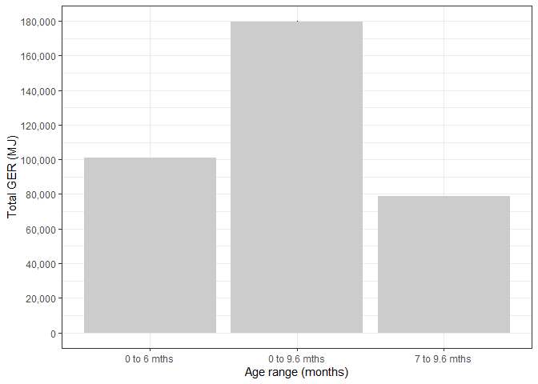

Total Gross Energy Requirements for calves from birth to weaning
================
Selina Agbayani
01 August, 2025

``` r
# Set path for output figures: 
Figurespath <- paste0(getwd(), "/gross_energetic_reqs/figures", collapse = NULL)
Figurespath
```

    ## [1] "C:/Users/AgbayaniS/Documents/R/graywhale_energyreqs/gross_energetic_reqs/figures"

``` r
# Set path for input & output data  
datapath <- paste0(getwd(), "/data", collapse = NULL) 
datapath
```

    ## [1] "C:/Users/AgbayaniS/Documents/R/graywhale_energyreqs/data"

``` r
#read in GER phase 1 table to calculate total GER from birth to weaning 
predict_GER_table_phase1_permth<- read_csv("data/predict_GER_table_sensAnalysis_phase1_permth_source_bpm.csv")
predict_GER_table_phase1_permth <-  predict_GER_table_phase1_permth %>% filter(age_mth <= 10 & MC_variable == "all" & sex == "N/A") %>% 
   select(phase, age_yrs,age_mth, sex, mean_GER, GER_sd, Ts)
```

Calculating total GER from birth to 6mths, and from 7mth-9.6mth, and
also from birth to 9.6 mth

``` r
#Calculate total GER from birth to end of fasting (at 6 mths)  
predict_GER_0to6mth <-  predict_GER_table_phase1_permth %>% filter(age_mth <= 6)

predict_GER_0to6mth$GER_mth <- predict_GER_0to6mth$mean_GER * predict_GER_0to6mth$Ts

predict_GER_0to6mth$GER_sd_sqrd <- predict_GER_0to6mth$GER_sd ^2
kable(predict_GER_0to6mth)
```

| phase |   age_yrs | age_mth | sex | mean_GER |   GER_sd |  Ts |  GER_mth | GER_sd_sqrd |
|------:|----------:|--------:|:----|---------:|---------:|----:|---------:|------------:|
|     1 | 0.0849315 |       1 | N/A | 539.1144 | 55.33933 |  31 | 16712.55 |    3062.441 |
|     1 | 0.1616438 |       2 | N/A | 572.0843 | 59.90966 |  28 | 16018.36 |    3589.167 |
|     1 | 0.2465753 |       3 | N/A | 559.9928 | 47.91010 |  31 | 17359.78 |    2295.378 |
|     1 | 0.3287671 |       4 | N/A | 530.9422 | 49.65961 |  30 | 15928.27 |    2466.077 |
|     1 | 0.4136986 |       5 | N/A | 545.7917 | 53.94071 |  31 | 16919.54 |    2909.601 |
|     1 | 0.4958904 |       6 | N/A | 599.2263 | 51.14599 |  30 | 17976.79 |    2615.913 |

``` r
TotalGER_0to6mth_tibble <- predict_GER_0to6mth %>%
  select(age_yrs, sex, mean_GER, GER_mth, GER_sd, GER_sd_sqrd) %>%
  group_by(sex) %>%
  summarize(Total_GER = sum(GER_mth), Total_GER_sd = sqrt(sum(GER_sd_sqrd)))


TotalGER_0to6mth_tibble$age_range <- "0 to 6 mths"
TotalGER_0to6mth_tibble  <-  TotalGER_0to6mth_tibble %>% relocate(age_range)
TotalGER_0to6mth_tibble$details <- "birth to end of nursing mother fasting"

kable(TotalGER_0to6mth_tibble)
```

| age_range | sex | Total_GER | Total_GER_sd | details |
|:---|:---|---:|---:|:---|
| 0 to 6 mths | N/A | 100915.3 | 130.1483 | birth to end of nursing mother fasting |

``` r
GERcalf6mths_tibble  <-  TotalGER_0to6mth_tibble %>% filter(sex == "N/A")
GERcalf_6mths <- GERcalf6mths_tibble$Total_GER
GERcalf_6mths_sd <- GERcalf6mths_tibble$Total_GER_sd


#Calculating GER till weaning at 9.6 months

#need to adjust October to 20 days worth of GER because weaning is at 9.6 mths.
mean_GER_10th <- predict_GER_table_phase1_permth %>% 
  filter(age_mth == 10) %>% 
  pull(mean_GER)

Ts_9.6 <- 20 #nursing for 20 days out of 31 days in Oct

mean_GER_9.6 <- mean_GER_10th * (20/31) 

sd_GER_9.6 <- predict_GER_table_phase1_permth %>%  
  filter(age_mth == 10) %>%  
  pull(GER_sd)*(20/31)

sd_GER_9.6_sqrd <-sd_GER_9.6^2

Oct_row <- tibble(phase = "1",
              age_yrs = (9.6/12),
              age_mth = 9 + (20/31),
              sex = "N/A",
              mean_GER = mean_GER_9.6,
              GER_sd = sd_GER_9.6,
              Ts = Ts_9.6,
              GER_mth = mean_GER_9.6*Ts_9.6,
              GER_sd_sqrd = sd_GER_9.6_sqrd
)


#Total GER for calf from start of Mother foraging while lactating (7 mths) to weaning (9.6 mths) 
predict_GER_7to9mth <-  predict_GER_table_phase1_permth %>% 
  filter(age_mth >= 7 & age_mth <=9) %>%
  select(phase, age_yrs, age_mth, sex, mean_GER, GER_sd, Ts)

predict_GER_7to9mth$GER_mth <- predict_GER_7to9mth$mean_GER * predict_GER_7to9mth$Ts

predict_GER_7to9mth$GER_sd_sqrd <- predict_GER_7to9mth$GER_sd ^2
kable(predict_GER_7to9mth)
```

| phase |   age_yrs | age_mth | sex | mean_GER |    GER_sd |  Ts |  GER_mth | GER_sd_sqrd |
|------:|----------:|--------:|:----|---------:|----------:|----:|---------:|------------:|
|     1 | 0.5808219 |       7 | N/A | 743.2416 |  89.83173 |  31 | 23040.49 |    8069.739 |
|     1 | 0.6657534 |       8 | N/A | 762.1476 |  96.41814 |  31 | 23626.57 |    9296.457 |
|     1 | 0.7479452 |       9 | N/A | 777.3761 | 102.65428 |  30 | 23321.28 |   10537.900 |

``` r
predict_GER_7to9.6mth <- rbind(predict_GER_7to9mth, Oct_row)

TotalGER_7to9.6mth_tibble <- predict_GER_7to9.6mth %>%
  select(age_yrs, sex, mean_GER, GER_mth, GER_sd, GER_sd_sqrd) %>%
  group_by(sex) %>%
  summarize(Total_GER = sum(GER_mth), Total_GER_sd = sqrt(sum(GER_sd_sqrd)))

TotalGER_7to9.6mth_tibble$age_range <- "7 to 9.6 mths"
TotalGER_7to9.6mth_tibble  <-  TotalGER_7to9.6mth_tibble %>% relocate(age_range)
TotalGER_7to9.6mth_tibble$details <- "start of nursing mother foraging to weaning"

kable(TotalGER_7to9.6mth_tibble)
```

| age_range | sex | Total_GER | Total_GER_sd | details |
|:---|:---|---:|---:|:---|
| 7 to 9.6 mths | N/A | 78807.66 | 184.8964 | start of nursing mother foraging to weaning |

``` r
TotalGER_for0to6_7to9.6_tibble <- rbind(TotalGER_0to6mth_tibble,TotalGER_7to9.6mth_tibble)

kable(TotalGER_for0to6_7to9.6_tibble)
```

| age_range | sex | Total_GER | Total_GER_sd | details |
|:---|:---|---:|---:|:---|
| 0 to 6 mths | N/A | 100915.28 | 130.1483 | birth to end of nursing mother fasting |
| 7 to 9.6 mths | N/A | 78807.66 | 184.8964 | start of nursing mother foraging to weaning |

``` r
#Total GER for calf from birth to weaning (9.6 mths) 
predict_GER_0to9mth <-  predict_GER_table_phase1_permth %>% 
  filter(age_mth >= 0 & age_mth <=9) %>%
  select(phase, age_yrs, age_mth, sex, mean_GER, GER_sd, Ts)

predict_GER_0to9mth$GER_mth <- predict_GER_0to9mth$mean_GER * predict_GER_0to9mth$Ts

predict_GER_0to9mth$GER_sd_sqrd <- predict_GER_0to9mth$GER_sd ^2
kable(predict_GER_0to9mth)
```

| phase |   age_yrs | age_mth | sex | mean_GER |    GER_sd |  Ts |  GER_mth | GER_sd_sqrd |
|------:|----------:|--------:|:----|---------:|----------:|----:|---------:|------------:|
|     1 | 0.0849315 |       1 | N/A | 539.1144 |  55.33933 |  31 | 16712.55 |    3062.441 |
|     1 | 0.1616438 |       2 | N/A | 572.0843 |  59.90966 |  28 | 16018.36 |    3589.167 |
|     1 | 0.2465753 |       3 | N/A | 559.9928 |  47.91010 |  31 | 17359.78 |    2295.378 |
|     1 | 0.3287671 |       4 | N/A | 530.9422 |  49.65961 |  30 | 15928.27 |    2466.077 |
|     1 | 0.4136986 |       5 | N/A | 545.7917 |  53.94071 |  31 | 16919.54 |    2909.601 |
|     1 | 0.4958904 |       6 | N/A | 599.2263 |  51.14599 |  30 | 17976.79 |    2615.913 |
|     1 | 0.5808219 |       7 | N/A | 743.2416 |  89.83173 |  31 | 23040.49 |    8069.739 |
|     1 | 0.6657534 |       8 | N/A | 762.1476 |  96.41814 |  31 | 23626.57 |    9296.457 |
|     1 | 0.7479452 |       9 | N/A | 777.3761 | 102.65428 |  30 | 23321.28 |   10537.900 |

``` r
predict_GER_0to9.6mth <- rbind(predict_GER_0to9mth, Oct_row)

TotalGER_0to9.6mth_tibble <- predict_GER_0to9.6mth %>%
  select(age_yrs, sex, mean_GER, GER_mth, GER_sd, GER_sd_sqrd) %>%
  group_by(sex) %>%
  summarize(Total_GER = sum(GER_mth), Total_GER_sd = sqrt(sum(GER_sd_sqrd)))

TotalGER_0to9.6mth_tibble$age_range <- "0 to 9.6 mths"
TotalGER_0to9.6mth_tibble  <-  TotalGER_0to9.6mth_tibble %>% relocate(age_range)
TotalGER_0to9.6mth_tibble$details <- "birth to weaning"

kable(TotalGER_0to9.6mth_tibble)
```

| age_range     | sex | Total_GER | Total_GER_sd | details          |
|:--------------|:----|----------:|-------------:|:-----------------|
| 0 to 9.6 mths | N/A |  179722.9 |      226.109 | birth to weaning |

``` r
TotalGER_birth_to_weaning_tibble <- rbind(TotalGER_0to6mth_tibble,
                                          TotalGER_7to9.6mth_tibble,
                                          TotalGER_0to9.6mth_tibble )

kable(TotalGER_birth_to_weaning_tibble)
```

| age_range | sex | Total_GER | Total_GER_sd | details |
|:---|:---|---:|---:|:---|
| 0 to 6 mths | N/A | 100915.28 | 130.1483 | birth to end of nursing mother fasting |
| 7 to 9.6 mths | N/A | 78807.66 | 184.8964 | start of nursing mother foraging to weaning |
| 0 to 9.6 mths | N/A | 179722.94 | 226.1090 | birth to weaning |

``` r
TotalGER_birth_to_weaning_tibble %>% write_csv("data/TotalGER_birth_to_weaning_tibble.csv", na = "", append = FALSE)
```

**Total GER from birth to weaning, taking into account foraging time for
nursing mother.**

<!-- -->
