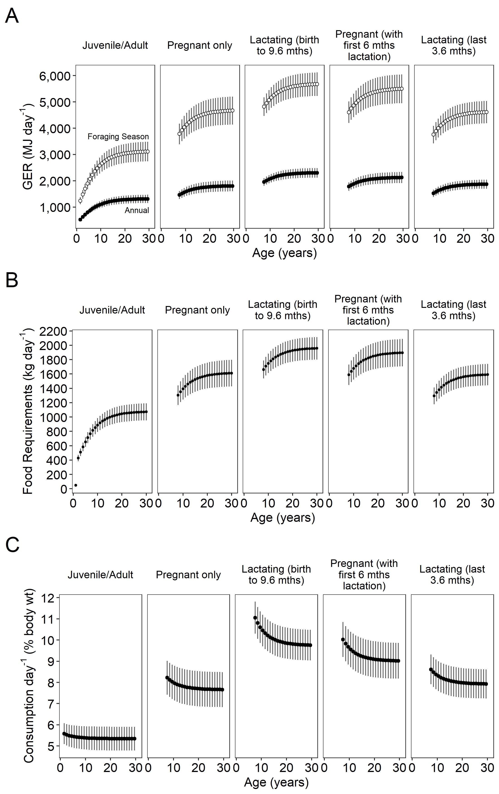

GER Sensitivity Analysis outputs - all adults, all models
================
Selina Agbayani
13 August 2025

``` r
# Set path for output figures: 
Figurespath <- paste0(getwd(), "/gross_energetic_reqs/figures", collapse = NULL)
Figurespath
```

    ## [1] "C:/Users/AgbayaniS/Documents/R/graywhale_energyreqs/gross_energetic_reqs/figures"

``` r
# Set path for input & output data  
datapath <- paste0(getwd(), "/data", collapse = NULL) 
datapath
```

    ## [1] "C:/Users/AgbayaniS/Documents/R/graywhale_energyreqs/data"

``` r
predict_GER_table_phase2 <- read_csv("data/predict_GER_table_sensAnalysis_phase2.csv")
predict_GER_table_phase2$Lifestage <- "Juvenile/Adult" 
predict_GER_table_phase2 <- predict_GER_table_phase2 %>% 
  filter(MC_variable == "all", age_yrs <=30) %>% 
  select("Lifestage", "age_yrs", "mean_GER", "GER_sd", 
         "GER_foraging", "sd_foraging", "FR_foraging", "FR_sd_foraging",
         "pctbodywt", "pctbodywt_sd")


#GER for pregnant mother only
predict_GER_table_preg_only <- read_csv("data/predict_GER_table_sensAnalysis_preg_ONLY.csv")
predict_GER_table_preg_only$Lifestage <- "Pregnant only"
predict_GER_table_preg_only <- predict_GER_table_preg_only %>% 
    filter(MC_variable == "all", age_yrs <=30) %>% 
  select("Lifestage", "age_yrs", "mean_GER", "GER_sd", 
         "GER_foraging", "sd_foraging", "FR_foraging", "FR_sd_foraging",
         "pctbodywt", "pctbodywt_sd")


#Full lactation period (birth to weaning at 9.6 months)
predict_GER_table_lact_all  <-  read_csv("data/predict_GER_table_sensAnalysis_lact_all.csv")
predict_GER_table_lact_all$Lifestage <- "Lactating (birth to 9.6 mths)"
predict_GER_table_lact_all <- predict_GER_table_lact_all %>% 
  filter(MC_variable == "all", age_yrs <=30) %>% 
  select("Lifestage", "age_yrs", "mean_GER", "GER_sd", 
         "GER_foraging", "sd_foraging", "FR_foraging", "FR_sd_foraging",
         "pctbodywt", "pctbodywt_sd")


#GER for pregnant pregnant (with first 6 months of lactation)
predict_GER_table_preg_frontload_lact_6 <- read_csv("data/predict_GER_table_sensAnalysis_preg.csv")
#GER for foraging while lactating (last 3.6 months of lactation) 
predict_GER_table_preg_frontload_lact_6$Lifestage <- "Pregnant (with first 6 mths lactation)"
predict_GER_table_preg_frontload_lact_6 <- predict_GER_table_preg_frontload_lact_6 %>% 
  filter(MC_variable == "all", age_yrs <=30) %>% 
  select("Lifestage", "age_yrs", "mean_GER", "GER_sd", 
         "GER_foraging", "sd_foraging", "FR_foraging", "FR_sd_foraging",
         "pctbodywt", "pctbodywt_sd")


predict_GER_table_sensAnalysis_lact_3.6 <- read_csv("data/predict_GER_table_sensAnalysis_lact.csv")
predict_GER_table_sensAnalysis_lact_3.6$Lifestage <- "Lactating (last 3.6 mths)"
predict_GER_table_sensAnalysis_lact_3.6 <- predict_GER_table_sensAnalysis_lact_3.6 %>% 
  filter(MC_variable == "all", age_yrs <=30) %>% 
  select("Lifestage", "age_yrs", "mean_GER", "GER_sd", 
         "GER_foraging", "sd_foraging", "FR_foraging", "FR_sd_foraging",
         "pctbodywt", "pctbodywt_sd")


predict_GER_table_alladults <- rbind(predict_GER_table_phase2,
                                     predict_GER_table_preg_only,
                                     predict_GER_table_lact_all, 
                                     predict_GER_table_preg_frontload_lact_6,
                                     predict_GER_table_sensAnalysis_lact_3.6)

kable(head(predict_GER_table_alladults))
```

| Lifestage | age_yrs | mean_GER | GER_sd | GER_foraging | sd_foraging | FR_foraging | FR_sd_foraging | pctbodywt | pctbodywt_sd |
|:---|---:|---:|---:|---:|---:|---:|---:|---:|---:|
| Juvenile/Adult | 1 | 596.3387 | 73.50608 | 596.3387 | 73.50608 | 48.1411 | 6.327453 | 1.114288 | 0.7025064 |
| Juvenile/Adult | 2 | 524.6561 | 57.61249 | 1243.5031 | 136.54909 | 428.4040 | 42.948163 | 5.576522 | 0.4919251 |
| Juvenile/Adult | 3 | 623.8229 | 68.60964 | 1478.5413 | 162.61376 | 509.3904 | 51.291409 | 5.526187 | 0.5062134 |
| Juvenile/Adult | 4 | 715.6074 | 79.69414 | 1696.0825 | 188.88546 | 584.3360 | 59.704130 | 5.488292 | 0.5152666 |
| Juvenile/Adult | 5 | 798.8244 | 90.28242 | 1893.3177 | 213.98106 | 652.2789 | 67.741009 | 5.459397 | 0.5218374 |
| Juvenile/Adult | 6 | 873.0445 | 99.77460 | 2069.2289 | 236.47876 | 712.8764 | 74.954618 | 5.437034 | 0.5268125 |

``` r
predict_GER_table_alladults %>% write_csv("data/predict_GER_sensAnalysis_alladults.csv",   na = "", append = FALSE)
```

### Multipanel plot for GER, Food Requirements, and pct body weight

    ## png 
    ##   2


