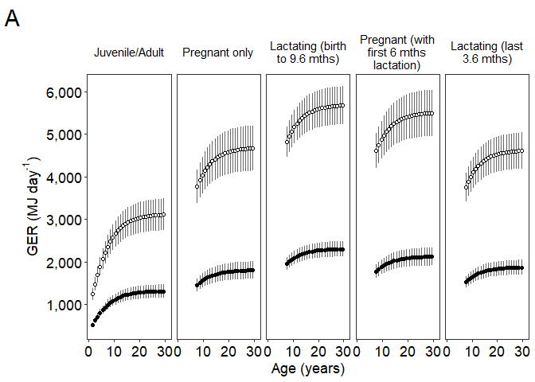
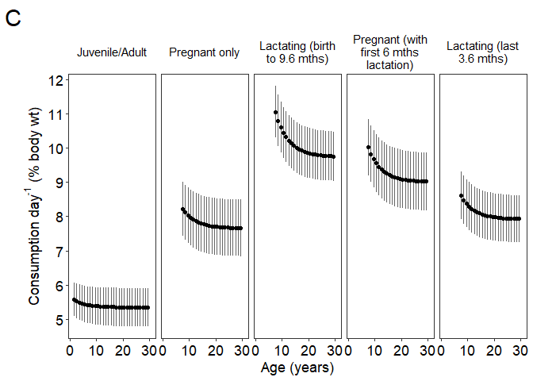

Gross Energetic Requirements(GER) Sensitivity Analysis outputs -
alladults - including classic pregnant/lactating only and frontloading
while pregnant
================
Selina Agbayani
01 August, 2025

``` r
# Set path for output figures: 
Figurespath <- paste0(getwd(), "/gross_energetic_reqs/figures", collapse = NULL)
Figurespath
```

    ## [1] "C:/Users/AgbayaniS/Documents/R/graywhale_energyreqs/gross_energetic_reqs/figures"

``` r
# Set path for input & output data  
datapath <- paste0(getwd(), "/data", collapse = NULL) 
datapath
```

    ## [1] "C:/Users/AgbayaniS/Documents/R/graywhale_energyreqs/data"

``` r
predict_GER_table_phase2 <- read_csv("data/predict_GER_table_sensAnalysis_phase2.csv")
```

    ## Rows: 124 Columns: 21
    ## ── Column specification ────────────────────────────────────────────────────────
    ## Delimiter: ","
    ## chr  (2): sex, MC_variable
    ## dbl (19): phase, age_yrs, mean_GER, GER_sd, quant025, quant975, GER_foraging...
    ## 
    ## ℹ Use `spec()` to retrieve the full column specification for this data.
    ## ℹ Specify the column types or set `show_col_types = FALSE` to quiet this message.

``` r
predict_GER_table_phase2$Lifestage <- "Juvenile/Adult" 
predict_GER_table_phase2 <- predict_GER_table_phase2 %>% 
  filter(MC_variable == "all", age_yrs <=30) %>% 
  select("Lifestage", "age_yrs", "mean_GER", "GER_sd", 
         "GER_foraging", "sd_foraging", "FR_foraging", "FR_sd_foraging",
         "pctbodywt", "pctbodywt_sd")


#GER for pregnant mother only (no front-loading)
predict_GER_table_preg_only <- read_csv("data/predict_GER_table_sensAnalysis_preg_ONLY.csv")
```

    ## Rows: 408 Columns: 22
    ## ── Column specification ────────────────────────────────────────────────────────
    ## Delimiter: ","
    ## chr  (2): phase, MC_variable
    ## dbl (20): age_yrs, mean_GER, GER_sd, quant025, quant975, GER_foraging, sd_fo...
    ## 
    ## ℹ Use `spec()` to retrieve the full column specification for this data.
    ## ℹ Specify the column types or set `show_col_types = FALSE` to quiet this message.

``` r
predict_GER_table_preg_only$Lifestage <- "Pregnant only"
predict_GER_table_preg_only <- predict_GER_table_preg_only %>% 
    filter(MC_variable == "all", age_yrs <=30) %>% 
  select("Lifestage", "age_yrs", "mean_GER", "GER_sd", 
         "GER_foraging", "sd_foraging", "FR_foraging", "FR_sd_foraging",
         "pctbodywt", "pctbodywt_sd")


#Full lactation period (no front-loading)
predict_GER_table_lact_all  <-  read_csv("data/predict_GER_table_sensAnalysis_lact_all.csv")
```

    ## Rows: 335 Columns: 20
    ## ── Column specification ────────────────────────────────────────────────────────
    ## Delimiter: ","
    ## chr  (2): phase, MC_variable
    ## dbl (18): age_yrs, mean_GER, GER_sd, quant025, quant975, GER_foraging, sd_fo...
    ## 
    ## ℹ Use `spec()` to retrieve the full column specification for this data.
    ## ℹ Specify the column types or set `show_col_types = FALSE` to quiet this message.

``` r
predict_GER_table_lact_all$Lifestage <- "Lactating (birth to 9.6 mths)"
predict_GER_table_lact_all <- predict_GER_table_lact_all %>% 
  filter(MC_variable == "all", age_yrs <=30) %>% 
  select("Lifestage", "age_yrs", "mean_GER", "GER_sd", 
         "GER_foraging", "sd_foraging", "FR_foraging", "FR_sd_foraging",
         "pctbodywt", "pctbodywt_sd")


#GER for pregnant mother while foraging, assuming GER for first 6 months of lactation while fasting needs to be consumed the year before  
predict_GER_table_preg_frontload_lact_6 <- read_csv("data/predict_GER_table_sensAnalysis_preg.csv")
```

    ## Rows: 476 Columns: 23
    ## ── Column specification ────────────────────────────────────────────────────────
    ## Delimiter: ","
    ## chr  (2): phase, MC_variable
    ## dbl (21): age_yrs, mean_GER, GER_sd, quant025, quant975, GER_foraging, sd_fo...
    ## 
    ## ℹ Use `spec()` to retrieve the full column specification for this data.
    ## ℹ Specify the column types or set `show_col_types = FALSE` to quiet this message.

``` r
#GER for foraging while nursing (last 3.6 months of lactation) 
predict_GER_table_preg_frontload_lact_6$Lifestage <- "Pregnant (with 6 mths lactation)"
predict_GER_table_preg_frontload_lact_6 <- predict_GER_table_preg_frontload_lact_6 %>% 
  filter(MC_variable == "all", age_yrs <=30) %>% 
  select("Lifestage", "age_yrs", "mean_GER", "GER_sd", 
         "GER_foraging", "sd_foraging", "FR_foraging", "FR_sd_foraging",
         "pctbodywt", "pctbodywt_sd")


predict_GER_table_sensAnalysis_lact_3.6 <- read_csv("data/predict_GER_table_sensAnalysis_lact.csv")
```

    ## Rows: 335 Columns: 20
    ## ── Column specification ────────────────────────────────────────────────────────
    ## Delimiter: ","
    ## chr  (2): phase, MC_variable
    ## dbl (18): age_yrs, mean_GER, GER_sd, quant025, quant975, GER_foraging, sd_fo...
    ## 
    ## ℹ Use `spec()` to retrieve the full column specification for this data.
    ## ℹ Specify the column types or set `show_col_types = FALSE` to quiet this message.

``` r
predict_GER_table_sensAnalysis_lact_3.6$Lifestage <- "Lactating (last 3.6 mths)"
predict_GER_table_sensAnalysis_lact_3.6 <- predict_GER_table_sensAnalysis_lact_3.6 %>% 
  filter(MC_variable == "all", age_yrs <=30) %>% 
  select("Lifestage", "age_yrs", "mean_GER", "GER_sd", 
         "GER_foraging", "sd_foraging", "FR_foraging", "FR_sd_foraging",
         "pctbodywt", "pctbodywt_sd")


predict_GER_table_alladults <- rbind(predict_GER_table_phase2,
                                     predict_GER_table_preg_only,
                                     predict_GER_table_lact_all, 
                                     predict_GER_table_preg_frontload_lact_6,
                                     predict_GER_table_sensAnalysis_lact_3.6)

kable(predict_GER_table_alladults)
```

| Lifestage | age_yrs | mean_GER | GER_sd | GER_foraging | sd_foraging | FR_foraging | FR_sd_foraging | pctbodywt | pctbodywt_sd |
|:---|---:|---:|---:|---:|---:|---:|---:|---:|---:|
| Juvenile/Adult | 1 | 597.2530 | 41.62265 | 597.253 | 41.62265 | 48.16249 | 3.639505 | NA | NA |
| Juvenile/Adult | 2 | 524.8567 | 57.77684 | 1243.979 | 136.93862 | 428.56621 | 43.074945 | 5.578601 | 0.4933722 |
| Juvenile/Adult | 3 | 623.8443 | 68.84115 | 1478.592 | 163.16246 | 509.40443 | 51.463406 | 5.526297 | 0.5077966 |
| Juvenile/Adult | 4 | 715.8644 | 79.95188 | 1696.692 | 189.49633 | 584.54226 | 59.893983 | 5.490194 | 0.5167940 |
| Juvenile/Adult | 5 | 799.5071 | 90.56630 | 1894.936 | 214.65389 | 652.83304 | 67.950698 | 5.464006 | 0.5233613 |
| Juvenile/Adult | 6 | 874.0973 | 100.13828 | 2071.724 | 237.34073 | 713.73223 | 75.224104 | 5.443531 | 0.5286118 |
| Juvenile/Adult | 7 | 939.6577 | 108.52566 | 2227.111 | 257.21991 | 767.26025 | 81.605325 | 5.426761 | 0.5342099 |
| Juvenile/Adult | 8 | 996.8021 | 115.84566 | 2362.550 | 274.56925 | 813.91714 | 87.178152 | 5.413239 | 0.5387263 |
| Juvenile/Adult | 9 | 1046.0550 | 122.07099 | 2479.286 | 289.32410 | 854.13249 | 91.923340 | 5.401506 | 0.5429307 |
| Juvenile/Adult | 10 | 1088.3995 | 127.43419 | 2579.648 | 302.03558 | 888.70724 | 96.013257 | 5.392078 | 0.5469418 |
| Juvenile/Adult | 11 | 1124.5334 | 131.93983 | 2665.290 | 312.71453 | 918.21223 | 99.452871 | 5.384055 | 0.5502906 |
| Juvenile/Adult | 12 | 1155.3254 | 135.76816 | 2738.271 | 321.78817 | 943.35564 | 102.376937 | 5.377587 | 0.5531625 |
| Juvenile/Adult | 13 | 1181.4697 | 138.99361 | 2800.237 | 329.43291 | 964.70442 | 104.842141 | 5.372311 | 0.5554443 |
| Juvenile/Adult | 14 | 1203.6447 | 141.74233 | 2852.794 | 335.94773 | 982.81180 | 106.943120 | 5.368145 | 0.5572611 |
| Juvenile/Adult | 15 | 1222.4318 | 144.07236 | 2897.322 | 341.47020 | 998.15283 | 108.724280 | 5.364915 | 0.5583541 |
| Juvenile/Adult | 16 | 1238.3450 | 146.10945 | 2935.038 | 346.29836 | 1011.14603 | 110.279727 | 5.362534 | 0.5592900 |
| Juvenile/Adult | 17 | 1251.7991 | 147.87051 | 2966.926 | 350.47231 | 1022.13076 | 111.623201 | 5.360759 | 0.5597610 |
| Juvenile/Adult | 18 | 1263.1653 | 149.40519 | 2993.866 | 354.10971 | 1031.41002 | 112.792654 | 5.359485 | 0.5600460 |
| Juvenile/Adult | 19 | 1272.8057 | 150.77643 | 3016.715 | 357.35972 | 1039.27921 | 113.835436 | 5.358777 | 0.5601983 |
| Juvenile/Adult | 20 | 1280.9135 | 151.93613 | 3035.931 | 360.10835 | 1045.89730 | 114.717301 | 5.358245 | 0.5601419 |
| Juvenile/Adult | 21 | 1287.7587 | 152.93719 | 3052.155 | 362.48100 | 1051.48443 | 115.477973 | 5.357980 | 0.5600472 |
| Juvenile/Adult | 22 | 1293.5315 | 153.81200 | 3065.838 | 364.55443 | 1056.19577 | 116.141876 | 5.357885 | 0.5598572 |
| Juvenile/Adult | 23 | 1298.3997 | 154.55266 | 3077.376 | 366.30989 | 1060.16878 | 116.703973 | 5.357933 | 0.5596247 |
| Juvenile/Adult | 24 | 1302.5003 | 155.20029 | 3087.095 | 367.84485 | 1063.51493 | 117.194857 | 5.358055 | 0.5593519 |
| Juvenile/Adult | 25 | 1305.9290 | 155.71539 | 3095.221 | 369.06569 | 1066.31329 | 117.586029 | 5.358148 | 0.5590151 |
| Juvenile/Adult | 26 | 1308.8467 | 156.18418 | 3102.137 | 370.17680 | 1068.69406 | 117.941233 | 5.358417 | 0.5588007 |
| Juvenile/Adult | 27 | 1311.2807 | 156.57254 | 3107.905 | 371.09726 | 1070.68017 | 118.235589 | 5.358611 | 0.5585525 |
| Juvenile/Adult | 28 | 1313.3359 | 156.91259 | 3112.777 | 371.90321 | 1072.35699 | 118.493030 | 5.358844 | 0.5583191 |
| Juvenile/Adult | 29 | 1315.0616 | 157.18846 | 3116.867 | 372.55705 | 1073.76516 | 118.702147 | 5.359070 | 0.5580890 |
| Juvenile/Adult | 30 | 1316.5032 | 157.42418 | 3120.284 | 373.11576 | 1074.94148 | 118.880705 | 5.359250 | 0.5578672 |
| Pregnant only | 8 | 1428.5769 | 134.59549 | 3697.493 | 348.36479 | 1275.26876 | 121.730378 | 8.042751 | 0.7057592 |
| Pregnant only | 9 | 1480.3975 | 141.60664 | 3831.617 | 366.51129 | 1321.52834 | 128.024070 | 7.934421 | 0.7109733 |
| Pregnant only | 10 | 1524.8043 | 147.73156 | 3946.552 | 382.36404 | 1361.16967 | 133.521003 | 7.848193 | 0.7164987 |
| Pregnant only | 11 | 1562.5869 | 152.88763 | 4044.343 | 395.70916 | 1394.89768 | 138.148993 | 7.778488 | 0.7212262 |
| Pregnant only | 12 | 1594.7151 | 157.23491 | 4127.498 | 406.96095 | 1423.57804 | 142.051600 | 7.722211 | 0.7251440 |
| Pregnant only | 13 | 1621.9454 | 160.87133 | 4197.976 | 416.37285 | 1447.88611 | 145.316653 | 7.676467 | 0.7281425 |
| Pregnant only | 14 | 1645.0120 | 163.94234 | 4257.678 | 424.32136 | 1468.47729 | 148.074299 | 7.639299 | 0.7303823 |
| Pregnant only | 15 | 1664.5417 | 166.49417 | 4308.226 | 430.92608 | 1485.91109 | 150.366427 | 7.609075 | 0.7314021 |
| Pregnant only | 16 | 1681.0673 | 168.77467 | 4350.998 | 436.82855 | 1500.66326 | 152.413518 | 7.584520 | 0.7324436 |
| Pregnant only | 17 | 1695.0378 | 170.80694 | 4387.157 | 442.08856 | 1513.13464 | 154.236667 | 7.564511 | 0.7330767 |
| Pregnant only | 18 | 1706.8323 | 172.59129 | 4417.684 | 446.70688 | 1523.66349 | 155.836787 | 7.548182 | 0.7334729 |
| Pregnant only | 19 | 1716.8403 | 174.19231 | 4443.587 | 450.85068 | 1532.59755 | 157.271776 | 7.535079 | 0.7336678 |
| Pregnant only | 20 | 1725.2508 | 175.51374 | 4465.355 | 454.27085 | 1540.10555 | 158.456504 | 7.524260 | 0.7334243 |
| Pregnant only | 21 | 1732.3511 | 176.64079 | 4483.732 | 457.18793 | 1546.44396 | 159.466975 | 7.515480 | 0.7330825 |
| Pregnant only | 22 | 1738.3426 | 177.63475 | 4499.240 | 459.76053 | 1551.79258 | 160.357725 | 7.508338 | 0.7326494 |
| Pregnant only | 23 | 1743.3933 | 178.45741 | 4512.312 | 461.88977 | 1556.30132 | 161.095220 | 7.502531 | 0.7321004 |
| Pregnant only | 24 | 1747.6507 | 179.18414 | 4523.331 | 463.77070 | 1560.10190 | 161.746407 | 7.497802 | 0.7315382 |
| Pregnant only | 25 | 1751.2056 | 179.74447 | 4532.532 | 465.22098 | 1563.27536 | 162.248978 | 7.493834 | 0.7308542 |
| Pregnant only | 26 | 1754.2356 | 180.25942 | 4540.374 | 466.55379 | 1565.98024 | 162.710525 | 7.490760 | 0.7303753 |
| Pregnant only | 27 | 1756.7622 | 180.68544 | 4546.914 | 467.65644 | 1568.23582 | 163.092395 | 7.488159 | 0.7298736 |
| Pregnant only | 28 | 1758.8978 | 181.06059 | 4552.441 | 468.62742 | 1570.14222 | 163.428544 | 7.486076 | 0.7294142 |
| Pregnant only | 29 | 1760.6895 | 181.35734 | 4557.079 | 469.39548 | 1571.74175 | 163.694641 | 7.484368 | 0.7289544 |
| Pregnant only | 30 | 1762.1873 | 181.61511 | 4560.955 | 470.06263 | 1573.07879 | 163.925662 | 7.482936 | 0.7285391 |
| Lactating (birth to 9.6 mths) | 8 | 1958.7316 | 145.44291 | 4822.759 | 358.10734 | 1663.37015 | 126.034911 | 11.065654 | 0.7542262 |
| Lactating (birth to 9.6 mths) | 9 | 2013.0597 | 150.99962 | 4956.525 | 371.78898 | 1709.50594 | 130.797764 | 10.813429 | 0.7501830 |
| Lactating (birth to 9.6 mths) | 10 | 2059.6342 | 155.75858 | 5071.200 | 383.50642 | 1749.05721 | 134.877036 | 10.614428 | 0.7480874 |
| Lactating (birth to 9.6 mths) | 11 | 2099.2760 | 159.73527 | 5168.806 | 393.29776 | 1782.72118 | 138.286988 | 10.455315 | 0.7468350 |
| Lactating (birth to 9.6 mths) | 12 | 2132.9943 | 163.11009 | 5251.826 | 401.60720 | 1811.35494 | 141.181012 | 10.327518 | 0.7461202 |
| Lactating (birth to 9.6 mths) | 13 | 2161.5789 | 165.95117 | 5322.207 | 408.60247 | 1835.62905 | 143.617680 | 10.224133 | 0.7454878 |
| Lactating (birth to 9.6 mths) | 14 | 2185.7966 | 168.37570 | 5381.835 | 414.57210 | 1856.19484 | 145.696839 | 10.140232 | 0.7448207 |
| Lactating (birth to 9.6 mths) | 15 | 2206.3027 | 170.43817 | 5432.325 | 419.65029 | 1873.60871 | 147.465410 | 10.071931 | 0.7435349 |
| Lactating (birth to 9.6 mths) | 16 | 2223.6567 | 172.23551 | 5475.054 | 424.07568 | 1888.34581 | 149.005814 | 10.016237 | 0.7422977 |
| Lactating (birth to 9.6 mths) | 17 | 2238.3275 | 173.78468 | 5511.176 | 427.89001 | 1900.80432 | 150.333077 | 9.970674 | 0.7405750 |
| Lactating (birth to 9.6 mths) | 18 | 2250.7142 | 175.13210 | 5541.674 | 431.20761 | 1911.32322 | 151.486917 | 9.933317 | 0.7387999 |
| Lactating (birth to 9.6 mths) | 19 | 2261.2241 | 176.33440 | 5567.552 | 434.16790 | 1920.24830 | 152.515631 | 9.902879 | 0.7369444 |
| Lactating (birth to 9.6 mths) | 20 | 2270.0573 | 177.35684 | 5589.301 | 436.68534 | 1927.74957 | 153.390319 | 9.877729 | 0.7350843 |
| Lactating (birth to 9.6 mths) | 21 | 2277.5145 | 178.24473 | 5607.662 | 438.87148 | 1934.08237 | 154.149598 | 9.857089 | 0.7334044 |
| Lactating (birth to 9.6 mths) | 22 | 2283.8067 | 179.02037 | 5623.154 | 440.78124 | 1939.42580 | 154.812503 | 9.840118 | 0.7317198 |
| Lactating (birth to 9.6 mths) | 23 | 2289.1112 | 179.68383 | 5636.215 | 442.41480 | 1943.93046 | 155.379486 | 9.826158 | 0.7301979 |
| Lactating (birth to 9.6 mths) | 24 | 2293.5821 | 180.26519 | 5647.223 | 443.84621 | 1947.72720 | 155.875987 | 9.814658 | 0.7287292 |
| Lactating (birth to 9.6 mths) | 25 | 2297.3160 | 180.72945 | 5656.417 | 444.98932 | 1950.89811 | 156.272833 | 9.805059 | 0.7273954 |
| Lactating (birth to 9.6 mths) | 26 | 2300.4978 | 181.15396 | 5664.251 | 446.03454 | 1953.60022 | 156.635320 | 9.797306 | 0.7263146 |
| Lactating (birth to 9.6 mths) | 27 | 2303.1513 | 181.50586 | 5670.784 | 446.90097 | 1955.85359 | 156.935826 | 9.790809 | 0.7253051 |
| Lactating (birth to 9.6 mths) | 28 | 2305.3937 | 181.81556 | 5676.305 | 447.66353 | 1957.75788 | 157.200146 | 9.785484 | 0.7243870 |
| Lactating (birth to 9.6 mths) | 29 | 2307.2754 | 182.06593 | 5680.938 | 448.27998 | 1959.35584 | 157.413986 | 9.781076 | 0.7235789 |
| Lactating (birth to 9.6 mths) | 30 | 2308.8481 | 182.28095 | 5684.811 | 448.80940 | 1960.69146 | 157.597537 | 9.777393 | 0.7228456 |
| Pregnant (with 6 mths lactation) | 8 | 1748.0660 | 141.27950 | 4524.406 | 365.66459 | 1560.46900 | 128.316152 | 9.842843 | 0.7385638 |
| Pregnant (with 6 mths lactation) | 9 | 1799.8867 | 148.17844 | 4658.530 | 383.52066 | 1606.72859 | 134.502735 | 9.648040 | 0.7417622 |
| Pregnant (with 6 mths lactation) | 10 | 1844.2934 | 154.21044 | 4773.465 | 399.13291 | 1646.36991 | 139.910860 | 9.493754 | 0.7458485 |
| Pregnant (with 6 mths lactation) | 11 | 1882.0761 | 159.29514 | 4871.256 | 412.29329 | 1680.09792 | 144.470507 | 9.369924 | 0.7495864 |
| Pregnant (with 6 mths lactation) | 12 | 1914.2043 | 163.58661 | 4954.411 | 423.40064 | 1708.77828 | 148.319612 | 9.270235 | 0.7527917 |
| Pregnant (with 6 mths lactation) | 13 | 1941.4346 | 167.17973 | 5024.889 | 432.70047 | 1733.08635 | 151.543099 | 9.189430 | 0.7552546 |
| Pregnant (with 6 mths lactation) | 14 | 1964.5011 | 170.21583 | 5084.591 | 440.55861 | 1753.67753 | 154.267214 | 9.123781 | 0.7570514 |
| Pregnant (with 6 mths lactation) | 15 | 1984.0308 | 172.74074 | 5135.139 | 447.09368 | 1771.11133 | 156.533478 | 9.070314 | 0.7576480 |
| Pregnant (with 6 mths lactation) | 16 | 2000.5564 | 174.99491 | 5177.911 | 452.92799 | 1785.86350 | 158.555300 | 9.026715 | 0.7582754 |
| Pregnant (with 6 mths lactation) | 17 | 2014.5270 | 177.00191 | 5214.070 | 458.12258 | 1798.33489 | 160.354224 | 8.991054 | 0.7584613 |
| Pregnant (with 6 mths lactation) | 18 | 2026.3215 | 178.76307 | 5244.597 | 462.68088 | 1808.86373 | 161.932138 | 8.961824 | 0.7584221 |
| Pregnant (with 6 mths lactation) | 19 | 2036.3294 | 180.34190 | 5270.500 | 466.76726 | 1817.79779 | 163.345908 | 8.938066 | 0.7581722 |
| Pregnant (with 6 mths lactation) | 20 | 2044.7399 | 181.64576 | 5292.268 | 470.14197 | 1825.30580 | 164.513841 | 8.918430 | 0.7575302 |
| Pregnant (with 6 mths lactation) | 21 | 2051.8402 | 182.75782 | 5310.645 | 473.02024 | 1831.64420 | 165.509976 | 8.902343 | 0.7568311 |
| Pregnant (with 6 mths lactation) | 22 | 2057.8317 | 183.73789 | 5326.153 | 475.55689 | 1836.99282 | 166.387454 | 8.889137 | 0.7560520 |
| Pregnant (with 6 mths lactation) | 23 | 2062.8824 | 184.54944 | 5339.225 | 477.65738 | 1841.50156 | 167.114343 | 8.878294 | 0.7552027 |
| Pregnant (with 6 mths lactation) | 24 | 2067.1398 | 185.26582 | 5350.244 | 479.51154 | 1845.30214 | 167.755657 | 8.869378 | 0.7543545 |
| Pregnant (with 6 mths lactation) | 25 | 2070.6947 | 185.81905 | 5359.445 | 480.94343 | 1848.47561 | 168.251445 | 8.861926 | 0.7534409 |
| Pregnant (with 6 mths lactation) | 26 | 2073.7247 | 186.32680 | 5367.287 | 482.25761 | 1851.18049 | 168.706129 | 8.855950 | 0.7527525 |
| Pregnant (with 6 mths lactation) | 27 | 2076.2514 | 186.74696 | 5373.827 | 483.34507 | 1853.43606 | 169.082405 | 8.850934 | 0.7520683 |
| Pregnant (with 6 mths lactation) | 28 | 2078.3869 | 187.11671 | 5379.354 | 484.30206 | 1855.34246 | 169.413398 | 8.846838 | 0.7514407 |
| Pregnant (with 6 mths lactation) | 29 | 2080.1787 | 187.40950 | 5383.992 | 485.05988 | 1856.94199 | 169.675723 | 8.843451 | 0.7508438 |
| Pregnant (with 6 mths lactation) | 30 | 2081.6764 | 187.66366 | 5387.868 | 485.71770 | 1858.27903 | 169.903310 | 8.840620 | 0.7503046 |
| Lactating (last 3.6 mths) | 8 | 1225.7298 | 108.93641 | 3759.591 | 334.13270 | 1296.68617 | 116.932834 | 8.624727 | 0.7052503 |
| Lactating (last 3.6 mths) | 9 | 1269.3412 | 113.46290 | 3893.357 | 348.01646 | 1342.82196 | 121.769928 | 8.492601 | 0.7036285 |
| Lactating (last 3.6 mths) | 10 | 1306.7283 | 117.33541 | 4008.032 | 359.89433 | 1382.37323 | 125.908211 | 8.387918 | 0.7032624 |
| Lactating (last 3.6 mths) | 11 | 1338.5503 | 120.56596 | 4105.638 | 369.80315 | 1416.03720 | 129.361493 | 8.303686 | 0.7032251 |
| Lactating (last 3.6 mths) | 12 | 1365.6174 | 123.30574 | 4188.658 | 378.20667 | 1444.67096 | 132.290257 | 8.235863 | 0.7034230 |
| Lactating (last 3.6 mths) | 13 | 1388.5634 | 125.61044 | 4259.039 | 385.27571 | 1468.94507 | 134.754203 | 8.180864 | 0.7035021 |
| Lactating (last 3.6 mths) | 14 | 1408.0039 | 127.57722 | 4318.667 | 391.30828 | 1489.51086 | 136.856629 | 8.136231 | 0.7034407 |
| Lactating (last 3.6 mths) | 15 | 1424.4650 | 129.25018 | 4369.157 | 396.43963 | 1506.92473 | 138.644846 | 8.099953 | 0.7027438 |
| Lactating (last 3.6 mths) | 16 | 1438.3957 | 130.70964 | 4411.886 | 400.91612 | 1521.66183 | 140.204087 | 8.070481 | 0.7020562 |
| Lactating (last 3.6 mths) | 17 | 1450.1725 | 131.96833 | 4448.008 | 404.77681 | 1534.12034 | 141.548422 | 8.046459 | 0.7008945 |
| Lactating (last 3.6 mths) | 18 | 1460.1158 | 133.06424 | 4478.507 | 408.13821 | 1544.63925 | 142.718358 | 8.026849 | 0.6996562 |
| Lactating (last 3.6 mths) | 19 | 1468.5525 | 134.04387 | 4504.384 | 411.14297 | 1553.56432 | 143.763380 | 8.011064 | 0.6983402 |
| Lactating (last 3.6 mths) | 20 | 1475.6433 | 134.87717 | 4526.133 | 413.69888 | 1561.06559 | 144.652167 | 7.998036 | 0.6969710 |
| Lactating (last 3.6 mths) | 21 | 1481.6295 | 135.60144 | 4544.494 | 415.92038 | 1567.39840 | 145.424391 | 7.987439 | 0.6957331 |
| Lactating (last 3.6 mths) | 22 | 1486.6805 | 136.23483 | 4559.986 | 417.86314 | 1572.74182 | 146.099369 | 7.978800 | 0.6944682 |
| Lactating (last 3.6 mths) | 23 | 1490.9386 | 136.77682 | 4573.047 | 419.52554 | 1577.24648 | 146.676891 | 7.971759 | 0.6933154 |
| Lactating (last 3.6 mths) | 24 | 1494.5276 | 137.25230 | 4584.055 | 420.98394 | 1581.04322 | 147.183254 | 7.966011 | 0.6921921 |
| Lactating (last 3.6 mths) | 25 | 1497.5249 | 137.63139 | 4593.249 | 422.14669 | 1584.21413 | 147.587282 | 7.961197 | 0.6911390 |
| Lactating (last 3.6 mths) | 26 | 1500.0791 | 137.97880 | 4601.083 | 423.21229 | 1586.91624 | 147.957204 | 7.957428 | 0.6903126 |
| Lactating (last 3.6 mths) | 27 | 1502.2092 | 138.26671 | 4607.616 | 424.09537 | 1589.16961 | 148.263785 | 7.954249 | 0.6895230 |
| Lactating (last 3.6 mths) | 28 | 1504.0092 | 138.52040 | 4613.138 | 424.87351 | 1591.07391 | 148.533791 | 7.951689 | 0.6888057 |
| Lactating (last 3.6 mths) | 29 | 1505.5197 | 138.72524 | 4617.771 | 425.50178 | 1592.67186 | 148.751942 | 7.949585 | 0.6881621 |
| Lactating (last 3.6 mths) | 30 | 1506.7822 | 138.90130 | 4621.643 | 426.04179 | 1594.00748 | 148.939354 | 7.947824 | 0.6875755 |

``` r
predict_GER_table_alladults %>% write_csv("data/predict_GER_sensAnalysis_alladults.csv",   na = "", append = FALSE)
```

**Plotting Gross energetic requirements (multi-panel)**

``` r
predict_GER_table_alladults <- read_csv("data/predict_GER_sensAnalysis_alladults.csv")
```

    ## Rows: 122 Columns: 10
    ## ── Column specification ────────────────────────────────────────────────────────
    ## Delimiter: ","
    ## chr (1): Lifestage
    ## dbl (9): age_yrs, mean_GER, GER_sd, GER_foraging, sd_foraging, FR_foraging, ...
    ## 
    ## ℹ Use `spec()` to retrieve the full column specification for this data.
    ## ℹ Specify the column types or set `show_col_types = FALSE` to quiet this message.

``` r
predict_GER_table_panel <- within(predict_GER_table_alladults, Lifestage <- 
  factor(Lifestage, levels=c('Juvenile/Adult',
                             'Pregnant only', 
                             'Lactating (birth to 9.6 mths)',
                             'Pregnant (with 6 mths lactation)',
                             'Lactating (last 3.6 mths)')
         )
  )


plot_GER_panel <- predict_GER_table_panel %>% 
  ggplot() +
  geom_errorbar(aes(x = age_yrs-0.5, 
                  ymin = mean_GER-GER_sd,
                  ymax = mean_GER+GER_sd),
                width=0, linetype = 1, color="gray40")+
  geom_point(aes(x = age_yrs-0.5, y= mean_GER),
              shape = 21, fill = "black") +
   geom_errorbar(aes(x = age_yrs-0.5, 
                    ymin = GER_foraging - sd_foraging,
                    ymax = GER_foraging + sd_foraging),
                width=0, linetype = 1, color="gray40") +
  geom_point(aes(x = age_yrs-0.5, y= GER_foraging),
              shape = 21, fill = "white") +
  facet_grid(.~Lifestage, 
             labeller = label_wrap_gen(width = 17, 
               multi_line = TRUE))+
  xlab("Age (years)") +
  ylab(bquote('Gross Energetic Requirements (MJ day'^'-1'*')')) +
  scale_x_continuous(breaks = scales::pretty_breaks(n = 3),
                     limits = c(1,30)) +
  scale_y_continuous(breaks = scales::pretty_breaks(n = 8),
                     label = comma)+
                     #limits = c(0, 20))+
  
  theme_bw() +
  theme(panel.grid = element_blank())+
  theme(axis.text =  element_text(size = rel(1.2), colour = "black"),
        axis.title = element_text(size = rel(1.2), colour = "black"),
        strip.background = element_rect(
          color="transparent", fill="transparent"),
        strip.text = element_text(size = rel(1), colour = "black"))
  # annotate("text", x = 20, y = 5200,
  #          label = paste0("Foraging season"),
  #          size = 6,
  #          hjust = 1) +
  # annotate("text", x = 20, y = 200,
  #          label = paste0("Annual"),
  #          size = 6,
  #          hjust = 1) +
  
plot_GER_panel 
```

    ## Warning: Removed 1 row containing missing values or values outside the scale range
    ## (`geom_point()`).
    ## Removed 1 row containing missing values or values outside the scale range
    ## (`geom_point()`).

<!-- -->

``` r
ann_text_annual <- data.frame(age_yrs = 30, mean_GER = 900,
                              Lifestage = factor("Juvenile/Adult",
                                           levels = c('Juvenile/Adult',
                                                      'Pregnant only', 
                                                      'Lactating (birth to 9.6 mths)',
                                                      'Pregnant (with 6 mths lactation)',
                                                      'Lactating (last 3.6 mths)')))

ann_text_foraging <- data.frame(age_yrs = 30, mean_GER = 3700,
                                Lifestage = factor("Juvenile/Adult",
                                             levels = c('Juvenile/Adult',
                                             'Pregnant only', 
                                             'Lactating (birth to 9.6 mths)',
                                             'Pregnant (with 6 mths lactation)',
                                             'Lactating (last 3.6 mths)')))


plot_GER_panel <- plot_GER_panel + 
  geom_text(data = ann_text_annual, 
            aes(x=age_yrs, y=mean_GER),
            label = "Annual",
            size = 3.5,
            hjust = 1) +
  geom_text(data = ann_text_foraging, 
            aes(x=age_yrs, y=mean_GER),
            label = "Foraging Season",
            size = 3.5,
            hjust = 1)

plot_GER_panel
```

    ## Warning: Removed 1 row containing missing values or values outside the scale range
    ## (`geom_point()`).
    ## Removed 1 row containing missing values or values outside the scale range
    ## (`geom_point()`).

<!-- -->

**Plotting Food Requirements (multi panel)**

``` r
plot_FoodReqs_panel <- predict_GER_table_panel %>% 
  ggplot() +
  geom_errorbar(aes(x = age_yrs, 
                  ymin = FR_foraging-FR_sd_foraging,
                  ymax = FR_foraging+FR_sd_foraging),
                width=0, linetype = 1, color="gray40")+
  geom_point(aes(x = age_yrs, 
                y= FR_foraging),  
            size = 1)+
  facet_grid(~Lifestage,
             labeller = label_wrap_gen(width = 17, 
             multi_line = TRUE))+
  xlab("Age (years)") +
  ylab(bquote('Food Requirements (kg day'^'-1'*')')) +
  scale_x_continuous(breaks = scales::pretty_breaks(n = 3),
                     limits = c(1,30)) +
  scale_y_continuous(breaks = scales::pretty_breaks(n = 10))+
                     #limits = c(0, 20))+
  
  theme_bw() +
  theme(panel.grid = element_blank())+
  theme(axis.text =  element_text(size = rel(1.2), colour = "black"),
        axis.title = element_text(size = rel(1.2), colour = "black"),
        strip.background = element_rect(
          color="transparent", fill="transparent"),
        strip.text = element_text(size = rel(1), colour = "black")
  )


plot_FoodReqs_panel
```

<!-- -->

``` r
plot_FoodReqs_panel_ribbon <- predict_GER_table_panel %>% 
  ggplot() +
  # geom_errorbar(aes(x = age_yrs, 
  #                 ymin = FR_foraging-FR_sd_foraging,
  #                 ymax = FR_foraging+FR_sd_foraging),
  #               width=0, linetype = 1, color="gray40")+
  # geom_point(aes(x = age_yrs, 
  #               y= FR_foraging),  
  #           size = 1)+
  geom_ribbon(aes(x = age_yrs, 
                  ymin = FR_foraging-FR_sd_foraging,
                  ymax = FR_foraging+FR_sd_foraging),
              alpha = 0.25,
              fill="gray50")+
  geom_line(aes(x = age_yrs, 
                y=FR_foraging),linewidth = 0.5)+ 
  facet_grid(~Lifestage,
             labeller = label_wrap_gen(width = 17, 
             multi_line = TRUE))+
  xlab("Age (years)") +
  ylab(bquote('Food Requirements (kg day'^'-1'*')')) +
  scale_x_continuous(breaks = scales::pretty_breaks(n = 3),
                     limits = c(1,30)) +
  scale_y_continuous(breaks = scales::pretty_breaks(n = 10))+
                     #limits = c(0, 20))+
  
  theme_bw() +
  theme(panel.grid = element_blank())+
  theme(axis.text =  element_text(size = rel(1.2), colour = "black"),
        axis.title = element_text(size = rel(1.2), colour = "black"),
        strip.background = element_rect(
          color="transparent", fill="transparent"),
        strip.text = element_text(size = rel(1), colour = "black")
  )


plot_FoodReqs_panel_ribbon
```

<!-- -->

``` r
plot_pct_bodyweight_all <- predict_GER_table_panel %>% 
  filter(age_yrs > 1) %>% 
  ggplot() +
   geom_errorbar(aes(x = age_yrs-0.5, 
                    ymin = pctbodywt - pctbodywt_sd, 
                    ymax = pctbodywt + pctbodywt_sd),
                width=0, size=0.5, linetype = 1, color="gray40")+
  geom_point(aes(x = age_yrs-0.5, y= pctbodywt), 
             shape = 21, fill = "black")+
  facet_grid(~Lifestage,
             labeller = label_wrap_gen(width = 17, 
             multi_line = TRUE))+
  xlab("Age (years)") +
  ylab(bquote('Consumption day'^'-1'*' (% body wt)')) +
  scale_x_continuous(breaks = scales::pretty_breaks(n = 3),
                     limits = c(1,30)) +
  scale_y_continuous(breaks = scales::pretty_breaks(n = 6)
                     #limits = c(3.5, 10)
                     )+
  
  theme_bw() +
  theme(panel.grid = element_blank())+
  theme(axis.text =  element_text(size = rel(1.2), colour = "black"),
        axis.title = element_text(size = rel(1.2), colour = "black"),
        strip.background = element_rect(
          color="transparent", fill="transparent"),
        strip.text = element_text(size = rel(1), colour = "black")
  )
```

    ## Warning: Using `size` aesthetic for lines was deprecated in ggplot2 3.4.0.
    ## ℹ Please use `linewidth` instead.
    ## This warning is displayed once every 8 hours.
    ## Call `lifecycle::last_lifecycle_warnings()` to see where this warning was
    ## generated.

``` r
plot_pct_bodyweight_all
```

<!-- -->
