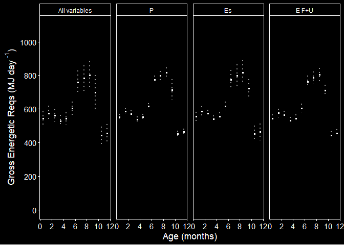

Gross Energetic Requirements(GER) Sensitivity Analysis - phase 1
================
Selina Agbayani
25 Jan 2022 - code updated 21 July, 2025

``` r
# Set path for output figures: 
Figurespath <- paste0(getwd(), "/gross_energetic_reqs/figures", collapse = NULL)
Figurespath
```

    ## [1] "C:/Users/AgbayaniS/Documents/R/graywhale_energyreqs/gross_energetic_reqs/figures"

``` r
# Set path for input & output data  
datapath <- paste0(getwd(), "/data", collapse = NULL) 
datapath
```

    ## [1] "C:/Users/AgbayaniS/Documents/R/graywhale_energyreqs/data"

``` r
## Read data in Production Cost, Es 


P_cost_table <- as_tibble(read_csv("data/P_cost_table_phase1.csv"), 
                          col_types = (list(cols(age_mth = col_double(),
                                                 age_yrs = col_double(),
                                                 mean_masschange = col_double(),
                                                 sd_masschange = col_double(),
                                                 sex = col_character(),
                                                 mean_P = col_double(),
                                                 sd_P = col_double(),
                                                 quant025 = col_double(),
                                                 quant975 = col_double(),
                                                 p_lipid = col_double(),
                                                 p_protein = col_double()
                                                 )
                                            )
                                       )
) 
```

    ## Rows: 39 Columns: 18
    ## ── Column specification ────────────────────────────────────────────────────────
    ## Delimiter: ","
    ## chr  (1): sex
    ## dbl (17): age_mth, age_yrs, mean_masschange, sd_masschange, mean_P, sd_P, qu...
    ## 
    ## ℹ Use `spec()` to retrieve the full column specification for this data.
    ## ℹ Specify the column types or set `show_col_types = FALSE` to quiet this message.

``` r
#P_cost_table <- P_cost_table %>% dplyr::filter(age_yrs >= 0)
kable(head(P_cost_table))
```

| age_mth | age_yrs | mean_masschange | sd_masschange | sex | mean_P | sd_P | quant025 | quant975 | p_lipid | p_protein | mass | mass_sd | Ts | mean_masschange_perday | sd_masschange_perday | mean_P_perday | sd_P_perday |
|---:|---:|---:|---:|:---|---:|---:|---:|---:|---:|---:|---:|---:|---:|---:|---:|---:|---:|
| 0 | 0.0000000 | 986.5660 | 20.894489 | N/A | 17045.480 | 766.9967 | 15657.439 | 15657.439 | 0.3638438 | 0.1260 | 983.0272 | 26.76770 | 0 | Inf | Inf | Inf | Inf |
| 1 | 0.0849315 | 516.6026 | 8.099161 | N/A | 8749.367 | 379.7509 | 8081.308 | 8081.308 | 0.3898447 | 0.1116 | 1498.2581 | 37.14344 | 31 | 16.66460 | 0.2612633 | 282.2376 | 12.25003 |
| 2 | 0.1616438 | 507.6841 | 12.548106 | N/A | 8425.023 | 405.8457 | 7683.912 | 7683.912 | 0.3721566 | 0.0972 | 2003.8171 | 53.21868 | 28 | 18.13158 | 0.4481466 | 300.8937 | 14.49449 |
| 3 | 0.2465753 | 578.9767 | 13.529226 | N/A | 9608.130 | 456.2691 | 8778.818 | 8778.818 | 0.3872586 | 0.0972 | 2580.5024 | 70.55082 | 31 | 18.67667 | 0.4364266 | 309.9397 | 14.71836 |
| 4 | 0.3287671 | 555.4428 | 9.504603 | N/A | 9217.611 | 412.1595 | 8489.886 | 8489.886 | 0.3358296 | 0.0972 | 3134.3355 | 82.72707 | 30 | 18.51476 | 0.3168201 | 307.2537 | 13.73865 |
| 5 | 0.4136986 | 552.6109 | 6.368057 | N/A | 9170.642 | 393.0700 | 8496.816 | 8496.816 | 0.3745950 | 0.0972 | 3685.8679 | 90.88511 | 31 | 17.82616 | 0.2054212 | 295.8271 | 12.67968 |

``` r
Es_table_phase1_permth <- as_tibble(read_csv("data/Es_sensAnalysis_phase1_permth_source_bpm.csv"), 
                             col_types = (list(cols(age_yrs = col_double(),
                                                    lifestage = col_character(),
                                                    no_days = col_double(),
                                                    Es = col_double(),
                                                    Es_sd = col_double(),
                                                    age_mth = col_double()
                                                    )
                                               )
                                          )
                             )
```

    ## Rows: 48 Columns: 9
    ## ── Column specification ────────────────────────────────────────────────────────
    ## Delimiter: ","
    ## chr (2): Lifestage, MC_variable
    ## dbl (7): age_yrs, age_mth, no_days, Es, Es_sd, Es_perday, Es_perday_sd
    ## 
    ## ℹ Use `spec()` to retrieve the full column specification for this data.
    ## ℹ Specify the column types or set `show_col_types = FALSE` to quiet this message.

``` r
kable(head(Es_table_phase1_permth))
```

| age_yrs | age_mth | Lifestage | no_days | MC_variable | Es | Es_sd | Es_perday | Es_perday_sd |
|---:|---:|:---|---:|:---|---:|---:|---:|---:|
| 0.0849315 | 1 | Calf | 31 | all | 5323.862 | 1390.3325 | 171.7375 | 44.84944 |
| 0.0849315 | 1 | Calf | 31 | Rs | 4917.853 | 379.5683 | 158.6404 | 12.24414 |
| 0.0849315 | 1 | Calf | 31 | Vt | 4894.131 | 353.4123 | 157.8752 | 11.40040 |
| 0.0849315 | 1 | Calf | 31 | pctO2 | 4703.071 | 1052.4033 | 151.7120 | 33.94849 |
| 0.1616438 | 2 | Calf | 28 | all | 5017.007 | 1330.9235 | 179.1788 | 47.53298 |
| 0.1616438 | 2 | Calf | 28 | Rs | 4633.592 | 391.3971 | 165.4854 | 13.97847 |

``` r
mass_table <- as_tibble(read_csv("data/mass_table.csv"), 
                           col_types = (list(cols(age_yrs = col_double(),
                                                  mean_mass = col_double(),
                                                  sd_mass = col_double(),
                                                  mean_lwr = col_double(),
                                                  mean_upr = col_double(),
                                                  quant025 = col_double(),
                                                  quant975 = col_double(),
                                                  female_mass = col_double(),
                                                  male_mass = col_double()
                                                  )
                                             )
                                        )
                        )
```

    ## Rows: 173 Columns: 9
    ## ── Column specification ────────────────────────────────────────────────────────
    ## Delimiter: ","
    ## dbl (9): age_yrs, mean_mass, sd_mass, mean_lwr, mean_upr, quant025, quant975...
    ## 
    ## ℹ Use `spec()` to retrieve the full column specification for this data.
    ## ℹ Specify the column types or set `show_col_types = FALSE` to quiet this message.

``` r
mean_masschange <- as_tibble(read_csv("data/mean_masschange.csv"),
                             col_types = (list(cols(age_yrs = col_double(),
                                                    mean_masschange = col_double(),
                                                    sd_masschange = col_double(),
                                                    sex = col_character(),
                                                    age_mth = col_double()
                                                    )
                                               )
                                          )
                             )
```

    ## Rows: 39 Columns: 5
    ## ── Column specification ────────────────────────────────────────────────────────
    ## Delimiter: ","
    ## chr (1): sex
    ## dbl (4): age_yrs, mean_masschange, sd_masschange, age_mth
    ## 
    ## ℹ Use `spec()` to retrieve the full column specification for this data.
    ## ℹ Specify the column types or set `show_col_types = FALSE` to quiet this message.

``` r
mean_masschange <- mean_masschange %>% dplyr::filter(age_yrs >=0)
kable(head(mean_masschange))
```

|   age_yrs | mean_masschange | sd_masschange | sex | age_mth |
|----------:|----------------:|--------------:|:----|--------:|
| 0.0000000 |        986.5660 |     20.894489 | N/A |       0 |
| 0.0849315 |        516.6026 |      8.099161 | N/A |       1 |
| 0.1616438 |        507.6841 |     12.548106 | N/A |       2 |
| 0.2465753 |        578.9767 |     13.529226 | N/A |       3 |
| 0.3287671 |        555.4428 |      9.504603 | N/A |       4 |
| 0.4136986 |        552.6109 |      6.368057 | N/A |       5 |

``` r
age_yr_tibble <- as_tibble(
  read_csv("data/age_yr_tibble.csv"), 
  col_types = (list(ID = col_integer(),
                    month = col_character(),
                    no_days_in_mth = col_double(),
                    age_mth = col_double(),
                    no_days_cumul = col_double(),
                    age_yrs = col_double()
  )
  )
)
```

    ## Rows: 25 Columns: 5
    ## ── Column specification ────────────────────────────────────────────────────────
    ## Delimiter: ","
    ## chr (1): month
    ## dbl (4): no_days_in_mth, age_mth, no_days_cumul, age_yrs
    ## 
    ## ℹ Use `spec()` to retrieve the full column specification for this data.
    ## ℹ Specify the column types or set `show_col_types = FALSE` to quiet this message.

``` r
kable(age_yr_tibble)
```

| month | no_days_in_mth | age_mth | no_days_cumul |   age_yrs |
|:------|---------------:|--------:|--------------:|----------:|
| Jan   |            0.0 |     0.0 |           0.0 | 0.0000000 |
| Jan   |           15.5 |     0.5 |          15.5 | 0.0424658 |
| Jan   |           15.5 |     1.0 |          31.0 | 0.0849315 |
| Feb   |           14.0 |     1.5 |          45.0 | 0.1232877 |
| Feb   |           14.0 |     2.0 |          59.0 | 0.1616438 |
| Mar   |           15.5 |     2.5 |          74.5 | 0.2041096 |
| Mar   |           15.5 |     3.0 |          90.0 | 0.2465753 |
| Apr   |           15.0 |     3.5 |         105.0 | 0.2876712 |
| Apr   |           15.0 |     4.0 |         120.0 | 0.3287671 |
| May   |           15.5 |     4.5 |         135.5 | 0.3712329 |
| May   |           15.5 |     5.0 |         151.0 | 0.4136986 |
| Jun   |           15.0 |     5.5 |         166.0 | 0.4547945 |
| Jun   |           15.0 |     6.0 |         181.0 | 0.4958904 |
| Jul   |           15.5 |     6.5 |         196.5 | 0.5383562 |
| Jul   |           15.5 |     7.0 |         212.0 | 0.5808219 |
| Aug   |           15.5 |     7.5 |         227.5 | 0.6232877 |
| Aug   |           15.5 |     8.0 |         243.0 | 0.6657534 |
| Sep   |           15.0 |     8.5 |         258.0 | 0.7068493 |
| Sep   |           15.0 |     9.0 |         273.0 | 0.7479452 |
| Oct   |           15.5 |     9.5 |         288.5 | 0.7904110 |
| Oct   |           15.5 |    10.0 |         304.0 | 0.8328767 |
| Nov   |           15.0 |    10.5 |         319.0 | 0.8739726 |
| Nov   |           15.0 |    11.0 |         334.0 | 0.9150685 |
| Dec   |           15.5 |    11.5 |         349.5 | 0.9575342 |
| Dec   |           15.5 |    12.0 |         365.0 | 1.0000000 |

MC calculations for Production Cost and Es

``` r
#All sd values set to 0 except for variable being varied. 

#Energy Density values
ED_milk = 22.33 #MJ/kg   Average between Tomilin 1946 and Zenkovich 1938,    (Sumich 1986 - cited 22.4  MJ/kg)

MC_reps = 10
```

``` r
predict_GER_table_sensAnalysis <- as.data.frame(matrix(ncol = 22, nrow = 0))

cnames <- c("phase", "age_yrs", "sex","MC_variable",
            "mean_GER", "GER_sd", 
            "quant025", "quant975", "GER_foraging",
            "sd_foraging","quant025_foraging", "quant975_foraging",
            "FR_foraging", "FR_sd_foraging", 
            "FR_quant025", "FR_quant975", "Ts", "mass",
                    "mass_sd", "pctbodywt", "pctbodywt_sd", "pct_unit")            

colnames(predict_GER_table_sensAnalysis) <- cnames

predict_GER_table_sensAnalysis <- as_tibble(
  predict_GER_table_sensAnalysis,
  col_types = (list(ID = col_integer(),
                    phase = col_character(),
                    age_yrs = col_double(), 
                    sex = col_character(),
                    MC_variable = col_character(),
                    mean_GER = col_double(), 
                    GER_sd = col_double(), 
                    quant025 = col_double(), 
                    quant975 = col_double(), 
                    GER_foraging = col_double(),
                    sd_foraging = col_double(), 
                    quant025_foraging = col_double(),
                    quant975_foraging = col_double(),
                    FR_foraging = col_double(),
                    FR_sd_foraging = col_double(),
                    FR_quant025 = col_double(),
                    FR_quant975 = col_double(),
                    Ts = col_double(),
                    mass = col_double(),
                    mass_sd = col_double(),
                    pctbodywt = col_double(),
                    pctbodywt_sd = col_double(),
                    pct_unit = col_character()
  )
  )
)


for (s in c("N/A")){
  for (MC_var in c("all","P_cost", "Es", "E_FnU")){
    for (i in seq(from = 1, to = 12, by = 1)){ 
      
      # Age values
      age <- age_yr_tibble %>% 
        filter(age_mth == i) %>% 
        pull(age_yrs) #calculate age_yrs (do not round up)
      
      age_mid_i <- age_yr_tibble %>% 
        filter(age_mth == i-0.5)  %>% 
        pull(age_yrs)
      
      # Mass values
      mass <- mass_table %>% 
        filter(round(age_yrs,3) == round(age,3)) %>% 
        pull(mean_mass)
      if (MC_var == "all"){
        mass_sd <- mass_table %>%
        filter(round(age_yrs,3) == round(age,3)) %>%
        pull(sd_mass)  
      } else {
        mass_sd = 0
      }
      
      # Production Cost (P_cost)
      P_cost_i <- P_cost_table %>%
        dplyr::filter(round(P_cost_table$age_yrs*12) == i
                      & P_cost_table$sex == s)
      
      Ts <- P_cost_i$Ts
      mean_P <- P_cost_i$mean_P
      
      if (MC_var == "P_cost" || MC_var == "all"){
        sd_P <- P_cost_i$sd_P
      } else {
        sd_P = 0
      }
      
      
      #Total metabolic energy expenditure (Es)
      Es_table_i <- Es_table_phase1_permth %>%
        dplyr::filter(Es_table_phase1_permth$age_yrs == age)
      
      Es <- Es_table_i$Es
      if (MC_var == "Es" || MC_var == "all"){
        Es_sd <- Es_table_i$Es_sd
      } else {
        Es_sd = 0   
      }
      
      
      #Fecal and Urinary cost - E_FnU
      E_FnU_min = 0.740
      E_FnU_max = 0.858
      E_FnU_mean = (E_FnU_min + E_FnU_max)/2
      
      #Energetic density of Prey - ED_prey
      ED_prey_mean = 2.90 #MJ/kg  from average I calculated... 
      
      if (MC_var == "all"){
        ED_prey_sd = 0.0408  #calculated from table 3  
      } else {
        ED_prey_sd = 0
      }
      
      ED_prey_min = 2.51   #from Coyle et al. 2007
      ED_prey_max = 3.41   #from Stoker 1978

      
      #### Monte carlo - Production cost 
      set.seed(12345)
      MC_vars_i <- as_tibble(rnorm(MC_reps, mean_P, sd_P))
      names(MC_vars_i)[1] <- "P_cost"
      
      #Add columns and move to the front
      MC_vars_i$sex <- s
      MC_vars_i$GER <- NA
      MC_vars_i<- MC_vars_i %>%  dplyr::select(sex, GER, everything()) 
      
      
      #### Monte carlo - Energy expenditure - Es
      set.seed(12345)
      Es_i <-  as_tibble(rnorm(MC_reps, Es, Es_sd))
      names(Es_i)[1] <- "Es"
      
      MC_vars_i <- cbind(MC_vars_i, Es_i)
      
      #### Monte carlo - Fecal and urinary waste - E_FnU
      set.seed(12345)
      if (MC_var == "E_FnU" || MC_var == "all"){
        E_FnU_i <- as_tibble(runif(MC_reps, min = E_FnU_min, max = E_FnU_max)) 
      } else {
        E_FnU_i <- as_tibble(runif(MC_reps, min = E_FnU_mean, max = E_FnU_mean)) 
      }
      names(E_FnU_i)[1] <- "E_FnU"
      
      MC_vars_i <- cbind(MC_vars_i, E_FnU_i)
      
      #### Monte carlo - Energetic density of prey - ED_prey
      set.seed(12345)
      ED_prey_i <- as_tibble(rnorm(MC_reps, ED_prey_mean, ED_prey_sd)) 
      names(ED_prey_i)[1] <- "ED_prey"
      
      MC_vars_i <- cbind(MC_vars_i, ED_prey_i)
      
      #### Monte carlo - Mass 
      set.seed(12345)
      mass_i <-  as_tibble(rnorm(MC_reps, mass, mass_sd))
      names(mass_i)[1] <- "mass"
      
      MC_vars_i <- cbind(MC_vars_i, mass_i)
      
      
      # pulling values from the MC_vars_i tibble 
      P_cost <- MC_vars_i$P_cost # should be P_cost at monthly time step
      Es <- MC_vars_i$Es
      E_FnU <- MC_vars_i$E_FnU
      ED_prey <- MC_vars_i$ED_prey
      mass <- MC_vars_i$mass
      
      #GER calculation  -- Es includes digestion, maintenance and activity
      MC_vars_i$GER <- (((P_cost + Es)/(E_FnU))/Ts) # per day for the timestep
      MC_vars_i$GER_foraging <- (((P_cost + Es)/(E_FnU))/Ts) # per day for # days actively foraging
      
      
      if (age <= 0.84){
        MC_vars_i$FR_foraging <- (MC_vars_i$GER / ED_milk) 
        MC_vars_i$pctbodywt <- (MC_vars_i$FR_foraging / MC_vars_i$mass)
        pct_unit_i <- "L milk/kg body weight"
        
      } else {
        MC_vars_i$FR_foraging <- (MC_vars_i$GER_foraging /MC_vars_i$ED_prey) 
        MC_vars_i$pctbodywt <- (MC_vars_i$FR_foraging / MC_vars_i$mass)*100 
        pct_unit_i <- "% of body weight"
      }
      
      MC_vars_i <- MC_vars_i %>%  dplyr::mutate(ID = row_number())
      MC_vars_i<- MC_vars_i %>%  dplyr::select(ID,everything()) # move ID to the first column
      
      mean_GER_i <- mean(MC_vars_i$GER)
      sd_GER_i <- sd(MC_vars_i$GER)
      
      quant025 <- quantile(MC_vars_i$GER, 0.025, na.rm = TRUE)
      quant975 <- quantile(MC_vars_i$GER, 0.975, na.rm = TRUE)
      
      GER_foraging_i <- mean(MC_vars_i$GER_foraging)
      sd_foraging_i <- sd(MC_vars_i$GER_foraging)
      
      quant025_foraging <- quantile(MC_vars_i$GER_foraging, 0.025, na.rm = TRUE)
      quant975_foraging <- quantile(MC_vars_i$GER_foraging, 0.975, na.rm = TRUE)
      
      FR_foraging_i <- mean(MC_vars_i$FR_foraging)
      FR_sd_foraging_i <- sd(MC_vars_i$FR_foraging)
      FR_quant025_i <- quantile(MC_vars_i$FR_foraging, 0.025, na.rm = TRUE)
      FR_quant975_i <- quantile(MC_vars_i$FR_foraging, 0.975, na.rm = TRUE)
      
      pctbodywt_i <- mean(MC_vars_i$pctbodywt)
      pctbodywt_sd_i <- sd(MC_vars_i$pctbodywt)
      
      mass <- mean(MC_vars_i$mass)
      mass_sd <- sd(MC_vars_i$mass)
      
      
      
      row <- tibble(phase = "1",
                    age_yrs = age, 
                    sex = s, 
                    MC_variable = MC_var,
                    mean_GER = mean_GER_i, 
                    GER_sd = sd_GER_i, 
                    quant025 = quant025, 
                    quant975 = quant975, 
                    GER_foraging = GER_foraging_i,
                    sd_foraging = sd_foraging_i, 
                    quant025_foraging = quant025_foraging,
                    quant975_foraging = quant975_foraging,
                    FR_foraging = FR_foraging_i,
                    FR_sd_foraging = FR_sd_foraging_i,
                    FR_quant025 = FR_quant025_i,
                    FR_quant975 = FR_quant975_i,
                    Ts = Ts,
                    mass = mass,
                    mass_sd = mass_sd,
                    pctbodywt = pctbodywt_i,
                    pctbodywt_sd = pctbodywt_sd_i,
                    pct_unit = pct_unit_i
      )
      
      predict_GER_table_sensAnalysis <- rbind(predict_GER_table_sensAnalysis, row)
      
    }  
  } 
  
}

predict_GER_table_sensAnalysis_phase1_permth <- predict_GER_table_sensAnalysis

predict_GER_table_sensAnalysis_phase1_permth$age_mth <- round(predict_GER_table_sensAnalysis_phase1_permth$age_yrs * 12)

predict_GER_table_sensAnalysis_phase1_permth %>% write_csv("data/predict_GER_table_sensAnalysis_phase1_permth_source_bpm.csv", na = "", append = FALSE)

kable(predict_GER_table_sensAnalysis_phase1_permth)
```

| phase | age_yrs | sex | MC_variable | mean_GER | GER_sd | quant025 | quant975 | GER_foraging | sd_foraging | quant025_foraging | quant975_foraging | FR_foraging | FR_sd_foraging | FR_quant025 | FR_quant975 | Ts | mass | mass_sd | pctbodywt | pctbodywt_sd | pct_unit | age_mth |
|:---|---:|:---|:---|---:|---:|---:|---:|---:|---:|---:|---:|---:|---:|---:|---:|---:|---:|---:|---:|---:|:---|---:|
| 1 | 0.0849315 | N/A | all | 541.6956 | 42.54135 | 488.4504 | 609.8798 | 541.6956 | 42.54135 | 488.4504 | 609.8798 | 24.25865 | 1.9051208 | 21.87418 | 27.31213 | 31 | 1493.320 | 30.22197 | 0.0162344 | 0.0010632 | L milk/kg body weight | 1 |
| 1 | 0.1616438 | N/A | all | 572.5562 | 46.41602 | 514.4632 | 646.1757 | 572.5562 | 46.41602 | 514.4632 | 646.1757 | 25.64067 | 2.0786393 | 23.03910 | 28.93756 | 28 | 1996.742 | 43.30167 | 0.0128318 | 0.0008518 | L milk/kg body weight | 2 |
| 1 | 0.2465753 | N/A | all | 560.6122 | 37.97524 | 509.9085 | 619.8920 | 560.6122 | 37.97524 | 509.9085 | 619.8920 | 25.10579 | 1.7006375 | 22.83513 | 27.76050 | 31 | 2571.123 | 57.40406 | 0.0097601 | 0.0005377 | L milk/kg body weight | 3 |
| 1 | 0.3287671 | N/A | all | 527.6802 | 35.94325 | 480.7592 | 584.1114 | 527.6802 | 35.94325 | 480.7592 | 584.1114 | 23.63100 | 1.6096397 | 21.52974 | 26.15815 | 30 | 3123.337 | 67.31133 | 0.0075627 | 0.0004262 | L milk/kg body weight | 4 |
| 1 | 0.4136986 | N/A | all | 541.9841 | 38.50671 | 491.8010 | 603.4494 | 541.9841 | 38.50671 | 491.8010 | 603.4494 | 24.27157 | 1.7244384 | 22.02423 | 27.02416 | 31 | 3673.785 | 73.94917 | 0.0066037 | 0.0003964 | L milk/kg body weight | 5 |
| 1 | 0.4958904 | N/A | all | 603.0384 | 40.61985 | 549.5824 | 667.3214 | 603.0384 | 40.61985 | 549.5824 | 667.3214 | 27.00575 | 1.8190707 | 24.61184 | 29.88452 | 30 | 4176.706 | 75.22992 | 0.0064634 | 0.0003735 | L milk/kg body weight | 6 |
| 1 | 0.5808219 | N/A | all | 757.7556 | 71.71363 | 672.0160 | 876.6381 | 757.7556 | 71.71363 | 672.0160 | 876.6381 | 33.93442 | 3.2115373 | 30.09476 | 39.25831 | 31 | 4658.620 | 74.38008 | 0.0072787 | 0.0006069 | L milk/kg body weight | 7 |
| 1 | 0.6657534 | N/A | all | 781.8777 | 77.55865 | 689.7370 | 911.3745 | 781.8777 | 77.55865 | 689.7370 | 911.3745 | 35.01468 | 3.4732939 | 30.88836 | 40.81391 | 31 | 5098.540 | 73.57699 | 0.0068624 | 0.0006100 | L milk/kg body weight | 8 |
| 1 | 0.7479452 | N/A | all | 800.3402 | 82.32948 | 703.0077 | 938.5747 | 800.3402 | 82.32948 | 703.0077 | 938.5747 | 35.84148 | 3.6869447 | 31.48265 | 42.03201 | 30 | 5483.042 | 76.03485 | 0.0065318 | 0.0006068 | L milk/kg body weight | 9 |
| 1 | 0.8328767 | N/A | all | 699.0437 | 101.30627 | 573.3887 | 848.9400 | 699.0437 | 101.30627 | 573.3887 | 848.9400 | 31.30514 | 4.5367789 | 25.67795 | 38.01791 | 31 | 5774.600 | 172.20283 | 0.0054066 | 0.0006452 | L milk/kg body weight | 10 |
| 1 | 0.9150685 | N/A | all | 442.3495 | 52.98001 | 382.3982 | 531.3219 | 442.3495 | 52.98001 | 382.3982 | 531.3219 | 152.69413 | 16.9513982 | 132.90846 | 181.67711 | 30 | 5908.041 | 168.54667 | 2.5811213 | 0.2367848 | % of body weight | 11 |
| 1 | 1.0000000 | N/A | all | 454.2423 | 54.47439 | 392.6322 | 545.7510 | 454.2423 | 54.47439 | 392.6322 | 545.7510 | 156.79903 | 17.4294916 | 136.46550 | 186.61093 | 31 | 6045.986 | 164.44864 | 2.5900924 | 0.2399091 | % of body weight | 12 |
| 1 | 0.0849315 | N/A | P_cost | 552.7408 | 18.33653 | 526.6708 | 577.3982 | 552.7408 | 18.33653 | 526.6708 | 577.3982 | 24.75328 | 0.8211613 | 23.58579 | 25.85751 | 31 | 1498.258 | 0.00000 | 0.0165214 | 0.0005481 | L milk/kg body weight | 1 |
| 1 | 0.1616438 | N/A | P_cost | 584.3847 | 20.69069 | 554.2294 | 611.7499 | 584.3847 | 20.69069 | 554.2294 | 611.7499 | 26.17038 | 0.9265873 | 24.81994 | 27.39587 | 28 | 2003.817 | 0.00000 | 0.0130603 | 0.0004624 | L milk/kg body weight | 2 |
| 1 | 0.2465753 | N/A | P_cost | 571.7738 | 20.09168 | 541.4845 | 597.7683 | 571.7738 | 20.09168 | 541.4845 | 597.7683 | 25.60564 | 0.8997616 | 24.24919 | 26.76974 | 31 | 2580.502 | 0.00000 | 0.0099227 | 0.0003487 | L milk/kg body weight | 3 |
| 1 | 0.3287671 | N/A | P_cost | 537.9450 | 17.89511 | 510.1534 | 560.5998 | 537.9450 | 17.89511 | 510.1534 | 560.5998 | 24.09068 | 0.8013931 | 22.84610 | 25.10523 | 30 | 3134.335 | 0.00000 | 0.0076861 | 0.0002557 | L milk/kg body weight | 4 |
| 1 | 0.4136986 | N/A | P_cost | 552.4873 | 17.77054 | 526.3366 | 575.8653 | 552.4873 | 17.77054 | 526.3366 | 575.8653 | 24.74193 | 0.7958147 | 23.57083 | 25.78886 | 31 | 3685.868 | 0.00000 | 0.0067126 | 0.0002159 | L milk/kg body weight | 5 |
| 1 | 0.4958904 | N/A | P_cost | 615.0639 | 18.79466 | 589.4917 | 640.9180 | 615.0639 | 18.79466 | 589.4917 | 640.9180 | 27.54429 | 0.8416775 | 26.39909 | 28.70210 | 30 | 4188.998 | 0.00000 | 0.0065754 | 0.0002009 | L milk/kg body weight | 6 |
| 1 | 0.5808219 | N/A | P_cost | 773.9365 | 25.34524 | 745.5946 | 810.2517 | 773.9365 | 25.34524 | 745.5946 | 810.2517 | 34.65905 | 1.1350308 | 33.38982 | 36.28534 | 31 | 4670.773 | 0.00000 | 0.0074204 | 0.0002430 | L milk/kg body weight | 7 |
| 1 | 0.6657534 | N/A | P_cost | 798.6208 | 26.87824 | 769.3812 | 837.2530 | 798.6208 | 26.87824 | 769.3812 | 837.2530 | 35.76448 | 1.2036828 | 34.45505 | 37.49454 | 31 | 5110.562 | 0.00000 | 0.0069981 | 0.0002355 | L milk/kg body weight | 8 |
| 1 | 0.7479452 | N/A | P_cost | 817.6246 | 28.00172 | 786.5676 | 857.9084 | 817.6246 | 28.00172 | 786.5676 | 857.9084 | 36.61552 | 1.2539953 | 35.22470 | 38.41954 | 30 | 5495.466 | 0.00000 | 0.0066629 | 0.0002282 | L milk/kg body weight | 9 |
| 1 | 0.8328767 | N/A | P_cost | 714.2141 | 62.51032 | 613.3978 | 790.3663 | 714.2141 | 62.51032 | 613.3978 | 790.3663 | 31.98451 | 2.7993874 | 27.46967 | 35.39482 | 31 | 5802.737 | 0.00000 | 0.0055120 | 0.0004824 | L milk/kg body weight | 10 |
| 1 | 0.9150685 | N/A | P_cost | 452.4455 | 17.09985 | 432.7290 | 476.8587 | 452.4455 | 17.09985 | 432.7290 | 476.8587 | 156.01569 | 5.8964999 | 149.21689 | 164.43403 | 30 | 5935.580 | 0.00000 | 2.6284827 | 0.0993416 | % of body weight | 11 |
| 1 | 1.0000000 | N/A | P_cost | 464.6727 | 17.46182 | 444.5211 | 489.6140 | 464.6727 | 17.46182 | 444.5211 | 489.6140 | 160.23198 | 6.0213176 | 153.28314 | 168.83241 | 31 | 6072.856 | 0.00000 | 2.6384946 | 0.0991513 | % of body weight | 12 |
| 1 | 0.0849315 | N/A | Es | 554.4069 | 28.39993 | 523.8656 | 601.9316 | 554.4069 | 28.39993 | 523.8656 | 601.9316 | 24.82790 | 1.2718285 | 23.46017 | 26.95619 | 31 | 1498.258 | 0.00000 | 0.0165712 | 0.0008489 | L milk/kg body weight | 1 |
| 1 | 0.1616438 | N/A | Es | 586.2712 | 30.34884 | 552.4849 | 636.6138 | 586.2712 | 30.34884 | 552.4849 | 636.6138 | 26.25487 | 1.3591060 | 24.74182 | 28.50935 | 28 | 2003.817 | 0.00000 | 0.0131024 | 0.0006783 | L milk/kg body weight | 2 |
| 1 | 0.2465753 | N/A | Es | 574.1078 | 20.86688 | 551.1952 | 609.3426 | 574.1078 | 20.86688 | 551.1952 | 609.3426 | 25.71016 | 0.9344773 | 24.68407 | 27.28807 | 31 | 2580.502 | 0.00000 | 0.0099632 | 0.0003621 | L milk/kg body weight | 3 |
| 1 | 0.3287671 | N/A | Es | 540.3420 | 19.94034 | 517.7070 | 574.6484 | 540.3420 | 19.94034 | 517.7070 | 574.6484 | 24.19803 | 0.8929843 | 23.18437 | 25.73437 | 30 | 3134.335 | 0.00000 | 0.0077203 | 0.0002849 | L milk/kg body weight | 4 |
| 1 | 0.4136986 | N/A | Es | 554.7348 | 23.50649 | 528.0332 | 595.1654 | 554.7348 | 23.50649 | 528.0332 | 595.1654 | 24.84258 | 1.0526866 | 23.64681 | 26.65318 | 31 | 3685.868 | 0.00000 | 0.0067400 | 0.0002856 | L milk/kg body weight | 5 |
| 1 | 0.4958904 | N/A | Es | 616.8020 | 25.61923 | 588.6008 | 660.0578 | 616.8020 | 25.61923 | 588.6008 | 660.0578 | 27.62212 | 1.1473008 | 26.35919 | 29.55924 | 30 | 4188.998 | 0.00000 | 0.0065940 | 0.0002739 | L milk/kg body weight | 6 |
| 1 | 0.5808219 | N/A | Es | 774.4531 | 58.61736 | 706.2837 | 870.4534 | 774.4531 | 58.61736 | 706.2837 | 870.4534 | 34.68218 | 2.6250496 | 31.62936 | 38.98134 | 31 | 4670.773 | 0.00000 | 0.0074254 | 0.0005620 | L milk/kg body weight | 7 |
| 1 | 0.6657534 | N/A | Es | 798.8882 | 65.37352 | 722.8924 | 905.9585 | 798.8882 | 65.37352 | 722.8924 | 905.9585 | 35.77645 | 2.9276097 | 32.37315 | 40.57136 | 31 | 5110.562 | 0.00000 | 0.0070005 | 0.0005729 | L milk/kg body weight | 8 |
| 1 | 0.7479452 | N/A | Es | 817.5754 | 70.98722 | 735.0141 | 933.8331 | 817.5754 | 70.98722 | 735.0141 | 933.8331 | 36.61332 | 3.1790066 | 32.91599 | 41.81966 | 30 | 5495.466 | 0.00000 | 0.0066625 | 0.0005785 | L milk/kg body weight | 9 |
| 1 | 0.8328767 | N/A | Es | 721.5061 | 55.49407 | 658.4737 | 812.6481 | 721.5061 | 55.49407 | 658.4737 | 812.6481 | 32.31107 | 2.4851801 | 29.48830 | 36.39266 | 31 | 5802.737 | 0.00000 | 0.0055682 | 0.0004283 | L milk/kg body weight | 10 |
| 1 | 0.9150685 | N/A | Es | 451.6812 | 48.41072 | 392.8543 | 529.7092 | 451.6812 | 48.41072 | 392.8543 | 529.7092 | 155.75215 | 16.6933517 | 135.46699 | 182.65836 | 30 | 5935.580 | 0.00000 | 2.6240427 | 0.2812421 | % of body weight | 11 |
| 1 | 1.0000000 | N/A | Es | 463.8272 | 49.81563 | 403.2449 | 544.0982 | 463.8272 | 49.81563 | 403.2449 | 544.0982 | 159.94043 | 17.1778029 | 139.04996 | 187.62008 | 31 | 6072.856 | 0.00000 | 2.6336938 | 0.2828620 | % of body weight | 12 |
| 1 | 0.0849315 | N/A | E_FnU | 544.1521 | 23.67779 | 513.9855 | 578.4647 | 544.1521 | 23.67779 | 513.9855 | 578.4647 | 24.36866 | 1.0603580 | 23.01771 | 25.90527 | 31 | 1498.258 | 0.00000 | 0.0162647 | 0.0007077 | L milk/kg body weight | 1 |
| 1 | 0.1616438 | N/A | E_FnU | 575.5560 | 25.00843 | 543.7141 | 611.8783 | 575.5560 | 25.00843 | 543.7141 | 611.8783 | 25.77501 | 1.1199477 | 24.34904 | 27.40163 | 28 | 2003.817 | 0.00000 | 0.0128630 | 0.0005589 | L milk/kg body weight | 2 |
| 1 | 0.2465753 | N/A | E_FnU | 563.2228 | 24.10278 | 532.7937 | 598.5210 | 563.2228 | 24.10278 | 532.7937 | 598.5210 | 25.22270 | 1.0793899 | 23.85999 | 26.80345 | 31 | 2580.502 | 0.00000 | 0.0097743 | 0.0004183 | L milk/kg body weight | 3 |
| 1 | 0.3287671 | N/A | E_FnU | 529.8798 | 22.20750 | 501.9387 | 563.1159 | 529.8798 | 22.20750 | 501.9387 | 563.1159 | 23.72950 | 0.9945139 | 22.47822 | 25.21791 | 30 | 3134.335 | 0.00000 | 0.0075708 | 0.0003173 | L milk/kg body weight | 4 |
| 1 | 0.4136986 | N/A | E_FnU | 543.9715 | 23.16233 | 514.8507 | 578.2206 | 543.9715 | 23.16233 | 514.8507 | 578.2206 | 24.36057 | 1.0372741 | 23.05646 | 25.89434 | 31 | 3685.868 | 0.00000 | 0.0066092 | 0.0002814 | L milk/kg body weight | 5 |
| 1 | 0.4958904 | N/A | E_FnU | 605.1601 | 26.44607 | 571.4008 | 643.2074 | 605.1601 | 26.44607 | 571.4008 | 643.2074 | 27.10077 | 1.1843293 | 25.58893 | 28.80463 | 30 | 4188.998 | 0.00000 | 0.0064695 | 0.0002827 | L milk/kg body weight | 6 |
| 1 | 0.5808219 | N/A | E_FnU | 760.8564 | 35.87804 | 713.2811 | 808.9566 | 760.8564 | 35.87804 | 713.2811 | 808.9566 | 34.07328 | 1.6067191 | 31.94273 | 36.22734 | 31 | 4670.773 | 0.00000 | 0.0072950 | 0.0003440 | L milk/kg body weight | 7 |
| 1 | 0.6657534 | N/A | E_FnU | 784.9196 | 37.96852 | 734.2200 | 835.0826 | 784.9196 | 37.96852 | 734.2200 | 835.0826 | 35.15090 | 1.7003368 | 32.88043 | 37.39734 | 31 | 5110.562 | 0.00000 | 0.0068781 | 0.0003327 | L milk/kg body weight | 8 |
| 1 | 0.7479452 | N/A | E_FnU | 803.4264 | 39.57634 | 750.3805 | 856.0435 | 803.4264 | 39.57634 | 750.3805 | 856.0435 | 35.97969 | 1.7723395 | 33.60414 | 38.33603 | 30 | 5495.466 | 0.00000 | 0.0065472 | 0.0003225 | L milk/kg body weight | 9 |
| 1 | 0.8328767 | N/A | E_FnU | 708.7977 | 35.52081 | 661.0334 | 756.1806 | 708.7977 | 35.52081 | 661.0334 | 756.1806 | 31.74195 | 1.5907213 | 29.60293 | 33.86389 | 31 | 5802.737 | 0.00000 | 0.0054702 | 0.0002741 | L milk/kg body weight | 10 |
| 1 | 0.9150685 | N/A | E_FnU | 444.3771 | 23.41425 | 412.7079 | 475.9353 | 444.3771 | 23.41425 | 412.7079 | 475.9353 | 153.23347 | 8.0738782 | 142.31307 | 164.11564 | 30 | 5935.580 | 0.00000 | 2.5816091 | 0.1360251 | % of body weight | 11 |
| 1 | 1.0000000 | N/A | E_FnU | 456.3846 | 23.97609 | 423.9734 | 488.7448 | 456.3846 | 23.97609 | 423.9734 | 488.7448 | 157.37399 | 8.2676157 | 146.19772 | 168.53271 | 31 | 6072.856 | 0.00000 | 2.5914330 | 0.1361405 | % of body weight | 12 |

``` r
predict_GER_table_sensAnalysis_phase1_permth_allvary <- predict_GER_table_sensAnalysis_phase1_permth %>% 
  dplyr::filter(sex == "N/A", MC_variable == "all")
  
average_GER_first_yr <- 
  mean(predict_GER_table_sensAnalysis_phase1_permth_allvary$mean_GER)
average_GER_first_yr
```

    ## [1] 606.9313

``` r
average_GER_first_yr_sd <- 
  mean(predict_GER_table_sensAnalysis_phase1_permth_allvary$GER_sd)
average_GER_first_yr_sd
```

    ## [1] 56.86374

``` r
predict_GER_table_sensAnalysis_phase1_permth$MC_var_factor <- 
  factor(predict_GER_table_sensAnalysis_phase1_permth$MC_variable, 
         levels=c('all','P_cost','Es','E_FnU'))

# New facet label names for MC_var_factor variable
MC_var_factor.labs <- c("All variables", "P", "Es", "E F+U")
names(MC_var_factor.labs) <- c("all", "P_cost", "Es","E_FnU")

plot_predict_GER_sensAnalysis_phase1_permth <- 
  predict_GER_table_sensAnalysis_phase1_permth %>%
  dplyr::filter(sex == "N/A") %>% 
  ggplot(aes(x = age_mth, y = mean_GER)) +
  geom_errorbar(aes(x = age_mth-0.5, 
                    ymin = mean_GER-GER_sd, 
                    ymax = mean_GER+GER_sd), 
                width=0, 
                linetype = 3,
                color="gray40") + 
  geom_point(aes(x = age_mth-0.5, y= mean_GER), 
             shape = 21, fill = "black")+
  facet_grid(~MC_var_factor, 
             labeller = labeller(MC_var_factor = MC_var_factor.labs)) +
  xlab("Age (months)") +
  ylab(bquote('Gross Energetic Reqs (MJ day '^'-1'*')')) +
  scale_x_continuous(breaks = scales::pretty_breaks(n = 5)) + 
  #limits = c(0, 30)) +  # max x-axis 30 yrs. 
  scale_y_continuous(breaks = scales::pretty_breaks(n = 7),
                     limits = c(0,1100)) + 
  theme_bw()+
  theme(panel.grid = element_blank())+
  theme(panel.spacing = unit(0.6, "lines"))+
  theme(strip.background = element_rect(
    color="black", fill=NA))+
  theme(axis.text = element_text(size = rel(1),
                                 colour = "black")) +
  theme(axis.title.x = element_text(size = rel(1.2),
                                    colour = "black")) +
  theme(axis.title.y = element_text(size = rel(1.2),
                                    colour = "black"))


plot_predict_GER_sensAnalysis_phase1_permth
```

<!-- -->

``` r
plot_predict_GER_sensAnalysis_phase1_permth_black <- predict_GER_table_sensAnalysis_phase1_permth %>%
  dplyr::filter(sex == "N/A") %>% 
  ggplot(aes(x = age_mth, y = mean_GER)) +
  geom_errorbar(aes(x = age_mth-0.5, 
                    ymin = mean_GER-GER_sd, 
                    ymax = mean_GER+GER_sd), 
                width=0, 
                linetype = 3,
                linewidth = 1,
                color="gray60") + 
  geom_point(aes(x = age_mth-0.5, y= mean_GER), 
             size = 1.5, shape = 21, fill = "white")+
  facet_grid(~MC_var_factor, labeller = labeller(MC_var_factor = MC_var_factor.labs)) +
  xlab("Age (months)") +
  ylab(bquote('Gross Energetic Reqs (MJ day '^'-1'*')')) +
  scale_x_continuous(breaks = scales::pretty_breaks(n = 5)) + 
  #limits = c(0, 30)) +  # max x-axis 30 yrs. 
  scale_y_continuous(breaks = scales::pretty_breaks(n = 7),
                     limits = c(0,1100)) + 
  theme_bw()+
  theme(panel.spacing = unit(0.6, "lines"))+
  theme(strip.background = element_rect(
    color="white", fill="black"))+
   theme(strip.text = element_text(colour = 'white'))+
  theme(panel.grid = element_blank()) +
  theme(legend.position = "none") +
  theme(legend.background = element_rect(fill = "black")) +
  theme(legend.text = element_text(colour = "white", 
                                   size = rel(1))) +
  theme(legend.key = element_rect(fill = "transparent")) + 
  theme(plot.background = element_rect(fill = "black", colour = NA)) + 
  theme(panel.background = element_rect(fill = "black")) + 
  theme(panel.border = element_rect(colour = "white")) +
  theme(axis.line = element_line(#linewidth = 1, 
                                 colour = "white")) +
  theme(axis.text = element_text(colour = "white", 
                                 size = rel(1))) + 
  theme(axis.title.y = element_text(colour = "white", 
                                    size = rel(1.2), 
                                    angle = 90)) +
  theme(axis.title.x = element_text(colour = "white", 
                                    size = rel(1.2))) +
  theme(axis.ticks = element_line(colour="white"))


plot_predict_GER_sensAnalysis_phase1_permth_black
```

<!-- -->
