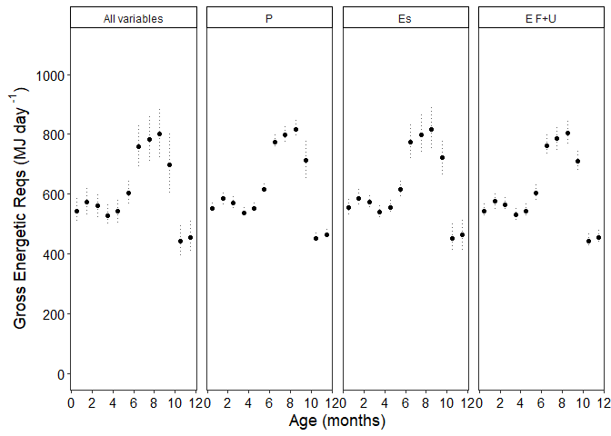

Gross Energetic Requirements(GER) Sensitivity Analysis - phase 1
================
Selina Agbayani
25 Jan 2022 - code updated 31 July, 2025

``` r
# Set path for output figures: 
Figurespath <- paste0(getwd(), "/gross_energetic_reqs/figures", collapse = NULL)
Figurespath
```

    ## [1] "C:/Users/AgbayaniS/Documents/R/graywhale_energyreqs/gross_energetic_reqs/figures"

``` r
# Set path for input & output data  
datapath <- paste0(getwd(), "/data", collapse = NULL) 
datapath
```

    ## [1] "C:/Users/AgbayaniS/Documents/R/graywhale_energyreqs/data"

``` r
## Read data in Production Cost, Es 


P_cost_table <- as_tibble(read_csv("data/P_cost_table_phase1.csv"), 
                          col_types = (list(cols(age_mth = col_double(),
                                                 age_yrs = col_double(),
                                                 mean_masschange = col_double(),
                                                 sd_masschange = col_double(),
                                                 sex = col_character(),
                                                 mean_P = col_double(),
                                                 sd_P = col_double(),
                                                 quant025 = col_double(),
                                                 quant975 = col_double(),
                                                 p_lipid = col_double(),
                                                 p_protein = col_double()
                                                 )
                                            )
                                       )
) 
```

    ## Rows: 39 Columns: 18
    ## ── Column specification ────────────────────────────────────────────────────────
    ## Delimiter: ","
    ## chr  (1): sex
    ## dbl (17): age_mth, age_yrs, mean_masschange, sd_masschange, mean_P, sd_P, qu...
    ## 
    ## ℹ Use `spec()` to retrieve the full column specification for this data.
    ## ℹ Specify the column types or set `show_col_types = FALSE` to quiet this message.

``` r
#P_cost_table <- P_cost_table %>% dplyr::filter(age_yrs >= 0)
kable(head(P_cost_table))
```

| age_mth | age_yrs | mean_masschange | sd_masschange | sex | mean_P | sd_P | quant025 | quant975 | p_lipid | p_protein | mass | mass_sd | Ts | mean_masschange_perday | sd_masschange_perday | mean_P_perday | sd_P_perday |
|---:|---:|---:|---:|:---|---:|---:|---:|---:|---:|---:|---:|---:|---:|---:|---:|---:|---:|
| 0 | 0.0000000 | 986.5660 | 20.894489 | N/A | 17045.480 | 766.9967 | 15657.439 | 15657.439 | 0.3638438 | 0.1260 | 983.0272 | 26.76770 | 0 | Inf | Inf | Inf | Inf |
| 1 | 0.0849315 | 516.6026 | 8.099161 | N/A | 8749.367 | 379.7509 | 8081.308 | 8081.308 | 0.3898447 | 0.1116 | 1498.2581 | 37.14344 | 31 | 16.66460 | 0.2612633 | 282.2376 | 12.25003 |
| 2 | 0.1616438 | 507.6841 | 12.548106 | N/A | 8425.023 | 405.8457 | 7683.912 | 7683.912 | 0.3721566 | 0.0972 | 2003.8171 | 53.21868 | 28 | 18.13158 | 0.4481466 | 300.8937 | 14.49449 |
| 3 | 0.2465753 | 578.9767 | 13.529226 | N/A | 9608.130 | 456.2691 | 8778.818 | 8778.818 | 0.3872586 | 0.0972 | 2580.5024 | 70.55082 | 31 | 18.67667 | 0.4364266 | 309.9397 | 14.71836 |
| 4 | 0.3287671 | 555.4428 | 9.504603 | N/A | 9217.611 | 412.1595 | 8489.886 | 8489.886 | 0.3358296 | 0.0972 | 3134.3355 | 82.72707 | 30 | 18.51476 | 0.3168201 | 307.2537 | 13.73865 |
| 5 | 0.4136986 | 552.6109 | 6.368057 | N/A | 9170.642 | 393.0700 | 8496.816 | 8496.816 | 0.3745950 | 0.0972 | 3685.8679 | 90.88511 | 31 | 17.82616 | 0.2054212 | 295.8271 | 12.67968 |

``` r
Es_table_phase1_permth <- as_tibble(read_csv("data/Es_sensAnalysis_phase1_permth_source_bpm.csv"), 
                             col_types = (list(cols(age_yrs = col_double(),
                                                    lifestage = col_character(),
                                                    no_days = col_double(),
                                                    Es = col_double(),
                                                    Es_sd = col_double(),
                                                    age_mth = col_double()
                                                    )
                                               )
                                          )
                             )
```

    ## Rows: 48 Columns: 9
    ## ── Column specification ────────────────────────────────────────────────────────
    ## Delimiter: ","
    ## chr (2): Lifestage, MC_variable
    ## dbl (7): age_yrs, age_mth, no_days, Es, Es_sd, Es_perday, Es_perday_sd
    ## 
    ## ℹ Use `spec()` to retrieve the full column specification for this data.
    ## ℹ Specify the column types or set `show_col_types = FALSE` to quiet this message.

``` r
kable(head(Es_table_phase1_permth))
```

| age_yrs | age_mth | Lifestage | no_days | MC_variable | Es | Es_sd | Es_perday | Es_perday_sd |
|---:|---:|:---|---:|:---|---:|---:|---:|---:|
| 0.0849315 | 1 | Calf | 31 | all | 4587.514 | 1302.31051 | 147.9843 | 42.0100166 |
| 0.0849315 | 1 | Calf | 31 | Rs | 4590.101 | 10.74811 | 148.0678 | 0.3467134 |
| 0.0849315 | 1 | Calf | 31 | Vt | 4590.018 | 120.23984 | 148.0651 | 3.8787044 |
| 0.0849315 | 1 | Calf | 31 | pctO2 | 4589.195 | 1311.30925 | 148.0386 | 42.3002983 |
| 0.1616438 | 2 | Calf | 28 | all | 4357.840 | 1237.23629 | 155.6372 | 44.1870102 |
| 0.1616438 | 2 | Calf | 28 | Rs | 4360.295 | 11.20510 | 155.7248 | 0.4001821 |

``` r
mass_table <- as_tibble(read_csv("data/mass_table.csv"), 
                           col_types = (list(cols(age_yrs = col_double(),
                                                  mean_mass = col_double(),
                                                  sd_mass = col_double(),
                                                  mean_lwr = col_double(),
                                                  mean_upr = col_double(),
                                                  quant025 = col_double(),
                                                  quant975 = col_double(),
                                                  female_mass = col_double(),
                                                  male_mass = col_double()
                                                  )
                                             )
                                        )
                        )
```

    ## Rows: 173 Columns: 9
    ## ── Column specification ────────────────────────────────────────────────────────
    ## Delimiter: ","
    ## dbl (9): age_yrs, mean_mass, sd_mass, mean_lwr, mean_upr, quant025, quant975...
    ## 
    ## ℹ Use `spec()` to retrieve the full column specification for this data.
    ## ℹ Specify the column types or set `show_col_types = FALSE` to quiet this message.

``` r
mean_masschange <- as_tibble(read_csv("data/mean_masschange.csv"),
                             col_types = (list(cols(age_yrs = col_double(),
                                                    mean_masschange = col_double(),
                                                    sd_masschange = col_double(),
                                                    sex = col_character(),
                                                    age_mth = col_double()
                                                    )
                                               )
                                          )
                             )
```

    ## Rows: 39 Columns: 5
    ## ── Column specification ────────────────────────────────────────────────────────
    ## Delimiter: ","
    ## chr (1): sex
    ## dbl (4): age_yrs, mean_masschange, sd_masschange, age_mth
    ## 
    ## ℹ Use `spec()` to retrieve the full column specification for this data.
    ## ℹ Specify the column types or set `show_col_types = FALSE` to quiet this message.

``` r
mean_masschange <- mean_masschange %>% dplyr::filter(age_yrs >=0)
kable(head(mean_masschange))
```

|   age_yrs | mean_masschange | sd_masschange | sex | age_mth |
|----------:|----------------:|--------------:|:----|--------:|
| 0.0000000 |        982.8522 |     27.098452 | N/A |       0 |
| 0.0849315 |        515.1631 |     10.503953 | N/A |       1 |
| 0.1616438 |        505.4539 |     16.273872 | N/A |       2 |
| 0.2465753 |        576.5720 |     17.546305 | N/A |       3 |
| 0.3287671 |        553.7534 |     12.326696 | N/A |       4 |
| 0.4136986 |        551.4791 |      8.258852 | N/A |       5 |

``` r
age_yr_tibble <- as_tibble(
  read_csv("data/age_yr_tibble.csv"), 
  col_types = (list(ID = col_integer(),
                    month = col_character(),
                    no_days_in_mth = col_double(),
                    age_mth = col_double(),
                    no_days_cumul = col_double(),
                    age_yrs = col_double()
  )
  )
)
```

    ## Rows: 25 Columns: 5
    ## ── Column specification ────────────────────────────────────────────────────────
    ## Delimiter: ","
    ## chr (1): month
    ## dbl (4): no_days_in_mth, age_mth, no_days_cumul, age_yrs
    ## 
    ## ℹ Use `spec()` to retrieve the full column specification for this data.
    ## ℹ Specify the column types or set `show_col_types = FALSE` to quiet this message.

``` r
kable(age_yr_tibble)
```

| month | no_days_in_mth | age_mth | no_days_cumul |   age_yrs |
|:------|---------------:|--------:|--------------:|----------:|
| Jan   |            0.0 |     0.0 |           0.0 | 0.0000000 |
| Jan   |           15.5 |     0.5 |          15.5 | 0.0424658 |
| Jan   |           15.5 |     1.0 |          31.0 | 0.0849315 |
| Feb   |           14.0 |     1.5 |          45.0 | 0.1232877 |
| Feb   |           14.0 |     2.0 |          59.0 | 0.1616438 |
| Mar   |           15.5 |     2.5 |          74.5 | 0.2041096 |
| Mar   |           15.5 |     3.0 |          90.0 | 0.2465753 |
| Apr   |           15.0 |     3.5 |         105.0 | 0.2876712 |
| Apr   |           15.0 |     4.0 |         120.0 | 0.3287671 |
| May   |           15.5 |     4.5 |         135.5 | 0.3712329 |
| May   |           15.5 |     5.0 |         151.0 | 0.4136986 |
| Jun   |           15.0 |     5.5 |         166.0 | 0.4547945 |
| Jun   |           15.0 |     6.0 |         181.0 | 0.4958904 |
| Jul   |           15.5 |     6.5 |         196.5 | 0.5383562 |
| Jul   |           15.5 |     7.0 |         212.0 | 0.5808219 |
| Aug   |           15.5 |     7.5 |         227.5 | 0.6232877 |
| Aug   |           15.5 |     8.0 |         243.0 | 0.6657534 |
| Sep   |           15.0 |     8.5 |         258.0 | 0.7068493 |
| Sep   |           15.0 |     9.0 |         273.0 | 0.7479452 |
| Oct   |           15.5 |     9.5 |         288.5 | 0.7904110 |
| Oct   |           15.5 |    10.0 |         304.0 | 0.8328767 |
| Nov   |           15.0 |    10.5 |         319.0 | 0.8739726 |
| Nov   |           15.0 |    11.0 |         334.0 | 0.9150685 |
| Dec   |           15.5 |    11.5 |         349.5 | 0.9575342 |
| Dec   |           15.5 |    12.0 |         365.0 | 1.0000000 |

MC calculations for Production Cost and Es

``` r
#All sd values set to 0 except for variable being varied. 

#Energy Density values
ED_milk = 22.33 #MJ/kg   Average between Tomilin 1946 and Zenkovich 1938,    (Sumich 1986 - cited 22.4  MJ/kg)

MC_reps = 10000
```

``` r
predict_GER_table_sensAnalysis <- as.data.frame(matrix(ncol = 22, nrow = 0))

cnames <- c("phase", "age_yrs", "sex","MC_variable",
            "mean_GER", "GER_sd", 
            "quant025", "quant975", "GER_foraging",
            "sd_foraging","quant025_foraging", "quant975_foraging",
            "FR_foraging", "FR_sd_foraging", 
            "FR_quant025", "FR_quant975", "Ts", "mass",
                    "mass_sd", "pctbodywt", "pctbodywt_sd", "pct_unit")            

colnames(predict_GER_table_sensAnalysis) <- cnames

predict_GER_table_sensAnalysis <- as_tibble(
  predict_GER_table_sensAnalysis,
  col_types = (list(ID = col_integer(),
                    phase = col_character(),
                    age_yrs = col_double(), 
                    sex = col_character(),
                    MC_variable = col_character(),
                    mean_GER = col_double(), 
                    GER_sd = col_double(), 
                    quant025 = col_double(), 
                    quant975 = col_double(), 
                    GER_foraging = col_double(),
                    sd_foraging = col_double(), 
                    quant025_foraging = col_double(),
                    quant975_foraging = col_double(),
                    FR_foraging = col_double(),
                    FR_sd_foraging = col_double(),
                    FR_quant025 = col_double(),
                    FR_quant975 = col_double(),
                    Ts = col_double(),
                    mass = col_double(),
                    mass_sd = col_double(),
                    pctbodywt = col_double(),
                    pctbodywt_sd = col_double(),
                    pct_unit = col_character()
  )
  )
)


for (s in c("N/A")){
  for (MC_var in c("all","P_cost", "Es", "E_FnU")){
    for (i in seq(from = 1, to = 12, by = 1)){ 
      
      # Age values
      age <- age_yr_tibble %>% 
        filter(age_mth == i) %>% 
        pull(age_yrs) #calculate age_yrs (do not round up)
      
      age_mid_i <- age_yr_tibble %>% 
        filter(age_mth == i-0.5)  %>% 
        pull(age_yrs)
      
      # Mass values
      mass <- mass_table %>% 
        filter(round(age_yrs,3) == round(age,3)) %>% 
        pull(mean_mass)
      if (MC_var == "all"){
        mass_sd <- mass_table %>%
        filter(round(age_yrs,3) == round(age,3)) %>%
        pull(sd_mass)  
      } else {
        mass_sd = 0
      }
      
      # Production Cost (P_cost)
      P_cost_i <- P_cost_table %>%
        dplyr::filter(round(P_cost_table$age_yrs*12) == i
                      & P_cost_table$sex == s)
      
      Ts <- P_cost_i$Ts
      mean_P <- P_cost_i$mean_P
      
      if (MC_var == "P_cost" || MC_var == "all"){
        sd_P <- P_cost_i$sd_P
      } else {
        sd_P = 0
      }
      
      
      #Total metabolic energy expenditure (Es)
      Es_table_i <- Es_table_phase1_permth %>%
        dplyr::filter(Es_table_phase1_permth$age_yrs == age)
      
      Es <- Es_table_i$Es
      if (MC_var == "Es" || MC_var == "all"){
        Es_sd <- Es_table_i$Es_sd
      } else {
        Es_sd = 0   
      }
      
      
      #Fecal and Urinary cost - E_FnU
      E_FnU_min = 0.740
      E_FnU_max = 0.858
      E_FnU_mean = (E_FnU_min + E_FnU_max)/2
      
      #Energetic density of Prey - ED_prey
      ED_prey_mean = 2.90 #MJ/kg  from average I calculated... 
      
      if (MC_var == "all"){
        ED_prey_sd = 0.0408  #calculated from table 3  
      } else {
        ED_prey_sd = 0
      }
      
      ED_prey_min = 2.51   #from Coyle et al. 2007
      ED_prey_max = 3.41   #from Stoker 1978

      
      #### Monte carlo - Production cost 
      set.seed(12345)
      MC_vars_i <- as_tibble(rnorm(MC_reps, mean_P, sd_P))
      names(MC_vars_i)[1] <- "P_cost"
      
      #Add columns and move to the front
      MC_vars_i$sex <- s
      MC_vars_i$GER <- NA
      MC_vars_i<- MC_vars_i %>%  dplyr::select(sex, GER, everything()) 
      
      
      #### Monte carlo - Energy expenditure - Es
      set.seed(12345)
      Es_i <-  as_tibble(rnorm(MC_reps, Es, Es_sd))
      names(Es_i)[1] <- "Es"
      
      MC_vars_i <- cbind(MC_vars_i, Es_i)
      
      #### Monte carlo - Fecal and urinary waste - E_FnU
      set.seed(12345)
      if (MC_var == "E_FnU" || MC_var == "all"){
        E_FnU_i <- as_tibble(runif(MC_reps, min = E_FnU_min, max = E_FnU_max)) 
      } else {
        E_FnU_i <- as_tibble(runif(MC_reps, min = E_FnU_mean, max = E_FnU_mean)) 
      }
      names(E_FnU_i)[1] <- "E_FnU"
      
      MC_vars_i <- cbind(MC_vars_i, E_FnU_i)
      
      #### Monte carlo - Energetic density of prey - ED_prey
      set.seed(12345)
      ED_prey_i <- as_tibble(rnorm(MC_reps, ED_prey_mean, ED_prey_sd)) 
      names(ED_prey_i)[1] <- "ED_prey"
      
      MC_vars_i <- cbind(MC_vars_i, ED_prey_i)
      
      #### Monte carlo - Mass 
      set.seed(12345)
      mass_i <-  as_tibble(rnorm(MC_reps, mass, mass_sd))
      names(mass_i)[1] <- "mass"
      
      MC_vars_i <- cbind(MC_vars_i, mass_i)
      
      
      # pulling values from the MC_vars_i tibble 
      P_cost <- MC_vars_i$P_cost # should be P_cost at monthly time step
      Es <- MC_vars_i$Es
      E_FnU <- MC_vars_i$E_FnU
      ED_prey <- MC_vars_i$ED_prey
      mass <- MC_vars_i$mass
      
      #GER calculation  -- Es includes digestion, maintenance and activity
      MC_vars_i$GER <- (((P_cost + Es)/(E_FnU))/Ts) # per day for the timestep
      MC_vars_i$GER_foraging <- (((P_cost + Es)/(E_FnU))/Ts) # per day for # days actively foraging
      
      
      if (age <= 0.84){
        MC_vars_i$FR_foraging <- (MC_vars_i$GER / ED_milk) 
        MC_vars_i$pctbodywt <- (MC_vars_i$FR_foraging / MC_vars_i$mass)
        pct_unit_i <- "L milk/kg body weight"
        
      } else {
        MC_vars_i$FR_foraging <- (MC_vars_i$GER_foraging /MC_vars_i$ED_prey) 
        MC_vars_i$pctbodywt <- (MC_vars_i$FR_foraging / MC_vars_i$mass)*100 
        pct_unit_i <- "% of body weight"
      }
      
      MC_vars_i <- MC_vars_i %>%  dplyr::mutate(ID = row_number())
      MC_vars_i<- MC_vars_i %>%  dplyr::select(ID,everything()) # move ID to the first column
      
      mean_GER_i <- mean(MC_vars_i$GER)
      sd_GER_i <- sd(MC_vars_i$GER)
      
      quant025 <- quantile(MC_vars_i$GER, 0.025, na.rm = TRUE)
      quant975 <- quantile(MC_vars_i$GER, 0.975, na.rm = TRUE)
      
      GER_foraging_i <- mean(MC_vars_i$GER_foraging)
      sd_foraging_i <- sd(MC_vars_i$GER_foraging)
      
      quant025_foraging <- quantile(MC_vars_i$GER_foraging, 0.025, na.rm = TRUE)
      quant975_foraging <- quantile(MC_vars_i$GER_foraging, 0.975, na.rm = TRUE)
      
      FR_foraging_i <- mean(MC_vars_i$FR_foraging)
      FR_sd_foraging_i <- sd(MC_vars_i$FR_foraging)
      FR_quant025_i <- quantile(MC_vars_i$FR_foraging, 0.025, na.rm = TRUE)
      FR_quant975_i <- quantile(MC_vars_i$FR_foraging, 0.975, na.rm = TRUE)
      
      pctbodywt_i <- mean(MC_vars_i$pctbodywt)
      pctbodywt_sd_i <- sd(MC_vars_i$pctbodywt)
      
      mass <- mean(MC_vars_i$mass)
      mass_sd <- sd(MC_vars_i$mass)
      
      
      
      row <- tibble(phase = "1",
                    age_yrs = age, 
                    sex = s, 
                    MC_variable = MC_var,
                    mean_GER = mean_GER_i, 
                    GER_sd = sd_GER_i, 
                    quant025 = quant025, 
                    quant975 = quant975, 
                    GER_foraging = GER_foraging_i,
                    sd_foraging = sd_foraging_i, 
                    quant025_foraging = quant025_foraging,
                    quant975_foraging = quant975_foraging,
                    FR_foraging = FR_foraging_i,
                    FR_sd_foraging = FR_sd_foraging_i,
                    FR_quant025 = FR_quant025_i,
                    FR_quant975 = FR_quant975_i,
                    Ts = Ts,
                    mass = mass,
                    mass_sd = mass_sd,
                    pctbodywt = pctbodywt_i,
                    pctbodywt_sd = pctbodywt_sd_i,
                    pct_unit = pct_unit_i
      )
      
      predict_GER_table_sensAnalysis <- rbind(predict_GER_table_sensAnalysis, row)
      
    }  
  } 
  
}

predict_GER_table_sensAnalysis_phase1_permth <- predict_GER_table_sensAnalysis

predict_GER_table_sensAnalysis_phase1_permth$age_mth <- round(predict_GER_table_sensAnalysis_phase1_permth$age_yrs * 12)

predict_GER_table_sensAnalysis_phase1_permth %>% write_csv("data/predict_GER_table_sensAnalysis_phase1_permth_source_bpm.csv", na = "", append = FALSE)

kable(predict_GER_table_sensAnalysis_phase1_permth)
```

| phase | age_yrs | sex | MC_variable | mean_GER | GER_sd | quant025 | quant975 | GER_foraging | sd_foraging | quant025_foraging | quant975_foraging | FR_foraging | FR_sd_foraging | FR_quant025 | FR_quant975 | Ts | mass | mass_sd | pctbodywt | pctbodywt_sd | pct_unit | age_mth |
|:---|---:|:---|:---|---:|---:|---:|---:|---:|---:|---:|---:|---:|---:|---:|---:|---:|---:|---:|---:|---:|:---|---:|
| 1 | 0.0849315 | N/A | all | 539.1144 | 55.339326 | 420.2832 | 658.0140 | 539.1144 | 55.339326 | 420.2832 | 658.0140 | 24.14306 | 2.4782502 | 18.82146 | 29.46771 | 31 | 1498.233 | 37.13787 | 0.0160919 | 0.0013638 | L milk/kg body weight | 1 |
| 1 | 0.1616438 | N/A | all | 572.0843 | 59.909660 | 443.5843 | 700.4533 | 572.0843 | 59.909660 | 443.5843 | 700.4533 | 25.61954 | 2.6829225 | 19.86495 | 31.36826 | 28 | 2003.780 | 53.21070 | 0.0127661 | 0.0010886 | L milk/kg body weight | 2 |
| 1 | 0.2465753 | N/A | all | 559.9928 | 47.910103 | 461.3120 | 657.8958 | 559.9928 | 47.910103 | 461.3120 | 657.8958 | 25.07805 | 2.1455487 | 20.65884 | 29.46242 | 31 | 2580.454 | 70.54024 | 0.0097077 | 0.0006431 | L milk/kg body weight | 3 |
| 1 | 0.3287671 | N/A | all | 530.9422 | 49.659608 | 427.0855 | 634.5250 | 530.9422 | 49.659608 | 427.0855 | 634.5250 | 23.77708 | 2.2238965 | 19.12608 | 28.41581 | 30 | 3134.278 | 82.71465 | 0.0075765 | 0.0005639 | L milk/kg body weight | 4 |
| 1 | 0.4136986 | N/A | all | 545.7917 | 53.940713 | 431.0345 | 660.5196 | 545.7917 | 53.940713 | 431.0345 | 660.5196 | 24.44208 | 2.4156164 | 19.30293 | 29.57992 | 31 | 3685.805 | 90.87147 | 0.0066227 | 0.0005372 | L milk/kg body weight | 5 |
| 1 | 0.4958904 | N/A | all | 599.2263 | 51.145994 | 491.9208 | 706.0601 | 599.2263 | 51.145994 | 491.9208 | 706.0601 | 26.83503 | 2.2904610 | 22.02959 | 31.61935 | 30 | 4188.934 | 92.44531 | 0.0064001 | 0.0004495 | L milk/kg body weight | 6 |
| 1 | 0.5808219 | N/A | all | 743.2416 | 89.831725 | 545.1044 | 942.2476 | 743.2416 | 89.831725 | 545.1044 | 942.2476 | 33.28444 | 4.0229165 | 24.41130 | 42.19649 | 31 | 4670.710 | 91.40099 | 0.0071161 | 0.0007616 | L milk/kg body weight | 7 |
| 1 | 0.6657534 | N/A | all | 762.1476 | 96.418138 | 547.6014 | 977.2490 | 762.1476 | 96.418138 | 547.6014 | 977.2490 | 34.13111 | 4.3178745 | 24.52313 | 43.76395 | 31 | 5110.500 | 90.41413 | 0.0066694 | 0.0007609 | L milk/kg body weight | 8 |
| 1 | 0.7479452 | N/A | all | 777.3761 | 102.654275 | 548.0715 | 1006.8466 | 777.3761 | 102.654275 | 548.0715 | 1006.8466 | 34.81308 | 4.5971462 | 24.54418 | 45.08941 | 30 | 5495.401 | 93.43444 | 0.0063261 | 0.0007603 | L milk/kg body weight | 9 |
| 1 | 0.8328767 | N/A | all | 683.4969 | 122.857429 | 424.3853 | 938.5645 | 683.4969 | 122.857429 | 424.3853 | 938.5645 | 30.60891 | 5.5019001 | 19.00516 | 42.03155 | 31 | 5802.591 | 211.60921 | 0.0052506 | 0.0007825 | L milk/kg body weight | 10 |
| 1 | 0.9150685 | N/A | all | 424.2245 | 64.475221 | 278.9858 | 568.0946 | 424.2245 | 64.475221 | 278.9858 | 568.0946 | 146.07711 | 20.7348604 | 98.53440 | 191.85491 | 30 | 5935.437 | 207.11639 | 2.4553417 | 0.2963617 | % of body weight | 11 |
| 1 | 1.0000000 | N/A | all | 432.8956 | 66.271984 | 283.6434 | 580.6366 | 432.8956 | 66.271984 | 283.6434 | 580.6366 | 149.05999 | 21.3156175 | 100.13218 | 196.05220 | 31 | 6072.716 | 202.08059 | 2.4488629 | 0.2997896 | % of body weight | 12 |
| 1 | 0.0849315 | N/A | P_cost | 538.5083 | 15.329986 | 508.0305 | 568.6168 | 538.5083 | 15.329986 | 508.0305 | 568.6168 | 24.11591 | 0.6865197 | 22.75103 | 25.46425 | 31 | 1498.258 | 0.00000 | 0.0160960 | 0.0004582 | L milk/kg body weight | 1 |
| 1 | 0.1616438 | N/A | P_cost | 571.4370 | 18.138676 | 535.3750 | 607.0620 | 571.4370 | 18.138676 | 535.3750 | 607.0620 | 25.59055 | 0.8123008 | 23.97559 | 27.18594 | 28 | 2003.817 | 0.00000 | 0.0127709 | 0.0004054 | L milk/kg body weight | 2 |
| 1 | 0.2465753 | N/A | P_cost | 559.2492 | 18.418734 | 522.6300 | 595.4242 | 559.2492 | 18.418734 | 522.6300 | 595.4242 | 25.04475 | 0.8248426 | 23.40484 | 26.66476 | 31 | 2580.502 | 0.00000 | 0.0097054 | 0.0003196 | L milk/kg body weight | 3 |
| 1 | 0.3287671 | N/A | P_cost | 530.2801 | 17.192665 | 496.0983 | 564.0464 | 530.2801 | 17.192665 | 496.0983 | 564.0464 | 23.74743 | 0.7699357 | 22.21667 | 25.25958 | 30 | 3134.335 | 0.00000 | 0.0075765 | 0.0002456 | L milk/kg body weight | 4 |
| 1 | 0.4136986 | N/A | P_cost | 545.1589 | 15.867615 | 513.6125 | 576.3238 | 545.1589 | 15.867615 | 513.6125 | 576.3238 | 24.41375 | 0.7105963 | 23.00101 | 25.80940 | 31 | 3685.868 | 0.00000 | 0.0066236 | 0.0001928 | L milk/kg body weight | 5 |
| 1 | 0.4958904 | N/A | P_cost | 598.4718 | 14.394875 | 569.8541 | 626.7441 | 598.4718 | 14.394875 | 569.8541 | 626.7441 | 26.80124 | 0.6446429 | 25.51966 | 28.06736 | 30 | 4188.998 | 0.00000 | 0.0063980 | 0.0001539 | L milk/kg body weight | 6 |
| 1 | 0.5808219 | N/A | P_cost | 742.5859 | 13.317338 | 716.1013 | 768.7406 | 742.5859 | 13.317338 | 716.1013 | 768.7406 | 33.25508 | 0.5963877 | 32.06902 | 34.42636 | 31 | 4670.773 | 0.00000 | 0.0071198 | 0.0001277 | L milk/kg body weight | 7 |
| 1 | 0.6657534 | N/A | P_cost | 761.5365 | 12.157986 | 737.3575 | 785.4147 | 761.5365 | 12.157986 | 737.3575 | 785.4147 | 34.10374 | 0.5444687 | 33.02094 | 35.17307 | 31 | 5110.562 | 0.00000 | 0.0066732 | 0.0001065 | L milk/kg body weight | 8 |
| 1 | 0.7479452 | N/A | P_cost | 776.8030 | 11.129518 | 754.6768 | 798.6459 | 776.8030 | 11.129518 | 754.6768 | 798.6459 | 34.78742 | 0.4984110 | 33.79654 | 35.76560 | 30 | 5495.466 | 0.00000 | 0.0063302 | 0.0000907 | L milk/kg body weight | 9 |
| 1 | 0.8328767 | N/A | P_cost | 682.8575 | 63.274358 | 557.0607 | 807.1111 | 682.8575 | 63.274358 | 557.0607 | 807.1111 | 30.58027 | 2.8336031 | 24.94674 | 36.14470 | 31 | 5802.737 | 0.00000 | 0.0052700 | 0.0004883 | L milk/kg body weight | 10 |
| 1 | 0.9150685 | N/A | P_cost | 423.9679 | 4.515837 | 414.9840 | 432.8294 | 423.9679 | 4.515837 | 414.9840 | 432.8294 | 146.19583 | 1.5571850 | 143.09793 | 149.25151 | 30 | 5935.580 | 0.00000 | 2.4630421 | 0.0262348 | % of body weight | 11 |
| 1 | 1.0000000 | N/A | P_cost | 432.6314 | 4.632322 | 423.4184 | 441.7208 | 432.6314 | 4.632322 | 423.4184 | 441.7208 | 149.18323 | 1.5973524 | 146.00634 | 152.31753 | 31 | 6072.856 | 0.00000 | 2.4565581 | 0.0263032 | % of body weight | 12 |
| 1 | 0.0849315 | N/A | Es | 538.1959 | 37.580563 | 449.6027 | 625.0932 | 538.1959 | 37.580563 | 449.6027 | 625.0932 | 24.10192 | 1.6829630 | 20.13447 | 27.99342 | 31 | 1498.258 | 0.00000 | 0.0160866 | 0.0011233 | L milk/kg body weight | 1 |
| 1 | 0.1616438 | N/A | Es | 571.1102 | 39.527851 | 477.9258 | 662.5016 | 571.1102 | 39.527851 | 477.9258 | 662.5016 | 25.57592 | 1.7701680 | 21.40286 | 29.66868 | 28 | 2003.817 | 0.00000 | 0.0127636 | 0.0008834 | L milk/kg body weight | 2 |
| 1 | 0.2465753 | N/A | Es | 559.0419 | 25.675174 | 498.4936 | 618.3870 | 559.0419 | 25.675174 | 498.4936 | 618.3870 | 25.03546 | 1.1498063 | 22.32394 | 27.69310 | 31 | 2580.502 | 0.00000 | 0.0097018 | 0.0004456 | L milk/kg body weight | 3 |
| 1 | 0.3287671 | N/A | Es | 530.0395 | 29.587476 | 460.2755 | 598.3905 | 530.0395 | 29.587476 | 460.2755 | 598.3905 | 23.73666 | 1.3250101 | 20.61243 | 26.79761 | 30 | 3134.335 | 0.00000 | 0.0075731 | 0.0004227 | L milk/kg body weight | 4 |
| 1 | 0.4136986 | N/A | Es | 544.8625 | 35.443931 | 461.3011 | 626.9032 | 544.8625 | 35.443931 | 461.3011 | 626.9032 | 24.40047 | 1.5872786 | 20.65835 | 28.07448 | 31 | 3685.868 | 0.00000 | 0.0066200 | 0.0004306 | L milk/kg body weight | 5 |
| 1 | 0.4958904 | N/A | Es | 598.2063 | 32.241459 | 522.1713 | 672.7075 | 598.2063 | 32.241459 | 522.1713 | 672.7075 | 26.78935 | 1.4438629 | 23.38429 | 30.12573 | 30 | 4188.998 | 0.00000 | 0.0063952 | 0.0003447 | L milk/kg body weight | 6 |
| 1 | 0.5808219 | N/A | Es | 741.9691 | 73.200016 | 569.4011 | 911.1509 | 741.9691 | 73.200016 | 569.4011 | 911.1509 | 33.22746 | 3.2781019 | 25.49938 | 40.80389 | 31 | 4670.773 | 0.00000 | 0.0071139 | 0.0007018 | L milk/kg body weight | 7 |
| 1 | 0.6657534 | N/A | Es | 760.8415 | 80.931316 | 569.9784 | 948.2394 | 760.8415 | 80.931316 | 569.9784 | 948.2394 | 34.07262 | 3.6243312 | 25.52523 | 42.46482 | 31 | 5110.562 | 0.00000 | 0.0066671 | 0.0007092 | L milk/kg body weight | 8 |
| 1 | 0.7479452 | N/A | Es | 776.0427 | 88.136969 | 568.1340 | 980.1823 | 776.0427 | 88.136969 | 568.1340 | 980.1823 | 34.75337 | 3.9470206 | 25.44263 | 43.89531 | 30 | 5495.466 | 0.00000 | 0.0063240 | 0.0007182 | L milk/kg body weight | 9 |
| 1 | 0.8328767 | N/A | Es | 682.3426 | 64.037639 | 531.2666 | 830.6815 | 682.3426 | 64.037639 | 531.2666 | 830.6815 | 30.55721 | 2.8677850 | 23.79161 | 37.20025 | 31 | 5802.737 | 0.00000 | 0.0052660 | 0.0004942 | L milk/kg body weight | 10 |
| 1 | 0.9150685 | N/A | Es | 423.4937 | 58.074210 | 286.6071 | 557.2905 | 423.4937 | 58.074210 | 286.6071 | 557.2905 | 146.03232 | 20.0255896 | 98.83004 | 192.16915 | 30 | 5935.580 | 0.00000 | 2.4602874 | 0.3373822 | % of body weight | 11 |
| 1 | 1.0000000 | N/A | Es | 432.1496 | 59.722134 | 291.5702 | 569.7773 | 432.1496 | 59.722134 | 291.5702 | 569.7773 | 149.01711 | 20.5938394 | 100.54144 | 196.47492 | 31 | 6072.856 | 0.00000 | 2.4538226 | 0.3391129 | % of body weight | 12 |
| 1 | 0.0849315 | N/A | E_FnU | 539.4356 | 22.923775 | 503.2478 | 579.0783 | 539.4356 | 22.923775 | 503.2478 | 579.0783 | 24.15744 | 1.0265909 | 22.53685 | 25.93275 | 31 | 1498.258 | 0.00000 | 0.0161237 | 0.0006852 | L milk/kg body weight | 1 |
| 1 | 0.1616438 | N/A | E_FnU | 572.4224 | 24.325573 | 534.0216 | 614.4892 | 572.4224 | 24.325573 | 534.0216 | 614.4892 | 25.63468 | 1.0893673 | 23.91499 | 27.51855 | 28 | 2003.817 | 0.00000 | 0.0127929 | 0.0005436 | L milk/kg body weight | 2 |
| 1 | 0.2465753 | N/A | E_FnU | 560.2139 | 23.806737 | 522.6320 | 601.3834 | 560.2139 | 23.806737 | 522.6320 | 601.3834 | 25.08795 | 1.0661324 | 23.40493 | 26.93164 | 31 | 2580.502 | 0.00000 | 0.0097221 | 0.0004131 | L milk/kg body weight | 3 |
| 1 | 0.3287671 | N/A | E_FnU | 531.1947 | 22.573520 | 495.5594 | 570.2314 | 531.1947 | 22.573520 | 495.5594 | 570.2314 | 23.78839 | 1.0109055 | 22.19254 | 25.53656 | 30 | 3134.335 | 0.00000 | 0.0075896 | 0.0003225 | L milk/kg body weight | 4 |
| 1 | 0.4136986 | N/A | E_FnU | 546.0979 | 23.206883 | 509.4635 | 586.2306 | 546.0979 | 23.206883 | 509.4635 | 586.2306 | 24.45580 | 1.0392693 | 22.81520 | 26.25305 | 31 | 3685.868 | 0.00000 | 0.0066350 | 0.0002820 | L milk/kg body weight | 5 |
| 1 | 0.4958904 | N/A | E_FnU | 599.5005 | 25.476301 | 559.2839 | 643.5580 | 599.5005 | 25.476301 | 559.2839 | 643.5580 | 26.84731 | 1.1409002 | 25.04630 | 28.82033 | 30 | 4188.998 | 0.00000 | 0.0064090 | 0.0002724 | L milk/kg body weight | 6 |
| 1 | 0.5808219 | N/A | E_FnU | 743.8593 | 31.611099 | 693.9749 | 798.5308 | 743.8593 | 31.611099 | 693.9749 | 798.5308 | 33.31210 | 1.4156336 | 31.07814 | 35.76045 | 31 | 4670.773 | 0.00000 | 0.0071320 | 0.0003031 | L milk/kg body weight | 7 |
| 1 | 0.6657534 | N/A | E_FnU | 762.8413 | 32.417825 | 711.6906 | 818.9042 | 762.8413 | 32.417825 | 711.6906 | 818.9042 | 34.16217 | 1.4517611 | 31.87150 | 36.67282 | 31 | 5110.562 | 0.00000 | 0.0066846 | 0.0002841 | L milk/kg body weight | 8 |
| 1 | 0.7479452 | N/A | E_FnU | 778.1331 | 33.067720 | 725.9600 | 835.3203 | 778.1331 | 33.067720 | 725.9600 | 835.3203 | 34.84698 | 1.4808652 | 32.51052 | 37.40799 | 30 | 5495.466 | 0.00000 | 0.0063410 | 0.0002695 | L milk/kg body weight | 9 |
| 1 | 0.8328767 | N/A | E_FnU | 684.0637 | 29.070158 | 638.2007 | 734.3378 | 684.0637 | 29.070158 | 638.2007 | 734.3378 | 30.63429 | 1.3018432 | 28.58042 | 32.88571 | 31 | 5802.737 | 0.00000 | 0.0052793 | 0.0002243 | L milk/kg body weight | 10 |
| 1 | 0.9150685 | N/A | E_FnU | 424.6928 | 18.047880 | 396.2231 | 455.9059 | 424.6928 | 18.047880 | 396.2231 | 455.9059 | 146.44579 | 6.2234068 | 136.62865 | 157.20893 | 30 | 5935.580 | 0.00000 | 2.4672532 | 0.1048492 | % of body weight | 11 |
| 1 | 1.0000000 | N/A | E_FnU | 433.3711 | 18.416668 | 404.3193 | 465.2216 | 433.3711 | 18.416668 | 404.3193 | 465.2216 | 149.43830 | 6.3505751 | 139.42046 | 160.42123 | 31 | 6072.856 | 0.00000 | 2.4607582 | 0.1045731 | % of body weight | 12 |

``` r
predict_GER_table_sensAnalysis_phase1_permth_allvary <- predict_GER_table_sensAnalysis_phase1_permth %>% 
  dplyr::filter(sex == "N/A", MC_variable == "all")
  
average_GER_first_yr <- 
  mean(predict_GER_table_sensAnalysis_phase1_permth_allvary$mean_GER)
average_GER_first_yr
```

    ## [1] 597.5445

``` r
average_GER_first_yr_sd <- 
  mean(predict_GER_table_sensAnalysis_phase1_permth_allvary$GER_sd)
average_GER_first_yr_sd
```

    ## [1] 71.70118

``` r
predict_GER_table_sensAnalysis_phase1_permth$MC_var_factor <- 
  factor(predict_GER_table_sensAnalysis_phase1_permth$MC_variable, 
         levels=c('all','P_cost','Es','E_FnU'))

# New facet label names for MC_var_factor variable
MC_var_factor.labs <- c("All variables", "P", "Es", "E F+U")
names(MC_var_factor.labs) <- c("all", "P_cost", "Es","E_FnU")

plot_predict_GER_sensAnalysis_phase1_permth <- 
  predict_GER_table_sensAnalysis_phase1_permth %>%
  dplyr::filter(sex == "N/A") %>% 
  ggplot(aes(x = age_mth, y = mean_GER)) +
  geom_errorbar(aes(x = age_mth-0.5, 
                    ymin = mean_GER-GER_sd, 
                    ymax = mean_GER+GER_sd), 
                width=0, 
                linetype = 1,
                color="gray40") + 
  geom_point(aes(x = age_mth-0.5, y= mean_GER), 
             shape = 21, fill = "black")+
  facet_grid(~MC_var_factor, 
             labeller = labeller(MC_var_factor = MC_var_factor.labs)) +
  xlab("Age (months)") +
  ylab(bquote('Gross Energetic Reqs (MJ day '^'-1'*')')) +
  scale_x_continuous(breaks = scales::pretty_breaks(n = 5)) + 
  #limits = c(0, 30)) +  # max x-axis 30 yrs. 
  scale_y_continuous(breaks = scales::pretty_breaks(n = 7),
                     limits = c(0,1100)) + 
  theme_bw()+
  theme(panel.grid = element_blank())+
  theme(panel.spacing = unit(0.6, "lines"))+
  #  color="black", fill=NA))+
  theme(axis.text = element_text(size = rel(1),
                                 colour = "black")) +
  theme(axis.title.x = element_text(size = rel(1.2),
                                    colour = "black")) +
  theme(axis.title.y = element_text(size = rel(1.2),
                                    colour = "black"))+
    theme(strip.background =element_rect(fill="transparent",
                                       colour = "transparent"))+
  theme(strip.text = element_text(size = rel(1)))


plot_predict_GER_sensAnalysis_phase1_permth
```

<!-- -->
