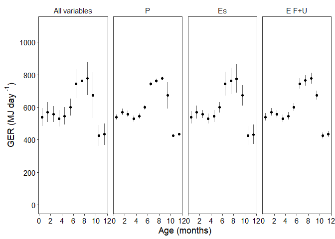

Gross Energetic Requirements (GER) Sensitivity Analysis - Phase 1
(calves)
================
Selina Agbayani
25 Jan 2022 - code updated 12 August, 2025

``` r
# Set path for output figures: 
Figurespath <- paste0(getwd(), "/gross_energetic_reqs/figures", collapse = NULL)
Figurespath
```

    ## [1] "C:/Users/AgbayaniS/Documents/R/graywhale_energyreqs/gross_energetic_reqs/figures"

``` r
# Set path for input & output data  
datapath <- paste0(getwd(), "/data", collapse = NULL) 
datapath
```

    ## [1] "C:/Users/AgbayaniS/Documents/R/graywhale_energyreqs/data"

``` r
## Read data in Production Cost, Es 

P_cost_table <- as_tibble(read_csv("data/P_cost_table_phase1.csv"), 
                          col_types = (list(cols(age_mth = col_double(),
                                                 age_yrs = col_double(),
                                                 mean_masschange = col_double(),
                                                 sd_masschange = col_double(),
                                                 sex = col_character(),
                                                 mean_P = col_double(),
                                                 sd_P = col_double(),
                                                 quant025 = col_double(),
                                                 quant975 = col_double(),
                                                 p_lipid = col_double(),
                                                 p_protein = col_double()
                                                 )
                                            )
                                       )
) 
```

    ## Rows: 39 Columns: 18
    ## ── Column specification ────────────────────────────────────────────────────────
    ## Delimiter: ","
    ## chr  (1): sex
    ## dbl (17): age_mth, age_yrs, mean_masschange, sd_masschange, mean_P, sd_P, qu...
    ## 
    ## ℹ Use `spec()` to retrieve the full column specification for this data.
    ## ℹ Specify the column types or set `show_col_types = FALSE` to quiet this message.

``` r
#P_cost_table <- P_cost_table %>% dplyr::filter(age_yrs >= 0)
kable(head(P_cost_table))
```

| age_mth | age_yrs | mean_masschange | sd_masschange | sex | mean_P | sd_P | quant025 | quant975 | p_lipid | p_protein | mass | mass_sd | Ts | mean_masschange_perday | sd_masschange_perday | mean_P_perday | sd_P_perday |
|---:|---:|---:|---:|:---|---:|---:|---:|---:|---:|---:|---:|---:|---:|---:|---:|---:|---:|
| 0 | 0.0000000 | 982.8522 | 27.098452 | N/A | 16981.262 | 821.2318 | 15470.356 | 15470.356 | 0.3638438 | 0.1260 | 983.0272 | 26.76770 | 0 | Inf | Inf | Inf | Inf |
| 1 | 0.0849315 | 515.1631 | 10.503953 | N/A | 8724.966 | 395.5805 | 8014.291 | 8014.291 | 0.3898447 | 0.1116 | 1498.2581 | 37.14344 | 31 | 16.61816 | 0.3388372 | 281.4505 | 12.76066 |
| 2 | 0.1616438 | 505.4539 | 16.273872 | N/A | 8387.981 | 439.8056 | 7571.593 | 7571.593 | 0.3721566 | 0.0972 | 2003.8171 | 53.21868 | 28 | 18.05192 | 0.5812097 | 299.5708 | 15.70734 |
| 3 | 0.2465753 | 576.5720 | 17.546305 | N/A | 9568.192 | 491.4354 | 8660.599 | 8660.599 | 0.3872586 | 0.0972 | 2580.5024 | 70.55082 | 31 | 18.59910 | 0.5660098 | 308.6514 | 15.85276 |
| 4 | 0.3287671 | 553.7534 | 12.326696 | N/A | 9189.554 | 431.4328 | 8408.886 | 8408.886 | 0.3358296 | 0.0972 | 3134.3355 | 82.72707 | 30 | 18.45845 | 0.4108899 | 306.3185 | 14.38109 |
| 5 | 0.4136986 | 551.4791 | 8.258852 | N/A | 9151.843 | 402.0552 | 8449.346 | 8449.346 | 0.3745950 | 0.0972 | 3685.8679 | 90.88511 | 31 | 17.78965 | 0.2664146 | 295.2208 | 12.96952 |

``` r
Es_table_phase1_permth <- as_tibble(read_csv("data/Es_sensAnalysis_phase1_permth_source_bpm.csv"), 
                             col_types = (list(cols(age_yrs = col_double(),
                                                    lifestage = col_character(),
                                                    no_days = col_double(),
                                                    Es = col_double(),
                                                    Es_sd = col_double(),
                                                    age_mth = col_double()
                                                    )
                                               )
                                          )
                             )
```

    ## Rows: 48 Columns: 9
    ## ── Column specification ────────────────────────────────────────────────────────
    ## Delimiter: ","
    ## chr (2): Lifestage, MC_variable
    ## dbl (7): age_yrs, age_mth, no_days, Es, Es_sd, Es_perday, Es_perday_sd
    ## 
    ## ℹ Use `spec()` to retrieve the full column specification for this data.
    ## ℹ Specify the column types or set `show_col_types = FALSE` to quiet this message.

``` r
kable(head(Es_table_phase1_permth))
```

| age_yrs | age_mth | Lifestage | no_days | MC_variable | Es | Es_sd | Es_perday | Es_perday_sd |
|---:|---:|:---|---:|:---|---:|---:|---:|---:|
| 0.0849315 | 1 | Calf | 31 | all | 4599.159 | 1305.07999 | 148.3600 | 42.0993544 |
| 0.0849315 | 1 | Calf | 31 | Rs | 4601.769 | 10.77544 | 148.4442 | 0.3475948 |
| 0.0849315 | 1 | Calf | 31 | Vt | 4601.689 | 115.92039 | 148.4416 | 3.7393673 |
| 0.0849315 | 1 | Calf | 31 | pctO2 | 4600.861 | 1314.64277 | 148.4149 | 42.4078314 |
| 0.1616438 | 2 | Calf | 28 | all | 4352.688 | 1236.11419 | 155.4531 | 44.1469354 |
| 0.1616438 | 2 | Calf | 28 | Rs | 4355.129 | 11.19182 | 155.5403 | 0.3997079 |

``` r
mass_table <- as_tibble(read_csv("data/mass_table.csv"), 
                           col_types = (list(cols(age_yrs = col_double(),
                                                  mean_mass = col_double(),
                                                  sd_mass = col_double(),
                                                  mean_lwr = col_double(),
                                                  mean_upr = col_double(),
                                                  quant025 = col_double(),
                                                  quant975 = col_double(),
                                                  female_mass = col_double(),
                                                  male_mass = col_double()
                                                  )
                                             )
                                        )
                        )
```

    ## Rows: 173 Columns: 9
    ## ── Column specification ────────────────────────────────────────────────────────
    ## Delimiter: ","
    ## dbl (9): age_yrs, mean_mass, sd_mass, mean_lwr, mean_upr, quant025, quant975...
    ## 
    ## ℹ Use `spec()` to retrieve the full column specification for this data.
    ## ℹ Specify the column types or set `show_col_types = FALSE` to quiet this message.

``` r
mean_masschange <- as_tibble(read_csv("data/mean_masschange.csv"),
                             col_types = (list(cols(age_yrs = col_double(),
                                                    mean_masschange = col_double(),
                                                    sd_masschange = col_double(),
                                                    sex = col_character(),
                                                    age_mth = col_double()
                                                    )
                                               )
                                          )
                             )
```

    ## Rows: 39 Columns: 5
    ## ── Column specification ────────────────────────────────────────────────────────
    ## Delimiter: ","
    ## chr (1): sex
    ## dbl (4): age_yrs, mean_masschange, sd_masschange, age_mth
    ## 
    ## ℹ Use `spec()` to retrieve the full column specification for this data.
    ## ℹ Specify the column types or set `show_col_types = FALSE` to quiet this message.

``` r
mean_masschange <- mean_masschange %>% dplyr::filter(age_yrs >=0)
kable(head(mean_masschange))
```

|   age_yrs | mean_masschange | sd_masschange | sex | age_mth |
|----------:|----------------:|--------------:|:----|--------:|
| 0.0000000 |        982.8522 |     27.098452 | N/A |       0 |
| 0.0849315 |        515.1631 |     10.503953 | N/A |       1 |
| 0.1616438 |        505.4539 |     16.273872 | N/A |       2 |
| 0.2465753 |        576.5720 |     17.546305 | N/A |       3 |
| 0.3287671 |        553.7534 |     12.326696 | N/A |       4 |
| 0.4136986 |        551.4791 |      8.258852 | N/A |       5 |

``` r
age_yr_tibble <- as_tibble(
  read_csv("data/age_yr_tibble.csv"), 
  col_types = (list(ID = col_integer(),
                    month = col_character(),
                    no_days_in_mth = col_double(),
                    age_mth = col_double(),
                    no_days_cumul = col_double(),
                    age_yrs = col_double()
  )
  )
)
```

    ## Rows: 25 Columns: 5
    ## ── Column specification ────────────────────────────────────────────────────────
    ## Delimiter: ","
    ## chr (1): month
    ## dbl (4): no_days_in_mth, age_mth, no_days_cumul, age_yrs
    ## 
    ## ℹ Use `spec()` to retrieve the full column specification for this data.
    ## ℹ Specify the column types or set `show_col_types = FALSE` to quiet this message.

``` r
kable(age_yr_tibble)
```

| month | no_days_in_mth | age_mth | no_days_cumul |   age_yrs |
|:------|---------------:|--------:|--------------:|----------:|
| Jan   |            0.0 |     0.0 |           0.0 | 0.0000000 |
| Jan   |           15.5 |     0.5 |          15.5 | 0.0424658 |
| Jan   |           15.5 |     1.0 |          31.0 | 0.0849315 |
| Feb   |           14.0 |     1.5 |          45.0 | 0.1232877 |
| Feb   |           14.0 |     2.0 |          59.0 | 0.1616438 |
| Mar   |           15.5 |     2.5 |          74.5 | 0.2041096 |
| Mar   |           15.5 |     3.0 |          90.0 | 0.2465753 |
| Apr   |           15.0 |     3.5 |         105.0 | 0.2876712 |
| Apr   |           15.0 |     4.0 |         120.0 | 0.3287671 |
| May   |           15.5 |     4.5 |         135.5 | 0.3712329 |
| May   |           15.5 |     5.0 |         151.0 | 0.4136986 |
| Jun   |           15.0 |     5.5 |         166.0 | 0.4547945 |
| Jun   |           15.0 |     6.0 |         181.0 | 0.4958904 |
| Jul   |           15.5 |     6.5 |         196.5 | 0.5383562 |
| Jul   |           15.5 |     7.0 |         212.0 | 0.5808219 |
| Aug   |           15.5 |     7.5 |         227.5 | 0.6232877 |
| Aug   |           15.5 |     8.0 |         243.0 | 0.6657534 |
| Sep   |           15.0 |     8.5 |         258.0 | 0.7068493 |
| Sep   |           15.0 |     9.0 |         273.0 | 0.7479452 |
| Oct   |           15.5 |     9.5 |         288.5 | 0.7904110 |
| Oct   |           15.5 |    10.0 |         304.0 | 0.8328767 |
| Nov   |           15.0 |    10.5 |         319.0 | 0.8739726 |
| Nov   |           15.0 |    11.0 |         334.0 | 0.9150685 |
| Dec   |           15.5 |    11.5 |         349.5 | 0.9575342 |
| Dec   |           15.5 |    12.0 |         365.0 | 1.0000000 |

``` r
#All sd values set to 0 except for variable being varied. 

#Energy Density values
ED_milk = 22.33 #MJ/kg   Average between Tomilin 1946 and Zenkovich 1938,    (Sumich 1986 - cited 22.4  MJ/kg)

MC_reps = 10000
```

#### Gross Energy Requirements (Phase 1 -calves)

``` r
predict_GER_table_sensAnalysis <- as.data.frame(matrix(ncol = 22, nrow = 0))

cnames <- c("phase", "age_yrs", "sex","MC_variable",
            "mean_GER", "GER_sd", 
            "quant025", "quant975", "GER_foraging",
            "sd_foraging","quant025_foraging", "quant975_foraging",
            "FR_foraging", "FR_sd_foraging", 
            "FR_quant025", "FR_quant975", "Ts", "mass",
                    "mass_sd", "pctbodywt", "pctbodywt_sd", "pct_unit")            

colnames(predict_GER_table_sensAnalysis) <- cnames

predict_GER_table_sensAnalysis <- as_tibble(
  predict_GER_table_sensAnalysis,
  col_types = (list(ID = col_integer(),
                    phase = col_character(),
                    age_yrs = col_double(), 
                    sex = col_character(),
                    MC_variable = col_character(),
                    mean_GER = col_double(), 
                    GER_sd = col_double(), 
                    quant025 = col_double(), 
                    quant975 = col_double(), 
                    GER_foraging = col_double(),
                    sd_foraging = col_double(), 
                    quant025_foraging = col_double(),
                    quant975_foraging = col_double(),
                    FR_foraging = col_double(),
                    FR_sd_foraging = col_double(),
                    FR_quant025 = col_double(),
                    FR_quant975 = col_double(),
                    Ts = col_double(),
                    mass = col_double(),
                    mass_sd = col_double(),
                    pctbodywt = col_double(),
                    pctbodywt_sd = col_double(),
                    pct_unit = col_character()
  )
  )
)


for (s in c("N/A")){
  for (MC_var in c("all","P_cost", "Es", "E_FnU")){
    for (i in seq(from = 1, to = 12, by = 1)){ 
      
      # Age values
      age <- age_yr_tibble %>% 
        filter(age_mth == i) %>% 
        pull(age_yrs) #calculate age_yrs (do not round up)
      
      age_mid_i <- age_yr_tibble %>% 
        filter(age_mth == i-0.5)  %>% 
        pull(age_yrs)
      
      # Mass values
      mass <- mass_table %>% 
        filter(round(age_yrs,3) == round(age,3)) %>% 
        pull(mean_mass)
      if (MC_var == "all"){
        mass_sd <- mass_table %>%
        filter(round(age_yrs,3) == round(age,3)) %>%
        pull(sd_mass)  
      } else {
        mass_sd = 0
      }
      
      # Production Cost (P_cost)
      P_cost_i <- P_cost_table %>%
        dplyr::filter(round(P_cost_table$age_yrs*12) == i
                      & P_cost_table$sex == s)
      
      Ts <- P_cost_i$Ts
      mean_P <- P_cost_i$mean_P
      
      if (MC_var == "P_cost" || MC_var == "all"){
        sd_P <- P_cost_i$sd_P
      } else {
        sd_P = 0
      }
      
      
      #Total metabolic energy expenditure (Es)
      Es_table_i <- Es_table_phase1_permth %>%
        dplyr::filter(Es_table_phase1_permth$age_yrs == age)
      
      Es <- Es_table_i$Es
      if (MC_var == "Es" || MC_var == "all"){
        Es_sd <- Es_table_i$Es_sd
      } else {
        Es_sd = 0   
      }
      
      
      #Fecal and Urinary cost - E_FnU
      E_FnU_min = 0.740
      E_FnU_max = 0.858
      E_FnU_mean = (E_FnU_min + E_FnU_max)/2
      
      #Energetic density of Prey - ED_prey
      ED_prey_mean = 2.90 #MJ/kg  from average I calculated... 
      
      if (MC_var == "all"){
        ED_prey_sd = 0.0408  #calculated from table 3  
      } else {
        ED_prey_sd = 0
      }
      
      ED_prey_min = 2.51   #from Coyle et al. 2007
      ED_prey_max = 3.41   #from Stoker 1978

      
      #### Monte carlo - Production cost 
      set.seed(12345)
      MC_vars_i <- as_tibble(rnorm(MC_reps, mean_P, sd_P))
      names(MC_vars_i)[1] <- "P_cost"
      
      #Add columns and move to the front
      MC_vars_i$sex <- s
      MC_vars_i$GER <- NA
      MC_vars_i<- MC_vars_i %>%  dplyr::select(sex, GER, everything()) 
      
      
      #### Monte carlo - Energy expenditure - Es
      set.seed(12345)
      Es_i <-  as_tibble(rnorm(MC_reps, Es, Es_sd))
      names(Es_i)[1] <- "Es"
      
      MC_vars_i <- cbind(MC_vars_i, Es_i)
      
      #### Monte carlo - Fecal and urinary waste - E_FnU
      set.seed(12345)
      if (MC_var == "E_FnU" || MC_var == "all"){
        E_FnU_i <- as_tibble(runif(MC_reps, min = E_FnU_min, max = E_FnU_max)) 
      } else {
        E_FnU_i <- as_tibble(runif(MC_reps, min = E_FnU_mean, max = E_FnU_mean)) 
      }
      names(E_FnU_i)[1] <- "E_FnU"
      
      MC_vars_i <- cbind(MC_vars_i, E_FnU_i)
      
      #### Monte carlo - Energetic density of prey - ED_prey
      set.seed(12345)
      ED_prey_i <- as_tibble(rnorm(MC_reps, ED_prey_mean, ED_prey_sd)) 
      names(ED_prey_i)[1] <- "ED_prey"
      
      MC_vars_i <- cbind(MC_vars_i, ED_prey_i)
      
      #### Monte carlo - Mass 
      set.seed(12345)
      mass_i <-  as_tibble(rnorm(MC_reps, mass, mass_sd))
      names(mass_i)[1] <- "mass"
      
      MC_vars_i <- cbind(MC_vars_i, mass_i)
      
      
      # pulling values from the MC_vars_i tibble 
      P_cost <- MC_vars_i$P_cost # should be P_cost at monthly time step
      Es <- MC_vars_i$Es
      E_FnU <- MC_vars_i$E_FnU
      ED_prey <- MC_vars_i$ED_prey
      mass <- MC_vars_i$mass
      
      #GER calculation  -- Es includes digestion, maintenance and activity
      MC_vars_i$GER <- (((P_cost + Es)/(E_FnU))/Ts) # per day for the timestep
      MC_vars_i$GER_foraging <- (((P_cost + Es)/(E_FnU))/Ts) # per day for # days actively foraging
      
      
      if (age <= 0.84){
        MC_vars_i$FR_foraging <- (MC_vars_i$GER / ED_milk) 
        MC_vars_i$pctbodywt <- (MC_vars_i$FR_foraging / MC_vars_i$mass)
        pct_unit_i <- "L milk/kg body weight"
        
      } else {
        MC_vars_i$FR_foraging <- (MC_vars_i$GER_foraging /MC_vars_i$ED_prey) 
        MC_vars_i$pctbodywt <- (MC_vars_i$FR_foraging / MC_vars_i$mass)*100 
        pct_unit_i <- "% of body weight"
      }
      
      MC_vars_i <- MC_vars_i %>%  dplyr::mutate(ID = row_number())
      MC_vars_i<- MC_vars_i %>%  dplyr::select(ID,everything()) # move ID to the first column
      
      mean_GER_i <- mean(MC_vars_i$GER)
      sd_GER_i <- sd(MC_vars_i$GER)
      
      quant025 <- quantile(MC_vars_i$GER, 0.025, na.rm = TRUE)
      quant975 <- quantile(MC_vars_i$GER, 0.975, na.rm = TRUE)
      
      GER_foraging_i <- mean(MC_vars_i$GER_foraging)
      sd_foraging_i <- sd(MC_vars_i$GER_foraging)
      
      quant025_foraging <- quantile(MC_vars_i$GER_foraging, 0.025, na.rm = TRUE)
      quant975_foraging <- quantile(MC_vars_i$GER_foraging, 0.975, na.rm = TRUE)
      
      FR_foraging_i <- mean(MC_vars_i$FR_foraging)
      FR_sd_foraging_i <- sd(MC_vars_i$FR_foraging)
      FR_quant025_i <- quantile(MC_vars_i$FR_foraging, 0.025, na.rm = TRUE)
      FR_quant975_i <- quantile(MC_vars_i$FR_foraging, 0.975, na.rm = TRUE)
      
      pctbodywt_i <- mean(MC_vars_i$pctbodywt)
      pctbodywt_sd_i <- sd(MC_vars_i$pctbodywt)
      
      mass <- mean(MC_vars_i$mass)
      mass_sd <- sd(MC_vars_i$mass)
      
      
      
      row <- tibble(phase = "1",
                    age_yrs = age, 
                    sex = s, 
                    MC_variable = MC_var,
                    mean_GER = mean_GER_i, 
                    GER_sd = sd_GER_i, 
                    quant025 = quant025, 
                    quant975 = quant975, 
                    GER_foraging = GER_foraging_i,
                    sd_foraging = sd_foraging_i, 
                    quant025_foraging = quant025_foraging,
                    quant975_foraging = quant975_foraging,
                    FR_foraging = FR_foraging_i,
                    FR_sd_foraging = FR_sd_foraging_i,
                    FR_quant025 = FR_quant025_i,
                    FR_quant975 = FR_quant975_i,
                    Ts = Ts,
                    mass = mass,
                    mass_sd = mass_sd,
                    pctbodywt = pctbodywt_i,
                    pctbodywt_sd = pctbodywt_sd_i,
                    pct_unit = pct_unit_i
      )
      
      predict_GER_table_sensAnalysis <- rbind(predict_GER_table_sensAnalysis, row)
      
    }  
  } 
  
}

predict_GER_table_sensAnalysis_phase1_permth <- predict_GER_table_sensAnalysis

predict_GER_table_sensAnalysis_phase1_permth$age_mth <- round(predict_GER_table_sensAnalysis_phase1_permth$age_yrs * 12)

predict_GER_table_sensAnalysis_phase1_permth %>% write_csv("data/predict_GER_table_sensAnalysis_phase1_permth_source_bpm.csv", na = "", append = FALSE)

kable(predict_GER_table_sensAnalysis_phase1_permth)
```

| phase | age_yrs | sex | MC_variable | mean_GER | GER_sd | quant025 | quant975 | GER_foraging | sd_foraging | quant025_foraging | quant975_foraging | FR_foraging | FR_sd_foraging | FR_quant025 | FR_quant975 | Ts | mass | mass_sd | pctbodywt | pctbodywt_sd | pct_unit | age_mth |
|:---|---:|:---|:---|---:|---:|---:|---:|---:|---:|---:|---:|---:|---:|---:|---:|---:|---:|---:|---:|---:|:---|---:|
| 1 | 0.0849315 | N/A | all | 538.5974 | 55.899291 | 418.3357 | 658.6699 | 538.5974 | 55.899291 | 418.3357 | 658.6699 | 24.11990 | 2.5033270 | 18.73424 | 29.49708 | 31 | 1498.233 | 37.13787 | 0.0160759 | 0.0013787 | L milk/kg body weight | 1 |
| 1 | 0.1616438 | N/A | all | 570.1951 | 61.079543 | 439.6463 | 701.0787 | 570.1951 | 61.079543 | 439.6463 | 701.0787 | 25.53494 | 2.7353132 | 19.68859 | 31.39627 | 28 | 2003.780 | 53.21070 | 0.0127230 | 0.0011112 | L milk/kg body weight | 2 |
| 1 | 0.2465753 | N/A | all | 558.0641 | 48.980846 | 457.6265 | 658.0048 | 558.0641 | 48.980846 | 457.6265 | 658.0048 | 24.99168 | 2.1934996 | 20.49380 | 29.46730 | 31 | 2580.454 | 70.54024 | 0.0096736 | 0.0006577 | L milk/kg body weight | 3 |
| 1 | 0.3287671 | N/A | all | 529.7072 | 50.261755 | 424.7584 | 634.5363 | 529.7072 | 50.261755 | 424.7584 | 634.5363 | 23.72178 | 2.2508623 | 19.02187 | 28.41632 | 30 | 3134.278 | 82.71465 | 0.0075585 | 0.0005712 | L milk/kg body weight | 4 |
| 1 | 0.4136986 | N/A | all | 545.4446 | 54.356620 | 429.9843 | 660.9164 | 545.4446 | 54.356620 | 429.9843 | 660.9164 | 24.42654 | 2.4342418 | 19.25590 | 29.59769 | 31 | 3685.805 | 90.87147 | 0.0066183 | 0.0005414 | L milk/kg body weight | 5 |
| 1 | 0.4958904 | N/A | all | 599.3063 | 51.183167 | 491.9310 | 706.2193 | 599.3063 | 51.183167 | 491.9310 | 706.2193 | 26.83862 | 2.2921257 | 22.03005 | 31.62648 | 30 | 4188.934 | 92.44531 | 0.0064010 | 0.0004498 | L milk/kg body weight | 6 |
| 1 | 0.5808219 | N/A | all | 743.5742 | 89.803932 | 545.3235 | 942.6972 | 743.5742 | 89.803932 | 545.3235 | 942.6972 | 33.29934 | 4.0216718 | 24.42111 | 42.21662 | 31 | 4670.710 | 91.40099 | 0.0071193 | 0.0007615 | L milk/kg body weight | 7 |
| 1 | 0.6657534 | N/A | all | 762.7596 | 96.533725 | 547.9705 | 978.1040 | 762.7596 | 96.533725 | 547.9705 | 978.1040 | 34.15852 | 4.3230508 | 24.53966 | 43.80224 | 31 | 5110.500 | 90.41413 | 0.0066748 | 0.0007618 | L milk/kg body weight | 8 |
| 1 | 0.7479452 | N/A | all | 776.8989 | 102.670892 | 547.5727 | 1006.4200 | 776.8989 | 102.670892 | 547.5727 | 1006.4200 | 34.79171 | 4.5978904 | 24.52184 | 45.07031 | 30 | 5495.401 | 93.43444 | 0.0063222 | 0.0007604 | L milk/kg body weight | 9 |
| 1 | 0.8328767 | N/A | all | 672.8096 | 139.723838 | 382.0131 | 956.9437 | 672.8096 | 139.723838 | 382.0131 | 956.9437 | 30.13030 | 6.2572252 | 17.10762 | 42.85462 | 31 | 5802.591 | 211.60921 | 0.0051628 | 0.0009105 | L milk/kg body weight | 10 |
| 1 | 0.9150685 | N/A | all | 425.2054 | 65.003196 | 278.8744 | 570.0774 | 425.2054 | 65.003196 | 278.8744 | 570.0774 | 146.41196 | 20.9026394 | 98.46080 | 192.51637 | 30 | 5935.437 | 207.11639 | 2.4608476 | 0.2984401 | % of body weight | 11 |
| 1 | 1.0000000 | N/A | all | 433.5020 | 66.576174 | 283.6617 | 581.8834 | 433.5020 | 66.576174 | 283.6617 | 581.8834 | 149.26789 | 21.4175851 | 100.12056 | 196.53232 | 31 | 6072.716 | 202.08059 | 2.4522434 | 0.3013331 | % of body weight | 12 |
| 1 | 0.0849315 | N/A | P_cost | 537.9936 | 15.968986 | 506.2455 | 569.3573 | 537.9936 | 15.968986 | 506.2455 | 569.3573 | 24.09286 | 0.7151360 | 22.67109 | 25.49742 | 31 | 1498.258 | 0.00000 | 0.0160806 | 0.0004773 | L milk/kg body weight | 1 |
| 1 | 0.1616438 | N/A | P_cost | 569.5495 | 19.656403 | 530.4698 | 608.1553 | 569.5495 | 19.656403 | 530.4698 | 608.1553 | 25.50602 | 0.8802688 | 23.75592 | 27.23490 | 28 | 2003.817 | 0.00000 | 0.0127287 | 0.0004393 | L milk/kg body weight | 2 |
| 1 | 0.2465753 | N/A | P_cost | 557.3223 | 19.838287 | 517.8806 | 596.2852 | 557.3223 | 19.838287 | 517.8806 | 596.2852 | 24.95845 | 0.8884141 | 23.19215 | 26.70332 | 31 | 2580.502 | 0.00000 | 0.0096719 | 0.0003443 | L milk/kg body weight | 3 |
| 1 | 0.3287671 | N/A | P_cost | 529.0472 | 17.996602 | 493.2670 | 564.3913 | 529.0472 | 17.996602 | 493.2670 | 564.3913 | 23.69222 | 0.8059383 | 22.08988 | 25.27503 | 30 | 3134.335 | 0.00000 | 0.0075589 | 0.0002571 | L milk/kg body weight | 4 |
| 1 | 0.4136986 | N/A | P_cost | 544.8107 | 16.230308 | 512.5428 | 576.6876 | 544.8107 | 16.230308 | 512.5428 | 576.6876 | 24.39815 | 0.7268387 | 22.95310 | 25.82569 | 31 | 3685.868 | 0.00000 | 0.0066194 | 0.0001972 | L milk/kg body weight | 5 |
| 1 | 0.4958904 | N/A | P_cost | 598.5518 | 14.406994 | 569.9100 | 626.8479 | 598.5518 | 14.406994 | 569.9100 | 626.8479 | 26.80483 | 0.6451856 | 25.52217 | 28.07201 | 30 | 4188.998 | 0.00000 | 0.0063989 | 0.0001540 | L milk/kg body weight | 6 |
| 1 | 0.5808219 | N/A | P_cost | 742.9221 | 13.329769 | 716.4113 | 769.1016 | 742.9221 | 13.329769 | 716.4113 | 769.1016 | 33.27014 | 0.5969444 | 32.08290 | 34.44253 | 31 | 4670.773 | 0.00000 | 0.0071230 | 0.0001278 | L milk/kg body weight | 7 |
| 1 | 0.6657534 | N/A | P_cost | 762.1475 | 12.170063 | 737.9449 | 786.0494 | 762.1475 | 12.170063 | 737.9449 | 786.0494 | 34.13110 | 0.5450096 | 33.04724 | 35.20150 | 31 | 5110.562 | 0.00000 | 0.0066785 | 0.0001066 | L milk/kg body weight | 8 |
| 1 | 0.7479452 | N/A | P_cost | 776.3264 | 11.203524 | 754.0525 | 798.3156 | 776.3264 | 11.203524 | 754.0525 | 798.3156 | 34.76607 | 0.5017252 | 33.76858 | 35.75081 | 30 | 5495.466 | 0.00000 | 0.0063263 | 0.0000913 | L milk/kg body weight | 9 |
| 1 | 0.8328767 | N/A | P_cost | 672.1827 | 81.667206 | 509.8170 | 832.5347 | 672.1827 | 81.667206 | 509.8170 | 832.5347 | 30.10222 | 3.6572864 | 22.83104 | 37.28324 | 31 | 5802.737 | 0.00000 | 0.0051876 | 0.0006303 | L milk/kg body weight | 10 |
| 1 | 0.9150685 | N/A | P_cost | 424.9447 | 4.967842 | 415.0660 | 434.6910 | 424.9447 | 4.967842 | 415.0660 | 434.6910 | 146.53266 | 1.7130489 | 143.12622 | 149.89345 | 30 | 5935.580 | 0.00000 | 2.4687169 | 0.0288607 | % of body weight | 11 |
| 1 | 1.0000000 | N/A | P_cost | 433.2412 | 5.146623 | 423.0072 | 443.3379 | 433.2412 | 5.146623 | 423.0072 | 443.3379 | 149.39350 | 1.7746977 | 145.86453 | 152.87514 | 31 | 6072.856 | 0.00000 | 2.4600205 | 0.0292234 | % of body weight | 12 |
| 1 | 0.0849315 | N/A | Es | 537.6800 | 37.662829 | 448.8988 | 624.7991 | 537.6800 | 37.662829 | 448.8988 | 624.7991 | 24.07882 | 1.6866471 | 20.10295 | 27.98026 | 31 | 1498.258 | 0.00000 | 0.0160712 | 0.0011257 | L milk/kg body weight | 1 |
| 1 | 0.1616438 | N/A | Es | 569.2247 | 39.490377 | 476.1245 | 660.5071 | 569.2247 | 39.490377 | 476.1245 | 660.5071 | 25.49148 | 1.7684898 | 21.32219 | 29.57936 | 28 | 2003.817 | 0.00000 | 0.0127215 | 0.0008826 | L milk/kg body weight | 2 |
| 1 | 0.2465753 | N/A | Es | 557.1169 | 25.635731 | 496.6585 | 616.3528 | 557.1169 | 25.635731 | 496.6585 | 616.3528 | 24.94926 | 1.1480399 | 22.24176 | 27.60201 | 31 | 2580.502 | 0.00000 | 0.0096684 | 0.0004449 | L milk/kg body weight | 3 |
| 1 | 0.3287671 | N/A | Es | 528.8069 | 29.570094 | 459.0860 | 597.1293 | 528.8069 | 29.570094 | 459.0860 | 597.1293 | 23.68146 | 1.3242317 | 20.55916 | 26.74112 | 30 | 3134.335 | 0.00000 | 0.0075555 | 0.0004225 | L milk/kg body weight | 4 |
| 1 | 0.4136986 | N/A | Es | 544.5160 | 35.560140 | 460.6841 | 626.7467 | 544.5160 | 35.560140 | 460.6841 | 626.7467 | 24.38495 | 1.5924828 | 20.63072 | 28.06747 | 31 | 3685.868 | 0.00000 | 0.0066158 | 0.0004321 | L milk/kg body weight | 5 |
| 1 | 0.4958904 | N/A | Es | 598.2861 | 32.271837 | 522.1793 | 672.8563 | 598.2861 | 32.271837 | 522.1793 | 672.8563 | 26.79293 | 1.4452233 | 23.38465 | 30.13239 | 30 | 4188.998 | 0.00000 | 0.0063960 | 0.0003450 | L milk/kg body weight | 6 |
| 1 | 0.5808219 | N/A | Es | 742.3012 | 73.183631 | 569.7965 | 911.5838 | 742.3012 | 73.183631 | 569.7965 | 911.5838 | 33.24233 | 3.2773682 | 25.51709 | 40.82328 | 31 | 4670.773 | 0.00000 | 0.0071171 | 0.0007017 | L milk/kg body weight | 7 |
| 1 | 0.6657534 | N/A | Es | 761.4525 | 81.030532 | 570.3751 | 949.0586 | 761.4525 | 81.030532 | 570.3751 | 949.0586 | 34.09998 | 3.6287744 | 25.54300 | 42.50151 | 31 | 5110.562 | 0.00000 | 0.0066725 | 0.0007101 | L milk/kg body weight | 8 |
| 1 | 0.7479452 | N/A | Es | 775.5662 | 88.103516 | 567.7327 | 979.6325 | 775.5662 | 88.103516 | 567.7327 | 979.6325 | 34.73203 | 3.9455224 | 25.42466 | 43.87069 | 30 | 5495.466 | 0.00000 | 0.0063201 | 0.0007180 | L milk/kg body weight | 9 |
| 1 | 0.8328767 | N/A | Es | 671.6789 | 64.091854 | 520.4501 | 820.1707 | 671.6789 | 64.091854 | 520.4501 | 820.1707 | 30.07966 | 2.8702129 | 23.30722 | 36.72954 | 31 | 5802.737 | 0.00000 | 0.0051837 | 0.0004946 | L milk/kg body weight | 10 |
| 1 | 0.9150685 | N/A | Es | 424.4730 | 58.240434 | 287.3581 | 558.6727 | 424.4730 | 58.240434 | 287.3581 | 558.6727 | 146.36998 | 20.0829083 | 99.08900 | 192.64576 | 30 | 5935.580 | 0.00000 | 2.4659761 | 0.3383479 | % of body weight | 11 |
| 1 | 1.0000000 | N/A | Es | 432.7553 | 59.637054 | 292.2170 | 570.1567 | 432.7553 | 59.637054 | 292.2170 | 570.1567 | 149.22596 | 20.5645015 | 100.76449 | 196.60577 | 31 | 6072.856 | 0.00000 | 2.4572616 | 0.3386298 | % of body weight | 12 |
| 1 | 0.0849315 | N/A | E_FnU | 538.9205 | 22.901887 | 502.7674 | 578.5255 | 538.9205 | 22.901887 | 502.7674 | 578.5255 | 24.13437 | 1.0256107 | 22.51533 | 25.90799 | 31 | 1498.258 | 0.00000 | 0.0161083 | 0.0006845 | L milk/kg body weight | 1 |
| 1 | 0.1616438 | N/A | E_FnU | 570.5326 | 24.245268 | 532.2586 | 612.4605 | 570.5326 | 24.245268 | 532.2586 | 612.4605 | 25.55005 | 1.0857711 | 23.83603 | 27.42770 | 28 | 2003.817 | 0.00000 | 0.0127507 | 0.0005419 | L milk/kg body weight | 2 |
| 1 | 0.2465753 | N/A | E_FnU | 558.2848 | 23.724755 | 520.8322 | 599.3124 | 558.2848 | 23.724755 | 520.8322 | 599.3124 | 25.00156 | 1.0624610 | 23.32433 | 26.83889 | 31 | 2580.502 | 0.00000 | 0.0096886 | 0.0004117 | L milk/kg body weight | 3 |
| 1 | 0.3287671 | N/A | E_FnU | 529.9602 | 22.521060 | 494.4078 | 568.9063 | 529.9602 | 22.521060 | 494.4078 | 568.9063 | 23.73311 | 1.0085562 | 22.14097 | 25.47722 | 30 | 3134.335 | 0.00000 | 0.0075720 | 0.0003218 | L milk/kg body weight | 4 |
| 1 | 0.4136986 | N/A | E_FnU | 545.7494 | 23.192067 | 509.1380 | 585.8560 | 545.7494 | 23.192067 | 509.1380 | 585.8560 | 24.44019 | 1.0386058 | 22.80063 | 26.23628 | 31 | 3685.868 | 0.00000 | 0.0066308 | 0.0002818 | L milk/kg body weight | 5 |
| 1 | 0.4958904 | N/A | E_FnU | 599.5807 | 25.479710 | 559.3587 | 643.6441 | 599.5807 | 25.479710 | 559.3587 | 643.6441 | 26.85091 | 1.1410528 | 25.04965 | 28.82419 | 30 | 4188.998 | 0.00000 | 0.0064099 | 0.0002724 | L milk/kg body weight | 6 |
| 1 | 0.5808219 | N/A | E_FnU | 744.1961 | 31.625418 | 694.2896 | 798.8934 | 744.1961 | 31.625418 | 694.2896 | 798.8934 | 33.32719 | 1.4162749 | 31.09223 | 35.77669 | 31 | 4670.773 | 0.00000 | 0.0071353 | 0.0003032 | L milk/kg body weight | 7 |
| 1 | 0.6657534 | N/A | E_FnU | 763.4534 | 32.443837 | 712.2616 | 819.5612 | 763.4534 | 32.443837 | 712.2616 | 819.5612 | 34.18958 | 1.4529260 | 31.89707 | 36.70225 | 31 | 5110.562 | 0.00000 | 0.0066900 | 0.0002843 | L milk/kg body weight | 8 |
| 1 | 0.7479452 | N/A | E_FnU | 777.6557 | 33.047433 | 725.5146 | 834.8079 | 777.6557 | 33.047433 | 725.5146 | 834.8079 | 34.82560 | 1.4799567 | 32.49058 | 37.38504 | 30 | 5495.466 | 0.00000 | 0.0063372 | 0.0002693 | L milk/kg body weight | 9 |
| 1 | 0.8328767 | N/A | E_FnU | 673.3834 | 28.616297 | 628.2377 | 722.8728 | 673.3834 | 28.616297 | 628.2377 | 722.8728 | 30.15600 | 1.2815180 | 28.13425 | 32.37227 | 31 | 5802.737 | 0.00000 | 0.0051969 | 0.0002208 | L milk/kg body weight | 10 |
| 1 | 0.9150685 | N/A | E_FnU | 425.6716 | 18.089468 | 397.1359 | 456.9561 | 425.6716 | 18.089468 | 397.1359 | 456.9561 | 146.78330 | 6.2377477 | 136.94341 | 157.57108 | 30 | 5935.580 | 0.00000 | 2.4729394 | 0.1050908 | % of body weight | 11 |
| 1 | 1.0000000 | N/A | E_FnU | 433.9822 | 18.442649 | 404.8900 | 465.8783 | 433.9822 | 18.442649 | 404.8900 | 465.8783 | 149.64905 | 6.3595340 | 139.61723 | 160.64768 | 31 | 6072.856 | 0.00000 | 2.4642286 | 0.1047206 | % of body weight | 12 |

``` r
predict_GER_table_sensAnalysis_phase1_permth_allvary <- predict_GER_table_sensAnalysis_phase1_permth %>% 
  dplyr::filter(sex == "N/A", MC_variable == "all")
  
average_GER_first_yr <- 
  mean(predict_GER_table_sensAnalysis_phase1_permth_allvary$mean_GER)
average_GER_first_yr
```

    ## [1] 596.3387

``` r
average_GER_first_yr_sd <- 
  mean(predict_GER_table_sensAnalysis_phase1_permth_allvary$GER_sd)
average_GER_first_yr_sd
```

    ## [1] 73.50608

<!-- -->
