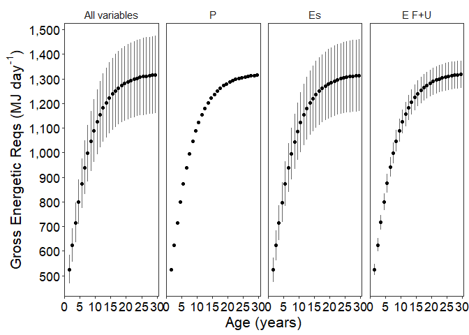

Gross Energetic Requirements(GER) Sensitivity Analysis - phase 2
================
Selina Agbayani
25 Jan 2022 - code updated 31 July, 2025

``` r
# Set path for output figures: 
Figurespath <- paste0(getwd(), "/gross_energetic_reqs/figures", collapse = NULL)
Figurespath
```

    ## [1] "C:/Users/AgbayaniS/Documents/R/graywhale_energyreqs/gross_energetic_reqs/figures"

``` r
# Set path for input & output data  
datapath <- paste0(getwd(), "/data", collapse = NULL) 
datapath
```

    ## [1] "C:/Users/AgbayaniS/Documents/R/graywhale_energyreqs/data"

``` r
## Read data in Activity Cost Reference, Production Cost, Es
A_cost_reference <- as_tibble(
  read_csv("data/ActivityCost_ReferenceData_BreathsPerDay_Table_VA_2017_original_sources.csv"),
  col_types = (list(cols(  ID = col_double(),
                           Lifestage = col_character(),
                           Description = col_character(),
                           Activity_stages = col_character(),
                           no_days = col_double(),
                           source_no_days = col_character(),
                           bpm = col_double(),
                           se_bpm = col_double(),
                           source_bpm = col_character(),
                           age_yrs = col_double(),
                           age_yrs_min = col_double(),
                           age_yrs_max = col_double(),
                           pct_O2 = col_double(),
                           pct_O2_sd = col_double()
  )
  )
  )
)
```

    ## Rows: 60 Columns: 14
    ## ── Column specification ────────────────────────────────────────────────────────
    ## Delimiter: ","
    ## chr (5): Lifestage, Description, Activity_stages, source_no_days, source_bpm
    ## dbl (9): ID, no_days, bpm, se_bpm, age_yrs, age_yrs_min, age_yrs_max, pct_O2...
    ## 
    ## ℹ Use `spec()` to retrieve the full column specification for this data.
    ## ℹ Specify the column types or set `show_col_types = FALSE` to quiet this message.

``` r
kable(A_cost_reference)
```

| ID | Lifestage | Description | Activity_stages | no_days | source_no_days | bpm | se_bpm | source_bpm | age_yrs | age_yrs_min | age_yrs_max | pct_O2 | pct_O2_sd |
|---:|:---|:---|:---|---:|:---|---:|---:|:---|---:|---:|---:|---:|---:|
| 1 | Calf | Lagoon 0-1 mths (Jan) | calving grounds | 31 | Sumich (1986); Findley & Vidal (2002); Pike 1962 | 2.14 | 0.50 | Sumich (1986) as cited in Villegas-Amtmann et al. 2017 | 0.0849315 | 0.0000100 | 0.0849315 | 10.5 | 3.0 |
| 2 | Calf | Lagoon 2 mth (Feb) | calving grounds | 28 | Sumich (1986); Findley & Vidal (2002); Pike 1962 | 1.56 | 0.40 | Sumich (1986) as cited in Villegas-Amtmann et al. 2017 | 0.1616438 | 0.0849315 | 0.1616438 | 10.5 | 3.0 |
| 3 | Calf | Lagoon 3 mths (Mar) | calving grounds | 15 | Sumich (1986); Findley & Vidal (2002); Rice and Wolman 1971 | 1.39 | 0.30 | Sumich (1986) as cited in Villegas-Amtmann et al. 2017 | 0.2465753 | 0.1616438 | 0.2465753 | 10.5 | 3.0 |
| 4 | Calf | Northbound 3 mths (Mar) | northbound | 16 | Rodriguez de la Gala Hernandez 2008; Perryman et al. 2010; Poole 1984; Rice and Wolman 1971; Leatherwood 1974 | 0.70 | 0.10 | Rodriguez de la Gala-Hernandez et al. (2008) | 0.2465753 | 0.1616438 | 0.2465753 | 10.5 | 3.0 |
| 5 | Calf | Northbound 4 mths (Apr) | northbound | 30 | Poole (1984); Rodriguez de la Gala Hernandez et al. 2008; Perryman et al. 2010; Leatherwood 1974 | 0.70 | 0.10 | Rodriguez de la Gala-Hernandez et al. (2008) | 0.3287671 | 0.2465753 | 0.3287671 | 10.5 | 3.0 |
| 6 | Calf | Northbound 5 mths (May) | northbound | 31 | Braham (1984), Poole (1984); Rodriguez de la Gala Hernandez et al. 2008; Perryman et al. 2010; Rice and Wolman 1971; Leatherwood 1974 | 0.70 | 0.10 | Rodriguez de la Gala-Hernandez et al. (2008) | 0.4136986 | 0.3287671 | 0.4136986 | 10.5 | 3.0 |
| 7 | Calf | Northbound 6 mths (June) | northbound | 23 | Hessing (1981) as cited in Braham (1984); | 0.70 | 0.10 | Rodriguez de la Gala-Hernandez et al. (2008) | 0.4958904 | 0.4136986 | 0.4958904 | 11.0 | 2.7 |
| 8 | Calf | Nursing at Foraging grounds 6 mths (June) | nursing at foraging grounds | 7 | Synchenko (2011); Bradford et al. 2012 | 1.22 | 0.30 | Sychenko (2011) | 0.4958904 | 0.4136986 | 0.4958904 | 11.0 | 2.7 |
| 9 | Calf | Nursing at Foraging grounds 7 mths (July) | nursing at foraging grounds | 31 | Mom/calf observations: Sychenko (2011), Bradford et al 2012; Weller et al. 2003 | 1.22 | 0.30 | Sychenko (2011) | 0.5808219 | 0.4958904 | 0.5808219 | 11.0 | 2.7 |
| 10 | Calf | Nursing at foraging grounds 8 mths (Aug) | nursing at foraging grounds | 31 | Mom/calf observations: Sychenko (2011), Bradford et al 2012; Weller et al. 2003 | 1.22 | 0.30 | Sychenko (2011) | 0.6657534 | 0.5808219 | 0.6657534 | 11.0 | 2.7 |
| 11 | Calf | Nursing at foraging grounds (Sep) | nursing at foraging grounds | 30 | Mom/calf observations: Sychenko (2011), Bradford et al 2012; Weller et al. 2003 | 1.22 | 0.30 | Sychenko (2011) | 0.7479452 | 0.6657534 | 0.7479452 | 11.0 | 2.7 |
| 12 | Calf | nursing at foraging grounds (Oct) | nursing at foraging grounds | 20 | for approx date of weaning (~9.6 mths): Agbayani et al. 2020, Weller et al. 2009 | 1.22 | 0.30 | Sychenko (2011) | 0.8328767 | 0.7479452 | 0.8328767 | 11.0 | 2.7 |
| 13 | Calf | Southbound post-weaning (Oct) | southbound post-weaning | 11 | Rugh et al. (2001), Braham (1984) | 0.72 | 0.20 | Sumich (1983); Schwarz (2002), as cited in Villegas-Amtmann 2017 | 0.8328767 | 0.7479452 | 0.9150685 | 11.0 | 2.7 |
| 14 | Calf | Southbound post-weaning (Nov) | southbound post-weaning | 30 | Sumich (1986), Rugh et al. (2001), | 0.72 | 0.20 | Sumich (1983); Schwarz (2002), as cited in Villegas-Amtmann 2017 | 0.9150685 | 0.8328767 | 1.0000000 | 11.0 | 2.7 |
| 15 | Calf | Southbound post-weaning (Dec) | southbound post-weaning | 31 | Sumich (1986), Rugh et al. (2001), Laake et al. (2012) | 0.72 | 0.20 | Sumich (1983); Schwarz (2002), as cited in Villegas-Amtmann 2017 | 1.0000000 | 0.9150685 | 1.0000000 | 11.0 | 2.7 |
| 16 | Pregnant | Southbound newly pregnant (Dec) | Southbound recently pregnant | 31 | Rice 1983; Rice and Wolman 1971 | 0.72 | 0.20 | Sumich (1983); Schwarz (2002), as cited in Villegas-Amtmann 2017 | NA | 8.0000000 | 75.0000000 | 11.0 | 2.7 |
| 17 | Pregnant | Lagoon breeding (Jan) | calving grounds recently pregnant | 31 | Rice 1983 | 0.62 | 0.20 | Harvey & Mate (1984), as cited in Villegas-Amtmann et al. 2017 | NA | 8.0000000 | 75.0000000 | 11.0 | 2.7 |
| 18 | Pregnant | Lagoon breeding (Feb) | calving grounds recently pregnant | 20 | Rice 1983 | 0.62 | 0.20 | Harvey & Mate (1984), as cited in Villegas-Amtmann et al. 2017 | NA | 8.0000000 | 75.0000000 | 11.0 | 2.7 |
| 19 | Pregnant | Northbound solo pregnant (Feb) | northbound pregnant | 8 | Rice 1983 | 0.50 | 0.20 | Rodriguez de la Gala-Hernandez et al. (2008) | NA | 8.0000000 | 75.0000000 | 11.0 | 2.7 |
| 20 | Pregnant | Northbound solo pregnant (Mar) | northbound pregnant | 31 | Rice 1983; Rice & Wolman (1971) | 0.50 | 0.20 | Rodriguez de la Gala-Hernandez et al. (2008) | NA | 8.0000000 | 75.0000000 | 11.0 | 2.7 |
| 21 | Pregnant | Northbound solo pregnant (Apr) | northbound pregnant | 30 | Rice 1983; Rice & Wolman (1971) | 0.50 | 0.20 | Rodriguez de la Gala-Hernandez et al. (2008) | NA | 8.0000000 | 75.0000000 | 11.0 | 2.7 |
| 22 | Pregnant | Northbound pregnant (May) | northbound pregnant | 31 | Rice 1983 | 0.50 | 0.20 | Rodriguez de la Gala-Hernandez et al. (2008) | NA | 8.0000000 | 75.0000000 | 11.0 | 2.7 |
| 23 | Pregnant | Foraging pregnant (june) | foraging pregnant | 30 | Rice 1983; Rice & Wolman (1971) | 1.34 | 0.10 | O. Sychenko (unpubl.) | NA | 8.0000000 | 75.0000000 | 11.0 | 2.7 |
| 24 | Pregnant | Foraging pregnant (july) | foraging pregnant | 31 | Rice 1983 | 1.34 | 0.10 | O. Sychenko (unpubl.) | NA | 8.0000000 | 75.0000000 | 11.0 | 2.7 |
| 25 | Pregnant | Foraging pregnant (Aug) | foraging pregnant | 31 | Rice 1983 | 1.34 | 0.10 | O. Sychenko (unpubl.) | NA | 8.0000000 | 75.0000000 | 11.0 | 2.7 |
| 26 | Pregnant | Foraging pregnant (Sep) | foraging pregnant | 30 | Rice 1983 | 1.34 | 0.10 | O. Sychenko (unpubl.) | NA | 8.0000000 | 75.0000000 | 11.0 | 2.7 |
| 27 | Pregnant | Foraging pregnant (Oct) | foraging pregnant | 31 | Rice 1983 | 1.34 | 0.10 | O. Sychenko (unpubl.) | NA | 8.0000000 | 75.0000000 | 11.0 | 2.7 |
| 28 | Pregnant | Southbound pregnant (Nov) | southbound pregnant | 30 | Rice 1983; Sumich (1986), | 0.72 | 0.20 | Sumich (1983) and Schwarz (2002) | NA | 8.0000000 | 75.0000000 | 11.0 | 2.7 |
| 29 | Pregnant | Southbound pregnant (Dec) | southbound pregnant | 31 | Rice 1983; Sumich (1986), | 0.72 | 0.20 | Sumich (1983) and Schwarz (2002) | NA | 8.0000000 | 75.0000000 | 11.0 | 2.7 |
| 30 | Lactating | Lagoon lactating (Jan) | calving grounds lactating | 31 | Rice 1983; Sumich (1986); Findley & Vidal (2002); Pike 1962 | 0.62 | 0.20 | Harvey & Mate (1984) | NA | 8.0000000 | 75.0000000 | 11.0 | 2.7 |
| 31 | Lactating | Lagoon lactating (Feb) | calving grounds lactating | 28 | Rice 1983; Sumich (1986); Findley & Vidal (2002); Rugh et al. 2001 | 0.62 | 0.20 | Harvey & Mate (1984) | NA | 8.0000000 | 75.0000000 | 11.0 | 2.7 |
| 32 | Lactating | Lagoon lactating (March) | calving grounds lactating | 15 | (coincides with NB calves) Sumich (1986); Findley & Vidal (2002); Rugh et al. 2001; Rodriguez de la Gala Hernandez 2008 | 0.62 | 0.20 | Harvey & Mate (1984) | NA | 8.0000000 | 75.0000000 | 11.0 | 2.7 |
| 33 | Lactating | Northbound with calf (March) | northbound lactating | 16 | Rodriguez de la Gala Hernandez 2008; Poole 1984; Perryman et al. 2010; Leatherwood (1974) | 0.50 | 0.10 | Rodriguez de la Gala-Hernandez et al. (2008) | NA | 8.0000000 | 75.0000000 | 11.0 | 2.7 |
| 34 | Lactating | Northbound with calf (April) | northbound lactating | 30 | Braham (1984), Poole (1984); Rodriguez de la Gala Hernandez et al. 2008; Perryman et al. 2010; Leatherwood 1974; Rice and Wolman (1971) | 0.50 | 0.10 | Rodriguez de la Gala-Hernandez et al. (2008) | NA | 8.0000000 | 75.0000000 | 11.0 | 2.7 |
| 35 | Lactating | Northbound with calf (May) | northbound lactating | 31 | Braham (1984), Poole (1984); Rodriguez de la Gala Hernandez et al. 2008; Perryman et al. 2010; Leatherwood 1974; | 0.50 | 0.10 | Rodriguez de la Gala-Hernandez et al. (2008) | NA | 8.0000000 | 75.0000000 | 11.0 | 2.7 |
| 36 | Lactating | Northbound with Calf (June) | northbound lactating | 23 | Hessing (1981) as cited in Braham (1984) | 0.50 | 0.10 | Rodriguez de la Gala-Hernandez et al. (2008) | NA | 8.0000000 | 75.0000000 | 11.0 | 2.7 |
| 37 | Lactating | Foraging lactating (June) | foraging lactating | 7 | Mom/calf observations: Synchenko (2011) | 1.04 | 0.20 | O. Sychenko (unpubl.) | NA | 8.0000000 | 75.0000000 | 11.0 | 2.7 |
| 38 | Lactating | Foraging lactating (July) | foraging lactating | 31 | Mom/calf observations: Sychenko (2011), Bradford et al 2012 | 1.04 | 0.20 | O. Sychenko (unpubl.) | NA | 8.0000000 | 75.0000000 | 11.0 | 2.7 |
| 39 | Lactating | Foraging lactating (Aug) | foraging lactating | 31 | Mom/calf observations: Sychenko (2011), Bradford et al 2012 | 1.04 | 0.20 | O. Sychenko (unpubl.) | NA | 8.0000000 | 75.0000000 | 11.0 | 2.7 |
| 40 | Lactating | Foraging lactating (Sep) | foraging lactating | 30 | Mom/calf observations: Sychenko (2011), Bradford et al 2012 | 1.04 | 0.20 | O. Sychenko (unpubl.) | NA | 8.0000000 | 75.0000000 | 11.0 | 2.7 |
| 41 | Lactating | Foraging lactating (Oct) | foraging lactating | 20 | for approx date of weaning (~9.6 mths): Agbayani et al. 2020, Weller et al. 2009 | 1.04 | 0.20 | O. Sychenko (unpubl.) | NA | 8.0000000 | 75.0000000 | 11.0 | 2.7 |
| 42 | Lactating | Southbound post-weaning (Oct) | southbound post-weaning | 11 | Braham (1984); Rugh et al. (2001); Rodriguez de la Gala-Hernandez (2008); Pike (1962) | 0.72 | 0.20 | Sumich (1983) and Schwarz (2002) | NA | 8.0000000 | 75.0000000 | 11.0 | 2.7 |
| 43 | Lactating | Southbound post-weaning (Nov) | southbound post-weaning | 30 | Rugh et al. 2001; Braham (1984); Rodriguez de la Gala-Hernandez (2008) | 0.72 | 0.20 | Sumich (1983) and Schwarz (2002) | NA | 8.0000000 | 75.0000000 | 11.0 | 2.7 |
| 44 | Lactating | Southbound postweaning (Dec) | southbound post-weaning | 31 | Rugh et al. 2001; Braham (1984); Rodriguez de la Gala-Hernandez (2008); Sumich 1986 | 0.72 | 0.20 | Sumich (1983) and Schwarz (2002) | NA | 8.0000000 | 75.0000000 | 11.0 | 2.7 |
| 45 | Juvenile/Adult | Southbound solo (Jan) | southbound | 15 | Rodriguez de la Gala-Hernandez (2008); Sumich 1986 | 0.72 | 0.20 | Sumich (1983) and Schwarz (2002) | NA | 1.0000000 | 75.0000000 | 11.0 | 2.7 |
| 46 | Juvenile/Adult | Lagoon solo (Jan) | calving grounds | 16 | Sumich (1986), Findley & Vidal (2002); Rice and Wolman 1971; Findley and Vidal 2002 | 0.62 | 0.20 | Harvey & Mate (1984), Sumich (1986) | NA | 1.0000000 | 75.0000000 | 11.0 | 2.7 |
| 47 | Juvenile/Adult | Lagoon solo (Feb) | calving grounds | 14 | Rice and Wolman (1971); Findley & Vidal (2002); Urban et al. 2021; Rugh et al. 2001 | 0.62 | 0.20 | Harvey & Mate (1984), Sumich (1986) | NA | 1.0000000 | 75.0000000 | 11.0 | 2.7 |
| 48 | Juvenile/Adult | Northbound solo (Feb) | northbound | 14 | Rice and Wolman (1971); Poole (1984), Pike (1962), Rodriguez de la Gala Hernandez et al. 2008; Sumich (1986) | 0.50 | 0.03 | Rodriguez de la Gala-Hernandez et al. (2008) | NA | 1.0000000 | 75.0000000 | 11.0 | 2.7 |
| 49 | Juvenile/Adult | Northbound solo (March) | northbound | 31 | Rice and Wolman (1971); Poole (1984), Pike (1962), Rodriguez de la Gala Hernandez et al. 2008; Braham (1984); Urban et al. 2021 (Maria started migrating March 9); Leatherwood 1974 | 0.50 | 0.03 | Rodriguez de la Gala-Hernandez et al. (2008) | NA | 1.0000000 | 75.0000000 | 11.0 | 2.7 |
| 50 | Juvenile/Adult | Northbound solo (April) | northbound | 30 | Rice and Wolman (1971) \*data ends in April; Poole (1984), Pike (1962), Rodriguez de la Gala Hernandez et al. 2008; Braham (1984); Urban et al. 2021 | 0.50 | 0.03 | Rodriguez de la Gala-Hernandez et al. (2008) | NA | 1.0000000 | 75.0000000 | 11.0 | 2.7 |
| 51 | Juvenile/Adult | Northbound solo (May) | northbound | 15 | Poole (1984), Pike (1962), Rodriguez de la Gala Hernandez et al. 2008; Braham (1984); Urban et al. 2021 (Maria stopped migrating May 24) | 0.50 | 0.03 | Rodriguez de la Gala-Hernandez et al. (2008) | NA | 1.0000000 | 75.0000000 | 11.0 | 2.7 |
| 52 | Juvenile/Adult | Foraging solo (May) | foraging | 16 | Kim and Oliver (1989); Heide-Jorgensen et al. (2012); 5 months (May to Oct); Urban et al. 2021 | 1.04 | 0.20 | O. Sychenko (unpubl.) | NA | 1.0000000 | 75.0000000 | 11.0 | 2.7 |
| 53 | Juvenile/Adult | Foraging solo (June) | foraging | 30 | Kim and Oliver (1989); Pike (1962); Heide-Jorgensen et al. (2012); Urban et al. 2021 | 1.04 | 0.20 | O. Sychenko (unpubl.) | NA | 1.0000000 | 75.0000000 | 11.0 | 2.7 |
| 54 | Juvenile/Adult | Foraging solo (July) | foraging | 31 | Kim and Oliver (1989); Pike (1962); Heide-Jorgensen et al. (2012); Urban et al. 2021; Bradford et al. 2012 | 1.04 | 0.20 | O. Sychenko (unpubl.) | NA | 1.0000000 | 75.0000000 | 11.0 | 2.7 |
| 55 | Juvenile/Adult | Foraging solo (Aug) | foraging | 31 | Pike (1962); Heide-Jorgensen et al. (2012); Bradford et al. 2012 | 1.04 | 0.20 | O. Sychenko (unpubl.) | NA | 1.0000000 | 75.0000000 | 11.0 | 2.7 |
| 56 | Juvenile/Adult | Foraging solo (Sep) | foraging | 30 | Pike (1962); Heide-Jorgensen et al. (2012); Bradford et al. 2012 | 1.04 | 0.20 | O. Sychenko (unpubl.) | NA | 1.0000000 | 75.0000000 | 11.0 | 2.7 |
| 57 | Juvenile/Adult | Foraging solo (Oct) | foraging | 16 | Kim and Oliver (1989); Pike (1962); Heide-Jorgensen et al. (2012); Bradford et al. 2012; Rugh et al. 2001 | 1.04 | 0.20 | O. Sychenko (unpubl.) | NA | 1.0000000 | 75.0000000 | 11.0 | 2.7 |
| 58 | Juvenile/Adult | Southbound (Oct) | southbound | 15 | Rugh et al. 2001; Braham (1984); Rodriguez de la Gala-Hernandez (2008); Pike (1962) | 0.72 | 0.20 | Sumich (1983); Schwarz (2002); Villegas-Amtmann 2017 | NA | 1.0000000 | 75.0000000 | 11.0 | 2.7 |
| 59 | Juvenile/Adult | Southbound (Nov) | southbound | 30 | Sumich (1986), Rugh et al. (2001), Braham 1984; | 0.72 | 0.20 | Sumich (1983); Schwarz (2002); Villegas-Amtmann 2017 | NA | 1.0000000 | 75.0000000 | 11.0 | 2.7 |
| 60 | Juvenile/Adult | Southbound (Dec) | southbound | 31 | Sumich (1986), Laake et al. (2012); Pike 1962; Rugh et al. (2001), Braham (1984); Leatherwood (1974) | 0.72 | 0.20 | Sumich (1983); Schwarz (2002); Villegas-Amtmann 2017 | NA | 1.0000000 | 75.0000000 | 11.0 | 2.7 |

``` r
Activity_days <- A_cost_reference %>% select(Lifestage, Activity_stages, no_days) %>%  
  group_by(Lifestage, Activity_stages) %>% 
  summarise(no_days = sum(no_days))
```

    ## `summarise()` has grouped output by 'Lifestage'. You can override using the
    ## `.groups` argument.

``` r
kable(Activity_days)
```

| Lifestage      | Activity_stages                   | no_days |
|:---------------|:----------------------------------|--------:|
| Calf           | calving grounds                   |      74 |
| Calf           | northbound                        |     100 |
| Calf           | nursing at foraging grounds       |     119 |
| Calf           | southbound post-weaning           |      72 |
| Juvenile/Adult | calving grounds                   |      30 |
| Juvenile/Adult | foraging                          |     154 |
| Juvenile/Adult | northbound                        |      90 |
| Juvenile/Adult | southbound                        |      91 |
| Lactating      | calving grounds lactating         |      74 |
| Lactating      | foraging lactating                |     119 |
| Lactating      | northbound lactating              |     100 |
| Lactating      | southbound post-weaning           |      72 |
| Pregnant       | Southbound recently pregnant      |      31 |
| Pregnant       | calving grounds recently pregnant |      51 |
| Pregnant       | foraging pregnant                 |     153 |
| Pregnant       | northbound pregnant               |     100 |
| Pregnant       | southbound pregnant               |      61 |

``` r
activity_stages <- Activity_days$Activity_stages


P_cost_table_peryear <- as_tibble(
  read_csv("data/P_cost_table_peryear.csv"), 
  col_types = (list(cols(age_yrs = col_double(),
                         mean_masschange = col_double(),
                         sd_masschange = col_double(),
                         sex = col_character(),
                         mean_P = col_double(),
                         sd_P = col_double(),
                         p_lipid = col_double(),
                         p_protein = col_double()
  )
  )
  )
)
```

    ## Rows: 228 Columns: 18
    ## ── Column specification ────────────────────────────────────────────────────────
    ## Delimiter: ","
    ## chr  (1): sex
    ## dbl (17): age_yrs, mean_masschange, sd_masschange, mean_P, sd_P, p_lipid, p_...
    ## 
    ## ℹ Use `spec()` to retrieve the full column specification for this data.
    ## ℹ Specify the column types or set `show_col_types = FALSE` to quiet this message.

``` r
kable(head(P_cost_table_peryear))
```

| age_yrs | mean_masschange | sd_masschange | sex | mean_P | sd_P | p_lipid | p_protein | mean_P_perday | sd_P_perday | mean_mass | sd_mass | mean_lwr | mean_upr | quant025 | quant975 | female_mass | male_mass |
|---:|---:|---:|:---|---:|---:|---:|---:|---:|---:|---:|---:|---:|---:|---:|---:|---:|---:|
| 0 | 986.5516 | 20.89449 | Female | 17057.91 | 767.1217 | 0.3599891 | 0.126000 | 46.73400 | 2.101703 | 983.0272 | 26.7677 | 769.3864 | 1256.003 | 931.5244 | 1036.295 | 1011.028 | 967.3705 |
| 1 | 5257.8958 | 136.87045 | Female | 87307.45 | 4264.4399 | 0.3599891 | 0.097200 | 239.19848 | 11.683397 | 6072.8559 | 202.1109 | 5535.5539 | 6662.311 | 5685.3490 | 6476.221 | 6245.837 | 5976.1335 |
| 2 | 1642.6730 | 31.11877 | Female | 27674.88 | 1242.4542 | 0.3599891 | 0.107388 | 75.82158 | 3.403984 | 7675.1795 | 162.2450 | 6967.9413 | 8454.206 | 7362.0875 | 7997.123 | 7893.802 | 7552.9369 |
| 3 | 1577.4600 | 11.13125 | Female | 26576.14 | 1096.3455 | 0.3599891 | 0.107388 | 72.81134 | 3.003686 | 9210.7914 | 147.9849 | 8289.2833 | 10234.752 | 8924.5190 | 9503.733 | 9473.155 | 9064.0911 |
| 4 | 1470.3573 | 6.62462 | Female | 24771.72 | 1012.7120 | 0.3599891 | 0.107388 | 67.86773 | 2.774553 | 10639.3400 | 156.4716 | 9483.1963 | 11936.449 | 10336.4523 | 10948.882 | 10942.395 | 10469.8872 |
| 5 | 1339.2771 | 14.69623 | Female | 22563.39 | 950.3335 | 0.3599891 | 0.107388 | 61.81750 | 2.603653 | 11939.1149 | 175.2988 | 10546.1836 | 13516.043 | 11599.7789 | 12285.898 | 12279.193 | 11748.9607 |

``` r
P_cost_table_peryear$Ts <- 365


Es_table_phase2_peryear <- as_tibble(
  read_csv("data/Es_sensAnalysis_phase2_peryear_source_bpm.csv"),
  col_types = (list(cols(age_yrs = col_double(),
                         Lifestage = col_character(),
                         no_days = col_double(),
                         Es = col_double(),
                         Es_sd = col_double()
  )
  )
  )
)
```

    ## Rows: 124 Columns: 8
    ## ── Column specification ────────────────────────────────────────────────────────
    ## Delimiter: ","
    ## chr (2): Lifestage, MC_variable
    ## dbl (6): age_yrs, no_days, Es, Es_sd, Es_perday, Es_sd_perday
    ## 
    ## ℹ Use `spec()` to retrieve the full column specification for this data.
    ## ℹ Specify the column types or set `show_col_types = FALSE` to quiet this message.

``` r
Es_table_phase2_peryear <- Es_table_phase2_peryear %>%  filter(age_yrs >=1)
kable(Es_table_phase2_peryear)
```

| age_yrs | Lifestage | no_days | MC_variable | Es | Es_sd | Es_perday | Es_sd_perday |
|---:|:---|---:|:---|---:|---:|---:|---:|
| 1 | Juvenile/Adult | 365 | all | 75333.84 | 12574.07880 | 206.3941 | 34.4495310 |
| 1 | Juvenile/Adult | 365 | Rs | 74892.31 | 94.37773 | 205.1844 | 0.2585691 |
| 1 | Juvenile/Adult | 365 | Vt | 74891.03 | 1157.52438 | 205.1809 | 3.1712997 |
| 1 | Juvenile/Adult | 365 | pctO2 | 74879.53 | 11422.18336 | 205.1494 | 31.2936530 |
| 2 | Juvenile/Adult | 365 | all | 126708.44 | 21536.94711 | 347.1464 | 59.0053345 |
| 2 | Juvenile/Adult | 365 | Rs | 125804.06 | 158.53564 | 344.6686 | 0.4343442 |
| 2 | Juvenile/Adult | 365 | Vt | 125801.44 | 2356.47589 | 344.6615 | 6.4560983 |
| 2 | Juvenile/Adult | 365 | pctO2 | 125782.58 | 19186.97536 | 344.6098 | 52.5670558 |
| 3 | Juvenile/Adult | 365 | all | 156519.51 | 25756.19667 | 428.8206 | 70.5649224 |
| 3 | Juvenile/Adult | 365 | Rs | 155756.21 | 196.28073 | 426.7293 | 0.5377554 |
| 3 | Juvenile/Adult | 365 | Vt | 155753.98 | 2015.40612 | 426.7232 | 5.5216606 |
| 3 | Juvenile/Adult | 365 | pctO2 | 155729.63 | 23755.12136 | 426.6565 | 65.0825243 |
| 4 | Juvenile/Adult | 365 | all | 185086.18 | 30103.25786 | 507.0854 | 82.4746791 |
| 4 | Juvenile/Adult | 365 | Rs | 184331.59 | 232.29083 | 505.0181 | 0.6364132 |
| 4 | Juvenile/Adult | 365 | Vt | 184329.38 | 2009.54555 | 505.0120 | 5.5056042 |
| 4 | Juvenile/Adult | 365 | pctO2 | 184300.13 | 28113.28900 | 504.9319 | 77.0227096 |
| 5 | Juvenile/Adult | 365 | all | 211673.03 | 34363.91767 | 579.9261 | 94.1477197 |
| 5 | Juvenile/Adult | 365 | Rs | 210836.67 | 265.69197 | 577.6347 | 0.7279232 |
| 5 | Juvenile/Adult | 365 | Vt | 210834.21 | 2231.10968 | 577.6280 | 6.1126293 |
| 5 | Juvenile/Adult | 365 | pctO2 | 210800.69 | 32155.70427 | 577.5361 | 88.0978199 |
| 6 | Juvenile/Adult | 365 | all | 235799.00 | 38281.58922 | 646.0246 | 104.8810663 |
| 6 | Juvenile/Adult | 365 | Rs | 234866.90 | 295.97437 | 643.4710 | 0.8108887 |
| 6 | Juvenile/Adult | 365 | Vt | 234864.16 | 2486.41770 | 643.4635 | 6.8121033 |
| 6 | Juvenile/Adult | 365 | pctO2 | 234826.82 | 35820.66969 | 643.3611 | 98.1388211 |
| 7 | Juvenile/Adult | 365 | all | 257283.23 | 41736.15531 | 704.8856 | 114.3456310 |
| 7 | Juvenile/Adult | 365 | Rs | 256280.18 | 322.95894 | 702.1375 | 0.8848190 |
| 7 | Juvenile/Adult | 365 | Vt | 256277.23 | 2677.73788 | 702.1294 | 7.3362682 |
| 7 | Juvenile/Adult | 365 | pctO2 | 256236.44 | 39086.51072 | 702.0177 | 107.0863307 |
| 8 | Juvenile/Adult | 365 | all | 276151.44 | 44701.13660 | 756.5793 | 122.4688674 |
| 8 | Juvenile/Adult | 365 | Rs | 275114.97 | 346.69415 | 753.7397 | 0.9498470 |
| 8 | Juvenile/Adult | 365 | Vt | 275111.92 | 2772.99699 | 753.7313 | 7.5972520 |
| 8 | Juvenile/Adult | 365 | pctO2 | 275068.02 | 41959.09431 | 753.6110 | 114.9564228 |
| 9 | Juvenile/Adult | 365 | all | 292529.83 | 47174.33990 | 801.4516 | 129.2447668 |
| 9 | Juvenile/Adult | 365 | Rs | 291506.48 | 367.35038 | 798.6479 | 1.0064394 |
| 9 | Juvenile/Adult | 365 | Vt | 291503.45 | 2749.67061 | 798.6396 | 7.5333441 |
| 9 | Juvenile/Adult | 365 | pctO2 | 291456.73 | 44459.04123 | 798.5116 | 121.8055924 |
| 10 | Juvenile/Adult | 365 | all | 306686.35 | 49289.42935 | 840.2366 | 135.0395325 |
| 10 | Juvenile/Adult | 365 | Rs | 305683.84 | 385.21639 | 837.4900 | 1.0553874 |
| 10 | Juvenile/Adult | 365 | Vt | 305680.86 | 2705.79546 | 837.4818 | 7.4131383 |
| 10 | Juvenile/Adult | 365 | pctO2 | 305631.67 | 46621.29744 | 837.3470 | 127.7295820 |
| 11 | Juvenile/Adult | 365 | all | 318806.33 | 51026.00367 | 873.4420 | 139.7972703 |
| 11 | Juvenile/Adult | 365 | Rs | 317852.84 | 400.55151 | 870.8297 | 1.0974014 |
| 11 | Juvenile/Adult | 365 | Vt | 317849.99 | 2590.20137 | 870.8219 | 7.0964421 |
| 11 | Juvenile/Adult | 365 | pctO2 | 317798.59 | 48477.24940 | 870.6811 | 132.8143819 |
| 12 | Juvenile/Adult | 365 | all | 329169.80 | 52499.26903 | 901.8351 | 143.8336138 |
| 12 | Juvenile/Adult | 365 | Rs | 328263.13 | 413.67034 | 899.3510 | 1.1333434 |
| 12 | Juvenile/Adult | 365 | Vt | 328260.41 | 2479.39789 | 899.3436 | 6.7928709 |
| 12 | Juvenile/Adult | 365 | pctO2 | 328207.10 | 50064.97264 | 899.1975 | 137.1643086 |
| 13 | Juvenile/Adult | 365 | all | 337990.36 | 53733.95350 | 926.0010 | 147.2163110 |
| 13 | Juvenile/Adult | 365 | Rs | 337131.64 | 424.84626 | 923.6483 | 1.1639624 |
| 13 | Juvenile/Adult | 365 | Vt | 337129.06 | 2365.17037 | 923.6413 | 6.4799188 |
| 13 | Juvenile/Adult | 365 | pctO2 | 337074.11 | 51417.55208 | 923.4907 | 140.8700057 |
| 14 | Juvenile/Adult | 365 | all | 345492.93 | 54798.79492 | 946.5560 | 150.1336847 |
| 14 | Juvenile/Adult | 365 | Rs | 344668.88 | 434.34453 | 944.2983 | 1.1899850 |
| 14 | Juvenile/Adult | 365 | Vt | 344666.39 | 2283.63015 | 944.2915 | 6.2565210 |
| 14 | Juvenile/Adult | 365 | pctO2 | 344610.05 | 52567.09180 | 944.1371 | 144.0194296 |
| 15 | Juvenile/Adult | 365 | all | 351859.30 | 55711.99797 | 963.9981 | 152.6356109 |
| 15 | Juvenile/Adult | 365 | Rs | 351060.62 | 442.39927 | 961.8099 | 1.2120528 |
| 15 | Juvenile/Adult | 365 | Vt | 351058.20 | 2224.68955 | 961.8033 | 6.0950399 |
| 15 | Juvenile/Adult | 365 | pctO2 | 351000.71 | 53541.92709 | 961.6458 | 146.6902112 |
| 16 | Juvenile/Adult | 365 | all | 357273.20 | 56526.26161 | 978.8307 | 154.8664702 |
| 16 | Juvenile/Adult | 365 | Rs | 356480.28 | 449.22901 | 976.6583 | 1.2307644 |
| 16 | Juvenile/Adult | 365 | Vt | 356477.88 | 2214.03961 | 976.6517 | 6.0658619 |
| 16 | Juvenile/Adult | 365 | pctO2 | 356419.44 | 54368.50518 | 976.4916 | 148.9548087 |
| 17 | Juvenile/Adult | 365 | all | 361857.38 | 57236.44178 | 991.3901 | 156.8121693 |
| 17 | Juvenile/Adult | 365 | Rs | 361060.64 | 455.00109 | 989.2072 | 1.2465783 |
| 17 | Juvenile/Adult | 365 | Vt | 361058.22 | 2226.66759 | 989.2006 | 6.1004591 |
| 17 | Juvenile/Adult | 365 | pctO2 | 360999.02 | 55067.07767 | 989.0384 | 150.8687060 |
| 18 | Juvenile/Adult | 365 | all | 365744.10 | 57867.59978 | 1002.0386 | 158.5413693 |
| 18 | Juvenile/Adult | 365 | Rs | 364931.92 | 459.87959 | 999.8135 | 1.2599441 |
| 18 | Juvenile/Adult | 365 | Vt | 364929.46 | 2267.69086 | 999.8067 | 6.2128517 |
| 18 | Juvenile/Adult | 365 | pctO2 | 364869.64 | 55657.50488 | 999.6428 | 152.4863148 |
| 19 | Juvenile/Adult | 365 | all | 369051.16 | 58445.95895 | 1011.0991 | 160.1259149 |
| 19 | Juvenile/Adult | 365 | Rs | 368208.48 | 464.00864 | 1008.7904 | 1.2712566 |
| 19 | Juvenile/Adult | 365 | Vt | 368205.93 | 2345.79585 | 1008.7834 | 6.4268379 |
| 19 | Juvenile/Adult | 365 | pctO2 | 368145.64 | 56157.22856 | 1008.6182 | 153.8554207 |
| 20 | Juvenile/Adult | 365 | all | 371840.28 | 58945.96120 | 1018.7405 | 161.4957841 |
| 20 | Juvenile/Adult | 365 | Rs | 370966.74 | 467.48455 | 1016.3472 | 1.2807796 |
| 20 | Juvenile/Adult | 365 | Vt | 370964.10 | 2424.49768 | 1016.3400 | 6.6424594 |
| 20 | Juvenile/Adult | 365 | pctO2 | 370903.43 | 56577.90420 | 1016.1738 | 155.0079567 |
| 21 | Juvenile/Adult | 365 | all | 374202.74 | 59392.51313 | 1025.2130 | 162.7192141 |
| 21 | Juvenile/Adult | 365 | Rs | 373293.39 | 470.41654 | 1022.7216 | 1.2888124 |
| 21 | Juvenile/Adult | 365 | Vt | 373290.65 | 2515.32678 | 1022.7141 | 6.8913062 |
| 21 | Juvenile/Adult | 365 | pctO2 | 373229.68 | 56932.75223 | 1022.5471 | 155.9801431 |
| 22 | Juvenile/Adult | 365 | all | 376196.64 | 59781.05700 | 1030.6757 | 163.7837178 |
| 22 | Juvenile/Adult | 365 | Rs | 375252.17 | 472.88496 | 1028.0881 | 1.2955752 |
| 22 | Juvenile/Adult | 365 | Vt | 375249.33 | 2604.26101 | 1028.0804 | 7.1349617 |
| 22 | Juvenile/Adult | 365 | pctO2 | 375188.13 | 57231.49560 | 1027.9127 | 156.7986181 |
| 23 | Juvenile/Adult | 365 | all | 377885.29 | 60128.70285 | 1035.3022 | 164.7361722 |
| 23 | Juvenile/Adult | 365 | Rs | 376903.29 | 474.96566 | 1032.6117 | 1.3012758 |
| 23 | Juvenile/Adult | 365 | Vt | 376900.34 | 2699.12854 | 1032.6037 | 7.3948727 |
| 23 | Juvenile/Adult | 365 | pctO2 | 376838.96 | 57483.31466 | 1032.4355 | 157.4885333 |
| 24 | Juvenile/Adult | 365 | all | 379308.45 | 60430.07887 | 1039.2012 | 165.5618599 |
| 24 | Juvenile/Adult | 365 | Rs | 378291.30 | 476.71480 | 1036.4145 | 1.3060679 |
| 24 | Juvenile/Adult | 365 | Vt | 378288.25 | 2787.94049 | 1036.4062 | 7.6381931 |
| 24 | Juvenile/Adult | 365 | pctO2 | 378226.73 | 57695.00685 | 1036.2376 | 158.0685119 |
| 25 | Juvenile/Adult | 365 | all | 380501.66 | 60683.15595 | 1042.4703 | 166.2552218 |
| 25 | Juvenile/Adult | 365 | Rs | 379454.87 | 478.18111 | 1039.6024 | 1.3100852 |
| 25 | Juvenile/Adult | 365 | Vt | 379451.73 | 2862.86235 | 1039.5938 | 7.8434585 |
| 25 | Juvenile/Adult | 365 | pctO2 | 379390.11 | 57872.46876 | 1039.4250 | 158.5547089 |
| 26 | Juvenile/Adult | 365 | all | 381520.06 | 60917.73791 | 1045.2604 | 166.8979121 |
| 26 | Juvenile/Adult | 365 | Rs | 380440.18 | 479.42277 | 1042.3019 | 1.3134870 |
| 26 | Juvenile/Adult | 365 | Vt | 380436.95 | 2946.36950 | 1042.2930 | 8.0722452 |
| 26 | Juvenile/Adult | 365 | pctO2 | 380375.25 | 58022.74241 | 1042.1240 | 158.9664176 |
| 27 | Juvenile/Adult | 365 | all | 382369.55 | 61111.47559 | 1047.5878 | 167.4287002 |
| 27 | Juvenile/Adult | 365 | Rs | 381262.88 | 480.45952 | 1044.5558 | 1.3163275 |
| 27 | Juvenile/Adult | 365 | Vt | 381259.57 | 3014.02113 | 1044.5468 | 8.2575921 |
| 27 | Juvenile/Adult | 365 | pctO2 | 381197.81 | 58148.21684 | 1044.3776 | 159.3101831 |
| 28 | Juvenile/Adult | 365 | all | 383087.68 | 61281.69916 | 1049.5553 | 167.8950662 |
| 28 | Juvenile/Adult | 365 | Rs | 381955.66 | 481.33256 | 1046.4539 | 1.3187193 |
| 28 | Juvenile/Adult | 365 | Vt | 381952.29 | 3078.01114 | 1046.4446 | 8.4329072 |
| 28 | Juvenile/Adult | 365 | pctO2 | 381890.48 | 58253.87684 | 1046.2753 | 159.5996626 |
| 29 | Juvenile/Adult | 365 | all | 383692.56 | 61428.04781 | 1051.2125 | 168.2960214 |
| 29 | Juvenile/Adult | 365 | Rs | 382537.95 | 482.06634 | 1048.0492 | 1.3207297 |
| 29 | Juvenile/Adult | 365 | Vt | 382534.51 | 3135.05240 | 1048.0397 | 8.5891847 |
| 29 | Juvenile/Adult | 365 | pctO2 | 382472.66 | 58342.68376 | 1047.8703 | 159.8429692 |
| 30 | Juvenile/Adult | 365 | all | 384196.74 | 61548.24372 | 1052.5938 | 168.6253253 |
| 30 | Juvenile/Adult | 365 | Rs | 383024.06 | 482.67893 | 1049.3810 | 1.3224080 |
| 30 | Juvenile/Adult | 365 | Vt | 383020.57 | 3180.72474 | 1049.3714 | 8.7143144 |
| 30 | Juvenile/Adult | 365 | pctO2 | 382958.69 | 58416.82281 | 1049.2019 | 160.0460899 |
| 31 | Juvenile/Adult | 365 | all | 384630.24 | 61662.60615 | 1053.7815 | 168.9386470 |
| 31 | Juvenile/Adult | 365 | Rs | 383437.39 | 483.19980 | 1050.5134 | 1.3238351 |
| 31 | Juvenile/Adult | 365 | Vt | 383433.84 | 3231.60364 | 1050.5037 | 8.8537086 |
| 31 | Juvenile/Adult | 365 | pctO2 | 383371.95 | 58479.86207 | 1050.3341 | 160.2188002 |

``` r
mass_table <- as_tibble(
  read_csv("data/mass_table.csv"), 
  col_types = (list(cols(age_yrs = col_double(),
                         mean_mass = col_double(),
                         sd_mass = col_double(),
                         mean_lwr = col_double(),
                         mean_upr = col_double(),
                         quant025 = col_double(),
                         quant975 = col_double(),
                         female_mass = col_double(),
                         male_mass = col_double()
  )
  )
  )
)
```

    ## Rows: 173 Columns: 9
    ## ── Column specification ────────────────────────────────────────────────────────
    ## Delimiter: ","
    ## dbl (9): age_yrs, mean_mass, sd_mass, mean_lwr, mean_upr, quant025, quant975...
    ## 
    ## ℹ Use `spec()` to retrieve the full column specification for this data.
    ## ℹ Specify the column types or set `show_col_types = FALSE` to quiet this message.

``` r
mean_masschange_peryear <- as_tibble(
  read_csv("data/mean_masschange_per_year.csv"),
  col_types = (list(cols(age_yrs = col_double(),
                         mean_masschange = col_double(),
                         sd_masschange = col_double(),
                         sex = col_character()
  )
  )
  )
)
```

    ## Rows: 228 Columns: 4
    ## ── Column specification ────────────────────────────────────────────────────────
    ## Delimiter: ","
    ## chr (1): sex
    ## dbl (3): age_yrs, mean_masschange, sd_masschange
    ## 
    ## ℹ Use `spec()` to retrieve the full column specification for this data.
    ## ℹ Specify the column types or set `show_col_types = FALSE` to quiet this message.

``` r
mean_masschange_peryear <- mean_masschange_peryear %>% dplyr::filter(age_yrs >= 0)
kable(head(mean_masschange_peryear))
```

| age_yrs | mean_masschange | sd_masschange | sex |
|--------:|----------------:|--------------:|:----|
|       0 |        982.8522 |     27.098452 | N/A |
|       1 |       5088.6824 |    177.509836 | N/A |
|       2 |       1602.5843 |     40.358507 | N/A |
|       3 |       1535.7051 |     14.436330 | N/A |
|       4 |       1428.4931 |      8.591593 | N/A |
|       5 |       1299.6519 |     19.059815 | N/A |

``` r
age_yr_tibble <- as_tibble(
  read_csv("data/age_yr_tibble.csv"), 
  col_types = (list(ID = col_integer(),
                    month = col_character(),
                    no_days_in_mth = col_double(),
                    age_mth = col_double(),
                    no_days_cumul = col_double(),
                    age_yrs = col_double()
  )
  )
)
```

    ## Rows: 25 Columns: 5
    ## ── Column specification ────────────────────────────────────────────────────────
    ## Delimiter: ","
    ## chr (1): month
    ## dbl (4): no_days_in_mth, age_mth, no_days_cumul, age_yrs
    ## 
    ## ℹ Use `spec()` to retrieve the full column specification for this data.
    ## ℹ Specify the column types or set `show_col_types = FALSE` to quiet this message.

``` r
kable(age_yr_tibble)
```

| month | no_days_in_mth | age_mth | no_days_cumul |   age_yrs |
|:------|---------------:|--------:|--------------:|----------:|
| Jan   |            0.0 |     0.0 |           0.0 | 0.0000000 |
| Jan   |           15.5 |     0.5 |          15.5 | 0.0424658 |
| Jan   |           15.5 |     1.0 |          31.0 | 0.0849315 |
| Feb   |           14.0 |     1.5 |          45.0 | 0.1232877 |
| Feb   |           14.0 |     2.0 |          59.0 | 0.1616438 |
| Mar   |           15.5 |     2.5 |          74.5 | 0.2041096 |
| Mar   |           15.5 |     3.0 |          90.0 | 0.2465753 |
| Apr   |           15.0 |     3.5 |         105.0 | 0.2876712 |
| Apr   |           15.0 |     4.0 |         120.0 | 0.3287671 |
| May   |           15.5 |     4.5 |         135.5 | 0.3712329 |
| May   |           15.5 |     5.0 |         151.0 | 0.4136986 |
| Jun   |           15.0 |     5.5 |         166.0 | 0.4547945 |
| Jun   |           15.0 |     6.0 |         181.0 | 0.4958904 |
| Jul   |           15.5 |     6.5 |         196.5 | 0.5383562 |
| Jul   |           15.5 |     7.0 |         212.0 | 0.5808219 |
| Aug   |           15.5 |     7.5 |         227.5 | 0.6232877 |
| Aug   |           15.5 |     8.0 |         243.0 | 0.6657534 |
| Sep   |           15.0 |     8.5 |         258.0 | 0.7068493 |
| Sep   |           15.0 |     9.0 |         273.0 | 0.7479452 |
| Oct   |           15.5 |     9.5 |         288.5 | 0.7904110 |
| Oct   |           15.5 |    10.0 |         304.0 | 0.8328767 |
| Nov   |           15.0 |    10.5 |         319.0 | 0.8739726 |
| Nov   |           15.0 |    11.0 |         334.0 | 0.9150685 |
| Dec   |           15.5 |    11.5 |         349.5 | 0.9575342 |
| Dec   |           15.5 |    12.0 |         365.0 | 1.0000000 |

``` r
predict_GER_table_sensAnalysis_phase1_permth <- as_tibble(
  read_csv("data/predict_GER_table_sensAnalysis_phase1_permth_source_bpm.csv"),
  col_types = list(
    phase = col_double(),
    age_yrs = col_double(),
    sex = col_character(),
    MC_variable = col_character(),
    mean_GER = col_double(),
    GER_sd = col_double(),
    quant025 = col_double(),
    quant975 = col_double(),
    GER_foraging = col_double(),
    sd_foraging = col_double(),
    quant025_foraging = col_double(),
    quant975_foraging = col_double(),
    FR_foraging = col_double(),
    FR_sd_foraging = col_double(),
    FR_quant025 = col_double(),
    FR_quant975 = col_double(),
    Ts = col_double(),
    age_mth = col_double()
  )
)
```

    ## Rows: 48 Columns: 23
    ## ── Column specification ────────────────────────────────────────────────────────
    ## Delimiter: ","
    ## chr  (3): sex, MC_variable, pct_unit
    ## dbl (20): phase, age_yrs, mean_GER, GER_sd, quant025, quant975, GER_foraging...
    ## 
    ## ℹ Use `spec()` to retrieve the full column specification for this data.
    ## ℹ Specify the column types or set `show_col_types = FALSE` to quiet this message.

``` r
kable(predict_GER_table_sensAnalysis_phase1_permth)
```

| phase | age_yrs | sex | MC_variable | mean_GER | GER_sd | quant025 | quant975 | GER_foraging | sd_foraging | quant025_foraging | quant975_foraging | FR_foraging | FR_sd_foraging | FR_quant025 | FR_quant975 | Ts | mass | mass_sd | pctbodywt | pctbodywt_sd | pct_unit | age_mth |
|---:|---:|:---|:---|---:|---:|---:|---:|---:|---:|---:|---:|---:|---:|---:|---:|---:|---:|---:|---:|---:|:---|---:|
| 1 | 0.0849315 | N/A | all | 539.1144 | 55.339326 | 420.2832 | 658.0140 | 539.1144 | 55.339326 | 420.2832 | 658.0140 | 24.14306 | 2.4782502 | 18.82146 | 29.46771 | 31 | 1498.233 | 37.13787 | 0.0160919 | 0.0013638 | L milk/kg body weight | 1 |
| 1 | 0.1616438 | N/A | all | 572.0843 | 59.909660 | 443.5843 | 700.4533 | 572.0843 | 59.909660 | 443.5843 | 700.4533 | 25.61954 | 2.6829225 | 19.86495 | 31.36826 | 28 | 2003.780 | 53.21070 | 0.0127661 | 0.0010886 | L milk/kg body weight | 2 |
| 1 | 0.2465753 | N/A | all | 559.9928 | 47.910103 | 461.3120 | 657.8958 | 559.9928 | 47.910103 | 461.3120 | 657.8958 | 25.07805 | 2.1455487 | 20.65884 | 29.46242 | 31 | 2580.454 | 70.54024 | 0.0097077 | 0.0006431 | L milk/kg body weight | 3 |
| 1 | 0.3287671 | N/A | all | 530.9422 | 49.659608 | 427.0855 | 634.5250 | 530.9422 | 49.659608 | 427.0855 | 634.5250 | 23.77708 | 2.2238965 | 19.12608 | 28.41581 | 30 | 3134.278 | 82.71465 | 0.0075765 | 0.0005639 | L milk/kg body weight | 4 |
| 1 | 0.4136986 | N/A | all | 545.7917 | 53.940713 | 431.0345 | 660.5196 | 545.7917 | 53.940713 | 431.0345 | 660.5196 | 24.44208 | 2.4156164 | 19.30293 | 29.57992 | 31 | 3685.805 | 90.87147 | 0.0066227 | 0.0005372 | L milk/kg body weight | 5 |
| 1 | 0.4958904 | N/A | all | 599.2263 | 51.145994 | 491.9208 | 706.0601 | 599.2263 | 51.145994 | 491.9208 | 706.0601 | 26.83503 | 2.2904610 | 22.02959 | 31.61935 | 30 | 4188.934 | 92.44531 | 0.0064001 | 0.0004495 | L milk/kg body weight | 6 |
| 1 | 0.5808219 | N/A | all | 743.2416 | 89.831725 | 545.1044 | 942.2476 | 743.2416 | 89.831725 | 545.1044 | 942.2476 | 33.28444 | 4.0229165 | 24.41130 | 42.19649 | 31 | 4670.710 | 91.40099 | 0.0071161 | 0.0007616 | L milk/kg body weight | 7 |
| 1 | 0.6657534 | N/A | all | 762.1476 | 96.418138 | 547.6014 | 977.2490 | 762.1476 | 96.418138 | 547.6014 | 977.2490 | 34.13111 | 4.3178745 | 24.52313 | 43.76395 | 31 | 5110.500 | 90.41413 | 0.0066694 | 0.0007609 | L milk/kg body weight | 8 |
| 1 | 0.7479452 | N/A | all | 777.3761 | 102.654275 | 548.0715 | 1006.8466 | 777.3761 | 102.654275 | 548.0715 | 1006.8466 | 34.81308 | 4.5971462 | 24.54418 | 45.08941 | 30 | 5495.401 | 93.43444 | 0.0063261 | 0.0007603 | L milk/kg body weight | 9 |
| 1 | 0.8328767 | N/A | all | 683.4969 | 122.857429 | 424.3853 | 938.5645 | 683.4969 | 122.857429 | 424.3853 | 938.5645 | 30.60891 | 5.5019001 | 19.00516 | 42.03155 | 31 | 5802.591 | 211.60921 | 0.0052506 | 0.0007825 | L milk/kg body weight | 10 |
| 1 | 0.9150685 | N/A | all | 424.2245 | 64.475221 | 278.9858 | 568.0946 | 424.2245 | 64.475221 | 278.9858 | 568.0946 | 146.07711 | 20.7348604 | 98.53440 | 191.85491 | 30 | 5935.437 | 207.11639 | 2.4553417 | 0.2963617 | % of body weight | 11 |
| 1 | 1.0000000 | N/A | all | 432.8956 | 66.271984 | 283.6434 | 580.6366 | 432.8956 | 66.271984 | 283.6434 | 580.6366 | 149.05999 | 21.3156175 | 100.13218 | 196.05220 | 31 | 6072.716 | 202.08059 | 2.4488629 | 0.2997896 | % of body weight | 12 |
| 1 | 0.0849315 | N/A | P_cost | 538.5083 | 15.329986 | 508.0305 | 568.6168 | 538.5083 | 15.329986 | 508.0305 | 568.6168 | 24.11591 | 0.6865197 | 22.75103 | 25.46425 | 31 | 1498.258 | 0.00000 | 0.0160960 | 0.0004582 | L milk/kg body weight | 1 |
| 1 | 0.1616438 | N/A | P_cost | 571.4370 | 18.138676 | 535.3750 | 607.0620 | 571.4370 | 18.138676 | 535.3750 | 607.0620 | 25.59055 | 0.8123008 | 23.97559 | 27.18594 | 28 | 2003.817 | 0.00000 | 0.0127709 | 0.0004054 | L milk/kg body weight | 2 |
| 1 | 0.2465753 | N/A | P_cost | 559.2492 | 18.418734 | 522.6300 | 595.4242 | 559.2492 | 18.418734 | 522.6300 | 595.4242 | 25.04475 | 0.8248426 | 23.40484 | 26.66476 | 31 | 2580.502 | 0.00000 | 0.0097054 | 0.0003196 | L milk/kg body weight | 3 |
| 1 | 0.3287671 | N/A | P_cost | 530.2801 | 17.192665 | 496.0983 | 564.0464 | 530.2801 | 17.192665 | 496.0983 | 564.0464 | 23.74743 | 0.7699357 | 22.21667 | 25.25958 | 30 | 3134.335 | 0.00000 | 0.0075765 | 0.0002456 | L milk/kg body weight | 4 |
| 1 | 0.4136986 | N/A | P_cost | 545.1589 | 15.867615 | 513.6125 | 576.3238 | 545.1589 | 15.867615 | 513.6125 | 576.3238 | 24.41375 | 0.7105963 | 23.00101 | 25.80940 | 31 | 3685.868 | 0.00000 | 0.0066236 | 0.0001928 | L milk/kg body weight | 5 |
| 1 | 0.4958904 | N/A | P_cost | 598.4718 | 14.394875 | 569.8541 | 626.7441 | 598.4718 | 14.394875 | 569.8541 | 626.7441 | 26.80124 | 0.6446429 | 25.51966 | 28.06736 | 30 | 4188.998 | 0.00000 | 0.0063980 | 0.0001539 | L milk/kg body weight | 6 |
| 1 | 0.5808219 | N/A | P_cost | 742.5859 | 13.317338 | 716.1013 | 768.7406 | 742.5859 | 13.317338 | 716.1013 | 768.7406 | 33.25508 | 0.5963877 | 32.06902 | 34.42636 | 31 | 4670.773 | 0.00000 | 0.0071198 | 0.0001277 | L milk/kg body weight | 7 |
| 1 | 0.6657534 | N/A | P_cost | 761.5365 | 12.157986 | 737.3575 | 785.4147 | 761.5365 | 12.157986 | 737.3575 | 785.4147 | 34.10374 | 0.5444687 | 33.02094 | 35.17307 | 31 | 5110.562 | 0.00000 | 0.0066732 | 0.0001065 | L milk/kg body weight | 8 |
| 1 | 0.7479452 | N/A | P_cost | 776.8030 | 11.129518 | 754.6768 | 798.6459 | 776.8030 | 11.129518 | 754.6768 | 798.6459 | 34.78742 | 0.4984110 | 33.79654 | 35.76560 | 30 | 5495.466 | 0.00000 | 0.0063302 | 0.0000907 | L milk/kg body weight | 9 |
| 1 | 0.8328767 | N/A | P_cost | 682.8575 | 63.274358 | 557.0607 | 807.1111 | 682.8575 | 63.274358 | 557.0607 | 807.1111 | 30.58027 | 2.8336031 | 24.94674 | 36.14470 | 31 | 5802.737 | 0.00000 | 0.0052700 | 0.0004883 | L milk/kg body weight | 10 |
| 1 | 0.9150685 | N/A | P_cost | 423.9679 | 4.515837 | 414.9840 | 432.8294 | 423.9679 | 4.515837 | 414.9840 | 432.8294 | 146.19583 | 1.5571850 | 143.09793 | 149.25151 | 30 | 5935.580 | 0.00000 | 2.4630421 | 0.0262348 | % of body weight | 11 |
| 1 | 1.0000000 | N/A | P_cost | 432.6314 | 4.632322 | 423.4184 | 441.7208 | 432.6314 | 4.632322 | 423.4184 | 441.7208 | 149.18323 | 1.5973524 | 146.00634 | 152.31753 | 31 | 6072.856 | 0.00000 | 2.4565581 | 0.0263032 | % of body weight | 12 |
| 1 | 0.0849315 | N/A | Es | 538.1959 | 37.580563 | 449.6027 | 625.0932 | 538.1959 | 37.580563 | 449.6027 | 625.0932 | 24.10192 | 1.6829630 | 20.13447 | 27.99342 | 31 | 1498.258 | 0.00000 | 0.0160866 | 0.0011233 | L milk/kg body weight | 1 |
| 1 | 0.1616438 | N/A | Es | 571.1102 | 39.527851 | 477.9258 | 662.5016 | 571.1102 | 39.527851 | 477.9258 | 662.5016 | 25.57592 | 1.7701680 | 21.40286 | 29.66868 | 28 | 2003.817 | 0.00000 | 0.0127636 | 0.0008834 | L milk/kg body weight | 2 |
| 1 | 0.2465753 | N/A | Es | 559.0419 | 25.675174 | 498.4936 | 618.3870 | 559.0419 | 25.675174 | 498.4936 | 618.3870 | 25.03546 | 1.1498063 | 22.32394 | 27.69310 | 31 | 2580.502 | 0.00000 | 0.0097018 | 0.0004456 | L milk/kg body weight | 3 |
| 1 | 0.3287671 | N/A | Es | 530.0395 | 29.587476 | 460.2755 | 598.3905 | 530.0395 | 29.587476 | 460.2755 | 598.3905 | 23.73666 | 1.3250101 | 20.61243 | 26.79761 | 30 | 3134.335 | 0.00000 | 0.0075731 | 0.0004227 | L milk/kg body weight | 4 |
| 1 | 0.4136986 | N/A | Es | 544.8625 | 35.443931 | 461.3011 | 626.9032 | 544.8625 | 35.443931 | 461.3011 | 626.9032 | 24.40047 | 1.5872786 | 20.65835 | 28.07448 | 31 | 3685.868 | 0.00000 | 0.0066200 | 0.0004306 | L milk/kg body weight | 5 |
| 1 | 0.4958904 | N/A | Es | 598.2063 | 32.241459 | 522.1713 | 672.7075 | 598.2063 | 32.241459 | 522.1713 | 672.7075 | 26.78935 | 1.4438629 | 23.38429 | 30.12573 | 30 | 4188.998 | 0.00000 | 0.0063952 | 0.0003447 | L milk/kg body weight | 6 |
| 1 | 0.5808219 | N/A | Es | 741.9691 | 73.200016 | 569.4011 | 911.1509 | 741.9691 | 73.200016 | 569.4011 | 911.1509 | 33.22746 | 3.2781019 | 25.49938 | 40.80389 | 31 | 4670.773 | 0.00000 | 0.0071139 | 0.0007018 | L milk/kg body weight | 7 |
| 1 | 0.6657534 | N/A | Es | 760.8415 | 80.931316 | 569.9784 | 948.2394 | 760.8415 | 80.931316 | 569.9784 | 948.2394 | 34.07262 | 3.6243312 | 25.52523 | 42.46482 | 31 | 5110.562 | 0.00000 | 0.0066671 | 0.0007092 | L milk/kg body weight | 8 |
| 1 | 0.7479452 | N/A | Es | 776.0427 | 88.136969 | 568.1340 | 980.1823 | 776.0427 | 88.136969 | 568.1340 | 980.1823 | 34.75337 | 3.9470206 | 25.44263 | 43.89531 | 30 | 5495.466 | 0.00000 | 0.0063240 | 0.0007182 | L milk/kg body weight | 9 |
| 1 | 0.8328767 | N/A | Es | 682.3426 | 64.037639 | 531.2666 | 830.6815 | 682.3426 | 64.037639 | 531.2666 | 830.6815 | 30.55721 | 2.8677850 | 23.79161 | 37.20025 | 31 | 5802.737 | 0.00000 | 0.0052660 | 0.0004942 | L milk/kg body weight | 10 |
| 1 | 0.9150685 | N/A | Es | 423.4937 | 58.074210 | 286.6071 | 557.2905 | 423.4937 | 58.074210 | 286.6071 | 557.2905 | 146.03232 | 20.0255896 | 98.83004 | 192.16915 | 30 | 5935.580 | 0.00000 | 2.4602874 | 0.3373822 | % of body weight | 11 |
| 1 | 1.0000000 | N/A | Es | 432.1496 | 59.722134 | 291.5702 | 569.7773 | 432.1496 | 59.722134 | 291.5702 | 569.7773 | 149.01711 | 20.5938394 | 100.54144 | 196.47492 | 31 | 6072.856 | 0.00000 | 2.4538226 | 0.3391129 | % of body weight | 12 |
| 1 | 0.0849315 | N/A | E_FnU | 539.4356 | 22.923775 | 503.2478 | 579.0783 | 539.4356 | 22.923775 | 503.2478 | 579.0783 | 24.15744 | 1.0265909 | 22.53685 | 25.93275 | 31 | 1498.258 | 0.00000 | 0.0161237 | 0.0006852 | L milk/kg body weight | 1 |
| 1 | 0.1616438 | N/A | E_FnU | 572.4224 | 24.325573 | 534.0216 | 614.4892 | 572.4224 | 24.325573 | 534.0216 | 614.4892 | 25.63468 | 1.0893673 | 23.91499 | 27.51855 | 28 | 2003.817 | 0.00000 | 0.0127929 | 0.0005436 | L milk/kg body weight | 2 |
| 1 | 0.2465753 | N/A | E_FnU | 560.2139 | 23.806737 | 522.6320 | 601.3834 | 560.2139 | 23.806737 | 522.6320 | 601.3834 | 25.08795 | 1.0661324 | 23.40493 | 26.93164 | 31 | 2580.502 | 0.00000 | 0.0097221 | 0.0004131 | L milk/kg body weight | 3 |
| 1 | 0.3287671 | N/A | E_FnU | 531.1947 | 22.573520 | 495.5594 | 570.2314 | 531.1947 | 22.573520 | 495.5594 | 570.2314 | 23.78839 | 1.0109055 | 22.19254 | 25.53656 | 30 | 3134.335 | 0.00000 | 0.0075896 | 0.0003225 | L milk/kg body weight | 4 |
| 1 | 0.4136986 | N/A | E_FnU | 546.0979 | 23.206883 | 509.4635 | 586.2306 | 546.0979 | 23.206883 | 509.4635 | 586.2306 | 24.45580 | 1.0392693 | 22.81520 | 26.25305 | 31 | 3685.868 | 0.00000 | 0.0066350 | 0.0002820 | L milk/kg body weight | 5 |
| 1 | 0.4958904 | N/A | E_FnU | 599.5005 | 25.476301 | 559.2839 | 643.5580 | 599.5005 | 25.476301 | 559.2839 | 643.5580 | 26.84731 | 1.1409002 | 25.04630 | 28.82033 | 30 | 4188.998 | 0.00000 | 0.0064090 | 0.0002724 | L milk/kg body weight | 6 |
| 1 | 0.5808219 | N/A | E_FnU | 743.8593 | 31.611099 | 693.9749 | 798.5308 | 743.8593 | 31.611099 | 693.9749 | 798.5308 | 33.31210 | 1.4156336 | 31.07814 | 35.76045 | 31 | 4670.773 | 0.00000 | 0.0071320 | 0.0003031 | L milk/kg body weight | 7 |
| 1 | 0.6657534 | N/A | E_FnU | 762.8413 | 32.417825 | 711.6906 | 818.9042 | 762.8413 | 32.417825 | 711.6906 | 818.9042 | 34.16217 | 1.4517611 | 31.87150 | 36.67282 | 31 | 5110.562 | 0.00000 | 0.0066846 | 0.0002841 | L milk/kg body weight | 8 |
| 1 | 0.7479452 | N/A | E_FnU | 778.1331 | 33.067720 | 725.9600 | 835.3203 | 778.1331 | 33.067720 | 725.9600 | 835.3203 | 34.84698 | 1.4808652 | 32.51052 | 37.40799 | 30 | 5495.466 | 0.00000 | 0.0063410 | 0.0002695 | L milk/kg body weight | 9 |
| 1 | 0.8328767 | N/A | E_FnU | 684.0637 | 29.070158 | 638.2007 | 734.3378 | 684.0637 | 29.070158 | 638.2007 | 734.3378 | 30.63429 | 1.3018432 | 28.58042 | 32.88571 | 31 | 5802.737 | 0.00000 | 0.0052793 | 0.0002243 | L milk/kg body weight | 10 |
| 1 | 0.9150685 | N/A | E_FnU | 424.6928 | 18.047880 | 396.2231 | 455.9059 | 424.6928 | 18.047880 | 396.2231 | 455.9059 | 146.44579 | 6.2234068 | 136.62865 | 157.20893 | 30 | 5935.580 | 0.00000 | 2.4672532 | 0.1048492 | % of body weight | 11 |
| 1 | 1.0000000 | N/A | E_FnU | 433.3711 | 18.416668 | 404.3193 | 465.2216 | 433.3711 | 18.416668 | 404.3193 | 465.2216 | 149.43830 | 6.3505751 | 139.42046 | 160.42123 | 31 | 6072.856 | 0.00000 | 2.4607582 | 0.1045731 | % of body weight | 12 |

MC calculations for Production Cost and Es

``` r
#Energy Density values
ED_milk = 22.33 #MJ/kg   Average between Tomilin 1946 and Zenkovich 1938,    
                        #    (Sumich 1986 - cited 22.4  MJ/kg)
#ED_prey = 3.78 #MJ/kg    from Trites (unpublished)
ED_prey_mean = 2.90 #MJ/kg  from average I calculated... 
ED_prey_sd = 0.0408  #calculated from table 3
ED_prey_min = 2.51   #from Coyle et al. 2007
ED_prey_max = 3.41   #from Stoker 1978

MC_reps = 10000
```

``` r
predict_GER_table_sensAnalysis_phase2 <- as.data.frame(matrix(ncol = 21, nrow = 0))

cnames <- c("phase", "age_yrs", "sex", 
            "MC_variable", "mean_GER", "GER_sd", 
            "quant025", "quant975", "GER_foraging",
            "sd_foraging","quant025_foraging", "quant975_foraging",
            "FR_foraging", "FR_sd_foraging", 
            "FR_quant025", "FR_quant975", "Ts",
            "mass","mass_sd", "pctbodywt", "pctbodywt_sd")            

colnames(predict_GER_table_sensAnalysis_phase2) <- cnames

predict_GER_table_sensAnalysis_phase2 <- as_tibble(
  predict_GER_table_sensAnalysis_phase2,
  col_types = (list(ID = col_integer(),
                    phase = col_character(),
                    age_yrs = col_double(), 
                    sex = col_character(), 
                    MC_variable = col_character(),
                    mean_GER = col_double(), 
                    GER_sd = col_double(), 
                    quant025 = col_double(), 
                    quant975 = col_double(), 
                    GER_foraging = col_double(),
                    sd_foraging = col_double(), 
                    quant025_foraging = col_double(),
                    quant975_foraging = col_double(),
                    FR_foraging = col_double(),
                    FR_sd_foraging = col_double(),
                    FR_quant025 = col_double(),
                    FR_quant975 = col_double(),
                    Ts = col_double(),
                    mass = col_double(),
                    mass_sd = col_double(),
                    pctbodywt = col_double(),
                    pctbodywt_sd = col_double()
  )
  )
)


predict_GER_table_sensAnalysis_phase2
```

    ## # A tibble: 0 × 21
    ## # ℹ 21 variables: phase <lgl>, age_yrs <lgl>, sex <lgl>, MC_variable <lgl>,
    ## #   mean_GER <lgl>, GER_sd <lgl>, quant025 <lgl>, quant975 <lgl>,
    ## #   GER_foraging <lgl>, sd_foraging <lgl>, quant025_foraging <lgl>,
    ## #   quant975_foraging <lgl>, FR_foraging <lgl>, FR_sd_foraging <lgl>,
    ## #   FR_quant025 <lgl>, FR_quant975 <lgl>, Ts <lgl>, mass <lgl>, mass_sd <lgl>,
    ## #   pctbodywt <lgl>, pctbodywt_sd <lgl>

``` r
for (s in c("N/A")){ 
  for (MC_var in c("all","P_cost", "Es", "E_FnU")){
    for (i in seq(from = 1, to = 31, by = 1)){
      
      if (i == 1) {
        #Pull first year value from phase 1
        firstyear_GER <- predict_GER_table_sensAnalysis_phase1_permth %>% 
          filter(phase == 1 & sex == s & age_yrs <= 1 & MC_var == "all")
        
        # Mass value
        mass <- mass_table %>% dplyr::filter(age_yrs == 1) %>% 
          dplyr::select(mean_mass) %>% pull(mean_mass)
        
        if (MC_var == "all"){
          mass_sd <- mass_table %>% dplyr::filter(age_yrs == 1) %>% 
            dplyr::select(sd_mass) %>% pull(sd_mass)
        } else {
          mass_sd <- 0
        }
        
        row <- tibble(phase = "2",
                      age_yrs = i, 
                      sex = s, 
                      MC_variable = MC_var,
                      mean_GER =  mean(firstyear_GER$mean_GER),
                      GER_sd =  mean(firstyear_GER$GER_sd),
                      quant025 = mean(firstyear_GER$quant025), 
                      quant975 = mean(firstyear_GER$quant975), 
                      GER_foraging = mean(firstyear_GER$GER_foraging),
                      sd_foraging =  mean(firstyear_GER$sd_foraging), 
                      quant025_foraging = mean(firstyear_GER$quant025_foraging),
                      quant975_foraging = mean(firstyear_GER$quant975_foraging),
                      FR_foraging = mean(firstyear_GER$FR_foraging),
                      FR_sd_foraging = mean(firstyear_GER$FR_sd_foraging),
                      FR_quant025 = mean(firstyear_GER$FR_quant025),
                      FR_quant975 = mean(firstyear_GER$FR_quant975),
                      Ts = sum(firstyear_GER$Ts),
                      mass = mass,
                      mass_sd = mass_sd,
                      pctbodywt = NA,
                      pctbodywt_sd = NA
        )
        
        
        
      }else{
        # Age values
        age <-  i
        
        # Mass values
        
        mass <- mass_table %>% 
          dplyr::filter(age_yrs == age) %>% 
          dplyr::select(mean_mass) %>% 
          pull(mean_mass)
        
        if (MC_var == "all"){
        mass_sd <- mass_table %>% 
          dplyr::filter(age_yrs == age) %>% 
          dplyr::select(sd_mass) %>% 
          pull(sd_mass)
        } else {
          mass_sd <-0
        }
        
        # Production cost values
        P_cost_i <- P_cost_table_peryear %>% 
          dplyr::filter(P_cost_table_peryear$age_yrs == age)  
        P_cost_i <- P_cost_i %>% 
          dplyr::filter(P_cost_i$sex == s) 
        
        # no of days
        Ts <- P_cost_i$Ts
        
        mean_P <- P_cost_i$mean_P
        
        if (MC_var == "all" || MC_var == "P_cost"){
          sd_P <-  P_cost_i$sd_P
        } else {
          sd_P <- 0
        }
        
        # Energy expenditure values
        Es_table_i <- Es_table_phase2_peryear %>% 
          dplyr::filter(Es_table_phase2_peryear$age_yrs == age & 
                          Lifestage == "Juvenile/Adult") 
        Es <- Es_table_i$Es
        
        if (MC_var == "all" || MC_var == "Es"){
          Es_sd <- Es_table_i$Es_sd
        } else {
          Es_sd <- 0
        }
        
        #Fecal and Urinary cost - E_FnU
        E_FnU_min = 0.740
        E_FnU_max = 0.858
        E_FnU_mean = (E_FnU_min + E_FnU_max)/2
        
        #Energetic density of Prey - ED_prey
        ED_prey_mean = 2.90 #MJ/kg  from average I calculated... 
        ED_prey_min = 2.51   #from Coyle et al. 2007
        ED_prey_max = 3.41   #from Stoker 1978
        
        if (MC_var == "all"){
          ED_prey_sd = 0.0408  #calculated from table 3  
        } else {
          ED_prey_sd = 0
        }
        
        #### Monte carlo - Production cost 
        set.seed(12345)
        MC_vars_i <- as_tibble(rnorm(MC_reps, mean_P, sd_P))
        names(MC_vars_i)[1] <- "P_cost"
        
        #Add columns and move to the front
        MC_vars_i$sex <- s
        MC_vars_i$GER <- NA
        MC_vars_i<- MC_vars_i %>%  dplyr::select(sex, GER, everything()) 
        
        
        #### Monte carlo - Energy expenditure - Es
        set.seed(12345)
        Es_i <-  as_tibble(rnorm(MC_reps, Es, Es_sd))
        names(Es_i)[1] <- "Es"
        
        MC_vars_i <- cbind(MC_vars_i, Es_i)
        
        #### Monte carlo - Fecal and urinary waste - E_FnU
        set.seed(12345)
        if (MC_var == "E_FnU" || MC_var == "all"){
          E_FnU_i <- as_tibble(runif(MC_reps, min = E_FnU_min, max = E_FnU_max)) 
        } else {
          E_FnU_i <- as_tibble(runif(MC_reps, min = E_FnU_mean, max = E_FnU_mean)) 
        }
        names(E_FnU_i)[1] <- "E_FnU"
        
        MC_vars_i <- cbind(MC_vars_i, E_FnU_i)
        
        #### Monte carlo - Energetic density of prey - ED_prey
        set.seed(12345)
        ED_prey_i <- as_tibble(rnorm(MC_reps, ED_prey_mean, ED_prey_sd)) 
        names(ED_prey_i)[1] <- "ED_prey"
        
        MC_vars_i <- cbind(MC_vars_i, ED_prey_i)
        
        #### Monte carlo - Mass 
        set.seed(12345)
        mass_i <-  as_tibble(rnorm(MC_reps, mass, mass_sd))
        names(mass_i)[1] <- "mass"
        
        MC_vars_i <- cbind(MC_vars_i, mass_i)
        
        
        # pulling values from the MC_vars_i tibble 
        P_cost <- MC_vars_i$P_cost # should be P_cost at monthly time step
        Es <- MC_vars_i$Es
        E_FnU <- MC_vars_i$E_FnU
        ED_prey <- MC_vars_i$ED_prey
        mass <- MC_vars_i$mass
        
        #GER calculation  -- Es includes digestion, maintenance and activity
        MC_vars_i$GER <- (((P_cost + Es)/(E_FnU))/Ts) # per day for the timestep
        MC_vars_i$GER_foraging <- (((P_cost + Es)/(E_FnU))/Ts) # per day for # days actively foraging
        
        MC_vars_i$FR_foraging <- (MC_vars_i$GER_foraging / MC_vars_i$ED_prey) 
        MC_vars_i$pctbodywt <- (MC_vars_i$FR_foraging / MC_vars_i$mass)*100 
        
        
        MC_vars_i <- MC_vars_i %>%  dplyr::mutate(ID = row_number())
        MC_vars_i<- MC_vars_i %>%  dplyr::select(ID,everything()) # move ID to the first column
        
        mean_GER_i <- mean(MC_vars_i$GER)
        sd_GER_i <- sd(MC_vars_i$GER)
        
        quant025 <- quantile(MC_vars_i$GER, 0.025, na.rm = TRUE)
        quant975 <- quantile(MC_vars_i$GER, 0.975, na.rm = TRUE)
        
        GER_foraging_i <- mean(MC_vars_i$GER_foraging)
        sd_foraging_i <- sd(MC_vars_i$GER_foraging)
        
        quant025_foraging_i <- quantile(MC_vars_i$GER_foraging, 0.025, na.rm = TRUE)
        quant975_foraging_i <- quantile(MC_vars_i$GER_foraging, 0.975, na.rm = TRUE)
        
        FR_foraging_i <- mean(MC_vars_i$FR_foraging)
        FR_sd_foraging_i <- sd(MC_vars_i$FR_foraging)
        FR_quant025_i <- quantile(MC_vars_i$FR_foraging, 0.025, na.rm = TRUE)
        FR_quant975_i <- quantile(MC_vars_i$FR_foraging, 0.975, na.rm = TRUE)
        
        pctbodywt <- mean(MC_vars_i$pctbodywt)
        pctbodywt_sd <- sd(MC_vars_i$pctbodywt)
        
        mass_i <- mean(mass)
        mass_sd <- sd(mass)
        
        row <- tibble(phase = "2",
                      age_yrs = age, 
                      sex = s, 
                      MC_variable = MC_var,
                      mean_GER = mean_GER_i, 
                      GER_sd = sd_GER_i, 
                      quant025 = quant025, 
                      quant975 = quant975, 
                      GER_foraging = GER_foraging_i,
                      sd_foraging = sd_foraging_i, 
                      quant025_foraging = quant025_foraging_i,
                      quant975_foraging = quant975_foraging_i,
                      FR_foraging = FR_foraging_i,
                      FR_sd_foraging = FR_sd_foraging_i,
                      FR_quant025 = FR_quant025_i,
                      FR_quant975 = FR_quant975_i,
                      Ts = Ts,
                      mass = mass_i,
                      mass_sd = mass_sd,
                      pctbodywt = pctbodywt,
                      pctbodywt_sd = pctbodywt_sd
        )
        
        
      }        
      predict_GER_table_sensAnalysis_phase2 <- 
        rbind(predict_GER_table_sensAnalysis_phase2, row)
      
    }
  }
}


predict_GER_table_sensAnalysis_phase2 %>% 
  write_csv("data/predict_GER_table_sensAnalysis_phase2.csv", 
            na = "", append = FALSE)
kable(head(predict_GER_table_sensAnalysis_phase2))
```

| phase | age_yrs | sex | MC_variable | mean_GER | GER_sd | quant025 | quant975 | GER_foraging | sd_foraging | quant025_foraging | quant975_foraging | FR_foraging | FR_sd_foraging | FR_quant025 | FR_quant975 | Ts | mass | mass_sd | pctbodywt | pctbodywt_sd |
|:---|---:|:---|:---|---:|---:|---:|---:|---:|---:|---:|---:|---:|---:|---:|---:|---:|---:|---:|---:|---:|
| 2 | 1 | N/A | all | 597.2530 | 41.62265 | 509.0316 | 685.5892 | 597.2530 | 41.62265 | 509.0316 | 685.5892 | 48.16249 | 3.639505 | 40.26891 | 55.98215 | 1460 | 6072.856 | 202.1109 | NA | NA |
| 2 | 2 | N/A | all | 524.8567 | 57.77684 | 397.4479 | 652.6862 | 524.8567 | 57.77684 | 397.4479 | 652.6862 | 180.81972 | 18.174086 | 140.10395 | 220.51168 | 365 | 7675.068 | 162.2207 | 2.353711 | 0.2081625 |
| 2 | 3 | N/A | all | 623.8443 | 68.84115 | 470.7229 | 775.9394 | 623.8443 | 68.84115 | 470.7229 | 775.9394 | 214.92680 | 21.713328 | 166.22328 | 262.08323 | 365 | 9210.689 | 147.9627 | 2.331643 | 0.2142484 |
| 2 | 4 | N/A | all | 715.8644 | 79.95188 | 537.8976 | 892.2822 | 715.8644 | 79.95188 | 537.8976 | 892.2822 | 246.62879 | 25.270338 | 189.80949 | 301.41033 | 365 | 10639.232 | 156.4481 | 2.316411 | 0.2180446 |
| 2 | 5 | N/A | all | 799.5071 | 90.56630 | 597.9285 | 1000.3813 | 799.5071 | 90.56630 | 597.9285 | 1000.3813 | 275.44188 | 28.669610 | 210.77730 | 337.66332 | 365 | 11938.994 | 175.2725 | 2.305362 | 0.2208155 |
| 2 | 6 | N/A | all | 874.0973 | 100.13828 | 650.4131 | 1096.3352 | 874.0973 | 100.13828 | 650.4131 | 1096.3352 | 301.13634 | 31.738389 | 229.40297 | 370.12987 | 365 | 13101.680 | 192.3386 | 2.296723 | 0.2230307 |

``` r
kable(tail(predict_GER_table_sensAnalysis_phase2))
```

| phase | age_yrs | sex | MC_variable | mean_GER | GER_sd | quant025 | quant975 | GER_foraging | sd_foraging | quant025_foraging | quant975_foraging | FR_foraging | FR_sd_foraging | FR_quant025 | FR_quant975 | Ts | mass | mass_sd | pctbodywt | pctbodywt_sd |
|:---|---:|:---|:---|---:|---:|---:|---:|---:|---:|---:|---:|---:|---:|---:|---:|---:|---:|---:|---:|---:|
| 2 | 26 | N/A | E_FnU | 1310.135 | 55.69533 | 1222.308 | 1406.247 | 1310.135 | 55.69533 | 1222.308 | 1406.247 | 451.7706 | 19.20529 | 421.4855 | 484.9127 | 365 | 19932.13 | 0 | 2.266545 | 0.0963534 |
| 2 | 27 | N/A | E_FnU | 1312.571 | 55.79992 | 1224.602 | 1408.869 | 1312.571 | 55.79992 | 1224.602 | 1408.869 | 452.6108 | 19.24135 | 422.2764 | 485.8168 | 365 | 19968.23 | 0 | 2.266655 | 0.0963598 |
| 2 | 28 | N/A | E_FnU | 1314.629 | 55.88836 | 1226.517 | 1411.064 | 1314.629 | 55.88836 | 1226.517 | 1411.064 | 453.3203 | 19.27185 | 422.9369 | 486.5736 | 365 | 19998.43 | 0 | 2.266780 | 0.0963668 |
| 2 | 29 | N/A | E_FnU | 1316.356 | 55.96270 | 1228.146 | 1412.933 | 1316.356 | 55.96270 | 1228.146 | 1412.933 | 453.9160 | 19.29748 | 423.4985 | 487.2181 | 365 | 20023.67 | 0 | 2.266897 | 0.0963734 |
| 2 | 30 | N/A | E_FnU | 1317.800 | 56.02479 | 1229.479 | 1414.476 | 1317.800 | 56.02479 | 1229.479 | 1414.476 | 454.4137 | 19.31889 | 423.9581 | 487.7502 | 365 | 20044.77 | 0 | 2.266993 | 0.0963787 |
| 2 | 31 | N/A | E_FnU | 1319.034 | 56.07809 | 1230.648 | 1415.784 | 1319.034 | 56.07809 | 1230.648 | 1415.784 | 454.8392 | 19.33727 | 424.3615 | 488.2015 | 365 | 20062.41 | 0 | 2.267121 | 0.0963856 |

``` r
predict_GER_table_sensAnalysis_phase2 <- read_csv("data/predict_GER_table_sensAnalysis_phase2.csv")
```

    ## Rows: 124 Columns: 21
    ## ── Column specification ────────────────────────────────────────────────────────
    ## Delimiter: ","
    ## chr  (2): sex, MC_variable
    ## dbl (19): phase, age_yrs, mean_GER, GER_sd, quant025, quant975, GER_foraging...
    ## 
    ## ℹ Use `spec()` to retrieve the full column specification for this data.
    ## ℹ Specify the column types or set `show_col_types = FALSE` to quiet this message.

``` r
predict_GER_table_sensAnalysis_phase2 %>% 
  filter(sex=="N/A" & phase == "2" & age_yrs >= 1 )%>% 
  head() %>% kable()
```

| phase | age_yrs | sex | MC_variable | mean_GER | GER_sd | quant025 | quant975 | GER_foraging | sd_foraging | quant025_foraging | quant975_foraging | FR_foraging | FR_sd_foraging | FR_quant025 | FR_quant975 | Ts | mass | mass_sd | pctbodywt | pctbodywt_sd |
|---:|---:|:---|:---|---:|---:|---:|---:|---:|---:|---:|---:|---:|---:|---:|---:|---:|---:|---:|---:|---:|
| 2 | 1 | N/A | all | 597.2530 | 41.62265 | 509.0316 | 685.5892 | 597.2530 | 41.62265 | 509.0316 | 685.5892 | 48.16249 | 3.639505 | 40.26891 | 55.98215 | 1460 | 6072.856 | 202.1109 | NA | NA |
| 2 | 2 | N/A | all | 524.8567 | 57.77684 | 397.4479 | 652.6862 | 524.8567 | 57.77684 | 397.4479 | 652.6862 | 180.81972 | 18.174086 | 140.10395 | 220.51168 | 365 | 7675.068 | 162.2207 | 2.353711 | 0.2081625 |
| 2 | 3 | N/A | all | 623.8443 | 68.84115 | 470.7229 | 775.9394 | 623.8443 | 68.84115 | 470.7229 | 775.9394 | 214.92680 | 21.713328 | 166.22328 | 262.08323 | 365 | 9210.689 | 147.9627 | 2.331643 | 0.2142484 |
| 2 | 4 | N/A | all | 715.8644 | 79.95188 | 537.8976 | 892.2822 | 715.8644 | 79.95188 | 537.8976 | 892.2822 | 246.62879 | 25.270338 | 189.80949 | 301.41033 | 365 | 10639.232 | 156.4481 | 2.316411 | 0.2180446 |
| 2 | 5 | N/A | all | 799.5071 | 90.56630 | 597.9285 | 1000.3813 | 799.5071 | 90.56630 | 597.9285 | 1000.3813 | 275.44188 | 28.669610 | 210.77730 | 337.66332 | 365 | 11938.994 | 175.2725 | 2.305362 | 0.2208155 |
| 2 | 6 | N/A | all | 874.0973 | 100.13828 | 650.4131 | 1096.3352 | 874.0973 | 100.13828 | 650.4131 | 1096.3352 | 301.13634 | 31.738389 | 229.40297 | 370.12987 | 365 | 13101.680 | 192.3386 | 2.296723 | 0.2230307 |

``` r
kable(predict_GER_table_sensAnalysis_phase2)
```

| phase | age_yrs | sex | MC_variable | mean_GER | GER_sd | quant025 | quant975 | GER_foraging | sd_foraging | quant025_foraging | quant975_foraging | FR_foraging | FR_sd_foraging | FR_quant025 | FR_quant975 | Ts | mass | mass_sd | pctbodywt | pctbodywt_sd |
|---:|---:|:---|:---|---:|---:|---:|---:|---:|---:|---:|---:|---:|---:|---:|---:|---:|---:|---:|---:|---:|
| 2 | 1 | N/A | all | 597.2530 | 41.622645 | 509.0316 | 685.5892 | 597.2530 | 41.622645 | 509.0316 | 685.5892 | 48.16249 | 3.6395055 | 40.26891 | 55.98215 | 1460 | 6072.856 | 202.1109 | NA | NA |
| 2 | 2 | N/A | all | 524.8567 | 57.776843 | 397.4479 | 652.6862 | 524.8567 | 57.776843 | 397.4479 | 652.6862 | 180.81972 | 18.1740863 | 140.10395 | 220.51168 | 365 | 7675.068 | 162.2207 | 2.353711 | 0.2081625 |
| 2 | 3 | N/A | all | 623.8443 | 68.841148 | 470.7229 | 775.9394 | 623.8443 | 68.841148 | 470.7229 | 775.9394 | 214.92680 | 21.7133276 | 166.22328 | 262.08323 | 365 | 9210.689 | 147.9627 | 2.331643 | 0.2142484 |
| 2 | 4 | N/A | all | 715.8644 | 79.951876 | 537.8976 | 892.2822 | 715.8644 | 79.951876 | 537.8976 | 892.2822 | 246.62879 | 25.2703378 | 189.80949 | 301.41033 | 365 | 10639.232 | 156.4481 | 2.316411 | 0.2180446 |
| 2 | 5 | N/A | all | 799.5071 | 90.566299 | 597.9285 | 1000.3813 | 799.5071 | 90.566299 | 597.9285 | 1000.3813 | 275.44188 | 28.6696097 | 210.77730 | 337.66332 | 365 | 11938.994 | 175.2725 | 2.305362 | 0.2208155 |
| 2 | 6 | N/A | all | 874.0973 | 100.138280 | 650.4131 | 1096.3352 | 874.0973 | 100.138280 | 650.4131 | 1096.3352 | 301.13634 | 31.7383891 | 229.40297 | 370.12987 | 365 | 13101.680 | 192.3386 | 2.296723 | 0.2230307 |
| 2 | 7 | N/A | all | 939.6577 | 108.525661 | 697.1343 | 1180.3317 | 939.6577 | 108.525661 | 697.1343 | 1180.3317 | 323.72076 | 34.4307397 | 245.90110 | 398.57701 | 365 | 14128.063 | 198.0165 | 2.289647 | 0.2253927 |
| 2 | 8 | N/A | all | 996.8021 | 115.845656 | 737.8694 | 1253.7382 | 996.8021 | 115.845656 | 737.8694 | 1253.7382 | 343.40613 | 36.7820147 | 260.31953 | 423.45873 | 365 | 15024.915 | 201.6772 | 2.283942 | 0.2272982 |
| 2 | 9 | N/A | all | 1046.0550 | 122.070991 | 773.3592 | 1317.0924 | 1046.0550 | 122.070991 | 773.3592 | 1317.0924 | 360.37371 | 38.7840940 | 272.78360 | 444.74493 | 365 | 15802.083 | 198.4166 | 2.278992 | 0.2290721 |
| 2 | 10 | N/A | all | 1088.3995 | 127.434189 | 803.4981 | 1371.0601 | 1088.3995 | 127.434189 | 803.4981 | 1371.0601 | 374.96141 | 40.5097030 | 283.52356 | 463.15915 | 365 | 16471.123 | 191.7411 | 2.275014 | 0.2307645 |
| 2 | 11 | N/A | all | 1124.5334 | 131.939829 | 828.6697 | 1417.3212 | 1124.5334 | 131.939829 | 828.6697 | 1417.3212 | 387.41009 | 41.9609372 | 292.82012 | 478.84337 | 365 | 17044.010 | 183.1725 | 2.271629 | 0.2321774 |
| 2 | 12 | N/A | all | 1155.3254 | 135.768159 | 850.9271 | 1457.1452 | 1155.3254 | 135.768159 | 850.9271 | 1457.1452 | 398.01855 | 43.1946529 | 300.74786 | 492.14793 | 365 | 17532.445 | 174.4989 | 2.268899 | 0.2333891 |
| 2 | 13 | N/A | all | 1181.4697 | 138.993612 | 870.0814 | 1490.9465 | 1181.4697 | 138.993612 | 870.0814 | 1490.9465 | 407.02597 | 44.2347665 | 307.51344 | 503.59485 | 365 | 17947.402 | 166.7842 | 2.266674 | 0.2343519 |
| 2 | 14 | N/A | all | 1203.6447 | 141.742332 | 886.2827 | 1519.2105 | 1203.6447 | 141.742332 | 886.2827 | 1519.2105 | 414.66580 | 45.1212067 | 313.18651 | 513.11652 | 365 | 18298.917 | 160.8824 | 2.264916 | 0.2351184 |
| 2 | 15 | N/A | all | 1222.4318 | 144.072359 | 899.9937 | 1542.8845 | 1222.4318 | 144.072359 | 899.9937 | 1542.8845 | 421.13845 | 45.8727099 | 317.84335 | 521.12360 | 365 | 18595.994 | 158.5476 | 2.263553 | 0.2355795 |
| 2 | 16 | N/A | all | 1238.3450 | 146.109447 | 911.4251 | 1563.2405 | 1238.3450 | 146.109447 | 911.4251 | 1563.2405 | 426.62052 | 46.5289807 | 321.76541 | 528.05648 | 365 | 18846.555 | 157.9897 | 2.262549 | 0.2359744 |
| 2 | 17 | N/A | all | 1251.7991 | 147.870510 | 920.9818 | 1580.6282 | 1251.7991 | 147.870510 | 920.9818 | 1580.6282 | 431.25517 | 47.0958164 | 325.06490 | 533.93925 | 365 | 19057.556 | 160.5209 | 2.261800 | 0.2361731 |
| 2 | 18 | N/A | all | 1263.1653 | 149.405192 | 928.9183 | 1595.5484 | 1263.1653 | 149.405192 | 928.9183 | 1595.5484 | 435.17026 | 47.5892292 | 327.83669 | 538.90670 | 365 | 19234.995 | 164.5848 | 2.261262 | 0.2362934 |
| 2 | 19 | N/A | all | 1272.8057 | 150.776430 | 935.4490 | 1608.5388 | 1272.8057 | 150.776430 | 935.4490 | 1608.5388 | 438.49041 | 48.0291978 | 330.16460 | 543.21051 | 365 | 19384.052 | 170.4601 | 2.260963 | 0.2363576 |
| 2 | 20 | N/A | all | 1280.9135 | 151.936127 | 940.9105 | 1619.5288 | 1280.9135 | 151.936127 | 940.9105 | 1619.5288 | 441.28270 | 48.4012724 | 332.13122 | 546.85885 | 365 | 19509.143 | 176.8352 | 2.260739 | 0.2363339 |
| 2 | 21 | N/A | all | 1287.7587 | 152.937190 | 945.4447 | 1628.5089 | 1287.7587 | 152.937190 | 945.4447 | 1628.5089 | 443.64000 | 48.7222133 | 333.79614 | 550.06465 | 365 | 19614.037 | 183.1848 | 2.260627 | 0.2362939 |
| 2 | 22 | N/A | all | 1293.5315 | 153.812005 | 949.2024 | 1636.1380 | 1293.5315 | 153.812005 | 949.2024 | 1636.1380 | 445.62781 | 49.0023257 | 335.18288 | 552.59415 | 365 | 19701.949 | 190.1018 | 2.260587 | 0.2362137 |
| 2 | 23 | N/A | all | 1298.3997 | 154.552664 | 952.3404 | 1642.4137 | 1298.3997 | 154.552664 | 952.3404 | 1642.4137 | 447.30409 | 49.2394843 | 336.37130 | 554.85512 | 365 | 19775.580 | 196.6103 | 2.260607 | 0.2361156 |
| 2 | 24 | N/A | all | 1302.5003 | 155.200294 | 954.8301 | 1647.7209 | 1302.5003 | 155.200294 | 954.8301 | 1647.7209 | 448.71589 | 49.4465974 | 337.30097 | 556.67690 | 365 | 19837.230 | 203.2518 | 2.260659 | 0.2360005 |
| 2 | 25 | N/A | all | 1305.9290 | 155.715385 | 956.8615 | 1652.0960 | 1305.9290 | 155.715385 | 956.8615 | 1652.0960 | 449.89657 | 49.6116398 | 338.10612 | 558.16001 | 365 | 19888.820 | 208.9671 | 2.260698 | 0.2358584 |
| 2 | 26 | N/A | all | 1308.8467 | 156.184182 | 958.7057 | 1655.8267 | 1308.8467 | 156.184182 | 958.7057 | 1655.8267 | 450.90106 | 49.7615064 | 338.70302 | 559.41608 | 365 | 19931.980 | 214.1777 | 2.260812 | 0.2357680 |
| 2 | 27 | N/A | all | 1311.2807 | 156.572543 | 960.1228 | 1658.9388 | 1311.2807 | 156.572543 | 960.1228 | 1658.9388 | 451.73903 | 49.8857003 | 339.20479 | 560.46393 | 365 | 19968.081 | 218.9406 | 2.260893 | 0.2356632 |
| 2 | 28 | N/A | all | 1313.3359 | 156.912586 | 961.2764 | 1661.5726 | 1313.3359 | 156.912586 | 961.2764 | 1661.5726 | 452.44651 | 49.9943193 | 339.61368 | 561.35022 | 365 | 19998.272 | 223.4689 | 2.260992 | 0.2355648 |
| 2 | 29 | N/A | all | 1315.0616 | 157.188456 | 962.2631 | 1663.8091 | 1315.0616 | 157.188456 | 962.2631 | 1663.8091 | 453.04064 | 50.0825498 | 339.97307 | 562.08529 | 365 | 20023.512 | 227.3212 | 2.261087 | 0.2354677 |
| 2 | 30 | N/A | all | 1316.5032 | 157.424184 | 963.0782 | 1665.9326 | 1316.5032 | 157.424184 | 963.0782 | 1665.9326 | 453.53696 | 50.1578866 | 340.27032 | 562.70448 | 365 | 20044.612 | 230.8708 | 2.261163 | 0.2353741 |
| 2 | 31 | N/A | all | 1317.7360 | 157.637628 | 963.7233 | 1667.5464 | 1317.7360 | 157.637628 | 963.7233 | 1667.5464 | 453.96126 | 50.2259861 | 340.52309 | 563.23083 | 365 | 20062.250 | 234.0992 | 2.261272 | 0.2353036 |
| 2 | 1 | N/A | P_cost | NA | NA | NA | NA | NA | NA | NA | NA | NA | NA | NA | NA | 0 | 6072.856 | 0.0000 | NA | NA |
| 2 | 2 | N/A | P_cost | 524.3857 | 4.364063 | 515.7624 | 532.9748 | 524.3857 | 4.364063 | 515.7624 | 532.9748 | 180.82267 | 1.5048493 | 177.84911 | 183.78442 | 365 | 7675.180 | 0.0000 | 2.355941 | 0.0196067 |
| 2 | 3 | N/A | P_cost | 623.3076 | 3.822045 | 615.7409 | 630.8363 | 623.3076 | 3.822045 | 615.7409 | 630.8363 | 214.93366 | 1.3179465 | 212.32444 | 217.52977 | 365 | 9210.791 | 0.0000 | 2.333498 | 0.0143087 |
| 2 | 4 | N/A | P_cost | 715.2685 | 3.552315 | 708.2441 | 722.2895 | 715.2685 | 3.552315 | 708.2441 | 722.2895 | 246.64430 | 1.2249361 | 244.22209 | 249.06535 | 365 | 10639.340 | 0.0000 | 2.318229 | 0.0115133 |
| 2 | 5 | N/A | P_cost | 798.8587 | 3.403604 | 792.1721 | 805.6231 | 798.8587 | 3.403604 | 792.1721 | 805.6231 | 275.46851 | 1.1736565 | 273.16280 | 277.80106 | 365 | 11939.115 | 0.0000 | 2.307278 | 0.0098303 |
| 2 | 6 | N/A | P_cost | 873.4034 | 3.158001 | 867.2553 | 879.7228 | 873.4034 | 3.158001 | 867.2553 | 879.7228 | 301.17357 | 1.0889658 | 299.05356 | 303.35267 | 365 | 13101.813 | 0.0000 | 2.298717 | 0.0083116 |
| 2 | 7 | N/A | P_cost | 938.9248 | 2.844336 | 933.5035 | 944.7827 | 938.9248 | 2.844336 | 933.5035 | 944.7827 | 323.76719 | 0.9808054 | 321.89777 | 325.78713 | 365 | 14128.200 | 0.0000 | 2.291638 | 0.0069422 |
| 2 | 8 | N/A | P_cost | 996.0360 | 2.615521 | 991.1746 | 1001.4850 | 996.0360 | 2.615521 | 991.1746 | 1001.4850 | 343.46070 | 0.9019036 | 341.78434 | 345.33964 | 365 | 15025.055 | 0.0000 | 2.285920 | 0.0060027 |
| 2 | 9 | N/A | P_cost | 1045.2610 | 2.382856 | 1040.9412 | 1050.2720 | 1045.2610 | 2.382856 | 1040.9412 | 1050.2720 | 360.43482 | 0.8216744 | 358.94524 | 362.16277 | 365 | 15802.220 | 0.0000 | 2.280913 | 0.0051997 |
| 2 | 10 | N/A | P_cost | 1087.5819 | 2.191722 | 1083.7041 | 1092.2408 | 1087.5819 | 2.191722 | 1083.7041 | 1092.2408 | 375.02825 | 0.7557663 | 373.69108 | 376.63475 | 365 | 16471.255 | 0.0000 | 2.276865 | 0.0045884 |
| 2 | 11 | N/A | P_cost | 1123.6960 | 2.000386 | 1120.2336 | 1127.9761 | 1123.6960 | 2.000386 | 1120.2336 | 1127.9761 | 387.48138 | 0.6897883 | 386.28745 | 388.95726 | 365 | 17044.137 | 0.0000 | 2.273400 | 0.0040471 |
| 2 | 12 | N/A | P_cost | 1154.4713 | 1.823876 | 1151.4008 | 1158.3935 | 1154.4713 | 1.823876 | 1151.4008 | 1158.3935 | 398.09355 | 0.6289227 | 397.03476 | 399.44604 | 365 | 17532.565 | 0.0000 | 2.270595 | 0.0035872 |
| 2 | 13 | N/A | P_cost | 1180.6015 | 1.657652 | 1177.9079 | 1184.1764 | 1180.6015 | 1.657652 | 1177.9079 | 1184.1764 | 407.10397 | 0.5716041 | 406.17516 | 408.33669 | 365 | 17947.517 | 0.0000 | 2.268302 | 0.0031849 |
| 2 | 14 | N/A | P_cost | 1202.7646 | 1.518610 | 1200.4157 | 1206.0386 | 1202.7646 | 1.518610 | 1200.4157 | 1206.0386 | 414.74640 | 0.5236587 | 413.93646 | 415.87539 | 365 | 18299.028 | 0.0000 | 2.266494 | 0.0028617 |
| 2 | 15 | N/A | P_cost | 1221.5416 | 1.402124 | 1219.5141 | 1224.5459 | 1221.5416 | 1.402124 | 1219.5141 | 1224.5459 | 421.22126 | 0.4834909 | 420.52211 | 422.25722 | 365 | 18596.103 | 0.0000 | 2.265105 | 0.0026000 |
| 2 | 16 | N/A | P_cost | 1237.4462 | 1.341342 | 1235.6386 | 1240.2884 | 1237.4462 | 1.341342 | 1235.6386 | 1240.2884 | 426.70560 | 0.4625316 | 426.08226 | 427.68566 | 365 | 18846.664 | 0.0000 | 2.264091 | 0.0024542 |
| 2 | 17 | N/A | P_cost | 1250.8930 | 1.315036 | 1249.2265 | 1253.6452 | 1250.8930 | 1.315036 | 1249.2265 | 1253.6452 | 431.34242 | 0.4534609 | 430.76777 | 432.29144 | 365 | 19057.667 | 0.0000 | 2.263354 | 0.0023794 |
| 2 | 18 | N/A | P_cost | 1262.2530 | 1.317931 | 1260.6724 | 1264.9786 | 1262.2530 | 1.317931 | 1260.6724 | 1264.9786 | 435.25965 | 0.4544589 | 434.71461 | 436.19952 | 365 | 19235.109 | 0.0000 | 2.262840 | 0.0023627 |
| 2 | 19 | N/A | P_cost | 1271.8880 | 1.355748 | 1270.3077 | 1274.6728 | 1271.8880 | 1.355748 | 1270.3077 | 1274.6728 | 438.58206 | 0.4674993 | 438.03714 | 439.54234 | 365 | 19384.169 | 0.0000 | 2.262579 | 0.0024118 |
| 2 | 20 | N/A | P_cost | 1279.9912 | 1.391064 | 1278.4352 | 1282.8203 | 1279.9912 | 1.391064 | 1278.4352 | 1282.8203 | 441.37629 | 0.4796771 | 440.83971 | 442.35182 | 365 | 19509.265 | 0.0000 | 2.262393 | 0.0024587 |
| 2 | 21 | N/A | P_cost | 1286.8326 | 1.433179 | 1285.3048 | 1289.7115 | 1286.8326 | 1.433179 | 1285.3048 | 1289.7115 | 443.73537 | 0.4941998 | 443.20855 | 444.72810 | 365 | 19614.164 | 0.0000 | 2.262321 | 0.0025196 |
| 2 | 22 | N/A | P_cost | 1292.6021 | 1.482726 | 1291.0495 | 1295.5669 | 1292.6021 | 1.482726 | 1291.0495 | 1295.5669 | 445.72486 | 0.5112847 | 445.18949 | 446.74721 | 365 | 19702.080 | 0.0000 | 2.262324 | 0.0025951 |
| 2 | 23 | N/A | P_cost | 1297.4675 | 1.529269 | 1295.9442 | 1300.4863 | 1297.4675 | 1.529269 | 1295.9442 | 1300.4863 | 447.40257 | 0.5273343 | 446.87733 | 448.44356 | 365 | 19775.715 | 0.0000 | 2.262384 | 0.0026666 |
| 2 | 24 | N/A | P_cost | 1301.5656 | 1.578603 | 1300.0281 | 1304.6647 | 1301.5656 | 1.578603 | 1300.0281 | 1304.6647 | 448.81574 | 0.5443457 | 448.28555 | 449.88440 | 365 | 19837.370 | 0.0000 | 2.262476 | 0.0027440 |
| 2 | 25 | N/A | P_cost | 1304.9924 | 1.612986 | 1303.5172 | 1308.1067 | 1304.9924 | 1.612986 | 1303.5172 | 1308.1067 | 449.99737 | 0.5562021 | 449.48871 | 451.07128 | 365 | 19888.964 | 0.0000 | 2.262548 | 0.0027965 |
| 2 | 26 | N/A | P_cost | 1307.9083 | 1.656968 | 1306.4549 | 1311.0710 | 1307.9083 | 1.656968 | 1306.4549 | 1311.0710 | 451.00286 | 0.5713683 | 450.50168 | 452.09344 | 365 | 19932.128 | 0.0000 | 2.262693 | 0.0028666 |
| 2 | 27 | N/A | P_cost | 1310.3408 | 1.692959 | 1308.9041 | 1313.5405 | 1310.3408 | 1.692959 | 1308.9041 | 1313.5405 | 451.84166 | 0.5837790 | 451.34626 | 452.94501 | 365 | 19968.232 | 0.0000 | 2.262802 | 0.0029235 |
| 2 | 28 | N/A | P_cost | 1312.3947 | 1.728516 | 1310.9610 | 1315.6409 | 1312.3947 | 1.728516 | 1310.9610 | 1315.6409 | 452.54991 | 0.5960401 | 452.05553 | 453.66926 | 365 | 19998.426 | 0.0000 | 2.262928 | 0.0029804 |
| 2 | 29 | N/A | P_cost | 1314.1194 | 1.758453 | 1312.7203 | 1317.3821 | 1314.1194 | 1.758453 | 1312.7203 | 1317.3821 | 453.14461 | 0.6063631 | 452.66218 | 454.26969 | 365 | 20023.669 | 0.0000 | 2.263045 | 0.0030282 |
| 2 | 30 | N/A | P_cost | 1315.5602 | 1.783766 | 1314.1689 | 1318.8490 | 1315.5602 | 1.783766 | 1314.1689 | 1318.8490 | 453.64145 | 0.6150916 | 453.16169 | 454.77553 | 365 | 20044.772 | 0.0000 | 2.263141 | 0.0030686 |
| 2 | 31 | N/A | P_cost | 1316.7922 | 1.812337 | 1315.4055 | 1320.1122 | 1316.7922 | 1.812337 | 1315.4055 | 1320.1122 | 454.06627 | 0.6249439 | 453.58811 | 455.21112 | 365 | 20062.412 | 0.0000 | 2.263269 | 0.0031150 |
| 2 | 1 | N/A | Es | NA | NA | NA | NA | NA | NA | NA | NA | NA | NA | NA | NA | 0 | 6072.856 | 0.0000 | NA | NA |
| 2 | 2 | N/A | Es | 523.9567 | 49.802590 | 406.9327 | 640.0974 | 523.9567 | 49.802590 | 406.9327 | 640.0974 | 180.67471 | 17.1733069 | 140.32163 | 220.72324 | 365 | 7675.180 | 0.0000 | 2.354013 | 0.2237512 |
| 2 | 3 | N/A | Es | 622.7743 | 60.419906 | 480.7559 | 763.5732 | 622.7743 | 60.419906 | 480.7559 | 763.5732 | 214.74977 | 20.8344503 | 165.77791 | 263.30111 | 365 | 9210.791 | 0.0000 | 2.331502 | 0.2261961 |
| 2 | 4 | N/A | Es | 714.6363 | 71.004399 | 548.1167 | 880.0370 | 714.6363 | 71.004399 | 548.1167 | 880.0370 | 246.42630 | 24.4842756 | 189.00577 | 303.46105 | 365 | 10639.340 | 0.0000 | 2.316180 | 0.2301296 |
| 2 | 5 | N/A | Es | 798.1350 | 81.125227 | 607.8570 | 986.9602 | 798.1350 | 81.125227 | 607.8570 | 986.9602 | 275.21898 | 27.9742162 | 209.60586 | 340.33111 | 365 | 11939.115 | 0.0000 | 2.305187 | 0.2343073 |
| 2 | 6 | N/A | Es | 872.5967 | 90.372861 | 660.6313 | 1082.9500 | 872.5967 | 90.372861 | 660.6313 | 1082.9500 | 300.89543 | 31.1630556 | 227.80390 | 373.43102 | 365 | 13101.813 | 0.0000 | 2.296594 | 0.2378530 |
| 2 | 7 | N/A | Es | 938.0442 | 98.565749 | 706.7667 | 1167.5617 | 938.0442 | 98.565749 | 706.7667 | 1167.5617 | 323.46351 | 33.9881894 | 243.71266 | 402.60749 | 365 | 14128.200 | 0.0000 | 2.289489 | 0.2405699 |
| 2 | 8 | N/A | Es | 995.0902 | 105.676183 | 746.8610 | 1241.2629 | 995.0902 | 105.676183 | 746.8610 | 1241.2629 | 343.13455 | 36.4400632 | 257.53827 | 428.02169 | 365 | 15025.055 | 0.0000 | 2.283749 | 0.2425287 |
| 2 | 9 | N/A | Es | 1044.2583 | 111.725592 | 781.7858 | 1304.1892 | 1044.2583 | 111.725592 | 781.7858 | 1304.1892 | 360.08907 | 38.5260662 | 269.58130 | 449.72042 | 365 | 15802.220 | 0.0000 | 2.278725 | 0.2438016 |
| 2 | 10 | N/A | Es | 1086.5301 | 116.927904 | 811.3638 | 1358.9124 | 1086.5301 | 116.927904 | 811.3638 | 1358.9124 | 374.66554 | 40.3199669 | 279.78063 | 468.59047 | 365 | 16471.255 | 0.0000 | 2.274663 | 0.2447899 |
| 2 | 11 | N/A | Es | 1122.6018 | 121.293053 | 836.9288 | 1405.2274 | 1122.6018 | 121.293053 | 836.9288 | 1405.2274 | 387.10409 | 41.8251908 | 288.59612 | 484.56119 | 365 | 17044.137 | 0.0000 | 2.271186 | 0.2453934 |
| 2 | 12 | N/A | Es | 1153.3409 | 125.012997 | 858.8069 | 1444.5226 | 1153.3409 | 125.012997 | 858.8069 | 1444.5226 | 397.70377 | 43.1079299 | 296.14032 | 498.11126 | 365 | 17532.565 | 0.0000 | 2.268372 | 0.2458735 |
| 2 | 13 | N/A | Es | 1179.4403 | 128.157211 | 877.7966 | 1477.4307 | 1179.4403 | 128.157211 | 877.7966 | 1477.4307 | 406.70355 | 44.1921418 | 302.68848 | 509.45886 | 365 | 17947.517 | 0.0000 | 2.266071 | 0.2462298 |
| 2 | 14 | N/A | Es | 1201.5771 | 130.849866 | 893.8259 | 1505.3913 | 1201.5771 | 130.849866 | 893.8259 | 1505.3913 | 414.33694 | 45.1206436 | 308.21584 | 519.10043 | 365 | 18299.028 | 0.0000 | 2.264257 | 0.2465740 |
| 2 | 15 | N/A | Es | 1220.3320 | 133.146602 | 907.3540 | 1529.6838 | 1220.3320 | 133.146602 | 907.3540 | 1529.6838 | 420.80413 | 45.9126212 | 312.88068 | 527.47718 | 365 | 18596.103 | 0.0000 | 2.262862 | 0.2468938 |
| 2 | 16 | N/A | Es | 1236.2178 | 135.144490 | 918.6216 | 1550.2071 | 1236.2178 | 135.144490 | 918.6216 | 1550.2071 | 426.28198 | 46.6015484 | 316.76607 | 534.55418 | 365 | 18846.664 | 0.0000 | 2.261843 | 0.2472668 |
| 2 | 17 | N/A | Es | 1249.6487 | 136.860687 | 928.0469 | 1567.6207 | 1249.6487 | 136.860687 | 928.0469 | 1567.6207 | 430.91334 | 47.1933403 | 320.01618 | 540.55885 | 365 | 19057.667 | 0.0000 | 2.261102 | 0.2476344 |
| 2 | 18 | N/A | Es | 1260.9953 | 138.350058 | 935.8639 | 1582.4364 | 1260.9953 | 138.350058 | 935.8639 | 1582.4364 | 434.82596 | 47.7069166 | 322.71168 | 545.66771 | 365 | 19235.109 | 0.0000 | 2.260585 | 0.2480200 |
| 2 | 19 | N/A | Es | 1270.6190 | 139.666197 | 942.2943 | 1595.0793 | 1270.6190 | 139.666197 | 942.2943 | 1595.0793 | 438.14449 | 48.1607576 | 324.92908 | 550.02735 | 365 | 19384.169 | 0.0000 | 2.260321 | 0.2484541 |
| 2 | 20 | N/A | Es | 1278.7128 | 140.790781 | 947.6387 | 1605.5889 | 1278.7128 | 140.790781 | 947.6387 | 1605.5889 | 440.93545 | 48.5485451 | 326.77197 | 553.65133 | 365 | 19509.265 | 0.0000 | 2.260134 | 0.2488487 |
| 2 | 21 | N/A | Es | 1285.5462 | 141.770790 | 952.0373 | 1614.8621 | 1285.5462 | 141.770790 | 952.0373 | 1614.8621 | 443.29178 | 48.8864792 | 328.28873 | 556.84901 | 365 | 19614.164 | 0.0000 | 2.260060 | 0.2492407 |
| 2 | 22 | N/A | Es | 1291.3090 | 142.611932 | 955.6916 | 1622.8073 | 1291.3090 | 142.611932 | 955.6916 | 1622.8073 | 445.27897 | 49.1765282 | 329.54884 | 559.58872 | 365 | 19702.080 | 0.0000 | 2.260061 | 0.2496007 |
| 2 | 23 | N/A | Es | 1296.1688 | 143.346621 | 958.6801 | 1629.5246 | 1296.1688 | 143.346621 | 958.6801 | 1629.5246 | 446.95474 | 49.4298693 | 330.57936 | 561.90502 | 365 | 19775.715 | 0.0000 | 2.260119 | 0.2499524 |
| 2 | 24 | N/A | Es | 1300.2622 | 143.976005 | 961.1602 | 1635.3648 | 1300.2622 | 143.976005 | 961.1602 | 1635.3648 | 448.36628 | 49.6468983 | 331.43457 | 563.91890 | 365 | 19837.370 | 0.0000 | 2.260210 | 0.2502696 |
| 2 | 25 | N/A | Es | 1303.6850 | 144.504321 | 963.2339 | 1640.2547 | 1303.6850 | 144.504321 | 963.2339 | 1640.2547 | 449.54654 | 49.8290761 | 332.14962 | 565.60506 | 365 | 19888.964 | 0.0000 | 2.260281 | 0.2505363 |
| 2 | 26 | N/A | Es | 1306.5976 | 144.977653 | 964.9117 | 1644.5379 | 1306.5976 | 144.977653 | 964.9117 | 1644.5379 | 450.55089 | 49.9922940 | 332.72818 | 567.08205 | 365 | 19932.128 | 0.0000 | 2.260425 | 0.2508126 |
| 2 | 27 | N/A | Es | 1309.0273 | 145.370287 | 966.4047 | 1647.7073 | 1309.0273 | 145.370287 | 966.4047 | 1647.7073 | 451.38872 | 50.1276852 | 333.24302 | 568.17492 | 365 | 19968.232 | 0.0000 | 2.260534 | 0.2510372 |
| 2 | 28 | N/A | Es | 1311.0789 | 145.710062 | 967.8074 | 1650.4823 | 1311.0789 | 145.710062 | 967.8074 | 1650.4823 | 452.09616 | 50.2448489 | 333.72668 | 569.13182 | 365 | 19998.426 | 0.0000 | 2.260659 | 0.2512440 |
| 2 | 29 | N/A | Es | 1312.8016 | 145.999918 | 968.9861 | 1653.0564 | 1312.8016 | 145.999918 | 968.9861 | 1653.0564 | 452.69019 | 50.3447991 | 334.13313 | 570.01945 | 365 | 20023.669 | 0.0000 | 2.260775 | 0.2514264 |
| 2 | 30 | N/A | Es | 1314.2407 | 146.239424 | 969.9741 | 1655.1939 | 1314.2407 | 146.239424 | 969.9741 | 1655.1939 | 453.18646 | 50.4273877 | 334.47383 | 570.75651 | 365 | 20044.772 | 0.0000 | 2.260871 | 0.2515738 |
| 2 | 31 | N/A | Es | 1315.4713 | 146.458718 | 970.8170 | 1656.7907 | 1315.4713 | 146.458718 | 970.8170 | 1656.7907 | 453.61080 | 50.5030061 | 334.76448 | 571.30713 | 365 | 20062.412 | 0.0000 | 2.260998 | 0.2517295 |
| 2 | 1 | N/A | E_FnU | NA | NA | NA | NA | NA | NA | NA | NA | NA | NA | NA | NA | 0 | 6072.856 | 0.0000 | NA | NA |
| 2 | 2 | N/A | E_FnU | 525.2811 | 22.360055 | 489.9650 | 563.8012 | 525.2811 | 22.360055 | 489.9650 | 563.8012 | 181.13143 | 7.7103639 | 168.95346 | 194.41420 | 365 | 7675.180 | 0.0000 | 2.359963 | 0.1004584 |
| 2 | 3 | N/A | E_FnU | 624.3711 | 26.555151 | 582.5399 | 670.2115 | 624.3711 | 26.555151 | 582.5399 | 670.2115 | 215.30038 | 9.1569486 | 200.87584 | 231.10742 | 365 | 9210.791 | 0.0000 | 2.337480 | 0.0994154 |
| 2 | 4 | N/A | E_FnU | 716.4883 | 30.466183 | 668.4951 | 769.0442 | 716.4883 | 30.466183 | 668.4951 | 769.0442 | 247.06493 | 10.5055804 | 230.51557 | 265.18765 | 365 | 10639.340 | 0.0000 | 2.322183 | 0.0987428 |
| 2 | 5 | N/A | E_FnU | 800.2207 | 34.026303 | 746.6100 | 858.9252 | 800.2207 | 34.026303 | 746.6100 | 858.9252 | 275.93816 | 11.7332081 | 257.45171 | 296.18111 | 365 | 11939.115 | 0.0000 | 2.311211 | 0.0982754 |
| 2 | 6 | N/A | E_FnU | 874.8920 | 37.202355 | 816.2982 | 939.0587 | 874.8920 | 37.202355 | 816.2982 | 939.0587 | 301.68690 | 12.8283983 | 281.48215 | 323.81335 | 365 | 13101.813 | 0.0000 | 2.302635 | 0.0979132 |
| 2 | 7 | N/A | E_FnU | 940.5247 | 39.993277 | 877.5350 | 1009.5047 | 940.5247 | 39.993277 | 877.5350 | 1009.5047 | 324.31887 | 13.7907850 | 302.59827 | 348.10508 | 365 | 14128.200 | 0.0000 | 2.295543 | 0.0976118 |
| 2 | 8 | N/A | E_FnU | 997.7329 | 42.424483 | 930.8768 | 1070.9349 | 997.7329 | 42.424483 | 930.8768 | 1070.9349 | 344.04583 | 14.6291319 | 320.99199 | 369.28788 | 365 | 15025.055 | 0.0000 | 2.289814 | 0.0973649 |
| 2 | 9 | N/A | E_FnU | 1047.0415 | 44.517944 | 976.8878 | 1123.9003 | 1047.0415 | 44.517944 | 976.8878 | 1123.9003 | 361.04878 | 15.3510151 | 336.85786 | 387.55183 | 365 | 15802.220 | 0.0000 | 2.284798 | 0.0971447 |
| 2 | 10 | N/A | E_FnU | 1089.4343 | 46.317505 | 1016.4245 | 1169.3264 | 1089.4343 | 46.317505 | 1016.4245 | 1169.3264 | 375.66699 | 15.9715535 | 350.49122 | 403.21599 | 365 | 16471.255 | 0.0000 | 2.280743 | 0.0969662 |
| 2 | 11 | N/A | E_FnU | 1125.6097 | 47.851966 | 1050.1655 | 1208.1863 | 1125.6097 | 47.851966 | 1050.1655 | 1208.1863 | 388.14128 | 16.5006779 | 362.12604 | 416.61597 | 365 | 17044.137 | 0.0000 | 2.277272 | 0.0968115 |
| 2 | 12 | N/A | E_FnU | 1156.4373 | 49.159625 | 1078.8795 | 1241.1645 | 1156.4373 | 49.159625 | 1078.8795 | 1241.1645 | 398.77148 | 16.9515949 | 372.02741 | 427.98776 | 365 | 17532.565 | 0.0000 | 2.274462 | 0.0966863 |
| 2 | 13 | N/A | E_FnU | 1182.6119 | 50.269803 | 1103.3270 | 1269.3191 | 1182.6119 | 50.269803 | 1103.3270 | 1269.3191 | 407.79719 | 17.3344149 | 380.45760 | 437.69624 | 365 | 17947.517 | 0.0000 | 2.272165 | 0.0965839 |
| 2 | 14 | N/A | E_FnU | 1204.8125 | 51.211782 | 1124.0343 | 1293.1528 | 1204.8125 | 51.211782 | 1124.0343 | 1293.1528 | 415.45260 | 17.6592350 | 387.59803 | 445.91474 | 365 | 18299.028 | 0.0000 | 2.270353 | 0.0965037 |
| 2 | 15 | N/A | E_FnU | 1223.6215 | 52.010057 | 1141.5629 | 1313.3501 | 1223.6215 | 52.010057 | 1141.5629 | 1313.3501 | 421.93844 | 17.9345023 | 393.64239 | 452.87936 | 365 | 18596.103 | 0.0000 | 2.268962 | 0.0964423 |
| 2 | 16 | N/A | E_FnU | 1239.5531 | 52.686734 | 1156.4386 | 1330.4631 | 1239.5531 | 52.686734 | 1156.4386 | 1330.4631 | 427.43209 | 18.1678394 | 398.77192 | 458.78039 | 365 | 18846.664 | 0.0000 | 2.267946 | 0.0963982 |
| 2 | 17 | N/A | E_FnU | 1253.0227 | 53.259113 | 1169.0037 | 1344.9181 | 1253.0227 | 53.259113 | 1169.0037 | 1344.9181 | 432.07679 | 18.3652113 | 403.10472 | 463.76485 | 365 | 19057.667 | 0.0000 | 2.267207 | 0.0963665 |
| 2 | 18 | N/A | E_FnU | 1264.4019 | 53.743034 | 1179.6181 | 1357.1324 | 1264.4019 | 53.743034 | 1179.6181 | 1357.1324 | 436.00067 | 18.5320807 | 406.76485 | 467.97668 | 365 | 19235.109 | 0.0000 | 2.266692 | 0.0963451 |
| 2 | 19 | N/A | E_FnU | 1274.0533 | 54.154021 | 1188.6198 | 1367.4704 | 1274.0533 | 54.154021 | 1188.6198 | 1367.4704 | 439.32874 | 18.6738004 | 409.86891 | 471.54153 | 365 | 19384.169 | 0.0000 | 2.266430 | 0.0963353 |
| 2 | 20 | N/A | E_FnU | 1282.1704 | 54.499858 | 1196.2086 | 1376.1741 | 1282.1704 | 54.499858 | 1196.2086 | 1376.1741 | 442.12771 | 18.7930544 | 412.48573 | 474.54280 | 365 | 19509.265 | 0.0000 | 2.266245 | 0.0963289 |
| 2 | 21 | N/A | E_FnU | 1289.0233 | 54.792186 | 1202.6104 | 1383.5527 | 1289.0233 | 54.792186 | 1202.6104 | 1383.5527 | 444.49080 | 18.8938571 | 414.69325 | 477.08713 | 365 | 19614.164 | 0.0000 | 2.266173 | 0.0963276 |
| 2 | 22 | N/A | E_FnU | 1294.8027 | 55.038919 | 1207.9904 | 1389.7288 | 1294.8027 | 55.038919 | 1207.9904 | 1389.7288 | 446.48367 | 18.9789376 | 416.54843 | 479.21683 | 365 | 19702.080 | 0.0000 | 2.266175 | 0.0963296 |
| 2 | 23 | N/A | E_FnU | 1299.6763 | 55.247303 | 1212.5358 | 1394.9284 | 1299.6763 | 55.247303 | 1212.5358 | 1394.9284 | 448.16423 | 19.0507943 | 418.11578 | 481.00978 | 365 | 19775.715 | 0.0000 | 2.266235 | 0.0963343 |
| 2 | 24 | N/A | E_FnU | 1303.7814 | 55.422998 | 1216.3405 | 1399.3048 | 1303.7814 | 55.422998 | 1216.3405 | 1399.3048 | 449.57979 | 19.1113786 | 419.42775 | 482.51890 | 365 | 19837.370 | 0.0000 | 2.266328 | 0.0963403 |
| 2 | 25 | N/A | E_FnU | 1307.2139 | 55.569947 | 1219.5701 | 1403.0378 | 1307.2139 | 55.569947 | 1219.5701 | 1403.0378 | 450.76342 | 19.1620507 | 420.54143 | 483.80615 | 365 | 19888.964 | 0.0000 | 2.266400 | 0.0963451 |
| 2 | 26 | N/A | E_FnU | 1310.1348 | 55.695329 | 1222.3079 | 1406.2468 | 1310.1348 | 55.695329 | 1222.3079 | 1406.2468 | 451.77062 | 19.2052858 | 421.48548 | 484.91269 | 365 | 19932.128 | 0.0000 | 2.266545 | 0.0963534 |
| 2 | 27 | N/A | E_FnU | 1312.5714 | 55.799918 | 1224.6016 | 1408.8687 | 1312.5714 | 55.799918 | 1224.6016 | 1408.8687 | 452.61084 | 19.2413512 | 422.27641 | 485.81679 | 365 | 19968.232 | 0.0000 | 2.266655 | 0.0963598 |
| 2 | 28 | N/A | E_FnU | 1314.6288 | 55.888364 | 1226.5170 | 1411.0635 | 1314.6288 | 55.888364 | 1226.5170 | 1411.0635 | 453.32029 | 19.2718498 | 422.93688 | 486.57364 | 365 | 19998.426 | 0.0000 | 2.266780 | 0.0963668 |
| 2 | 29 | N/A | E_FnU | 1316.3564 | 55.962704 | 1228.1456 | 1412.9325 | 1316.3564 | 55.962704 | 1228.1456 | 1412.9325 | 453.91600 | 19.2974840 | 423.49847 | 487.21811 | 365 | 20023.669 | 0.0000 | 2.266897 | 0.0963734 |
| 2 | 30 | N/A | E_FnU | 1317.7996 | 56.024787 | 1229.4786 | 1414.4757 | 1317.7996 | 56.024787 | 1229.4786 | 1414.4757 | 454.41367 | 19.3188922 | 423.95815 | 487.75025 | 365 | 20044.772 | 0.0000 | 2.266993 | 0.0963787 |
| 2 | 31 | N/A | E_FnU | 1319.0337 | 56.078090 | 1230.6484 | 1415.7844 | 1319.0337 | 56.078090 | 1230.6484 | 1415.7844 | 454.83921 | 19.3372723 | 424.36150 | 488.20150 | 365 | 20062.412 | 0.0000 | 2.267121 | 0.0963856 |

``` r
predict_GER_table_sensAnalysis_phase2$MC_var_factor <- 
  factor(predict_GER_table_sensAnalysis_phase2$MC_variable, 
         levels=c('all','P_cost','Es','E_FnU'))

# New facet label names for MC_var_factor variable
MC_var_factor.labs <- c("All variables", "P", "Es", "E F+U")
names(MC_var_factor.labs) <- c("all", "P_cost", "Es","E_FnU")


plot_predict_GER_table_sensAnalysis_phase2 <- predict_GER_table_sensAnalysis_phase2 %>%
  dplyr::filter(sex=="N/A" & phase == "2" & 
                  age_yrs > 1 & age_yrs <= 30) %>% 
  ggplot() +
  # geom_line(aes(x=age_yrs, y=mean_GER),
  #           color='black',
  #           size = 1.2,
  #           linetype = "longdash") +
  
  geom_errorbar(aes(x = age_yrs-0.5, 
                    ymin = mean_GER-GER_sd, 
                    ymax = mean_GER+GER_sd), 
                width=0, linewidth=0.5, linetype = 1, color="gray40") + 
  geom_point(aes(x = age_yrs-0.5, y= mean_GER), shape = 21, fill = "black")+
  facet_grid(~MC_var_factor, 
             labeller = labeller(MC_var_factor = MC_var_factor.labs)) +
  xlab("Age (years)") +
  ylab(bquote('Gross Energetic Reqs (MJ day '^'-1'*')')) +
  scale_x_continuous(breaks = scales::pretty_breaks(n = 10), 
                     limits = c(0, 30.5), expand = c(0,0)) +  # max x-axis 30 yrs. 
  scale_y_continuous(breaks = scales::pretty_breaks(n = 10),
                     #limits = c(-50, 4000), expand = c(0,0),
                     labels = comma)+
  
  theme_bw() +
  theme(panel.grid = element_blank()) +
  theme(panel.spacing = unit(0.6, "lines"))+
  theme(strip.background = element_rect(
    color="black", fill=NA))+
  theme(axis.title = element_text(size = rel(1.4), colour = "black"))+
  theme(axis.text = element_text(size = rel(1.2), colour = "black"))+
    theme(strip.background =element_rect(fill="transparent",
                                       colour = "transparent"))+
  theme(strip.text = element_text(size = rel(1)))

  # annotate("text", x = 28, y = 3500,
  #          label = paste0("Annual"),
  #          size = 6,
  #          hjust = 1) 

plot_predict_GER_table_sensAnalysis_phase2
```

<!-- -->
