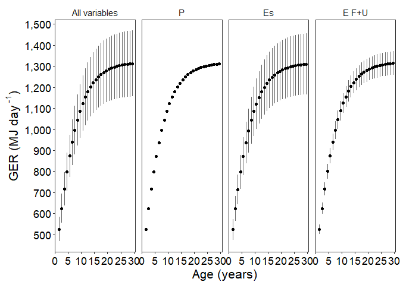

Gross Energetic Requirements(GER) Sensitivity Analysis - phase 2
================
Selina Agbayani
25 Jan 2022 - code updated 21 July, 2025

``` r
# Set path for output figures: 
Figurespath <- paste0(getwd(), "/gross_energetic_reqs/figures", collapse = NULL)
Figurespath
```

    ## [1] "C:/Users/AgbayaniS/Documents/R/graywhale_energyreqs/gross_energetic_reqs/figures"

``` r
# Set path for input & output data  
datapath <- paste0(getwd(), "/data", collapse = NULL) 
datapath
```

    ## [1] "C:/Users/AgbayaniS/Documents/R/graywhale_energyreqs/data"

``` r
## Read data in Activity Cost Reference, Production Cost, Es
A_cost_reference <- as_tibble(
  read_csv("data/ActivityCost_ReferenceData_BreathsPerDay_Table_VA_2017_original_sources.csv"),
  col_types = (list(cols(  ID = col_double(),
                           Lifestage = col_character(),
                           Description = col_character(),
                           Activity_stages = col_character(),
                           no_days = col_double(),
                           source_no_days = col_character(),
                           bpm = col_double(),
                           se_bpm = col_double(),
                           source_bpm = col_character(),
                           age_yrs = col_double(),
                           age_yrs_min = col_double(),
                           age_yrs_max = col_double(),
                           pct_O2 = col_double(),
                           pct_O2_sd = col_double()
  )
  )
  )
)
```

    ## Rows: 60 Columns: 14
    ## ── Column specification ────────────────────────────────────────────────────────
    ## Delimiter: ","
    ## chr (5): Lifestage, Description, Activity_stages, source_no_days, source_bpm
    ## dbl (9): ID, no_days, bpm, se_bpm, age_yrs, age_yrs_min, age_yrs_max, pct_O2...
    ## 
    ## ℹ Use `spec()` to retrieve the full column specification for this data.
    ## ℹ Specify the column types or set `show_col_types = FALSE` to quiet this message.

``` r
kable(A_cost_reference)
```

| ID | Lifestage | Description | Activity_stages | no_days | source_no_days | bpm | se_bpm | source_bpm | age_yrs | age_yrs_min | age_yrs_max | pct_O2 | pct_O2_sd |
|---:|:---|:---|:---|---:|:---|---:|---:|:---|---:|---:|---:|---:|---:|
| 1 | Calf | Lagoon 0-1 mths (Jan) | calving grounds | 31 | Sumich (1986); Findley & Vidal (2002); Pike 1962 | 2.14 | 0.50 | Sumich (1986) as cited in Villegas-Amtmann et al. 2017 | 0.0849315 | 0.0000100 | 0.0849315 | 10.5 | 3.0 |
| 2 | Calf | Lagoon 2 mth (Feb) | calving grounds | 28 | Sumich (1986); Findley & Vidal (2002); Pike 1962 | 1.56 | 0.40 | Sumich (1986) as cited in Villegas-Amtmann et al. 2017 | 0.1616438 | 0.0849315 | 0.1616438 | 10.5 | 3.0 |
| 3 | Calf | Lagoon 3 mths (Mar) | calving grounds | 15 | Sumich (1986); Findley & Vidal (2002); Rice and Wolman 1971 | 1.39 | 0.30 | Sumich (1986) as cited in Villegas-Amtmann et al. 2017 | 0.2465753 | 0.1616438 | 0.2465753 | 10.5 | 3.0 |
| 4 | Calf | Northbound 3 mths (Mar) | northbound | 16 | Rodriguez de la Gala Hernandez 2008; Perryman et al. 2010; Poole 1984; Rice and Wolman 1971; Leatherwood 1974 | 0.70 | 0.10 | Rodriguez de la Gala-Hernandez et al. (2008) | 0.2465753 | 0.1616438 | 0.2465753 | 10.5 | 3.0 |
| 5 | Calf | Northbound 4 mths (Apr) | northbound | 30 | Poole (1984); Rodriguez de la Gala Hernandez et al. 2008; Perryman et al. 2010; Leatherwood 1974 | 0.70 | 0.10 | Rodriguez de la Gala-Hernandez et al. (2008) | 0.3287671 | 0.2465753 | 0.3287671 | 10.5 | 3.0 |
| 6 | Calf | Northbound 5 mths (May) | northbound | 31 | Braham (1984), Poole (1984); Rodriguez de la Gala Hernandez et al. 2008; Perryman et al. 2010; Rice and Wolman 1971; Leatherwood 1974 | 0.70 | 0.10 | Rodriguez de la Gala-Hernandez et al. (2008) | 0.4136986 | 0.3287671 | 0.4136986 | 10.5 | 3.0 |
| 7 | Calf | Northbound 6 mths (June) | northbound | 23 | Hessing (1981) as cited in Braham (1984); | 0.70 | 0.10 | Rodriguez de la Gala-Hernandez et al. (2008) | 0.4958904 | 0.4136986 | 0.4958904 | 11.0 | 2.7 |
| 8 | Calf | Nursing at Foraging grounds 6 mths (June) | nursing at foraging grounds | 7 | Synchenko (2011); Bradford et al. 2012 | 1.22 | 0.30 | Sychenko (2011) | 0.4958904 | 0.4136986 | 0.4958904 | 11.0 | 2.7 |
| 9 | Calf | Nursing at Foraging grounds 7 mths (July) | nursing at foraging grounds | 31 | Mom/calf observations: Sychenko (2011), Bradford et al 2012; Weller et al. 2003 | 1.22 | 0.30 | Sychenko (2011) | 0.5808219 | 0.4958904 | 0.5808219 | 11.0 | 2.7 |
| 10 | Calf | Nursing at foraging grounds 8 mths (Aug) | nursing at foraging grounds | 31 | Mom/calf observations: Sychenko (2011), Bradford et al 2012; Weller et al. 2003 | 1.22 | 0.30 | Sychenko (2011) | 0.6657534 | 0.5808219 | 0.6657534 | 11.0 | 2.7 |
| 11 | Calf | Nursing at foraging grounds (Sep) | nursing at foraging grounds | 30 | Mom/calf observations: Sychenko (2011), Bradford et al 2012; Weller et al. 2003 | 1.22 | 0.30 | Sychenko (2011) | 0.7479452 | 0.6657534 | 0.7479452 | 11.0 | 2.7 |
| 12 | Calf | nursing at foraging grounds (Oct) | nursing at foraging grounds | 20 | for approx date of weaning (~9.6 mths): Agbayani et al. 2020, Weller et al. 2009 | 1.22 | 0.30 | Sychenko (2011) | 0.8328767 | 0.7479452 | 0.8328767 | 11.0 | 2.7 |
| 13 | Calf | Southbound post-weaning (Oct) | southbound post-weaning | 11 | Rugh et al. (2001), Braham (1984) | 0.72 | 0.20 | Sumich (1983); Schwarz (2002), as cited in Villegas-Amtmann 2017 | 0.8328767 | 0.7479452 | 0.9150685 | 11.0 | 2.7 |
| 14 | Calf | Southbound post-weaning (Nov) | southbound post-weaning | 30 | Sumich (1986), Rugh et al. (2001), | 0.72 | 0.20 | Sumich (1983); Schwarz (2002), as cited in Villegas-Amtmann 2017 | 0.9150685 | 0.8328767 | 1.0000000 | 11.0 | 2.7 |
| 15 | Calf | Southbound post-weaning (Dec) | southbound post-weaning | 31 | Sumich (1986), Rugh et al. (2001), Laake et al. (2012) | 0.72 | 0.20 | Sumich (1983); Schwarz (2002), as cited in Villegas-Amtmann 2017 | 1.0000000 | 0.9150685 | 1.0000000 | 11.0 | 2.7 |
| 16 | Pregnant | Southbound newly pregnant (Dec) | Southbound recently pregnant | 31 | Rice 1983; Rice and Wolman 1971 | 0.72 | 0.20 | Sumich (1983); Schwarz (2002), as cited in Villegas-Amtmann 2017 | NA | 8.0000000 | 75.0000000 | 11.0 | 2.7 |
| 17 | Pregnant | Lagoon breeding (Jan) | calving grounds recently pregnant | 31 | Rice 1983 | 0.62 | 0.20 | Harvey & Mate (1984), as cited in Villegas-Amtmann et al. 2017 | NA | 8.0000000 | 75.0000000 | 11.0 | 2.7 |
| 18 | Pregnant | Lagoon breeding (Feb) | calving grounds recently pregnant | 20 | Rice 1983 | 0.62 | 0.20 | Harvey & Mate (1984), as cited in Villegas-Amtmann et al. 2017 | NA | 8.0000000 | 75.0000000 | 11.0 | 2.7 |
| 19 | Pregnant | Northbound solo pregnant (Feb) | northbound pregnant | 8 | Rice 1983 | 0.50 | 0.20 | Rodriguez de la Gala-Hernandez et al. (2008) | NA | 8.0000000 | 75.0000000 | 11.0 | 2.7 |
| 20 | Pregnant | Northbound solo pregnant (Mar) | northbound pregnant | 31 | Rice 1983; Rice & Wolman (1971) | 0.50 | 0.20 | Rodriguez de la Gala-Hernandez et al. (2008) | NA | 8.0000000 | 75.0000000 | 11.0 | 2.7 |
| 21 | Pregnant | Northbound solo pregnant (Apr) | northbound pregnant | 30 | Rice 1983; Rice & Wolman (1971) | 0.50 | 0.20 | Rodriguez de la Gala-Hernandez et al. (2008) | NA | 8.0000000 | 75.0000000 | 11.0 | 2.7 |
| 22 | Pregnant | Northbound pregnant (May) | northbound pregnant | 31 | Rice 1983 | 0.50 | 0.20 | Rodriguez de la Gala-Hernandez et al. (2008) | NA | 8.0000000 | 75.0000000 | 11.0 | 2.7 |
| 23 | Pregnant | Foraging pregnant (june) | foraging pregnant | 30 | Rice 1983; Rice & Wolman (1971) | 1.34 | 0.10 | O. Sychenko (unpubl.) | NA | 8.0000000 | 75.0000000 | 11.0 | 2.7 |
| 24 | Pregnant | Foraging pregnant (july) | foraging pregnant | 31 | Rice 1983 | 1.34 | 0.10 | O. Sychenko (unpubl.) | NA | 8.0000000 | 75.0000000 | 11.0 | 2.7 |
| 25 | Pregnant | Foraging pregnant (Aug) | foraging pregnant | 31 | Rice 1983 | 1.34 | 0.10 | O. Sychenko (unpubl.) | NA | 8.0000000 | 75.0000000 | 11.0 | 2.7 |
| 26 | Pregnant | Foraging pregnant (Sep) | foraging pregnant | 30 | Rice 1983 | 1.34 | 0.10 | O. Sychenko (unpubl.) | NA | 8.0000000 | 75.0000000 | 11.0 | 2.7 |
| 27 | Pregnant | Foraging pregnant (Oct) | foraging pregnant | 31 | Rice 1983 | 1.34 | 0.10 | O. Sychenko (unpubl.) | NA | 8.0000000 | 75.0000000 | 11.0 | 2.7 |
| 28 | Pregnant | Southbound pregnant (Nov) | southbound pregnant | 30 | Rice 1983; Sumich (1986), | 0.72 | 0.20 | Sumich (1983) and Schwarz (2002) | NA | 8.0000000 | 75.0000000 | 11.0 | 2.7 |
| 29 | Pregnant | Southbound pregnant (Dec) | southbound pregnant | 31 | Rice 1983; Sumich (1986), | 0.72 | 0.20 | Sumich (1983) and Schwarz (2002) | NA | 8.0000000 | 75.0000000 | 11.0 | 2.7 |
| 30 | Lactating | Lagoon lactating (Jan) | calving grounds lactating | 31 | Rice 1983; Sumich (1986); Findley & Vidal (2002); Pike 1962 | 0.62 | 0.20 | Harvey & Mate (1984) | NA | 8.0000000 | 75.0000000 | 11.0 | 2.7 |
| 31 | Lactating | Lagoon lactating (Feb) | calving grounds lactating | 28 | Rice 1983; Sumich (1986); Findley & Vidal (2002); Rugh et al. 2001 | 0.62 | 0.20 | Harvey & Mate (1984) | NA | 8.0000000 | 75.0000000 | 11.0 | 2.7 |
| 32 | Lactating | Lagoon lactating (March) | calving grounds lactating | 15 | (coincides with NB calves) Sumich (1986); Findley & Vidal (2002); Rugh et al. 2001; Rodriguez de la Gala Hernandez 2008 | 0.62 | 0.20 | Harvey & Mate (1984) | NA | 8.0000000 | 75.0000000 | 11.0 | 2.7 |
| 33 | Lactating | Northbound with calf (March) | northbound lactating | 16 | Rodriguez de la Gala Hernandez 2008; Poole 1984; Perryman et al. 2010; Leatherwood (1974) | 0.50 | 0.10 | Rodriguez de la Gala-Hernandez et al. (2008) | NA | 8.0000000 | 75.0000000 | 11.0 | 2.7 |
| 34 | Lactating | Northbound with calf (April) | northbound lactating | 30 | Braham (1984), Poole (1984); Rodriguez de la Gala Hernandez et al. 2008; Perryman et al. 2010; Leatherwood 1974; Rice and Wolman (1971) | 0.50 | 0.10 | Rodriguez de la Gala-Hernandez et al. (2008) | NA | 8.0000000 | 75.0000000 | 11.0 | 2.7 |
| 35 | Lactating | Northbound with calf (May) | northbound lactating | 31 | Braham (1984), Poole (1984); Rodriguez de la Gala Hernandez et al. 2008; Perryman et al. 2010; Leatherwood 1974; | 0.50 | 0.10 | Rodriguez de la Gala-Hernandez et al. (2008) | NA | 8.0000000 | 75.0000000 | 11.0 | 2.7 |
| 36 | Lactating | Northbound with Calf (June) | northbound lactating | 23 | Hessing (1981) as cited in Braham (1984) | 0.50 | 0.10 | Rodriguez de la Gala-Hernandez et al. (2008) | NA | 8.0000000 | 75.0000000 | 11.0 | 2.7 |
| 37 | Lactating | Foraging lactating (June) | foraging lactating | 7 | Mom/calf observations: Synchenko (2011) | 1.04 | 0.20 | O. Sychenko (unpubl.) | NA | 8.0000000 | 75.0000000 | 11.0 | 2.7 |
| 38 | Lactating | Foraging lactating (July) | foraging lactating | 31 | Mom/calf observations: Sychenko (2011), Bradford et al 2012 | 1.04 | 0.20 | O. Sychenko (unpubl.) | NA | 8.0000000 | 75.0000000 | 11.0 | 2.7 |
| 39 | Lactating | Foraging lactating (Aug) | foraging lactating | 31 | Mom/calf observations: Sychenko (2011), Bradford et al 2012 | 1.04 | 0.20 | O. Sychenko (unpubl.) | NA | 8.0000000 | 75.0000000 | 11.0 | 2.7 |
| 40 | Lactating | Foraging lactating (Sep) | foraging lactating | 30 | Mom/calf observations: Sychenko (2011), Bradford et al 2012 | 1.04 | 0.20 | O. Sychenko (unpubl.) | NA | 8.0000000 | 75.0000000 | 11.0 | 2.7 |
| 41 | Lactating | Foraging lactating (Oct) | foraging lactating | 20 | for approx date of weaning (~9.6 mths): Agbayani et al. 2020, Weller et al. 2009 | 1.04 | 0.20 | O. Sychenko (unpubl.) | NA | 8.0000000 | 75.0000000 | 11.0 | 2.7 |
| 42 | Lactating | Southbound post-weaning (Oct) | southbound post-weaning | 11 | Braham (1984); Rugh et al. (2001); Rodriguez de la Gala-Hernandez (2008); Pike (1962) | 0.72 | 0.20 | Sumich (1983) and Schwarz (2002) | NA | 8.0000000 | 75.0000000 | 11.0 | 2.7 |
| 43 | Lactating | Southbound post-weaning (Nov) | southbound post-weaning | 30 | Rugh et al. 2001; Braham (1984); Rodriguez de la Gala-Hernandez (2008) | 0.72 | 0.20 | Sumich (1983) and Schwarz (2002) | NA | 8.0000000 | 75.0000000 | 11.0 | 2.7 |
| 44 | Lactating | Southbound postweaning (Dec) | southbound post-weaning | 31 | Rugh et al. 2001; Braham (1984); Rodriguez de la Gala-Hernandez (2008); Sumich 1986 | 0.72 | 0.20 | Sumich (1983) and Schwarz (2002) | NA | 8.0000000 | 75.0000000 | 11.0 | 2.7 |
| 45 | Juvenile/Adult | Southbound solo (Jan) | southbound | 15 | Rodriguez de la Gala-Hernandez (2008); Sumich 1986 | 0.72 | 0.20 | Sumich (1983) and Schwarz (2002) | NA | 1.0000000 | 75.0000000 | 11.0 | 2.7 |
| 46 | Juvenile/Adult | Lagoon solo (Jan) | calving grounds | 16 | Sumich (1986), Findley & Vidal (2002); Rice and Wolman 1971; Findley and Vidal 2002 | 0.62 | 0.20 | Harvey & Mate (1984), Sumich (1986) | NA | 1.0000000 | 75.0000000 | 11.0 | 2.7 |
| 47 | Juvenile/Adult | Lagoon solo (Feb) | calving grounds | 14 | Rice and Wolman (1971); Findley & Vidal (2002); Urban et al. 2021; Rugh et al. 2001 | 0.62 | 0.20 | Harvey & Mate (1984), Sumich (1986) | NA | 1.0000000 | 75.0000000 | 11.0 | 2.7 |
| 48 | Juvenile/Adult | Northbound solo (Feb) | northbound | 14 | Rice and Wolman (1971); Poole (1984), Pike (1962), Rodriguez de la Gala Hernandez et al. 2008; Sumich (1986) | 0.50 | 0.03 | Rodriguez de la Gala-Hernandez et al. (2008) | NA | 1.0000000 | 75.0000000 | 11.0 | 2.7 |
| 49 | Juvenile/Adult | Northbound solo (March) | northbound | 31 | Rice and Wolman (1971); Poole (1984), Pike (1962), Rodriguez de la Gala Hernandez et al. 2008; Braham (1984); Urban et al. 2021 (Maria started migrating March 9); Leatherwood 1974 | 0.50 | 0.03 | Rodriguez de la Gala-Hernandez et al. (2008) | NA | 1.0000000 | 75.0000000 | 11.0 | 2.7 |
| 50 | Juvenile/Adult | Northbound solo (April) | northbound | 30 | Rice and Wolman (1971) \*data ends in April; Poole (1984), Pike (1962), Rodriguez de la Gala Hernandez et al. 2008; Braham (1984); Urban et al. 2021 | 0.50 | 0.03 | Rodriguez de la Gala-Hernandez et al. (2008) | NA | 1.0000000 | 75.0000000 | 11.0 | 2.7 |
| 51 | Juvenile/Adult | Northbound solo (May) | northbound | 15 | Poole (1984), Pike (1962), Rodriguez de la Gala Hernandez et al. 2008; Braham (1984); Urban et al. 2021 (Maria stopped migrating May 24) | 0.50 | 0.03 | Rodriguez de la Gala-Hernandez et al. (2008) | NA | 1.0000000 | 75.0000000 | 11.0 | 2.7 |
| 52 | Juvenile/Adult | Foraging solo (May) | foraging | 16 | Kim and Oliver (1989); Heide-Jorgensen et al. (2012); 5 months (May to Oct); Urban et al. 2021 | 1.04 | 0.20 | O. Sychenko (unpubl.) | NA | 1.0000000 | 75.0000000 | 11.0 | 2.7 |
| 53 | Juvenile/Adult | Foraging solo (June) | foraging | 30 | Kim and Oliver (1989); Pike (1962); Heide-Jorgensen et al. (2012); Urban et al. 2021 | 1.04 | 0.20 | O. Sychenko (unpubl.) | NA | 1.0000000 | 75.0000000 | 11.0 | 2.7 |
| 54 | Juvenile/Adult | Foraging solo (July) | foraging | 31 | Kim and Oliver (1989); Pike (1962); Heide-Jorgensen et al. (2012); Urban et al. 2021; Bradford et al. 2012 | 1.04 | 0.20 | O. Sychenko (unpubl.) | NA | 1.0000000 | 75.0000000 | 11.0 | 2.7 |
| 55 | Juvenile/Adult | Foraging solo (Aug) | foraging | 31 | Pike (1962); Heide-Jorgensen et al. (2012); Bradford et al. 2012 | 1.04 | 0.20 | O. Sychenko (unpubl.) | NA | 1.0000000 | 75.0000000 | 11.0 | 2.7 |
| 56 | Juvenile/Adult | Foraging solo (Sep) | foraging | 30 | Pike (1962); Heide-Jorgensen et al. (2012); Bradford et al. 2012 | 1.04 | 0.20 | O. Sychenko (unpubl.) | NA | 1.0000000 | 75.0000000 | 11.0 | 2.7 |
| 57 | Juvenile/Adult | Foraging solo (Oct) | foraging | 16 | Kim and Oliver (1989); Pike (1962); Heide-Jorgensen et al. (2012); Bradford et al. 2012; Rugh et al. 2001 | 1.04 | 0.20 | O. Sychenko (unpubl.) | NA | 1.0000000 | 75.0000000 | 11.0 | 2.7 |
| 58 | Juvenile/Adult | Southbound (Oct) | southbound | 15 | Rugh et al. 2001; Braham (1984); Rodriguez de la Gala-Hernandez (2008); Pike (1962) | 0.72 | 0.20 | Sumich (1983); Schwarz (2002); Villegas-Amtmann 2017 | NA | 1.0000000 | 75.0000000 | 11.0 | 2.7 |
| 59 | Juvenile/Adult | Southbound (Nov) | southbound | 30 | Sumich (1986), Rugh et al. (2001), Braham 1984; | 0.72 | 0.20 | Sumich (1983); Schwarz (2002); Villegas-Amtmann 2017 | NA | 1.0000000 | 75.0000000 | 11.0 | 2.7 |
| 60 | Juvenile/Adult | Southbound (Dec) | southbound | 31 | Sumich (1986), Laake et al. (2012); Pike 1962; Rugh et al. (2001), Braham (1984); Leatherwood (1974) | 0.72 | 0.20 | Sumich (1983); Schwarz (2002); Villegas-Amtmann 2017 | NA | 1.0000000 | 75.0000000 | 11.0 | 2.7 |

``` r
Activity_days <- A_cost_reference %>% select(Lifestage, Activity_stages, no_days) %>%  
  group_by(Lifestage, Activity_stages) %>% 
  summarise(no_days = sum(no_days))
```

    ## `summarise()` has grouped output by 'Lifestage'. You can override using the
    ## `.groups` argument.

``` r
kable(Activity_days)
```

| Lifestage      | Activity_stages                   | no_days |
|:---------------|:----------------------------------|--------:|
| Calf           | calving grounds                   |      74 |
| Calf           | northbound                        |     100 |
| Calf           | nursing at foraging grounds       |     119 |
| Calf           | southbound post-weaning           |      72 |
| Juvenile/Adult | calving grounds                   |      30 |
| Juvenile/Adult | foraging                          |     154 |
| Juvenile/Adult | northbound                        |      90 |
| Juvenile/Adult | southbound                        |      91 |
| Lactating      | calving grounds lactating         |      74 |
| Lactating      | foraging lactating                |     119 |
| Lactating      | northbound lactating              |     100 |
| Lactating      | southbound post-weaning           |      72 |
| Pregnant       | Southbound recently pregnant      |      31 |
| Pregnant       | calving grounds recently pregnant |      51 |
| Pregnant       | foraging pregnant                 |     153 |
| Pregnant       | northbound pregnant               |     100 |
| Pregnant       | southbound pregnant               |      61 |

``` r
activity_stages <- Activity_days$Activity_stages


P_cost_table_peryear <- as_tibble(
  read_csv("data/P_cost_table_peryear.csv"), 
  col_types = (list(cols(age_yrs = col_double(),
                         mean_masschange = col_double(),
                         sd_masschange = col_double(),
                         sex = col_character(),
                         mean_P = col_double(),
                         sd_P = col_double(),
                         p_lipid = col_double(),
                         p_protein = col_double()
  )
  )
  )
)
```

    ## Rows: 228 Columns: 18
    ## ── Column specification ────────────────────────────────────────────────────────
    ## Delimiter: ","
    ## chr  (1): sex
    ## dbl (17): age_yrs, mean_masschange, sd_masschange, mean_P, sd_P, p_lipid, p_...
    ## 
    ## ℹ Use `spec()` to retrieve the full column specification for this data.
    ## ℹ Specify the column types or set `show_col_types = FALSE` to quiet this message.

``` r
kable(head(P_cost_table_peryear))
```

| age_yrs | mean_masschange | sd_masschange | sex | mean_P | sd_P | p_lipid | p_protein | mean_P_perday | sd_P_perday | mean_mass | sd_mass | mean_lwr | mean_upr | quant025 | quant975 | female_mass | male_mass |
|---:|---:|---:|:---|---:|---:|---:|---:|---:|---:|---:|---:|---:|---:|---:|---:|---:|---:|
| 0 | 986.5516 | 20.89449 | Female | 17057.91 | 767.1217 | 0.3599891 | 0.126000 | 46.73400 | 2.101703 | 983.0272 | 26.7677 | 769.3864 | 1256.003 | 931.5244 | 1036.295 | 1011.028 | 967.3705 |
| 1 | 5257.8958 | 136.87045 | Female | 87307.45 | 4264.4399 | 0.3599891 | 0.097200 | 239.19848 | 11.683397 | 6072.8559 | 202.1109 | 5535.5539 | 6662.311 | 5685.3490 | 6476.221 | 6245.837 | 5976.1335 |
| 2 | 1642.6730 | 31.11877 | Female | 27674.88 | 1242.4542 | 0.3599891 | 0.107388 | 75.82158 | 3.403984 | 7675.1795 | 162.2450 | 6967.9413 | 8454.206 | 7362.0875 | 7997.123 | 7893.802 | 7552.9369 |
| 3 | 1577.4600 | 11.13125 | Female | 26576.14 | 1096.3455 | 0.3599891 | 0.107388 | 72.81134 | 3.003686 | 9210.7914 | 147.9849 | 8289.2833 | 10234.752 | 8924.5190 | 9503.733 | 9473.155 | 9064.0911 |
| 4 | 1470.3573 | 6.62462 | Female | 24771.72 | 1012.7120 | 0.3599891 | 0.107388 | 67.86773 | 2.774553 | 10639.3400 | 156.4716 | 9483.1963 | 11936.449 | 10336.4523 | 10948.882 | 10942.395 | 10469.8872 |
| 5 | 1339.2771 | 14.69623 | Female | 22563.39 | 950.3335 | 0.3599891 | 0.107388 | 61.81750 | 2.603653 | 11939.1149 | 175.2988 | 10546.1836 | 13516.043 | 11599.7789 | 12285.898 | 12279.193 | 11748.9607 |

``` r
P_cost_table_peryear$Ts <- 365


Es_table_phase2_peryear <- as_tibble(
  read_csv("data/Es_sensAnalysis_phase2_peryear_source_bpm.csv"),
  col_types = (list(cols(age_yrs = col_double(),
                         Lifestage = col_character(),
                         no_days = col_double(),
                         Es = col_double(),
                         Es_sd = col_double()
  )
  )
  )
)
```

    ## Rows: 124 Columns: 8
    ## ── Column specification ────────────────────────────────────────────────────────
    ## Delimiter: ","
    ## chr (2): Lifestage, MC_variable
    ## dbl (6): age_yrs, no_days, Es, Es_sd, Es_perday, Es_sd_perday
    ## 
    ## ℹ Use `spec()` to retrieve the full column specification for this data.
    ## ℹ Specify the column types or set `show_col_types = FALSE` to quiet this message.

``` r
Es_table_phase2_peryear <- Es_table_phase2_peryear %>%  filter(age_yrs >=1)
kable(Es_table_phase2_peryear)
```

| age_yrs | Lifestage | no_days | MC_variable | Es | Es_sd | Es_perday | Es_sd_perday |
|---:|:---|---:|:---|---:|---:|---:|---:|
| 1 | Juvenile/Adult | 365 | all | 76914.82 | 11469.206 | 210.7255 | 31.422481 |
| 1 | Juvenile/Adult | 365 | Rs | 79126.07 | 3306.419 | 216.7838 | 9.058682 |
| 1 | Juvenile/Adult | 365 | Vt | 78891.39 | 3119.433 | 216.1408 | 8.546391 |
| 1 | Juvenile/Adult | 365 | pctO2 | 76872.13 | 10889.877 | 210.6086 | 29.835280 |
| 2 | Juvenile/Adult | 365 | all | NA | NA | NA | NA |
| 2 | Juvenile/Adult | 365 | Rs | NA | NA | NA | NA |
| 2 | Juvenile/Adult | 365 | Vt | NA | NA | NA | NA |
| 2 | Juvenile/Adult | 365 | pctO2 | NA | NA | NA | NA |
| 3 | Juvenile/Adult | 365 | all | 159222.60 | 23467.632 | 436.2263 | 64.294883 |
| 3 | Juvenile/Adult | 365 | Rs | 163821.13 | 6845.548 | 448.8250 | 18.754925 |
| 3 | Juvenile/Adult | 365 | Vt | 163447.43 | 6514.144 | 447.8012 | 17.846970 |
| 3 | Juvenile/Adult | 365 | pctO2 | 159154.62 | 22546.197 | 436.0400 | 61.770403 |
| 4 | Juvenile/Adult | 365 | all | 188483.41 | 27607.360 | 516.3929 | 75.636603 |
| 4 | Juvenile/Adult | 365 | Rs | 193940.26 | 8104.127 | 531.3432 | 22.203088 |
| 4 | Juvenile/Adult | 365 | Vt | 193568.55 | 7757.003 | 530.3248 | 21.252062 |
| 4 | Juvenile/Adult | 365 | pctO2 | 188415.79 | 26691.400 | 516.2076 | 73.127123 |
| 5 | Juvenile/Adult | 365 | all | 215501.83 | 31533.903 | 590.4160 | 86.394254 |
| 5 | Juvenile/Adult | 365 | Rs | 221743.27 | 9265.924 | 607.5158 | 25.386092 |
| 5 | Juvenile/Adult | 365 | Vt | 221330.90 | 8877.821 | 606.3860 | 24.322799 |
| 5 | Juvenile/Adult | 365 | pctO2 | 215426.82 | 30517.842 | 590.2105 | 83.610527 |
| 6 | Juvenile/Adult | 365 | all | 239967.14 | 35114.472 | 657.4442 | 96.204034 |
| 6 | Juvenile/Adult | 365 | Rs | 246917.11 | 10317.856 | 676.4852 | 28.268099 |
| 6 | Juvenile/Adult | 365 | Vt | 246457.67 | 9885.517 | 675.2265 | 27.083608 |
| 6 | Juvenile/Adult | 365 | pctO2 | 239883.57 | 33982.440 | 657.2153 | 93.102576 |
| 7 | Juvenile/Adult | 365 | all | 261786.93 | 38291.190 | 717.2245 | 104.907370 |
| 7 | Juvenile/Adult | 365 | Rs | 269370.08 | 11256.092 | 738.0002 | 30.838608 |
| 7 | Juvenile/Adult | 365 | Vt | 268875.48 | 10789.113 | 736.6452 | 29.559214 |
| 7 | Juvenile/Adult | 365 | pctO2 | 261696.96 | 37072.574 | 716.9780 | 101.568695 |
| 8 | Juvenile/Adult | 365 | all | 281014.80 | 41056.941 | 769.9036 | 112.484770 |
| 8 | Juvenile/Adult | 365 | Rs | 289158.50 | 12082.985 | 792.2151 | 33.104069 |
| 8 | Juvenile/Adult | 365 | Vt | 288646.66 | 11595.419 | 790.8128 | 31.768272 |
| 8 | Juvenile/Adult | 365 | pctO2 | 280921.70 | 39795.993 | 769.6485 | 109.030117 |
| 9 | Juvenile/Adult | 365 | all | 297800.03 | 43422.500 | 815.8905 | 118.965752 |
| 9 | Juvenile/Adult | 365 | Rs | 306436.80 | 12804.989 | 839.5529 | 35.082161 |
| 9 | Juvenile/Adult | 365 | Vt | 305929.90 | 12314.657 | 838.1641 | 33.738788 |
| 9 | Juvenile/Adult | 365 | pctO2 | 297707.82 | 42173.952 | 815.6379 | 115.545075 |
| 10 | Juvenile/Adult | 365 | all | 312329.17 | 45459.193 | 855.6964 | 124.545734 |
| 10 | Juvenile/Adult | 365 | Rs | 321393.58 | 13429.983 | 880.5304 | 36.794475 |
| 10 | Juvenile/Adult | 365 | Vt | 320895.42 | 12941.549 | 879.1655 | 35.456298 |
| 10 | Juvenile/Adult | 365 | pctO2 | 312238.55 | 44232.408 | 855.4481 | 121.184679 |
| 11 | Juvenile/Adult | 365 | all | 324834.64 | 47176.380 | 889.9579 | 129.250356 |
| 11 | Juvenile/Adult | 365 | Rs | 334269.88 | 13968.042 | 915.8079 | 38.268607 |
| 11 | Juvenile/Adult | 365 | Vt | 333793.92 | 13493.825 | 914.5039 | 36.969384 |
| 11 | Juvenile/Adult | 365 | pctO2 | 324748.06 | 46004.533 | 889.7207 | 126.039816 |
| 12 | Juvenile/Adult | 365 | all | 335535.53 | 48640.175 | 919.2754 | 133.260752 |
| 12 | Juvenile/Adult | 365 | Rs | 345288.51 | 14428.474 | 945.9959 | 39.530066 |
| 12 | Juvenile/Adult | 365 | Vt | 344833.86 | 13969.389 | 944.7503 | 38.272299 |
| 12 | Juvenile/Adult | 365 | pctO2 | 335452.82 | 47520.993 | 919.0488 | 130.194502 |
| 13 | Juvenile/Adult | 365 | all | 344655.46 | 49878.448 | 944.2615 | 136.653281 |
| 13 | Juvenile/Adult | 365 | Rs | 354679.96 | 14820.912 | 971.7259 | 40.605238 |
| 13 | Juvenile/Adult | 365 | Vt | 354247.27 | 14378.786 | 970.5405 | 39.393935 |
| 13 | Juvenile/Adult | 365 | pctO2 | 344576.75 | 48813.509 | 944.0459 | 133.735641 |
| 14 | Juvenile/Adult | 365 | all | 352396.70 | 50936.520 | 965.4704 | 139.552109 |
| 14 | Juvenile/Adult | 365 | Rs | 362651.14 | 15154.001 | 993.5648 | 41.517811 |
| 14 | Juvenile/Adult | 365 | Vt | 362234.23 | 14724.366 | 992.4225 | 40.340728 |
| 14 | Juvenile/Adult | 365 | pctO2 | 352320.86 | 49910.557 | 965.2626 | 136.741253 |
| 15 | Juvenile/Adult | 365 | all | 358949.60 | 51836.737 | 983.4236 | 142.018457 |
| 15 | Juvenile/Adult | 365 | Rs | 369398.32 | 15435.944 | 1012.0502 | 42.290257 |
| 15 | Juvenile/Adult | 365 | Vt | 368992.91 | 15015.540 | 1010.9395 | 41.138465 |
| 15 | Juvenile/Adult | 365 | pctO2 | 358875.85 | 50839.152 | 983.2215 | 139.285347 |
| 16 | Juvenile/Adult | 365 | all | 364479.15 | 52614.409 | 998.5730 | 144.149065 |
| 16 | Juvenile/Adult | 365 | Rs | 375090.44 | 15673.799 | 1027.6450 | 42.941914 |
| 16 | Juvenile/Adult | 365 | Vt | 374687.33 | 15254.651 | 1026.5406 | 41.793565 |
| 16 | Juvenile/Adult | 365 | pctO2 | 364405.82 | 51622.540 | 998.3721 | 141.431616 |
| 17 | Juvenile/Adult | 365 | all | 369137.89 | 53279.600 | 1011.3367 | 145.971508 |
| 17 | Juvenile/Adult | 365 | Rs | 379885.37 | 15874.163 | 1040.7818 | 43.490858 |
| 17 | Juvenile/Adult | 365 | Vt | 379480.11 | 15452.384 | 1039.6715 | 42.335297 |
| 17 | Juvenile/Adult | 365 | pctO2 | 369064.17 | 52282.452 | 1011.1347 | 143.239594 |
| 18 | Juvenile/Adult | 365 | all | 373054.92 | 53852.960 | 1022.0683 | 147.542355 |
| 18 | Juvenile/Adult | 365 | Rs | 383915.83 | 16042.583 | 1051.8242 | 43.952282 |
| 18 | Juvenile/Adult | 365 | Vt | 383502.99 | 15613.352 | 1050.6931 | 42.776306 |
| 18 | Juvenile/Adult | 365 | pctO2 | 372979.82 | 52837.151 | 1021.8625 | 144.759319 |
| 19 | Juvenile/Adult | 365 | all | 376341.33 | 54354.211 | 1031.0721 | 148.915645 |
| 19 | Juvenile/Adult | 365 | Rs | 387295.86 | 16183.823 | 1061.0845 | 44.339242 |
| 19 | Juvenile/Adult | 365 | Vt | 386868.39 | 15740.874 | 1059.9134 | 43.125682 |
| 19 | Juvenile/Adult | 365 | pctO2 | 376263.57 | 53302.334 | 1030.8591 | 146.033793 |
| 20 | Juvenile/Adult | 365 | all | 379099.13 | 54780.894 | 1038.6277 | 150.084640 |
| 20 | Juvenile/Adult | 365 | Rs | 390131.75 | 16302.326 | 1068.8541 | 44.663907 |
| 20 | Juvenile/Adult | 365 | Vt | 389689.52 | 15845.709 | 1067.6425 | 43.412902 |
| 20 | Juvenile/Adult | 365 | pctO2 | 379018.68 | 53692.630 | 1038.4073 | 147.103096 |
| 21 | Juvenile/Adult | 365 | all | 381409.23 | 55149.778 | 1044.9568 | 151.095282 |
| 21 | Juvenile/Adult | 365 | Rs | 392506.39 | 16401.555 | 1075.3600 | 44.935766 |
| 21 | Juvenile/Adult | 365 | Vt | 392047.09 | 15929.400 | 1074.1016 | 43.642193 |
| 21 | Juvenile/Adult | 365 | pctO2 | 381325.68 | 54019.445 | 1044.7279 | 147.998478 |
| 22 | Juvenile/Adult | 365 | all | 383344.05 | 55464.630 | 1050.2577 | 151.957891 |
| 22 | Juvenile/Adult | 365 | Rs | 394494.81 | 16484.644 | 1080.8077 | 45.163408 |
| 22 | Juvenile/Adult | 365 | Vt | 394018.80 | 15997.468 | 1079.5036 | 43.828679 |
| 22 | Juvenile/Adult | 365 | pctO2 | 383257.46 | 54293.104 | 1050.0204 | 148.748231 |
| 23 | Juvenile/Adult | 365 | all | 384962.12 | 55737.350 | 1054.6907 | 152.705069 |
| 23 | Juvenile/Adult | 365 | Rs | 396156.99 | 16554.101 | 1085.3616 | 45.353702 |
| 23 | Juvenile/Adult | 365 | Vt | 395663.16 | 16051.132 | 1084.0087 | 43.975705 |
| 23 | Juvenile/Adult | 365 | pctO2 | 384872.29 | 54521.865 | 1054.4446 | 149.374973 |
| 24 | Juvenile/Adult | 365 | all | 386315.74 | 55969.814 | 1058.3993 | 153.341956 |
| 24 | Juvenile/Adult | 365 | Rs | 397547.17 | 16612.192 | 1089.1703 | 45.512855 |
| 24 | Juvenile/Adult | 365 | Vt | 397036.66 | 16094.625 | 1087.7717 | 44.094864 |
| 24 | Juvenile/Adult | 365 | pctO2 | 386222.87 | 54713.191 | 1058.1448 | 149.899155 |
| 25 | Juvenile/Adult | 365 | all | 387448.68 | 56164.624 | 1061.5032 | 153.875683 |
| 25 | Juvenile/Adult | 365 | Rs | 398710.70 | 16660.812 | 1092.3581 | 45.646060 |
| 25 | Juvenile/Adult | 365 | Vt | 398186.13 | 16131.054 | 1090.9209 | 44.194669 |
| 25 | Juvenile/Adult | 365 | pctO2 | 387353.25 | 54873.324 | 1061.2418 | 150.337874 |
| 26 | Juvenile/Adult | 365 | all | 388393.63 | 56336.749 | 1064.0921 | 154.347257 |
| 26 | Juvenile/Adult | 365 | Rs | 399680.42 | 16701.334 | 1095.0149 | 45.757078 |
| 26 | Juvenile/Adult | 365 | Vt | 399140.18 | 16158.179 | 1093.5347 | 44.268985 |
| 26 | Juvenile/Adult | 365 | pctO2 | 388295.35 | 55006.784 | 1063.8229 | 150.703518 |
| 27 | Juvenile/Adult | 365 | all | 389184.38 | 56479.746 | 1066.2586 | 154.739029 |
| 27 | Juvenile/Adult | 365 | Rs | 400491.99 | 16735.246 | 1097.2383 | 45.849990 |
| 27 | Juvenile/Adult | 365 | Vt | 399939.05 | 16181.338 | 1095.7234 | 44.332433 |
| 27 | Juvenile/Adult | 365 | pctO2 | 389083.80 | 55118.477 | 1065.9830 | 151.009527 |
| 28 | Juvenile/Adult | 365 | all | 389844.60 | 56602.568 | 1068.0674 | 155.075530 |
| 28 | Juvenile/Adult | 365 | Rs | 401169.32 | 16763.550 | 1099.0940 | 45.927533 |
| 28 | Juvenile/Adult | 365 | Vt | 400604.38 | 16199.574 | 1097.5463 | 44.382396 |
| 28 | Juvenile/Adult | 365 | pctO2 | 389741.83 | 55211.696 | 1067.7858 | 151.264920 |
| 29 | Juvenile/Adult | 365 | all | 390396.09 | 56706.799 | 1069.5783 | 155.361094 |
| 29 | Juvenile/Adult | 365 | Rs | 401734.98 | 16787.187 | 1100.6438 | 45.992292 |
| 29 | Juvenile/Adult | 365 | Vt | 401159.36 | 16214.318 | 1099.0667 | 44.422788 |
| 29 | Juvenile/Adult | 365 | pctO2 | 390291.38 | 55289.546 | 1069.2915 | 151.478209 |
| 30 | Juvenile/Adult | 365 | all | 390857.40 | 56793.041 | 1070.8422 | 155.597373 |
| 30 | Juvenile/Adult | 365 | Rs | 402208.21 | 16806.962 | 1101.9403 | 46.046470 |
| 30 | Juvenile/Adult | 365 | Vt | 401624.03 | 16227.015 | 1100.3398 | 44.457575 |
| 30 | Juvenile/Adult | 365 | pctO2 | 390751.14 | 55354.676 | 1070.5511 | 151.656646 |
| 31 | Juvenile/Adult | 365 | all | 391241.15 | 56870.686 | 1071.8936 | 155.810099 |
| 31 | Juvenile/Adult | 365 | Rs | 402601.43 | 16823.393 | 1103.0176 | 46.091487 |
| 31 | Juvenile/Adult | 365 | Vt | 402007.72 | 16235.643 | 1101.3910 | 44.481214 |
| 31 | Juvenile/Adult | 365 | pctO2 | 391133.15 | 55408.793 | 1071.5977 | 151.804912 |

``` r
mass_table <- as_tibble(
  read_csv("data/mass_table.csv"), 
  col_types = (list(cols(age_yrs = col_double(),
                         mean_mass = col_double(),
                         sd_mass = col_double(),
                         mean_lwr = col_double(),
                         mean_upr = col_double(),
                         quant025 = col_double(),
                         quant975 = col_double(),
                         female_mass = col_double(),
                         male_mass = col_double()
  )
  )
  )
)
```

    ## Rows: 173 Columns: 9
    ## ── Column specification ────────────────────────────────────────────────────────
    ## Delimiter: ","
    ## dbl (9): age_yrs, mean_mass, sd_mass, mean_lwr, mean_upr, quant025, quant975...
    ## 
    ## ℹ Use `spec()` to retrieve the full column specification for this data.
    ## ℹ Specify the column types or set `show_col_types = FALSE` to quiet this message.

``` r
mean_masschange_peryear <- as_tibble(
  read_csv("data/mean_masschange_per_year.csv"),
  col_types = (list(cols(age_yrs = col_double(),
                         mean_masschange = col_double(),
                         sd_masschange = col_double(),
                         sex = col_character()
  )
  )
  )
)
```

    ## Rows: 228 Columns: 4
    ## ── Column specification ────────────────────────────────────────────────────────
    ## Delimiter: ","
    ## chr (1): sex
    ## dbl (3): age_yrs, mean_masschange, sd_masschange
    ## 
    ## ℹ Use `spec()` to retrieve the full column specification for this data.
    ## ℹ Specify the column types or set `show_col_types = FALSE` to quiet this message.

``` r
mean_masschange_peryear <- mean_masschange_peryear %>% dplyr::filter(age_yrs >= 0)
kable(head(mean_masschange_peryear))
```

| age_yrs | mean_masschange | sd_masschange | sex |
|--------:|----------------:|--------------:|:----|
|       0 |         986.566 |      20.89449 | N/A |
|       1 |        5113.010 |     136.87045 | N/A |
|       2 |        1597.053 |      31.11877 | N/A |
|       3 |        1533.727 |      11.13125 | N/A |
|       4 |        1429.671 |       6.62462 | N/A |
|       5 |        1302.264 |      14.69623 | N/A |

``` r
age_yr_tibble <- as_tibble(
  read_csv("data/age_yr_tibble.csv"), 
  col_types = (list(ID = col_integer(),
                    month = col_character(),
                    no_days_in_mth = col_double(),
                    age_mth = col_double(),
                    no_days_cumul = col_double(),
                    age_yrs = col_double()
  )
  )
)
```

    ## Rows: 25 Columns: 5
    ## ── Column specification ────────────────────────────────────────────────────────
    ## Delimiter: ","
    ## chr (1): month
    ## dbl (4): no_days_in_mth, age_mth, no_days_cumul, age_yrs
    ## 
    ## ℹ Use `spec()` to retrieve the full column specification for this data.
    ## ℹ Specify the column types or set `show_col_types = FALSE` to quiet this message.

``` r
kable(age_yr_tibble)
```

| month | no_days_in_mth | age_mth | no_days_cumul |   age_yrs |
|:------|---------------:|--------:|--------------:|----------:|
| Jan   |            0.0 |     0.0 |           0.0 | 0.0000000 |
| Jan   |           15.5 |     0.5 |          15.5 | 0.0424658 |
| Jan   |           15.5 |     1.0 |          31.0 | 0.0849315 |
| Feb   |           14.0 |     1.5 |          45.0 | 0.1232877 |
| Feb   |           14.0 |     2.0 |          59.0 | 0.1616438 |
| Mar   |           15.5 |     2.5 |          74.5 | 0.2041096 |
| Mar   |           15.5 |     3.0 |          90.0 | 0.2465753 |
| Apr   |           15.0 |     3.5 |         105.0 | 0.2876712 |
| Apr   |           15.0 |     4.0 |         120.0 | 0.3287671 |
| May   |           15.5 |     4.5 |         135.5 | 0.3712329 |
| May   |           15.5 |     5.0 |         151.0 | 0.4136986 |
| Jun   |           15.0 |     5.5 |         166.0 | 0.4547945 |
| Jun   |           15.0 |     6.0 |         181.0 | 0.4958904 |
| Jul   |           15.5 |     6.5 |         196.5 | 0.5383562 |
| Jul   |           15.5 |     7.0 |         212.0 | 0.5808219 |
| Aug   |           15.5 |     7.5 |         227.5 | 0.6232877 |
| Aug   |           15.5 |     8.0 |         243.0 | 0.6657534 |
| Sep   |           15.0 |     8.5 |         258.0 | 0.7068493 |
| Sep   |           15.0 |     9.0 |         273.0 | 0.7479452 |
| Oct   |           15.5 |     9.5 |         288.5 | 0.7904110 |
| Oct   |           15.5 |    10.0 |         304.0 | 0.8328767 |
| Nov   |           15.0 |    10.5 |         319.0 | 0.8739726 |
| Nov   |           15.0 |    11.0 |         334.0 | 0.9150685 |
| Dec   |           15.5 |    11.5 |         349.5 | 0.9575342 |
| Dec   |           15.5 |    12.0 |         365.0 | 1.0000000 |

``` r
predict_GER_table_sensAnalysis_phase1_permth <- as_tibble(
  read_csv("data/predict_GER_table_sensAnalysis_phase1_permth_source_bpm.csv"),
  col_types = list(
    phase = col_double(),
    age_yrs = col_double(),
    sex = col_character(),
    MC_variable = col_character(),
    mean_GER = col_double(),
    GER_sd = col_double(),
    quant025 = col_double(),
    quant975 = col_double(),
    GER_foraging = col_double(),
    sd_foraging = col_double(),
    quant025_foraging = col_double(),
    quant975_foraging = col_double(),
    FR_foraging = col_double(),
    FR_sd_foraging = col_double(),
    FR_quant025 = col_double(),
    FR_quant975 = col_double(),
    Ts = col_double(),
    age_mth = col_double()
  )
)
```

    ## Rows: 48 Columns: 23
    ## ── Column specification ────────────────────────────────────────────────────────
    ## Delimiter: ","
    ## chr  (3): sex, MC_variable, pct_unit
    ## dbl (20): phase, age_yrs, mean_GER, GER_sd, quant025, quant975, GER_foraging...
    ## 
    ## ℹ Use `spec()` to retrieve the full column specification for this data.
    ## ℹ Specify the column types or set `show_col_types = FALSE` to quiet this message.

``` r
kable(predict_GER_table_sensAnalysis_phase1_permth)
```

| phase | age_yrs | sex | MC_variable | mean_GER | GER_sd | quant025 | quant975 | GER_foraging | sd_foraging | quant025_foraging | quant975_foraging | FR_foraging | FR_sd_foraging | FR_quant025 | FR_quant975 | Ts | mass | mass_sd | pctbodywt | pctbodywt_sd | pct_unit | age_mth |
|---:|---:|:---|:---|---:|---:|---:|---:|---:|---:|---:|---:|---:|---:|---:|---:|---:|---:|---:|---:|---:|:---|---:|
| 1 | 0.0849315 | N/A | all | 541.6956 | 42.54135 | 488.4504 | 609.8798 | 541.6956 | 42.54135 | 488.4504 | 609.8798 | 24.25865 | 1.9051208 | 21.87418 | 27.31213 | 31 | 1493.320 | 30.22197 | 0.0162344 | 0.0010632 | L milk/kg body weight | 1 |
| 1 | 0.1616438 | N/A | all | 572.5562 | 46.41602 | 514.4632 | 646.1757 | 572.5562 | 46.41602 | 514.4632 | 646.1757 | 25.64067 | 2.0786393 | 23.03910 | 28.93756 | 28 | 1996.742 | 43.30167 | 0.0128318 | 0.0008518 | L milk/kg body weight | 2 |
| 1 | 0.2465753 | N/A | all | 560.6122 | 37.97524 | 509.9085 | 619.8920 | 560.6122 | 37.97524 | 509.9085 | 619.8920 | 25.10579 | 1.7006375 | 22.83513 | 27.76050 | 31 | 2571.123 | 57.40406 | 0.0097601 | 0.0005377 | L milk/kg body weight | 3 |
| 1 | 0.3287671 | N/A | all | 527.6802 | 35.94325 | 480.7592 | 584.1114 | 527.6802 | 35.94325 | 480.7592 | 584.1114 | 23.63100 | 1.6096397 | 21.52974 | 26.15815 | 30 | 3123.337 | 67.31133 | 0.0075627 | 0.0004262 | L milk/kg body weight | 4 |
| 1 | 0.4136986 | N/A | all | 541.9841 | 38.50671 | 491.8010 | 603.4494 | 541.9841 | 38.50671 | 491.8010 | 603.4494 | 24.27157 | 1.7244384 | 22.02423 | 27.02416 | 31 | 3673.785 | 73.94917 | 0.0066037 | 0.0003964 | L milk/kg body weight | 5 |
| 1 | 0.4958904 | N/A | all | 603.0384 | 40.61985 | 549.5824 | 667.3214 | 603.0384 | 40.61985 | 549.5824 | 667.3214 | 27.00575 | 1.8190707 | 24.61184 | 29.88452 | 30 | 4176.706 | 75.22992 | 0.0064634 | 0.0003735 | L milk/kg body weight | 6 |
| 1 | 0.5808219 | N/A | all | 757.7556 | 71.71363 | 672.0160 | 876.6381 | 757.7556 | 71.71363 | 672.0160 | 876.6381 | 33.93442 | 3.2115373 | 30.09476 | 39.25831 | 31 | 4658.620 | 74.38008 | 0.0072787 | 0.0006069 | L milk/kg body weight | 7 |
| 1 | 0.6657534 | N/A | all | 781.8777 | 77.55865 | 689.7370 | 911.3745 | 781.8777 | 77.55865 | 689.7370 | 911.3745 | 35.01468 | 3.4732939 | 30.88836 | 40.81391 | 31 | 5098.540 | 73.57699 | 0.0068624 | 0.0006100 | L milk/kg body weight | 8 |
| 1 | 0.7479452 | N/A | all | 800.3402 | 82.32948 | 703.0077 | 938.5747 | 800.3402 | 82.32948 | 703.0077 | 938.5747 | 35.84148 | 3.6869447 | 31.48265 | 42.03201 | 30 | 5483.042 | 76.03485 | 0.0065318 | 0.0006068 | L milk/kg body weight | 9 |
| 1 | 0.8328767 | N/A | all | 699.0437 | 101.30627 | 573.3887 | 848.9400 | 699.0437 | 101.30627 | 573.3887 | 848.9400 | 31.30514 | 4.5367789 | 25.67795 | 38.01791 | 31 | 5774.600 | 172.20283 | 0.0054066 | 0.0006452 | L milk/kg body weight | 10 |
| 1 | 0.9150685 | N/A | all | 442.3495 | 52.98001 | 382.3982 | 531.3219 | 442.3495 | 52.98001 | 382.3982 | 531.3219 | 152.69413 | 16.9513982 | 132.90846 | 181.67711 | 30 | 5908.041 | 168.54667 | 2.5811213 | 0.2367848 | % of body weight | 11 |
| 1 | 1.0000000 | N/A | all | 454.2423 | 54.47439 | 392.6322 | 545.7510 | 454.2423 | 54.47439 | 392.6322 | 545.7510 | 156.79903 | 17.4294916 | 136.46550 | 186.61093 | 31 | 6045.986 | 164.44864 | 2.5900924 | 0.2399091 | % of body weight | 12 |
| 1 | 0.0849315 | N/A | P_cost | 552.7408 | 18.33653 | 526.6708 | 577.3982 | 552.7408 | 18.33653 | 526.6708 | 577.3982 | 24.75328 | 0.8211613 | 23.58579 | 25.85751 | 31 | 1498.258 | 0.00000 | 0.0165214 | 0.0005481 | L milk/kg body weight | 1 |
| 1 | 0.1616438 | N/A | P_cost | 584.3847 | 20.69069 | 554.2294 | 611.7499 | 584.3847 | 20.69069 | 554.2294 | 611.7499 | 26.17038 | 0.9265873 | 24.81994 | 27.39587 | 28 | 2003.817 | 0.00000 | 0.0130603 | 0.0004624 | L milk/kg body weight | 2 |
| 1 | 0.2465753 | N/A | P_cost | 571.7738 | 20.09168 | 541.4845 | 597.7683 | 571.7738 | 20.09168 | 541.4845 | 597.7683 | 25.60564 | 0.8997616 | 24.24919 | 26.76974 | 31 | 2580.502 | 0.00000 | 0.0099227 | 0.0003487 | L milk/kg body weight | 3 |
| 1 | 0.3287671 | N/A | P_cost | 537.9450 | 17.89511 | 510.1534 | 560.5998 | 537.9450 | 17.89511 | 510.1534 | 560.5998 | 24.09068 | 0.8013931 | 22.84610 | 25.10523 | 30 | 3134.335 | 0.00000 | 0.0076861 | 0.0002557 | L milk/kg body weight | 4 |
| 1 | 0.4136986 | N/A | P_cost | 552.4873 | 17.77054 | 526.3366 | 575.8653 | 552.4873 | 17.77054 | 526.3366 | 575.8653 | 24.74193 | 0.7958147 | 23.57083 | 25.78886 | 31 | 3685.868 | 0.00000 | 0.0067126 | 0.0002159 | L milk/kg body weight | 5 |
| 1 | 0.4958904 | N/A | P_cost | 615.0639 | 18.79466 | 589.4917 | 640.9180 | 615.0639 | 18.79466 | 589.4917 | 640.9180 | 27.54429 | 0.8416775 | 26.39909 | 28.70210 | 30 | 4188.998 | 0.00000 | 0.0065754 | 0.0002009 | L milk/kg body weight | 6 |
| 1 | 0.5808219 | N/A | P_cost | 773.9365 | 25.34524 | 745.5946 | 810.2517 | 773.9365 | 25.34524 | 745.5946 | 810.2517 | 34.65905 | 1.1350308 | 33.38982 | 36.28534 | 31 | 4670.773 | 0.00000 | 0.0074204 | 0.0002430 | L milk/kg body weight | 7 |
| 1 | 0.6657534 | N/A | P_cost | 798.6208 | 26.87824 | 769.3812 | 837.2530 | 798.6208 | 26.87824 | 769.3812 | 837.2530 | 35.76448 | 1.2036828 | 34.45505 | 37.49454 | 31 | 5110.562 | 0.00000 | 0.0069981 | 0.0002355 | L milk/kg body weight | 8 |
| 1 | 0.7479452 | N/A | P_cost | 817.6246 | 28.00172 | 786.5676 | 857.9084 | 817.6246 | 28.00172 | 786.5676 | 857.9084 | 36.61552 | 1.2539953 | 35.22470 | 38.41954 | 30 | 5495.466 | 0.00000 | 0.0066629 | 0.0002282 | L milk/kg body weight | 9 |
| 1 | 0.8328767 | N/A | P_cost | 714.2141 | 62.51032 | 613.3978 | 790.3663 | 714.2141 | 62.51032 | 613.3978 | 790.3663 | 31.98451 | 2.7993874 | 27.46967 | 35.39482 | 31 | 5802.737 | 0.00000 | 0.0055120 | 0.0004824 | L milk/kg body weight | 10 |
| 1 | 0.9150685 | N/A | P_cost | 452.4455 | 17.09985 | 432.7290 | 476.8587 | 452.4455 | 17.09985 | 432.7290 | 476.8587 | 156.01569 | 5.8964999 | 149.21689 | 164.43403 | 30 | 5935.580 | 0.00000 | 2.6284827 | 0.0993416 | % of body weight | 11 |
| 1 | 1.0000000 | N/A | P_cost | 464.6727 | 17.46182 | 444.5211 | 489.6140 | 464.6727 | 17.46182 | 444.5211 | 489.6140 | 160.23198 | 6.0213176 | 153.28314 | 168.83241 | 31 | 6072.856 | 0.00000 | 2.6384946 | 0.0991513 | % of body weight | 12 |
| 1 | 0.0849315 | N/A | Es | 554.4069 | 28.39993 | 523.8656 | 601.9316 | 554.4069 | 28.39993 | 523.8656 | 601.9316 | 24.82790 | 1.2718285 | 23.46017 | 26.95619 | 31 | 1498.258 | 0.00000 | 0.0165712 | 0.0008489 | L milk/kg body weight | 1 |
| 1 | 0.1616438 | N/A | Es | 586.2712 | 30.34884 | 552.4849 | 636.6138 | 586.2712 | 30.34884 | 552.4849 | 636.6138 | 26.25487 | 1.3591060 | 24.74182 | 28.50935 | 28 | 2003.817 | 0.00000 | 0.0131024 | 0.0006783 | L milk/kg body weight | 2 |
| 1 | 0.2465753 | N/A | Es | 574.1078 | 20.86688 | 551.1952 | 609.3426 | 574.1078 | 20.86688 | 551.1952 | 609.3426 | 25.71016 | 0.9344773 | 24.68407 | 27.28807 | 31 | 2580.502 | 0.00000 | 0.0099632 | 0.0003621 | L milk/kg body weight | 3 |
| 1 | 0.3287671 | N/A | Es | 540.3420 | 19.94034 | 517.7070 | 574.6484 | 540.3420 | 19.94034 | 517.7070 | 574.6484 | 24.19803 | 0.8929843 | 23.18437 | 25.73437 | 30 | 3134.335 | 0.00000 | 0.0077203 | 0.0002849 | L milk/kg body weight | 4 |
| 1 | 0.4136986 | N/A | Es | 554.7348 | 23.50649 | 528.0332 | 595.1654 | 554.7348 | 23.50649 | 528.0332 | 595.1654 | 24.84258 | 1.0526866 | 23.64681 | 26.65318 | 31 | 3685.868 | 0.00000 | 0.0067400 | 0.0002856 | L milk/kg body weight | 5 |
| 1 | 0.4958904 | N/A | Es | 616.8020 | 25.61923 | 588.6008 | 660.0578 | 616.8020 | 25.61923 | 588.6008 | 660.0578 | 27.62212 | 1.1473008 | 26.35919 | 29.55924 | 30 | 4188.998 | 0.00000 | 0.0065940 | 0.0002739 | L milk/kg body weight | 6 |
| 1 | 0.5808219 | N/A | Es | 774.4531 | 58.61736 | 706.2837 | 870.4534 | 774.4531 | 58.61736 | 706.2837 | 870.4534 | 34.68218 | 2.6250496 | 31.62936 | 38.98134 | 31 | 4670.773 | 0.00000 | 0.0074254 | 0.0005620 | L milk/kg body weight | 7 |
| 1 | 0.6657534 | N/A | Es | 798.8882 | 65.37352 | 722.8924 | 905.9585 | 798.8882 | 65.37352 | 722.8924 | 905.9585 | 35.77645 | 2.9276097 | 32.37315 | 40.57136 | 31 | 5110.562 | 0.00000 | 0.0070005 | 0.0005729 | L milk/kg body weight | 8 |
| 1 | 0.7479452 | N/A | Es | 817.5754 | 70.98722 | 735.0141 | 933.8331 | 817.5754 | 70.98722 | 735.0141 | 933.8331 | 36.61332 | 3.1790066 | 32.91599 | 41.81966 | 30 | 5495.466 | 0.00000 | 0.0066625 | 0.0005785 | L milk/kg body weight | 9 |
| 1 | 0.8328767 | N/A | Es | 721.5061 | 55.49407 | 658.4737 | 812.6481 | 721.5061 | 55.49407 | 658.4737 | 812.6481 | 32.31107 | 2.4851801 | 29.48830 | 36.39266 | 31 | 5802.737 | 0.00000 | 0.0055682 | 0.0004283 | L milk/kg body weight | 10 |
| 1 | 0.9150685 | N/A | Es | 451.6812 | 48.41072 | 392.8543 | 529.7092 | 451.6812 | 48.41072 | 392.8543 | 529.7092 | 155.75215 | 16.6933517 | 135.46699 | 182.65836 | 30 | 5935.580 | 0.00000 | 2.6240427 | 0.2812421 | % of body weight | 11 |
| 1 | 1.0000000 | N/A | Es | 463.8272 | 49.81563 | 403.2449 | 544.0982 | 463.8272 | 49.81563 | 403.2449 | 544.0982 | 159.94043 | 17.1778029 | 139.04996 | 187.62008 | 31 | 6072.856 | 0.00000 | 2.6336938 | 0.2828620 | % of body weight | 12 |
| 1 | 0.0849315 | N/A | E_FnU | 544.1521 | 23.67779 | 513.9855 | 578.4647 | 544.1521 | 23.67779 | 513.9855 | 578.4647 | 24.36866 | 1.0603580 | 23.01771 | 25.90527 | 31 | 1498.258 | 0.00000 | 0.0162647 | 0.0007077 | L milk/kg body weight | 1 |
| 1 | 0.1616438 | N/A | E_FnU | 575.5560 | 25.00843 | 543.7141 | 611.8783 | 575.5560 | 25.00843 | 543.7141 | 611.8783 | 25.77501 | 1.1199477 | 24.34904 | 27.40163 | 28 | 2003.817 | 0.00000 | 0.0128630 | 0.0005589 | L milk/kg body weight | 2 |
| 1 | 0.2465753 | N/A | E_FnU | 563.2228 | 24.10278 | 532.7937 | 598.5210 | 563.2228 | 24.10278 | 532.7937 | 598.5210 | 25.22270 | 1.0793899 | 23.85999 | 26.80345 | 31 | 2580.502 | 0.00000 | 0.0097743 | 0.0004183 | L milk/kg body weight | 3 |
| 1 | 0.3287671 | N/A | E_FnU | 529.8798 | 22.20750 | 501.9387 | 563.1159 | 529.8798 | 22.20750 | 501.9387 | 563.1159 | 23.72950 | 0.9945139 | 22.47822 | 25.21791 | 30 | 3134.335 | 0.00000 | 0.0075708 | 0.0003173 | L milk/kg body weight | 4 |
| 1 | 0.4136986 | N/A | E_FnU | 543.9715 | 23.16233 | 514.8507 | 578.2206 | 543.9715 | 23.16233 | 514.8507 | 578.2206 | 24.36057 | 1.0372741 | 23.05646 | 25.89434 | 31 | 3685.868 | 0.00000 | 0.0066092 | 0.0002814 | L milk/kg body weight | 5 |
| 1 | 0.4958904 | N/A | E_FnU | 605.1601 | 26.44607 | 571.4008 | 643.2074 | 605.1601 | 26.44607 | 571.4008 | 643.2074 | 27.10077 | 1.1843293 | 25.58893 | 28.80463 | 30 | 4188.998 | 0.00000 | 0.0064695 | 0.0002827 | L milk/kg body weight | 6 |
| 1 | 0.5808219 | N/A | E_FnU | 760.8564 | 35.87804 | 713.2811 | 808.9566 | 760.8564 | 35.87804 | 713.2811 | 808.9566 | 34.07328 | 1.6067191 | 31.94273 | 36.22734 | 31 | 4670.773 | 0.00000 | 0.0072950 | 0.0003440 | L milk/kg body weight | 7 |
| 1 | 0.6657534 | N/A | E_FnU | 784.9196 | 37.96852 | 734.2200 | 835.0826 | 784.9196 | 37.96852 | 734.2200 | 835.0826 | 35.15090 | 1.7003368 | 32.88043 | 37.39734 | 31 | 5110.562 | 0.00000 | 0.0068781 | 0.0003327 | L milk/kg body weight | 8 |
| 1 | 0.7479452 | N/A | E_FnU | 803.4264 | 39.57634 | 750.3805 | 856.0435 | 803.4264 | 39.57634 | 750.3805 | 856.0435 | 35.97969 | 1.7723395 | 33.60414 | 38.33603 | 30 | 5495.466 | 0.00000 | 0.0065472 | 0.0003225 | L milk/kg body weight | 9 |
| 1 | 0.8328767 | N/A | E_FnU | 708.7977 | 35.52081 | 661.0334 | 756.1806 | 708.7977 | 35.52081 | 661.0334 | 756.1806 | 31.74195 | 1.5907213 | 29.60293 | 33.86389 | 31 | 5802.737 | 0.00000 | 0.0054702 | 0.0002741 | L milk/kg body weight | 10 |
| 1 | 0.9150685 | N/A | E_FnU | 444.3771 | 23.41425 | 412.7079 | 475.9353 | 444.3771 | 23.41425 | 412.7079 | 475.9353 | 153.23347 | 8.0738782 | 142.31307 | 164.11564 | 30 | 5935.580 | 0.00000 | 2.5816091 | 0.1360251 | % of body weight | 11 |
| 1 | 1.0000000 | N/A | E_FnU | 456.3846 | 23.97609 | 423.9734 | 488.7448 | 456.3846 | 23.97609 | 423.9734 | 488.7448 | 157.37399 | 8.2676157 | 146.19772 | 168.53271 | 31 | 6072.856 | 0.00000 | 2.5914330 | 0.1361405 | % of body weight | 12 |

MC calculations for Production Cost and Es

``` r
#Energy Density values
ED_milk = 22.33 #MJ/kg   Average between Tomilin 1946 and Zenkovich 1938,    
                        #    (Sumich 1986 - cited 22.4  MJ/kg)
#ED_prey = 3.78 #MJ/kg    from Trites (unpublished)
ED_prey_mean = 2.90 #MJ/kg  from average I calculated... 
ED_prey_sd = 0.0408  #calculated from table 3
ED_prey_min = 2.51   #from Coyle et al. 2007
ED_prey_max = 3.41   #from Stoker 1978

MC_reps = 10
```

``` r
predict_GER_table_sensAnalysis_phase2 <- as.data.frame(matrix(ncol = 21, nrow = 0))

cnames <- c("phase", "age_yrs", "sex", 
            "MC_variable", "mean_GER", "GER_sd", 
            "quant025", "quant975", "GER_foraging",
            "sd_foraging","quant025_foraging", "quant975_foraging",
            "FR_foraging", "FR_sd_foraging", 
            "FR_quant025", "FR_quant975", "Ts",
            "mass","mass_sd", "pctbodywt", "pctbodywt_sd")            

colnames(predict_GER_table_sensAnalysis_phase2) <- cnames

predict_GER_table_sensAnalysis_phase2 <- as_tibble(
  predict_GER_table_sensAnalysis_phase2,
  col_types = (list(ID = col_integer(),
                    phase = col_character(),
                    age_yrs = col_double(), 
                    sex = col_character(), 
                    MC_variable = col_character(),
                    mean_GER = col_double(), 
                    GER_sd = col_double(), 
                    quant025 = col_double(), 
                    quant975 = col_double(), 
                    GER_foraging = col_double(),
                    sd_foraging = col_double(), 
                    quant025_foraging = col_double(),
                    quant975_foraging = col_double(),
                    FR_foraging = col_double(),
                    FR_sd_foraging = col_double(),
                    FR_quant025 = col_double(),
                    FR_quant975 = col_double(),
                    Ts = col_double(),
                    mass = col_double(),
                    mass_sd = col_double(),
                    pctbodywt = col_double(),
                    pctbodywt_sd = col_double()
  )
  )
)


predict_GER_table_sensAnalysis_phase2
```

    ## # A tibble: 0 × 21
    ## # ℹ 21 variables: phase <lgl>, age_yrs <lgl>, sex <lgl>, MC_variable <lgl>,
    ## #   mean_GER <lgl>, GER_sd <lgl>, quant025 <lgl>, quant975 <lgl>,
    ## #   GER_foraging <lgl>, sd_foraging <lgl>, quant025_foraging <lgl>,
    ## #   quant975_foraging <lgl>, FR_foraging <lgl>, FR_sd_foraging <lgl>,
    ## #   FR_quant025 <lgl>, FR_quant975 <lgl>, Ts <lgl>, mass <lgl>, mass_sd <lgl>,
    ## #   pctbodywt <lgl>, pctbodywt_sd <lgl>

``` r
for (s in c("N/A")){ 
  for (MC_var in c("all","P_cost", "Es", "E_FnU")){
    for (i in seq(from = 1, to = 31, by = 1)){
      
      if (i == 1) {
        #Pull first year value from phase 1
        firstyear_GER <- predict_GER_table_sensAnalysis_phase1_permth %>% 
          filter(phase == 1 & sex == s & age_yrs <= 1 & MC_var == "all")
        
        # Mass value
        mass <- mass_table %>% dplyr::filter(age_yrs == 1) %>% 
          dplyr::select(mean_mass) %>% pull(mean_mass)
        
        if (MC_var == "all"){
          mass_sd <- mass_table %>% dplyr::filter(age_yrs == 1) %>% 
            dplyr::select(sd_mass) %>% pull(sd_mass)
        } else {
          mass_sd <- 0
        }
        
        row <- tibble(phase = "2",
                      age_yrs = i, 
                      sex = s, 
                      MC_variable = MC_var,
                      mean_GER =  mean(firstyear_GER$mean_GER),
                      GER_sd =  mean(firstyear_GER$GER_sd),
                      quant025 = mean(firstyear_GER$quant025), 
                      quant975 = mean(firstyear_GER$quant975), 
                      GER_foraging = mean(firstyear_GER$GER_foraging),
                      sd_foraging =  mean(firstyear_GER$sd_foraging), 
                      quant025_foraging = mean(firstyear_GER$quant025_foraging),
                      quant975_foraging = mean(firstyear_GER$quant975_foraging),
                      FR_foraging = mean(firstyear_GER$FR_foraging),
                      FR_sd_foraging = mean(firstyear_GER$FR_sd_foraging),
                      FR_quant025 = mean(firstyear_GER$FR_quant025),
                      FR_quant975 = mean(firstyear_GER$FR_quant975),
                      Ts = sum(firstyear_GER$Ts),
                      mass = mass,
                      mass_sd = mass_sd,
                      pctbodywt = NA,
                      pctbodywt_sd = NA
        )
        
        
        
      }else{
        # Age values
        age <-  i
        
        # Mass values
        
        mass <- mass_table %>% 
          dplyr::filter(age_yrs == age) %>% 
          dplyr::select(mean_mass) %>% 
          pull(mean_mass)
        
        if (MC_var == "all"){
        mass_sd <- mass_table %>% 
          dplyr::filter(age_yrs == age) %>% 
          dplyr::select(sd_mass) %>% 
          pull(sd_mass)
        } else {
          mass_sd <-0
        }
        
        # Production cost values
        P_cost_i <- P_cost_table_peryear %>% 
          dplyr::filter(P_cost_table_peryear$age_yrs == age)  
        P_cost_i <- P_cost_i %>% 
          dplyr::filter(P_cost_i$sex == s) 
        
        # no of days
        Ts <- P_cost_i$Ts
        
        mean_P <- P_cost_i$mean_P
        
        if (MC_var == "all" || MC_var == "P_cost"){
          sd_P <-  P_cost_i$sd_P
        } else {
          sd_P <- 0
        }
        
        # Energy expenditure values
        Es_table_i <- Es_table_phase2_peryear %>% 
          dplyr::filter(Es_table_phase2_peryear$age_yrs == age & 
                          Lifestage == "Juvenile/Adult") 
        Es <- Es_table_i$Es
        
        if (MC_var == "all" || MC_var == "Es"){
          Es_sd <- Es_table_i$Es_sd
        } else {
          Es_sd <- 0
        }
        
        #Fecal and Urinary cost - E_FnU
        E_FnU_min = 0.740
        E_FnU_max = 0.858
        E_FnU_mean = (E_FnU_min + E_FnU_max)/2
        
        #Energetic density of Prey - ED_prey
        ED_prey_mean = 2.90 #MJ/kg  from average I calculated... 
        ED_prey_min = 2.51   #from Coyle et al. 2007
        ED_prey_max = 3.41   #from Stoker 1978
        
        if (MC_var == "all"){
          ED_prey_sd = 0.0408  #calculated from table 3  
        } else {
          ED_prey_sd = 0
        }
        
        #### Monte carlo - Production cost 
        set.seed(12345)
        MC_vars_i <- as_tibble(rnorm(MC_reps, mean_P, sd_P))
        names(MC_vars_i)[1] <- "P_cost"
        
        #Add columns and move to the front
        MC_vars_i$sex <- s
        MC_vars_i$GER <- NA
        MC_vars_i<- MC_vars_i %>%  dplyr::select(sex, GER, everything()) 
        
        
        #### Monte carlo - Energy expenditure - Es
        set.seed(12345)
        Es_i <-  as_tibble(rnorm(MC_reps, Es, Es_sd))
        names(Es_i)[1] <- "Es"
        
        MC_vars_i <- cbind(MC_vars_i, Es_i)
        
        #### Monte carlo - Fecal and urinary waste - E_FnU
        set.seed(12345)
        if (MC_var == "E_FnU" || MC_var == "all"){
          E_FnU_i <- as_tibble(runif(MC_reps, min = E_FnU_min, max = E_FnU_max)) 
        } else {
          E_FnU_i <- as_tibble(runif(MC_reps, min = E_FnU_mean, max = E_FnU_mean)) 
        }
        names(E_FnU_i)[1] <- "E_FnU"
        
        MC_vars_i <- cbind(MC_vars_i, E_FnU_i)
        
        #### Monte carlo - Energetic density of prey - ED_prey
        set.seed(12345)
        ED_prey_i <- as_tibble(rnorm(MC_reps, ED_prey_mean, ED_prey_sd)) 
        names(ED_prey_i)[1] <- "ED_prey"
        
        MC_vars_i <- cbind(MC_vars_i, ED_prey_i)
        
        #### Monte carlo - Mass 
        set.seed(12345)
        mass_i <-  as_tibble(rnorm(MC_reps, mass, mass_sd))
        names(mass_i)[1] <- "mass"
        
        MC_vars_i <- cbind(MC_vars_i, mass_i)
        
        
        # pulling values from the MC_vars_i tibble 
        P_cost <- MC_vars_i$P_cost # should be P_cost at monthly time step
        Es <- MC_vars_i$Es
        E_FnU <- MC_vars_i$E_FnU
        ED_prey <- MC_vars_i$ED_prey
        mass <- MC_vars_i$mass
        
        #GER calculation  -- Es includes digestion, maintenance and activity
        MC_vars_i$GER <- (((P_cost + Es)/(E_FnU))/Ts) # per day for the timestep
        MC_vars_i$GER_foraging <- (((P_cost + Es)/(E_FnU))/Ts) # per day for # days actively foraging
        
        MC_vars_i$FR_foraging <- (MC_vars_i$GER_foraging / MC_vars_i$ED_prey) 
        MC_vars_i$pctbodywt <- (MC_vars_i$FR_foraging / MC_vars_i$mass)*100 
        
        
        MC_vars_i <- MC_vars_i %>%  dplyr::mutate(ID = row_number())
        MC_vars_i<- MC_vars_i %>%  dplyr::select(ID,everything()) # move ID to the first column
        
        mean_GER_i <- mean(MC_vars_i$GER)
        sd_GER_i <- sd(MC_vars_i$GER)
        
        quant025 <- quantile(MC_vars_i$GER, 0.025, na.rm = TRUE)
        quant975 <- quantile(MC_vars_i$GER, 0.975, na.rm = TRUE)
        
        GER_foraging_i <- mean(MC_vars_i$GER_foraging)
        sd_foraging_i <- sd(MC_vars_i$GER_foraging)
        
        quant025_foraging_i <- quantile(MC_vars_i$GER_foraging, 0.025, na.rm = TRUE)
        quant975_foraging_i <- quantile(MC_vars_i$GER_foraging, 0.975, na.rm = TRUE)
        
        FR_foraging_i <- mean(MC_vars_i$FR_foraging)
        FR_sd_foraging_i <- sd(MC_vars_i$FR_foraging)
        FR_quant025_i <- quantile(MC_vars_i$FR_foraging, 0.025, na.rm = TRUE)
        FR_quant975_i <- quantile(MC_vars_i$FR_foraging, 0.975, na.rm = TRUE)
        
        pctbodywt <- mean(MC_vars_i$pctbodywt)
        pctbodywt_sd <- sd(MC_vars_i$pctbodywt)
        
        mass_i <- mean(mass)
        mass_sd <- sd(mass)
        
        row <- tibble(phase = "2",
                      age_yrs = age, 
                      sex = s, 
                      MC_variable = MC_var,
                      mean_GER = mean_GER_i, 
                      GER_sd = sd_GER_i, 
                      quant025 = quant025, 
                      quant975 = quant975, 
                      GER_foraging = GER_foraging_i,
                      sd_foraging = sd_foraging_i, 
                      quant025_foraging = quant025_foraging_i,
                      quant975_foraging = quant975_foraging_i,
                      FR_foraging = FR_foraging_i,
                      FR_sd_foraging = FR_sd_foraging_i,
                      FR_quant025 = FR_quant025_i,
                      FR_quant975 = FR_quant975_i,
                      Ts = Ts,
                      mass = mass_i,
                      mass_sd = mass_sd,
                      pctbodywt = pctbodywt,
                      pctbodywt_sd = pctbodywt_sd
        )
        
        
      }        
      predict_GER_table_sensAnalysis_phase2 <- 
        rbind(predict_GER_table_sensAnalysis_phase2, row)
      
    }
  }
}
```

    ## Warning in rnorm(MC_reps, Es, Es_sd): NAs produced
    ## Warning in rnorm(MC_reps, Es, Es_sd): NAs produced
    ## Warning in rnorm(MC_reps, Es, Es_sd): NAs produced
    ## Warning in rnorm(MC_reps, Es, Es_sd): NAs produced

``` r
predict_GER_table_sensAnalysis_phase2 %>% 
  write_csv("data/predict_GER_table_sensAnalysis_phase2.csv", 
            na = "", append = FALSE)
kable(head(predict_GER_table_sensAnalysis_phase2))
```

| phase | age_yrs | sex | MC_variable | mean_GER | GER_sd | quant025 | quant975 | GER_foraging | sd_foraging | quant025_foraging | quant975_foraging | FR_foraging | FR_sd_foraging | FR_quant025 | FR_quant975 | Ts | mass | mass_sd | pctbodywt | pctbodywt_sd |
|:---|---:|:---|:---|---:|---:|---:|---:|---:|---:|---:|---:|---:|---:|---:|---:|---:|---:|---:|---:|---:|
| 2 | 1 | N/A | all | 614.4664 | 37.74084 | 567.5757 | 672.4749 | 614.4664 | 37.74084 | 567.5757 | 672.4749 | 50.21503 | 3.43244 | 45.99653 | 55.5669 | 1460 | 6072.856 | 202.1109 | NA | NA |
| 2 | 2 | N/A | all | NaN | NA | NA | NA | NaN | NA | NA | NA | NaN | NA | NA | NA | 365 | 7653.610 | 132.0115 | NaN | NA |
| 2 | 3 | N/A | all | 627.4554 | 41.80667 | 569.3876 | 688.4212 | 627.4554 | 41.80667 | 569.3876 | 688.4212 | 216.71102 | 13.16848 | 197.90366 | 235.3625 | 365 | 9191.118 | 120.4087 | 2.357483 | 0.1331664 |
| 2 | 4 | N/A | all | 721.0615 | 48.50136 | 653.5425 | 791.6161 | 721.0615 | 48.50136 | 653.5425 | 791.6161 | 249.04016 | 15.29539 | 227.15416 | 270.6435 | 365 | 10618.538 | 127.3140 | 2.344982 | 0.1345546 |
| 2 | 5 | N/A | all | 805.6913 | 54.70901 | 729.4882 | 885.2229 | 805.6913 | 54.70901 | 729.4882 | 885.2229 | 278.26861 | 17.26619 | 253.55135 | 302.6464 | 365 | 11915.810 | 142.6328 | 2.334930 | 0.1353904 |
| 2 | 6 | N/A | all | 881.0962 | 60.24663 | 797.1345 | 968.6387 | 881.0962 | 60.24663 | 797.1345 | 968.6387 | 304.31125 | 19.02840 | 277.06388 | 331.1653 | 365 | 13076.238 | 156.5209 | 2.326846 | 0.1360258 |

``` r
kable(tail(predict_GER_table_sensAnalysis_phase2))
```

| phase | age_yrs | sex | MC_variable | mean_GER | GER_sd | quant025 | quant975 | GER_foraging | sd_foraging | quant025_foraging | quant975_foraging | FR_foraging | FR_sd_foraging | FR_quant025 | FR_quant975 | Ts | mass | mass_sd | pctbodywt | pctbodywt_sd |
|:---|---:|:---|:---|---:|---:|---:|---:|---:|---:|---:|---:|---:|---:|---:|---:|---:|---:|---:|---:|---:|
| 2 | 26 | N/A | E_FnU | 1327.337 | 57.86414 | 1266.150 | 1435.925 | 1327.337 | 57.86414 | 1266.150 | 1435.925 | 457.7026 | 19.95315 | 436.6034 | 495.1466 | 365 | 19932.13 | 0 | 2.296305 | 0.1001055 |
| 2 | 27 | N/A | E_FnU | 1329.618 | 57.96000 | 1268.328 | 1438.396 | 1329.618 | 57.96000 | 1268.328 | 1438.396 | 458.4891 | 19.98621 | 437.3545 | 495.9986 | 365 | 19968.23 | 0 | 2.296093 | 0.1000900 |
| 2 | 28 | N/A | E_FnU | 1331.521 | 58.03922 | 1270.146 | 1440.457 | 1331.521 | 58.03922 | 1270.146 | 1440.457 | 459.1453 | 20.01353 | 437.9814 | 496.7093 | 365 | 19998.43 | 0 | 2.295907 | 0.1000755 |
| 2 | 29 | N/A | E_FnU | 1333.106 | 58.10485 | 1271.660 | 1442.173 | 1333.106 | 58.10485 | 1271.660 | 1442.173 | 459.6917 | 20.03615 | 438.5035 | 497.3011 | 365 | 20023.67 | 0 | 2.295742 | 0.1000624 |
| 2 | 30 | N/A | E_FnU | 1334.434 | 58.16004 | 1272.929 | 1443.611 | 1334.434 | 58.16004 | 1272.929 | 1443.611 | 460.1496 | 20.05519 | 438.9409 | 497.7970 | 365 | 20044.77 | 0 | 2.295609 | 0.1000520 |
| 2 | 31 | N/A | E_FnU | 1335.534 | 58.20449 | 1273.981 | 1444.802 | 1335.534 | 58.20449 | 1273.981 | 1444.802 | 460.5290 | 20.07051 | 439.3038 | 498.2077 | 365 | 20062.41 | 0 | 2.295482 | 0.1000404 |

``` r
predict_GER_table_sensAnalysis_phase2 <- read_csv("data/predict_GER_table_sensAnalysis_phase2.csv")
```

    ## Rows: 124 Columns: 21
    ## ── Column specification ────────────────────────────────────────────────────────
    ## Delimiter: ","
    ## chr  (2): sex, MC_variable
    ## dbl (19): phase, age_yrs, mean_GER, GER_sd, quant025, quant975, GER_foraging...
    ## 
    ## ℹ Use `spec()` to retrieve the full column specification for this data.
    ## ℹ Specify the column types or set `show_col_types = FALSE` to quiet this message.

``` r
predict_GER_table_sensAnalysis_phase2 %>% 
  filter(sex=="N/A" & phase == "2" & age_yrs >= 1 )%>% 
  head() %>% kable()
```

| phase | age_yrs | sex | MC_variable | mean_GER | GER_sd | quant025 | quant975 | GER_foraging | sd_foraging | quant025_foraging | quant975_foraging | FR_foraging | FR_sd_foraging | FR_quant025 | FR_quant975 | Ts | mass | mass_sd | pctbodywt | pctbodywt_sd |
|---:|---:|:---|:---|---:|---:|---:|---:|---:|---:|---:|---:|---:|---:|---:|---:|---:|---:|---:|---:|---:|
| 2 | 1 | N/A | all | 614.4664 | 37.74084 | 567.5757 | 672.4749 | 614.4664 | 37.74084 | 567.5757 | 672.4749 | 50.21503 | 3.43244 | 45.99653 | 55.5669 | 1460 | 6072.856 | 202.1109 | NA | NA |
| 2 | 2 | N/A | all | NA | NA | NA | NA | NA | NA | NA | NA | NA | NA | NA | NA | 365 | 7653.610 | 132.0115 | NA | NA |
| 2 | 3 | N/A | all | 627.4554 | 41.80667 | 569.3876 | 688.4212 | 627.4554 | 41.80667 | 569.3876 | 688.4212 | 216.71102 | 13.16848 | 197.90366 | 235.3625 | 365 | 9191.118 | 120.4087 | 2.357483 | 0.1331664 |
| 2 | 4 | N/A | all | 721.0615 | 48.50136 | 653.5425 | 791.6161 | 721.0615 | 48.50136 | 653.5425 | 791.6161 | 249.04016 | 15.29539 | 227.15416 | 270.6435 | 365 | 10618.538 | 127.3140 | 2.344982 | 0.1345546 |
| 2 | 5 | N/A | all | 805.6913 | 54.70901 | 729.4882 | 885.2229 | 805.6913 | 54.70901 | 729.4882 | 885.2229 | 278.26861 | 17.26619 | 253.55135 | 302.6464 | 365 | 11915.810 | 142.6328 | 2.334930 | 0.1353904 |
| 2 | 6 | N/A | all | 881.0962 | 60.24663 | 797.1345 | 968.6387 | 881.0962 | 60.24663 | 797.1345 | 968.6387 | 304.31125 | 19.02840 | 277.06388 | 331.1653 | 365 | 13076.238 | 156.5209 | 2.326846 | 0.1360258 |

``` r
kable(predict_GER_table_sensAnalysis_phase2)
```

| phase | age_yrs | sex | MC_variable | mean_GER | GER_sd | quant025 | quant975 | GER_foraging | sd_foraging | quant025_foraging | quant975_foraging | FR_foraging | FR_sd_foraging | FR_quant025 | FR_quant975 | Ts | mass | mass_sd | pctbodywt | pctbodywt_sd |
|---:|---:|:---|:---|---:|---:|---:|---:|---:|---:|---:|---:|---:|---:|---:|---:|---:|---:|---:|---:|---:|
| 2 | 1 | N/A | all | 614.4664 | 37.740842 | 567.5757 | 672.4749 | 614.4664 | 37.740842 | 567.5757 | 672.4749 | 50.21503 | 3.432440 | 45.99653 | 55.5669 | 1460 | 6072.856 | 202.1109 | NA | NA |
| 2 | 2 | N/A | all | NA | NA | NA | NA | NA | NA | NA | NA | NA | NA | NA | NA | 365 | 7653.610 | 132.0115 | NA | NA |
| 2 | 3 | N/A | all | 627.4554 | 41.806668 | 569.3876 | 688.4212 | 627.4554 | 41.806668 | 569.3876 | 688.4212 | 216.71102 | 13.168477 | 197.90366 | 235.3625 | 365 | 9191.118 | 120.4087 | 2.357483 | 0.1331664 |
| 2 | 4 | N/A | all | 721.0615 | 48.501356 | 653.5425 | 791.6161 | 721.0615 | 48.501356 | 653.5425 | 791.6161 | 249.04016 | 15.295388 | 227.15416 | 270.6435 | 365 | 10618.538 | 127.3140 | 2.344982 | 0.1345546 |
| 2 | 5 | N/A | all | 805.6913 | 54.709012 | 729.4882 | 885.2229 | 805.6913 | 54.709012 | 729.4882 | 885.2229 | 278.26861 | 17.266186 | 253.55135 | 302.6464 | 365 | 11915.810 | 142.6328 | 2.334930 | 0.1353904 |
| 2 | 6 | N/A | all | 881.0962 | 60.246626 | 797.1345 | 968.6387 | 881.0962 | 60.246626 | 797.1345 | 968.6387 | 304.31125 | 19.028404 | 277.06388 | 331.1653 | 365 | 13076.238 | 156.5209 | 2.326846 | 0.1360258 |
| 2 | 7 | N/A | all | 947.4974 | 65.106640 | 856.6977 | 1042.0442 | 947.4974 | 65.106640 | 856.6977 | 1042.0442 | 327.24452 | 20.578238 | 297.73491 | 356.2617 | 365 | 14101.870 | 161.1414 | 2.320215 | 0.1367834 |
| 2 | 8 | N/A | all | 1005.5365 | 69.392731 | 908.7083 | 1106.2405 | 1005.5365 | 69.392731 | 908.7083 | 1106.2405 | 347.28951 | 21.943205 | 315.76604 | 378.2096 | 365 | 14998.239 | 164.1204 | 2.315177 | 0.1374547 |
| 2 | 9 | N/A | all | 1055.8005 | 73.103173 | 953.7312 | 1161.7958 | 1055.8005 | 73.103173 | 953.7312 | 1161.7958 | 364.64922 | 23.124858 | 331.37563 | 397.2032 | 365 | 15775.838 | 161.4670 | 2.311089 | 0.1381712 |
| 2 | 10 | N/A | all | 1099.0717 | 76.312674 | 992.4695 | 1209.6368 | 1099.0717 | 76.312674 | 992.4695 | 1209.6368 | 379.59375 | 24.146502 | 344.80688 | 413.5595 | 365 | 16445.761 | 156.0346 | 2.307813 | 0.1388891 |
| 2 | 11 | N/A | all | 1136.1567 | 79.059030 | 1025.6603 | 1250.6038 | 1136.1567 | 79.059030 | 1025.6603 | 1250.6038 | 392.40175 | 25.020548 | 356.31617 | 427.5656 | 365 | 17019.781 | 149.0617 | 2.305231 | 0.1395608 |
| 2 | 12 | N/A | all | 1167.7820 | 81.397860 | 1053.9640 | 1285.5282 | 1167.7820 | 81.397860 | 1053.9640 | 1285.5282 | 403.32416 | 25.765326 | 366.13004 | 439.5058 | 365 | 17509.363 | 142.0033 | 2.303158 | 0.1401586 |
| 2 | 13 | N/A | all | 1194.6623 | 83.379179 | 1078.0230 | 1315.1935 | 1194.6623 | 83.379179 | 1078.0230 | 1315.1935 | 412.60784 | 26.396684 | 374.47166 | 449.6480 | 365 | 17925.341 | 135.7253 | 2.301506 | 0.1406590 |
| 2 | 14 | N/A | all | 1217.4265 | 85.054965 | 1098.4010 | 1340.3165 | 1217.4265 | 85.054965 | 1098.4010 | 1340.3165 | 420.47002 | 26.931186 | 381.53568 | 458.2372 | 365 | 18277.636 | 130.9225 | 2.300165 | 0.1410534 |
| 2 | 15 | N/A | all | 1236.6719 | 86.465810 | 1115.6350 | 1361.5485 | 1236.6719 | 86.465810 | 1115.6350 | 1361.5485 | 427.11691 | 27.381764 | 387.50863 | 465.4961 | 365 | 18575.022 | 129.0225 | 2.299125 | 0.1412910 |
| 2 | 16 | N/A | all | 1252.8631 | 87.670291 | 1130.1226 | 1379.4526 | 1252.8631 | 87.670291 | 1130.1226 | 1379.4526 | 432.70887 | 27.765951 | 392.52948 | 471.6173 | 365 | 18825.657 | 128.5685 | 2.298218 | 0.1414602 |
| 2 | 17 | N/A | all | 1266.4907 | 88.696667 | 1142.3076 | 1394.5500 | 1266.4907 | 88.696667 | 1142.3076 | 1394.5500 | 437.41539 | 28.092841 | 396.75266 | 476.7789 | 365 | 19036.323 | 130.6283 | 2.297505 | 0.1415198 |
| 2 | 18 | N/A | all | 1277.9188 | 89.569944 | 1152.5181 | 1407.2413 | 1277.9188 | 89.569944 | 1152.5181 | 1407.2413 | 441.36218 | 28.370649 | 400.29126 | 481.1179 | 365 | 19213.225 | 133.9354 | 2.296887 | 0.1415218 |
| 2 | 19 | N/A | all | 1287.4901 | 90.321823 | 1161.0569 | 1417.9192 | 1287.4901 | 90.321823 | 1161.0569 | 1417.9192 | 444.66763 | 28.609154 | 403.25062 | 484.7685 | 365 | 19361.504 | 138.7166 | 2.296360 | 0.1414703 |
| 2 | 20 | N/A | all | 1295.5065 | 90.947896 | 1168.2131 | 1426.8601 | 1295.5065 | 90.947896 | 1168.2131 | 1426.8601 | 447.43613 | 28.808189 | 405.72980 | 487.8254 | 365 | 19485.752 | 143.9045 | 2.295918 | 0.1413817 |
| 2 | 21 | N/A | all | 1302.2103 | 91.471577 | 1174.2005 | 1434.3450 | 1302.2103 | 91.471577 | 1174.2005 | 1434.3450 | 449.75134 | 28.975007 | 407.80291 | 490.3844 | 365 | 19589.807 | 149.0717 | 2.295533 | 0.1412809 |
| 2 | 22 | N/A | all | 1307.8210 | 91.923036 | 1179.2016 | 1440.6359 | 1307.8210 | 91.923036 | 1179.2016 | 1440.6359 | 451.68898 | 29.118181 | 409.53532 | 492.5351 | 365 | 19676.803 | 154.7006 | 2.295224 | 0.1411654 |
| 2 | 23 | N/A | all | 1312.5045 | 92.290103 | 1183.3874 | 1445.8766 | 1312.5045 | 92.290103 | 1183.3874 | 1445.8766 | 453.30646 | 29.235466 | 410.98333 | 494.3269 | 365 | 19749.573 | 159.9971 | 2.294950 | 0.1410425 |
| 2 | 24 | N/A | all | 1316.4205 | 92.607630 | 1186.8791 | 1450.2795 | 1316.4205 | 92.607630 | 1186.8791 | 1450.2795 | 454.65883 | 29.336386 | 412.19191 | 495.8322 | 365 | 19810.345 | 165.4018 | 2.294729 | 0.1409186 |
| 2 | 25 | N/A | all | 1319.6940 | 92.855020 | 1189.8138 | 1453.9294 | 1319.6940 | 92.855020 | 1189.8138 | 1453.9294 | 455.78943 | 29.416139 | 413.20582 | 497.0800 | 365 | 19861.179 | 170.0528 | 2.294543 | 0.1407969 |
| 2 | 26 | N/A | all | 1322.4207 | 93.069666 | 1192.2535 | 1456.9907 | 1322.4207 | 93.069666 | 1192.2535 | 1456.9907 | 456.73114 | 29.485051 | 414.04864 | 498.1266 | 365 | 19903.650 | 174.2930 | 2.294374 | 0.1406941 |
| 2 | 27 | N/A | all | 1324.7022 | 93.248600 | 1194.2952 | 1459.5503 | 1324.7022 | 93.248600 | 1194.2952 | 1459.5503 | 457.51911 | 29.542518 | 414.75399 | 499.0017 | 365 | 19939.121 | 178.1690 | 2.294240 | 0.1405982 |
| 2 | 28 | N/A | all | 1326.6058 | 93.401958 | 1195.9961 | 1461.6950 | 1326.6058 | 93.401958 | 1195.9961 | 1461.6950 | 458.17653 | 29.591611 | 415.34168 | 499.7350 | 365 | 19968.713 | 181.8539 | 2.294129 | 0.1405086 |
| 2 | 29 | N/A | all | 1328.1939 | 93.521568 | 1197.4228 | 1463.4712 | 1328.1939 | 93.521568 | 1197.4228 | 1463.4712 | 458.72504 | 29.630481 | 415.83365 | 500.3422 | 365 | 19993.443 | 184.9889 | 2.294032 | 0.1404263 |
| 2 | 30 | N/A | all | 1329.5230 | 93.626366 | 1198.6126 | 1464.9651 | 1329.5230 | 93.626366 | 1198.6126 | 1464.9651 | 459.18409 | 29.664193 | 416.24446 | 500.8530 | 365 | 20014.074 | 187.8775 | 2.293958 | 0.1403537 |
| 2 | 31 | N/A | all | 1330.6263 | 93.714334 | 1199.6010 | 1466.2107 | 1330.6263 | 93.714334 | 1199.6010 | 1466.2107 | 459.56513 | 29.692599 | 416.58526 | 501.2789 | 365 | 20031.285 | 190.5046 | 2.293887 | 0.1402885 |
| 2 | 1 | N/A | P_cost | NA | NA | NA | NA | NA | NA | NA | NA | NA | NA | NA | NA | 0 | 6072.856 | 0.0000 | NA | NA |
| 2 | 2 | N/A | P_cost | NA | NA | NA | NA | NA | NA | NA | NA | NA | NA | NA | NA | 365 | 7675.180 | 0.0000 | NA | NA |
| 2 | 3 | N/A | P_cost | 641.6614 | 7.937120 | 632.8204 | 652.5764 | 641.6614 | 7.937120 | 632.8204 | 652.5764 | 221.26254 | 2.736938 | 218.21393 | 225.0264 | 365 | 9210.791 | 0.0000 | 2.402210 | 0.0297145 |
| 2 | 4 | N/A | P_cost | 737.4944 | 9.393658 | 727.2603 | 749.6496 | 737.4944 | 9.393658 | 727.2603 | 749.6496 | 254.30843 | 3.239192 | 250.77940 | 258.4999 | 365 | 10639.340 | 0.0000 | 2.390265 | 0.0304454 |
| 2 | 5 | N/A | P_cost | 824.1179 | 10.738585 | 812.6031 | 837.4526 | 824.1179 | 10.738585 | 812.6031 | 837.4526 | 284.17858 | 3.702961 | 280.20796 | 288.7768 | 365 | 11939.115 | 0.0000 | 2.380232 | 0.0310154 |
| 2 | 6 | N/A | P_cost | 901.2966 | 11.971469 | 888.6690 | 915.5742 | 901.2966 | 11.971469 | 888.6690 | 915.5742 | 310.79194 | 4.128093 | 306.43760 | 315.7152 | 365 | 13101.813 | 0.0000 | 2.372129 | 0.0315078 |
| 2 | 7 | N/A | P_cost | 969.2669 | 13.104351 | 955.6777 | 984.2864 | 969.2669 | 13.104351 | 955.6777 | 984.2864 | 334.22997 | 4.518742 | 329.54405 | 339.4091 | 365 | 14128.200 | 0.0000 | 2.365694 | 0.0319838 |
| 2 | 8 | N/A | P_cost | 1028.6885 | 14.125934 | 1014.2291 | 1044.4124 | 1028.6885 | 14.125934 | 1014.2291 | 1044.4124 | 354.72017 | 4.871011 | 349.73416 | 360.1422 | 365 | 15025.055 | 0.0000 | 2.360858 | 0.0324193 |
| 2 | 9 | N/A | P_cost | 1080.1640 | 15.045029 | 1064.9378 | 1096.4993 | 1080.1640 | 15.045029 | 1064.9378 | 1096.4993 | 372.47033 | 5.187941 | 367.21995 | 378.1032 | 365 | 15802.220 | 0.0000 | 2.357076 | 0.0328305 |
| 2 | 10 | N/A | P_cost | 1124.4819 | 15.847833 | 1108.5859 | 1141.3593 | 1124.4819 | 15.847833 | 1108.5859 | 1141.3593 | 387.75237 | 5.464770 | 382.27099 | 393.5722 | 365 | 16471.255 | 0.0000 | 2.354115 | 0.0331776 |
| 2 | 11 | N/A | P_cost | 1162.4736 | 16.555160 | 1145.9938 | 1179.8211 | 1162.4736 | 16.555160 | 1145.9938 | 1179.8211 | 400.85296 | 5.708676 | 395.17026 | 406.8349 | 365 | 17044.137 | 0.0000 | 2.351853 | 0.0334935 |
| 2 | 12 | N/A | P_cost | 1194.8737 | 17.166691 | 1177.8978 | 1212.6104 | 1194.8737 | 17.166691 | 1177.8978 | 1212.6104 | 412.02542 | 5.919549 | 406.17166 | 418.1415 | 365 | 17532.565 | 0.0000 | 2.350058 | 0.0337632 |
| 2 | 13 | N/A | P_cost | 1222.4150 | 17.695241 | 1205.0192 | 1240.4705 | 1222.4150 | 17.695241 | 1205.0192 | 1240.4705 | 421.52243 | 6.101807 | 415.52385 | 427.7485 | 365 | 17947.517 | 0.0000 | 2.348639 | 0.0339981 |
| 2 | 14 | N/A | P_cost | 1245.7375 | 18.144986 | 1227.9913 | 1264.0685 | 1245.7375 | 18.144986 | 1227.9913 | 1264.0685 | 429.56464 | 6.256892 | 423.44529 | 435.8857 | 365 | 18299.028 | 0.0000 | 2.347472 | 0.0341925 |
| 2 | 15 | N/A | P_cost | 1265.4535 | 18.528068 | 1247.4174 | 1284.0315 | 1265.4535 | 18.528068 | 1247.4174 | 1284.0315 | 436.36329 | 6.388989 | 430.14395 | 442.7695 | 365 | 18596.103 | 0.0000 | 2.346531 | 0.0343566 |
| 2 | 16 | N/A | P_cost | 1282.0366 | 18.842071 | 1263.7540 | 1300.8361 | 1282.0366 | 18.842071 | 1263.7540 | 1300.8361 | 442.08159 | 6.497266 | 435.77725 | 448.5642 | 365 | 18846.664 | 0.0000 | 2.345676 | 0.0344744 |
| 2 | 17 | N/A | P_cost | 1295.9918 | 19.100092 | 1277.4983 | 1314.9889 | 1295.9918 | 19.100092 | 1277.4983 | 1314.9889 | 446.89371 | 6.586239 | 440.51664 | 453.4444 | 365 | 19057.667 | 0.0000 | 2.344955 | 0.0345595 |
| 2 | 18 | N/A | P_cost | 1307.6912 | 19.309625 | 1289.0194 | 1326.8640 | 1307.6912 | 19.309625 | 1289.0194 | 1326.8640 | 450.92801 | 6.658492 | 444.48946 | 457.5393 | 365 | 19235.109 | 0.0000 | 2.344297 | 0.0346163 |
| 2 | 19 | N/A | P_cost | 1317.4851 | 19.473153 | 1298.6599 | 1336.8228 | 1317.4851 | 19.473153 | 1298.6599 | 1336.8228 | 454.30522 | 6.714880 | 447.81376 | 460.9734 | 365 | 19384.169 | 0.0000 | 2.343692 | 0.0346411 |
| 2 | 20 | N/A | P_cost | 1325.6865 | 19.610732 | 1306.7380 | 1345.1567 | 1325.6865 | 19.610732 | 1306.7380 | 1345.1567 | 457.13326 | 6.762321 | 450.59930 | 463.8471 | 365 | 19509.265 | 0.0000 | 2.343160 | 0.0346621 |
| 2 | 21 | N/A | P_cost | 1332.5420 | 19.723541 | 1313.4955 | 1352.1208 | 1332.5420 | 19.723541 | 1313.4955 | 1352.1208 | 459.49725 | 6.801221 | 452.92947 | 466.2486 | 365 | 19614.164 | 0.0000 | 2.342681 | 0.0346751 |
| 2 | 22 | N/A | P_cost | 1338.2785 | 19.811674 | 1319.1442 | 1357.9610 | 1338.2785 | 19.811674 | 1319.1442 | 1357.9610 | 461.47535 | 6.831612 | 454.87732 | 468.2624 | 365 | 19702.080 | 0.0000 | 2.342267 | 0.0346746 |
| 2 | 23 | N/A | P_cost | 1343.0644 | 19.887290 | 1323.8672 | 1362.8209 | 1343.0644 | 19.887290 | 1323.8672 | 1362.8209 | 463.12564 | 6.857686 | 456.50594 | 469.9382 | 365 | 19775.715 | 0.0000 | 2.341891 | 0.0346773 |
| 2 | 24 | N/A | P_cost | 1347.0650 | 19.945501 | 1327.8106 | 1366.8938 | 1347.0650 | 19.945501 | 1327.8106 | 1366.8938 | 464.50517 | 6.877759 | 457.86572 | 471.3427 | 365 | 19837.370 | 0.0000 | 2.341566 | 0.0346707 |
| 2 | 25 | N/A | P_cost | 1350.4089 | 20.001479 | 1331.1182 | 1370.2787 | 1350.4089 | 20.001479 | 1331.1182 | 1370.2787 | 465.65825 | 6.897062 | 459.00628 | 472.5099 | 365 | 19888.964 | 0.0000 | 2.341290 | 0.0346778 |
| 2 | 26 | N/A | P_cost | 1353.1920 | 20.042756 | 1333.8699 | 1373.1031 | 1353.1920 | 20.042756 | 1333.8699 | 1373.1031 | 466.61792 | 6.911295 | 459.95513 | 473.4838 | 365 | 19932.128 | 0.0000 | 2.341034 | 0.0346741 |
| 2 | 27 | N/A | P_cost | 1355.5209 | 20.077873 | 1336.1725 | 1375.4660 | 1355.5209 | 20.077873 | 1336.1725 | 1375.4660 | 467.42099 | 6.923405 | 460.74914 | 474.2986 | 365 | 19968.232 | 0.0000 | 2.340823 | 0.0346721 |
| 2 | 28 | N/A | P_cost | 1357.4631 | 20.104869 | 1338.0919 | 1377.4402 | 1357.4631 | 20.104869 | 1338.0919 | 1377.4402 | 468.09074 | 6.932714 | 461.41099 | 474.9794 | 365 | 19998.426 | 0.0000 | 2.340638 | 0.0346663 |
| 2 | 29 | N/A | P_cost | 1359.0829 | 20.130542 | 1339.6986 | 1379.0774 | 1359.0829 | 20.130542 | 1339.6986 | 1379.0774 | 468.64929 | 6.941566 | 461.96502 | 475.5439 | 365 | 20023.669 | 0.0000 | 2.340477 | 0.0346668 |
| 2 | 30 | N/A | P_cost | 1360.4390 | 20.150332 | 1341.0402 | 1380.4531 | 1360.4390 | 20.150332 | 1341.0402 | 1380.4531 | 469.11688 | 6.948391 | 462.42767 | 476.0183 | 365 | 20044.772 | 0.0000 | 2.340345 | 0.0346644 |
| 2 | 31 | N/A | P_cost | 1361.5630 | 20.165206 | 1342.1544 | 1381.5934 | 1361.5630 | 20.165206 | 1342.1544 | 1381.5934 | 469.50448 | 6.953519 | 462.81186 | 476.4115 | 365 | 20062.412 | 0.0000 | 2.340219 | 0.0346594 |
| 2 | 1 | N/A | Es | NA | NA | NA | NA | NA | NA | NA | NA | NA | NA | NA | NA | 0 | 6072.856 | 0.0000 | NA | NA |
| 2 | 2 | N/A | Es | NA | NA | NA | NA | NA | NA | NA | NA | NA | NA | NA | NA | 365 | 7675.180 | 0.0000 | NA | NA |
| 2 | 3 | N/A | Es | 640.2106 | 32.115219 | 601.1610 | 682.9532 | 640.2106 | 32.115219 | 601.1610 | 682.9532 | 220.76227 | 11.074214 | 207.29691 | 235.5011 | 365 | 9210.791 | 0.0000 | 2.396778 | 0.1202309 |
| 2 | 4 | N/A | Es | 735.6039 | 37.922354 | 689.3860 | 785.8113 | 735.6039 | 37.922354 | 689.3860 | 785.8113 | 253.65651 | 13.076674 | 237.71932 | 270.9694 | 365 | 10639.340 | 0.0000 | 2.384138 | 0.1229087 |
| 2 | 5 | N/A | Es | 821.8568 | 43.341721 | 769.0151 | 879.1915 | 821.8568 | 43.341721 | 769.0151 | 879.1915 | 283.39891 | 14.945421 | 265.17762 | 303.1695 | 365 | 11939.115 | 0.0000 | 2.373701 | 0.1251803 |
| 2 | 6 | N/A | Es | 898.6870 | 48.262516 | 839.8462 | 962.5321 | 898.6870 | 48.262516 | 839.8462 | 962.5321 | 309.89206 | 16.642247 | 289.60215 | 331.9076 | 365 | 13101.813 | 0.0000 | 2.365261 | 0.1270225 |
| 2 | 7 | N/A | Es | 966.3257 | 52.642231 | 902.1354 | 1035.9396 | 966.3257 | 52.642231 | 902.1354 | 1035.9396 | 333.21577 | 18.152493 | 311.08116 | 357.2206 | 365 | 14128.200 | 0.0000 | 2.358515 | 0.1284841 |
| 2 | 8 | N/A | Es | 1025.4538 | 56.483679 | 956.5506 | 1100.0752 | 1025.4538 | 56.483679 | 956.5506 | 1100.0752 | 353.60477 | 19.477131 | 329.84505 | 379.3363 | 365 | 15025.055 | 0.0000 | 2.353434 | 0.1296310 |
| 2 | 9 | N/A | Es | 1076.6590 | 59.811218 | 1003.6434 | 1155.5410 | 1076.6590 | 59.811218 | 1003.6434 | 1155.5410 | 371.26171 | 20.624558 | 346.08394 | 398.4624 | 365 | 15802.220 | 0.0000 | 2.349428 | 0.1305168 |
| 2 | 10 | N/A | Es | 1120.7421 | 62.686038 | 1044.1672 | 1203.2873 | 1120.7421 | 62.686038 | 1044.1672 | 1203.2873 | 386.46278 | 21.615875 | 360.05764 | 414.9266 | 365 | 16471.255 | 0.0000 | 2.346286 | 0.1312339 |
| 2 | 11 | N/A | Es | 1158.5225 | 65.141957 | 1078.8850 | 1244.1392 | 1158.5225 | 65.141957 | 1078.8850 | 1244.1392 | 399.49052 | 22.462744 | 372.02932 | 429.0135 | 365 | 17044.137 | 0.0000 | 2.343859 | 0.1317916 |
| 2 | 12 | N/A | Es | 1190.7384 | 67.240957 | 1108.4803 | 1278.9705 | 1190.7384 | 67.240957 | 1108.4803 | 1278.9705 | 410.59946 | 23.186537 | 382.23458 | 441.0243 | 365 | 17532.565 | 0.0000 | 2.341925 | 0.1322484 |
| 2 | 13 | N/A | Es | 1218.1183 | 69.025372 | 1133.6268 | 1308.5581 | 1218.1183 | 69.025372 | 1133.6268 | 1308.5581 | 420.04079 | 23.801852 | 390.90579 | 451.2269 | 365 | 17947.517 | 0.0000 | 2.340384 | 0.1326192 |
| 2 | 14 | N/A | Es | 1241.3033 | 70.543842 | 1154.9157 | 1333.6329 | 1241.3033 | 70.543842 | 1154.9157 | 1333.6329 | 428.03561 | 24.325463 | 398.24680 | 459.8734 | 365 | 18299.028 | 0.0000 | 2.339117 | 0.1329331 |
| 2 | 15 | N/A | Es | 1260.9016 | 71.831670 | 1172.9089 | 1354.8412 | 1260.9016 | 71.831670 | 1172.9089 | 1354.8412 | 434.79364 | 24.769541 | 404.45133 | 467.1866 | 365 | 18596.103 | 0.0000 | 2.338090 | 0.1331975 |
| 2 | 16 | N/A | Es | 1277.3924 | 72.927614 | 1188.0447 | 1372.7317 | 1277.3924 | 72.927614 | 1188.0447 | 1372.7317 | 440.48014 | 25.147453 | 409.67060 | 473.3557 | 365 | 18846.664 | 0.0000 | 2.337178 | 0.1334319 |
| 2 | 17 | N/A | Es | 1291.2749 | 73.856049 | 1200.7854 | 1387.8161 | 1291.2749 | 73.856049 | 1200.7854 | 1387.8161 | 445.26720 | 25.467603 | 414.06391 | 478.5573 | 365 | 19057.667 | 0.0000 | 2.336420 | 0.1336344 |
| 2 | 18 | N/A | Es | 1302.9186 | 74.643818 | 1211.4687 | 1400.5024 | 1302.9186 | 74.643818 | 1211.4687 | 1400.5024 | 449.28228 | 25.739248 | 417.74781 | 482.9319 | 365 | 19235.109 | 0.0000 | 2.335741 | 0.1338139 |
| 2 | 19 | N/A | Es | 1312.6745 | 75.315040 | 1220.4183 | 1411.1791 | 1312.6745 | 75.315040 | 1220.4183 | 1411.1791 | 452.64639 | 25.970703 | 420.83389 | 486.6135 | 365 | 19384.169 | 0.0000 | 2.335134 | 0.1339789 |
| 2 | 20 | N/A | Es | 1320.8436 | 75.881412 | 1227.9105 | 1420.1346 | 1320.8436 | 75.881412 | 1227.9105 | 1420.1346 | 455.46329 | 26.166004 | 423.41742 | 489.7016 | 365 | 19509.265 | 0.0000 | 2.334600 | 0.1341209 |
| 2 | 21 | N/A | Es | 1327.6736 | 76.361734 | 1234.1733 | 1427.6494 | 1327.6736 | 76.361734 | 1234.1733 | 1427.6494 | 457.81848 | 26.331632 | 425.57700 | 492.2929 | 365 | 19614.164 | 0.0000 | 2.334122 | 0.1342481 |
| 2 | 22 | N/A | Es | 1333.3934 | 76.767088 | 1239.4179 | 1433.9562 | 1333.3934 | 76.767088 | 1239.4179 | 1433.9562 | 459.79084 | 26.471410 | 427.38547 | 494.4677 | 365 | 19702.080 | 0.0000 | 2.333717 | 0.1343585 |
| 2 | 23 | N/A | Es | 1338.1637 | 77.110967 | 1243.7904 | 1439.2388 | 1338.1637 | 77.110967 | 1243.7904 | 1439.2388 | 461.43576 | 26.589989 | 428.89324 | 496.2892 | 365 | 19775.715 | 0.0000 | 2.333346 | 0.1344578 |
| 2 | 24 | N/A | Es | 1342.1551 | 77.400916 | 1247.4489 | 1443.6684 | 1342.1551 | 77.400916 | 1247.4489 | 1443.6684 | 462.81209 | 26.689971 | 430.15478 | 497.8167 | 365 | 19837.370 | 0.0000 | 2.333032 | 0.1345439 |
| 2 | 25 | N/A | Es | 1345.4859 | 77.643765 | 1250.5010 | 1447.3666 | 1345.4859 | 77.643765 | 1250.5010 | 1447.3666 | 463.96064 | 26.773712 | 431.20724 | 499.0919 | 365 | 19888.964 | 0.0000 | 2.332754 | 0.1346159 |
| 2 | 26 | N/A | Es | 1348.2619 | 77.851347 | 1253.0443 | 1450.4709 | 1348.2619 | 77.851347 | 1253.0443 | 1450.4709 | 464.91788 | 26.845292 | 432.08422 | 500.1624 | 365 | 19932.128 | 0.0000 | 2.332505 | 0.1346835 |
| 2 | 27 | N/A | Es | 1350.5845 | 78.024553 | 1255.1722 | 1453.0659 | 1350.5845 | 78.024553 | 1255.1722 | 1453.0659 | 465.71879 | 26.905018 | 432.81799 | 501.0572 | 365 | 19968.232 | 0.0000 | 2.332299 | 0.1347391 |
| 2 | 28 | N/A | Es | 1352.5232 | 78.170979 | 1256.9482 | 1455.2398 | 1352.5232 | 78.170979 | 1256.9482 | 1455.2398 | 466.38733 | 26.955510 | 433.43041 | 501.8068 | 365 | 19998.426 | 0.0000 | 2.332120 | 0.1347882 |
| 2 | 29 | N/A | Es | 1354.1378 | 78.294168 | 1258.4268 | 1457.0545 | 1354.1378 | 78.294168 | 1258.4268 | 1457.0545 | 466.94408 | 26.997989 | 433.94028 | 502.4326 | 365 | 20023.669 | 0.0000 | 2.331961 | 0.1348304 |
| 2 | 30 | N/A | Es | 1355.4908 | 78.396736 | 1259.6660 | 1458.5727 | 1355.4908 | 78.396736 | 1259.6660 | 1458.5727 | 467.41061 | 27.033357 | 434.36760 | 502.9561 | 365 | 20044.772 | 0.0000 | 2.331833 | 0.1348649 |
| 2 | 31 | N/A | Es | 1356.6134 | 78.485162 | 1260.6938 | 1459.8462 | 1356.6134 | 78.485162 | 1260.6938 | 1459.8462 | 467.79771 | 27.063849 | 434.72201 | 503.3952 | 365 | 20062.412 | 0.0000 | 2.331712 | 0.1348983 |
| 2 | 1 | N/A | E_FnU | NA | NA | NA | NA | NA | NA | NA | NA | NA | NA | NA | NA | 0 | 6072.856 | 0.0000 | NA | NA |
| 2 | 2 | N/A | E_FnU | NA | NA | NA | NA | NA | NA | NA | NA | NA | NA | NA | NA | 365 | 7675.180 | 0.0000 | NA | NA |
| 2 | 3 | N/A | E_FnU | 629.8573 | 26.842622 | 601.5429 | 680.0390 | 629.8573 | 26.842622 | 601.5429 | 680.0390 | 217.19216 | 9.256076 | 207.42859 | 234.4962 | 365 | 9210.791 | 0.0000 | 2.358019 | 0.1004917 |
| 2 | 4 | N/A | E_FnU | 723.8211 | 30.993243 | 691.1089 | 781.7933 | 723.8211 | 30.993243 | 691.1089 | 781.7933 | 249.59347 | 10.687325 | 238.31341 | 269.5839 | 365 | 10639.340 | 0.0000 | 2.345949 | 0.1004510 |
| 2 | 5 | N/A | E_FnU | 808.7612 | 34.737635 | 772.0791 | 873.7940 | 808.7612 | 34.737635 | 772.0791 | 873.7940 | 278.88316 | 11.978495 | 266.23417 | 301.3083 | 365 | 11939.115 | 0.0000 | 2.335878 | 0.1003298 |
| 2 | 6 | N/A | E_FnU | 884.4203 | 38.077077 | 844.1968 | 955.7603 | 884.4203 | 38.077077 | 844.1968 | 955.7603 | 304.97253 | 13.130027 | 291.10235 | 329.5725 | 365 | 13101.813 | 0.0000 | 2.327713 | 0.1002153 |
| 2 | 7 | N/A | E_FnU | 951.0360 | 41.027568 | 907.6840 | 1027.9455 | 951.0360 | 41.027568 | 907.6840 | 1027.9455 | 327.94347 | 14.147437 | 312.99447 | 354.4640 | 365 | 14128.200 | 0.0000 | 2.321198 | 0.1001362 |
| 2 | 8 | N/A | E_FnU | 1009.2806 | 43.618342 | 963.1825 | 1091.0712 | 1009.2806 | 43.618342 | 963.1825 | 1091.0712 | 348.02778 | 15.040807 | 332.13191 | 376.2314 | 365 | 15025.055 | 0.0000 | 2.316316 | 0.1001048 |
| 2 | 9 | N/A | E_FnU | 1059.7349 | 45.876535 | 1011.2451 | 1145.7659 | 1059.7349 | 45.876535 | 1011.2451 | 1145.7659 | 365.42582 | 15.819495 | 348.70522 | 395.0917 | 365 | 15802.220 | 0.0000 | 2.312497 | 0.1001093 |
| 2 | 10 | N/A | E_FnU | 1103.1753 | 47.825367 | 1052.6222 | 1192.8626 | 1103.1753 | 47.825367 | 1052.6222 | 1192.8626 | 380.40529 | 16.491506 | 362.97316 | 411.3319 | 365 | 16471.255 | 0.0000 | 2.309510 | 0.1001229 |
| 2 | 11 | N/A | E_FnU | 1140.4148 | 49.505383 | 1088.0843 | 1233.2429 | 1140.4148 | 49.505383 | 1088.0843 | 1233.2429 | 393.24648 | 17.070822 | 375.20147 | 425.2562 | 365 | 17044.137 | 0.0000 | 2.307224 | 0.1001566 |
| 2 | 12 | N/A | E_FnU | 1172.1712 | 50.940421 | 1118.3229 | 1267.6803 | 1172.1712 | 50.940421 | 1118.3229 | 1267.6803 | 404.19696 | 17.565662 | 385.62858 | 437.1311 | 365 | 17532.565 | 0.0000 | 2.305407 | 0.1001888 |
| 2 | 13 | N/A | E_FnU | 1199.1631 | 52.163004 | 1144.0222 | 1296.9532 | 1199.1631 | 52.163004 | 1144.0222 | 1296.9532 | 413.50450 | 17.987243 | 394.49041 | 447.2253 | 365 | 17947.517 | 0.0000 | 2.303965 | 0.1002213 |
| 2 | 14 | N/A | E_FnU | 1222.0179 | 53.197246 | 1165.7834 | 1321.7398 | 1222.0179 | 53.197246 | 1165.7834 | 1321.7398 | 421.38549 | 18.343878 | 401.99429 | 455.7724 | 365 | 18299.028 | 0.0000 | 2.302775 | 0.1002451 |
| 2 | 15 | N/A | E_FnU | 1241.3361 | 54.070739 | 1184.1779 | 1342.6908 | 1241.3361 | 54.070739 | 1184.1779 | 1342.6908 | 428.04693 | 18.645083 | 408.33720 | 462.9968 | 365 | 18596.103 | 0.0000 | 2.301810 | 0.1002634 |
| 2 | 16 | N/A | E_FnU | 1257.5870 | 54.801949 | 1199.6548 | 1360.3141 | 1257.5870 | 54.801949 | 1199.6548 | 1360.3141 | 433.65068 | 18.897224 | 413.67407 | 469.0738 | 365 | 18846.664 | 0.0000 | 2.300941 | 0.1002683 |
| 2 | 17 | N/A | E_FnU | 1271.2650 | 55.415279 | 1212.6833 | 1375.1464 | 1271.2650 | 55.415279 | 1212.6833 | 1375.1464 | 438.36724 | 19.108717 | 418.16664 | 474.1884 | 365 | 19057.667 | 0.0000 | 2.300215 | 0.1002679 |
| 2 | 18 | N/A | E_FnU | 1282.7339 | 55.926639 | 1223.6100 | 1387.5822 | 1282.7339 | 55.926639 | 1223.6100 | 1387.5822 | 442.32202 | 19.285048 | 421.93448 | 478.4766 | 365 | 19235.109 | 0.0000 | 2.299556 | 0.1002596 |
| 2 | 19 | N/A | E_FnU | 1292.3383 | 56.350462 | 1232.7643 | 1397.9944 | 1292.3383 | 56.350462 | 1232.7643 | 1397.9944 | 445.63391 | 19.431194 | 425.09114 | 482.0670 | 365 | 19384.169 | 0.0000 | 2.298958 | 0.1002426 |
| 2 | 20 | N/A | E_FnU | 1300.3791 | 56.704058 | 1240.4292 | 1406.7111 | 1300.3791 | 56.704058 | 1240.4292 | 1406.7111 | 448.40658 | 19.553123 | 427.73422 | 485.0728 | 365 | 19509.265 | 0.0000 | 2.298429 | 0.1002248 |
| 2 | 21 | N/A | E_FnU | 1307.0991 | 56.997102 | 1246.8373 | 1413.9950 | 1307.0991 | 56.997102 | 1246.8373 | 1413.9950 | 450.72381 | 19.654173 | 429.94389 | 487.5845 | 365 | 19614.164 | 0.0000 | 2.297951 | 0.1002040 |
| 2 | 22 | N/A | E_FnU | 1312.7252 | 57.241141 | 1252.2034 | 1420.0926 | 1312.7252 | 57.241141 | 1252.2034 | 1420.0926 | 452.66386 | 19.738324 | 431.79428 | 489.6871 | 365 | 19702.080 | 0.0000 | 2.297544 | 0.1001840 |
| 2 | 23 | N/A | E_FnU | 1317.4150 | 57.442553 | 1256.6782 | 1425.1747 | 1317.4150 | 57.442553 | 1256.6782 | 1425.1747 | 454.28104 | 19.807777 | 433.33732 | 491.4395 | 365 | 19775.715 | 0.0000 | 2.297166 | 0.1001621 |
| 2 | 24 | N/A | E_FnU | 1321.3379 | 57.610069 | 1260.4222 | 1429.4252 | 1321.3379 | 57.610069 | 1260.4222 | 1429.4252 | 455.63377 | 19.865541 | 434.62833 | 492.9053 | 365 | 19837.370 | 0.0000 | 2.296846 | 0.1001420 |
| 2 | 25 | N/A | E_FnU | 1324.6115 | 57.749864 | 1263.5464 | 1432.9724 | 1324.6115 | 57.749864 | 1263.5464 | 1432.9724 | 456.76259 | 19.913746 | 435.70565 | 494.1284 | 365 | 19888.964 | 0.0000 | 2.296563 | 0.1001246 |
| 2 | 26 | N/A | E_FnU | 1327.3374 | 57.864140 | 1266.1498 | 1435.9251 | 1327.3374 | 57.864140 | 1266.1498 | 1435.9251 | 457.70256 | 19.953152 | 436.60337 | 495.1466 | 365 | 19932.128 | 0.0000 | 2.296305 | 0.1001055 |
| 2 | 27 | N/A | E_FnU | 1329.6184 | 57.960002 | 1268.3280 | 1438.3959 | 1329.6184 | 57.960002 | 1268.3280 | 1438.3959 | 458.48910 | 19.986208 | 437.35449 | 495.9986 | 365 | 19968.232 | 0.0000 | 2.296093 | 0.1000900 |
| 2 | 28 | N/A | E_FnU | 1331.5215 | 58.039225 | 1270.1461 | 1440.4571 | 1331.5215 | 58.039225 | 1270.1461 | 1440.4571 | 459.14533 | 20.013526 | 437.98140 | 496.7093 | 365 | 19998.426 | 0.0000 | 2.295907 | 0.1000755 |
| 2 | 29 | N/A | E_FnU | 1333.1059 | 58.104846 | 1271.6600 | 1442.1731 | 1333.1059 | 58.104846 | 1271.6600 | 1442.1731 | 459.69170 | 20.036154 | 438.50346 | 497.3011 | 365 | 20023.669 | 0.0000 | 2.295742 | 0.1000624 |
| 2 | 30 | N/A | E_FnU | 1334.4338 | 58.160045 | 1272.9287 | 1443.6113 | 1334.4338 | 58.160045 | 1272.9287 | 1443.6113 | 460.14960 | 20.055188 | 438.94092 | 497.7970 | 365 | 20044.772 | 0.0000 | 2.295609 | 0.1000520 |
| 2 | 31 | N/A | E_FnU | 1335.5342 | 58.204486 | 1273.9810 | 1444.8024 | 1335.5342 | 58.204486 | 1273.9810 | 1444.8024 | 460.52902 | 20.070512 | 439.30381 | 498.2077 | 365 | 20062.412 | 0.0000 | 2.295482 | 0.1000404 |

``` r
predict_GER_table_sensAnalysis_phase2$MC_var_factor <- 
  factor(predict_GER_table_sensAnalysis_phase2$MC_variable, 
         levels=c('all','P_cost','Es','E_FnU'))

# New facet label names for MC_var_factor variable
MC_var_factor.labs <- c("All variables", "P", "Es", "E F+U")
names(MC_var_factor.labs) <- c("all", "P_cost", "Es","E_FnU")


plot_predict_GER_table_sensAnalysis_phase2 <- predict_GER_table_sensAnalysis_phase2 %>%
  dplyr::filter(sex=="N/A" & phase == "2" & 
                  age_yrs >= 1 & age_yrs <= 30) %>% 
  ggplot() +
  # geom_line(aes(x=age_yrs, y=mean_GER),
  #           color='black',
  #           size = 1.2,
  #           linetype = "longdash") +
  
  geom_errorbar(aes(x = age_yrs-0.5, 
                    ymin = mean_GER-GER_sd, 
                    ymax = mean_GER+GER_sd), 
                width=0, size=1, linetype = 3, color="gray40") + 
  geom_point(aes(x = age_yrs-0.5, y= mean_GER), shape = 21, fill = "black")+
  facet_grid(~MC_var_factor, 
             labeller = labeller(MC_var_factor = MC_var_factor.labs)) +
  xlab("Age (years)") +
  ylab(bquote('Gross Energetic Reqs (MJ day '^'-1'*')')) +
  scale_x_continuous(breaks = scales::pretty_breaks(n = 10), 
                     limits = c(0, 30.5), expand = c(0,0)) +  # max x-axis 30 yrs. 
  scale_y_continuous(breaks = scales::pretty_breaks(n = 10),
                     #limits = c(-50, 4000), expand = c(0,0),
                     labels = comma)+
  
  theme_bw() +
  theme(panel.grid = element_blank()) +
  theme(panel.spacing = unit(0.6, "lines"))+
  theme(strip.background = element_rect(
    color="black", fill=NA))+
  theme(axis.title = element_text(size = rel(1.4), colour = "black"))+
  theme(axis.text = element_text(size = rel(1.2), colour = "black"))
```

    ## Warning: Using `size` aesthetic for lines was deprecated in ggplot2 3.4.0.
    ## ℹ Please use `linewidth` instead.
    ## This warning is displayed once every 8 hours.
    ## Call `lifecycle::last_lifecycle_warnings()` to see where this warning was
    ## generated.

``` r
  # annotate("text", x = 28, y = 3500,
  #          label = paste0("Annual"),
  #          size = 6,
  #          hjust = 1) 

plot_predict_GER_table_sensAnalysis_phase2
```

    ## Warning: Removed 7 rows containing missing values or values outside the scale range
    ## (`geom_point()`).

<!-- -->

``` r
plot_predict_GER_table_sensAnalysis_phase2_black <- 
  predict_GER_table_sensAnalysis_phase2 %>%
  dplyr::filter(sex=="N/A" & phase == "2" & 
                  age_yrs >= 1 & age_yrs <= 30) %>% 
  ggplot() +
  geom_errorbar(aes(x = age_yrs-0.5, 
                    ymin = mean_GER-GER_sd, 
                    ymax = mean_GER+GER_sd), 
                width=0, size=1, linetype = 3, color="gray60") + 
  geom_point(aes(x = age_yrs-0.5, y= mean_GER), 
             shape = 19, colour = "white", fill = "white", size = 1)+
  facet_grid(~MC_var_factor, 
             labeller = labeller(MC_var_factor = MC_var_factor.labs)) +
  xlab("Age (years)") +
  ylab(bquote('Gross Energetic Reqs (MJ day '^'-1'*')')) +
  scale_x_continuous(breaks = scales::pretty_breaks(n = 10), 
                     limits = c(0, 30.5), expand = c(0,0)) +  # max x-axis 30 yrs. 
  scale_y_continuous(breaks = scales::pretty_breaks(n = 10),
                     #limits = c(-50, 4000), expand = c(0,0),
                     labels = comma)+
  theme_bw() +
  theme(panel.spacing = unit(0.6, "lines"))+
  theme(strip.background = element_rect(color="white", fill="black"))+
   theme(strip.text = element_text(colour = 'white'))+
  theme(panel.grid = element_blank()) +
  theme(legend.position = "none") +
  theme(legend.background = element_rect(fill = "black")) +
  theme(legend.text = element_text(colour = "white", size = rel(1))) +
  theme(legend.key = element_rect(fill = "transparent")) + 
  theme(plot.background = element_rect(fill = "black", colour = NA)) + 
  theme(panel.background = element_rect(fill = "black")) + 
  theme(panel.border = element_rect(colour = "white")) +
  theme(axis.line = element_line(#size = 1, 
                                 colour = "white")) +
  theme(axis.text = element_text(colour = "white", 
                                 size = rel(1))) + 
  theme(axis.title.y = element_text(colour = "white", 
                                    size = rel(1.2), 
                                    angle = 90)) +
  theme(axis.title.x = element_text(colour = "white", 
                                    size = rel(1.2))) +
  theme(axis.ticks = element_line(colour="white"))


plot_predict_GER_table_sensAnalysis_phase2_black
```

    ## Warning: Removed 7 rows containing missing values or values outside the scale range
    ## (`geom_point()`).

<!-- -->
