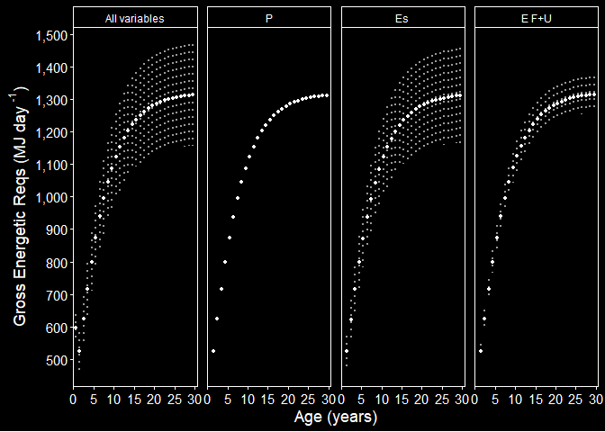

Gross Energetic Requirements(GER) Sensitivity Analysis - phase 2
================
Selina Agbayani
25 Jan 2022 - code updated 31 July, 2025

``` r
# Set path for output figures: 
Figurespath <- paste0(getwd(), "/gross_energetic_reqs/figures", collapse = NULL)
Figurespath
```

    ## [1] "C:/Users/AgbayaniS/Documents/R/graywhale_energyreqs/gross_energetic_reqs/figures"

``` r
# Set path for input & output data  
datapath <- paste0(getwd(), "/data", collapse = NULL) 
datapath
```

    ## [1] "C:/Users/AgbayaniS/Documents/R/graywhale_energyreqs/data"

``` r
## Read data in Activity Cost Reference, Production Cost, Es
A_cost_reference <- as_tibble(
  read_csv("data/ActivityCost_ReferenceData_BreathsPerDay_Table_VA_2017_original_sources.csv"),
  col_types = (list(cols(  ID = col_double(),
                           Lifestage = col_character(),
                           Description = col_character(),
                           Activity_stages = col_character(),
                           no_days = col_double(),
                           source_no_days = col_character(),
                           bpm = col_double(),
                           se_bpm = col_double(),
                           source_bpm = col_character(),
                           age_yrs = col_double(),
                           age_yrs_min = col_double(),
                           age_yrs_max = col_double(),
                           pct_O2 = col_double(),
                           pct_O2_sd = col_double()
  )
  )
  )
)
```

    ## Rows: 60 Columns: 14
    ## ── Column specification ────────────────────────────────────────────────────────
    ## Delimiter: ","
    ## chr (5): Lifestage, Description, Activity_stages, source_no_days, source_bpm
    ## dbl (9): ID, no_days, bpm, se_bpm, age_yrs, age_yrs_min, age_yrs_max, pct_O2...
    ## 
    ## ℹ Use `spec()` to retrieve the full column specification for this data.
    ## ℹ Specify the column types or set `show_col_types = FALSE` to quiet this message.

``` r
kable(A_cost_reference)
```

| ID | Lifestage | Description | Activity_stages | no_days | source_no_days | bpm | se_bpm | source_bpm | age_yrs | age_yrs_min | age_yrs_max | pct_O2 | pct_O2_sd |
|---:|:---|:---|:---|---:|:---|---:|---:|:---|---:|---:|---:|---:|---:|
| 1 | Calf | Lagoon 0-1 mths (Jan) | calving grounds | 31 | Sumich (1986); Findley & Vidal (2002); Pike 1962 | 2.14 | 0.50 | Sumich (1986) as cited in Villegas-Amtmann et al. 2017 | 0.0849315 | 0.0000100 | 0.0849315 | 10.5 | 3.0 |
| 2 | Calf | Lagoon 2 mth (Feb) | calving grounds | 28 | Sumich (1986); Findley & Vidal (2002); Pike 1962 | 1.56 | 0.40 | Sumich (1986) as cited in Villegas-Amtmann et al. 2017 | 0.1616438 | 0.0849315 | 0.1616438 | 10.5 | 3.0 |
| 3 | Calf | Lagoon 3 mths (Mar) | calving grounds | 15 | Sumich (1986); Findley & Vidal (2002); Rice and Wolman 1971 | 1.39 | 0.30 | Sumich (1986) as cited in Villegas-Amtmann et al. 2017 | 0.2465753 | 0.1616438 | 0.2465753 | 10.5 | 3.0 |
| 4 | Calf | Northbound 3 mths (Mar) | northbound | 16 | Rodriguez de la Gala Hernandez 2008; Perryman et al. 2010; Poole 1984; Rice and Wolman 1971; Leatherwood 1974 | 0.70 | 0.10 | Rodriguez de la Gala-Hernandez et al. (2008) | 0.2465753 | 0.1616438 | 0.2465753 | 10.5 | 3.0 |
| 5 | Calf | Northbound 4 mths (Apr) | northbound | 30 | Poole (1984); Rodriguez de la Gala Hernandez et al. 2008; Perryman et al. 2010; Leatherwood 1974 | 0.70 | 0.10 | Rodriguez de la Gala-Hernandez et al. (2008) | 0.3287671 | 0.2465753 | 0.3287671 | 10.5 | 3.0 |
| 6 | Calf | Northbound 5 mths (May) | northbound | 31 | Braham (1984), Poole (1984); Rodriguez de la Gala Hernandez et al. 2008; Perryman et al. 2010; Rice and Wolman 1971; Leatherwood 1974 | 0.70 | 0.10 | Rodriguez de la Gala-Hernandez et al. (2008) | 0.4136986 | 0.3287671 | 0.4136986 | 10.5 | 3.0 |
| 7 | Calf | Northbound 6 mths (June) | northbound | 23 | Hessing (1981) as cited in Braham (1984); | 0.70 | 0.10 | Rodriguez de la Gala-Hernandez et al. (2008) | 0.4958904 | 0.4136986 | 0.4958904 | 11.0 | 2.7 |
| 8 | Calf | Nursing at Foraging grounds 6 mths (June) | nursing at foraging grounds | 7 | Synchenko (2011); Bradford et al. 2012 | 1.22 | 0.30 | Sychenko (2011) | 0.4958904 | 0.4136986 | 0.4958904 | 11.0 | 2.7 |
| 9 | Calf | Nursing at Foraging grounds 7 mths (July) | nursing at foraging grounds | 31 | Mom/calf observations: Sychenko (2011), Bradford et al 2012; Weller et al. 2003 | 1.22 | 0.30 | Sychenko (2011) | 0.5808219 | 0.4958904 | 0.5808219 | 11.0 | 2.7 |
| 10 | Calf | Nursing at foraging grounds 8 mths (Aug) | nursing at foraging grounds | 31 | Mom/calf observations: Sychenko (2011), Bradford et al 2012; Weller et al. 2003 | 1.22 | 0.30 | Sychenko (2011) | 0.6657534 | 0.5808219 | 0.6657534 | 11.0 | 2.7 |
| 11 | Calf | Nursing at foraging grounds (Sep) | nursing at foraging grounds | 30 | Mom/calf observations: Sychenko (2011), Bradford et al 2012; Weller et al. 2003 | 1.22 | 0.30 | Sychenko (2011) | 0.7479452 | 0.6657534 | 0.7479452 | 11.0 | 2.7 |
| 12 | Calf | nursing at foraging grounds (Oct) | nursing at foraging grounds | 20 | for approx date of weaning (~9.6 mths): Agbayani et al. 2020, Weller et al. 2009 | 1.22 | 0.30 | Sychenko (2011) | 0.8328767 | 0.7479452 | 0.8328767 | 11.0 | 2.7 |
| 13 | Calf | Southbound post-weaning (Oct) | southbound post-weaning | 11 | Rugh et al. (2001), Braham (1984) | 0.72 | 0.20 | Sumich (1983); Schwarz (2002), as cited in Villegas-Amtmann 2017 | 0.8328767 | 0.7479452 | 0.9150685 | 11.0 | 2.7 |
| 14 | Calf | Southbound post-weaning (Nov) | southbound post-weaning | 30 | Sumich (1986), Rugh et al. (2001), | 0.72 | 0.20 | Sumich (1983); Schwarz (2002), as cited in Villegas-Amtmann 2017 | 0.9150685 | 0.8328767 | 1.0000000 | 11.0 | 2.7 |
| 15 | Calf | Southbound post-weaning (Dec) | southbound post-weaning | 31 | Sumich (1986), Rugh et al. (2001), Laake et al. (2012) | 0.72 | 0.20 | Sumich (1983); Schwarz (2002), as cited in Villegas-Amtmann 2017 | 1.0000000 | 0.9150685 | 1.0000000 | 11.0 | 2.7 |
| 16 | Pregnant | Southbound newly pregnant (Dec) | Southbound recently pregnant | 31 | Rice 1983; Rice and Wolman 1971 | 0.72 | 0.20 | Sumich (1983); Schwarz (2002), as cited in Villegas-Amtmann 2017 | NA | 8.0000000 | 75.0000000 | 11.0 | 2.7 |
| 17 | Pregnant | Lagoon breeding (Jan) | calving grounds recently pregnant | 31 | Rice 1983 | 0.62 | 0.20 | Harvey & Mate (1984), as cited in Villegas-Amtmann et al. 2017 | NA | 8.0000000 | 75.0000000 | 11.0 | 2.7 |
| 18 | Pregnant | Lagoon breeding (Feb) | calving grounds recently pregnant | 20 | Rice 1983 | 0.62 | 0.20 | Harvey & Mate (1984), as cited in Villegas-Amtmann et al. 2017 | NA | 8.0000000 | 75.0000000 | 11.0 | 2.7 |
| 19 | Pregnant | Northbound solo pregnant (Feb) | northbound pregnant | 8 | Rice 1983 | 0.50 | 0.20 | Rodriguez de la Gala-Hernandez et al. (2008) | NA | 8.0000000 | 75.0000000 | 11.0 | 2.7 |
| 20 | Pregnant | Northbound solo pregnant (Mar) | northbound pregnant | 31 | Rice 1983; Rice & Wolman (1971) | 0.50 | 0.20 | Rodriguez de la Gala-Hernandez et al. (2008) | NA | 8.0000000 | 75.0000000 | 11.0 | 2.7 |
| 21 | Pregnant | Northbound solo pregnant (Apr) | northbound pregnant | 30 | Rice 1983; Rice & Wolman (1971) | 0.50 | 0.20 | Rodriguez de la Gala-Hernandez et al. (2008) | NA | 8.0000000 | 75.0000000 | 11.0 | 2.7 |
| 22 | Pregnant | Northbound pregnant (May) | northbound pregnant | 31 | Rice 1983 | 0.50 | 0.20 | Rodriguez de la Gala-Hernandez et al. (2008) | NA | 8.0000000 | 75.0000000 | 11.0 | 2.7 |
| 23 | Pregnant | Foraging pregnant (june) | foraging pregnant | 30 | Rice 1983; Rice & Wolman (1971) | 1.34 | 0.10 | O. Sychenko (unpubl.) | NA | 8.0000000 | 75.0000000 | 11.0 | 2.7 |
| 24 | Pregnant | Foraging pregnant (july) | foraging pregnant | 31 | Rice 1983 | 1.34 | 0.10 | O. Sychenko (unpubl.) | NA | 8.0000000 | 75.0000000 | 11.0 | 2.7 |
| 25 | Pregnant | Foraging pregnant (Aug) | foraging pregnant | 31 | Rice 1983 | 1.34 | 0.10 | O. Sychenko (unpubl.) | NA | 8.0000000 | 75.0000000 | 11.0 | 2.7 |
| 26 | Pregnant | Foraging pregnant (Sep) | foraging pregnant | 30 | Rice 1983 | 1.34 | 0.10 | O. Sychenko (unpubl.) | NA | 8.0000000 | 75.0000000 | 11.0 | 2.7 |
| 27 | Pregnant | Foraging pregnant (Oct) | foraging pregnant | 31 | Rice 1983 | 1.34 | 0.10 | O. Sychenko (unpubl.) | NA | 8.0000000 | 75.0000000 | 11.0 | 2.7 |
| 28 | Pregnant | Southbound pregnant (Nov) | southbound pregnant | 30 | Rice 1983; Sumich (1986), | 0.72 | 0.20 | Sumich (1983) and Schwarz (2002) | NA | 8.0000000 | 75.0000000 | 11.0 | 2.7 |
| 29 | Pregnant | Southbound pregnant (Dec) | southbound pregnant | 31 | Rice 1983; Sumich (1986), | 0.72 | 0.20 | Sumich (1983) and Schwarz (2002) | NA | 8.0000000 | 75.0000000 | 11.0 | 2.7 |
| 30 | Lactating | Lagoon lactating (Jan) | calving grounds lactating | 31 | Rice 1983; Sumich (1986); Findley & Vidal (2002); Pike 1962 | 0.62 | 0.20 | Harvey & Mate (1984) | NA | 8.0000000 | 75.0000000 | 11.0 | 2.7 |
| 31 | Lactating | Lagoon lactating (Feb) | calving grounds lactating | 28 | Rice 1983; Sumich (1986); Findley & Vidal (2002); Rugh et al. 2001 | 0.62 | 0.20 | Harvey & Mate (1984) | NA | 8.0000000 | 75.0000000 | 11.0 | 2.7 |
| 32 | Lactating | Lagoon lactating (March) | calving grounds lactating | 15 | (coincides with NB calves) Sumich (1986); Findley & Vidal (2002); Rugh et al. 2001; Rodriguez de la Gala Hernandez 2008 | 0.62 | 0.20 | Harvey & Mate (1984) | NA | 8.0000000 | 75.0000000 | 11.0 | 2.7 |
| 33 | Lactating | Northbound with calf (March) | northbound lactating | 16 | Rodriguez de la Gala Hernandez 2008; Poole 1984; Perryman et al. 2010; Leatherwood (1974) | 0.50 | 0.10 | Rodriguez de la Gala-Hernandez et al. (2008) | NA | 8.0000000 | 75.0000000 | 11.0 | 2.7 |
| 34 | Lactating | Northbound with calf (April) | northbound lactating | 30 | Braham (1984), Poole (1984); Rodriguez de la Gala Hernandez et al. 2008; Perryman et al. 2010; Leatherwood 1974; Rice and Wolman (1971) | 0.50 | 0.10 | Rodriguez de la Gala-Hernandez et al. (2008) | NA | 8.0000000 | 75.0000000 | 11.0 | 2.7 |
| 35 | Lactating | Northbound with calf (May) | northbound lactating | 31 | Braham (1984), Poole (1984); Rodriguez de la Gala Hernandez et al. 2008; Perryman et al. 2010; Leatherwood 1974; | 0.50 | 0.10 | Rodriguez de la Gala-Hernandez et al. (2008) | NA | 8.0000000 | 75.0000000 | 11.0 | 2.7 |
| 36 | Lactating | Northbound with Calf (June) | northbound lactating | 23 | Hessing (1981) as cited in Braham (1984) | 0.50 | 0.10 | Rodriguez de la Gala-Hernandez et al. (2008) | NA | 8.0000000 | 75.0000000 | 11.0 | 2.7 |
| 37 | Lactating | Foraging lactating (June) | foraging lactating | 7 | Mom/calf observations: Synchenko (2011) | 1.04 | 0.20 | O. Sychenko (unpubl.) | NA | 8.0000000 | 75.0000000 | 11.0 | 2.7 |
| 38 | Lactating | Foraging lactating (July) | foraging lactating | 31 | Mom/calf observations: Sychenko (2011), Bradford et al 2012 | 1.04 | 0.20 | O. Sychenko (unpubl.) | NA | 8.0000000 | 75.0000000 | 11.0 | 2.7 |
| 39 | Lactating | Foraging lactating (Aug) | foraging lactating | 31 | Mom/calf observations: Sychenko (2011), Bradford et al 2012 | 1.04 | 0.20 | O. Sychenko (unpubl.) | NA | 8.0000000 | 75.0000000 | 11.0 | 2.7 |
| 40 | Lactating | Foraging lactating (Sep) | foraging lactating | 30 | Mom/calf observations: Sychenko (2011), Bradford et al 2012 | 1.04 | 0.20 | O. Sychenko (unpubl.) | NA | 8.0000000 | 75.0000000 | 11.0 | 2.7 |
| 41 | Lactating | Foraging lactating (Oct) | foraging lactating | 20 | for approx date of weaning (~9.6 mths): Agbayani et al. 2020, Weller et al. 2009 | 1.04 | 0.20 | O. Sychenko (unpubl.) | NA | 8.0000000 | 75.0000000 | 11.0 | 2.7 |
| 42 | Lactating | Southbound post-weaning (Oct) | southbound post-weaning | 11 | Braham (1984); Rugh et al. (2001); Rodriguez de la Gala-Hernandez (2008); Pike (1962) | 0.72 | 0.20 | Sumich (1983) and Schwarz (2002) | NA | 8.0000000 | 75.0000000 | 11.0 | 2.7 |
| 43 | Lactating | Southbound post-weaning (Nov) | southbound post-weaning | 30 | Rugh et al. 2001; Braham (1984); Rodriguez de la Gala-Hernandez (2008) | 0.72 | 0.20 | Sumich (1983) and Schwarz (2002) | NA | 8.0000000 | 75.0000000 | 11.0 | 2.7 |
| 44 | Lactating | Southbound postweaning (Dec) | southbound post-weaning | 31 | Rugh et al. 2001; Braham (1984); Rodriguez de la Gala-Hernandez (2008); Sumich 1986 | 0.72 | 0.20 | Sumich (1983) and Schwarz (2002) | NA | 8.0000000 | 75.0000000 | 11.0 | 2.7 |
| 45 | Juvenile/Adult | Southbound solo (Jan) | southbound | 15 | Rodriguez de la Gala-Hernandez (2008); Sumich 1986 | 0.72 | 0.20 | Sumich (1983) and Schwarz (2002) | NA | 1.0000000 | 75.0000000 | 11.0 | 2.7 |
| 46 | Juvenile/Adult | Lagoon solo (Jan) | calving grounds | 16 | Sumich (1986), Findley & Vidal (2002); Rice and Wolman 1971; Findley and Vidal 2002 | 0.62 | 0.20 | Harvey & Mate (1984), Sumich (1986) | NA | 1.0000000 | 75.0000000 | 11.0 | 2.7 |
| 47 | Juvenile/Adult | Lagoon solo (Feb) | calving grounds | 14 | Rice and Wolman (1971); Findley & Vidal (2002); Urban et al. 2021; Rugh et al. 2001 | 0.62 | 0.20 | Harvey & Mate (1984), Sumich (1986) | NA | 1.0000000 | 75.0000000 | 11.0 | 2.7 |
| 48 | Juvenile/Adult | Northbound solo (Feb) | northbound | 14 | Rice and Wolman (1971); Poole (1984), Pike (1962), Rodriguez de la Gala Hernandez et al. 2008; Sumich (1986) | 0.50 | 0.03 | Rodriguez de la Gala-Hernandez et al. (2008) | NA | 1.0000000 | 75.0000000 | 11.0 | 2.7 |
| 49 | Juvenile/Adult | Northbound solo (March) | northbound | 31 | Rice and Wolman (1971); Poole (1984), Pike (1962), Rodriguez de la Gala Hernandez et al. 2008; Braham (1984); Urban et al. 2021 (Maria started migrating March 9); Leatherwood 1974 | 0.50 | 0.03 | Rodriguez de la Gala-Hernandez et al. (2008) | NA | 1.0000000 | 75.0000000 | 11.0 | 2.7 |
| 50 | Juvenile/Adult | Northbound solo (April) | northbound | 30 | Rice and Wolman (1971) \*data ends in April; Poole (1984), Pike (1962), Rodriguez de la Gala Hernandez et al. 2008; Braham (1984); Urban et al. 2021 | 0.50 | 0.03 | Rodriguez de la Gala-Hernandez et al. (2008) | NA | 1.0000000 | 75.0000000 | 11.0 | 2.7 |
| 51 | Juvenile/Adult | Northbound solo (May) | northbound | 15 | Poole (1984), Pike (1962), Rodriguez de la Gala Hernandez et al. 2008; Braham (1984); Urban et al. 2021 (Maria stopped migrating May 24) | 0.50 | 0.03 | Rodriguez de la Gala-Hernandez et al. (2008) | NA | 1.0000000 | 75.0000000 | 11.0 | 2.7 |
| 52 | Juvenile/Adult | Foraging solo (May) | foraging | 16 | Kim and Oliver (1989); Heide-Jorgensen et al. (2012); 5 months (May to Oct); Urban et al. 2021 | 1.04 | 0.20 | O. Sychenko (unpubl.) | NA | 1.0000000 | 75.0000000 | 11.0 | 2.7 |
| 53 | Juvenile/Adult | Foraging solo (June) | foraging | 30 | Kim and Oliver (1989); Pike (1962); Heide-Jorgensen et al. (2012); Urban et al. 2021 | 1.04 | 0.20 | O. Sychenko (unpubl.) | NA | 1.0000000 | 75.0000000 | 11.0 | 2.7 |
| 54 | Juvenile/Adult | Foraging solo (July) | foraging | 31 | Kim and Oliver (1989); Pike (1962); Heide-Jorgensen et al. (2012); Urban et al. 2021; Bradford et al. 2012 | 1.04 | 0.20 | O. Sychenko (unpubl.) | NA | 1.0000000 | 75.0000000 | 11.0 | 2.7 |
| 55 | Juvenile/Adult | Foraging solo (Aug) | foraging | 31 | Pike (1962); Heide-Jorgensen et al. (2012); Bradford et al. 2012 | 1.04 | 0.20 | O. Sychenko (unpubl.) | NA | 1.0000000 | 75.0000000 | 11.0 | 2.7 |
| 56 | Juvenile/Adult | Foraging solo (Sep) | foraging | 30 | Pike (1962); Heide-Jorgensen et al. (2012); Bradford et al. 2012 | 1.04 | 0.20 | O. Sychenko (unpubl.) | NA | 1.0000000 | 75.0000000 | 11.0 | 2.7 |
| 57 | Juvenile/Adult | Foraging solo (Oct) | foraging | 16 | Kim and Oliver (1989); Pike (1962); Heide-Jorgensen et al. (2012); Bradford et al. 2012; Rugh et al. 2001 | 1.04 | 0.20 | O. Sychenko (unpubl.) | NA | 1.0000000 | 75.0000000 | 11.0 | 2.7 |
| 58 | Juvenile/Adult | Southbound (Oct) | southbound | 15 | Rugh et al. 2001; Braham (1984); Rodriguez de la Gala-Hernandez (2008); Pike (1962) | 0.72 | 0.20 | Sumich (1983); Schwarz (2002); Villegas-Amtmann 2017 | NA | 1.0000000 | 75.0000000 | 11.0 | 2.7 |
| 59 | Juvenile/Adult | Southbound (Nov) | southbound | 30 | Sumich (1986), Rugh et al. (2001), Braham 1984; | 0.72 | 0.20 | Sumich (1983); Schwarz (2002); Villegas-Amtmann 2017 | NA | 1.0000000 | 75.0000000 | 11.0 | 2.7 |
| 60 | Juvenile/Adult | Southbound (Dec) | southbound | 31 | Sumich (1986), Laake et al. (2012); Pike 1962; Rugh et al. (2001), Braham (1984); Leatherwood (1974) | 0.72 | 0.20 | Sumich (1983); Schwarz (2002); Villegas-Amtmann 2017 | NA | 1.0000000 | 75.0000000 | 11.0 | 2.7 |

``` r
Activity_days <- A_cost_reference %>% select(Lifestage, Activity_stages, no_days) %>%  
  group_by(Lifestage, Activity_stages) %>% 
  summarise(no_days = sum(no_days))
```

    ## `summarise()` has grouped output by 'Lifestage'. You can override using the
    ## `.groups` argument.

``` r
kable(Activity_days)
```

| Lifestage      | Activity_stages                   | no_days |
|:---------------|:----------------------------------|--------:|
| Calf           | calving grounds                   |      74 |
| Calf           | northbound                        |     100 |
| Calf           | nursing at foraging grounds       |     119 |
| Calf           | southbound post-weaning           |      72 |
| Juvenile/Adult | calving grounds                   |      30 |
| Juvenile/Adult | foraging                          |     154 |
| Juvenile/Adult | northbound                        |      90 |
| Juvenile/Adult | southbound                        |      91 |
| Lactating      | calving grounds lactating         |      74 |
| Lactating      | foraging lactating                |     119 |
| Lactating      | northbound lactating              |     100 |
| Lactating      | southbound post-weaning           |      72 |
| Pregnant       | Southbound recently pregnant      |      31 |
| Pregnant       | calving grounds recently pregnant |      51 |
| Pregnant       | foraging pregnant                 |     153 |
| Pregnant       | northbound pregnant               |     100 |
| Pregnant       | southbound pregnant               |      61 |

``` r
activity_stages <- Activity_days$Activity_stages


P_cost_table_peryear <- as_tibble(
  read_csv("data/P_cost_table_peryear.csv"), 
  col_types = (list(cols(age_yrs = col_double(),
                         mean_masschange = col_double(),
                         sd_masschange = col_double(),
                         sex = col_character(),
                         mean_P = col_double(),
                         sd_P = col_double(),
                         p_lipid = col_double(),
                         p_protein = col_double()
  )
  )
  )
)
```

    ## Rows: 228 Columns: 18
    ## ── Column specification ────────────────────────────────────────────────────────
    ## Delimiter: ","
    ## chr  (1): sex
    ## dbl (17): age_yrs, mean_masschange, sd_masschange, mean_P, sd_P, p_lipid, p_...
    ## 
    ## ℹ Use `spec()` to retrieve the full column specification for this data.
    ## ℹ Specify the column types or set `show_col_types = FALSE` to quiet this message.

``` r
kable(head(P_cost_table_peryear))
```

| age_yrs | mean_masschange | sd_masschange | sex | mean_P | sd_P | p_lipid | p_protein | mean_P_perday | sd_P_perday | mean_mass | sd_mass | mean_lwr | mean_upr | quant025 | quant975 | female_mass | male_mass |
|---:|---:|---:|:---|---:|---:|---:|---:|---:|---:|---:|---:|---:|---:|---:|---:|---:|---:|
| 0 | 986.5516 | 20.89449 | Female | 17057.91 | 767.1217 | 0.3599891 | 0.126000 | 46.73400 | 2.101703 | 983.0272 | 26.7677 | 769.3864 | 1256.003 | 931.5244 | 1036.295 | 1011.028 | 967.3705 |
| 1 | 5257.8958 | 136.87045 | Female | 87307.45 | 4264.4399 | 0.3599891 | 0.097200 | 239.19848 | 11.683397 | 6072.8559 | 202.1109 | 5535.5539 | 6662.311 | 5685.3490 | 6476.221 | 6245.837 | 5976.1335 |
| 2 | 1642.6730 | 31.11877 | Female | 27674.88 | 1242.4542 | 0.3599891 | 0.107388 | 75.82158 | 3.403984 | 7675.1795 | 162.2450 | 6967.9413 | 8454.206 | 7362.0875 | 7997.123 | 7893.802 | 7552.9369 |
| 3 | 1577.4600 | 11.13125 | Female | 26576.14 | 1096.3455 | 0.3599891 | 0.107388 | 72.81134 | 3.003686 | 9210.7914 | 147.9849 | 8289.2833 | 10234.752 | 8924.5190 | 9503.733 | 9473.155 | 9064.0911 |
| 4 | 1470.3573 | 6.62462 | Female | 24771.72 | 1012.7120 | 0.3599891 | 0.107388 | 67.86773 | 2.774553 | 10639.3400 | 156.4716 | 9483.1963 | 11936.449 | 10336.4523 | 10948.882 | 10942.395 | 10469.8872 |
| 5 | 1339.2771 | 14.69623 | Female | 22563.39 | 950.3335 | 0.3599891 | 0.107388 | 61.81750 | 2.603653 | 11939.1149 | 175.2988 | 10546.1836 | 13516.043 | 11599.7789 | 12285.898 | 12279.193 | 11748.9607 |

``` r
P_cost_table_peryear$Ts <- 365


Es_table_phase2_peryear <- as_tibble(
  read_csv("data/Es_sensAnalysis_phase2_peryear_source_bpm.csv"),
  col_types = (list(cols(age_yrs = col_double(),
                         Lifestage = col_character(),
                         no_days = col_double(),
                         Es = col_double(),
                         Es_sd = col_double()
  )
  )
  )
)
```

    ## Rows: 124 Columns: 8
    ## ── Column specification ────────────────────────────────────────────────────────
    ## Delimiter: ","
    ## chr (2): Lifestage, MC_variable
    ## dbl (6): age_yrs, no_days, Es, Es_sd, Es_perday, Es_sd_perday
    ## 
    ## ℹ Use `spec()` to retrieve the full column specification for this data.
    ## ℹ Specify the column types or set `show_col_types = FALSE` to quiet this message.

``` r
Es_table_phase2_peryear <- Es_table_phase2_peryear %>%  filter(age_yrs >=1)
kable(Es_table_phase2_peryear)
```

| age_yrs | Lifestage | no_days | MC_variable | Es | Es_sd | Es_perday | Es_sd_perday |
|---:|:---|---:|:---|---:|---:|---:|---:|
| 1 | Juvenile/Adult | 365 | all | 75457.81 | 12518.28267 | 206.7337 | 34.2966648 |
| 1 | Juvenile/Adult | 365 | Rs | 75047.50 | 94.57329 | 205.6096 | 0.2591049 |
| 1 | Juvenile/Adult | 365 | Vt | 75046.30 | 1078.61913 | 205.6063 | 2.9551209 |
| 1 | Juvenile/Adult | 365 | pctO2 | 75034.69 | 11445.85121 | 205.5745 | 31.3584965 |
| 2 | Juvenile/Adult | 365 | all | 126487.60 | 21281.57052 | 346.5414 | 58.3056727 |
| 2 | Juvenile/Adult | 365 | Rs | 125675.60 | 158.37376 | 344.3167 | 0.4339007 |
| 2 | Juvenile/Adult | 365 | Vt | 125673.25 | 2122.38491 | 344.3103 | 5.8147532 |
| 2 | Juvenile/Adult | 365 | pctO2 | 125654.15 | 19167.38357 | 344.2579 | 52.5133797 |
| 3 | Juvenile/Adult | 365 | all | 156420.50 | 25551.35866 | 428.5493 | 70.0037224 |
| 3 | Juvenile/Adult | 365 | Rs | 155736.56 | 196.25597 | 426.6755 | 0.5376876 |
| 3 | Juvenile/Adult | 365 | Vt | 155734.56 | 1814.93169 | 426.6700 | 4.9724156 |
| 3 | Juvenile/Adult | 365 | pctO2 | 155709.98 | 23752.12469 | 426.6027 | 65.0743142 |
| 4 | Juvenile/Adult | 365 | all | 184971.74 | 29896.36534 | 506.7719 | 81.9078502 |
| 4 | Juvenile/Adult | 365 | Rs | 184296.49 | 232.24659 | 504.9219 | 0.6362920 |
| 4 | Juvenile/Adult | 365 | Vt | 184294.49 | 1809.55783 | 504.9164 | 4.9576927 |
| 4 | Juvenile/Adult | 365 | pctO2 | 184265.03 | 28107.93451 | 504.8357 | 77.0080398 |
| 5 | Juvenile/Adult | 365 | all | 211452.02 | 34119.32392 | 579.3206 | 93.4775998 |
| 5 | Juvenile/Adult | 365 | Rs | 210703.97 | 265.52475 | 577.2712 | 0.7274651 |
| 5 | Juvenile/Adult | 365 | Vt | 210701.76 | 2008.52015 | 577.2651 | 5.5027949 |
| 5 | Juvenile/Adult | 365 | pctO2 | 210668.01 | 32135.46623 | 577.1726 | 88.0423732 |
| 6 | Juvenile/Adult | 365 | all | 235458.26 | 37994.04071 | 645.0911 | 104.0932622 |
| 6 | Juvenile/Adult | 365 | Rs | 234624.82 | 295.66930 | 642.8077 | 0.8100529 |
| 6 | Juvenile/Adult | 365 | Vt | 234622.35 | 2237.74500 | 642.8010 | 6.1308082 |
| 6 | Juvenile/Adult | 365 | pctO2 | 234584.77 | 35783.74774 | 642.6980 | 98.0376651 |
| 7 | Juvenile/Adult | 365 | all | 256849.85 | 41415.97886 | 703.6982 | 113.4684352 |
| 7 | Juvenile/Adult | 365 | Rs | 255953.20 | 322.54688 | 701.2416 | 0.8836901 |
| 7 | Juvenile/Adult | 365 | Vt | 255950.54 | 2409.55962 | 701.2344 | 6.6015332 |
| 7 | Juvenile/Adult | 365 | pctO2 | 255909.51 | 39036.64049 | 701.1220 | 106.9497000 |
| 8 | Juvenile/Adult | 365 | all | 275662.54 | 44363.30472 | 755.2398 | 121.5433006 |
| 8 | Juvenile/Adult | 365 | Rs | 274736.32 | 346.21698 | 752.7023 | 0.9485397 |
| 8 | Juvenile/Adult | 365 | Vt | 274733.58 | 2495.21620 | 752.6947 | 6.8362088 |
| 8 | Juvenile/Adult | 365 | pctO2 | 274689.43 | 41901.34471 | 752.5738 | 114.7982047 |
| 9 | Juvenile/Adult | 365 | all | 292030.30 | 46837.22179 | 800.0830 | 128.3211556 |
| 9 | Juvenile/Adult | 365 | Rs | 291116.28 | 366.85866 | 797.5788 | 1.0050922 |
| 9 | Juvenile/Adult | 365 | Vt | 291113.56 | 2474.57164 | 797.5714 | 6.7796483 |
| 9 | Juvenile/Adult | 365 | pctO2 | 291066.59 | 44399.52925 | 797.4427 | 121.6425459 |
| 10 | Juvenile/Adult | 365 | all | 306185.77 | 48956.50772 | 838.8651 | 134.1274184 |
| 10 | Juvenile/Adult | 365 | Rs | 305290.81 | 384.72110 | 836.4132 | 1.0540304 |
| 10 | Juvenile/Adult | 365 | Vt | 305288.13 | 2435.54694 | 836.4058 | 6.6727313 |
| 10 | Juvenile/Adult | 365 | pctO2 | 305238.70 | 46561.35414 | 836.2704 | 127.5653538 |
| 11 | Juvenile/Adult | 365 | all | 318329.22 | 50708.00048 | 872.1348 | 138.9260287 |
| 11 | Juvenile/Adult | 365 | Rs | 317478.56 | 400.07985 | 869.8043 | 1.0961092 |
| 11 | Juvenile/Adult | 365 | Vt | 317476.01 | 2332.30220 | 869.7973 | 6.3898690 |
| 11 | Juvenile/Adult | 365 | pctO2 | 317424.37 | 48420.16652 | 869.6558 | 132.6579905 |
| 12 | Juvenile/Adult | 365 | all | 328713.98 | 52195.40962 | 900.5863 | 143.0011223 |
| 12 | Juvenile/Adult | 365 | Rs | 327905.62 | 413.21982 | 898.3716 | 1.1321091 |
| 12 | Juvenile/Adult | 365 | Vt | 327903.18 | 2233.40004 | 898.3649 | 6.1189042 |
| 12 | Juvenile/Adult | 365 | pctO2 | 327849.65 | 50010.44692 | 898.2182 | 137.0149231 |
| 13 | Juvenile/Adult | 365 | all | 337554.03 | 53444.30612 | 924.8056 | 146.4227565 |
| 13 | Juvenile/Adult | 365 | Rs | 336788.94 | 424.41439 | 922.7094 | 1.1627792 |
| 13 | Juvenile/Adult | 365 | Vt | 336786.62 | 2131.46925 | 922.7031 | 5.8396418 |
| 13 | Juvenile/Adult | 365 | pctO2 | 336731.46 | 51365.28488 | 922.5519 | 140.7268079 |
| 14 | Juvenile/Adult | 365 | all | 345065.57 | 54518.57740 | 945.3851 | 149.3659655 |
| 14 | Juvenile/Adult | 365 | Rs | 344331.78 | 433.91972 | 943.3747 | 1.1888212 |
| 14 | Juvenile/Adult | 365 | Vt | 344329.54 | 2058.81163 | 943.3686 | 5.6405798 |
| 14 | Juvenile/Adult | 365 | pctO2 | 344273.01 | 52515.67904 | 943.2137 | 143.8785727 |
| 15 | Juvenile/Adult | 365 | all | 351429.16 | 55437.19755 | 962.8196 | 151.8827330 |
| 15 | Juvenile/Adult | 365 | Rs | 350718.32 | 441.96791 | 960.8721 | 1.2108710 |
| 15 | Juvenile/Adult | 365 | Vt | 350716.15 | 2006.34703 | 960.8662 | 5.4968412 |
| 15 | Juvenile/Adult | 365 | pctO2 | 350658.46 | 53489.72107 | 960.7081 | 146.5471810 |
| 16 | Juvenile/Adult | 365 | all | 356819.33 | 56248.91717 | 977.5872 | 154.1066224 |
| 16 | Juvenile/Adult | 365 | Rs | 356113.79 | 448.76717 | 975.6542 | 1.2294991 |
| 16 | Juvenile/Adult | 365 | Vt | 356111.63 | 1996.99601 | 975.6483 | 5.4712220 |
| 16 | Juvenile/Adult | 365 | pctO2 | 356053.02 | 54312.61011 | 975.4877 | 148.8016715 |
| 17 | Juvenile/Adult | 365 | all | 361371.90 | 56953.04969 | 990.0600 | 156.0357526 |
| 17 | Juvenile/Adult | 365 | Rs | 360663.05 | 454.50005 | 988.1180 | 1.2452056 |
| 17 | Juvenile/Adult | 365 | Vt | 360660.88 | 2008.40421 | 988.1120 | 5.5024773 |
| 17 | Juvenile/Adult | 365 | pctO2 | 360601.50 | 55006.43924 | 987.9493 | 150.7025733 |
| 18 | Juvenile/Adult | 365 | all | 365215.54 | 57573.59527 | 1000.5905 | 157.7358775 |
| 18 | Juvenile/Adult | 365 | Rs | 364492.94 | 459.32640 | 998.6108 | 1.2584285 |
| 18 | Juvenile/Adult | 365 | Vt | 364490.73 | 2045.13187 | 998.6047 | 5.6031010 |
| 18 | Juvenile/Adult | 365 | pctO2 | 364430.73 | 55590.55373 | 998.4404 | 152.3028869 |
| 19 | Juvenile/Adult | 365 | all | 368463.16 | 58135.17065 | 1009.4881 | 159.2744401 |
| 19 | Juvenile/Adult | 365 | Rs | 367713.29 | 463.38461 | 1007.4337 | 1.2695469 |
| 19 | Juvenile/Adult | 365 | Vt | 367711.00 | 2114.93852 | 1007.4274 | 5.7943521 |
| 19 | Juvenile/Adult | 365 | pctO2 | 367650.53 | 56081.70436 | 1007.2617 | 153.6485051 |
| 20 | Juvenile/Adult | 365 | all | 371195.25 | 58618.69272 | 1016.9733 | 160.5991581 |
| 20 | Juvenile/Adult | 365 | Rs | 370417.77 | 466.79274 | 1014.8432 | 1.2788842 |
| 20 | Juvenile/Adult | 365 | Vt | 370415.40 | 2185.26945 | 1014.8367 | 5.9870396 |
| 20 | Juvenile/Adult | 365 | pctO2 | 370354.55 | 56494.17734 | 1014.6700 | 154.7785681 |
| 21 | Juvenile/Adult | 365 | all | 373496.75 | 59046.96312 | 1023.2788 | 161.7725017 |
| 21 | Juvenile/Adult | 365 | Rs | 372687.21 | 469.65264 | 1021.0608 | 1.2867196 |
| 21 | Juvenile/Adult | 365 | Vt | 372684.74 | 2266.42526 | 1021.0541 | 6.2093843 |
| 21 | Juvenile/Adult | 365 | pctO2 | 372623.60 | 56840.30003 | 1020.8866 | 155.7268494 |
| 22 | Juvenile/Adult | 365 | all | 375431.00 | 59417.60585 | 1028.5781 | 162.7879612 |
| 22 | Juvenile/Adult | 365 | Rs | 374590.02 | 472.05052 | 1026.2740 | 1.2932891 |
| 22 | Juvenile/Adult | 365 | Vt | 374587.47 | 2345.88338 | 1026.2670 | 6.4270778 |
| 22 | Juvenile/Adult | 365 | pctO2 | 374526.09 | 57130.50698 | 1026.0989 | 156.5219369 |
| 23 | Juvenile/Adult | 365 | all | 377059.22 | 59746.64459 | 1033.0390 | 163.6894372 |
| 23 | Juvenile/Adult | 365 | Rs | 376184.61 | 474.06000 | 1030.6428 | 1.2987945 |
| 23 | Juvenile/Adult | 365 | Vt | 376181.96 | 2430.64699 | 1030.6355 | 6.6593068 |
| 23 | Juvenile/Adult | 365 | pctO2 | 376120.41 | 57373.70634 | 1030.4669 | 157.1882365 |
| 24 | Juvenile/Adult | 365 | all | 378426.18 | 60030.65572 | 1036.7841 | 164.4675499 |
| 24 | Juvenile/Adult | 365 | Rs | 377520.09 | 475.74294 | 1034.3016 | 1.3034053 |
| 24 | Juvenile/Adult | 365 | Vt | 377517.35 | 2510.00434 | 1034.2941 | 6.8767242 |
| 24 | Juvenile/Adult | 365 | pctO2 | 377455.66 | 57577.38611 | 1034.1251 | 157.7462633 |
| 25 | Juvenile/Adult | 365 | all | 379570.57 | 60268.86162 | 1039.9194 | 165.1201688 |
| 25 | Juvenile/Adult | 365 | Rs | 378637.93 | 477.15162 | 1037.3642 | 1.3072647 |
| 25 | Juvenile/Adult | 365 | Vt | 378635.12 | 2576.94994 | 1037.3565 | 7.0601368 |
| 25 | Juvenile/Adult | 365 | pctO2 | 378573.31 | 57747.87379 | 1037.1872 | 158.2133529 |
| 26 | Juvenile/Adult | 365 | all | 380535.93 | 60487.07688 | 1042.5642 | 165.7180188 |
| 26 | Juvenile/Adult | 365 | Rs | 379573.65 | 478.33080 | 1039.9278 | 1.3104953 |
| 26 | Juvenile/Adult | 365 | Vt | 379570.76 | 2651.56609 | 1039.9199 | 7.2645646 |
| 26 | Juvenile/Adult | 365 | pctO2 | 379508.87 | 57890.58504 | 1039.7503 | 158.6043426 |
| 27 | Juvenile/Adult | 365 | all | 381342.59 | 60667.57593 | 1044.7742 | 166.2125368 |
| 27 | Juvenile/Adult | 365 | Rs | 380356.32 | 479.31710 | 1042.0721 | 1.3131975 |
| 27 | Juvenile/Adult | 365 | Vt | 380353.36 | 2712.02101 | 1042.0640 | 7.4301946 |
| 27 | Juvenile/Adult | 365 | pctO2 | 380291.41 | 58009.95340 | 1041.8943 | 158.9313792 |
| 28 | Juvenile/Adult | 365 | all | 382019.95 | 60825.23392 | 1046.6300 | 166.6444765 |
| 28 | Juvenile/Adult | 365 | Rs | 381010.98 | 480.14209 | 1043.8657 | 1.3154578 |
| 28 | Juvenile/Adult | 365 | Vt | 381007.95 | 2769.20235 | 1043.8574 | 7.5868557 |
| 28 | Juvenile/Adult | 365 | pctO2 | 380945.95 | 58109.79867 | 1043.6875 | 159.2049279 |
| 29 | Juvenile/Adult | 365 | all | 382587.60 | 60960.24175 | 1048.1852 | 167.0143610 |
| 29 | Juvenile/Adult | 365 | Rs | 381558.40 | 480.83194 | 1045.3655 | 1.3173478 |
| 29 | Juvenile/Adult | 365 | Vt | 381555.32 | 2820.17085 | 1045.3570 | 7.7264955 |
| 29 | Juvenile/Adult | 365 | pctO2 | 381493.28 | 58193.28871 | 1045.1871 | 159.4336677 |
| 30 | Juvenile/Adult | 365 | all | 383061.37 | 61071.25849 | 1049.4832 | 167.3185164 |
| 30 | Juvenile/Adult | 365 | Rs | 382015.98 | 481.40856 | 1046.6191 | 1.3189276 |
| 30 | Juvenile/Adult | 365 | Vt | 382012.84 | 2860.97979 | 1046.6105 | 7.8383008 |
| 30 | Juvenile/Adult | 365 | pctO2 | 381950.78 | 58263.07544 | 1046.4405 | 159.6248642 |
| 31 | Juvenile/Adult | 365 | all | 383462.13 | 61175.57363 | 1050.5812 | 167.6043113 |
| 31 | Juvenile/Adult | 365 | Rs | 382398.68 | 481.89083 | 1047.6676 | 1.3202489 |
| 31 | Juvenile/Adult | 365 | Vt | 382395.49 | 2906.44302 | 1047.6589 | 7.9628576 |
| 31 | Juvenile/Adult | 365 | pctO2 | 382333.41 | 58321.44278 | 1047.4888 | 159.7847747 |

``` r
mass_table <- as_tibble(
  read_csv("data/mass_table.csv"), 
  col_types = (list(cols(age_yrs = col_double(),
                         mean_mass = col_double(),
                         sd_mass = col_double(),
                         mean_lwr = col_double(),
                         mean_upr = col_double(),
                         quant025 = col_double(),
                         quant975 = col_double(),
                         female_mass = col_double(),
                         male_mass = col_double()
  )
  )
  )
)
```

    ## Rows: 173 Columns: 9
    ## ── Column specification ────────────────────────────────────────────────────────
    ## Delimiter: ","
    ## dbl (9): age_yrs, mean_mass, sd_mass, mean_lwr, mean_upr, quant025, quant975...
    ## 
    ## ℹ Use `spec()` to retrieve the full column specification for this data.
    ## ℹ Specify the column types or set `show_col_types = FALSE` to quiet this message.

``` r
mean_masschange_peryear <- as_tibble(
  read_csv("data/mean_masschange_per_year.csv"),
  col_types = (list(cols(age_yrs = col_double(),
                         mean_masschange = col_double(),
                         sd_masschange = col_double(),
                         sex = col_character()
  )
  )
  )
)
```

    ## Rows: 228 Columns: 4
    ## ── Column specification ────────────────────────────────────────────────────────
    ## Delimiter: ","
    ## chr (1): sex
    ## dbl (3): age_yrs, mean_masschange, sd_masschange
    ## 
    ## ℹ Use `spec()` to retrieve the full column specification for this data.
    ## ℹ Specify the column types or set `show_col_types = FALSE` to quiet this message.

``` r
mean_masschange_peryear <- mean_masschange_peryear %>% dplyr::filter(age_yrs >= 0)
kable(head(mean_masschange_peryear))
```

| age_yrs | mean_masschange | sd_masschange | sex |
|--------:|----------------:|--------------:|:----|
|       0 |        982.8522 |     27.098452 | N/A |
|       1 |       5088.6824 |    177.509836 | N/A |
|       2 |       1602.5843 |     40.358507 | N/A |
|       3 |       1535.7051 |     14.436330 | N/A |
|       4 |       1428.4931 |      8.591593 | N/A |
|       5 |       1299.6519 |     19.059815 | N/A |

``` r
age_yr_tibble <- as_tibble(
  read_csv("data/age_yr_tibble.csv"), 
  col_types = (list(ID = col_integer(),
                    month = col_character(),
                    no_days_in_mth = col_double(),
                    age_mth = col_double(),
                    no_days_cumul = col_double(),
                    age_yrs = col_double()
  )
  )
)
```

    ## Rows: 25 Columns: 5
    ## ── Column specification ────────────────────────────────────────────────────────
    ## Delimiter: ","
    ## chr (1): month
    ## dbl (4): no_days_in_mth, age_mth, no_days_cumul, age_yrs
    ## 
    ## ℹ Use `spec()` to retrieve the full column specification for this data.
    ## ℹ Specify the column types or set `show_col_types = FALSE` to quiet this message.

``` r
kable(age_yr_tibble)
```

| month | no_days_in_mth | age_mth | no_days_cumul |   age_yrs |
|:------|---------------:|--------:|--------------:|----------:|
| Jan   |            0.0 |     0.0 |           0.0 | 0.0000000 |
| Jan   |           15.5 |     0.5 |          15.5 | 0.0424658 |
| Jan   |           15.5 |     1.0 |          31.0 | 0.0849315 |
| Feb   |           14.0 |     1.5 |          45.0 | 0.1232877 |
| Feb   |           14.0 |     2.0 |          59.0 | 0.1616438 |
| Mar   |           15.5 |     2.5 |          74.5 | 0.2041096 |
| Mar   |           15.5 |     3.0 |          90.0 | 0.2465753 |
| Apr   |           15.0 |     3.5 |         105.0 | 0.2876712 |
| Apr   |           15.0 |     4.0 |         120.0 | 0.3287671 |
| May   |           15.5 |     4.5 |         135.5 | 0.3712329 |
| May   |           15.5 |     5.0 |         151.0 | 0.4136986 |
| Jun   |           15.0 |     5.5 |         166.0 | 0.4547945 |
| Jun   |           15.0 |     6.0 |         181.0 | 0.4958904 |
| Jul   |           15.5 |     6.5 |         196.5 | 0.5383562 |
| Jul   |           15.5 |     7.0 |         212.0 | 0.5808219 |
| Aug   |           15.5 |     7.5 |         227.5 | 0.6232877 |
| Aug   |           15.5 |     8.0 |         243.0 | 0.6657534 |
| Sep   |           15.0 |     8.5 |         258.0 | 0.7068493 |
| Sep   |           15.0 |     9.0 |         273.0 | 0.7479452 |
| Oct   |           15.5 |     9.5 |         288.5 | 0.7904110 |
| Oct   |           15.5 |    10.0 |         304.0 | 0.8328767 |
| Nov   |           15.0 |    10.5 |         319.0 | 0.8739726 |
| Nov   |           15.0 |    11.0 |         334.0 | 0.9150685 |
| Dec   |           15.5 |    11.5 |         349.5 | 0.9575342 |
| Dec   |           15.5 |    12.0 |         365.0 | 1.0000000 |

``` r
predict_GER_table_sensAnalysis_phase1_permth <- as_tibble(
  read_csv("data/predict_GER_table_sensAnalysis_phase1_permth_source_bpm.csv"),
  col_types = list(
    phase = col_double(),
    age_yrs = col_double(),
    sex = col_character(),
    MC_variable = col_character(),
    mean_GER = col_double(),
    GER_sd = col_double(),
    quant025 = col_double(),
    quant975 = col_double(),
    GER_foraging = col_double(),
    sd_foraging = col_double(),
    quant025_foraging = col_double(),
    quant975_foraging = col_double(),
    FR_foraging = col_double(),
    FR_sd_foraging = col_double(),
    FR_quant025 = col_double(),
    FR_quant975 = col_double(),
    Ts = col_double(),
    age_mth = col_double()
  )
)
```

    ## Rows: 48 Columns: 23
    ## ── Column specification ────────────────────────────────────────────────────────
    ## Delimiter: ","
    ## chr  (3): sex, MC_variable, pct_unit
    ## dbl (20): phase, age_yrs, mean_GER, GER_sd, quant025, quant975, GER_foraging...
    ## 
    ## ℹ Use `spec()` to retrieve the full column specification for this data.
    ## ℹ Specify the column types or set `show_col_types = FALSE` to quiet this message.

``` r
kable(predict_GER_table_sensAnalysis_phase1_permth)
```

| phase | age_yrs | sex | MC_variable | mean_GER | GER_sd | quant025 | quant975 | GER_foraging | sd_foraging | quant025_foraging | quant975_foraging | FR_foraging | FR_sd_foraging | FR_quant025 | FR_quant975 | Ts | mass | mass_sd | pctbodywt | pctbodywt_sd | pct_unit | age_mth |
|---:|---:|:---|:---|---:|---:|---:|---:|---:|---:|---:|---:|---:|---:|---:|---:|---:|---:|---:|---:|---:|:---|---:|
| 1 | 0.0849315 | N/A | all | 539.6875 | 55.439240 | 420.5985 | 658.8054 | 539.6875 | 55.439240 | 420.5985 | 658.8054 | 24.16872 | 2.4827246 | 18.83558 | 29.50315 | 31 | 1498.233 | 37.13787 | 0.0161090 | 0.0013667 | L milk/kg body weight | 1 |
| 1 | 0.1616438 | N/A | all | 571.9377 | 59.897249 | 443.5188 | 700.2593 | 571.9377 | 59.897249 | 443.5188 | 700.2593 | 25.61297 | 2.6823667 | 19.86201 | 31.35958 | 28 | 2003.780 | 53.21070 | 0.0127628 | 0.0010882 | L milk/kg body weight | 2 |
| 1 | 0.2465753 | N/A | all | 559.6718 | 47.883514 | 461.0710 | 657.4962 | 559.6718 | 47.883514 | 461.0710 | 657.4962 | 25.06367 | 2.1443580 | 20.64805 | 29.44452 | 31 | 2580.454 | 70.54024 | 0.0097022 | 0.0006426 | L milk/kg body weight | 3 |
| 1 | 0.3287671 | N/A | all | 530.9762 | 49.648403 | 427.1272 | 634.5545 | 530.9762 | 49.648403 | 427.1272 | 634.5545 | 23.77860 | 2.2233947 | 19.12795 | 28.41713 | 30 | 3134.278 | 82.71465 | 0.0075770 | 0.0005639 | L milk/kg body weight | 4 |
| 1 | 0.4136986 | N/A | all | 546.1253 | 54.070410 | 431.1852 | 661.0533 | 546.1253 | 54.070410 | 431.1852 | 661.0533 | 24.45702 | 2.4214245 | 19.30968 | 29.60382 | 31 | 3685.805 | 90.87147 | 0.0066267 | 0.0005384 | L milk/kg body weight | 5 |
| 1 | 0.4958904 | N/A | all | 599.4550 | 51.179542 | 492.0861 | 706.3557 | 599.4550 | 51.179542 | 492.0861 | 706.3557 | 26.84527 | 2.2919634 | 22.03699 | 31.63259 | 30 | 4188.934 | 92.44531 | 0.0064026 | 0.0004498 | L milk/kg body weight | 6 |
| 1 | 0.5808219 | N/A | all | 743.6525 | 89.813260 | 545.3535 | 942.8078 | 743.6525 | 89.813260 | 545.3535 | 942.8078 | 33.30284 | 4.0220896 | 24.42246 | 42.22158 | 31 | 4670.710 | 91.40099 | 0.0071201 | 0.0007617 | L milk/kg body weight | 7 |
| 1 | 0.6657534 | N/A | all | 762.6517 | 96.531867 | 547.8885 | 977.9855 | 762.6517 | 96.531867 | 547.8885 | 977.9855 | 34.15368 | 4.3229676 | 24.53598 | 43.79693 | 31 | 5110.500 | 90.41413 | 0.0066738 | 0.0007618 | L milk/kg body weight | 8 |
| 1 | 0.7479452 | N/A | all | 777.3938 | 102.645174 | 548.1038 | 1006.8728 | 777.3938 | 102.645174 | 548.1038 | 1006.8728 | 34.81387 | 4.5967387 | 24.54563 | 45.09059 | 30 | 5495.401 | 93.43444 | 0.0063263 | 0.0007602 | L milk/kg body weight | 9 |
| 1 | 0.8328767 | N/A | all | 683.9532 | 122.894134 | 424.6957 | 939.1442 | 683.9532 | 122.894134 | 424.6957 | 939.1442 | 30.62934 | 5.5035439 | 19.01906 | 42.05751 | 31 | 5802.591 | 211.60921 | 0.0052542 | 0.0007828 | L milk/kg body weight | 10 |
| 1 | 0.9150685 | N/A | all | 424.8265 | 64.693934 | 279.1008 | 569.1465 | 424.8265 | 64.693934 | 279.1008 | 569.1465 | 146.28308 | 20.8020603 | 98.56456 | 192.14816 | 30 | 5935.437 | 207.11639 | 2.4587485 | 0.2970785 | % of body weight | 11 |
| 1 | 1.0000000 | N/A | all | 432.6626 | 66.135785 | 283.7109 | 580.1292 | 432.6626 | 66.135785 | 283.7109 | 580.1292 | 148.98084 | 21.2745822 | 100.16555 | 195.94384 | 31 | 6072.716 | 202.08059 | 2.4476053 | 0.2994033 | % of body weight | 12 |
| 1 | 0.0849315 | N/A | P_cost | 539.0819 | 15.329991 | 508.6042 | 569.1905 | 539.0819 | 15.329991 | 508.6042 | 569.1905 | 24.14160 | 0.6865200 | 22.77672 | 25.48995 | 31 | 1498.258 | 0.00000 | 0.0161131 | 0.0004582 | L milk/kg body weight | 1 |
| 1 | 0.1616438 | N/A | P_cost | 571.2898 | 18.138672 | 535.2277 | 606.9147 | 571.2898 | 18.138672 | 535.2277 | 606.9147 | 25.58396 | 0.8123006 | 23.96900 | 27.17934 | 28 | 2003.817 | 0.00000 | 0.0127676 | 0.0004054 | L milk/kg body weight | 2 |
| 1 | 0.2465753 | N/A | P_cost | 558.9276 | 18.418729 | 522.3083 | 595.1025 | 558.9276 | 18.418729 | 522.3083 | 595.1025 | 25.03035 | 0.8248423 | 23.39043 | 26.65036 | 31 | 2580.502 | 0.00000 | 0.0096998 | 0.0003196 | L milk/kg body weight | 3 |
| 1 | 0.3287671 | N/A | P_cost | 530.3148 | 17.192668 | 496.1330 | 564.0813 | 530.3148 | 17.192668 | 496.1330 | 564.0813 | 23.74898 | 0.7699359 | 22.21823 | 25.26114 | 30 | 3134.335 | 0.00000 | 0.0075770 | 0.0002456 | L milk/kg body weight | 4 |
| 1 | 0.4136986 | N/A | P_cost | 545.4901 | 15.867603 | 513.9432 | 576.6545 | 545.4901 | 15.867603 | 513.9432 | 576.6545 | 24.42857 | 0.7105958 | 23.01582 | 25.82421 | 31 | 3685.868 | 0.00000 | 0.0066276 | 0.0001928 | L milk/kg body weight | 5 |
| 1 | 0.4958904 | N/A | P_cost | 598.7002 | 14.394875 | 570.0824 | 626.9725 | 598.7002 | 14.394875 | 570.0824 | 626.9725 | 26.81147 | 0.6446429 | 25.52989 | 28.07758 | 30 | 4188.998 | 0.00000 | 0.0064005 | 0.0001539 | L milk/kg body weight | 6 |
| 1 | 0.5808219 | N/A | P_cost | 743.0011 | 13.317365 | 716.5151 | 769.1563 | 743.0011 | 13.317365 | 716.5151 | 769.1563 | 33.27367 | 0.5963889 | 32.08756 | 34.44498 | 31 | 4670.773 | 0.00000 | 0.0071238 | 0.0001277 | L milk/kg body weight | 7 |
| 1 | 0.6657534 | N/A | P_cost | 762.0392 | 12.157980 | 737.8607 | 785.9172 | 762.0392 | 12.157980 | 737.8607 | 785.9172 | 34.12625 | 0.5444684 | 33.04347 | 35.19558 | 31 | 5110.562 | 0.00000 | 0.0066776 | 0.0001065 | L milk/kg body weight | 8 |
| 1 | 0.7479452 | N/A | P_cost | 776.8214 | 11.129523 | 754.6954 | 798.6639 | 776.8214 | 11.129523 | 754.6954 | 798.6639 | 34.78824 | 0.4984112 | 33.79738 | 35.76641 | 30 | 5495.466 | 0.00000 | 0.0063304 | 0.0000907 | L milk/kg body weight | 9 |
| 1 | 0.8328767 | N/A | P_cost | 683.3143 | 63.274363 | 557.5177 | 807.5683 | 683.3143 | 63.274363 | 557.5177 | 807.5683 | 30.60073 | 2.8336034 | 24.96720 | 36.16517 | 31 | 5802.737 | 0.00000 | 0.0052735 | 0.0004883 | L milk/kg body weight | 10 |
| 1 | 0.9150685 | N/A | P_cost | 424.5656 | 4.515806 | 415.5838 | 433.4266 | 424.5656 | 4.515806 | 415.5838 | 433.4266 | 146.40192 | 1.5571743 | 143.30475 | 149.45743 | 30 | 5935.580 | 0.00000 | 2.4665141 | 0.0262346 | % of body weight | 11 |
| 1 | 1.0000000 | N/A | P_cost | 432.4019 | 4.632349 | 423.1871 | 441.4918 | 432.4019 | 4.632349 | 423.1871 | 441.4918 | 149.10412 | 1.5973619 | 145.92658 | 152.23856 | 31 | 6072.856 | 0.00000 | 2.4552553 | 0.0263033 | % of body weight | 12 |
| 1 | 0.0849315 | N/A | Es | 538.7680 | 37.688796 | 449.9233 | 625.9349 | 538.7680 | 37.688796 | 449.9233 | 625.9349 | 24.12754 | 1.6878099 | 20.14883 | 28.03112 | 31 | 1498.258 | 0.00000 | 0.0161037 | 0.0011265 | L milk/kg body weight | 1 |
| 1 | 0.1616438 | N/A | Es | 570.9638 | 39.507292 | 477.8238 | 662.2855 | 570.9638 | 39.507292 | 477.8238 | 662.2855 | 25.56936 | 1.7692473 | 21.39829 | 29.65900 | 28 | 2003.817 | 0.00000 | 0.0127603 | 0.0008829 | L milk/kg body weight | 2 |
| 1 | 0.2465753 | N/A | Es | 558.7214 | 25.637376 | 498.2579 | 617.9543 | 558.7214 | 25.637376 | 498.2579 | 617.9543 | 25.02111 | 1.1481136 | 22.31339 | 27.67373 | 31 | 2580.502 | 0.00000 | 0.0096962 | 0.0004449 | L milk/kg body weight | 3 |
| 1 | 0.3287671 | N/A | Es | 530.0736 | 29.584858 | 460.3198 | 598.4415 | 530.0736 | 29.584858 | 460.3198 | 598.4415 | 23.73818 | 1.3248929 | 20.61441 | 26.79989 | 30 | 3134.335 | 0.00000 | 0.0075736 | 0.0004227 | L milk/kg body weight | 4 |
| 1 | 0.4136986 | N/A | Es | 545.1954 | 35.545710 | 461.3967 | 627.3885 | 545.1954 | 35.545710 | 461.3967 | 627.3885 | 24.41538 | 1.5918365 | 20.66264 | 28.09622 | 31 | 3685.868 | 0.00000 | 0.0066241 | 0.0004319 | L milk/kg body weight | 5 |
| 1 | 0.4958904 | N/A | Es | 598.4346 | 32.273103 | 522.3241 | 673.0037 | 598.4346 | 32.273103 | 522.3241 | 673.0037 | 26.79958 | 1.4452800 | 23.39114 | 30.13899 | 30 | 4188.998 | 0.00000 | 0.0063976 | 0.0003450 | L milk/kg body weight | 6 |
| 1 | 0.5808219 | N/A | Es | 742.3794 | 73.206541 | 569.8241 | 911.7335 | 742.3794 | 73.206541 | 569.8241 | 911.7335 | 33.24583 | 3.2783942 | 25.51832 | 40.82998 | 31 | 4670.773 | 0.00000 | 0.0071178 | 0.0007019 | L milk/kg body weight | 7 |
| 1 | 0.6657534 | N/A | Es | 761.3447 | 81.035914 | 570.2727 | 948.9437 | 761.3447 | 81.035914 | 570.2727 | 948.9437 | 34.09515 | 3.6290154 | 25.53841 | 42.49636 | 31 | 5110.562 | 0.00000 | 0.0066715 | 0.0007101 | L milk/kg body weight | 8 |
| 1 | 0.7479452 | N/A | Es | 776.0603 | 88.131170 | 568.1455 | 980.2082 | 776.0603 | 88.131170 | 568.1455 | 980.2082 | 34.75416 | 3.9467608 | 25.44315 | 43.89647 | 30 | 5495.466 | 0.00000 | 0.0063242 | 0.0007182 | L milk/kg body weight | 9 |
| 1 | 0.8328767 | N/A | Es | 682.7981 | 64.091970 | 531.5748 | 831.2840 | 682.7981 | 64.091970 | 531.5748 | 831.2840 | 30.57761 | 2.8702181 | 23.80541 | 37.22723 | 31 | 5802.737 | 0.00000 | 0.0052695 | 0.0004946 | L milk/kg body weight | 10 |
| 1 | 0.9150685 | N/A | Es | 424.0945 | 58.279670 | 286.9086 | 558.3927 | 424.0945 | 58.279670 | 286.9086 | 558.3927 | 146.23949 | 20.0964378 | 98.93401 | 192.54921 | 30 | 5935.580 | 0.00000 | 2.4637777 | 0.3385758 | % of body weight | 11 |
| 1 | 1.0000000 | N/A | Es | 431.9172 | 59.595505 | 291.5281 | 569.2292 | 431.9172 | 59.595505 | 291.5281 | 569.2292 | 148.93695 | 20.5501740 | 100.52694 | 196.28594 | 31 | 6072.856 | 0.00000 | 2.4525026 | 0.3383939 | % of body weight | 12 |
| 1 | 0.0849315 | N/A | E_FnU | 540.0102 | 22.948195 | 503.7839 | 579.6952 | 540.0102 | 22.948195 | 503.7839 | 579.6952 | 24.18317 | 1.0276845 | 22.56086 | 25.96038 | 31 | 1498.258 | 0.00000 | 0.0161409 | 0.0006859 | L milk/kg body weight | 1 |
| 1 | 0.1616438 | N/A | E_FnU | 572.2749 | 24.319305 | 533.8840 | 614.3308 | 572.2749 | 24.319305 | 533.8840 | 614.3308 | 25.62807 | 1.0890866 | 23.90882 | 27.51146 | 28 | 2003.817 | 0.00000 | 0.0127896 | 0.0005435 | L milk/kg body weight | 2 |
| 1 | 0.2465753 | N/A | E_FnU | 559.8918 | 23.793048 | 522.3314 | 601.0375 | 559.8918 | 23.793048 | 522.3314 | 601.0375 | 25.07353 | 1.0655194 | 23.39147 | 26.91614 | 31 | 2580.502 | 0.00000 | 0.0097165 | 0.0004129 | L milk/kg body weight | 3 |
| 1 | 0.3287671 | N/A | E_FnU | 531.2295 | 22.574997 | 495.5919 | 570.2688 | 531.2295 | 22.574997 | 495.5919 | 570.2688 | 23.78994 | 1.0109716 | 22.19400 | 25.53824 | 30 | 3134.335 | 0.00000 | 0.0075901 | 0.0003225 | L milk/kg body weight | 4 |
| 1 | 0.4136986 | N/A | E_FnU | 546.4296 | 23.220975 | 509.7726 | 586.5863 | 546.4296 | 23.220975 | 509.7726 | 586.5863 | 24.47065 | 1.0399004 | 22.82905 | 26.26898 | 31 | 3685.868 | 0.00000 | 0.0066390 | 0.0002821 | L milk/kg body weight | 5 |
| 1 | 0.4958904 | N/A | E_FnU | 599.7293 | 25.486024 | 559.4973 | 643.8036 | 599.7293 | 25.486024 | 559.4973 | 643.8036 | 26.85756 | 1.1413356 | 25.05586 | 28.83133 | 30 | 4188.998 | 0.00000 | 0.0064115 | 0.0002725 | L milk/kg body weight | 6 |
| 1 | 0.5808219 | N/A | E_FnU | 744.2752 | 31.628781 | 694.3635 | 798.9783 | 744.2752 | 31.628781 | 694.3635 | 798.9783 | 33.33073 | 1.4164255 | 31.09554 | 35.78049 | 31 | 4670.773 | 0.00000 | 0.0071360 | 0.0003033 | L milk/kg body weight | 7 |
| 1 | 0.6657534 | N/A | E_FnU | 763.3448 | 32.439222 | 712.1603 | 819.4446 | 763.3448 | 32.439222 | 712.1603 | 819.4446 | 34.18472 | 1.4527193 | 31.89253 | 36.69702 | 31 | 5110.562 | 0.00000 | 0.0066890 | 0.0002843 | L milk/kg body weight | 8 |
| 1 | 0.7479452 | N/A | E_FnU | 778.1515 | 33.068505 | 725.9772 | 835.3402 | 778.1515 | 33.068505 | 725.9772 | 835.3402 | 34.84781 | 1.4809004 | 32.51130 | 37.40888 | 30 | 5495.466 | 0.00000 | 0.0063412 | 0.0002695 | L milk/kg body weight | 9 |
| 1 | 0.8328767 | N/A | E_FnU | 684.5213 | 29.089605 | 638.6277 | 734.8292 | 684.5213 | 29.089605 | 638.6277 | 734.8292 | 30.65478 | 1.3027141 | 28.59954 | 32.90771 | 31 | 5802.737 | 0.00000 | 0.0052828 | 0.0002245 | L milk/kg body weight | 10 |
| 1 | 0.9150685 | N/A | E_FnU | 425.2914 | 18.073313 | 396.7812 | 456.5480 | 425.2914 | 18.073313 | 396.7812 | 456.5480 | 146.65222 | 6.2321769 | 136.82110 | 157.43033 | 30 | 5935.580 | 0.00000 | 2.4707312 | 0.1049969 | % of body weight | 11 |
| 1 | 1.0000000 | N/A | E_FnU | 433.1412 | 18.406908 | 404.1053 | 464.9754 | 433.1412 | 18.406908 | 404.1053 | 464.9754 | 149.35905 | 6.3472097 | 139.34665 | 160.33634 | 31 | 6072.856 | 0.00000 | 2.4594532 | 0.1045177 | % of body weight | 12 |

MC calculations for Production Cost and Es

``` r
#Energy Density values
ED_milk = 22.33 #MJ/kg   Average between Tomilin 1946 and Zenkovich 1938,    
                        #    (Sumich 1986 - cited 22.4  MJ/kg)
#ED_prey = 3.78 #MJ/kg    from Trites (unpublished)
ED_prey_mean = 2.90 #MJ/kg  from average I calculated... 
ED_prey_sd = 0.0408  #calculated from table 3
ED_prey_min = 2.51   #from Coyle et al. 2007
ED_prey_max = 3.41   #from Stoker 1978

MC_reps = 10000
```

``` r
predict_GER_table_sensAnalysis_phase2 <- as.data.frame(matrix(ncol = 21, nrow = 0))

cnames <- c("phase", "age_yrs", "sex", 
            "MC_variable", "mean_GER", "GER_sd", 
            "quant025", "quant975", "GER_foraging",
            "sd_foraging","quant025_foraging", "quant975_foraging",
            "FR_foraging", "FR_sd_foraging", 
            "FR_quant025", "FR_quant975", "Ts",
            "mass","mass_sd", "pctbodywt", "pctbodywt_sd")            

colnames(predict_GER_table_sensAnalysis_phase2) <- cnames

predict_GER_table_sensAnalysis_phase2 <- as_tibble(
  predict_GER_table_sensAnalysis_phase2,
  col_types = (list(ID = col_integer(),
                    phase = col_character(),
                    age_yrs = col_double(), 
                    sex = col_character(), 
                    MC_variable = col_character(),
                    mean_GER = col_double(), 
                    GER_sd = col_double(), 
                    quant025 = col_double(), 
                    quant975 = col_double(), 
                    GER_foraging = col_double(),
                    sd_foraging = col_double(), 
                    quant025_foraging = col_double(),
                    quant975_foraging = col_double(),
                    FR_foraging = col_double(),
                    FR_sd_foraging = col_double(),
                    FR_quant025 = col_double(),
                    FR_quant975 = col_double(),
                    Ts = col_double(),
                    mass = col_double(),
                    mass_sd = col_double(),
                    pctbodywt = col_double(),
                    pctbodywt_sd = col_double()
  )
  )
)


predict_GER_table_sensAnalysis_phase2
```

    ## # A tibble: 0 × 21
    ## # ℹ 21 variables: phase <lgl>, age_yrs <lgl>, sex <lgl>, MC_variable <lgl>,
    ## #   mean_GER <lgl>, GER_sd <lgl>, quant025 <lgl>, quant975 <lgl>,
    ## #   GER_foraging <lgl>, sd_foraging <lgl>, quant025_foraging <lgl>,
    ## #   quant975_foraging <lgl>, FR_foraging <lgl>, FR_sd_foraging <lgl>,
    ## #   FR_quant025 <lgl>, FR_quant975 <lgl>, Ts <lgl>, mass <lgl>, mass_sd <lgl>,
    ## #   pctbodywt <lgl>, pctbodywt_sd <lgl>

``` r
for (s in c("N/A")){ 
  for (MC_var in c("all","P_cost", "Es", "E_FnU")){
    for (i in seq(from = 1, to = 31, by = 1)){
      
      if (i == 1) {
        #Pull first year value from phase 1
        firstyear_GER <- predict_GER_table_sensAnalysis_phase1_permth %>% 
          filter(phase == 1 & sex == s & age_yrs <= 1 & MC_var == "all")
        
        # Mass value
        mass <- mass_table %>% dplyr::filter(age_yrs == 1) %>% 
          dplyr::select(mean_mass) %>% pull(mean_mass)
        
        if (MC_var == "all"){
          mass_sd <- mass_table %>% dplyr::filter(age_yrs == 1) %>% 
            dplyr::select(sd_mass) %>% pull(sd_mass)
        } else {
          mass_sd <- 0
        }
        
        row <- tibble(phase = "2",
                      age_yrs = i, 
                      sex = s, 
                      MC_variable = MC_var,
                      mean_GER =  mean(firstyear_GER$mean_GER),
                      GER_sd =  mean(firstyear_GER$GER_sd),
                      quant025 = mean(firstyear_GER$quant025), 
                      quant975 = mean(firstyear_GER$quant975), 
                      GER_foraging = mean(firstyear_GER$GER_foraging),
                      sd_foraging =  mean(firstyear_GER$sd_foraging), 
                      quant025_foraging = mean(firstyear_GER$quant025_foraging),
                      quant975_foraging = mean(firstyear_GER$quant975_foraging),
                      FR_foraging = mean(firstyear_GER$FR_foraging),
                      FR_sd_foraging = mean(firstyear_GER$FR_sd_foraging),
                      FR_quant025 = mean(firstyear_GER$FR_quant025),
                      FR_quant975 = mean(firstyear_GER$FR_quant975),
                      Ts = sum(firstyear_GER$Ts),
                      mass = mass,
                      mass_sd = mass_sd,
                      pctbodywt = NA,
                      pctbodywt_sd = NA
        )
        
        
        
      }else{
        # Age values
        age <-  i
        
        # Mass values
        
        mass <- mass_table %>% 
          dplyr::filter(age_yrs == age) %>% 
          dplyr::select(mean_mass) %>% 
          pull(mean_mass)
        
        if (MC_var == "all"){
        mass_sd <- mass_table %>% 
          dplyr::filter(age_yrs == age) %>% 
          dplyr::select(sd_mass) %>% 
          pull(sd_mass)
        } else {
          mass_sd <-0
        }
        
        # Production cost values
        P_cost_i <- P_cost_table_peryear %>% 
          dplyr::filter(P_cost_table_peryear$age_yrs == age)  
        P_cost_i <- P_cost_i %>% 
          dplyr::filter(P_cost_i$sex == s) 
        
        # no of days
        Ts <- P_cost_i$Ts
        
        mean_P <- P_cost_i$mean_P
        
        if (MC_var == "all" || MC_var == "P_cost"){
          sd_P <-  P_cost_i$sd_P
        } else {
          sd_P <- 0
        }
        
        # Energy expenditure values
        Es_table_i <- Es_table_phase2_peryear %>% 
          dplyr::filter(Es_table_phase2_peryear$age_yrs == age & 
                          Lifestage == "Juvenile/Adult") 
        Es <- Es_table_i$Es
        
        if (MC_var == "all" || MC_var == "Es"){
          Es_sd <- Es_table_i$Es_sd
        } else {
          Es_sd <- 0
        }
        
        #Fecal and Urinary cost - E_FnU
        E_FnU_min = 0.740
        E_FnU_max = 0.858
        E_FnU_mean = (E_FnU_min + E_FnU_max)/2
        
        #Energetic density of Prey - ED_prey
        ED_prey_mean = 2.90 #MJ/kg  from average I calculated... 
        ED_prey_min = 2.51   #from Coyle et al. 2007
        ED_prey_max = 3.41   #from Stoker 1978
        
        if (MC_var == "all"){
          ED_prey_sd = 0.0408  #calculated from table 3  
        } else {
          ED_prey_sd = 0
        }
        
        #### Monte carlo - Production cost 
        set.seed(12345)
        MC_vars_i <- as_tibble(rnorm(MC_reps, mean_P, sd_P))
        names(MC_vars_i)[1] <- "P_cost"
        
        #Add columns and move to the front
        MC_vars_i$sex <- s
        MC_vars_i$GER <- NA
        MC_vars_i<- MC_vars_i %>%  dplyr::select(sex, GER, everything()) 
        
        
        #### Monte carlo - Energy expenditure - Es
        set.seed(12345)
        Es_i <-  as_tibble(rnorm(MC_reps, Es, Es_sd))
        names(Es_i)[1] <- "Es"
        
        MC_vars_i <- cbind(MC_vars_i, Es_i)
        
        #### Monte carlo - Fecal and urinary waste - E_FnU
        set.seed(12345)
        if (MC_var == "E_FnU" || MC_var == "all"){
          E_FnU_i <- as_tibble(runif(MC_reps, min = E_FnU_min, max = E_FnU_max)) 
        } else {
          E_FnU_i <- as_tibble(runif(MC_reps, min = E_FnU_mean, max = E_FnU_mean)) 
        }
        names(E_FnU_i)[1] <- "E_FnU"
        
        MC_vars_i <- cbind(MC_vars_i, E_FnU_i)
        
        #### Monte carlo - Energetic density of prey - ED_prey
        set.seed(12345)
        ED_prey_i <- as_tibble(rnorm(MC_reps, ED_prey_mean, ED_prey_sd)) 
        names(ED_prey_i)[1] <- "ED_prey"
        
        MC_vars_i <- cbind(MC_vars_i, ED_prey_i)
        
        #### Monte carlo - Mass 
        set.seed(12345)
        mass_i <-  as_tibble(rnorm(MC_reps, mass, mass_sd))
        names(mass_i)[1] <- "mass"
        
        MC_vars_i <- cbind(MC_vars_i, mass_i)
        
        
        # pulling values from the MC_vars_i tibble 
        P_cost <- MC_vars_i$P_cost # should be P_cost at monthly time step
        Es <- MC_vars_i$Es
        E_FnU <- MC_vars_i$E_FnU
        ED_prey <- MC_vars_i$ED_prey
        mass <- MC_vars_i$mass
        
        #GER calculation  -- Es includes digestion, maintenance and activity
        MC_vars_i$GER <- (((P_cost + Es)/(E_FnU))/Ts) # per day for the timestep
        MC_vars_i$GER_foraging <- (((P_cost + Es)/(E_FnU))/Ts) # per day for # days actively foraging
        
        MC_vars_i$FR_foraging <- (MC_vars_i$GER_foraging / MC_vars_i$ED_prey) 
        MC_vars_i$pctbodywt <- (MC_vars_i$FR_foraging / MC_vars_i$mass)*100 
        
        
        MC_vars_i <- MC_vars_i %>%  dplyr::mutate(ID = row_number())
        MC_vars_i<- MC_vars_i %>%  dplyr::select(ID,everything()) # move ID to the first column
        
        mean_GER_i <- mean(MC_vars_i$GER)
        sd_GER_i <- sd(MC_vars_i$GER)
        
        quant025 <- quantile(MC_vars_i$GER, 0.025, na.rm = TRUE)
        quant975 <- quantile(MC_vars_i$GER, 0.975, na.rm = TRUE)
        
        GER_foraging_i <- mean(MC_vars_i$GER_foraging)
        sd_foraging_i <- sd(MC_vars_i$GER_foraging)
        
        quant025_foraging_i <- quantile(MC_vars_i$GER_foraging, 0.025, na.rm = TRUE)
        quant975_foraging_i <- quantile(MC_vars_i$GER_foraging, 0.975, na.rm = TRUE)
        
        FR_foraging_i <- mean(MC_vars_i$FR_foraging)
        FR_sd_foraging_i <- sd(MC_vars_i$FR_foraging)
        FR_quant025_i <- quantile(MC_vars_i$FR_foraging, 0.025, na.rm = TRUE)
        FR_quant975_i <- quantile(MC_vars_i$FR_foraging, 0.975, na.rm = TRUE)
        
        pctbodywt <- mean(MC_vars_i$pctbodywt)
        pctbodywt_sd <- sd(MC_vars_i$pctbodywt)
        
        mass_i <- mean(mass)
        mass_sd <- sd(mass)
        
        row <- tibble(phase = "2",
                      age_yrs = age, 
                      sex = s, 
                      MC_variable = MC_var,
                      mean_GER = mean_GER_i, 
                      GER_sd = sd_GER_i, 
                      quant025 = quant025, 
                      quant975 = quant975, 
                      GER_foraging = GER_foraging_i,
                      sd_foraging = sd_foraging_i, 
                      quant025_foraging = quant025_foraging_i,
                      quant975_foraging = quant975_foraging_i,
                      FR_foraging = FR_foraging_i,
                      FR_sd_foraging = FR_sd_foraging_i,
                      FR_quant025 = FR_quant025_i,
                      FR_quant975 = FR_quant975_i,
                      Ts = Ts,
                      mass = mass_i,
                      mass_sd = mass_sd,
                      pctbodywt = pctbodywt,
                      pctbodywt_sd = pctbodywt_sd
        )
        
        
      }        
      predict_GER_table_sensAnalysis_phase2 <- 
        rbind(predict_GER_table_sensAnalysis_phase2, row)
      
    }
  }
}


predict_GER_table_sensAnalysis_phase2 %>% 
  write_csv("data/predict_GER_table_sensAnalysis_phase2.csv", 
            na = "", append = FALSE)
kable(head(predict_GER_table_sensAnalysis_phase2))
```

| phase | age_yrs | sex | MC_variable | mean_GER | GER_sd | quant025 | quant975 | GER_foraging | sd_foraging | quant025_foraging | quant975_foraging | FR_foraging | FR_sd_foraging | FR_quant025 | FR_quant975 | Ts | mass | mass_sd | pctbodywt | pctbodywt_sd |
|:---|---:|:---|:---|---:|---:|---:|---:|---:|---:|---:|---:|---:|---:|---:|---:|---:|---:|---:|---:|---:|
| 2 | 1 | N/A | all | 597.4580 | 41.64228 | 509.1932 | 685.8414 | 597.4580 | 41.64228 | 509.1932 | 685.8414 | 48.18088 | 3.641443 | 40.28338 | 56.00503 | 1460 | 6072.856 | 202.1109 | NA | NA |
| 2 | 2 | N/A | all | 524.3364 | 57.41141 | 397.3286 | 651.3370 | 524.3364 | 57.41141 | 397.3286 | 651.3370 | 180.64233 | 18.058623 | 140.07724 | 219.98403 | 365 | 7675.068 | 162.2207 | 2.351439 | 0.2069328 |
| 2 | 3 | N/A | all | 623.7085 | 68.57672 | 471.0598 | 775.0912 | 623.7085 | 68.57672 | 471.0598 | 775.0912 | 214.88164 | 21.630802 | 166.27992 | 261.79964 | 365 | 9210.689 | 147.9627 | 2.331173 | 0.2134926 |
| 2 | 4 | N/A | all | 715.6756 | 79.68643 | 538.4493 | 892.0578 | 715.6756 | 79.68643 | 538.4493 | 892.0578 | 246.56536 | 25.187720 | 189.87292 | 301.29027 | 365 | 10639.232 | 156.4481 | 2.315831 | 0.2173795 |
| 2 | 5 | N/A | all | 798.9757 | 90.23450 | 598.2106 | 998.8050 | 798.9757 | 90.23450 | 598.2106 | 998.8050 | 275.26061 | 28.566015 | 210.83610 | 337.26759 | 365 | 11938.994 | 175.2725 | 2.303860 | 0.2200639 |
| 2 | 6 | N/A | all | 873.1817 | 99.73065 | 651.0098 | 1093.9412 | 873.1817 | 99.73065 | 651.0098 | 1093.9412 | 300.82289 | 31.610812 | 229.52484 | 369.41327 | 365 | 13101.680 | 192.3386 | 2.294348 | 0.2221806 |

``` r
kable(tail(predict_GER_table_sensAnalysis_phase2))
```

| phase | age_yrs | sex | MC_variable | mean_GER | GER_sd | quant025 | quant975 | GER_foraging | sd_foraging | quant025_foraging | quant975_foraging | FR_foraging | FR_sd_foraging | FR_quant025 | FR_quant975 | Ts | mass | mass_sd | pctbodywt | pctbodywt_sd |
|:---|---:|:---|:---|---:|---:|---:|---:|---:|---:|---:|---:|---:|---:|---:|---:|---:|---:|---:|---:|---:|
| 2 | 26 | N/A | E_FnU | 1307.058 | 55.56018 | 1219.426 | 1402.874 | 1307.058 | 55.56018 | 1219.426 | 1402.874 | 450.7096 | 19.15868 | 420.4916 | 483.7497 | 365 | 19932.13 | 0 | 2.261222 | 0.0961196 |
| 2 | 27 | N/A | E_FnU | 1309.355 | 55.65861 | 1221.568 | 1405.319 | 1309.355 | 55.65861 | 1221.568 | 1405.319 | 451.5016 | 19.19262 | 421.2303 | 484.5926 | 365 | 19968.23 | 0 | 2.261100 | 0.0961158 |
| 2 | 28 | N/A | E_FnU | 1311.279 | 55.74119 | 1223.346 | 1407.364 | 1311.279 | 55.74119 | 1223.346 | 1407.364 | 452.1651 | 19.22110 | 421.8434 | 485.2980 | 365 | 19998.43 | 0 | 2.261004 | 0.0961131 |
| 2 | 29 | N/A | E_FnU | 1312.885 | 55.81016 | 1224.835 | 1409.070 | 1312.885 | 55.81016 | 1224.835 | 1409.070 | 452.7188 | 19.24488 | 422.3571 | 485.8863 | 365 | 20023.67 | 0 | 2.260919 | 0.0961107 |
| 2 | 30 | N/A | E_FnU | 1314.228 | 55.86786 | 1226.107 | 1410.548 | 1314.228 | 55.86786 | 1226.107 | 1410.548 | 453.1822 | 19.26478 | 422.7955 | 486.3958 | 365 | 20044.77 | 0 | 2.260850 | 0.0961087 |
| 2 | 31 | N/A | E_FnU | 1315.355 | 55.91644 | 1227.158 | 1411.803 | 1315.355 | 55.91644 | 1227.158 | 1411.803 | 453.5708 | 19.28153 | 423.1580 | 486.8287 | 365 | 20062.41 | 0 | 2.260799 | 0.0961077 |

``` r
predict_GER_table_sensAnalysis_phase2 <- read_csv("data/predict_GER_table_sensAnalysis_phase2.csv")
```

    ## Rows: 124 Columns: 21
    ## ── Column specification ────────────────────────────────────────────────────────
    ## Delimiter: ","
    ## chr  (2): sex, MC_variable
    ## dbl (19): phase, age_yrs, mean_GER, GER_sd, quant025, quant975, GER_foraging...
    ## 
    ## ℹ Use `spec()` to retrieve the full column specification for this data.
    ## ℹ Specify the column types or set `show_col_types = FALSE` to quiet this message.

``` r
predict_GER_table_sensAnalysis_phase2 %>% 
  filter(sex=="N/A" & phase == "2" & age_yrs >= 1 )%>% 
  head() %>% kable()
```

| phase | age_yrs | sex | MC_variable | mean_GER | GER_sd | quant025 | quant975 | GER_foraging | sd_foraging | quant025_foraging | quant975_foraging | FR_foraging | FR_sd_foraging | FR_quant025 | FR_quant975 | Ts | mass | mass_sd | pctbodywt | pctbodywt_sd |
|---:|---:|:---|:---|---:|---:|---:|---:|---:|---:|---:|---:|---:|---:|---:|---:|---:|---:|---:|---:|---:|
| 2 | 1 | N/A | all | 597.4580 | 41.64228 | 509.1932 | 685.8414 | 597.4580 | 41.64228 | 509.1932 | 685.8414 | 48.18088 | 3.641443 | 40.28338 | 56.00503 | 1460 | 6072.856 | 202.1109 | NA | NA |
| 2 | 2 | N/A | all | 524.3364 | 57.41141 | 397.3286 | 651.3370 | 524.3364 | 57.41141 | 397.3286 | 651.3370 | 180.64233 | 18.058623 | 140.07724 | 219.98403 | 365 | 7675.068 | 162.2207 | 2.351439 | 0.2069328 |
| 2 | 3 | N/A | all | 623.7085 | 68.57672 | 471.0598 | 775.0912 | 623.7085 | 68.57672 | 471.0598 | 775.0912 | 214.88164 | 21.630802 | 166.27992 | 261.79964 | 365 | 9210.689 | 147.9627 | 2.331173 | 0.2134926 |
| 2 | 4 | N/A | all | 715.6756 | 79.68643 | 538.4493 | 892.0578 | 715.6756 | 79.68643 | 538.4493 | 892.0578 | 246.56536 | 25.187720 | 189.87292 | 301.29027 | 365 | 10639.232 | 156.4481 | 2.315831 | 0.2173795 |
| 2 | 5 | N/A | all | 798.9757 | 90.23450 | 598.2106 | 998.8050 | 798.9757 | 90.23450 | 598.2106 | 998.8050 | 275.26061 | 28.566015 | 210.83610 | 337.26759 | 365 | 11938.994 | 175.2725 | 2.303860 | 0.2200639 |
| 2 | 6 | N/A | all | 873.1817 | 99.73065 | 651.0098 | 1093.9412 | 873.1817 | 99.73065 | 651.0098 | 1093.9412 | 300.82289 | 31.610812 | 229.52484 | 369.41327 | 365 | 13101.680 | 192.3386 | 2.294348 | 0.2221806 |

``` r
kable(predict_GER_table_sensAnalysis_phase2)
```

| phase | age_yrs | sex | MC_variable | mean_GER | GER_sd | quant025 | quant975 | GER_foraging | sd_foraging | quant025_foraging | quant975_foraging | FR_foraging | FR_sd_foraging | FR_quant025 | FR_quant975 | Ts | mass | mass_sd | pctbodywt | pctbodywt_sd |
|---:|---:|:---|:---|---:|---:|---:|---:|---:|---:|---:|---:|---:|---:|---:|---:|---:|---:|---:|---:|---:|
| 2 | 1 | N/A | all | 597.4580 | 41.642275 | 509.1932 | 685.8414 | 597.4580 | 41.642275 | 509.1932 | 685.8414 | 48.18088 | 3.6414434 | 40.28338 | 56.00503 | 1460 | 6072.856 | 202.1109 | NA | NA |
| 2 | 2 | N/A | all | 524.3364 | 57.411411 | 397.3286 | 651.3370 | 524.3364 | 57.411411 | 397.3286 | 651.3370 | 180.64233 | 18.0586234 | 140.07724 | 219.98403 | 365 | 7675.068 | 162.2207 | 2.351439 | 0.2069328 |
| 2 | 3 | N/A | all | 623.7085 | 68.576716 | 471.0598 | 775.0912 | 623.7085 | 68.576716 | 471.0598 | 775.0912 | 214.88164 | 21.6308018 | 166.27992 | 261.79964 | 365 | 9210.689 | 147.9627 | 2.331173 | 0.2134926 |
| 2 | 4 | N/A | all | 715.6756 | 79.686431 | 538.4493 | 892.0578 | 715.6756 | 79.686431 | 538.4493 | 892.0578 | 246.56536 | 25.1877195 | 189.87292 | 301.29027 | 365 | 10639.232 | 156.4481 | 2.315831 | 0.2173795 |
| 2 | 5 | N/A | all | 798.9757 | 90.234502 | 598.2106 | 998.8050 | 798.9757 | 90.234502 | 598.2106 | 998.8050 | 275.26061 | 28.5660155 | 210.83610 | 337.26759 | 365 | 11938.994 | 175.2725 | 2.303860 | 0.2200639 |
| 2 | 6 | N/A | all | 873.1817 | 99.730654 | 651.0098 | 1093.9412 | 873.1817 | 99.730654 | 651.0098 | 1093.9412 | 300.82289 | 31.6108123 | 229.52484 | 369.41327 | 365 | 13101.680 | 192.3386 | 2.294348 | 0.2221806 |
| 2 | 7 | N/A | all | 938.4441 | 108.060716 | 697.3329 | 1177.9934 | 938.4441 | 108.060716 | 697.3329 | 1177.9934 | 323.30481 | 34.2850719 | 245.95886 | 397.92129 | 365 | 14128.063 | 198.0165 | 2.286720 | 0.2244827 |
| 2 | 8 | N/A | all | 995.4079 | 115.349419 | 738.0127 | 1250.9690 | 995.4079 | 115.349419 | 738.0127 | 1250.9690 | 342.92804 | 36.6264936 | 260.28499 | 422.66631 | 365 | 15024.915 | 201.6772 | 2.280776 | 0.2263777 |
| 2 | 9 | N/A | all | 1044.6219 | 121.575358 | 772.9927 | 1314.2850 | 1044.6219 | 121.575358 | 772.9927 | 1314.2850 | 359.88221 | 38.6288348 | 272.74985 | 443.99463 | 365 | 15802.083 | 198.4166 | 2.275896 | 0.2281909 |
| 2 | 10 | N/A | all | 1086.9584 | 126.944966 | 802.5953 | 1368.8931 | 1086.9584 | 126.944966 | 802.5953 | 1368.8931 | 374.46707 | 40.3565199 | 283.46515 | 462.35396 | 365 | 16471.123 | 191.7411 | 2.272025 | 0.2299232 |
| 2 | 11 | N/A | all | 1123.1607 | 131.474885 | 828.8028 | 1415.6928 | 1123.1607 | 131.474885 | 828.8028 | 1415.6928 | 386.93922 | 41.8154716 | 292.76651 | 478.11272 | 365 | 17044.010 | 183.1725 | 2.268877 | 0.2313993 |
| 2 | 12 | N/A | all | 1154.0141 | 135.325668 | 851.2070 | 1455.2461 | 1154.0141 | 135.325668 | 851.2070 | 1455.2461 | 397.56875 | 43.0563034 | 300.70593 | 491.55737 | 365 | 17532.445 | 174.4989 | 2.266343 | 0.2326647 |
| 2 | 13 | N/A | all | 1180.2132 | 138.572924 | 870.3422 | 1488.1828 | 1180.2132 | 138.572924 | 870.3422 | 1488.1828 | 406.59497 | 44.1033077 | 307.40525 | 502.75816 | 365 | 17947.402 | 166.7842 | 2.264280 | 0.2336755 |
| 2 | 14 | N/A | all | 1202.4103 | 141.335235 | 886.4662 | 1516.8628 | 1202.4103 | 141.335235 | 886.4662 | 1516.8628 | 414.24235 | 44.9940317 | 312.89530 | 512.39738 | 365 | 18298.917 | 160.8824 | 2.262609 | 0.2344737 |
| 2 | 15 | N/A | all | 1221.1817 | 143.671400 | 899.8825 | 1541.0892 | 1221.1817 | 143.671400 | 899.8825 | 1541.0892 | 420.70953 | 45.7474545 | 317.54865 | 520.59597 | 365 | 18595.994 | 158.5476 | 2.261253 | 0.2349531 |
| 2 | 16 | N/A | all | 1237.0123 | 145.700540 | 911.2488 | 1561.5408 | 1237.0123 | 145.700540 | 911.2488 | 1561.5408 | 426.16313 | 46.4011871 | 321.53648 | 527.51908 | 365 | 18846.555 | 157.9897 | 2.260128 | 0.2353426 |
| 2 | 17 | N/A | all | 1250.3592 | 147.447745 | 920.7143 | 1578.8076 | 1250.3592 | 147.447745 | 920.7143 | 1578.8076 | 430.76087 | 46.9636163 | 324.85353 | 533.35632 | 365 | 19057.556 | 160.5209 | 2.259213 | 0.2355265 |
| 2 | 18 | N/A | all | 1261.5820 | 148.960652 | 928.5236 | 1593.3442 | 1261.5820 | 148.960652 | 928.5236 | 1593.3442 | 434.62656 | 47.4501208 | 327.58551 | 538.26309 | 365 | 19234.995 | 164.5848 | 2.258443 | 0.2356194 |
| 2 | 19 | N/A | all | 1271.0267 | 150.299217 | 934.9994 | 1605.6090 | 1271.0267 | 150.299217 | 934.9994 | 1605.6090 | 437.87937 | 47.8797331 | 329.80062 | 542.40072 | 365 | 19384.052 | 170.4601 | 2.257819 | 0.2356397 |
| 2 | 20 | N/A | all | 1278.9472 | 151.427111 | 940.3527 | 1615.8719 | 1278.9472 | 151.427111 | 940.3527 | 1615.8719 | 440.60718 | 48.2417298 | 331.64771 | 545.86297 | 365 | 19509.143 | 176.8352 | 2.257284 | 0.2355735 |
| 2 | 21 | N/A | all | 1285.5928 | 152.393359 | 944.7733 | 1624.5803 | 1285.5928 | 152.393359 | 944.7733 | 1624.5803 | 442.89583 | 48.5516414 | 333.25856 | 548.76052 | 365 | 19614.037 | 183.1848 | 2.256842 | 0.2354865 |
| 2 | 22 | N/A | all | 1291.1705 | 153.234009 | 948.4080 | 1632.3433 | 1291.1705 | 153.234009 | 948.4080 | 1632.3433 | 444.81645 | 48.8209234 | 334.59428 | 551.26374 | 365 | 19701.949 | 190.1018 | 2.256478 | 0.2353604 |
| 2 | 23 | N/A | all | 1295.8414 | 153.939493 | 951.4236 | 1638.9165 | 1295.8414 | 153.939493 | 951.4236 | 1638.9165 | 446.42484 | 49.0469362 | 335.73246 | 553.42921 | 365 | 19775.580 | 196.6103 | 2.256171 | 0.2352148 |
| 2 | 24 | N/A | all | 1299.7585 | 154.554266 | 953.8973 | 1644.2064 | 1299.7585 | 154.554266 | 953.8973 | 1644.2064 | 447.77352 | 49.2436306 | 336.67264 | 555.30538 | 365 | 19837.230 | 203.2518 | 2.255919 | 0.2350556 |
| 2 | 25 | N/A | all | 1303.0277 | 155.041100 | 956.0207 | 1648.4710 | 1303.0277 | 155.041100 | 956.0207 | 1648.4710 | 448.89928 | 49.3997177 | 337.48477 | 556.76549 | 365 | 19888.820 | 208.9671 | 2.255695 | 0.2348760 |
| 2 | 26 | N/A | all | 1305.7722 | 155.478875 | 957.7223 | 1652.0612 | 1305.7722 | 155.478875 | 957.7223 | 1652.0612 | 449.84421 | 49.5397471 | 338.15738 | 558.02613 | 365 | 19931.980 | 214.1777 | 2.255521 | 0.2347436 |
| 2 | 27 | N/A | all | 1308.0664 | 155.842140 | 959.1527 | 1655.0002 | 1308.0664 | 155.842140 | 959.1527 | 1655.0002 | 450.63408 | 49.6559812 | 338.72028 | 559.06423 | 365 | 19968.081 | 218.9406 | 2.255372 | 0.2346054 |
| 2 | 28 | N/A | all | 1309.9885 | 156.158300 | 960.1887 | 1657.4684 | 1309.9885 | 156.158300 | 960.1887 | 1657.4684 | 451.29576 | 49.7570219 | 339.18713 | 559.93401 | 365 | 19998.272 | 223.4689 | 2.255251 | 0.2344751 |
| 2 | 29 | N/A | all | 1311.5926 | 156.412537 | 961.0617 | 1659.4960 | 1311.5926 | 156.412537 | 961.0617 | 1659.4960 | 451.84803 | 49.8383904 | 339.54860 | 560.64730 | 365 | 20023.512 | 227.3212 | 2.255145 | 0.2343492 |
| 2 | 30 | N/A | all | 1312.9347 | 156.630665 | 961.7805 | 1661.2106 | 1312.9347 | 156.630665 | 961.7805 | 1661.2106 | 452.31008 | 49.9081407 | 339.85684 | 561.22487 | 365 | 20044.612 | 230.8708 | 2.255056 | 0.2342324 |
| 2 | 31 | N/A | all | 1314.0605 | 156.824947 | 962.4906 | 1662.6395 | 1314.0605 | 156.824947 | 962.4906 | 1662.6395 | 452.69760 | 49.9701578 | 340.06654 | 561.70627 | 365 | 20062.250 | 234.0992 | 2.254988 | 0.2341362 |
| 2 | 1 | N/A | P_cost | NA | NA | NA | NA | NA | NA | NA | NA | NA | NA | NA | NA | 0 | 6072.856 | 0.0000 | NA | NA |
| 2 | 2 | N/A | P_cost | 523.8663 | 4.324839 | 515.2938 | 532.3859 | 523.8663 | 4.324839 | 515.2938 | 532.3859 | 180.64355 | 1.4913239 | 177.68751 | 183.58134 | 365 | 7675.180 | 0.0000 | 2.353607 | 0.0194305 |
| 2 | 3 | N/A | P_cost | 623.1724 | 3.789537 | 615.6674 | 630.6549 | 623.1724 | 3.789537 | 615.6674 | 630.6549 | 214.88703 | 1.3067369 | 212.29912 | 217.46720 | 365 | 9210.791 | 0.0000 | 2.332992 | 0.0141870 |
| 2 | 4 | N/A | P_cost | 715.0803 | 3.517575 | 708.1096 | 722.0253 | 715.0803 | 3.517575 | 708.1096 | 722.0253 | 246.57940 | 1.2129571 | 244.17573 | 248.97426 | 365 | 10639.340 | 0.0000 | 2.317619 | 0.0114007 |
| 2 | 5 | N/A | P_cost | 798.3282 | 3.358535 | 791.6947 | 804.9980 | 798.3282 | 3.358535 | 791.6947 | 804.9980 | 275.28559 | 1.1581155 | 272.99816 | 277.58551 | 365 | 11939.115 | 0.0000 | 2.305745 | 0.0097002 |
| 2 | 6 | N/A | P_cost | 872.4890 | 3.097003 | 866.4200 | 878.6273 | 872.4890 | 3.097003 | 866.4200 | 878.6273 | 300.85826 | 1.0679321 | 298.76551 | 302.97495 | 365 | 13101.813 | 0.0000 | 2.296310 | 0.0081510 |
| 2 | 7 | N/A | P_cost | 937.7127 | 2.764994 | 932.3795 | 943.3439 | 937.7127 | 2.764994 | 932.3795 | 943.3439 | 323.34922 | 0.9534461 | 321.51017 | 325.29098 | 365 | 14128.200 | 0.0000 | 2.288680 | 0.0067485 |
| 2 | 8 | N/A | P_cost | 994.6435 | 2.522445 | 989.8762 | 999.8522 | 994.6435 | 2.522445 | 989.8762 | 999.8522 | 342.98051 | 0.8698088 | 341.33663 | 344.77662 | 365 | 15025.055 | 0.0000 | 2.282724 | 0.0057891 |
| 2 | 9 | N/A | P_cost | 1043.8296 | 2.282212 | 1039.6042 | 1048.5913 | 1043.8296 | 2.282212 | 1039.6042 | 1048.5913 | 359.94124 | 0.7869695 | 358.48422 | 361.58322 | 365 | 15802.220 | 0.0000 | 2.277789 | 0.0049801 |
| 2 | 10 | N/A | P_cost | 1086.1424 | 2.085687 | 1082.3567 | 1090.5298 | 1086.1424 | 2.085687 | 1082.3567 | 1090.5298 | 374.53185 | 0.7192025 | 373.22644 | 376.04475 | 365 | 16471.255 | 0.0000 | 2.273851 | 0.0043664 |
| 2 | 11 | N/A | P_cost | 1122.3248 | 1.894215 | 1118.9502 | 1126.3401 | 1122.3248 | 1.894215 | 1118.9502 | 1126.3401 | 387.00854 | 0.6531776 | 385.84491 | 388.39312 | 365 | 17044.137 | 0.0000 | 2.270626 | 0.0038323 |
| 2 | 12 | N/A | P_cost | 1153.1614 | 1.717481 | 1150.1751 | 1156.8305 | 1153.1614 | 1.717481 | 1150.1751 | 1156.8305 | 397.64187 | 0.5922349 | 396.61211 | 398.90708 | 365 | 17532.565 | 0.0000 | 2.268019 | 0.0033779 |
| 2 | 13 | N/A | P_cost | 1179.3464 | 1.551482 | 1176.7328 | 1182.6802 | 1179.3464 | 1.551482 | 1176.7328 | 1182.6802 | 406.67118 | 0.5349938 | 405.76995 | 407.82077 | 365 | 17947.517 | 0.0000 | 2.265891 | 0.0029809 |
| 2 | 14 | N/A | P_cost | 1201.5315 | 1.410740 | 1199.2600 | 1204.5732 | 1201.5315 | 1.410740 | 1199.2600 | 1204.5732 | 414.32122 | 0.4864620 | 413.53794 | 415.37008 | 365 | 18299.028 | 0.0000 | 2.264171 | 0.0026584 |
| 2 | 15 | N/A | P_cost | 1220.2929 | 1.291225 | 1218.3407 | 1223.0710 | 1220.2929 | 1.291225 | 1218.3407 | 1223.0710 | 420.79065 | 0.4452500 | 420.11750 | 421.74863 | 365 | 18596.103 | 0.0000 | 2.262789 | 0.0023943 |
| 2 | 16 | N/A | P_cost | 1236.1149 | 1.226262 | 1234.3827 | 1238.7321 | 1236.1149 | 1.226262 | 1234.3827 | 1238.7321 | 426.24652 | 0.4228489 | 425.64922 | 427.14900 | 365 | 18846.664 | 0.0000 | 2.261655 | 0.0022436 |
| 2 | 17 | N/A | P_cost | 1249.4546 | 1.195989 | 1247.8634 | 1251.9805 | 1249.4546 | 1.195989 | 1247.8634 | 1251.9805 | 430.84642 | 0.4124101 | 430.29774 | 431.71740 | 365 | 19057.667 | 0.0000 | 2.260751 | 0.0021640 |
| 2 | 18 | N/A | P_cost | 1260.6712 | 1.194255 | 1259.1671 | 1263.1662 | 1260.6712 | 1.194255 | 1259.1671 | 1263.1662 | 434.71422 | 0.4118121 | 434.19556 | 435.57455 | 365 | 19235.109 | 0.0000 | 2.260004 | 0.0021409 |
| 2 | 19 | N/A | P_cost | 1270.1107 | 1.226457 | 1268.6100 | 1272.6566 | 1270.1107 | 1.226457 | 1268.6100 | 1272.6566 | 437.96922 | 0.4229162 | 437.45172 | 438.84709 | 365 | 19384.169 | 0.0000 | 2.259417 | 0.0021818 |
| 2 | 20 | N/A | P_cost | 1278.0268 | 1.255764 | 1276.5531 | 1280.6085 | 1278.0268 | 1.255764 | 1276.5531 | 1280.6085 | 440.69890 | 0.4330222 | 440.19071 | 441.58913 | 365 | 19509.265 | 0.0000 | 2.258921 | 0.0022196 |
| 2 | 21 | N/A | P_cost | 1284.6688 | 1.291033 | 1283.2266 | 1287.2907 | 1284.6688 | 1.291033 | 1283.2266 | 1287.2907 | 442.98923 | 0.4451839 | 442.49192 | 443.89334 | 365 | 19614.164 | 0.0000 | 2.258517 | 0.0022697 |
| 2 | 22 | N/A | P_cost | 1290.2432 | 1.334802 | 1288.7794 | 1292.9416 | 1290.2432 | 1.334802 | 1288.7794 | 1292.9416 | 444.91146 | 0.4602765 | 444.40669 | 445.84192 | 365 | 19702.080 | 0.0000 | 2.258195 | 0.0023362 |
| 2 | 23 | N/A | P_cost | 1294.9115 | 1.374428 | 1293.4810 | 1297.6538 | 1294.9115 | 1.374428 | 1293.4810 | 1297.6538 | 446.52120 | 0.4739408 | 446.02793 | 447.46681 | 365 | 19775.715 | 0.0000 | 2.257927 | 0.0023966 |
| 2 | 24 | N/A | P_cost | 1298.8264 | 1.417954 | 1297.3847 | 1301.6395 | 1298.8264 | 1.417954 | 1297.3847 | 1301.6395 | 447.87116 | 0.4889496 | 447.37405 | 448.84120 | 365 | 19837.370 | 0.0000 | 2.257714 | 0.0024648 |
| 2 | 25 | N/A | P_cost | 1302.0937 | 1.446556 | 1300.7162 | 1304.9140 | 1302.0937 | 1.446556 | 1300.7162 | 1304.9140 | 448.99782 | 0.4988125 | 448.52284 | 449.97036 | 365 | 19888.964 | 0.0000 | 2.257522 | 0.0025080 |
| 2 | 26 | N/A | P_cost | 1304.8366 | 1.484758 | 1303.4838 | 1307.6964 | 1304.8366 | 1.484758 | 1303.4838 | 1307.6964 | 449.94367 | 0.5119854 | 449.47718 | 450.92981 | 365 | 19932.128 | 0.0000 | 2.257379 | 0.0025686 |
| 2 | 27 | N/A | P_cost | 1307.1295 | 1.516106 | 1305.7961 | 1310.0191 | 1307.1295 | 1.516106 | 1305.7961 | 1310.0191 | 450.73430 | 0.5227953 | 450.27453 | 451.73074 | 365 | 19968.232 | 0.0000 | 2.257257 | 0.0026181 |
| 2 | 28 | N/A | P_cost | 1309.0504 | 1.547457 | 1307.7218 | 1311.9797 | 1309.0504 | 1.547457 | 1307.7218 | 1311.9797 | 451.39670 | 0.5336057 | 450.93855 | 452.40678 | 365 | 19998.426 | 0.0000 | 2.257161 | 0.0026682 |
| 2 | 29 | N/A | P_cost | 1310.6535 | 1.573408 | 1309.3621 | 1313.5933 | 1310.6535 | 1.573408 | 1309.3621 | 1313.5933 | 451.94949 | 0.5425545 | 451.50418 | 452.96320 | 365 | 20023.669 | 0.0000 | 2.257076 | 0.0027096 |
| 2 | 30 | N/A | P_cost | 1311.9949 | 1.595700 | 1310.7128 | 1314.9559 | 1311.9949 | 1.595700 | 1310.7128 | 1314.9559 | 452.41202 | 0.5502415 | 451.96994 | 453.43306 | 365 | 20044.772 | 0.0000 | 2.257008 | 0.0027451 |
| 2 | 31 | N/A | P_cost | 1313.1200 | 1.620951 | 1311.8444 | 1316.1068 | 1313.1200 | 1.620951 | 1311.8444 | 1316.1068 | 452.80001 | 0.5589485 | 452.36015 | 453.82995 | 365 | 20062.412 | 0.0000 | 2.256957 | 0.0027860 |
| 2 | 1 | N/A | Es | NA | NA | NA | NA | NA | NA | NA | NA | NA | NA | NA | NA | 0 | 6072.856 | 0.0000 | NA | NA |
| 2 | 2 | N/A | Es | 523.4374 | 49.428295 | 407.3664 | 638.8586 | 523.4374 | 49.428295 | 407.3664 | 638.8586 | 180.49566 | 17.0442397 | 140.47119 | 220.29605 | 365 | 7675.180 | 0.0000 | 2.351680 | 0.2220696 |
| 2 | 3 | N/A | Es | 622.6390 | 60.144802 | 481.5455 | 762.8210 | 622.6390 | 60.144802 | 481.5455 | 762.8210 | 214.70309 | 20.7395870 | 166.05017 | 263.04174 | 365 | 9210.791 | 0.0000 | 2.330995 | 0.2251662 |
| 2 | 4 | N/A | Es | 714.4480 | 70.728319 | 548.2860 | 879.1497 | 714.4480 | 70.728319 | 548.2860 | 879.1497 | 246.36137 | 24.3890757 | 189.06413 | 303.15508 | 365 | 10639.340 | 0.0000 | 2.315570 | 0.2292349 |
| 2 | 5 | N/A | Es | 797.6048 | 80.783915 | 607.8797 | 985.5248 | 797.6048 | 80.783915 | 607.8797 | 985.5248 | 275.03612 | 27.8565225 | 209.61368 | 339.83613 | 365 | 11939.115 | 0.0000 | 2.303656 | 0.2333215 |
| 2 | 6 | N/A | Es | 871.6829 | 89.956738 | 660.4183 | 1080.9447 | 871.6829 | 89.956738 | 660.4183 | 1080.9447 | 300.58031 | 31.0195646 | 227.73044 | 372.73957 | 365 | 13101.813 | 0.0000 | 2.294189 | 0.2367578 |
| 2 | 7 | N/A | Es | 936.8329 | 98.092893 | 706.3742 | 1165.0624 | 936.8329 | 98.092893 | 706.3742 | 1165.0624 | 323.04583 | 33.8251355 | 243.57730 | 401.74566 | 365 | 14128.200 | 0.0000 | 2.286532 | 0.2394158 |
| 2 | 8 | N/A | Es | 993.6986 | 105.172544 | 746.3618 | 1238.6922 | 993.6986 | 105.172544 | 746.3618 | 1238.6922 | 342.65471 | 36.2663945 | 257.36614 | 427.13524 | 365 | 15025.055 | 0.0000 | 2.280556 | 0.2413728 |
| 2 | 9 | N/A | Es | 1042.8280 | 111.222805 | 781.1497 | 1301.9600 | 1042.8280 | 111.222805 | 781.1497 | 1301.9600 | 359.59585 | 38.3526912 | 269.36196 | 448.95171 | 365 | 15802.220 | 0.0000 | 2.275603 | 0.2427045 |
| 2 | 10 | N/A | Es | 1085.0916 | 116.431753 | 810.7315 | 1356.2810 | 1085.0916 | 116.431753 | 810.7315 | 1356.2810 | 374.16951 | 40.1488803 | 279.56258 | 467.68310 | 365 | 16471.255 | 0.0000 | 2.271651 | 0.2437512 |
| 2 | 11 | N/A | Es | 1121.2316 | 120.821341 | 836.6769 | 1402.4153 | 1121.2316 | 120.821341 | 836.6769 | 1402.4153 | 386.63160 | 41.6625315 | 288.50928 | 483.59147 | 365 | 17044.137 | 0.0000 | 2.268414 | 0.2444391 |
| 2 | 12 | N/A | Es | 1152.0321 | 124.563927 | 858.9605 | 1441.4255 | 1152.0321 | 124.563927 | 858.9605 | 1441.4255 | 397.25244 | 42.9530784 | 296.19327 | 497.04328 | 365 | 17532.565 | 0.0000 | 2.265798 | 0.2449903 |
| 2 | 13 | N/A | Es | 1178.1862 | 127.730226 | 877.9449 | 1474.9624 | 1178.1862 | 127.730226 | 877.9449 | 1474.9624 | 406.27109 | 44.0449056 | 302.73961 | 508.60772 | 365 | 17947.517 | 0.0000 | 2.263662 | 0.2454095 |
| 2 | 14 | N/A | Es | 1200.3451 | 130.436790 | 893.9514 | 1503.3257 | 1200.3451 | 130.436790 | 893.9514 | 1503.3257 | 413.91209 | 44.9782034 | 308.25911 | 518.38818 | 365 | 18299.028 | 0.0000 | 2.261935 | 0.2457956 |
| 2 | 15 | N/A | Es | 1219.0842 | 132.740130 | 907.3575 | 1527.4045 | 1219.0842 | 132.740130 | 907.3575 | 1527.4045 | 420.37386 | 45.7724587 | 312.88188 | 526.69120 | 365 | 18596.103 | 0.0000 | 2.260548 | 0.2461401 |
| 2 | 16 | N/A | Es | 1234.8875 | 134.730786 | 918.3835 | 1547.9611 | 1234.8875 | 134.730786 | 918.3835 | 1547.9611 | 425.82328 | 46.4588916 | 316.68397 | 533.77967 | 365 | 18846.664 | 0.0000 | 2.259409 | 0.2465099 |
| 2 | 17 | N/A | Es | 1248.2115 | 136.433903 | 927.6707 | 1565.2869 | 1248.2115 | 136.433903 | 927.6707 | 1565.2869 | 430.41775 | 47.0461735 | 319.88644 | 539.75409 | 365 | 19057.667 | 0.0000 | 2.258502 | 0.2468622 |
| 2 | 18 | N/A | Es | 1259.4148 | 137.902389 | 935.4632 | 1579.8546 | 1259.4148 | 137.902389 | 935.4632 | 1579.8546 | 434.28098 | 47.5525479 | 322.57351 | 544.77746 | 365 | 19235.109 | 0.0000 | 2.257752 | 0.2472175 |
| 2 | 19 | N/A | Es | 1268.8433 | 139.186937 | 942.0058 | 1592.1001 | 1268.8433 | 139.186937 | 942.0058 | 1592.1001 | 437.53217 | 47.9954954 | 324.82959 | 549.00003 | 365 | 19384.169 | 0.0000 | 2.257162 | 0.2476015 |
| 2 | 20 | N/A | Es | 1276.7501 | 140.280699 | 947.2849 | 1602.4929 | 1276.7501 | 140.280699 | 947.2849 | 1602.4929 | 440.25864 | 48.3726548 | 326.64998 | 552.58377 | 365 | 19509.265 | 0.0000 | 2.256664 | 0.2479471 |
| 2 | 21 | N/A | Es | 1283.3842 | 141.226868 | 951.5783 | 1611.5614 | 1283.3842 | 141.226868 | 951.5783 | 1611.5614 | 442.54629 | 48.6989199 | 328.13045 | 555.71083 | 365 | 19614.164 | 0.0000 | 2.256259 | 0.2482845 |
| 2 | 22 | N/A | Es | 1288.9522 | 142.034833 | 955.1297 | 1619.0178 | 1288.9522 | 142.034833 | 955.1297 | 1619.0178 | 444.46628 | 48.9775287 | 329.35508 | 558.28199 | 365 | 19702.080 | 0.0000 | 2.255936 | 0.2485907 |
| 2 | 23 | N/A | Es | 1293.6150 | 142.735259 | 958.0167 | 1625.0979 | 1293.6150 | 142.735259 | 958.0167 | 1625.0979 | 446.07413 | 49.2190547 | 330.35057 | 560.37860 | 365 | 19775.715 | 0.0000 | 2.255666 | 0.2488863 |
| 2 | 24 | N/A | Es | 1297.5253 | 143.332657 | 960.4004 | 1630.3528 | 1297.5253 | 143.332657 | 960.4004 | 1630.3528 | 447.42253 | 49.4250540 | 331.17254 | 562.19061 | 365 | 19837.370 | 0.0000 | 2.255453 | 0.2491512 |
| 2 | 25 | N/A | Es | 1300.7888 | 143.833428 | 962.3837 | 1634.9430 | 1300.7888 | 143.833428 | 962.3837 | 1634.9430 | 448.54787 | 49.5977337 | 331.85646 | 563.77344 | 365 | 19888.964 | 0.0000 | 2.255260 | 0.2493731 |
| 2 | 26 | N/A | Es | 1303.5286 | 144.276521 | 963.9643 | 1638.9586 | 1303.5286 | 144.276521 | 963.9643 | 1638.9586 | 449.49262 | 49.7505243 | 332.40147 | 565.15814 | 365 | 19932.128 | 0.0000 | 2.255116 | 0.2495997 |
| 2 | 27 | N/A | Es | 1305.8188 | 144.644685 | 965.2942 | 1642.1507 | 1305.8188 | 144.644685 | 965.2942 | 1642.1507 | 450.28234 | 49.8774777 | 332.86007 | 566.25887 | 365 | 19968.232 | 0.0000 | 2.254993 | 0.2497841 |
| 2 | 28 | N/A | Es | 1307.7375 | 144.961188 | 966.3786 | 1644.9941 | 1307.7375 | 144.961188 | 966.3786 | 1644.9941 | 450.94397 | 49.9866167 | 333.23399 | 567.23933 | 365 | 19998.426 | 0.0000 | 2.254897 | 0.2499528 |
| 2 | 29 | N/A | Es | 1309.3388 | 145.229948 | 967.2705 | 1647.3891 | 1309.3388 | 145.229948 | 967.2705 | 1647.3891 | 451.49612 | 50.0792924 | 333.54156 | 568.06520 | 365 | 20023.669 | 0.0000 | 2.254812 | 0.2501005 |
| 2 | 30 | N/A | Es | 1310.6786 | 145.452318 | 968.0274 | 1649.3805 | 1310.6786 | 145.452318 | 968.0274 | 1649.3805 | 451.95812 | 50.1559717 | 333.80256 | 568.75189 | 365 | 20044.772 | 0.0000 | 2.254743 | 0.2502197 |
| 2 | 31 | N/A | Es | 1311.8024 | 145.652932 | 968.6116 | 1651.1238 | 1311.8024 | 145.652932 | 968.6116 | 1651.1238 | 452.34566 | 50.2251488 | 334.00399 | 569.35302 | 365 | 20062.412 | 0.0000 | 2.254692 | 0.2503445 |
| 2 | 1 | N/A | E_FnU | NA | NA | NA | NA | NA | NA | NA | NA | NA | NA | NA | NA | 0 | 6072.856 | 0.0000 | NA | NA |
| 2 | 2 | N/A | E_FnU | 524.7608 | 22.330390 | 489.5529 | 563.2575 | 524.7608 | 22.330390 | 489.5529 | 563.2575 | 180.95202 | 7.7001344 | 168.81134 | 194.22672 | 365 | 7675.180 | 0.0000 | 2.357626 | 0.1003251 |
| 2 | 3 | N/A | E_FnU | 624.2357 | 26.544843 | 582.4123 | 670.0514 | 624.2357 | 26.544843 | 582.4123 | 670.0514 | 215.25368 | 9.1533940 | 200.83182 | 231.05222 | 365 | 9210.791 | 0.0000 | 2.336973 | 0.0993768 |
| 2 | 4 | N/A | E_FnU | 716.2998 | 30.454285 | 668.2905 | 768.8601 | 716.2998 | 30.454285 | 668.2905 | 768.8601 | 246.99993 | 10.5014777 | 230.44500 | 265.12417 | 365 | 10639.340 | 0.0000 | 2.321572 | 0.0987042 |
| 2 | 5 | N/A | E_FnU | 799.6893 | 33.999436 | 746.0945 | 858.3538 | 799.6893 | 33.999436 | 746.0945 | 858.3538 | 275.75493 | 11.7239436 | 257.27398 | 295.98406 | 365 | 11939.115 | 0.0000 | 2.309677 | 0.0981978 |
| 2 | 6 | N/A | E_FnU | 873.9761 | 37.158554 | 815.3903 | 938.1040 | 873.9761 | 37.158554 | 815.3903 | 938.1040 | 301.37106 | 12.8132944 | 281.16906 | 323.48413 | 365 | 13101.813 | 0.0000 | 2.300224 | 0.0977979 |
| 2 | 7 | N/A | E_FnU | 939.3106 | 39.936418 | 876.3452 | 1008.2321 | 939.3106 | 39.936418 | 876.3452 | 1008.2321 | 323.90019 | 13.7711786 | 302.18800 | 347.66625 | 365 | 14128.200 | 0.0000 | 2.292579 | 0.0974730 |
| 2 | 8 | N/A | E_FnU | 996.3380 | 42.359903 | 929.5623 | 1069.4149 | 996.3380 | 42.359903 | 929.5623 | 1069.4149 | 343.56483 | 14.6068632 | 320.53872 | 368.76377 | 365 | 15025.055 | 0.0000 | 2.286613 | 0.0972167 |
| 2 | 9 | N/A | E_FnU | 1045.6077 | 44.452086 | 975.5458 | 1122.3283 | 1045.6077 | 44.452086 | 975.5458 | 1122.3283 | 360.55437 | 15.3283056 | 336.39510 | 387.00975 | 365 | 15802.220 | 0.0000 | 2.281669 | 0.0970010 |
| 2 | 10 | N/A | E_FnU | 1087.9923 | 46.251681 | 1015.0626 | 1167.8011 | 1087.9923 | 46.251681 | 1015.0626 | 1167.8011 | 375.16976 | 15.9488557 | 350.02158 | 402.69005 | 365 | 16471.255 | 0.0000 | 2.277724 | 0.0968284 |
| 2 | 11 | N/A | E_FnU | 1124.2362 | 47.789618 | 1048.8565 | 1206.6332 | 1124.2362 | 47.789618 | 1048.8565 | 1206.6332 | 387.66764 | 16.4791786 | 361.67466 | 416.08041 | 365 | 17044.137 | 0.0000 | 2.274493 | 0.0966853 |
| 2 | 12 | N/A | E_FnU | 1155.1252 | 49.100369 | 1077.6907 | 1239.8437 | 1155.1252 | 49.100369 | 1077.6907 | 1239.8437 | 398.31903 | 16.9311615 | 371.61749 | 427.53231 | 365 | 17532.565 | 0.0000 | 2.271881 | 0.0965698 |
| 2 | 13 | N/A | E_FnU | 1181.3546 | 50.213311 | 1102.1362 | 1267.9885 | 1181.3546 | 50.213311 | 1102.1362 | 1267.9885 | 407.36367 | 17.3149347 | 380.04696 | 437.23743 | 365 | 17947.517 | 0.0000 | 2.269749 | 0.0964754 |
| 2 | 14 | N/A | E_FnU | 1203.5774 | 51.156526 | 1122.8922 | 1291.8359 | 1203.5774 | 51.156526 | 1122.8922 | 1291.8359 | 415.02670 | 17.6401815 | 387.20420 | 445.46065 | 365 | 18299.028 | 0.0000 | 2.268026 | 0.0963996 |
| 2 | 15 | N/A | E_FnU | 1222.3706 | 51.954341 | 1140.4126 | 1312.0164 | 1222.3706 | 51.954341 | 1140.4126 | 1312.0164 | 421.50711 | 17.9152899 | 393.24573 | 452.41946 | 365 | 18596.103 | 0.0000 | 2.266642 | 0.0963389 |
| 2 | 16 | N/A | E_FnU | 1238.2195 | 52.627574 | 1155.2067 | 1329.0413 | 1238.2195 | 52.627574 | 1155.2067 | 1329.0413 | 426.97224 | 18.1474393 | 398.34714 | 458.29009 | 365 | 18846.664 | 0.0000 | 2.265506 | 0.0962899 |
| 2 | 17 | N/A | E_FnU | 1251.5819 | 53.195397 | 1167.6768 | 1343.3879 | 1251.5819 | 53.195397 | 1167.6768 | 1343.3879 | 431.57995 | 18.3432403 | 402.64716 | 463.23719 | 365 | 19057.667 | 0.0000 | 2.264600 | 0.0962512 |
| 2 | 18 | N/A | E_FnU | 1262.8175 | 53.673140 | 1178.1534 | 1355.4409 | 1262.8175 | 53.673140 | 1178.1534 | 1355.4409 | 435.45431 | 18.5079794 | 406.25978 | 467.39341 | 365 | 19235.109 | 0.0000 | 2.263852 | 0.0962198 |
| 2 | 19 | N/A | E_FnU | 1272.2731 | 54.075628 | 1186.9615 | 1365.5697 | 1272.2731 | 54.075628 | 1186.9615 | 1365.5697 | 438.71485 | 18.6467682 | 409.29706 | 470.88612 | 365 | 19384.169 | 0.0000 | 2.263264 | 0.0961959 |
| 2 | 20 | N/A | E_FnU | 1280.2026 | 54.413308 | 1194.3791 | 1374.0726 | 1280.2026 | 54.413308 | 1194.3791 | 1374.0726 | 441.44917 | 18.7632097 | 411.85488 | 473.81813 | 365 | 19509.265 | 0.0000 | 2.262767 | 0.0961759 |
| 2 | 21 | N/A | E_FnU | 1286.8558 | 54.696918 | 1200.5743 | 1381.2408 | 1286.8558 | 54.696918 | 1200.5743 | 1381.2408 | 443.74339 | 18.8610063 | 413.99114 | 476.28994 | 365 | 19614.164 | 0.0000 | 2.262362 | 0.0961601 |
| 2 | 22 | N/A | E_FnU | 1292.4398 | 54.935113 | 1205.7666 | 1387.2177 | 1292.4398 | 54.935113 | 1205.7666 | 1387.2177 | 445.66890 | 18.9431423 | 415.78158 | 478.35093 | 365 | 19702.080 | 0.0000 | 2.262040 | 0.0961479 |
| 2 | 23 | N/A | E_FnU | 1297.1159 | 55.134841 | 1210.1500 | 1392.2087 | 1297.1159 | 55.134841 | 1210.1500 | 1392.2087 | 447.28136 | 19.0120141 | 417.29309 | 480.07198 | 365 | 19775.715 | 0.0000 | 2.261771 | 0.0961382 |
| 2 | 24 | N/A | E_FnU | 1301.0375 | 55.302478 | 1213.8261 | 1396.4573 | 1301.0375 | 55.302478 | 1213.8261 | 1396.4573 | 448.63362 | 19.0698198 | 418.56073 | 481.53700 | 365 | 19837.370 | 0.0000 | 2.261558 | 0.0961308 |
| 2 | 25 | N/A | E_FnU | 1304.3103 | 55.442417 | 1216.8754 | 1399.9500 | 1304.3103 | 55.442417 | 1216.8754 | 1399.9500 | 449.76218 | 19.1180747 | 419.61221 | 482.74138 | 365 | 19888.964 | 0.0000 | 2.261366 | 0.0961240 |
| 2 | 26 | N/A | E_FnU | 1307.0579 | 55.560178 | 1219.4255 | 1402.8741 | 1307.0579 | 55.560178 | 1219.4255 | 1402.8741 | 450.70963 | 19.1586820 | 420.49157 | 483.74968 | 365 | 19932.128 | 0.0000 | 2.261222 | 0.0961196 |
| 2 | 27 | N/A | E_FnU | 1309.3547 | 55.658608 | 1221.5677 | 1405.3186 | 1309.3547 | 55.658608 | 1221.5677 | 1405.3186 | 451.50160 | 19.1926235 | 421.23026 | 484.59261 | 365 | 19968.232 | 0.0000 | 2.261100 | 0.0961158 |
| 2 | 28 | N/A | E_FnU | 1311.2789 | 55.741186 | 1223.3460 | 1407.3642 | 1311.2789 | 55.741186 | 1223.3460 | 1407.3642 | 452.16512 | 19.2210985 | 421.84343 | 485.29801 | 365 | 19998.426 | 0.0000 | 2.261004 | 0.0961131 |
| 2 | 29 | N/A | E_FnU | 1312.8847 | 55.810162 | 1224.8355 | 1409.0702 | 1312.8847 | 55.810162 | 1224.8355 | 1409.0702 | 452.71885 | 19.2448834 | 422.35705 | 485.88627 | 365 | 20023.669 | 0.0000 | 2.260919 | 0.0961107 |
| 2 | 30 | N/A | E_FnU | 1314.2283 | 55.867858 | 1226.1068 | 1410.5477 | 1314.2283 | 55.867858 | 1226.1068 | 1410.5477 | 453.18216 | 19.2647787 | 422.79545 | 486.39576 | 365 | 20044.772 | 0.0000 | 2.260850 | 0.0961087 |
| 2 | 31 | N/A | E_FnU | 1315.3553 | 55.916438 | 1227.1581 | 1411.8032 | 1315.3553 | 55.916438 | 1227.1581 | 1411.8032 | 453.57080 | 19.2815303 | 423.15797 | 486.82869 | 365 | 20062.412 | 0.0000 | 2.260799 | 0.0961077 |

``` r
predict_GER_table_sensAnalysis_phase2$MC_var_factor <- 
  factor(predict_GER_table_sensAnalysis_phase2$MC_variable, 
         levels=c('all','P_cost','Es','E_FnU'))

# New facet label names for MC_var_factor variable
MC_var_factor.labs <- c("All variables", "P", "Es", "E F+U")
names(MC_var_factor.labs) <- c("all", "P_cost", "Es","E_FnU")


plot_predict_GER_table_sensAnalysis_phase2 <- predict_GER_table_sensAnalysis_phase2 %>%
  dplyr::filter(sex=="N/A" & phase == "2" & 
                  age_yrs >= 1 & age_yrs <= 30) %>% 
  ggplot() +
  # geom_line(aes(x=age_yrs, y=mean_GER),
  #           color='black',
  #           size = 1.2,
  #           linetype = "longdash") +
  
  geom_errorbar(aes(x = age_yrs-0.5, 
                    ymin = mean_GER-GER_sd, 
                    ymax = mean_GER+GER_sd), 
                width=0, size=1, linetype = 3, color="gray40") + 
  geom_point(aes(x = age_yrs-0.5, y= mean_GER), shape = 21, fill = "black")+
  facet_grid(~MC_var_factor, 
             labeller = labeller(MC_var_factor = MC_var_factor.labs)) +
  xlab("Age (years)") +
  ylab(bquote('Gross Energetic Reqs (MJ day '^'-1'*')')) +
  scale_x_continuous(breaks = scales::pretty_breaks(n = 10), 
                     limits = c(0, 30.5), expand = c(0,0)) +  # max x-axis 30 yrs. 
  scale_y_continuous(breaks = scales::pretty_breaks(n = 10),
                     #limits = c(-50, 4000), expand = c(0,0),
                     labels = comma)+
  
  theme_bw() +
  theme(panel.grid = element_blank()) +
  theme(panel.spacing = unit(0.6, "lines"))+
  theme(strip.background = element_rect(
    color="black", fill=NA))+
  theme(axis.title = element_text(size = rel(1.4), colour = "black"))+
  theme(axis.text = element_text(size = rel(1.2), colour = "black"))
```

    ## Warning: Using `size` aesthetic for lines was deprecated in ggplot2 3.4.0.
    ## ℹ Please use `linewidth` instead.
    ## This warning is displayed once every 8 hours.
    ## Call `lifecycle::last_lifecycle_warnings()` to see where this warning was
    ## generated.

``` r
  # annotate("text", x = 28, y = 3500,
  #          label = paste0("Annual"),
  #          size = 6,
  #          hjust = 1) 

plot_predict_GER_table_sensAnalysis_phase2
```

    ## Warning: Removed 3 rows containing missing values or values outside the scale range
    ## (`geom_point()`).

<!-- -->

``` r
plot_predict_GER_table_sensAnalysis_phase2_black <- 
  predict_GER_table_sensAnalysis_phase2 %>%
  dplyr::filter(sex=="N/A" & phase == "2" & 
                  age_yrs >= 1 & age_yrs <= 30) %>% 
  ggplot() +
  geom_errorbar(aes(x = age_yrs-0.5, 
                    ymin = mean_GER-GER_sd, 
                    ymax = mean_GER+GER_sd), 
                width=0, size=1, linetype = 3, color="gray60") + 
  geom_point(aes(x = age_yrs-0.5, y= mean_GER), 
             shape = 19, colour = "white", fill = "white", size = 1)+
  facet_grid(~MC_var_factor, 
             labeller = labeller(MC_var_factor = MC_var_factor.labs)) +
  xlab("Age (years)") +
  ylab(bquote('Gross Energetic Reqs (MJ day '^'-1'*')')) +
  scale_x_continuous(breaks = scales::pretty_breaks(n = 10), 
                     limits = c(0, 30.5), expand = c(0,0)) +  # max x-axis 30 yrs. 
  scale_y_continuous(breaks = scales::pretty_breaks(n = 10),
                     #limits = c(-50, 4000), expand = c(0,0),
                     labels = comma)+
  theme_bw() +
  theme(panel.spacing = unit(0.6, "lines"))+
  theme(strip.background = element_rect(color="white", fill="black"))+
   theme(strip.text = element_text(colour = 'white'))+
  theme(panel.grid = element_blank()) +
  theme(legend.position = "none") +
  theme(legend.background = element_rect(fill = "black")) +
  theme(legend.text = element_text(colour = "white", size = rel(1))) +
  theme(legend.key = element_rect(fill = "transparent")) + 
  theme(plot.background = element_rect(fill = "black", colour = NA)) + 
  theme(panel.background = element_rect(fill = "black")) + 
  theme(panel.border = element_rect(colour = "white")) +
  theme(axis.line = element_line(#size = 1, 
                                 colour = "white")) +
  theme(axis.text = element_text(colour = "white", 
                                 size = rel(1))) + 
  theme(axis.title.y = element_text(colour = "white", 
                                    size = rel(1.2), 
                                    angle = 90)) +
  theme(axis.title.x = element_text(colour = "white", 
                                    size = rel(1.2))) +
  theme(axis.ticks = element_line(colour="white"))


plot_predict_GER_table_sensAnalysis_phase2_black
```

    ## Warning: Removed 3 rows containing missing values or values outside the scale range
    ## (`geom_point()`).

<!-- -->
