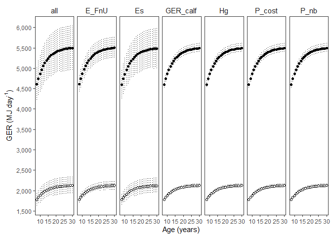
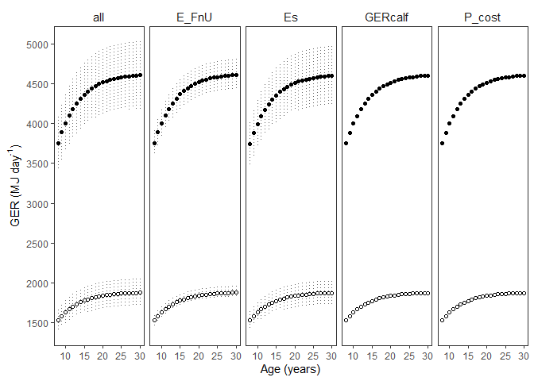

GER Sensitivity Analysis - source - Preg/Lact
================
S. Agbayani
01 August, 2025

``` r
# Set path for output figures: 
Figurespath <- paste0(getwd(), "/gross_energetic_reqs/figures", collapse = NULL)
Figurespath
```

    ## [1] "C:/Users/AgbayaniS/Documents/R/graywhale_energyreqs/gross_energetic_reqs/figures"

``` r
# Set path for input & output data  
datapath <- paste0(getwd(), "/data", collapse = NULL) 
datapath
```

    ## [1] "C:/Users/AgbayaniS/Documents/R/graywhale_energyreqs/data"

``` r
## Read data in Activity Cost Reference, Production Cost, Es
A_cost_reference <- as_tibble(
  read_csv("data/ActivityCost_ReferenceData_BreathsPerDay_Table_VA_2017_original_sources.csv"),
  col_types = (list(cols(  ID = col_double(),
                           Lifestage = col_character(),
                           Description = col_character(),
                           Activity_stages = col_character(),
                           no_days = col_double(),
                           source_no_days = col_character(),
                           bpm = col_double(),
                           se_bpm = col_double(),
                           source_bpm = col_character(),
                           age_yrs = col_double(),
                           age_yrs_min = col_double(),
                           age_yrs_max = col_double(),
                           pct_O2 = col_double(),
                           pct_O2_sd = col_double()
  )
  )
  )
)

kable(A_cost_reference)
```

| ID | Lifestage | Description | Activity_stages | no_days | source_no_days | bpm | se_bpm | source_bpm | age_yrs | age_yrs_min | age_yrs_max | pct_O2 | pct_O2_sd |
|---:|:---|:---|:---|---:|:---|---:|---:|:---|---:|---:|---:|---:|---:|
| 1 | Calf | Lagoon 0-1 mths (Jan) | calving grounds | 31 | Sumich (1986); Findley & Vidal (2002); Pike 1962 | 2.14 | 0.50 | Sumich (1986) as cited in Villegas-Amtmann et al. 2017 | 0.0849315 | 0.0000100 | 0.0849315 | 10.5 | 3.0 |
| 2 | Calf | Lagoon 2 mth (Feb) | calving grounds | 28 | Sumich (1986); Findley & Vidal (2002); Pike 1962 | 1.56 | 0.40 | Sumich (1986) as cited in Villegas-Amtmann et al. 2017 | 0.1616438 | 0.0849315 | 0.1616438 | 10.5 | 3.0 |
| 3 | Calf | Lagoon 3 mths (Mar) | calving grounds | 15 | Sumich (1986); Findley & Vidal (2002); Rice and Wolman 1971 | 1.39 | 0.30 | Sumich (1986) as cited in Villegas-Amtmann et al. 2017 | 0.2465753 | 0.1616438 | 0.2465753 | 10.5 | 3.0 |
| 4 | Calf | Northbound 3 mths (Mar) | northbound | 16 | Rodriguez de la Gala Hernandez 2008; Perryman et al. 2010; Poole 1984; Rice and Wolman 1971; Leatherwood 1974 | 0.70 | 0.10 | Rodriguez de la Gala-Hernandez et al. (2008) | 0.2465753 | 0.1616438 | 0.2465753 | 10.5 | 3.0 |
| 5 | Calf | Northbound 4 mths (Apr) | northbound | 30 | Poole (1984); Rodriguez de la Gala Hernandez et al. 2008; Perryman et al. 2010; Leatherwood 1974 | 0.70 | 0.10 | Rodriguez de la Gala-Hernandez et al. (2008) | 0.3287671 | 0.2465753 | 0.3287671 | 10.5 | 3.0 |
| 6 | Calf | Northbound 5 mths (May) | northbound | 31 | Braham (1984), Poole (1984); Rodriguez de la Gala Hernandez et al. 2008; Perryman et al. 2010; Rice and Wolman 1971; Leatherwood 1974 | 0.70 | 0.10 | Rodriguez de la Gala-Hernandez et al. (2008) | 0.4136986 | 0.3287671 | 0.4136986 | 10.5 | 3.0 |
| 7 | Calf | Northbound 6 mths (June) | northbound | 23 | Hessing (1981) as cited in Braham (1984); | 0.70 | 0.10 | Rodriguez de la Gala-Hernandez et al. (2008) | 0.4958904 | 0.4136986 | 0.4958904 | 11.0 | 2.7 |
| 8 | Calf | Nursing at Foraging grounds 6 mths (June) | nursing at foraging grounds | 7 | Synchenko (2011); Bradford et al. 2012 | 1.22 | 0.30 | Sychenko (2011) | 0.4958904 | 0.4136986 | 0.4958904 | 11.0 | 2.7 |
| 9 | Calf | Nursing at Foraging grounds 7 mths (July) | nursing at foraging grounds | 31 | Mom/calf observations: Sychenko (2011), Bradford et al 2012; Weller et al. 2003 | 1.22 | 0.30 | Sychenko (2011) | 0.5808219 | 0.4958904 | 0.5808219 | 11.0 | 2.7 |
| 10 | Calf | Nursing at foraging grounds 8 mths (Aug) | nursing at foraging grounds | 31 | Mom/calf observations: Sychenko (2011), Bradford et al 2012; Weller et al. 2003 | 1.22 | 0.30 | Sychenko (2011) | 0.6657534 | 0.5808219 | 0.6657534 | 11.0 | 2.7 |
| 11 | Calf | Nursing at foraging grounds (Sep) | nursing at foraging grounds | 30 | Mom/calf observations: Sychenko (2011), Bradford et al 2012; Weller et al. 2003 | 1.22 | 0.30 | Sychenko (2011) | 0.7479452 | 0.6657534 | 0.7479452 | 11.0 | 2.7 |
| 12 | Calf | nursing at foraging grounds (Oct) | nursing at foraging grounds | 20 | for approx date of weaning (~9.6 mths): Agbayani et al. 2020, Weller et al. 2009 | 1.22 | 0.30 | Sychenko (2011) | 0.8328767 | 0.7479452 | 0.8328767 | 11.0 | 2.7 |
| 13 | Calf | Southbound post-weaning (Oct) | southbound post-weaning | 11 | Rugh et al. (2001), Braham (1984) | 0.72 | 0.20 | Sumich (1983); Schwarz (2002), as cited in Villegas-Amtmann 2017 | 0.8328767 | 0.7479452 | 0.9150685 | 11.0 | 2.7 |
| 14 | Calf | Southbound post-weaning (Nov) | southbound post-weaning | 30 | Sumich (1986), Rugh et al. (2001), | 0.72 | 0.20 | Sumich (1983); Schwarz (2002), as cited in Villegas-Amtmann 2017 | 0.9150685 | 0.8328767 | 1.0000000 | 11.0 | 2.7 |
| 15 | Calf | Southbound post-weaning (Dec) | southbound post-weaning | 31 | Sumich (1986), Rugh et al. (2001), Laake et al. (2012) | 0.72 | 0.20 | Sumich (1983); Schwarz (2002), as cited in Villegas-Amtmann 2017 | 1.0000000 | 0.9150685 | 1.0000000 | 11.0 | 2.7 |
| 16 | Pregnant | Southbound newly pregnant (Dec) | Southbound recently pregnant | 31 | Rice 1983; Rice and Wolman 1971 | 0.72 | 0.20 | Sumich (1983); Schwarz (2002), as cited in Villegas-Amtmann 2017 | NA | 8.0000000 | 75.0000000 | 11.0 | 2.7 |
| 17 | Pregnant | Lagoon breeding (Jan) | calving grounds recently pregnant | 31 | Rice 1983 | 0.62 | 0.20 | Harvey & Mate (1984), as cited in Villegas-Amtmann et al. 2017 | NA | 8.0000000 | 75.0000000 | 11.0 | 2.7 |
| 18 | Pregnant | Lagoon breeding (Feb) | calving grounds recently pregnant | 20 | Rice 1983 | 0.62 | 0.20 | Harvey & Mate (1984), as cited in Villegas-Amtmann et al. 2017 | NA | 8.0000000 | 75.0000000 | 11.0 | 2.7 |
| 19 | Pregnant | Northbound solo pregnant (Feb) | northbound pregnant | 8 | Rice 1983 | 0.50 | 0.20 | Rodriguez de la Gala-Hernandez et al. (2008) | NA | 8.0000000 | 75.0000000 | 11.0 | 2.7 |
| 20 | Pregnant | Northbound solo pregnant (Mar) | northbound pregnant | 31 | Rice 1983; Rice & Wolman (1971) | 0.50 | 0.20 | Rodriguez de la Gala-Hernandez et al. (2008) | NA | 8.0000000 | 75.0000000 | 11.0 | 2.7 |
| 21 | Pregnant | Northbound solo pregnant (Apr) | northbound pregnant | 30 | Rice 1983; Rice & Wolman (1971) | 0.50 | 0.20 | Rodriguez de la Gala-Hernandez et al. (2008) | NA | 8.0000000 | 75.0000000 | 11.0 | 2.7 |
| 22 | Pregnant | Northbound pregnant (May) | northbound pregnant | 31 | Rice 1983 | 0.50 | 0.20 | Rodriguez de la Gala-Hernandez et al. (2008) | NA | 8.0000000 | 75.0000000 | 11.0 | 2.7 |
| 23 | Pregnant | Foraging pregnant (june) | foraging pregnant | 30 | Rice 1983; Rice & Wolman (1971) | 1.34 | 0.10 | O. Sychenko (unpubl.) | NA | 8.0000000 | 75.0000000 | 11.0 | 2.7 |
| 24 | Pregnant | Foraging pregnant (july) | foraging pregnant | 31 | Rice 1983 | 1.34 | 0.10 | O. Sychenko (unpubl.) | NA | 8.0000000 | 75.0000000 | 11.0 | 2.7 |
| 25 | Pregnant | Foraging pregnant (Aug) | foraging pregnant | 31 | Rice 1983 | 1.34 | 0.10 | O. Sychenko (unpubl.) | NA | 8.0000000 | 75.0000000 | 11.0 | 2.7 |
| 26 | Pregnant | Foraging pregnant (Sep) | foraging pregnant | 30 | Rice 1983 | 1.34 | 0.10 | O. Sychenko (unpubl.) | NA | 8.0000000 | 75.0000000 | 11.0 | 2.7 |
| 27 | Pregnant | Foraging pregnant (Oct) | foraging pregnant | 31 | Rice 1983 | 1.34 | 0.10 | O. Sychenko (unpubl.) | NA | 8.0000000 | 75.0000000 | 11.0 | 2.7 |
| 28 | Pregnant | Southbound pregnant (Nov) | southbound pregnant | 30 | Rice 1983; Sumich (1986), | 0.72 | 0.20 | Sumich (1983) and Schwarz (2002) | NA | 8.0000000 | 75.0000000 | 11.0 | 2.7 |
| 29 | Pregnant | Southbound pregnant (Dec) | southbound pregnant | 31 | Rice 1983; Sumich (1986), | 0.72 | 0.20 | Sumich (1983) and Schwarz (2002) | NA | 8.0000000 | 75.0000000 | 11.0 | 2.7 |
| 30 | Lactating | Lagoon lactating (Jan) | calving grounds lactating | 31 | Rice 1983; Sumich (1986); Findley & Vidal (2002); Pike 1962 | 0.62 | 0.20 | Harvey & Mate (1984) | NA | 8.0000000 | 75.0000000 | 11.0 | 2.7 |
| 31 | Lactating | Lagoon lactating (Feb) | calving grounds lactating | 28 | Rice 1983; Sumich (1986); Findley & Vidal (2002); Rugh et al. 2001 | 0.62 | 0.20 | Harvey & Mate (1984) | NA | 8.0000000 | 75.0000000 | 11.0 | 2.7 |
| 32 | Lactating | Lagoon lactating (March) | calving grounds lactating | 15 | (coincides with NB calves) Sumich (1986); Findley & Vidal (2002); Rugh et al. 2001; Rodriguez de la Gala Hernandez 2008 | 0.62 | 0.20 | Harvey & Mate (1984) | NA | 8.0000000 | 75.0000000 | 11.0 | 2.7 |
| 33 | Lactating | Northbound with calf (March) | northbound lactating | 16 | Rodriguez de la Gala Hernandez 2008; Poole 1984; Perryman et al. 2010; Leatherwood (1974) | 0.50 | 0.10 | Rodriguez de la Gala-Hernandez et al. (2008) | NA | 8.0000000 | 75.0000000 | 11.0 | 2.7 |
| 34 | Lactating | Northbound with calf (April) | northbound lactating | 30 | Braham (1984), Poole (1984); Rodriguez de la Gala Hernandez et al. 2008; Perryman et al. 2010; Leatherwood 1974; Rice and Wolman (1971) | 0.50 | 0.10 | Rodriguez de la Gala-Hernandez et al. (2008) | NA | 8.0000000 | 75.0000000 | 11.0 | 2.7 |
| 35 | Lactating | Northbound with calf (May) | northbound lactating | 31 | Braham (1984), Poole (1984); Rodriguez de la Gala Hernandez et al. 2008; Perryman et al. 2010; Leatherwood 1974; | 0.50 | 0.10 | Rodriguez de la Gala-Hernandez et al. (2008) | NA | 8.0000000 | 75.0000000 | 11.0 | 2.7 |
| 36 | Lactating | Northbound with Calf (June) | northbound lactating | 23 | Hessing (1981) as cited in Braham (1984) | 0.50 | 0.10 | Rodriguez de la Gala-Hernandez et al. (2008) | NA | 8.0000000 | 75.0000000 | 11.0 | 2.7 |
| 37 | Lactating | Foraging lactating (June) | foraging lactating | 7 | Mom/calf observations: Synchenko (2011) | 1.04 | 0.20 | O. Sychenko (unpubl.) | NA | 8.0000000 | 75.0000000 | 11.0 | 2.7 |
| 38 | Lactating | Foraging lactating (July) | foraging lactating | 31 | Mom/calf observations: Sychenko (2011), Bradford et al 2012 | 1.04 | 0.20 | O. Sychenko (unpubl.) | NA | 8.0000000 | 75.0000000 | 11.0 | 2.7 |
| 39 | Lactating | Foraging lactating (Aug) | foraging lactating | 31 | Mom/calf observations: Sychenko (2011), Bradford et al 2012 | 1.04 | 0.20 | O. Sychenko (unpubl.) | NA | 8.0000000 | 75.0000000 | 11.0 | 2.7 |
| 40 | Lactating | Foraging lactating (Sep) | foraging lactating | 30 | Mom/calf observations: Sychenko (2011), Bradford et al 2012 | 1.04 | 0.20 | O. Sychenko (unpubl.) | NA | 8.0000000 | 75.0000000 | 11.0 | 2.7 |
| 41 | Lactating | Foraging lactating (Oct) | foraging lactating | 20 | for approx date of weaning (~9.6 mths): Agbayani et al. 2020, Weller et al. 2009 | 1.04 | 0.20 | O. Sychenko (unpubl.) | NA | 8.0000000 | 75.0000000 | 11.0 | 2.7 |
| 42 | Lactating | Southbound post-weaning (Oct) | southbound post-weaning | 11 | Braham (1984); Rugh et al. (2001); Rodriguez de la Gala-Hernandez (2008); Pike (1962) | 0.72 | 0.20 | Sumich (1983) and Schwarz (2002) | NA | 8.0000000 | 75.0000000 | 11.0 | 2.7 |
| 43 | Lactating | Southbound post-weaning (Nov) | southbound post-weaning | 30 | Rugh et al. 2001; Braham (1984); Rodriguez de la Gala-Hernandez (2008) | 0.72 | 0.20 | Sumich (1983) and Schwarz (2002) | NA | 8.0000000 | 75.0000000 | 11.0 | 2.7 |
| 44 | Lactating | Southbound postweaning (Dec) | southbound post-weaning | 31 | Rugh et al. 2001; Braham (1984); Rodriguez de la Gala-Hernandez (2008); Sumich 1986 | 0.72 | 0.20 | Sumich (1983) and Schwarz (2002) | NA | 8.0000000 | 75.0000000 | 11.0 | 2.7 |
| 45 | Juvenile/Adult | Southbound solo (Jan) | southbound | 15 | Rodriguez de la Gala-Hernandez (2008); Sumich 1986 | 0.72 | 0.20 | Sumich (1983) and Schwarz (2002) | NA | 1.0000000 | 75.0000000 | 11.0 | 2.7 |
| 46 | Juvenile/Adult | Lagoon solo (Jan) | calving grounds | 16 | Sumich (1986), Findley & Vidal (2002); Rice and Wolman 1971; Findley and Vidal 2002 | 0.62 | 0.20 | Harvey & Mate (1984), Sumich (1986) | NA | 1.0000000 | 75.0000000 | 11.0 | 2.7 |
| 47 | Juvenile/Adult | Lagoon solo (Feb) | calving grounds | 14 | Rice and Wolman (1971); Findley & Vidal (2002); Urban et al. 2021; Rugh et al. 2001 | 0.62 | 0.20 | Harvey & Mate (1984), Sumich (1986) | NA | 1.0000000 | 75.0000000 | 11.0 | 2.7 |
| 48 | Juvenile/Adult | Northbound solo (Feb) | northbound | 14 | Rice and Wolman (1971); Poole (1984), Pike (1962), Rodriguez de la Gala Hernandez et al. 2008; Sumich (1986) | 0.50 | 0.03 | Rodriguez de la Gala-Hernandez et al. (2008) | NA | 1.0000000 | 75.0000000 | 11.0 | 2.7 |
| 49 | Juvenile/Adult | Northbound solo (March) | northbound | 31 | Rice and Wolman (1971); Poole (1984), Pike (1962), Rodriguez de la Gala Hernandez et al. 2008; Braham (1984); Urban et al. 2021 (Maria started migrating March 9); Leatherwood 1974 | 0.50 | 0.03 | Rodriguez de la Gala-Hernandez et al. (2008) | NA | 1.0000000 | 75.0000000 | 11.0 | 2.7 |
| 50 | Juvenile/Adult | Northbound solo (April) | northbound | 30 | Rice and Wolman (1971) \*data ends in April; Poole (1984), Pike (1962), Rodriguez de la Gala Hernandez et al. 2008; Braham (1984); Urban et al. 2021 | 0.50 | 0.03 | Rodriguez de la Gala-Hernandez et al. (2008) | NA | 1.0000000 | 75.0000000 | 11.0 | 2.7 |
| 51 | Juvenile/Adult | Northbound solo (May) | northbound | 15 | Poole (1984), Pike (1962), Rodriguez de la Gala Hernandez et al. 2008; Braham (1984); Urban et al. 2021 (Maria stopped migrating May 24) | 0.50 | 0.03 | Rodriguez de la Gala-Hernandez et al. (2008) | NA | 1.0000000 | 75.0000000 | 11.0 | 2.7 |
| 52 | Juvenile/Adult | Foraging solo (May) | foraging | 16 | Kim and Oliver (1989); Heide-Jorgensen et al. (2012); 5 months (May to Oct); Urban et al. 2021 | 1.04 | 0.20 | O. Sychenko (unpubl.) | NA | 1.0000000 | 75.0000000 | 11.0 | 2.7 |
| 53 | Juvenile/Adult | Foraging solo (June) | foraging | 30 | Kim and Oliver (1989); Pike (1962); Heide-Jorgensen et al. (2012); Urban et al. 2021 | 1.04 | 0.20 | O. Sychenko (unpubl.) | NA | 1.0000000 | 75.0000000 | 11.0 | 2.7 |
| 54 | Juvenile/Adult | Foraging solo (July) | foraging | 31 | Kim and Oliver (1989); Pike (1962); Heide-Jorgensen et al. (2012); Urban et al. 2021; Bradford et al. 2012 | 1.04 | 0.20 | O. Sychenko (unpubl.) | NA | 1.0000000 | 75.0000000 | 11.0 | 2.7 |
| 55 | Juvenile/Adult | Foraging solo (Aug) | foraging | 31 | Pike (1962); Heide-Jorgensen et al. (2012); Bradford et al. 2012 | 1.04 | 0.20 | O. Sychenko (unpubl.) | NA | 1.0000000 | 75.0000000 | 11.0 | 2.7 |
| 56 | Juvenile/Adult | Foraging solo (Sep) | foraging | 30 | Pike (1962); Heide-Jorgensen et al. (2012); Bradford et al. 2012 | 1.04 | 0.20 | O. Sychenko (unpubl.) | NA | 1.0000000 | 75.0000000 | 11.0 | 2.7 |
| 57 | Juvenile/Adult | Foraging solo (Oct) | foraging | 16 | Kim and Oliver (1989); Pike (1962); Heide-Jorgensen et al. (2012); Bradford et al. 2012; Rugh et al. 2001 | 1.04 | 0.20 | O. Sychenko (unpubl.) | NA | 1.0000000 | 75.0000000 | 11.0 | 2.7 |
| 58 | Juvenile/Adult | Southbound (Oct) | southbound | 15 | Rugh et al. 2001; Braham (1984); Rodriguez de la Gala-Hernandez (2008); Pike (1962) | 0.72 | 0.20 | Sumich (1983); Schwarz (2002); Villegas-Amtmann 2017 | NA | 1.0000000 | 75.0000000 | 11.0 | 2.7 |
| 59 | Juvenile/Adult | Southbound (Nov) | southbound | 30 | Sumich (1986), Rugh et al. (2001), Braham 1984; | 0.72 | 0.20 | Sumich (1983); Schwarz (2002); Villegas-Amtmann 2017 | NA | 1.0000000 | 75.0000000 | 11.0 | 2.7 |
| 60 | Juvenile/Adult | Southbound (Dec) | southbound | 31 | Sumich (1986), Laake et al. (2012); Pike 1962; Rugh et al. (2001), Braham (1984); Leatherwood (1974) | 0.72 | 0.20 | Sumich (1983); Schwarz (2002); Villegas-Amtmann 2017 | NA | 1.0000000 | 75.0000000 | 11.0 | 2.7 |

``` r
Activity_days <- A_cost_reference %>% select(Lifestage, Activity_stages, no_days) %>%  
  group_by(Lifestage, Activity_stages) %>% 
  summarise(no_days = sum(no_days))
```

    ## `summarise()` has grouped output by 'Lifestage'. You can override using the
    ## `.groups` argument.

``` r
kable(Activity_days)
```

| Lifestage      | Activity_stages                   | no_days |
|:---------------|:----------------------------------|--------:|
| Calf           | calving grounds                   |      74 |
| Calf           | northbound                        |     100 |
| Calf           | nursing at foraging grounds       |     119 |
| Calf           | southbound post-weaning           |      72 |
| Juvenile/Adult | calving grounds                   |      30 |
| Juvenile/Adult | foraging                          |     154 |
| Juvenile/Adult | northbound                        |      90 |
| Juvenile/Adult | southbound                        |      91 |
| Lactating      | calving grounds lactating         |      74 |
| Lactating      | foraging lactating                |     119 |
| Lactating      | northbound lactating              |     100 |
| Lactating      | southbound post-weaning           |      72 |
| Pregnant       | Southbound recently pregnant      |      31 |
| Pregnant       | calving grounds recently pregnant |      51 |
| Pregnant       | foraging pregnant                 |     153 |
| Pregnant       | northbound pregnant               |     100 |
| Pregnant       | southbound pregnant               |      61 |

``` r
P_cost_table <- as_tibble(
  read_csv("data/P_cost_table_phase1.csv"),
  col_types = (list(cols(age_mth = col_double(),
                         age_yrs = col_double(),
                         mean_masschange = col_double(),
                         sd_masschange = col_double(),
                         sex = col_character(),
                         mean_P = col_double(),
                         sd_P = col_double(),
                         quant025 = col_double(),
                         quant975 = col_double(),
                         p_lipid = col_double(),
                         p_protein = col_double()
  )
  )
  )
) 


#P_cost_table <- P_cost_table %>% dplyr::filter(age_yrs >= 0)
kable(head(P_cost_table))
```

| age_mth | age_yrs | mean_masschange | sd_masschange | sex | mean_P | sd_P | quant025 | quant975 | p_lipid | p_protein | mass | mass_sd | Ts | mean_masschange_perday | sd_masschange_perday | mean_P_perday | sd_P_perday |
|---:|---:|---:|---:|:---|---:|---:|---:|---:|---:|---:|---:|---:|---:|---:|---:|---:|---:|
| 0 | 0.0000000 | 986.5660 | 20.894489 | N/A | 17045.480 | 766.9967 | 15657.439 | 15657.439 | 0.3638438 | 0.1260 | 983.0272 | 26.76770 | 0 | Inf | Inf | Inf | Inf |
| 1 | 0.0849315 | 516.6026 | 8.099161 | N/A | 8749.367 | 379.7509 | 8081.308 | 8081.308 | 0.3898447 | 0.1116 | 1498.2581 | 37.14344 | 31 | 16.66460 | 0.2612633 | 282.2376 | 12.25003 |
| 2 | 0.1616438 | 507.6841 | 12.548106 | N/A | 8425.023 | 405.8457 | 7683.912 | 7683.912 | 0.3721566 | 0.0972 | 2003.8171 | 53.21868 | 28 | 18.13158 | 0.4481466 | 300.8937 | 14.49449 |
| 3 | 0.2465753 | 578.9767 | 13.529226 | N/A | 9608.130 | 456.2691 | 8778.818 | 8778.818 | 0.3872586 | 0.0972 | 2580.5024 | 70.55082 | 31 | 18.67667 | 0.4364266 | 309.9397 | 14.71836 |
| 4 | 0.3287671 | 555.4428 | 9.504603 | N/A | 9217.611 | 412.1595 | 8489.886 | 8489.886 | 0.3358296 | 0.0972 | 3134.3355 | 82.72707 | 30 | 18.51476 | 0.3168201 | 307.2537 | 13.73865 |
| 5 | 0.4136986 | 552.6109 | 6.368057 | N/A | 9170.642 | 393.0700 | 8496.816 | 8496.816 | 0.3745950 | 0.0972 | 3685.8679 | 90.88511 | 31 | 17.82616 | 0.2054212 | 295.8271 | 12.67968 |

``` r
P_cost_table_preg  <-  as_tibble(
  read_csv("data/P_cost_table_preg.csv"),
  col_types = list(cols(age_yrs = col_double(),
                        mean_masschange = col_double(),
                        sd_masschange = col_double(),
                        sex = col_character(),
                        mean_P = col_double(),
                        sd_P = col_double(),
                        p_lipid = col_double(),
                        p_protein = col_double()
  )
  )
)


P_cost_table_preg$Ts <-  396

P_cost_table_lact <- as_tibble(
  read_csv("data/P_cost_table_lact.csv"),
  col_types = list(cols(age_yrs = col_double(),
                        mean_masschange = col_double(),
                        sd_masschange = col_double(),
                        sex = col_character(),
                        mean_P = col_double(),
                        sd_P = col_double(),
                        p_lipid = col_double(),
                        p_protein = col_double()
  )
  )
)

P_cost_table_lact$Ts <-  365

Es_preg_table <- as_tibble(
  read_csv("data/Es_sensAnalysis_preg_peryear_source_bpm.csv"),
  col_types = (list(cols(age_yrs = col_double(),
                         Lifestage = col_character(),
                         no_days = col_double(),
                         Es = col_double(),
                         Es_sd = col_double()
  )
  )
  )
)
kable(head(Es_preg_table))
```

| age_yrs | Lifestage | no_days | MC_variable | Es | Es_sd | Es_perday | Es_sd_perday |
|---:|:---|---:|:---|---:|---:|---:|---:|
| 8 | Pregnant | 396 | all | 336865.5 | 54456.1206 | 850.6703 | 137.5154560 |
| 8 | Pregnant | 396 | Rs | 335601.1 | 289.9489 | 847.4775 | 0.7321943 |
| 8 | Pregnant | 396 | Vt | 335597.4 | 3364.2999 | 847.4681 | 8.4957067 |
| 8 | Pregnant | 396 | pctO2 | 335543.8 | 51115.6435 | 847.3329 | 129.0799078 |
| 9 | Pregnant | 396 | all | 356844.8 | 57469.0397 | 901.1231 | 145.1238376 |
| 9 | Pregnant | 396 | Rs | 355596.4 | 307.2243 | 897.9707 | 0.7758189 |

``` r
Es_lact_table <- as_tibble(
  read_csv("data/Es_sensAnalysis_lact_peryear_source_bpm.csv"),
  col_types = (list(cols(age_yrs = col_double(),
                         Lifestage = col_character(),
                         no_days = col_double(),
                         Es = col_double(),
                         Es_sd = col_double()
  )                                   
  )
  )
)


kable(head(Es_lact_table))
```

| age_yrs | Lifestage | no_days | MC_variable | Es | Es_sd | Es_perday | Es_sd_perday |
|---:|:---|---:|:---|---:|---:|---:|---:|
| 8 | Lactating | 365 | all | 259159.2 | 37390.2731 | 710.0251 | 102.4391045 |
| 8 | Lactating | 365 | Rs | 258186.5 | 315.0834 | 707.3603 | 0.8632422 |
| 8 | Lactating | 365 | Vt | 258183.6 | 2322.7170 | 707.3525 | 6.3636082 |
| 8 | Lactating | 365 | pctO2 | 258142.4 | 35096.7084 | 707.2394 | 96.1553655 |
| 9 | Lactating | 365 | all | 274529.7 | 39458.9856 | 752.1363 | 108.1068098 |
| 9 | Lactating | 365 | Rs | 273569.4 | 333.8563 | 749.5053 | 0.9146747 |

``` r
mass_table <- as_tibble(
  read_csv("data/mass_table.csv"),
  col_types = (list(cols(age_yrs = col_double(),
                         mean_mass = col_double(),
                         sd_mass = col_double(),
                         mean_lwr = col_double(),
                         mean_upr = col_double(),
                         quant025 = col_double(),
                         quant975 = col_double(),
                         female_mass = col_double(),
                         male_mass = col_double()
  )
  )
  )
)


mean_masschange <- as_tibble(
  read_csv("data/mean_masschange.csv"),
  col_types = (list(cols(age_yrs = col_double(),
                         mean_masschange = col_double(),
                         sd_masschange = col_double(),
                         sex = col_character(),
                         age_mth = col_double()
  )
  )
  )
)


mean_masschange <- mean_masschange %>% dplyr::filter(age_yrs >=0)
kable(head(mean_masschange))
```

|   age_yrs | mean_masschange | sd_masschange | sex | age_mth |
|----------:|----------------:|--------------:|:----|--------:|
| 0.0000000 |        982.8522 |     27.098452 | N/A |       0 |
| 0.0849315 |        515.1631 |     10.503953 | N/A |       1 |
| 0.1616438 |        505.4539 |     16.273872 | N/A |       2 |
| 0.2465753 |        576.5720 |     17.546305 | N/A |       3 |
| 0.3287671 |        553.7534 |     12.326696 | N/A |       4 |
| 0.4136986 |        551.4791 |      8.258852 | N/A |       5 |

``` r
mean_masschange_peryear <- as_tibble(
  read_csv("data/mean_masschange_per_year.csv"),
  col_types = (list(cols(age_yrs = col_double(),
                         mean_masschange = col_double(),
                         sd_masschange = col_double(),
                         sex = col_character()
  )
  )
  )
)

mean_masschange_peryear <- mean_masschange_peryear %>% dplyr::filter(age_yrs >= 0)
kable(head(mean_masschange_peryear))
```

| age_yrs | mean_masschange | sd_masschange | sex |
|--------:|----------------:|--------------:|:----|
|       0 |        982.8522 |     27.098452 | N/A |
|       1 |       5088.6824 |    177.509836 | N/A |
|       2 |       1602.5843 |     40.358507 | N/A |
|       3 |       1535.7051 |     14.436330 | N/A |
|       4 |       1428.4931 |      8.591593 | N/A |
|       5 |       1299.6519 |     19.059815 | N/A |

``` r
age_yr_tibble <- as_tibble(
  read_csv("data/age_yr_tibble.csv"), 
  col_types = (list(ID = col_integer(),
                    month = col_character(),
                    no_days_in_mth = col_double(),
                    age_mth = col_double(),
                    no_days_cumul = col_double(),
                    age_yrs = col_double()
  )
  )
)

kable(age_yr_tibble)
```

| month | no_days_in_mth | age_mth | no_days_cumul |   age_yrs |
|:------|---------------:|--------:|--------------:|----------:|
| Jan   |            0.0 |     0.0 |           0.0 | 0.0000000 |
| Jan   |           15.5 |     0.5 |          15.5 | 0.0424658 |
| Jan   |           15.5 |     1.0 |          31.0 | 0.0849315 |
| Feb   |           14.0 |     1.5 |          45.0 | 0.1232877 |
| Feb   |           14.0 |     2.0 |          59.0 | 0.1616438 |
| Mar   |           15.5 |     2.5 |          74.5 | 0.2041096 |
| Mar   |           15.5 |     3.0 |          90.0 | 0.2465753 |
| Apr   |           15.0 |     3.5 |         105.0 | 0.2876712 |
| Apr   |           15.0 |     4.0 |         120.0 | 0.3287671 |
| May   |           15.5 |     4.5 |         135.5 | 0.3712329 |
| May   |           15.5 |     5.0 |         151.0 | 0.4136986 |
| Jun   |           15.0 |     5.5 |         166.0 | 0.4547945 |
| Jun   |           15.0 |     6.0 |         181.0 | 0.4958904 |
| Jul   |           15.5 |     6.5 |         196.5 | 0.5383562 |
| Jul   |           15.5 |     7.0 |         212.0 | 0.5808219 |
| Aug   |           15.5 |     7.5 |         227.5 | 0.6232877 |
| Aug   |           15.5 |     8.0 |         243.0 | 0.6657534 |
| Sep   |           15.0 |     8.5 |         258.0 | 0.7068493 |
| Sep   |           15.0 |     9.0 |         273.0 | 0.7479452 |
| Oct   |           15.5 |     9.5 |         288.5 | 0.7904110 |
| Oct   |           15.5 |    10.0 |         304.0 | 0.8328767 |
| Nov   |           15.0 |    10.5 |         319.0 | 0.8739726 |
| Nov   |           15.0 |    11.0 |         334.0 | 0.9150685 |
| Dec   |           15.5 |    11.5 |         349.5 | 0.9575342 |
| Dec   |           15.5 |    12.0 |         365.0 | 1.0000000 |

``` r
predict_GER_table_sensAnalysis_phase2  <- as_tibble(
  read_csv("data/predict_GER_table_sensAnalysis_phase2 .csv"),
  col_types = (list(ID = col_integer(),
                    phase = col_double(),
                    age_yrs = col_double(),
                    sex = col_character(),
                    MC_variable = col_character(),
                    mean_GER = col_double(),
                    GER_sd = col_double(),
                    quant025 = col_double(),
                    quant975 = col_double(),
                    GER_foraging = col_double(),
                    sd_foraging = col_double(),
                    quant025_foraging = col_double(),
                    quant975_foraging = col_double(),
                    FR_foraging = col_double(),
                    FR_sd_foraging = col_double(),
                    FR_quant025 = col_double(),
                    FR_quant975 = col_double(),
                    Ts = col_double(),
                    mean_mass = col_double(),
                    percent_body_weight_consumed = col_double()
  )))
```

    ## Error: 'data/predict_GER_table_sensAnalysis_phase2 .csv' does not exist in current working directory ('C:/Users/AgbayaniS/Documents/R/graywhale_energyreqs').

``` r
TotalGER_birth_to_weaning_tibble <- as_tibble(
  read_csv("data/TotalGER_birth_to_weaning_tibble.csv"),
  col_types = (list(ID = col_integer(),
                    age_range = col_character(),
                    sex = col_character(),
                    Total_GER = col_double(),
                    Total_GER_sd = col_double(), 
                    details = col_character()
  )))


kable(TotalGER_birth_to_weaning_tibble)
```

| age_range | sex | Total_GER | Total_GER_sd | details |
|:---|:---|---:|---:|:---|
| 0 to 6 mths | N/A | 100915.28 | 130.1483 | birth to end of nursing mother fasting |
| 7 to 9.6 mths | N/A | 78807.66 | 184.8964 | start of nursing mother foraging to weaning |
| 0 to 9.6 mths | N/A | 179722.94 | 226.1090 | birth to weaning |

``` r
#Energy Density values
ED_milk = 22.33 #MJ/kg   Average between Tomilin 1946 and Zenkovich 1938,    (Sumich 1986 - cited 22.4  MJ/kg)


MC_reps = 10000
```

``` r
predict_GER_table_sensAnalysis_preg <- as.data.frame(matrix(ncol = 23, nrow = 0))

cnames <- c("phase", "age_yrs", "MC_variable", 
            "mean_GER", "GER_sd", 
            "quant025", "quant975", 
            "GER_foraging", "sd_foraging",
            "quant025_foraging", "quant975_foraging",   #2.5% and 97.5% quantile from bootstrap estimates
            "FR_foraging", "FR_sd_foraging",
            "FR_quant025","FR_quant975",
            "Hg", "Hg_sd",
            "P_nb", "GERcalf_6mths", 
            "mass","mass_sd", "pctbodywt", "pctbodywt_sd"
)            

colnames(predict_GER_table_sensAnalysis_preg) <- cnames

predict_GER_table_sensAnalysis_preg <- as_tibble(
  predict_GER_table_sensAnalysis_preg,
  col_types = (list(ID = col_integer(),
                    phase = col_character(),
                    age_yrs = col_double(), 
                    MC_variable = col_character(), 
                    mean_GER = col_double(), 
                    GER_sd = col_double(), 
                    quant025 = col_double(), 
                    quant975 = col_double(), 
                    GER_foraging = col_double(),
                    sd_foraging = col_double(), 
                    quant025_foraging = col_double(),
                    quant975_foraging = col_double(),
                    FR_foraging = col_double(),
                    FR_sd_foraging = col_double(),
                    FR_quant025 = col_double(),
                    FR_quant975 = col_double(),
                    Hg = col_double(),
                    Hg_sd = col_double(),
                    P_nb = col_double(),
                    GERcalf_6mths = col_double(),
                    mass = col_double(),
                    mass_sd = col_double(),
                    pctbodywt = col_double(),
                    pctbodywt_sd = col_double()
  )
  )
)


for (i in seq(from = 8, to = 75, by = 1)){
  for (MC_var in c("all","Hg","GER_calf", 
                   "P_nb", "P_cost", "Es", "E_FnU")){
    age <-  i
    s <- "Female"
    phase <- "Pregnant"
    
    # Mass values
    mass_foetus <- mass_table %>% dplyr::filter(age_yrs == 0) 
    mass_foetus_40pct <- mass_foetus$mean_mass * 0.4 
    
    mass_female <- mass_table %>% 
      dplyr::filter(age_yrs == age) %>% 
      dplyr::select(female_mass) %>% 
      pull(female_mass)
    mass_preg <- mass_female + mass_foetus_40pct
    
    if (MC_var == "all"){
      mass_foetus_40pct_sd <- mass_foetus$sd_mass * 0.4
      mass_female_sd <- mass_table %>% 
        dplyr::filter(age_yrs == age) %>% 
        dplyr::select(sd_mass) %>% 
        pull(sd_mass)
      mass_preg_sd <- sqrt((mass_female_sd^2)+(mass_foetus_40pct_sd^2))
    } else {
      mass_preg_sd <-0
    }
    
    # Mass of newborn (for Hg calcs)
    Mnb <- mass_foetus$mean_mass
    if (MC_var == "all" || MC_var == "Hg"){
      sd_Mnb <- mass_foetus$sd_mass  # sd of mass of newborn (kg)
    } else {
      sd_Mnb <-  0
    }
    
    
    # Production cost values
    P_cost_i <- P_cost_table_preg %>%
      dplyr::filter(P_cost_table_preg$age_yrs == age)
    P_cost_i <- P_cost_i %>%
      dplyr::filter(P_cost_i$sex == s)
    
    mean_P <- P_cost_i$mean_P_perday * 396
    
    if (MC_var == "all" || MC_var == "P_cost"){
      sd_P <-  P_cost_i$sd_P_perday * 396
    } else {
      sd_P <-  0
    }
    
    # Production cost - newborn
    P_nb_table <- P_cost_table %>% 
      dplyr::filter(age_yrs == 0 & sex == "N/A")
    
    P_nb <- P_nb_table %>% pull(mean_P)
    if (MC_var == "all" || MC_var == "P_nb"){
      P_nb_sd <- P_nb_table %>% pull(sd_P)
    } else {
      P_nb_sd <- 0
    }
    
    # Energetic expenditure values
    Es_table_i <- Es_preg_table %>%
      dplyr::filter(Es_preg_table$age_yrs  == age)
    
    Es <- Es_table_i$Es
    if (MC_var == "all" || MC_var == "Es"){
      Es_sd <- Es_table_i$Es_sd
    } else {
      Es_sd <- 0
    }
      
    T_s <- Es_table_i$no_days
    
    #Fecal and Urinary cost - E_FnU
    E_FnU_min = 0.740
    E_FnU_max = 0.858
    E_FnU_mean = (E_FnU_min + E_FnU_max)/2
    
    #Energetic density of Prey - ED_prey
    ED_prey_mean = 2.90 #MJ/kg  from average I calculated... 
    ED_prey_min = 2.51   #from Coyle et al. 2007
    ED_prey_max = 3.41   #from Stoker 1978
    
    if (MC_var == "all"){
      ED_prey_sd = 0.0408  #calculated from table 3  
    } else {
      ED_prey_sd = 0
    }
    
    # GER calf 6 mths
    GERcalf_6mths_tibble <- TotalGER_birth_to_weaning_tibble %>% 
      dplyr::filter(age_range == "0 to 6 mths") 
    
    GERcalf_6mths <- GERcalf_6mths_tibble %>% pull(Total_GER)
    
    if (MC_var == "all" || MC_var == "GERcalf"){
      GERcalf_6mths_sd <- GERcalf_6mths_tibble$Total_GER_sd
    } else {
      GERcalf_6mths_sd <- 0
    }
    
   # Monte Carlo - Production cost 
    set.seed(12345)
    MC_vars_i <- as_tibble(rnorm(MC_reps, mean_P, sd_P))
    names(MC_vars_i)[1] <- "P_cost"
    
    MC_vars_i$sex <- s   # do i need to identify sex here?
    MC_vars_i$GER <- NA
    MC_vars_i<- MC_vars_i %>%  
      dplyr::select(sex, GER, everything()) #move sex to the first column
    
    # Monte carlo - Es
    set.seed(12345)
    Es_i <-  as_tibble(rnorm(MC_reps, Es, Es_sd))
    names(Es_i)[1] <- "Es"
    
    MC_vars_i <- cbind(MC_vars_i, Es_i)
    
    #### Monte carlo - Fecal and urinary waste - E_FnU
    set.seed(12345)
    if (MC_var == "E_FnU" || MC_var == "all"){
      E_FnU_i <- as_tibble(runif(MC_reps, min = E_FnU_min, max = E_FnU_max)) 
    } else {
      E_FnU_i <- as_tibble(runif(MC_reps, min = E_FnU_mean, max = E_FnU_mean)) 
    }
    names(E_FnU_i)[1] <- "E_FnU"
    
    MC_vars_i <- cbind(MC_vars_i, E_FnU_i)

    #### Monte carlo - Energetic density of prey - ED_prey
    ED_prey_i <- as_tibble(rnorm(MC_reps, ED_prey_mean, ED_prey_sd))
    names(ED_prey_i)[1] <- "ED_prey"
    
    MC_vars_i <- cbind(MC_vars_i, ED_prey_i)
    
    # Monte Carlo - mass (for pct body wt calcs)
    set.seed(12345)
    mass_i <- as_tibble(rnorm(MC_reps, mass_preg, mass_preg_sd))
    names(mass_i)[1] <- "mass"
    
    MC_vars_i <- cbind(MC_vars_i, mass_i)
    
    # Heat increment of gestation
    set.seed(1234)
    Mnb_i <- rnorm(MC_reps, Mnb, sd_Mnb)
    Mnb_table <- as_tibble(Mnb_i)
    names(Mnb_table)[1] <- "Mnb"
    
    #(Brody 1945)  Q (Cal) = 4400 Cal x M^1.2 (kg)
    Hg <- 18.41 * (Mnb_table$Mnb^1.2)  
    # Hg <- 18.41 MJ x M^1.2 kg         
    Hg_i <- as_tibble(Hg)
    names(Hg_i)[1] <- "Hg"
    MC_vars_i <- cbind(MC_vars_i, Hg_i)
    
    #Production cost of newborn calf
    P_nb_i <- as_tibble(rnorm(MC_reps, P_nb, P_nb_sd))
    names(P_nb_i)[1] <- "P_nb"
    MC_vars_i <- cbind(MC_vars_i, P_nb_i)
    
    #Cost of nursing calf for first 6 mths
    #GER from birth to 6mths
    GERcalf_0to6m <- as_tibble(rnorm(MC_reps, GERcalf_6mths, GERcalf_6mths_sd))
    #names(GERcalf_0to6m)[1] <- "GERcalf_0to6m"
    GERcalf_0to6m <- GERcalf_0to6m %>% rename("GERcalf_0to6m"="value")
    MC_vars_i <- cbind(MC_vars_i, GERcalf_0to6m)
    
    
    # Pcost of mother
    P_cost <- MC_vars_i$P_cost 
    Es <- MC_vars_i$Es
    E_FnU <- MC_vars_i$E_FnU
    #E_HIF <- MC_vars_i$E_HIF
    Hg <- MC_vars_i$Hg
    P_nb <- MC_vars_i$P_nb
    GERcalf_0to6m <- MC_vars_i$GERcalf_0to6m
    
    #GER  preg  = GER preg whale + GER calf 6mths (lactation) 
    #Es includes digestion, maintenance and activity          

    MC_vars_i$GER <- ((P_cost + Es + Hg + P_nb + GERcalf_0to6m)/396)/E_FnU  #preg total days = 396
    MC_vars_i$GER_foraging <- ((P_cost + Es + Hg + P_nb + GERcalf_0to6m )/153)/E_FnU  #foraging pregnant = 153
    
    MC_vars_i$FR_foraging <- (MC_vars_i$GER_foraging / MC_vars_i$ED_prey) 
    MC_vars_i$pctbodywt <- (MC_vars_i$FR_foraging / MC_vars_i$mass)*100 
    
    #192 days foraging while preg, 134 days foraging while lact)
    MC_vars_i <- MC_vars_i %>% dplyr::mutate(ID = row_number())
    # move ID to the first column
    MC_vars_i<- MC_vars_i %>% dplyr::select(ID,everything()) 
    
    mean_GER_i <- mean(MC_vars_i$GER)
    sd_GER_i <- sd(MC_vars_i$GER)
    
    quant025 <- quantile(MC_vars_i$GER, 0.025, na.rm = TRUE)
    quant975 <- quantile(MC_vars_i$GER, 0.975, na.rm = TRUE)
    
    GER_foraging_i <- mean(MC_vars_i$GER_foraging)
    sd_foraging_i <- sd(MC_vars_i$GER_foraging)
    
    quant025_foraging <- quantile(MC_vars_i$GER_foraging, 0.025, na.rm = TRUE)
    quant975_foraging <- quantile(MC_vars_i$GER_foraging, 0.975, na.rm = TRUE)
    
    
    FR_foraging_i <- mean(MC_vars_i$FR_foraging)
    FR_sd_foraging_i <- sd(MC_vars_i$FR_foraging)
    
    FR_quant025_i <- quantile(MC_vars_i$FR_foraging, 0.025, na.rm = TRUE)
    FR_quant975_i <- quantile(MC_vars_i$FR_foraging, 0.975, na.rm = TRUE)
    
    pctbodywt <- mean(MC_vars_i$pctbodywt)
    pctbodywt_sd <- sd(MC_vars_i$pctbodywt)
    
    mean_Hg_i <- mean(Hg)
    sd_Hg_i <- sd(Hg)
    
    mass_i <- mean(MC_vars_i$mass)
    mass_sd_i <- sd(MC_vars_i$mass)
    
    P_nb_i <- mean(P_nb)
    GERcalf_0to6m_i <- mean(GERcalf_0to6m)
    
    MC_vars_i <- MC_vars_i %>%  dplyr::mutate(ID = row_number())
    MC_vars_i<- MC_vars_i %>%  dplyr::select(ID,everything()) # move ID to the first column
    
    
    row <- tibble(phase = phase,
                  age_yrs = age, 
                  MC_variable = MC_var,
                  mean_GER = mean_GER_i, 
                  GER_sd = sd_GER_i, 
                  quant025 = quant025, 
                  quant975 = quant975, 
                  GER_foraging = GER_foraging_i,
                  sd_foraging = sd_foraging_i, 
                  quant025_foraging = quant025_foraging,
                  quant975_foraging = quant975_foraging,
                  FR_foraging = FR_foraging_i,
                  FR_sd_foraging = FR_sd_foraging_i,
                  FR_quant025 = FR_quant025_i,
                  FR_quant975 = FR_quant975_i,
                  Hg = mean_Hg_i,
                  sd_Hg = sd_Hg_i,
                  P_nb = P_nb_i,
                  GERcalf_0to6m = GERcalf_0to6m_i,
                  mass = mass_i,
                  mass_sd = mass_sd_i,
                  pctbodywt = pctbodywt,
                  pctbodywt_sd = pctbodywt_sd
    )
    
    predict_GER_table_sensAnalysis_preg <- 
      rbind(predict_GER_table_sensAnalysis_preg, row)
    
  }
}


predict_GER_table_sensAnalysis_preg %>% 
  write_csv("data/predict_GER_table_sensAnalysis_preg.csv", 
            na = "", append = FALSE)
```

``` r
predict_GER_table_sensAnalysis_preg <- read_csv("data/predict_GER_table_sensAnalysis_preg.csv")

plot_predict_GER_sensAnalysis_preg <- predict_GER_table_sensAnalysis_preg %>%
  filter(age_yrs<=30) %>% 
  ggplot() +
  geom_errorbar(aes(x = age_yrs, 
                    ymin = mean_GER - GER_sd, 
                    ymax = mean_GER + GER_sd), 
                width=0, linetype = 3,color="black") + 
  geom_point(aes(x = age_yrs, y= mean_GER), 
             shape = 21, fill = "white")+
  geom_errorbar(aes(x = age_yrs, 
                    ymin = GER_foraging - sd_foraging, 
                    ymax = GER_foraging + sd_foraging), 
                width=0, linetype = 3, color="black") + 
  geom_point(aes(x = age_yrs, y= GER_foraging), 
             shape = 21, fill = "black")+
  facet_grid(~MC_variable)+
  
  xlab("Age (years)") +
  ylab(bquote('GER (MJ day '^'-1'*')')) +
  scale_x_continuous(breaks = scales::pretty_breaks(n = 10), 
                     limits = c(8, 30)) +  # max x-axis 30 yrs. 
  scale_y_continuous(breaks = scales::pretty_breaks(n = 8),
                     labels = comma
                     #limits = c(0,max(plot_predict_GER_sensAnalysis_preg$quant975_foraging))
  ) +
  theme_bw() +
  theme(panel.grid = element_blank())+
  theme(strip.background =element_rect(fill="transparent",
                                       colour = "transparent"))+
  theme(strip.text = element_text(size = rel(1)))


plot_predict_GER_sensAnalysis_preg              
```

<!-- -->

``` r
predict_GER_table_sensAnalysis_lact <- 
  as.data.frame(matrix(ncol = 20, nrow = 0))

cnames <- c("phase","age_yrs", "MC_variable", 
            "mean_GER", "GER_sd", 
            "quant025", "quant975", 
            "GER_foraging", "sd_foraging",
            "quant025_foraging", "quant975_foraging",   #2.5% and 97.5% quantile from bootstrap estimates
            "FR_foraging", "FR_sd_foraging",
            "FR_quant025","FR_quant975",
            "GERcalf_7to9m", 
             "mass","mass_sd", "pctbodywt", "pctbodywt_sd"
)            

colnames(predict_GER_table_sensAnalysis_lact) <- cnames

predict_GER_table_sensAnalysis_lact <- as_tibble(
  predict_GER_table_sensAnalysis_lact,
  col_types = (list(ID = col_integer(),
                    phase = col_character(),
                    age_yrs = col_double(), 
                    MC_variable = col_character(),
                    mean_GER = col_double(), 
                    GER_sd = col_double(), 
                    quant025 = col_double(), 
                    quant975 = col_double(), 
                    GER_foraging = col_double(),
                    sd_foraging = col_double(), 
                    quant025_foraging = col_double(),
                    quant975_foraging = col_double(),
                    FR_foraging = col_double(),
                    FR_sd_foraging = col_double(),
                    FR_quant025 = col_double(),
                    FR_quant975 = col_double(),
                    GERcalf_7to9m = col_double(),
                    mass = col_double(),
                    mass_sd = col_double(),
                    pctbodywt = col_double(),
                    pctbodywt_sd = col_double()
  )
  )
)


for (i in seq(from = 8, to = 74, by = 1)){
  for (MC_var in c("all","P_cost","Es","GERcalf","E_FnU")){
    
    age <-  i
    s <- "Female"
    phase <- "Lactating"
    
    
    mass <- mass_table %>% 
      dplyr::filter(age_yrs == age) %>% 
      dplyr::select(mean_mass) %>% 
      pull(mean_mass)
    
    if (MC_var == "all"){
      mass_sd <- mass_table %>% 
        dplyr::filter(age_yrs == age) %>% 
        dplyr::select(sd_mass) %>% 
        pull(sd_mass)
    } else {
      mass_sd <-0
    }
    
    # Production cost values
    P_cost_i <- P_cost_table_lact %>% 
      dplyr::filter(P_cost_table_lact$age_yrs == age)  
    P_cost_i <- P_cost_i %>% 
      dplyr::filter(P_cost_i$sex == s) 
    
    # no of days
    Ts <- P_cost_i$Ts
    
    mean_P <- P_cost_i$mean_P
    
    if (MC_var == "all" || MC_var == "P_cost"){
      sd_P <-  P_cost_i$sd_P
    } else {
      sd_P <- 0
    }
    
    # Energy expenditure values
    Es_table_i <- Es_lact_table %>% 
      dplyr::filter(Es_lact_table$age_yrs == age & 
                      Lifestage == "Lactating") 
    Es <- Es_table_i$Es
    
    if (MC_var == "all" || MC_var == "Es"){
      Es_sd <- Es_table_i$Es_sd
    } else {
      Es_sd <- 0
    }
    
    #Fecal and Urinary cost - E_FnU
    E_FnU_min = 0.740
    E_FnU_max = 0.858
    E_FnU_mean = (E_FnU_min + E_FnU_max)/2
    
    #Energetic density of Prey - ED_prey
    ED_prey_mean = 2.90 #MJ/kg  from average I calculated... 
    ED_prey_min = 2.51   #from Coyle et al. 2007
    ED_prey_max = 3.41   #from Stoker 1978
    
    if (MC_var == "all"){
      ED_prey_sd = 0.0408  #calculated from table 3  
    } else {
      ED_prey_sd = 0
    }
    
    
    # GER Calf 7 to 9.6 (nursing)
    GERcalf7to9.6mths_tibble <-  TotalGER_birth_to_weaning_tibble %>% 
      filter(age_range == "7 to 9.6 mths") 
    GERcalf7to9.6mths <- GERcalf7to9.6mths_tibble$Total_GER
    
    if (MC_var == "all" || MC_var == "GERcalf"){
      GERcalf7to9.6mths_sd <- GERcalf7to9.6mths_tibble$Total_GER_sd
    } else {
      GERcalf7to9.6mths_sd <- 0
    }
    
    
    # Monte carlo - Production cost
    set.seed(12345)
    MC_vars_i <- as_tibble(rnorm(MC_reps, mean_P, sd_P))
    names(MC_vars_i)[1] <- "P_cost"
    
    MC_vars_i$sex <- s   # do i need to identify sex here?
    MC_vars_i$GER <- NA
    MC_vars_i<- MC_vars_i %>%  
      dplyr::select(sex, GER, everything()) #move sex to the first column
    
    # Monte carlo - Es
    set.seed(12345)
    Es_i <-  as_tibble(rnorm(MC_reps, Es, Es_sd))
    names(Es_i)[1] <- "Es"
    
    MC_vars_i <- cbind(MC_vars_i, Es_i)
    
    # Monte carlo - Fecal and urinary waste - E_FnU
    set.seed(12345)
    if (MC_var == "E_FnU" || MC_var == "all"){
      E_FnU_i <- as_tibble(runif(MC_reps, min = E_FnU_min, max = E_FnU_max)) 
    } else {
      E_FnU_i <- as_tibble(runif(MC_reps, min = E_FnU_mean, max = E_FnU_mean)) 
    }
    names(E_FnU_i)[1] <- "E_FnU"
    
    MC_vars_i <- cbind(MC_vars_i, E_FnU_i)
    
    # Monte carlo - ED_prey
    ED_prey_i <- as_tibble(rnorm(MC_reps, ED_prey_mean, ED_prey_sd))
    names(ED_prey_i)[1] <- "ED_prey"
    
    MC_vars_i <- cbind(MC_vars_i, ED_prey_i)
    
    # Monte Carlo - mass (for pct body wt calcs)
    set.seed(12345)
    mass_i <- as_tibble(rnorm(MC_reps, mass , mass_sd))
    names(mass_i)[1] <- "mass"
    
    MC_vars_i <- cbind(MC_vars_i, mass_i)

    # Monte carlo - GER Calf - 7 to 9.6 mths (nursing)
    GERcalf7to9.6mths_tibble <- as_tibble(rnorm(MC_reps, GERcalf7to9.6mths, GERcalf7to9.6mths_sd))
    #names(GERcalf7to9.6mths)[1] <- "GERcalf7to9.6mths"
    GERcalf7to9.6mths_tibble <- GERcalf7to9.6mths_tibble %>% rename("GERcalf7to9.6mths_tibble"="value")
    
    MC_vars_i <- cbind(MC_vars_i, GERcalf7to9.6mths)
    
    # Pcostof mother
    P_cost <- MC_vars_i$P_cost 
    Es <- MC_vars_i$Es
    E_FnU <- MC_vars_i$E_FnU
    GERcalf7to9.6mths <- MC_vars_i$GERcalf7to9.6mths
    
    #GER   Es - includes digestion, maintenance and activity
    MC_vars_i$GER <- ((P_cost + Es + GERcalf7to9.6mths)/365)/(E_FnU) 
    # 293 days total nursing in one cycle plus postweaning travel days = 365
    MC_vars_i$GER_foraging <- ((P_cost + Es + GERcalf7to9.6mths)/119)/(E_FnU)  
    # 119 days foraging while lactating
    
    
    MC_vars_i$FR_foraging <- (MC_vars_i$GER_foraging / MC_vars_i$ED_prey) 
    MC_vars_i$pctbodywt <- (MC_vars_i$FR_foraging / MC_vars_i$mass)*100 
    
    MC_vars_i <- MC_vars_i %>%  dplyr::mutate(ID = row_number())
    MC_vars_i<- MC_vars_i %>%  
      dplyr::select(ID,everything()) # move ID to the first column
    
    mean_GER_i <- mean(MC_vars_i$GER)
    sd_GER_i <- sd(MC_vars_i$GER)
    
    quant025 <- quantile(MC_vars_i$GER, 0.025, na.rm = TRUE)
    quant975 <- quantile(MC_vars_i$GER, 0.975, na.rm = TRUE)
    
    GER_foraging_i <- mean(MC_vars_i$GER_foraging)
    sd_foraging_i <- sd(MC_vars_i$GER_foraging)
    
    quant025_foraging <- quantile(MC_vars_i$GER_foraging, 0.025, na.rm = TRUE)
    quant975_foraging <- quantile(MC_vars_i$GER_foraging, 0.975, na.rm = TRUE)
    
    
    FR_foraging_i <- mean(MC_vars_i$FR_foraging)
    FR_sd_foraging_i <- sd(MC_vars_i$FR_foraging)
    
    FR_quant025_i <- quantile(MC_vars_i$FR_foraging, 0.025, na.rm = TRUE)
    FR_quant975_i <- quantile(MC_vars_i$FR_foraging, 0.975, na.rm = TRUE)
    
    pctbodywt <- mean(MC_vars_i$pctbodywt)
    pctbodywt_sd <- sd(MC_vars_i$pctbodywt)
    
    
    GERcalf7to9.6mths_i <- mean(GERcalf7to9.6mths)
    
    
    MC_vars_i <- MC_vars_i %>%  dplyr::mutate(ID = row_number())
    MC_vars_i<- MC_vars_i %>% 
      dplyr::select(ID,everything()) # move ID to the first column
    
    
    newrow <- tibble(phase = phase, 
                  age_yrs = age, 
                  MC_variable = MC_var,
                  mean_GER = mean_GER_i, 
                  GER_sd = sd_GER_i, 
                  quant025 = quant025, 
                  quant975 = quant975, 
                  GER_foraging = GER_foraging_i,
                  sd_foraging = sd_foraging_i, 
                  quant025_foraging = quant025_foraging,
                  quant975_foraging = quant975_foraging,
                  FR_foraging = FR_foraging_i,
                  FR_sd_foraging = FR_sd_foraging_i,
                  FR_quant025 = FR_quant025_i,
                  FR_quant975 = FR_quant975_i,
                  GERcalf7to9.6mths = GERcalf7to9.6mths_i,
                  mass = mass,
                  mass_sd = mass_sd,
                  pctbodywt = pctbodywt,
                  pctbodywt_sd = pctbodywt_sd
    )
    
    predict_GER_table_sensAnalysis_lact <- 
      rbind(predict_GER_table_sensAnalysis_lact, newrow)
    
  }
}


predict_GER_table_sensAnalysis_lact %>% write_csv("data/predict_GER_table_sensAnalysis_lact.csv", na = "", append = FALSE)
```

``` r
predict_GER_table_sensAnalysis_lact <- read_csv("data/predict_GER_table_sensAnalysis_lact.csv")

plot_predict_GER_table_sensAnalysis_lact <- predict_GER_table_sensAnalysis_lact %>%
  filter(age_yrs<=30) %>% 
  ggplot() +
  geom_errorbar(aes(x = age_yrs, 
                    ymin = mean_GER - GER_sd, 
                    ymax = mean_GER + GER_sd), 
                width=0, linetype = 3,color="gray40") + 
  geom_point(aes(x = age_yrs, y= mean_GER), 
             shape = 21, fill = "white")+
  geom_errorbar(aes(x = age_yrs, 
                    ymin = GER_foraging - sd_foraging, 
                    ymax = GER_foraging + sd_foraging), 
                width=0, linetype = 3, color="gray40") + 
  geom_point(aes(x = age_yrs, y= GER_foraging), 
             shape = 21, fill = "black")+
  facet_grid(~MC_variable)+
xlab("Age (years)") +
  ylab(bquote('GER (MJ day '^'-1'*')')) +
  scale_x_continuous(breaks = scales::pretty_breaks(n = 5), 
                     limits = c(8, 30)) +  # max x-axis 30 yrs. 
  scale_y_continuous(breaks = scales::pretty_breaks(n = 8)
                     #limits = c(0, max(predict_GER_table_lact$quant975_foraging))
  ) +
  theme_bw() +
  theme(panel.grid = element_blank())


plot_predict_GER_table_sensAnalysis_lact
```

<!-- -->
