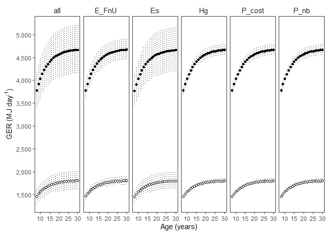

GER Sensitivity Analysis - for Pregnant only and lactating only
================
Selina Agbayani
12 August 2025

``` r
# Set path for output figures: 
Figurespath <- paste0(getwd(), "/gross_energetic_reqs/figures", collapse = NULL)
Figurespath
```

    ## [1] "C:/Users/AgbayaniS/Documents/R/graywhale_energyreqs/gross_energetic_reqs/figures"

``` r
# Set path for input & output data  
datapath <- paste0(getwd(), "/data", collapse = NULL) 
datapath
```

    ## [1] "C:/Users/AgbayaniS/Documents/R/graywhale_energyreqs/data"

``` r
## Read data in Activity Cost Reference, Production Cost, Es
A_cost_reference <- as_tibble(
  read_csv("data/ActivityCost_ReferenceData_BreathsPerDay_Table_VA_2017_original_sources.csv"),
  col_types = (list(cols(  ID = col_double(),
                           Lifestage = col_character(),
                           Description = col_character(),
                           Activity_stages = col_character(),
                           no_days = col_double(),
                           source_no_days = col_character(),
                           bpm = col_double(),
                           se_bpm = col_double(),
                           source_bpm = col_character(),
                           age_yrs = col_double(),
                           age_yrs_min = col_double(),
                           age_yrs_max = col_double(),
                           pct_O2 = col_double(),
                           pct_O2_sd = col_double()
  )
  )
  )
)

kable(head(A_cost_reference))
```

| ID | Lifestage | Description | Activity_stages | no_days | source_no_days | bpm | se_bpm | source_bpm | age_yrs | age_yrs_min | age_yrs_max | pct_O2 | pct_O2_sd |
|---:|:---|:---|:---|---:|:---|---:|---:|:---|---:|---:|---:|---:|---:|
| 1 | Calf | Lagoon 0-1 mths (Jan) | calving grounds | 31 | Sumich (1986); Findley & Vidal (2002); Pike 1962 | 2.14 | 0.5 | Sumich (1986) as cited in Villegas-Amtmann et al. 2017 | 0.0849315 | 0.0000100 | 0.0849315 | 10.5 | 3 |
| 2 | Calf | Lagoon 2 mth (Feb) | calving grounds | 28 | Sumich (1986); Findley & Vidal (2002); Pike 1962 | 1.56 | 0.4 | Sumich (1986) as cited in Villegas-Amtmann et al. 2017 | 0.1616438 | 0.0849315 | 0.1616438 | 10.5 | 3 |
| 3 | Calf | Lagoon 3 mths (Mar) | calving grounds | 15 | Sumich (1986); Findley & Vidal (2002); Rice and Wolman 1971 | 1.39 | 0.3 | Sumich (1986) as cited in Villegas-Amtmann et al. 2017 | 0.2465753 | 0.1616438 | 0.2465753 | 10.5 | 3 |
| 4 | Calf | Northbound 3 mths (Mar) | northbound | 16 | Rodriguez de la Gala Hernandez 2008; Perryman et al. 2010; Poole 1984; Rice and Wolman 1971; Leatherwood 1974 | 0.70 | 0.1 | Rodriguez de la Gala-Hernandez et al. (2008) | 0.2465753 | 0.1616438 | 0.2465753 | 10.5 | 3 |
| 5 | Calf | Northbound 4 mths (Apr) | northbound | 30 | Poole (1984); Rodriguez de la Gala Hernandez et al. 2008; Perryman et al. 2010; Leatherwood 1974 | 0.70 | 0.1 | Rodriguez de la Gala-Hernandez et al. (2008) | 0.3287671 | 0.2465753 | 0.3287671 | 10.5 | 3 |
| 6 | Calf | Northbound 5 mths (May) | northbound | 31 | Braham (1984), Poole (1984); Rodriguez de la Gala Hernandez et al. 2008; Perryman et al. 2010; Rice and Wolman 1971; Leatherwood 1974 | 0.70 | 0.1 | Rodriguez de la Gala-Hernandez et al. (2008) | 0.4136986 | 0.3287671 | 0.4136986 | 10.5 | 3 |

``` r
Activity_days <- A_cost_reference %>% select(Lifestage, Activity_stages, no_days) %>%  
  group_by(Lifestage, Activity_stages) %>% 
  summarise(no_days = sum(no_days))
```

    ## `summarise()` has grouped output by 'Lifestage'. You can override using the
    ## `.groups` argument.

``` r
kable(head(Activity_days))
```

| Lifestage      | Activity_stages             | no_days |
|:---------------|:----------------------------|--------:|
| Calf           | calving grounds             |      74 |
| Calf           | northbound                  |     100 |
| Calf           | nursing at foraging grounds |     119 |
| Calf           | southbound post-weaning     |      72 |
| Juvenile/Adult | calving grounds             |      30 |
| Juvenile/Adult | foraging                    |     154 |

``` r
P_cost_table <- as_tibble(
  read_csv("data/P_cost_table_phase1.csv"),
  col_types = (list(cols(age_mth = col_double(),
                         age_yrs = col_double(),
                         mean_masschange = col_double(),
                         sd_masschange = col_double(),
                         sex = col_character(),
                         mean_P = col_double(),
                         sd_P = col_double(),
                         quant025 = col_double(),
                         quant975 = col_double(),
                         p_lipid = col_double(),
                         p_protein = col_double()
  )
  )
  )
) 


#P_cost_table <- P_cost_table %>% dplyr::filter(age_yrs >= 0)
kable(head(P_cost_table))
```

| age_mth | age_yrs | mean_masschange | sd_masschange | sex | mean_P | sd_P | quant025 | quant975 | p_lipid | p_protein | mass | mass_sd | Ts | mean_masschange_perday | sd_masschange_perday | mean_P_perday | sd_P_perday |
|---:|---:|---:|---:|:---|---:|---:|---:|---:|---:|---:|---:|---:|---:|---:|---:|---:|---:|
| 0 | 0.0000000 | 982.8522 | 27.098452 | N/A | 16981.262 | 821.2318 | 15470.356 | 15470.356 | 0.3638438 | 0.1260 | 983.0272 | 26.76770 | 0 | Inf | Inf | Inf | Inf |
| 1 | 0.0849315 | 515.1631 | 10.503953 | N/A | 8724.966 | 395.5805 | 8014.291 | 8014.291 | 0.3898447 | 0.1116 | 1498.2581 | 37.14344 | 31 | 16.61816 | 0.3388372 | 281.4505 | 12.76066 |
| 2 | 0.1616438 | 505.4539 | 16.273872 | N/A | 8387.981 | 439.8056 | 7571.593 | 7571.593 | 0.3721566 | 0.0972 | 2003.8171 | 53.21868 | 28 | 18.05192 | 0.5812097 | 299.5708 | 15.70734 |
| 3 | 0.2465753 | 576.5720 | 17.546305 | N/A | 9568.192 | 491.4354 | 8660.599 | 8660.599 | 0.3872586 | 0.0972 | 2580.5024 | 70.55082 | 31 | 18.59910 | 0.5660098 | 308.6514 | 15.85276 |
| 4 | 0.3287671 | 553.7534 | 12.326696 | N/A | 9189.554 | 431.4328 | 8408.886 | 8408.886 | 0.3358296 | 0.0972 | 3134.3355 | 82.72707 | 30 | 18.45845 | 0.4108899 | 306.3185 | 14.38109 |
| 5 | 0.4136986 | 551.4791 | 8.258852 | N/A | 9151.843 | 402.0552 | 8449.346 | 8449.346 | 0.3745950 | 0.0972 | 3685.8679 | 90.88511 | 31 | 17.78965 | 0.2664146 | 295.2208 | 12.96952 |

``` r
P_cost_table_preg  <-  as_tibble(
  read_csv("data/P_cost_table_preg.csv"),
  col_types = list(cols(age_yrs = col_double(),
                        mean_masschange = col_double(),
                        sd_masschange = col_double(),
                        sex = col_character(),
                        mean_P = col_double(),
                        sd_P = col_double(),
                        p_lipid = col_double(),
                        p_protein = col_double()
  )
  )
)


P_cost_table_preg$Ts <-  396

P_cost_table_lact <- as_tibble(
  read_csv("data/P_cost_table_lact.csv"),
  col_types = list(cols(age_yrs = col_double(),
                        mean_masschange = col_double(),
                        sd_masschange = col_double(),
                        sex = col_character(),
                        mean_P = col_double(),
                        sd_P = col_double(),
                        p_lipid = col_double(),
                        p_protein = col_double()
  )
  )
)

P_cost_table_lact$Ts <-  365


Es_preg_table <- as_tibble(
  read_csv("data/Es_sensAnalysis_preg_peryear_source_bpm.csv"),
  col_types = (list(cols(age_yrs = col_double(),
                         Lifestage = col_character(),
                         no_days = col_double(),
                         Es = col_double(),
                         Es_sd = col_double()
  )
  )
  )
)

kable(head(Es_preg_table))
```

| age_yrs | Lifestage | no_days | MC_variable |       Es |     Es_sd | Es_perday | Es_perday_sd |
|--------:|:----------|--------:|:------------|---------:|----------:|----------:|-------------:|
|       8 | Pregnant  |     396 | all         | 358005.5 | 60896.633 |  904.0543 |   153.779377 |
|       8 | Pregnant  |     396 | Rs          | 335071.9 |  3282.733 |  846.1412 |     8.289731 |
|       8 | Pregnant  |     396 | Vt          | 336264.2 |  4766.348 |  849.1521 |    12.036233 |
|       8 | Pregnant  |     396 | pctO2       | 355267.5 | 57261.854 |  897.1401 |   144.600641 |
|       9 | Pregnant  |     396 | all         | 379160.3 | 64274.929 |  957.4756 |   162.310427 |
|       9 | Pregnant  |     396 | Rs          | 355049.1 |  3478.452 |  896.5887 |     8.783970 |

``` r
Es_lact_table <- as_tibble(
  read_csv("data/Es_sensAnalysis_lact_peryear_source_bpm.csv"),
  col_types = (list(cols(age_yrs = col_double(),
                         Lifestage = col_character(),
                         no_days = col_double(),
                         Es = col_double(),
                         Es_sd = col_double()
  )                                   
  )
  )
)


kable(head(Es_lact_table))
```

| age_yrs | Lifestage | no_days | MC_variable | Es | Es_sd | Es_perday | Es_perday_sd |
|---:|:---|---:|:---|---:|---:|---:|---:|
| 8 | Lactating | 365 | all | 258700.3 | 37107.6953 | 708.7680 | 101.6649186 |
| 8 | Lactating | 365 | Rs | 257831.2 | 314.6498 | 706.3868 | 0.8620541 |
| 8 | Lactating | 365 | Vt | 257828.6 | 2090.7220 | 706.3797 | 5.7280055 |
| 8 | Lactating | 365 | pctO2 | 257787.1 | 35048.4037 | 706.2660 | 96.0230239 |
| 9 | Lactating | 365 | all | 274060.9 | 39177.0048 | 750.8519 | 107.3342596 |
| 9 | Lactating | 365 | Rs | 273203.2 | 333.4094 | 748.5020 | 0.9134503 |

``` r
mass_table <- as_tibble(
  read_csv("data/mass_table.csv"),
  col_types = (list(cols(age_yrs = col_double(),
                         mean_mass = col_double(),
                         sd_mass = col_double(),
                         mean_lwr = col_double(),
                         mean_upr = col_double(),
                         quant025 = col_double(),
                         quant975 = col_double(),
                         female_mass = col_double(),
                         male_mass = col_double()
  )
  )
  )
)


mean_masschange <- as_tibble(
  read_csv("data/mean_masschange.csv"),
  col_types = (list(cols(age_yrs = col_double(),
                         mean_masschange = col_double(),
                         sd_masschange = col_double(),
                         sex = col_character(),
                         age_mth = col_double()
  )
  )
  )
)


mean_masschange <- mean_masschange %>% dplyr::filter(age_yrs >=0)
kable(head(mean_masschange))
```

|   age_yrs | mean_masschange | sd_masschange | sex | age_mth |
|----------:|----------------:|--------------:|:----|--------:|
| 0.0000000 |        982.8522 |     27.098452 | N/A |       0 |
| 0.0849315 |        515.1631 |     10.503953 | N/A |       1 |
| 0.1616438 |        505.4539 |     16.273872 | N/A |       2 |
| 0.2465753 |        576.5720 |     17.546305 | N/A |       3 |
| 0.3287671 |        553.7534 |     12.326696 | N/A |       4 |
| 0.4136986 |        551.4791 |      8.258852 | N/A |       5 |

``` r
mean_masschange_peryear <- as_tibble(
  read_csv("data/mean_masschange_per_year.csv"),
  col_types = (list(cols(age_yrs = col_double(),
                         mean_masschange = col_double(),
                         sd_masschange = col_double(),
                         sex = col_character()
  )
  )
  )
)

mean_masschange_peryear <- mean_masschange_peryear %>% dplyr::filter(age_yrs >= 0)
kable(head(mean_masschange_peryear))
```

| age_yrs | mean_masschange | sd_masschange | sex |
|--------:|----------------:|--------------:|:----|
|       0 |        982.8522 |     27.098452 | N/A |
|       1 |       5088.6824 |    177.509836 | N/A |
|       2 |       1602.5843 |     40.358507 | N/A |
|       3 |       1535.7051 |     14.436330 | N/A |
|       4 |       1428.4931 |      8.591593 | N/A |
|       5 |       1299.6519 |     19.059815 | N/A |

``` r
age_yr_tibble <- as_tibble(
  read_csv("data/age_yr_tibble.csv"), 
  col_types = (list(ID = col_integer(),
                    month = col_character(),
                    no_days_in_mth = col_double(),
                    age_mth = col_double(),
                    no_days_cumul = col_double(),
                    age_yrs = col_double()
  )
  )
)

kable(age_yr_tibble)
```

| month | no_days_in_mth | age_mth | no_days_cumul |   age_yrs |
|:------|---------------:|--------:|--------------:|----------:|
| Jan   |            0.0 |     0.0 |           0.0 | 0.0000000 |
| Jan   |           15.5 |     0.5 |          15.5 | 0.0424658 |
| Jan   |           15.5 |     1.0 |          31.0 | 0.0849315 |
| Feb   |           14.0 |     1.5 |          45.0 | 0.1232877 |
| Feb   |           14.0 |     2.0 |          59.0 | 0.1616438 |
| Mar   |           15.5 |     2.5 |          74.5 | 0.2041096 |
| Mar   |           15.5 |     3.0 |          90.0 | 0.2465753 |
| Apr   |           15.0 |     3.5 |         105.0 | 0.2876712 |
| Apr   |           15.0 |     4.0 |         120.0 | 0.3287671 |
| May   |           15.5 |     4.5 |         135.5 | 0.3712329 |
| May   |           15.5 |     5.0 |         151.0 | 0.4136986 |
| Jun   |           15.0 |     5.5 |         166.0 | 0.4547945 |
| Jun   |           15.0 |     6.0 |         181.0 | 0.4958904 |
| Jul   |           15.5 |     6.5 |         196.5 | 0.5383562 |
| Jul   |           15.5 |     7.0 |         212.0 | 0.5808219 |
| Aug   |           15.5 |     7.5 |         227.5 | 0.6232877 |
| Aug   |           15.5 |     8.0 |         243.0 | 0.6657534 |
| Sep   |           15.0 |     8.5 |         258.0 | 0.7068493 |
| Sep   |           15.0 |     9.0 |         273.0 | 0.7479452 |
| Oct   |           15.5 |     9.5 |         288.5 | 0.7904110 |
| Oct   |           15.5 |    10.0 |         304.0 | 0.8328767 |
| Nov   |           15.0 |    10.5 |         319.0 | 0.8739726 |
| Nov   |           15.0 |    11.0 |         334.0 | 0.9150685 |
| Dec   |           15.5 |    11.5 |         349.5 | 0.9575342 |
| Dec   |           15.5 |    12.0 |         365.0 | 1.0000000 |

``` r
predict_GER_table_sensAnalysis_phase2  <- as_tibble(
  read_csv("data/predict_GER_table_sensAnalysis_phase2.csv"),
  col_types = (list(ID = col_integer(),
                    phase = col_double(),
                    age_yrs = col_double(),
                    sex = col_character(),
                    MC_variable = col_character(),
                    mean_GER = col_double(),
                    GER_sd = col_double(),
                    quant025 = col_double(),
                    quant975 = col_double(),
                    GER_foraging = col_double(),
                    sd_foraging = col_double(),
                    quant025_foraging = col_double(),
                    quant975_foraging = col_double(),
                    FR_foraging = col_double(),
                    FR_sd_foraging = col_double(),
                    FR_quant025 = col_double(),
                    FR_quant975 = col_double(),
                    Ts = col_double(),
                    mean_mass = col_double(),
                    percent_body_weight_consumed = col_double()
  )))


TotalGER_birth_to_weaning_tibble <- as_tibble(
  read_csv("data/TotalGER_birth_to_weaning_tibble.csv"),
  col_types = (list(ID = col_integer(),
                    age_range = col_character(),
                    sex = col_character(),
                    Total_GER = col_double(),
                    Total_GER_sd = col_double(), 
                    details = col_character()
  )))


kable(TotalGER_birth_to_weaning_tibble)
```

| age_range | sex | Total_GER | Total_GER_sd | details |
|:---|:---|---:|---:|:---|
| 0 to 6 mths | N/A | 100915.28 | 130.1483 | birth to end of nursing mother fasting |
| 7 to 9.6 mths | N/A | 78807.66 | 184.8964 | start of nursing mother foraging to weaning |
| 0 to 9.6 mths | N/A | 179722.94 | 226.1090 | birth to weaning |

``` r
#Energy Density values
ED_milk = 22.33 #MJ/kg   Average between Tomilin 1946 and Zenkovich 1938,    (Sumich 1986 - cited 22.4  MJ/kg)


MC_reps = 10000
```

#### Gross Energy Requirement for pregnant only

``` r
predict_GER_table_sensAnalysis_preg_only <- as.data.frame(matrix(ncol = 22, nrow = 0))

cnames <- c("phase", "age_yrs", "MC_variable", 
            "mean_GER", "GER_sd", 
            "quant025", "quant975", 
            "GER_foraging", "sd_foraging",
            "quant025_foraging", "quant975_foraging",   #2.5% and 97.5% quantile from bootstrap estimates
            "FR_foraging", "FR_sd_foraging",
            "FR_quant025","FR_quant975",
            "Hg", "Hg_sd",
            "P_nb", 
            "mass","mass_sd", "pctbodywt", "pctbodywt_sd"
)            

colnames(predict_GER_table_sensAnalysis_preg_only) <- cnames

predict_GER_table_sensAnalysis_preg_only <- as_tibble(
  predict_GER_table_sensAnalysis_preg_only,
  col_types = (list(phase = col_character(),
                    age_yrs = col_double(), 
                    MC_variable = col_character(), 
                    mean_GER = col_double(), 
                    GER_sd = col_double(), 
                    quant025 = col_double(), 
                    quant975 = col_double(), 
                    GER_foraging = col_double(),
                    sd_foraging = col_double(), 
                    quant025_foraging = col_double(),
                    quant975_foraging = col_double(),
                    FR_foraging = col_double(),
                    FR_sd_foraging = col_double(),
                    FR_quant025 = col_double(),
                    FR_quant975 = col_double(),
                    Hg = col_double(),
                    Hg_sd = col_double(),
                    P_nb = col_double(),
                    mass = col_double(),
                    mass_sd = col_double(),
                    pctbodywt = col_double(),
                    pctbodywt_sd = col_double()
  )
  )
)


for (i in seq(from = 8, to = 75, by = 1)){
  for (MC_var in c("all","Hg","P_nb", "P_cost", "Es", "E_FnU")){
    age <-  i
    s <- "Female"
    phase <- "Pregnant"
    
    MC_var
    
    # Mass values
    mass_foetus <- mass_table %>% filter(age_yrs == 0) 
    mass_foetus_40pct <- mass_foetus$mean_mass * 0.4 
    
    mass_female <- mass_table %>% 
      filter(age_yrs == age) %>% 
      select(female_mass) %>% 
      pull(female_mass)
    mass_preg <- mass_female + mass_foetus_40pct
    
    if (MC_var == "all"){
      mass_foetus_40pct_sd <- mass_foetus$sd_mass * 0.4
      mass_female_sd <- mass_table %>% 
        filter(age_yrs == age) %>% 
        select(sd_mass) %>% 
        pull(sd_mass)
      mass_preg_sd <- sqrt((mass_female_sd^2)+(mass_foetus_40pct_sd^2))
    } else {
      mass_preg_sd <-0
    }
    
    # Mass of newborn (for Hg calcs)
    Mnb <- mass_foetus$mean_mass
    if (MC_var == "all" || MC_var == "Hg"){
      sd_Mnb <- mass_foetus$sd_mass  # sd of mass of newborn (kg)
    } else {
      sd_Mnb <-  0
    }
    
    
    # Production cost values
    P_cost_i <- P_cost_table_preg %>%
      filter(P_cost_table_preg$age_yrs == age)
    P_cost_i <- P_cost_i %>%
      filter(P_cost_i$sex == s)
    
    mean_P <- P_cost_i$mean_P_perday * 396
    
    if (MC_var == "all" || MC_var == "P_cost"){
      sd_P <-  P_cost_i$sd_P_perday * 396
    } else {
      sd_P <-  0
    }
    
    # Production cost - newborn
    P_nb_table <- P_cost_table %>% 
      filter(age_yrs == 0 & sex == "N/A")
    
    P_nb <- P_nb_table %>% pull(mean_P)
    if (MC_var == "all" || MC_var == "P_nb"){
      P_nb_sd <- P_nb_table %>% pull(sd_P)
    } else {
      P_nb_sd <- 0
    }
    
    # Energetic expenditure values
    Es_table_i <- Es_preg_table %>%
      filter(Es_preg_table$age_yrs == age)
    
    Es <- Es_table_i$Es
    if (MC_var == "all" || MC_var == "Es"){
      Es_sd <- Es_table_i$Es_sd
    } else {
      Es_sd <- 0
    }
      
    T_s <- Es_table_i$no_days
    
    #Fecal and Urinary cost - E_FnU
    E_FnU_min = 0.740
    E_FnU_max = 0.858
    E_FnU_mean = (E_FnU_min + E_FnU_max)/2
    
    #Energetic density of Prey - ED_prey
    ED_prey_mean = 2.90 #MJ/kg  from average I calculated... 
    ED_prey_min = 2.51   #from Coyle et al. 2007
    ED_prey_max = 3.41   #from Stoker 1978
    
    if (MC_var == "all"){
      ED_prey_sd = 0.0408  #calculated from table 3  
    } else {
      ED_prey_sd = 0
    }
    
   # Monte Carlo - Production cost 
    set.seed(12345)
    MC_vars_i <- as_tibble(rnorm(MC_reps, mean_P, sd_P))
    names(MC_vars_i)[1] <- "P_cost"
    
    MC_vars_i$sex <- s   # do i need to identify sex here?
    MC_vars_i$GER <- NA
    MC_vars_i<- MC_vars_i %>%  
      relocate(sex, GER) #move sex to the first column
    
    # Monte carlo - Es
    set.seed(12345)
    Es_i <-  as_tibble(rnorm(MC_reps, Es, Es_sd))
    names(Es_i)[1] <- "Es"
    
    MC_vars_i <- cbind(MC_vars_i, Es_i)
    
    #### Monte carlo - Fecal and urinary waste - E_FnU
    set.seed(12345)
    if (MC_var == "E_FnU" || MC_var == "all"){
      #runif -- random uniform distribution
      E_FnU_i <- as_tibble(runif(MC_reps, min = E_FnU_min, max = E_FnU_max)) 
    } else {
      E_FnU_i <- as_tibble(runif(MC_reps, min = E_FnU_mean, max = E_FnU_mean)) 
    }
    names(E_FnU_i)[1] <- "E_FnU"
    
    MC_vars_i <- cbind(MC_vars_i, E_FnU_i)

    #### Monte carlo - Energetic density of prey - ED_prey
    # rnorm -- random normal distribution
    ED_prey_i <- as_tibble(rnorm(MC_reps, ED_prey_mean, ED_prey_sd))
    names(ED_prey_i)[1] <- "ED_prey"
    
    MC_vars_i <- cbind(MC_vars_i, ED_prey_i)
    
    # Monte Carlo - mass (for pct body wt calcs)
    set.seed(12345)
    mass_i <- as_tibble(rnorm(MC_reps, mass_preg, mass_preg_sd))
    names(mass_i)[1] <- "mass"
    
    MC_vars_i <- cbind(MC_vars_i, mass_i)
    
    # Heat increment of gestation
    set.seed(1234)
    Mnb_i <- rnorm(MC_reps, Mnb, sd_Mnb)
    Mnb_table <- as_tibble(Mnb_i)
    names(Mnb_table)[1] <- "Mnb"
    
    #(Brody 1945)  Q (Cal) = 4400 Cal x M^1.2 (kg)
    Hg <- 18.41 * (Mnb_table$Mnb^1.2)  
    # Hg <- 18.41 MJ x M^1.2 kg         
    Hg_i <- as_tibble(Hg)
    names(Hg_i)[1] <- "Hg"
    MC_vars_i <- cbind(MC_vars_i, Hg_i)
    
    #Production cost of newborn calf
    P_nb_i <- as_tibble(rnorm(MC_reps, P_nb, P_nb_sd))
    names(P_nb_i)[1] <- "P_nb"
    MC_vars_i <- cbind(MC_vars_i, P_nb_i)
    
    # Pcost of mother
    P_cost <- MC_vars_i$P_cost 
    Es <- MC_vars_i$Es
    E_FnU <- MC_vars_i$E_FnU

    #E_HIF <- MC_vars_i$E_HIF
    Hg <- MC_vars_i$Hg
    P_nb <- MC_vars_i$P_nb
    GERcalf_0to6m <- MC_vars_i$GERcalf_0to6m
    
    #GER  preg  = GER preg whale ONLY
    #Es includes digestion, maintenance and activity          

    MC_vars_i$GER <- ((P_cost + Es + Hg + P_nb)/396)/E_FnU  #total days pregnant = 396
    MC_vars_i$GER_foraging <- ((P_cost + Es + Hg + P_nb)/153)/E_FnU  ## days foraging pregnant = 153
    
    MC_vars_i$FR_foraging <- (MC_vars_i$GER_foraging / MC_vars_i$ED_prey) 
    MC_vars_i$pctbodywt <- (MC_vars_i$FR_foraging / MC_vars_i$mass)*100 
    
    MC_vars_i <- MC_vars_i %>% mutate(ID = row_number())
    
    # move ID to the first column
    MC_vars_i<- MC_vars_i %>% relocate(ID) 
    
    mean_GER_i <- mean(MC_vars_i$GER)
    sd_GER_i <- sd(MC_vars_i$GER)
    
    quant025 <- quantile(MC_vars_i$GER, 0.025, na.rm = TRUE)
    quant975 <- quantile(MC_vars_i$GER, 0.975, na.rm = TRUE)
    
    GER_foraging_i <- mean(MC_vars_i$GER_foraging)
    sd_foraging_i <- sd(MC_vars_i$GER_foraging)
    
    quant025_foraging <- quantile(MC_vars_i$GER_foraging, 0.025, na.rm = TRUE)
    quant975_foraging <- quantile(MC_vars_i$GER_foraging, 0.975, na.rm = TRUE)
    
    
    FR_foraging_i <- mean(MC_vars_i$FR_foraging)
    FR_sd_foraging_i <- sd(MC_vars_i$FR_foraging)
    
    FR_quant025_i <- quantile(MC_vars_i$FR_foraging, 0.025, na.rm = TRUE)
    FR_quant975_i <- quantile(MC_vars_i$FR_foraging, 0.975, na.rm = TRUE)
    
    pctbodywt <- mean(MC_vars_i$pctbodywt)
    pctbodywt_sd <- sd(MC_vars_i$pctbodywt)
    
    mean_Hg_i <- mean(Hg)
    sd_Hg_i <- sd(Hg)
    
    mass_i <- mean(MC_vars_i$mass)
    mass_sd_i <- sd(MC_vars_i$mass)
    
    P_nb_i <- mean(P_nb)
    
    MC_vars_i <- MC_vars_i %>%  mutate(ID = row_number())
    MC_vars_i<- MC_vars_i %>%  relocate(ID) # move ID to the first column
    
    
    row <- tibble(phase = phase,
                  age_yrs = age, 
                  MC_variable = MC_var,
                  mean_GER = mean_GER_i, 
                  GER_sd = sd_GER_i, 
                  quant025 = quant025, 
                  quant975 = quant975, 
                  GER_foraging = GER_foraging_i,
                  sd_foraging = sd_foraging_i, 
                  quant025_foraging = quant025_foraging,
                  quant975_foraging = quant975_foraging,
                  FR_foraging = FR_foraging_i,
                  FR_sd_foraging = FR_sd_foraging_i,
                  FR_quant025 = FR_quant025_i,
                  FR_quant975 = FR_quant975_i,
                  Hg = mean_Hg_i,
                  sd_Hg = sd_Hg_i,
                  P_nb = P_nb_i,
                  mass = mass_i,
                  mass_sd = mass_sd_i,
                  pctbodywt = pctbodywt,
                  pctbodywt_sd = pctbodywt_sd
    )
    
    predict_GER_table_sensAnalysis_preg_only <- 
      rbind(predict_GER_table_sensAnalysis_preg_only, row)
    
  }
}


predict_GER_table_sensAnalysis_preg_only %>% 
  write_csv("data/predict_GER_table_sensAnalysis_preg_ONLY.csv", 
            na = "", append = FALSE)
```

#### GER Sensitivity analysis for pregnant whales (only)

<!-- -->

### Gross Energy Requirements for Lactating only

``` r
predict_GER_table_sensAnalysis_lact_all <- 
  as.data.frame(matrix(ncol = 20, nrow = 0))

cnames <- c("phase","age_yrs", "MC_variable", 
            "mean_GER", "GER_sd", 
            "quant025", "quant975", 
            "GER_foraging", "sd_foraging",
            "quant025_foraging", "quant975_foraging",   #2.5% and 97.5% quantile from bootstrap estimates
            "FR_foraging", "FR_sd_foraging",
            "FR_quant025","FR_quant975",
            "GERcalf0to9.6mths", 
             "mass","mass_sd", "pctbodywt", "pctbodywt_sd"
)            

colnames(predict_GER_table_sensAnalysis_lact_all) <- cnames

predict_GER_table_sensAnalysis_lact_all <- as_tibble(
  predict_GER_table_sensAnalysis_lact_all,
  col_types = (list(ID = col_integer(),
                    phase = col_character(),
                    age_yrs = col_double(), 
                    MC_variable = col_character(),
                    mean_GER = col_double(), 
                    GER_sd = col_double(), 
                    quant025 = col_double(), 
                    quant975 = col_double(), 
                    GER_foraging = col_double(),
                    sd_foraging = col_double(), 
                    quant025_foraging = col_double(),
                    quant975_foraging = col_double(),
                    FR_foraging = col_double(),
                    FR_sd_foraging = col_double(),
                    FR_quant025 = col_double(),
                    FR_quant975 = col_double(),
                    GERcalf0to9.6mths = col_double(),
                    mass = col_double(),
                    mass_sd = col_double(),
                    pctbodywt = col_double(),
                    pctbodywt_sd = col_double()
  )
  )
)


for (i in seq(from = 8, to = 74, by = 1)){
  for (MC_var in c("all","P_cost","Es","GERcalf","E_FnU")){
    
    age <-  i
    s <- "Female"
    phase <- "Lactating"
    
    
    mass <- mass_table %>% 
      dplyr::filter(age_yrs == age) %>% 
      dplyr::select(mean_mass) %>% 
      pull(mean_mass)
    
    if (MC_var == "all"){
      mass_sd <- mass_table %>% 
        dplyr::filter(age_yrs == age) %>% 
        dplyr::select(sd_mass) %>% 
        pull(sd_mass)
    } else {
      mass_sd <-0
    }
    
    # Production cost values
    P_cost_i <- P_cost_table_lact %>% 
      dplyr::filter(P_cost_table_lact$age_yrs == age)  
    P_cost_i <- P_cost_i %>% 
      dplyr::filter(P_cost_i$sex == s) 
    
    # no of days
    Ts <- P_cost_i$Ts
    
    mean_P <- P_cost_i$mean_P
    
    if (MC_var == "all" || MC_var == "P_cost"){
      sd_P <-  P_cost_i$sd_P
    } else {
      sd_P <- 0
    }
    
    # Energy expenditure values
    Es_table_i <- Es_lact_table %>% 
      dplyr::filter(Es_lact_table$age_yrs == age & 
                      Lifestage == "Lactating") 
    Es <- Es_table_i$Es
    
    if (MC_var == "all" || MC_var == "Es"){
      Es_sd <- Es_table_i$Es_sd
    } else {
      Es_sd <- 0
    }
    
    #Fecal and Urinary cost - E_FnU
    E_FnU_min = 0.740
    E_FnU_max = 0.858
    E_FnU_mean = (E_FnU_min + E_FnU_max)/2
    
    #Energetic density of Prey - ED_prey
    ED_prey_mean = 2.90 #MJ/kg  from average I calculated... 
    ED_prey_min = 2.51   #from Coyle et al. 2007
    ED_prey_max = 3.41   #from Stoker 1978
    
    if (MC_var == "all"){
      ED_prey_sd = 0.0408  #calculated from table 3  
    } else {
      ED_prey_sd = 0
    }
    
    
    # GER Calf 7 to 9.6 (nursing)
    GERcalf0to9.6mths_tibble <-  TotalGER_birth_to_weaning_tibble %>% 
      filter(age_range == "0 to 9.6 mths") 
    GERcalf0to9.6mths <- GERcalf0to9.6mths_tibble$Total_GER
    
    if (MC_var == "all" || MC_var == "GERcalf"){
      GERcalf0to9.6mths_sd <- GERcalf0to9.6mths_tibble$Total_GER_sd
    } else {
      GERcalf0to9.6mths_sd <- 0
    }
    
    
    # Monte carlo - Production cost
    set.seed(12345)
    MC_vars_i <- as_tibble(rnorm(MC_reps, mean_P, sd_P))
    names(MC_vars_i)[1] <- "P_cost"
    
    MC_vars_i$sex <- s   # do i need to identify sex here?
    MC_vars_i$GER <- NA
    MC_vars_i<- MC_vars_i %>%  
      dplyr::select(sex, GER, everything()) #move sex to the first column
    
    # Monte carlo - Es
    set.seed(12345)
    Es_i <-  as_tibble(rnorm(MC_reps, Es, Es_sd))
    names(Es_i)[1] <- "Es"
    
    MC_vars_i <- cbind(MC_vars_i, Es_i)
    
    # Monte carlo - Fecal and urinary waste - E_FnU
    set.seed(12345)
    if (MC_var == "E_FnU" || MC_var == "all"){
      E_FnU_i <- as_tibble(runif(MC_reps, min = E_FnU_min, max = E_FnU_max)) 
    } else {
      E_FnU_i <- as_tibble(runif(MC_reps, min = E_FnU_mean, max = E_FnU_mean)) 
    }
    names(E_FnU_i)[1] <- "E_FnU"
    
    MC_vars_i <- cbind(MC_vars_i, E_FnU_i)
    
    # Monte carlo - ED_prey
    ED_prey_i <- as_tibble(rnorm(MC_reps, ED_prey_mean, ED_prey_sd))
    names(ED_prey_i)[1] <- "ED_prey"
    
    MC_vars_i <- cbind(MC_vars_i, ED_prey_i)
    
    # Monte Carlo - mass (for pct body wt calcs)
    set.seed(12345)
    mass_i <- as_tibble(rnorm(MC_reps, mass , mass_sd))
    names(mass_i)[1] <- "mass"
    
    MC_vars_i <- cbind(MC_vars_i, mass_i)

    # Monte carlo - GER Calf - 0 to 9.6 mths (birth to weaning)
    GERcalf0to9.6mths_tibble <- as_tibble(rnorm(MC_reps, GERcalf0to9.6mths, GERcalf0to9.6mths_sd))
    #names(GERcalf0to9.6mths)[1] <- "GERcalf0to9.6mths"
    GERcalf0to9.6mths_tibble <- GERcalf0to9.6mths_tibble %>% rename("GERcalf0to9.6mths"="value")
    
    MC_vars_i <- cbind(MC_vars_i, GERcalf0to9.6mths)
    
    # Pcostof mother
    P_cost <- MC_vars_i$P_cost 
    Es <- MC_vars_i$Es
    E_FnU <- MC_vars_i$E_FnU
    GERcalf0to9.6mths <- MC_vars_i$GERcalf0to9.6mths
    
    #GER   Es - includes digestion, maintenance and activity
    MC_vars_i$GER <- ((P_cost + Es + GERcalf0to9.6mths)/293)/(E_FnU) 
    # 293 days total nursing 
    MC_vars_i$GER_foraging <- ((P_cost + Es + GERcalf0to9.6mths)/119)/(E_FnU)  
    # 119 days foraging while lactating
    
    
    MC_vars_i$FR_foraging <- (MC_vars_i$GER_foraging / MC_vars_i$ED_prey) 
    MC_vars_i$pctbodywt <- (MC_vars_i$FR_foraging / MC_vars_i$mass)*100 
    
    MC_vars_i <- MC_vars_i %>%  dplyr::mutate(ID = row_number())
    MC_vars_i<- MC_vars_i %>%  
      dplyr::select(ID,everything()) # move ID to the first column
    
    mean_GER_i <- mean(MC_vars_i$GER)
    sd_GER_i <- sd(MC_vars_i$GER)
    
    quant025 <- quantile(MC_vars_i$GER, 0.025, na.rm = TRUE)
    quant975 <- quantile(MC_vars_i$GER, 0.975, na.rm = TRUE)
    
    GER_foraging_i <- mean(MC_vars_i$GER_foraging)
    sd_foraging_i <- sd(MC_vars_i$GER_foraging)
    
    quant025_foraging <- quantile(MC_vars_i$GER_foraging, 0.025, na.rm = TRUE)
    quant975_foraging <- quantile(MC_vars_i$GER_foraging, 0.975, na.rm = TRUE)
    
    
    FR_foraging_i <- mean(MC_vars_i$FR_foraging)
    FR_sd_foraging_i <- sd(MC_vars_i$FR_foraging)
    
    FR_quant025_i <- quantile(MC_vars_i$FR_foraging, 0.025, na.rm = TRUE)
    FR_quant975_i <- quantile(MC_vars_i$FR_foraging, 0.975, na.rm = TRUE)
    
    pctbodywt <- mean(MC_vars_i$pctbodywt)
    pctbodywt_sd <- sd(MC_vars_i$pctbodywt)
    
    
    GERcalf0to9.6mths_i <- mean(GERcalf0to9.6mths)
    
    
    MC_vars_i <- MC_vars_i %>%  dplyr::mutate(ID = row_number())
    MC_vars_i<- MC_vars_i %>% 
      relocate(ID) # move ID to the first column
    
    
    newrow <- tibble(phase = phase, 
                  age_yrs = age, 
                  MC_variable = MC_var,
                  mean_GER = mean_GER_i, 
                  GER_sd = sd_GER_i, 
                  quant025 = quant025, 
                  quant975 = quant975, 
                  GER_foraging = GER_foraging_i,
                  sd_foraging = sd_foraging_i, 
                  quant025_foraging = quant025_foraging,
                  quant975_foraging = quant975_foraging,
                  FR_foraging = FR_foraging_i,
                  FR_sd_foraging = FR_sd_foraging_i,
                  FR_quant025 = FR_quant025_i,
                  FR_quant975 = FR_quant975_i,
                  GERcalf0to9.6mths = GERcalf0to9.6mths_i,
                  mass = mass,
                  mass_sd = mass_sd,
                  pctbodywt = pctbodywt,
                  pctbodywt_sd = pctbodywt_sd
    )
    
    predict_GER_table_sensAnalysis_lact_all <- 
      rbind(predict_GER_table_sensAnalysis_lact_all, newrow)
    
  }
}


predict_GER_table_sensAnalysis_lact_all %>% write_csv("data/predict_GER_table_sensAnalysis_lact_all.csv", na = "", append = FALSE)
```

#### GER Sensitiivity analysis for lactating whales (from birth to weaning at 9.6 months)

<!-- -->
