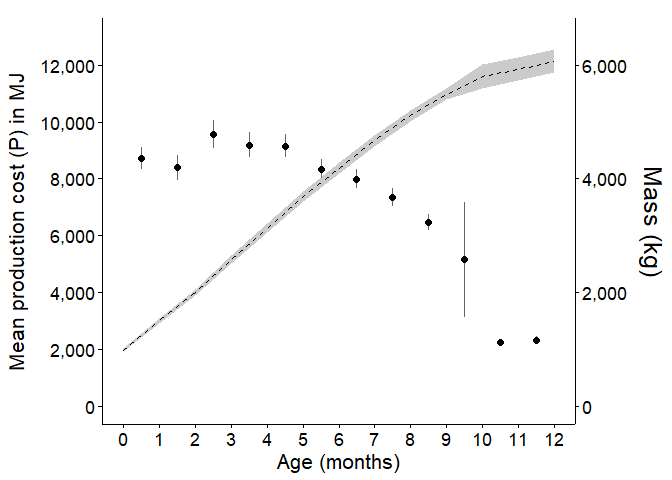
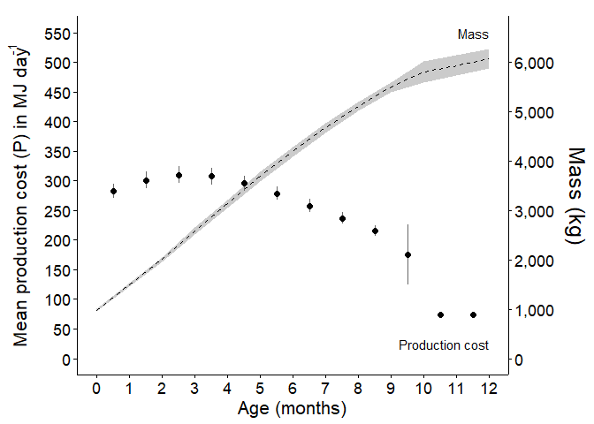

Production Cost - Phase 1 - per month
================
Seline Agbayani
June 17, 2022 - code updated and cleaned 04 July, 2025

``` r
############ Set path for output figures: ###############
Figurespath <- paste0(getwd(), "/production_cost/figures", collapse = NULL)
Figurespath
```

    ## [1] "C:/Users/AgbayaniS/Documents/R/graywhale_energyreqs/production_cost/figures"

``` r
############ Set path for input & output data  ###########
datapath <-  paste0(getwd(), "/data", collapse = NULL) 
datapath
```

    ## [1] "C:/Users/AgbayaniS/Documents/R/graywhale_energyreqs/data"

``` r
## Read data in (mean mass change)
mass_table <- as_tibble(
  read_csv("data/mass_table.csv"), #monthly
  col_types = (list(cols(age_yrs = col_double(),
                         mean_mass = col_double(),
                         sd_mass = col_double(),
                         mean_lwr = col_double(),
                         mean_upr = col_double(),
                         quant025 = col_double(),
                         quant975 = col_double(),
                         female_mass = col_double(),
                         male_mass = col_double()
                         )
                    )
               )
  )
```

    ## Rows: 173 Columns: 9
    ## ── Column specification ────────────────────────────────────────────────────────
    ## Delimiter: ","
    ## dbl (9): age_yrs, mean_mass, sd_mass, mean_lwr, mean_upr, quant025, quant975...
    ## 
    ## ℹ Use `spec()` to retrieve the full column specification for this data.
    ## ℹ Specify the column types or set `show_col_types = FALSE` to quiet this message.

``` r
mean_masschange <- as_tibble(
  read_csv("data/mean_masschange.csv"),
  col_types = (list(cols(age_yrs = col_double(),
                         mean_masschange = col_double(),
                         sd_masschange = col_double(),
                         sex = col_character(),
                         age_mth = col_integer()
                         )
                    )
               )
  )
```

    ## Rows: 39 Columns: 5
    ## ── Column specification ────────────────────────────────────────────────────────
    ## Delimiter: ","
    ## chr (1): sex
    ## dbl (4): age_yrs, mean_masschange, sd_masschange, age_mth
    ## 
    ## ℹ Use `spec()` to retrieve the full column specification for this data.
    ## ℹ Specify the column types or set `show_col_types = FALSE` to quiet this message.

``` r
kable(head(mean_masschange))
```

|   age_yrs | mean_masschange | sd_masschange | sex | age_mth |
|----------:|----------------:|--------------:|:----|--------:|
| 0.0000000 |        986.5660 |     20.894489 | N/A |       0 |
| 0.0849315 |        516.6026 |      8.099161 | N/A |       1 |
| 0.1616438 |        507.6841 |     12.548106 | N/A |       2 |
| 0.2465753 |        578.9767 |     13.529226 | N/A |       3 |
| 0.3287671 |        555.4428 |      9.504603 | N/A |       4 |
| 0.4136986 |        552.6109 |      6.368057 | N/A |       5 |

``` r
age_yr_tibble <- as_tibble(
  read_csv("data/age_yr_tibble.csv"),
  col_types = (list(cols(month = col_character(),
                         no_days_in_mth = col_double(),
                         age_mth = col_double(),
                         no_days_cumul = col_double(),
                         age_yrs = col_double()
                         )
                    )
               )
  )
```

    ## Rows: 25 Columns: 5
    ## ── Column specification ────────────────────────────────────────────────────────
    ## Delimiter: ","
    ## chr (1): month
    ## dbl (4): no_days_in_mth, age_mth, no_days_cumul, age_yrs
    ## 
    ## ℹ Use `spec()` to retrieve the full column specification for this data.
    ## ℹ Specify the column types or set `show_col_types = FALSE` to quiet this message.

**Calculate Production Costs (P) using equation from Winship et
al. 2002** P = change in Mass x \[(p_lipid x ED_lipid) + (1-p_lipid) x
(1-p_water) x ED_protein\]

Calculate Production Costs

``` r
#########  PRODUCTION COSTS  #########
# 
#Energy density of lipid (MJ/kg)  
#ED_lipid <- 39.3 #39300 KJ/kg * 0.001 - Schmidt-Nielsen (1990)
ED_lipid <- 39.7 #MJ/kg - Sumich 1986 Kleiber 1961

#Energy density of protein (MJ/kg)  
#ED_protein <- 18 #18000 KJ/KG * 0.001  = - Schmidt-Nielsen (1990); Winship et al. (2002)
ED_protein <- 23.7 #MJ/kg  - from Sumich 1986 Kleiber 1961

#From Sumich 1986
# p_lipid_newborn_calf <- 0.33   # based on one observation (highest lipid value observed for neonates)
# p_lipid_adult <-  0.39         # max value for p_lipid based on one A observation (Table 7.1)
p_lipid_min <- 0.33
p_lipid_max <- 0.39


# From Villegas-Amtmann (2015,2017) - values are for Grey whales
#p_lipid_adult <- 0.34         # F_lipid (%lipid mass) - min value for p_lipid
p_protein_nb <- 0.126         # F_protein - fraction newborn protein mass - calculated from muscle and other tissues
p_protein_7mo <- 0.0972       # fraction protein mass up to 7 months 

#Calculated From Rice & Wolman 1971
p_protein_adult_SB <-  0.1062   # fraction of protein in southbound adults (fat)
p_protein_adult_NB <- 0.1086   # fraction of protein in northbound adults (thin)
p_protein_adult <- (p_protein_adult_SB+p_protein_adult_NB)/2       # Avg non-calves NB (0.1086) & SB (0.1062) from Rice and Wolman 2971)
```

Calculate Production Cost per month

``` r
MC_reps = 10000

P_cost_table <- as_tibble(mean_masschange)  #this table already has age_mth

#add some new columns
P_cost_table$mean_P <- NA
P_cost_table$sd_P <- NA
P_cost_table$quant025 <- NA
P_cost_table$quant975 <-  NA
P_cost_table$p_lipid <-  NA
P_cost_table$p_protein <-  NA
P_cost_table$mass <- NA
P_cost_table$mass_sd <- NA

P_cost_table <- P_cost_table %>% 
  relocate(age_mth) %>%  
  filter(age_mth >= 0)

#Loop through sex and month
for (s in c("N/A", "Female", "Male")){
  for (i in c(0, 1, 2, 3, 4, 5, 6, 7, 8, 9, 10, 11, 12)){ 
    
    #s <- "N/A"
    age <-  i
    
    strcolname <- as.character(age)
    
    mass_change_i <- dplyr::filter(P_cost_table, 
                                   age_mth == age & sex == s)
    mass_chg <- mass_change_i %>% 
      pull(mean_masschange)
    sd <- mass_change_i %>% 
      pull(sd_masschange)
    age_mth <- mass_change_i %>%
      pull(age_mth)
    
    set.seed(12345)
    mean_masschange_i <- as_tibble(
      rnorm(MC_reps, mass_chg, sd), col.names = str(i))
    names(mean_masschange_i)[1] <- "mass_chg"
    mean_masschange_i <- mean_masschange_i %>%  
      mutate(age_yrs = strcolname)
    mean_masschange_i <- mean_masschange_i %>%  
      mutate(ID = row_number())
    mean_masschange_i$age_mth <-  age_mth
    
    #pull mean mass and mass sd
    age_yrs_i <- age_yr_tibble %>% 
      filter(age_mth == i) %>% 
      pull(age_yrs) #calculate age_yrs (do not round up)
    
    age_yrs_mid_i <- age_yr_tibble %>% 
      filter(age_mth == i-0.5)  %>% 
      pull(age_yrs)
    
    mass_i <- mass_table %>% 
      filter(round(age_yrs,3) == round(age_yrs_i,3)) %>% 
      pull(mean_mass)
    mass_sd_i <- mass_table %>% 
      filter(round(age_yrs,3) == round(age_yrs_i,3)) %>% 
      pull(sd_mass)
    
    
    
    #min p_lipid 0.34 - Villegas-Amtmann 2017
    #max p_lipid 0.39 - Sumich 1986
    
    p_lipid_i <- as_tibble(
      runif(MC_reps, 
            min = p_lipid_min, 
            max = p_lipid_max),
      col.names = str(i))
    
    names(p_lipid_i)[1] <- "p_lipid"
    
    p_lipid_i <- p_lipid_i %>%  
      mutate(age_yrs = strcolname)
    p_lipid_i <- p_lipid_i %>%  
      mutate(ID = row_number())
    
    mean_masschange_i$p_lipid <- p_lipid_i$p_lipid
    
    #initialize P cost
    mean_masschange_i$P <-NA 
    
    mass_chg_i <- mean_masschange_i$mass_chg
    p_lipid_i <-mean_masschange_i$p_lipid 
    P_cost_i <- mean_masschange_i$P
    age_yrs <- mean_masschange_i$age_yrs
    age_mth <- mean_masschange_i$age_mth  
    
    ####  p_protein_i by month ###
    if (age==0) {
      p_protein_i <-  p_protein_nb
    } else if (age ==1) {
      p_protein_i <-  (p_protein_nb+p_protein_7mo)/2
    } else if (age > 1 & age <= 7) {
      p_protein_i <-  p_protein_7mo
    } else if (age == 8) {
      p_protein_i <- ((p_protein_7mo + p_protein_adult_SB)/2)
    } else if (age > 8 & age <= 12) {
      p_protein_i <-  p_protein_adult_SB
    }
    
    #Calculate Production costs for each age cohort
    P_cost_i <- mass_chg_i*(
      (p_lipid_i * ED_lipid) + 
        (p_protein_i * ED_protein))
    

    mean_P <-  mean(P_cost_i)
    sd_P <- sd(P_cost_i)
    quant025 <- quantile(P_cost_i, 0.025, na.rm = TRUE)
    quant975 <- quantile(P_cost_i, 0.975, na.rm = TRUE)
    
  
    
    
    # Save calculated statistics to P_cost Table 
    P_cost_table$mean_P <- 
      ifelse(P_cost_table$age_mth == age & P_cost_table$sex == s, 
             mean_P, P_cost_table$mean_P)
    P_cost_table$sd_P <- 
      ifelse(P_cost_table$age_mth == age & P_cost_table$sex == s,
             sd_P, P_cost_table$sd_P)
    P_cost_table$quant025 <- 
      ifelse(P_cost_table$age_mth == age & P_cost_table$sex == s,
             quant025, P_cost_table$quant025)
    P_cost_table$quant975 <- 
      ifelse(P_cost_table$age_mth == age & P_cost_table$sex == s,
             quant025, P_cost_table$quant975)
    P_cost_table$p_lipid <- 
      ifelse(P_cost_table$age_mth == age & P_cost_table$sex == s, 
             p_lipid_i, P_cost_table$p_lipid)
    P_cost_table$p_protein <- 
      ifelse(P_cost_table$age_mth == age & P_cost_table$sex == s,
             p_protein_i, P_cost_table$p_protein)
    P_cost_table$mass <- 
      ifelse(P_cost_table$age_mth == age & P_cost_table$sex == s,
             mass_i, P_cost_table$mass)
    P_cost_table$mass_sd <- 
      ifelse(P_cost_table$age_mth == age & P_cost_table$sex == s,
             mass_sd_i, P_cost_table$mass_sd)
    
  }
}

    
kable((P_cost_table))
```

| age_mth | age_yrs | mean_masschange | sd_masschange | sex | mean_P | sd_P | quant025 | quant975 | p_lipid | p_protein | mass | mass_sd |
|---:|---:|---:|---:|:---|---:|---:|---:|---:|---:|---:|---:|---:|
| 0 | 0.0000000 | 986.5660 | 20.8944895 | N/A | 17045.480 | 766.9967 | 15657.4387 | 15657.4387 | 0.3638438 | 0.1260 | 983.0272 | 26.76770 |
| 1 | 0.0849315 | 516.6026 | 8.0991611 | N/A | 8749.367 | 379.7509 | 8081.3081 | 8081.3081 | 0.3898447 | 0.1116 | 1498.2581 | 37.14344 |
| 2 | 0.1616438 | 507.6841 | 12.5481058 | N/A | 8425.023 | 405.8457 | 7683.9116 | 7683.9116 | 0.3721566 | 0.0972 | 2003.8171 | 53.21868 |
| 3 | 0.2465753 | 578.9767 | 13.5292261 | N/A | 9608.130 | 456.2691 | 8778.8176 | 8778.8176 | 0.3872586 | 0.0972 | 2580.5024 | 70.55082 |
| 4 | 0.3287671 | 555.4428 | 9.5046028 | N/A | 9217.611 | 412.1595 | 8489.8860 | 8489.8860 | 0.3358296 | 0.0972 | 3134.3355 | 82.72707 |
| 5 | 0.4136986 | 552.6109 | 6.3680569 | N/A | 9170.642 | 393.0700 | 8496.8164 | 8496.8164 | 0.3745950 | 0.0972 | 3685.8679 | 90.88511 |
| 6 | 0.4958904 | 503.3380 | 1.2286994 | N/A | 8352.988 | 345.0800 | 7784.7947 | 7784.7947 | 0.3836124 | 0.0972 | 4188.9977 | 92.45919 |
| 7 | 0.5808219 | 481.6370 | 0.8153022 | N/A | 7992.858 | 329.8742 | 7449.8946 | 7449.8946 | 0.3695506 | 0.0972 | 4670.7728 | 91.41471 |
| 8 | 0.6657534 | 439.6587 | 0.7704506 | N/A | 7343.110 | 301.1473 | 6847.1757 | 6847.1757 | 0.3396405 | 0.1017 | 5110.5620 | 90.42769 |
| 9 | 0.7479452 | 385.3029 | 2.3579711 | N/A | 6476.347 | 266.7713 | 6032.3137 | 6032.3137 | 0.3634385 | 0.1062 | 5495.4655 | 93.44847 |
| 10 | 0.8328767 | 322.8964 | 92.2594101 | N/A | 5426.656 | 1567.4461 | 2332.4824 | 2332.4824 | 0.3525102 | 0.1062 | 5802.7365 | 211.64097 |
| 11 | 0.9150685 | 132.2494 | 3.5075607 | N/A | 2222.886 | 108.2328 | 2024.2899 | 2024.2899 | 0.3880833 | 0.1062 | 5935.5799 | 207.14747 |
| 12 | 1.0000000 | 136.6101 | 3.9314679 | N/A | 2296.179 | 114.7265 | 2085.1101 | 2085.1101 | 0.3612114 | 0.1062 | 6072.8559 | 202.11091 |
| 0 | 0.0000000 | 896.8782 | 298.1205645 | Female | 15493.532 | 5190.0647 | 5208.5647 | 5208.5647 | 0.3554153 | 0.1260 | 983.0272 | 26.76770 |
| 1 | 0.0849315 | 482.9883 | 160.3451310 | Female | 8178.807 | 2737.2637 | 2757.1854 | 2757.1854 | 0.3478399 | 0.1116 | 1498.2581 | 37.14344 |
| 2 | 0.1616438 | 474.6371 | 157.8153295 | Female | 7875.442 | 2640.6069 | 2647.6450 | 2647.6450 | 0.3555709 | 0.0972 | 2003.8171 | 53.21868 |
| 3 | 0.2465753 | 541.2981 | 179.9049106 | Female | 8981.517 | 3010.2352 | 3022.0522 | 3022.0522 | 0.3546761 | 0.0972 | 2580.5024 | 70.55082 |
| 4 | 0.3287671 | 519.3193 | 172.3656943 | Female | 8616.835 | 2884.1479 | 2907.3349 | 2907.3349 | 0.3585140 | 0.0972 | 3134.3355 | 82.72707 |
| 5 | 0.4136986 | 516.6931 | 171.3370316 | Female | 8573.260 | 2866.9770 | 2897.9840 | 2897.9840 | 0.3642904 | 0.0972 | 3685.8679 | 90.88511 |
| 6 | 0.4958904 | 470.6536 | 155.9380131 | Female | 7809.348 | 2609.3407 | 2644.2672 | 2644.2672 | 0.3803055 | 0.0972 | 4188.9977 | 92.45919 |
| 7 | 0.5808219 | 450.3801 | 149.1835505 | Female | 7472.960 | 2496.3268 | 2531.6406 | 2531.6406 | 0.3835401 | 0.0972 | 4670.7728 | 91.41471 |
| 8 | 0.6657534 | 411.1385 | 136.1403832 | Female | 6865.680 | 2292.4791 | 2327.1702 | 2327.1702 | 0.3544520 | 0.1017 | 5110.5620 | 90.42769 |
| 9 | 0.7479452 | 360.3104 | 119.2743572 | Female | 6055.310 | 2021.0930 | 2053.4662 | 2053.4662 | 0.3516358 | 0.1062 | 5495.4655 | 93.44847 |
| 10 | 0.8328767 | 301.5746 | 132.7012964 | Female | 5067.940 | 2241.0153 | 621.2961 | 621.2961 | 0.3746193 | 0.1062 | 5802.7365 | 211.64097 |
| 11 | 0.9150685 | 123.7499 | 40.8753621 | Female | 2079.718 | 692.6528 | 708.3709 | 708.3709 | 0.3462561 | 0.1062 | 5935.5799 | 207.14747 |
| 12 | 1.0000000 | 127.8366 | 42.2319711 | Female | 2148.400 | 715.6394 | 731.5324 | 731.5324 | 0.3472503 | 0.1062 | 6072.8559 | 202.11091 |
| 0 | 0.0000000 | 896.8782 | 298.1205645 | Male | 15493.532 | 5190.0647 | 5208.5647 | 5208.5647 | 0.3662723 | 0.1260 | 983.0272 | 26.76770 |
| 1 | 0.0849315 | 462.1864 | 153.4541937 | Male | 7826.552 | 2619.6241 | 2637.9138 | 2637.9138 | 0.3398441 | 0.1116 | 1498.2581 | 37.14344 |
| 2 | 0.1616438 | 454.2257 | 151.0657731 | Male | 7536.763 | 2527.6618 | 2532.5175 | 2532.5175 | 0.3797214 | 0.0972 | 2003.8171 | 53.21868 |
| 3 | 0.2465753 | 518.0150 | 172.2033421 | Male | 8595.191 | 2881.3600 | 2890.8103 | 2890.8103 | 0.3629998 | 0.0972 | 2580.5024 | 70.55082 |
| 4 | 0.3287671 | 496.9588 | 164.9601828 | Male | 8245.818 | 2760.2293 | 2781.6051 | 2781.6051 | 0.3795803 | 0.0972 | 3134.3355 | 82.72707 |
| 5 | 0.4136986 | 494.4255 | 163.9565150 | Male | 8203.784 | 2743.4781 | 2772.9730 | 2772.9730 | 0.3416845 | 0.0972 | 3685.8679 | 90.88511 |
| 6 | 0.4958904 | 450.3402 | 149.2010301 | Male | 7472.298 | 2496.6112 | 2530.3697 | 2530.3697 | 0.3695584 | 0.0972 | 4188.9977 | 92.45919 |
| 7 | 0.5808219 | 430.9289 | 142.7324141 | Male | 7150.215 | 2388.3805 | 2422.5807 | 2422.5807 | 0.3311300 | 0.0972 | 4670.7728 | 91.41471 |
| 8 | 0.6657534 | 393.3825 | 130.2514583 | Male | 6569.169 | 2193.3175 | 2226.9867 | 2226.9867 | 0.3603067 | 0.1017 | 5110.5620 | 90.42769 |
| 9 | 0.7479452 | 344.7703 | 114.1212389 | Male | 5794.146 | 1933.7762 | 1965.2061 | 1965.2061 | 0.3805753 | 0.1062 | 5495.4655 | 93.44847 |
| 10 | 0.8328767 | 289.1689 | 129.6370282 | Male | 4859.443 | 2188.9096 | 520.1573 | 520.1573 | 0.3439226 | 0.1062 | 5802.7365 | 211.64097 |
| 11 | 0.9150685 | 118.3864 | 39.1026894 | Male | 1989.581 | 662.6143 | 677.7075 | 677.7075 | 0.3655329 | 0.1062 | 5935.5799 | 207.14747 |
| 12 | 1.0000000 | 122.2943 | 40.4012813 | Male | 2055.255 | 684.6175 | 699.8070 | 699.8070 | 0.3722536 | 0.1062 | 6072.8559 | 202.11091 |

``` r
#No of days in each month
Ts <- c(0,31,28,31,30,31,30,31,31,30,31,30,31,0,31,28,31,30,31,30,31,31,30,31,30,31, 0,31,28,31,30,31,30,31,31,30,31,30,31)

P_cost_table$Ts <- Ts

P_cost_table$mean_masschange_perday <-P_cost_table$mean_masschange / P_cost_table$Ts 
P_cost_table$sd_masschange_perday <-P_cost_table$sd_masschange / P_cost_table$Ts 
P_cost_table$mean_P_perday <- P_cost_table$mean_P / P_cost_table$Ts
P_cost_table$sd_P_perday <-P_cost_table$sd_P / P_cost_table$Ts 

    
kable(head(P_cost_table))
```

| age_mth | age_yrs | mean_masschange | sd_masschange | sex | mean_P | sd_P | quant025 | quant975 | p_lipid | p_protein | mass | mass_sd | Ts | mean_masschange_perday | sd_masschange_perday | mean_P_perday | sd_P_perday |
|---:|---:|---:|---:|:---|---:|---:|---:|---:|---:|---:|---:|---:|---:|---:|---:|---:|---:|
| 0 | 0.0000000 | 986.5660 | 20.894489 | N/A | 17045.480 | 766.9967 | 15657.439 | 15657.439 | 0.3638438 | 0.1260 | 983.0272 | 26.76770 | 0 | Inf | Inf | Inf | Inf |
| 1 | 0.0849315 | 516.6026 | 8.099161 | N/A | 8749.367 | 379.7509 | 8081.308 | 8081.308 | 0.3898447 | 0.1116 | 1498.2581 | 37.14344 | 31 | 16.66460 | 0.2612633 | 282.2376 | 12.25003 |
| 2 | 0.1616438 | 507.6841 | 12.548106 | N/A | 8425.023 | 405.8457 | 7683.912 | 7683.912 | 0.3721566 | 0.0972 | 2003.8171 | 53.21868 | 28 | 18.13158 | 0.4481466 | 300.8937 | 14.49449 |
| 3 | 0.2465753 | 578.9767 | 13.529226 | N/A | 9608.130 | 456.2691 | 8778.818 | 8778.818 | 0.3872586 | 0.0972 | 2580.5024 | 70.55082 | 31 | 18.67667 | 0.4364266 | 309.9397 | 14.71836 |
| 4 | 0.3287671 | 555.4428 | 9.504603 | N/A | 9217.611 | 412.1595 | 8489.886 | 8489.886 | 0.3358296 | 0.0972 | 3134.3355 | 82.72707 | 30 | 18.51476 | 0.3168201 | 307.2537 | 13.73865 |
| 5 | 0.4136986 | 552.6109 | 6.368057 | N/A | 9170.642 | 393.0700 | 8496.816 | 8496.816 | 0.3745950 | 0.0972 | 3685.8679 | 90.88511 | 31 | 17.82616 | 0.2054212 | 295.8271 | 12.67968 |

``` r
#Save production cost table to file
P_cost_table %>% write_csv("data/P_cost_table_phase1.csv", na = "", append = FALSE)
```

*Plotting Production Cost*

| age_mth | age_yrs | mean_masschange | sd_masschange | sex | mean_P | sd_P | quant025 | quant975 | p_lipid | p_protein | mass | mass_sd | Ts | mean_masschange_perday | sd_masschange_perday | mean_P_perday | sd_P_perday |
|---:|---:|---:|---:|:---|---:|---:|---:|---:|---:|---:|---:|---:|---:|---:|---:|---:|---:|
| 0 | 0.0000000 | 986.5660 | 20.894489 | N/A | 17045.480 | 766.9967 | 15657.439 | 15657.439 | 0.3638438 | 0.1260 | 983.0272 | 26.76770 | 0 | Inf | Inf | Inf | Inf |
| 1 | 0.0849315 | 516.6026 | 8.099161 | N/A | 8749.367 | 379.7509 | 8081.308 | 8081.308 | 0.3898447 | 0.1116 | 1498.2581 | 37.14344 | 31 | 16.66460 | 0.2612633 | 282.2376 | 12.25003 |
| 2 | 0.1616438 | 507.6841 | 12.548106 | N/A | 8425.023 | 405.8457 | 7683.912 | 7683.912 | 0.3721566 | 0.0972 | 2003.8171 | 53.21868 | 28 | 18.13158 | 0.4481466 | 300.8937 | 14.49449 |
| 3 | 0.2465753 | 578.9767 | 13.529226 | N/A | 9608.130 | 456.2691 | 8778.818 | 8778.818 | 0.3872586 | 0.0972 | 2580.5024 | 70.55082 | 31 | 18.67667 | 0.4364266 | 309.9397 | 14.71836 |
| 4 | 0.3287671 | 555.4428 | 9.504603 | N/A | 9217.611 | 412.1595 | 8489.886 | 8489.886 | 0.3358296 | 0.0972 | 3134.3355 | 82.72707 | 30 | 18.51476 | 0.3168201 | 307.2537 | 13.73865 |
| 5 | 0.4136986 | 552.6109 | 6.368057 | N/A | 9170.642 | 393.0700 | 8496.816 | 8496.816 | 0.3745950 | 0.0972 | 3685.8679 | 90.88511 | 31 | 17.82616 | 0.2054212 | 295.8271 | 12.67968 |

<!-- -->

Production Cost per day

<!-- -->

Production Cost and Mass

<!-- -->

Production Cost and Mass per day

<!-- -->
