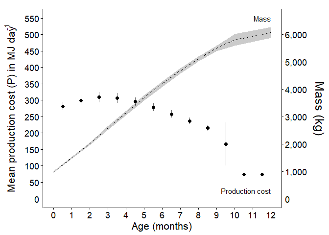

Production Cost - Phase 1 - per month
================
Selina Agbayani
June 17, 2022 - code updated and cleaned 10 August, 2025

``` r
############ Set path for output figures: ###############
Figurespath <- paste0(getwd(), "/production_cost/figures", collapse = NULL)
Figurespath
```

    ## [1] "C:/Users/AgbayaniS/Documents/R/graywhale_energyreqs/production_cost/figures"

``` r
############ Set path for input & output data  ###########
datapath <-  paste0(getwd(), "/data", collapse = NULL) 
datapath
```

    ## [1] "C:/Users/AgbayaniS/Documents/R/graywhale_energyreqs/data"

``` r
## Read data in (mean mass change)
mass_table <- as_tibble(
  read_csv("data/mass_table.csv"), #monthly
  col_types = (list(cols(age_yrs = col_double(),
                         mean_mass = col_double(),
                         sd_mass = col_double(),
                         mean_lwr = col_double(),
                         mean_upr = col_double(),
                         quant025 = col_double(),
                         quant975 = col_double(),
                         female_mass = col_double(),
                         male_mass = col_double()
                         )
                    )
               )
  )
```

    ## Rows: 173 Columns: 9
    ## ── Column specification ────────────────────────────────────────────────────────
    ## Delimiter: ","
    ## dbl (9): age_yrs, mean_mass, sd_mass, mean_lwr, mean_upr, quant025, quant975...
    ## 
    ## ℹ Use `spec()` to retrieve the full column specification for this data.
    ## ℹ Specify the column types or set `show_col_types = FALSE` to quiet this message.

``` r
mean_masschange <- as_tibble(
  read_csv("data/mean_masschange.csv"),
  col_types = (list(cols(age_yrs = col_double(),
                         mean_masschange = col_double(),
                         sd_masschange = col_double(),
                         sex = col_character(),
                         age_mth = col_integer()
                         )
                    )
               )
  )
```

    ## Rows: 39 Columns: 5
    ## ── Column specification ────────────────────────────────────────────────────────
    ## Delimiter: ","
    ## chr (1): sex
    ## dbl (4): age_yrs, mean_masschange, sd_masschange, age_mth
    ## 
    ## ℹ Use `spec()` to retrieve the full column specification for this data.
    ## ℹ Specify the column types or set `show_col_types = FALSE` to quiet this message.

``` r
kable(head(mean_masschange))
```

|   age_yrs | mean_masschange | sd_masschange | sex | age_mth |
|----------:|----------------:|--------------:|:----|--------:|
| 0.0000000 |        982.8522 |     27.098452 | N/A |       0 |
| 0.0849315 |        515.1631 |     10.503953 | N/A |       1 |
| 0.1616438 |        505.4539 |     16.273872 | N/A |       2 |
| 0.2465753 |        576.5720 |     17.546305 | N/A |       3 |
| 0.3287671 |        553.7534 |     12.326696 | N/A |       4 |
| 0.4136986 |        551.4791 |      8.258852 | N/A |       5 |

``` r
age_yr_tibble <- as_tibble(
  read_csv("data/age_yr_tibble.csv"),
  col_types = (list(cols(month = col_character(),
                         no_days_in_mth = col_double(),
                         age_mth = col_double(),
                         no_days_cumul = col_double(),
                         age_yrs = col_double()
                         )
                    )
               )
  )
```

    ## Rows: 25 Columns: 5
    ## ── Column specification ────────────────────────────────────────────────────────
    ## Delimiter: ","
    ## chr (1): month
    ## dbl (4): no_days_in_mth, age_mth, no_days_cumul, age_yrs
    ## 
    ## ℹ Use `spec()` to retrieve the full column specification for this data.
    ## ℹ Specify the column types or set `show_col_types = FALSE` to quiet this message.

### Production Cost Formula and input variables

``` r
# Calculate Production Costs (P) using equation from Winship et al. 2002**
# P = change in Mass x ((p_lipid x ED_lipid) + (1-p_lipid) x (1-p_water) x ED_protein))

#########  PRODUCTION COSTS  #########
# 
#Energy density of lipid (MJ/kg)  
#ED_lipid <- 39.3 #39300 KJ/kg * 0.001 - Schmidt-Nielsen (1990)
ED_lipid <- 39.7 #MJ/kg - Sumich 1986 Kleiber 1961

#Energy density of protein (MJ/kg)  
#ED_protein <- 18 #18000 KJ/KG * 0.001  = - Schmidt-Nielsen (1990); Winship et al. (2002)
ED_protein <- 23.7 #MJ/kg  - from Sumich 1986 Kleiber 1961

#From Sumich 1986
# p_lipid_newborn_calf <- 0.33   # based on one observation (highest lipid value observed for neonates)
# p_lipid_adult <-  0.39         # max value for p_lipid based on one A observation (Table 7.1)
p_lipid_min <- 0.33
p_lipid_max <- 0.39


# From Villegas-Amtmann (2015,2017) - values are for Grey whales
#p_lipid_adult <- 0.34         # F_lipid (%lipid mass) - min value for p_lipid
p_protein_nb <- 0.126         # F_protein - fraction newborn protein mass - calculated from muscle and other tissues
p_protein_7mo <- 0.0972       # fraction protein mass up to 7 months 

#Calculated From Rice & Wolman 1971
p_protein_adult_SB <-  0.1062   # fraction of protein in southbound adults (fat)
p_protein_adult_NB <- 0.1086   # fraction of protein in northbound adults (thin)
p_protein_adult <- (p_protein_adult_SB+p_protein_adult_NB)/2       # Avg non-calves NB (0.1086) & SB (0.1062) from Rice and Wolman 2971)
```

### Production Cost per month

``` r
MC_reps = 10000

P_cost_table <- as_tibble(mean_masschange)  #this table already has age_mth

#add some new columns
P_cost_table$mean_P <- NA
P_cost_table$sd_P <- NA
P_cost_table$quant025 <- NA
P_cost_table$quant975 <-  NA
P_cost_table$p_lipid <-  NA
P_cost_table$p_protein <-  NA
P_cost_table$mass <- NA
P_cost_table$mass_sd <- NA

P_cost_table <- P_cost_table %>% 
  relocate(age_mth) %>%  
  filter(age_mth >= 0)

#Loop through sex and month
for (s in c("N/A", "Female", "Male")){
  for (i in c(0, 1, 2, 3, 4, 5, 6, 7, 8, 9, 10, 11, 12)){ 
    
    #s <- "N/A"
    age <-  i
    
    strcolname <- as.character(age)
    
    mass_change_i <- dplyr::filter(P_cost_table, 
                                   age_mth == age & sex == s)
    mass_chg <- mass_change_i %>% 
      pull(mean_masschange)
    sd <- mass_change_i %>% 
      pull(sd_masschange)
    age_mth <- mass_change_i %>%
      pull(age_mth)
    
    set.seed(12345)
    #rnorm - random normal distribution
    mean_masschange_i <- as_tibble(
      rnorm(MC_reps, mass_chg, sd), col.names = str(i))
    names(mean_masschange_i)[1] <- "mass_chg"
    mean_masschange_i <- mean_masschange_i %>%  
      mutate(age_yrs = strcolname)
    mean_masschange_i <- mean_masschange_i %>%  
      mutate(ID = row_number())
    mean_masschange_i$age_mth <-  age_mth
    
    #pull mean mass and mass sd
    age_yrs_i <- age_yr_tibble %>% 
      filter(age_mth == i) %>% 
      pull(age_yrs) #calculate age_yrs (do not round up)
    
    age_yrs_mid_i <- age_yr_tibble %>% 
      filter(age_mth == i-0.5)  %>% 
      pull(age_yrs)
    
    mass_i <- mass_table %>% 
      filter(round(age_yrs,3) == round(age_yrs_i,3)) %>% 
      pull(mean_mass)
    mass_sd_i <- mass_table %>% 
      filter(round(age_yrs,3) == round(age_yrs_i,3)) %>% 
      pull(sd_mass)
    
    
    
    #min p_lipid 0.34 - Villegas-Amtmann 2017
    #max p_lipid 0.39 - Sumich 1986
    
    p_lipid_i <- as_tibble(
      runif(MC_reps, 
            min = p_lipid_min, 
            max = p_lipid_max),
      col.names = str(i))
    
    names(p_lipid_i)[1] <- "p_lipid"
    
    p_lipid_i <- p_lipid_i %>%  
      mutate(age_yrs = strcolname)
    p_lipid_i <- p_lipid_i %>%  
      mutate(ID = row_number())
    
    mean_masschange_i$p_lipid <- p_lipid_i$p_lipid
    
    #initialize P cost
    mean_masschange_i$P <-NA 
    
    mass_chg_i <- mean_masschange_i$mass_chg
    p_lipid_i <-mean_masschange_i$p_lipid 
    P_cost_i <- mean_masschange_i$P
    age_yrs <- mean_masschange_i$age_yrs
    age_mth <- mean_masschange_i$age_mth  
    
    ####  p_protein_i by month ###
    if (age==0) {
      p_protein_i <-  p_protein_nb
    } else if (age ==1) {
      p_protein_i <-  (p_protein_nb+p_protein_7mo)/2
    } else if (age > 1 & age <= 7) {
      p_protein_i <-  p_protein_7mo
    } else if (age == 8) {
      p_protein_i <- ((p_protein_7mo + p_protein_adult_SB)/2)
    } else if (age > 8 & age <= 12) {
      p_protein_i <-  p_protein_adult_SB
    }
    
    #Calculate Production costs for each age cohort
    P_cost_i <- mass_chg_i*(
      (p_lipid_i * ED_lipid) + 
        (p_protein_i * ED_protein))
    

    mean_P <-  mean(P_cost_i)
    sd_P <- sd(P_cost_i)
    quant025 <- quantile(P_cost_i, 0.025, na.rm = TRUE)
    quant975 <- quantile(P_cost_i, 0.975, na.rm = TRUE)
    
  
    
    
    # Save calculated statistics to P_cost Table 
    P_cost_table$mean_P <- 
      ifelse(P_cost_table$age_mth == age & P_cost_table$sex == s, 
             mean_P, P_cost_table$mean_P)
    P_cost_table$sd_P <- 
      ifelse(P_cost_table$age_mth == age & P_cost_table$sex == s,
             sd_P, P_cost_table$sd_P)
    P_cost_table$quant025 <- 
      ifelse(P_cost_table$age_mth == age & P_cost_table$sex == s,
             quant025, P_cost_table$quant025)
    P_cost_table$quant975 <- 
      ifelse(P_cost_table$age_mth == age & P_cost_table$sex == s,
             quant025, P_cost_table$quant975)
    P_cost_table$p_lipid <- 
      ifelse(P_cost_table$age_mth == age & P_cost_table$sex == s, 
             p_lipid_i, P_cost_table$p_lipid)
    P_cost_table$p_protein <- 
      ifelse(P_cost_table$age_mth == age & P_cost_table$sex == s,
             p_protein_i, P_cost_table$p_protein)
    P_cost_table$mass <- 
      ifelse(P_cost_table$age_mth == age & P_cost_table$sex == s,
             mass_i, P_cost_table$mass)
    P_cost_table$mass_sd <- 
      ifelse(P_cost_table$age_mth == age & P_cost_table$sex == s,
             mass_sd_i, P_cost_table$mass_sd)
    
  }
}

    
kable((P_cost_table))
```

| age_mth | age_yrs | mean_masschange | sd_masschange | sex | mean_P | sd_P | quant025 | quant975 | p_lipid | p_protein | mass | mass_sd |
|---:|---:|---:|---:|:---|---:|---:|---:|---:|---:|---:|---:|---:|
| 0 | 0.0000000 | 982.8522 | 27.0984523 | N/A | 16981.262 | 821.2318 | 15470.356 | 15470.356 | 0.3638438 | 0.1260 | 983.0272 | 26.76770 |
| 1 | 0.0849315 | 515.1631 | 10.5039528 | N/A | 8724.966 | 395.5805 | 8014.291 | 8014.291 | 0.3898447 | 0.1116 | 1498.2581 | 37.14344 |
| 2 | 0.1616438 | 505.4539 | 16.2738719 | N/A | 8387.981 | 439.8056 | 7571.593 | 7571.593 | 0.3721566 | 0.0972 | 2003.8171 | 53.21868 |
| 3 | 0.2465753 | 576.5720 | 17.5463050 | N/A | 9568.192 | 491.4354 | 8660.599 | 8660.599 | 0.3872586 | 0.0972 | 2580.5024 | 70.55082 |
| 4 | 0.3287671 | 553.7534 | 12.3266962 | N/A | 9189.554 | 431.4328 | 8408.886 | 8408.886 | 0.3358296 | 0.0972 | 3134.3355 | 82.72707 |
| 5 | 0.4136986 | 551.4791 | 8.2588515 | N/A | 9151.843 | 402.0552 | 8449.346 | 8449.346 | 0.3745950 | 0.0972 | 3685.8679 | 90.88511 |
| 6 | 0.4958904 | 503.1196 | 1.5935232 | N/A | 8349.361 | 345.3705 | 7780.722 | 7780.722 | 0.3836124 | 0.0972 | 4188.9977 | 92.45919 |
| 7 | 0.5808219 | 481.7819 | 1.0573806 | N/A | 7995.261 | 330.1816 | 7451.853 | 7451.853 | 0.3695506 | 0.0972 | 4670.7728 | 91.41471 |
| 8 | 0.6657534 | 439.7956 | 0.9992118 | N/A | 7345.395 | 301.4465 | 6849.201 | 6849.201 | 0.3396405 | 0.1017 | 5110.5620 | 90.42769 |
| 9 | 0.7479452 | 384.8838 | 3.0580966 | N/A | 6469.297 | 268.5455 | 6017.865 | 6017.865 | 0.3634385 | 0.1062 | 5495.4655 | 93.44847 |
| 10 | 0.8328767 | 306.4984 | 119.6529456 | N/A | 5150.807 | 2023.0871 | 1143.122 | 1143.122 | 0.3525102 | 0.1062 | 5802.7365 | 211.64097 |
| 11 | 0.9150685 | 132.8728 | 4.5490207 | N/A | 2233.356 | 119.0704 | 2011.378 | 2011.378 | 0.3880833 | 0.1062 | 5935.5799 | 207.14747 |
| 12 | 1.0000000 | 137.3089 | 5.0987938 | N/A | 2307.915 | 127.4672 | 2069.239 | 2069.239 | 0.3612114 | 0.1062 | 6072.8559 | 202.11091 |
| 0 | 0.0000000 | 982.7540 | 28.8243452 | Female | 16979.550 | 838.6501 | 15429.447 | 15429.447 | 0.3554153 | 0.1260 | 983.0272 | 26.76770 |
| 1 | 0.0849315 | 529.7862 | 11.7636361 | Female | 8972.619 | 414.4563 | 8219.425 | 8219.425 | 0.3478399 | 0.1116 | 1498.2581 | 37.14344 |
| 2 | 0.1616438 | 519.8024 | 17.0826748 | Female | 8626.092 | 455.8691 | 7779.741 | 7779.741 | 0.3555709 | 0.0972 | 2003.8171 | 53.21868 |
| 3 | 0.2465753 | 592.9393 | 18.5195576 | Female | 9839.802 | 510.1278 | 8896.327 | 8896.327 | 0.3546761 | 0.0972 | 2580.5024 | 70.55082 |
| 4 | 0.3287671 | 569.4721 | 13.5767410 | Female | 9450.399 | 451.0159 | 8629.862 | 8629.862 | 0.3585140 | 0.0972 | 3134.3355 | 82.72707 |
| 5 | 0.4136986 | 567.1325 | 10.0160889 | Female | 9411.601 | 422.8614 | 8663.301 | 8663.301 | 0.3642904 | 0.0972 | 3685.8679 | 90.88511 |
| 6 | 0.4958904 | 517.3992 | 5.4093107 | Female | 8586.304 | 365.6211 | 7962.615 | 7962.615 | 0.3803055 | 0.0972 | 4188.9977 | 92.45919 |
| 7 | 0.5808219 | 495.4555 | 5.0606799 | Female | 8222.145 | 349.6248 | 7625.527 | 7625.527 | 0.3835401 | 0.0972 | 4670.7728 | 91.41471 |
| 8 | 0.6657534 | 452.2776 | 4.6255475 | Female | 7553.838 | 319.3011 | 7008.891 | 7008.891 | 0.3544520 | 0.1017 | 5110.5620 | 90.42769 |
| 9 | 0.7479452 | 395.8080 | 4.9959813 | Female | 6652.901 | 283.9134 | 6162.253 | 6162.253 | 0.3516358 | 0.1062 | 5495.4655 | 93.44847 |
| 10 | 0.8328767 | 315.2193 | 119.6882642 | Female | 5297.393 | 2024.3330 | 1286.994 | 1286.994 | 0.3746193 | 0.1062 | 5802.7365 | 211.64097 |
| 11 | 0.9150685 | 136.6432 | 4.7469903 | Female | 2296.729 | 123.2000 | 2067.142 | 2067.142 | 0.3462561 | 0.1062 | 5935.5799 | 207.14747 |
| 12 | 1.0000000 | 141.2051 | 5.2878201 | Female | 2373.403 | 131.5891 | 2126.875 | 2126.875 | 0.3472503 | 0.1062 | 6072.8559 | 202.11091 |
| 0 | 0.0000000 | 982.7540 | 28.8243452 | Male | 16979.550 | 838.6501 | 15429.447 | 15429.447 | 0.3662723 | 0.1260 | 983.0272 | 26.76770 |
| 1 | 0.0849315 | 506.9063 | 11.6623904 | Male | 8585.116 | 399.9433 | 7858.178 | 7858.178 | 0.3398441 | 0.1116 | 1498.2581 | 37.14344 |
| 2 | 0.1616438 | 497.3521 | 17.0157201 | Male | 8253.525 | 443.2301 | 7428.367 | 7428.367 | 0.3797214 | 0.0972 | 2003.8171 | 53.21868 |
| 3 | 0.2465753 | 567.3305 | 18.4391883 | Male | 9414.819 | 495.4257 | 8495.369 | 8495.369 | 0.3629998 | 0.0972 | 2580.5024 | 70.55082 |
| 4 | 0.3287671 | 544.8781 | 13.4754816 | Male | 9042.256 | 435.6481 | 8246.699 | 8246.699 | 0.3795803 | 0.0972 | 3134.3355 | 82.72707 |
| 5 | 0.4136986 | 542.6406 | 9.8795622 | Male | 9005.154 | 406.5776 | 8283.132 | 8283.132 | 0.3416845 | 0.0972 | 3685.8679 | 90.88511 |
| 6 | 0.4958904 | 495.0568 | 5.1962059 | Male | 8215.528 | 349.9180 | 7618.701 | 7618.701 | 0.3695584 | 0.0972 | 4188.9977 | 92.45919 |
| 7 | 0.5808219 | 474.0613 | 4.8516554 | Male | 7867.106 | 334.5664 | 7296.020 | 7296.020 | 0.3311300 | 0.0972 | 4670.7728 | 91.41471 |
| 8 | 0.6657534 | 432.7479 | 4.4350523 | Male | 7227.657 | 305.5515 | 6706.210 | 6706.210 | 0.3603067 | 0.1017 | 5110.5620 | 90.42769 |
| 9 | 0.7479452 | 378.7157 | 4.8619345 | Male | 6365.605 | 272.0686 | 5894.742 | 5894.742 | 0.3805753 | 0.1062 | 5495.4655 | 93.44847 |
| 10 | 0.8328767 | 301.5744 | 119.6847574 | Male | 5068.042 | 2023.2566 | 1061.023 | 1061.023 | 0.3439226 | 0.1062 | 5802.7365 | 211.64097 |
| 11 | 0.9150685 | 130.7440 | 4.7304592 | Male | 2197.573 | 119.9678 | 1973.539 | 1973.539 | 0.3655329 | 0.1062 | 5935.5799 | 207.14747 |
| 12 | 1.0000000 | 135.1090 | 5.2719828 | Male | 2270.938 | 128.3595 | 2030.482 | 2030.482 | 0.3722536 | 0.1062 | 6072.8559 | 202.11091 |

``` r
#No of days in each month
Ts <- c(0,31,28,31,30,31,30,31,31,30,31,30,31,0,31,28,31,30,31,30,31,31,30,31,30,31, 0,31,28,31,30,31,30,31,31,30,31,30,31)

P_cost_table$Ts <- Ts

P_cost_table$mean_masschange_perday <-P_cost_table$mean_masschange / P_cost_table$Ts 
P_cost_table$sd_masschange_perday <-P_cost_table$sd_masschange / P_cost_table$Ts 
P_cost_table$mean_P_perday <- P_cost_table$mean_P / P_cost_table$Ts
P_cost_table$sd_P_perday <-P_cost_table$sd_P / P_cost_table$Ts 

    
kable(head(P_cost_table))
```

| age_mth | age_yrs | mean_masschange | sd_masschange | sex | mean_P | sd_P | quant025 | quant975 | p_lipid | p_protein | mass | mass_sd | Ts | mean_masschange_perday | sd_masschange_perday | mean_P_perday | sd_P_perday |
|---:|---:|---:|---:|:---|---:|---:|---:|---:|---:|---:|---:|---:|---:|---:|---:|---:|---:|
| 0 | 0.0000000 | 982.8522 | 27.098452 | N/A | 16981.262 | 821.2318 | 15470.356 | 15470.356 | 0.3638438 | 0.1260 | 983.0272 | 26.76770 | 0 | Inf | Inf | Inf | Inf |
| 1 | 0.0849315 | 515.1631 | 10.503953 | N/A | 8724.966 | 395.5805 | 8014.291 | 8014.291 | 0.3898447 | 0.1116 | 1498.2581 | 37.14344 | 31 | 16.61816 | 0.3388372 | 281.4505 | 12.76066 |
| 2 | 0.1616438 | 505.4539 | 16.273872 | N/A | 8387.981 | 439.8056 | 7571.593 | 7571.593 | 0.3721566 | 0.0972 | 2003.8171 | 53.21868 | 28 | 18.05192 | 0.5812097 | 299.5708 | 15.70734 |
| 3 | 0.2465753 | 576.5720 | 17.546305 | N/A | 9568.192 | 491.4354 | 8660.599 | 8660.599 | 0.3872586 | 0.0972 | 2580.5024 | 70.55082 | 31 | 18.59910 | 0.5660098 | 308.6514 | 15.85276 |
| 4 | 0.3287671 | 553.7534 | 12.326696 | N/A | 9189.554 | 431.4328 | 8408.886 | 8408.886 | 0.3358296 | 0.0972 | 3134.3355 | 82.72707 | 30 | 18.45845 | 0.4108899 | 306.3185 | 14.38109 |
| 5 | 0.4136986 | 551.4791 | 8.258852 | N/A | 9151.843 | 402.0552 | 8449.346 | 8449.346 | 0.3745950 | 0.0972 | 3685.8679 | 90.88511 | 31 | 17.78965 | 0.2664146 | 295.2208 | 12.96952 |

``` r
#Save production cost table to file
P_cost_table %>% write_csv("data/P_cost_table_phase1.csv", na = "", append = FALSE)
```

Production Cost per month vs Mass

<!-- -->

### Production Cost per day vs Mass

<!-- -->
