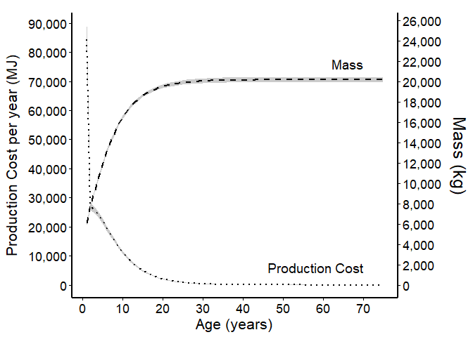
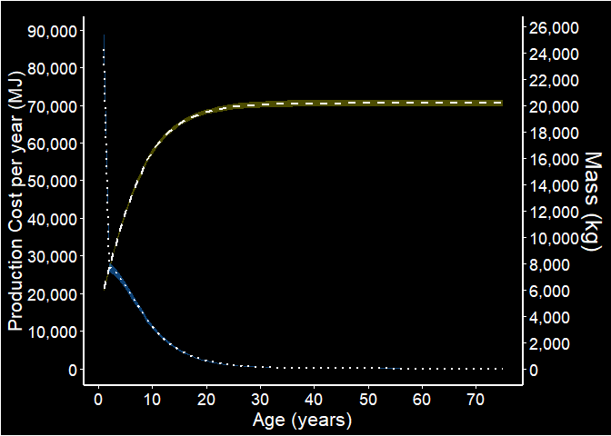
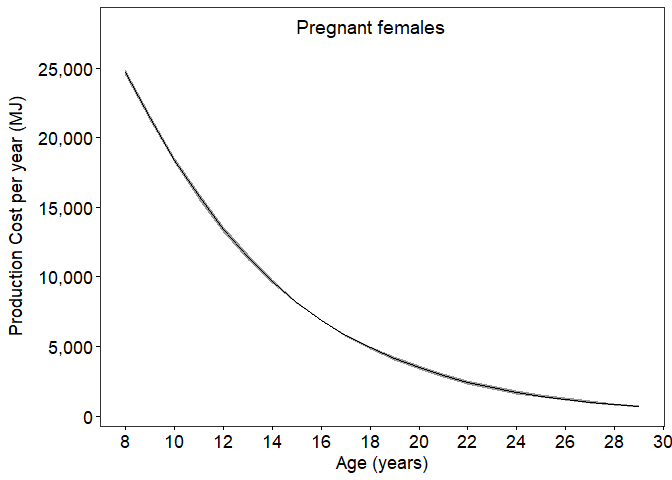
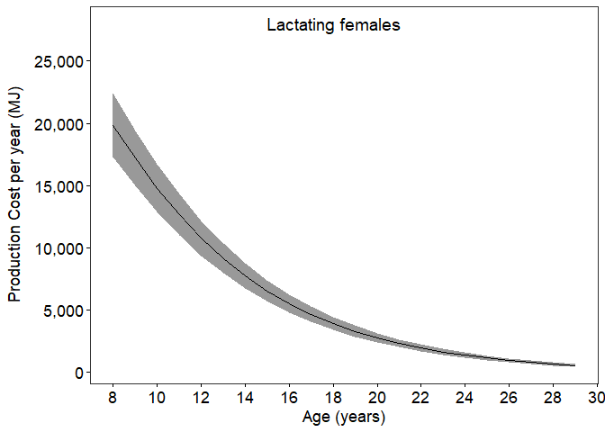
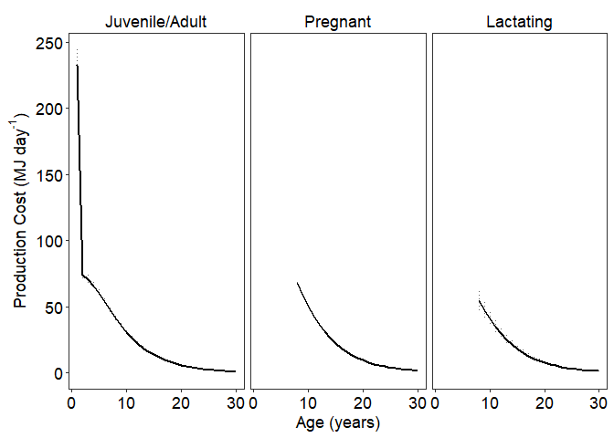

Production cost - Phase 2 - per year
================
Selina Agbayani
June 6, 2022 - code updated on 04 July, 2025

``` r
# Set path for output figures: 
Figurespath <- paste0(getwd(), "/production_cost/figures", collapse = NULL)
Figurespath
```

    ## [1] "C:/Users/AgbayaniS/Documents/R/graywhale_energyreqs/production_cost/figures"

``` r
# Set path for input & output data  
datapath <-  paste0(getwd(), "/data", collapse = NULL) 
datapath
```

    ## [1] "C:/Users/AgbayaniS/Documents/R/graywhale_energyreqs/data"

``` r
## Read data in (mean mass change)

gw_pred_mass <- as_tibble(read_csv("data/mass_table.csv"),
                                 col_types = (list(cols(age_yrs = col_double(),
                                                        mean_mass = col_double(),
                                                        sd_mass = col_double(),
                                                        mean_lwr = col_double(),
                                                        mean_upr = col_double(),
                                                        quant025 = col_double(),
                                                        quant975 = col_double(),
                                                        female_mass = col_double(),
                                                        male_mass = col_double()
                                                        )
                                                   )
                                              )
                                 )
```

    ## Rows: 173 Columns: 9
    ## ── Column specification ────────────────────────────────────────────────────────
    ## Delimiter: ","
    ## dbl (9): age_yrs, mean_mass, sd_mass, mean_lwr, mean_upr, quant025, quant975...
    ## 
    ## ℹ Use `spec()` to retrieve the full column specification for this data.
    ## ℹ Specify the column types or set `show_col_types = FALSE` to quiet this message.

``` r
mean_masschange_peryear <- as_data_frame(read_csv("data/mean_masschange_per_year.csv"),
                                 col_types = (list(cols(age_yrs = col_double(),
                                                        mean_masschange = col_double(),
                                                        sd_masschange = col_double(),
                                                        sex = col_character()
                                                        )
                                                   )
                                              )
                                 )
```

    ## Warning: `as_data_frame()` was deprecated in tibble 2.0.0.
    ## ℹ Please use `as_tibble()` (with slightly different semantics) to convert to a
    ##   tibble, or `as.data.frame()` to convert to a data frame.
    ## This warning is displayed once every 8 hours.
    ## Call `lifecycle::last_lifecycle_warnings()` to see where this warning was
    ## generated.

    ## Rows: 228 Columns: 4
    ## ── Column specification ────────────────────────────────────────────────────────
    ## Delimiter: ","
    ## chr (1): sex
    ## dbl (3): age_yrs, mean_masschange, sd_masschange
    ## 
    ## ℹ Use `spec()` to retrieve the full column specification for this data.
    ## ℹ Specify the column types or set `show_col_types = FALSE` to quiet this message.

``` r
age_yr_tibble <- as_tibble(read_csv("data/age_yr_tibble.csv"),
                           col_types = (list(cols(month = col_character(),
                                                  no_days_in_mth = col_double(),
                                                  age_mth = col_double(),
                                                  no_days_cumul = col_double(),
                                                  age_yrs = col_double()
                                                  )
                                             )
                                        )
                           )
```

    ## Rows: 25 Columns: 5
    ## ── Column specification ────────────────────────────────────────────────────────
    ## Delimiter: ","
    ## chr (1): month
    ## dbl (4): no_days_in_mth, age_mth, no_days_cumul, age_yrs
    ## 
    ## ℹ Use `spec()` to retrieve the full column specification for this data.
    ## ℹ Specify the column types or set `show_col_types = FALSE` to quiet this message.

``` r
P_cost_table_phase1  <-  read_csv("data/P_cost_table_phase1.csv")
```

    ## Rows: 39 Columns: 18
    ## ── Column specification ────────────────────────────────────────────────────────
    ## Delimiter: ","
    ## chr  (1): sex
    ## dbl (17): age_mth, age_yrs, mean_masschange, sd_masschange, mean_P, sd_P, qu...
    ## 
    ## ℹ Use `spec()` to retrieve the full column specification for this data.
    ## ℹ Specify the column types or set `show_col_types = FALSE` to quiet this message.

``` r
P_nb_table <- P_cost_table_phase1 %>%  
  filter(age_yrs == 0 & sex == "N/A") %>% 
  select("age_yrs", "mean_P", "sd_P")
```

**Calculate Production Costs (P) using equation from Winship et
al. 2002** P = change in Mass x \[(p_lipid x ED_lipid) + (1-p_lipid) x
(1-p_water) x ED_protein\]

Calculate Production Costs

``` r
#Energy density of lipid (MJ/kg)  
#ED_lipid <- 39.3 #39300 KJ/kg * 0.001 - Schmidt-Nielsen (1990)
ED_lipid <- 39.7 #MJ/kg - Sumich 1986 Kleiber 1961

#Energy density of protein (MJ/kg)  
#ED_protein <- 18 #18000 KJ/KG * 0.001  = - Schmidt-Nielsen (1990); Winship et al. (2002)
ED_protein <- 23.8 #MJ/kg  - from Sumich 1986 Kleiber 1961


#From Sumich 1986
#p_lipid_newborn_calf <- 0.33   # based on one observation (highest lipid value observed for neonates)
#p_lipid_adult <-  0.39         # -max value for p_lipid_adult
#one value range p_lipid
p_lipid_min  <- 0.33
p_lipid_max <-  0.39

#p_lipid_preg <- 0.6            # healthy whales at 60% range (0.6 - 0.62)
p_lipid_preg_min <- 0.6
p_lipid_preg_max <- 0.62
#P_lipid_lact <- (((0.33+0.38)/2)+0.6)/2  #range p_lipid_calf to  P_lipid_preg
p_lipid_lact_min <- (0.33+0.38)/2
p_lipid_lact_max <- 0.6


# From Villegas-Amtmann (2015,2017) - values are for Grey whales
#p_lipid_adult <- 0.34         # F_lipid (%lipid mass) - min value for p_lipid
p_protein_nb <- 0.126         # F_protein - fraction newborn protein mass - calculated from muscle and other tissues
p_protein_7mo <- 0.0972       # fraction protein mass up to 7 months = 0.0972
p_protein_avg_calf <- 0.0972   # avg p_protein from 6 months age 

#Calculated From Rice & Wolman 1971
p_protein_adult_SB <-  0.1062   # fraction of protein in southbound adults (fat)
p_protein_adult_NB <- 0.1086   # fraction of protein in northbound adults (thin)
p_protein_adult <- (p_protein_adult_SB+p_protein_adult_NB)/2       # Avg non-calves NB (0.1086) & SB (0.1062) from Rice and Wolman 2971)


# P = change in Mass x [(p_lipid x ED_lipid) + (1-p_lipid) x (1-p_water) x ED_protein]
# assume (1-p_water) = p_protein
```

Calculate Production Cost

``` r
MC_reps = 10000

P_cost_table<- as.data.frame(matrix(ncol = 7, nrow = 0))

cnames <- c("age_yrs", "mean_masschange", "sex",  
            "mean_P", "sd_P" , "p_lipid", "p_protein"        
            )            

colnames(P_cost_table) <- cnames

P_cost_table <- as_tibble(P_cost_table, 
                          col_types = (list(ID=col_integer(),
                                            age_yrs = col_double(),
                                            mean_masschange = col_double(),
                                            sex = col_character(),
                                            mean_P = col_double(),
                                            sd_P = col_double(),
                                            p_lipid = col_double(),
                                            p_protein = col_double()
                                            )
                                       )
                          )


for (s in c("Female", "Male", "N/A")){

    for (i in seq(from = 0, to = 75, by = 1)){
    
        #s <- "N/A"
        #i = 8
        age <-  i
        
        strcolname <- as.character(age)
        
        mass_change_i <- dplyr::filter(mean_masschange_peryear, age_yrs == age & sex == s)
        
        mass_chg <- mass_change_i$mean_masschange
        sd <- mass_change_i$sd_masschange
        
        set.seed(12345)
        mean_masschange_i <- as_tibble(rnorm(MC_reps, mass_chg, sd), col.names = str(i))
        names(mean_masschange_i)[1] <- "mass_chg"
        mean_masschange_i <- mean_masschange_i %>%  dplyr::mutate(age_yrs = strcolname)
        
        mean_masschange_i <- mean_masschange_i %>%  dplyr::mutate(ID = row_number())
        

        #runif - random uniform distribution
        p_lipid_i <- as_tibble(runif(MC_reps, min = p_lipid_min, max = p_lipid_max), col.names = str(i))
        names(p_lipid_i)[1] <- "p_lipid"
        p_lipid_i <- p_lipid_i %>%  dplyr::mutate(age_yrs = strcolname)
        p_lipid_i <- p_lipid_i %>%  dplyr::mutate(ID = row_number())
        
        mean_masschange_i$p_lipid <- p_lipid_i$p_lipid
        
        #runif - random uniform distribution
        p_protein_adult_i <- as_tibble(runif(MC_reps, min = p_protein_adult_SB, 
                                             max = p_protein_adult_NB), col.names = str(i))
        names(p_protein_adult_i)[1] <- "p_protein"
        p_protein_adult_i <- p_protein_adult_i %>%  dplyr::mutate(age_yrs = strcolname)
        p_protein_adult_i <- p_protein_adult_i %>%  dplyr::mutate(ID = row_number())
        
        mean_masschange_i$p_protein_adult <- p_protein_adult_i$p_protein

        mean_masschange_i$P <-NA
        mass_chg_i <- mean_masschange_i$mass_chg
        P_cost <- mean_masschange_i$P
        age_yrs <- mean_masschange_i$age_yrs
        p_lipid_i <- mean_masschange_i$p_lipid
        p_protein_i <- mean_masschange_i$p_protein_adult
        
        
        
        #### TO DO: create a column p_protein_i to track what value of p_protein is being used ###
        ####  p_protein_i by age ###
        if (age==0) {
          p_protein <- p_protein_nb
        } else if (age==1){
          p_protein <-  p_protein_avg_calf
        } else if (age >1) {
          p_protein <-  mean(p_protein_i)
        }
        
        #Calculate Production costs for each age cohort
        P_cost_i <- mass_chg_i*((p_lipid_i * ED_lipid) + (p_protein * ED_protein))
        

        #Calculate mean and sd P_cost
        mean_masschange <- mean(mean_masschange_i$mass_chg)
        p_lipid <- mean(p_lipid_i)
        mean_P_cost <- mean(P_cost_i, na.rm = TRUE)
        sd_P_cost <- sd(P_cost_i, na.rm = TRUE) 
        
       
        newRow <- tibble(age_yrs = age,
                         mean_masschange = mean_masschange,
                         sd_masschange = sd,
                         sex = s, 
                         mean_P = mean_P_cost,
                         sd_P = sd_P_cost,
                         p_lipid = p_lipid,
                         p_protein = p_protein
                         )
        
        P_cost_table <- rbind(P_cost_table, newRow)
  
      
    }
    
    }

    
kable(P_cost_table)
```

| age_yrs | mean_masschange | sd_masschange | sex | mean_P | sd_P | p_lipid | p_protein |
|---:|---:|---:|:---|---:|---:|---:|---:|
| 0 | 986.5515722 | 20.8944895 | Female | 1.705791e+04 | 767.1216647 | 0.3599891 | 0.126000 |
| 1 | 5257.8957619 | 136.8704519 | Female | 8.730745e+04 | 4264.4398702 | 0.3599891 | 0.097200 |
| 2 | 1642.6730185 | 31.1187662 | Female | 2.767488e+04 | 1242.4542106 | 0.3599891 | 0.107388 |
| 3 | 1577.4599590 | 11.1312540 | Female | 2.657614e+04 | 1096.3454702 | 0.3599891 | 0.107388 |
| 4 | 1470.3573109 | 6.6246201 | Female | 2.477172e+04 | 1012.7119596 | 0.3599891 | 0.107388 |
| 5 | 1339.2771100 | 14.6962303 | Female | 2.256339e+04 | 950.3334948 | 0.3599891 | 0.107388 |
| 6 | 1198.0636610 | 13.3235872 | Female | 2.018430e+04 | 850.9255690 | 0.3599891 | 0.107388 |
| 7 | 1056.3706915 | 4.4327352 | Female | 1.779712e+04 | 726.9653878 | 0.3599891 | 0.107388 |
| 8 | 922.8834407 | 2.8579043 | Female | 1.554820e+04 | 633.4931318 | 0.3599891 | 0.107388 |
| 9 | 798.8695594 | 2.5455174 | Female | 1.345888e+04 | 548.4653781 | 0.3599891 | 0.107388 |
| 10 | 687.2061640 | 5.2115788 | Female | 1.157766e+04 | 478.7238704 | 0.3599891 | 0.107388 |
| 11 | 588.0622248 | 6.6895294 | Female | 9.907343e+03 | 418.3557988 | 0.3599891 | 0.107388 |
| 12 | 501.1890786 | 6.7715023 | Female | 8.443757e+03 | 361.9093139 | 0.3599891 | 0.107388 |
| 13 | 425.7479345 | 6.0229142 | Female | 7.172767e+03 | 308.9217291 | 0.3599891 | 0.107388 |
| 14 | 360.7394286 | 4.6075472 | Female | 6.077538e+03 | 259.0903003 | 0.3599891 | 0.107388 |
| 15 | 305.2274966 | 1.8227823 | Female | 5.142296e+03 | 211.2261360 | 0.3599891 | 0.107388 |
| 16 | 257.6236931 | 0.4355764 | Female | 4.340291e+03 | 176.4519005 | 0.3599891 | 0.107388 |
| 17 | 217.3464815 | 1.9760876 | Female | 3.661730e+03 | 152.5440782 | 0.3599891 | 0.107388 |
| 18 | 183.0313064 | 3.1727319 | Female | 3.083613e+03 | 136.3957063 | 0.3599891 | 0.107388 |
| 19 | 154.0804670 | 4.5868483 | Female | 2.595871e+03 | 131.0099240 | 0.3599891 | 0.107388 |
| 20 | 129.4980167 | 4.9770688 | Female | 2.181722e+03 | 122.2811939 | 0.3599891 | 0.107388 |
| 21 | 108.7230445 | 4.9571403 | Female | 1.831718e+03 | 112.1072789 | 0.3599891 | 0.107388 |
| 22 | 91.3311270 | 5.4001183 | Female | 1.538711e+03 | 110.6185460 | 0.3599891 | 0.107388 |
| 23 | 76.5901111 | 5.0812627 | Female | 1.290362e+03 | 100.5861780 | 0.3599891 | 0.107388 |
| 24 | 64.2856661 | 5.1850115 | Female | 1.083064e+03 | 97.9910990 | 0.3599891 | 0.107388 |
| 25 | 53.8157487 | 4.4619824 | Female | 9.066709e+02 | 83.8648814 | 0.3599891 | 0.107388 |
| 26 | 45.0801274 | 4.0679207 | Female | 7.594971e+02 | 75.2897772 | 0.3599891 | 0.107388 |
| 27 | 37.7593618 | 3.7183900 | Female | 6.361600e+02 | 67.8779801 | 0.3599891 | 0.107388 |
| 28 | 31.6507200 | 3.5352186 | Female | 5.332446e+02 | 63.4716853 | 0.3599891 | 0.107388 |
| 29 | 26.4686726 | 3.0075209 | Female | 4.459387e+02 | 53.8899168 | 0.3599891 | 0.107388 |
| 30 | 22.1716106 | 2.7711904 | Female | 3.735436e+02 | 49.1593053 | 0.3599891 | 0.107388 |
| 31 | 18.5677663 | 2.5204031 | Female | 3.128273e+02 | 44.3803754 | 0.3599891 | 0.107388 |
| 32 | 15.5260067 | 2.1593413 | Female | 2.615803e+02 | 37.9474774 | 0.3599891 | 0.107388 |
| 33 | 12.9776810 | 1.8289550 | Female | 2.186465e+02 | 32.1079481 | 0.3599891 | 0.107388 |
| 34 | 10.8419559 | 1.5228413 | Female | 1.826640e+02 | 26.7410199 | 0.3599891 | 0.107388 |
| 35 | 9.0913824 | 1.4506787 | Female | 1.531712e+02 | 25.2482529 | 0.3599891 | 0.107388 |
| 36 | 7.6046805 | 1.2632908 | Female | 1.281235e+02 | 21.9342016 | 0.3599891 | 0.107388 |
| 37 | 6.3632744 | 1.1113763 | Female | 1.072085e+02 | 19.2436677 | 0.3599891 | 0.107388 |
| 38 | 5.3131726 | 0.9158032 | Female | 8.951632e+01 | 15.8683613 | 0.3599891 | 0.107388 |
| 39 | 4.4542392 | 0.8505262 | Female | 7.504530e+01 | 14.6639623 | 0.3599891 | 0.107388 |
| 40 | 3.7191961 | 0.7028561 | Female | 6.266122e+01 | 12.1235720 | 0.3599891 | 0.107388 |
| 41 | 3.1125813 | 0.6191152 | Female | 5.244105e+01 | 10.6556789 | 0.3599891 | 0.107388 |
| 42 | 2.5981234 | 0.5080275 | Female | 4.377339e+01 | 8.7499455 | 0.3599891 | 0.107388 |
| 43 | 2.1747348 | 0.4490870 | Female | 3.664018e+01 | 7.7178787 | 0.3599891 | 0.107388 |
| 44 | 1.8174433 | 0.3804968 | Female | 3.062051e+01 | 6.5357322 | 0.3599891 | 0.107388 |
| 45 | 1.5247436 | 0.3537861 | Female | 2.568919e+01 | 6.0559125 | 0.3599891 | 0.107388 |
| 46 | 1.2746684 | 0.3016851 | Female | 2.147589e+01 | 5.1610135 | 0.3599891 | 0.107388 |
| 47 | 1.0630220 | 0.2434196 | Female | 1.791000e+01 | 4.1684192 | 0.3599891 | 0.107388 |
| 48 | 0.8861195 | 0.1940863 | Female | 1.492948e+01 | 3.3284415 | 0.3599891 | 0.107388 |
| 49 | 0.7459975 | 0.1935331 | Female | 1.256879e+01 | 3.3026566 | 0.3599891 | 0.107388 |
| 50 | 0.6276075 | 0.1858456 | Female | 1.057420e+01 | 3.1623621 | 0.3599891 | 0.107388 |
| 51 | 0.5154688 | 0.1088329 | Female | 8.684686e+00 | 1.8688245 | 0.3599891 | 0.107388 |
| 52 | 0.4357115 | 0.1185427 | Female | 7.341017e+00 | 2.0206762 | 0.3599891 | 0.107388 |
| 53 | 0.3663035 | 0.1117744 | Female | 6.171649e+00 | 1.9009030 | 0.3599891 | 0.107388 |
| 54 | 0.3046173 | 0.0863347 | Female | 5.132308e+00 | 1.4703606 | 0.3599891 | 0.107388 |
| 55 | 0.2542405 | 0.0711781 | Female | 4.283538e+00 | 1.2125424 | 0.3599891 | 0.107388 |
| 56 | 0.2119738 | 0.0574978 | Female | 3.571407e+00 | 0.9801726 | 0.3599891 | 0.107388 |
| 57 | 0.1782624 | 0.0545352 | Female | 3.003447e+00 | 0.9274157 | 0.3599891 | 0.107388 |
| 58 | 0.1485601 | 0.0438270 | Female | 2.503004e+00 | 0.7458177 | 0.3599891 | 0.107388 |
| 59 | 0.1253477 | 0.0433737 | Female | 2.111933e+00 | 0.7361583 | 0.3599891 | 0.107388 |
| 60 | 0.1045083 | 0.0352624 | Female | 1.760816e+00 | 0.5987077 | 0.3599891 | 0.107388 |
| 61 | 0.0869757 | 0.0278083 | Female | 1.465412e+00 | 0.4725441 | 0.3599891 | 0.107388 |
| 62 | 0.0731933 | 0.0261645 | Female | 1.233208e+00 | 0.4438773 | 0.3599891 | 0.107388 |
| 63 | 0.0605494 | 0.0187599 | Female | 1.020165e+00 | 0.3189559 | 0.3599891 | 0.107388 |
| 64 | 0.0516079 | 0.0211929 | Female | 8.695332e-01 | 0.3589549 | 0.3599891 | 0.107388 |
| 65 | 0.0423598 | 0.0137470 | Female | 7.137005e-01 | 0.2335456 | 0.3599891 | 0.107388 |
| 66 | 0.0354590 | 0.0119101 | Female | 5.974326e-01 | 0.2022311 | 0.3599891 | 0.107388 |
| 67 | 0.0296930 | 0.0103628 | Female | 5.002854e-01 | 0.1758617 | 0.3599891 | 0.107388 |
| 68 | 0.0253137 | 0.0113940 | Female | 4.265099e-01 | 0.1928210 | 0.3599891 | 0.107388 |
| 69 | 0.0208034 | 0.0077150 | Female | 3.505098e-01 | 0.1308231 | 0.3599891 | 0.107388 |
| 70 | 0.0177607 | 0.0084985 | Female | 2.992518e-01 | 0.1437497 | 0.3599891 | 0.107388 |
| 71 | 0.0143561 | 0.0045559 | Female | 2.418782e-01 | 0.0774276 | 0.3599891 | 0.107388 |
| 72 | 0.0123770 | 0.0058654 | Female | 2.085411e-01 | 0.0992187 | 0.3599891 | 0.107388 |
| 73 | 0.0102015 | 0.0041764 | Female | 1.718825e-01 | 0.0707397 | 0.3599891 | 0.107388 |
| 74 | 0.0084909 | 0.0033323 | Female | 1.430606e-01 | 0.0564678 | 0.3599891 | 0.107388 |
| 75 | 0.0072180 | 0.0034565 | Female | 1.216159e-01 | 0.0584657 | 0.3599891 | 0.107388 |
| 0 | 986.5515722 | 20.8944895 | Male | 1.705791e+04 | 767.1216647 | 0.3599891 | 0.126000 |
| 1 | 5031.8493969 | 136.8704519 | Male | 8.355396e+04 | 4134.3971797 | 0.3599891 | 0.097200 |
| 2 | 1571.5115978 | 31.1187662 | Male | 2.647599e+04 | 1198.4889779 | 0.3599891 | 0.107388 |
| 3 | 1509.2613001 | 11.1312540 | Male | 2.542717e+04 | 1050.4025372 | 0.3599891 | 0.107388 |
| 4 | 1406.9134829 | 6.6246201 | Male | 2.370286e+04 | 969.5804478 | 0.3599891 | 0.107388 |
| 5 | 1281.5522980 | 14.6962303 | Male | 2.159088e+04 | 912.2606267 | 0.3599891 | 0.107388 |
| 6 | 1146.4266449 | 13.3235872 | Male | 1.931435e+04 | 816.9004908 | 0.3599891 | 0.107388 |
| 7 | 1010.7874182 | 4.4327352 | Male | 1.702916e+04 | 695.9500790 | 0.3599891 | 0.107388 |
| 8 | 883.0528626 | 2.8579043 | Male | 1.487716e+04 | 606.3237585 | 0.3599891 | 0.107388 |
| 9 | 764.3545658 | 2.5455174 | Male | 1.287740e+04 | 524.9260656 | 0.3599891 | 0.107388 |
| 10 | 657.4933743 | 5.2115788 | Male | 1.107707e+04 | 458.7546251 | 0.3599891 | 0.107388 |
| 11 | 562.6197558 | 6.6895294 | Male | 9.478704e+03 | 401.6191805 | 0.3599891 | 0.107388 |
| 12 | 479.4973113 | 6.7715023 | Male | 8.078307e+03 | 347.8560792 | 0.3599891 | 0.107388 |
| 13 | 407.3193180 | 6.0229142 | Male | 6.862293e+03 | 297.0414672 | 0.3599891 | 0.107388 |
| 14 | 345.1283632 | 4.6075472 | Male | 5.814532e+03 | 248.9205538 | 0.3599891 | 0.107388 |
| 15 | 292.0339628 | 1.8227823 | Male | 4.920019e+03 | 202.2993985 | 0.3599891 | 0.107388 |
| 16 | 246.4959443 | 0.4355764 | Male | 4.152817e+03 | 168.8452753 | 0.3599891 | 0.107388 |
| 17 | 207.9755504 | 1.9760876 | Male | 3.503854e+03 | 146.2938113 | 0.3599891 | 0.107388 |
| 18 | 175.1508682 | 3.1727319 | Male | 2.950848e+03 | 131.4522244 | 0.3599891 | 0.107388 |
| 19 | 147.4604662 | 4.5868483 | Male | 2.484341e+03 | 127.3804157 | 0.3599891 | 0.107388 |
| 20 | 123.9423626 | 4.9770688 | Male | 2.088124e+03 | 119.5428655 | 0.3599891 | 0.107388 |
| 21 | 104.0643375 | 4.9571403 | Male | 1.753231e+03 | 110.0064780 | 0.3599891 | 0.107388 |
| 22 | 87.4266537 | 5.4001183 | Male | 1.472931e+03 | 109.1210140 | 0.3599891 | 0.107388 |
| 23 | 73.3198530 | 5.0812627 | Male | 1.235267e+03 | 99.4295804 | 0.3599891 | 0.107388 |
| 24 | 61.5474867 | 5.1850115 | Male | 1.036933e+03 | 97.1565068 | 0.3599891 | 0.107388 |
| 25 | 51.5244088 | 4.4619824 | Male | 8.680678e+02 | 83.1816874 | 0.3599891 | 0.107388 |
| 26 | 43.1631336 | 4.0679207 | Male | 7.272007e+02 | 74.7562489 | 0.3599891 | 0.107388 |
| 27 | 36.1559430 | 3.7183900 | Male | 6.091465e+02 | 67.4631600 | 0.3599891 | 0.107388 |
| 28 | 30.3097467 | 3.5352186 | Male | 5.106527e+02 | 63.1603802 | 0.3599891 | 0.107388 |
| 29 | 25.3476239 | 3.0075209 | Male | 4.270520e+02 | 53.6335375 | 0.3599891 | 0.107388 |
| 30 | 21.2343937 | 2.7711904 | Male | 3.577539e+02 | 48.9622854 | 0.3599891 | 0.107388 |
| 31 | 17.7843418 | 2.5204031 | Male | 2.996287e+02 | 44.2274441 | 0.3599891 | 0.107388 |
| 32 | 14.8712998 | 2.1593413 | Male | 2.505502e+02 | 37.8224516 | 0.3599891 | 0.107388 |
| 33 | 12.4306080 | 1.8289550 | Male | 2.094298e+02 | 32.0047226 | 0.3599891 | 0.107388 |
| 34 | 10.3848768 | 1.5228413 | Male | 1.749635e+02 | 26.6545117 | 0.3599891 | 0.107388 |
| 35 | 8.7093699 | 1.4506787 | Male | 1.467353e+02 | 25.1839129 | 0.3599891 | 0.107388 |
| 36 | 7.2855011 | 1.2632908 | Male | 1.227461e+02 | 21.8824043 | 0.3599891 | 0.107388 |
| 37 | 6.0965941 | 1.1113763 | Male | 1.027156e+02 | 19.2023531 | 0.3599891 | 0.107388 |
| 38 | 5.0904128 | 0.9158032 | Male | 8.576340e+01 | 15.8334257 | 0.3599891 | 0.107388 |
| 39 | 4.2680938 | 0.8505262 | Male | 7.190923e+01 | 14.6374232 | 0.3599891 | 0.107388 |
| 40 | 3.5637154 | 0.7028561 | Male | 6.004178e+01 | 12.1011894 | 0.3599891 | 0.107388 |
| 41 | 2.9826850 | 0.6191152 | Male | 5.025263e+01 | 10.6378535 | 0.3599891 | 0.107388 |
| 42 | 2.4896331 | 0.5080275 | Male | 4.194561e+01 | 8.7348175 | 0.3599891 | 0.107388 |
| 43 | 2.0840977 | 0.4490870 | Male | 3.511318e+01 | 7.7058700 | 0.3599891 | 0.107388 |
| 44 | 1.7417349 | 0.3804968 | Male | 2.934502e+01 | 6.5258299 | 0.3599891 | 0.107388 |
| 45 | 1.4614799 | 0.3537861 | Male | 2.462336e+01 | 6.0484009 | 0.3599891 | 0.107388 |
| 46 | 1.2218237 | 0.3016851 | Male | 2.058560e+01 | 5.1548552 | 0.3599891 | 0.107388 |
| 47 | 1.0188922 | 0.2434196 | Male | 1.716653e+01 | 4.1631139 | 0.3599891 | 0.107388 |
| 48 | 0.8492692 | 0.1940863 | Male | 1.430865e+01 | 3.3238220 | 0.3599891 | 0.107388 |
| 49 | 0.7151939 | 0.1935331 | Male | 1.204983e+01 | 3.2993649 | 0.3599891 | 0.107388 |
| 50 | 0.6018602 | 0.1858456 | Male | 1.014042e+01 | 3.1599342 | 0.3599891 | 0.107388 |
| 51 | 0.4940028 | 0.1088329 | Male | 8.323040e+00 | 1.8660390 | 0.3599891 | 0.107388 |
| 52 | 0.4177603 | 0.1185427 | Male | 7.038586e+00 | 2.0188422 | 0.3599891 | 0.107388 |
| 53 | 0.3513001 | 0.1117744 | Male | 5.918881e+00 | 1.8995278 | 0.3599891 | 0.107388 |
| 54 | 0.2920923 | 0.0863347 | Male | 4.921295e+00 | 1.4691295 | 0.3599891 | 0.107388 |
| 55 | 0.2437805 | 0.0711781 | Male | 4.107314e+00 | 1.2115023 | 0.3599891 | 0.107388 |
| 56 | 0.2032393 | 0.0574978 | Male | 3.424253e+00 | 0.9792778 | 0.3599891 | 0.107388 |
| 57 | 0.1709620 | 0.0545352 | Male | 2.880454e+00 | 0.9267482 | 0.3599891 | 0.107388 |
| 58 | 0.1424643 | 0.0438270 | Male | 2.400305e+00 | 0.7452409 | 0.3599891 | 0.107388 |
| 59 | 0.1202509 | 0.0433737 | Male | 2.026065e+00 | 0.7357435 | 0.3599891 | 0.107388 |
| 60 | 0.1002523 | 0.0352624 | Male | 1.689113e+00 | 0.5983530 | 0.3599891 | 0.107388 |
| 61 | 0.0834226 | 0.0278083 | Male | 1.405550e+00 | 0.4722325 | 0.3599891 | 0.107388 |
| 62 | 0.0702233 | 0.0261645 | Male | 1.183171e+00 | 0.4436429 | 0.3599891 | 0.107388 |
| 63 | 0.0580714 | 0.0187599 | Male | 9.784176e-01 | 0.3187320 | 0.3599891 | 0.107388 |
| 64 | 0.0495338 | 0.0211929 | Male | 8.345893e-01 | 0.3588113 | 0.3599891 | 0.107388 |
| 65 | 0.0406308 | 0.0137470 | Male | 6.845709e-01 | 0.2333961 | 0.3599891 | 0.107388 |
| 66 | 0.0340145 | 0.0119101 | Male | 5.730979e-01 | 0.2021102 | 0.3599891 | 0.107388 |
| 67 | 0.0284863 | 0.0103628 | Male | 4.799555e-01 | 0.1757643 | 0.3599891 | 0.107388 |
| 68 | 0.0243036 | 0.0113940 | Male | 4.094924e-01 | 0.1927568 | 0.3599891 | 0.107388 |
| 69 | 0.0199613 | 0.0077150 | Male | 3.363222e-01 | 0.1307589 | 0.3599891 | 0.107388 |
| 70 | 0.0170557 | 0.0084985 | Male | 2.873738e-01 | 0.1437074 | 0.3599891 | 0.107388 |
| 71 | 0.0137693 | 0.0045559 | Male | 2.319933e-01 | 0.0773757 | 0.3599891 | 0.107388 |
| 72 | 0.0118853 | 0.0058654 | Male | 2.002566e-01 | 0.0991889 | 0.3599891 | 0.107388 |
| 73 | 0.0097914 | 0.0041764 | Male | 1.649735e-01 | 0.0707112 | 0.3599891 | 0.107388 |
| 74 | 0.0081485 | 0.0033323 | Male | 1.372924e-01 | 0.0564430 | 0.3599891 | 0.107388 |
| 75 | 0.0069315 | 0.0034565 | Male | 1.167890e-01 | 0.0584485 | 0.3599891 | 0.107388 |
| 0 | 986.5515722 | 20.8944895 | N/A | 1.705791e+04 | 767.1216647 | 0.3599891 | 0.126000 |
| 1 | 5112.9150977 | 136.8704519 | N/A | 8.490005e+04 | 4180.8408584 | 0.3599891 | 0.097200 |
| 2 | 1597.0318066 | 31.1187662 | N/A | 2.690594e+04 | 1214.2145294 | 0.3599891 | 0.107388 |
| 3 | 1533.7189908 | 11.1312540 | N/A | 2.583922e+04 | 1066.8716183 | 0.3599891 | 0.107388 |
| 4 | 1429.6659761 | 6.6246201 | N/A | 2.408618e+04 | 985.0456618 | 0.3599891 | 0.107388 |
| 5 | 1302.2538136 | 14.6962303 | N/A | 2.193964e+04 | 925.9007793 | 0.3599891 | 0.107388 |
| 6 | 1164.9449294 | 13.3235872 | N/A | 1.962634e+04 | 829.0901579 | 0.3599891 | 0.107388 |
| 7 | 1027.1346839 | 4.4327352 | N/A | 1.730456e+04 | 707.0711759 | 0.3599891 | 0.107388 |
| 8 | 897.3370725 | 2.8579043 | N/A | 1.511781e+04 | 616.0665170 | 0.3599891 | 0.107388 |
| 9 | 776.7324784 | 2.5455174 | N/A | 1.308593e+04 | 533.3670650 | 0.3599891 | 0.107388 |
| 10 | 668.1491002 | 5.2115788 | N/A | 1.125659e+04 | 465.9124992 | 0.3599891 | 0.107388 |
| 11 | 571.7440414 | 6.6895294 | N/A | 9.632424e+03 | 407.6148741 | 0.3599891 | 0.107388 |
| 12 | 487.2765044 | 6.7715023 | N/A | 8.209366e+03 | 352.8884884 | 0.3599891 | 0.107388 |
| 13 | 413.9282662 | 6.0229142 | N/A | 6.973636e+03 | 301.2952078 | 0.3599891 | 0.107388 |
| 14 | 350.7268694 | 4.6075472 | N/A | 5.908852e+03 | 252.5628176 | 0.3599891 | 0.107388 |
| 15 | 296.7654835 | 1.8227823 | N/A | 4.999733e+03 | 205.4997364 | 0.3599891 | 0.107388 |
| 16 | 250.4866245 | 0.4355764 | N/A | 4.220050e+03 | 171.5731251 | 0.3599891 | 0.107388 |
| 17 | 211.3361932 | 1.9760876 | N/A | 3.560472e+03 | 148.5337276 | 0.3599891 | 0.107388 |
| 18 | 177.9769842 | 3.1727319 | N/A | 2.998461e+03 | 133.2210775 | 0.3599891 | 0.107388 |
| 19 | 149.8345588 | 4.5868483 | N/A | 2.524339e+03 | 128.6754837 | 0.3599891 | 0.107388 |
| 20 | 125.9347547 | 4.9770688 | N/A | 2.121690e+03 | 120.5182643 | 0.3599891 | 0.107388 |
| 21 | 105.7350627 | 4.9571403 | N/A | 1.781378e+03 | 110.7539092 | 0.3599891 | 0.107388 |
| 22 | 88.8268924 | 5.4001183 | N/A | 1.496521e+03 | 109.6529327 | 0.3599891 | 0.107388 |
| 23 | 74.4926467 | 5.0812627 | N/A | 1.255025e+03 | 99.8401385 | 0.3599891 | 0.107388 |
| 24 | 62.5294642 | 5.1850115 | N/A | 1.053477e+03 | 97.4524919 | 0.3599891 | 0.107388 |
| 25 | 52.3461388 | 4.4619824 | N/A | 8.819118e+02 | 83.4239526 | 0.3599891 | 0.107388 |
| 26 | 43.8506140 | 4.0679207 | N/A | 7.387830e+02 | 74.9453821 | 0.3599891 | 0.107388 |
| 27 | 36.7309678 | 3.7183900 | N/A | 6.188342e+02 | 67.6101701 | 0.3599891 | 0.107388 |
| 28 | 30.7906522 | 3.5352186 | N/A | 5.187547e+02 | 63.2706679 | 0.3599891 | 0.107388 |
| 29 | 25.7496591 | 3.0075209 | N/A | 4.338252e+02 | 53.7243627 | 0.3599891 | 0.107388 |
| 30 | 21.5705023 | 2.7711904 | N/A | 3.634165e+02 | 49.0320681 | 0.3599891 | 0.107388 |
| 31 | 18.0652968 | 2.5204031 | N/A | 3.043620e+02 | 44.2816035 | 0.3599891 | 0.107388 |
| 32 | 15.1060935 | 2.1593413 | N/A | 2.545059e+02 | 37.8667269 | 0.3599891 | 0.107388 |
| 33 | 12.6268016 | 1.8289550 | N/A | 2.127351e+02 | 32.0412772 | 0.3599891 | 0.107388 |
| 34 | 10.5487965 | 1.5228413 | N/A | 1.777251e+02 | 26.6851464 | 0.3599891 | 0.107388 |
| 35 | 8.8463688 | 1.4506787 | N/A | 1.490433e+02 | 25.2066940 | 0.3599891 | 0.107388 |
| 36 | 7.3999665 | 1.2632908 | N/A | 1.246746e+02 | 21.9007437 | 0.3599891 | 0.107388 |
| 37 | 6.1922321 | 1.1113763 | N/A | 1.043269e+02 | 19.2169805 | 0.3599891 | 0.107388 |
| 38 | 5.1702999 | 0.9158032 | N/A | 8.710929e+01 | 15.8457947 | 0.3599891 | 0.107388 |
| 39 | 4.3348500 | 0.8505262 | N/A | 7.303390e+01 | 14.6468189 | 0.3599891 | 0.107388 |
| 40 | 3.6194745 | 0.7028561 | N/A | 6.098117e+01 | 12.1091136 | 0.3599891 | 0.107388 |
| 41 | 3.0292690 | 0.6191152 | N/A | 5.103745e+01 | 10.6441642 | 0.3599891 | 0.107388 |
| 42 | 2.5285404 | 0.5080275 | N/A | 4.260109e+01 | 8.7401733 | 0.3599891 | 0.107388 |
| 43 | 2.1166024 | 0.4490870 | N/A | 3.566080e+01 | 7.7101214 | 0.3599891 | 0.107388 |
| 44 | 1.7688858 | 0.3804968 | N/A | 2.980245e+01 | 6.5293356 | 0.3599891 | 0.107388 |
| 45 | 1.4841678 | 0.3537861 | N/A | 2.500559e+01 | 6.0510602 | 0.3599891 | 0.107388 |
| 46 | 1.2407751 | 0.3016851 | N/A | 2.090488e+01 | 5.1570354 | 0.3599891 | 0.107388 |
| 47 | 1.0347182 | 0.2434196 | N/A | 1.743316e+01 | 4.1649921 | 0.3599891 | 0.107388 |
| 48 | 0.8624846 | 0.1940863 | N/A | 1.453130e+01 | 3.3254574 | 0.3599891 | 0.107388 |
| 49 | 0.7262408 | 0.1935331 | N/A | 1.223594e+01 | 3.3005303 | 0.3599891 | 0.107388 |
| 50 | 0.6110938 | 0.1858456 | N/A | 1.029599e+01 | 3.1607939 | 0.3599891 | 0.107388 |
| 51 | 0.5017010 | 0.1088329 | N/A | 8.452735e+00 | 1.8670251 | 0.3599891 | 0.107388 |
| 52 | 0.4241980 | 0.1185427 | N/A | 7.147045e+00 | 2.0194915 | 0.3599891 | 0.107388 |
| 53 | 0.3566807 | 0.1117744 | N/A | 6.009530e+00 | 1.9000147 | 0.3599891 | 0.107388 |
| 54 | 0.2965840 | 0.0863347 | N/A | 4.996969e+00 | 1.4695654 | 0.3599891 | 0.107388 |
| 55 | 0.2475317 | 0.0711781 | N/A | 4.170512e+00 | 1.2118706 | 0.3599891 | 0.107388 |
| 56 | 0.2063717 | 0.0574978 | N/A | 3.477026e+00 | 0.9795946 | 0.3599891 | 0.107388 |
| 57 | 0.1735801 | 0.0545352 | N/A | 2.924562e+00 | 0.9269845 | 0.3599891 | 0.107388 |
| 58 | 0.1446504 | 0.0438270 | N/A | 2.437136e+00 | 0.7454451 | 0.3599891 | 0.107388 |
| 59 | 0.1220787 | 0.0433737 | N/A | 2.056859e+00 | 0.7358904 | 0.3599891 | 0.107388 |
| 60 | 0.1017786 | 0.0352624 | N/A | 1.714827e+00 | 0.5984786 | 0.3599891 | 0.107388 |
| 61 | 0.0846968 | 0.0278083 | N/A | 1.427018e+00 | 0.4723428 | 0.3599891 | 0.107388 |
| 62 | 0.0712884 | 0.0261645 | N/A | 1.201116e+00 | 0.4437259 | 0.3599891 | 0.107388 |
| 63 | 0.0589601 | 0.0187599 | N/A | 9.933892e-01 | 0.3188113 | 0.3599891 | 0.107388 |
| 64 | 0.0502776 | 0.0211929 | N/A | 8.471210e-01 | 0.3588621 | 0.3599891 | 0.107388 |
| 65 | 0.0412509 | 0.0137470 | N/A | 6.950175e-01 | 0.2334491 | 0.3599891 | 0.107388 |
| 66 | 0.0345325 | 0.0119101 | N/A | 5.818249e-01 | 0.2021530 | 0.3599891 | 0.107388 |
| 67 | 0.0289190 | 0.0103628 | N/A | 4.872463e-01 | 0.1757988 | 0.3599891 | 0.107388 |
| 68 | 0.0246659 | 0.0113940 | N/A | 4.155953e-01 | 0.1927796 | 0.3599891 | 0.107388 |
| 69 | 0.0202633 | 0.0077150 | N/A | 3.414102e-01 | 0.1307817 | 0.3599891 | 0.107388 |
| 70 | 0.0173086 | 0.0084985 | N/A | 2.916336e-01 | 0.1437224 | 0.3599891 | 0.107388 |
| 71 | 0.0139798 | 0.0045559 | N/A | 2.355383e-01 | 0.0773941 | 0.3599891 | 0.107388 |
| 72 | 0.0120616 | 0.0058654 | N/A | 2.032276e-01 | 0.0991995 | 0.3599891 | 0.107388 |
| 73 | 0.0099384 | 0.0041764 | N/A | 1.674512e-01 | 0.0707213 | 0.3599891 | 0.107388 |
| 74 | 0.0082713 | 0.0033323 | N/A | 1.393610e-01 | 0.0564518 | 0.3599891 | 0.107388 |
| 75 | 0.0070342 | 0.0034565 | N/A | 1.185200e-01 | 0.0584546 | 0.3599891 | 0.107388 |

``` r
P_cost_table$mean_P_perday <- P_cost_table$mean_P / 365
P_cost_table$sd_P_perday <- P_cost_table$sd_P / 365

P_cost_table <- P_cost_table %>% inner_join(gw_pred_mass,by="age_yrs")


P_cost_table %>% write_csv("data/P_cost_table_peryear.csv", na = "", append = FALSE)
```

*Graph P_cost*

``` r
P_cost_table %>%  kable()
```

| age_yrs | mean_masschange | sd_masschange | sex | mean_P | sd_P | p_lipid | p_protein | mean_P_perday | sd_P_perday | mean_mass | sd_mass | mean_lwr | mean_upr | quant025 | quant975 | female_mass | male_mass |
|---:|---:|---:|:---|---:|---:|---:|---:|---:|---:|---:|---:|---:|---:|---:|---:|---:|---:|
| 0 | 986.5515722 | 20.8944895 | Female | 1.705791e+04 | 767.1216647 | 0.3599891 | 0.126000 | 46.7340014 | 2.1017032 | 983.0272 | 26.7677 | 769.3864 | 1256.003 | 931.5244 | 1036.295 | 1011.028 | 967.3705 |
| 1 | 5257.8957619 | 136.8704519 | Female | 8.730745e+04 | 4264.4398702 | 0.3599891 | 0.097200 | 239.1984825 | 11.6833969 | 6072.8559 | 202.1109 | 5535.5539 | 6662.311 | 5685.3490 | 6476.221 | 6245.837 | 5976.1335 |
| 2 | 1642.6730185 | 31.1187662 | Female | 2.767488e+04 | 1242.4542106 | 0.3599891 | 0.107388 | 75.8215836 | 3.4039841 | 7675.1795 | 162.2450 | 6967.9413 | 8454.206 | 7362.0875 | 7997.123 | 7893.802 | 7552.9369 |
| 3 | 1577.4599590 | 11.1312540 | Female | 2.657614e+04 | 1096.3454702 | 0.3599891 | 0.107388 | 72.8113376 | 3.0036862 | 9210.7914 | 147.9849 | 8289.2833 | 10234.752 | 8924.5190 | 9503.733 | 9473.155 | 9064.0911 |
| 4 | 1470.3573109 | 6.6246201 | Female | 2.477172e+04 | 1012.7119596 | 0.3599891 | 0.107388 | 67.8677298 | 2.7745533 | 10639.3400 | 156.4716 | 9483.1963 | 11936.449 | 10336.4523 | 10948.882 | 10942.395 | 10469.8872 |
| 5 | 1339.2771100 | 14.6962303 | Female | 2.256339e+04 | 950.3334948 | 0.3599891 | 0.107388 | 61.8175033 | 2.6036534 | 11939.1149 | 175.2988 | 10546.1836 | 13516.043 | 11599.7789 | 12285.898 | 12279.193 | 11748.9607 |
| 6 | 1198.0636610 | 13.3235872 | Female | 2.018430e+04 | 850.9255690 | 0.3599891 | 0.107388 | 55.2994642 | 2.3313029 | 13101.8125 | 192.3675 | 11481.5758 | 14950.716 | 12729.4356 | 13482.361 | 13475.010 | 12893.1400 |
| 7 | 1056.3706915 | 4.4327352 | Female | 1.779712e+04 | 726.9653878 | 0.3599891 | 0.107388 | 48.7592204 | 1.9916860 | 14128.1995 | 198.0462 | 12296.8789 | 16232.278 | 13744.7075 | 14519.858 | 14530.633 | 13903.1797 |
| 8 | 922.8834407 | 2.8579043 | Female | 1.554820e+04 | 633.4931318 | 0.3599891 | 0.107388 | 42.5977995 | 1.7355976 | 15025.0545 | 201.7074 | 13002.1734 | 17362.684 | 14634.3618 | 15423.841 | 15453.034 | 14785.7505 |
| 9 | 798.8695594 | 2.5455174 | Female | 1.345888e+04 | 548.4653781 | 0.3599891 | 0.107388 | 36.8736553 | 1.5026449 | 15802.2199 | 198.4464 | 13608.4659 | 18349.646 | 15417.6838 | 16194.397 | 16252.336 | 15550.5379 |
| 10 | 687.2061640 | 5.2115788 | Female | 1.157766e+04 | 478.7238704 | 0.3599891 | 0.107388 | 31.7196041 | 1.3115722 | 16471.2552 | 191.7699 | 14127.0359 | 19204.496 | 16099.4933 | 16850.073 | 16940.429 | 16208.9176 |
| 11 | 588.0622248 | 6.6895294 | Female | 9.907343e+03 | 418.3557988 | 0.3599891 | 0.107388 | 27.1434054 | 1.1461803 | 17044.1369 | 183.2000 | 14568.7462 | 19940.147 | 16688.8362 | 17405.872 | 17529.629 | 16772.6749 |
| 12 | 501.1890786 | 6.7715023 | Female | 8.443757e+03 | 361.9093139 | 0.3599891 | 0.107388 | 23.1335797 | 0.9915324 | 17532.5649 | 174.5251 | 14943.7219 | 20569.919 | 17193.9597 | 17877.040 | 18031.969 | 17253.3237 |
| 13 | 425.7479345 | 6.0229142 | Female | 7.172767e+03 | 308.9217291 | 0.3599891 | 0.107388 | 19.6514159 | 0.8463609 | 17947.5174 | 166.8092 | 15261.1640 | 21106.756 | 17623.7800 | 18276.659 | 18458.741 | 17661.6673 |
| 14 | 360.7394286 | 4.6075472 | Female | 6.077538e+03 | 259.0903003 | 0.3599891 | 0.107388 | 16.6507879 | 0.7098364 | 18299.0278 | 160.9066 | 15529.2890 | 21562.783 | 17986.6712 | 18616.447 | 18820.264 | 18007.5791 |
| 15 | 305.2274966 | 1.8227823 | Female | 5.142296e+03 | 211.2261360 | 0.3599891 | 0.107388 | 14.0884827 | 0.5787017 | 18596.1032 | 158.5714 | 15755.3449 | 21949.080 | 18288.2406 | 18908.876 | 19125.802 | 18299.9231 |
| 16 | 257.6236931 | 0.4355764 | Female | 4.340291e+03 | 176.4519005 | 0.3599891 | 0.107388 | 11.8912083 | 0.4834299 | 18846.6639 | 158.0134 | 15945.6255 | 22275.514 | 18539.8637 | 19158.315 | 19383.500 | 18546.4931 |
| 17 | 217.3464815 | 1.9760876 | Female | 3.661730e+03 | 152.5440782 | 0.3599891 | 0.107388 | 10.0321372 | 0.4179290 | 19057.6668 | 160.5450 | 16105.5982 | 22550.851 | 18745.9573 | 19374.317 | 19600.513 | 18754.1353 |
| 18 | 183.0313064 | 3.1727319 | Female | 3.083613e+03 | 136.3957063 | 0.3599891 | 0.107388 | 8.4482540 | 0.3736869 | 19235.1086 | 164.6095 | 16239.9406 | 22782.700 | 18915.5279 | 19559.796 | 19783.009 | 18928.7510 |
| 19 | 154.0804670 | 4.5868483 | Female | 2.595871e+03 | 131.0099240 | 0.3599891 | 0.107388 | 7.1119760 | 0.3589313 | 19384.1695 | 170.4857 | 16352.6650 | 22977.682 | 19053.2180 | 19720.485 | 19936.316 | 19075.4378 |
| 20 | 129.4980167 | 4.9770688 | Female | 2.181722e+03 | 122.2811939 | 0.3599891 | 0.107388 | 5.9773211 | 0.3350170 | 19509.2648 | 176.8617 | 16447.1749 | 23141.467 | 19165.9803 | 19858.204 | 20064.974 | 19198.5407 |
| 21 | 108.7230445 | 4.9571403 | Female | 1.831718e+03 | 112.1072789 | 0.3599891 | 0.107388 | 5.0184051 | 0.3071432 | 19614.1637 | 183.2123 | 16526.3629 | 23278.914 | 19258.5998 | 19975.680 | 20172.861 | 19301.7689 |
| 22 | 91.3311270 | 5.4001183 | Female | 1.538711e+03 | 110.6185460 | 0.3599891 | 0.107388 | 4.2156460 | 0.3030645 | 19702.0797 | 190.1303 | 16592.6853 | 23394.184 | 19333.1445 | 20077.302 | 20263.281 | 19388.2847 |
| 23 | 76.5901111 | 5.0812627 | Female | 1.290362e+03 | 100.5861780 | 0.3599891 | 0.107388 | 3.5352380 | 0.2755786 | 19775.7153 | 196.6399 | 16648.2035 | 23490.783 | 19394.2022 | 20163.838 | 20339.014 | 19460.7475 |
| 24 | 64.2856661 | 5.1850115 | Female | 1.083064e+03 | 97.9910990 | 0.3599891 | 0.107388 | 2.9672995 | 0.2684688 | 19837.3702 | 203.2823 | 16694.6663 | 23571.703 | 19443.0270 | 20238.662 | 20402.426 | 19521.4204 |
| 25 | 53.8157487 | 4.4619824 | Female | 9.066709e+02 | 83.8648814 | 0.3599891 | 0.107388 | 2.4840299 | 0.2297668 | 19888.9637 | 208.9985 | 16733.5317 | 23639.442 | 19483.5824 | 20301.591 | 20455.489 | 19572.1922 |
| 26 | 45.0801274 | 4.0679207 | Female | 7.594971e+02 | 75.2897772 | 0.3599891 | 0.107388 | 2.0808138 | 0.2062734 | 19932.1282 | 214.2099 | 16766.0367 | 23696.133 | 19516.6862 | 20355.093 | 20499.883 | 19614.6691 |
| 27 | 37.7593618 | 3.7183900 | Female | 6.361600e+02 | 67.8779801 | 0.3599891 | 0.107388 | 1.7429040 | 0.1859671 | 19968.2319 | 218.9735 | 16793.2169 | 23743.564 | 19543.5960 | 20400.647 | 20537.015 | 19650.1979 |
| 28 | 31.6507200 | 3.5352186 | Female | 5.332446e+02 | 63.4716853 | 0.3599891 | 0.107388 | 1.4609441 | 0.1738950 | 19998.4263 | 223.5024 | 16815.9426 | 23783.240 | 19565.0513 | 20439.829 | 20568.069 | 19679.9113 |
| 29 | 26.4686726 | 3.0075209 | Female | 4.459387e+02 | 53.8899168 | 0.3599891 | 0.107388 | 1.2217500 | 0.1476436 | 20023.6686 | 227.3553 | 16834.9375 | 23816.416 | 19582.8605 | 20472.719 | 20594.031 | 19704.7517 |
| 30 | 22.1716106 | 2.7711904 | Female | 3.735436e+02 | 49.1593053 | 0.3599891 | 0.107388 | 1.0234071 | 0.1346830 | 20044.7717 | 230.9054 | 16850.8147 | 23844.156 | 19597.1158 | 20500.870 | 20615.735 | 19725.5186 |
| 31 | 18.5677663 | 2.5204031 | Female | 3.128273e+02 | 44.3803754 | 0.3599891 | 0.107388 | 0.8570612 | 0.1215901 | 20062.4119 | 234.1343 | 16864.0845 | 23867.348 | 19608.5290 | 20524.921 | 20633.877 | 19742.8779 |
| 32 | 15.5260067 | 2.1593413 | Female | 2.615803e+02 | 37.9474774 | 0.3599891 | 0.107388 | 0.7166585 | 0.1039657 | 20077.1538 | 236.9006 | 16875.1728 | 23886.731 | 19617.9367 | 20545.157 | 20649.039 | 19757.3849 |
| 33 | 12.9776810 | 1.8289550 | Female | 2.186465e+02 | 32.1079481 | 0.3599891 | 0.107388 | 0.5990316 | 0.0879670 | 20089.4721 | 239.2437 | 16884.4373 | 23902.930 | 19625.7374 | 20562.128 | 20661.708 | 19769.5070 |
| 34 | 10.8419559 | 1.5228413 | Female | 1.826640e+02 | 26.7410199 | 0.3599891 | 0.107388 | 0.5004495 | 0.0732631 | 20099.7640 | 241.1946 | 16892.1771 | 23916.464 | 19632.2683 | 20576.295 | 20672.294 | 19779.6351 |
| 35 | 9.0913824 | 1.4506787 | Female | 1.531712e+02 | 25.2482529 | 0.3599891 | 0.107388 | 0.4196471 | 0.0691733 | 20108.3657 | 243.0530 | 16898.6452 | 23927.777 | 19637.2875 | 20588.589 | 20681.140 | 19788.0997 |
| 36 | 7.6046805 | 1.2632908 | Female | 1.281235e+02 | 21.9342016 | 0.3599891 | 0.107388 | 0.3510232 | 0.0600937 | 20115.5526 | 244.6714 | 16904.0490 | 23937.230 | 19641.3550 | 20598.991 | 20688.532 | 19795.1722 |
| 37 | 6.3632744 | 1.1113763 | Female | 1.072085e+02 | 19.2436677 | 0.3599891 | 0.107388 | 0.2937219 | 0.0527224 | 20121.5573 | 246.0952 | 16908.5637 | 23945.129 | 19644.6157 | 20607.824 | 20694.708 | 19801.0813 |
| 38 | 5.3131726 | 0.9158032 | Female | 8.951632e+01 | 15.8683613 | 0.3599891 | 0.107388 | 0.2452502 | 0.0434750 | 20126.5732 | 247.2684 | 16912.3347 | 23951.727 | 19647.3705 | 20615.171 | 20699.866 | 19806.0172 |
| 39 | 4.4542392 | 0.8505262 | Female | 7.504530e+01 | 14.6639623 | 0.3599891 | 0.107388 | 0.2056036 | 0.0401752 | 20130.7645 | 248.3580 | 16915.4857 | 23957.241 | 19649.4621 | 20621.527 | 20704.177 | 19810.1419 |
| 40 | 3.7191961 | 0.7028561 | Female | 6.266122e+01 | 12.1235720 | 0.3599891 | 0.107388 | 0.1716746 | 0.0332153 | 20134.2655 | 249.2584 | 16918.1175 | 23961.846 | 19651.2279 | 20626.818 | 20707.778 | 19813.5870 |
| 41 | 3.1125813 | 0.6191152 | Female | 5.244105e+01 | 10.6556789 | 0.3599891 | 0.107388 | 0.1436741 | 0.0291936 | 20137.1903 | 250.0516 | 16920.3161 | 23965.694 | 19652.6245 | 20631.319 | 20710.786 | 19816.4653 |
| 42 | 2.5981234 | 0.5080275 | Female | 4.377339e+01 | 8.7499455 | 0.3599891 | 0.107388 | 0.1199271 | 0.0239725 | 20139.6332 | 250.7024 | 16922.1525 | 23968.908 | 19653.8133 | 20635.055 | 20713.298 | 19818.8692 |
| 43 | 2.1747348 | 0.4490870 | Female | 3.664018e+01 | 7.7178787 | 0.3599891 | 0.107388 | 0.1003841 | 0.0211449 | 20141.6740 | 251.2777 | 16923.6865 | 23971.593 | 19654.7456 | 20638.239 | 20715.397 | 19820.8776 |
| 44 | 1.8174433 | 0.3804968 | Female | 3.062051e+01 | 6.5357322 | 0.3599891 | 0.107388 | 0.0838918 | 0.0179061 | 20143.3787 | 251.7652 | 16924.9679 | 23973.836 | 19655.5112 | 20640.913 | 20717.151 | 19822.5551 |
| 45 | 1.5247436 | 0.3537861 | Female | 2.568919e+01 | 6.0559125 | 0.3599891 | 0.107388 | 0.0703813 | 0.0165915 | 20144.8032 | 252.2184 | 16926.0386 | 23975.710 | 19656.0625 | 20643.238 | 20718.616 | 19823.9569 |
| 46 | 1.2746684 | 0.3016851 | Female | 2.147589e+01 | 5.1610135 | 0.3599891 | 0.107388 | 0.0588381 | 0.0141398 | 20145.9931 | 252.6049 | 16926.9329 | 23977.276 | 19656.5078 | 20645.196 | 20719.839 | 19825.1279 |
| 47 | 1.0630220 | 0.2434196 | Female | 1.791000e+01 | 4.1684192 | 0.3599891 | 0.107388 | 0.0490685 | 0.0114203 | 20146.9868 | 252.9167 | 16927.6797 | 23978.583 | 19656.9007 | 20646.809 | 20720.861 | 19826.1057 |
| 48 | 0.8861195 | 0.1940863 | Female | 1.492948e+01 | 3.3284415 | 0.3599891 | 0.107388 | 0.0409027 | 0.0091190 | 20147.8165 | 253.1654 | 16928.3034 | 23979.675 | 19657.2514 | 20648.133 | 20721.715 | 19826.9222 |
| 49 | 0.7459975 | 0.1935331 | Female | 1.256879e+01 | 3.3026566 | 0.3599891 | 0.107388 | 0.0344350 | 0.0090484 | 20148.5101 | 253.4133 | 16928.8247 | 23980.588 | 19657.4673 | 20649.320 | 20722.428 | 19827.6048 |
| 50 | 0.6276075 | 0.1858456 | Female | 1.057420e+01 | 3.1623621 | 0.3599891 | 0.107388 | 0.0289704 | 0.0086640 | 20149.0899 | 253.6514 | 16929.2603 | 23981.351 | 19657.5884 | 20650.373 | 20723.024 | 19828.1753 |
| 51 | 0.5154688 | 0.1088329 | Female | 8.684686e+00 | 1.8688245 | 0.3599891 | 0.107388 | 0.0237937 | 0.0051201 | 20149.5732 | 253.7908 | 16929.6236 | 23981.987 | 19657.8032 | 20651.133 | 20723.521 | 19828.6509 |
| 52 | 0.4357115 | 0.1185427 | Female | 7.341017e+00 | 2.0206762 | 0.3599891 | 0.107388 | 0.0201124 | 0.0055361 | 20149.9774 | 253.9427 | 16929.9274 | 23982.519 | 19657.9148 | 20651.839 | 20723.937 | 19829.0487 |
| 53 | 0.3663035 | 0.1117744 | Female | 6.171649e+00 | 1.9009030 | 0.3599891 | 0.107388 | 0.0169086 | 0.0052080 | 20150.3152 | 254.0859 | 16930.1812 | 23982.963 | 19657.9768 | 20652.462 | 20724.285 | 19829.3812 |
| 54 | 0.3046173 | 0.0863347 | Female | 5.132308e+00 | 1.4703606 | 0.3599891 | 0.107388 | 0.0140611 | 0.0040284 | 20150.5972 | 254.1965 | 16930.3932 | 23983.334 | 19658.0458 | 20652.964 | 20724.575 | 19829.6587 |
| 55 | 0.2542405 | 0.0711781 | Female | 4.283538e+00 | 1.2125424 | 0.3599891 | 0.107388 | 0.0117357 | 0.0033220 | 20150.8328 | 254.2876 | 16930.5702 | 23983.644 | 19658.1057 | 20653.380 | 20724.817 | 19829.8905 |
| 56 | 0.2119738 | 0.0574978 | Female | 3.571407e+00 | 0.9801726 | 0.3599891 | 0.107388 | 0.0097847 | 0.0026854 | 20151.0294 | 254.3613 | 16930.7180 | 23983.903 | 19658.1605 | 20653.723 | 20725.019 | 19830.0840 |
| 57 | 0.1782624 | 0.0545352 | Female | 3.003447e+00 | 0.9274157 | 0.3599891 | 0.107388 | 0.0082286 | 0.0025409 | 20151.1938 | 254.4312 | 16930.8415 | 23984.120 | 19658.1903 | 20654.027 | 20725.188 | 19830.2458 |
| 58 | 0.1485601 | 0.0438270 | Female | 2.503004e+00 | 0.7458177 | 0.3599891 | 0.107388 | 0.0068575 | 0.0020433 | 20151.3311 | 254.4873 | 16930.9446 | 23984.300 | 19658.2194 | 20654.276 | 20725.329 | 19830.3808 |
| 59 | 0.1253477 | 0.0433737 | Female | 2.111933e+00 | 0.7361583 | 0.3599891 | 0.107388 | 0.0057861 | 0.0020169 | 20151.4458 | 254.5429 | 16931.0309 | 23984.451 | 19658.2271 | 20654.501 | 20725.447 | 19830.4938 |
| 60 | 0.1045083 | 0.0352624 | Female | 1.760816e+00 | 0.5987077 | 0.3599891 | 0.107388 | 0.0048242 | 0.0016403 | 20151.5417 | 254.5880 | 16931.1029 | 23984.577 | 19658.2359 | 20654.686 | 20725.546 | 19830.5881 |
| 61 | 0.0869757 | 0.0278083 | Female | 1.465412e+00 | 0.4725441 | 0.3599891 | 0.107388 | 0.0040148 | 0.0012946 | 20151.6217 | 254.6237 | 16931.1630 | 23984.683 | 19658.2473 | 20654.837 | 20725.628 | 19830.6668 |
| 62 | 0.0731933 | 0.0261645 | Female | 1.233208e+00 | 0.4438773 | 0.3599891 | 0.107388 | 0.0033787 | 0.0012161 | 20151.6886 | 254.6572 | 16931.2132 | 23984.771 | 19658.2496 | 20654.971 | 20725.697 | 19830.7326 |
| 63 | 0.0605494 | 0.0187599 | Female | 1.020165e+00 | 0.3189559 | 0.3599891 | 0.107388 | 0.0027950 | 0.0008739 | 20151.7444 | 254.6812 | 16931.2552 | 23984.844 | 19658.2591 | 20655.074 | 20725.755 | 19830.7875 |
| 64 | 0.0516079 | 0.0211929 | Female | 8.695332e-01 | 0.3589549 | 0.3599891 | 0.107388 | 0.0023823 | 0.0009834 | 20151.7911 | 254.7084 | 16931.2902 | 23984.906 | 19658.2535 | 20655.175 | 20725.803 | 19830.8335 |
| 65 | 0.0423598 | 0.0137470 | Female | 7.137005e-01 | 0.2335456 | 0.3599891 | 0.107388 | 0.0019553 | 0.0006399 | 20151.8300 | 254.7260 | 16931.3195 | 23984.957 | 19658.2585 | 20655.249 | 20725.843 | 19830.8718 |
| 66 | 0.0354590 | 0.0119101 | Female | 5.974326e-01 | 0.2022311 | 0.3599891 | 0.107388 | 0.0016368 | 0.0005541 | 20151.8625 | 254.7412 | 16931.3439 | 23985.000 | 19658.2616 | 20655.312 | 20725.876 | 19830.9038 |
| 67 | 0.0296930 | 0.0103628 | Female | 5.002854e-01 | 0.1758617 | 0.3599891 | 0.107388 | 0.0013706 | 0.0004818 | 20151.8897 | 254.7545 | 16931.3643 | 23985.035 | 19658.2632 | 20655.365 | 20725.904 | 19830.9305 |
| 68 | 0.0253137 | 0.0113940 | Female | 4.265099e-01 | 0.1928210 | 0.3599891 | 0.107388 | 0.0011685 | 0.0005283 | 20151.9124 | 254.7691 | 16931.3814 | 23985.065 | 19658.2579 | 20655.417 | 20725.927 | 19830.9529 |
| 69 | 0.0208034 | 0.0077150 | Female | 3.505098e-01 | 0.1308231 | 0.3599891 | 0.107388 | 0.0009603 | 0.0003584 | 20151.9314 | 254.7790 | 16931.3957 | 23985.090 | 19658.2578 | 20655.456 | 20725.947 | 19830.9716 |
| 70 | 0.0177607 | 0.0084985 | Female | 2.992518e-01 | 0.1437497 | 0.3599891 | 0.107388 | 0.0008199 | 0.0003938 | 20151.9473 | 254.7899 | 16931.4076 | 23985.111 | 19658.2527 | 20655.493 | 20725.963 | 19830.9872 |
| 71 | 0.0143561 | 0.0045559 | Female | 2.418782e-01 | 0.0774276 | 0.3599891 | 0.107388 | 0.0006627 | 0.0002121 | 20151.9605 | 254.7957 | 16931.4175 | 23985.129 | 19658.2547 | 20655.518 | 20725.977 | 19831.0002 |
| 72 | 0.0123770 | 0.0058654 | Female | 2.085411e-01 | 0.0992187 | 0.3599891 | 0.107388 | 0.0005713 | 0.0002718 | 20151.9716 | 254.8032 | 16931.4258 | 23985.143 | 19658.2513 | 20655.544 | 20725.988 | 19831.0111 |
| 73 | 0.0102015 | 0.0041764 | Female | 1.718825e-01 | 0.0707397 | 0.3599891 | 0.107388 | 0.0004709 | 0.0001938 | 20151.9808 | 254.8086 | 16931.4328 | 23985.155 | 19658.2502 | 20655.564 | 20725.998 | 19831.0202 |
| 74 | 0.0084909 | 0.0033323 | Female | 1.430606e-01 | 0.0564678 | 0.3599891 | 0.107388 | 0.0003919 | 0.0001547 | 20151.9885 | 254.8129 | 16931.4386 | 23985.165 | 19658.2497 | 20655.580 | 20726.006 | 19831.0278 |
| 75 | 0.0072180 | 0.0034565 | Female | 1.216159e-01 | 0.0584657 | 0.3599891 | 0.107388 | 0.0003332 | 0.0001602 | 20151.9949 | 254.8173 | 16931.4434 | 23985.174 | 19658.2476 | 20655.595 | 20726.012 | 19831.0341 |
| 0 | 986.5515722 | 20.8944895 | Male | 1.705791e+04 | 767.1216647 | 0.3599891 | 0.126000 | 46.7340014 | 2.1017032 | 983.0272 | 26.7677 | 769.3864 | 1256.003 | 931.5244 | 1036.295 | 1011.028 | 967.3705 |
| 1 | 5031.8493969 | 136.8704519 | Male | 8.355396e+04 | 4134.3971797 | 0.3599891 | 0.097200 | 228.9149668 | 11.3271156 | 6072.8559 | 202.1109 | 5535.5539 | 6662.311 | 5685.3490 | 6476.221 | 6245.837 | 5976.1335 |
| 2 | 1571.5115978 | 31.1187662 | Male | 2.647599e+04 | 1198.4889779 | 0.3599891 | 0.107388 | 72.5369672 | 3.2835314 | 7675.1795 | 162.2450 | 6967.9413 | 8454.206 | 7362.0875 | 7997.123 | 7893.802 | 7552.9369 |
| 3 | 1509.2613001 | 11.1312540 | Male | 2.542717e+04 | 1050.4025372 | 0.3599891 | 0.107388 | 69.6634742 | 2.8778152 | 9210.7914 | 147.9849 | 8289.2833 | 10234.752 | 8924.5190 | 9503.733 | 9473.155 | 9064.0911 |
| 4 | 1406.9134829 | 6.6246201 | Male | 2.370286e+04 | 969.5804478 | 0.3599891 | 0.107388 | 64.9393365 | 2.6563848 | 10639.3400 | 156.4716 | 9483.1963 | 11936.449 | 10336.4523 | 10948.882 | 10942.395 | 10469.8872 |
| 5 | 1281.5522980 | 14.6962303 | Male | 2.159088e+04 | 912.2606267 | 0.3599891 | 0.107388 | 59.1530841 | 2.4993442 | 11939.1149 | 175.2988 | 10546.1836 | 13516.043 | 11599.7789 | 12285.898 | 12279.193 | 11748.9607 |
| 6 | 1146.4266449 | 13.3235872 | Male | 1.931435e+04 | 816.9004908 | 0.3599891 | 0.107388 | 52.9160410 | 2.2380835 | 13101.8125 | 192.3675 | 11481.5758 | 14950.716 | 12729.4356 | 13482.361 | 13475.010 | 12893.1400 |
| 7 | 1010.7874182 | 4.4327352 | Male | 1.702916e+04 | 695.9500790 | 0.3599891 | 0.107388 | 46.6552213 | 1.9067125 | 14128.1995 | 198.0462 | 12296.8789 | 16232.278 | 13744.7075 | 14519.858 | 14530.633 | 13903.1797 |
| 8 | 883.0528626 | 2.8579043 | Male | 1.487716e+04 | 606.3237585 | 0.3599891 | 0.107388 | 40.7593291 | 1.6611610 | 15025.0545 | 201.7074 | 13002.1734 | 17362.684 | 14634.3618 | 15423.841 | 15453.034 | 14785.7505 |
| 9 | 764.3545658 | 2.5455174 | Male | 1.287740e+04 | 524.9260656 | 0.3599891 | 0.107388 | 35.2805378 | 1.4381536 | 15802.2199 | 198.4464 | 13608.4659 | 18349.646 | 15417.6838 | 16194.397 | 16252.336 | 15550.5379 |
| 10 | 657.4933743 | 5.2115788 | Male | 1.107707e+04 | 458.7546251 | 0.3599891 | 0.107388 | 30.3481431 | 1.2568620 | 16471.2552 | 191.7699 | 14127.0359 | 19204.496 | 16099.4933 | 16850.073 | 16940.429 | 16208.9176 |
| 11 | 562.6197558 | 6.6895294 | Male | 9.478704e+03 | 401.6191805 | 0.3599891 | 0.107388 | 25.9690507 | 1.1003265 | 17044.1369 | 183.2000 | 14568.7462 | 19940.147 | 16688.8362 | 17405.872 | 17529.629 | 16772.6749 |
| 12 | 479.4973113 | 6.7715023 | Male | 8.078307e+03 | 347.8560792 | 0.3599891 | 0.107388 | 22.1323471 | 0.9530304 | 17532.5649 | 174.5251 | 14943.7219 | 20569.919 | 17193.9597 | 17877.040 | 18031.969 | 17253.3237 |
| 13 | 407.3193180 | 6.0229142 | Male | 6.862293e+03 | 297.0414672 | 0.3599891 | 0.107388 | 18.8008015 | 0.8138122 | 17947.5174 | 166.8092 | 15261.1640 | 21106.756 | 17623.7800 | 18276.659 | 18458.741 | 17661.6673 |
| 14 | 345.1283632 | 4.6075472 | Male | 5.814532e+03 | 248.9205538 | 0.3599891 | 0.107388 | 15.9302239 | 0.6819741 | 18299.0278 | 160.9066 | 15529.2890 | 21562.783 | 17986.6712 | 18616.447 | 18820.264 | 18007.5791 |
| 15 | 292.0339628 | 1.8227823 | Male | 4.920019e+03 | 202.2993985 | 0.3599891 | 0.107388 | 13.4795053 | 0.5542449 | 18596.1032 | 158.5714 | 15755.3449 | 21949.080 | 18288.2406 | 18908.876 | 19125.802 | 18299.9231 |
| 16 | 246.4959443 | 0.4355764 | Male | 4.152817e+03 | 168.8452753 | 0.3599891 | 0.107388 | 11.3775819 | 0.4625898 | 18846.6639 | 158.0134 | 15945.6255 | 22275.514 | 18539.8637 | 19158.315 | 19383.500 | 18546.4931 |
| 17 | 207.9755504 | 1.9760876 | Male | 3.503854e+03 | 146.2938113 | 0.3599891 | 0.107388 | 9.5996006 | 0.4008050 | 19057.6668 | 160.5450 | 16105.5982 | 22550.851 | 18745.9573 | 19374.317 | 19600.513 | 18754.1353 |
| 18 | 175.1508682 | 3.1727319 | Male | 2.950848e+03 | 131.4522244 | 0.3599891 | 0.107388 | 8.0845146 | 0.3601431 | 19235.1086 | 164.6095 | 16239.9406 | 22782.700 | 18915.5279 | 19559.796 | 19783.009 | 18928.7510 |
| 19 | 147.4604662 | 4.5868483 | Male | 2.484341e+03 | 127.3804157 | 0.3599891 | 0.107388 | 6.8064149 | 0.3489874 | 19384.1695 | 170.4857 | 16352.6650 | 22977.682 | 19053.2180 | 19720.485 | 19936.316 | 19075.4378 |
| 20 | 123.9423626 | 4.9770688 | Male | 2.088124e+03 | 119.5428655 | 0.3599891 | 0.107388 | 5.7208873 | 0.3275147 | 19509.2648 | 176.8617 | 16447.1749 | 23141.467 | 19165.9803 | 19858.204 | 20064.974 | 19198.5407 |
| 21 | 104.0643375 | 4.9571403 | Male | 1.753231e+03 | 110.0064780 | 0.3599891 | 0.107388 | 4.8033719 | 0.3013876 | 19614.1637 | 183.2123 | 16526.3629 | 23278.914 | 19258.5998 | 19975.680 | 20172.861 | 19301.7689 |
| 22 | 87.4266537 | 5.4001183 | Male | 1.472931e+03 | 109.1210140 | 0.3599891 | 0.107388 | 4.0354262 | 0.2989617 | 19702.0797 | 190.1303 | 16592.6853 | 23394.184 | 19333.1445 | 20077.302 | 20263.281 | 19388.2847 |
| 23 | 73.3198530 | 5.0812627 | Male | 1.235267e+03 | 99.4295804 | 0.3599891 | 0.107388 | 3.3842919 | 0.2724098 | 19775.7153 | 196.6399 | 16648.2035 | 23490.783 | 19394.2022 | 20163.838 | 20339.014 | 19460.7475 |
| 24 | 61.5474867 | 5.1850115 | Male | 1.036933e+03 | 97.1565068 | 0.3599891 | 0.107388 | 2.8409127 | 0.2661822 | 19837.3702 | 203.2823 | 16694.6663 | 23571.703 | 19443.0270 | 20238.662 | 20402.426 | 19521.4204 |
| 25 | 51.5244088 | 4.4619824 | Male | 8.680678e+02 | 83.1816874 | 0.3599891 | 0.107388 | 2.3782680 | 0.2278950 | 19888.9637 | 208.9985 | 16733.5317 | 23639.442 | 19483.5824 | 20301.591 | 20455.489 | 19572.1922 |
| 26 | 43.1631336 | 4.0679207 | Male | 7.272007e+02 | 74.7562489 | 0.3599891 | 0.107388 | 1.9923307 | 0.2048116 | 19932.1282 | 214.2099 | 16766.0367 | 23696.133 | 19516.6862 | 20355.093 | 20499.883 | 19614.6691 |
| 27 | 36.1559430 | 3.7183900 | Male | 6.091465e+02 | 67.4631600 | 0.3599891 | 0.107388 | 1.6688946 | 0.1848306 | 19968.2319 | 218.9735 | 16793.2169 | 23743.564 | 19543.5960 | 20400.647 | 20537.015 | 19650.1979 |
| 28 | 30.3097467 | 3.5352186 | Male | 5.106527e+02 | 63.1603802 | 0.3599891 | 0.107388 | 1.3990485 | 0.1730421 | 19998.4263 | 223.5024 | 16815.9426 | 23783.240 | 19565.0513 | 20439.829 | 20568.069 | 19679.9113 |
| 29 | 25.3476239 | 3.0075209 | Male | 4.270520e+02 | 53.6335375 | 0.3599891 | 0.107388 | 1.1700055 | 0.1469412 | 20023.6686 | 227.3553 | 16834.9375 | 23816.416 | 19582.8605 | 20472.719 | 20594.031 | 19704.7517 |
| 30 | 21.2343937 | 2.7711904 | Male | 3.577539e+02 | 48.9622854 | 0.3599891 | 0.107388 | 0.9801478 | 0.1341432 | 20044.7717 | 230.9054 | 16850.8147 | 23844.156 | 19597.1158 | 20500.870 | 20615.735 | 19725.5186 |
| 31 | 17.7843418 | 2.5204031 | Male | 2.996287e+02 | 44.2274441 | 0.3599891 | 0.107388 | 0.8209004 | 0.1211711 | 20062.4119 | 234.1343 | 16864.0845 | 23867.348 | 19608.5290 | 20524.921 | 20633.877 | 19742.8779 |
| 32 | 14.8712998 | 2.1593413 | Male | 2.505502e+02 | 37.8224516 | 0.3599891 | 0.107388 | 0.6864390 | 0.1036232 | 20077.1538 | 236.9006 | 16875.1728 | 23886.731 | 19617.9367 | 20545.157 | 20649.039 | 19757.3849 |
| 33 | 12.4306080 | 1.8289550 | Male | 2.094298e+02 | 32.0047226 | 0.3599891 | 0.107388 | 0.5737802 | 0.0876842 | 20089.4721 | 239.2437 | 16884.4373 | 23902.930 | 19625.7374 | 20562.128 | 20661.708 | 19769.5070 |
| 34 | 10.3848768 | 1.5228413 | Male | 1.749635e+02 | 26.6545117 | 0.3599891 | 0.107388 | 0.4793519 | 0.0730261 | 20099.7640 | 241.1946 | 16892.1771 | 23916.464 | 19632.2683 | 20576.295 | 20672.294 | 19779.6351 |
| 35 | 8.7093699 | 1.4506787 | Male | 1.467353e+02 | 25.1839129 | 0.3599891 | 0.107388 | 0.4020144 | 0.0689970 | 20108.3657 | 243.0530 | 16898.6452 | 23927.777 | 19637.2875 | 20588.589 | 20681.140 | 19788.0997 |
| 36 | 7.2855011 | 1.2632908 | Male | 1.227461e+02 | 21.8824043 | 0.3599891 | 0.107388 | 0.3362908 | 0.0599518 | 20115.5526 | 244.6714 | 16904.0490 | 23937.230 | 19641.3550 | 20598.991 | 20688.532 | 19795.1722 |
| 37 | 6.0965941 | 1.1113763 | Male | 1.027156e+02 | 19.2023531 | 0.3599891 | 0.107388 | 0.2814126 | 0.0526092 | 20121.5573 | 246.0952 | 16908.5637 | 23945.129 | 19644.6157 | 20607.824 | 20694.708 | 19801.0813 |
| 38 | 5.0904128 | 0.9158032 | Male | 8.576340e+01 | 15.8334257 | 0.3599891 | 0.107388 | 0.2349682 | 0.0433792 | 20126.5732 | 247.2684 | 16912.3347 | 23951.727 | 19647.3705 | 20615.171 | 20699.866 | 19806.0172 |
| 39 | 4.2680938 | 0.8505262 | Male | 7.190923e+01 | 14.6374232 | 0.3599891 | 0.107388 | 0.1970116 | 0.0401025 | 20130.7645 | 248.3580 | 16915.4857 | 23957.241 | 19649.4621 | 20621.527 | 20704.177 | 19810.1419 |
| 40 | 3.5637154 | 0.7028561 | Male | 6.004178e+01 | 12.1011894 | 0.3599891 | 0.107388 | 0.1644980 | 0.0331539 | 20134.2655 | 249.2584 | 16918.1175 | 23961.846 | 19651.2279 | 20626.818 | 20707.778 | 19813.5870 |
| 41 | 2.9826850 | 0.6191152 | Male | 5.025263e+01 | 10.6378535 | 0.3599891 | 0.107388 | 0.1376785 | 0.0291448 | 20137.1903 | 250.0516 | 16920.3161 | 23965.694 | 19652.6245 | 20631.319 | 20710.786 | 19816.4653 |
| 42 | 2.4896331 | 0.5080275 | Male | 4.194561e+01 | 8.7348175 | 0.3599891 | 0.107388 | 0.1149195 | 0.0239310 | 20139.6332 | 250.7024 | 16922.1525 | 23968.908 | 19653.8133 | 20635.055 | 20713.298 | 19818.8692 |
| 43 | 2.0840977 | 0.4490870 | Male | 3.511318e+01 | 7.7058700 | 0.3599891 | 0.107388 | 0.0962005 | 0.0211120 | 20141.6740 | 251.2777 | 16923.6865 | 23971.593 | 19654.7456 | 20638.239 | 20715.397 | 19820.8776 |
| 44 | 1.7417349 | 0.3804968 | Male | 2.934502e+01 | 6.5258299 | 0.3599891 | 0.107388 | 0.0803973 | 0.0178790 | 20143.3787 | 251.7652 | 16924.9679 | 23973.836 | 19655.5112 | 20640.913 | 20717.151 | 19822.5551 |
| 45 | 1.4614799 | 0.3537861 | Male | 2.462336e+01 | 6.0484009 | 0.3599891 | 0.107388 | 0.0674613 | 0.0165710 | 20144.8032 | 252.2184 | 16926.0386 | 23975.710 | 19656.0625 | 20643.238 | 20718.616 | 19823.9569 |
| 46 | 1.2218237 | 0.3016851 | Male | 2.058560e+01 | 5.1548552 | 0.3599891 | 0.107388 | 0.0563989 | 0.0141229 | 20145.9931 | 252.6049 | 16926.9329 | 23977.276 | 19656.5078 | 20645.196 | 20719.839 | 19825.1279 |
| 47 | 1.0188922 | 0.2434196 | Male | 1.716653e+01 | 4.1631139 | 0.3599891 | 0.107388 | 0.0470316 | 0.0114058 | 20146.9868 | 252.9167 | 16927.6797 | 23978.583 | 19656.9007 | 20646.809 | 20720.861 | 19826.1057 |
| 48 | 0.8492692 | 0.1940863 | Male | 1.430865e+01 | 3.3238220 | 0.3599891 | 0.107388 | 0.0392018 | 0.0091064 | 20147.8165 | 253.1654 | 16928.3034 | 23979.675 | 19657.2514 | 20648.133 | 20721.715 | 19826.9222 |
| 49 | 0.7151939 | 0.1935331 | Male | 1.204983e+01 | 3.2993649 | 0.3599891 | 0.107388 | 0.0330132 | 0.0090394 | 20148.5101 | 253.4133 | 16928.8247 | 23980.588 | 19657.4673 | 20649.320 | 20722.428 | 19827.6048 |
| 50 | 0.6018602 | 0.1858456 | Male | 1.014042e+01 | 3.1599342 | 0.3599891 | 0.107388 | 0.0277820 | 0.0086574 | 20149.0899 | 253.6514 | 16929.2603 | 23981.351 | 19657.5884 | 20650.373 | 20723.024 | 19828.1753 |
| 51 | 0.4940028 | 0.1088329 | Male | 8.323040e+00 | 1.8660390 | 0.3599891 | 0.107388 | 0.0228028 | 0.0051124 | 20149.5732 | 253.7908 | 16929.6236 | 23981.987 | 19657.8032 | 20651.133 | 20723.521 | 19828.6509 |
| 52 | 0.4177603 | 0.1185427 | Male | 7.038586e+00 | 2.0188422 | 0.3599891 | 0.107388 | 0.0192838 | 0.0055311 | 20149.9774 | 253.9427 | 16929.9274 | 23982.519 | 19657.9148 | 20651.839 | 20723.937 | 19829.0487 |
| 53 | 0.3513001 | 0.1117744 | Male | 5.918881e+00 | 1.8995278 | 0.3599891 | 0.107388 | 0.0162161 | 0.0052042 | 20150.3152 | 254.0859 | 16930.1812 | 23982.963 | 19657.9768 | 20652.462 | 20724.285 | 19829.3812 |
| 54 | 0.2920923 | 0.0863347 | Male | 4.921295e+00 | 1.4691295 | 0.3599891 | 0.107388 | 0.0134830 | 0.0040250 | 20150.5972 | 254.1965 | 16930.3932 | 23983.334 | 19658.0458 | 20652.964 | 20724.575 | 19829.6587 |
| 55 | 0.2437805 | 0.0711781 | Male | 4.107314e+00 | 1.2115023 | 0.3599891 | 0.107388 | 0.0112529 | 0.0033192 | 20150.8328 | 254.2876 | 16930.5702 | 23983.644 | 19658.1057 | 20653.380 | 20724.817 | 19829.8905 |
| 56 | 0.2032393 | 0.0574978 | Male | 3.424253e+00 | 0.9792778 | 0.3599891 | 0.107388 | 0.0093815 | 0.0026830 | 20151.0294 | 254.3613 | 16930.7180 | 23983.903 | 19658.1605 | 20653.723 | 20725.019 | 19830.0840 |
| 57 | 0.1709620 | 0.0545352 | Male | 2.880454e+00 | 0.9267482 | 0.3599891 | 0.107388 | 0.0078917 | 0.0025390 | 20151.1938 | 254.4312 | 16930.8415 | 23984.120 | 19658.1903 | 20654.027 | 20725.188 | 19830.2458 |
| 58 | 0.1424643 | 0.0438270 | Male | 2.400305e+00 | 0.7452409 | 0.3599891 | 0.107388 | 0.0065762 | 0.0020418 | 20151.3311 | 254.4873 | 16930.9446 | 23984.300 | 19658.2194 | 20654.276 | 20725.329 | 19830.3808 |
| 59 | 0.1202509 | 0.0433737 | Male | 2.026065e+00 | 0.7357435 | 0.3599891 | 0.107388 | 0.0055509 | 0.0020157 | 20151.4458 | 254.5429 | 16931.0309 | 23984.451 | 19658.2271 | 20654.501 | 20725.447 | 19830.4938 |
| 60 | 0.1002523 | 0.0352624 | Male | 1.689113e+00 | 0.5983530 | 0.3599891 | 0.107388 | 0.0046277 | 0.0016393 | 20151.5417 | 254.5880 | 16931.1029 | 23984.577 | 19658.2359 | 20654.686 | 20725.546 | 19830.5881 |
| 61 | 0.0834226 | 0.0278083 | Male | 1.405550e+00 | 0.4722325 | 0.3599891 | 0.107388 | 0.0038508 | 0.0012938 | 20151.6217 | 254.6237 | 16931.1630 | 23984.683 | 19658.2473 | 20654.837 | 20725.628 | 19830.6668 |
| 62 | 0.0702233 | 0.0261645 | Male | 1.183171e+00 | 0.4436429 | 0.3599891 | 0.107388 | 0.0032416 | 0.0012155 | 20151.6886 | 254.6572 | 16931.2132 | 23984.771 | 19658.2496 | 20654.971 | 20725.697 | 19830.7326 |
| 63 | 0.0580714 | 0.0187599 | Male | 9.784176e-01 | 0.3187320 | 0.3599891 | 0.107388 | 0.0026806 | 0.0008732 | 20151.7444 | 254.6812 | 16931.2552 | 23984.844 | 19658.2591 | 20655.074 | 20725.755 | 19830.7875 |
| 64 | 0.0495338 | 0.0211929 | Male | 8.345893e-01 | 0.3588113 | 0.3599891 | 0.107388 | 0.0022865 | 0.0009830 | 20151.7911 | 254.7084 | 16931.2902 | 23984.906 | 19658.2535 | 20655.175 | 20725.803 | 19830.8335 |
| 65 | 0.0406308 | 0.0137470 | Male | 6.845709e-01 | 0.2333961 | 0.3599891 | 0.107388 | 0.0018755 | 0.0006394 | 20151.8300 | 254.7260 | 16931.3195 | 23984.957 | 19658.2585 | 20655.249 | 20725.843 | 19830.8718 |
| 66 | 0.0340145 | 0.0119101 | Male | 5.730979e-01 | 0.2021102 | 0.3599891 | 0.107388 | 0.0015701 | 0.0005537 | 20151.8625 | 254.7412 | 16931.3439 | 23985.000 | 19658.2616 | 20655.312 | 20725.876 | 19830.9038 |
| 67 | 0.0284863 | 0.0103628 | Male | 4.799555e-01 | 0.1757643 | 0.3599891 | 0.107388 | 0.0013149 | 0.0004815 | 20151.8897 | 254.7545 | 16931.3643 | 23985.035 | 19658.2632 | 20655.365 | 20725.904 | 19830.9305 |
| 68 | 0.0243036 | 0.0113940 | Male | 4.094924e-01 | 0.1927568 | 0.3599891 | 0.107388 | 0.0011219 | 0.0005281 | 20151.9124 | 254.7691 | 16931.3814 | 23985.065 | 19658.2579 | 20655.417 | 20725.927 | 19830.9529 |
| 69 | 0.0199613 | 0.0077150 | Male | 3.363222e-01 | 0.1307589 | 0.3599891 | 0.107388 | 0.0009214 | 0.0003582 | 20151.9314 | 254.7790 | 16931.3957 | 23985.090 | 19658.2578 | 20655.456 | 20725.947 | 19830.9716 |
| 70 | 0.0170557 | 0.0084985 | Male | 2.873738e-01 | 0.1437074 | 0.3599891 | 0.107388 | 0.0007873 | 0.0003937 | 20151.9473 | 254.7899 | 16931.4076 | 23985.111 | 19658.2527 | 20655.493 | 20725.963 | 19830.9872 |
| 71 | 0.0137693 | 0.0045559 | Male | 2.319933e-01 | 0.0773757 | 0.3599891 | 0.107388 | 0.0006356 | 0.0002120 | 20151.9605 | 254.7957 | 16931.4175 | 23985.129 | 19658.2547 | 20655.518 | 20725.977 | 19831.0002 |
| 72 | 0.0118853 | 0.0058654 | Male | 2.002566e-01 | 0.0991889 | 0.3599891 | 0.107388 | 0.0005486 | 0.0002718 | 20151.9716 | 254.8032 | 16931.4258 | 23985.143 | 19658.2513 | 20655.544 | 20725.988 | 19831.0111 |
| 73 | 0.0097914 | 0.0041764 | Male | 1.649735e-01 | 0.0707112 | 0.3599891 | 0.107388 | 0.0004520 | 0.0001937 | 20151.9808 | 254.8086 | 16931.4328 | 23985.155 | 19658.2502 | 20655.564 | 20725.998 | 19831.0202 |
| 74 | 0.0081485 | 0.0033323 | Male | 1.372924e-01 | 0.0564430 | 0.3599891 | 0.107388 | 0.0003761 | 0.0001546 | 20151.9885 | 254.8129 | 16931.4386 | 23985.165 | 19658.2497 | 20655.580 | 20726.006 | 19831.0278 |
| 75 | 0.0069315 | 0.0034565 | Male | 1.167890e-01 | 0.0584485 | 0.3599891 | 0.107388 | 0.0003200 | 0.0001601 | 20151.9949 | 254.8173 | 16931.4434 | 23985.174 | 19658.2476 | 20655.595 | 20726.012 | 19831.0341 |
| 0 | 986.5515722 | 20.8944895 | N/A | 1.705791e+04 | 767.1216647 | 0.3599891 | 0.126000 | 46.7340014 | 2.1017032 | 983.0272 | 26.7677 | 769.3864 | 1256.003 | 931.5244 | 1036.295 | 1011.028 | 967.3705 |
| 1 | 5112.9150977 | 136.8704519 | N/A | 8.490005e+04 | 4180.8408584 | 0.3599891 | 0.097200 | 232.6028846 | 11.4543585 | 6072.8559 | 202.1109 | 5535.5539 | 6662.311 | 5685.3490 | 6476.221 | 6245.837 | 5976.1335 |
| 2 | 1597.0318066 | 31.1187662 | N/A | 2.690594e+04 | 1214.2145294 | 0.3599891 | 0.107388 | 73.7149102 | 3.3266151 | 7675.1795 | 162.2450 | 6967.9413 | 8454.206 | 7362.0875 | 7997.123 | 7893.802 | 7552.9369 |
| 3 | 1533.7189908 | 11.1312540 | N/A | 2.583922e+04 | 1066.8716183 | 0.3599891 | 0.107388 | 70.7923742 | 2.9229359 | 9210.7914 | 147.9849 | 8289.2833 | 10234.752 | 8924.5190 | 9503.733 | 9473.155 | 9064.0911 |
| 4 | 1429.6659761 | 6.6246201 | N/A | 2.408618e+04 | 985.0456618 | 0.3599891 | 0.107388 | 65.9895292 | 2.6987552 | 10639.3400 | 156.4716 | 9483.1963 | 11936.449 | 10336.4523 | 10948.882 | 10942.395 | 10469.8872 |
| 5 | 1302.2538136 | 14.6962303 | N/A | 2.193964e+04 | 925.9007793 | 0.3599891 | 0.107388 | 60.1086094 | 2.5367145 | 11939.1149 | 175.2988 | 10546.1836 | 13516.043 | 11599.7789 | 12285.898 | 12279.193 | 11748.9607 |
| 6 | 1164.9449294 | 13.3235872 | N/A | 1.962634e+04 | 829.0901579 | 0.3599891 | 0.107388 | 53.7707943 | 2.2714799 | 13101.8125 | 192.3675 | 11481.5758 | 14950.716 | 12729.4356 | 13482.361 | 13475.010 | 12893.1400 |
| 7 | 1027.1346839 | 4.4327352 | N/A | 1.730456e+04 | 707.0711759 | 0.3599891 | 0.107388 | 47.4097663 | 1.9371813 | 14128.1995 | 198.0462 | 12296.8789 | 16232.278 | 13744.7075 | 14519.858 | 14530.633 | 13903.1797 |
| 8 | 897.3370725 | 2.8579043 | N/A | 1.511781e+04 | 616.0665170 | 0.3599891 | 0.107388 | 41.4186491 | 1.6878535 | 15025.0545 | 201.7074 | 13002.1734 | 17362.684 | 14634.3618 | 15423.841 | 15453.034 | 14785.7505 |
| 9 | 776.7324784 | 2.5455174 | N/A | 1.308593e+04 | 533.3670650 | 0.3599891 | 0.107388 | 35.8518683 | 1.4612796 | 15802.2199 | 198.4464 | 13608.4659 | 18349.646 | 15417.6838 | 16194.397 | 16252.336 | 15550.5379 |
| 10 | 668.1491002 | 5.2115788 | N/A | 1.125659e+04 | 465.9124992 | 0.3599891 | 0.107388 | 30.8399822 | 1.2764726 | 16471.2552 | 191.7699 | 14127.0359 | 19204.496 | 16099.4933 | 16850.073 | 16940.429 | 16208.9176 |
| 11 | 571.7440414 | 6.6895294 | N/A | 9.632424e+03 | 407.6148741 | 0.3599891 | 0.107388 | 26.3902028 | 1.1167531 | 17044.1369 | 183.2000 | 14568.7462 | 19940.147 | 16688.8362 | 17405.872 | 17529.629 | 16772.6749 |
| 12 | 487.2765044 | 6.7715023 | N/A | 8.209366e+03 | 352.8884884 | 0.3599891 | 0.107388 | 22.4914133 | 0.9668178 | 17532.5649 | 174.5251 | 14943.7219 | 20569.919 | 17193.9597 | 17877.040 | 18031.969 | 17253.3237 |
| 13 | 413.9282662 | 6.0229142 | N/A | 6.973636e+03 | 301.2952078 | 0.3599891 | 0.107388 | 19.1058524 | 0.8254663 | 17947.5174 | 166.8092 | 15261.1640 | 21106.756 | 17623.7800 | 18276.659 | 18458.741 | 17661.6673 |
| 14 | 350.7268694 | 4.6075472 | N/A | 5.908852e+03 | 252.5628176 | 0.3599891 | 0.107388 | 16.1886356 | 0.6919529 | 18299.0278 | 160.9066 | 15529.2890 | 21562.783 | 17986.6712 | 18616.447 | 18820.264 | 18007.5791 |
| 15 | 296.7654835 | 1.8227823 | N/A | 4.999733e+03 | 205.4997364 | 0.3599891 | 0.107388 | 13.6978993 | 0.5630130 | 18596.1032 | 158.5714 | 15755.3449 | 21949.080 | 18288.2406 | 18908.876 | 19125.802 | 18299.9231 |
| 16 | 250.4866245 | 0.4355764 | N/A | 4.220050e+03 | 171.5731251 | 0.3599891 | 0.107388 | 11.5617808 | 0.4700634 | 18846.6639 | 158.0134 | 15945.6255 | 22275.514 | 18539.8637 | 19158.315 | 19383.500 | 18546.4931 |
| 17 | 211.3361932 | 1.9760876 | N/A | 3.560472e+03 | 148.5337276 | 0.3599891 | 0.107388 | 9.7547187 | 0.4069417 | 19057.6668 | 160.5450 | 16105.5982 | 22550.851 | 18745.9573 | 19374.317 | 19600.513 | 18754.1353 |
| 18 | 177.9769842 | 3.1727319 | N/A | 2.998461e+03 | 133.2210775 | 0.3599891 | 0.107388 | 8.2149603 | 0.3649893 | 19235.1086 | 164.6095 | 16239.9406 | 22782.700 | 18915.5279 | 19559.796 | 19783.009 | 18928.7510 |
| 19 | 149.8345588 | 4.5868483 | N/A | 2.524339e+03 | 128.6754837 | 0.3599891 | 0.107388 | 6.9159965 | 0.3525356 | 19384.1695 | 170.4857 | 16352.6650 | 22977.682 | 19053.2180 | 19720.485 | 19936.316 | 19075.4378 |
| 20 | 125.9347547 | 4.9770688 | N/A | 2.121690e+03 | 120.5182643 | 0.3599891 | 0.107388 | 5.8128507 | 0.3301870 | 19509.2648 | 176.8617 | 16447.1749 | 23141.467 | 19165.9803 | 19858.204 | 20064.974 | 19198.5407 |
| 21 | 105.7350627 | 4.9571403 | N/A | 1.781378e+03 | 110.7539092 | 0.3599891 | 0.107388 | 4.8804880 | 0.3034354 | 19614.1637 | 183.2123 | 16526.3629 | 23278.914 | 19258.5998 | 19975.680 | 20172.861 | 19301.7689 |
| 22 | 88.8268924 | 5.4001183 | N/A | 1.496521e+03 | 109.6529327 | 0.3599891 | 0.107388 | 4.1000574 | 0.3004190 | 19702.0797 | 190.1303 | 16592.6853 | 23394.184 | 19333.1445 | 20077.302 | 20263.281 | 19388.2847 |
| 23 | 74.4926467 | 5.0812627 | N/A | 1.255025e+03 | 99.8401385 | 0.3599891 | 0.107388 | 3.4384248 | 0.2735346 | 19775.7153 | 196.6399 | 16648.2035 | 23490.783 | 19394.2022 | 20163.838 | 20339.014 | 19460.7475 |
| 24 | 62.5294642 | 5.1850115 | N/A | 1.053477e+03 | 97.4524919 | 0.3599891 | 0.107388 | 2.8862381 | 0.2669931 | 19837.3702 | 203.2823 | 16694.6663 | 23571.703 | 19443.0270 | 20238.662 | 20402.426 | 19521.4204 |
| 25 | 52.3461388 | 4.4619824 | N/A | 8.819118e+02 | 83.4239526 | 0.3599891 | 0.107388 | 2.4161968 | 0.2285588 | 19888.9637 | 208.9985 | 16733.5317 | 23639.442 | 19483.5824 | 20301.591 | 20455.489 | 19572.1922 |
| 26 | 43.8506140 | 4.0679207 | N/A | 7.387830e+02 | 74.9453821 | 0.3599891 | 0.107388 | 2.0240629 | 0.2053298 | 19932.1282 | 214.2099 | 16766.0367 | 23696.133 | 19516.6862 | 20355.093 | 20499.883 | 19614.6691 |
| 27 | 36.7309678 | 3.7183900 | N/A | 6.188342e+02 | 67.6101701 | 0.3599891 | 0.107388 | 1.6954362 | 0.1852333 | 19968.2319 | 218.9735 | 16793.2169 | 23743.564 | 19543.5960 | 20400.647 | 20537.015 | 19650.1979 |
| 28 | 30.7906522 | 3.5352186 | N/A | 5.187547e+02 | 63.2706679 | 0.3599891 | 0.107388 | 1.4212458 | 0.1733443 | 19998.4263 | 223.5024 | 16815.9426 | 23783.240 | 19565.0513 | 20439.829 | 20568.069 | 19679.9113 |
| 29 | 25.7496591 | 3.0075209 | N/A | 4.338252e+02 | 53.7243627 | 0.3599891 | 0.107388 | 1.1885623 | 0.1471900 | 20023.6686 | 227.3553 | 16834.9375 | 23816.416 | 19582.8605 | 20472.719 | 20594.031 | 19704.7517 |
| 30 | 21.5705023 | 2.7711904 | N/A | 3.634165e+02 | 49.0320681 | 0.3599891 | 0.107388 | 0.9956616 | 0.1343344 | 20044.7717 | 230.9054 | 16850.8147 | 23844.156 | 19597.1158 | 20500.870 | 20615.735 | 19725.5186 |
| 31 | 18.0652968 | 2.5204031 | N/A | 3.043620e+02 | 44.2816035 | 0.3599891 | 0.107388 | 0.8338686 | 0.1213195 | 20062.4119 | 234.1343 | 16864.0845 | 23867.348 | 19608.5290 | 20524.921 | 20633.877 | 19742.8779 |
| 32 | 15.1060935 | 2.1593413 | N/A | 2.545059e+02 | 37.8667269 | 0.3599891 | 0.107388 | 0.6972764 | 0.1037445 | 20077.1538 | 236.9006 | 16875.1728 | 23886.731 | 19617.9367 | 20545.157 | 20649.039 | 19757.3849 |
| 33 | 12.6268016 | 1.8289550 | N/A | 2.127351e+02 | 32.0412772 | 0.3599891 | 0.107388 | 0.5828359 | 0.0877843 | 20089.4721 | 239.2437 | 16884.4373 | 23902.930 | 19625.7374 | 20562.128 | 20661.708 | 19769.5070 |
| 34 | 10.5487965 | 1.5228413 | N/A | 1.777251e+02 | 26.6851464 | 0.3599891 | 0.107388 | 0.4869180 | 0.0731100 | 20099.7640 | 241.1946 | 16892.1771 | 23916.464 | 19632.2683 | 20576.295 | 20672.294 | 19779.6351 |
| 35 | 8.8463688 | 1.4506787 | N/A | 1.490433e+02 | 25.2066940 | 0.3599891 | 0.107388 | 0.4083379 | 0.0690594 | 20108.3657 | 243.0530 | 16898.6452 | 23927.777 | 19637.2875 | 20588.589 | 20681.140 | 19788.0997 |
| 36 | 7.3999665 | 1.2632908 | N/A | 1.246746e+02 | 21.9007437 | 0.3599891 | 0.107388 | 0.3415742 | 0.0600020 | 20115.5526 | 244.6714 | 16904.0490 | 23937.230 | 19641.3550 | 20598.991 | 20688.532 | 19795.1722 |
| 37 | 6.1922321 | 1.1113763 | N/A | 1.043269e+02 | 19.2169805 | 0.3599891 | 0.107388 | 0.2858270 | 0.0526493 | 20121.5573 | 246.0952 | 16908.5637 | 23945.129 | 19644.6157 | 20607.824 | 20694.708 | 19801.0813 |
| 38 | 5.1702999 | 0.9158032 | N/A | 8.710929e+01 | 15.8457947 | 0.3599891 | 0.107388 | 0.2386556 | 0.0434131 | 20126.5732 | 247.2684 | 16912.3347 | 23951.727 | 19647.3705 | 20615.171 | 20699.866 | 19806.0172 |
| 39 | 4.3348500 | 0.8505262 | N/A | 7.303390e+01 | 14.6468189 | 0.3599891 | 0.107388 | 0.2000929 | 0.0401283 | 20130.7645 | 248.3580 | 16915.4857 | 23957.241 | 19649.4621 | 20621.527 | 20704.177 | 19810.1419 |
| 40 | 3.6194745 | 0.7028561 | N/A | 6.098117e+01 | 12.1091136 | 0.3599891 | 0.107388 | 0.1670717 | 0.0331757 | 20134.2655 | 249.2584 | 16918.1175 | 23961.846 | 19651.2279 | 20626.818 | 20707.778 | 19813.5870 |
| 41 | 3.0292690 | 0.6191152 | N/A | 5.103745e+01 | 10.6441642 | 0.3599891 | 0.107388 | 0.1398286 | 0.0291621 | 20137.1903 | 250.0516 | 16920.3161 | 23965.694 | 19652.6245 | 20631.319 | 20710.786 | 19816.4653 |
| 42 | 2.5285404 | 0.5080275 | N/A | 4.260109e+01 | 8.7401733 | 0.3599891 | 0.107388 | 0.1167153 | 0.0239457 | 20139.6332 | 250.7024 | 16922.1525 | 23968.908 | 19653.8133 | 20635.055 | 20713.298 | 19818.8692 |
| 43 | 2.1166024 | 0.4490870 | N/A | 3.566080e+01 | 7.7101214 | 0.3599891 | 0.107388 | 0.0977008 | 0.0211236 | 20141.6740 | 251.2777 | 16923.6865 | 23971.593 | 19654.7456 | 20638.239 | 20715.397 | 19820.8776 |
| 44 | 1.7688858 | 0.3804968 | N/A | 2.980245e+01 | 6.5293356 | 0.3599891 | 0.107388 | 0.0816505 | 0.0178886 | 20143.3787 | 251.7652 | 16924.9679 | 23973.836 | 19655.5112 | 20640.913 | 20717.151 | 19822.5551 |
| 45 | 1.4841678 | 0.3537861 | N/A | 2.500559e+01 | 6.0510602 | 0.3599891 | 0.107388 | 0.0685085 | 0.0165782 | 20144.8032 | 252.2184 | 16926.0386 | 23975.710 | 19656.0625 | 20643.238 | 20718.616 | 19823.9569 |
| 46 | 1.2407751 | 0.3016851 | N/A | 2.090488e+01 | 5.1570354 | 0.3599891 | 0.107388 | 0.0572736 | 0.0141289 | 20145.9931 | 252.6049 | 16926.9329 | 23977.276 | 19656.5078 | 20645.196 | 20719.839 | 19825.1279 |
| 47 | 1.0347182 | 0.2434196 | N/A | 1.743316e+01 | 4.1649921 | 0.3599891 | 0.107388 | 0.0477621 | 0.0114109 | 20146.9868 | 252.9167 | 16927.6797 | 23978.583 | 19656.9007 | 20646.809 | 20720.861 | 19826.1057 |
| 48 | 0.8624846 | 0.1940863 | N/A | 1.453130e+01 | 3.3254574 | 0.3599891 | 0.107388 | 0.0398118 | 0.0091108 | 20147.8165 | 253.1654 | 16928.3034 | 23979.675 | 19657.2514 | 20648.133 | 20721.715 | 19826.9222 |
| 49 | 0.7262408 | 0.1935331 | N/A | 1.223594e+01 | 3.3005303 | 0.3599891 | 0.107388 | 0.0335231 | 0.0090425 | 20148.5101 | 253.4133 | 16928.8247 | 23980.588 | 19657.4673 | 20649.320 | 20722.428 | 19827.6048 |
| 50 | 0.6110938 | 0.1858456 | N/A | 1.029599e+01 | 3.1607939 | 0.3599891 | 0.107388 | 0.0282082 | 0.0086597 | 20149.0899 | 253.6514 | 16929.2603 | 23981.351 | 19657.5884 | 20650.373 | 20723.024 | 19828.1753 |
| 51 | 0.5017010 | 0.1088329 | N/A | 8.452735e+00 | 1.8670251 | 0.3599891 | 0.107388 | 0.0231582 | 0.0051151 | 20149.5732 | 253.7908 | 16929.6236 | 23981.987 | 19657.8032 | 20651.133 | 20723.521 | 19828.6509 |
| 52 | 0.4241980 | 0.1185427 | N/A | 7.147045e+00 | 2.0194915 | 0.3599891 | 0.107388 | 0.0195809 | 0.0055329 | 20149.9774 | 253.9427 | 16929.9274 | 23982.519 | 19657.9148 | 20651.839 | 20723.937 | 19829.0487 |
| 53 | 0.3566807 | 0.1117744 | N/A | 6.009530e+00 | 1.9000147 | 0.3599891 | 0.107388 | 0.0164645 | 0.0052055 | 20150.3152 | 254.0859 | 16930.1812 | 23982.963 | 19657.9768 | 20652.462 | 20724.285 | 19829.3812 |
| 54 | 0.2965840 | 0.0863347 | N/A | 4.996969e+00 | 1.4695654 | 0.3599891 | 0.107388 | 0.0136903 | 0.0040262 | 20150.5972 | 254.1965 | 16930.3932 | 23983.334 | 19658.0458 | 20652.964 | 20724.575 | 19829.6587 |
| 55 | 0.2475317 | 0.0711781 | N/A | 4.170512e+00 | 1.2118706 | 0.3599891 | 0.107388 | 0.0114261 | 0.0033202 | 20150.8328 | 254.2876 | 16930.5702 | 23983.644 | 19658.1057 | 20653.380 | 20724.817 | 19829.8905 |
| 56 | 0.2063717 | 0.0574978 | N/A | 3.477026e+00 | 0.9795946 | 0.3599891 | 0.107388 | 0.0095261 | 0.0026838 | 20151.0294 | 254.3613 | 16930.7180 | 23983.903 | 19658.1605 | 20653.723 | 20725.019 | 19830.0840 |
| 57 | 0.1735801 | 0.0545352 | N/A | 2.924562e+00 | 0.9269845 | 0.3599891 | 0.107388 | 0.0080125 | 0.0025397 | 20151.1938 | 254.4312 | 16930.8415 | 23984.120 | 19658.1903 | 20654.027 | 20725.188 | 19830.2458 |
| 58 | 0.1446504 | 0.0438270 | N/A | 2.437136e+00 | 0.7454451 | 0.3599891 | 0.107388 | 0.0066771 | 0.0020423 | 20151.3311 | 254.4873 | 16930.9446 | 23984.300 | 19658.2194 | 20654.276 | 20725.329 | 19830.3808 |
| 59 | 0.1220787 | 0.0433737 | N/A | 2.056859e+00 | 0.7358904 | 0.3599891 | 0.107388 | 0.0056352 | 0.0020161 | 20151.4458 | 254.5429 | 16931.0309 | 23984.451 | 19658.2271 | 20654.501 | 20725.447 | 19830.4938 |
| 60 | 0.1017786 | 0.0352624 | N/A | 1.714827e+00 | 0.5984786 | 0.3599891 | 0.107388 | 0.0046982 | 0.0016397 | 20151.5417 | 254.5880 | 16931.1029 | 23984.577 | 19658.2359 | 20654.686 | 20725.546 | 19830.5881 |
| 61 | 0.0846968 | 0.0278083 | N/A | 1.427018e+00 | 0.4723428 | 0.3599891 | 0.107388 | 0.0039096 | 0.0012941 | 20151.6217 | 254.6237 | 16931.1630 | 23984.683 | 19658.2473 | 20654.837 | 20725.628 | 19830.6668 |
| 62 | 0.0712884 | 0.0261645 | N/A | 1.201116e+00 | 0.4437259 | 0.3599891 | 0.107388 | 0.0032907 | 0.0012157 | 20151.6886 | 254.6572 | 16931.2132 | 23984.771 | 19658.2496 | 20654.971 | 20725.697 | 19830.7326 |
| 63 | 0.0589601 | 0.0187599 | N/A | 9.933892e-01 | 0.3188113 | 0.3599891 | 0.107388 | 0.0027216 | 0.0008735 | 20151.7444 | 254.6812 | 16931.2552 | 23984.844 | 19658.2591 | 20655.074 | 20725.755 | 19830.7875 |
| 64 | 0.0502776 | 0.0211929 | N/A | 8.471210e-01 | 0.3588621 | 0.3599891 | 0.107388 | 0.0023209 | 0.0009832 | 20151.7911 | 254.7084 | 16931.2902 | 23984.906 | 19658.2535 | 20655.175 | 20725.803 | 19830.8335 |
| 65 | 0.0412509 | 0.0137470 | N/A | 6.950175e-01 | 0.2334491 | 0.3599891 | 0.107388 | 0.0019042 | 0.0006396 | 20151.8300 | 254.7260 | 16931.3195 | 23984.957 | 19658.2585 | 20655.249 | 20725.843 | 19830.8718 |
| 66 | 0.0345325 | 0.0119101 | N/A | 5.818249e-01 | 0.2021530 | 0.3599891 | 0.107388 | 0.0015940 | 0.0005538 | 20151.8625 | 254.7412 | 16931.3439 | 23985.000 | 19658.2616 | 20655.312 | 20725.876 | 19830.9038 |
| 67 | 0.0289190 | 0.0103628 | N/A | 4.872463e-01 | 0.1757988 | 0.3599891 | 0.107388 | 0.0013349 | 0.0004816 | 20151.8897 | 254.7545 | 16931.3643 | 23985.035 | 19658.2632 | 20655.365 | 20725.904 | 19830.9305 |
| 68 | 0.0246659 | 0.0113940 | N/A | 4.155953e-01 | 0.1927796 | 0.3599891 | 0.107388 | 0.0011386 | 0.0005282 | 20151.9124 | 254.7691 | 16931.3814 | 23985.065 | 19658.2579 | 20655.417 | 20725.927 | 19830.9529 |
| 69 | 0.0202633 | 0.0077150 | N/A | 3.414102e-01 | 0.1307817 | 0.3599891 | 0.107388 | 0.0009354 | 0.0003583 | 20151.9314 | 254.7790 | 16931.3957 | 23985.090 | 19658.2578 | 20655.456 | 20725.947 | 19830.9716 |
| 70 | 0.0173086 | 0.0084985 | N/A | 2.916336e-01 | 0.1437224 | 0.3599891 | 0.107388 | 0.0007990 | 0.0003938 | 20151.9473 | 254.7899 | 16931.4076 | 23985.111 | 19658.2527 | 20655.493 | 20725.963 | 19830.9872 |
| 71 | 0.0139798 | 0.0045559 | N/A | 2.355383e-01 | 0.0773941 | 0.3599891 | 0.107388 | 0.0006453 | 0.0002120 | 20151.9605 | 254.7957 | 16931.4175 | 23985.129 | 19658.2547 | 20655.518 | 20725.977 | 19831.0002 |
| 72 | 0.0120616 | 0.0058654 | N/A | 2.032276e-01 | 0.0991995 | 0.3599891 | 0.107388 | 0.0005568 | 0.0002718 | 20151.9716 | 254.8032 | 16931.4258 | 23985.143 | 19658.2513 | 20655.544 | 20725.988 | 19831.0111 |
| 73 | 0.0099384 | 0.0041764 | N/A | 1.674512e-01 | 0.0707213 | 0.3599891 | 0.107388 | 0.0004588 | 0.0001938 | 20151.9808 | 254.8086 | 16931.4328 | 23985.155 | 19658.2502 | 20655.564 | 20725.998 | 19831.0202 |
| 74 | 0.0082713 | 0.0033323 | N/A | 1.393610e-01 | 0.0564518 | 0.3599891 | 0.107388 | 0.0003818 | 0.0001547 | 20151.9885 | 254.8129 | 16931.4386 | 23985.165 | 19658.2497 | 20655.580 | 20726.006 | 19831.0278 |
| 75 | 0.0070342 | 0.0034565 | N/A | 1.185200e-01 | 0.0584546 | 0.3599891 | 0.107388 | 0.0003247 | 0.0001601 | 20151.9949 | 254.8173 | 16931.4434 | 23985.174 | 19658.2476 | 20655.595 | 20726.012 | 19831.0341 |

``` r
P_cost_table_NA <- P_cost_table %>% dplyr::filter(P_cost_table$sex == "N/A" & P_cost_table$age_yrs >0) 

plot_PCost <- P_cost_table_NA %>% 
    ggplot(aes()) +
  geom_ribbon(aes(x = age_yrs, 
                  ymin = (mean_mass - sd_mass) *3.5, 
                  ymax = (mean_mass + sd_mass) *3.5), 
              fill = "gray", alpha = 0.8)+
  geom_line(aes(x = age_yrs, y = mean_mass*3.5), 
             linetype = 2, size = 1, colour = "black")+
  geom_ribbon(aes(x = age_yrs, 
                  ymin = (mean_P - sd_P),
                  ymax = (mean_P + sd_P)), 
                  #width = 0, linetype = 3, size = 1, colour= "white")+
              fill = "gray", alpha = 0.8)+
  geom_line(aes(x = age_yrs, y= mean_P), 
              size = 1, linetype = 3, colour = "black")+
  xlab("Age (years)") +
  ylab("Production Cost per year (MJ)")+
  scale_x_continuous(breaks = scales::pretty_breaks(n = 9))+
                     #limits = c(0, 50)) +  
  scale_y_continuous(label=comma,
                     breaks = scales::pretty_breaks(n = 10), 
                     sec.axis=sec_axis(~./3.5, 
                     name = "Mass (kg)", label=comma,
                     breaks = scales::pretty_breaks(n = 10)))+
                       #limits = c(0, 50)) +
  theme_bw() + 
  theme(panel.grid = element_blank())+
  theme(legend.position = "none")+
    theme(legend.background = element_rect(fill = "white"))+
    theme(legend.text = element_text(colour = "black", size = rel(1)))+
    theme(legend.key = element_rect(fill = "transparent"))+ #colour = "transparent"))+
    ggtitle(element_blank()) +
    theme(plot.background = element_rect(fill = "white"))+
    theme(panel.background = element_rect(fill = "white"))+
    theme(panel.border = element_blank())+
    theme(axis.line = element_line(size = 1, colour = "black"))+
    theme(axis.text = element_text(colour = "black", size = rel(1.2)))+
    theme(axis.title.y = element_text(colour = "black", 
                                      size = rel(1.4), 
                                      angle = 90, 
                                      margin = margin(t = 0, r = 10, b = 0, l = 0)))+
    theme(axis.title.x = element_text(colour = "black", size = rel(1.4)))+
    theme(axis.ticks = element_line(colour="black"))+
  theme(axis.title.y.right  = element_text(colour = "black", 
                                      size = rel(1.2), 
                                      angle = 270, 
                                      margin = margin(t = 0, r = 0, b = 0, l = 10)))+
  annotate("text", x= 70, y = 6000,
             label = "Production Cost", 
             hjust = 1,
             size = rel(5),
             color = "black") +
    annotate("text", x= 70, y = 76000,
             label = "Mass", 
             hjust = 1,
             size = rel(5),
             color = "black") 
```

    ## Warning: Using `size` aesthetic for lines was deprecated in ggplot2 3.4.0.
    ## ℹ Please use `linewidth` instead.
    ## This warning is displayed once every 8 hours.
    ## Call `lifecycle::last_lifecycle_warnings()` to see where this warning was
    ## generated.

    ## Warning: The `size` argument of `element_line()` is deprecated as of ggplot2 3.4.0.
    ## ℹ Please use the `linewidth` argument instead.
    ## This warning is displayed once every 8 hours.
    ## Call `lifecycle::last_lifecycle_warnings()` to see where this warning was
    ## generated.

``` r
plot_PCost
```

<!-- -->

``` r
#black charts

plot_PCost_black <- P_cost_table_NA %>% 
    ggplot() +
  geom_ribbon(aes(x = age_yrs, 
                  ymin = (mean_mass - sd_mass) *3.5, 
                  ymax = (mean_mass + sd_mass) *3.5), 
              fill = "yellow", alpha = 0.3)+
  geom_line(aes(x = age_yrs, y = mean_mass*3.5), 
             linetype = 2, size = 1, colour = "white")+
  geom_ribbon(aes(x = age_yrs, 
                  ymin = (mean_P - sd_P),
                  ymax = (mean_P + sd_P)), 
                  #width = 0, linetype = 3, size = 1, colour= "white")+
               fill = "dodgerblue2", alpha = 0.5)+
    geom_line(aes(x = age_yrs, y= mean_P), 
              size = 1, linetype = 3, colour = "white")+
  xlab("Age (years)") +
  ylab("Production Cost per year (MJ)")+
  #ylab(bquote('Milk Requirements (L day '^'-1'*')')) +
  scale_x_continuous(breaks = scales::pretty_breaks(n = 9))+
                     #limits = c(0, 9)) +  
  scale_y_continuous(label=comma,
                     breaks = scales::pretty_breaks(n = 10), 
                     sec.axis=sec_axis(~./3.5, 
                     name = "Mass (kg)", label=comma,
                     breaks = scales::pretty_breaks(n = 10)))+
                       #limits = c(0, 50)) +
  theme_bw() + 
  theme(panel.grid = element_blank())+
  theme(legend.position = "none")+
    theme(legend.background = element_rect(fill = "black"))+
    theme(legend.text = element_text(colour = "white", size = rel(1)))+
    theme(legend.key = element_rect(fill = "transparent"))+ #colour = "transparent"))+
    ggtitle(element_blank()) +
    theme(plot.background = element_rect(fill = "black"))+
    theme(panel.background = element_rect(fill = "black"))+
    theme(panel.border = element_blank())+
    theme(axis.line = element_line(size = 1, colour = "white"))+
    theme(axis.text = element_text(colour = "white", size = rel(1.2)))+
    theme(axis.title.y = element_text(colour = "white", size = rel(1.4), angle = 90))+
    theme(axis.title.x = element_text(colour = "white", size = rel(1.4)))+
    theme(axis.ticks = element_line(colour="white"))+
  theme(axis.title.y.right  = element_text(colour = "white", size = rel(1.2)))


plot_PCost_black
```

<!-- -->

``` r
plot_P_cost_perday <- P_cost_table %>% filter(sex == "N/A" & age_yrs >=1 & age_yrs<=30) %>%  
  ggplot() +
  geom_ribbon(aes(x = age_yrs, 
                  ymin = (mean_mass - sd_mass) /100, 
                  ymax = (mean_mass + sd_mass) /100), 
              fill = "gray", alpha = 0.8)+
  geom_line(aes(x = age_yrs, y = mean_mass/100), 
             linetype = 2, size = 1, colour = "black")+
  geom_ribbon(aes(x = age_yrs, 
                  ymin = (mean_P_perday - sd_P_perday),
                  ymax = (mean_P_perday + sd_P_perday)), 
                  #width = 0, linetype = 3, size = 1, colour= "white")+
              fill = "gray", alpha = 0.8)+
  geom_line(aes(x = age_yrs, y= mean_P_perday), 
              size = 1, linetype = 3, colour = "black")+
  xlab("Age (years)") +
  ylab(bquote('Production Cost (MJ day'^'-1'*')'))+
  scale_x_continuous(breaks = scales::pretty_breaks(n = 9))+
                     #limits = c(0, 50)) +  
  scale_y_continuous(label=comma,
                     sec.axis=sec_axis(~.*100, name = "Mass (kg)"), 
                     breaks = scales::pretty_breaks(n = 8))+
  theme_bw() + 
  theme(panel.grid = element_blank())+
  theme(legend.position = "none")+
    theme(legend.background = element_rect(fill = "white"))+
    theme(legend.text = element_text(colour = "black", size = rel(1)))+
    theme(legend.key = element_rect(fill = "transparent"))+ #colour = "transparent"))+
    ggtitle(element_blank()) +
    theme(plot.background = element_rect(fill = "white"))+
    theme(panel.background = element_rect(fill = "white"))+
    theme(panel.border = element_blank())+
    theme(axis.line = element_line(size = 1, colour = "black"))+
    theme(axis.text = element_text(colour = "black", size = rel(1.2)))+
    theme(axis.title.y = element_text(colour = "black", 
                                      size = rel(1.4), 
                                      angle = 90, 
                                      margin = margin(t = 0, r = 10, b = 0, l = 0)))+
    theme(axis.title.x = element_text(colour = "black", size = rel(1.4)))+
    theme(axis.ticks = element_line(colour="black"))+
  theme(axis.title.y.right  = element_text(colour = "black", 
                                      size = rel(1.2), 
                                      angle = 270, 
                                      margin = margin(t = 0, r = 0, b = 0, l = 10)))+
    annotate("text", x= 30, y = 25,
             label = "Prod. Cost", 
             hjust = 1,
             size = rel(4),
             color = "black") +
    annotate("text", x= 30, y = 220,
             label = "Mass", 
             hjust = 1,
             size = rel(4),
             color = "black") 

  
  
  
  


plot_P_cost_perday
```

<!-- -->

``` r
P_cost_table_preg<- as.data.frame(matrix(ncol = 7, nrow = 0))

cnames <- c("age_yrs", "mean_masschange", "sex",  
            "mean_P", "sd_P", "p_lipid", "p_protein"         
            )            

colnames(P_cost_table_preg) <- cnames

P_cost_table_preg <- as_tibble(P_cost_table_preg, 
                          col_types = (list(ID=col_integer(),
                                            age_yrs = col_double(),
                                            mean_masschange = col_double(),
                                            sex = col_character(),
                                            mean_P = col_double(),
                                            sd_P = col_double(),
                                            p_lipid = col_double(),
                                            p_protein = col_double()
                                            )
                                       )
                          )


for (s in c("Female")){

    for (i in seq(from = 8, to = 75, by = 1)){
        #s <-  "Female"
        age <-  i
        strcolname <- as.character(age)
        
        mass_change_i <- dplyr::filter(mean_masschange_peryear, age_yrs == age & sex == s)
        
        mass_chg <- mass_change_i$mean_masschange
        sd <- mass_change_i$sd_masschange
        
        set.seed(12345)
        mean_masschange_i <- as_tibble(rnorm(MC_reps, mass_chg, sd), 
                                       col.names = str(i))
        names(mean_masschange_i)[1] <- "mass_chg"
        mean_masschange_i <- mean_masschange_i %>%  
          dplyr::mutate(age_yrs = strcolname)
        
        mean_masschange_i <- mean_masschange_i %>%  
          dplyr::mutate(ID = row_number())
        

        
        # (pregnant/lactating): 0.369 ± 0.016 (Normal distbn)   - from Fortune et al. (Right whales)
        # p_lipid_preg <- 0.369
        # p_lipid_preg_sd <-  0.016
        
        set.seed(12345)
        p_lipid_preg_i <-  as_tibble(runif(MC_reps, 
                                           min = p_lipid_preg_min, 
                                           max = p_lipid_preg_max), 
                                     col.names = str(i))        
        names(p_lipid_preg_i)[1] <- "p_lipid_preg"
        p_lipid_preg_i <- p_lipid_preg_i %>%  
          dplyr::mutate(age_yrs = strcolname)
        
        p_lipid_preg_i <- p_lipid_preg_i %>%  
          dplyr::mutate(ID = row_number())
        
        mean_masschange_i$p_lipid_preg <- p_lipid_preg_i$p_lipid_preg

        
        p_protein_adult_i <- as_tibble(runif(MC_reps, 
                                             min = p_protein_adult_SB, 
                                             max = p_protein_adult_NB), 
                                       col.names = str(i))
        names(p_protein_adult_i)[1] <- "p_protein"
        
        p_protein_adult_i <- p_protein_adult_i %>%  
          dplyr::mutate(age_yrs = strcolname)
        p_protein_adult_i <- p_protein_adult_i %>%  
          dplyr::mutate(ID = row_number())
        
        mean_masschange_i$p_protein_adult <- p_protein_adult_i$p_protein

        mean_masschange_i$P <-NA
        mass_chg_i <- mean_masschange_i$mass_chg
        P_cost <- mean_masschange_i$P
        age_yrs <- mean_masschange_i$age_yrs
        p_lipid_preg_i <- mean_masschange_i$p_lipid_preg
        p_protein_i <- mean_masschange_i$p_protein_adult
        
        
        #### TO DO: create a column p_protein_i to track what value of p_protein is being used ###
        ####  p_protein_i by age ###
        if (age==0) {
          p_protein <- p_protein_nb
        } else if (age==1){
          p_protein <-  p_protein_avg_calf
        } else if (age >1) {
          p_protein <-  mean(p_protein_i)
        }
        
        
        
        
        
        #Calculate Production costs for each age cohort
        P_cost_i <- mass_chg_i*((p_lipid_preg_i * ED_lipid) + (p_protein * ED_protein))
        
        #Calculate mean and sd P_cost
        mean_masschange <- mean(mean_masschange_i$mass_chg)
        p_lipid_preg <- mean(p_lipid_preg_i)
        mean_P_cost <- mean(P_cost_i, na.rm = TRUE)
        sd_P_cost <- sd(P_cost_i, na.rm = TRUE) 
        
        
        
        newRow <- tibble(age_yrs = age,
                          mean_masschange = mean_masschange,
                          sd_masschange = sd,
                          sex = s, 
                          mean_P = mean_P_cost,
                          sd_P = sd_P_cost,
                         p_lipid = p_lipid_preg,
                         p_protein = p_protein
                          )
        
        P_cost_table_preg <- rbind(P_cost_table_preg, newRow)

        
        # # Save calculated statistics to P_cost Table 
        # P_cost_table_2$mean_P <- ifelse(P_cost_table_2$age_yrs == age & P_cost_table_2$sex == s,  
        #                               mean_P_cost,
        #                               P_cost_table_2$mean_P)
        # P_cost_table_2$sd_P <- ifelse(P_cost_table_2$age_yrs == age & P_cost_table_2$sex == s, 
        #                             sd_P_cost,
        #                             P_cost_table_2$sd_P)
    }
    
    }

    
kable(P_cost_table_preg)
```

| age_yrs | mean_masschange | sd_masschange | sex | mean_P | sd_P | p_lipid | p_protein |
|---:|---:|---:|:---|---:|---:|---:|---:|
| 8 | 922.8834407 | 2.8579043 | Female | 2.470879e+04 | 223.1636245 | 0.6100136 | 0.107392 |
| 9 | 798.8695594 | 2.5455174 | Female | 2.138851e+04 | 193.8248824 | 0.6100136 | 0.107392 |
| 10 | 687.2061640 | 5.2115788 | Female | 1.839888e+04 | 208.7822125 | 0.6100136 | 0.107392 |
| 11 | 588.0622248 | 6.6895294 | Female | 1.574445e+04 | 222.6713982 | 0.6100136 | 0.107392 |
| 12 | 501.1890786 | 6.7715023 | Female | 1.341856e+04 | 213.3481444 | 0.6100136 | 0.107392 |
| 13 | 425.7479345 | 6.0229142 | Female | 1.139874e+04 | 187.3931603 | 0.6100136 | 0.107392 |
| 14 | 360.7394286 | 4.6075472 | Female | 9.658237e+03 | 147.5892746 | 0.6100136 | 0.107392 |
| 15 | 305.2274966 | 1.8227823 | Female | 8.171996e+03 | 84.6037768 | 0.6100136 | 0.107392 |
| 16 | 257.6236931 | 0.4355764 | Female | 6.897480e+03 | 59.7595472 | 0.6100136 | 0.107392 |
| 17 | 217.3464815 | 1.9760876 | Female | 5.819116e+03 | 72.1347947 | 0.6100136 | 0.107392 |
| 18 | 183.0313064 | 3.1727319 | Female | 4.900377e+03 | 94.2679616 | 0.6100136 | 0.107392 |
| 19 | 154.0804670 | 4.5868483 | Female | 4.125259e+03 | 127.3803165 | 0.6100136 | 0.107392 |
| 20 | 129.4980167 | 4.9770688 | Female | 3.467101e+03 | 136.1761009 | 0.6100136 | 0.107392 |
| 21 | 108.7230445 | 4.9571403 | Female | 2.910883e+03 | 134.7470666 | 0.6100136 | 0.107392 |
| 22 | 91.3311270 | 5.4001183 | Female | 2.445240e+03 | 145.8344870 | 0.6100136 | 0.107392 |
| 23 | 76.5901111 | 5.0812627 | Female | 2.050573e+03 | 136.9549518 | 0.6100136 | 0.107392 |
| 24 | 64.2856661 | 5.1850115 | Female | 1.721140e+03 | 139.4123663 | 0.6100136 | 0.107392 |
| 25 | 53.8157487 | 4.4619824 | Female | 1.440825e+03 | 119.9394080 | 0.6100136 | 0.107392 |
| 26 | 45.0801274 | 4.0679207 | Female | 1.206943e+03 | 109.2660637 | 0.6100136 | 0.107392 |
| 27 | 37.7593618 | 3.7183900 | Female | 1.010941e+03 | 99.8138506 | 0.6100136 | 0.107392 |
| 28 | 31.6507200 | 3.5352186 | Female | 8.473923e+02 | 94.8271567 | 0.6100136 | 0.107392 |
| 29 | 26.4686726 | 3.0075209 | Female | 7.086520e+02 | 80.6655074 | 0.6100136 | 0.107392 |
| 30 | 22.1716106 | 2.7711904 | Female | 5.936052e+02 | 74.2953420 | 0.6100136 | 0.107392 |
| 31 | 18.5677663 | 2.5204031 | Female | 4.971183e+02 | 67.5512901 | 0.6100136 | 0.107392 |
| 32 | 15.5260067 | 2.1593413 | Female | 4.156806e+02 | 57.8695963 | 0.6100136 | 0.107392 |
| 33 | 12.9776810 | 1.8289550 | Female | 3.474538e+02 | 49.0133253 | 0.6100136 | 0.107392 |
| 34 | 10.8419559 | 1.5228413 | Female | 2.902736e+02 | 40.8103506 | 0.6100136 | 0.107392 |
| 35 | 9.0913824 | 1.4506787 | Female | 2.434048e+02 | 38.8629973 | 0.6100136 | 0.107392 |
| 36 | 7.6046805 | 1.2632908 | Female | 2.036011e+02 | 33.8398924 | 0.6100136 | 0.107392 |
| 37 | 6.3632744 | 1.1113763 | Female | 1.703646e+02 | 29.7674998 | 0.6100136 | 0.107392 |
| 38 | 5.3131726 | 0.9158032 | Female | 1.422502e+02 | 24.5298333 | 0.6100136 | 0.107392 |
| 39 | 4.4542392 | 0.8505262 | Female | 1.192537e+02 | 22.7772436 | 0.6100136 | 0.107392 |
| 40 | 3.7191961 | 0.7028561 | Female | 9.957432e+01 | 18.8229216 | 0.6100136 | 0.107392 |
| 41 | 3.1125813 | 0.6191152 | Female | 8.333331e+01 | 16.5789917 | 0.6100136 | 0.107392 |
| 42 | 2.5981234 | 0.5080275 | Female | 6.955972e+01 | 13.6045685 | 0.6100136 | 0.107392 |
| 43 | 2.1747348 | 0.4490870 | Female | 5.822426e+01 | 12.0252663 | 0.6100136 | 0.107392 |
| 44 | 1.8174433 | 0.3804968 | Female | 4.865847e+01 | 10.1884347 | 0.6100136 | 0.107392 |
| 45 | 1.5247436 | 0.3537861 | Female | 4.082194e+01 | 9.4720984 | 0.6100136 | 0.107392 |
| 46 | 1.2746684 | 0.3016851 | Female | 3.412667e+01 | 8.0770131 | 0.6100136 | 0.107392 |
| 47 | 1.0630220 | 0.2434196 | Female | 2.846028e+01 | 6.5172881 | 0.6100136 | 0.107392 |
| 48 | 0.8861195 | 0.1940863 | Female | 2.372409e+01 | 5.1966975 | 0.6100136 | 0.107392 |
| 49 | 0.7459975 | 0.1935331 | Female | 1.997254e+01 | 5.1810483 | 0.6100136 | 0.107392 |
| 50 | 0.6276075 | 0.1858456 | Female | 1.680284e+01 | 4.9748071 | 0.6100136 | 0.107392 |
| 51 | 0.5154688 | 0.1088329 | Female | 1.380066e+01 | 2.9141510 | 0.6100136 | 0.107392 |
| 52 | 0.4357115 | 0.1185427 | Female | 1.166526e+01 | 3.1733778 | 0.6100136 | 0.107392 |
| 53 | 0.3663035 | 0.1117744 | Female | 9.806983e+00 | 2.9919839 | 0.6100136 | 0.107392 |
| 54 | 0.3046173 | 0.0863347 | Female | 8.155481e+00 | 2.3111110 | 0.6100136 | 0.107392 |
| 55 | 0.2542405 | 0.0711781 | Female | 6.806752e+00 | 1.9053962 | 0.6100136 | 0.107392 |
| 56 | 0.2119738 | 0.0574978 | Female | 5.675155e+00 | 1.5392143 | 0.6100136 | 0.107392 |
| 57 | 0.1782624 | 0.0545352 | Female | 4.772589e+00 | 1.4597995 | 0.6100136 | 0.107392 |
| 58 | 0.1485601 | 0.0438270 | Female | 3.977379e+00 | 1.1731868 | 0.6100136 | 0.107392 |
| 59 | 0.1253477 | 0.0433737 | Female | 3.355902e+00 | 1.1609656 | 0.6100136 | 0.107392 |
| 60 | 0.1045083 | 0.0352624 | Female | 2.797977e+00 | 0.9438626 | 0.6100136 | 0.107392 |
| 61 | 0.0869757 | 0.0278083 | Female | 2.328585e+00 | 0.7443562 | 0.6100136 | 0.107392 |
| 62 | 0.0731933 | 0.0261645 | Female | 1.959585e+00 | 0.7003245 | 0.6100136 | 0.107392 |
| 63 | 0.0605494 | 0.0187599 | Female | 1.621078e+00 | 0.5021623 | 0.6100136 | 0.107392 |
| 64 | 0.0516079 | 0.0211929 | Female | 1.381680e+00 | 0.5672307 | 0.6100136 | 0.107392 |
| 65 | 0.0423598 | 0.0137470 | Female | 1.134091e+00 | 0.3679700 | 0.6100136 | 0.107392 |
| 66 | 0.0354590 | 0.0119101 | Female | 9.493346e-01 | 0.3187963 | 0.6100136 | 0.107392 |
| 67 | 0.0296930 | 0.0103628 | Female | 7.949624e-01 | 0.2773767 | 0.6100136 | 0.107392 |
| 68 | 0.0253137 | 0.0113940 | Female | 6.777124e-01 | 0.3049553 | 0.6100136 | 0.107392 |
| 69 | 0.0208034 | 0.0077150 | Female | 5.569629e-01 | 0.2065000 | 0.6100136 | 0.107392 |
| 70 | 0.0177607 | 0.0084985 | Female | 4.754990e-01 | 0.2274559 | 0.6100136 | 0.107392 |
| 71 | 0.0143561 | 0.0045559 | Female | 3.843523e-01 | 0.1219500 | 0.6100136 | 0.107392 |
| 72 | 0.0123770 | 0.0058654 | Female | 3.313638e-01 | 0.1569829 | 0.6100136 | 0.107392 |
| 73 | 0.0102015 | 0.0041764 | Female | 2.731197e-01 | 0.1117815 | 0.6100136 | 0.107392 |
| 74 | 0.0084909 | 0.0033323 | Female | 2.273230e-01 | 0.0891901 | 0.6100136 | 0.107392 |
| 75 | 0.0072180 | 0.0034565 | Female | 1.932427e-01 | 0.0925111 | 0.6100136 | 0.107392 |

``` r
P_cost_table_preg$mean_P_perday <- P_cost_table_preg$mean_P / 365
P_cost_table_preg$sd_P_perday <- P_cost_table_preg$sd_P / 365


P_cost_table_preg %>% write_csv("data/P_cost_table_preg.csv", na = "", append = FALSE)
```

``` r
head(P_cost_table_preg)
```

    ## # A tibble: 6 × 10
    ##   age_yrs mean_masschange sd_masschange sex    mean_P  sd_P p_lipid p_protein
    ##     <dbl>           <dbl>         <dbl> <chr>   <dbl> <dbl>   <dbl>     <dbl>
    ## 1       8            923.          2.86 Female 24709.  223.   0.610     0.107
    ## 2       9            799.          2.55 Female 21389.  194.   0.610     0.107
    ## 3      10            687.          5.21 Female 18399.  209.   0.610     0.107
    ## 4      11            588.          6.69 Female 15744.  223.   0.610     0.107
    ## 5      12            501.          6.77 Female 13419.  213.   0.610     0.107
    ## 6      13            426.          6.02 Female 11399.  187.   0.610     0.107
    ## # ℹ 2 more variables: mean_P_perday <dbl>, sd_P_perday <dbl>

``` r
P_cost_table_preg <- as_data_frame(read_csv("data/P_cost_table_preg.csv"))
```

    ## Rows: 68 Columns: 10
    ## ── Column specification ────────────────────────────────────────────────────────
    ## Delimiter: ","
    ## chr (1): sex
    ## dbl (9): age_yrs, mean_masschange, sd_masschange, mean_P, sd_P, p_lipid, p_p...
    ## 
    ## ℹ Use `spec()` to retrieve the full column specification for this data.
    ## ℹ Specify the column types or set `show_col_types = FALSE` to quiet this message.

``` r
plot_PCost_preg <- P_cost_table_preg %>% 
    filter(age_yrs < 30) %>% 
    ggplot() +
    geom_ribbon(aes(x = age_yrs, ymin= mean_P - sd_P, ymax = mean_P + sd_P), fill = "gray60" )+
    geom_line(aes(x = age_yrs, y=mean_P), linetype = 1) +
    xlab("Age (years)") +
  ylab("Production Cost per year (MJ)")+
  #ylab(bquote('Milk Requirements (L day '^'-1'*')')) +
  scale_x_continuous(breaks = scales::pretty_breaks(n = 9))+
                     #limits = c(0, 9)) +  
  scale_y_continuous(label=comma,
                     breaks = scales::pretty_breaks(n = 10))+
                       #limits = c(0, 50)) +
  theme_bw() + 
  theme(panel.grid = element_blank())+
  theme(axis.text = element_text(colour = "black", size = rel(1.2)))+
    theme(axis.title.y = element_text(colour = "black", 
                                      size = rel(1.2), 
                                      angle = 90, 
                                      margin = margin(t = 0, r = 10, b = 0, l = 0)))+
    theme(axis.title.x = element_text(colour = "black", size = rel(1.2)))+
    theme(axis.ticks = element_line(colour="black"))+

  annotate("text", x= 15, y = 28000,
             label = "Pregnant females",
             hjust = 0,
             size = rel(5),
             color = "black")


  

plot_PCost_preg
```

<!-- -->

``` r
P_cost_table_lact<- as.data.frame(matrix(ncol = 7, nrow = 0))

cnames <- c("age_yrs", "mean_masschange", "sex",  
            "mean_P", "sd_P", "p_lipid", "p_protein"         
            )            

colnames(P_cost_table_lact) <- cnames

P_cost_table_lact <- as_tibble(P_cost_table_lact, 
                          col_types = (list(ID=col_integer(),
                                            age_yrs = col_double(),
                                            mean_masschange = col_double(),
                                            sex = col_character(),
                                            mean_P= col_double(),
                                            sd_P = col_double(),
                                            p_lipid = col_double(),
                                            p_protein = col_double()
                                            )
                                       )
                          )


for (s in c("Female")){

    for (i in seq(from = 8, to = 75, by = 1)){
        #s <-  "Female"
        age <-  i
        strcolname <- as.character(age)
        
        mass_change_i <- dplyr::filter(mean_masschange_peryear, age_yrs == age & sex == s)
        
        mass_chg <- mass_change_i$mean_masschange
        sd <- mass_change_i$sd_masschange
        
        set.seed(12345)
        mean_masschange_i <- as_tibble(rnorm(MC_reps, mass_chg, sd), col.names = str(i))
        names(mean_masschange_i)[1] <- "mass_chg"
        mean_masschange_i <- mean_masschange_i %>%  dplyr::mutate(age_yrs = strcolname)
        
        mean_masschange_i <- mean_masschange_i %>%  dplyr::mutate(ID = row_number())
        

        
        # (pregnant/lactating): 0.369 ± 0.016 (Normal distbn)   - from Fortune et al. (Right whales)
        # p_lipid_preg <- 0.369
        # p_lipid_preg_sd <-  0.016
        
        set.seed(12345)
        p_lipid_lact_i <-  as_tibble(runif(MC_reps, 
                                           min = p_lipid_lact_min, 
                                           max = p_lipid_lact_max), 
                                     col.names = str(i))        
        names(p_lipid_lact_i)[1] <- "p_lipid_lact"
        p_lipid_lact_i <- p_lipid_lact_i %>%  dplyr::mutate(age_yrs = strcolname)
        
        p_lipid_lact_i <- p_lipid_lact_i %>%  dplyr::mutate(ID = row_number())
        mean_masschange_i$p_lipid_lact <- p_lipid_lact_i$p_lipid_lact

        
        p_protein_adult_i <- as_tibble(runif(MC_reps, min = p_protein_adult_SB, max = p_protein_adult_NB), col.names = str(i))
        names(p_protein_adult_i)[1] <- "p_protein"
        p_protein_adult_i <- p_protein_adult_i %>%  dplyr::mutate(age_yrs = strcolname)
        p_protein_adult_i <- p_protein_adult_i %>%  dplyr::mutate(ID = row_number())
        
        mean_masschange_i$p_protein_adult <- p_protein_adult_i$p_protein

        mean_masschange_i$P <-NA
        mass_chg_i <- mean_masschange_i$mass_chg
        P_cost <- mean_masschange_i$P
        age_yrs <- mean_masschange_i$age_yrs
        p_lipid_lact_i <- mean_masschange_i$p_lipid_lact
        p_protein_i <- mean_masschange_i$p_protein_adult
        
        
       
        ####  p_protein_i by age ###
        if (age==0) {
          p_protein <- p_protein_nb
        } else if (age==1){
          p_protein <-  p_protein_avg_calf
        } else if (age >1) {
          p_protein <-  mean(p_protein_i)
        }
        

        #Calculate Production costs for each age cohort
        P_cost_i <- mass_chg_i*((p_lipid_lact_i * ED_lipid) + (p_protein_adult * ED_protein))
        
        #Calculate mean and sd P_cost
        mean_masschange <- mean(mean_masschange_i$mass_chg)
        p_lipid_lact <- mean(p_lipid_lact_i)
        mean_P_cost <- mean(P_cost_i, na.rm = TRUE)
        sd_P_cost <- sd(P_cost_i, na.rm = TRUE) 
        
        
        
        newRow <- tibble(age_yrs = age,
                          mean_masschange = mass_chg,
                          sd_masschange = sd,
                          sex = s, 
                          mean_P= mean_P_cost,
                          sd_P = sd_P_cost,
                         p_lipid = p_lipid_lact,
                         p_protein = p_protein
                          )
        
        P_cost_table_lact <- rbind(P_cost_table_lact, newRow)

        
        # # Save calculated statistics to P_cost Table 
        # P_cost_table_2$mean_P <- ifelse(P_cost_table_2$age_yrs == age & P_cost_table_2$sex == s,  
        #                               mean_P_cost,
        #                               P_cost_table_2$mean_P)
        # P_cost_table_2$sd_P <- ifelse(P_cost_table_2$age_yrs == age & P_cost_table_2$sex == s, 
        #                             sd_P_cost,
        #                             P_cost_table_2$sd_P)
    }
    
    }

    
kable(P_cost_table_lact)
```

| age_yrs | mean_masschange | sd_masschange | sex | mean_P | sd_P | p_lipid | p_protein |
|---:|---:|---:|:---|---:|---:|---:|---:|
| 8 | 922.8854120 | 2.8579043 | Female | 1.985991e+04 | 2576.9318365 | 0.4776669 | 0.107392 |
| 9 | 798.8713152 | 2.5455174 | Female | 1.719120e+04 | 2230.6770749 | 0.4776669 | 0.107392 |
| 10 | 687.2097587 | 5.2115788 | Female | 1.478820e+04 | 1921.0435439 | 0.4776669 | 0.107392 |
| 11 | 588.0668390 | 6.6895294 | Female | 1.265463e+04 | 1647.0114738 | 0.4776669 | 0.107392 |
| 12 | 501.1937493 | 6.7715023 | Female | 1.078516e+04 | 1405.7253292 | 0.4776669 | 0.107392 |
| 13 | 425.7520889 | 6.0229142 | Female | 9.161727e+03 | 1194.7032170 | 0.4776669 | 0.107392 |
| 14 | 360.7426067 | 4.6075472 | Female | 7.762813e+03 | 1011.2605585 | 0.4776669 | 0.107392 |
| 15 | 305.2287539 | 1.8227823 | Female | 6.568295e+03 | 852.7784508 | 0.4776669 | 0.107392 |
| 16 | 257.6239936 | 0.4355764 | Female | 5.543921e+03 | 719.2746018 | 0.4776669 | 0.107392 |
| 17 | 217.3478446 | 1.9760876 | Female | 4.677136e+03 | 607.9752443 | 0.4776669 | 0.107392 |
| 18 | 183.0334949 | 3.1727319 | Female | 3.938660e+03 | 515.0294346 | 0.4776669 | 0.107392 |
| 19 | 154.0836308 | 4.5868483 | Female | 3.315617e+03 | 440.6499989 | 0.4776669 | 0.107392 |
| 20 | 129.5014497 | 4.9770688 | Female | 2.786605e+03 | 376.3488594 | 0.4776669 | 0.107392 |
| 21 | 108.7264638 | 4.9571403 | Female | 2.339538e+03 | 321.0531178 | 0.4776669 | 0.107392 |
| 22 | 91.3348518 | 5.4001183 | Female | 1.965262e+03 | 279.5420446 | 0.4776669 | 0.107392 |
| 23 | 76.5936159 | 5.0812627 | Female | 1.648051e+03 | 239.5684345 | 0.4776669 | 0.107392 |
| 24 | 64.2892425 | 5.1850115 | Female | 1.383263e+03 | 210.7983230 | 0.4776669 | 0.107392 |
| 25 | 53.8188264 | 4.4619824 | Female | 1.157974e+03 | 177.8573716 | 0.4776669 | 0.107392 |
| 26 | 45.0829333 | 4.0679207 | Female | 9.699976e+02 | 152.9259230 | 0.4776669 | 0.107392 |
| 27 | 37.7619266 | 3.7183900 | Female | 8.124674e+02 | 132.0275752 | 0.4776669 | 0.107392 |
| 28 | 31.6531584 | 3.5352186 | Female | 6.810172e+02 | 116.3379189 | 0.4776669 | 0.107392 |
| 29 | 26.4707470 | 3.0075209 | Female | 5.695156e+02 | 98.0126289 | 0.4776669 | 0.107392 |
| 30 | 22.1735220 | 2.7711904 | Female | 4.770510e+02 | 85.7767744 | 0.4776669 | 0.107392 |
| 31 | 18.5695048 | 2.5204031 | Female | 3.995045e+02 | 74.8869892 | 0.4776669 | 0.107392 |
| 32 | 15.5274961 | 2.1593413 | Female | 3.340566e+02 | 63.4323914 | 0.4776669 | 0.107392 |
| 33 | 12.9789426 | 1.8289550 | Female | 2.792264e+02 | 53.4015447 | 0.4776669 | 0.107392 |
| 34 | 10.8430063 | 1.5228413 | Female | 2.332745e+02 | 44.5319869 | 0.4776669 | 0.107392 |
| 35 | 9.0923830 | 1.4506787 | Female | 1.956049e+02 | 40.1774382 | 0.4776669 | 0.107392 |
| 36 | 7.6055519 | 1.2632908 | Female | 1.636166e+02 | 34.4492052 | 0.4776669 | 0.107392 |
| 37 | 6.3640410 | 1.1113763 | Female | 1.369060e+02 | 29.7589974 | 0.4776669 | 0.107392 |
| 38 | 5.3138043 | 0.9158032 | Female | 1.143134e+02 | 24.6374770 | 0.4776669 | 0.107392 |
| 39 | 4.4548258 | 0.8505262 | Female | 9.583124e+01 | 22.1095413 | 0.4776669 | 0.107392 |
| 40 | 3.7196809 | 0.7028561 | Female | 8.001726e+01 | 18.3304577 | 0.4776669 | 0.107392 |
| 41 | 3.1130083 | 0.6191152 | Female | 6.696535e+01 | 15.8956446 | 0.4776669 | 0.107392 |
| 42 | 2.5984739 | 0.5080275 | Female | 5.589732e+01 | 13.1102278 | 0.4776669 | 0.107392 |
| 43 | 2.1750446 | 0.4490870 | Female | 4.678772e+01 | 11.4068014 | 0.4776669 | 0.107392 |
| 44 | 1.8177057 | 0.3804968 | Female | 3.910074e+01 | 9.6279468 | 0.4776669 | 0.107392 |
| 45 | 1.5249876 | 0.3537861 | Female | 3.280267e+01 | 8.7213656 | 0.4776669 | 0.107392 |
| 46 | 1.2748765 | 0.3016851 | Female | 2.742251e+01 | 7.4030006 | 0.4776669 | 0.107392 |
| 47 | 1.0631899 | 0.2434196 | Female | 2.286947e+01 | 6.0194599 | 0.4776669 | 0.107392 |
| 48 | 0.8862533 | 0.1940863 | Female | 1.906388e+01 | 4.8526690 | 0.4776669 | 0.107392 |
| 49 | 0.7461310 | 0.1935331 | Female | 1.604854e+01 | 4.6576748 | 0.4776669 | 0.107392 |
| 50 | 0.6277357 | 0.1858456 | Female | 1.350105e+01 | 4.3694220 | 0.4776669 | 0.107392 |
| 51 | 0.5155438 | 0.1088329 | Female | 1.108985e+01 | 2.7475427 | 0.4776669 | 0.107392 |
| 52 | 0.4357933 | 0.1185427 | Female | 9.373262e+00 | 2.8273678 | 0.4776669 | 0.107392 |
| 53 | 0.3663806 | 0.1117744 | Female | 7.879810e+00 | 2.6158350 | 0.4776669 | 0.107392 |
| 54 | 0.3046768 | 0.0863347 | Female | 6.553003e+00 | 2.0444317 | 0.4776669 | 0.107392 |
| 55 | 0.2542896 | 0.0711781 | Female | 5.469307e+00 | 1.6890715 | 0.4776669 | 0.107392 |
| 56 | 0.2120135 | 0.0574978 | Female | 4.560100e+00 | 1.3721351 | 0.4776669 | 0.107392 |
| 57 | 0.1783000 | 0.0545352 | Female | 3.834722e+00 | 1.2757868 | 0.4776669 | 0.107392 |
| 58 | 0.1485904 | 0.0438270 | Female | 3.195819e+00 | 1.0310290 | 0.4776669 | 0.107392 |
| 59 | 0.1253776 | 0.0433737 | Female | 2.696310e+00 | 0.9980446 | 0.4776669 | 0.107392 |
| 60 | 0.1045326 | 0.0352624 | Female | 2.248065e+00 | 0.8139178 | 0.4776669 | 0.107392 |
| 61 | 0.0869949 | 0.0278083 | Female | 1.870963e+00 | 0.6464348 | 0.4776669 | 0.107392 |
| 62 | 0.0732114 | 0.0261645 | Female | 1.574415e+00 | 0.5997717 | 0.4776669 | 0.107392 |
| 63 | 0.0605623 | 0.0187599 | Female | 1.302513e+00 | 0.4380463 | 0.4776669 | 0.107392 |
| 64 | 0.0516226 | 0.0211929 | Female | 1.110035e+00 | 0.4791030 | 0.4776669 | 0.107392 |
| 65 | 0.0423693 | 0.0137470 | Female | 9.112106e-01 | 0.3189158 | 0.4776669 | 0.107392 |
| 66 | 0.0354672 | 0.0119101 | Female | 7.627545e-01 | 0.2750635 | 0.4776669 | 0.107392 |
| 67 | 0.0297001 | 0.0103628 | Female | 6.387130e-01 | 0.2382096 | 0.4776669 | 0.107392 |
| 68 | 0.0253216 | 0.0113940 | Female | 5.444472e-01 | 0.2556766 | 0.4776669 | 0.107392 |
| 69 | 0.0208087 | 0.0077150 | Female | 4.474813e-01 | 0.1761414 | 0.4776669 | 0.107392 |
| 70 | 0.0177666 | 0.0084985 | Female | 3.819850e-01 | 0.1898877 | 0.4776669 | 0.107392 |
| 71 | 0.0143592 | 0.0045559 | Female | 3.088189e-01 | 0.1060167 | 0.4776669 | 0.107392 |
| 72 | 0.0123811 | 0.0058654 | Female | 2.661975e-01 | 0.1311389 | 0.4776669 | 0.107392 |
| 73 | 0.0102043 | 0.0041764 | Female | 2.194235e-01 | 0.0944401 | 0.4776669 | 0.107392 |
| 74 | 0.0084932 | 0.0033323 | Female | 1.826340e-01 | 0.0756462 | 0.4776669 | 0.107392 |
| 75 | 0.0072203 | 0.0034565 | Female | 1.552386e-01 | 0.0772273 | 0.4776669 | 0.107392 |

``` r
P_cost_table_lact$mean_P_perday <- P_cost_table_lact$mean_P / 365
P_cost_table_lact$sd_P_perday <- P_cost_table_lact$sd_P / 365


P_cost_table_lact %>% write_csv("data/P_cost_table_lact.csv", na = "", append = FALSE)
```

``` r
head(P_cost_table_lact)
```

    ## # A tibble: 6 × 10
    ##   age_yrs mean_masschange sd_masschange sex    mean_P  sd_P p_lipid p_protein
    ##     <dbl>           <dbl>         <dbl> <chr>   <dbl> <dbl>   <dbl>     <dbl>
    ## 1       8            923.          2.86 Female 19860. 2577.   0.478     0.107
    ## 2       9            799.          2.55 Female 17191. 2231.   0.478     0.107
    ## 3      10            687.          5.21 Female 14788. 1921.   0.478     0.107
    ## 4      11            588.          6.69 Female 12655. 1647.   0.478     0.107
    ## 5      12            501.          6.77 Female 10785. 1406.   0.478     0.107
    ## 6      13            426.          6.02 Female  9162. 1195.   0.478     0.107
    ## # ℹ 2 more variables: mean_P_perday <dbl>, sd_P_perday <dbl>

``` r
P_cost_table_lact <- as_data_frame(read_csv("data/P_cost_table_lact.csv"))
```

    ## Rows: 68 Columns: 10
    ## ── Column specification ────────────────────────────────────────────────────────
    ## Delimiter: ","
    ## chr (1): sex
    ## dbl (9): age_yrs, mean_masschange, sd_masschange, mean_P, sd_P, p_lipid, p_p...
    ## 
    ## ℹ Use `spec()` to retrieve the full column specification for this data.
    ## ℹ Specify the column types or set `show_col_types = FALSE` to quiet this message.

``` r
plot_PCost_lact <- P_cost_table_lact %>% 
    filter(age_yrs < 30) %>% 
    ggplot() +
    geom_ribbon(aes(x = age_yrs, ymin= mean_P- sd_P, ymax = mean_P+ sd_P), fill = "gray60" )+
    geom_line(aes(x = age_yrs, y=mean_P), linetype = 1) +
    xlab("Age (years)") +
  ylab("Production Cost per year (MJ)")+
  #ylab(bquote('Milk Requirements (L day '^'-1'*')')) +
  scale_x_continuous(breaks = scales::pretty_breaks(n = 9))+
                     #limits = c(0, 9)) +  
  scale_y_continuous(label=comma,
                     breaks = scales::pretty_breaks(n = 10))+
                       #limits = c(0, 50)) +
  theme_bw() + 
  theme(panel.grid = element_blank())+
  theme(axis.text = element_text(colour = "black", size = rel(1.2)))+
    theme(axis.title.y = element_text(colour = "black", 
                                      size = rel(1.2), 
                                      angle = 90, 
                                      margin = margin(t = 0, r = 10, b = 0, l = 0)))+
    theme(axis.title.x = element_text(colour = "black", size = rel(1.2)))+
    theme(axis.ticks = element_line(colour="black"))+

  annotate("text", x= 15, y = 28000,
             label = "Lactating females",
             hjust = 0,
             size = rel(5),
             color = "black")


  

plot_PCost_lact
```

<!-- -->

``` r
P_cost_table_NA$Lifestage <- "Juvenile/Adult"
P_cost_table_preg$Lifestage <- "Pregnant"
P_cost_table_lact$Lifestage <- "Lactating"

P_cost_table_NA <- P_cost_table_NA %>% 
  select("age_yrs", "mean_P_perday", "sd_P_perday", "Lifestage")

P_cost_table_preg <- P_cost_table_preg %>% 
  select("age_yrs", "mean_P_perday", "sd_P_perday", "Lifestage")

P_cost_table_lact <- P_cost_table_lact %>% 
  select("age_yrs", "mean_P_perday", "sd_P_perday", "Lifestage")

P_cost_3panel_tibble <- rbind(P_cost_table_NA,
                              P_cost_table_preg,
                              P_cost_table_lact)

P_cost_3panel_tibble <- within(P_cost_3panel_tibble, Lifestage <- 
  factor(Lifestage, levels=c('Juvenile/Adult','Pregnant', 'Lactating')))


plot_P_cost_3panel <- P_cost_3panel_tibble %>% 
  ggplot() +
  geom_errorbar(aes(x = age_yrs, 
                  ymin = mean_P_perday-sd_P_perday,
                  ymax = mean_P_perday+sd_P_perday),
                width=0, linetype = 3, color="gray40")+
  geom_line(aes(x = age_yrs, 
                y= mean_P_perday),  
            size = 1)+
  facet_wrap(~Lifestage)+
  xlab("Age (years)") +
  ylab(bquote('Production Cost (MJ day'^'-1'*')')) +
  scale_x_continuous(breaks = scales::pretty_breaks(n = 3),
                     limits = c(1,30)) +
  scale_y_continuous(breaks = scales::pretty_breaks(n = 6))+
                     #limits = c(0, 20))+
  
  theme_bw() +
  theme(panel.grid = element_blank())+
  theme(axis.text =  element_text(size = rel(1.2), colour = "black"),
        axis.title = element_text(size = rel(1.2), colour = "black"),
        strip.background = element_rect(
          color="transparent", fill="transparent"),
        strip.text = element_text(size = rel(1.2), colour = "black")
  )


plot_P_cost_3panel
```

    ## Warning: Removed 45 rows containing missing values or values outside the scale range
    ## (`geom_line()`).

<!-- -->
