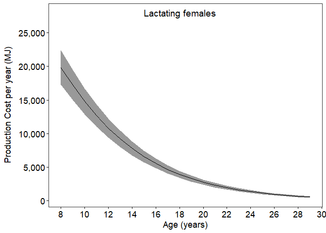

Production cost - Phase 2 - per year
================
Selina Agbayani
June 6, 2022 - code updated on 10 August, 2025

``` r
# Set path for output figures: 
Figurespath <- paste0(getwd(), "/production_cost/figures", collapse = NULL)
Figurespath
```

    ## [1] "C:/Users/AgbayaniS/Documents/R/graywhale_energyreqs/production_cost/figures"

``` r
# Set path for input & output data  
datapath <-  paste0(getwd(), "/data", collapse = NULL) 
datapath
```

    ## [1] "C:/Users/AgbayaniS/Documents/R/graywhale_energyreqs/data"

``` r
## Read data in (mean mass change)

gw_pred_mass <- as_tibble(read_csv("data/mass_table.csv"),
                          col_types = (list(cols(age_yrs = col_double(),
                                                 mean_mass = col_double(),
                                                 sd_mass = col_double(),
                                                 mean_lwr = col_double(),
                                                 mean_upr = col_double(),
                                                 quant025 = col_double(),
                                                 quant975 = col_double(),
                                                 female_mass = col_double(),
                                                 male_mass = col_double()
                                                 )
                                            )
                                       )
                          )
```

    ## Rows: 173 Columns: 9
    ## ── Column specification ────────────────────────────────────────────────────────
    ## Delimiter: ","
    ## dbl (9): age_yrs, mean_mass, sd_mass, mean_lwr, mean_upr, quant025, quant975...
    ## 
    ## ℹ Use `spec()` to retrieve the full column specification for this data.
    ## ℹ Specify the column types or set `show_col_types = FALSE` to quiet this message.

``` r
mean_masschange_peryear <- 
  as_data_frame(read_csv("data/mean_masschange_per_year.csv"),
                col_types = (list(cols(age_yrs = col_double(),
                                       mean_masschange = col_double(),
                                       sd_masschange = col_double(),
                                       sex = col_character()
                                       )
                                  )
                             )
                )
```

    ## Warning: `as_data_frame()` was deprecated in tibble 2.0.0.
    ## ℹ Please use `as_tibble()` (with slightly different semantics) to convert to a
    ##   tibble, or `as.data.frame()` to convert to a data frame.
    ## This warning is displayed once every 8 hours.
    ## Call `lifecycle::last_lifecycle_warnings()` to see where this warning was
    ## generated.

    ## Rows: 228 Columns: 4
    ## ── Column specification ────────────────────────────────────────────────────────
    ## Delimiter: ","
    ## chr (1): sex
    ## dbl (3): age_yrs, mean_masschange, sd_masschange
    ## 
    ## ℹ Use `spec()` to retrieve the full column specification for this data.
    ## ℹ Specify the column types or set `show_col_types = FALSE` to quiet this message.

``` r
age_yr_tibble <- 
  as_tibble(read_csv("data/age_yr_tibble.csv"),
            col_types = (list(cols(month = col_character(),
                                   no_days_in_mth = col_double(),
                                   age_mth = col_double(),
                                   no_days_cumul = col_double(),
                                   age_yrs = col_double()
                                   )
                              )
                         )
            )
```

    ## Rows: 25 Columns: 5
    ## ── Column specification ────────────────────────────────────────────────────────
    ## Delimiter: ","
    ## chr (1): month
    ## dbl (4): no_days_in_mth, age_mth, no_days_cumul, age_yrs
    ## 
    ## ℹ Use `spec()` to retrieve the full column specification for this data.
    ## ℹ Specify the column types or set `show_col_types = FALSE` to quiet this message.

``` r
P_cost_table_phase1  <-  read_csv("data/P_cost_table_phase1.csv")
```

    ## Rows: 39 Columns: 18
    ## ── Column specification ────────────────────────────────────────────────────────
    ## Delimiter: ","
    ## chr  (1): sex
    ## dbl (17): age_mth, age_yrs, mean_masschange, sd_masschange, mean_P, sd_P, qu...
    ## 
    ## ℹ Use `spec()` to retrieve the full column specification for this data.
    ## ℹ Specify the column types or set `show_col_types = FALSE` to quiet this message.

``` r
P_nb_table <- P_cost_table_phase1 %>%  
  filter(age_yrs == 0 & sex == "N/A") %>% 
  select("age_yrs", "mean_P", "sd_P")
```

### Production Cost formula and input variables

``` r
#  Calculate Production Costs (P) using equation from Winship et al. 2002
#  P = change in Mass x [(p_lipid x ED_lipid) + (1-p_lipid) x (1-p_water) x ED_protein]
 
#Energy density of lipid (MJ/kg)  
#ED_lipid <- 39.3 #39300 KJ/kg * 0.001 - Schmidt-Nielsen (1990)
ED_lipid <- 39.7 #MJ/kg - Sumich 1986 Kleiber 1961

#Energy density of protein (MJ/kg)  
#ED_protein <- 18 #18000 KJ/KG * 0.001  = - Schmidt-Nielsen (1990); Winship et al. (2002)
ED_protein <- 23.8 #MJ/kg  - from Sumich 1986 Kleiber 1961


#From Sumich 1986
#p_lipid_newborn_calf <- 0.33   # based on one observation (highest lipid value observed for neonates)
#p_lipid_adult <-  0.39         # -max value for p_lipid_adult
#one value range p_lipid
p_lipid_min  <- 0.33
p_lipid_max <-  0.39

#p_lipid_preg <- 0.6            # healthy whales at 60% range (0.6 - 0.62)
p_lipid_preg_min <- 0.6
p_lipid_preg_max <- 0.62
#P_lipid_lact <- (((0.33+0.38)/2)+0.6)/2  #range p_lipid_calf to  P_lipid_preg
p_lipid_lact_min <- (0.33+0.38)/2
p_lipid_lact_max <- 0.6


# From Villegas-Amtmann (2015,2017) - values are for Grey whales
#p_lipid_adult <- 0.34         # F_lipid (%lipid mass) - min value for p_lipid
p_protein_nb <- 0.126         # F_protein - fraction newborn protein mass - calculated from muscle and other tissues
p_protein_7mo <- 0.0972       # fraction protein mass up to 7 months = 0.0972
p_protein_avg_calf <- 0.0972   # avg p_protein from 6 months age 

#Calculated From Rice & Wolman 1971
p_protein_adult_SB <-  0.1062   # fraction of protein in southbound adults (fat)
p_protein_adult_NB <- 0.1086   # fraction of protein in northbound adults (thin)
p_protein_adult <- (p_protein_adult_SB+p_protein_adult_NB)/2   # Avg non-calves NB (0.1086) & SB (0.1062) from Rice and Wolman 2971)


# P = change in Mass x [(p_lipid x ED_lipid) + (1-p_lipid) x (1-p_water) x ED_protein]
# assume (1-p_water) = p_protein
```

Production Cost per year

``` r
MC_reps = 10000

P_cost_table<- as.data.frame(matrix(ncol = 7, nrow = 0))

cnames <- c("age_yrs", "mean_masschange", "sex",  
            "mean_P", "sd_P" , "p_lipid", "p_protein")            

colnames(P_cost_table) <- cnames

P_cost_table <- 
  as_tibble(P_cost_table,
            col_types = (list(ID=col_integer(),
                              age_yrs = col_double(),
                              mean_masschange = col_double(),
                              sex = col_character(),
                              mean_P = col_double(),
                              sd_P = col_double(),
                              p_lipid = col_double(),
                              p_protein = col_double()
                              )
                         )
            )


for (s in c("Female", "Male", "N/A")){

    for (i in seq(from = 0, to = 75, by = 1)){
        
        age <-  i
        
        strcolname <- as.character(age)
        
        mass_change_i <- filter(mean_masschange_peryear, 
                                age_yrs == age & sex == s)
        
        mass_chg <- mass_change_i$mean_masschange
        sd <- mass_change_i$sd_masschange
        
        set.seed(12345)
        mean_masschange_i <- 
          as_tibble(rnorm(MC_reps, mass_chg, sd), col.names = str(i))
        
        names(mean_masschange_i)[1] <- "mass_chg"
        
        mean_masschange_i <- mean_masschange_i %>%  
          mutate(age_yrs = strcolname)
        
        mean_masschange_i <- mean_masschange_i %>%  
          mutate(ID = row_number())
        

        #runif - random uniform distribution
        p_lipid_i <- as_tibble(runif(MC_reps, 
                                     min = p_lipid_min, 
                                     max = p_lipid_max), 
                               col.names = str(i))
        
        names(p_lipid_i)[1] <- "p_lipid"
        p_lipid_i <- p_lipid_i %>%  mutate(age_yrs = strcolname)
        p_lipid_i <- p_lipid_i %>%  mutate(ID = row_number())
        
        mean_masschange_i$p_lipid <- p_lipid_i$p_lipid
        
        #runif - random uniform distribution
        p_protein_adult_i <- as_tibble(runif(MC_reps, 
                                             min = p_protein_adult_SB, 
                                             max = p_protein_adult_NB), 
                                       col.names = str(i))
        
        names(p_protein_adult_i)[1] <- "p_protein"
        
        p_protein_adult_i <- p_protein_adult_i %>%  
          mutate(age_yrs = strcolname)
        p_protein_adult_i <- p_protein_adult_i %>%  
          mutate(ID = row_number())
        
        mean_masschange_i$p_protein_adult <- p_protein_adult_i$p_protein

        mean_masschange_i$P <-NA
        mass_chg_i <- mean_masschange_i$mass_chg
        P_cost <- mean_masschange_i$P
        age_yrs <- mean_masschange_i$age_yrs
        p_lipid_i <- mean_masschange_i$p_lipid
        p_protein_i <- mean_masschange_i$p_protein_adult
        
       
        ####  p_protein_i by age ###
        if (age==0) {
          p_protein <- p_protein_nb
        } else if (age==1){
          p_protein <-  p_protein_avg_calf
        } else if (age >1) {
          p_protein <-  mean(p_protein_i)
        }
        
        #Calculate Production costs for each age cohort
        P_cost_i <- 
          mass_chg_i*((p_lipid_i * ED_lipid) + (p_protein * ED_protein))
        

        #Calculate mean and sd P_cost
        mean_masschange <- mean(mean_masschange_i$mass_chg)
        p_lipid <- mean(p_lipid_i)
        mean_P_cost <- mean(P_cost_i, na.rm = TRUE)
        sd_P_cost <- sd(P_cost_i, na.rm = TRUE) 
        
       
        newRow <- tibble(age_yrs = age,
                         mean_masschange = mean_masschange,
                         sd_masschange = sd,
                         sex = s, 
                         mean_P = mean_P_cost,
                         sd_P = sd_P_cost,
                         p_lipid = p_lipid,
                         p_protein = p_protein
                         )
        
        P_cost_table <- rbind(P_cost_table, newRow)
  
      
    }
    
    }

    
kable(head(P_cost_table))
```

| age_yrs | mean_masschange | sd_masschange | sex | mean_P | sd_P | p_lipid | p_protein |
|---:|---:|---:|:---|---:|---:|---:|---:|
| 0 | 982.8335 | 27.098452 | Female | 16993.65 | 821.4277 | 0.3599891 | 0.126000 |
| 1 | 5233.5406 | 177.509836 | Female | 86903.17 | 4648.8192 | 0.3599891 | 0.097200 |
| 2 | 1648.1976 | 40.358507 | Female | 27767.99 | 1319.6083 | 0.3599891 | 0.107388 |
| 3 | 1579.4361 | 14.436330 | Female | 26609.44 | 1108.8105 | 0.3599891 | 0.107388 |
| 4 | 1469.1785 | 8.591593 | Female | 24751.87 | 1016.2572 | 0.3599891 | 0.107388 |
| 5 | 1336.6620 | 19.059815 | Female | 22519.35 | 970.7262 | 0.3599891 | 0.107388 |

``` r
P_cost_table$mean_P_perday <- P_cost_table$mean_P / 365
P_cost_table$sd_P_perday <- P_cost_table$sd_P / 365

P_cost_table <- P_cost_table %>% inner_join(gw_pred_mass,by="age_yrs")


P_cost_table %>% write_csv("data/P_cost_table_peryear.csv", na = "", append = FALSE)
```

#### Average annual production cost

| age_yrs | mean_masschange | sd_masschange | sex | mean_P | sd_P | p_lipid | p_protein | mean_P_perday | sd_P_perday | mean_mass | sd_mass | mean_lwr | mean_upr | quant025 | quant975 | female_mass | male_mass |
|---:|---:|---:|:---|---:|---:|---:|---:|---:|---:|---:|---:|---:|---:|---:|---:|---:|---:|
| 0 | 982.8335472 | 27.0984523 | Female | 1.699365e+04 | 821.4277235 | 0.3599891 | 0.126000 | 46.5579342 | 2.2504869 | 983.0272 | 26.7677 | 769.3864 | 1256.003 | 931.5244 | 1036.295 | 1011.028 | 967.3705 |
| 1 | 5233.5406439 | 177.5098358 | Female | 8.690317e+04 | 4648.8192438 | 0.3599891 | 0.097200 | 238.0908822 | 12.7364911 | 6072.8559 | 202.1109 | 5535.5539 | 6662.311 | 5685.3490 | 6476.221 | 6245.837 | 5976.1335 |
| 2 | 1648.1976339 | 40.3585070 | Female | 2.776799e+04 | 1319.6083344 | 0.3599891 | 0.107388 | 76.0766724 | 3.6153653 | 7675.1795 | 162.2450 | 6967.9413 | 8454.206 | 7362.0875 | 7997.123 | 7893.802 | 7552.9369 |
| 3 | 1579.4361265 | 14.4363304 | Female | 2.660944e+04 | 1108.8105015 | 0.3599891 | 0.107388 | 72.9025834 | 3.0378370 | 9210.7914 | 147.9849 | 8289.2833 | 10234.752 | 8924.5190 | 9503.733 | 9473.155 | 9064.0911 |
| 4 | 1469.1785071 | 8.5915930 | Female | 2.475187e+04 | 1016.2571659 | 0.3599891 | 0.107388 | 67.8133382 | 2.7842662 | 10639.3400 | 156.4716 | 9483.1963 | 11936.449 | 10336.4523 | 10948.882 | 10942.395 | 10469.8872 |
| 5 | 1336.6620210 | 19.0598145 | Female | 2.251935e+04 | 970.7262185 | 0.3599891 | 0.107388 | 61.6968394 | 2.6595239 | 11939.1149 | 175.2988 | 10546.1836 | 13516.043 | 11599.7789 | 12285.898 | 12279.193 | 11748.9607 |
| 6 | 1195.6928240 | 17.2796081 | Female | 2.014438e+04 | 869.6564471 | 0.3599891 | 0.107388 | 55.1900704 | 2.3826204 | 13101.8125 | 192.3675 | 11481.5758 | 14950.716 | 12729.4356 | 13482.361 | 13475.010 | 12893.1400 |
| 7 | 1055.5819179 | 5.7488968 | Female | 1.778383e+04 | 729.1476816 | 0.3599891 | 0.107388 | 48.7228252 | 1.9976649 | 14128.1995 | 198.0462 | 12296.8789 | 16232.278 | 13744.7075 | 14519.858 | 14530.633 | 13903.1797 |
| 8 | 922.3748970 | 3.7064693 | Female | 1.553963e+04 | 634.4620387 | 0.3599891 | 0.107388 | 42.5743345 | 1.7382522 | 15025.0545 | 201.7074 | 13002.1734 | 17362.684 | 14634.3618 | 15423.841 | 15453.034 | 14785.7505 |
| 9 | 799.3214733 | 3.3013288 | Female | 1.346650e+04 | 549.9762615 | 0.3599891 | 0.107388 | 36.8945216 | 1.5067843 | 15802.2199 | 198.4464 | 13608.4659 | 18349.646 | 15417.6838 | 16194.397 | 16252.336 | 15550.5379 |
| 10 | 688.1313924 | 6.7589935 | Female | 1.159325e+04 | 484.9212295 | 0.3599891 | 0.107388 | 31.7623248 | 1.3285513 | 16471.2552 | 191.7699 | 14127.0359 | 19204.496 | 16099.4933 | 16850.073 | 16940.429 | 16208.9176 |
| 11 | 589.2498386 | 8.6757751 | Female | 9.927358e+03 | 429.4989571 | 0.3599891 | 0.107388 | 27.1982413 | 1.1767095 | 17044.1369 | 183.2000 | 14568.7462 | 19940.147 | 16688.8362 | 17405.872 | 17529.629 | 16772.6749 |
| 12 | 502.3912453 | 8.7820874 | Female | 8.464017e+03 | 374.8762428 | 0.3599891 | 0.107388 | 23.1890875 | 1.0270582 | 17532.5649 | 174.5251 | 14943.7219 | 20569.919 | 17193.9597 | 17877.040 | 18031.969 | 17253.3237 |
| 13 | 426.8172020 | 7.8112295 | Female | 7.190787e+03 | 320.8844859 | 0.3599891 | 0.107388 | 19.7007874 | 0.8791356 | 17947.5174 | 166.8092 | 15261.1640 | 21106.756 | 17623.7800 | 18276.659 | 18458.741 | 17661.6673 |
| 14 | 361.5574214 | 5.9756137 | Female | 6.091323e+03 | 267.5241880 | 0.3599891 | 0.107388 | 16.6885572 | 0.7329430 | 18299.0278 | 160.9066 | 15529.2890 | 21562.783 | 17986.6712 | 18616.447 | 18820.264 | 18007.5791 |
| 15 | 305.5511011 | 2.3640003 | Female | 5.147750e+03 | 213.0037393 | 0.3599891 | 0.107388 | 14.1034245 | 0.5835719 | 18596.1032 | 158.5714 | 15755.3449 | 21949.080 | 18288.2406 | 18908.876 | 19125.802 | 18299.9231 |
| 16 | 257.7010224 | 0.5649072 | Female | 4.341594e+03 | 176.6192495 | 0.3599891 | 0.107388 | 11.8947789 | 0.4838884 | 18846.6639 | 158.0134 | 15945.6255 | 22275.514 | 18539.8637 | 19158.315 | 19383.500 | 18546.4931 |
| 17 | 216.9948509 | 2.5628248 | Female | 3.655808e+03 | 154.8165221 | 0.3599891 | 0.107388 | 10.0159124 | 0.4241549 | 19057.6668 | 160.5450 | 16105.5982 | 22550.851 | 18745.9573 | 19374.317 | 19600.513 | 18754.1353 |
| 18 | 182.4667415 | 4.1147751 | Female | 3.074105e+03 | 143.0896332 | 0.3599891 | 0.107388 | 8.4222042 | 0.3920264 | 19235.1086 | 164.6095 | 16239.9406 | 22782.700 | 18915.5279 | 19559.796 | 19783.009 | 18928.7510 |
| 19 | 153.2642701 | 5.9487689 | Female | 2.582125e+03 | 145.4014060 | 0.3599891 | 0.107388 | 7.0743155 | 0.3983600 | 19384.1695 | 170.4857 | 16352.6650 | 22977.682 | 19053.2180 | 19720.485 | 19936.316 | 19075.4378 |
| 20 | 128.6123829 | 6.4548531 | Female | 2.166807e+03 | 140.2189587 | 0.3599891 | 0.107388 | 5.9364567 | 0.3841615 | 19509.2648 | 176.8617 | 16447.1749 | 23141.467 | 19165.9803 | 19858.204 | 20064.974 | 19198.5407 |
| 21 | 107.8409569 | 6.4290075 | Female | 1.816862e+03 | 131.3487454 | 0.3599891 | 0.107388 | 4.9777043 | 0.3598596 | 19614.1637 | 183.2123 | 16526.3629 | 23278.914 | 19258.5998 | 19975.680 | 20172.861 | 19301.7689 |
| 22 | 90.3702146 | 7.0035139 | Female | 1.522527e+03 | 133.4732212 | 0.3599891 | 0.107388 | 4.1713081 | 0.3656801 | 19702.0797 | 190.1303 | 16592.6853 | 23394.184 | 19333.1445 | 20077.302 | 20263.281 | 19388.2847 |
| 23 | 75.6859367 | 6.5899842 | Female | 1.275134e+03 | 122.7323138 | 0.3599891 | 0.107388 | 3.4935181 | 0.3362529 | 19775.7153 | 196.6399 | 16648.2035 | 23490.783 | 19394.2022 | 20163.838 | 20339.014 | 19460.7475 |
| 24 | 63.3630303 | 6.7245379 | Female | 1.067526e+03 | 121.4970216 | 0.3599891 | 0.107388 | 2.9247278 | 0.3328686 | 19837.3702 | 203.2823 | 16694.6663 | 23571.703 | 19443.0270 | 20238.662 | 20402.426 | 19521.4204 |
| 25 | 53.0217709 | 5.7868280 | Female | 8.932991e+02 | 104.1869970 | 0.3599891 | 0.107388 | 2.4473947 | 0.2854438 | 19888.9637 | 208.9985 | 16733.5317 | 23639.442 | 19483.5824 | 20301.591 | 20455.489 | 19572.1922 |
| 26 | 44.3562700 | 5.2757621 | Female | 7.473061e+02 | 94.0591320 | 0.3599891 | 0.107388 | 2.0474140 | 0.2576963 | 19932.1282 | 214.2099 | 16766.0367 | 23696.133 | 19516.6862 | 20355.093 | 20499.883 | 19614.6691 |
| 27 | 37.0977008 | 4.8224492 | Female | 6.250165e+02 | 85.2346227 | 0.3599891 | 0.107388 | 1.7123741 | 0.2335195 | 19968.2319 | 218.9735 | 16793.2169 | 23743.564 | 19543.5960 | 20400.647 | 20537.015 | 19650.1979 |
| 28 | 31.0216531 | 4.5848908 | Female | 5.226501e+02 | 80.2047837 | 0.3599891 | 0.107388 | 1.4319181 | 0.2197391 | 19998.4263 | 223.5024 | 16815.9426 | 23783.240 | 19565.0513 | 20439.829 | 20568.069 | 19679.9113 |
| 29 | 25.9335057 | 3.9005099 | Female | 4.369257e+02 | 68.1490800 | 0.3599891 | 0.107388 | 1.1970566 | 0.1867098 | 20023.6686 | 227.3553 | 16834.9375 | 23816.416 | 19582.8605 | 20472.719 | 20594.031 | 19704.7517 |
| 30 | 21.6784971 | 3.5940084 | Female | 3.652388e+02 | 62.4090714 | 0.3599891 | 0.107388 | 1.0006542 | 0.1709838 | 20044.7717 | 230.9054 | 16850.8147 | 23844.156 | 19597.1158 | 20500.870 | 20615.735 | 19725.5186 |
| 31 | 18.1192786 | 3.2687577 | Female | 3.052741e+02 | 56.5062740 | 0.3599891 | 0.107388 | 0.8363673 | 0.1548117 | 20062.4119 | 234.1343 | 16864.0845 | 23867.348 | 19608.5290 | 20524.921 | 20633.877 | 19742.8779 |
| 32 | 15.1417674 | 2.8004899 | Female | 2.551091e+02 | 48.3535639 | 0.3599891 | 0.107388 | 0.6989291 | 0.1324755 | 20077.1538 | 236.9006 | 16875.1728 | 23886.731 | 19617.9367 | 20545.157 | 20649.039 | 19757.3849 |
| 33 | 12.6522315 | 2.3720058 | Female | 2.131654e+02 | 40.9295874 | 0.3599891 | 0.107388 | 0.5840149 | 0.1121359 | 20089.4721 | 239.2437 | 16884.4373 | 23902.930 | 19625.7374 | 20562.128 | 20661.708 | 19769.5070 |
| 34 | 10.5709772 | 1.9750012 | Female | 1.781003e+02 | 34.0845561 | 0.3599891 | 0.107388 | 0.4879461 | 0.0933823 | 20099.7640 | 241.1946 | 16892.1771 | 23916.464 | 19632.2683 | 20576.295 | 20672.294 | 19779.6351 |
| 35 | 8.8332445 | 1.8814122 | Female | 1.488237e+02 | 32.2964217 | 0.3599891 | 0.107388 | 0.4077362 | 0.0884833 | 20108.3657 | 243.0530 | 16898.6452 | 23927.777 | 19637.2875 | 20588.589 | 20681.140 | 19788.0997 |
| 36 | 7.3798869 | 1.6383854 | Female | 1.243376e+02 | 28.0843926 | 0.3599891 | 0.107388 | 0.3406509 | 0.0769435 | 20115.5526 | 244.6714 | 16904.0490 | 23937.230 | 19641.3550 | 20598.991 | 20688.532 | 19795.1722 |
| 37 | 6.1655129 | 1.4413646 | Female | 1.038779e+02 | 24.6668663 | 0.3599891 | 0.107388 | 0.2845969 | 0.0675805 | 20121.5573 | 246.0952 | 16908.5637 | 23945.129 | 19644.6157 | 20607.824 | 20694.708 | 19801.0813 |
| 38 | 5.1502120 | 1.1877222 | Female | 8.677180e+01 | 20.3345755 | 0.3599891 | 0.107388 | 0.2377310 | 0.0557112 | 20126.5732 | 247.2684 | 16912.3347 | 23951.727 | 19647.3705 | 20615.171 | 20699.866 | 19806.0172 |
| 39 | 4.3028941 | 1.1030633 | Female | 7.249640e+01 | 18.8294426 | 0.3599891 | 0.107388 | 0.1986203 | 0.0515875 | 20130.7645 | 248.3580 | 16915.4857 | 23957.241 | 19649.4621 | 20621.527 | 20704.177 | 19810.1419 |
| 40 | 3.5941279 | 0.9115471 | Female | 6.055487e+01 | 15.5644791 | 0.3599891 | 0.107388 | 0.1659038 | 0.0426424 | 20134.2655 | 249.2584 | 16918.1175 | 23961.846 | 19651.2279 | 20626.818 | 20707.778 | 19813.5870 |
| 41 | 3.0024142 | 0.8029420 | Female | 5.058566e+01 | 13.6923085 | 0.3599891 | 0.107388 | 0.1385908 | 0.0375132 | 20137.1903 | 250.0516 | 16920.3161 | 23965.694 | 19652.6245 | 20631.319 | 20710.786 | 19816.4653 |
| 42 | 2.5077236 | 0.6588703 | Female | 4.225091e+01 | 11.2402032 | 0.3599891 | 0.107388 | 0.1157559 | 0.0307951 | 20139.6332 | 250.7024 | 16922.1525 | 23968.908 | 19653.8133 | 20635.055 | 20713.298 | 19818.8692 |
| 43 | 2.0948230 | 0.5824293 | Female | 3.529434e+01 | 9.9233427 | 0.3599891 | 0.107388 | 0.0966968 | 0.0271872 | 20141.6740 | 251.2777 | 16923.6865 | 23971.593 | 19654.7456 | 20638.239 | 20715.397 | 19820.8776 |
| 44 | 1.7497366 | 0.4934734 | Female | 2.948022e+01 | 8.4051766 | 0.3599891 | 0.107388 | 0.0807677 | 0.0230279 | 20143.3787 | 251.7652 | 16924.9679 | 23973.836 | 19655.5112 | 20640.913 | 20717.151 | 19822.5551 |
| 45 | 1.4617899 | 0.4588318 | Female | 2.462895e+01 | 7.7993081 | 0.3599891 | 0.107388 | 0.0674766 | 0.0213680 | 20144.8032 | 252.2184 | 16926.0386 | 23975.710 | 19656.0625 | 20643.238 | 20718.616 | 19823.9569 |
| 46 | 1.2209857 | 0.3912610 | Female | 2.057179e+01 | 6.6484270 | 0.3599891 | 0.107388 | 0.0563611 | 0.0182149 | 20145.9931 | 252.6049 | 16926.9329 | 23977.276 | 19656.5078 | 20645.196 | 20719.839 | 19825.1279 |
| 47 | 1.0197072 | 0.3156954 | Female | 1.718051e+01 | 5.3675265 | 0.3599891 | 0.107388 | 0.0470699 | 0.0147056 | 20146.9868 | 252.9167 | 16927.6797 | 23978.583 | 19656.9007 | 20646.809 | 20720.861 | 19826.1057 |
| 48 | 0.8515832 | 0.2517141 | Female | 1.434784e+01 | 4.2833345 | 0.3599891 | 0.107388 | 0.0393091 | 0.0117352 | 20147.8165 | 253.1654 | 16928.3034 | 23979.675 | 19657.2514 | 20648.133 | 20721.715 | 19826.9222 |
| 49 | 0.7115597 | 0.2509967 | Female | 1.198880e+01 | 4.2588917 | 0.3599891 | 0.107388 | 0.0328460 | 0.0116682 | 20148.5101 | 253.4133 | 16928.8247 | 23980.588 | 19657.4673 | 20649.320 | 20722.428 | 19827.6048 |
| 50 | 0.5945377 | 0.2410266 | Female | 1.001725e+01 | 4.0829318 | 0.3599891 | 0.107388 | 0.0274445 | 0.0111861 | 20149.0899 | 253.6514 | 16929.2603 | 23981.351 | 19657.5884 | 20650.373 | 20723.024 | 19828.1753 |
| 51 | 0.4961027 | 0.1411474 | Female | 8.358531e+00 | 2.4036812 | 0.3599891 | 0.107388 | 0.0229001 | 0.0065854 | 20149.5732 | 253.7908 | 16929.6236 | 23981.987 | 19657.8032 | 20651.133 | 20723.521 | 19828.6509 |
| 52 | 0.4146177 | 0.1537402 | Female | 6.985763e+00 | 2.6069609 | 0.3599891 | 0.107388 | 0.0191391 | 0.0071424 | 20149.9774 | 253.9427 | 16929.9274 | 23982.519 | 19657.9148 | 20651.839 | 20723.937 | 19829.0487 |
| 53 | 0.3464141 | 0.1449623 | Female | 5.836679e+00 | 2.4548402 | 0.3599891 | 0.107388 | 0.0159909 | 0.0067256 | 20150.3152 | 254.0859 | 16930.1812 | 23982.963 | 19657.9768 | 20652.462 | 20724.285 | 19829.3812 |
| 54 | 0.2892546 | 0.1119691 | Female | 4.873576e+00 | 1.8976832 | 0.3599891 | 0.107388 | 0.0133523 | 0.0051991 | 20150.5972 | 254.1965 | 16930.3932 | 23983.334 | 19658.0458 | 20652.964 | 20724.575 | 19829.6587 |
| 55 | 0.2415748 | 0.0923122 | Female | 4.070228e+00 | 1.5647661 | 0.3599891 | 0.107388 | 0.0111513 | 0.0042870 | 20150.8328 | 254.2876 | 16930.5702 | 23983.644 | 19658.1057 | 20653.380 | 20724.817 | 19829.8905 |
| 56 | 0.2017425 | 0.0745699 | Female | 3.399095e+00 | 1.2645265 | 0.3599891 | 0.107388 | 0.0093126 | 0.0034645 | 20151.0294 | 254.3613 | 16930.7180 | 23983.903 | 19658.1605 | 20653.723 | 20725.019 | 19830.0840 |
| 57 | 0.1685582 | 0.0707277 | Female | 2.840013e+00 | 1.1976951 | 0.3599891 | 0.107388 | 0.0077809 | 0.0032814 | 20151.1938 | 254.4312 | 16930.8415 | 23984.120 | 19658.1903 | 20654.027 | 20725.188 | 19830.2458 |
| 58 | 0.1407614 | 0.0568401 | Female | 2.371661e+00 | 0.9628974 | 0.3599891 | 0.107388 | 0.0064977 | 0.0026381 | 20151.3311 | 254.4873 | 16930.9446 | 23984.300 | 19658.2194 | 20654.276 | 20725.329 | 19830.3808 |
| 59 | 0.1176296 | 0.0562522 | Female | 1.981948e+00 | 0.9514981 | 0.3599891 | 0.107388 | 0.0054300 | 0.0026068 | 20151.4458 | 254.5429 | 16931.0309 | 23984.451 | 19658.2271 | 20654.501 | 20725.447 | 19830.4938 |
| 60 | 0.0982336 | 0.0457325 | Female | 1.655139e+00 | 0.7737195 | 0.3599891 | 0.107388 | 0.0045346 | 0.0021198 | 20151.5417 | 254.5880 | 16931.1029 | 23984.577 | 19658.2359 | 20654.686 | 20725.546 | 19830.5881 |
| 61 | 0.0820275 | 0.0360651 | Female | 1.382075e+00 | 0.6104562 | 0.3599891 | 0.107388 | 0.0037865 | 0.0016725 | 20151.6217 | 254.6237 | 16931.1630 | 23984.683 | 19658.2473 | 20654.837 | 20725.628 | 19830.6668 |
| 62 | 0.0685375 | 0.0339332 | Female | 1.154797e+00 | 0.5738295 | 0.3599891 | 0.107388 | 0.0031638 | 0.0015721 | 20151.6886 | 254.6572 | 16931.2132 | 23984.771 | 19658.2496 | 20654.971 | 20725.697 | 19830.7326 |
| 63 | 0.0572112 | 0.0243301 | Female | 9.639444e-01 | 0.4119495 | 0.3599891 | 0.107388 | 0.0026409 | 0.0011286 | 20151.7444 | 254.6812 | 16931.2552 | 23984.844 | 19658.2591 | 20655.074 | 20725.755 | 19830.7875 |
| 64 | 0.0478368 | 0.0274854 | Female | 8.060214e-01 | 0.4643694 | 0.3599891 | 0.107388 | 0.0022083 | 0.0012722 | 20151.7911 | 254.7084 | 16931.2902 | 23984.906 | 19658.2535 | 20655.175 | 20725.803 | 19830.8335 |
| 65 | 0.0399136 | 0.0178288 | Female | 6.725029e-01 | 0.3017372 | 0.3599891 | 0.107388 | 0.0018425 | 0.0008267 | 20151.8300 | 254.7260 | 16931.3195 | 23984.957 | 19658.2585 | 20655.249 | 20725.843 | 19830.8718 |
| 66 | 0.0333396 | 0.0154464 | Female | 5.617398e-01 | 0.2613389 | 0.3599891 | 0.107388 | 0.0015390 | 0.0007160 | 20151.8625 | 254.7412 | 16931.3439 | 23985.000 | 19658.2616 | 20655.312 | 20725.876 | 19830.9038 |
| 67 | 0.0278490 | 0.0134398 | Female | 4.692295e-01 | 0.2273162 | 0.3599891 | 0.107388 | 0.0012856 | 0.0006228 | 20151.8897 | 254.7545 | 16931.3643 | 23985.035 | 19658.2632 | 20655.365 | 20725.904 | 19830.9305 |
| 68 | 0.0232862 | 0.0147771 | Female | 3.923639e-01 | 0.2495400 | 0.3599891 | 0.107388 | 0.0010750 | 0.0006837 | 20151.9124 | 254.7691 | 16931.3814 | 23985.065 | 19658.2579 | 20655.417 | 20725.927 | 19830.9529 |
| 69 | 0.0194306 | 0.0100058 | Female | 3.273890e-01 | 0.1691581 | 0.3599891 | 0.107388 | 0.0008970 | 0.0004634 | 20151.9314 | 254.7790 | 16931.3957 | 23985.090 | 19658.2578 | 20655.456 | 20725.947 | 19830.9716 |
| 70 | 0.0162485 | 0.0110218 | Female | 2.737832e-01 | 0.1860743 | 0.3599891 | 0.107388 | 0.0007501 | 0.0005098 | 20151.9473 | 254.7899 | 16931.4076 | 23985.111 | 19658.2527 | 20655.493 | 20725.963 | 19830.9872 |
| 71 | 0.0135454 | 0.0059086 | Female | 2.282249e-01 | 0.1000195 | 0.3599891 | 0.107388 | 0.0006253 | 0.0002740 | 20151.9605 | 254.7957 | 16931.4175 | 23985.129 | 19658.2547 | 20655.518 | 20725.977 | 19831.0002 |
| 72 | 0.0113333 | 0.0076069 | Female | 1.909635e-01 | 0.1284278 | 0.3599891 | 0.107388 | 0.0005232 | 0.0003519 | 20151.9716 | 254.8032 | 16931.4258 | 23985.143 | 19658.2513 | 20655.544 | 20725.988 | 19831.0111 |
| 73 | 0.0094583 | 0.0054164 | Female | 1.593666e-01 | 0.0915126 | 0.3599891 | 0.107388 | 0.0004366 | 0.0002507 | 20151.9808 | 254.8086 | 16931.4328 | 23985.155 | 19658.2502 | 20655.564 | 20725.998 | 19831.0202 |
| 74 | 0.0078979 | 0.0043217 | Female | 1.330742e-01 | 0.0730354 | 0.3599891 | 0.107388 | 0.0003646 | 0.0002001 | 20151.9885 | 254.8129 | 16931.4386 | 23985.165 | 19658.2497 | 20655.580 | 20726.006 | 19831.0278 |
| 75 | 0.0066029 | 0.0044828 | Female | 1.112573e-01 | 0.0756801 | 0.3599891 | 0.107388 | 0.0003048 | 0.0002073 | 20151.9949 | 254.8173 | 16931.4434 | 23985.174 | 19658.2476 | 20655.595 | 20726.012 | 19831.0341 |
| 0 | 982.8335472 | 27.0984523 | Male | 1.699365e+04 | 821.4277235 | 0.3599891 | 0.126000 | 46.5579342 | 2.2504869 | 983.0272 | 26.7677 | 769.3864 | 1256.003 | 931.5244 | 1036.295 | 1011.028 | 967.3705 |
| 1 | 5007.4942789 | 177.5098358 | Male | 8.314969e+04 | 4530.2828184 | 0.3599891 | 0.097200 | 227.8073665 | 12.4117337 | 6072.8559 | 202.1109 | 5535.5539 | 6662.311 | 5685.3490 | 6476.221 | 6245.837 | 5976.1335 |
| 2 | 1577.0362132 | 40.3585070 | Male | 2.656910e+04 | 1278.1269178 | 0.3599891 | 0.107388 | 72.7920561 | 3.5017176 | 7675.1795 | 162.2450 | 6967.9413 | 8454.206 | 7362.0875 | 7997.123 | 7893.802 | 7552.9369 |
| 3 | 1511.2374677 | 14.4363304 | Male | 2.546047e+04 | 1063.3351372 | 0.3599891 | 0.107388 | 69.7547201 | 2.9132470 | 9210.7914 | 147.9849 | 8289.2833 | 10234.752 | 8924.5190 | 9503.733 | 9473.155 | 9064.0911 |
| 4 | 1405.7346792 | 8.5915930 | Male | 2.368300e+04 | 973.3116237 | 0.3599891 | 0.107388 | 64.8849448 | 2.6666072 | 10639.3400 | 156.4716 | 9483.1963 | 11936.449 | 10336.4523 | 10948.882 | 10942.395 | 10469.8872 |
| 5 | 1278.9372090 | 19.0598145 | Male | 2.154683e+04 | 933.5461655 | 0.3599891 | 0.107388 | 59.0324202 | 2.5576607 | 11939.1149 | 175.2988 | 10546.1836 | 13516.043 | 11599.7789 | 12285.898 | 12279.193 | 11748.9607 |
| 6 | 1144.0558079 | 17.2796081 | Male | 1.927443e+04 | 836.4486542 | 0.3599891 | 0.107388 | 52.8066472 | 2.2916401 | 13101.8125 | 192.3675 | 11481.5758 | 14950.716 | 12729.4356 | 13482.361 | 13475.010 | 12893.1400 |
| 7 | 1009.9986447 | 5.7488968 | Male | 1.701587e+04 | 698.2486502 | 0.3599891 | 0.107388 | 46.6188262 | 1.9130100 | 14128.1995 | 198.0462 | 12296.8789 | 16232.278 | 13744.7075 | 14519.858 | 14530.633 | 13903.1797 |
| 8 | 882.5443190 | 3.7064693 | Male | 1.486859e+04 | 607.3485329 | 0.3599891 | 0.107388 | 40.7358641 | 1.6639686 | 15025.0545 | 201.7074 | 13002.1734 | 17362.684 | 14634.3618 | 15423.841 | 15453.034 | 14785.7505 |
| 9 | 764.8064798 | 3.3013288 | Male | 1.288501e+04 | 526.4878829 | 0.3599891 | 0.107388 | 35.3014040 | 1.4424326 | 15802.2199 | 198.4464 | 13608.4659 | 18349.646 | 15417.6838 | 16194.397 | 16252.336 | 15550.5379 |
| 10 | 658.4186027 | 6.7589935 | Male | 1.109267e+04 | 465.1849263 | 0.3599891 | 0.107388 | 30.3908638 | 1.2744793 | 16471.2552 | 191.7699 | 14127.0359 | 19204.496 | 16099.4933 | 16850.073 | 16940.429 | 16208.9176 |
| 11 | 563.8073697 | 8.6757751 | Male | 9.498719e+03 | 413.1728981 | 0.3599891 | 0.107388 | 26.0238866 | 1.1319805 | 17044.1369 | 183.2000 | 14568.7462 | 19940.147 | 16688.8362 | 17405.872 | 17529.629 | 16772.6749 |
| 12 | 480.6994780 | 8.7820874 | Male | 8.098567e+03 | 361.2871977 | 0.3599891 | 0.107388 | 22.1878549 | 0.9898279 | 17532.5649 | 174.5251 | 14943.7219 | 20569.919 | 17193.9597 | 17877.040 | 18031.969 | 17253.3237 |
| 13 | 408.3885855 | 7.8112295 | Male | 6.880313e+03 | 309.4280897 | 0.3599891 | 0.107388 | 18.8501729 | 0.8477482 | 17947.5174 | 166.8092 | 15261.1640 | 21106.756 | 17623.7800 | 18276.659 | 18458.741 | 17661.6673 |
| 14 | 345.9463560 | 5.9756137 | Male | 5.828318e+03 | 257.6597017 | 0.3599891 | 0.107388 | 15.9679932 | 0.7059170 | 18299.0278 | 160.9066 | 15529.2890 | 21562.783 | 17986.6712 | 18616.447 | 18820.264 | 18007.5791 |
| 15 | 292.3575672 | 2.3640003 | Male | 4.925473e+03 | 204.1430104 | 0.3599891 | 0.107388 | 13.4944471 | 0.5592959 | 18596.1032 | 158.5714 | 15755.3449 | 21949.080 | 18288.2406 | 18908.876 | 19125.802 | 18299.9231 |
| 16 | 246.5732736 | 0.5649072 | Male | 4.154121e+03 | 169.0172997 | 0.3599891 | 0.107388 | 11.3811524 | 0.4630611 | 18846.6639 | 158.0134 | 15945.6255 | 22275.514 | 18539.8637 | 19158.315 | 19383.500 | 18546.4931 |
| 17 | 207.6239197 | 2.5628248 | Male | 3.497932e+03 | 148.6701491 | 0.3599891 | 0.107388 | 9.5833759 | 0.4073155 | 19057.6668 | 160.5450 | 16105.5982 | 22550.851 | 18745.9573 | 19374.317 | 19600.513 | 18754.1353 |
| 18 | 174.5863033 | 4.1147751 | Male | 2.941340e+03 | 138.3975523 | 0.3599891 | 0.107388 | 8.0584647 | 0.3791714 | 19235.1086 | 164.6095 | 16239.9406 | 22782.700 | 18915.5279 | 19559.796 | 19783.009 | 18928.7510 |
| 19 | 146.6442693 | 5.9487689 | Male | 2.470595e+03 | 142.1541284 | 0.3599891 | 0.107388 | 6.7687544 | 0.3894634 | 19384.1695 | 170.4857 | 16352.6650 | 22977.682 | 19053.2180 | 19720.485 | 19936.316 | 19075.4378 |
| 20 | 123.0567288 | 6.4548531 | Male | 2.073208e+03 | 137.8508516 | 0.3599891 | 0.107388 | 5.6800229 | 0.3776736 | 19509.2648 | 176.8617 | 16447.1749 | 23141.467 | 19165.9803 | 19858.204 | 20064.974 | 19198.5407 |
| 21 | 103.1822499 | 6.4290075 | Male | 1.738375e+03 | 129.5722264 | 0.3599891 | 0.107388 | 4.7626711 | 0.3549924 | 19614.1637 | 183.2123 | 16526.3629 | 23278.914 | 19258.5998 | 19975.680 | 20172.861 | 19301.7689 |
| 22 | 86.4657413 | 7.0035139 | Male | 1.456747e+03 | 132.2454197 | 0.3599891 | 0.107388 | 3.9910883 | 0.3623162 | 19702.0797 | 190.1303 | 16592.6853 | 23394.184 | 19333.1445 | 20077.302 | 20263.281 | 19388.2847 |
| 23 | 72.4156786 | 6.5899842 | Male | 1.220039e+03 | 121.7953342 | 0.3599891 | 0.107388 | 3.3425720 | 0.3336858 | 19775.7153 | 196.6399 | 16648.2035 | 23490.783 | 19394.2022 | 20163.838 | 20339.014 | 19460.7475 |
| 24 | 60.6248510 | 6.7245379 | Male | 1.021394e+03 | 120.8327547 | 0.3599891 | 0.107388 | 2.7983409 | 0.3310486 | 19837.3702 | 203.2823 | 16694.6663 | 23571.703 | 19443.0270 | 20238.662 | 20402.426 | 19521.4204 |
| 25 | 50.7304310 | 5.7868280 | Male | 8.546959e+02 | 103.6444461 | 0.3599891 | 0.107388 | 2.3416327 | 0.2839574 | 19888.9637 | 208.9985 | 16733.5317 | 23639.442 | 19483.5824 | 20301.591 | 20455.489 | 19572.1922 |
| 26 | 42.4392762 | 5.2757621 | Male | 7.150098e+02 | 93.6381786 | 0.3599891 | 0.107388 | 1.9589309 | 0.2565430 | 19932.1282 | 214.2099 | 16766.0367 | 23696.133 | 19516.6862 | 20355.093 | 20499.883 | 19614.6691 |
| 27 | 35.4942821 | 4.8224492 | Male | 5.980031e+02 | 84.9093359 | 0.3599891 | 0.107388 | 1.6383646 | 0.2326283 | 19968.2319 | 218.9735 | 16793.2169 | 23743.564 | 19543.5960 | 20400.647 | 20537.015 | 19650.1979 |
| 28 | 29.6806799 | 4.5848908 | Male | 5.000582e+02 | 79.9626134 | 0.3599891 | 0.107388 | 1.3700224 | 0.2190757 | 19998.4263 | 223.5024 | 16815.9426 | 23783.240 | 19565.0513 | 20439.829 | 20568.069 | 19679.9113 |
| 29 | 24.8124570 | 3.9005099 | Male | 4.180389e+02 | 67.9498404 | 0.3599891 | 0.107388 | 1.1453121 | 0.1861639 | 20023.6686 | 227.3553 | 16834.9375 | 23816.416 | 19582.8605 | 20472.719 | 20594.031 | 19704.7517 |
| 30 | 20.7412802 | 3.5940084 | Male | 3.494491e+02 | 62.2567854 | 0.3599891 | 0.107388 | 0.9573948 | 0.1705665 | 20044.7717 | 230.9054 | 16850.8147 | 23844.156 | 19597.1158 | 20500.870 | 20615.735 | 19725.5186 |
| 31 | 17.3358541 | 3.2687577 | Male | 2.920754e+02 | 56.3885797 | 0.3599891 | 0.107388 | 0.8002066 | 0.1544893 | 20062.4119 | 234.1343 | 16864.0845 | 23867.348 | 19608.5290 | 20524.921 | 20633.877 | 19742.8779 |
| 32 | 14.4870605 | 2.8004899 | Male | 2.440790e+02 | 48.2574642 | 0.3599891 | 0.107388 | 0.6687096 | 0.1322122 | 20077.1538 | 236.9006 | 16875.1728 | 23886.731 | 19617.9367 | 20545.157 | 20649.039 | 19757.3849 |
| 33 | 12.1051585 | 2.3720058 | Male | 2.039487e+02 | 40.8502969 | 0.3599891 | 0.107388 | 0.5587635 | 0.1119186 | 20089.4721 | 239.2437 | 16884.4373 | 23902.930 | 19625.7374 | 20562.128 | 20661.708 | 19769.5070 |
| 34 | 10.1138981 | 1.9750012 | Male | 1.703997e+02 | 34.0180955 | 0.3599891 | 0.107388 | 0.4668486 | 0.0932003 | 20099.7640 | 241.1946 | 16892.1771 | 23916.464 | 19632.2683 | 20576.295 | 20672.294 | 19779.6351 |
| 35 | 8.4512320 | 1.8814122 | Male | 1.423878e+02 | 32.2472959 | 0.3599891 | 0.107388 | 0.3901036 | 0.0883488 | 20108.3657 | 243.0530 | 16898.6452 | 23927.777 | 19637.2875 | 20588.589 | 20681.140 | 19788.0997 |
| 36 | 7.0607075 | 1.6383854 | Male | 1.189602e+02 | 28.0449176 | 0.3599891 | 0.107388 | 0.3259185 | 0.0768354 | 20115.5526 | 244.6714 | 16904.0490 | 23937.230 | 19641.3550 | 20598.991 | 20688.532 | 19795.1722 |
| 37 | 5.8988327 | 1.4413646 | Male | 9.938499e+01 | 24.6354524 | 0.3599891 | 0.107388 | 0.2722876 | 0.0674944 | 20121.5573 | 246.0952 | 16908.5637 | 23945.129 | 19644.6157 | 20607.824 | 20694.708 | 19801.0813 |
| 38 | 4.9274521 | 1.1877222 | Male | 8.301888e+01 | 20.3079959 | 0.3599891 | 0.107388 | 0.2274490 | 0.0556383 | 20126.5732 | 247.2684 | 16912.3347 | 23951.727 | 19647.3705 | 20615.171 | 20699.866 | 19806.0172 |
| 39 | 4.1167487 | 1.1030633 | Male | 6.936034e+01 | 18.8093443 | 0.3599891 | 0.107388 | 0.1900283 | 0.0515325 | 20130.7645 | 248.3580 | 16915.4857 | 23957.241 | 19649.4621 | 20621.527 | 20704.177 | 19810.1419 |
| 40 | 3.4386472 | 0.9115471 | Male | 5.793542e+01 | 15.5475207 | 0.3599891 | 0.107388 | 0.1587272 | 0.0425959 | 20134.2655 | 249.2584 | 16918.1175 | 23961.846 | 19651.2279 | 20626.818 | 20707.778 | 19813.5870 |
| 41 | 2.8725179 | 0.8029420 | Male | 4.839724e+01 | 13.6788337 | 0.3599891 | 0.107388 | 0.1325952 | 0.0374763 | 20137.1903 | 250.0516 | 16920.3161 | 23965.694 | 19652.6245 | 20631.319 | 20710.786 | 19816.4653 |
| 42 | 2.3992332 | 0.6588703 | Male | 4.042313e+01 | 11.2287587 | 0.3599891 | 0.107388 | 0.1107483 | 0.0307637 | 20139.6332 | 250.7024 | 16922.1525 | 23968.908 | 19653.8133 | 20635.055 | 20713.298 | 19818.8692 |
| 43 | 2.0041859 | 0.5824293 | Male | 3.376734e+01 | 9.9142802 | 0.3599891 | 0.107388 | 0.0925133 | 0.0271624 | 20141.6740 | 251.2777 | 16923.6865 | 23971.593 | 19654.7456 | 20638.239 | 20715.397 | 19820.8776 |
| 44 | 1.6740282 | 0.4934734 | Male | 2.820473e+01 | 8.3977083 | 0.3599891 | 0.107388 | 0.0772732 | 0.0230074 | 20143.3787 | 251.7652 | 16924.9679 | 23973.836 | 19655.5112 | 20640.913 | 20717.151 | 19822.5551 |
| 45 | 1.3985262 | 0.4588318 | Male | 2.356312e+01 | 7.7936689 | 0.3599891 | 0.107388 | 0.0645565 | 0.0213525 | 20144.8032 | 252.2184 | 16926.0386 | 23975.710 | 19656.0625 | 20643.238 | 20718.616 | 19823.9569 |
| 46 | 1.1681410 | 0.3912610 | Male | 1.968150e+01 | 6.6438079 | 0.3599891 | 0.107388 | 0.0539219 | 0.0182022 | 20145.9931 | 252.6049 | 16926.9329 | 23977.276 | 19656.5078 | 20645.196 | 20719.839 | 19825.1279 |
| 47 | 0.9755774 | 0.3156954 | Male | 1.643704e+01 | 5.3635413 | 0.3599891 | 0.107388 | 0.0450330 | 0.0146946 | 20146.9868 | 252.9167 | 16927.6797 | 23978.583 | 19656.9007 | 20646.809 | 20720.861 | 19826.1057 |
| 48 | 0.8147330 | 0.2517141 | Male | 1.372700e+01 | 4.2798575 | 0.3599891 | 0.107388 | 0.0376082 | 0.0117256 | 20147.8165 | 253.1654 | 16928.3034 | 23979.675 | 19657.2514 | 20648.133 | 20721.715 | 19826.9222 |
| 49 | 0.6807561 | 0.2509967 | Male | 1.146984e+01 | 4.2564331 | 0.3599891 | 0.107388 | 0.0314242 | 0.0116615 | 20148.5101 | 253.4133 | 16928.8247 | 23980.588 | 19657.4673 | 20649.320 | 20722.428 | 19827.6048 |
| 50 | 0.5687903 | 0.2410266 | Male | 9.583473e+00 | 4.0811299 | 0.3599891 | 0.107388 | 0.0262561 | 0.0111812 | 20149.0899 | 253.6514 | 16929.2603 | 23981.351 | 19657.5884 | 20650.373 | 20723.024 | 19828.1753 |
| 51 | 0.4746368 | 0.1411474 | Male | 7.996885e+00 | 2.4015812 | 0.3599891 | 0.107388 | 0.0219093 | 0.0065797 | 20149.5732 | 253.7908 | 16929.6236 | 23981.987 | 19657.8032 | 20651.133 | 20723.521 | 19828.6509 |
| 52 | 0.3966665 | 0.1537402 | Male | 6.683332e+00 | 2.6055942 | 0.3599891 | 0.107388 | 0.0183105 | 0.0071386 | 20149.9774 | 253.9427 | 16929.9274 | 23982.519 | 19657.9148 | 20651.839 | 20723.937 | 19829.0487 |
| 53 | 0.3314107 | 0.1449623 | Male | 5.583911e+00 | 2.4538212 | 0.3599891 | 0.107388 | 0.0152984 | 0.0067228 | 20150.3152 | 254.0859 | 16930.1812 | 23982.963 | 19657.9768 | 20652.462 | 20724.285 | 19829.3812 |
| 54 | 0.2767296 | 0.1119691 | Male | 4.662563e+00 | 1.8967676 | 0.3599891 | 0.107388 | 0.0127741 | 0.0051966 | 20150.5972 | 254.1965 | 16930.3932 | 23983.334 | 19658.0458 | 20652.964 | 20724.575 | 19829.6587 |
| 55 | 0.2311148 | 0.0923122 | Male | 3.894004e+00 | 1.5639921 | 0.3599891 | 0.107388 | 0.0106685 | 0.0042849 | 20150.8328 | 254.2876 | 16930.5702 | 23983.644 | 19658.1057 | 20653.380 | 20724.817 | 19829.8905 |
| 56 | 0.1930080 | 0.0745699 | Male | 3.251941e+00 | 1.2638596 | 0.3599891 | 0.107388 | 0.0089094 | 0.0034626 | 20151.0294 | 254.3613 | 16930.7180 | 23983.903 | 19658.1605 | 20653.723 | 20725.019 | 19830.0840 |
| 57 | 0.1612578 | 0.0707277 | Male | 2.717020e+00 | 1.1972005 | 0.3599891 | 0.107388 | 0.0074439 | 0.0032800 | 20151.1938 | 254.4312 | 16930.8415 | 23984.120 | 19658.1903 | 20654.027 | 20725.188 | 19830.2458 |
| 58 | 0.1346656 | 0.0568401 | Male | 2.268963e+00 | 0.9624692 | 0.3599891 | 0.107388 | 0.0062163 | 0.0026369 | 20151.3311 | 254.4873 | 16930.9446 | 23984.300 | 19658.2194 | 20654.276 | 20725.329 | 19830.3808 |
| 59 | 0.1125329 | 0.0562522 | Male | 1.896081e+00 | 0.9511928 | 0.3599891 | 0.107388 | 0.0051947 | 0.0026060 | 20151.4458 | 254.5429 | 16931.0309 | 23984.451 | 19658.2271 | 20654.501 | 20725.447 | 19830.4938 |
| 60 | 0.0939776 | 0.0457325 | Male | 1.583437e+00 | 0.7734580 | 0.3599891 | 0.107388 | 0.0043382 | 0.0021191 | 20151.5417 | 254.5880 | 16931.1029 | 23984.577 | 19658.2359 | 20654.686 | 20725.546 | 19830.5881 |
| 61 | 0.0784743 | 0.0360651 | Male | 1.322213e+00 | 0.6102258 | 0.3599891 | 0.107388 | 0.0036225 | 0.0016719 | 20151.6217 | 254.6237 | 16931.1630 | 23984.683 | 19658.2473 | 20654.837 | 20725.628 | 19830.6668 |
| 62 | 0.0655675 | 0.0339332 | Male | 1.104760e+00 | 0.5736573 | 0.3599891 | 0.107388 | 0.0030267 | 0.0015717 | 20151.6886 | 254.6572 | 16931.2132 | 23984.771 | 19658.2496 | 20654.971 | 20725.697 | 19830.7326 |
| 63 | 0.0547332 | 0.0243301 | Male | 9.221971e-01 | 0.4117837 | 0.3599891 | 0.107388 | 0.0025266 | 0.0011282 | 20151.7444 | 254.6812 | 16931.2552 | 23984.844 | 19658.2591 | 20655.074 | 20725.755 | 19830.7875 |
| 64 | 0.0457627 | 0.0274854 | Male | 7.710775e-01 | 0.4642647 | 0.3599891 | 0.107388 | 0.0021125 | 0.0012720 | 20151.7911 | 254.7084 | 16931.2902 | 23984.906 | 19658.2535 | 20655.175 | 20725.803 | 19830.8335 |
| 65 | 0.0381846 | 0.0178288 | Male | 6.433732e-01 | 0.3016268 | 0.3599891 | 0.107388 | 0.0017627 | 0.0008264 | 20151.8300 | 254.7260 | 16931.3195 | 23984.957 | 19658.2585 | 20655.249 | 20725.843 | 19830.8718 |
| 66 | 0.0318952 | 0.0154464 | Male | 5.374051e-01 | 0.2612497 | 0.3599891 | 0.107388 | 0.0014723 | 0.0007158 | 20151.8625 | 254.7412 | 16931.3439 | 23985.000 | 19658.2616 | 20655.312 | 20725.876 | 19830.9038 |
| 67 | 0.0266423 | 0.0134398 | Male | 4.488997e-01 | 0.2272445 | 0.3599891 | 0.107388 | 0.0012299 | 0.0006226 | 20151.8897 | 254.7545 | 16931.3643 | 23985.035 | 19658.2632 | 20655.365 | 20725.904 | 19830.9305 |
| 68 | 0.0222762 | 0.0147771 | Male | 3.753465e-01 | 0.2494935 | 0.3599891 | 0.107388 | 0.0010283 | 0.0006835 | 20151.9124 | 254.7691 | 16931.3814 | 23985.065 | 19658.2579 | 20655.417 | 20725.927 | 19830.9529 |
| 69 | 0.0185884 | 0.0100058 | Male | 3.132014e-01 | 0.1691110 | 0.3599891 | 0.107388 | 0.0008581 | 0.0004633 | 20151.9314 | 254.7790 | 16931.3957 | 23985.090 | 19658.2578 | 20655.456 | 20725.947 | 19830.9716 |
| 70 | 0.0155435 | 0.0110218 | Male | 2.619052e-01 | 0.1860438 | 0.3599891 | 0.107388 | 0.0007175 | 0.0005097 | 20151.9473 | 254.7899 | 16931.4076 | 23985.111 | 19658.2527 | 20655.493 | 20725.963 | 19830.9872 |
| 71 | 0.0129586 | 0.0059086 | Male | 2.183400e-01 | 0.0999812 | 0.3599891 | 0.107388 | 0.0005982 | 0.0002739 | 20151.9605 | 254.7957 | 16931.4175 | 23985.129 | 19658.2547 | 20655.518 | 20725.977 | 19831.0002 |
| 72 | 0.0108416 | 0.0076069 | Male | 1.826790e-01 | 0.1284063 | 0.3599891 | 0.107388 | 0.0005005 | 0.0003518 | 20151.9716 | 254.8032 | 16931.4258 | 23985.143 | 19658.2513 | 20655.544 | 20725.988 | 19831.0111 |
| 73 | 0.0090482 | 0.0054164 | Male | 1.524575e-01 | 0.0914919 | 0.3599891 | 0.107388 | 0.0004177 | 0.0002507 | 20151.9808 | 254.8086 | 16931.4328 | 23985.155 | 19658.2502 | 20655.564 | 20725.998 | 19831.0202 |
| 74 | 0.0075555 | 0.0043217 | Male | 1.273061e-01 | 0.0730173 | 0.3599891 | 0.107388 | 0.0003488 | 0.0002000 | 20151.9885 | 254.8129 | 16931.4386 | 23985.165 | 19658.2497 | 20655.580 | 20726.006 | 19831.0278 |
| 75 | 0.0063164 | 0.0044828 | Male | 1.064304e-01 | 0.0756677 | 0.3599891 | 0.107388 | 0.0002916 | 0.0002073 | 20151.9949 | 254.8173 | 16931.4434 | 23985.174 | 19658.2476 | 20655.595 | 20726.012 | 19831.0341 |
| 0 | 982.8335472 | 27.0984523 | N/A | 1.699365e+04 | 821.4277235 | 0.3599891 | 0.126000 | 46.5579342 | 2.2504869 | 983.0272 | 26.7677 | 769.3864 | 1256.003 | 931.5244 | 1036.295 | 1011.028 | 967.3705 |
| 1 | 5088.5599798 | 177.5098358 | N/A | 8.449578e+04 | 4572.5446500 | 0.3599891 | 0.097200 | 231.4952843 | 12.5275196 | 6072.8559 | 202.1109 | 5535.5539 | 6662.311 | 5685.3490 | 6476.221 | 6245.837 | 5976.1335 |
| 2 | 1602.5564220 | 40.3585070 | N/A | 2.699905e+04 | 1292.9453591 | 0.3599891 | 0.107388 | 73.9699990 | 3.5423161 | 7675.1795 | 162.2450 | 6967.9413 | 8454.206 | 7362.0875 | 7997.123 | 7893.802 | 7552.9369 |
| 3 | 1535.6951584 | 14.4363304 | N/A | 2.587252e+04 | 1079.6320683 | 0.3599891 | 0.107388 | 70.8836201 | 2.9578961 | 9210.7914 | 147.9849 | 8289.2833 | 10234.752 | 8924.5190 | 9503.733 | 9473.155 | 9064.0911 |
| 4 | 1428.4871724 | 8.5915930 | N/A | 2.406633e+04 | 988.7082929 | 0.3599891 | 0.107388 | 65.9351376 | 2.7087898 | 10639.3400 | 156.4716 | 9483.1963 | 11936.449 | 10336.4523 | 10948.882 | 10942.395 | 10469.8872 |
| 5 | 1299.6387245 | 19.0598145 | N/A | 2.189560e+04 | 946.8582758 | 0.3599891 | 0.107388 | 59.9879454 | 2.5941323 | 11939.1149 | 175.2988 | 10546.1836 | 13516.043 | 11599.7789 | 12285.898 | 12279.193 | 11748.9607 |
| 6 | 1162.5740924 | 17.2796081 | N/A | 1.958641e+04 | 848.3380586 | 0.3599891 | 0.107388 | 53.6614005 | 2.3242139 | 13101.8125 | 192.3675 | 11481.5758 | 14950.716 | 12729.4356 | 13482.361 | 13475.010 | 12893.1400 |
| 7 | 1026.3459104 | 5.7488968 | N/A | 1.729128e+04 | 709.3268856 | 0.3599891 | 0.107388 | 47.3733712 | 1.9433613 | 14128.1995 | 198.0462 | 12296.8789 | 16232.278 | 13744.7075 | 14519.858 | 14530.633 | 13903.1797 |
| 8 | 896.8285289 | 3.7064693 | N/A | 1.510924e+04 | 617.0706921 | 0.3599891 | 0.107388 | 41.3951841 | 1.6906046 | 15025.0545 | 201.7074 | 13002.1734 | 17362.684 | 14634.3618 | 15423.841 | 15453.034 | 14785.7505 |
| 9 | 777.1843923 | 3.3013288 | N/A | 1.309355e+04 | 534.9101034 | 0.3599891 | 0.107388 | 35.8727346 | 1.4655071 | 15802.2199 | 198.4464 | 13608.4659 | 18349.646 | 15417.6838 | 16194.397 | 16252.336 | 15550.5379 |
| 10 | 669.0743287 | 6.7589935 | N/A | 1.127219e+04 | 472.2570574 | 0.3599891 | 0.107388 | 30.8827029 | 1.2938550 | 16471.2552 | 191.7699 | 14127.0359 | 19204.496 | 16099.4933 | 16850.073 | 16940.429 | 16208.9176 |
| 11 | 572.9316552 | 8.6757751 | N/A | 9.652439e+03 | 419.0178054 | 0.3599891 | 0.107388 | 26.4450386 | 1.1479940 | 17044.1369 | 183.2000 | 14568.7462 | 19940.147 | 16688.8362 | 17405.872 | 17529.629 | 16772.6749 |
| 12 | 488.4786711 | 8.7820874 | N/A | 8.229626e+03 | 366.1493759 | 0.3599891 | 0.107388 | 22.5469211 | 1.0031490 | 17532.5649 | 174.5251 | 14943.7219 | 20569.919 | 17193.9597 | 17877.040 | 18031.969 | 17253.3237 |
| 13 | 414.9975336 | 7.8112295 | N/A | 6.991657e+03 | 313.5264591 | 0.3599891 | 0.107388 | 19.1552239 | 0.8589766 | 17947.5174 | 166.8092 | 15261.1640 | 21106.756 | 17623.7800 | 18276.659 | 18458.741 | 17661.6673 |
| 14 | 351.5448621 | 5.9756137 | N/A | 5.922638e+03 | 261.1899593 | 0.3599891 | 0.107388 | 16.2264049 | 0.7155889 | 18299.0278 | 160.9066 | 15529.2890 | 21562.783 | 17986.6712 | 18616.447 | 18820.264 | 18007.5791 |
| 15 | 297.0890880 | 2.3640003 | N/A | 5.005187e+03 | 207.3190335 | 0.3599891 | 0.107388 | 13.7128412 | 0.5679974 | 18596.1032 | 158.5714 | 15755.3449 | 21949.080 | 18288.2406 | 18908.876 | 19125.802 | 18299.9231 |
| 16 | 250.5639538 | 0.5649072 | N/A | 4.221353e+03 | 171.7434252 | 0.3599891 | 0.107388 | 11.5653513 | 0.4705299 | 18846.6639 | 158.0134 | 15945.6255 | 22275.514 | 18539.8637 | 19158.315 | 19383.500 | 18546.4931 |
| 17 | 210.9845626 | 2.5628248 | N/A | 3.554550e+03 | 150.8718493 | 0.3599891 | 0.107388 | 9.7384940 | 0.4133475 | 19057.6668 | 160.5450 | 16105.5982 | 22550.851 | 18745.9573 | 19374.317 | 19600.513 | 18754.1353 |
| 18 | 177.4124193 | 4.1147751 | N/A | 2.988952e+03 | 140.0744538 | 0.3599891 | 0.107388 | 8.1889105 | 0.3837656 | 19235.1086 | 164.6095 | 16239.9406 | 22782.700 | 18915.5279 | 19559.796 | 19783.009 | 18928.7510 |
| 19 | 149.0183620 | 5.9487689 | N/A | 2.510593e+03 | 143.3106800 | 0.3599891 | 0.107388 | 6.8783360 | 0.3926320 | 19384.1695 | 170.4857 | 16352.6650 | 22977.682 | 19053.2180 | 19720.485 | 19936.316 | 19075.4378 |
| 20 | 125.0491209 | 6.4548531 | N/A | 2.106775e+03 | 138.6927815 | 0.3599891 | 0.107388 | 5.7719863 | 0.3799802 | 19509.2648 | 176.8617 | 16447.1749 | 23141.467 | 19165.9803 | 19858.204 | 20064.974 | 19198.5407 |
| 21 | 104.8529750 | 6.4290075 | N/A | 1.766522e+03 | 130.2031429 | 0.3599891 | 0.107388 | 4.8397872 | 0.3567209 | 19614.1637 | 183.2123 | 16526.3629 | 23278.914 | 19258.5998 | 19975.680 | 20172.861 | 19301.7689 |
| 22 | 87.8659800 | 7.0035139 | N/A | 1.480338e+03 | 132.6808600 | 0.3599891 | 0.107388 | 4.0557195 | 0.3635092 | 19702.0797 | 190.1303 | 16592.6853 | 23394.184 | 19333.1445 | 20077.302 | 20263.281 | 19388.2847 |
| 23 | 73.5884724 | 6.5899842 | N/A | 1.239797e+03 | 122.1274701 | 0.3599891 | 0.107388 | 3.3967049 | 0.3345958 | 19775.7153 | 196.6399 | 16648.2035 | 23490.783 | 19394.2022 | 20163.838 | 20339.014 | 19460.7475 |
| 24 | 61.6068284 | 6.7245379 | N/A | 1.037938e+03 | 121.0680621 | 0.3599891 | 0.107388 | 2.8436663 | 0.3316933 | 19837.3702 | 203.2823 | 16694.6663 | 23571.703 | 19443.0270 | 20238.662 | 20402.426 | 19521.4204 |
| 25 | 51.5521609 | 5.7868280 | N/A | 8.685400e+02 | 103.8366220 | 0.3599891 | 0.107388 | 2.3795615 | 0.2844839 | 19888.9637 | 208.9985 | 16733.5317 | 23639.442 | 19483.5824 | 20301.591 | 20455.489 | 19572.1922 |
| 26 | 43.1267566 | 5.2757621 | N/A | 7.265920e+02 | 93.7872505 | 0.3599891 | 0.107388 | 1.9906631 | 0.2569514 | 19932.1282 | 214.2099 | 16766.0367 | 23696.133 | 19516.6862 | 20355.093 | 20499.883 | 19614.6691 |
| 27 | 36.0693069 | 4.8224492 | N/A | 6.076908e+02 | 85.0245069 | 0.3599891 | 0.107388 | 1.6649062 | 0.2329439 | 19968.2319 | 218.9735 | 16793.2169 | 23743.564 | 19543.5960 | 20400.647 | 20537.015 | 19650.1979 |
| 28 | 30.1615854 | 4.5848908 | N/A | 5.081602e+02 | 80.0483364 | 0.3599891 | 0.107388 | 1.3922197 | 0.2193105 | 19998.4263 | 223.5024 | 16815.9426 | 23783.240 | 19565.0513 | 20439.829 | 20568.069 | 19679.9113 |
| 29 | 25.2144922 | 3.9005099 | N/A | 4.248122e+02 | 68.0203650 | 0.3599891 | 0.107388 | 1.1638689 | 0.1863572 | 20023.6686 | 227.3553 | 16834.9375 | 23816.416 | 19582.8605 | 20472.719 | 20594.031 | 19704.7517 |
| 30 | 21.0773888 | 3.5940084 | N/A | 3.551117e+02 | 62.3106827 | 0.3599891 | 0.107388 | 0.9729087 | 0.1707142 | 20044.7717 | 230.9054 | 16850.8147 | 23844.156 | 19597.1158 | 20500.870 | 20615.735 | 19725.5186 |
| 31 | 17.6168091 | 3.2687577 | N/A | 2.968088e+02 | 56.4302304 | 0.3599891 | 0.107388 | 0.8131747 | 0.1546034 | 20062.4119 | 234.1343 | 16864.0845 | 23867.348 | 19608.5290 | 20524.921 | 20633.877 | 19742.8779 |
| 32 | 14.7218542 | 2.8004899 | N/A | 2.480347e+02 | 48.2914720 | 0.3599891 | 0.107388 | 0.6795471 | 0.1323054 | 20077.1538 | 236.9006 | 16875.1728 | 23886.731 | 19617.9367 | 20545.157 | 20649.039 | 19757.3849 |
| 33 | 12.3013521 | 2.3720058 | N/A | 2.072540e+02 | 40.8783559 | 0.3599891 | 0.107388 | 0.5678192 | 0.1119955 | 20089.4721 | 239.2437 | 16884.4373 | 23902.930 | 19625.7374 | 20562.128 | 20661.708 | 19769.5070 |
| 34 | 10.2778177 | 1.9750012 | N/A | 1.731614e+02 | 34.0416144 | 0.3599891 | 0.107388 | 0.4744147 | 0.0932647 | 20099.7640 | 241.1946 | 16892.1771 | 23916.464 | 19632.2683 | 20576.295 | 20672.294 | 19779.6351 |
| 35 | 8.5882309 | 1.8814122 | N/A | 1.446959e+02 | 32.2646787 | 0.3599891 | 0.107388 | 0.3964271 | 0.0883964 | 20108.3657 | 243.0530 | 16898.6452 | 23927.777 | 19637.2875 | 20588.589 | 20681.140 | 19788.0997 |
| 36 | 7.1751730 | 1.6383854 | N/A | 1.208887e+02 | 28.0588852 | 0.3599891 | 0.107388 | 0.3312019 | 0.0768737 | 20115.5526 | 244.6714 | 16904.0490 | 23937.230 | 19641.3550 | 20598.991 | 20688.532 | 19795.1722 |
| 37 | 5.9944707 | 1.4413646 | N/A | 1.009962e+02 | 24.6465674 | 0.3599891 | 0.107388 | 0.2767020 | 0.0675248 | 20121.5573 | 246.0952 | 16908.5637 | 23945.129 | 19644.6157 | 20607.824 | 20694.708 | 19801.0813 |
| 38 | 5.0073392 | 1.1877222 | N/A | 8.436476e+01 | 20.3174005 | 0.3599891 | 0.107388 | 0.2311363 | 0.0556641 | 20126.5732 | 247.2684 | 16912.3347 | 23951.727 | 19647.3705 | 20615.171 | 20699.866 | 19806.0172 |
| 39 | 4.1835050 | 1.1030633 | N/A | 7.048501e+01 | 18.8164554 | 0.3599891 | 0.107388 | 0.1931096 | 0.0515519 | 20130.7645 | 248.3580 | 16915.4857 | 23957.241 | 19649.4621 | 20621.527 | 20704.177 | 19810.1419 |
| 40 | 3.4944063 | 0.9115471 | N/A | 5.887482e+01 | 15.5535209 | 0.3599891 | 0.107388 | 0.1613009 | 0.0426124 | 20134.2655 | 249.2584 | 16918.1175 | 23961.846 | 19651.2279 | 20626.818 | 20707.778 | 19813.5870 |
| 41 | 2.9191019 | 0.8029420 | N/A | 4.918206e+01 | 13.6836012 | 0.3599891 | 0.107388 | 0.1347454 | 0.0374893 | 20137.1903 | 250.0516 | 16920.3161 | 23965.694 | 19652.6245 | 20631.319 | 20710.786 | 19816.4653 |
| 42 | 2.4381405 | 0.6588703 | N/A | 4.107861e+01 | 11.2328079 | 0.3599891 | 0.107388 | 0.1125441 | 0.0307748 | 20139.6332 | 250.7024 | 16922.1525 | 23968.908 | 19653.8133 | 20635.055 | 20713.298 | 19818.8692 |
| 43 | 2.0366906 | 0.5824293 | N/A | 3.431496e+01 | 9.9174866 | 0.3599891 | 0.107388 | 0.0940136 | 0.0271712 | 20141.6740 | 251.2777 | 16923.6865 | 23971.593 | 19654.7456 | 20638.239 | 20715.397 | 19820.8776 |
| 44 | 1.7011791 | 0.4934734 | N/A | 2.866216e+01 | 8.4003507 | 0.3599891 | 0.107388 | 0.0785265 | 0.0230147 | 20143.3787 | 251.7652 | 16924.9679 | 23973.836 | 19655.5112 | 20640.913 | 20717.151 | 19822.5551 |
| 45 | 1.4212141 | 0.4588318 | N/A | 2.394535e+01 | 7.7956641 | 0.3599891 | 0.107388 | 0.0656037 | 0.0213580 | 20144.8032 | 252.2184 | 16926.0386 | 23975.710 | 19656.0625 | 20643.238 | 20718.616 | 19823.9569 |
| 46 | 1.1870924 | 0.3912610 | N/A | 2.000078e+01 | 6.6454422 | 0.3599891 | 0.107388 | 0.0547966 | 0.0182067 | 20145.9931 | 252.6049 | 16926.9329 | 23977.276 | 19656.5078 | 20645.196 | 20719.839 | 19825.1279 |
| 47 | 0.9914034 | 0.3156954 | N/A | 1.670366e+01 | 5.3649513 | 0.3599891 | 0.107388 | 0.0457635 | 0.0146985 | 20146.9868 | 252.9167 | 16927.6797 | 23978.583 | 19656.9007 | 20646.809 | 20720.861 | 19826.1057 |
| 48 | 0.8279483 | 0.2517141 | N/A | 1.394965e+01 | 4.2810877 | 0.3599891 | 0.107388 | 0.0382182 | 0.0117290 | 20147.8165 | 253.1654 | 16928.3034 | 23979.675 | 19657.2514 | 20648.133 | 20721.715 | 19826.9222 |
| 49 | 0.6918030 | 0.2509967 | N/A | 1.165595e+01 | 4.2573030 | 0.3599891 | 0.107388 | 0.0319341 | 0.0116638 | 20148.5101 | 253.4133 | 16928.8247 | 23980.588 | 19657.4673 | 20649.320 | 20722.428 | 19827.6048 |
| 50 | 0.5780239 | 0.2410266 | N/A | 9.739036e+00 | 4.0817674 | 0.3599891 | 0.107388 | 0.0266823 | 0.0111829 | 20149.0899 | 253.6514 | 16929.2603 | 23981.351 | 19657.5884 | 20650.373 | 20723.024 | 19828.1753 |
| 51 | 0.4823350 | 0.1411474 | N/A | 8.126580e+00 | 2.4023242 | 0.3599891 | 0.107388 | 0.0222646 | 0.0065817 | 20149.5732 | 253.7908 | 16929.6236 | 23981.987 | 19657.8032 | 20651.133 | 20723.521 | 19828.6509 |
| 52 | 0.4031042 | 0.1537402 | N/A | 6.791791e+00 | 2.6060777 | 0.3599891 | 0.107388 | 0.0186076 | 0.0071399 | 20149.9774 | 253.9427 | 16929.9274 | 23982.519 | 19657.9148 | 20651.839 | 20723.937 | 19829.0487 |
| 53 | 0.3367913 | 0.1449623 | N/A | 5.674559e+00 | 2.4541818 | 0.3599891 | 0.107388 | 0.0155467 | 0.0067238 | 20150.3152 | 254.0859 | 16930.1812 | 23982.963 | 19657.9768 | 20652.462 | 20724.285 | 19829.3812 |
| 54 | 0.2812214 | 0.1119691 | N/A | 4.738238e+00 | 1.8970916 | 0.3599891 | 0.107388 | 0.0129815 | 0.0051975 | 20150.5972 | 254.1965 | 16930.3932 | 23983.334 | 19658.0458 | 20652.964 | 20724.575 | 19829.6587 |
| 55 | 0.2348660 | 0.0923122 | N/A | 3.957202e+00 | 1.5642660 | 0.3599891 | 0.107388 | 0.0108416 | 0.0042857 | 20150.8328 | 254.2876 | 16930.5702 | 23983.644 | 19658.1057 | 20653.380 | 20724.817 | 19829.8905 |
| 56 | 0.1961404 | 0.0745699 | N/A | 3.304714e+00 | 1.2640955 | 0.3599891 | 0.107388 | 0.0090540 | 0.0034633 | 20151.0294 | 254.3613 | 16930.7180 | 23983.903 | 19658.1605 | 20653.723 | 20725.019 | 19830.0840 |
| 57 | 0.1638759 | 0.0707277 | N/A | 2.761128e+00 | 1.1973755 | 0.3599891 | 0.107388 | 0.0075647 | 0.0032805 | 20151.1938 | 254.4312 | 16930.8415 | 23984.120 | 19658.1903 | 20654.027 | 20725.188 | 19830.2458 |
| 58 | 0.1368517 | 0.0568401 | N/A | 2.305793e+00 | 0.9626207 | 0.3599891 | 0.107388 | 0.0063172 | 0.0026373 | 20151.3311 | 254.4873 | 16930.9446 | 23984.300 | 19658.2194 | 20654.276 | 20725.329 | 19830.3808 |
| 59 | 0.1143607 | 0.0562522 | N/A | 1.926875e+00 | 0.9513008 | 0.3599891 | 0.107388 | 0.0052791 | 0.0026063 | 20151.4458 | 254.5429 | 16931.0309 | 23984.451 | 19658.2271 | 20654.501 | 20725.447 | 19830.4938 |
| 60 | 0.0955039 | 0.0457325 | N/A | 1.609152e+00 | 0.7735505 | 0.3599891 | 0.107388 | 0.0044086 | 0.0021193 | 20151.5417 | 254.5880 | 16931.1029 | 23984.577 | 19658.2359 | 20654.686 | 20725.546 | 19830.5881 |
| 61 | 0.0797485 | 0.0360651 | N/A | 1.343681e+00 | 0.6103073 | 0.3599891 | 0.107388 | 0.0036813 | 0.0016721 | 20151.6217 | 254.6237 | 16931.1630 | 23984.683 | 19658.2473 | 20654.837 | 20725.628 | 19830.6668 |
| 62 | 0.0666327 | 0.0339332 | N/A | 1.122704e+00 | 0.5737182 | 0.3599891 | 0.107388 | 0.0030759 | 0.0015718 | 20151.6886 | 254.6572 | 16931.2132 | 23984.771 | 19658.2496 | 20654.971 | 20725.697 | 19830.7326 |
| 63 | 0.0556219 | 0.0243301 | N/A | 9.371687e-01 | 0.4118424 | 0.3599891 | 0.107388 | 0.0025676 | 0.0011283 | 20151.7444 | 254.6812 | 16931.2552 | 23984.844 | 19658.2591 | 20655.074 | 20725.755 | 19830.7875 |
| 64 | 0.0465065 | 0.0274854 | N/A | 7.836092e-01 | 0.4643018 | 0.3599891 | 0.107388 | 0.0021469 | 0.0012721 | 20151.7911 | 254.7084 | 16931.2902 | 23984.906 | 19658.2535 | 20655.175 | 20725.803 | 19830.8335 |
| 65 | 0.0388047 | 0.0178288 | N/A | 6.538198e-01 | 0.3016658 | 0.3599891 | 0.107388 | 0.0017913 | 0.0008265 | 20151.8300 | 254.7260 | 16931.3195 | 23984.957 | 19658.2585 | 20655.249 | 20725.843 | 19830.8718 |
| 66 | 0.0324132 | 0.0154464 | N/A | 5.461321e-01 | 0.2612813 | 0.3599891 | 0.107388 | 0.0014963 | 0.0007158 | 20151.8625 | 254.7412 | 16931.3439 | 23985.000 | 19658.2616 | 20655.312 | 20725.876 | 19830.9038 |
| 67 | 0.0270750 | 0.0134398 | N/A | 4.561904e-01 | 0.2272699 | 0.3599891 | 0.107388 | 0.0012498 | 0.0006227 | 20151.8897 | 254.7545 | 16931.3643 | 23985.035 | 19658.2632 | 20655.365 | 20725.904 | 19830.9305 |
| 68 | 0.0226384 | 0.0147771 | N/A | 3.814493e-01 | 0.2495100 | 0.3599891 | 0.107388 | 0.0010451 | 0.0006836 | 20151.9124 | 254.7691 | 16931.3814 | 23985.065 | 19658.2579 | 20655.417 | 20725.927 | 19830.9529 |
| 69 | 0.0188904 | 0.0100058 | N/A | 3.182894e-01 | 0.1691277 | 0.3599891 | 0.107388 | 0.0008720 | 0.0004634 | 20151.9314 | 254.7790 | 16931.3957 | 23985.090 | 19658.2578 | 20655.456 | 20725.947 | 19830.9716 |
| 70 | 0.0157963 | 0.0110218 | N/A | 2.661650e-01 | 0.1860546 | 0.3599891 | 0.107388 | 0.0007292 | 0.0005097 | 20151.9473 | 254.7899 | 16931.4076 | 23985.111 | 19658.2527 | 20655.493 | 20725.963 | 19830.9872 |
| 71 | 0.0131691 | 0.0059086 | N/A | 2.218850e-01 | 0.0999948 | 0.3599891 | 0.107388 | 0.0006079 | 0.0002740 | 20151.9605 | 254.7957 | 16931.4175 | 23985.129 | 19658.2547 | 20655.518 | 20725.977 | 19831.0002 |
| 72 | 0.0110179 | 0.0076069 | N/A | 1.856500e-01 | 0.1284139 | 0.3599891 | 0.107388 | 0.0005086 | 0.0003518 | 20151.9716 | 254.8032 | 16931.4258 | 23985.143 | 19658.2513 | 20655.544 | 20725.988 | 19831.0111 |
| 73 | 0.0091953 | 0.0054164 | N/A | 1.549353e-01 | 0.0914992 | 0.3599891 | 0.107388 | 0.0004245 | 0.0002507 | 20151.9808 | 254.8086 | 16931.4328 | 23985.155 | 19658.2502 | 20655.564 | 20725.998 | 19831.0202 |
| 74 | 0.0076783 | 0.0043217 | N/A | 1.293747e-01 | 0.0730237 | 0.3599891 | 0.107388 | 0.0003545 | 0.0002001 | 20151.9885 | 254.8129 | 16931.4386 | 23985.165 | 19658.2497 | 20655.580 | 20726.006 | 19831.0278 |
| 75 | 0.0064191 | 0.0044828 | N/A | 1.081614e-01 | 0.0756721 | 0.3599891 | 0.107388 | 0.0002963 | 0.0002073 | 20151.9949 | 254.8173 | 16931.4434 | 23985.174 | 19658.2476 | 20655.595 | 20726.012 | 19831.0341 |

<!-- -->

#### Average daily production cost per year

<!-- -->

#### Production Cost for pregnant whales

``` r
P_cost_table_preg<- as.data.frame(matrix(ncol = 7, nrow = 0))

cnames <- c("age_yrs", "mean_masschange", "sex",  
            "mean_P", "sd_P", "p_lipid", "p_protein")            

colnames(P_cost_table_preg) <- cnames

P_cost_table_preg <- 
  as_tibble(P_cost_table_preg, 
            col_types = (list(ID=col_integer(),
                              age_yrs = col_double(),
                              mean_masschange = col_double(),
                              sex = col_character(),
                              mean_P = col_double(),
                              sd_P = col_double(),
                              p_lipid = col_double(),
                              p_protein = col_double()
                              )
                         )
            )


for (s in c("Female")){

    for (i in seq(from = 8, to = 75, by = 1)){

        age <-  i
        strcolname <- as.character(age)
        
        mass_change_i <- filter(mean_masschange_peryear, 
                                age_yrs == age & sex == s)
        
        mass_chg <- mass_change_i$mean_masschange
        sd <- mass_change_i$sd_masschange
        
        set.seed(12345)
        mean_masschange_i <- as_tibble(rnorm(MC_reps, mass_chg, sd), 
                                       col.names = str(i))
        names(mean_masschange_i)[1] <- "mass_chg"
        mean_masschange_i <- mean_masschange_i %>%  
          mutate(age_yrs = strcolname)
        
        mean_masschange_i <- mean_masschange_i %>%  
          mutate(ID = row_number())
        

        
        # (pregnant/lactating): 0.369 ± 0.016 (Normal distbn) -
        #                        from Fortune et al. (Right whales)
        # p_lipid_preg <- 0.369
        # p_lipid_preg_sd <-  0.016
        
        set.seed(12345)
        p_lipid_preg_i <-  as_tibble(runif(MC_reps, 
                                           min = p_lipid_preg_min, 
                                           max = p_lipid_preg_max), 
                                     col.names = str(i))        
        names(p_lipid_preg_i)[1] <- "p_lipid_preg"
        p_lipid_preg_i <- p_lipid_preg_i %>%  
          mutate(age_yrs = strcolname)
        
        p_lipid_preg_i <- p_lipid_preg_i %>%  
          mutate(ID = row_number())
        
        mean_masschange_i$p_lipid_preg <- p_lipid_preg_i$p_lipid_preg

        
        p_protein_adult_i <- as_tibble(runif(MC_reps, 
                                             min = p_protein_adult_SB, 
                                             max = p_protein_adult_NB), 
                                       col.names = str(i))
        names(p_protein_adult_i)[1] <- "p_protein"
        
        p_protein_adult_i <- p_protein_adult_i %>%  
          mutate(age_yrs = strcolname)
        p_protein_adult_i <- p_protein_adult_i %>%  
          mutate(ID = row_number())
        
        mean_masschange_i$p_protein_adult <- p_protein_adult_i$p_protein

        mean_masschange_i$P <-NA
        mass_chg_i <- mean_masschange_i$mass_chg
        P_cost <- mean_masschange_i$P
        age_yrs <- mean_masschange_i$age_yrs
        p_lipid_preg_i <- mean_masschange_i$p_lipid_preg
        p_protein_i <- mean_masschange_i$p_protein_adult
        
        
        ####  p_protein_i by age ###
        if (age==0) {
          p_protein <- p_protein_nb
        } else if (age==1){
          p_protein <-  p_protein_avg_calf
        } else if (age >1) {
          p_protein <-  mean(p_protein_i)
        }
        

        #Calculate Production costs for each age cohort
        P_cost_i <- 
          mass_chg_i*((p_lipid_preg_i*ED_lipid) + (p_protein*ED_protein))
        
        #Calculate mean and sd P_cost
        mean_masschange <- mean(mean_masschange_i$mass_chg)
        p_lipid_preg <- mean(p_lipid_preg_i)
        mean_P_cost <- mean(P_cost_i, na.rm = TRUE)
        sd_P_cost <- sd(P_cost_i, na.rm = TRUE) 
        
        
        newRow <- tibble(age_yrs = age,
                         mean_masschange = mean_masschange,
                         sd_masschange = sd,
                         sex = s, 
                         mean_P = mean_P_cost,
                         sd_P = sd_P_cost,
                         p_lipid = p_lipid_preg,
                         p_protein = p_protein)
        
        P_cost_table_preg <- rbind(P_cost_table_preg, newRow)

    }
  }

    
kable(head(P_cost_table_preg))
```

| age_yrs | mean_masschange | sd_masschange | sex | mean_P | sd_P | p_lipid | p_protein |
|---:|---:|---:|:---|---:|---:|---:|---:|
| 8 | 922.3749 | 3.706469 | Female | 24695.17 | 231.6387 | 0.6100136 | 0.107392 |
| 9 | 799.3215 | 3.301329 | Female | 21400.60 | 201.7518 | 0.6100136 | 0.107392 |
| 10 | 688.1314 | 6.758993 | Female | 18423.65 | 238.3402 | 0.6100136 | 0.107392 |
| 11 | 589.2498 | 8.675775 | Female | 15776.25 | 267.1817 | 0.6100136 | 0.107392 |
| 12 | 502.3912 | 8.782087 | Female | 13450.74 | 260.5147 | 0.6100136 | 0.107392 |
| 13 | 426.8172 | 7.811229 | Female | 11427.36 | 229.7823 | 0.6100136 | 0.107392 |

``` r
P_cost_table_preg$mean_P_perday <- P_cost_table_preg$mean_P / 365
P_cost_table_preg$sd_P_perday <- P_cost_table_preg$sd_P / 365


P_cost_table_preg %>% write_csv("data/P_cost_table_preg.csv", na = "", append = FALSE)
```

    ## # A tibble: 6 × 10
    ##   age_yrs mean_masschange sd_masschange sex    mean_P  sd_P p_lipid p_protein
    ##     <dbl>           <dbl>         <dbl> <chr>   <dbl> <dbl>   <dbl>     <dbl>
    ## 1       8            922.          3.71 Female 24695.  232.   0.610     0.107
    ## 2       9            799.          3.30 Female 21401.  202.   0.610     0.107
    ## 3      10            688.          6.76 Female 18424.  238.   0.610     0.107
    ## 4      11            589.          8.68 Female 15776.  267.   0.610     0.107
    ## 5      12            502.          8.78 Female 13451.  261.   0.610     0.107
    ## 6      13            427.          7.81 Female 11427.  230.   0.610     0.107
    ## # ℹ 2 more variables: mean_P_perday <dbl>, sd_P_perday <dbl>

    ## Rows: 68 Columns: 10
    ## ── Column specification ────────────────────────────────────────────────────────
    ## Delimiter: ","
    ## chr (1): sex
    ## dbl (9): age_yrs, mean_masschange, sd_masschange, mean_P, sd_P, p_lipid, p_p...
    ## 
    ## ℹ Use `spec()` to retrieve the full column specification for this data.
    ## ℹ Specify the column types or set `show_col_types = FALSE` to quiet this message.

<!-- -->

#### Production Cost for lactating whales

``` r
P_cost_table_lact<- as.data.frame(matrix(ncol = 7, nrow = 0))

cnames <- c("age_yrs", "mean_masschange", "sex",  
            "mean_P", "sd_P", "p_lipid", "p_protein"         
            )            

colnames(P_cost_table_lact) <- cnames

P_cost_table_lact <- as_tibble(P_cost_table_lact, 
                          col_types = (list(ID=col_integer(),
                                            age_yrs = col_double(),
                                            mean_masschange = col_double(),
                                            sex = col_character(),
                                            mean_P= col_double(),
                                            sd_P = col_double(),
                                            p_lipid = col_double(),
                                            p_protein = col_double()
                                            )
                                       )
                          )


for (s in c("Female")){

    for (i in seq(from = 8, to = 75, by = 1)){
        age <-  i
        strcolname <- as.character(age)
        
        mass_change_i <- dplyr::filter(mean_masschange_peryear, age_yrs == age & sex == s)
        
        mass_chg <- mass_change_i$mean_masschange
        sd <- mass_change_i$sd_masschange
        
        set.seed(12345)
        mean_masschange_i <- as_tibble(rnorm(MC_reps, mass_chg, sd), col.names = str(i))
        names(mean_masschange_i)[1] <- "mass_chg"
        mean_masschange_i <- mean_masschange_i %>%  dplyr::mutate(age_yrs = strcolname)
        
        mean_masschange_i <- mean_masschange_i %>%  dplyr::mutate(ID = row_number())
        

        
        # (pregnant/lactating): 0.369 ± 0.016 (Normal distbn)   - from Fortune et al. (Right whales)
        # p_lipid_preg <- 0.369
        # p_lipid_preg_sd <-  0.016
        
        set.seed(12345)
        p_lipid_lact_i <-  as_tibble(runif(MC_reps, 
                                           min = p_lipid_lact_min, 
                                           max = p_lipid_lact_max), 
                                     col.names = str(i))        
        names(p_lipid_lact_i)[1] <- "p_lipid_lact"
        p_lipid_lact_i <- p_lipid_lact_i %>%  dplyr::mutate(age_yrs = strcolname)
        
        p_lipid_lact_i <- p_lipid_lact_i %>%  dplyr::mutate(ID = row_number())
        mean_masschange_i$p_lipid_lact <- p_lipid_lact_i$p_lipid_lact

        
        p_protein_adult_i <- as_tibble(runif(MC_reps, min = p_protein_adult_SB, max = p_protein_adult_NB), col.names = str(i))
        names(p_protein_adult_i)[1] <- "p_protein"
        p_protein_adult_i <- p_protein_adult_i %>%  dplyr::mutate(age_yrs = strcolname)
        p_protein_adult_i <- p_protein_adult_i %>%  dplyr::mutate(ID = row_number())
        
        mean_masschange_i$p_protein_adult <- p_protein_adult_i$p_protein

        mean_masschange_i$P <-NA
        mass_chg_i <- mean_masschange_i$mass_chg
        P_cost <- mean_masschange_i$P
        age_yrs <- mean_masschange_i$age_yrs
        p_lipid_lact_i <- mean_masschange_i$p_lipid_lact
        p_protein_i <- mean_masschange_i$p_protein_adult
        
        
       
        ####  p_protein_i by age ###
        if (age==0) {
          p_protein <- p_protein_nb
        } else if (age==1){
          p_protein <-  p_protein_avg_calf
        } else if (age >1) {
          p_protein <-  mean(p_protein_i)
        }
        

        #Calculate Production costs for each age cohort
        P_cost_i <- mass_chg_i*((p_lipid_lact_i*ED_lipid)+(p_protein_adult* ED_protein))
        
        #Calculate mean and sd P_cost
        mean_masschange <- mean(mean_masschange_i$mass_chg)
        p_lipid_lact <- mean(p_lipid_lact_i)
        mean_P_cost <- mean(P_cost_i, na.rm = TRUE)
        sd_P_cost <- sd(P_cost_i, na.rm = TRUE) 
        
        
        
        newRow <- tibble(age_yrs = age,
                         mean_masschange = mass_chg,
                         sd_masschange = sd,
                         sex = s, 
                         mean_P= mean_P_cost,
                         sd_P = sd_P_cost,
                         p_lipid = p_lipid_lact,
                         p_protein = p_protein)
        
        P_cost_table_lact <- rbind(P_cost_table_lact, newRow)
        
     }
    
    }

    
kable(head(P_cost_table_lact))
```

| age_yrs | mean_masschange | sd_masschange | sex | mean_P | sd_P | p_lipid | p_protein |
|---:|---:|---:|:---|---:|---:|---:|---:|
| 8 | 922.3775 | 3.706469 | Female | 19848.948 | 2575.861 | 0.4776669 | 0.107392 |
| 9 | 799.3238 | 3.301329 | Female | 17200.910 | 2232.261 | 0.4776669 | 0.107392 |
| 10 | 688.1361 | 6.758993 | Female | 14808.067 | 1925.586 | 0.4776669 | 0.107392 |
| 11 | 589.2558 | 8.675775 | Female | 12680.137 | 1654.265 | 0.4776669 | 0.107392 |
| 12 | 502.3973 | 8.782087 | Female | 10810.982 | 1413.871 | 0.4776669 | 0.107392 |
| 13 | 426.8226 | 7.811229 | Female | 9184.691 | 1202.160 | 0.4776669 | 0.107392 |

``` r
P_cost_table_lact$mean_P_perday <- P_cost_table_lact$mean_P / 365
P_cost_table_lact$sd_P_perday <- P_cost_table_lact$sd_P / 365


P_cost_table_lact %>% write_csv("data/P_cost_table_lact.csv", na = "", append = FALSE)
```

    ## # A tibble: 6 × 10
    ##   age_yrs mean_masschange sd_masschange sex    mean_P  sd_P p_lipid p_protein
    ##     <dbl>           <dbl>         <dbl> <chr>   <dbl> <dbl>   <dbl>     <dbl>
    ## 1       8            922.          3.71 Female 19849. 2576.   0.478     0.107
    ## 2       9            799.          3.30 Female 17201. 2232.   0.478     0.107
    ## 3      10            688.          6.76 Female 14808. 1926.   0.478     0.107
    ## 4      11            589.          8.68 Female 12680. 1654.   0.478     0.107
    ## 5      12            502.          8.78 Female 10811. 1414.   0.478     0.107
    ## 6      13            427.          7.81 Female  9185. 1202.   0.478     0.107
    ## # ℹ 2 more variables: mean_P_perday <dbl>, sd_P_perday <dbl>

    ## Rows: 68 Columns: 10
    ## ── Column specification ────────────────────────────────────────────────────────
    ## Delimiter: ","
    ## chr (1): sex
    ## dbl (9): age_yrs, mean_masschange, sd_masschange, mean_P, sd_P, p_lipid, p_p...
    ## 
    ## ℹ Use `spec()` to retrieve the full column specification for this data.
    ## ℹ Specify the column types or set `show_col_types = FALSE` to quiet this message.

<!-- -->

    ## Warning: Using `size` aesthetic for lines was deprecated in ggplot2 3.4.0.
    ## ℹ Please use `linewidth` instead.
    ## This warning is displayed once every 8 hours.
    ## Call `lifecycle::last_lifecycle_warnings()` to see where this warning was
    ## generated.

    ## Warning: Removed 45 rows containing missing values or values outside the scale range
    ## (`geom_line()`).

<!-- -->
