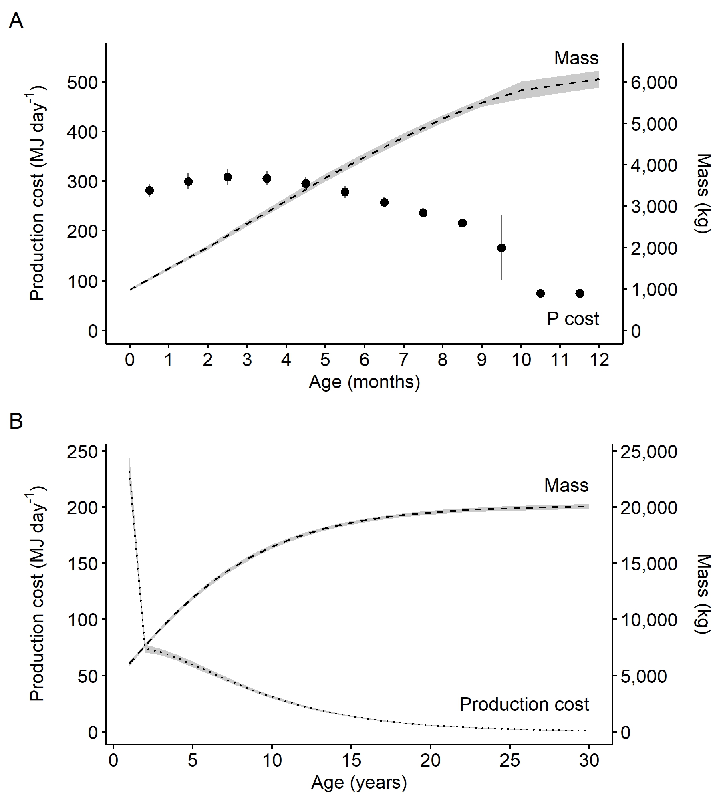
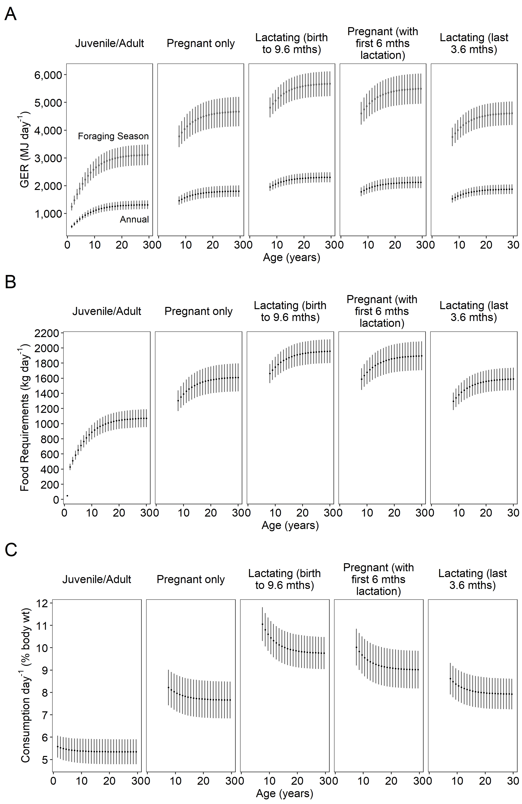
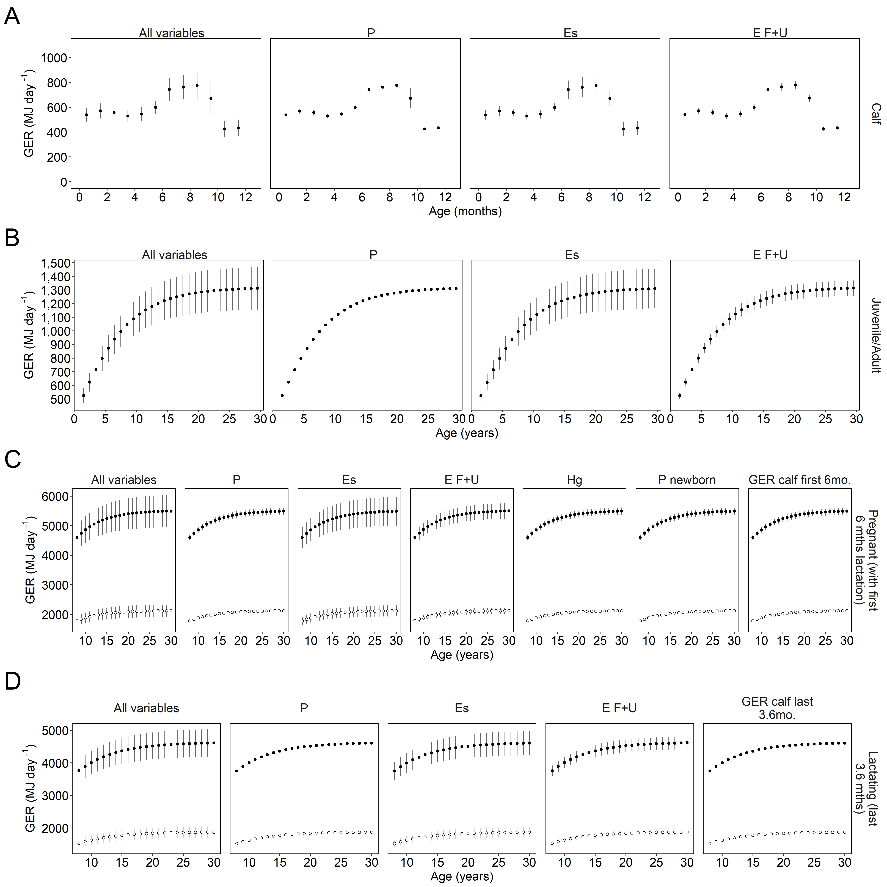
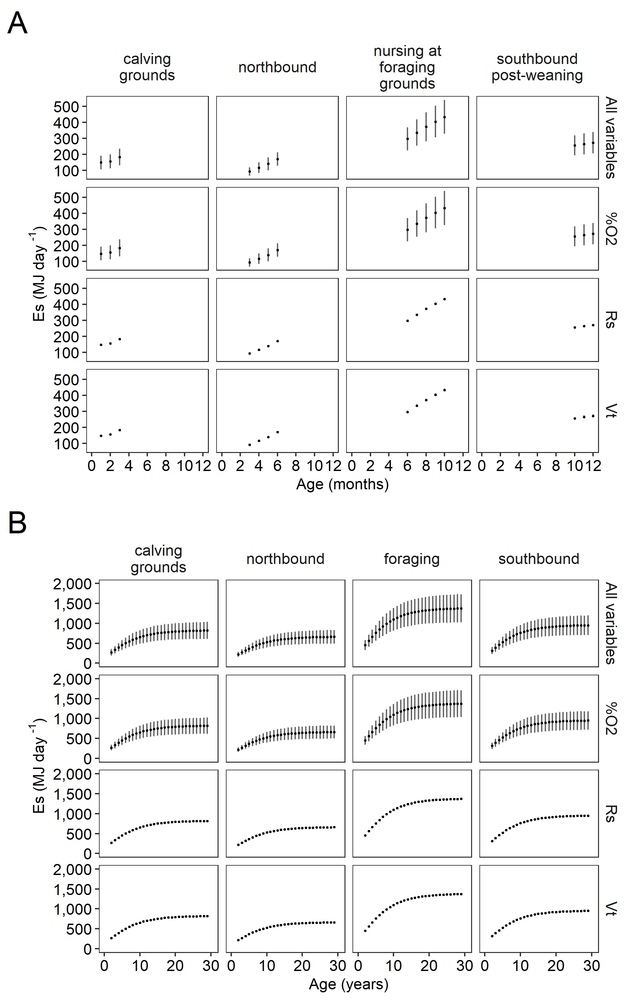

```{r setup, include=FALSE}
knitr::opts_knit$set(root.dir = rprojroot::find_rstudio_root_file())
knitr::opts_chunk$set(echo = TRUE)
knitr::opts_chunk$set(error = TRUE)
knitr::opts_chunk$set(warning = FALSE)

## Setup

# Initialize all libraries, set paths for output figures, then import the gw_observations.csv
# install.packages("tidyr")
# install.packages("tidyverse")
# install.packages("dplyr")
# install.packages("ggplot2")
# install.packages("knitr")
# install.packages("scales")
# install.packages("ggpmisc")
# install.packages("extrafont")
#install.packages("truncnorm")


library(tidyverse)
# library(tidyr)
# library(dplyr)
# library(ggplot2)
library(knitr)
library(scales)
library(ggpmisc)
library(reshape2)
library(extrafont)
library(truncnorm)
library(gtable)
library(ggpubr)
library(pandoc)


#quiet messages
options(readr.show_col_types = FALSE)


```


```{r functions, include=FALSE}

#Call R script with custom functions
source(paste0(getwd(),"/functions.R"), local = knitr::knit_global())

```   


```{r setpaths, include = FALSE}
# Set path for output figures: 
Figurespath <- paste0(getwd(), "/results_for_paper/figures", collapse = NULL)
Figurespath
# Set path for input & output data  
datapath <- paste0(getwd(), "/data", collapse = NULL) 
datapath

```


## GRAY WHALE LIFE CYCLE


Figure 1. Gray whale life cycle, showing the approximate times of year for different stages in the migration pattern over two years. Panel A shows the migration for males and non-reproductive females, including weaned juveniles. Panel B shows the approximate 2-year cycle for pregnant and lactating females, including nursing calves. These charts highlight the differences in migration timing between the mother/calf pairs and other whales. Estimates and associated sources for number of days in each activity life stage are listed in Table S1 in Suppl. Materials. Adapted from Villegas-Amtmann et al. (2015).


## RESULTS

### Mass and Production cost (P)


```{r P_cost_phase1, echo= FALSE, results = "hide", message = FALSE, warning=FALSE}

#### Gray whale calves
P_cost_table  <-  read_csv("data/P_cost_table_phase1.csv")

plot_P_cost_mass_perday <- P_cost_table %>%
  dplyr::filter(sex == "N/A") %>%
  ggplot() +
  # geom_errorbar(aes(x = age_mth-0.5, 
  #                   ymin = (mass - mass_sd) /50, 
  #                 ymax = (mass + mass_sd) /50), 
  #               width=0, size=1, linetype = 2, color="gray40") +
  geom_ribbon(aes(x = age_mth, 
                  ymin = (mass - mass_sd) /12, 
                  ymax = (mass + mass_sd) /12), 
              fill = "gray", alpha = 0.8)+
  geom_line(aes(x = age_mth, y = mass/12), 
             linetype = 2, size = 0.5, colour = "black")+
  geom_errorbar(aes(x = age_mth-0.5, 
                    ymin = mean_P_perday - sd_P_perday, 
                    ymax = mean_P_perday + sd_P_perday), 
                width=0, size=0.5, linetype = 1, color="gray40") +
  geom_point(aes(x = age_mth-0.5, y= mean_P_perday), size = 2)+
  labs(tag = "A")+
  theme(plot.tag = element_text(size = rel(6), colour = "black"))+
  xlab("Age (months)") +
  ylab(bquote('Production cost (MJ day'^'-1'*')'))+
  scale_x_continuous(breaks = scales::pretty_breaks(n = 10),
                     limits = c(0, 12)) +
  scale_y_continuous(breaks = scales::pretty_breaks(n = 8),
                     limits = c(0, 550),
                     labels = scales::comma,
                     sec.axis=sec_axis(~.*12, name = "Mass (kg)",
                                       labels = scales::comma,
                                       breaks = scales::pretty_breaks(n = 10))
                     
                     )+
                     #breaks = scales::pretty_breaks(n = 8))+
                       #limits = c(0, 50)) +
  theme_bw() + 
  theme(panel.grid = element_blank())+
  theme(legend.position = "none")+
    theme(legend.background = element_rect(fill = "white"))+
    theme(legend.text = element_text(colour = "black", size = rel(1)))+
    theme(legend.key = element_rect(fill = "transparent"))+ #colour = "transparent"))+
    ggtitle(element_blank()) +
    theme(plot.background = element_rect(fill = "white"))+
    theme(panel.background = element_rect(fill = "white"))+
    theme(panel.border = element_blank())+
    theme(axis.line = element_line(colour = "black"))+
    theme(axis.text = element_text(colour = "black", size = rel(1)))+
    theme(axis.title.y = element_text(colour = "black", 
                                      size = rel(1), 
                                      angle = 90, 
                                      margin = margin(t = 0, r = 10, b = 0, l = 0)))+
    theme(axis.title.x = element_text(colour = "black", size = rel(1)))+
    theme(axis.ticks = element_line(colour="black"))+
    theme(axis.title.y.right  = element_text(colour = "black", 
                                      size = rel(1), 
                                      angle = 270, 
                                      margin = margin(t = 0, r = 0, b = 0, l = 10)))+
    annotate("text", x= 12, y = 25,
             label = "P cost", 
             hjust = 1,
             size = rel(4),
             color = "black") +
    annotate("text", x= 12, y = 550,
             label = "Mass", 
             hjust = 1,
             size = rel(4),
             color = "black")
  
#plot_P_cost_mass_perday

```


```{r P_cost_peryear, echo= FALSE, results = "hide", message = FALSE, warning=FALSE}
#### Juveniles and Adults

P_cost_table_peryear  <- read_csv("data/P_cost_table_peryear.csv")

plot_P_cost_mass_peryear <- P_cost_table_peryear %>% filter(sex == "N/A" & age_yrs >=1 & age_yrs<=30) %>%  
  ggplot() +
  geom_ribbon(aes(x = age_yrs, 
                  ymin = (mean_mass - sd_mass) /100, 
                  ymax = (mean_mass + sd_mass) /100), 
              fill = "gray", alpha = 0.8)+
  geom_line(aes(x = age_yrs, y = mean_mass/100), 
             linetype = 2, size = 0.5, colour = "black")+
  geom_ribbon(aes(x = age_yrs, 
                  ymin = (mean_P_perday - sd_P_perday),
                  ymax = (mean_P_perday + sd_P_perday)), 
                  #width = 0, linetype = 3, size = 1, colour= "white")+
              fill = "gray", alpha = 0.8)+
  geom_line(aes(x = age_yrs, y= mean_P_perday), 
              size = 0.5, linetype = 3, colour = "black")+
  labs(tag = "B")+
  theme(plot.tag = element_text(size = rel(6), colour = "black"))+
  xlab("Age (years)") +
  ylab(bquote('Production cost (MJ day'^'-1'*')'))+
  scale_x_continuous(breaks = scales::pretty_breaks(n = 9))+

  scale_y_continuous(labels= scales::comma,
                     sec.axis=sec_axis(~.*100, name = "Mass (kg)",
                                       labels = scales::comma), 
                     breaks = scales::pretty_breaks(n = 8) 
                     )+

          
  theme_bw() + 
  theme(panel.grid = element_blank())+
  theme(legend.position = "none")+
    theme(legend.background = element_rect(fill = "white"))+
    theme(legend.text = element_text(colour = "black", size = rel(1)))+
    theme(legend.key = element_rect(fill = "transparent"))+ 
    ggtitle(element_blank()) +
    theme(plot.background = element_rect(fill = "white"))+
    theme(panel.background = element_rect(fill = "white"))+
    theme(panel.border = element_blank())+
    theme(axis.line = element_line(colour = "black"))+
    theme(axis.text = element_text(colour = "black", size = rel(1)))+
    theme(axis.title.y = element_text(colour = "black", 
                                      size = rel(1), 
                                      angle = 90, 
                                      margin = margin(t = 0, r = 10, b = 0, l = 0)))+
    theme(axis.title.x = element_text(colour = "black", size = rel(1)))+
    theme(axis.ticks = element_line(colour="black"))+
  theme(axis.title.y.right  = element_text(colour = "black", 
                                      size = rel(1), 
                                      angle = 270, 
                                      margin = margin(t = 0, r = 0, b = 0, l = 10)))+
    annotate("text", x= 30, y = 25,
             label = "Production cost", 
             hjust = 1,
             size = rel(4),
             color = "black") +
    annotate("text", x= 30, y = 220,
             label = "Mass", 
             hjust = 1,
             size = rel(4),
             color = "black") 

  
 
#plot_P_cost_mass_peryear


# multiplot(plot_P_cost_mass_perday,plot_P_cost_mass_peryear,
#           cols=1)


jpeg(filename = paste0(Figurespath,"/Figure2_Pcost_multiplot.jpg"), 
     width = 1800,
     height = 2000,
     pointsize = 35, 
     quality = 100, 
     bg = "white", 
     res = 300, 
     restoreConsole = TRUE)


p <- multiplot(plot_P_cost_mass_perday,plot_P_cost_mass_peryear,
          cols=1)


dev.off()


```



Figure 2. A) Production cost per day and mass growth curves for calves. B) Production cost per day and mass growth curves for juveniles and adult gray whales. Average production cost (MJ) per day on the primary axis, represented as a dotted line, and total mass (kg) shown on the secondary axis, as modelled by Agbayani et al. (2020) represented as a dashed line. Gray shading represents the standard deviation (±SD) around the mean from 10,000 Monte Carlo estimates.


### Total Energetic Expenditure (*E~s~*)

```{r Es_table_phase1_permth, echo= FALSE, results = "hide", message = FALSE, warning=FALSE }
#### Gray whale calves
Es_table_phase1_permth  <-  read_csv("data/Es_sensAnalysis_phase1_permth_source_bpm.csv")

# apply factors to enable facet wrap 
Es_table_phase1_permth$Lifestage = factor(Es_table_phase1_permth$Lifestage,                                                          levels=c('Calf'))


plot_Es_table_phase1_mthly_perday <- Es_table_phase1_permth %>% 
  #dplyr::filter(age_yrs == i) %>% 
  ggplot(aes(x = age_mth-0.5, y =Es_perday)) +
  facet_grid(. ~Lifestage)+
  geom_errorbar(aes(ymin = Es_perday - Es_perday_sd, ymax = Es_perday + Es_perday_sd),
                linewidth = 0.5, linetype = 1, colour = 'gray40', width = 0) +
  geom_point(aes(x = age_mth-0.5, y =Es_perday), size = 0.5) +
  xlab("Age (months)") +
  ylab(bquote('Es (MJ day'^'-1'*')')) +
  scale_x_continuous(breaks = scales::pretty_breaks(n = 5))+ 
  scale_y_continuous(label = comma, 
                     breaks = scales::pretty_breaks(n = 10),
                     limits = c(0,550))+
  theme_bw()+
  labs(tag = "A")+
  theme(plot.tag = element_text(size = rel(1.5), 
                                colour = "black"))+
  theme(panel.grid = element_blank())+
  theme(axis.title.x = element_text(size = rel(1),
                                    colour = "black"))+
  theme(axis.title.y = element_text(size = rel(1.1),
                                    colour = "black"))+
  theme(axis.text = element_text(size = rel(1),
                                 colour = "black"))+
  theme(strip.background =element_rect(fill="transparent", 
                                       colour = "transparent"))+
  theme(strip.text = element_text(size = rel(1)))

#plot_Es_table_phase1_mthly_perday

```


```{r Es_table_alladults_preg_lact_peryear, echo= FALSE, results = "hide", message = FALSE, warning=FALSE}
#### Gray whale juveniles and adults, including pregnant and lactating females
Es_table_alladults_preg_lact_peryear  <- 
  read_csv("data/Es_sensAnalysis_alladults_preg_lact_peryear_source_bpm.csv")

# apply factors to enable facet wrap 
Es_table_alladults_preg_lact_peryear$Lifestage_f = factor(Es_table_alladults_preg_lact_peryear$Lifestage,
                                                          levels=c('Juvenile/Adult','Pregnant','Lactating'))


# plots  
plot_Es_table_alladults_preg_lact_yearly_perday <- 
  Es_table_alladults_preg_lact_peryear %>% 
  ggplot(aes(x = age_yrs, y =Es_perday)) + #shape = Lifestage
  facet_grid(. ~Lifestage_f)+
  geom_errorbar(aes(x = age_yrs, 
                    ymin = Es_perday - Es_sd_perday, 
                    ymax = Es_perday + Es_sd_perday),
                linewidth = 0.5, colour = 'gray40', 
                width = 0, linetype = 1) +
  geom_point(size =0.5)+
  xlab("Age (years)") +
  ylab(bquote('Energetic expenditure (MJ day'^'-1'*')')) +
  scale_x_continuous(breaks = scales::pretty_breaks(n = 5), 
                     limits = c(0, 32)) + # max 30 yrs, add space for labels. 
  scale_y_continuous(label = comma, 
                     breaks = scales::pretty_breaks(n = 8),
                     limits = c(0,max(Es_table_alladults_preg_lact_peryear$Es_perday +                                        Es_table_alladults_preg_lact_peryear$Es_sd_perday)))+
  theme_bw()+
  labs(tag = "B")+
  theme(plot.tag = element_text(size = rel(1.5), 
                                colour = "black"))+
  theme(panel.grid = element_blank())+
  theme(axis.text = element_text(size = rel(1),
                                 colour = "black"))+
  theme(axis.title.x = element_text(size = rel(1)),
        axis.title.y = element_text(size = rel(0.5), colour = "white"))+
                                              #(white text for spacing)
  theme(strip.background =element_rect(fill="transparent", 
                                       colour = "transparent"))+
  theme(strip.text = element_text(size = rel(1)))


#plot_Es_table_alladults_preg_lact_yearly_perday

```


```{r Es all ages multipanel, echo=FALSE}

Figure3_ES_multipanel <- ggarrange(plot_Es_table_phase1_mthly_perday, 
            plot_Es_table_alladults_preg_lact_yearly_perday, 
            widths = c(2, 5)) 

#ES_multipanel

ggsave(paste0(Figurespath,"/Figure3_Es_sensanalysis_allstages_multiplot.jpg"),
       Figure3_ES_multipanel,
       width = 8,
       height = 3, dpi = 300
     )


```


Figure 3. Estimates  of average daily energetic expenditure (Es)  from activity (MJ day-1) for each month in the first year (Phase 1). calves per month (Phase 1), and for juveniles and single adults (Phase 2), pregnant, and lactating females per year. Values are plotted at the midpoint of each month. Error bars show the standard deviation around the mean of 10,000 Monte Carlo simulations. Note: Energetic expenditure Es values for the 6th and 10th months represent energetic expenditures across two activity stages. 


### Gross Energy Requirements and Food Requirements

#### Gray whale calves

```{r predict_GER_table_phase1_permth, echo= FALSE, results = "hide", message = FALSE, warning=FALSE}

predict_GER_table_phase1_permth <- read_csv("data/predict_GER_table_sensAnalysis_phase1_permth_source_bpm.csv")


plot_predict_GER_phase1_permth <- predict_GER_table_phase1_permth %>%
  filter(sex == "N/A") %>% 
  ggplot(aes(x = age_mth, y = mean_GER)) +
  geom_errorbar(aes(x = age_mth-0.5, 
                    ymin = mean_GER-GER_sd, 
                    ymax = mean_GER+GER_sd), 
                width=0, linewidth = 0.5, linetype = 1, color="gray40") + 
  geom_point(aes(x = age_mth-0.5, y= mean_GER), 
             shape = 21, fill = "black")+
  xlab("Age (months)") +
  ylab(bquote('GER (MJ day '^'-1'*')')) +
  scale_x_continuous(breaks = scales::pretty_breaks(n = 12)) + 
  scale_y_continuous(breaks = scales::pretty_breaks(n = 7),
                     limits = c(0,1100)) + 
  theme_bw()+
  labs(tag = "A")+
  theme(plot.tag = element_text(size = rel(2), colour = "black"))+
  theme(panel.grid = element_blank())+
  theme(axis.text = element_text(size = rel(1.4),
                                 colour = "black")) +
  theme(axis.title.x = element_text(size = rel(1.6),
                                    colour = "black")) +
  theme(axis.title.y = element_text(size = rel(1.4),
                                    colour = "black"))


#plot_predict_GER_phase1_permth


```


```{r plot_milk_food_reqs_phase1,  echo= FALSE, results = "hide", message = FALSE, warning=FALSE}
predict_GER_table_phase1_permth <- read_csv("data/predict_GER_table_sensAnalysis_phase1_permth_source_bpm.csv")

plot_MilkReqs_phase1 <- predict_GER_table_phase1_permth %>% 
  dplyr::filter(sex == "N/A" & phase == "1") %>% 
  ggplot() +
  geom_errorbar(aes(x = age_mth-0.5, 
                    ymin = FR_foraging - FR_sd_foraging, 
                    ymax = FR_foraging + FR_sd_foraging),
                linewidth = 0.5, width=0, linetype = 1, color="gray40") + 
  geom_point(aes(x = age_mth-0.5, y= FR_foraging), shape = 21, fill = "black") +
  xlab("Age (months)") +
  ylab(bquote('Milk Requirements (L day '^'-1'*')')) +
  scale_x_continuous(breaks = scales::pretty_breaks(n = 9),
                     limits = c(0, 9.9), expand=c(0,0)) +  
  scale_y_continuous(breaks = scales::pretty_breaks(n = 10),
                     limits = c(0, 45)) +
  theme_bw() + 
  labs(tag = "B")+
  theme(plot.tag = element_text(size = rel(2), colour = "black"))+
  theme(panel.grid = element_blank())+
  theme(axis.text =element_text(size = rel(1.4),
                                colour = "black"),
        axis.title.x = element_text(size = rel(1.6),
                                    colour = "black"),
        axis.title.y = element_text(size = rel(1.4),
                                    colour = "black")
  )

#plot_MilkReqs_phase1

plot_FoodReqs_phase1 <- predict_GER_table_phase1_permth %>% 
  filter(sex == "N/A" & phase == "1") %>% 
  ggplot() +
  geom_errorbar(aes(x = age_mth-0.5, 
                    ymin = FR_foraging - FR_sd_foraging, 
                    ymax = FR_foraging + FR_sd_foraging),
                linewidth = 0.5, width=0, linetype = 1, color="gray40") + 
  geom_point(aes(x = age_mth-0.5, y= FR_foraging), 
             shape = 21, fill = "black")+
  ylab(bquote('Food Requirements (kg day '^'-1'*')')) +
  scale_x_continuous(breaks = scales::pretty_breaks(n = 2),
                     limits = c(9.9, 12), expand=c(0,0)) +  
  scale_y_continuous(position = "right",      label=comma,
                     breaks = scales::pretty_breaks(n = 10),
                     limits = c(0, 300)) +
  theme_bw()+ 
  labs(tag = "B")+
  theme(plot.tag = element_text(size = rel(2), colour = "white"))+
  theme(plot.tag.position = "top")+
  theme(panel.grid = element_blank(),
        axis.title.x = element_text(size = rel(1.6),
                                    colour = "white"))+
  theme(axis.text =element_text(size = rel(1.4),
                                colour = "black"),
        axis.title.y = element_text(size = rel(1.4),
                                    colour = "black"))


#plot_FoodReqs_phase1

## plot milk and food requirments for phase 1 on same chart but different axes
milkreqs_figure <- ggarrange(plot_MilkReqs_phase1, 
                             plot_FoodReqs_phase1, 
                             widths = c(2, 0.9))

#milkreqs_figure

#panel phase 1 GER, milk and food reqs 
Figure4 <- ggarrange(plot_predict_GER_phase1_permth,milkreqs_figure) 

ggsave(paste0(Figurespath,"/Figure4_Phase1_GER_Milk_FoodReqs.jpg"),
       Figure4,
       width = 10,
       height = 4, dpi = 300
     )


```


Figure 4. A) Daily average gross energy requirements for calves in the first year in MJ day-1. B) Average daily milk and food requirements for calves for each month in their first year. The left panel represents milk requirements (L day-1) for calves up to 9 months (left panel), and the right panel represents food requirements (kg of benthic invertebrate prey day-1) for weaned calves over 9 months. All values are plotted at the midpoint of each month. Error bars show the standard deviation around the mean of 10,000 Monte Carlo simulations.


#### Juveniles/Adults, Pregnant, Lactating

```{r plots_GER_preg_lact_panel, echo =  FALSE}
predict_GER_table_alladults <- read_csv("data/predict_GER_sensAnalysis_alladults.csv")

predict_GER_table_panel <- within(predict_GER_table_alladults, Lifestage <- 
  factor(Lifestage, levels=c('Juvenile/Adult',
                             'Pregnant only', 
                             'Lactating (birth to 9.6 mths)',
                             'Pregnant (with first 6 mths lactation)',
                             'Lactating (last 3.6 mths)')
         )
  )


plot_GER_panel <- predict_GER_table_panel %>% 
  ggplot() +
  geom_errorbar(aes(x = age_yrs-0.5, 
                  ymin = mean_GER-GER_sd,
                  ymax = mean_GER+GER_sd),
                width=0, linetype = 1, color="gray40")+
  geom_point(aes(x = age_yrs-0.5, y= mean_GER),
              shape = 21, fill = "black", size=0.5) +
   geom_errorbar(aes(x = age_yrs-0.5, 
                    ymin = GER_foraging - sd_foraging,
                    ymax = GER_foraging + sd_foraging),
                width=0, linetype = 1, color="gray40") +
  geom_point(aes(x = age_yrs-0.5, y= GER_foraging),
              shape = 21, fill = "white", size=0.5) +
  facet_grid(.~Lifestage, 
             labeller = label_wrap_gen(width = 17, 
               multi_line = TRUE))+
  xlab("Age (years)") +
  ylab(bquote('Gross Energetic Requirements (MJ day'^'-1'*')')) +
  scale_x_continuous(breaks = scales::pretty_breaks(n = 3),
                     limits = c(1,30)) +
  scale_y_continuous(breaks = scales::pretty_breaks(n = 8),
                     label = comma)+
  theme_bw() +
  labs(tag = "A")+
  theme(plot.tag = element_text(size = rel(2), colour = "black"))+
  theme(panel.grid = element_blank())+
  theme(axis.text =  element_text(size = rel(1.2), colour = "black"),
        axis.title = element_text(size = rel(1.2), colour = "black"),
        strip.background = element_rect(
          color="transparent", fill="transparent"),
        strip.text = element_text(size = rel(1.2), colour = "black"))

#plot_GER_panel 

ann_text_annual <- data.frame(age_yrs = 30, mean_GER = 900,
                              Lifestage = factor("Juvenile/Adult",
                                levels = c('Juvenile/Adult','Pregnant only',
                                           'Lactating (birth to 9.6 mths)',
                                           'Pregnant (with first 6 mths lactation)',
                                           'Lactating (last 3.6 mths)')))

ann_text_foraging <- data.frame(age_yrs = 30, mean_GER = 3700,
                                Lifestage = factor("Juvenile/Adult",
                                  levels = c('Juvenile/Adult',
                                             'Pregnant only', 
                                             'Lactating (birth to 9.6 mths)',
                                             'Pregnant (with first 6 mths lactation)',
                                             'Lactating (last 3.6 mths)')))


plot_GER_panel <- plot_GER_panel + 
  geom_text(data = ann_text_annual, 
            aes(x=age_yrs, y=mean_GER),
            label = "Annual",
            size = 3.5,
            hjust = 1) +
  geom_text(data = ann_text_foraging, 
            aes(x=age_yrs, y=mean_GER),
            label = "Foraging Season",
            size = 3.5,
            hjust = 1)

#plot_GER_panel


```


```{r plot_FoodReqs_preg_lact_panel, echo = FALSE}

plot_FoodReqs_panel <- predict_GER_table_panel %>% 
  
  ggplot() +
  geom_errorbar(aes(x = age_yrs, 
                  ymin = FR_foraging-FR_sd_foraging,
                  ymax = FR_foraging+FR_sd_foraging),
                width=0, linetype = 1, color="gray40")+
  geom_point(aes(x = age_yrs, 
                y= FR_foraging),  
            size = 0.5)+
  facet_grid(~Lifestage,
             labeller = label_wrap_gen(width = 17, 
             multi_line = TRUE))+
  xlab("Age (years)") +
  ylab(bquote('Food Requirements (kg day'^'-1'*')')) +
  scale_x_continuous(breaks = scales::pretty_breaks(n = 3),
                     limits = c(1,30)) +
  scale_y_continuous(breaks = scales::pretty_breaks(n = 10))+
  theme_bw() +
  labs(tag = "B")+
  theme(plot.tag = element_text(size = rel(2), colour = "black"))+
  theme(panel.grid = element_blank())+
  theme(axis.text =  element_text(size = rel(1.2), colour = "black"),
        axis.title = element_text(size = rel(1.2), colour = "black"),
        strip.background = element_rect(
          color="transparent", fill="transparent"),
        strip.text = element_text(size = rel(1.2), colour = "black")
  )


#plot_FoodReqs_panel

```


```{r plot_pct_bodywt_consumed_panel, echo=FALSE}

plot_pct_bodyweight_all <- predict_GER_table_panel %>% 
  filter(age_yrs > 1) %>% 
  ggplot() +
   geom_errorbar(aes(x = age_yrs-0.5, 
                    ymin = pctbodywt - pctbodywt_sd, 
                    ymax = pctbodywt + pctbodywt_sd),
                width=0, size=0.5, linetype = 1, color="gray40")+
  geom_point(aes(x = age_yrs-0.5, y= pctbodywt), 
             shape = 21, fill = "black", size=0.5)+
  facet_grid(~Lifestage,
             labeller = label_wrap_gen(width = 17, 
             multi_line = TRUE))+
  xlab("Age (years)") +
  ylab(bquote('Consumption day'^'-1'*' (% body wt)')) +
  scale_x_continuous(breaks = scales::pretty_breaks(n = 3),
                     limits = c(1,30)) +
  scale_y_continuous(breaks = scales::pretty_breaks(n = 6))+
  
  theme_bw() +
  labs(tag = "C")+
  theme(plot.tag = element_text(size = rel(2), colour = "black"))+
  theme(panel.grid = element_blank())+
  theme(axis.text =  element_text(size = rel(1.2), colour = "black"),
        axis.title = element_text(size = rel(1.2), colour = "black"),
        strip.background = element_rect(
          color="transparent", fill="transparent"),
        strip.text = element_text(size = rel(1.2), colour = "black"))

#plot_pct_bodyweight_all

```

```{r multiplot, echo=FALSE}
#save multi-panel plot as hi-res jpg

Figure5 <- ggarrange(plot_GER_panel,plot_FoodReqs_panel, plot_pct_bodyweight_all, ncol=1)

ggsave(paste0(Figurespath,"/Figure5_GER_FoodReqs_pctbodywt_multiplot.jpg"),
       Figure5,
       width = 8,
       height = 12, dpi = 300
     )

```


Figure 5.  A) Daily gross energy requirements for a full year (annual; black circles) and for when feeding is limited to the foraging season (white circles). B) Average daily food requirements (kg day-1) of benthic invertebrate prey for pregnant females, lactating females, and others (juveniles and other adult gray whales) during foraging season. C) Average percentage of body weight consumed per day during the foraging season for juveniles and other adults, pregnant females, and lactating females. Note that the y-axis does not always start at 0. Panels from left to right represent single juveniles (1–7 y) and adults (>8 y), pregnant whales for the duration of the pregnancy, lactating whales for the duration of nursing from birth to weaning at 9.6 months (per Agbayani et al., 2020), pregnant whales for the duration of the pregnancy (with the first 6 months of lactation while fasting), and lactating whales in the last 3.6 months of lactation while foraging in the Arctic feeding grounds. To calculate daily gross energy requirements on an annual basis for single juveniles (1–7 y) and adults (>8 y) the gross energy requirement was assumed to be borne over 365 days and for the foraging season it was assumed to be ~154 days. For pregnant females the annual gross energy requirement was calculated over ~396 days and foraging season was assumed to be ~153 days. For lactating females the annual gross energy requirement was calculated over 293 days and foraging season was assumed to be ~119 days. Values are plotted at the midpoint of each year. Error bars show the standard deviation around the mean of 10,000 Monte Carlo simulations.


## Sensitivity Analyses

### Gross Energy Requirements (*GER*)


```{r predict_GER_table_sensAnalysis_phase1,  echo= FALSE, results = "hide", message = FALSE, warning=FALSE}
predict_GER_table_sensAnalysis_phase1_permth  <-  read_csv("data/predict_GER_table_sensAnalysis_phase1_permth_source_bpm.csv")


predict_GER_table_sensAnalysis_phase1_permth$MC_var_factor <- 
  factor(predict_GER_table_sensAnalysis_phase1_permth$MC_variable, 
         levels=c('all','P_cost','Es','E_FnU'))
levels(predict_GER_table_sensAnalysis_phase1_permth$MC_var_factor) <- 
   c("All variables", "P", "Es", "E F+U")

predict_GER_table_sensAnalysis_phase1_permth$Lifestage <-   factor(predict_GER_table_sensAnalysis_phase1_permth$phase, 
         levels=c('1'))

levels(predict_GER_table_sensAnalysis_phase1_permth$Lifestage) <- c('Calf')


plot_predict_GER_sensAnalysis_phase1_permth <- 
  predict_GER_table_sensAnalysis_phase1_permth %>%
  dplyr::filter(sex == "N/A") %>% 
  ggplot(aes(x = age_mth, y = mean_GER)) +
  geom_errorbar(aes(x = age_mth-0.5, 
                    ymin = mean_GER-GER_sd, 
                    ymax = mean_GER+GER_sd), 
                width=0, size = 0.5,
                linetype = 1,
                color="gray40") + 
  geom_point(aes(x = age_mth-0.5, y= mean_GER), 
             shape = 21, fill = "black")+
  facet_grid(Lifestage~MC_var_factor, 
             labeller = label_wrap_gen(width=25, multi_line = TRUE)) +
  xlab("Age (months)") +
  ylab(bquote('GER (MJ day '^'-1'*')')) +
  scale_x_continuous(breaks = scales::pretty_breaks(n = 5),
                     limits = c(0, 12.5)) + 
  scale_y_continuous(breaks = scales::pretty_breaks(n = 7),
                     limits = c(0,1100)) + 
  theme_bw()+
  labs(tag = "A")+
  theme(plot.tag = element_text(size = rel(3), 
                                colour = "black"))+
  theme(panel.grid = element_blank())+
  theme(panel.spacing = unit(0.3, "lines"))+
  theme(strip.background = element_rect(
    color="transparent", fill="transparent"))+
    theme(strip.text = element_text(size = rel(1.5)))+
  theme(axis.text = element_text(size = rel(1.5),
                                 colour = "black")) +
  theme(axis.title.x = element_text(size = rel(1.5),
                                    colour = "black")) +
  theme(axis.title.y = element_text(size = rel(1.5),
                                    colour = "black"))


#plot_predict_GER_sensAnalysis_phase1_permth

```


```{r predict_GER_table_sensAnalysis_phase2,  echo= FALSE, results = "hide", message = FALSE, warning=FALSE}
predict_GER_table_sensAnalysis_phase2 <- read_csv("data/predict_GER_table_sensAnalysis_phase2.csv")

predict_GER_table_sensAnalysis_phase2 %>% 
  filter(sex=="N/A" & phase == "2" & age_yrs >= 1 )%>% 
  head() %>% kable()
kable(predict_GER_table_sensAnalysis_phase2)

predict_GER_table_sensAnalysis_phase2$MC_var_factor <- 
  factor(predict_GER_table_sensAnalysis_phase2$MC_variable, 
         levels=c('all','P_cost','Es','E_FnU'))

levels(predict_GER_table_sensAnalysis_phase2$MC_var_factor) <-  c("All variables", "P", "Es", "E F+U")

predict_GER_table_sensAnalysis_phase2$Lifestage <-   factor(predict_GER_table_sensAnalysis_phase2$phase, 
         levels=c('2'))

levels(predict_GER_table_sensAnalysis_phase2$Lifestage) <- c('Juvenile/Adult')


plot_predict_GER_table_sensAnalysis_phase2 <- predict_GER_table_sensAnalysis_phase2 %>%
  dplyr::filter(sex=="N/A" & phase == "2" & 
                  age_yrs > 1 & age_yrs <= 30) %>% 
  ggplot() +
  geom_errorbar(aes(x = age_yrs-0.5, 
                    ymin = mean_GER-GER_sd, 
                    ymax = mean_GER+GER_sd), 
                width=0, size = 0.5, linetype = 1, color="gray40") + 
  geom_point(aes(x = age_yrs-0.5, y= mean_GER), shape = 21, fill = "black")+
 facet_grid(Lifestage~MC_var_factor, 
             labeller = label_wrap_gen(width=25, multi_line = TRUE)) +
  xlab("Age (years)") +
  ylab(bquote('GER (MJ day '^'-1'*')')) +
  scale_x_continuous(breaks = scales::pretty_breaks(n = 10), 
                     limits = c(0, 30.5), expand = c(0,0)) +
                      # max x-axis 30 yrs, add space for labels 
  scale_y_continuous(breaks = scales::pretty_breaks(n = 10),
                     labels = comma)+
  theme_bw() +
  labs(tag = "B")+
  theme(plot.tag = element_text(size = rel(3), 
                                colour = "black"))+
  theme(panel.grid = element_blank()) +
  theme(panel.spacing = unit(0.3, "lines"))+
   theme(strip.background = element_rect(color="transparent", fill="transparent"))+
    theme(strip.text = element_text(size = rel(1.5)))+
  theme(axis.title = element_text(size = rel(1.5), colour = "black"))+
  theme(axis.text = element_text(size = rel(1.5), colour = "black"))

#plot_predict_GER_table_sensAnalysis_phase2

```


```{r predict_GER_table_sensAnalysis_preg, echo= FALSE, results = "hide", message = FALSE, warning=FALSE, fig.width=10,fig.height=5}
#Read in data
predict_GER_table_sensAnalysis_preg <-
  as_tibble(read_csv("data/predict_GER_table_sensAnalysis_preg.csv"))

predict_GER_table_sensAnalysis_preg$phase <- "Pregnant (with first 6 mths lactation)"

predict_GER_table_sensAnalysis_preg$MC_var_factor <- 
  factor(predict_GER_table_sensAnalysis_preg$MC_variable, 
         levels=c("all","P_cost","Es", "E_FnU", "Hg", "P_nb", "GER_calf"))

levels(predict_GER_table_sensAnalysis_preg$MC_var_factor) <- c("All variables","P", "Es", "E F+U", "Hg", "P newborn", "GER calf first 6mo.")

plot_predict_GER_sensAnalysis_preg <- predict_GER_table_sensAnalysis_preg %>%
  filter(age_yrs>1 & age_yrs <=30) %>% 
  ggplot() +
  geom_errorbar(aes(x = age_yrs, 
                    ymin = mean_GER - GER_sd, 
                    ymax = mean_GER + GER_sd), 
                width=0, size = 0.5, linetype = 1,color="gray40") + 
  geom_point(aes(x = age_yrs, y= mean_GER), 
             shape = 21, fill = "white")+
  geom_errorbar(aes(x = age_yrs, 
                    ymin = GER_foraging - sd_foraging, 
                    ymax = GER_foraging + sd_foraging), 
                width=0, size =0.5, linetype = 1, color="gray40") + 
  geom_point(aes(x = age_yrs, y= GER_foraging), 
             shape = 21, fill = "black")+
  facet_grid(phase~MC_var_factor, 
             labeller = label_wrap_gen(width=30, multi_line = TRUE)) +
  xlab("Age (years)") +
   ylab(bquote('GER (MJ day '^'-1'*')')) +
  scale_x_continuous(breaks = scales::pretty_breaks(n = 5), 
                     limits = c(8, 30)) +
  scale_y_continuous(breaks = scales::pretty_breaks(n = 4)) +
  theme_bw()+
  labs(tag = "C")+
  theme(plot.tag = element_text(size = rel(3), 
                                colour = "black"))+
  theme(panel.grid = element_blank())+
  theme(panel.spacing = unit(0.3, "lines"))+
  theme(strip.background = element_rect(
    color="transparent", fill="transparent"))+
    theme(strip.text = element_text(size = rel(1.5)))+
  theme(axis.text = element_text(size = rel(1.5),
                                 colour = "black"))+
  theme(axis.title.x = element_text(size = rel(1.5)),
        axis.title.y = element_text(size = rel(1.5)))+
  theme(strip.background = element_rect(
    color="transparent", fill="transparent"))

#plot_predict_GER_sensAnalysis_preg              


```


```{r predict_GER_table_sensAnalysis_lact, echo= FALSE, results = "hide", message = FALSE, warning=FALSE, fig.width=10,fig.height=5}

#Read in data
predict_GER_table_sensAnalysis_lact <-
  as_tibble(read_csv("data/predict_GER_table_sensAnalysis_lact.csv"))

predict_GER_table_sensAnalysis_lact$phase <- "Lactating (last 3.6 mths)"

predict_GER_table_sensAnalysis_lact$MC_var_factor <- 
  factor(predict_GER_table_sensAnalysis_lact$MC_variable, 
         levels=c("all","P_cost","Es", "E_FnU","GERcalf"))

levels(predict_GER_table_sensAnalysis_lact$MC_var_factor) <- c("All variables","P", "Es", "E F+U", "GER calf last 3.6mo.")

plot_predict_GER_sensAnalysis_lact <- predict_GER_table_sensAnalysis_lact %>%
    filter(age_yrs>1 & age_yrs <=30) %>% 
  ggplot() +
  geom_errorbar(aes(x = age_yrs, 
                    ymin = mean_GER - GER_sd, 
                    ymax = mean_GER + GER_sd), 
                width=0, size = 0.5, linetype = 1,color="gray80") + 
  geom_point(aes(x = age_yrs, y= mean_GER), 
             shape = 21, fill = "white")+
  geom_errorbar(aes(x = age_yrs, 
                    ymin = GER_foraging - sd_foraging, 
                    ymax = GER_foraging + sd_foraging), 
                width=0, size = 0.5, linetype = 1, color="gray40") + 
  geom_point(aes(x = age_yrs, y= GER_foraging), 
             shape = 21, fill = "black")+
 facet_grid(phase~MC_var_factor, 
             labeller = label_wrap_gen(width=30, multi_line = TRUE)) +
  xlab("Age (years)") +
  ylab(bquote('GER (MJ day '^'-1'*')')) +
  scale_x_continuous(breaks = scales::pretty_breaks(n = 5), 
                     limits = c(8, 30)) +  # max x-axis 30 yrs. 
  scale_y_continuous(breaks = scales::pretty_breaks(n = 4))+
  theme_bw()+
  labs(tag = "D")+
  theme(plot.tag = element_text(size = rel(3), colour = "black"))+
  theme(panel.grid = element_blank())+
  theme(panel.spacing = unit(0.3, "lines"))+
  theme(strip.background = element_rect(
    color="transparent", fill="transparent"))+
    theme(strip.text = element_text(size = rel(1.5)))+
  theme(axis.text = element_text(size = rel(1.5),
                                 colour = "black"))+
  theme(axis.title.x = element_text(size = rel(1.5)),
        axis.title.y = element_text(size = rel(1.5)))+
  theme(strip.background = element_rect(
    color="transparent", fill="transparent"))

#plot_predict_GER_sensAnalysis_lact          

```


```{r panel plot Es sensitivity analysis all stages, echo= FALSE, results = "hide", message = FALSE, warning=FALSE}


# Figure6 <- multiplot(plot_predict_GER_sensAnalysis_phase1_permth,
#           plot_predict_GER_table_sensAnalysis_phase2,
#           plot_predict_GER_sensAnalysis_preg,  
#           plot_predict_GER_sensAnalysis_lact, 
#           cols=1)


jpeg(filename = paste0(Figurespath,"/Figure6_GER_sensanalysis_allstages_multiplot.jpg"), 
     width = 5000,
     height = 5000,
     pointsize = 35, 
     quality = 100, 
     bg = "white", 
     res = 300, 
     restoreConsole = TRUE)


p <- multiplot(plot_predict_GER_sensAnalysis_phase1_permth,
          plot_predict_GER_table_sensAnalysis_phase2,
          plot_predict_GER_sensAnalysis_preg,  
          plot_predict_GER_sensAnalysis_lact, 
          cols=1)


dev.off()

```



Figure 6. Results from the sensitivity analysis of the gross energy requirements (GER). A) Calves (Phase 1), B) juveniles/adults (phase 2), C) pregnant whales (including first 6 months of lactation), and D) lactating whales (last 3.6 months). Not shown are the pregnant only and lactating (from birth to 9.6 months) because the pattern for the range of uncertainty for these are similar to those shown in C) and D), except where pregnant only would not have a variable for GER of a calf, lactating (from birth to 9.6 months) would have a variable for GER of a calf from birth to 9.6 months that has a negligible contribution to range of uncertainty.   


### Total energetic expenditure (*E~s~*)

```{r Es sensanalysis allstages multiplot, echo= FALSE, results = "hide", message = FALSE, warning=FALSE}
Es_sensAnalysis_phase1_permth <-  read_csv("data/Es_sensAnalysis_phase1_permth_source_bpm.csv")
Es_sensAnalysis_phase1_permth <-Es_sensAnalysis_phase1_permth %>% 
  select(age_yrs, Lifestage, MC_variable, Es, Es_sd, 
         Es_perday, Es_perday_sd)


Es_sensAnalysis_alladults_preg_lact_peryear <-
  as_tibble(read_csv("data/Es_sensAnalysis_alladults_preg_lact_peryear_source_bpm.csv"))

Es_sensAnalysis_alladults_preg_lact_peryear <- Es_sensAnalysis_alladults_preg_lact_peryear %>% 
  rename("Es_perday_sd" = "Es_sd_perday")

Es_sensAnalysis_alladults_preg_lact_peryear <-Es_sensAnalysis_alladults_preg_lact_peryear %>% 
  select(age_yrs, Lifestage, MC_variable, Es, Es_sd, 
         Es_perday, Es_perday_sd)

Es_sensAnalysis_allstages_permth_peryr <- rbind(Es_sensAnalysis_phase1_permth, Es_sensAnalysis_alladults_preg_lact_peryear)

Es_sensAnalysis_allstages_permth_peryr$MC_var_factor <- 
  factor(Es_sensAnalysis_allstages_permth_peryr$MC_variable, 
         levels=c("all","pctO2","Rs", "Vt"))

levels(Es_sensAnalysis_allstages_permth_peryr$MC_var_factor) <-
  c("All variables","%O2", "Rs", "Vt")

Es_sensAnalysis_allstages_permth_peryr$Lifestage_factor <- factor(Es_sensAnalysis_allstages_permth_peryr$Lifestage, 
         levels=c("Calf","Juvenile/Adult","Pregnant", "Lactating"))

levels(Es_sensAnalysis_allstages_permth_peryr$Lifestage_factor) <-  
  c("Calf","Juvenile/Adult","Pregnant (with first 6 mths lactation", 
    "Lactating (last 3.6 mths)")

plot_Es_sensAnalysis_allstages_permth_peryr <- Es_sensAnalysis_allstages_permth_peryr %>%
    filter(age_yrs <=30) %>% 
    mutate(across(Lifestage_factor, 
                  ~factor(., levels=c("Calf","Juvenile/Adult",
                                      "Pregnant (with first 6 mths lactation",
                                      "Lactating (last 3.6 mths)")))) %>%
  ggplot(aes(x = age_yrs, y =Es_perday)) + 
  facet_grid(MC_var_factor~Lifestage_factor, 
             scales="free_x",
             labeller = label_wrap_gen(width = 15, multi_line = TRUE))+
  geom_errorbar(aes(x = age_yrs, 
                    ymin = Es_perday - Es_perday_sd, 
                    ymax = Es_perday + Es_perday_sd),
                colour = 'gray40', width = 0, linetype = 1) +
  geom_point(size=0.5)+
  xlab("Age (years)") +
  ylab(bquote('Es (MJ day'^'-1'*')')) +
  scale_x_continuous(breaks = scales::pretty_breaks(n = 5)) +  
  scale_y_continuous(label = comma,
  breaks = scales::pretty_breaks(n = 4),
  limits = c(0,1500))+
  theme_bw()+
  theme(panel.grid = element_blank())+
  theme(axis.text = element_text(size = rel(1.2),
                                 colour = "black"))+
  theme(axis.title.x = element_text(size = rel(1.2)),
        axis.title.y = element_text(size = rel(1.2)))+
  theme(strip.background =element_rect(fill="transparent",
                                       colour = "transparent"))+
  theme(strip.text = element_text(size = rel(1.2)))


#plot_Es_sensAnalysis_allstages_permth_peryr


ggsave(paste0(Figurespath,"/Figure7_Es_sensAnalysis_allstages_permth_peryr.jpg"),
       plot_Es_sensAnalysis_allstages_permth_peryr,
       width = 9,
       height = 7, dpi = 300
     )


```


Figure 7. Sensitivity analysis for Es (mean daily energetic expenditure) in MJ day-1 for calves (Phase 1), juveniles/adults (Phase 2), pregnant (with first 6 months of lactation), and lactating whales (last 3.6 months of lactation). The patterns for range of uncertainty for pregnant only and lactating (from birth to 9.6 months) are similar to pregnant (with first 6 months of lactation) and lactating (last 3.6. months) and are not shown. %O2 contributed the highest range of uncertainty across all life stages. 


### Es sensitivity analysis by activity stages 

```{r Es sens analysis phase 1 stacked, echo= FALSE, results = "hide", message = FALSE, warning=FALSE}

Es_sensAnalysis_phase1 <- read_csv("data/Es_sensAnalysis_phase1_source_bpm.csv")

Es_sensAnalysis_phase1$age_mth <- round((Es_sensAnalysis_phase1$age_yrs*12),0)

Es_sensAnalysis_phase1$MC_var_factor <- 
  factor(Es_sensAnalysis_phase1$MC_variable, 
         levels=c("all","pctO2","Rs", "Vt"))


levels(Es_sensAnalysis_phase1$MC_var_factor) <- c("All variables","%O2", "Rs", "Vt")

plot_Es_sensAnalysis_phase1 <- Es_sensAnalysis_phase1 %>% 
  ggplot(aes(x = age_mth, y = Es_perday))+
  geom_errorbar(aes(ymin = Es_perday - Es_perday_sd, ymax = Es_perday + Es_perday_sd),
                 colour = "gray45", width = 0)+
  geom_point(size=0.5)+
  facet_grid(MC_var_factor~Activity_stages, 
             labeller = label_wrap_gen(width = 15, multi_line = TRUE)) +
             
  xlab("Age (months)") +
  ylab(bquote('Es (MJ day '^'-1'*')')) +
  scale_x_continuous(breaks = scales::pretty_breaks(n = 5),
                     limits = c(0, 12))+
  theme_bw() +
  labs(tag="A")+
  theme(plot.tag = element_text(size = rel(2),
                                    colour = "black"))+
  theme(panel.grid = element_blank())+
  theme(legend.position.inside = 0)+
  theme(strip.background =element_rect(fill="transparent",
                                       colour = "transparent"))+
  theme(axis.text = element_text(colour = "black", size = rel(1)))+
  theme(axis.title.y = element_text(colour = "black", 
                                    size = rel(1), angle = 90))+
  theme(axis.title.x = element_text(colour = "black", 
                                    size = rel(1)))+
  theme(strip.text = element_text(size = rel(1)))


#plot_Es_sensAnalysis_phase1


```


```{r plots_Es_phase2_stacked, echo= FALSE, results = "hide", message = FALSE, warning=FALSE}

Es_sensAnalysis_phase2 <- read_csv("data/Es_sensAnalysis_phase2_source_bpm.csv")

Es_sensAnalysis_phase2 <-Es_sensAnalysis_phase2 %>% 
filter(Lifestage == "Juvenile/Adult" & age_yrs >= 1 & age_yrs < 30)

  
Es_sensAnalysis_phase2$MC_var_factor <- 
  factor(Es_sensAnalysis_phase2$MC_variable, 
         levels=c("all","pctO2","Rs", "Vt"))

levels(Es_sensAnalysis_phase2$MC_var_factor) <- c("All variables","%O2", "Rs", "Vt")


Es_sensAnalysis_phase2$Activity_stages_factor <- 
  factor(Es_sensAnalysis_phase2$Activity_stages, 
         levels=c("calving grounds","foraging", "northbound", "southbound"))


plot_Es_sensAnalysis_phase2 <- Es_sensAnalysis_phase2 %>% 
    filter(age_yrs>1 & age_yrs <=30) %>% 
  mutate(across(Activity_stages_factor, ~factor(., levels=c("calving grounds","northbound","foraging","southbound")))) %>% 
  ggplot(aes(x = age_yrs, y = Es_perday))+
  geom_errorbar(aes(ymin = Es_perday - Es_perday_sd, ymax = Es_perday + Es_perday_sd),
                 colour = "gray40", width = 0.02)+
  geom_point(size=0.5)+

  facet_grid(MC_var_factor~Activity_stages_factor,
             labeller = labeller(label_wrap_gen(width = 15, multi_line = TRUE))) +
  xlab("Age (years)") +
  ylab(bquote('Es (MJ day '^'-1'*')')) +
  scale_x_continuous(breaks = scales::pretty_breaks(n = 5),
                     limits = c(0, 30.5))+
  scale_y_continuous(label=comma,
                      breaks = scales::pretty_breaks(n = 4),
                      limits =  c(0, 2000))+

  theme_bw() +
  labs(tag="B")+
  theme(plot.tag = element_text(size = rel(2), colour = "black"))+
  theme(panel.grid = element_blank())+
  theme(legend.position.inside = 0)+
  theme(strip.background =element_rect(fill="transparent",
                                       colour = "transparent"))+
  theme(axis.text = element_text(colour = "black", size = rel(1)))+
  theme(axis.title.y = element_text(colour = "black", 
                                    size = rel(1), angle = 90))+
  theme(axis.title.x = element_text(colour = "black", 
                                    size = rel(1)))+
  theme(strip.text = element_text(size = rel(1)))


#plot_Es_sensAnalysis_phase2

ggsave(paste0(Figurespath,"/Es_sensanalysis_phase2_activitystages_facetgrid.jpg"),
       plot_Es_sensAnalysis_phase2,
       width = 8,
       height = 5, 
       dpi = 300
     )

Figure8_ES_stacked_phase1_2_multipanel <- ggarrange(plot_Es_sensAnalysis_phase1, plot_Es_sensAnalysis_phase2, 
            ncol = 1) 

#ES_stacked_phase1_2_multipanel

ggsave(paste0(Figurespath,"/Figure8_Es_stacked_phase1_2_multipanel.jpg"),
       Figure8_ES_stacked_phase1_2_multipanel,
       width = 8,
       height = 10, dpi = 300
     )


```


Figure 8. A) Sensitivity analysis for Es of calves (Phase 1) by activity stage B) Sensitivity analysis for Es of juveniles/adults (Phase 2) by activity stage. The same pattern occurred for pregnant and lactating whales, where foraging contributing highest amount of energy expenditure and largest range of uncertainty (see Suppl. Figure S2 and S3).


## Supplementary Figures: Es sensitivity analysis for pregnant only and lactating whales (from birth to 9.6 months) by activity stages

```{r Es_preg_stacked, echo= FALSE, results = "hide", message = FALSE, warning=FALSE}

#read in preg  table. 
Es_sensAnalysis_preg  <-  read_csv("data/Es_sensAnalysis_preg_source_bpm.csv")


# apply factors to enable facet wrap
Es_sensAnalysis_preg$MC_var_factor <- 
  factor(Es_sensAnalysis_preg$MC_variable, 
         levels=c("all","pctO2","Rs", "Vt"))

levels(Es_sensAnalysis_preg$MC_var_factor) <- c("All variables","%O2", "Rs", "Vt")


Es_sensAnalysis_preg$Activity_stages_factor <- 
  factor(Es_sensAnalysis_preg$Activity_stages, 
         levels=c("calving grounds recently pregnant","foraging pregnant","northbound pregnant","southbound pregnant","Southbound recently pregnant"))


plot_Es_sensAnalysis_preg <- Es_sensAnalysis_preg %>%
    filter(age_yrs>1 & age_yrs <=30) %>% 
   mutate(across(Activity_stages_factor, ~factor(., levels=c("Southbound recently pregnant" ,"calving grounds recently pregnant","northbound pregnant" ,"foraging pregnant", "southbound pregnant" )))) %>%
  ggplot(aes(x = age_yrs, y =Es_perday)) + facet_grid(MC_var_factor~Activity_stages_factor,
             labeller = label_wrap_gen(width = 5, multi_line = TRUE))+
            
  geom_errorbar(aes(x = age_yrs, 
                    ymin = Es_perday - Es_perday_sd, 
                    ymax = Es_perday + Es_perday_sd),
                colour = 'gray70', width = 0, linetype = 1) +
  geom_point(size=0.5)+
  xlab("Age (years)") +
  ylab(bquote('Es (MJ day'^'-1'*')')) +
  scale_x_continuous(breaks = scales::pretty_breaks(n = 5),
                     limits = c(0, 32)) +  # max x-axis 30 yrs, add space for labels
  theme_bw()+
  labs(tag="A")+
  theme(plot.tag = element_text(size = rel(2), colour = "black"))+
  theme(panel.grid = element_blank())+
  theme(axis.text = element_text(size = rel(1), colour = "black"))+
  theme(axis.title.x = element_text(size = rel(1)),
        axis.title.y = element_text(size = rel(1)))+
  theme(strip.background =element_rect(fill="transparent",
                                       colour = "transparent"))+
  theme(strip.text = element_text(size = rel(1)))

#plot_Es_sensAnalysis_preg


```


```{r Es_lact_stacked, echo= FALSE, results = "hide", message = FALSE, warning=FALSE}

#read in lact  table. 
Es_sensAnalysis_lact  <-  read_csv("data/Es_sensAnalysis_lact_females_source_bpm.csv")

Es_sensAnalysis_lact$MC_var_factor <- 
  factor(Es_sensAnalysis_lact$MC_variable, 
         levels=c("all","pctO2","Rs", "Vt"))

levels(Es_sensAnalysis_lact$MC_var_factor) <- c("All variables","%O2", "Rs", "Vt")

Es_sensAnalysis_lact$Activity_stages_factor <- 
  factor(Es_sensAnalysis_lact$Activity_stages, 
         levels=c("calving grounds lactating","foraging lactating",
                  "northbound lactating","southbound post-weaning"))

plot_Es_sensAnalysis_lact <- Es_sensAnalysis_lact %>%
    filter(age_yrs>1 & age_yrs <=30) %>% 
     mutate(across(Activity_stages_factor, 
                   ~factor(., levels=c("calving grounds lactating",
                                       "northbound lactating",
                                       "foraging lactating",
                                       "southbound post-weaning")))) %>%
  ggplot(aes(x = age_yrs, y =Es_perday)) + 
  facet_grid(MC_var_factor~Activity_stages_factor,
             labeller = label_wrap_gen(width = 2, multi_line = TRUE))+
  geom_errorbar(aes(x = age_yrs, 
                    ymin = Es_perday - Es_perday_sd, 
                    ymax = Es_perday + Es_perday_sd),
                colour = 'gray70', width = 0, linetype = 1) +
  geom_point(size=0.5)+
  xlab("Age (years)") +
  ylab(bquote('Es (MJ day'^'-1'*')')) +
  scale_x_continuous(breaks = scales::pretty_breaks(n = 5),
                     limits = c(0, 32)) +  # max x-axis 30 yrs, add space for labels
  scale_y_continuous(label = comma,
                     breaks = scales::pretty_breaks(n = 6),
                     limits = c(0,2000))+
  theme_bw()+
     labs(tag="B")+
  theme(plot.tag = element_text(size = rel(2),
                                    colour = "black"))+
  theme(panel.grid = element_blank())+
  theme(axis.text = element_text(size = rel(1),
                                 colour = "black"))+
  theme(axis.title.x = element_text(size = rel(1)),
        axis.title.y = element_text(size = rel(1)))+
  theme(strip.background =element_rect(fill="transparent",
                                       colour = "transparent"))+
  theme(strip.text = element_text(size = rel(1)))


#plot_Es_sensAnalysis_lact


Es_sensAnalysis_preglact_by_activitystage <- 
  ggarrange(plot_Es_sensAnalysis_preg, 
            plot_Es_sensAnalysis_lact,
            ncol=1)

ggsave(paste0(Figurespath,"/FigureS2_Es_sensAnalysis_preglact_by_activitystage.jpg"),
       Es_sensAnalysis_preglact_by_activitystage,
       width = 8,
       height = 10,
       dpi = 300
     )


```

Figure S2. A) Sensitivity analysis for energetic expenditure (Es) of pregnant whales by activity stage. B) Sensitivity analysis for Es of lactating by activity stage.
