ENERGY REQUIREMENTS OF GREY WHALES
================
Selina Agbayani
31 July, 2025

## RESULTS

### Production cost (P)

#### Grey whale calves

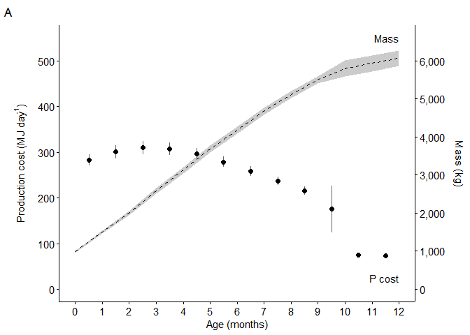<!-- -->

#### Juveniles and Adults

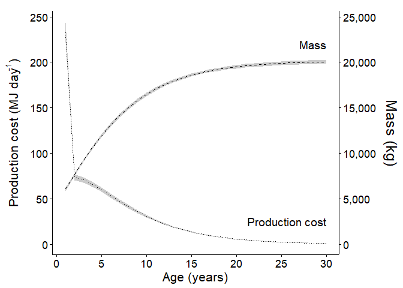<!-- -->

### Total Energetic Expenditure (*Es*)

#### Grey whale calves

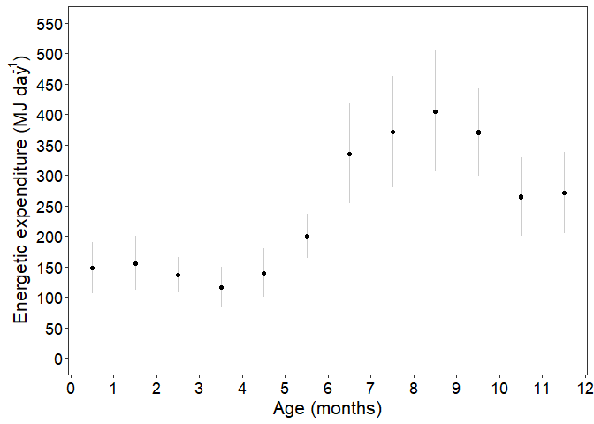<!-- -->

Figure 4. Estimates of daily energetic expenditure from activity (MJ
day-1) for each month in the first year (Phase 1). Error bars
indicate SD. Note: Es values for the 6th and 12th months represent
energetic expenditures across two activity stages.

#### Grey whale juveniles and adults, including pregnant and lactating females

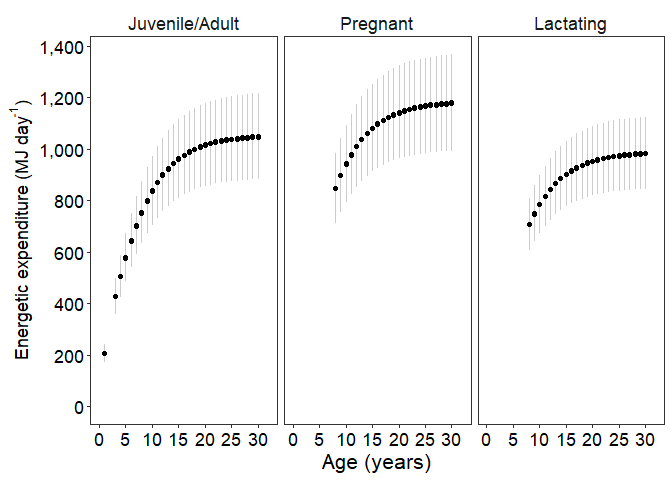<!-- -->

Figure 5. Estimates of annual total energetic expenditure from activity
(MJ) for juveniles and single adults, pregnant and lactating females.
Error bars represent SD.

### Gross Energy Requirements

#### Grey whale calves

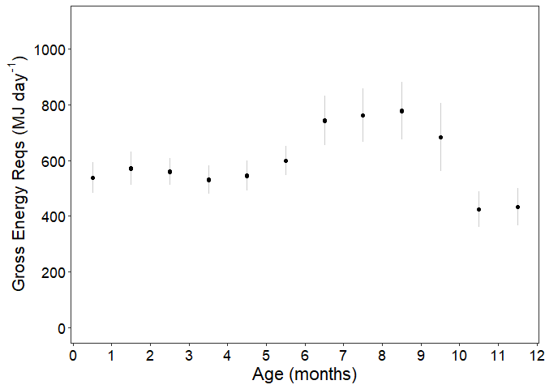<!-- -->

Figure 6. Daily Gross Energy Requirements (GER) for calves in the first
year in MJ day-1. Error bars represent SD.

#### Grey whale juveniles / adults

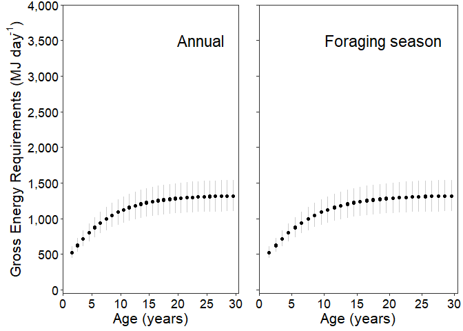<!-- -->

Figure 7. Daily gross energy requirements over the year compared to
gross daily requirements when foraging is limited to the summer season.
Foraging season spans ~154 days for juveniles and adults.

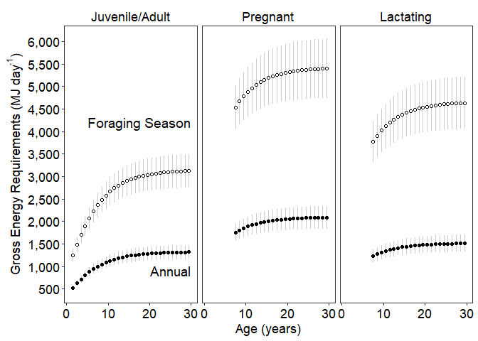<!-- -->

Figure 8. Estimates for gross energy requirements for pregnant,
lactating females, and others (juvenile and other adult grey whales).
Daily gross energy requirements for a full year (annual) are represented
with black circles. White circles represent daily gross energy
requirements for when feeding is limited during the foraging season.
Foraging season is assumed to be ~154 days for single juveniles (1-7 y)
and adults (\> 8 y), ~153 days for pregnant females, and ~119 days for
lactating females. Error bars represent SD.

### Milk / Food Requirements

#### Grey whale calves

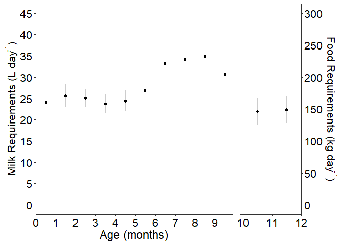<!-- -->

Figure 9. Daily milk requirements for calves. The left panel represents
milk requirements (L day-1) for calves up to 9 months (left
panel), and the right panel represents food requirements (kg of benthic
invertebrate prey day-1) for weaned calves over 9 months.

#### Grey whale juveniles and adults, including pregnant and lactating

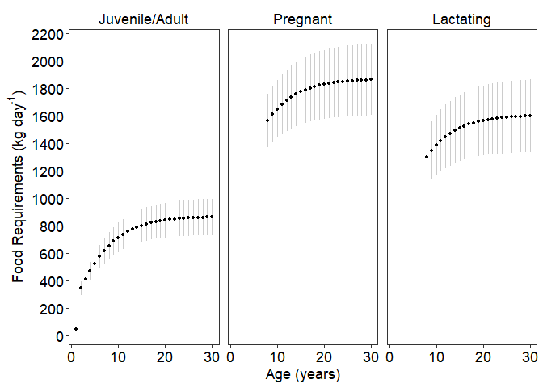<!-- -->

Figure 10. Food requirements (kg day-1) of benthic invertebrate prey for
pregnant females, lactating females, and others (juveniles and other
adult grey whales) during foraging season. Foraging season is assumed to
be ~154 days for single juveniles (1-7 y) and adults (\> 8 y), ~153 days
for pregnant females, and ~119 days for lactating females. Error bars
represent SD.

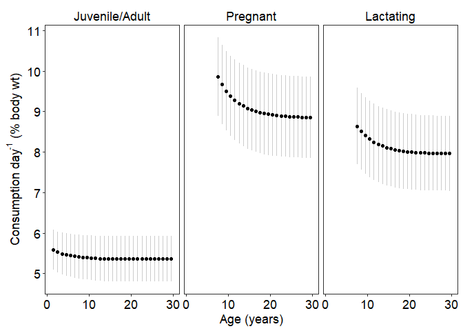<!-- -->

Figure 11. Percentage of body weight consumed day-1 during the foraging
season for juveniles and other adults, pregnant females, and lactating
females. Foraging season is assumed to be ~154 days for single juveniles
(1-7 y) and adults (\> 8 y), ~153 days for pregnant females, and ~119
days for lactating females. Note that the y-axis does not start at 0.
Error bars represent SD.

## Sensitivity Analyses

The sensitivity analyses show that the variable contributing the highest
range of uncertainty (±SD) to the gross energy requirements is
*Es* or total energetic expenditure (Figure 12), and that the
variable contributing the highest range of uncertainty within the Es
calculations is *%O2* or the percentage of oxygen absorbed
(Figure 13). The pattern holds for Phase 2, pregnant, and lactating life
stages, even when additional parameters are examined for the pregnant
and lactating stages (see Appendix D).

### Gross Energy Requirements (*GER*)

#### Grey whale calves

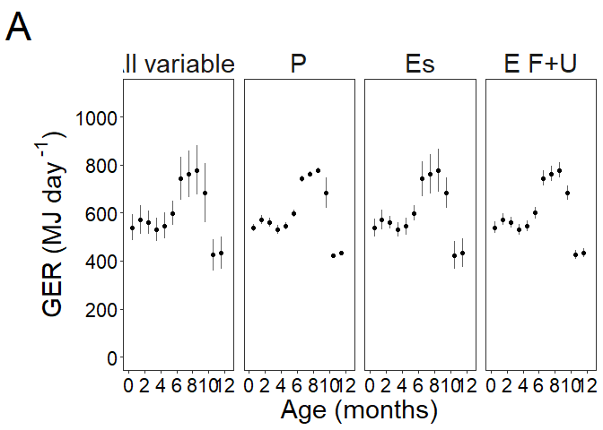<!-- -->

Figure 14. Results for the sensitivity analysis on gross energy
requirements (*GER*) for grey whale calves.

#### Grey whale juveniles / adults

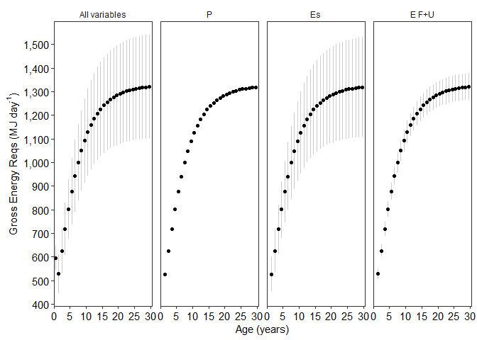<!-- -->

Figure 15. Results for the sensitivity analysis on gross energy
requirements (*GER*) for juveniles and non-reproductive adults.

#### Pregnant grey whales

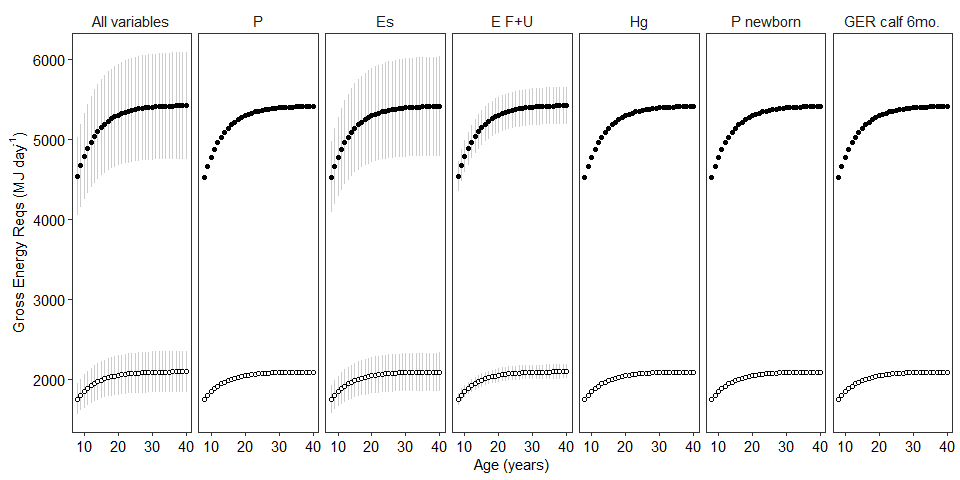<!-- -->

Figure 16. Results for the sensitivity analysis on gross energy
requirements (*GER*) for pregnant females. GER calf represents the
energy required for the first 6 months.

#### Lactating grey whales

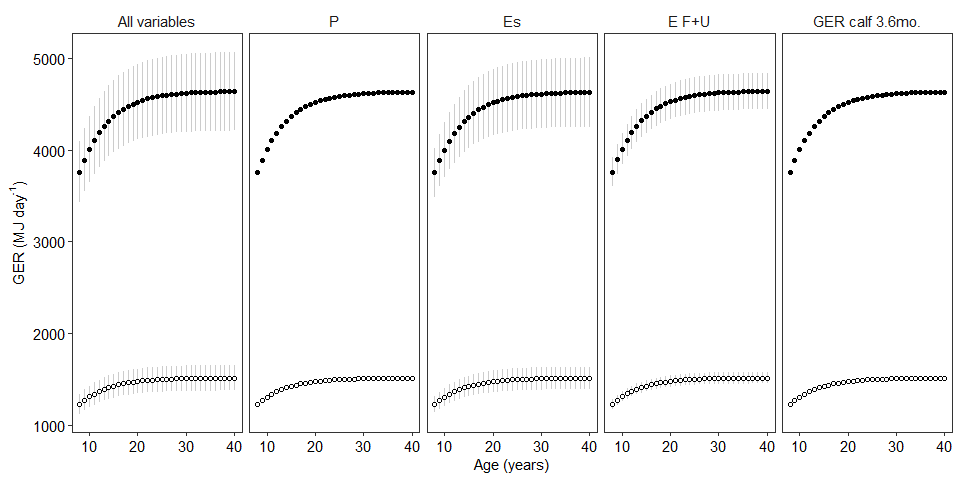<!-- -->

Figure 17. Results for the sensitivity analysis on gross energy
requirements (*GER*) for lactating females. GER calf represents the
energy required for the last 3.6 months of nursing while mother and calf
are in the foraging grounds.

### Total energetic expenditure (*Es*)

#### Grey whale calves

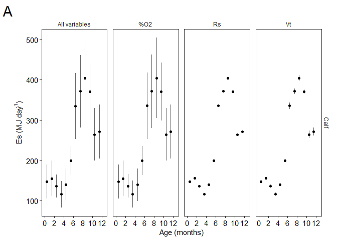<!-- -->

Figure 18. Results for the sensitivity analysis on total energetic
expenditure (*Es*) for grey whale calves.

#### Grey whale juveniles and adults, including pregnant and lactating females

<!-- -->

Figure 19. Results for the sensitivity analysis on *Es*
(total energetic expenditure) for Juvenile and adult grey whales,
including pregnant and lactating females.

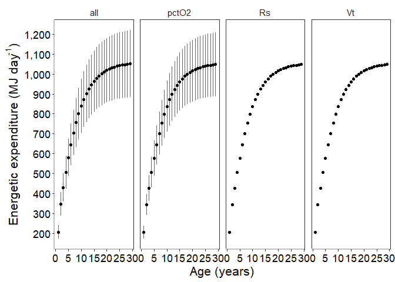<!-- -->

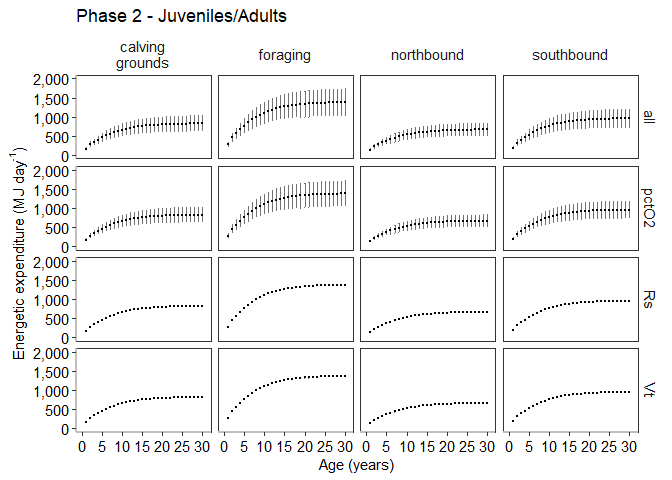<!-- -->

Es for all life stages including pregnant and lactating

    ## Error in `vroom::vroom()`:
    ## ! `file` is not one of the supported inputs:
    ## • A filepath or character vector of filepaths
    ## • A connection or list of connections
    ## • Literal or raw input

<!-- -->

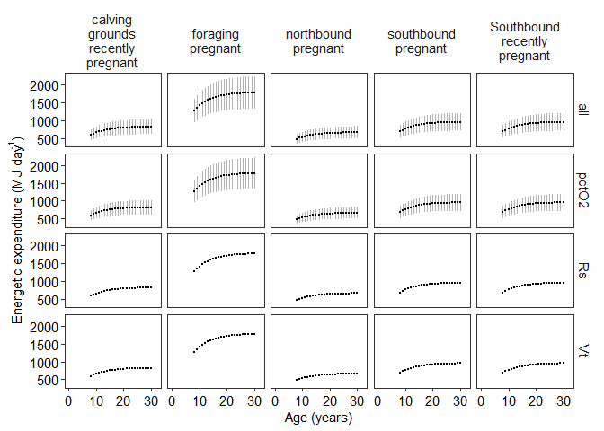<!-- -->

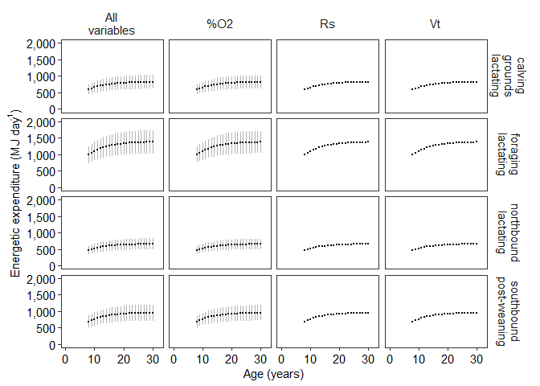<!-- -->
