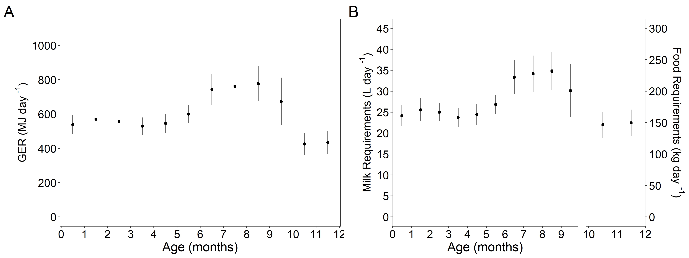
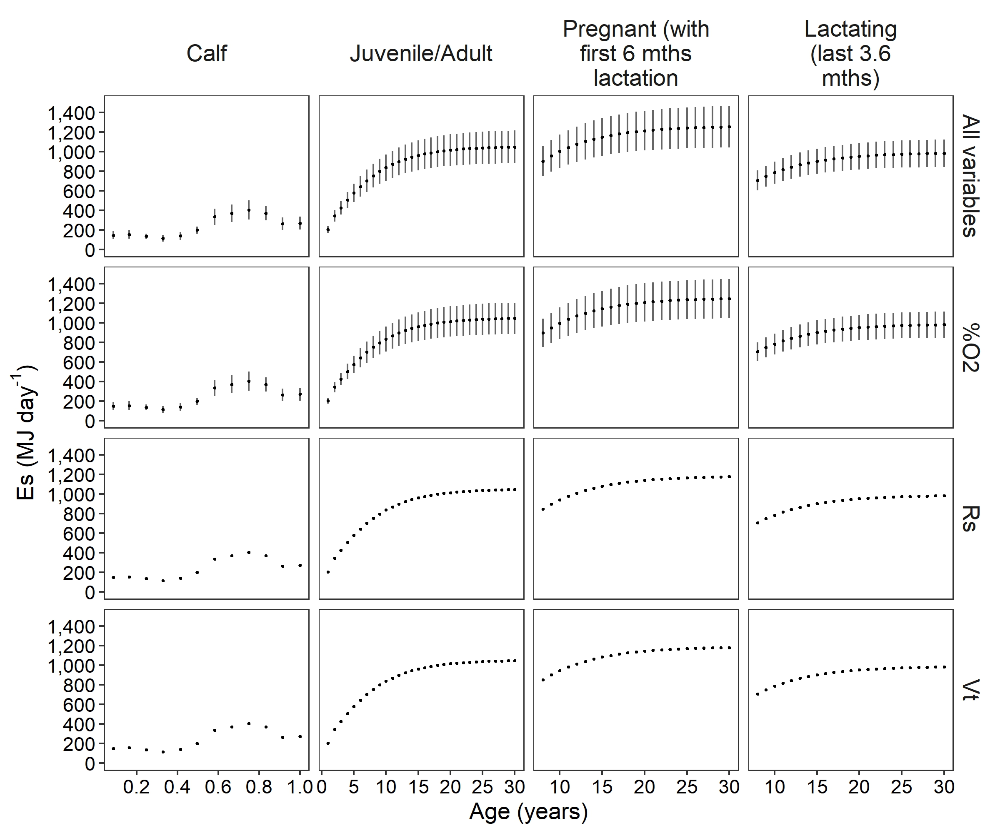

ENERGY REQUIREMENTS OF GREY WHALES
================
Selina Agbayani
10 August, 2025

## GRAY WHALE LIFE CYCLE

Figure 1. Gray whale life cycle, showing the approximate times of year
for different stages in the migration pattern over two years. Panel A
shows the migration for males and non-reproductive females, including
weaned juveniles. Panel B shows the approximate 2-year cycle for
pregnant and lactating females, including nursing calves. These charts
highlight the differences in migration timing between the mother/calf
pairs and other whales. Estimates and associated sources for number of
days in each activity life stage are listed in Table S1 in Suppl.
Materials. Adapted from Villegas-Amtmann et al. (2015).

## RESULTS

### Mass and Production cost (P)

Figure 2. A) Production cost per day and mass growth curves for calves.
B) Production cost per day and mass growth curves for juveniles and
adult gray whales. Average production cost (MJ) per day on the primary
axis, represented as a dotted line, and total mass (kg) shown on the
secondary axis, as modelled by Agbayani et al. (2020) represented as a
dashed line. Gray shading represents the standard deviation (±SD) around
the mean from 10,000 Monte Carlo estimates.

### Total Energetic Expenditure (*Es*)

Figure 3. Estimates of average daily energetic expenditure (Es) from
activity (MJ day-1) for each month in the first year (Phase 1). calves
per month (Phase 1), and for juveniles and single adults (Phase 2),
pregnant, and lactating females per year. Values are plotted at the
midpoint of each month. Error bars show the standard deviation around
the mean of 10,000 Monte Carlo simulations. Note: Energetic expenditure
Es values for the 6th and 10th months represent energetic expenditures
across two activity stages.

### Gross Energy Requirements and Food Requirements

#### Grey whale calves

Figure 4. A) Daily average gross energy requirements for calves in the
first year in MJ day-1. B) Average daily milk and food requirements for
calves for each month in their first year. The left panel represents
milk requirements (L day-1) for calves up to 9 months (left panel), and
the right panel represents food requirements (kg of benthic invertebrate
prey day-1) for weaned calves over 9 months. All values are plotted at
the midpoint of each month. Error bars show the standard deviation
around the mean of 10,000 Monte Carlo simulations.

## Juveniles/Adults, Pregnant, Lactating

 Figure 5. A)
Daily gross energy requirements for a full year (annual; black circles)
and for when feeding is limited to the foraging season (white circles).
B) Average daily food requirements (kg day-1) of benthic invertebrate
prey for pregnant females, lactating females, and others (juveniles and
other adult gray whales) during foraging season. C) Average percentage
of body weight consumed per day during the foraging season for juveniles
and other adults, pregnant females, and lactating females. Note that the
y-axis does not always start at 0. Panels from left to right represent
single juveniles (1–7 y) and adults (\>8 y), pregnant whales for the
duration of the pregnancy, lactating whales for the duration of nursing
from birth to weaning at 9.6 months (per Agbayani et al., 2020),
pregnant whales for the duration of the pregnancy (with the first 6
months of lactation while fasting), and lactating whales in the last 3.6
months of lactation while foraging in the Arctic feeding grounds. To
calculate daily gross energy requirements on an annual basis for single
juveniles (1–7 y) and adults (\>8 y) the gross energy requirement was
assumed to be borne over 365 days and for the foraging season it was
assumed to be ~154 days. For pregnant females the annual gross energy
requirement was calculated over ~396 days and foraging season was
assumed to be ~153 days. For lactating females the annual gross energy
requirement was calculated over 293 days and foraging season was assumed
to be ~119 days. Values are plotted at the midpoint of each year. Error
bars show the standard deviation around the mean of 10,000 Monte Carlo
simulations.

## Sensitivity Analyses

The sensitivity analyses show that the variable contributing the highest
range of uncertainty (±SD) to the gross energy requirements is
*Es* or total energetic expenditure (Figure 12), and that the
variable contributing the highest range of uncertainty within the Es
calculations is *%O2* or the percentage of oxygen absorbed
(Figure 13). The pattern holds for Phase 2, pregnant, and lactating life
stages, even when additional parameters are examined for the pregnant
and lactating stages (see Appendix D).

### Gross Energy Requirements (*GER*)

Figure 6. Results from the sensitivity analysis of the gross energy
requirements (GER). A) Calves (Phase 1), B) juveniles/adults (phase 2),
C) pregnant whales (including first 6 months of lactation), and D)
lactating whales (last 3.6 months). Not shown are the pregnant only and
lactating (from birth to 9.6 months) because the pattern for the range
of uncertainty for these are similar to those shown in C) and D), except
where pregnant only would not have a variable for GER of a calf,
lactating (from birth to 9.6 months) would have a variable for GER of a
calf from birth to 9.6 months that has a negligible contribution to
range of uncertainty.

### Total energetic expenditure (*Es*)

#### Grey whale calves

<!-- -->

<!-- -->

Figure 18. Results for the sensitivity analysis on total energetic
expenditure (*Es*) for grey whale calves.

#### Grey whale juveniles and adults, including pregnant and lactating females

<!-- --><!-- --><!-- -->

Figure 19. Results for the sensitivity analysis on *Es*
(total energetic expenditure) for Juvenile and adult grey whales,
including pregnant and lactating females.

<!-- -->

<!-- --><!-- -->

**Es for all adult life stages including pregnant and lactating**

<!-- -->

**Sensitivity analysis for Es (all life stages)**

Figure 7. Sensitivity analysis for Es (mean daily energetic expenditure)
in MJ day-1 for calves (Phase 1), juveniles/adults (Phase 2), pregnant
(with first 6 months of lactation), and lactating whales (last 3.6
months of lactation). The patterns for range of uncertainty for pregnant
only and lactating (from birth to 9.6 months) are similar to pregnant
(with first 6 months of lactation) and lactating (last 3.6. months) and
are not shown. %O2 contributed the highest range of uncertainty across
all life stages.

**Es sensitivity analysis for pregnant whales by activity stages**

<!-- -->

**Es sensitivity analysis for lactating whales by activity stages**

<!-- -->
